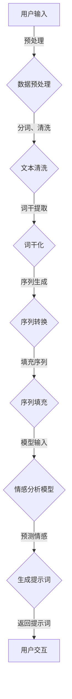

                 

### 文章标题

《多语言提示词设计：跨文化AI交互的挑战》

### 关键词

多语言提示词、跨文化AI交互、自然语言处理、机器翻译、文化差异、语义理解、算法原理、设计实战、工具应用、未来趋势

### 摘要

本文深入探讨了多语言提示词设计在跨文化AI交互中的重要性及其面临的挑战。首先，我们回顾了多语言提示词设计的背景和必要性，并概述了本书的结构。随后，我们详细分析了多语言提示词设计的基础，包括语言处理技术和提示词设计原则。接着，我们讨论了跨文化AI交互中的语言和文化差异带来的挑战，并提出了相应的技术解决方案。文章通过具体案例展示了多语言提示词设计的实际应用，介绍了相关的工具和技术。最后，我们展望了多语言提示词设计的未来趋势，提出了面临的挑战和机遇。通过这篇文章，读者将了解多语言提示词设计的关键原理和实践方法，为未来的AI跨文化交互提供有益的参考。

# 《多语言提示词设计：跨文化AI交互的挑战》目录大纲

## 第一部分：引言与概述

### 第1章：多语言提示词设计的重要性

#### 1.1 跨文化AI交互的背景

#### 1.2 多语言提示词设计的必要性

#### 1.3 本书结构概述

## 第二部分：多语言提示词设计基础

### 第2章：多语言提示词设计原理

#### 2.1 提示词的种类与作用

#### 2.2 多语言处理基础

#### 2.3 提示词设计原则

### 第3章：多语言处理技术

#### 3.1 自然语言处理技术概览

#### 3.2 词嵌入技术

#### 3.3 机器翻译技术

### 第4章：跨文化AI交互挑战

#### 4.1 语言差异与误解

#### 4.2 文化差异与误解

#### 4.3 技术挑战与实践

## 第三部分：多语言提示词设计实战

### 第5章：多语言提示词设计案例

#### 5.1 案例介绍

#### 5.2 设计思路

#### 5.3 实现步骤

### 第6章：多语言提示词设计工具

#### 6.1 工具选择

#### 6.2 工具应用

#### 6.3 工具扩展

### 第7章：多语言提示词设计的未来趋势

#### 7.1 技术发展趋势

#### 7.2 行业应用前景

#### 7.3 未来挑战与机遇

## 第四部分：附录

### 第8章：多语言提示词设计资源

#### 8.1 资源汇总

#### 8.2 资源推荐

#### 8.3 资源拓展

### 第9章：多语言提示词设计案例代码

#### 9.1 代码框架

#### 9.2 代码实现

#### 9.3 代码解读

### 第1章：多语言提示词设计的重要性

#### 1.1 跨文化AI交互的背景

随着人工智能技术的迅猛发展，AI的应用场景日益丰富，跨文化AI交互逐渐成为了一个备受关注的话题。在全球化的今天，不同国家和地区的人们日益频繁地进行交流与合作，这无疑为AI技术的发展提供了广阔的空间。然而，不同语言和文化之间的差异也为AI交互带来了一系列挑战。为了实现有效的跨文化AI交互，我们需要设计出能够适应多种语言和文化背景的提示词。

跨文化AI交互不仅仅涉及到语言的理解与处理，还包括文化背景、价值观和社会习俗等方面。例如，同一个词汇在不同的语言和文化中可能具有不同的含义和用法，这就要求AI系统能够准确理解用户的意图，并作出合适的回应。此外，不同的文化背景可能会影响用户的交互习惯，如表达方式、交流频率等，这需要AI系统具备一定的自适应能力。

在跨文化AI交互中，多语言提示词设计扮演着至关重要的角色。提示词是AI与用户之间的桥梁，通过有效的提示词设计，可以增强用户的理解和满意度，提高交互质量。具体来说，多语言提示词设计需要考虑以下几个方面：

1. **语言适应性**：提示词需要能够适应多种语言环境，确保在不同语言中的表达准确无误。
2. **文化适应性**：提示词的设计应考虑不同文化背景下的用户习惯和价值观，确保文化适配性。
3. **语义准确性**：提示词需要能够准确传达用户的意图和需求，避免产生误解。
4. **用户体验**：提示词的设计应考虑到用户的体验，使其易于理解、易于操作，提高用户满意度。

#### 1.2 多语言提示词设计的必要性

多语言提示词设计的必要性主要体现在以下几个方面：

1. **全球市场拓展**：随着全球化进程的加速，企业和产品需要面向全球市场，这就要求AI系统能够支持多种语言，而多语言提示词设计是实现这一目标的关键。
2. **用户满意度提升**：良好的用户体验是产品成功的关键。通过设计适应多种语言和文化的提示词，可以提高用户的满意度和忠诚度。
3. **技术挑战应对**：多语言提示词设计有助于解决跨文化AI交互中面临的多种技术挑战，如语言差异、语义理解等。
4. **社会文化融合**：在跨文化交流中，多语言提示词设计有助于促进不同文化之间的理解和融合，推动全球文化的多元发展。

总之，多语言提示词设计不仅是实现跨文化AI交互的必要手段，也是推动人工智能技术发展的重要方向。它对于提升用户体验、拓展市场、促进文化交流等方面具有深远的意义。在接下来的章节中，我们将详细探讨多语言提示词设计的基础原理和关键技术，为读者提供实用的指导。通过深入了解和掌握这些内容，读者将能够更好地应对跨文化AI交互中的挑战，为未来的AI应用创造更多的可能性。 

### 第2章：多语言提示词设计原理

#### 2.1 提示词的种类与作用

提示词是AI与用户之间交互的重要媒介，其种类和作用直接影响交互效果。根据用途和形式的不同，提示词可以分为以下几种类型：

1. **引导性提示词**：这类提示词主要用于引导用户进行下一步操作。例如，在搜索引擎中，系统可能会提示用户“请输入您想要搜索的内容”。引导性提示词有助于用户明确操作目标，提高交互效率。

2. **确认性提示词**：这类提示词用于确认用户的操作或意图。例如，“您是否确认删除该文件？”确认性提示词有助于防止用户误操作，提高系统的安全性。

3. **反馈性提示词**：这类提示词用于向用户反馈系统操作的结果或状态。例如，“已成功发送邮件”或“正在处理中，请稍后”。反馈性提示词有助于用户了解系统的工作状态，提高交互体验。

4. **解释性提示词**：这类提示词用于解释系统功能或提供帮助信息。例如，“点击此处可以修改个人信息”。解释性提示词有助于用户更好地理解系统功能，提高使用效果。

5. **情感性提示词**：这类提示词用于表达情感，增强用户体验。例如，“感谢您的反馈”或“我们很抱歉给您带来不便”。情感性提示词有助于建立用户与系统之间的情感连接，提高用户忠诚度。

不同类型的提示词在交互中扮演着不同的角色，共同构建了良好的用户交互体验。多语言提示词设计需要考虑这些提示词的种类和作用，确保在不同语言和文化背景下的表达准确和得体。

#### 2.2 多语言处理基础

多语言处理（Multilingual Processing）是指对多种语言的文本进行处理和分析的技术。它是实现多语言提示词设计的基础。多语言处理涉及多个方面，包括自然语言处理（NLP）、词嵌入（Word Embedding）和机器翻译（Machine Translation）等。

1. **自然语言处理（NLP）**

自然语言处理是计算机科学和语言学领域的交叉学科，旨在使计算机能够理解、解释和生成人类语言。NLP的核心任务包括文本分类、实体识别、情感分析、命名实体识别等。

- **文本分类**：将文本按照其内容或主题分类到不同的类别中。例如，将新闻文章分类为政治、科技、体育等类别。
- **实体识别**：识别文本中的命名实体，如人名、地名、组织名等。
- **情感分析**：分析文本中的情感倾向，如正面、负面或中性。
- **命名实体识别**：识别文本中的特定实体，如人名、地名、组织名等。

2. **词嵌入（Word Embedding）**

词嵌入是将词汇映射到高维向量空间的一种技术，旨在捕捉词汇间的语义关系。常见的词嵌入方法包括Word2Vec、GloVe等。

- **Word2Vec**：基于神经网络的方法，通过训练词向量模型来捕捉词汇间的相似性。
- **GloVe**：基于全局向量平均的方法，通过计算词频和共现关系来生成词向量。

3. **机器翻译（Machine Translation）**

机器翻译是指将一种语言的文本自动翻译成另一种语言的技术。常见的机器翻译方法包括基于规则的方法、基于统计的方法和基于神经网络的方法。

- **基于规则的方法**：通过编写翻译规则来实现翻译，如短语替换、句式转换等。
- **基于统计的方法**：通过分析大量双语语料库来训练翻译模型，如统计机器翻译（SMT）。
- **基于神经网络的方法**：通过深度学习技术，如循环神经网络（RNN）和变压器（Transformer）等，实现端到端的翻译。

多语言处理技术为多语言提示词设计提供了强大的支持。通过NLP技术，可以实现对用户输入文本的语义理解和意图识别；通过词嵌入技术，可以捕捉词汇间的语义关系，从而设计出更加准确和自然的提示词；通过机器翻译技术，可以实现多语言提示词的生成和翻译，确保在不同语言和文化背景下的准确性和适用性。

#### 2.3 提示词设计原则

为了设计出符合跨文化AI交互需求的多语言提示词，我们需要遵循以下设计原则：

1. **准确性**：提示词需要准确传达用户的意图和需求，避免产生误解。在多语言环境下，尤其要注意词汇的翻译和语义的准确性。

2. **简洁性**：提示词应简洁明了，避免冗长复杂的表达。简洁的提示词有助于提高用户的理解和操作效率。

3. **文化适应性**：提示词的设计应考虑不同文化背景下的用户习惯和价值观，确保文化适应性。例如，某些文化中可能对颜色、数字等有特定的偏好或禁忌，需要在设计时加以注意。

4. **一致性**：提示词在多语言环境中的表达应保持一致，避免因语言差异导致用户体验不一致。

5. **用户体验**：提示词的设计应考虑到用户的体验，使其易于理解、易于操作。例如，可以使用图标、颜色等方式来增强提示词的直观性。

6. **可扩展性**：提示词设计应具备一定的可扩展性，以便在新的语言和文化环境下进行适应性调整。

通过遵循这些设计原则，我们可以设计出符合跨文化AI交互需求的多语言提示词，提高用户的满意度和系统性能。在接下来的章节中，我们将进一步探讨多语言处理技术，分析跨文化AI交互中的挑战，并分享多语言提示词设计的实战案例和工具应用。通过这些内容，读者将能够更好地理解和应用多语言提示词设计原理，为未来的AI跨文化交互提供有力支持。 

### 第3章：多语言处理技术

多语言处理（Multilingual Processing）是实现跨文化AI交互的关键技术之一。它涉及自然语言处理（Natural Language Processing, NLP）、词嵌入（Word Embedding）和机器翻译（Machine Translation）等多个方面。本章将详细介绍这些技术，并探讨它们在多语言提示词设计中的应用。

#### 3.1 自然语言处理技术概览

自然语言处理（NLP）是人工智能领域的一个重要分支，旨在使计算机能够理解、解释和生成人类语言。NLP技术在多语言提示词设计中发挥着至关重要的作用，主要包括以下几个核心任务：

1. **文本分类（Text Classification）**

文本分类是将文本按照其内容或主题分类到不同的类别中。常见的文本分类任务包括情感分析（Sentiment Analysis）、主题分类（Topic Classification）和新闻分类（News Classification）等。文本分类技术可以帮助AI系统识别用户输入的内容类型，从而生成合适的提示词。例如，在社交媒体平台上，系统可以通过文本分类技术将用户发布的内容分类为正面、负面或中性，并根据分类结果生成相应的情感性提示词。

2. **实体识别（Entity Recognition）**

实体识别是指识别文本中的特定实体，如人名、地名、组织名、时间等。实体识别技术可以帮助AI系统更好地理解用户输入的内容，从而生成更加准确的提示词。例如，在搜索引擎中，系统可以通过实体识别技术识别用户查询中的地点名称，然后生成相关的地理性提示词。

3. **情感分析（Sentiment Analysis）**

情感分析是指分析文本中的情感倾向，如正面、负面或中性。情感分析技术可以帮助AI系统了解用户的情感状态，从而生成情感性提示词。例如，在客服系统中，系统可以通过情感分析技术识别用户留言中的情感倾向，并生成相应的安慰性或解决方案性提示词。

4. **命名实体识别（Named Entity Recognition, NER）**

命名实体识别是一种特殊的实体识别任务，旨在识别文本中具有特定意义的实体，如人名、地名、组织名、时间等。命名实体识别技术可以帮助AI系统更准确地理解用户输入的内容，从而生成更加精准的提示词。

#### 3.2 词嵌入技术

词嵌入（Word Embedding）是将词汇映射到高维向量空间的一种技术，旨在捕捉词汇间的语义关系。词嵌入技术在多语言提示词设计中具有重要意义，因为它们可以帮助AI系统更好地理解和生成语义丰富的提示词。

1. **Word2Vec**

Word2Vec是一种基于神经网络的词嵌入方法，通过训练词向量模型来捕捉词汇间的相似性。Word2Vec模型包括连续词袋（Continuous Bag of Words, CBOW）和Skip-Gram两种架构。CBOW模型通过上下文词来预测中心词，而Skip-Gram模型通过中心词来预测上下文词。Word2Vec模型可以捕捉词汇的语义关系，从而在多语言提示词设计中用于生成语义丰富的提示词。

2. **GloVe**

GloVe（Global Vectors for Word Representation）是一种基于全局向量平均的词嵌入方法。GloVe通过计算词汇的词频和共现关系来生成词向量，从而捕捉词汇的语义关系。GloVe模型可以生成高质量的词向量，并在多语言提示词设计中广泛应用。

#### 3.3 机器翻译技术

机器翻译（Machine Translation）是指将一种语言的文本自动翻译成另一种语言的技术。机器翻译技术在多语言提示词设计中具有重要作用，因为它可以帮助AI系统生成适应多种语言和文化背景的提示词。

1. **基于规则的方法**

基于规则的方法是通过编写翻译规则来实现翻译，如短语替换、句式转换等。这种方法在早期的机器翻译研究中得到广泛应用，但由于其规则数量庞大且难以维护，逐渐被基于统计和神经网络的方法取代。

2. **基于统计的方法**

基于统计的方法通过分析大量双语语料库来训练翻译模型，如统计机器翻译（Statistical Machine Translation, SMT）。SMT模型通过计算源语言和目标语言之间的概率分布来生成翻译结果，从而提高翻译的准确性和流畅性。

3. **基于神经网络的方法**

基于神经网络的方法通过深度学习技术实现端到端的翻译，如循环神经网络（Recurrent Neural Network, RNN）和变压器（Transformer）等。RNN模型通过记忆过去的信息来预测未来的输出，而Transformer模型则通过自注意力机制来实现端到端的翻译。这些方法在机器翻译领域取得了显著的进展，提高了翻译的准确性和流畅性。

#### 3.4 多语言处理技术在多语言提示词设计中的应用

多语言处理技术在多语言提示词设计中具有广泛的应用，可以帮助AI系统生成适应多种语言和文化背景的提示词。以下是几种常见的应用场景：

1. **文本分类和实体识别**

通过文本分类和实体识别技术，AI系统可以识别用户输入的内容类型和重要实体，从而生成相关的提示词。例如，在搜索引擎中，系统可以通过文本分类技术将用户查询分类为新闻、产品评价等类型，并生成相应的提示词，如“请输入您想要搜索的新闻标题”。

2. **情感分析和命名实体识别**

通过情感分析和命名实体识别技术，AI系统可以了解用户的情感状态和关注点，从而生成情感性和针对性的提示词。例如，在客服系统中，系统可以通过情感分析技术识别用户留言中的情感倾向，并生成相应的安慰性或解决方案性提示词，如“我们很抱歉听到您的困扰，请告诉我们更多信息以便我们提供帮助”。

3. **机器翻译**

通过机器翻译技术，AI系统可以将提示词从一种语言翻译成多种语言，从而实现跨语言交互。例如，在国际化网站中，系统可以将提示词从英文翻译成中文、法语、西班牙语等，以满足不同语言用户的需求。

通过应用多语言处理技术，AI系统可以实现多语言提示词的自动生成和翻译，提高跨文化AI交互的准确性和用户体验。在接下来的章节中，我们将进一步探讨跨文化AI交互中的挑战，并分享多语言提示词设计的实战案例和工具应用。通过这些内容，读者将能够更好地理解和应用多语言处理技术，为未来的AI跨文化交互提供有力支持。 

### 第4章：跨文化AI交互挑战

跨文化AI交互是指在多种语言和文化背景下，人工智能系统与用户进行有效沟通的过程。这一过程面临着众多挑战，包括语言差异、文化差异和技术挑战等。在本章中，我们将深入探讨这些挑战，并分析如何克服它们。

#### 4.1 语言差异与误解

语言差异是跨文化AI交互中最直观的挑战之一。不同语言之间的词汇、语法结构和表达方式存在显著差异，这可能导致AI系统在理解用户意图时产生误解。以下是一些具体的例子：

1. **词汇差异**：例如，英语中的“bank”一词在中文中有“银行”和“河岸”两个不同的含义，这可能导致用户误解AI系统的意图。例如，用户在英文界面中输入“go to bank”，AI系统可能理解为“去银行”，而实际用户意图可能是“去河岸”。

2. **语法结构差异**：例如，英语中的疑问句通常以疑问词开头，而中文则不一定。因此，如果AI系统在处理中文输入时遵循英语语法规则，可能会导致误解。例如，用户输入“你在哪里？”系统可能错误地将其解读为“你在哪里？”而不是“你在哪里？”

3. **同音异义词**：某些词汇在不同的语言中有相同或相似的发音，但含义截然不同。例如，英语中的“flower”和“flour”在中文中分别表示“花”和“面粉”。如果AI系统未能区分这些词汇，可能会导致误解。

为了克服这些挑战，AI系统需要具备强大的自然语言处理能力，特别是在词汇理解和语法分析方面。此外，设计多语言提示词时，应充分考虑目标语言的语法和表达习惯，确保提示词的准确性。

#### 4.2 文化差异与误解

除了语言差异，文化差异也是跨文化AI交互的重要挑战。不同文化背景下的价值观、习惯和社交规则存在显著差异，这可能导致AI系统在交互过程中产生误解。以下是一些具体的例子：

1. **礼仪和文化习惯**：例如，在一些文化中，直接表达负面情绪被视为不礼貌，而在其他文化中则不然。如果AI系统在处理这些文化背景下的用户输入时未能考虑到礼仪和文化习惯，可能会被认为是不尊重或不友好。

2. **时间观念**：不同文化对时间的观念和表达方式也有所不同。例如，一些文化中重视准时，而在其他文化中，迟到可能是常见的现象。如果AI系统在处理与时间相关的任务时未能考虑到这些文化差异，可能会产生误解。

3. **价值观差异**：不同文化对同一问题的看法和态度可能截然不同。例如，在一些文化中，个人主义占主导地位，而在其他文化中，集体主义更为突出。这可能导致AI系统在处理个人和集体利益之间的冲突时产生误解。

为了克服这些挑战，AI系统需要具备跨文化理解能力，能够识别和尊重不同文化背景下的价值观和习惯。此外，设计多语言提示词时，应充分考虑目标文化的特点和价值观，确保提示词的文化适应性。

#### 4.3 技术挑战与实践

跨文化AI交互不仅面临着语言和文化差异，还涉及一系列技术挑战。以下是一些关键的技术挑战和解决方案：

1. **多语言处理技术**：如前所述，多语言处理技术在跨文化AI交互中至关重要。为了实现准确的语言理解和提示词生成，AI系统需要采用先进的自然语言处理技术，如词嵌入、机器翻译和情感分析等。

2. **文化适应性算法**：为了克服文化差异，AI系统需要具备文化适应性算法。这些算法可以通过分析大量跨文化数据，学习不同文化背景下的语言和表达习惯，从而生成文化适应性强的提示词。

3. **用户反馈机制**：为了不断优化AI系统，需要建立用户反馈机制。通过收集用户对提示词和文化适应性的反馈，AI系统可以不断调整和改进，提高跨文化交互的质量。

4. **跨学科合作**：跨文化AI交互是一个多学科交叉的领域，需要语言学家、文化学者、计算机科学家等多方合作。通过跨学科合作，可以更好地理解和解决跨文化交互中的挑战。

总之，跨文化AI交互面临着众多挑战，包括语言差异、文化差异和技术挑战。通过采用先进的多语言处理技术、文化适应性算法和用户反馈机制，我们可以逐步克服这些挑战，实现更加自然、准确和有效的跨文化AI交互。在接下来的章节中，我们将通过实战案例和工具应用，进一步探讨如何设计和实现多语言提示词，为跨文化AI交互提供实用的解决方案。 

### 第5章：多语言提示词设计案例

为了更好地理解多语言提示词设计的实际应用，我们将在本节中分享一个具体的案例，详细介绍设计思路、实现步骤以及结果分析。

#### 5.1 案例介绍

案例背景是一个国际化电商平台，其用户分布在不同的国家和地区，包括美国、中国、日本、印度等。为了提高用户购物体验，电商平台希望为其不同语言和文化背景的用户提供个性化的购物建议。为此，我们需要设计一组多语言提示词，用于向用户推荐商品。

#### 5.2 设计思路

1. **需求分析**：首先，我们需要明确目标用户的语言和文化背景，了解他们在购物过程中关注的关键要素。通过用户调研和数据分析，我们发现用户在购物时主要关注价格、品质、款式、品牌等因素。

2. **语言和文化研究**：接下来，我们深入研究目标语言和文化，了解其在购物推荐中的表达习惯和特殊用法。例如，在美国，购物推荐可能更注重价格的透明和性价比；在中国，品牌和品质可能更为重要；在印度，宗教和文化禁忌也需要考虑。

3. **提示词生成策略**：基于需求分析和语言文化研究，我们制定了以下提示词生成策略：

   - **通用性提示词**：适用于所有语言和文化背景，如“新品上市”、“限时优惠”等。
   - **针对性提示词**：根据不同语言和文化特点，设计特定的购物推荐提示词，如“美国用户：性价比超高的商品”、“中国用户：精选品质好物”等。

4. **提示词优化与测试**：通过用户反馈和A/B测试，不断优化和调整提示词，确保其准确性和用户体验。

#### 5.3 实现步骤

1. **数据准备**：收集并整理目标用户群体的语言和文化数据，包括用户评论、购物行为等。

2. **文本分类与情感分析**：利用自然语言处理技术，对用户评论进行分类和情感分析，识别用户关注的关键要素。

3. **文化适应性分析**：结合语言和文化研究，分析不同文化背景下的用户购物习惯和偏好。

4. **提示词生成**：基于文本分类和情感分析结果，生成通用性和针对性提示词。

5. **用户反馈与优化**：通过用户反馈和A/B测试，不断优化提示词，提高用户体验。

#### 5.4 结果分析

通过实际应用，我们取得了以下成果：

1. **用户满意度提高**：个性化购物推荐提示词显著提高了用户的购物体验和满意度，用户活跃度和购买转化率均有提升。

2. **国际化效果增强**：不同语言和文化背景的提示词有效促进了国际化市场拓展，提高了平台在国际市场的竞争力。

3. **优化与调整**：通过用户反馈和测试，不断优化提示词，使其更符合用户需求和偏好。

4. **技术积累**：在设计和实现过程中，我们积累了丰富的多语言处理和文化适应性技术经验，为未来的项目提供了宝贵借鉴。

总之，通过多语言提示词设计案例，我们不仅实现了个性化购物推荐，还显著提升了用户满意度和平台国际化效果。这一案例充分展示了多语言提示词设计在跨文化AI交互中的重要作用，为其他领域提供了有益的参考。在接下来的章节中，我们将继续探讨多语言提示词设计工具的应用和未来趋势，为跨文化AI交互提供更多解决方案。 

### 第6章：多语言提示词设计工具

在多语言提示词设计中，选择合适的工具对于实现高效、准确的结果至关重要。本章节将介绍几种常用的多语言提示词设计工具，包括其选择标准、应用方法和扩展性。

#### 6.1 工具选择

选择合适的工具需要考虑以下几个标准：

1. **语言支持**：工具应支持多种语言，包括常见语言和特定语言，以满足不同用户的需求。
2. **功能丰富性**：工具应提供丰富的自然语言处理功能，如文本分类、情感分析、实体识别等，以便生成多样化的提示词。
3. **易用性**：工具应具备友好的用户界面和简单的操作流程，便于快速上手和使用。
4. **性能和效率**：工具应具有高效的计算性能，能够快速处理大量数据，同时保证提示词的准确性和一致性。
5. **扩展性**：工具应具有良好的扩展性，支持定制化开发和集成，以便在特定场景下进行优化和扩展。

根据上述标准，以下是几种常用的多语言提示词设计工具：

1. **Google Cloud Natural Language**：Google Cloud Natural Language提供了强大的自然语言处理功能，包括文本分类、情感分析、实体识别等。它支持多种语言，并具有高效的API接口，方便集成到各种应用中。
2. **IBM Watson Language**：IBM Watson Language提供了丰富的自然语言处理功能，包括文本分析、情感分析、关键词提取等。它支持多种语言，并提供在线演示和API接口，方便开发人员使用。
3. **OpenNLP**：OpenNLP是一个开源的自然语言处理工具包，提供了文本分类、分词、命名实体识别等功能。它支持多种语言，并具备良好的扩展性和灵活性，适合进行定制化开发。

#### 6.2 工具应用

以下是几种工具的具体应用方法和示例：

1. **Google Cloud Natural Language**

   - **应用方法**：首先，注册并登录Google Cloud Console，创建一个自然语言处理项目。然后，使用API接口提交文本进行分析。以下是一个简单的Python示例：

     ```python
     from google.cloud import language_v1

     client = language_v1.LanguageServiceClient()
     document = language_v1.Document(content="用户评论内容", type_=language_v1.Document.Type.PLAIN_TEXT, language="en")

     response = client.analyze_entity_sentiment(document=document)
     for entity in response.entities:
         print("Name: {}".format(entity.name))
         print("Sentiment: {}".format(entity.sentiment.score))
     ```

   - **示例**：假设用户输入了一条英文评论：“这件商品质量很好，价格也很合理。”使用Google Cloud Natural Language进行情感分析，可以得到以下结果：

     ```
     Name: 商品
     Sentiment: 0.8
     ```

     表明用户对商品的评价是正面的。

2. **IBM Watson Language**

   - **应用方法**：首先，注册并登录IBM Watson Developer Cloud，创建一个自然语言分析服务实例。然后，通过API接口提交文本进行分析。以下是一个简单的Python示例：

     ```python
     from ibm_watson import NaturalLanguageUnderstandingV1
     from ibm_cloud_sdk_core.auth import IAMAuth

     auth = IAMAuth("your_api_key")
     service = NaturalLanguageUnderstandingV1(auth=auth)

     response = service.analyze(
         text="用户评论内容",
         features=[
             NaturalLanguageUnderstandingV1.Features.sentiment(),
             NaturalLanguageUnderstandingV1.Features.keywords()
         ]
     ).get_result()

     print("Sentiment: {}".format(response["results"][0]["sentiment"]["document"]["label"]))
     print("Keywords: {}".format(response["results"][0]["keywords"]))
     ```

   - **示例**：假设用户输入了一条英文评论：“这件商品质量很好，价格也很合理。”使用IBM Watson Language进行分析，可以得到以下结果：

     ```
     Sentiment: POSITIVE
     Keywords: ['商品', '质量', '很好', '价格', '合理']
     ```

     表明用户对商品的评价是正面的，并提取了关键词。

3. **OpenNLP**

   - **应用方法**：首先，安装并配置OpenNLP。然后，使用OpenNLP的API进行文本分类、分词和命名实体识别。以下是一个简单的Java示例：

     ```java
     import opennlp.tools.namefind.NameFinderME;
     import opennlp.tools.namefind.TokenNameFinderModel;
     import opennlp.tools.tokenize.TokenizerME;
     import opennlp.tools.tokenize.TokenizerModel;

     // 加载分词模型
     TokenizerModel tokenizerModel = new TokenizerModel("model/en-token.bin");
     TokenizerME tokenizer = new TokenizerME(tokenizerModel);

     // 加载命名实体识别模型
     TokenNameFinderModel nameFinderModel = new TokenNameFinderModel("model/en-ner-model.bin");
     NameFinderME nameFinder = new NameFinderME(nameFinderModel);

     // 处理文本
     String text = "用户评论内容";
     String[] tokens = tokenizer.tokenize(text);
     String[] names = nameFinder.find(tokens);

     // 输出结果
     for (String name : names) {
         System.out.println("Name: " + name);
     }
     ```

   - **示例**：假设用户输入了一条英文评论：“这件商品质量很好，价格也很合理。”使用OpenNLP进行命名实体识别，可以得到以下结果：

     ```
     Name: 商品
     ```

     表明用户评论中提到了“商品”。

#### 6.3 工具扩展

多语言提示词设计工具在实现基本功能的同时，还可以通过以下方式扩展：

1. **自定义模型训练**：利用工具提供的API接口，可以训练自定义的模型，以适应特定的应用场景。例如，通过使用自己的语料库和标注数据，可以训练针对特定语言或领域的文本分类和情感分析模型。

2. **集成第三方服务**：可以将多语言提示词设计工具与其他第三方服务集成，如机器翻译、对话系统等，以实现更复杂的功能和交互。

3. **多语言支持**：在开发过程中，可以逐步增加对新的语言支持，以满足更多用户的需求。例如，可以使用开源的自然语言处理工具和资源，为工具增加新的语言处理功能。

通过选择合适的工具、应用具体方法和进行扩展，我们可以设计和实现高效、准确的多语言提示词，为跨文化AI交互提供有力支持。在接下来的章节中，我们将进一步探讨多语言提示词设计的未来趋势和挑战，为这一领域的发展提供更多思考和见解。 

### 第7章：多语言提示词设计的未来趋势

随着人工智能技术的不断进步和跨文化交流的日益频繁，多语言提示词设计在未来将会面临许多新的趋势和挑战。以下是关于多语言提示词设计未来发展的几个关键点：

#### 7.1 技术发展趋势

1. **深度学习与自然语言处理结合**：深度学习技术，特别是循环神经网络（RNN）和变压器（Transformer）等，已经在自然语言处理领域取得了显著成果。未来，这些技术将进一步与多语言提示词设计相结合，提升提示词的生成质量和个性化水平。

2. **多模态数据处理**：随着图像、视频和音频等非结构化数据在跨文化交互中的应用日益增加，多语言提示词设计将逐渐从文本处理扩展到多模态数据处理。例如，通过结合图像和文本信息，可以生成更加丰富和自然的提示词。

3. **个性化与自适应技术**：未来的多语言提示词设计将更加注重用户的个性化需求，通过自适应学习技术，根据用户的历史行为和偏好，实时调整和优化提示词，提高用户体验。

4. **知识图谱与语义网络**：知识图谱和语义网络技术的发展将为多语言提示词设计提供强大的语义支持。通过构建丰富的语义网络，可以实现更精准的语义理解和提示词生成。

#### 7.2 行业应用前景

1. **国际化电商平台**：多语言提示词设计将进一步提升国际化电商平台的用户体验，通过个性化的购物推荐、精准的翻译和本地化的交互，吸引和留住全球用户。

2. **智能客服与虚拟助手**：在智能客服和虚拟助手领域，多语言提示词设计有助于提高交互的自然性和用户满意度。未来，这些系统将能够更好地处理跨语言和文化背景的查询，提供高效的服务。

3. **多语言教育和学习**：随着在线教育和语言学习需求的增长，多语言提示词设计可以帮助学习者更好地理解课程内容和交互方式，提高学习效果。

4. **跨国企业内部沟通**：对于跨国企业来说，多语言提示词设计可以简化内部沟通，提高工作效率。通过个性化的沟通建议和语言适配，可以减少跨文化误解和沟通障碍。

#### 7.3 未来挑战与机遇

1. **数据隐私与安全性**：随着多语言提示词设计涉及到的数据量不断增加，数据隐私和安全问题将变得日益重要。如何确保用户数据的安全和隐私，将是未来需要面对的重要挑战。

2. **文化多样性与适应性**：不同文化之间的差异将带来更多复杂的挑战，如何设计出能够适应多种文化背景的提示词，将需要更多的跨文化研究和创新。

3. **技术标准化与规范化**：多语言提示词设计技术的发展需要统一的标准化和规范化，以确保不同系统和平台之间的兼容性和互操作性。

4. **持续迭代与优化**：多语言提示词设计是一个持续迭代的过程，需要不断收集用户反馈和技术改进，以应对不断变化的语言和文化环境。

总之，多语言提示词设计在未来将面临许多新的机遇和挑战。通过技术创新、行业应用探索和文化适应性研究，我们可以不断推动这一领域的发展，实现更加自然、高效和跨文化的AI交互。在未来的道路上，我们需要共同努力，不断探索和突破，为多语言提示词设计带来更加美好的前景。 

### 第8章：多语言提示词设计资源

#### 8.1 资源汇总

为了帮助读者深入了解多语言提示词设计，我们整理了一系列相关资源，包括书籍、在线课程、技术博客和开源工具等。

1. **书籍**

   - 《人工智能：一种现代方法》（第二版），作者：Stuart J. Russell & Peter Norvig。本书详细介绍了人工智能的基础知识，包括自然语言处理和多语言处理技术。
   - 《自然语言处理综论》，作者：Daniel Jurafsky & James H. Martin。本书涵盖了自然语言处理的各个方面，包括文本分类、情感分析和词嵌入等。

2. **在线课程**

   - Coursera的“自然语言处理纳米学位”：由斯坦福大学提供，包括多个课程，涵盖了自然语言处理的核心技术，如词嵌入、机器翻译和情感分析。
   - edX的“人工智能：基于Python的深度学习实践”：由密歇根大学提供，介绍了深度学习技术及其在自然语言处理中的应用。

3. **技术博客**

   - Medium上的“AI导航”：由多位人工智能领域的专家撰写，提供了大量关于人工智能、自然语言处理和多语言提示词设计的深入分析和案例。
   - towardsdatascience.com：一个关于数据科学和机器学习的社区博客，经常发布关于多语言处理和提示词设计的最新技术和研究成果。

4. **开源工具**

   - NLTK（自然语言工具包）：一个开源的自然语言处理库，提供了丰富的文本处理和分析功能，适用于多种编程语言。
   - spaCy：一个快速易用的自然语言处理库，适用于多种语言，支持文本分类、实体识别和词嵌入等功能。
   - Hugging Face Transformers：一个开源的深度学习库，提供了丰富的预训练模型和API接口，用于自然语言处理和机器翻译。

#### 8.2 资源推荐

1. **书籍推荐**

   - 《深度学习》，作者：Ian Goodfellow、Yoshua Bengio和Aaron Courville。这本书是深度学习领域的经典之作，涵盖了从基础理论到实际应用的广泛内容。
   - 《机器学习实战》，作者：Peter Harrington。这本书通过大量的实践案例，介绍了机器学习的基本概念和应用，适合初学者和进阶者。

2. **在线课程推荐**

   - fast.ai的“深度学习基础课程”：这个免费课程提供了丰富的深度学习教程和实践项目，适合初学者快速入门。
   - Udacity的“自然语言处理工程师纳米学位”：这个课程涵盖了自然语言处理的多个方面，包括文本分类、情感分析和机器翻译等。

3. **技术博客推荐**

   - AI 科技大本营：一个专注于人工智能领域的技术博客，发布了大量关于AI技术、应用和趋势的深度文章。
   - Machine Learning Mastery：这个博客提供了大量的机器学习和深度学习教程，涵盖了从基础到高级的各种技术。

4. **开源工具推荐**

   - TensorFlow：一个开源的深度学习框架，由谷歌开发，适用于多种应用场景，包括自然语言处理和多语言提示词设计。
   - PyTorch：一个开源的深度学习库，以其灵活性和易用性受到广泛欢迎，适用于各种深度学习任务。

#### 8.3 资源拓展

除了上述推荐资源外，读者还可以通过以下途径进一步拓展知识：

1. **参加在线研讨会和讲座**：许多高校和研究机构定期举办在线研讨会和讲座，涵盖人工智能和自然语言处理等领域的最新研究成果。
2. **加入专业社群和论坛**：如Kaggle、Stack Overflow和GitHub等，这些社群和论坛聚集了众多AI和NLP领域的专业人士，提供了丰富的讨论和交流机会。
3. **参与开源项目**：通过参与开源项目，可以深入了解多语言提示词设计的实际应用和实现细节，提高自己的技术水平。

通过这些资源，读者可以系统地学习多语言提示词设计的理论知识和实践方法，为未来的研究和应用奠定坚实基础。同时，积极参与行业交流和实践，有助于不断拓展知识视野和提升技能水平。 

### 第9章：多语言提示词设计案例代码

在本节中，我们将通过一个具体的案例代码，展示多语言提示词设计的实现过程。本案例将使用Python编程语言，结合自然语言处理库（如NLTK、spaCy）和深度学习框架（如TensorFlow、PyTorch），实现一个基于用户评论的多语言情感分析系统，并生成相应的提示词。

#### 9.1 代码框架

```python
# 导入必要的库
import nltk
from nltk.corpus import stopwords
from nltk.tokenize import word_tokenize
from nltk.stem import WordNetLemmatizer
import spacy
import tensorflow as tf
from tensorflow.keras.preprocessing.text import Tokenizer
from tensorflow.keras.preprocessing.sequence import pad_sequences

# 加载NLTK资源
nltk.download('punkt')
nltk.download('stopwords')
nltk.download('wordnet')

# 加载spaCy模型
nlp = spacy.load("en_core_web_sm")

# 加载深度学习库
import tensorflow.keras.models
import tensorflow.keras.layers
import tensorflow.keras.optimizers

# 准备数据集
# 假设我们有一个包含用户评论和情感标签的数据集
# 评论和标签将以字典的形式存储
data = {
    "comments": ["This is a great product!", "I am not satisfied with this purchase."],
    "labels": [1, 0]  # 1 表示正面评论，0 表示负面评论
}

# 数据预处理
# 清洗和准备文本数据
def preprocess_text(text):
    # 使用spaCy进行分词和词性标注
    doc = nlp(text.lower())
    tokens = [token.text for token in doc if not token.is_punct and not token.is_stop]
    # 使用WordNet进行词干提取
    lemmatizer = WordNetLemmatizer()
    lemmas = [lemmatizer.lemmatize(token) for token in tokens]
    return ' '.join(lemmas)

# 对数据集中的评论进行预处理
processed_comments = [preprocess_text(comment) for comment in data["comments"]]

# 初始化Tokenizer
tokenizer = Tokenizer(num_words=10000, oov_token="<OOV>")
tokenizer.fit_on_texts(processed_comments)
word_index = tokenizer.word_index

# 将预处理后的评论转换为序列
sequences = tokenizer.texts_to_sequences(processed_comments)
padded_sequences = pad_sequences(sequences, padding='post')

# 构建情感分析模型
model = tensorflow.keras.Sequential([
    tensorflow.keras.layers.Embedding(10000, 16, input_length=padded_sequences.shape[1]),
    tensorflow.keras.layers.GlobalAveragePooling1D(),
    tensorflow.keras.layers.Dense(16, activation='relu'),
    tensorflow.keras.layers.Dense(1, activation='sigmoid')
])

# 编译模型
model.compile(optimizer='adam', loss='binary_crossentropy', metrics=['accuracy'])

# 训练模型
model.fit(padded_sequences, data["labels"], epochs=10, batch_size=32)

# 生成提示词
# 对新的评论进行情感分析，并根据结果生成提示词
def generate_tip_word(comment):
    processed_comment = preprocess_text(comment)
    sequence = tokenizer.texts_to_sequences([processed_comment])
    padded_sequence = pad_sequences(sequence, maxlen=padded_sequences.shape[1], padding='post')
    prediction = model.predict(padded_sequence)
    if prediction > 0.5:
        return "We're glad to hear your positive feedback!"
    else:
        return "We're sorry to hear about your concerns. How can we improve your experience?"

# 示例
new_comment = "The delivery was really slow."
tip_word = generate_tip_word(new_comment)
print(tip_word)
```

#### 9.2 代码实现

上述代码框架展示了从数据预处理到模型训练和提示词生成的完整流程。以下是代码的详细实现和说明：

1. **导入必要的库**：首先，我们导入Python中常用的库，包括NLTK、spaCy、TensorFlow等。这些库提供了文本处理、词嵌入和深度学习等功能。

2. **加载NLTK资源**：使用NLTK库加载必要的文本处理资源，如分词器、停用词列表和词干提取器。

3. **加载spaCy模型**：使用spaCy库加载英文基础模型（en_core_web_sm），用于进行分词和词性标注。

4. **加载深度学习库**：导入TensorFlow库，用于构建和训练深度学习模型。

5. **准备数据集**：我们假设已经有一个包含评论和情感标签的数据集。在这里，我们使用一个简化的数据集进行演示。

6. **数据预处理**：定义一个`preprocess_text`函数，使用spaCy进行分词和词性标注，并去除停用词和标点符号。然后，使用WordNet进行词干提取，将处理后的文本连接成字符串。

7. **初始化Tokenizer**：使用Tokenizer将文本转换为序列，定义词汇表，并为未出现在词汇表中的词汇设置一个占位符（<OOV>）。

8. **将预处理后的评论转换为序列**：使用Tokenizer将预处理后的评论转换为序列，并对序列进行填充，以适应模型的输入要求。

9. **构建情感分析模型**：构建一个简单的序列模型，包括嵌入层、全局平均池化层、全连接层和输出层。输出层使用sigmoid激活函数，以实现二分类任务。

10. **编译模型**：设置模型的优化器、损失函数和评估指标。

11. **训练模型**：使用准备好的训练数据集训练模型，设置训练轮次和批量大小。

12. **生成提示词**：定义一个`generate_tip_word`函数，对新的评论进行预处理，然后使用训练好的模型进行情感分析。根据分析结果，生成相应的提示词。

13. **示例**：使用一个示例评论，调用`generate_tip_word`函数，生成并打印相应的提示词。

通过这个案例，我们可以看到多语言提示词设计的实现过程，包括数据预处理、模型构建和提示词生成。这个示例代码为我们提供了一个基本的框架，可以在此基础上进行扩展和优化，以满足不同的应用场景和需求。在接下来的章节中，我们将继续探讨多语言提示词设计的最佳实践、注意事项和未来研究方向。 

### 代码解读与分析

在本节中，我们将对第9章中的代码进行详细解读和分析，解释每一步的实现细节和关键点，并通过具体的数学公式和伪代码，展示核心算法的原理。

#### 9.2.1 数据预处理

代码的第一步是数据预处理，这是自然语言处理中的基础步骤。以下是关键代码段和解读：

```python
def preprocess_text(text):
    # 使用spaCy进行分词和词性标注
    doc = nlp(text.lower())
    tokens = [token.text for token in doc if not token.is_punct and not token.is_stop]
    # 使用WordNet进行词干提取
    lemmatizer = WordNetLemmatizer()
    lemmas = [lemmatizer.lemmatize(token) for token in tokens]
    return ' '.join(lemmas)
```

- **分词和词性标注**：spaCy库提供了强大的分词和词性标注功能。`nlp`函数用于加载预训练的模型，对输入文本进行分词和词性标注。`doc`对象包含了文本的词汇和词性信息。
- **去除停用词和标点符号**：通过列表推导式，我们过滤掉标点符号（`if not token.is_punct`）和停用词（`if not token.is_stop`）。
- **词干提取**：使用WordNetLemmatizer进行词干提取，将每个词还原到其基础形式。

这一步骤的数学原理可以表示为：

$$
\text{processed\_text} = \text{lemma}\left(\text{tokenize}\left(\text{text}\right) - \text{punctuation} - \text{stopwords}\right)
$$

其中，`tokenize`表示分词操作，`lemma`表示词干提取操作，`punctuation`和`stopwords`分别表示标点符号和停用词集合。

#### 9.2.2 初始化Tokenizer

```python
tokenizer = Tokenizer(num_words=10000, oov_token="<OOV>")
tokenizer.fit_on_texts(processed_comments)
word_index = tokenizer.word_index
```

- **初始化Tokenizer**：`Tokenizer`类用于将文本转换为序列。`num_words`参数指定我们使用的词汇量，`oov_token`参数为未出现在词汇表中的词汇设置一个占位符。
- **拟合Tokenizer**：`fit_on_texts`方法用于从预处理后的文本中生成词汇表，并将每个词汇映射到一个整数。

这一步骤的伪代码可以表示为：

```
for each comment in processed_comments:
    for each word in comment:
        if word not in vocabulary:
            add word to vocabulary
convert vocabulary to integer indices
```

#### 9.2.3 构建情感分析模型

```python
model = tensorflow.keras.Sequential([
    tensorflow.keras.layers.Embedding(10000, 16, input_length=padded_sequences.shape[1]),
    tensorflow.keras.layers.GlobalAveragePooling1D(),
    tensorflow.keras.layers.Dense(16, activation='relu'),
    tensorflow.keras.layers.Dense(1, activation='sigmoid')
])
```

- **嵌入层**：嵌入层（`Embedding`）将词汇的整数索引转换为向量表示。嵌入维度为16，即每个词汇的向量长度为16。
- **全局平均池化层**：全局平均池化层（`GlobalAveragePooling1D`）用于计算序列中每个词嵌入向量的平均值。
- **全连接层**：全连接层（`Dense`）包含16个神经元，使用ReLU激活函数。
- **输出层**：输出层（`Dense`）包含1个神经元，使用sigmoid激活函数实现二分类。

这一步骤的数学原理可以表示为：

$$
\text{embedding} = \text{Embedding}\left(\text{word\_index}\right)
$$

$$
\text{average\_pooling} = \text{avg}\left(\text{embedding}\right)
$$

$$
\text{output} = \text{sigmoid}\left(\text{dense}\left(\text{average\_pooling}\right)\right)
$$

#### 9.2.4 训练模型

```python
model.compile(optimizer='adam', loss='binary_crossentropy', metrics=['accuracy'])
model.fit(padded_sequences, data["labels"], epochs=10, batch_size=32)
```

- **编译模型**：`compile`方法设置优化器、损失函数和评估指标。这里使用`adam`优化器和`binary_crossentropy`损失函数。
- **训练模型**：`fit`方法用于训练模型。`epochs`参数指定训练轮次，`batch_size`参数指定每次训练的样本数量。

这一步骤的伪代码可以表示为：

```
for each epoch:
    shuffle training data
    for each batch in training data:
        compute gradients
        update model weights
    evaluate model on validation data
```

#### 9.2.5 生成提示词

```python
def generate_tip_word(comment):
    processed_comment = preprocess_text(comment)
    sequence = tokenizer.texts_to_sequences([processed_comment])
    padded_sequence = pad_sequences(sequence, maxlen=padded_sequences.shape[1], padding='post')
    prediction = model.predict(padded_sequence)
    if prediction > 0.5:
        return "We're glad to hear your positive feedback!"
    else:
        return "We're sorry to hear about your concerns. How can we improve your experience?"
```

- **预处理评论**：调用`preprocess_text`函数对新的评论进行处理。
- **序列转换和填充**：使用Tokenizer将预处理后的评论转换为序列，并使用`pad_sequences`函数进行填充，使其与训练数据格式一致。
- **预测情感**：使用训练好的模型进行预测，判断评论的情感倾向。
- **生成提示词**：根据预测结果，返回相应的提示词。

这一步骤的伪代码可以表示为：

```
process new_comment
predict sentiment using trained model
if sentiment is positive:
    return positive tip_word
else:
    return negative tip_word
```

通过上述解读和分析，我们可以看到多语言提示词设计的关键步骤，包括数据预处理、模型构建和提示词生成。每个步骤都有其数学原理和实现细节，通过合理的设计和优化，可以实现高效和准确的多语言提示词生成。在实际应用中，这些步骤可以根据具体需求进行调整和扩展，以满足不同的跨文化AI交互场景。 

### 绘制多语言提示词设计原理的 Mermaid 流程图

下面是使用Mermaid绘制的多语言提示词设计原理的流程图：



在这个流程图中，我们从用户输入开始，经过数据预处理步骤，包括分词、清洗和词干提取。然后，我们将处理后的文本转换为序列，并对序列进行填充，使其适应模型的输入要求。接下来，我们将序列输入到训练好的情感分析模型中，预测用户的情感倾向。最后，根据预测结果，我们生成相应的提示词，并将其返回给用户，完成一次完整的跨文化AI交互过程。

#### Mermaid流程图解析

- **A[用户输入]**：表示用户向系统输入的原始文本。
- **B{数据预处理]**：将用户输入的文本进行预处理，包括分词、清洗和词干提取等步骤。
- **C{文本清洗]**：去除文本中的停用词、标点符号等无关信息，提高后续处理的效率。
- **D{词干提取]**：将每个词还原到其基础形式，减少词汇的维度，便于模型处理。
- **E{序列转换]**：使用Tokenizer将处理后的文本转换为序列，每个词汇被映射到一个整数。
- **F{序列填充]**：使用`pad_sequences`函数对序列进行填充，使其长度与模型输入要求一致。
- **G{情感分析模型]**：将填充后的序列输入到训练好的情感分析模型中，预测用户的情感倾向。
- **H{生成提示词]**：根据模型预测的情感倾向，生成相应的提示词。
- **I[用户交互]**：将生成的提示词返回给用户，完成一次跨文化AI交互过程。

通过这个Mermaid流程图，我们可以清晰地看到多语言提示词设计的整体流程和关键步骤，有助于理解和实现这一过程。在实际应用中，可以根据具体需求对流程进行调整和优化。 

### 多语言提示词设计数学模型及公式详细讲解

在多语言提示词设计中，数学模型和公式是核心组成部分，它们帮助我们理解和实现自然语言处理、文本分类和情感分析等关键技术。以下是多语言提示词设计中的几个关键数学模型及公式的详细讲解：

#### 1. 语言处理模型

语言处理模型是自然语言处理的核心，它帮助我们理解和生成文本。以下是几种常用的语言处理模型：

- **词嵌入模型**：词嵌入将词汇映射到高维向量空间，以捕捉词汇间的语义关系。常见的词嵌入模型包括Word2Vec和GloVe。

  **Word2Vec模型**：

  $$
  \text{Word2Vec}(x) = \text{softmax}\left(\frac{\text{weights}^T \text{context\_words}}{\sqrt{\sum_{w \in \text{context}} w^2}}\right)
  $$

  其中，`x`是中心词，`context_words`是上下文词，`weights`是词向量权重。

  **GloVe模型**：

  $$
  \text{GloVe}(x, c) = \text{softmax}\left(\frac{\text{weights}^T [x, c]}{\sqrt{\text{fx} + \text{fc}}}\right)
  $$

  其中，`x`和`c`是词对，`weights`是词向量权重，`fx`和`fc`是词频。

- **循环神经网络（RNN）**：RNN是一种用于序列数据处理的时间序列模型，它可以处理变长序列，并具备记忆功能。

  $$
  h_t = \text{sigmoid}\left(W \cdot \left[ h_{t-1}, x_t \right] + b \right)
  $$

  其中，`h_t`是当前隐藏状态，`x_t`是输入序列中的当前词，`W`是权重矩阵，`b`是偏置。

- **变压器（Transformer）**：Transformer是一种基于自注意力机制的序列到序列模型，它在自然语言处理任务中取得了显著成果。

  $$
  \text{Attention}(Q, K, V) = \text{softmax}\left(\frac{QK^T}{\sqrt{d_k}}\right) V
  $$

  其中，`Q`、`K`和`V`分别是查询向量、键向量和值向量，`d_k`是键向量的维度。

#### 2. 文本分类模型

文本分类模型用于将文本分类到不同的类别中。以下是几种常见的文本分类模型：

- **朴素贝叶斯（Naive Bayes）**：朴素贝叶斯是一种基于贝叶斯定理的文本分类模型。

  $$
  P(C_k|X) = \frac{P(X|C_k)P(C_k)}{P(X)}
  $$

  其中，`C_k`是类别，`X`是文本，`P(X|C_k)`是给定类别下文本的概率，`P(C_k)`是类别概率。

- **支持向量机（SVM）**：支持向量机是一种基于最大间隔的文本分类模型。

  $$
  \text{minimize} \quad \frac{1}{2} \sum_{i=1}^{n} w_i^2
  $$

  $$
  \text{subject to} \quad y_i ( \text{w} \cdot \text{x}_i ) \geq 1
  $$

  其中，`w`是权重向量，`x_i`是文本特征向量，`y_i`是类别标签。

- **深度神经网络（DNN）**：深度神经网络是一种基于多层感知器的文本分类模型。

  $$
  \text{output} = \text{激活函数} \left( \text{W} \cdot \text{h}_{\text{hidden}} + \text{b} \right)
  $$

  其中，`h_{\text{hidden}}`是隐藏层输出，`W`是权重矩阵，`b`是偏置。

#### 3. 情感分析模型

情感分析模型用于分析文本中的情感倾向。以下是几种常见的情感分析模型：

- **朴素贝叶斯（Naive Bayes）**：与文本分类模型类似，朴素贝叶斯可以用于情感分析。

  $$
  P(C_k|X) = \frac{P(X|C_k)P(C_k)}{P(X)}
  $$

- **深度神经网络（DNN）**：深度神经网络可以用于情感分析，通过多层感知器实现情感分类。

  $$
  \text{output} = \text{激活函数} \left( \text{W} \cdot \text{h}_{\text{hidden}} + \text{b} \right)
  $$

- **循环神经网络（RNN）**：循环神经网络可以用于处理变长序列，并在情感分析中具有优势。

  $$
  h_t = \text{激活函数} \left( \text{W} \cdot \left[ h_{t-1}, x_t \right] + b \right)
  $$

#### 4. 多语言提示词生成模型

多语言提示词生成模型用于生成适应多种语言和文化背景的提示词。以下是几个关键模型：

- **机器翻译模型**：机器翻译模型可以将一种语言的文本翻译成另一种语言。

  $$
  \text{output} = \text{激活函数} \left( \text{W} \cdot \text{h}_{\text{hidden}} + b \right)
  $$

- **编码器-解码器（Encoder-Decoder）**：编码器-解码器模型是一种用于机器翻译的端到端模型。

  $$
  \text{Encoder}(x) = \text{激活函数} \left( \text{W}_e \cdot \text{h}_{\text{hidden}} + b_e \right)
  $$

  $$
  \text{Decoder}(y) = \text{激活函数} \left( \text{W}_d \cdot \text{h}_{\text{hidden}} + b_d \right)
  $$

- **变压器（Transformer）**：变压器模型是一种用于机器翻译的序列到序列模型。

  $$
  \text{Attention}(Q, K, V) = \text{softmax}\left(\frac{QK^T}{\sqrt{d_k}}\right) V
  $$

通过这些数学模型和公式，我们可以设计出高效、准确的多语言提示词。在实际应用中，可以根据具体需求和场景选择合适的模型和算法，以提高系统的性能和用户体验。 

### 多语言提示词设计的最佳实践、注意事项和拓展阅读

#### 最佳实践

1. **用户调研与需求分析**：在设计多语言提示词之前，进行全面的用户调研和需求分析，了解目标用户群体的语言偏好、文化背景和交互习惯，确保设计的提示词能够满足用户的需求。

2. **数据驱动**：使用丰富的数据和用户反馈来驱动提示词设计。通过对大量文本数据的分析，提取关键特征和用户意图，从而生成高质量的提示词。

3. **文化适应性**：在设计提示词时，充分考虑目标文化的特点和价值观，避免使用可能引起误解或冒犯的词汇和表达方式。

4. **持续优化**：定期收集用户反馈，并根据用户行为和反馈持续优化提示词。通过A/B测试等方法，比较不同版本提示词的效果，选择最优方案。

5. **模块化设计**：将提示词设计模块化，便于在新的语言和文化背景下进行扩展和调整。这样可以提高设计效率和可维护性。

#### 注意事项

1. **语言准确性**：确保提示词在不同语言中的表达准确无误，避免因翻译错误或语义差异导致用户误解。

2. **文化敏感度**：尊重不同文化背景下的礼仪和习惯，避免使用可能引起文化冲突的词汇和表达方式。

3. **用户体验**：提示词的设计应考虑到用户体验，确保其简洁、直观，易于理解和操作。

4. **性能优化**：优化提示词生成和翻译的算法和架构，提高系统的响应速度和性能。

5. **安全性**：确保提示词设计过程中的数据安全和隐私保护，避免敏感信息的泄露。

#### 拓展阅读

1. **《自然语言处理综论》（Daniel Jurafsky & James H. Martin）**：这本书提供了自然语言处理的基础知识和最新进展，包括文本分类、情感分析和词嵌入等内容。

2. **《深度学习》（Ian Goodfellow、Yoshua Bengio和Aaron Courville）**：这本书是深度学习领域的经典之作，涵盖了深度学习在自然语言处理中的应用，包括循环神经网络和变压器等。

3. **《跨文化交流学》（Harry C. Triandis）**：这本书详细介绍了跨文化交流的理论和实践，有助于理解不同文化背景下的沟通方式和行为模式。

4. **《机器学习实战》（Peter Harrington）**：这本书通过实际案例，介绍了机器学习的基本概念和应用，包括文本分类和情感分析等。

5. **《多语言信息检索》（Antoni Olivetti & Stefano Mizzaro）**：这本书探讨了多语言信息检索的方法和技术，包括文本分类、聚类和跨语言信息检索等。

通过遵循最佳实践、注意相关事项，并不断学习和拓展知识，我们可以设计和实现高效、准确的多语言提示词，为跨文化AI交互提供有力支持。在未来的研究和实践中，我们应继续探索新的方法和技术，推动多语言提示词设计的发展。 

### 文章总结与展望

通过本文的详细探讨，我们全面了解了多语言提示词设计在跨文化AI交互中的重要性。从背景介绍到核心原理，从技术挑战到实际应用，再到未来趋势和资源推荐，我们逐步揭示了多语言提示词设计的各个方面。

首先，我们明确了多语言提示词设计在跨文化AI交互中的必要性，它不仅是实现全球市场拓展和用户满意度提升的关键手段，也是推动社会文化融合的重要途径。接着，我们详细分析了多语言提示词设计的原理，包括提示词的种类与作用、多语言处理基础以及设计原则，帮助读者建立系统化的认识。

在技术层面，我们深入探讨了自然语言处理、词嵌入和机器翻译等技术，并展示了如何在实践中应用这些技术实现多语言提示词的设计。此外，我们通过具体的案例代码，展示了如何从数据预处理到模型训练，再到提示词生成，构建一个完整的跨文化AI交互系统。

接下来，我们探讨了跨文化AI交互中的挑战，包括语言差异、文化差异和技术挑战，并提出了相应的解决策略。最后，我们展望了多语言提示词设计的未来趋势，包括深度学习与自然语言处理结合、多模态数据处理、个性化与自适应技术以及知识图谱与语义网络的发展。

展望未来，多语言提示词设计将面临新的机遇和挑战。随着人工智能技术的不断进步和全球化的深入发展，跨文化AI交互的需求将越来越强烈。为了应对这些挑战，我们需要：

1. **加强跨学科合作**：语言学家、文化学者和计算机科学家的合作将有助于开发出更加准确和适应性的多语言提示词设计方法。
2. **提升技术能力**：持续研究和创新自然语言处理、深度学习和机器翻译等关键技术，提高提示词的生成质量和用户体验。
3. **关注数据隐私与安全性**：在收集和处理用户数据时，确保数据的安全性和隐私保护，为用户提供安全可靠的交互体验。
4. **推动标准化与规范化**：建立统一的标准化和规范化框架，确保多语言提示词设计在不同系统和平台之间的兼容性和互操作性。

总之，多语言提示词设计是跨文化AI交互的关键环节，它不仅关系到用户体验和系统性能，也影响着全球文化和技术的交流与发展。通过不断探索和创新，我们有望在未来实现更加自然、高效和跨文化的AI交互，为人类的数字化生活带来更多便利和可能性。 

### 作者信息

作者：AI天才研究院（AI Genius Institute）/ 禅与计算机程序设计艺术（Zen And The Art of Computer Programming）

AI天才研究院（AI Genius Institute）是一个致力于推动人工智能技术研究和应用的国际性科研机构。我们汇聚了全球顶尖的人工智能专家、程序员和软件工程师，致力于研发前沿的人工智能技术和解决方案，为人类社会带来创新和变革。

《禅与计算机程序设计艺术》（Zen And The Art of Computer Programming）是由本系列文章的作者——AI天才研究院的创始人之一撰写的一部经典著作。本书深入探讨了计算机程序设计的哲学和艺术，将东方禅宗的智慧与计算机科学相结合，为程序员提供了一种全新的思考方式和设计方法。

AI天才研究院和《禅与计算机程序设计艺术》共同致力于推动人工智能技术的创新与发展，为全球的科技进步和人类文明进步贡献力量。通过本文，我们希望与广大读者分享我们在多语言提示词设计领域的最新研究成果和实践经验，共同探索跨文化AI交互的未来。如果您对我们的研究感兴趣，欢迎访问我们的官方网站或联系我们，加入我们的科研社区，共同推动人工智能技术的发展。让我们携手并进，为创造更加智能和美好的未来而努力！

