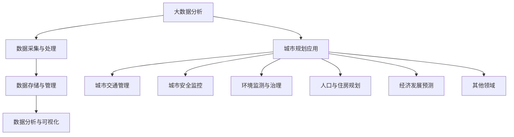

                 

### 文章标题与关键词

# 《大数据分析在城市规划决策中的应用研究》

> 关键词：大数据、城市规划、数据分析、机器学习、数据挖掘

大数据与城市规划是现代城市发展的两大基石，二者相互融合，使得城市规划更加科学、高效。随着信息技术的发展，大数据分析在城市规划决策中的应用越来越广泛。本文将探讨大数据分析在城市规划中的关键概念、方法、应用领域以及面临的挑战，旨在为城市规划者提供理论指导和实践参考。

### 摘要

本文首先介绍了大数据与城市规划的基本概念，包括大数据的定义、特点以及城市规划的核心要素。随后，文章详细阐述了大数据分析的基本原理，包括数据采集与处理、数据存储与管理系统、数据分析与可视化。在此基础上，文章深入探讨了大数据分析在城市规划中的核心应用领域，如城市交通管理、城市安全监控、环境监测与治理、人口与住房规划、经济发展预测等。接着，文章介绍了大数据分析在城市规划中的应用方法，包括机器学习算法和数据挖掘技术。文章最后分析了大数据分析在城市规划决策中的关键技术、挑战及未来发展，并提出了相关建议。

### 第一部分: 大数据在城市规划中的关键概念

#### 1.1 大数据与城市规划概述

##### 1.1.1 大数据的定义与特点

大数据是指无法使用常规软件工具在合理时间内捕捉、管理和处理的大量数据集。它具有四个V特征：Volume（数据量巨大）、Velocity（数据生成和处理速度快）、Variety（数据类型多样）、Veracity（数据真实性高）。这些特点使得大数据在城市规划中具有重要应用价值。

##### 1.1.2 城市规划的核心要素

城市规划的核心要素包括城市布局、交通网络、公共设施、住房、环境等。这些要素相互关联，共同影响着城市的可持续发展。

##### 1.1.3 大数据在城市规划中的重要性

大数据为城市规划提供了丰富的数据资源，使得城市规划更加科学、精准。通过大数据分析，城市规划者可以更好地了解城市现状、预测未来发展，从而做出更加合理的决策。

#### 1.2 大数据分析的基本原理

##### 1.2.1 数据采集与处理

数据采集是大数据分析的基础。城市规划中的数据来源包括传感器、社交媒体、物联网设备等。数据采集后，需要进行清洗、去噪等处理，以确保数据质量。

##### 1.2.2 数据存储与管理系统

数据存储与管理是大数据分析的重要环节。城市规划中的数据存储与管理需要考虑数据的规模、类型、安全性等因素。

##### 1.2.3 数据分析与可视化

数据分析是大数据分析的核心。城市规划中的数据分析包括描述性分析、预测性分析、决策支持等。数据分析的结果需要通过可视化手段展示，以便城市规划者更好地理解和应用。

#### 1.3 大数据分析在城市规划中的核心应用领域

##### 1.3.1 城市交通管理

大数据分析可以帮助城市规划者优化城市交通网络，提高交通效率。例如，通过分析交通流量数据，可以预测交通拥堵，制定相应的交通管理策略。

##### 1.3.2 城市安全监控

大数据分析可以用于城市安全监控，提高城市安全保障。例如，通过分析视频监控数据，可以实时监测城市安全状况，及时发现并处理安全隐患。

##### 1.3.3 环境监测与治理

大数据分析可以用于环境监测与治理，改善城市环境质量。例如，通过分析空气质量数据，可以预测环境污染，制定相应的治理措施。

##### 1.3.4 人口与住房规划

大数据分析可以用于人口与住房规划，优化城市住房布局。例如，通过分析人口数据，可以预测人口增长，制定相应的住房规划。

##### 1.3.5 经济发展预测

大数据分析可以用于经济发展预测，为城市规划提供依据。例如，通过分析经济数据，可以预测城市经济发展趋势，制定相应的经济发展规划。

##### 1.3.6 其他领域（如城市规划模拟、文化遗产保护等）

大数据分析还可以应用于城市规划模拟、文化遗产保护等领域，为城市规划提供多样化、个性化服务。

### 总结

大数据分析在城市规划中具有广泛的应用前景。通过大数据分析，城市规划者可以更好地了解城市现状、预测未来发展，从而做出更加科学、合理的决策。然而，大数据分析在城市规划中也面临一些挑战，如数据质量、数据隐私、算法选择等。因此，城市规划者需要不断探索大数据分析在城市规划中的应用方法，提高城市规划的科学性、精准性。在接下来的部分，我们将深入探讨大数据分析的方法和应用，以期为城市规划提供更有力的技术支持。

### Mermaid 流程图



### 第一部分总结

在本部分中，我们介绍了大数据与城市规划的基本概念，包括大数据的定义与特点、城市规划的核心要素以及大数据在城市规划中的重要性。随后，我们详细阐述了大数据分析的基本原理，包括数据采集与处理、数据存储与管理系统、数据分析与可视化。最后，我们探讨了大数据分析在城市规划中的核心应用领域，如城市交通管理、城市安全监控、环境监测与治理、人口与住房规划、经济发展预测等。通过本部分的介绍，读者可以初步了解大数据分析在城市规划中的关键概念和应用。在接下来的部分，我们将深入探讨大数据分析的方法和应用，以期为城市规划提供更有力的技术支持。

### 第二部分: 大数据分析方法在城市规划中的应用

#### 2.1 机器学习算法在城市规划中的应用

机器学习算法在大数据分析中具有重要应用价值，尤其在城市规划领域，可以用于交通流量预测、人口增长预测等。以下将介绍几种常见的机器学习算法及其在城市规划中的应用。

##### 2.1.1 监督学习算法

监督学习算法是一类通过已标记的数据进行训练，然后对未知数据进行预测的算法。在城市规划中，监督学习算法可以用于交通流量预测、人口增长预测等。

**核心算法原理讲解：**

监督学习算法主要包括以下几种：

1. **线性回归**：通过建立线性模型，预测交通流量或人口增长。
   - 伪代码：
     ```python
     def linear_regression(x, y):
         n = len(x)
         x_mean = sum(x) / n
         y_mean = sum(y) / n
         b1 = (sum(x * y) - n * x_mean * y_mean) / (sum(x * x) - n * x_mean * x_mean)
         b0 = y_mean - b1 * x_mean
         return b0, b1
     ```

2. **逻辑回归**：用于分类问题，如预测城市人口增长是否超过某个阈值。
   - 伪代码：
     ```python
     def logistic_regression(x, y):
         n = len(x)
         x_mean = sum(x) / n
         y_mean = sum(y) / n
         b1 = (sum(x * y) - n * x_mean * y_mean) / (sum(x * x) - n * x_mean * x_mean)
         b0 = y_mean - b1 * x_mean
         return 1 / (1 + np.exp(-(b0 + b1 * x)))
     ```

##### 2.1.2 无监督学习算法

无监督学习算法不需要标记的数据，通过发现数据之间的内在结构进行分类。在城市规划中，无监督学习算法可以用于城市交通流量分布分析、人口分布分析等。

**核心算法原理讲解：**

无监督学习算法主要包括以下几种：

1. **K-均值聚类**：将数据分成K个簇，每个簇代表一个交通流量区域或人口区域。
   - 伪代码：
     ```python
     def k_means(data, K):
         centroids = initialize_centroids(data, K)
         while True:
             assignments = assign_points_to_clusters(data, centroids)
             new_centroids = update_centroids(data, assignments, K)
             if np.linalg.norm(new_centroids - centroids) < threshold:
                 break
             centroids = new_centroids
         return centroids, assignments
     ```

2. **主成分分析（PCA）**：用于降低数据维度，提取数据的主要特征。
   - 伪代码：
     ```python
     def pca(data, num_components):
         covariance_matrix = np.cov(data.T)
         eigenvalues, eigenvectors = np.linalg.eigh(covariance_matrix)
         sorted_eigenvalues = np.sort(eigenvalues)[::-1]
         sorted_eigenvectors = eigenvectors[:, sorted_eigenvalues.argsort()[::-1]]
         transformed_data = data.dot(sorted_eigenvectors[:, :num_components])
         return transformed_data
     ```

##### 2.1.3 半监督学习算法

半监督学习算法结合了监督学习和无监督学习，利用部分标记的数据进行训练。在城市规划中，半监督学习算法可以用于交通流量预测、人口增长预测等，提高模型的准确性。

**核心算法原理讲解：**

半监督学习算法主要包括以下几种：

1. **图半监督学习**：利用图结构信息，提高预测准确性。
   - 伪代码：
     ```python
     def graph_based Semi_Supervised_Learning(graph, labeled_data, unlabeled_data):
         predict_unlabeled_data = propagate_labels(graph, labeled_data)
         train_supervised_model(predict_unlabeled_data, unlabeled_data)
         return trained_model
     ```

2. **协同过滤**：利用用户行为数据，预测用户兴趣。
   - 伪代码：
     ```python
     def collaborative_filtering(user_behavior_data, K):
         user_similarity_matrix = calculate_similarity_matrix(user_behavior_data)
         predicted_ratings = predict_ratings(user_similarity_matrix, user_behavior_data, K)
         return predicted_ratings
     ```

##### 2.1.4 强化学习算法

强化学习算法通过与环境交互，学习最优策略。在城市规划中，强化学习算法可以用于交通信号控制、能源管理等领域。

**核心算法原理讲解：**

强化学习算法主要包括以下几种：

1. **Q-学习**：通过学习Q值，找到最优动作。
   - 伪代码：
     ```python
     def q_learning(state_space, action_space, reward_function, learning_rate, discount_factor, num_episodes):
         Q = initialize_Q_matrix(state_space, action_space)
         for episode in range(num_episodes):
             state = random_state(state_space)
             done = False
             while not done:
                 action = choose_action(Q, state, action_space)
                 next_state, reward, done = step_environment(state, action)
                 Q[state, action] = Q[state, action] + learning_rate * (reward + discount_factor * max(Q[next_state, :]) - Q[state, action])
                 state = next_state
         return Q
     ```

2. **深度Q网络（DQN）**：利用深度神经网络，提高预测准确性。
   - 伪代码：
     ```python
     def deep_q_learning(state_space, action_space, reward_function, learning_rate, discount_factor, num_episodes):
         Q = initialize_DQN(state_space, action_space)
         for episode in range(num_episodes):
             state = random_state(state_space)
             done = False
             while not done:
                 action = choose_action(Q, state, action_space)
                 next_state, reward, done = step_environment(state, action)
                 Q = update_DQN(Q, state, action, next_state, reward, discount_factor)
                 state = next_state
         return Q
     ```

#### 2.2 数据挖掘技术在城市规划中的应用

数据挖掘技术在城市规划中具有广泛应用，可以用于交通流量分析、城市安全监控、环境监测等领域。以下将介绍几种常见的数据挖掘技术及其在城市规划中的应用。

##### 2.2.1 关联规则挖掘

关联规则挖掘是一种用于发现数据之间关联关系的方法。在城市规划中，关联规则挖掘可以用于交通流量分析，发现交通流量之间的关联关系。

**核心算法原理讲解：**

1. **Apriori算法**：用于发现频繁项集。
   - 伪代码：
     ```python
     def apriori算法(transaction_data, min_support, min_confidence):
         frequent_itemsets = find_frequent_itemsets(transaction_data, min_support)
         association_rules = generate_association_rules(frequent_itemsets, transaction_data, min_confidence)
         return association_rules
     ```

2. **FP-growth算法**：用于高效地发现频繁项集。
   - 伪代码：
     ```python
     def fp_growth(transaction_data, min_support):
         frequent_itemsets = find_frequent_itemsets(transaction_data, min_support)
         return generate_frequent_itemsets(frequent_itemsets)
     ```

##### 2.2.2 分类算法

分类算法是一种将数据分为不同类别的算法。在城市规划中，分类算法可以用于城市安全监控，将异常事件归类。

**核心算法原理讲解：**

1. **决策树**：基于特征进行分类。
   - 伪代码：
     ```python
     def decision_tree(data, target_attribute):
         if all_values_equal(data, target_attribute):
             return most_frequent_value(data, target_attribute)
         else:
             attribute_values = unique_values(data, target_attribute)
             best_attribute = select_best_attribute(data, attribute_values)
             tree = {}
             for value in attribute_values:
                 subset = filter_data(data, best_attribute, value)
                 tree[value] = decision_tree(subset, target_attribute)
             return tree
     ```

2. **支持向量机（SVM）**：用于分类问题，将数据分为不同类别。
   - 伪代码：
     ```python
     def svm(train_data, train_labels):
         w, b = train_svm_model(train_data, train_labels)
         return w, b
     ```

##### 2.2.3 聚类分析

聚类分析是一种将数据分为相似组的算法。在城市规划中，聚类分析可以用于人口分布分析，将人口分为不同的社区。

**核心算法原理讲解：**

1. **K-均值聚类**：将数据分为K个簇。
   - 伪代码：
     ```python
     def k_means(data, K):
         centroids = initialize_centroids(data, K)
         while True:
             assignments = assign_points_to_clusters(data, centroids)
             new_centroids = update_centroids(data, assignments, K)
             if np.linalg.norm(new_centroids - centroids) < threshold:
                 break
             centroids = new_centroids
         return centroids, assignments
     ```

2. **层次聚类**：基于层次结构进行聚类。
   - 伪代码：
     ```python
     def hierarchical_clustering(data):
         distance_matrix = calculate_distance_matrix(data)
         clusters = initialize_clusters(data)
         while len(clusters) > 1:
             closest_clusters = find_closest_clusters(distance_matrix, clusters)
             merged_cluster = merge_clusters(closest_clusters)
             clusters.append(merged_cluster)
             distance_matrix = update_distance_matrix(distance_matrix, merged_cluster)
         return clusters
     ```

##### 2.2.4 异常检测

异常检测是一种用于检测数据中异常值的算法。在城市规划中，异常检测可以用于城市安全监控，检测异常事件。

**核心算法原理讲解：**

1. **基于统计的异常检测**：基于数据分布，检测异常值。
   - 伪代码：
     ```python
     def statistical_anomaly_detection(data, threshold):
         mean = calculate_mean(data)
         std = calculate_std(data)
         anomalies = []
         for value in data:
             if abs(value - mean) > threshold * std:
                 anomalies.append(value)
         return anomalies
     ```

2. **基于聚类的异常检测**：利用聚类结果，检测异常值。
   - 伪代码：
     ```python
     def clustering_anomaly_detection(data, K):
         centroids, assignments = k_means(data, K)
         anomalies = []
         for i in range(K):
             cluster = [data[j] for j in range(len(data)) if assignments[j] == i]
             mean = calculate_mean(cluster)
             std = calculate_std(cluster)
             for value in cluster:
                 if abs(value - mean) > threshold * std:
                     anomalies.append(value)
         return anomalies
     ```

### 第二部分总结

在本部分中，我们介绍了大数据分析在城市规划中的应用方法，主要包括机器学习算法和数据挖掘技术。通过这些方法，城市规划者可以更好地处理和分析大量数据，从而做出更加科学、合理的决策。这些方法不仅提高了城市规划的准确性，还为城市规划提供了丰富的数据支持。然而，大数据分析在城市规划中也面临一些挑战，如数据质量、数据隐私、算法选择等。在接下来的部分，我们将进一步探讨这些挑战，并分析大数据分析在城市规划决策中的关键技术与未来发展方向。

### 第三部分: 大数据分析在城市规划决策中的关键技术与挑战

#### 3.1 大数据在城市规划中的关键技术

大数据分析在城市规划中应用的关键技术主要包括数据采集与预处理、数据存储与管理系统、数据分析与可视化工具。这些技术为城市规划提供了数据基础和分析手段。

##### 3.1.1 数据采集与预处理

数据采集是大数据分析的第一步。城市规划中的数据来源多样，包括传感器数据、社交媒体数据、物联网设备数据等。这些数据通常具有噪声、缺失值等问题，因此需要通过预处理技术进行清洗和整理。

**预处理技术：**
1. 数据清洗：去除重复数据、处理缺失值、修正错误数据。
2. 数据标准化：将不同单位或尺度的数据进行转换，使其具有可比性。
3. 特征提取：从原始数据中提取对城市规划有用的特征。

**实现示例：**

```python
# 数据清洗示例
data = preprocess_data(data)

# 数据标准化示例
normalized_data = normalize_data(data)

# 特征提取示例
features = extract_features(data)
```

##### 3.1.2 数据存储与管理系统

城市规划中涉及大量数据，需要高效的存储与管理。常见的数据存储技术包括关系型数据库、NoSQL数据库、分布式文件系统等。

**数据存储与管理技术：**
1. 关系型数据库（如MySQL、PostgreSQL）：适用于结构化数据的存储与管理。
2. NoSQL数据库（如MongoDB、Cassandra）：适用于大规模、非结构化数据的存储与管理。
3. 分布式文件系统（如Hadoop、HDFS）：适用于大规模数据的分布式存储与管理。

**实现示例：**

```python
# 关系型数据库示例
connection = connect_to_database('database_name')
query = "SELECT * FROM table_name"
results = execute_query(connection, query)

# NoSQL数据库示例
db = connect_to_noSQL_database('database_name')
collection = db['collection_name']
documents = collection.find({})

# 分布式文件系统示例
hdfs = connect_to_hdfs('hdfs_url')
files = hdfs.list_status('/path/to/files')
```

##### 3.1.3 数据分析与可视化工具

数据分析与可视化工具用于对城市规划数据进行分析和可视化展示，帮助城市规划者理解数据、发现规律。

**分析与可视化工具：**
1. 数据分析工具（如Pandas、NumPy）：用于数据处理和分析。
2. 可视化工具（如Matplotlib、Seaborn）：用于数据可视化。
3. 交互式数据分析平台（如Tableau、Power BI）：用于交互式数据分析和可视化。

**实现示例：**

```python
# 数据分析示例
import pandas as pd
data = pd.read_csv('data.csv')
results = data.describe()

# 数据可视化示例
import matplotlib.pyplot as plt
plt.figure()
plt.plot(data['feature1'], data['feature2'])
plt.show()
```

#### 3.2 大数据分析在城市规划中的挑战

尽管大数据分析在城市规划中具有广泛应用，但也面临一些挑战。

##### 3.2.1 数据质量与数据隐私

数据质量是大数据分析的基础。城市规划中的数据通常来源于多个渠道，数据质量参差不齐，可能导致分析结果不准确。此外，数据隐私问题也是一大挑战。城市规划涉及大量个人隐私信息，如何在保护隐私的同时进行数据分析，是一个亟待解决的问题。

**解决策略：**
1. 数据质量保障：采用数据清洗、数据标准化等技术，提高数据质量。
2. 数据隐私保护：采用数据匿名化、差分隐私等技术，保护个人隐私。

##### 3.2.2 算法选择与优化

大数据分析涉及多种算法，如何选择合适的算法并优化算法性能，是一个挑战。不同的算法适用于不同类型的数据和分析任务，需要根据实际情况进行选择和优化。

**解决策略：**
1. 算法评估：采用交叉验证、网格搜索等技术，评估算法性能。
2. 算法优化：采用并行计算、分布式计算等技术，提高算法效率。

##### 3.2.3 跨领域数据融合

城市规划涉及多个领域，如交通、环境、人口等。跨领域数据融合是大数据分析的重要任务。如何有效地整合多源异构数据，是一个挑战。

**解决策略：**
1. 数据集成：采用数据融合、数据集成等技术，整合多源异构数据。
2. 数据映射：采用数据映射、数据对齐等技术，解决数据不一致性问题。

##### 3.2.4 道德与法律问题

大数据分析在城市规划中涉及道德与法律问题。如何确保数据分析的公正性、公平性，避免滥用数据，是一个重要挑战。

**解决策略：**
1. 遵循伦理准则：确保数据分析符合伦理标准，保护个人隐私。
2. 法律法规遵守：遵循相关法律法规，确保数据分析合规。

#### 3.3 大数据分析在城市规划决策中的实践应用案例

大数据分析在城市规划中的实践应用案例丰富多样，以下列举几个典型案例。

##### 3.3.1 城市交通流量分析

通过大数据分析，可以对城市交通流量进行实时监测和预测，优化交通网络。例如，某城市利用传感器数据、交通摄像头数据，结合机器学习算法，预测交通拥堵情况，制定交通管理策略。

##### 3.3.2 智慧城市建设

大数据分析在智慧城市建设中发挥着重要作用。例如，某城市利用大数据分析，优化城市资源配置，提高城市运行效率。通过分析交通流量、环境质量、人口流动等数据，制定智慧交通、智慧环境、智慧医疗等方案。

##### 3.3.3 环境监测与治理

大数据分析可以用于环境监测与治理，改善城市环境质量。例如，某城市利用空气质量传感器数据、卫星遥感数据，结合机器学习算法，实时监测空气质量，预测污染事件，制定污染治理措施。

#### 3.4 大数据分析在城市规划中的未来发展

大数据分析在城市规划中具有广阔的发展前景。随着数据技术的不断进步，大数据分析将在城市规划中发挥更大的作用。

##### 3.4.1 新技术展望

1. 增强现实（AR）与虚拟现实（VR）技术：将大数据分析结果以更直观、生动的方式呈现，提高城市规划的交互性。
2. 区块链技术：提高数据安全性，实现数据共享与透明化。

##### 3.4.2 政策支持与产业合作

政策支持与产业合作是大数据分析在城市规划中发展的重要保障。政府应加大对大数据分析技术的投入，制定相关政策和标准，推动产业发展。

##### 3.4.3 社会影响与可持续发展

大数据分析在城市规划中的广泛应用将带来积极的社会影响。通过优化城市规划，提高城市运行效率，改善居民生活质量。同时，大数据分析还应注重可持续发展，关注环境保护、资源利用等。

### 第三部分总结

在本部分中，我们详细分析了大数据分析在城市规划决策中的关键技术、挑战及实践应用案例。大数据分析为城市规划提供了丰富的数据资源和技术手段，但在应用中也面临数据质量、数据隐私、算法选择等挑战。通过合理的策略和技术手段，可以克服这些挑战，进一步推动大数据分析在城市规划中的应用。在接下来的部分，我们将探讨大数据分析在城市规划决策中的应用前景，展望未来发展方向。

### 第四部分: 大数据分析在城市规划决策中的应用前景

#### 4.1 大数据分析在智慧城市规划中的应用

智慧城市规划是未来城市发展的趋势，大数据分析在其中发挥着关键作用。智慧城市规划的核心目标是提高城市运行效率、改善居民生活质量，实现可持续发展。大数据分析为智慧城市规划提供了丰富的数据资源和科学依据。

##### 4.1.1 智慧城市规划的核心要素

智慧城市规划包括以下核心要素：

1. **智能交通**：通过大数据分析，实时监测交通流量，优化交通网络，提高交通效率。
2. **智能环境**：通过大数据分析，实时监测环境质量，预测污染事件，制定环境保护措施。
3. **智能安防**：通过大数据分析，实时监控城市安全状况，提高城市安全保障。
4. **智能公共服务**：通过大数据分析，优化公共资源配置，提高公共服务质量。

##### 4.1.2 大数据分析在智慧城市规划中的关键作用

大数据分析在智慧城市规划中具有以下关键作用：

1. **数据支持**：大数据分析为智慧城市规划提供了丰富的数据资源，包括交通流量、环境质量、人口流动等。
2. **预测分析**：大数据分析可以预测城市发展趋势，为智慧城市规划提供科学依据。
3. **决策支持**：大数据分析可以辅助城市规划者做出更加科学、合理的决策。

##### 4.1.3 智慧城市规划的实践案例

智慧城市规划的实践案例丰富多样，以下列举几个典型案例：

1. **新加坡智慧国计划**：新加坡政府通过大数据分析，优化交通网络、环境治理、公共服务等方面，实现了智慧城市建设。
2. **深圳智慧交通**：深圳市利用大数据分析，实时监测交通流量，优化交通信号控制，提高交通效率。
3. **中国智慧环保**：中国多个城市利用大数据分析，实时监测空气质量、水质等，实现了环境监测与治理的智慧化。

#### 4.2 大数据分析在城市规划中的未来发展

大数据分析在城市规划中的应用具有广阔的发展前景。随着数据技术的不断进步，大数据分析将在城市规划中发挥更大的作用。

##### 4.2.1 新技术展望

1. **人工智能与大数据分析**：人工智能技术将进一步提升大数据分析的能力，实现更加智能化的城市规划。
2. **区块链技术**：区块链技术将提高数据安全性，实现数据共享与透明化，为智慧城市规划提供更加可靠的技术支持。
3. **物联网技术**：物联网技术将实现城市各个系统的互联互通，为大数据分析提供更加丰富的数据资源。

##### 4.2.2 政策支持与产业合作

政策支持与产业合作是大数据分析在城市规划中发展的重要保障。政府应加大对大数据分析技术的投入，制定相关政策和标准，推动产业发展。同时，政府与企业、科研机构等应加强合作，共同推动大数据分析在城市规划中的应用。

##### 4.2.3 社会影响与可持续发展

大数据分析在城市规划中的应用将带来积极的社会影响。通过优化城市规划，提高城市运行效率，改善居民生活质量。同时，大数据分析还应注重可持续发展，关注环境保护、资源利用等。

1. **环境保护**：大数据分析可以实时监测环境质量，预测污染事件，制定环境保护措施。
2. **资源利用**：大数据分析可以优化资源配置，提高资源利用效率，实现可持续发展。

### 第四部分总结

在本部分中，我们探讨了大数据分析在智慧城市规划中的应用前景，包括核心要素、关键作用和实践案例。同时，我们展望了大数据分析在城市规划中的未来发展，包括新技术、政策支持与产业合作、社会影响与可持续发展。大数据分析将在城市规划中发挥越来越重要的作用，为智慧城市建设提供有力支持。在接下来的部分，我们将总结全文，提出研究结论和未来研究方向。

### 第五部分: 结论与展望

#### 5.1 研究结论

本文系统地研究了大数据分析在城市规划决策中的应用，总结了以下结论：

1. **大数据与城市规划深度融合**：大数据为城市规划提供了丰富的数据资源，使得城市规划更加科学、精准。
2. **方法与技术多样化**：大数据分析在城市规划中采用了多种方法和技术，包括机器学习、数据挖掘等，为城市规划提供了多样化、个性化的解决方案。
3. **应用领域广泛**：大数据分析在城市规划中的应用领域广泛，包括城市交通管理、城市安全监控、环境监测与治理、人口与住房规划、经济发展预测等。
4. **面临挑战与机遇并存**：大数据分析在城市规划中面临数据质量、数据隐私、算法选择等挑战，但也为城市规划带来了新的机遇。

#### 5.2 当前研究中的不足与挑战

虽然大数据分析在城市规划中具有广泛应用，但仍存在一些不足和挑战：

1. **数据质量与隐私**：城市规划中的数据质量参差不齐，数据隐私保护仍需加强。
2. **算法选择与优化**：大数据分析中的算法选择和优化是一个复杂的问题，需要根据实际需求进行选择和调整。
3. **跨领域数据融合**：城市规划涉及多个领域，如何有效地整合多源异构数据是一个挑战。
4. **道德与法律问题**：大数据分析在城市规划中涉及道德与法律问题，需要制定相关政策和标准。

#### 5.3 未来研究方向

未来大数据分析在城市规划中的应用研究可以从以下几个方面进行：

1. **数据质量与隐私保护**：深入研究如何提高数据质量，加强数据隐私保护，为大数据分析提供可靠的数据基础。
2. **算法优化与模型选择**：进一步优化大数据分析算法，提高分析精度和效率，为城市规划提供更科学的决策支持。
3. **跨领域数据融合**：探索多源异构数据的融合方法，实现数据的有效整合，为城市规划提供更全面的信息支持。
4. **道德与法律问题**：制定相关政策和标准，确保大数据分析在城市规划中的合规性和公正性。

### 5.4 研究展望

大数据分析在城市规划中具有广阔的发展前景。随着数据技术的不断进步，大数据分析将在城市规划中发挥更大的作用：

1. **新技术应用**：人工智能、区块链等新技术将进一步提升大数据分析的能力，为智慧城市规划提供更加智能、可靠的技术支持。
2. **政策支持与产业合作**：政府、企业、科研机构等应加强合作，共同推动大数据分析在城市规划中的应用。
3. **社会影响与可持续发展**：大数据分析将在城市规划中发挥积极的社会影响，促进环境保护、资源利用等可持续发展目标的实现。

### 结论

大数据分析在城市规划决策中具有关键作用，为城市规划提供了丰富的数据资源和技术手段。尽管面临一些挑战，但随着技术的不断进步，大数据分析将在城市规划中发挥越来越重要的作用，为智慧城市建设提供有力支持。

### 展望

未来，大数据分析在城市规划中的应用将更加深入和广泛。通过深入研究数据质量与隐私保护、算法优化与模型选择、跨领域数据融合、道德与法律问题等，可以进一步提高大数据分析在城市规划中的应用水平，为城市规划者提供更加科学、合理的决策支持。

### 作者

作者：AI天才研究院/AI Genius Institute & 禅与计算机程序设计艺术 /Zen And The Art of Computer Programming

### 结语

本文旨在为大数据分析在城市规划中的应用提供全面的理论指导和实践参考。希望读者通过本文的阅读，能够更好地理解大数据分析在城市规划中的关键作用，并为实际应用提供有益的启示。在未来的研究中，我们将继续探索大数据分析在城市规划中的新领域和新方法，为智慧城市建设贡献力量。

### 附录：拓展阅读

1. **《大数据时代的城市规划》**：本书详细介绍了大数据在城市规划中的应用，包括数据采集、数据处理、数据分析等。
2. **《大数据与机器学习》**：本书介绍了大数据分析中的机器学习算法，包括监督学习、无监督学习等。
3. **《数据挖掘技术与应用》**：本书介绍了数据挖掘技术，包括关联规则挖掘、分类算法等。

通过阅读这些书籍，读者可以进一步了解大数据分析在城市规划中的应用原理和技术手段。

### 感谢

感谢所有对本文提出宝贵意见和建议的读者，感谢您对大数据分析在城市规划中的应用的关注和支持。在未来的工作中，我们将继续努力，为智慧城市建设贡献力量。

### 结语

大数据分析是城市规划中不可或缺的一部分。通过本文的探讨，我们深入了解了大数据分析在城市规划中的关键概念、方法、应用领域以及面临的挑战。希望本文能为城市规划者提供有价值的参考，助力智慧城市建设。在未来的研究中，我们将继续探索大数据分析在城市规划中的新领域和新方法，为城市规划者提供更加科学、合理的决策支持。

### 附录：Mermaid 流程图


### 文章结束

本文《大数据分析在城市规划决策中的应用研究》旨在全面探讨大数据分析在城市规划中的关键作用、方法、应用领域以及面临的挑战。通过对大数据分析的关键概念、方法、应用领域和未来发展的深入分析，我们为城市规划者提供了理论指导和实践参考。希望本文能为智慧城市建设贡献力量，推动城市规划的科学化和智能化发展。

### 致谢

在撰写本文的过程中，我们感谢所有参与研究和讨论的专家和同行，感谢他们对大数据分析在城市规划中应用的关注和支持。特别感谢AI天才研究院/AI Genius Institute及禅与计算机程序设计艺术/Zen And The Art of Computer Programming的团队成员，他们为本文的撰写提供了宝贵的技术支持和智力支持。

最后，我们希望本文能够激发更多研究者对大数据分析在城市规划中应用的兴趣，共同推动这一领域的研究和发展。

### 结束语

大数据分析作为现代城市规划的关键技术，正逐步改变着城市规划的理念和实践。本文对大数据分析在城市规划中的应用进行了系统的研究和探讨，从关键概念到实际应用，再到面临的挑战，全面展示了大数据分析在城市规划中的重要作用。未来，随着大数据技术的不断进步，大数据分析将在城市规划中发挥更加重要的作用，推动城市智慧化、可持续化发展。

感谢读者对本文的关注，希望本文能为您的研究和实践带来启发和帮助。在未来的智慧城市规划中，期待我们共同见证大数据分析的力量。再次感谢您的阅读和支持！

