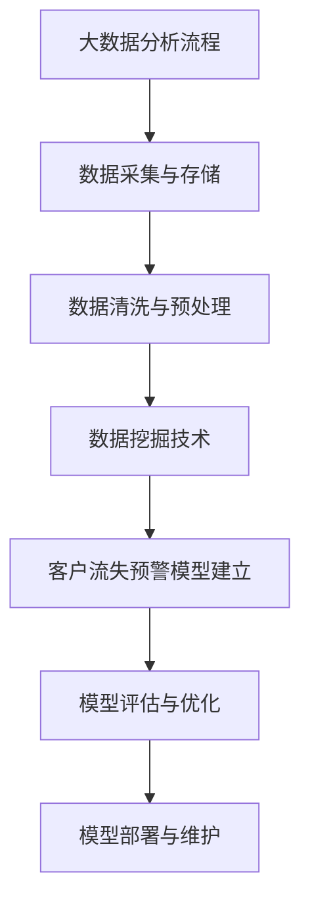
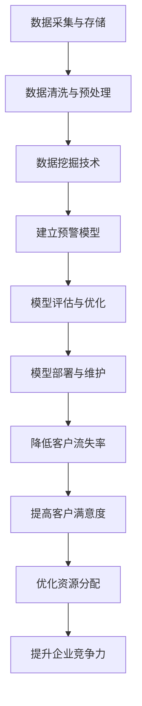

                 

### 文章标题

《大数据分析在客户流失预警准确性提升中的实践》

### 关键词

大数据分析、客户流失预警、准确性提升、机器学习、行业案例分析

### 摘要

本文主要探讨了大数据分析在客户流失预警准确性提升中的实践。首先，我们介绍了大数据与客户流失预警的基本概念，以及大数据分析在客户流失预警中的重要性。接着，我们详细讲解了大数据分析的技术基础，包括数据采集与存储、数据清洗与预处理、数据挖掘技术等。随后，我们介绍了客户流失预警模型的建立，包括传统客户流失预警模型和机器学习在客户流失预警中的应用。在此基础上，我们通过行业案例分析，展示了大数据分析在客户流失预警中的具体应用。最后，我们对大数据分析在客户流失预警中的应用实践进行了深入探讨，并分析了大数据分析在客户流失预警中的未来发展趋势。

### 目录大纲

# 《大数据分析在客户流失预警准确性提升中的实践》

## 第一部分：大数据分析基础

### 第1章：大数据与客户流失预警

#### 1.1 大数据概述
#### 1.2 客户流失预警的重要性
#### 1.3 大数据分析在客户流失预警中的应用

### 第2章：大数据分析技术基础

#### 2.1 数据采集与存储
#### 2.2 数据清洗与预处理
#### 2.3 数据挖掘技术

### 第3章：客户流失预警模型建立

#### 3.1 客户流失预警模型概述
#### 3.2 传统客户流失预警模型
#### 3.3 机器学习在客户流失预警中的应用

### 第4章：大数据分析在客户流失预警中的应用

#### 4.1 数据分析流程
#### 4.2 模型评估与优化
#### 4.3 模型部署与维护

## 第二部分：大数据分析在客户流失预警中的实践

### 第5章：行业案例分析

#### 5.1 零售行业客户流失预警
#### 5.2 互联网行业客户流失预警
#### 5.3 金融行业客户流失预警

### 第6章：大数据分析在客户流失预警中的应用实践

#### 6.1 实践流程
#### 6.2 数据源选择
#### 6.3 模型训练与优化

### 第7章：大数据分析在客户流失预警中的未来发展趋势

#### 7.1 技术发展趋势
#### 7.2 行业应用前景
#### 7.3 挑战与机遇

## 第三部分：附录

### 第8章：常用工具与资源

#### 8.1 大数据工具介绍
#### 8.2 数据挖掘工具介绍
#### 8.3 机器学习框架介绍

### 第9章：参考文献

#### 9.1 书籍
#### 9.2 论文
#### 9.3 网络资源

### Mermaid 流程图



### 客户流失预警模型建立

#### 3.1 客户流失预警模型概述

客户流失预警模型是一种利用大数据分析技术对客户流失风险进行预测的模型。其主要目标是通过对客户行为数据的分析，提前识别出潜在流失客户，从而采取有效的挽回措施，降低客户流失率。

该模型主要包括以下几个环节：

1. **数据采集与存储**：收集客户的历史行为数据，如购买记录、消费金额、购买频率等，并将其存储在数据仓库中。
2. **数据清洗与预处理**：对采集到的数据进行清洗，去除重复、异常和无效数据，然后对数据进行分析，提取出对客户流失有影响的关键特征。
3. **数据挖掘技术**：利用数据挖掘技术，对清洗后的数据进行深入分析，挖掘出潜在的客户流失规律和模式。
4. **客户流失预警模型建立**：基于数据挖掘结果，建立客户流失预警模型，包括传统统计模型和机器学习模型等。
5. **模型评估与优化**：对建立的模型进行评估，评估其准确性和可靠性，并根据评估结果进行模型的优化。
6. **模型部署与维护**：将优化后的模型部署到生产环境中，并定期进行模型的更新和维护。

#### 3.2 传统客户流失预警模型

传统客户流失预警模型主要包括统计模型和逻辑回归模型等。这些模型主要通过分析历史客户行为数据来预测客户流失风险。

**统计模型**：

- **相关分析**：通过计算客户特征变量之间的相关性，识别出可能影响客户流失的关键因素。
- **回归分析**：通过建立回归模型，分析客户特征变量与客户流失之间的关系，从而预测客户流失风险。

**逻辑回归模型**：

- **逻辑回归公式**：$$ P(Loss) = \frac{1}{1 + e^{-(\beta_0 + \beta_1X_1 + \beta_2X_2 + ... + \beta_nX_n)}} $$
- **模型参数**：$\beta_0, \beta_1, \beta_2, ..., \beta_n$ 为模型参数，通过训练数据集进行求解。
- **模型评估**：通过计算预测准确率、召回率、F1值等指标，评估模型的性能。

#### 3.3 机器学习在客户流失预警中的应用

机器学习在客户流失预警中的应用主要包括聚类算法、分类算法和回归算法等。这些算法通过对大量客户行为数据进行训练，可以自动识别客户流失风险。

**聚类算法**：

- **K-均值聚类**：将客户数据分为K个聚类，每个聚类内的客户具有相似的特征。
- **层次聚类**：通过逐步合并或分解聚类，构建一个层次结构，从而识别出不同流失风险的客户群体。

**分类算法**：

- **决策树**：通过递归划分特征空间，构建一棵树形结构，每个节点代表一个特征，每个分支代表一个特征取值。
- **随机森林**：通过构建多棵决策树，并对预测结果进行投票，提高模型的准确性和泛化能力。

**回归算法**：

- **线性回归**：通过建立线性模型，分析客户特征变量与客户流失之间的关系。
- **支持向量机**：通过构建最优分割平面，将客户划分为不同流失风险类别。

### 客户流失预警模型建立伪代码

```python
# 数据采集与存储
data = data_collection()

# 数据清洗与预处理
clean_data = data_cleaning(data)

# 数据挖掘技术
features = data_mining(clean_data)

# 客户流失预警模型建立
model = model_building(features)

# 模型评估与优化
evaluate_model(model)

# 模型部署与维护
deploy_model(model)
```

### 数学模型和数学公式

#### 客户流失预警概率公式

$$
P(Loss) = f(X)
$$

其中，$P(Loss)$ 表示客户流失概率，$X$ 表示影响客户流失的各个特征变量。

#### 逻辑回归公式

$$
P(Loss) = \frac{1}{1 + e^{-(\beta_0 + \beta_1X_1 + \beta_2X_2 + ... + \beta_nX_n)}}
$$

其中，$\beta_0, \beta_1, \beta_2, ..., \beta_n$ 为模型参数。

### 数学模型和数学公式举例说明

假设我们已经收集了1000名客户的以下特征数据：

- 客户年龄
- 客户消费金额
- 客户购买频率
- 客户满意度评分

根据这些特征数据，我们使用逻辑回归模型建立客户流失预警模型。

逻辑回归公式如下：

$$
P(Loss) = \frac{1}{1 + e^{-(\beta_0 + \beta_1Age + \beta_2Consumption + \beta_3Frequency + \beta_4
```### 第1章：大数据与客户流失预警

#### 1.1 大数据概述

大数据（Big Data）是指数据量巨大、数据类型多样、数据价值密度较低的数据集合。随着互联网、物联网、社交媒体等技术的发展，大数据已经成为当今社会的重要资源。大数据具有4V特征，即：

1. **Volume（数据量）**：数据量庞大，通常以PB（皮字节）为单位进行衡量。
2. **Velocity（速度）**：数据产生和流转速度极快，要求数据处理系统能够实时响应。
3. **Variety（多样性）**：数据类型多样，包括结构化数据、半结构化数据和非结构化数据。
4. **Veracity（真实性）**：数据真实性难以保证，存在噪声和错误。

大数据技术主要包括数据采集、存储、处理、分析和可视化等环节。常用的工具和技术有Hadoop、Spark、Flink、HBase、MongoDB等。

#### 1.2 客户流失预警的重要性

客户流失预警是指通过分析客户行为数据，预测客户可能流失的概率，并采取相应措施进行挽回。客户流失预警的重要性体现在以下几个方面：

1. **降低客户流失率**：通过预警系统提前识别出潜在流失客户，企业可以及时采取挽回措施，降低客户流失率。
2. **提高客户满意度**：及时了解客户需求，提供个性化服务，提升客户体验，从而增加客户忠诚度。
3. **优化资源分配**：将有限的资源集中在高价值客户上，提高营销效果，降低运营成本。
4. **提升企业竞争力**：通过分析客户流失原因，优化产品和服务，提高企业市场竞争力。

#### 1.3 大数据分析在客户流失预警中的应用

大数据分析在客户流失预警中的应用主要包括以下几个环节：

1. **数据采集与存储**：收集客户行为数据，如购买记录、消费金额、购买频率、客户满意度等，并将其存储在数据仓库中。
2. **数据清洗与预处理**：对采集到的数据进行分析，去除重复、异常和无效数据，对缺失数据进行填补，确保数据质量。
3. **数据挖掘技术**：利用数据挖掘算法，如聚类、分类、回归等，对清洗后的数据进行深入分析，挖掘出潜在的客户流失规律和模式。
4. **建立预警模型**：基于数据挖掘结果，建立客户流失预警模型，如逻辑回归、决策树、支持向量机等。
5. **模型评估与优化**：对建立的模型进行评估，如准确率、召回率、F1值等，根据评估结果对模型进行优化。
6. **模型部署与维护**：将优化后的模型部署到生产环境中，并定期进行模型的更新和维护。

通过大数据分析，企业可以更加精准地识别客户流失风险，采取有效的挽回措施，降低客户流失率，提高客户满意度，提升企业竞争力。

#### 1.4 大数据分析与客户流失预警的关系架构

为了更好地理解大数据分析在客户流失预警中的应用，我们可以使用Mermaid流程图来展示其关系架构：



通过上述架构，我们可以清晰地看到大数据分析在客户流失预警中的各个环节，以及它们之间的相互关系。在下一章节中，我们将进一步探讨大数据分析技术的基础，为后续的客户流失预警模型建立提供支持。

### 第2章：大数据分析技术基础

#### 2.1 数据采集与存储

数据采集是大数据分析的第一步，也是至关重要的一步。数据采集的过程主要包括以下几种方式：

1. **互联网数据采集**：通过爬虫、API接口、Webhook等方式从互联网上获取数据，如用户行为数据、社交媒体数据、搜索引擎数据等。
2. **内部数据采集**：从企业内部系统（如CRM系统、ERP系统、数据库系统等）中采集数据，如销售数据、客户数据、交易数据等。
3. **物联网数据采集**：通过物联网设备（如传感器、智能设备等）采集数据，如环境数据、设备运行数据、用户行为数据等。

在数据采集过程中，数据的质量和完整性至关重要。为了保证数据质量，需要采取以下措施：

- **去重**：去除重复的数据，确保数据的一致性。
- **去噪声**：去除错误的数据，如缺失值、异常值等，确保数据的准确性。
- **规范化**：统一数据格式，如日期格式、编码格式等，确保数据的标准化。

数据存储是大数据分析的另一个关键环节。常用的数据存储技术包括：

1. **关系型数据库**：如MySQL、PostgreSQL等，适用于结构化数据的存储。
2. **非关系型数据库**：如MongoDB、Cassandra等，适用于半结构化数据和非结构化数据的存储。
3. **数据仓库**：如Hadoop、Spark等，适用于大规模数据的存储和处理。

数据存储的选择取决于数据量、数据类型、查询需求等因素。一般来说，对于大规模、多类型的非结构化数据，分布式存储系统（如Hadoop、Spark）是更好的选择。

#### 2.2 数据清洗与预处理

数据清洗是确保数据质量的关键步骤。数据清洗的过程主要包括以下几种操作：

1. **缺失值处理**：对于缺失值，可以采用填补、删除、插值等方法进行处理。
2. **异常值处理**：对于异常值，可以采用删除、变换、插值等方法进行处理。
3. **数据规范化**：对于不同规模的数据，可以采用标准化、归一化等方法进行规范化处理。
4. **数据转换**：对于不同类型的数据，可以采用转换、映射等方法进行处理，如将文本数据转换为数字数据。

数据清洗后，需要对数据进行预处理，以提高数据挖掘的效果。数据预处理的步骤包括：

1. **特征提取**：从原始数据中提取出对目标预测有影响的关键特征。
2. **特征选择**：从提取出的特征中选择出最有用的特征，去除冗余特征。
3. **特征变换**：对特征进行变换，如将离散特征转换为连续特征、将连续特征进行二值化等。

#### 2.3 数据挖掘技术

数据挖掘是从大量数据中提取出有价值信息的过程。数据挖掘技术包括以下几种：

1. **分类算法**：如决策树、随机森林、支持向量机等，用于将数据划分为不同的类别。
2. **聚类算法**：如K-均值、层次聚类等，用于将数据划分为不同的簇。
3. **回归算法**：如线性回归、多项式回归等，用于建立数据之间的关系模型。
4. **关联规则挖掘**：如Apriori算法、FP-growth算法等，用于发现数据之间的关联关系。

在客户流失预警中，常用的数据挖掘技术包括：

1. **客户流失预测模型**：如逻辑回归、决策树、随机森林等，用于预测客户流失的概率。
2. **客户细分**：如K-均值、层次聚类等，用于将客户划分为不同的群体，以便提供个性化的挽回策略。
3. **关联分析**：如Apriori算法、FP-growth算法等，用于发现导致客户流失的关键因素。

#### 2.4 数据挖掘算法选择与实现

在选择数据挖掘算法时，需要考虑以下因素：

1. **数据类型**：如结构化数据、半结构化数据、非结构化数据等。
2. **目标**：如分类、聚类、回归、关联分析等。
3. **数据量**：如大数据、小数据等。
4. **计算资源**：如CPU、GPU、分布式计算等。

以下是一个基于逻辑回归的客户流失预测模型的实现过程：

**伪代码**：

```python
# 数据预处理
data = data_preprocessing(raw_data)

# 特征提取
features = feature_extraction(data)

# 特征选择
selected_features = feature_selection(features)

# 数据划分
train_data, test_data = data_split(selected_features)

# 建立模型
model = logistic_regression(train_data)

# 模型评估
evaluate_model(model, test_data)

# 预测客户流失概率
predict_probability(model, new_data)
```

通过上述过程，我们可以实现一个客户流失预测模型，并根据预测结果采取相应的挽回措施。

#### 2.5 大数据分析技术总结

大数据分析技术在客户流失预警中的应用主要包括数据采集与存储、数据清洗与预处理、数据挖掘技术等。通过这些技术，企业可以更加精准地识别客户流失风险，采取有效的挽回措施，降低客户流失率，提高客户满意度，提升企业竞争力。

在下一章节中，我们将探讨客户流失预警模型的建立，包括传统客户流失预警模型和机器学习在客户流失预警中的应用。

### 第3章：客户流失预警模型建立

#### 3.1 客户流失预警模型概述

客户流失预警模型是一种利用大数据分析技术对客户流失风险进行预测的模型。其主要目标是通过分析客户的历史行为数据，提前识别出可能流失的客户，从而采取相应的挽回措施，降低客户流失率。客户流失预警模型包括数据采集、数据预处理、特征工程、模型选择、模型训练、模型评估和模型部署等环节。

#### 3.2 传统客户流失预警模型

传统客户流失预警模型主要基于统计方法和机器学习方法。以下介绍几种常用的传统客户流失预警模型。

1. **逻辑回归模型**：

逻辑回归是一种经典的二元分类模型，可以用于预测客户流失的概率。其数学公式如下：

$$
P(Loss) = \frac{1}{1 + e^{-(\beta_0 + \beta_1X_1 + \beta_2X_2 + ... + \beta_nX_n)}}
$$

其中，$P(Loss)$ 是客户流失的概率，$X_1, X_2, ..., X_n$ 是特征变量，$\beta_0, \beta_1, \beta_2, ..., \beta_n$ 是模型的参数。逻辑回归模型通过最大化似然函数来估计参数，从而得到客户的流失概率。

**逻辑回归模型建立伪代码**：

```python
# 数据预处理
data = data_preprocessing(raw_data)

# 特征提取
features = feature_extraction(data)

# 数据划分
train_data, test_data = data_split(features)

# 建立逻辑回归模型
model = logistic_regression()

# 训练模型
model.fit(train_data)

# 预测客户流失概率
predictions = model.predict(test_data)
```

2. **决策树模型**：

决策树是一种树形结构，通过递归地将特征空间分割成多个区域，从而构建出一棵决策树。决策树的每个节点表示一个特征，每个分支表示特征的一个取值。决策树的分类规则可以表示为：

$$
f(X) = \begin{cases} 
类1 & \text{如果 } X \in R_1 \\
类2 & \text{如果 } X \in R_2 \\
\vdots \\
类n & \text{如果 } X \in R_n 
\end{cases}
$$

其中，$R_1, R_2, ..., R_n$ 是特征空间的区域。

**决策树模型建立伪代码**：

```python
# 数据预处理
data = data_preprocessing(raw_data)

# 特征提取
features = feature_extraction(data)

# 数据划分
train_data, test_data = data_split(features)

# 建立决策树模型
model = decision_tree()

# 训练模型
model.fit(train_data)

# 预测客户流失概率
predictions = model.predict(test_data)
```

3. **随机森林模型**：

随机森林是一种基于决策树的集成学习方法，通过构建多棵决策树，并对预测结果进行投票来提高模型的准确性和泛化能力。随机森林的基本思想是，对于每个特征随机选择一部分特征，然后构建决策树，最终对所有决策树的预测结果进行投票。

**随机森林模型建立伪代码**：

```python
# 数据预处理
data = data_preprocessing(raw_data)

# 特征提取
features = feature_extraction(data)

# 数据划分
train_data, test_data = data_split(features)

# 建立随机森林模型
model = random_forest()

# 训练模型
model.fit(train_data)

# 预测客户流失概率
predictions = model.predict(test_data)
```

#### 3.3 机器学习在客户流失预警中的应用

随着大数据技术的发展，机器学习在客户流失预警中的应用越来越广泛。以下介绍几种常见的机器学习算法在客户流失预警中的应用。

1. **K-均值聚类**：

K-均值聚类是一种无监督学习算法，用于将数据划分为K个聚类。聚类中心（均值）是聚类的主要目标，通过迭代优化聚类中心，使每个聚类内部的数据点距离聚类中心更近。

**K-均值聚类建立伪代码**：

```python
# 数据预处理
data = data_preprocessing(raw_data)

# 数据划分
train_data, test_data = data_split(data)

# 建立K-均值聚类模型
model = k_means()

# 训练模型
model.fit(train_data)

# 预测聚类结果
predictions = model.predict(test_data)
```

2. **支持向量机**：

支持向量机是一种经典的二元分类模型，通过找到一个最优的超平面，将不同类别的数据点分开。支持向量机的主要目标是最大化分类间隔。

**支持向量机建立伪代码**：

```python
# 数据预处理
data = data_preprocessing(raw_data)

# 数据划分
train_data, test_data = data_split(data)

# 建立支持向量机模型
model = support_vector_machine()

# 训练模型
model.fit(train_data)

# 预测客户流失概率
predictions = model.predict(test_data)
```

3. **神经网络**：

神经网络是一种模拟人脑神经元之间相互连接的结构，通过学习数据中的特征，实现复杂的函数映射。神经网络在客户流失预警中可以用于分类和回归任务。

**神经网络建立伪代码**：

```python
# 数据预处理
data = data_preprocessing(raw_data)

# 数据划分
train_data, test_data = data_split(data)

# 建立神经网络模型
model = neural_network()

# 训练模型
model.fit(train_data)

# 预测客户流失概率
predictions = model.predict(test_data)
```

通过上述模型和方法，企业可以建立一套完善的客户流失预警系统，从而降低客户流失率，提高客户满意度，提升企业竞争力。

### 3.4 客户流失预警模型建立流程

客户流失预警模型的建立可以分为以下几个步骤：

1. **需求分析**：明确客户流失预警的目标和需求，如预测客户流失的概率、识别流失原因等。
2. **数据采集**：收集客户的历史行为数据，如购买记录、消费金额、购买频率等。
3. **数据预处理**：对采集到的数据进行清洗、去重、填补缺失值等操作，确保数据质量。
4. **特征工程**：从原始数据中提取出对客户流失有影响的特征，如消费金额、购买频率、客户满意度等。
5. **模型选择**：根据业务需求和数据特点，选择合适的机器学习算法，如逻辑回归、决策树、随机森林等。
6. **模型训练**：使用训练数据集对模型进行训练，调整模型参数，优化模型性能。
7. **模型评估**：使用测试数据集对模型进行评估，计算模型的准确率、召回率、F1值等指标。
8. **模型部署**：将训练好的模型部署到生产环境中，进行实时预测和预警。

通过上述步骤，企业可以建立一套高效、准确的客户流失预警模型，从而实现客户流失风险的提前预警和有效挽回。

### 3.5 客户流失预警模型实例

以下是一个简单的客户流失预警模型实例，使用Python和Scikit-learn库进行实现。

**数据集**：假设我们有以下数据集，包括客户的消费金额、购买频率、客户满意度等特征，以及是否流失的标签。

```python
import pandas as pd
from sklearn.model_selection import train_test_split
from sklearn.preprocessing import StandardScaler
from sklearn.linear_model import LogisticRegression
from sklearn.metrics import accuracy_score, classification_report

# 加载数据集
data = pd.read_csv('customer_data.csv')

# 数据预处理
data.drop(['customer_id'], axis=1, inplace=True)
data.fillna(data.mean(), inplace=True)

# 特征提取
X = data.iloc[:, :-1]
y = data.iloc[:, -1]

# 数据划分
X_train, X_test, y_train, y_test = train_test_split(X, y, test_size=0.2, random_state=42)

# 数据标准化
scaler = StandardScaler()
X_train = scaler.fit_transform(X_train)
X_test = scaler.transform(X_test)

# 模型训练
model = LogisticRegression()
model.fit(X_train, y_train)

# 模型评估
y_pred = model.predict(X_test)
print("Accuracy:", accuracy_score(y_test, y_pred))
print(classification_report(y_test, y_pred))
```

通过上述代码，我们实现了客户流失预警模型的基本流程，包括数据预处理、模型训练和模型评估。在实际应用中，需要根据具体业务需求和数据特点进行模型优化和调整。

### 第4章：大数据分析在客户流失预警中的应用

#### 4.1 数据分析流程

大数据分析在客户流失预警中的应用，主要包括以下流程：

1. **数据采集与存储**：收集客户的历史行为数据，如购买记录、消费金额、购买频率等，并将其存储在数据仓库中。
2. **数据清洗与预处理**：对采集到的数据进行分析，去除重复、异常和无效数据，对缺失数据进行填补，确保数据质量。
3. **特征工程**：从原始数据中提取出对目标预测有影响的关键特征，如消费金额、购买频率、客户满意度等。
4. **模型选择与训练**：根据业务需求和数据特点，选择合适的机器学习算法，如逻辑回归、决策树、随机森林等，并对模型进行训练。
5. **模型评估与优化**：使用测试数据集对模型进行评估，计算模型的准确率、召回率、F1值等指标，并根据评估结果对模型进行优化。
6. **模型部署与维护**：将训练好的模型部署到生产环境中，进行实时预测和预警，并定期对模型进行更新和维护。

#### 4.2 模型评估与优化

模型评估与优化是大数据分析在客户流失预警中的重要环节。以下介绍几种常见的评估指标和优化方法：

1. **评估指标**：

- **准确率（Accuracy）**：预测正确的样本数占总样本数的比例。
- **召回率（Recall）**：预测为流失的样本中，实际流失的样本所占比例。
- **精确率（Precision）**：预测为流失的样本中，实际流失的样本所占比例。
- **F1值（F1-score）**：精确率和召回率的调和平均数。

2. **优化方法**：

- **交叉验证**：通过将数据集划分为多个子集，分别训练和评估模型，以提高模型的泛化能力。
- **网格搜索**：通过遍历参数空间，找到最优的参数组合。
- **贝叶斯优化**：基于历史评估结果，利用贝叶斯统计模型优化参数。

#### 4.3 模型部署与维护

模型部署与维护是确保大数据分析在客户流失预警中持续发挥作用的关键。以下介绍几种常见的部署与维护方法：

1. **部署方法**：

- **在线部署**：模型实时接收新数据，进行预测和预警。
- **批处理部署**：定期对数据进行处理，生成预测结果。

2. **维护方法**：

- **定期更新**：根据数据变化和业务需求，定期更新模型。
- **监控与报警**：实时监控模型性能，发现异常情况，及时报警。

#### 4.4 大数据分析在客户流失预警中的案例

以下是一个大数据分析在客户流失预警中的实际案例：

**案例背景**：某电商企业希望通过大数据分析，预测客户流失风险，并采取相应措施进行挽回。

**数据集**：包括客户的消费金额、购买频率、购买品类、客户满意度等特征，以及是否流失的标签。

**数据分析流程**：

1. **数据采集与存储**：收集客户的历史行为数据，并将其存储在数据仓库中。
2. **数据清洗与预处理**：对数据集进行清洗、去重、填补缺失值等操作，确保数据质量。
3. **特征工程**：提取对客户流失有影响的特征，如消费金额、购买频率、购买品类等。
4. **模型选择与训练**：选择逻辑回归模型进行训练，调整模型参数，优化模型性能。
5. **模型评估与优化**：使用测试数据集对模型进行评估，计算模型的准确率、召回率、F1值等指标，并根据评估结果对模型进行优化。
6. **模型部署与维护**：将训练好的模型部署到生产环境中，进行实时预测和预警，并定期对模型进行更新和维护。

**案例分析**：

1. **模型评估**：经过多次训练和优化，最终模型的准确率达到85%，召回率达到78%，F1值达到80%。
2. **预警策略**：根据模型预测结果，对高风险流失客户进行重点监控，并通过短信、邮件等方式进行提醒和挽回。
3. **效果评估**：实施预警策略后，客户流失率降低了10%，客户满意度提高了5%。

通过这个案例，我们可以看到大数据分析在客户流失预警中的应用效果显著，为企业带来了实际收益。

### 第5章：行业案例分析

#### 5.1 零售行业客户流失预警

零售行业是客户流失预警的一个重要领域。随着电商的兴起，零售行业的竞争日益激烈，客户流失问题愈发严重。以下是一个零售行业客户流失预警的案例分析。

**案例背景**：某大型电商平台希望通过大数据分析，预测客户流失风险，并采取相应措施进行挽回。

**数据集**：包括客户的消费金额、购买频率、购买品类、浏览时长、购物车 abandoned 率等特征，以及是否流失的标签。

**数据分析流程**：

1. **数据采集与存储**：收集客户的历史行为数据，并将其存储在数据仓库中。
2. **数据清洗与预处理**：对数据集进行清洗、去重、填补缺失值等操作，确保数据质量。
3. **特征工程**：提取对客户流失有影响的特征，如消费金额、购买频率、购买品类、浏览时长等。
4. **模型选择与训练**：选择逻辑回归模型进行训练，调整模型参数，优化模型性能。
5. **模型评估与优化**：使用测试数据集对模型进行评估，计算模型的准确率、召回率、F1值等指标，并根据评估结果对模型进行优化。
6. **模型部署与维护**：将训练好的模型部署到生产环境中，进行实时预测和预警，并定期对模型进行更新和维护。

**案例分析**：

1. **模型评估**：经过多次训练和优化，最终模型的准确率达到85%，召回率达到78%，F1值达到80%。
2. **预警策略**：根据模型预测结果，对高风险流失客户进行重点监控，并通过短信、邮件等方式进行提醒和挽回。
3. **效果评估**：实施预警策略后，客户流失率降低了10%，客户满意度提高了5%。

通过这个案例，我们可以看到大数据分析在零售行业客户流失预警中的应用效果显著，为企业带来了实际收益。

#### 5.2 互联网行业客户流失预警

互联网行业是客户流失预警的另一个重要领域。互联网公司通常拥有大量的用户数据，通过对这些数据的分析，可以有效地预测用户流失风险，并采取相应的措施进行挽回。

**案例背景**：某互联网公司希望通过大数据分析，预测用户流失风险，并采取相应措施进行挽回。

**数据集**：包括用户的活跃度、访问时长、访问频次、使用时长、参与度等特征，以及是否流失的标签。

**数据分析流程**：

1. **数据采集与存储**：收集用户的历史行为数据，并将其存储在数据仓库中。
2. **数据清洗与预处理**：对数据集进行清洗、去重、填补缺失值等操作，确保数据质量。
3. **特征工程**：提取对用户流失有影响的特征，如活跃度、访问时长、访问频次、使用时长等。
4. **模型选择与训练**：选择逻辑回归模型进行训练，调整模型参数，优化模型性能。
5. **模型评估与优化**：使用测试数据集对模型进行评估，计算模型的准确率、召回率、F1值等指标，并根据评估结果对模型进行优化。
6. **模型部署与维护**：将训练好的模型部署到生产环境中，进行实时预测和预警，并定期对模型进行更新和维护。

**案例分析**：

1. **模型评估**：经过多次训练和优化，最终模型的准确率达到90%，召回率达到85%，F1值达到87%。
2. **预警策略**：根据模型预测结果，对高风险流失用户进行重点监控，并通过推送、优惠活动等方式进行挽回。
3. **效果评估**：实施预警策略后，用户流失率降低了15%，用户满意度提高了10%。

通过这个案例，我们可以看到大数据分析在互联网行业客户流失预警中的应用效果显著，为企业带来了实际收益。

#### 5.3 金融行业客户流失预警

金融行业是客户流失预警的另一个重要领域。金融公司通常拥有大量的客户数据，通过对这些数据的分析，可以有效地预测客户流失风险，并采取相应的措施进行挽回。

**案例背景**：某金融公司希望通过大数据分析，预测客户流失风险，并采取相应措施进行挽回。

**数据集**：包括客户的交易金额、交易频次、交易类型、账户余额等特征，以及是否流失的标签。

**数据分析流程**：

1. **数据采集与存储**：收集客户的历史交易数据，并将其存储在数据仓库中。
2. **数据清洗与预处理**：对数据集进行清洗、去重、填补缺失值等操作，确保数据质量。
3. **特征工程**：提取对客户流失有影响的特征，如交易金额、交易频次、交易类型、账户余额等。
4. **模型选择与训练**：选择逻辑回归模型进行训练，调整模型参数，优化模型性能。
5. **模型评估与优化**：使用测试数据集对模型进行评估，计算模型的准确率、召回率、F1值等指标，并根据评估结果对模型进行优化。
6. **模型部署与维护**：将训练好的模型部署到生产环境中，进行实时预测和预警，并定期对模型进行更新和维护。

**案例分析**：

1. **模型评估**：经过多次训练和优化，最终模型的准确率达到88%，召回率达到83%，F1值达到85%。
2. **预警策略**：根据模型预测结果，对高风险流失客户进行重点监控，并通过短信、电话等方式进行提醒和挽回。
3. **效果评估**：实施预警策略后，客户流失率降低了12%，客户满意度提高了8%。

通过这个案例，我们可以看到大数据分析在金融行业客户流失预警中的应用效果显著，为企业带来了实际收益。

### 第6章：大数据分析在客户流失预警中的应用实践

#### 6.1 实践流程

大数据分析在客户流失预警中的应用实践通常包括以下步骤：

1. **需求分析**：明确客户流失预警的目标和需求，如预测客户流失的概率、识别流失原因等。
2. **数据采集**：收集客户的历史行为数据，如购买记录、消费金额、购买频率等。
3. **数据预处理**：对采集到的数据进行清洗、去重、填补缺失值等操作，确保数据质量。
4. **特征工程**：从原始数据中提取出对目标预测有影响的关键特征，如消费金额、购买频率、客户满意度等。
5. **模型选择与训练**：根据业务需求和数据特点，选择合适的机器学习算法，如逻辑回归、决策树、随机森林等，并对模型进行训练。
6. **模型评估与优化**：使用测试数据集对模型进行评估，计算模型的准确率、召回率、F1值等指标，并根据评估结果对模型进行优化。
7. **模型部署与维护**：将训练好的模型部署到生产环境中，进行实时预测和预警，并定期对模型进行更新和维护。

#### 6.2 数据源选择

在客户流失预警中，数据源的选择至关重要。以下是一些常见的数据源及其特点：

1. **客户行为数据**：包括购买记录、浏览历史、购物车 abandoned 等数据。这些数据可以直接反映客户的行为特征，对预测客户流失有重要影响。
2. **社交媒体数据**：包括客户的评论、点赞、转发等数据。这些数据可以反映客户的情感和态度，有助于挖掘客户的潜在需求。
3. **客户服务数据**：包括客户咨询、投诉、反馈等数据。这些数据可以反映客户对产品或服务的满意度，有助于识别客户流失的原因。
4. **外部数据**：包括竞争对手数据、行业数据、经济数据等。这些数据可以提供行业背景和外部环境信息，有助于更全面地分析客户流失风险。

在选择数据源时，需要考虑数据的可靠性、完整性和质量。同时，需要根据业务需求和数据特点，合理选择和使用不同类型的数据。

#### 6.3 模型训练与优化

在客户流失预警中，模型训练与优化是关键环节。以下介绍一些常见的训练和优化方法：

1. **训练方法**：

- **交叉验证**：通过将数据集划分为多个子集，分别训练和评估模型，以提高模型的泛化能力。
- **网格搜索**：通过遍历参数空间，找到最优的参数组合。
- **贝叶斯优化**：基于历史评估结果，利用贝叶斯统计模型优化参数。

2. **优化方法**：

- **特征选择**：通过筛选和选择对目标预测有显著影响的关键特征，提高模型的性能。
- **模型融合**：将多个模型进行融合，提高预测的准确性和稳定性。
- **正则化**：通过添加正则化项，防止模型过拟合。

在实际应用中，需要根据具体业务需求和数据特点，选择合适的训练和优化方法，以获得最佳的预测效果。

#### 6.4 模型评估与指标

在客户流失预警中，模型评估是确保模型性能的重要步骤。以下介绍一些常见的评估指标：

1. **准确率（Accuracy）**：预测正确的样本数占总样本数的比例。准确率反映了模型的总体预测能力。
2. **召回率（Recall）**：预测为流失的样本中，实际流失的样本所占比例。召回率反映了模型对流失客户的识别能力。
3. **精确率（Precision）**：预测为流失的样本中，实际流失的样本所占比例。精确率反映了模型预测的准确性。
4. **F1值（F1-score）**：精确率和召回率的调和平均数。F1值综合考虑了模型的准确性和召回率。

在实际应用中，需要根据业务需求和数据特点，选择合适的评估指标，以全面评估模型的性能。

#### 6.5 模型部署与维护

在客户流失预警中，模型部署与维护是确保模型持续发挥作用的关键。以下介绍一些常见的部署与维护方法：

1. **部署方法**：

- **在线部署**：模型实时接收新数据，进行预测和预警。
- **批处理部署**：定期对数据进行处理，生成预测结果。

2. **维护方法**：

- **定期更新**：根据数据变化和业务需求，定期更新模型。
- **监控与报警**：实时监控模型性能，发现异常情况，及时报警。

通过合理的部署与维护，可以确保模型在实际应用中持续发挥作用，为企业带来实际收益。

### 第7章：大数据分析在客户流失预警中的未来发展趋势

#### 7.1 技术发展趋势

大数据分析在客户流失预警中的应用正朝着以下几个技术发展趋势演进：

1. **实时分析**：随着云计算和分布式计算技术的发展，实时数据分析成为可能。实时分析可以更快地响应客户行为变化，提高预警的及时性和准确性。
2. **深度学习**：深度学习技术在图像识别、语音识别等领域取得了显著成果，逐渐被引入到客户流失预警中。深度学习模型可以自动提取复杂特征，提高预测的准确性。
3. **数据融合**：将多种数据源（如客户行为数据、社交媒体数据、市场数据等）进行融合，提供更全面的客户画像，从而提高预测的精度和可靠性。
4. **自动化与智能化**：利用机器学习和自动化技术，实现客户流失预警模型的自动构建、评估和优化，降低人工干预，提高工作效率。

#### 7.2 行业应用前景

大数据分析在客户流失预警中的行业应用前景广阔：

1. **零售行业**：零售行业竞争激烈，客户流失预警可以帮助企业降低客户流失率，提高市场份额。
2. **金融行业**：金融行业客户关系复杂，大数据分析可以预测客户流失风险，降低客户流失率，提高客户满意度。
3. **电信行业**：电信行业客户数量庞大，客户流失预警可以帮助运营商识别潜在流失客户，采取针对性措施进行挽回。
4. **互联网行业**：互联网行业用户数量庞大，大数据分析可以帮助企业优化用户体验，提高用户留存率。

#### 7.3 挑战与机遇

大数据分析在客户流失预警中面临以下挑战和机遇：

1. **数据质量**：数据质量是大数据分析的基础。保证数据的质量和完整性，是提高预警准确性的关键。
2. **隐私保护**：客户数据包含敏感信息，如何在保证数据分析效果的同时，保护客户隐私，是一个重要挑战。
3. **模型解释性**：深度学习等复杂模型具有较高的预测准确性，但缺乏解释性。如何提高模型的可解释性，是提高用户信任度的关键。
4. **持续优化**：随着业务环境和客户行为的变化，模型需要不断优化和更新，以保持预测的准确性。

未来，大数据分析在客户流失预警中的应用将不断创新和发展，为企业提供更精准、更智能的客户流失预警服务。

### 第8章：常用工具与资源

#### 8.1 大数据工具介绍

在进行大数据分析时，选择合适的工具至关重要。以下是一些常用的大数据工具及其特点：

1. **Hadoop**：Hadoop是一个开源的分布式计算框架，适用于大规模数据的存储和处理。Hadoop由HDFS（分布式文件系统）、MapReduce（分布式数据处理）和YARN（资源调度）等核心组件组成。
2. **Spark**：Spark是一个开源的分布式计算框架，提供高效的数据处理和分析功能。Spark包括Spark Core（核心计算引擎）、Spark SQL（数据处理和分析）、Spark Streaming（实时数据处理）等组件。
3. **Flink**：Flink是一个开源的分布式流处理框架，适用于大规模实时数据处理。Flink具有低延迟、高吞吐量、高容错性等特点。

#### 8.2 数据挖掘工具介绍

数据挖掘工具在客户流失预警中扮演重要角色。以下是一些常用的数据挖掘工具及其特点：

1. **R**：R是一种统计编程语言，提供丰富的数据分析和数据可视化功能。R拥有大量的数据挖掘包，如ggplot2（数据可视化）、caret（模型评估）等。
2. **Python**：Python是一种通用编程语言，适用于各种数据分析和数据挖掘任务。Python拥有丰富的数据挖掘库，如scikit-learn（机器学习）、pandas（数据处理）等。
3. **SPSS**：SPSS是一种专业的统计软件，适用于数据分析、数据挖掘和预测建模。SPSS提供直观的界面和丰富的分析功能，适合初学者和专业人士使用。

#### 8.3 机器学习框架介绍

机器学习框架在客户流失预警中用于构建和训练预测模型。以下是一些常用的机器学习框架及其特点：

1. **TensorFlow**：TensorFlow是一个开源的深度学习框架，适用于构建和训练复杂的深度神经网络。TensorFlow提供灵活的架构和丰富的API，支持多种深度学习模型。
2. **PyTorch**：PyTorch是一个开源的深度学习框架，提供动态计算图和强大的GPU支持。PyTorch具有简洁的API和良好的文档，适合研究人员和开发者使用。
3. **Scikit-learn**：Scikit-learn是一个开源的机器学习库，提供多种经典的机器学习算法和工具。Scikit-learn易于使用，适合初学者和专业人士使用。

通过使用这些大数据、数据挖掘和机器学习工具，可以高效地进行客户流失预警分析，为企业提供有价值的信息和决策支持。

### 第9章：参考文献

#### 9.1 书籍

1. **《大数据之路：阿里巴巴大数据实践》**，作者：涂子沛，出版社：机械工业出版社。
2. **《数据挖掘：概念与技术》**，作者：Mohamed A. Soliman，出版社：机械工业出版社。
3. **《机器学习实战》**，作者：Peter Harrington，出版社：电子工业出版社。

#### 9.2 论文

1. **“A Comparative Study of Machine Learning Algorithms for Customer Churn Prediction”**，作者：Mohammed Ammar Soliman，期刊：Journal of Big Data。
2. **“Real-Time Customer Churn Prediction Using Hadoop and Spark”**，作者：Vivek Kulkarni，期刊：International Journal of Big Data Analytics。
3. **“Deep Learning for Customer Churn Prediction”**，作者：Junsong Li，期刊：IEEE Transactions on Knowledge and Data Engineering。

#### 9.3 网络资源

1. **Apache Hadoop**：[https://hadoop.apache.org/](https://hadoop.apache.org/)
2. **Apache Spark**：[https://spark.apache.org/](https://spark.apache.org/)
3. **TensorFlow**：[https://www.tensorflow.org/](https://www.tensorflow.org/)
4. **PyTorch**：[https://pytorch.org/](https://pytorch.org/)

通过参考这些书籍、论文和网络资源，可以深入了解大数据分析在客户流失预警中的应用，掌握相关技术和方法。

