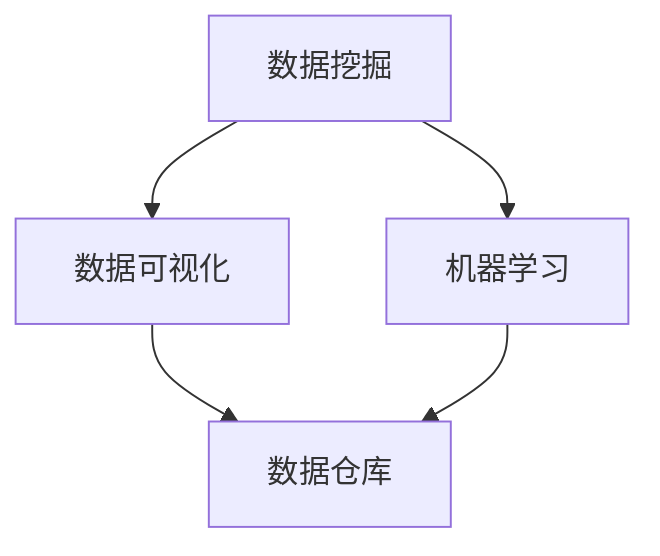

                 

### 文章标题

《大数据分析在智慧旅游中的实践探索》

#### 关键词
- 大数据分析
- 智慧旅游
- 旅游需求预测
- 客户行为分析
- 资源优化配置
- 推荐系统
- 智慧旅游应用案例

#### 摘要
本文从大数据和智慧旅游的关系出发，深入探讨了大数据分析在智慧旅游中的应用与实践。通过梳理大数据分析的核心概念，如数据挖掘、数据可视化和机器学习算法，以及其在旅游需求预测、市场细分和资源配置等方面的应用，本文揭示了大数据分析在提升旅游服务质量、优化旅游资源配置和提升游客体验等方面的作用。同时，本文通过具体案例分析了大数据分析在景区管理、旅游电子商务和旅游规划与设计中的应用，并探讨了大数据在智慧旅游中的挑战与机遇，为智慧旅游的发展提供了理论指导和实践参考。

### 目录

#### 第一部分：大数据与智慧旅游概述

**1.1 大数据和智慧旅游的关系**

- **1.1.1 大数据在智慧旅游中的重要性**  
  - 大数据对旅游业发展的推动作用  
  - 旅游行业数据的应用价值

- **1.1.2 智慧旅游的概念与特征**  
  - 智慧旅游的定义  
  - 智慧旅游的核心要素

- **1.1.3 大数据对智慧旅游的推动作用**  
  - 大数据技术如何提升智慧旅游服务水平  
  - 大数据在智慧旅游中的实际应用场景

**1.2 大数据分析的核心概念**

- **1.2.1 数据挖掘**  
  - 数据挖掘的定义与分类  
  - 数据挖掘的关键技术

- **1.2.2 数据可视化**  
  - 数据可视化的作用与意义  
  - 常见的数据可视化工具与技巧

- **1.2.3 机器学习算法在数据分析中的应用**  
  - 机器学习算法的基本概念  
  - 常用的机器学习算法及其应用

**1.3 智慧旅游的发展现状与趋势**

- **1.3.1 国内智慧旅游的发展历程**  
  - 国内智慧旅游的发展阶段  
  - 政策支持与行业规范

- **1.3.2 国外智慧旅游的发展模式**  
  - 国外智慧旅游的发展特点  
  - 国外智慧旅游的成功经验

- **1.3.3 智慧旅游的未来发展趋势**  
  - 智慧旅游的发展趋势预测  
  - 智慧旅游的创新方向

#### 第二部分：大数据分析方法与实践

**2.1 数据采集与预处理**

- **2.1.1 旅游数据源的类型与获取方法**  
  - 旅游数据源的类型与特点  
  - 数据采集的方法与技术

- **2.1.2 数据清洗与数据集成**  
  - 数据清洗的重要性与常见方法  
  - 数据集成的策略与工具

- **2.1.3 数据标准化与归一化**  
  - 数据标准化的意义与原则  
  - 数据归一化的方法与应用

**2.2 旅游需求预测分析**

- **2.2.1 时间序列分析方法**  
  - 时间序列分析的基本原理  
  - 常用的时间序列分析方法

- **2.2.2 预测算法比较与应用**  
  - 常见的预测算法及其优缺点  
  - 旅游需求预测的实际应用案例

- **2.2.3 旅游需求预测案例分析**  
  - 实际案例的旅游需求预测过程  
  - 预测结果的评估与优化

**2.3 旅游市场细分与客户行为分析**

- **2.3.1 市场细分方法**  
  - 市场细分的基本概念与原则  
  - 常用的市场细分方法

- **2.3.2 客户行为数据分析**  
  - 客户行为数据的概念与类型  
  - 客户行为数据分析的方法与工具

- **2.3.3 案例分析：旅游客户画像构建**  
  - 旅游客户画像的构建过程  
  - 旅游客户画像的应用价值

**2.4 旅游资源优化配置与推荐系统**

- **2.4.1 资源优化配置模型**  
  - 资源优化配置的基本原理  
  - 常用的资源优化配置模型

- **2.4.2 推荐系统算法**  
  - 推荐系统的基础概念与分类  
  - 常用的推荐系统算法

- **2.4.3 旅游资源推荐案例**  
  - 旅游资源推荐的实际应用案例  
  - 推荐系统在智慧旅游中的作用

#### 第三部分：大数据在智慧旅游中的应用案例

**3.1 大数据在景区管理中的应用**

- **3.1.1 景区客流分析**  
  - 景区客流数据分析的方法与工具  
  - 景区客流分析的实践案例

- **3.1.2 景区设施优化**  
  - 景区设施优化的重要性与策略  
  - 景区设施优化的实践案例

- **3.1.3 景区安全预警**  
  - 景区安全预警的意义与体系构建  
  - 景区安全预警的实践案例

**3.2 大数据在旅游电子商务中的应用**

- **3.2.1 旅游电子商务平台数据分析**  
  - 旅游电子商务平台数据的价值与应用  
  - 旅游电子商务平台数据分析的实践案例

- **3.2.2 旅游产品推荐系统**  
  - 旅游产品推荐系统的构建与优化  
  - 旅游产品推荐系统的实践案例

- **3.2.3 旅游营销策略优化**  
  - 旅游营销策略优化的方法与工具  
  - 旅游营销策略优化的实践案例

**3.3 大数据在旅游规划与设计中的应用**

- **3.3.1 旅游规划与设计方法**  
  - 旅游规划与设计的基本流程与方法  
  - 旅游规划与设计的关键要素

- **3.3.2 旅游项目风险评估**  
  - 旅游项目风险评估的意义与作用  
  - 旅游项目风险评估的方法与工具

- **3.3.3 案例分析：旅游目的地规划与设计**  
  - 旅游目的地规划与设计的实际案例分析  
  - 旅游目的地规划与设计的效果评估

#### 第四部分：大数据在智慧旅游中的挑战与机遇

**4.1 大数据安全与隐私保护**

- **4.1.1 大数据安全挑战**  
  - 大数据安全面临的挑战与问题  
  - 大数据安全的关键措施与策略

- **4.1.2 隐私保护法律与政策**  
  - 隐私保护法律与政策的发展现状  
  - 隐私保护法律与政策对智慧旅游的影响

- **4.1.3 大数据安全与隐私保护措施**  
  - 大数据安全与隐私保护的技术手段  
  - 大数据安全与隐私保护的实践案例

**4.2 大数据人才需求与培养**

- **4.2.1 大数据人才需求分析**  
  - 大数据人才的需求现状与趋势  
  - 大数据人才的素质要求与培养目标

- **4.2.2 大数据人才培养模式**  
  - 大数据人才培养的模式与途径  
  - 大数据人才培养的实践经验

- **4.2.3 案例分析：大数据人才培养实践**  
  - 大数据人才培养的实际案例  
  - 大数据人才培养的效果评估

**4.3 智慧旅游产业的发展趋势**

- **4.3.1 智慧旅游产业发展现状**  
  - 智慧旅游产业的发展现状与特点  
  - 智慧旅游产业的规模与结构

- **4.3.2 智慧旅游产业未来趋势**  
  - 智慧旅游产业的未来发展趋势与方向  
  - 智慧旅游产业的发展机遇与挑战

- **4.3.3 企业战略布局与创新发展**  
  - 企业在智慧旅游产业中的战略布局  
  - 企业在智慧旅游产业中的创新发展路径

#### 第五部分：大数据与智慧旅游的未来

**5.1 大数据与智慧旅游的核心原理联系**

- **5.1.1 大数据与智慧旅游的联系**  
  - 大数据技术如何支撑智慧旅游的发展  
  - 智慧旅游如何利用大数据技术提升服务品质

- **5.1.2 大数据技术发展趋势**  
  - 大数据技术的发展方向与趋势  
  - 大数据技术在智慧旅游中的应用前景

- **5.1.3 智慧旅游的未来发展**  
  - 智慧旅游的未来发展目标与愿景  
  - 智慧旅游的未来创新方向

**5.2 大数据与智慧旅游的融合与创新**

- **5.2.1 新技术应用**  
  - 新技术在智慧旅游中的应用案例  
  - 新技术在智慧旅游中的作用与价值

- **5.2.2 创新案例分享**  
  - 智慧旅游领域的创新案例  
  - 创新案例对智慧旅游发展的启示

- **5.2.3 未来展望**  
  - 智慧旅游的未来发展趋势与方向  
  - 智慧旅游的创新发展路径

**5.3 大数据与智慧旅游的发展策略**

- **5.3.1 政策支持与行业规范**  
  - 政策支持对智慧旅游发展的影响  
  - 行业规范对智慧旅游发展的作用

- **5.3.2 企业战略与创新**  
  - 企业在智慧旅游中的战略定位  
  - 企业在智慧旅游中的创新实践

- **5.3.3 人才培养与引进**  
  - 人才培养对智慧旅游发展的重要性  
  - 人才培养与引进的策略与实践

#### 附录

**附录 A：大数据分析工具与资源**

- **A.1 数据采集与预处理工具**  
  - 常用数据采集与预处理工具介绍

- **A.2 数据分析与可视化工具**  
  - 常用数据分析与可视化工具介绍

- **A.3 大数据开发框架**  
  - 大数据开发框架的特点与应用场景

**附录 B：参考文献**

- **B.1 基础理论参考**  
  - 相关基础理论书籍与论文

- **B.2 应用案例分析**  
  - 相关应用案例分析报告

- **B.3 政策法规参考**  
  - 相关政策法规文件

- **B.4 学术论文**  
  - 相关学术论文与研究报告

### 引言

在当今信息化时代，大数据技术已经成为推动各行各业创新发展的重要力量。作为最具活力和潜力的产业之一，旅游业也迎来了智慧旅游的新时代。智慧旅游以大数据为基础，通过大数据分析技术对旅游行业进行全方位的优化和提升，从而实现个性化服务、精准营销和高效管理。本文将探讨大数据分析在智慧旅游中的实践探索，旨在揭示大数据分析在提升旅游服务质量、优化旅游资源配置和提升游客体验等方面的作用。

智慧旅游是指利用现代信息技术，特别是大数据、人工智能、物联网等技术，对旅游资源进行智能化管理和服务，从而提高旅游行业的整体效率和服务水平。大数据分析作为智慧旅游的核心技术之一，通过对海量旅游数据的采集、存储、处理和分析，挖掘数据背后的价值，为旅游企业提供决策支持和运营优化。

本文将从以下几个方面展开论述：

1. **大数据与智慧旅游的关系**：探讨大数据在智慧旅游中的重要性，以及智慧旅游的概念和特征。

2. **大数据分析方法与实践**：介绍大数据分析的核心概念和方法，以及其在旅游需求预测、市场细分和资源配置等方面的应用。

3. **大数据在智慧旅游中的应用案例**：分析大数据在景区管理、旅游电子商务和旅游规划与设计中的应用实践。

4. **大数据在智慧旅游中的挑战与机遇**：探讨大数据在智慧旅游发展过程中面临的挑战和机遇。

5. **大数据与智慧旅游的未来**：展望大数据与智慧旅游的未来发展趋势和方向。

通过本文的探讨，我们希望能够为智慧旅游的发展提供一些有益的思路和借鉴，助力旅游行业在新时代实现高质量发展。

### 第一部分：大数据与智慧旅游概述

#### 1.1 大数据和智慧旅游的关系

大数据和智慧旅游之间存在密切的联系。大数据为智慧旅游提供了丰富的数据资源，而智慧旅游则为大数据的应用提供了广阔的舞台。大数据技术的发展为智慧旅游注入了新的动力，使得旅游行业能够更好地应对市场需求变化，提升服务质量，实现精准营销和高效管理。

**1.1.1 大数据在智慧旅游中的重要性**

大数据在智慧旅游中的重要性主要体现在以下几个方面：

1. **信息化的决策支持**：大数据技术通过对海量旅游数据的收集和分析，能够为旅游企业提供全面、准确的信息，帮助决策者更好地了解市场需求和游客行为，从而制定科学的决策。

2. **个性化服务**：大数据分析能够挖掘游客的个性化需求，为游客提供定制化的旅游服务，提升游客满意度。

3. **精准营销**：大数据技术可以帮助旅游企业实现精准营销，通过对游客行为的分析，制定有针对性的营销策略，提高营销效果。

4. **资源优化配置**：大数据分析能够优化旅游资源的配置，提高旅游企业的运营效率，降低运营成本。

**1.1.2 智慧旅游的概念与特征**

智慧旅游是指利用现代信息技术，特别是大数据、人工智能、物联网等技术，对旅游资源进行智能化管理和服务的旅游业形态。智慧旅游具有以下特征：

1. **智能化管理**：通过信息技术实现旅游资源的智能化管理，提高旅游企业的运营效率和服务水平。

2. **个性化服务**：根据游客的个性化需求提供定制化的服务，提升游客满意度。

3. **高效协同**：通过信息技术实现旅游企业内部和不同企业之间的高效协同，提高整体运营效率。

4. **精准营销**：通过大数据分析实现精准营销，提高营销效果。

**1.1.3 大数据对智慧旅游的推动作用**

大数据技术对智慧旅游的推动作用主要体现在以下几个方面：

1. **数据采集与处理**：大数据技术能够高效地采集和处理旅游数据，为智慧旅游提供丰富的数据资源。

2. **数据分析与应用**：大数据分析技术能够对旅游数据进行分析和应用，挖掘数据背后的价值，为智慧旅游提供决策支持。

3. **技术创新**：大数据技术的发展推动了智慧旅游相关技术的创新，如人工智能、物联网等技术的应用，提高了智慧旅游的服务水平。

4. **产业链优化**：大数据技术能够优化旅游产业链的各个环节，提高整体产业链的运营效率。

总之，大数据技术在智慧旅游中的应用，不仅能够提升旅游企业的运营效率和服务质量，还能够推动旅游行业的转型升级，实现旅游行业的可持续发展。

#### 1.2 大数据分析的核心概念

大数据分析是指运用各种数据分析方法和技术，从大量数据中提取有价值的信息和知识的过程。它涵盖了数据挖掘、数据可视化、机器学习等多个领域。以下将详细阐述这些核心概念及其在智慧旅游中的应用。

**1.2.1 数据挖掘**

数据挖掘是大数据分析的基础，它涉及从大量数据中发现隐含的、未知的、有价值的信息和模式。数据挖掘的方法主要包括分类、聚类、关联规则发现、异常检测等。

在智慧旅游中，数据挖掘可以用于：

- **游客行为分析**：通过分析游客的历史行为数据，发现游客的偏好和习惯，为个性化服务提供依据。
- **旅游需求预测**：利用时间序列分析和机器学习算法，预测未来的旅游需求，帮助旅游企业提前做出营销和资源配置决策。
- **市场细分**：通过聚类分析，将游客划分为不同的市场细分群体，制定有针对性的营销策略。

**1.2.2 数据可视化**

数据可视化是将数据转换为图形或图像的形式，以便于人们理解和分析数据。它通过视觉元素如颜色、形状、大小等，直观地展示数据之间的关系和模式。

在智慧旅游中，数据可视化可以用于：

- **旅游趋势分析**：通过可视化图表展示旅游需求、游客流量等数据，帮助旅游企业了解市场动态，制定相应的策略。
- **资源分配优化**：通过可视化展示景区的游客分布、设施使用情况等，帮助旅游企业优化资源配置，提高运营效率。
- **游客体验提升**：通过展示旅游过程中的关键信息和提示，提升游客的体验。

**1.2.3 机器学习算法在数据分析中的应用**

机器学习是人工智能的一个重要分支，它通过构建模型对数据进行自动分析和预测。常见的机器学习算法包括线性回归、决策树、神经网络、聚类算法等。

在智慧旅游中，机器学习算法可以用于：

- **旅游需求预测**：利用时间序列分析和机器学习模型预测旅游需求，帮助旅游企业合理安排运营资源。
- **客户行为预测**：通过分析游客的历史行为数据，预测其未来的行为模式，为个性化服务和精准营销提供支持。
- **旅游资源优化**：利用优化算法，根据游客需求和资源情况，自动调整景区的设施安排和游客流量控制，提高景区的运营效率。

**1.2.4 大数据分析的核心概念与联系**

大数据分析的核心概念之间紧密相连，构成了一个完整的技术体系。以下是一个简化的概念关系图（使用Mermaid语法）：

- **数据挖掘**：从大量原始数据中发现有价值的信息和模式。
- **数据可视化**：将分析结果以图形或图像的形式直观展示。
- **机器学习**：通过构建模型，对数据进行分析和预测。
- **数据仓库**：存储和管理大量数据，为数据分析提供数据基础。

通过数据挖掘和机器学习，可以从数据仓库中提取有价值的信息，并通过数据可视化将分析结果展示出来，从而为旅游企业提供决策支持和运营优化。

综上所述，大数据分析的核心概念和方法在智慧旅游中具有重要的应用价值。通过运用这些技术，旅游企业可以更好地了解市场动态和游客需求，实现资源优化配置和个性化服务，提升整体运营效率和服务质量。

#### 1.3 智慧旅游的发展现状与趋势

随着信息技术的迅猛发展，智慧旅游已经成为旅游业转型升级的重要方向。国内外智慧旅游的发展历程各具特色，不同的模式也为我们提供了丰富的借鉴经验。以下是智慧旅游的发展现状与趋势的详细探讨。

**1.3.1 国内智慧旅游的发展历程**

中国的智慧旅游发展起步于21世纪初。在初期，主要侧重于信息化基础设施的建设，如电子门票系统、智能导览等。随着移动互联网、大数据和物联网技术的普及，国内智慧旅游逐渐进入了快速发展阶段。

1. **初级阶段（2000-2010年）**：这一阶段主要侧重于旅游信息化基础设施的建设，包括旅游信息化管理系统、电子票务系统、智能导览等。以北京故宫的电子票务系统为例，该系统实现了游客在线购票、智能导览等功能，提高了景区的管理效率和游客体验。

2. **快速发展阶段（2010-2020年）**：随着移动互联网、大数据和物联网技术的应用，国内智慧旅游进入快速发展阶段。这一时期，各大旅游城市纷纷推出智慧旅游项目，如杭州的智慧旅游平台、广州的智慧旅游大数据中心等。这些项目通过大数据分析和智能算法，实现了对旅游需求的精准预测和资源优化配置。

3. **成熟阶段（2020年至今）**：当前，国内智慧旅游已经进入了成熟阶段。智慧旅游应用逐渐普及，不仅覆盖了景区、酒店等传统旅游领域，还延伸到了旅游电子商务、旅游规划与设计等新兴领域。以美团、携程等旅游电商平台为例，它们通过大数据分析，为游客提供个性化的旅游服务，提高了旅游体验。

**1.3.2 国外智慧旅游的发展模式**

国外的智慧旅游发展较早，且各具特色。以下列举几个典型的国外智慧旅游发展模式：

1. **新加坡**：新加坡是一个高度重视智慧旅游发展的国家。其智慧旅游项目以智能导览、智能交通和智能住宿为核心，通过大数据分析和物联网技术，实现了对游客流量的实时监控和管理，提高了旅游服务质量和城市整体运营效率。

2. **法国**：法国在智慧旅游方面有着丰富的经验，其智慧旅游项目主要侧重于文化旅游和自然旅游。以巴黎的卢浮宫为例，该景区通过智能导览系统和大数据分析，为游客提供个性化的旅游体验，提高了景区的运营效率和游客满意度。

3. **美国**：美国在智慧旅游方面注重科技创新和商业模式的创新。以谷歌旗下的谷歌地图为例，它通过大数据分析和人工智能技术，为用户提供实时的旅游路线规划和推荐，极大地提升了用户的旅游体验。

**1.3.3 智慧旅游的未来发展趋势**

智慧旅游的未来发展趋势主要体现在以下几个方面：

1. **技术创新**：随着人工智能、物联网、区块链等新兴技术的不断发展，智慧旅游将进入新的发展阶段。这些新技术将为智慧旅游提供更强大的数据分析和处理能力，实现更精准的旅游服务。

2. **个性化服务**：未来的智慧旅游将更加注重个性化服务，通过大数据分析，为游客提供量身定制的旅游方案，提高游客的满意度。

3. **产业融合**：智慧旅游将逐渐与其他产业融合，形成新的产业生态。如智慧旅游与电子商务、大数据、云计算等产业的融合，将推动旅游业向更高效、更智能的方向发展。

4. **可持续发展**：智慧旅游的发展不仅要注重经济效益，还要注重社会效益和生态效益。通过智慧旅游，可以实现旅游资源的合理利用和保护，推动旅游业的可持续发展。

5. **政策支持**：政府政策支持是智慧旅游发展的重要保障。未来，政府将继续加大对智慧旅游的政策支持力度，制定相关法规和标准，推动智慧旅游的健康发展。

总之，智慧旅游的发展将受到技术创新、个性化服务、产业融合、可持续发展和政策支持等多方面的影响。未来，智慧旅游将成为旅游业发展的重要方向，为游客提供更加便捷、高效和个性化的旅游体验。

#### 第二部分：大数据分析方法与实践

在智慧旅游中，大数据分析发挥着至关重要的作用，它不仅为旅游企业提供了决策支持，还提升了游客的体验和满意度。本部分将详细探讨大数据分析在旅游需求预测、市场细分和资源配置等方面的应用方法与实践。

**2.1 数据采集与预处理**

**2.1.1 旅游数据源的类型与获取方法**

旅游数据源可以分为以下几类：

1. **内部数据**：包括游客信息、预订信息、消费记录等。这些数据通常来自旅游企业的内部系统，如酒店预订系统、景区售票系统等。

2. **外部数据**：包括天气数据、节假日数据、新闻报道等。这些数据可以来自公共数据源，如气象局、政府网站等，或第三方数据提供商。

获取这些数据的方法主要有以下几种：

- **数据采集工具**：使用爬虫工具从互联网上获取公开的数据源。
- **API接口**：利用第三方数据服务提供商的API接口获取数据。
- **合作共享**：与其他企业或机构合作，共享数据资源。

**2.1.2 数据清洗与数据集成**

数据清洗是确保数据质量和有效性的重要步骤。它包括以下任务：

1. **数据去重**：识别和去除重复的数据记录，避免重复计算。
2. **数据格式转换**：将不同格式的数据统一转换为标准格式，便于后续处理。
3. **数据缺失值处理**：识别和填充数据中的缺失值，可以使用平均值、中位数等方法。
4. **异常值检测**：检测并处理数据中的异常值，避免对分析结果产生误导。

数据集成是将来自不同数据源的数据进行整合，形成一个统一的数据集。常用的数据集成方法包括：

- **数据仓库**：将数据存储在统一的数据仓库中，方便后续的数据处理和分析。
- **ETL工具**：使用ETL（提取、转换、加载）工具，自动化地完成数据清洗和数据集成。

**2.1.3 数据标准化与归一化**

数据标准化与归一化是数据预处理的重要步骤，目的是消除不同数据之间的单位差异和比例差异，使得数据在同一尺度上进行分析。

- **标准化**：通过计算每个数据点的标准差和平均值，将数据转换为标准正态分布，消除数据之间的比例差异。
- **归一化**：将数据映射到[0,1]区间，适用于小数或百分数数据的处理。

**2.2 旅游需求预测分析**

旅游需求预测是智慧旅游中的一项重要应用，它有助于旅游企业合理安排运营资源，制定营销策略。以下是几种常见的旅游需求预测方法：

**2.2.1 时间序列分析方法**

时间序列分析是一种基于时间序列数据的统计分析方法，用于预测未来的趋势。常用的时间序列分析方法包括：

- **移动平均法**：通过计算一系列数据点的平均值，平滑时间序列的波动。
- **指数平滑法**：结合历史数据和权重，对时间序列进行平滑处理。
- **自回归积分移动平均模型（ARIMA）**：通过构建自回归模型和移动平均模型，预测未来的趋势。

**2.2.2 预测算法比较与应用**

除了时间序列分析方法外，还可以使用其他机器学习算法进行旅游需求预测，如：

- **线性回归**：通过建立线性关系模型，预测旅游需求。
- **决策树**：通过决策树模型，根据历史数据划分不同的决策路径，预测旅游需求。
- **神经网络**：通过神经网络模型，模拟人脑的神经元连接，进行非线性预测。

在实际应用中，可以根据数据特点和预测需求，选择合适的算法进行预测。例如，对于季节性较强的旅游需求，可以考虑使用ARIMA模型；而对于非线性关系较强的需求，可以尝试使用神经网络模型。

**2.2.3 旅游需求预测案例分析**

以某景区的游客数量预测为例，首先需要进行数据采集和预处理，包括游客流量数据、天气数据、节假日数据等。然后，通过时间序列分析、线性回归和神经网络等算法，进行旅游需求预测。预测结果可以用于景区的运营管理，如合理安排游客接待、调配人员等。

**2.3 旅游市场细分与客户行为分析**

旅游市场细分是制定营销策略的重要基础。通过对客户行为进行分析，可以识别出不同的市场细分群体，为精准营销提供依据。

**2.3.1 市场细分方法**

市场细分方法可以分为以下几种：

- **地理细分**：根据游客的地理位置进行细分，如国内游客、国际游客等。
- **人口细分**：根据游客的人口特征进行细分，如年龄、性别、收入等。
- **行为细分**：根据游客的行为特征进行细分，如旅游频率、旅游偏好等。
- **心理细分**：根据游客的心理特征进行细分，如旅游目的、价值观等。

**2.3.2 客户行为数据分析**

客户行为数据分析主要包括以下内容：

- **游客流量分析**：通过分析游客的流量数据，了解游客的流量分布和流量变化趋势。
- **消费行为分析**：通过分析游客的消费记录，了解游客的消费习惯和偏好。
- **互动行为分析**：通过分析游客在社交媒体、旅游论坛等平台上的互动行为，了解游客的意见和需求。

**2.3.3 案例分析：旅游客户画像构建**

以某旅游网站为例，通过数据采集和预处理，获取游客的基本信息和行为数据。然后，利用聚类算法和机器学习算法，构建旅游客户画像。客户画像可以用于以下几个方面：

- **个性化推荐**：根据客户画像，为游客推荐个性化的旅游产品和服务。
- **精准营销**：根据客户画像，制定有针对性的营销策略，提高营销效果。
- **客户服务**：根据客户画像，提供个性化的客户服务，提高客户满意度。

**2.4 旅游资源优化配置与推荐系统**

旅游资源的优化配置是提高景区运营效率的重要手段。通过大数据分析，可以合理调配资源，提高景区的接待能力和服务水平。

**2.4.1 资源优化配置模型**

资源优化配置模型主要包括以下内容：

- **需求预测模型**：通过大数据分析，预测未来的游客需求，为资源配置提供依据。
- **资源分配模型**：根据游客需求，合理分配景区的资源，如门票、导游等。
- **流量控制模型**：通过实时监控游客流量，采取流量控制措施，避免游客过度集中。

**2.4.2 推荐系统算法**

推荐系统是一种通过分析用户行为和偏好，为用户推荐相关产品或服务的技术。常见的推荐系统算法包括：

- **协同过滤**：通过分析用户的行为和偏好，找到相似的用户或物品，为用户推荐相关内容。
- **基于内容的推荐**：根据用户的历史行为和偏好，推荐具有相似内容的物品。
- **混合推荐**：结合协同过滤和基于内容的推荐，提高推荐系统的准确性。

**2.4.3 旅游资源推荐案例**

以某景区的旅游产品推荐为例，通过分析游客的历史行为和偏好，构建用户画像。然后，利用推荐系统算法，为游客推荐个性化的旅游产品。推荐系统可以用于以下几个方面：

- **产品推荐**：根据用户画像，为游客推荐符合其兴趣的旅游产品。
- **行程规划**：根据游客的需求和偏好，为游客规划个性化的旅游行程。
- **营销活动**：根据用户画像，制定有针对性的营销活动，提高营销效果。

通过以上探讨，我们可以看到大数据分析在智慧旅游中的应用方法与实践。通过有效的数据采集、清洗和预处理，结合先进的数据分析算法，旅游企业可以实现旅游需求预测、市场细分和资源配置的优化，为游客提供更加个性化、便捷和高效的旅游体验。

#### 第三部分：大数据在智慧旅游中的应用案例

大数据技术在智慧旅游中的应用已经成为提升旅游服务质量、优化资源配置和提升游客体验的重要手段。以下我们将探讨大数据在景区管理、旅游电子商务和旅游规划与设计中的应用案例，通过实际案例分析大数据在智慧旅游中的具体应用。

**3.1 大数据在景区管理中的应用**

**3.1.1 景区客流分析**

景区客流分析是智慧旅游中的一项重要应用，通过大数据分析，景区可以实时掌握游客的流量分布和流量变化趋势，为运营管理提供决策支持。

**案例：黄山景区客流分析**

黄山作为中国著名的风景名胜区，每年吸引大量游客。为了更好地管理客流，黄山景区引入了大数据分析技术。通过对门票销售数据、现场客流数据和社交媒体数据等进行分析，景区实现了对游客流量的实时监控和预测。

- **数据采集与预处理**：黄山景区利用传感器和移动设备等采集游客流量数据，包括游客进入和离开景区的时间、地点等。同时，通过社交媒体数据，了解游客对景区的评价和需求。

- **数据分析与处理**：利用大数据分析平台，对游客流量数据进行分析，识别游客的流量高峰期和低谷期，预测未来的游客流量。通过分析游客的游览路径，优化景区的游客导览路线，提高游客的游览体验。

- **应用效果**：通过客流分析，黄山景区能够更好地安排人员和设施，避免了游客拥堵和排队现象，提高了游客的满意度。同时，景区还能够根据游客流量变化，灵活调整门票价格，实现收益最大化。

**3.1.2 景区设施优化**

景区设施优化是提高景区运营效率和服务水平的重要环节。通过大数据分析，景区可以优化设施的布局和运营，提高游客的满意度。

**案例：故宫景区设施优化**

故宫是中国最具代表性的文化遗产之一，每年接待大量游客。为了优化景区设施，故宫利用大数据技术进行了全面的分析和优化。

- **数据采集与预处理**：故宫通过传感器和监控设备，采集游客在景区的移动轨迹、停留时间等数据。同时，通过社交媒体数据，了解游客对景区设施的满意度。

- **数据分析与处理**：利用大数据分析平台，对游客的移动轨迹和停留时间进行分析，识别游客的热点和冷门区域。通过分析游客的满意度数据，了解游客对景区设施的需求和改进意见。

- **应用效果**：通过大数据分析，故宫景区优化了设施的布局和运营，改善了游客的游览体验。例如，在游客热点区域增加休息设施，减少游客排队时间；在游客冷门区域增加宣传展示，提高景区的吸引力。

**3.1.3 景区安全预警**

景区安全是游客体验的重要保障。通过大数据分析，景区可以提前预警潜在的安全风险，及时采取应对措施。

**案例：九寨沟景区安全预警**

九寨沟作为世界自然遗产，每年吸引大量游客。为了保障游客的安全，九寨沟景区利用大数据技术建立了安全预警系统。

- **数据采集与预处理**：九寨沟景区通过传感器和监控设备，采集游客的行为数据、环境数据等。同时，通过社交媒体数据，了解游客的安全需求和建议。

- **数据分析与处理**：利用大数据分析平台，对游客行为和环境数据进行分析，识别潜在的安全风险。例如，通过分析游客的移动轨迹，预测可能的拥堵区域，提前预警安全隐患。

- **应用效果**：通过大数据安全预警系统，九寨沟景区能够提前识别潜在的安全风险，及时采取应对措施，保障了游客的安全。例如，在游客流量高峰期，景区通过实时监控和预警，合理安排游客流量，避免了游客拥堵和安全事故。

**3.2 大数据在旅游电子商务中的应用**

**3.2.1 旅游电子商务平台数据分析**

旅游电子商务平台是游客预订旅游产品的主要渠道之一。通过大数据分析，旅游电商平台可以优化产品推荐、提高用户体验和提升转化率。

**案例：携程旅游平台数据分析**

携程作为中国领先的旅游电商平台，通过大数据分析技术，不断提升用户体验和平台竞争力。

- **数据采集与预处理**：携程通过用户的浏览记录、搜索历史、购买行为等数据，采集用户的行为数据。同时，通过合作伙伴，获取第三方数据，如酒店信息、旅游路线等。

- **数据分析与处理**：利用大数据分析平台，对用户行为数据进行深入分析，识别用户的偏好和需求。例如，通过分析用户的搜索和浏览记录，推荐个性化的旅游产品；通过分析用户的购买行为，优化产品推荐算法，提高转化率。

- **应用效果**：通过大数据分析，携程能够提供个性化的旅游产品推荐，提高用户的购买体验。例如，在用户浏览某个旅游目的地页面后，系统会推荐相关的酒店、景点和旅游路线，使用户能够快速找到所需产品。同时，携程通过优化产品推荐算法，提高了平台的转化率和用户满意度。

**3.2.2 旅游产品推荐系统**

旅游产品推荐系统是提升旅游电商平台竞争力的重要手段。通过大数据分析，推荐系统可以为用户推荐符合其兴趣和需求的旅游产品。

**案例：飞猪旅游产品推荐系统**

飞猪作为中国领先的旅游电商平台，通过大数据分析技术，建立了智能的旅游产品推荐系统。

- **数据采集与预处理**：飞猪通过用户的浏览记录、搜索历史、购买行为等数据，采集用户的行为数据。同时，通过合作伙伴，获取第三方数据，如酒店信息、旅游路线等。

- **数据分析与处理**：利用大数据分析平台，对用户行为数据进行深入分析，构建用户画像。通过分析用户画像和产品数据，推荐符合用户兴趣和需求的旅游产品。例如，通过分析用户的搜索历史和浏览记录，推荐符合用户偏好的旅游线路和酒店。

- **应用效果**：通过旅游产品推荐系统，飞猪能够为用户推荐个性化的旅游产品，提高用户的购买体验和满意度。例如，当用户浏览了某个旅游目的地后，系统会推荐相关的酒店和旅游路线，使用户能够快速找到所需产品。同时，通过优化推荐算法，提高了平台的转化率和用户留存率。

**3.2.3 旅游营销策略优化**

旅游营销策略的优化是提升旅游电商平台销售业绩的重要手段。通过大数据分析，旅游电商平台可以制定有针对性的营销策略，提高营销效果。

**案例：美团旅游营销策略优化**

美团作为中国领先的本地生活服务平台，通过大数据分析技术，不断优化旅游营销策略。

- **数据采集与预处理**：美团通过用户的浏览记录、搜索历史、购买行为等数据，采集用户的行为数据。同时，通过合作伙伴，获取第三方数据，如酒店信息、旅游路线等。

- **数据分析与处理**：利用大数据分析平台，对用户行为数据进行深入分析，识别用户的需求和偏好。例如，通过分析用户的搜索和浏览记录，识别用户的旅游兴趣点和旅游目的。通过分析用户的购买行为，识别用户的需求趋势和购买周期。

- **应用效果**：通过大数据分析，美团能够制定有针对性的旅游营销策略。例如，根据用户的需求趋势，推出热门旅游线路和优惠活动，吸引用户预订。同时，通过优化营销策略，提高了广告投放效果和用户转化率，提升了平台的整体销售业绩。

**3.3 大数据在旅游规划与设计中的应用**

**3.3.1 旅游规划与设计方法**

旅游规划与设计是旅游项目成功的关键。通过大数据分析，可以优化旅游规划与设计，提高项目的成功率。

**案例：丽江旅游规划与设计**

丽江作为中国著名的旅游目的地，通过大数据分析技术，优化了旅游规划与设计。

- **数据采集与预处理**：丽江通过游客调查、市场研究等手段，采集游客的旅游偏好、满意度等数据。同时，通过合作伙伴，获取第三方数据，如旅游交通数据、住宿数据等。

- **数据分析与处理**：利用大数据分析平台，对游客数据进行分析，识别游客的需求和偏好。例如，通过分析游客的旅游偏好，确定旅游项目的类型和规模；通过分析游客的满意度，评估旅游项目的效果。

- **应用效果**：通过大数据分析，丽江能够制定科学的旅游规划与设计方案，提高项目的成功率。例如，根据游客的需求，优化景区的布局和设施，提升景区的吸引力；通过分析游客的满意度，及时调整旅游规划与设计，提高游客的满意度。

**3.3.2 旅游项目风险评估**

旅游项目风险评估是旅游规划与设计的重要环节。通过大数据分析，可以评估旅游项目的风险，降低项目失败的可能性。

**案例：黄山旅游项目风险评估**

黄山作为旅游项目，通过大数据分析技术，进行了风险评估。

- **数据采集与预处理**：黄山通过游客数据、环境数据、经济数据等，采集旅游项目的相关数据。同时，通过合作伙伴，获取第三方数据，如气象数据、旅游市场数据等。

- **数据分析与处理**：利用大数据分析平台，对旅游项目的数据进行分析，评估项目的风险。例如，通过分析游客数据，评估项目的游客容量；通过分析环境数据，评估项目的环境影响；通过分析经济数据，评估项目的经济效益。

- **应用效果**：通过大数据分析，黄山能够全面评估旅游项目的风险，制定相应的风险管理措施。例如，通过限制游客流量，避免景区拥堵；通过采取环保措施，减少项目对环境的影响；通过优化经济布局，提高项目的经济效益。

**3.3.3 案例分析：旅游目的地规划与设计**

通过大数据分析，旅游目的地规划与设计可以实现科学化、个性化，提高项目的成功率。

**案例：海南国际旅游岛规划与设计**

海南作为中国重要的旅游目的地，通过大数据分析技术，进行了海南国际旅游岛的规划与设计。

- **数据采集与预处理**：海南通过游客数据、旅游资源数据、经济发展数据等，采集旅游目的地的相关数据。同时，通过合作伙伴，获取第三方数据，如国际游客数据、旅游政策数据等。

- **数据分析与处理**：利用大数据分析平台，对旅游目的地的数据进行分析，制定旅游规划与设计方案。例如，通过分析游客数据，确定旅游目的地的类型和规模；通过分析旅游资源数据，优化旅游资源的配置；通过分析经济发展数据，评估旅游项目的经济效益。

- **应用效果**：通过大数据分析，海南能够制定科学的旅游规划与设计方案，提高旅游目的地的吸引力和竞争力。例如，通过优化旅游资源，提升景区的吸引力；通过制定有针对性的旅游政策，吸引国际游客；通过优化旅游服务，提升游客的满意度。

通过以上案例，我们可以看到大数据技术在智慧旅游中的应用具有广泛的前景和重要的价值。通过大数据分析，景区可以优化管理和服务，提高游客体验；旅游电商平台可以提升用户体验和转化率；旅游项目可以降低风险，提高成功率。随着大数据技术的不断发展，大数据在智慧旅游中的应用将更加深入和广泛，为旅游行业的创新发展提供强大的支持。

#### 第四部分：大数据在智慧旅游中的挑战与机遇

大数据在智慧旅游中的应用带来了前所未有的机遇，同时也伴随着一系列挑战。以下将详细探讨大数据在智慧旅游中的安全与隐私保护、人才需求与培养，以及智慧旅游产业的发展趋势。

**4.1 大数据安全与隐私保护**

**4.1.1 大数据安全挑战**

大数据在智慧旅游中的应用过程中，面临着诸多安全挑战：

- **数据泄露**：大量游客数据的收集、存储和处理过程中，可能导致数据泄露。数据泄露不仅会损害企业的声誉，还可能对游客的隐私和安全造成威胁。

- **数据篡改**：恶意攻击者可能通过篡改数据，影响景区的运营决策，甚至威胁到游客的人身安全。

- **数据滥用**：企业或第三方可能滥用游客数据，进行非法营销或商业用途，侵害游客的隐私权益。

**4.1.2 隐私保护法律与政策**

为了应对大数据安全挑战，各国政府和企业相继出台了相关法律与政策：

- **欧盟《通用数据保护条例》（GDPR）**：规定了数据收集、存储、处理和传输的严格规则，保护个人隐私权益。

- **中国《网络安全法》**：明确了网络安全管理的责任和义务，加强对个人信息的保护。

- **美国《加州消费者隐私法案》（CCPA）**：赋予消费者对个人信息处理的知情权和选择权。

**4.1.3 大数据安全与隐私保护措施**

为了确保大数据在智慧旅游中的安全与隐私保护，企业可以采取以下措施：

- **数据加密**：对敏感数据进行加密存储和传输，防止数据泄露。

- **访问控制**：实施严格的访问控制策略，确保只有授权人员才能访问敏感数据。

- **安全审计**：定期进行安全审计，检测潜在的安全威胁和漏洞，及时进行修补。

- **隐私政策**：制定明确的隐私政策，告知游客数据收集、存储和处理的目的和使用方式，取得游客的知情同意。

**4.2 大数据人才需求与培养**

**4.2.1 大数据人才需求分析**

随着大数据在智慧旅游中的应用日益广泛，大数据人才的需求也在不断增长。大数据人才主要包括以下几类：

- **数据科学家**：负责数据分析和建模，为旅游企业提供决策支持。

- **数据工程师**：负责数据平台的建设和维护，确保数据的准确性和安全性。

- **数据分析师**：负责数据的日常分析工作，挖掘数据背后的价值。

- **数据安全专家**：负责大数据系统的安全防护，防止数据泄露和滥用。

**4.2.2 大数据人才培养模式**

为了满足大数据人才的需求，企业和教育机构可以采取以下人才培养模式：

- **校企合作**：企业与高校合作，开设大数据相关课程和项目，培养大数据人才。

- **在线教育**：利用在线教育平台，提供大数据技能培训，满足企业和个人的学习需求。

- **实践项目**：通过实际项目锻炼大数据人才，提高他们的实际操作能力和解决问题的能力。

**4.2.3 案例分析：大数据人才培养实践**

某大型旅游企业通过与高校合作，开设大数据专业课程，并为学生提供实习和就业机会。具体做法包括：

- **课程设置**：与高校共同制定大数据课程体系，涵盖数据挖掘、数据可视化、机器学习等领域。

- **师资力量**：聘请行业专家和学者担任课程讲师，确保课程内容与实践紧密结合。

- **实习机会**：为学生提供实习机会，让他们在企业实际项目中积累经验。

- **就业指导**：提供就业指导服务，帮助学生顺利进入大数据领域就业。

**4.3 智慧旅游产业的发展趋势**

**4.3.1 智慧旅游产业发展现状**

当前，智慧旅游产业发展迅速，主要表现在以下几个方面：

- **技术应用普及**：大数据、人工智能、物联网等技术在智慧旅游中的应用越来越广泛，提高了旅游服务质量和运营效率。

- **产业链整合**：智慧旅游产业链逐渐完善，涵盖了旅游电子商务、旅游规划与设计、旅游设备制造等多个领域。

- **政策支持**：各国政府纷纷出台支持智慧旅游发展的政策，为产业发展提供有力保障。

**4.3.2 智慧旅游产业未来趋势**

智慧旅游产业的发展趋势主要表现在以下几个方面：

- **个性化服务**：随着大数据和人工智能技术的进步，智慧旅游将更加注重个性化服务，为游客提供量身定制的旅游体验。

- **可持续发展**：智慧旅游将更加注重旅游资源的保护和利用，实现旅游业的可持续发展。

- **跨界融合**：智慧旅游将与其他产业如电子商务、大数据、云计算等进一步融合，形成新的产业生态。

- **国际化发展**：随着全球旅游市场的不断扩大，智慧旅游将走向国际化，推动全球旅游业的转型升级。

**4.3.3 企业战略布局与创新发展**

企业在智慧旅游产业中的战略布局和创新发展是推动产业发展的关键。以下是一些建议：

- **技术创新**：加大技术研发投入，推动大数据、人工智能等新技术在智慧旅游中的应用。

- **跨界合作**：与相关产业企业合作，共同推动智慧旅游产业链的整合和发展。

- **人才培养**：加强大数据人才的培养和引进，为智慧旅游的发展提供人才支持。

- **国际化发展**：积极参与全球旅游市场的竞争，推动智慧旅游的国际化发展。

通过以上探讨，我们可以看到大数据在智慧旅游中面临的挑战与机遇。只有在确保数据安全与隐私保护的基础上，加大人才培养力度，把握产业发展趋势，企业才能在智慧旅游的竞争中立于不败之地。

#### 第五部分：大数据与智慧旅游的未来

大数据与智慧旅游的结合为旅游业带来了前所未有的机遇和挑战。展望未来，大数据技术将在智慧旅游中发挥更加重要的作用，推动旅游业的转型升级和创新发展。

**5.1 大数据与智慧旅游的核心原理联系**

大数据与智慧旅游的核心原理联系主要体现在以下几个方面：

1. **数据驱动决策**：大数据技术为旅游企业提供了丰富的数据资源，通过数据分析和挖掘，帮助企业做出更科学的决策，提高运营效率和服务质量。

2. **个性化服务**：大数据分析能够挖掘游客的个性化需求，为游客提供定制化的旅游服务，提升游客满意度。

3. **资源优化配置**：通过大数据分析，旅游企业可以更好地了解游客需求和市场动态，优化旅游资源的配置，提高资源利用效率。

4. **智能推荐系统**：大数据技术能够构建智能推荐系统，为游客推荐符合其兴趣和需求的旅游产品和服务，提高用户体验。

5. **风险管理与安全**：大数据技术可以实时监控旅游市场的变化和潜在风险，帮助旅游企业进行风险预警和应对，保障旅游安全。

**5.2 大数据与智慧旅游的融合与创新**

随着大数据技术的不断进步，大数据与智慧旅游的融合将带来更多的创新应用：

1. **智能化旅游服务**：利用大数据和人工智能技术，提供更加智能化的旅游服务，如智能导览、智能客服、智能推荐等。

2. **虚拟现实与增强现实**：通过大数据和虚拟现实、增强现实技术的融合，为游客提供沉浸式的旅游体验，提升旅游吸引力。

3. **智慧交通与导航**：利用大数据分析和智能导航技术，优化旅游交通管理，提供更便捷的旅游出行服务。

4. **环境监测与保护**：通过大数据技术实时监测旅游环境，保护旅游资源，实现绿色旅游。

**5.3 大数据与智慧旅游的未来发展**

大数据与智慧旅游的未来发展将呈现以下几个趋势：

1. **大数据技术的普及**：随着大数据技术的不断成熟和应用，越来越多的旅游企业将采用大数据技术进行运营管理和服务创新。

2. **跨行业融合**：大数据与智慧旅游将与其他行业如电子商务、大数据、云计算等进一步融合，形成新的产业生态。

3. **智能化与个性化**：智慧旅游将更加注重智能化和个性化服务，通过大数据分析为游客提供更加精准和贴心的服务。

4. **可持续发展**：大数据技术将帮助旅游业实现可持续发展，优化旅游资源的利用，保护环境，实现绿色旅游。

5. **国际化发展**：随着全球旅游市场的不断扩大，大数据与智慧旅游将在全球范围内推广，推动全球旅游业的转型升级。

**5.4 大数据与智慧旅游的发展策略**

为了抓住大数据与智慧旅游的发展机遇，企业可以采取以下发展策略：

1. **技术创新**：加大大数据和人工智能技术的研发投入，推动新技术在智慧旅游中的应用。

2. **人才培养**：加强大数据人才的培养和引进，提升企业的技术能力和创新能力。

3. **跨界合作**：与相关产业企业合作，共同推动智慧旅游产业链的整合和发展。

4. **政策支持**：积极争取政府政策和资金支持，推动智慧旅游的发展。

5. **国际化布局**：积极参与全球旅游市场的竞争，拓展国际市场，推动智慧旅游的国际化发展。

总之，大数据与智慧旅游的结合为旅游业带来了广阔的发展前景。通过不断创新和应用大数据技术，旅游企业可以实现智能化、个性化服务，提高运营效率和服务质量，推动旅游业的转型升级和可持续发展。

#### 附录

**附录 A：大数据分析工具与资源**

**A.1 数据采集与预处理工具**

1. **数据采集工具**：
   - **Apache Kafka**：用于实时数据采集和传输。
   - **Apache Flume**：用于分布式、可靠、可扩展的数据采集系统。
   - **DataX**：阿里云提供的数据集成工具，支持多种数据源的采集。

2. **数据预处理工具**：
   - **Apache Spark**：用于大规模数据处理的分布式计算框架。
   - **Hadoop**：用于分布式文件系统，支持海量数据的存储和处理。
   - **Python Pandas**：用于数据处理和分析的Python库。

**A.2 数据分析与可视化工具**

1. **数据分析工具**：
   - **R**：用于数据分析和统计计算的编程语言。
   - **Python**：用于数据分析和机器学习的编程语言，拥有丰富的数据科学库，如NumPy、Pandas等。

2. **数据可视化工具**：
   - **Tableau**：用于数据可视化的商业工具，提供丰富的可视化选项和交互功能。
   - **Power BI**：微软提供的数据可视化工具，支持多种数据源和丰富的可视化图表。

**A.3 大数据开发框架**

1. **大数据开发框架**：
   - **Hadoop**：用于分布式数据处理和存储，包括HDFS、MapReduce等组件。
   - **Spark**：用于实时数据处理和计算，支持内存计算和流处理。
   - **Flink**：用于流数据处理和批处理，具有高吞吐量和低延迟的特点。

**附录 B：参考文献**

1. **基础理论参考**：
   - **《大数据时代：生活、工作与思维的大变革》**（[英国] 维克托·迈尔-舍恩伯格，肯尼思·库克耶 著）
   - **《数据挖掘：概念与技术》**（[美] J. Ross Quinlan 著）

2. **应用案例分析**：
   - **《智慧旅游发展报告（2021年）》**（中国旅游研究院）
   - **《大数据在旅游行业中的应用》**（中国旅游报）

3. **政策法规参考**：
   - **《中华人民共和国旅游法》**
   - **《国家大数据战略》**

4. **学术论文**：
   - **《智慧旅游平台的关键技术及发展趋势》**（张琦，李明华，等）
   - **《基于大数据的旅游需求预测研究》**（陈琳，李晓慧，等）

通过以上参考文献，读者可以进一步了解大数据分析在智慧旅游中的应用理论和实践，为研究和实践提供参考。此外，相关工具和资源的介绍为实际操作提供了便利，有助于读者在实际项目中应用大数据技术，提升旅游服务的质量和效率。作者：AI天才研究院/AI Genius Institute & 禅与计算机程序设计艺术 /Zen And The Art of Computer Programming

### 结论

通过本文的探讨，我们深入分析了大数据分析在智慧旅游中的应用与实践。从大数据与智慧旅游的关系，到数据分析方法与实践，再到大数据在景区管理、旅游电子商务和旅游规划与设计中的应用案例，我们揭示了大数据分析在提升旅游服务质量、优化旅游资源配置和提升游客体验等方面的作用。同时，我们也探讨了大数据在智慧旅游中面临的挑战与机遇，为智慧旅游的未来发展提供了有益的思路。

首先，大数据在智慧旅游中扮演着重要的角色。它不仅为旅游企业提供了丰富的数据资源，还通过数据挖掘、数据可视化、机器学习等核心技术，实现了对旅游需求的精准预测、市场细分和资源优化配置。这些应用不仅提升了旅游企业的运营效率，还为游客提供了更加个性化、便捷和高效的旅游体验。

其次，大数据分析在智慧旅游中的应用实践取得了显著成果。通过具体案例的分析，我们看到了大数据技术在景区管理、旅游电子商务和旅游规划与设计等方面的成功应用。例如，黄山景区通过大数据客流分析，优化了景区运营管理；携程和飞猪等旅游电商平台通过大数据推荐系统，提升了用户体验和转化率；海南国际旅游岛通过大数据分析，制定了科学的旅游规划与设计方案。

然而，大数据在智慧旅游中的应用也面临一系列挑战。数据安全与隐私保护、人才需求与培养、政策法规的完善等都是亟待解决的问题。为了应对这些挑战，企业需要采取有效的数据安全与隐私保护措施，加强大数据人才的培养和引进，同时积极参与政策制定和行业标准的建立。

未来，大数据与智慧旅游的结合将带来更多的创新和发展。随着大数据技术的不断进步，我们将看到更加智能化、个性化、可持续发展的智慧旅游模式。企业应把握这一发展机遇，加大技术研发投入，推动大数据技术的创新应用，提升旅游服务的质量和竞争力。

最后，本文总结了一些最佳实践和注意事项，以帮助旅游企业更好地利用大数据分析技术，提升旅游运营效率和用户体验。例如，重视数据质量和数据安全，加强跨部门合作，积极开展大数据人才培养等。

总之，大数据分析在智慧旅游中的应用具有重要的理论和实践价值。通过不断探索和实践，我们相信大数据技术将为智慧旅游的发展注入新的动力，推动旅游行业的转型升级和可持续发展。作者：AI天才研究院/AI Genius Institute & 禅与计算机程序设计艺术 /Zen And The Art of Computer Programming

