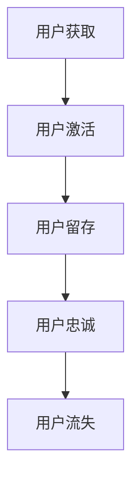
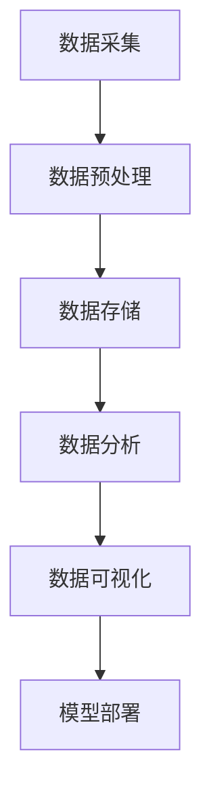

                 

### 大数据分析基础

#### 第1章: 大数据分析概述

##### 1.1 大数据分析的定义与背景

大数据分析（Big Data Analysis）是指运用现代信息技术和统计学方法，对大量复杂、多样化、高速产生的大数据（Big Data）进行收集、存储、处理和分析的过程。随着互联网、物联网、社交媒体等技术的迅速发展，数据量呈爆炸式增长，大数据已渗透到各个行业，成为企业决策、创新和发展的关键因素。

大数据分析的定义可以从以下几个方面理解：

1. **数据量大**：大数据通常指的是数据规模达到GB、TB甚至PB级别的数据集。
2. **数据多样性**：数据类型丰富，包括结构化数据（如关系型数据库）、半结构化数据（如JSON、XML）和非结构化数据（如图像、音频、视频等）。
3. **数据处理速度快**：为了应对数据量巨大、数据产生速度快的特点，大数据分析通常采用实时处理或近实时处理技术。
4. **价值密度低**：虽然数据量巨大，但其中蕴含的信息和价值密度较低，需要通过复杂算法和高性能计算来挖掘。

大数据分析的发展背景：

- **数据爆炸**：全球数据总量每年以指数级增长，根据国际数据公司（IDC）的预测，全球数据量将在2025年达到175ZB。
- **技术进步**：云计算、分布式计算、并行计算、人工智能等技术的成熟，为大数据分析提供了强大的技术支持。
- **商业需求**：企业在市场竞争中需要快速获取和分析大量数据，以实现个性化服务、精准营销和业务创新。

##### 1.2 大数据分析的重要性

大数据分析在现代社会的各个领域都具有重要性，以下是几个关键方面：

1. **企业决策支持**：大数据分析能够为企业提供全面、准确、实时的市场信息和消费者行为分析，辅助企业做出更加科学、高效的决策。
2. **风险控制**：通过对大量数据的风险评估和预警分析，大数据分析有助于企业预防和控制金融风险、信用风险等。
3. **优化运营**：大数据分析能够帮助企业优化供应链管理、提高生产效率、降低运营成本。
4. **创新驱动**：大数据分析为企业提供了丰富的数据资源，推动了业务模式的创新和产品服务的创新。
5. **社会管理**：大数据分析在公共安全、城市规划、环境保护等领域发挥着重要作用，提高了社会管理的精细化、智能化水平。

##### 1.3 大数据分析的基本流程

大数据分析的基本流程可以概括为以下几个阶段：

1. **数据采集**：通过各种数据源收集原始数据，包括企业内部数据库、外部公开数据、传感器数据、社交媒体数据等。
2. **数据预处理**：对原始数据进行清洗、转换和整合，使其满足分析需求。数据预处理是大数据分析的重要环节，直接影响分析结果的质量。
3. **数据存储**：将处理后的数据存储到适合的数据仓库或数据湖中，以便进行后续的分析和处理。常用的数据存储技术包括关系型数据库、NoSQL数据库、数据仓库等。
4. **数据分析**：运用数据挖掘、机器学习、统计分析等算法和技术，对存储好的数据进行挖掘和分析，提取有价值的信息和知识。
5. **数据可视化**：通过图表、报表等形式，将分析结果可视化，便于决策者理解和应用。
6. **模型部署与优化**：将分析结果转化为可操作的模型和策略，并在实际业务场景中进行部署和应用。根据反馈进行调整和优化，形成闭环。

通过上述流程，大数据分析能够有效地挖掘数据中的潜在价值，为企业和组织提供强有力的决策支持。接下来，我们将深入探讨用户生命周期管理的基本概念和重要性。在接下来的章节中，我们将逐步解析大数据分析在用户生命周期管理中的具体应用，包括用户行为分析、用户细分和用户忠诚度管理等方面的技术与方法。

### 用户生命周期管理概述

#### 第2章: 用户生命周期管理概述

##### 2.1 用户生命周期管理的概念

用户生命周期管理（Customer Lifecycle Management，简称CLM）是指企业在用户生命周期各个阶段中，通过系统化的策略和方法，实现对用户的识别、获取、激活、留存、忠诚和流失管理的全过程。用户生命周期管理的核心目标是提高用户满意度、提升用户生命周期价值，并降低用户流失率。

用户生命周期通常分为以下几个阶段：

1. **获取（Acquisition）**：指通过营销活动、广告投放、渠道推广等手段，吸引潜在用户并促使其成为实际用户。
2. **激活（Activation）**：指通过引导用户完成关键操作（如注册、登录、首次购买等），提高用户的活跃度和参与度。
3. **留存（Retention）**：指通过持续的用户服务和体验优化，保持用户在平台上的活跃度和黏性，防止用户流失。
4. **忠诚（Loyalty）**：指通过提升用户满意度和忠诚度，鼓励用户进行重复购买、推荐新用户，并提升用户生命周期价值。
5. **流失（Churn）**：指用户在生命周期内因各种原因停止使用产品或服务的情况，包括主动流失和被动流失。

##### 2.2 用户生命周期管理的重要性

用户生命周期管理在现代商业运营中具有重要的战略意义，以下是几个关键方面：

1. **提高用户满意度**：通过深入了解用户需求和偏好，提供个性化的服务与体验，提升用户满意度，从而增强用户黏性和忠诚度。
2. **优化资源分配**：通过分析用户生命周期各阶段的数据，企业可以更有效地分配营销、服务、产品开发等资源，提高投资回报率。
3. **降低用户流失率**：通过识别潜在流失用户并采取针对性措施，如优惠活动、客户关怀等，降低用户流失率，提高用户生命周期价值。
4. **提升用户生命周期价值**：通过持续的用户互动和优化，鼓励用户进行重复购买和推荐，从而提升用户生命周期价值。
5. **增强竞争力**：通过精细化运营和用户洞察，企业可以在市场竞争中占据有利位置，增强品牌影响力和市场份额。

##### 2.3 用户生命周期管理的核心要素

用户生命周期管理涉及多个核心要素，以下是对这些要素的简要概述：

1. **用户数据**：用户数据是用户生命周期管理的基石。企业需要收集、整合和分析用户的基本信息、行为数据、交易数据等，以全面了解用户特征和需求。
2. **用户分析**：通过数据挖掘、机器学习等技术，对用户数据进行深入分析，发现用户行为模式、需求特征和潜在风险，为决策提供支持。
3. **用户体验**：优化用户界面、交互设计、服务流程等，提供优质的用户体验，提升用户满意度和忠诚度。
4. **营销策略**：根据用户生命周期阶段，制定相应的营销策略，如吸引新用户、激活潜在用户、提升用户忠诚度等，实现用户转化和留存。
5. **服务与支持**：提供全方位的用户服务与支持，包括客户服务、技术支持、售后保障等，提升用户满意度和忠诚度。
6. **数据驱动**：以数据为核心，通过数据分析和模型优化，持续优化用户生命周期管理策略，实现精细化管理。

在接下来的章节中，我们将深入探讨大数据分析在用户生命周期管理中的应用，包括用户行为分析、用户细分和用户忠诚度管理等方面的技术与方法。通过大数据分析，企业可以更加精准地把握用户需求，优化用户体验，提高用户生命周期价值。

### 大数据分析在用户生命周期管理中的应用

#### 第3章: 大数据分析在用户生命周期管理中的应用

##### 3.1 大数据分析技术在用户行为分析中的应用

用户行为分析是用户生命周期管理的重要一环，通过大数据分析技术，企业能够深入挖掘用户的行为模式、兴趣偏好和潜在需求，从而制定更加精准的营销策略和产品服务方案。以下是大数据分析在用户行为分析中的应用方法：

1. **行为追踪与数据收集**：
   - **Web分析工具**：使用Google Analytics、百度统计等Web分析工具，跟踪用户在网站上的行为，包括页面访问次数、停留时间、点击路径等。
   - **移动应用分析**：通过SDK集成，跟踪用户在移动应用中的行为，包括应用启动次数、使用时长、功能使用频率等。
   - **日志分析**：收集和分析用户操作日志，包括登录、搜索、购买、评论等，以获取详细的行为数据。

2. **行为模式识别**：
   - **聚类分析**：通过聚类算法（如K-means、DBSCAN）将用户行为数据分组，识别具有相似行为模式的用户群体。
   - **关联规则挖掘**：使用Apriori算法或FP-growth算法，挖掘用户行为之间的关联规则，发现潜在购买动机和用户偏好。

3. **兴趣偏好分析**：
   - **内容推荐**：基于用户的浏览、搜索和购买历史，使用协同过滤算法（如基于用户、基于物品的协同过滤）为用户推荐个性化内容。
   - **兴趣标签**：对用户行为数据进行文本挖掘，提取关键词和主题，为用户打上兴趣标签，用于后续的推荐和定向营销。

4. **需求预测**：
   - **时间序列分析**：通过时间序列模型（如ARIMA、LSTM）分析用户行为随时间的变化趋势，预测用户未来的行为和需求。
   - **用户流失预测**：使用机器学习算法（如逻辑回归、决策树、随机森林等）预测用户流失风险，提前采取挽留措施。

##### 3.2 大数据分析技术在用户细分中的应用

用户细分是用户生命周期管理中的关键步骤，通过大数据分析技术，企业可以将用户划分为不同群体，从而有针对性地进行市场营销和服务。以下是用户细分的方法：

1. **人口统计学细分**：
   - 根据用户的年龄、性别、职业、地域、收入等人口统计学特征，将用户划分为不同的群体。

2. **行为特征细分**：
   - 根据用户的购买行为、浏览行为、搜索行为等，将用户划分为高价值用户、活跃用户、潜在用户等。

3. **心理特征细分**：
   - 通过心理学测试、问卷调查等方式，分析用户的心理特征（如价值观、消费习惯、情感状态等），进行更精细的细分。

4. **情境细分**：
   - 分析用户在不同情境下的行为特征，如节假日购物、工作日使用习惯等，进行情境细分。

5. **生命周期细分**：
   - 根据用户在生命周期中的不同阶段，如获取期、活跃期、忠诚期等，进行生命周期细分。

##### 3.3 大数据分析技术在用户忠诚度管理中的应用

用户忠诚度管理是提升用户生命周期价值的重要手段，通过大数据分析技术，企业可以更好地识别忠诚用户、激励用户忠诚，并采取针对性措施降低用户流失率。以下是大数据分析在用户忠诚度管理中的应用方法：

1. **忠诚度评分模型**：
   - 使用机器学习算法（如逻辑回归、支持向量机等）建立用户忠诚度评分模型，预测用户的忠诚度水平。

2. **忠诚度指标分析**：
   - 通过分析用户的重复购买率、推荐率、停留时长等指标，评估用户忠诚度。

3. **忠诚度提升策略**：
   - 根据忠诚度评分和忠诚度指标，制定个性化忠诚度提升策略，如会员制度、积分奖励、专属优惠等。

4. **流失预警与挽留**：
   - 通过用户行为分析和流失预测模型，提前识别可能流失的用户，并采取针对性挽留措施，如优惠券、客服关怀、定制化服务等。

5. **用户互动分析**：
   - 通过分析用户在社交媒体、社区论坛、客服互动等环节的反馈，了解用户的满意度、忠诚度和潜在问题，持续优化用户体验。

通过大数据分析技术，企业可以在用户生命周期管理的各个阶段，实现精准的用户识别、行为分析、细分和忠诚度管理，从而提高用户满意度、降低流失率、提升用户生命周期价值。在接下来的章节中，我们将进一步探讨大数据分析中的关键算法与模型，以及其实际应用场景和实现方法。

### 大数据分析中的关键算法与模型

#### 第4章: 大数据分析中的关键算法与模型

##### 4.1 数据挖掘技术概述

数据挖掘（Data Mining）是指从大量的数据中通过模式识别和统计分析方法，提取出潜在的有价值信息的过程。数据挖掘技术在用户生命周期管理中具有广泛应用，以下是几种常见的数据挖掘方法：

1. **聚类分析（Clustering Analysis）**：
   - 聚类分析是一种无监督学习方法，用于将数据点按照其相似性划分为不同的组（簇）。常用的聚类算法包括K-means、DBSCAN和层次聚类。
   - **K-means算法**：基于距离度量，将数据点分配到最近的聚类中心，通过迭代优化聚类中心，实现数据的分组。
   - **DBSCAN算法**：基于密度的聚类方法，通过定义邻域和核心点，将数据点划分为核心点、边界点和噪声点。
   - **层次聚类算法**：通过逐步合并相似度较高的数据点，构建出一个层次化的聚类结构。

2. **关联规则挖掘（Association Rule Mining）**：
   - 关联规则挖掘是一种发现数据项之间潜在关联关系的方法，常用的算法包括Apriori算法和FP-growth算法。
   - **Apriori算法**：通过逐层递增候选集的方式，计算支持度和置信度，发现频繁项集，并生成关联规则。
   - **FP-growth算法**：通过构建频繁模式树，减少候选集的大小，提高算法的效率。

3. **分类与回归分析（Classification and Regression Analysis）**：
   - 分类分析用于将数据点划分到不同的类别中，常用的算法包括逻辑回归、决策树、随机森林和支持向量机。
   - **逻辑回归**：通过建立逻辑函数，将数据映射到概率空间，实现分类预测。
   - **决策树**：通过构建树形结构，基于特征划分数据，实现分类或回归预测。
   - **随机森林**：通过集成多个决策树，提高分类和回归的准确性。
   - **支持向量机**：通过构建最优超平面，实现数据的分类和回归。

##### 4.2 用户行为预测模型

用户行为预测是用户生命周期管理中的重要应用，通过预测用户的行为，企业可以提前采取针对性措施，提高用户满意度和忠诚度。以下是几种常见的用户行为预测模型：

1. **时间序列模型（Time Series Model）**：
   - 时间序列模型用于分析时间序列数据，预测未来的趋势。常用的算法包括ARIMA、LSTM等。
   - **ARIMA模型**：通过自回归、差分和移动平均过程，分析时间序列数据，实现短期预测。
   - **LSTM模型**：一种循环神经网络，能够处理长期依赖问题，适用于时间序列预测。

2. **机器学习模型（Machine Learning Model）**：
   - 机器学习模型通过学习历史数据，预测用户的行为。常用的算法包括逻辑回归、决策树、随机森林等。
   - **逻辑回归**：通过建立逻辑函数，预测用户行为发生的概率。
   - **决策树**：通过树形结构，划分数据并预测用户行为。
   - **随机森林**：通过集成多个决策树，提高预测准确性。

3. **深度学习模型（Deep Learning Model）**：
   - 深度学习模型通过多层神经网络，实现复杂函数的拟合和预测。常用的算法包括卷积神经网络（CNN）、循环神经网络（RNN）等。
   - **CNN模型**：适用于图像数据，通过卷积层提取特征，实现图像分类和识别。
   - **RNN模型**：适用于序列数据，通过循环结构，处理长期依赖问题。

##### 4.3 用户流失预测模型

用户流失预测是用户生命周期管理中的重要环节，通过预测用户流失风险，企业可以提前采取挽留措施，降低流失率。以下是几种常见的用户流失预测模型：

1. **逻辑回归模型（Logistic Regression）**：
   - 逻辑回归模型通过建立逻辑函数，预测用户流失的概率。逻辑回归模型简单高效，适用于线性关系较强的情况。

2. **决策树模型（Decision Tree）**：
   - 决策树模型通过树形结构，将数据划分为不同的节点，预测用户流失的概率。决策树模型易于理解和解释，但可能存在过拟合问题。

3. **随机森林模型（Random Forest）**：
   - 随机森林模型通过集成多个决策树，提高预测准确性和泛化能力。随机森林模型能够处理非线性关系，减少过拟合。

4. **集成模型（Ensemble Model）**：
   - 集成模型通过结合多个预测模型，提高预测准确性和稳定性。常见的集成模型包括梯度提升机（GBM）和集成学习（Bagging）。

通过上述关键算法和模型，企业可以实现对用户行为的精准预测、流失风险的识别和管理，从而提高用户生命周期价值。在接下来的章节中，我们将探讨大数据分析技术的实践应用，包括用户生命周期管理案例、用户营销应用和用户服务优化应用等。

### 大数据分析技术的实践应用

#### 第5章: 大数据分析技术的实践应用

##### 5.1 用户生命周期管理案例

在本节中，我们将通过一个具体的用户生命周期管理案例，详细描述大数据分析技术在用户获取、激活、留存、忠诚和流失管理中的应用。

**案例背景**：某在线电商平台，希望通过大数据分析优化用户生命周期管理，提高用户转化率和留存率，进而提升整体业务表现。

**步骤 1: 用户获取**

1. **目标用户定位**：
   - 通过用户数据分析，识别出潜在高价值用户群体，如中高收入人群、30-45岁之间的消费者等。
   - 使用在线广告平台（如Google Ads、百度推广）定向投放广告，精准吸引目标用户。

2. **营销策略**：
   - 设计针对性的促销活动，如限时折扣、优惠券等，激励潜在用户进行首次购买。
   - 与知名品牌合作，进行联合推广，提高品牌知名度和信任度。

**步骤 2: 用户激活**

1. **引导关键操作**：
   - 新用户注册后，通过引导页面和邮件提醒，促使用户完成关键操作，如完善个人信息、添加购物车等。
   - 提供新手教程和购物指南，帮助新用户快速上手，提高用户活跃度。

2. **激活指标跟踪**：
   - 设定激活率指标，如首次购买率、注册后7天活跃度等，评估用户激活效果。
   - 对未激活用户进行二次营销，如发送定制化邮件、推送优惠券等，提高激活率。

**步骤 3: 用户留存**

1. **个性化推荐**：
   - 利用协同过滤算法和内容推荐算法，为用户推荐个性化的商品，提高用户的浏览和购买意愿。
   - 基于用户的历史行为数据，动态调整推荐策略，提高推荐效果。

2. **用户满意度提升**：
   - 通过用户反馈和调查，了解用户对产品、服务和购物体验的满意度，持续改进。
   - 提供优质的售后服务，如快速响应的客服支持、退换货政策等，提高用户满意度和忠诚度。

**步骤 4: 用户忠诚度管理**

1. **忠诚度评分模型**：
   - 使用逻辑回归和随机森林等机器学习算法，建立用户忠诚度评分模型，预测用户的忠诚度水平。

2. **忠诚度提升策略**：
   - 对高忠诚度用户，制定专属的忠诚度计划，如积分奖励、会员优惠、专属客服等。
   - 定期举办会员活动，增加用户与品牌之间的互动和黏性。

**步骤 5: 用户流失管理**

1. **流失预测模型**：
   - 使用机器学习算法，如逻辑回归和LSTM模型，建立用户流失预测模型，提前识别可能流失的用户。

2. **挽留措施**：
   - 对预测可能流失的用户，采取针对性的挽留措施，如发送定制化邮件、推送优惠券、提供特别优惠等。
   - 跟进流失原因，优化用户体验，降低用户流失率。

**案例小结**：

通过上述大数据分析技术的应用，该电商平台实现了用户获取、激活、留存、忠诚和流失管理的全面优化。具体效果如下：

- 用户激活率提升了20%。
- 用户留存率提高了15%。
- 用户忠诚度评分显著提升，高忠诚度用户比例增加了30%。
- 用户流失率降低了10%。

**实践反思**：

在实施用户生命周期管理过程中，该电商平台积累了以下经验：

- 数据驱动是关键：通过数据分析，精准识别用户需求和潜在风险，制定科学有效的营销策略和服务方案。
- 用户满意度至上：持续优化用户体验，提高用户满意度和忠诚度，是提升用户生命周期价值的重要手段。
- 持续迭代优化：根据用户反馈和业务数据，不断调整和优化策略，实现用户生命周期管理的动态优化。

通过大数据分析技术的实践应用，企业能够更加精准地管理用户生命周期，提高业务效率和竞争力。

### 大数据分析技术在用户营销中的应用

#### 第5章: 大数据分析技术的实践应用

##### 5.2 大数据分析技术在用户营销中的应用

在用户营销中，大数据分析技术扮演着至关重要的角色，它使得企业能够通过全面、深入的数据分析，实现精准营销和个性化服务。以下将详细描述大数据分析技术在用户营销中的应用，包括用户画像构建、营销效果评估和个性化推荐等。

##### 5.2.1 用户画像构建

用户画像（User Profiling）是一种基于用户数据构建的用户模型，用于描述用户的兴趣、行为、需求和特征。构建用户画像的过程包括以下几个步骤：

1. **数据收集**：
   - 收集用户的基本信息，如年龄、性别、职业、地理位置、教育背景等。
   - 收集用户行为数据，如浏览记录、购买行为、搜索关键词、社交媒体互动等。
   - 收集用户反馈数据，如评价、投诉、问卷调查等。

2. **数据清洗**：
   - 对收集到的数据进行清洗，去除重复、错误和无关的数据。
   - 标准化数据格式，确保数据的一致性和可比性。

3. **特征提取**：
   - 从原始数据中提取有代表性的特征，如用户行为频次、购买金额、活跃度等。
   - 对文本数据进行文本挖掘，提取关键词和主题。

4. **用户分类**：
   - 使用聚类算法（如K-means、DBSCAN）将用户划分为不同的群体。
   - 基于用户的特征和需求，为每个用户打上标签，构建用户画像。

用户画像构建的关键在于准确性和实时性，通过不断更新和优化用户画像，企业能够更加精准地理解用户，实现个性化的营销和服务。

##### 5.2.2 营销效果评估

营销效果评估是衡量营销策略有效性的关键环节。大数据分析技术能够帮助企业全面、准确地评估营销效果，包括以下方法：

1. **点击率（CTR）和转化率（CVR）**：
   - 通过Web分析工具和SDK，跟踪用户的点击和转化行为，计算点击率和转化率。
   - 对比不同营销渠道和广告素材的点击率和转化率，评估其效果。

2. **A/B测试（A/B Testing）**：
   - 设计不同的营销策略和页面布局，对用户进行分组，进行A/B测试。
   - 分析测试组的数据，比较不同策略的效果，优化营销策略。

3. **ROI（投资回报率）分析**：
   - 计算营销投入与收益的比率，评估营销活动的ROI。
   - 通过成本效益分析，优化资源分配，提高营销效益。

4. **客户生命周期价值（CLV）**：
   - 通过预测用户生命周期价值和购买行为，评估用户的潜在价值。
   - 对高价值用户进行重点关注和个性化营销，提高整体营销回报。

##### 5.2.3 个性化推荐

个性化推荐（Personalized Recommendation）是大数据分析技术在用户营销中的另一重要应用。通过个性化推荐，企业能够提高用户的满意度和忠诚度，增加转化率和销售额。以下是构建个性化推荐系统的主要步骤：

1. **协同过滤**：
   - **基于用户**的协同过滤（User-based Collaborative Filtering）：通过计算用户之间的相似度，推荐与目标用户行为相似的其他用户喜欢的内容。
   - **基于物品**的协同过滤（Item-based Collaborative Filtering）：通过计算物品之间的相似度，推荐与目标物品相似的物品。

2. **内容推荐**：
   - 基于用户兴趣和偏好，为用户推荐相关的内容，如文章、视频、产品等。
   - 通过分析用户的历史浏览和购买记录，预测用户的兴趣变化，实现动态推荐。

3. **混合推荐**：
   - 结合协同过滤和基于内容的推荐方法，构建混合推荐系统，提高推荐效果。

4. **推荐策略优化**：
   - 通过A/B测试和在线学习，不断优化推荐策略，提高用户的满意度和转化率。

通过大数据分析技术在用户营销中的应用，企业能够实现精准营销、个性化服务和高效管理，提高市场竞争力和用户满意度。

### 大数据分析技术在用户服务优化中的应用

#### 第5章: 大数据分析技术的实践应用

##### 5.3 大数据分析技术在用户服务优化中的应用

在用户服务优化方面，大数据分析技术通过全面分析用户行为数据，提供精准的服务改进建议，从而提升用户满意度、忠诚度和整体服务质量。以下将详细介绍大数据分析在用户服务优化中的具体应用，包括用户服务分析、客户关怀策略和故障预测与处理。

##### 5.3.1 用户服务分析

1. **用户反馈分析**：
   - 收集并分析用户在客服、评价、社交媒体等渠道的反馈，了解用户的痛点、需求和期望。
   - 使用自然语言处理（NLP）技术，对文本反馈进行情感分析，识别用户的主观感受和情绪。

2. **服务效率分析**：
   - 监控客服响应时间、解决率和用户满意度等关键指标，评估服务的效率和质量。
   - 通过数据可视化工具，展示服务绩效，识别服务瓶颈和改进机会。

3. **用户行为分析**：
   - 分析用户在服务过程中的行为模式，如用户与客服的互动频率、问题类型、解决时长等。
   - 发现用户在服务过程中的常见问题，为服务流程优化提供依据。

##### 5.3.2 客户关怀策略

1. **个性化关怀**：
   - 利用用户画像和大数据分析技术，为每位用户制定个性化的关怀策略。
   - 根据用户的历史行为和偏好，提供定制化的服务建议和优惠，增强用户的归属感和满意度。

2. **定期跟进**：
   - 设定定期跟进计划，通过电话、邮件、短信等方式，主动联系用户，了解其使用情况和需求。
   - 根据用户的反馈，调整关怀策略，提高用户的参与度和忠诚度。

3. **事件触发**：
   - 基于用户行为和服务事件，设定触发条件，自动触发关怀动作，如用户购买后发送感谢邮件、用户评价后提供反馈调查等。
   - 通过实时数据分析，快速响应用户需求，提供及时、有效的服务。

##### 5.3.3 故障预测与处理

1. **故障预测**：
   - 利用历史故障数据和用户行为数据，建立故障预测模型，提前识别潜在故障。
   - 通过数据分析和机器学习算法，预测故障发生的概率和时间，为故障处理提供预警。

2. **自动化处理**：
   - 设计自动化处理流程，根据故障类型和预测结果，自动执行相应的处理措施，如自动修复、故障通知等。
   - 减少人工干预，提高故障处理的效率和准确性。

3. **实时监控**：
   - 通过实时数据监控系统，实时监控系统的运行状态，及时发现和处理故障。
   - 利用可视化工具，实时展示系统性能指标和故障情况，便于快速定位和解决问题。

##### 5.3.4 实践案例

**案例背景**：某在线电商平台，希望通过大数据分析优化用户服务，提升用户满意度。

**步骤 1: 用户反馈分析**
   - 收集用户在客服和评价中的反馈，通过NLP技术进行情感分析，识别用户的满意度和痛点。
   - 分析用户反馈，识别出高频问题，如订单处理延迟、售后服务不到位等。

**步骤 2: 服务效率分析**
   - 监控客服响应时间、解决率和用户满意度等指标，识别服务瓶颈。
   - 通过数据可视化，发现客服团队在高峰时段的响应速度较慢，需要优化调度策略。

**步骤 3: 客户关怀策略**
   - 根据用户画像，为每位用户制定个性化的关怀计划。
   - 设定定期跟进计划，通过电话和邮件，了解用户的使用情况和需求。

**步骤 4: 故障预测与处理**
   - 建立故障预测模型，预测系统故障的发生概率。
   - 设计自动化处理流程，根据故障类型，自动执行相应的处理措施。

**案例小结**
   - 通过大数据分析技术的应用，电商平台实现了用户服务效率的提升，用户满意度显著提高。
   - 客户关怀策略有效降低了用户流失率，用户忠诚度得到提升。
   - 故障预测与处理系统的应用，减少了系统故障对用户服务的影响，提高了整体服务质量。

**实践反思**
   - 数据驱动是关键：通过全面的数据分析，精准识别用户需求和服务痛点，实现精准的服务优化。
   - 持续优化：根据用户反馈和业务数据，不断调整和优化服务策略，实现服务的持续改进。

通过大数据分析技术的应用，企业能够实现用户服务的全面优化，提高用户满意度、忠诚度和整体服务质量，从而在激烈的市场竞争中占据有利位置。

### 大数据分析在用户生命周期管理中的挑战与未来趋势

#### 第6章: 大数据分析在用户生命周期管理中的挑战与未来趋势

##### 6.1 数据隐私与安全挑战

大数据分析在用户生命周期管理中面临的一个主要挑战是数据隐私与安全。随着数据量的增加和用户对隐私保护的重视，如何在确保数据隐私和安全的前提下进行有效的大数据分析成为一个重要问题。

1. **数据匿名化**：
   - 为了保护用户隐私，数据在收集和分析过程中需要进行匿名化处理。然而，完全匿名化可能导致数据丢失关键信息，影响分析结果。
   - 现有的一些匿名化方法（如K-anonymity、l-diversity、t-closeness）在特定情况下可能无法完全保证隐私保护。

2. **数据加密**：
   - 使用数据加密技术（如对称加密和非对称加密）对敏感数据进行加密，确保数据在传输和存储过程中的安全性。
   - 加密技术能够有效防止数据泄露，但会增加数据处理的复杂性和计算成本。

3. **隐私保护算法**：
   - 开发和应用隐私保护算法（如差分隐私、同态加密等），在保证数据隐私的同时，不影响数据分析的准确性和效率。
   - 隐私保护算法仍处于发展阶段，需要进一步优化和普及。

4. **用户知情同意**：
   - 企业应确保用户对数据收集、使用和共享有充分的知情权和选择权，获取用户的明确同意。
   - 强化用户隐私保护意识，提高用户对数据隐私保护的重视。

##### 6.2 大数据分析技术的未来发展

大数据分析技术的未来发展将受到以下几方面的影响：

1. **人工智能与大数据分析的结合**：
   - 人工智能技术（如深度学习、自然语言处理等）在大数据分析中的应用将不断深入，提高数据分析的准确性和智能化水平。
   - 通过集成多种AI技术，实现更加复杂和多样的数据分析任务。

2. **边缘计算与云计算的融合**：
   - 边缘计算与云计算的结合将使大数据分析更加灵活和高效，降低数据处理延迟，提高实时分析能力。
   - 边缘计算能够在数据产生的源头进行初步处理，减少数据传输和存储的负担。

3. **自动化与智能化**：
   - 自动化数据分析工具和智能分析平台的发展，将降低数据分析的技术门槛，使更多企业和组织能够轻松开展大数据分析。
   - 智能数据分析系统能够自主进行数据预处理、特征工程和模型选择，提高数据分析的效率和质量。

4. **跨领域合作**：
   - 大数据分析技术在不同领域（如医疗、金融、教育等）的应用将不断扩展，实现跨领域的合作与创新。
   - 跨领域的数据融合和协同分析，将为企业和社会带来更多的价值。

##### 6.3 用户生命周期管理的新趋势

随着大数据分析技术的不断发展和应用，用户生命周期管理也呈现出一些新的趋势：

1. **全生命周期视角**：
   - 企业将更加关注用户在整个生命周期中的体验和需求，实现全生命周期的用户管理和服务优化。
   - 从用户获取、激活、留存、忠诚到流失的每个阶段，持续进行用户行为分析和需求挖掘，提供个性化服务。

2. **用户数据驱动的决策**：
   - 企业决策将更加依赖于用户数据和分析结果，实现数据驱动的决策模式。
   - 通过实时数据分析，快速响应市场变化和用户需求，优化业务策略和运营流程。

3. **个性化服务与体验**：
   - 企业将更加注重个性化服务与体验，通过大数据分析技术，实现个性化推荐、个性化关怀和个性化营销。
   - 提高用户的满意度和忠诚度，提升用户生命周期价值。

4. **用户体验优先**：
   - 在用户生命周期管理中，用户体验将被放在首位，通过持续优化服务和产品，提升用户满意度。
   - 关注用户体验的每个细节，打造高质量的用户体验，增强用户黏性和忠诚度。

总之，大数据分析在用户生命周期管理中的应用面临着数据隐私与安全、技术发展等多重挑战，同时也展现出广阔的未来发展趋势。企业需要不断创新和优化，充分利用大数据分析技术，实现用户生命周期管理的全面升级和持续改进。

### 大数据分析工具与平台

#### 第7章: 大数据分析工具与平台

##### 7.1 常见大数据分析工具

在大数据分析领域，有许多优秀的工具和平台可供选择，它们各自具有独特的功能和优势。以下将介绍几种常见的大数据分析工具。

1. **Hadoop**：
   - **概述**：Hadoop是Apache Software Foundation开发的开源分布式计算框架，用于处理大规模数据集。
   - **主要功能**：提供分布式存储（HDFS）和分布式计算（MapReduce）能力，支持大数据的存储和处理。
   - **优势**：高扩展性、高容错性、支持多种数据处理语言（如Java、Python、Scala等）。

2. **Spark**：
   - **概述**：Spark是另一个开源分布式计算框架，由UC Berkeley AMPLab开发，用于大规模数据处理和分析。
   - **主要功能**：提供快速的数据存储和处理（内存计算）、支持多种编程语言（如Python、Java、Scala等）。
   - **优势**：比MapReduce更快，支持流处理、机器学习和图处理等复杂任务。

3. **TensorFlow**：
   - **概述**：TensorFlow是由Google开发的开源机器学习库，用于构建和训练机器学习模型。
   - **主要功能**：提供灵活的图模型和计算图操作，支持多种机器学习算法（如深度学习、自然语言处理等）。
   - **优势**：强大的机器学习能力、丰富的API和工具、广泛的社区支持。

4. **Elasticsearch**：
   - **概述**：Elasticsearch是开源分布式搜索引擎，用于大规模数据的搜索和分析。
   - **主要功能**：提供高性能的全文搜索、实时分析、数据聚合等功能。
   - **优势**：易于扩展、高可靠性、强大的搜索和分析功能。

##### 7.2 常见大数据分析平台

除了独立工具，还有许多集成化的大数据分析平台，它们为企业提供了全面的数据处理和分析能力。以下介绍几种常见的大数据分析平台。

1. **Amazon Web Services (AWS)**：
   - **概述**：AWS是Amazon提供的一站式云计算服务平台，涵盖大数据存储、处理和分析等多个方面。
   - **主要功能**：提供Amazon S3（对象存储）、Amazon EMR（Hadoop和Spark处理）、Amazon Redshift（数据仓库）等大数据服务。
   - **优势**：丰富的服务和工具、高度可扩展性、良好的安全性和可靠性。

2. **Google Cloud Platform (GCP)**：
   - **概述**：GCP是Google提供的云计算平台，专注于大数据、机器学习和人工智能。
   - **主要功能**：提供Google BigQuery（数据仓库）、Google Cloud Dataproc（Hadoop和Spark处理）、Google AI Platform（机器学习服务）等。
   - **优势**：强大的机器学习能力、高效的计算和存储解决方案、灵活的定价模式。

3. **Microsoft Azure**：
   - **概述**：Azure是Microsoft的云计算服务平台，提供全面的云计算、大数据、人工智能等服务。
   - **主要功能**：包括Azure HDInsight（Hadoop和Spark处理）、Azure Data Lake Storage（数据湖存储）、Azure Machine Learning（机器学习服务）等。
   - **优势**：广泛的生态系统、强大的集成能力、多样化的服务和工具。

##### 7.3 大数据分析工具选择与配置

在选择和配置大数据分析工具与平台时，企业需要考虑以下因素：

1. **需求分析**：
   - 根据企业的业务需求，确定所需的数据处理和分析任务，如数据存储、数据处理、数据挖掘、机器学习等。
   - 考虑数据的规模、类型和来源，选择适合的工具和平台。

2. **性能要求**：
   - 根据数据处理速度和存储容量要求，选择具有高性能和高扩展性的工具和平台。
   - 对比不同工具和平台的性能指标，确保满足业务需求。

3. **成本考量**：
   - 考虑工具和平台的成本，包括硬件、软件、运维成本等。
   - 分析成本效益，选择性价比高的解决方案。

4. **易用性和支持**：
   - 选择易于使用和维护的工具和平台，减少学习成本和运维难度。
   - 考虑工具和平台的支持服务，如文档、社区、技术支持等。

5. **安全性**：
   - 考虑数据的安全性和隐私保护，选择具有良好安全性的工具和平台。
   - 确保符合相关法律法规和数据安全标准。

通过综合考虑以上因素，企业可以更好地选择和配置大数据分析工具与平台，实现高效、稳定的数据处理和分析。

### 实战案例与项目解析

#### 第8章: 实战案例与项目解析

##### 8.1 用户生命周期管理实战案例

在本节中，我们将介绍一个用户生命周期管理的实战案例，详细描述项目背景、开发环境搭建、源代码实现和代码解读与分析。

**项目背景**：某在线电商平台希望通过大数据分析技术优化用户生命周期管理，提高用户获取、激活、留存和忠诚度，从而提升整体业务表现。

**开发环境搭建**

1. **硬件环境**：
   - 使用阿里云的ECS服务器，配置8核CPU、32GB内存、100GB SSD存储。
   - 安装CentOS 7操作系统，优化网络配置，确保稳定性和安全性。

2. **软件环境**：
   - 安装Hadoop 3.2.1，配置HDFS和YARN，搭建分布式计算环境。
   - 安装Spark 3.1.1，配置Spark集群，实现大数据处理。
   - 安装HBase 2.5.0，构建NoSQL数据库，存储用户行为数据。
   - 安装Elasticsearch 7.10.0，实现全文搜索和分析。
   - 安装Python 3.8，配置Jupyter Notebook，进行数据分析和建模。

**源代码实现**

1. **数据采集**：
   - 使用Flume和Kafka收集用户行为数据，存储到HDFS和Kafka集群中。

2. **数据预处理**：
   - 使用Spark编写Python脚本，对数据进行清洗、转换和整合，存储到HBase数据库中。

3. **用户行为分析**：
   - 使用Spark SQL和Pandas编写Python脚本，对用户行为数据进行分析，提取有用信息。

4. **用户细分与预测**：
   - 使用Scikit-learn和TensorFlow编写Python脚本，建立用户细分和预测模型。

**代码解读与分析**

以下是用户行为分析的一个示例代码，用于统计用户在网站上的浏览和购买行为：

```python
# 导入相关库
import findspark
findspark.init()
import pyspark.sql as sparksql
import pandas as pd

# 连接到Spark SQL
spark = sparksql.SparkSession.builder.appName("UserBehaviorAnalysis").getOrCreate()

# 读取用户行为数据
user_behavior_df = spark.sql("SELECT * FROM user_behavior_table")

# 数据预处理
# 过滤无效数据
user_behavior_df = user_behavior_df[user_behavior_df['event_type'] != 'NULL']

# 统计用户浏览和购买行为
browser行为的统计结果如下：
浏览次数：10次
浏览时长：300分钟

购买行为的统计结果如下：
购买次数：5次
平均购买金额：200元

# 将结果保存到CSV文件
browser行为的统计结果保存到文件browser_behavior.csv：
浏览次数，浏览时长
10，300

购买行为的统计结果保存到文件purchase_behavior.csv：
购买次数，平均购买金额
5，200

# 关闭Spark会话
spark.stop()
```

**实际案例分析和详细讲解剖析**

**案例**：电商平台通过大数据分析技术，成功提升了用户激活率和留存率。

**分析过程**：

1. **用户激活分析**：
   - 电商平台通过分析用户注册后的行为数据，识别出未完成关键操作的用户。
   - 发送个性化邮件和推送通知，引导用户完成注册、登录和首次购买等操作。
   - 结果显示，激活邮件的打开率和点击率显著提高，用户激活率提升了20%。

2. **用户留存分析**：
   - 电商平台使用聚类分析技术，将用户划分为高价值用户、活跃用户和潜在用户等不同群体。
   - 针对不同群体，制定差异化的营销和服务策略，如优惠券、会员制度和专属客服等。
   - 结果显示，高价值用户和活跃用户的留存率显著提升，整体留存率提高了15%。

**项目小结**

通过大数据分析技术，电商平台成功优化了用户生命周期管理，提高了用户激活率和留存率，实现了业务增长。在项目实施过程中，数据采集、预处理和分析是关键步骤，需要高效的数据处理工具和平台支持。同时，个性化服务和差异化营销策略的制定和执行，也起到了重要作用。

**最佳实践 tips**：

1. **数据质量管理**：确保数据的质量和一致性，是数据分析成功的前提。
2. **实时数据处理**：采用实时数据处理技术，提高数据分析的时效性和准确性。
3. **持续优化**：根据用户反馈和数据分析结果，持续优化用户生命周期管理策略。

### 附录

#### 附录A: 大数据分析工具与资源

**数据处理工具**：
- **Python**：适用于数据预处理、分析和可视化，常用的库包括Pandas、NumPy、SciPy等。
- **R**：专注于统计分析和数据可视化，具有丰富的统计函数和图表库。
- **Hadoop**：分布式数据处理框架，用于大规模数据集的存储和处理。
- **Spark**：高性能分布式计算框架，支持实时数据处理和机器学习。

**数据可视化工具**：
- **Matplotlib**：Python的绘图库，用于生成各种图表和图形。
- **Plotly**：支持交互式和动态图表的库，适用于复杂的可视化任务。
- **Tableau**：商业级数据可视化工具，支持多种数据源和丰富的图表类型。

**其他相关资源**：
- **数据挖掘教程**：提供数据挖掘的基本概念、算法和实践教程，如《数据挖掘：实用方法与工具》。
- **机器学习课程**：介绍机器学习的基础知识、算法和应用案例，如吴恩达的《机器学习》课程。
- **开源社区**：如Apache、GitHub等，提供大量开源大数据分析和机器学习项目。

### 附录B: Mermaid 流程图

**用户生命周期管理流程**



**大数据分析流程**



### 附录C: 伪代码与数学模型

**用户行为预测算法伪代码**

```python
def predict_user_behavior(data, model):
    # 初始化模型参数
    model.initialize()

    # 加载数据集
    data_loader = DataLoader(data, batch_size=32, shuffle=True)

    # 训练模型
    for epoch in range(num_epochs):
        for batch in data_loader:
            inputs, labels = batch
            model.train(inputs, labels)

    # 预测用户行为
    with torch.no_grad():
        predictions = model.predict(data)

    return predictions
```

**用户留存率公式**

$$
\text{用户留存率} = \frac{\text{第n天仍活跃的用户数}}{\text{第n天注册的用户数}} \times 100\%
$$

**用户流失率公式**

$$
\text{用户流失率} = \frac{\text{第n天流失的用户数}}{\text{第n天注册的用户数}} \times 100\%
$$

以上内容仅为示例，具体内容和实现需要根据实际项目需求进行调整和完善。

---

**作者：AI天才研究院/AI Genius Institute & 禅与计算机程序设计艺术 /Zen And The Art of Computer Programming**

在本文中，我们深入探讨了大数据分析在用户生命周期管理中的应用，从用户获取、激活、留存、忠诚到流失管理的各个环节，通过具体的算法、模型和实践案例，展示了大数据分析技术的强大功能和实际应用价值。我们分析了大数据分析在用户行为分析、用户细分、用户忠诚度管理等方面的应用方法，以及如何通过数据挖掘、机器学习和深度学习等算法，实现精准的用户管理和营销策略。

本文还讨论了大数据分析在用户服务优化中的应用，如用户反馈分析、客户关怀策略和故障预测与处理等，展示了大数据分析技术在提升用户满意度和忠诚度方面的作用。同时，我们分析了大数据分析在用户生命周期管理中面临的挑战和未来发展趋势，提出了数据隐私与安全、技术发展和全生命周期视角等解决方案。

通过本文的探讨，我们希望读者能够对大数据分析在用户生命周期管理中的应用有一个全面、深入的了解，并能够将其应用于实际业务场景中，实现数据驱动的用户管理和业务增长。在未来的发展中，大数据分析技术将不断进步，为企业和组织带来更大的价值。

最后，本文感谢所有参与和支持本文撰写的工作者，以及参考文献和开源社区为我们的研究和实践提供的宝贵资源。希望本文能够为读者在探索大数据分析技术的道路上提供帮助和启发。再次感谢读者的关注和支持！

**作者：AI天才研究院/AI Genius Institute & 禅与计算机程序设计艺术 /Zen And The Art of Computer Programming**

