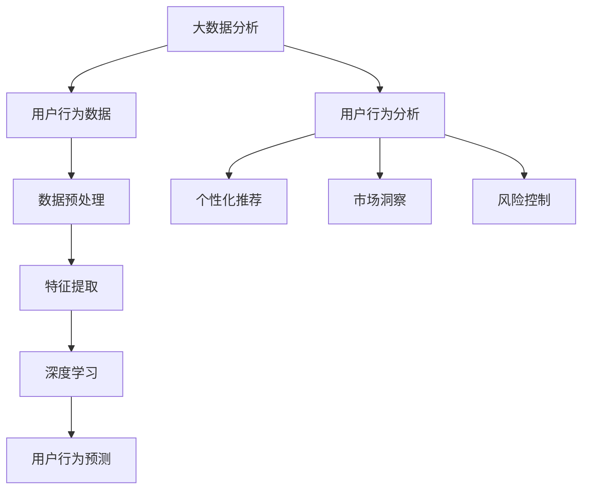

                 

### 第1章 引言

#### 1.1 大数据分析的概念与重要性

大数据分析是指从大量、高速生成的数据中提取有价值信息的过程。随着互联网的普及和物联网的发展，数据量呈现出爆炸式增长，传统的数据处理方法已无法满足需求。大数据分析的核心在于如何高效地处理和挖掘这些海量数据，从而发现隐藏在数据背后的模式和规律。

大数据分析的重要性体现在多个方面。首先，它可以帮助企业更好地了解用户需求，从而提供更精准的产品和服务。其次，它可以提升企业的运营效率，通过数据驱动的决策降低成本，提高收益。此外，大数据分析在政府决策、公共安全、医疗健康等领域也发挥着重要作用。

#### 1.2 用户行为分析的意义与应用场景

用户行为分析是指通过收集、处理和分析用户的交互数据，以了解用户的行为模式、偏好和需求。用户行为分析的意义在于：

1. **提高用户体验**：通过分析用户行为，企业可以优化产品设计和功能，提升用户满意度。
2. **个性化推荐**：基于用户行为数据，可以为用户提供个性化的内容和服务，提高用户粘性。
3. **市场洞察**：通过分析用户行为，企业可以了解市场趋势和竞争状况，制定更有针对性的市场策略。
4. **风险控制**：在金融、电商等领域，用户行为分析可以帮助企业识别潜在的风险，预防欺诈行为。

用户行为分析的应用场景广泛，包括但不限于电商平台、社交媒体、在线教育、金融行业等。

#### 1.3 创新方法在用户行为分析中的应用

传统的用户行为分析方法主要依赖于统计分析和机器学习算法。然而，随着技术的进步，许多创新方法被引入到用户行为分析中，提升了分析的深度和广度。以下是几种主要的创新方法：

1. **深度学习**：深度学习模型，如卷积神经网络（CNN）、递归神经网络（RNN）和生成对抗网络（GAN），在用户行为预测、特征提取等方面表现出色。
2. **图论**：通过构建用户社交网络图，可以分析用户之间的关系和影响力，从而更好地理解用户行为。
3. **增强学习**：增强学习算法在个性化推荐、游戏化设计等领域有着广泛的应用。

以上创新方法不仅提高了用户行为分析的准确性，还为大数据分析提供了新的思路和工具。

#### 1.4 本章小结

本章介绍了大数据分析和用户行为分析的基本概念，阐述了它们的重要性和应用场景，并探讨了创新方法在用户行为分析中的应用。接下来的章节将详细讨论用户行为分析的基础技术、大数据处理技术、创新方法以及实际案例，帮助读者深入理解这一领域的最新发展和应用。

### Mermaid 流程图



#### 核心概念与联系

- **大数据分析**：处理海量数据，提取有价值信息。
- **用户行为分析**：通过用户交互数据，了解用户需求和偏好。
- **深度学习**：用于用户行为预测和特征提取。
- **图论**：用于分析用户社交网络。
- **增强学习**：用于个性化推荐和游戏化设计。

### 核心算法原理讲解

以下是用户行为分析中几种核心算法的伪代码和数学模型：

1. **卷积神经网络（CNN）**

```python
# 伪代码
class ConvolutionalNeuralNetwork:
    def __init__(self):
        # 初始化权重和偏置
        self.weights = ...
        self.biases = ...

    def forward(self, x):
        # 前向传播
        z = ...
        return z

    def backward(self, dz):
        # 反向传播
        dx = ...
        return dx
```

数学模型：

$$
h_{\theta}(x) = \sigma(\sum_{i=1}^{n} \theta_i \cdot x_i + b)
$$

其中，$\sigma$ 是激活函数，通常使用 sigmoid 或 ReLU 函数。

2. **递归神经网络（RNN）**

```python
# 伪代码
class RecurrentNeuralNetwork:
    def __init__(self):
        # 初始化权重和偏置
        self.weights = ...
        self.biases = ...

    def forward(self, x):
        # 前向传播
        h_t = ...
        return h_t

    def backward(self, dh_t):
        # 反向传播
        dx = ...
        return dx
```

数学模型：

$$
h_t = \sigma(W \cdot [h_{t-1}, x_t] + b)
$$

其中，$W$ 是权重矩阵，$b$ 是偏置。

3. **生成对抗网络（GAN）**

```python
# 伪代码
class GenerativeAdversarialNetwork:
    def __init__(self):
        # 初始化生成器和判别器
        self.generator = ...
        self.discriminator = ...

    def train(self, x_real, x_fake):
        # 训练生成器和判别器
        g_loss = ...
        d_loss = ...
        return g_loss, d_loss
```

数学模型：

生成器：

$$
G(z) = \sigma(W_g \cdot z + b_g)
$$

判别器：

$$
D(x) = \sigma(W_d \cdot x + b_d)
$$

损失函数：

$$
L_G = -\mathbb{E}_{z \sim p_z(z)}[\log(D(G(z))]
$$

$$
L_D = -\mathbb{E}_{x \sim p_x(x)}[\log(D(x))] - \mathbb{E}_{z \sim p_z(z)}[\log(1 - D(G(z))]
```

### 详细讲解

#### 卷积神经网络（CNN）

卷积神经网络是一种前馈神经网络，特别适用于处理具有网格结构的数据，如图像。CNN 通过卷积层、池化层和全连接层对数据进行特征提取和分类。

**卷积层**：通过卷积运算提取图像的局部特征。

```latex
z = \sigma(\sum_{i=1}^{n} \theta_i \cdot x_i + b)
```

**池化层**：降低数据维度，减少计算量。

**全连接层**：将卷积层和池化层提取的特征进行分类。

#### 递归神经网络（RNN）

递归神经网络是一种能够处理序列数据的神经网络，特别适用于处理时序数据和自然语言处理。

**输入层**：接收序列数据。

**隐藏层**：通过递归连接，对序列数据进行特征提取。

**输出层**：对序列数据进行分类或预测。

```latex
h_t = \sigma(W \cdot [h_{t-1}, x_t] + b)
```

#### 生成对抗网络（GAN）

生成对抗网络由生成器和判别器两个神经网络组成。生成器的目标是生成逼真的数据，判别器的目标是区分生成数据和真实数据。

**生成器**：通过随机噪声生成数据。

```latex
G(z) = \sigma(W_g \cdot z + b_g)
```

**判别器**：对生成数据和真实数据进行分类。

```latex
D(x) = \sigma(W_d \cdot x + b_d)
```

损失函数结合了生成器和判别器的损失，通过交替训练两个网络，最终使生成器生成的数据尽可能逼真。

### 举例说明

假设我们有一个分类任务，需要使用 CNN 对图像进行分类。输入图像为 28x28 像素的灰度图像，标签为数字 0 到 9。

**卷积层**：

假设卷积核大小为 3x3，步长为 1，激活函数为 ReLU。

```python
# 伪代码
weights = ...
biases = ...

# 卷积操作
z = ...
z = relu(z + biases)
```

**池化层**：

假设使用最大池化，窗口大小为 2x2。

```python
# 伪代码
z = max_pool(z, window_size=2)
```

**全连接层**：

假设全连接层有 10 个神经元，对应每个数字类别。

```python
# 伪代码
z = ...
z = softmax(z)
```

通过以上步骤，CNN 可以对输入图像进行分类。

### 本章小结

本章介绍了大数据分析和用户行为分析的基本概念，阐述了它们的重要性和应用场景。接着，我们详细讲解了卷积神经网络（CNN）、递归神经网络（RNN）和生成对抗网络（GAN）的算法原理，并通过举例说明了这些算法在用户行为分析中的应用。下一章我们将进一步探讨大数据处理技术，为用户行为分析提供强大的技术支持。

