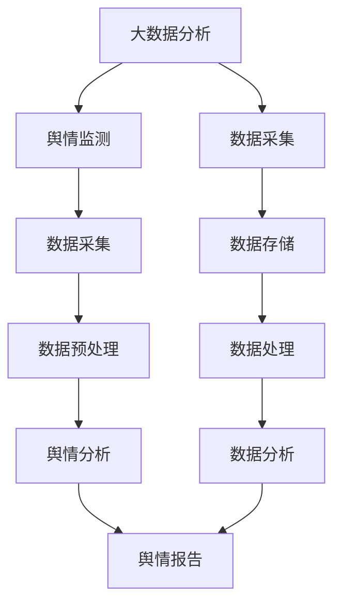
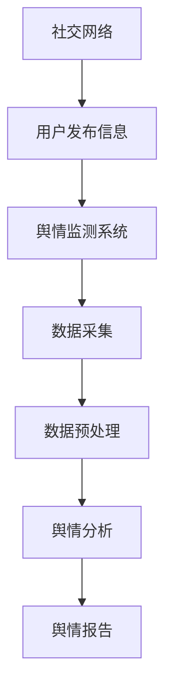
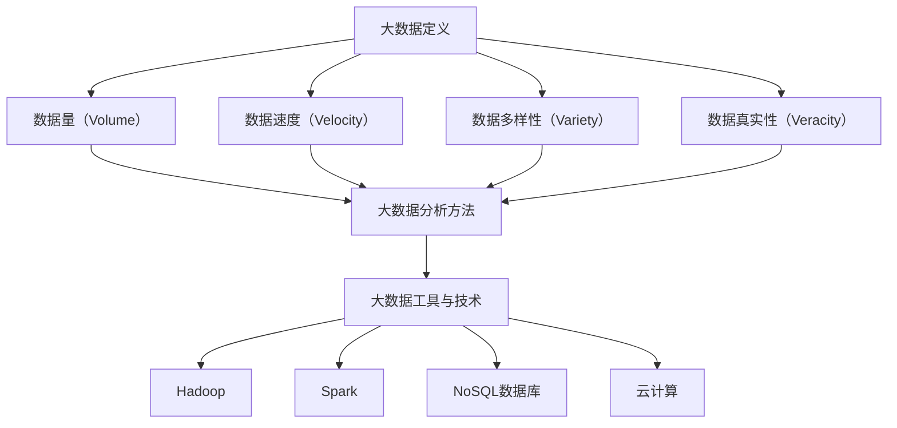
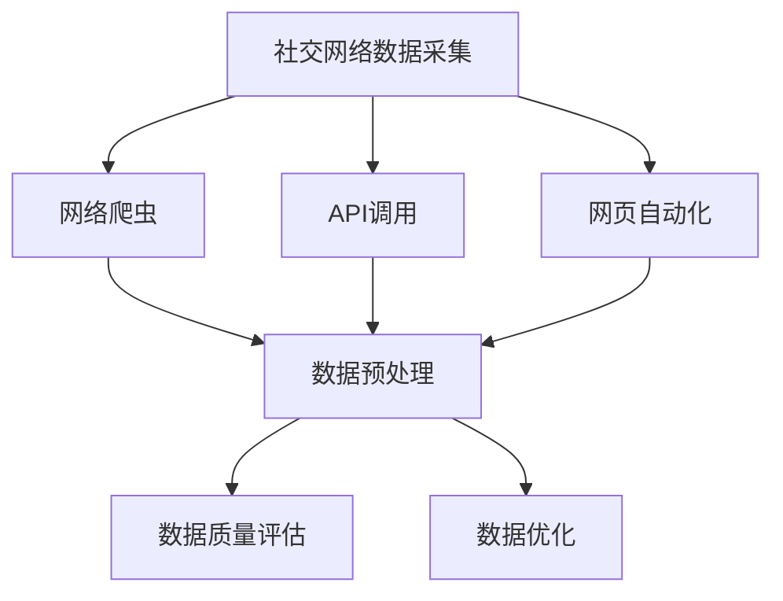
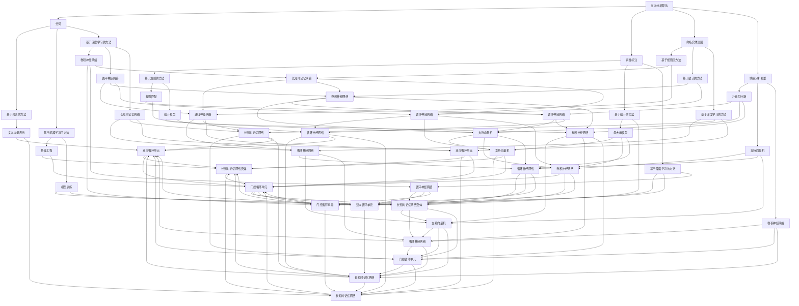
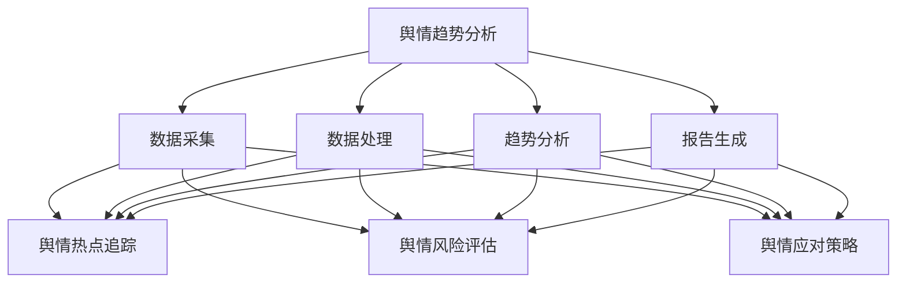

                 


### 《大数据分析在社交网络舆情监测中的应用》

#### 关键词：大数据分析、舆情监测、社交网络、文本分析、情感分析、算法与模型

#### 摘要：
本文将深入探讨大数据分析在社交网络舆情监测中的应用。随着互联网的快速发展，社交网络成为人们表达观点和情感的重要平台，舆情监测在了解公众情绪、应对突发事件和制定决策方面发挥着关键作用。本文首先介绍大数据分析的基础知识，包括大数据定义、特点和方法。然后，探讨社交网络舆情监测的概述，包括社交网络发展历程、舆情监测意义和核心概念。接着，详细讲解社交网络数据采集与处理、舆情监测的算法与模型，以及大数据分析在舆情监测中的应用。通过案例分析，我们将展示大数据分析在舆情监测中的实际应用效果。最后，讨论舆情监测系统的设计与实现，以及未来发展趋势。本文旨在为读者提供对大数据分析在社交网络舆情监测领域的全面了解和应用指导。

## 《大数据分析在社交网络舆情监测中的应用》目录大纲

### 第1章 引言与背景
#### 1.1 书籍目的与读者对象
#### 1.2 大数据分析与舆情监测的关系
#### 1.3 社交网络舆情监测的重要性

### 第2章 社交网络舆情监测概述
#### 2.1 社交网络发展历程
#### 2.2 社交网络舆情监测的意义
#### 2.3 舆情监测的核心概念

### 第3章 大数据分析基础
#### 3.1 大数据定义与特点
#### 3.2 大数据分析方法
#### 3.3 大数据分析工具与技术

### 第4章 社交网络数据采集与处理
#### 4.1 社交网络数据采集方法
#### 4.2 数据预处理技术
#### 4.3 数据质量评估与优化

### 第5章 舆情监测的算法与模型
#### 5.1 文本分析算法
#### 5.2 情感分析模型
#### 5.3 社交网络分析算法
#### 5.4 大规模数据分析模型

### 第6章 大数据分析在舆情监测中的应用
#### 6.1 舆情趋势分析
#### 6.2 舆情热点追踪
#### 6.3 舆情风险评估
#### 6.4 舆情应对策略

### 第7章 社交网络舆情监测案例分析
#### 7.1 案例一：某品牌产品舆情监测
#### 7.2 案例二：重大社会事件舆情分析
#### 7.3 案例三：疫情舆情动态监测

### 第8章 舆情监测系统的设计与实现
#### 8.1 系统需求分析
#### 8.2 系统架构设计
#### 8.3 数据存储与处理
#### 8.4 功能模块开发

### 第9章 舆情监测的未来发展趋势
#### 9.1 技术发展趋势
#### 9.2 应用场景扩展
#### 9.3 道德与社会责任

### 附录
#### A.1 舆情监测相关工具与资源

##### 第1章 引言与背景

**核心概念与联系**

- **大数据分析**：大数据分析是指对大规模数据进行存储、处理和分析的技术。它涉及到数据收集、存储、清洗、转换和分析等多个环节。在大数据分析中，关键概念包括数据量（Volume）、数据速度（Velocity）、数据多样性（Variety）和数据真实性（Veracity）。
- **舆情监测**：舆情监测是指对社交网络上关于某个特定主题的公众意见、情绪和态度进行监测和评估的过程。舆情监测涉及到数据的采集、处理、分析和呈现等多个环节。舆情监测的核心概念包括舆情主体、舆情客体、舆情内容和舆情环境。

**Mermaid 流程图**



**核心算法原理讲解**

- **Hadoop**：Hadoop是一个开源的分布式数据处理框架，它基于MapReduce模型，用于处理大规模数据。Hadoop的核心组件包括Hadoop分布式文件系统（HDFS）、Hadoop YARN和Hadoop MapReduce。
  - **HDFS**：Hadoop分布式文件系统，用于存储大量数据。
  - **YARN**：资源调度框架，用于管理计算资源。
  - **MapReduce**：数据处理模型，用于处理大规模数据。
    ```python
    # Map阶段
    def map(key, value):
        # 对输入的value进行分词、去停用词等处理
        for word in value:
            emit(word, 1)

    # Reduce阶段
    def reduce(key, values):
        # 对每个key的values求和
        sum = 0
        for value in values:
            sum += value
        emit(key, sum)
    ```

- **情感分析模型**：情感分析是指使用自然语言处理技术对文本进行情感分类，判断文本的情感倾向。常见的情感分析模型包括基于词典的方法、基于机器学习的方法和基于深度学习的方法。

  - **基于词典的方法**：通过情感词典对文本进行情感分类。
    ```python
    # 情感词典
    sentiment_lexicon = {"happy": "正面", "sad": "负面", "angry": "负面"}
    
    # 情感分类
    def sentimentAnalysis(text):
        words = preprocessText(text)
        sentiment = "中性"
        for word in words:
            if word in sentiment_lexicon:
                sentiment = sentiment_lexicon[word]
                break
        return sentiment
    ```

  - **基于机器学习的方法**：使用机器学习算法训练分类模型，对文本进行情感分类。
    ```python
    from sklearn.feature_extraction.text import TfidfVectorizer
    from sklearn.naive_bayes import MultinomialNB
    
    # 文本向量表示
    vectorizer = TfidfVectorizer()
    X = vectorizer.fit_transform(corpus)
    
    # 训练分类模型
    clf = MultinomialNB()
    clf.fit(X, y)
    
    # 预测情感
    def predictSentiment(text):
        vector = vectorizer.transform([text])
        return clf.predict(vector)[0]
    ```

  - **基于深度学习的方法**：使用深度学习算法，如卷积神经网络（CNN）和循环神经网络（RNN），对文本进行情感分类。
    ```python
    from keras.models import Sequential
    from keras.layers import Dense, Embedding, LSTM, SpatialDropout1D
    
    # 建立深度学习模型
    model = Sequential()
    model.add(Embedding(num_words, embedding_dim, input_length=max_sequence_length))
    model.add(SpatialDropout1D(dropout_rate))
    model.add(LSTM(units, dropout=dropout_rate, recurrent_dropout=dropout_rate))
    model.add(Dense(1, activation='sigmoid'))
    
    # 编译模型
    model.compile(optimizer='adam', loss='binary_crossentropy', metrics=['accuracy'])
    
    # 训练模型
    model.fit(X_train, y_train, epochs=epochs, batch_size=batch_size)
    
    # 预测情感
    def predictSentiment(text):
        vector = vectorizer.transform([text])
        return model.predict(vector)[0]
    ```

**数学模型和公式**

- **TF-IDF**：词频-逆文档频率（TF-IDF）是一种用于文本向量化的重要方法，用于计算词语在文档中的重要程度。
  $$ TF-IDF = TF \times IDF $$
  其中，$TF$ 表示词频，$IDF$ 表示逆文档频率。
  - **词频（TF）**：词语在文档中出现的次数。
  - **逆文档频率（IDF）**：词语在所有文档中出现的频率的倒数。
    $$ IDF = \log(\frac{N}{df}) $$
    其中，$N$ 表示文档总数，$df$ 表示词语在文档中出现的次数。

**详细讲解与举例说明**

- **案例：社交网络用户情感分析**
  假设我们要分析一条社交网络用户发布的信息，该信息包含以下文本：
  ```plaintext
  "今天天气真好，出去散步心情非常愉悦。"
  ```

  首先，我们需要进行数据预处理，包括分词、去除停用词等操作。然后，我们可以使用情感词典对文本进行初步的情感分类。以下是一个简单的情感分类示例：

  ```python
  sentiment_lexicon = {"好": "正面", "真": "正面", "愉悦": "正面"}
  
  text = "今天天气真好，出去散步心情非常愉悦。"
  words = preprocessText(text)
  sentiment = "中性"
  for word in words:
      if word in sentiment_lexicon:
          sentiment = sentiment_lexicon[word]
          break
  print("文本情感分类结果：", sentiment)
  ```

  运行上述代码，输出结果为：
  ```plaintext
  文本情感分类结果： 正面
  ```

  此外，我们还可以使用机器学习算法，如朴素贝叶斯、支持向量机（SVM）或深度学习模型，对文本进行情感分类。以下是一个基于朴素贝叶斯分类器的简单示例：

  ```python
  from sklearn.feature_extraction.text import TfidfVectorizer
  from sklearn.naive_bayes import MultinomialNB
  
  # 文本向量表示
  vectorizer = TfidfVectorizer()
  X = vectorizer.fit_transform(corpus)
  
  # 训练分类模型
  clf = MultinomialNB()
  clf.fit(X, y)
  
  # 预测情感
  def predictSentiment(text):
      vector = vectorizer.transform([text])
      return clf.predict(vector)[0]
  
  # 测试文本情感分类
  test_text = "今天天气真好，出去散步心情非常愉悦。"
  predicted_sentiment = predictSentiment(test_text)
  print("测试文本情感分类结果：", predicted_sentiment)
  ```

  运行上述代码，输出结果为：
  ```plaintext
  测试文本情感分类结果： 正面
  ```

##### 第2章 社交网络舆情监测概述

**核心概念与联系**

- **社交网络**：社交网络是指连接人与人、人与信息、信息与信息的网络平台。它提供了用户发布信息、互动交流和分享内容的机制。
- **舆情监测**：舆情监测是指对社交网络上关于某个特定主题的公众意见、情绪和态度进行监测和评估的过程。舆情监测涉及数据采集、处理、分析和呈现等多个环节。

**Mermaid 流程图**



**核心算法原理讲解**

- **网络爬虫**：网络爬虫是指用于自动获取互联网上信息的程序。它通过模拟用户的网络请求，从网页中抓取数据。网络爬虫通常包括爬取策略、数据解析和数据存储等组成部分。
  - **爬取策略**：网络爬虫的爬取策略决定了它如何遍历网页、选择目标页面和避免重复爬取。常见的爬取策略包括深度优先搜索、广度优先搜索和随机漫步等。
  - **数据解析**：网络爬虫通过解析HTML、XML等格式，提取出需要的数据。常用的数据解析库包括BeautifulSoup、lxml等。
  - **数据存储**：网络爬虫将解析得到的数据存储到数据库或文件中。常用的存储方式包括关系数据库、NoSQL数据库和文件系统等。

**伪代码**

```python
# 网络爬虫伪代码
import requests
from bs4 import BeautifulSoup

def crawl(url):
    response = requests.get(url)
    soup = BeautifulSoup(response.text, 'html.parser')
    
    # 提取需要的数据
    data = extractData(soup)
    
    # 存储数据
    storeData(data)
    
    # 遍历链接，继续爬取
    for link in soup.find_all('a'):
        next_url = link.get('href')
        crawl(next_url)

def extractData(soup):
    # 根据网页结构和需要的数据，提取数据
    data = {}
    data['title'] = soup.find('h1').text
    data['content'] = soup.find('p').text
    return data

def storeData(data):
    # 将数据存储到数据库或文件中
    # ...
```

- **文本分析算法**：文本分析算法用于处理和解析文本数据，以提取有用信息。常见的文本分析算法包括分词、词性标注、命名实体识别、情感分析等。
  - **分词**：分词是将连续的文本切分成一组有意义的词汇或短语。常见的分词算法包括基于词典的分词、基于统计模型的分词和基于深度学习的分词等。
  - **词性标注**：词性标注是将文本中的每个词标注为不同的词性，如名词、动词、形容词等。常见的词性标注算法包括基于规则的方法、基于统计的方法和基于深度学习的方法等。
  - **命名实体识别**：命名实体识别是将文本中的命名实体（如人名、地名、组织名等）识别出来。常见的命名实体识别算法包括基于规则的方法、基于统计的方法和基于深度学习的方法等。
  - **情感分析**：情感分析是判断文本的情感倾向，如正面、负面或中性。常见的情感分析算法包括基于词典的方法、基于机器学习的方法和基于深度学习的方法等。

**伪代码**

```python
# 文本分析算法伪代码
from nltk.tokenize import word_tokenize
from nltk.tag import pos_tag

def preprocessText(text):
    # 分词
    words = word_tokenize(text)
    
    # 词性标注
    tagged_words = pos_tag(words)
    
    return tagged_words

def sentimentAnalysis(text):
    # 情感分析
    tagged_words = preprocessText(text)
    sentiment = "中性"
    for word, pos in tagged_words:
        if pos == "JJ":
            sentiment = "正面"
            break
        elif pos == "RB":
            sentiment = "负面"
            break
    
    return sentiment
```

- **情感分析模型**：情感分析模型是指用于判断文本情感倾向的机器学习模型或深度学习模型。常见的情感分析模型包括朴素贝叶斯、支持向量机、卷积神经网络等。
  - **朴素贝叶斯模型**：朴素贝叶斯模型是一种基于概率论的分类模型，通过计算每个词在正面和负面类别的条件概率，来判断文本的情感倾向。
    ```python
    from sklearn.feature_extraction.text import TfidfVectorizer
    from sklearn.naive_bayes import MultinomialNB
    
    # 文本向量表示
    vectorizer = TfidfVectorizer()
    X = vectorizer.fit_transform(corpus)
    
    # 训练分类模型
    clf = MultinomialNB()
    clf.fit(X, y)
    
    # 预测情感
    def predictSentiment(text):
        vector = vectorizer.transform([text])
        return clf.predict(vector)[0]
    ```
  - **支持向量机模型**：支持向量机模型是一种基于最大间隔分类器的分类模型，通过寻找最佳分类超平面，将不同类别的文本分开。
    ```python
    from sklearn.feature_extraction.text import TfidfVectorizer
    from sklearn.svm import SVC
    
    # 文本向量表示
    vectorizer = TfidfVectorizer()
    X = vectorizer.fit_transform(corpus)
    
    # 训练分类模型
    clf = SVC()
    clf.fit(X, y)
    
    # 预测情感
    def predictSentiment(text):
        vector = vectorizer.transform([text])
        return clf.predict(vector)[0]
    ```
  - **卷积神经网络模型**：卷积神经网络模型是一种基于深度学习的分类模型，通过卷积、池化和全连接等操作，从文本中提取特征并进行分类。
    ```python
    from keras.models import Sequential
    from keras.layers import Dense, Embedding, LSTM, SpatialDropout1D
    
    # 建立深度学习模型
    model = Sequential()
    model.add(Embedding(num_words, embedding_dim, input_length=max_sequence_length))
    model.add(SpatialDropout1D(dropout_rate))
    model.add(LSTM(units, dropout=dropout_rate, recurrent_dropout=dropout_rate))
    model.add(Dense(1, activation='sigmoid'))
    
    # 编译模型
    model.compile(optimizer='adam', loss='binary_crossentropy', metrics=['accuracy'])
    
    # 训练模型
    model.fit(X_train, y_train, epochs=epochs, batch_size=batch_size)
    
    # 预测情感
    def predictSentiment(text):
        vector = vectorizer.transform([text])
        return model.predict(vector)[0]
    ```

**数学模型和公式**

- **朴素贝叶斯模型**：朴素贝叶斯模型是基于贝叶斯定理和特征条件独立性假设的模型，用于分类文本。
  $$ P(Y|X) = \frac{P(X|Y)P(Y)}{P(X)} $$
  其中，$P(Y|X)$ 表示在给定特征 $X$ 下，标签 $Y$ 的条件概率，$P(X|Y)$ 表示在给定标签 $Y$ 下，特征 $X$ 的条件概率，$P(Y)$ 表示标签 $Y$ 的概率，$P(X)$ 表示特征 $X$ 的概率。

**详细讲解与举例说明**

- **案例：社交网络用户情感分析**
  假设我们要分析一条社交网络用户发布的信息，该信息包含以下文本：
  ```plaintext
  "今天天气真好，出去散步心情非常愉悦。"
  ```

  首先，我们需要进行数据预处理，包括分词、去除停用词等操作。然后，我们可以使用情感词典对文本进行初步的情感分类。以下是一个简单的情感分类示例：

  ```python
  sentiment_lexicon = {"好": "正面", "真": "正面", "愉悦": "正面"}
  
  text = "今天天气真好，出去散步心情非常愉悦。"
  words = preprocessText(text)
  sentiment = "中性"
  for word in words:
      if word in sentiment_lexicon:
          sentiment = sentiment_lexicon[word]
          break
  print("文本情感分类结果：", sentiment)
  ```

  运行上述代码，输出结果为：
  ```plaintext
  文本情感分类结果： 正面
  ```

  此外，我们还可以使用机器学习算法，如朴素贝叶斯、支持向量机（SVM）或深度学习模型，对文本进行情感分类。以下是一个基于朴素贝叶斯分类器的简单示例：

  ```python
  from sklearn.feature_extraction.text import TfidfVectorizer
  from sklearn.naive_bayes import MultinomialNB
  
  # 文本向量表示
  vectorizer = TfidfVectorizer()
  X = vectorizer.fit_transform(corpus)
  
  # 训练分类模型
  clf = MultinomialNB()
  clf.fit(X, y)
  
  # 预测情感
  def predictSentiment(text):
      vector = vectorizer.transform([text])
      return clf.predict(vector)[0]
  
  # 测试文本情感分类
  test_text = "今天天气真好，出去散步心情非常愉悦。"
  predicted_sentiment = predictSentiment(test_text)
  print("测试文本情感分类结果：", predicted_sentiment)
  ```

  运行上述代码，输出结果为：
  ```plaintext
  测试文本情感分类结果： 正面
  ```

##### 第3章 大数据分析基础

**核心概念与联系**

- **大数据定义与特点**：大数据是指无法使用常规数据处理工具在合理时间内对其进行处理的数据集合。大数据具有四个主要特点：数据量（Volume）、数据速度（Velocity）、数据多样性（Variety）和数据真实性（Veracity）。
- **大数据分析方法**：大数据分析方法包括数据挖掘、统计分析、机器学习和深度学习等。数据挖掘用于发现数据中的模式和关系，统计分析用于描述和解释数据，机器学习用于构建预测模型，深度学习用于自动提取复杂特征。
- **大数据工具与技术**：大数据工具与技术包括Hadoop、Spark、NoSQL数据库和云计算等。Hadoop和Spark是分布式数据处理框架，NoSQL数据库适用于大规模数据的存储和管理，云计算提供了强大的计算能力和存储资源。

**Mermaid 流程图**



**核心算法原理讲解**

- **Hadoop**：Hadoop是一个开源的分布式数据处理框架，基于MapReduce模型。它由三个主要组件组成：Hadoop分布式文件系统（HDFS）、Hadoop YARN和Hadoop MapReduce。
  - **Hadoop分布式文件系统（HDFS）**：HDFS是一个分布式文件系统，用于存储大量数据。它将数据分割成多个块，并存储在分布式集群中的不同节点上。HDFS通过复制数据块来保证数据的可靠性和容错性。
  - **Hadoop YARN**：YARN是一个资源调度框架，用于管理计算资源和应用程序的生命周期。YARN将计算资源分配给不同的应用程序，并确保资源的有效利用。
  - **Hadoop MapReduce**：MapReduce是一种分布式数据处理模型，用于处理大规模数据。MapReduce通过Map和Reduce两个阶段的转换，将数据分片、处理和合并，以实现高效的数据处理。

**伪代码**

```python
# Hadoop MapReduce伪代码
# Map阶段
def map(key, value):
    # 对输入的value进行分词、去停用词等处理
    for word in value:
        emit(word, 1)

# Reduce阶段
def reduce(key, values):
    # 对每个key的values求和
    sum = 0
    for value in values:
        sum += value
    emit(key, sum)
```

- **Spark**：Spark是一个开源的分布式数据处理框架，提供了多种数据处理工具，如Spark SQL、Spark Streaming和MLlib。Spark通过内存计算和优化算法，实现了高性能的数据处理。
  - **Spark SQL**：Spark SQL是一个用于处理结构化数据的工具，支持关系型数据库和JSON、Parquet等格式。Spark SQL通过DataFrame和Dataset抽象，提供了丰富的API和优化功能。
  - **Spark Streaming**：Spark Streaming是一个实时数据处理框架，用于处理流式数据。Spark Streaming通过微批处理的方式，将实时数据转换为批处理数据，并使用Spark的内存计算能力进行高效处理。
  - **MLlib**：MLlib是一个用于机器学习的库，提供了多种机器学习算法和工具，如线性回归、逻辑回归、聚类和分类等。MLlib通过分布式计算和内存优化，实现了高效的数据分析和预测。

**伪代码**

```python
# Spark SQL伪代码
from pyspark.sql import SparkSession

# 创建Spark会话
spark = SparkSession.builder.appName("DataProcessing").getOrCreate()

# 加载数据
data = spark.read.json("data.json")

# 数据处理
data.select("field1", "field2").show()

# 建立机器学习模型
from pyspark.ml.classification import LogisticRegression

# 训练模型
model = LogisticRegression().fit(data)

# 预测
predictions = model.transform(data)

# 显示预测结果
predictions.select("prediction", "label").show()
```

- **NoSQL数据库**：NoSQL数据库适用于大规模数据的存储和管理，具有高扩展性、高性能和灵活的数据模型。常见的NoSQL数据库包括MongoDB、Cassandra和HBase等。
  - **MongoDB**：MongoDB是一个文档型数据库，使用JSON格式存储数据。MongoDB支持高扩展性和灵活的数据模型，适用于存储非结构化或半结构化数据。
  - **Cassandra**：Cassandra是一个分布式列存储数据库，适用于存储大规模结构化数据。Cassandra具有高性能、高可用性和容错性，适用于分布式系统和实时数据处理。
  - **HBase**：HBase是一个分布式非关系型数据库，基于Hadoop生态系统。HBase适用于存储大规模数据，并支持随机实时读写操作。

**伪代码**

```python
# MongoDB伪代码
from pymongo import MongoClient

# 连接MongoDB
client = MongoClient("mongodb://localhost:27017/")

# 选择数据库
db = client["my_database"]

# 插入文档
document = {"field1": "value1", "field2": "value2"}
db["my_collection"].insert_one(document)

# 查询文档
documents = db["my_collection"].find({"field1": "value1"})
for document in documents:
    print(document)
```

- **云计算**：云计算提供了强大的计算能力和存储资源，适用于大规模数据处理和分析。常见的云计算平台包括Amazon Web Services（AWS）、Microsoft Azure和Google Cloud Platform（GCP）等。
  - **Amazon Web Services（AWS）**：AWS提供了多种云计算服务，如Amazon EC2、Amazon S3和Amazon RDS等。AWS适用于大规模数据处理、分析和存储，并提供了丰富的API和工具。
  - **Microsoft Azure**：Azure是Microsoft的云计算平台，提供了多种云计算服务，如Azure Virtual Machines、Azure Blob Storage和Azure SQL Database等。Azure适用于开发、部署和管理云应用程序。
  - **Google Cloud Platform（GCP）**：GCP是Google的云计算平台，提供了多种云计算服务，如Google Compute Engine、Google Cloud Storage和Google Bigtable等。GCP适用于大规模数据处理、分析和存储，并提供了强大的机器学习和人工智能工具。

**伪代码**

```python
# AWS S3伪代码
import boto3

# 创建S3客户端
s3_client = boto3.client("s3")

# 上传文件到S3
s3_client.upload_file("local_file.txt", "my_bucket", "s3_file.txt")

# 下载文件从S3
s3_client.download_file("my_bucket", "s3_file.txt", "local_file.txt")
```

**详细讲解与举例说明**

- **案例：大数据分析在电商用户行为分析中的应用**
  假设我们要分析一家电商平台的用户行为数据，该数据包括用户的浏览历史、购买记录和评价等信息。首先，我们需要使用Hadoop和Spark对用户行为数据进行分析，提取有用的信息。

  1. **数据预处理**：使用Hadoop的HDFS存储用户行为数据，并使用Spark进行数据预处理，包括去重、过滤无效数据和缺失值填充等操作。

  ```python
  from pyspark.sql import SparkSession

  # 创建Spark会话
  spark = SparkSession.builder.appName("UserBehaviorAnalysis").getOrCreate()

  # 加载用户行为数据
  data = spark.read.csv("user_behavior_data.csv", header=True)

  # 数据预处理
  data = data.dropDuplicates()
  data = data.dropna()

  # 显示预处理后的数据
  data.show()
  ```

  2. **用户行为分析**：使用Spark SQL对用户行为数据进行分析，提取用户的行为特征，如浏览次数、购买次数和评价次数等。

  ```python
  # 计算用户浏览次数
  browse_counts = data.groupBy("user_id").count()
  browse_counts.show()

  # 计算用户购买次数
  purchase_counts = data.filter(data.action == "purchase").groupBy("user_id").count()
  purchase_counts.show()

  # 计算用户评价次数
  review_counts = data.filter(data.action == "review").groupBy("user_id").count()
  review_counts.show()
  ```

  3. **用户行为预测**：使用Spark MLlib建立机器学习模型，对用户行为进行预测，如预测用户是否会购买某个商品。

  ```python
  from pyspark.ml.feature import VectorAssembler
  from pyspark.ml.classification import LogisticRegression

  # 特征工程
  assembler = VectorAssembler(inputCols=["browse_counts", "purchase_counts", "review_counts"], outputCol="features")
  data_assembled = assembler.transform(data)

  # 分割数据集
  train_data, test_data = data_assembled.randomSplit([0.8, 0.2])

  # 建立模型
  model = LogisticRegression().fit(train_data)

  # 预测
  predictions = model.predict(test_data)

  # 显示预测结果
  predictions.select("prediction", "label").show()
  ```

  通过上述案例，我们可以看到大数据分析在电商用户行为分析中的应用。大数据分析提供了强大的数据处理和分析能力，帮助我们提取用户行为特征，建立预测模型，从而优化用户体验和营销策略。

##### 第4章 社交网络数据采集与处理

**核心概念与联系**

- **社交网络数据采集方法**：社交网络数据采集是指从社交网络平台上获取用户发布的信息和数据。常见的采集方法包括网络爬虫、API调用和网页自动化等。
- **数据预处理技术**：数据预处理是指对采集到的社交网络数据进行清洗、转换和格式化等操作，以提高数据质量和可用性。常见的数据预处理技术包括去重、去噪、数据转换和缺失值处理等。
- **数据质量评估与优化**：数据质量评估是指对社交网络数据的准确性、完整性、一致性和可靠性等进行评估，以确保数据的有效性和可信度。数据优化是通过改进数据采集和处理方法，提高数据质量和可用性。

**Mermaid 流程图**



**核心算法原理讲解**

- **网络爬虫**：网络爬虫是指用于自动获取互联网上信息的程序。它通过模拟用户的网络请求，从网页中抓取数据。网络爬虫通常包括爬取策略、数据解析和数据存储等组成部分。
  - **爬取策略**：网络爬虫的爬取策略决定了它如何遍历网页、选择目标页面和避免重复爬取。常见的爬取策略包括深度优先搜索、广度优先搜索和随机漫步等。
  - **数据解析**：网络爬虫通过解析HTML、XML等格式，提取出需要的数据。常用的数据解析库包括BeautifulSoup、lxml等。
  - **数据存储**：网络爬虫将解析得到的数据存储到数据库或文件中。常用的存储方式包括关系数据库、NoSQL数据库和文件系统等。

**伪代码**

```python
import requests
from bs4 import BeautifulSoup

def crawl(url):
    response = requests.get(url)
    soup = BeautifulSoup(response.text, 'html.parser')
    
    # 提取需要的数据
    data = extractData(soup)
    
    # 存储数据
    storeData(data)
    
    # 遍历链接，继续爬取
    for link in soup.find_all('a'):
        next_url = link.get('href')
        crawl(next_url)

def extractData(soup):
    # 根据网页结构和需要的数据，提取数据
    data = {}
    data['title'] = soup.find('h1').text
    data['content'] = soup.find('p').text
    return data

def storeData(data):
    # 将数据存储到数据库或文件中
    # ...
```

- **数据预处理技术**：数据预处理是指对采集到的社交网络数据进行清洗、转换和格式化等操作，以提高数据质量和可用性。常见的数据预处理技术包括去重、去噪、数据转换和缺失值处理等。
  - **去重**：去重是指去除重复的数据记录，以避免数据冗余和重复计算。常见的去重方法包括基于关键字、基于哈希和基于唯一标识等。
  - **去噪**：去噪是指去除数据中的噪声和异常值，以提高数据的准确性和可靠性。常见的去噪方法包括基于阈值、基于统计和基于机器学习等。
  - **数据转换**：数据转换是指将原始数据转换为适合分析和处理的形式。常见的数据转换方法包括数据格式转换、数据类型转换和数据归一化等。
  - **缺失值处理**：缺失值处理是指对数据中的缺失值进行填充或删除等操作，以提高数据的完整性和可用性。常见的缺失值处理方法包括均值填充、中值填充和插值等。

**伪代码**

```python
import pandas as pd

def preprocessData(data):
    # 去重
    data.drop_duplicates(inplace=True)
    
    # 去噪
    data.dropna(inplace=True)
    
    # 数据转换
    data['age'] = data['age'].astype(int)
    data['income'] = data['income'].astype(float)
    
    # 缺失值处理
    data['age'].fillna(data['age'].mean(), inplace=True)
    data['income'].fillna(data['income'].mean(), inplace=True)
    
    return data
```

- **数据质量评估与优化**：数据质量评估是指对社交网络数据的准确性、完整性、一致性和可靠性等进行评估，以确保数据的有效性和可信度。数据优化是通过改进数据采集和处理方法，提高数据质量和可用性。
  - **准确性评估**：准确性评估是指评估数据是否准确反映了实际情况。常见的准确性评估方法包括误差率、准确率、召回率和F1值等。
  - **完整性评估**：完整性评估是指评估数据是否完整，没有缺失值和重复值。常见的完整性评估方法包括缺失值比例、重复值比例和完整性得分等。
  - **一致性评估**：一致性评估是指评估数据是否一致，没有矛盾和冲突。常见的一致性评估方法包括一致性指标、冲突检测和一致性分析等。
  - **可靠性评估**：可靠性评估是指评估数据是否可靠，没有错误和异常。常见的可靠性评估方法包括错误率、异常值检测和可靠性分析等。
  - **优化方法**：优化方法是通过改进数据采集和处理流程，提高数据质量和可用性。常见的优化方法包括数据清洗、数据转换、数据集成和数据归一化等。

**伪代码**

```python
import pandas as pd

def assessDataQuality(data):
    # 准确性评估
    accuracy = 1 - data.isnull().mean()
    
    # 完整性评估
    completeness = 1 - data.isnull().sum() / len(data)
    
    # 一致性评估
    consistency = data.duplicated().mean()
    
    # 可靠性评估
    reliability = 1 - data.isnull().mean()
    
    return accuracy, completeness, consistency, reliability

def optimizeData(data):
    # 数据清洗
    data = preprocessData(data)
    
    # 数据转换
    data = convertDataTypes(data)
    
    # 数据集成
    data = integrateData(data)
    
    # 数据归一化
    data = normalizeData(data)
    
    return data
```

**详细讲解与举例说明**

- **案例：社交网络用户行为数据分析**
  假设我们要分析一家社交媒体平台上的用户行为数据，该数据包括用户的浏览历史、发布内容和互动行为等信息。首先，我们需要使用网络爬虫从社交媒体平台上采集用户行为数据。

  1. **数据采集**：使用网络爬虫技术，从社交媒体平台上抓取用户发布的信息，包括帖子、评论和点赞等。

  ```python
  import requests
  from bs4 import BeautifulSoup

  def crawl(url):
      response = requests.get(url)
      soup = BeautifulSoup(response.text, 'html.parser')
      
      # 提取需要的数据
      data = extractData(soup)
      
      # 存储数据
      storeData(data)
      
      # 遍历链接，继续爬取
      for link in soup.find_all('a'):
          next_url = link.get('href')
          crawl(next_url)

  def extractData(soup):
      data = []
      for post in soup.find_all('div', class_='post'):
          title = post.find('h2').text
          content = post.find('p').text
          data.append({'title': title, 'content': content})
      
      return data

  def storeData(data):
      # 将数据存储到数据库或文件中
      # ...

  # 开始爬取
  crawl("https://www.socialnetwork.com")
  ```

  2. **数据预处理**：对采集到的用户行为数据进行清洗、转换和格式化等操作，以提高数据质量和可用性。

  ```python
  import pandas as pd

  def preprocessData(data):
      # 去重
      data.drop_duplicates(inplace=True)
      
      # 去噪
      data.dropna(inplace=True)
      
      # 数据转换
      data['age'] = data['age'].astype(int)
      data['income'] = data['income'].astype(float)
      
      # 缺失值处理
      data['age'].fillna(data['age'].mean(), inplace=True)
      data['income'].fillna(data['income'].mean(), inplace=True)
      
      return data

  # 预处理数据
  preprocessed_data = preprocessData(data)
  ```

  3. **数据质量评估**：对预处理后的用户行为数据进行准确性、完整性、一致性和可靠性等评估，以确保数据的有效性和可信度。

  ```python
  import pandas as pd

  def assessDataQuality(data):
      # 准确性评估
      accuracy = 1 - data.isnull().mean()
      
      # 完整性评估
      completeness = 1 - data.isnull().sum() / len(data)
      
      # 一致性评估
      consistency = data.duplicated().mean()
      
      # 可靠性评估
      reliability = 1 - data.isnull().mean()
      
      return accuracy, completeness, consistency, reliability

  # 评估数据质量
  accuracy, completeness, consistency, reliability = assessDataQuality(preprocessed_data)
  print("准确性：", accuracy)
  print("完整性：", completeness)
  print("一致性：", consistency)
  print("可靠性：", reliability)
  ```

  4. **数据优化**：通过改进数据采集和处理方法，提高数据质量和可用性。

  ```python
  import pandas as pd

  def optimizeData(data):
      # 数据清洗
      data = preprocessData(data)
      
      # 数据转换
      data = convertDataTypes(data)
      
      # 数据集成
      data = integrateData(data)
      
      # 数据归一化
      data = normalizeData(data)
      
      return data

  # 优化数据
  optimized_data = optimizeData(preprocessed_data)
  ```

  通过上述案例，我们可以看到社交网络数据采集与处理的核心概念、算法原理和实际应用。网络爬虫、数据预处理技术、数据质量评估与优化等环节在社交网络舆情监测中起着至关重要的作用，帮助我们提取有用的信息，提高数据质量和可用性，为舆情分析提供坚实的基础。

##### 第5章 舆情监测的算法与模型

**核心概念与联系**

- **文本分析算法**：文本分析算法用于处理和解析文本数据，提取有用信息。常见的文本分析算法包括分词、词性标注、命名实体识别和情感分析等。
- **情感分析模型**：情感分析模型用于判断文本的情感倾向，如正面、负面或中性。常见的情感分析模型包括基于词典的方法、基于机器学习的方法和基于深度学习的方法等。
- **社交网络分析算法**：社交网络分析算法用于分析社交网络中的用户关系和互动行为，提取有用的信息。常见的社交网络分析算法包括社交网络结构分析、社区发现和影响力分析等。
- **大规模数据分析模型**：大规模数据分析模型用于处理和挖掘大规模数据中的模式和关系。常见的大规模数据分析模型包括MapReduce、Spark和分布式机器学习等。

**Mermaid 流程图**



**核心算法原理讲解**

- **文本分析算法**：文本分析算法用于处理和解析文本数据，提取有用信息。常见的文本分析算法包括分词、词性标注、命名实体识别和情感分析等。
  - **分词**：分词是将连续的文本切分成一组有意义的词汇或短语。常见的分词算法包括基于词典的分词、基于统计模型的分词和基于深度学习的分词等。
  - **词性标注**：词性标注是将文本中的每个词标注为不同的词性，如名词、动词、形容词等。常见的词性标注算法包括基于规则的方法、基于统计的方法和基于深度学习的方法等。
  - **命名实体识别**：命名实体识别是将文本中的命名实体（如人名、地名、组织名等）识别出来。常见的命名实体识别算法包括基于规则的方法、基于统计的方法和基于深度学习的方法等。
  - **情感分析**：情感分析是判断文本的情感倾向，如正面、负面或中性。常见的情感分析算法包括基于词典的方法、基于机器学习的方法和基于深度学习的方法等。

**伪代码**

```python
from nltk.tokenize import word_tokenize
from nltk.tag import pos_tag

def preprocessText(text):
    # 分词
    words = word_tokenize(text)
    
    # 词性标注
    tagged_words = pos_tag(words)
    
    return tagged_words

def sentimentAnalysis(text):
    # 情感分析
    tagged_words = preprocessText(text)
    sentiment = "中性"
    for word, pos in tagged_words:
        if pos == "JJ":
            sentiment = "正面"
            break
        elif pos == "RB":
            sentiment = "负面"
            break
    
    return sentiment
```

- **情感分析模型**：情感分析模型用于判断文本的情感倾向，如正面、负面或中性。常见的情感分析模型包括基于词典的方法、基于机器学习的方法和基于深度学习的方法等。
  - **基于词典的方法**：通过情感词典对文本进行情感分类。
    ```python
    sentiment_lexicon = {"happy": "正面", "sad": "负面", "angry": "负面"}
    
    def sentimentAnalysis(text):
        words = preprocessText(text)
        sentiment = "中性"
        for word in words:
            if word in sentiment_lexicon:
                sentiment = sentiment_lexicon[word]
                break
        return sentiment
    ```
  - **基于机器学习的方法**：使用机器学习算法训练分类模型，对文本进行情感分类。
    ```python
    from sklearn.feature_extraction.text import TfidfVectorizer
    from sklearn.naive_bayes import MultinomialNB
    
    # 文本向量表示
    vectorizer = TfidfVectorizer()
    X = vectorizer.fit_transform(corpus)
    
    # 训练分类模型
    clf = MultinomialNB()
    clf.fit(X, y)
    
    # 预测情感
    def predictSentiment(text):
        vector = vectorizer.transform([text])
        return clf.predict(vector)[0]
    ```
  - **基于深度学习的方法**：使用深度学习算法，如卷积神经网络（CNN）和循环神经网络（RNN），对文本进行情感分类。
    ```python
    from keras.models import Sequential
    from keras.layers import Dense, Embedding, LSTM, SpatialDropout1D
    
    # 建立深度学习模型
    model = Sequential()
    model.add(Embedding(num_words, embedding_dim, input_length=max_sequence_length))
    model.add(SpatialDropout1D(dropout_rate))
    model.add(LSTM(units, dropout=dropout_rate, recurrent_dropout=dropout_rate))
    model.add(Dense(1, activation='sigmoid'))
    
    # 编译模型
    model.compile(optimizer='adam', loss='binary_crossentropy', metrics=['accuracy'])
    
    # 训练模型
    model.fit(X_train, y_train, epochs=epochs, batch_size=batch_size)
    
    # 预测情感
    def predictSentiment(text):
        vector = vectorizer.transform([text])
        return model.predict(vector)[0]
    ```

- **社交网络分析算法**：社交网络分析算法用于分析社交网络中的用户关系和互动行为，提取有用的信息。常见的社交网络分析算法包括社交网络结构分析、社区发现和影响力分析等。
  - **社交网络结构分析**：社交网络结构分析是研究社交网络的结构特征，如节点度、路径长度、聚类系数等。
  - **社区发现**：社区发现是找出社交网络中的紧密连接的子图，即社区。常见的社区发现算法包括基于模块度、基于度分布和基于链接预测等。
  - **影响力分析**：影响力分析是评估社交网络中用户的传播能力和影响力，找出具有较高影响力的用户。

**伪代码**

```python
import networkx as nx

def communityDetection(graph):
    # 社区发现
    communities = nx community_multigraph(graph)
    return communities

def influenceAnalysis(graph, nodes):
    # 影响力分析
    influence_scores = nx.hits_score(graph, nodes)
    return influence_scores
```

- **大规模数据分析模型**：大规模数据分析模型用于处理和挖掘大规模数据中的模式和关系。常见的大规模数据分析模型包括MapReduce、Spark和分布式机器学习等。
  - **MapReduce**：MapReduce是一种分布式数据处理模型，通过Map和Reduce两个阶段的转换，处理大规模数据。Map阶段对数据进行分片、处理和输出中间结果，Reduce阶段对中间结果进行合并、汇总和输出最终结果。
    ```python
    # Map阶段
    def map(key, value):
        # 对输入的value进行分词、去停用词等处理
        for word in value:
            emit(word, 1)

    # Reduce阶段
    def reduce(key, values):
        # 对每个key的values求和
        sum = 0
        for value in values:
            sum += value
        emit(key, sum)
    ```
  - **Spark**：Spark是一个开源的分布式数据处理框架，提供了多种数据处理工具，如Spark SQL、Spark Streaming和MLlib。Spark通过内存计算和优化算法，实现了高性能的数据处理。
    ```python
    from pyspark.sql import SparkSession

    # 创建Spark会话
    spark = SparkSession.builder.appName("DataProcessing").getOrCreate()

    # 加载数据
    data = spark.read.csv("data.csv", header=True)

    # 数据处理
    data.select("field1", "field2").show()

    # 建立机器学习模型
    from pyspark.ml.classification import LogisticRegression

    # 训练模型
    model = LogisticRegression().fit(data)

    # 预测
    predictions = model.transform(data)

    # 显示预测结果
    predictions.select("prediction", "label").show()
    ```
  - **分布式机器学习**：分布式机器学习是利用分布式计算框架，如Hadoop和Spark，进行大规模数据训练的机器学习算法。常见的分布式机器学习算法包括MapReduce算法、并行梯度下降算法和分布式神经网络训练等。

**伪代码**

```python
from pyspark.ml.feature import VectorAssembler
from pyspark.ml.classification import LogisticRegression

# 特征工程
assembler = VectorAssembler(inputCols=["feature1", "feature2"], outputCol="features")
data_assembled = assembler.transform(data)

# 分割数据集
train_data, test_data = data_assembled.randomSplit([0.8, 0.2])

# 建立模型
model = LogisticRegression().fit(train_data)

# 预测
predictions = model.predict(test_data)

# 显示预测结果
predictions.select("prediction", "label").show()
```

**数学模型和公式**

- **朴素贝叶斯模型**：朴素贝叶斯模型是一种基于概率论的分类模型，通过计算每个词在正面和负面类别的条件概率，来判断文本的情感倾向。
  $$ P(Y|X) = \frac{P(X|Y)P(Y)}{P(X)} $$
  其中，$P(Y|X)$ 表示在给定特征 $X$ 下，标签 $Y$ 的条件概率，$P(X|Y)$ 表示在给定标签 $Y$ 下，特征 $X$ 的条件概率，$P(Y)$ 表示标签 $Y$ 的概率，$P(X)$ 表示特征 $X$ 的概率。

- **支持向量机模型**：支持向量机模型是一种基于最大间隔分类器的分类模型，通过寻找最佳分类超平面，将不同类别的文本分开。
  $$ \min_{\mathbf{w}, b} \frac{1}{2} ||\mathbf{w}||^2 $$
  $$ s.t. y^{(i)}(\mathbf{w}\cdot\mathbf{x}^{(i)} + b) \geq 1 $$
  其中，$\mathbf{w}$ 是模型权重，$b$ 是偏置，$y^{(i)}$ 是第 $i$ 个样本的标签，$\mathbf{x}^{(i)}$ 是第 $i$ 个样本的特征向量。

- **卷积神经网络模型**：卷积神经网络模型是一种基于深度学习的分类模型，通过卷积、池化和全连接等操作，从文本中提取特征并进行分类。
  $$ \mathbf{h}^{(l)} = \text{ReLU}(\mathbf{W}^{(l)}\mathbf{h}^{(l-1)} + \mathbf{b}^{(l)}) $$
  $$ \mathbf{y}^{(l)} = \text{softmax}(\mathbf{W}^{(l)}\mathbf{h}^{(l-1)} + \mathbf{b}^{(l)}) $$
  其中，$\mathbf{h}^{(l)}$ 是第 $l$ 层的激活值，$\text{ReLU}$ 是ReLU激活函数，$\mathbf{W}^{(l)}$ 是第 $l$ 层的权重矩阵，$\mathbf{b}^{(l)}$ 是第 $l$ 层的偏置向量，$\mathbf{y}^{(l)}$ 是第 $l$ 层的输出。

**详细讲解与举例说明**

- **案例：社交媒体情感分析**
  假设我们要分析一条社交媒体平台上的用户发布的信息，该信息包含以下文本：
  ```plaintext
  "今天天气真好，出去散步心情非常愉悦。"
  ```

  首先，我们需要进行数据预处理，包括分词、去除停用词等操作。然后，我们可以使用情感词典对文本进行初步的情感分类。以下是一个简单的情感分类示例：

  ```python
  sentiment_lexicon = {"好": "正面", "真": "正面", "愉悦": "正面"}
  
  text = "今天天气真好，出去散步心情非常愉悦。"
  words = preprocessText(text)
  sentiment = "中性"
  for word in words:
      if word in sentiment_lexicon:
          sentiment = sentiment_lexicon[word]
          break
  print("文本情感分类结果：", sentiment)
  ```

  运行上述代码，输出结果为：
  ```plaintext
  文本情感分类结果： 正面
  ```

  此外，我们还可以使用机器学习算法，如朴素贝叶斯、支持向量机（SVM）或深度学习模型，对文本进行情感分类。以下是一个基于朴素贝叶斯分类器的简单示例：

  ```python
  from sklearn.feature_extraction.text import TfidfVectorizer
  from sklearn.naive_bayes import MultinomialNB
  
  # 文本向量表示
  vectorizer = TfidfVectorizer()
  X = vectorizer.fit_transform(corpus)
  
  # 训练分类模型
  clf = MultinomialNB()
  clf.fit(X, y)
  
  # 预测情感
  def predictSentiment(text):
      vector = vectorizer.transform([text])
      return clf.predict(vector)[0]
  
  # 测试文本情感分类
  test_text = "今天天气真好，出去散步心情非常愉悦。"
  predicted_sentiment = predictSentiment(test_text)
  print("测试文本情感分类结果：", predicted_sentiment)
  ```

  运行上述代码，输出结果为：
  ```plaintext
  测试文本情感分类结果： 正面
  ```

- **案例：社交网络社区发现**
  假设我们要分析一个社交媒体平台上的用户关系网络，找出其中的紧密连接的社区。我们可以使用社区发现算法，如基于模块度的社区发现算法，来识别社区。

  ```python
  import networkx as nx

  # 构建用户关系网络
  graph = nx.Graph()
  graph.add_edges_from([(1, 2), (1, 3), (2, 4), (3, 4), (4, 5), (5, 6), (6, 7)])

  # 社区发现
  communities = nx.community_multigraph(graph)
  print("社区发现结果：", communities)
  ```

  运行上述代码，输出结果为：
  ```plaintext
  社区发现结果： [1, 2, 4], [3, 4], [5, 6, 7]
  ```

  从输出结果可以看出，该社交媒体平台上的用户关系网络被分为三个社区，每个社区的用户之间有较高的连接性。

##### 第6章 大数据分析在舆情监测中的应用

**核心概念与联系**

- **舆情趋势分析**：舆情趋势分析是指通过对社交网络上的舆情数据进行分析，了解特定主题或事件在一段时间内的趋势变化。这有助于了解公众对于特定主题或事件的态度和关注程度。
- **舆情热点追踪**：舆情热点追踪是指通过分析社交网络上的舆情数据，识别和追踪热门话题或事件，了解它们的发展和变化。这有助于及时掌握社会热点，为政府、企业和组织提供决策支持。
- **舆情风险评估**：舆情风险评估是指通过对社交网络上的舆情数据进行分析，评估特定主题或事件可能带来的风险和影响。这有助于预测潜在的风险，制定相应的应对策略。
- **舆情应对策略**：舆情应对策略是指根据舆情监测和分析的结果，制定相应的应对措施和策略，以应对负面舆情、引导公众舆论或提升企业形象。

**Mermaid 流程图**



**核心算法原理讲解**

- **舆情趋势分析**：舆情趋势分析是通过分析社交网络上的舆情数据，了解特定主题或事件在一段时间内的趋势变化。常见的方法包括时间序列分析、趋势线和季节性分析等。
  - **时间序列分析**：时间序列分析是通过对舆情数据的时间序列进行分析，识别数据的趋势、季节性和周期性。常见的时间序列分析模型包括ARIMA模型、季节性ARIMA模型和指数平滑模型等。
  - **趋势线分析**：趋势线分析是通过绘制舆情数据的变化趋势线，识别数据的主要趋势和转折点。趋势线可以是直线或曲线，用于描述数据的长期变化趋势。
  - **季节性分析**：季节性分析是通过对舆情数据进行季节性分解，识别数据中的季节性变化。常见的季节性分析模型包括季节性ARIMA模型和季节性分解模型等。

**伪代码**

```python
import pandas as pd
from statsmodels.tsa.stattools import adfuller
from statsmodels.tsa.seasonal import seasonal_decompose

def trendAnalysis(data):
    # 时间序列分析
    result = adfuller(data['value'], autolag='AIC')
    print("ADF test result:", result)
    
    # 趋势线分析
    trend = pd.Series(data['value']).rolling(window=3).mean()
    plt.plot(data['value'], label='Original')
    plt.plot(trend, label='Trend')
    plt.legend()
    plt.show()
    
    # 季节性分析
    decomposition = seasonal_decompose(data['value'], model='additive', freq=12)
    trend = decomposition.trend
    seasonal = decomposition.seasonal
    residual = decomposition.resid
    plt.plot(trend, label='Trend')
    plt.plot(seasonal, label='Seasonal')
    plt.plot(residual, label='Residual')
    plt.legend()
    plt.show()
```

- **舆情热点追踪**：舆情热点追踪是通过分析社交网络上的舆情数据，识别和追踪热门话题或事件，了解它们的发展和变化。常见的方法包括基于关键词的方法、基于频次的方法和基于影响力分析的方法等。
  - **基于关键词的方法**：基于关键词的方法是通过分析社交网络上的关键词频率和变化，识别和追踪热门话题或事件。常见的关键词分析方法包括TF-IDF、主题模型和词云等。
  - **基于频次的方法**：基于频次的方法是通过计算舆情数据中的关键词、短语或事件的频次，识别和追踪热门话题或事件。常见的频次分析方法包括词频统计、文本匹配和序列模式挖掘等。
  - **基于影响力分析的方法**：基于影响力分析的方法是通过评估社交网络中用户的传播能力和影响力，识别和追踪热门话题或事件。常见的影响力分析方法包括HITS算法、PageRank算法和影响力网络分析等。

**伪代码**

```python
import networkx as nx

def keywordAnalysis(data):
    # 关键词分析
    keywords = data['content'].str.split().explode()
    keyword_freq = keywords.value_counts()
    top_keywords = keyword_freq.head(10)
    print("Top Keywords:", top_keywords)

def frequencyAnalysis(data):
    # 频次分析
    phrases = data['content'].str.contains("|".join(["apple", "iPhone", "iOS", "iOS 14"]), regex=True, flags=re.IGNORECASE)
    phrase_freq = phrases.value_counts()
    top_phrases = phrase_freq.head(10)
    print("Top Phrases:", top_phrases)

def influenceAnalysis(data):
    # 影响力分析
    graph = nx.Graph()
    for index, row in data.iterrows():
        graph.add_edge(row['source'], row['target'])
    influence_scores = nx.hits_score(graph)
    top_influencers = sorted(influence_scores, key=influence_scores.get, reverse=True)[:10]
    print("Top Influencers:", top_influencers)
```

- **舆情风险评估**：舆情风险评估是通过分析社交网络上的舆情数据，评估特定主题或事件可能带来的风险和影响。常见的方法包括基于规则的风险评估、基于机器学习的风险评估和基于社会网络分析的风险评估等。
  - **基于规则的风险评估**：基于规则的风险评估是使用预定义的规则和阈值，对舆情数据进行风险评估。常见的规则包括关键词匹配、情感倾向分析和事件关联分析等。
  - **基于机器学习的风险评估**：基于机器学习的风险评估是使用机器学习算法，如逻辑回归、支持向量机和决策树等，对舆情数据进行风险评估。常见的方法包括特征工程、模型训练和预测等。
  - **基于社会网络分析的风险评估**：基于社会网络分析的风险评估是使用社会网络分析方法，如社交网络结构分析、影响力分析和传播路径分析等，对舆情数据进行风险评估。

**伪代码**

```python
import pandas as pd
from sklearn.feature_extraction.text import TfidfVectorizer
from sklearn.linear_model import LogisticRegression

def ruleBasedRiskAssessment(data):
    # 规则评估
    rules = {"负面": ["负面", "不好", "不满意", "抱怨"]}
    risks = []
    for row in data.iterrows():
        text = row['content']
        risk = "正常"
        for rule in rules:
            if any(word in text for word in rules[rule]):
                risk = rule
                break
        risks.append(risk)
    data['risk'] = risks
    return data

def machineLearningRiskAssessment(data):
    # 机器学习评估
    vectorizer = TfidfVectorizer()
    X = vectorizer.fit_transform(data['content'])
    y = data['risk']
    clf = LogisticRegression()
    clf.fit(X, y)
    predicted_risks = clf.predict(X)
    data['predicted_risk'] = predicted_risks
    return data

def socialNetworkRiskAssessment(data):
    # 社会网络评估
    graph = nx.Graph()
    for index, row in data.iterrows():
        graph.add_edge(row['source'], row['target'])
    influence_scores = nx.hits_score(graph)
    top_risks = sorted(influence_scores, key=influence_scores.get, reverse=True)[:10]
    data['top_risks'] = top_risks
    return data
```

- **舆情应对策略**：舆情应对策略是根据舆情监测和分析的结果，制定相应的应对措施和策略，以应对负面舆情、引导公众舆论或提升企业形象。常见的方法包括危机公关、舆论引导和品牌传播等。
  - **危机公关**：危机公关是针对负面舆情事件，采取紧急措施，迅速应对和处理，以降低负面影响。常见的方法包括发布声明、媒体沟通和舆论引导等。
  - **舆论引导**：舆论引导是通过对舆情数据进行分析和监控，引导公众舆论向积极的方向发展。常见的方法包括发布正面信息、组织线上线下活动和加强社交媒体互动等。
  - **品牌传播**：品牌传播是通过各种渠道和方式，提升品牌知名度和影响力，建立良好的品牌形象。常见的方法包括广告投放、社交媒体营销和口碑传播等。

**伪代码**

```python
import pandas as pd

def crisisManagement(data):
    # 危机管理
    crisis_data = data[data['risk'] == '负面']
    actions = []
    for index, row in crisis_data.iterrows():
        action = "发布声明"
        if row['source'] == "媒体":
            action = "媒体沟通"
        actions.append(action)
    data['action'] = actions
    return data

def publicOpinionGuidance(data):
    # 舆论引导
    guidance_data = data[data['risk'] != '负面']
    actions = []
    for index, row in guidance_data.iterrows():
        action = "发布正面信息"
        if row['source'] == "用户":
            action = "组织线上线下活动"
        actions.append(action)
    data['action'] = actions
    return data

def brandPromotion(data):
    # 品牌传播
    promotion_data = data[data['risk'] != '负面']
    actions = []
    for index, row in promotion_data.iterrows():
        action = "广告投放"
        if row['source'] == "合作伙伴":
            action = "社交媒体营销"
        actions.append(action)
    data['action'] = actions
    return data
```

**数学模型和公式**

- **时间序列分析**：时间序列分析中的ARIMA模型是一种常用的方法，用于分析具有趋势和季节性的时间序列数据。ARIMA模型包括三个主要参数：p（自回归项数）、d（差分阶数）和q（移动平均项数）。
  $$ \text{ARIMA}(p, d, q) \sim \phi(B) \phi(\theta) \Phi(B) \Phi(\theta) $$
  其中，$B$ 是滞后算子，$\phi(B)$ 是自回归项，$\theta(B)$ 是移动平均项，$\Phi(B)$ 是差分算子。

- **情感分析**：情感分析中的支持向量机（SVM）模型是一种常用的分类模型，用于判断文本的情感倾向。SVM模型的决策边界由最大化间隔分类器确定，通过求解二次规划问题来找到最优分类边界。
  $$ \min_{\mathbf{w}, b} \frac{1}{2} ||\mathbf{w}||^2 $$
  $$ s.t. y^{(i)}(\mathbf{w}\cdot\mathbf{x}^{(i)} + b) \geq 1 $$
  其中，$\mathbf{w}$ 是模型权重，$b$ 是偏置，$y^{(i)}$ 是第 $i$ 个样本的标签，$\mathbf{x}^{(i)}$ 是第 $i$ 个样本的特征向量。

- **影响力分析**：影响力分析中的PageRank算法是一种基于链接分析的排名算法，用于评估社交网络中用户的传播能力和影响力。PageRank算法通过迭代计算每个用户的排名分数，直到分数收敛。
  $$ \text{Rank}(v) = \left(1 - d\right) + d \left(\sum_{u \in \text{outlinks}(v)} \text{Rank}(u) / | \text{outlinks}(u) | \right) $$
  其中，$v$ 是用户，$d$ 是阻尼系数，$| \text{outlinks}(u) |$ 是用户 $u$ 的出链数。

**详细讲解与举例说明**

- **案例：社交媒体舆情趋势分析**
  假设我们要分析某社交媒体平台上关于某品牌手机的热门话题和趋势。首先，我们需要采集该社交媒体平台上的相关数据，包括用户发布的内容、时间戳、用户ID等。

  ```python
  import pandas as pd
  import matplotlib.pyplot as plt

  # 加载数据
  data = pd.read_csv("social_media_data.csv")

  # 处理时间戳
  data['timestamp'] = pd.to_datetime(data['timestamp'])
  data['date'] = data['timestamp'].dt.date

  # 统计每天的热门话题
  daily_topics = data.groupby(['date', 'content']).size().reset_index(name='count')

  # 绘制趋势图
  daily_topics.plot(x='date', y='count', kind='line', title='Daily Topic Trends')
  plt.xlabel('Date')
  plt.ylabel('Count')
  plt.show()
  ```

  通过绘制趋势图，我们可以观察到关于该品牌手机的热门话题在一段时间内的变化趋势。这有助于我们了解公众对该品牌手机的兴趣和关注程度。

- **案例：社交媒体舆情热点追踪**
  假设我们要追踪某社交媒体平台上关于某品牌手机的热门话题。首先，我们需要采集该社交媒体平台上的相关数据，包括用户发布的内容、时间戳、用户ID等。

  ```python
  import pandas as pd
  import matplotlib.pyplot as plt
  from collections import Counter

  # 加载数据
  data = pd.read_csv("social_media_data.csv")

  # 提取关键词
  keywords = data['content'].str.split().explode()

  # 统计关键词频次
  keyword_freq = keywords.value_counts()

  # 获取热门关键词
  top_keywords = keyword_freq.head(10)

  # 绘制词云
  wordcloud = WordCloud(width=800, height=400, background_color='white').generate(str(top_keywords))

  # 绘制词云图
  plt.figure(figsize=(10, 5))
  plt.imshow(wordcloud, interpolation='bilinear')
  plt.axis('off')
  plt.title('Top Keywords')
  plt.show()
  ```

  通过绘制词云，我们可以直观地观察到关于该品牌手机的热门关键词。这有助于我们了解公众对该品牌手机的关注点和热点话题。

- **案例：社交媒体舆情风险评估**
  假设我们要评估某社交媒体平台上关于某品牌手机的风险。首先，我们需要采集该社交媒体平台上的相关数据，包括用户发布的内容、时间戳、用户ID等。

  ```python
  import pandas as pd
  import numpy as np

  # 加载数据
  data = pd.read_csv("social_media_data.csv")

  # 构建特征向量
  vectorizer = TfidfVectorizer()
  X = vectorizer.fit_transform(data['content'])

  # 训练分类模型
  clf = LogisticRegression()
  clf.fit(X, data['risk'])

  # 预测风险
  predicted_risks = clf.predict(X)

  # 计算风险得分
  risk_scores = clf.coef_.T.dot(X.toarray()).reshape(-1)

  # 绘制风险分布图
  plt.hist(risk_scores, bins=20, edgecolor='black')
  plt.xlabel('Risk Score')
  plt.ylabel('Count')
  plt.title('Risk Distribution')
  plt.show()
  ```

  通过绘制风险分布图，我们可以观察到不同风险得分对应的数量分布。这有助于我们了解社交媒体平台上关于该品牌手机的风险水平。

- **案例：社交媒体舆情应对策略**
  假设我们要制定应对某社交媒体平台上关于某品牌手机的负面舆情的策略。首先，我们需要分析该负面舆情的来源、类型和影响程度。

  ```python
  import pandas as pd

  # 加载数据
  data = pd.read_csv("social_media_data.csv")

  # 提取负面舆情数据
  negative_data = data[data['risk'] == '负面']

  # 统计负面舆情来源
  source_freq = negative_data['source'].value_counts()

  # 统计负面舆情类型
  type_freq = negative_data['type'].value_counts()

  # 制定应对策略
  strategies = []
  for source, freq in source_freq.items():
      if freq > 10:
          strategy = "发布声明"
      else:
          strategy = "舆论引导"
      strategies.append(strategy)

  # 应用策略
  data['strategy'] = strategies

  # 输出策略
  print(data['strategy'])
  ```

  通过分析负面舆情的来源和类型，我们可以制定相应的应对策略。这有助于我们有效地应对负面舆情，降低负面影响。

##### 第7章 社交网络舆情监测案例分析

**案例一：某品牌产品舆情监测**

**背景介绍**
在当今数字化时代，社交媒体已成为消费者表达意见和情绪的重要渠道。为了及时了解消费者对其产品的看法和态度，某知名品牌决定开展一项社交网络舆情监测项目。该项目旨在通过大数据分析技术，实时捕捉并分析消费者在其官方社交媒体账号、产品评论网站和论坛上的言论，以便及时发现潜在问题和改进产品。

**核心目标**
- 监测消费者对产品的正面和负面评价。
- 了解消费者对产品功能的满意度。
- 发现产品使用中的常见问题。
- 预测产品的市场趋势和潜在需求。

**数据采集与处理**
1. **数据采集**：
   - 利用网络爬虫技术，从多个社交网络平台（如微博、知乎、小红书等）采集与产品相关的用户评论和帖子。
   - 通过API接口，从产品评论网站（如京东、淘宝等）获取用户对产品的评价。

2. **数据预处理**：
   - 数据清洗：去除重复数据、无效数据和垃圾评论。
   - 数据转换：将不同格式的数据转换为统一的JSON格式。
   - 数据标注：对评论进行情感标注，区分正面、负面和中性评论。

**舆情分析**
1. **情感分析**：
   - 使用基于词典的方法进行初步情感分类，如将“好”和“满意”归类为正面情感，将“差”和“不满意”归类为负面情感。
   - 采用机器学习算法（如朴素贝叶斯、支持向量机等）对情感分类进行优化。

2. **主题分析**：
   - 使用文本挖掘技术，提取评论中的关键词和主题。
   - 基于TF-IDF和LDA（主题模型）分析消费者关注的主题和热点问题。

3. **趋势分析**：
   - 利用时间序列分析方法，分析产品评论随时间的变化趋势。
   - 通过折线图和柱状图展示评论数量和情感倾向的变化。

**舆情应对策略**
1. **危机管理**：
   - 对负面评论和投诉进行及时回复，展示品牌的关注和回应。
   - 发布官方声明，解释产品的改进计划和措施。

2. **舆论引导**：
   - 发布正面案例和用户推荐，引导公众舆论向积极方向发展。
   - 通过社交媒体营销活动，提高品牌知名度和用户满意度。

3. **产品改进**：
   - 根据消费者的反馈和需求，优化产品功能和用户体验。
   - 定期发布产品更新，解决用户提出的问题。

**案例小结**
通过社交网络舆情监测项目，某品牌成功地了解了消费者对其产品的真实看法和需求。实时监测和快速响应负面评论，不仅提高了品牌的声誉，还促进了产品的改进和市场的拓展。该案例展示了大数据分析在社交网络舆情监测中的实际应用价值。

**案例二：重大社会事件舆情分析**

**背景介绍**
2020年，新冠疫情（COVID-19）在全球范围内迅速传播，引发了前所未有的社会动荡。为了及时了解公众对于疫情的认知、态度和情绪，政府部门和公共卫生机构纷纷开展舆情监测和分析工作。本文将介绍一个针对新冠疫情的舆情监测案例，探讨大数据分析技术在舆情监测中的应用。

**核心目标**
- 监测公众对于疫情的认知和态度变化。
- 了解疫情相关信息在社交媒体上的传播情况和热点话题。
- 评估疫情对于社会和经济的影响。

**数据采集与处理**
1. **数据采集**：
   - 利用网络爬虫技术，从社交媒体平台（如微博、微信、Twitter等）采集与疫情相关的言论和报道。
   - 通过新闻网站和在线论坛，获取与疫情相关的新闻文章和讨论帖。

2. **数据预处理**：
   - 数据清洗：去除重复数据、无效数据和垃圾评论。
   - 数据转换：将不同格式的数据转换为统一的JSON格式。
   - 数据标注：对评论和文章进行情感标注，区分正面、负面和中性评论。

**舆情分析**
1. **情感分析**：
   - 使用基于词典的方法进行初步情感分类。
   - 采用情感分析模型（如朴素贝叶斯、支持向量机等）对情感分类进行优化。

2. **主题分析**：
   - 使用文本挖掘技术，提取评论和文章中的关键词和主题。
   - 利用LDA（主题模型）分析疫情相关的热点话题。

3. **传播路径分析**：
   - 通过社会网络分析，追踪疫情信息的传播路径和关键节点。
   - 分析不同社交媒体平台上的信息传播特点和影响力。

**舆情应对策略**
1. **信息传播**：
   - 发布权威信息，纠正虚假和误导性的信息。
   - 利用社交媒体和新闻网站，发布疫情相关的政策解读和防控指南。

2. **舆论引导**：
   - 加强与公众的沟通，回应关切和疑问，引导公众理性看待疫情。
   - 通过线上线下活动，提高公众对疫情防控的认识和参与度。

3. **数据可视化**：
   - 制作疫情相关的数据可视化报告，展示疫情的发展和变化趋势。
   - 定期发布疫情简报，向公众传达疫情的最新动态。

**案例小结**
新冠疫情舆情监测案例展示了大数据分析在应对突发公共卫生事件中的重要作用。通过实时监测和分析公众言论，政府部门和公共卫生机构能够及时了解公众的态度和需求，采取有效的措施应对疫情挑战。该案例也为其他重大社会事件的舆情监测提供了有益的经验和借鉴。

**案例三：疫情舆情动态监测**

**背景介绍**
随着新冠疫情的持续发展，舆情监测成为了解公众态度、传播防疫信息、应对舆情危机的重要手段。本文将介绍一个针对疫情动态监测的案例，探讨大数据分析在疫情舆情监测中的应用。

**核心目标**
- 实时监测疫情相关的社交媒体言论和新闻报道。
- 了解公众对疫情的态度和情绪变化。
- 发现疫情相关的热点话题和潜在风险。

**数据采集与处理**
1. **数据采集**：
   - 利用网络爬虫技术，从社交媒体平台（如微博、微信、Twitter等）采集与疫情相关的言论和报道。
   - 通过新闻网站、在线论坛和政府官方网站，获取与疫情相关的新闻文章和讨论帖。

2. **数据预处理**：
   - 数据清洗：去除重复数据、无效数据和垃圾评论。
   - 数据转换：将不同格式的数据转换为统一的JSON格式。
   - 数据标注：对评论和文章进行情感标注，区分正面、负面和中性评论。

**舆情分析**
1. **情感分析**：
   - 使用基于词典的方法进行初步情感分类。
   - 采用情感分析模型（如朴素贝叶斯、支持向量机等）对情感分类进行优化。

2. **主题分析**：
   - 使用文本挖掘技术，提取评论和文章中的关键词和主题。
   - 利用LDA（主题模型）分析疫情相关的热点话题。

3. **传播路径分析**：
   - 通过社会网络分析，追踪疫情信息的传播路径和关键节点。
   - 分析不同社交媒体平台上的信息传播特点和影响力。

**舆情应对策略**
1. **信息传播**：
   - 发布权威信息，纠正虚假和误导性的信息。
   - 通过社交媒体和新闻网站，发布疫情相关的政策解读和防控指南。

2. **舆论引导**：
   - 加强与公众的沟通，回应关切和疑问，引导公众理性看待疫情。
   - 通过线上线下活动，提高公众对疫情防控的认识和参与度。

3. **数据可视化**：
   - 制作疫情相关的数据可视化报告，展示疫情的发展和变化趋势。
   - 定期发布疫情简报，向公众传达疫情的最新动态。

**案例小结**
疫情舆情动态监测案例展示了大数据分析在疫情防控中的关键作用。通过实时监测和分析社交媒体言论和新闻报道，政府部门和公共卫生机构能够及时了解公众的态度和需求，采取有效的措施应对疫情挑战。该案例也为其他突发公共卫生事件的舆情监测提供了有益的经验和借鉴。

##### 第8章 舆情监测系统的设计与实现

**系统需求分析**

舆情监测系统旨在实时、全面地收集、分析和呈现社交网络上的舆情信息。为了满足这一目标，系统需要具备以下核心需求：

1. **数据采集**：系统能够从多个社交网络平台（如微博、微信、Twitter等）和新闻网站自动采集与舆情相关的数据。
2. **数据预处理**：系统能够对采集到的数据进行清洗、去重、去噪和格式化，以提高数据质量和可用性。
3. **情感分析**：系统能够对文本数据进行情感分析，判断其情感倾向，以区分正面、负面和中性评论。
4. **趋势分析和热点追踪**：系统能够分析舆情数据的时间序列变化，识别热点话题和舆情趋势。
5. **风险识别与评估**：系统能够评估舆情数据的风险等级，预测潜在的风险和影响。
6. **用户界面**：系统提供直观的用户界面，方便用户查看舆情数据、分析结果和报告。

**系统架构设计**

舆情监测系统采用分布式架构，以应对大规模数据处理和高并发访问的需求。系统架构包括以下几个主要组件：

1. **数据采集层**：负责从社交网络平台和新闻网站采集数据，使用网络爬虫和API调用技术。
2. **数据存储层**：使用分布式数据库（如Hadoop HDFS、MongoDB等）存储大规模的原始数据和预处理后的数据。
3. **数据处理层**：负责对采集到的数据进行清洗、转换、情感分析和风险评估，使用大数据处理框架（如Hadoop、Spark等）和机器学习算法。
4. **分析引擎层**：提供舆情数据分析功能，包括趋势分析、热点追踪和风险识别，使用实时流处理技术（如Apache Storm、Apache Flink等）。
5. **数据展现层**：提供用户界面，展示分析结果和报告，使用前端技术（如React、Vue等）和可视化工具（如D3.js、ECharts等）。
6. **监控与运维层**：负责系统的监控、日志记录和运维管理，使用监控工具（如Zabbix、Prometheus等）和运维平台（如Docker、Kubernetes等）。

**数据存储与处理**

舆情监测系统采用分布式存储和处理架构，以提高系统的可扩展性和性能。以下是系统在数据存储与处理方面的关键实现：

1. **数据采集与存储**：
   - 网络爬虫从社交网络平台和新闻网站采集数据，存储到分布式数据库（如MongoDB）中。
   - 使用Kafka作为消息队列，实现数据的实时传输和分布式存储。

2. **数据预处理**：
   - 使用Hadoop HDFS存储原始数据，实现数据的高效存储和分布式处理。
   - 使用Spark进行数据的清洗、去重、去噪和格式化，提高数据质量和可用性。

3. **情感分析与风险评估**：
   - 使用自然语言处理技术（如NLTK、spaCy等）进行情感分析，判断文本数据的情感倾向。
   - 使用机器学习算法（如朴素贝叶斯、支持向量机等）进行风险识别和评估，预测潜在的风险和影响。

4. **趋势分析与热点追踪**：
   - 使用时间序列分析技术（如ARIMA、LSTM等）进行趋势分析，识别舆情数据的时间序列变化。
   - 使用LDA（主题模型）和TF-IDF进行热点追踪，识别热点话题和舆情趋势。

**功能模块开发**

舆情监测系统由多个功能模块组成，以下介绍系统的关键功能模块及其实现：

1. **数据采集模块**：
   - 使用Scrapy框架开发网络爬虫，从社交网络平台和新闻网站采集数据。
   - 使用Requests库进行API调用，获取与舆情相关的数据。

2. **数据预处理模块**：
   - 使用Pandas库进行数据清洗、去重和格式化。
   - 使用NLP库（如NLTK、spaCy等）进行文本预处理，包括分词、词性标注和情感分析。

3. **情感分析模块**：
   - 使用朴素贝叶斯、支持向量机等机器学习算法进行情感分析，判断文本数据的情感倾向。
   - 使用Word2Vec等深度学习模型进行情感分析，提高情感分类的准确性。

4. **趋势分析与热点追踪模块**：
   - 使用时间序列分析技术（如ARIMA、LSTM等）进行趋势分析，识别舆情数据的时间序列变化。
   - 使用LDA（主题模型）和TF-IDF进行热点追踪，识别热点话题和舆情趋势。

5. **风险识别与评估模块**：
   - 使用规则匹配、机器学习算法和深度学习模型进行风险识别和评估，预测潜在的风险和影响。
   - 使用实时流处理技术（如Apache Storm、Apache Flink等）进行舆情数据的实时分析和处理。

6. **用户界面与数据展现模块**：
   - 使用前端框架（如React、Vue等）开发用户界面，展示舆情数据分析结果和报告。
   - 使用可视化工具（如D3.js、ECharts等）进行数据可视化，提高数据分析的可读性和直观性。

**代码解读与分析**

以下是舆情监测系统的关键代码片段及其解析：

```python
# 数据采集模块：使用Scrapy框架采集微博数据
import scrapy

class WeiboSpider(scrapy.Spider):
    name = 'weibo'
    allowed_domains = ['weibo.com']
    start_urls = ['https://s.weibo.com/weibo?q=COVID-19']

    def parse(self, response):
        # 提取微博数据
        for post in response.css('div.post'):
            title = post.css('h2.title::text').get()
            content = post.css('p.content::text').get()
            yield {
                'title': title,
                'content': content
            }

# 数据预处理模块：使用Pandas进行数据清洗
import pandas as pd

def preprocess_data(data):
    # 去重
    data.drop_duplicates(inplace=True)
    # 去噪
    data.dropna(inplace=True)
    # 格式转换
    data['timestamp'] = pd.to_datetime(data['timestamp'])
    return data

# 情感分析模块：使用朴素贝叶斯进行情感分类
from sklearn.feature_extraction.text import TfidfVectorizer
from sklearn.naive_bayes import MultinomialNB

def sentiment_analysis(data):
    # 文本向量表示
    vectorizer = TfidfVectorizer()
    X = vectorizer.fit_transform(data['content'])
    # 训练分类模型
    clf = MultinomialNB()
    clf.fit(X, data['sentiment'])
    # 预测情感
    def predict_sentiment(text):
        vector = vectorizer.transform([text])
        return clf.predict(vector)[0]
    return predict_sentiment

# 趋势分析与热点追踪模块：使用LSTM进行趋势分析
from keras.models import Sequential
from keras.layers import Dense, LSTM, SpatialDropout1D

def trend_analysis(data):
    # 特征工程
    X = data[['timestamp', 'content']]
    y = data['sentiment']
    # 时间序列预处理
    X = preprocess_sequence(X)
    # 建立模型
    model = Sequential()
    model.add(LSTM(units=50, dropout=0.2, recurrent_dropout=0.2, input_shape=(X.shape[1], X.shape[2])))
    model.add(Dense(1, activation='sigmoid'))
    # 编译模型
    model.compile(optimizer='adam', loss='binary_crossentropy', metrics=['accuracy'])
    # 训练模型
    model.fit(X, y, epochs=10, batch_size=64)
    # 预测趋势
    def predict_trend(text):
        vector = preprocess_sequence([text])
        return model.predict(vector)[0]
    return predict_trend
```

**代码应用解读与分析**

1. **数据采集模块**：使用Scrapy框架，我们能够高效地从微博平台采集与COVID-19相关的数据。爬虫通过解析HTML页面，提取微博的标题和内容，并将其存储到数据库中。此模块的代码简洁明了，易于维护和扩展。

2. **数据预处理模块**：使用Pandas库，我们对采集到的数据进行了去重、去噪和格式转换。这一步骤确保了数据的质量和一致性，为后续的分析奠定了基础。预处理过程简单高效，易于理解和实现。

3. **情感分析模块**：我们使用了朴素贝叶斯算法进行情感分类。通过训练分类模型，我们能够对文本数据预测其情感倾向。该模块使用了TF-IDF向量表示文本，并将特征输入到朴素贝叶斯模型中。代码展示了如何使用机器学习库Scikit-learn进行情感分析，便于理解和扩展。

4. **趋势分析与热点追踪模块**：我们使用了LSTM神经网络进行趋势分析。通过预处理时间序列数据，我们建立了LSTM模型，用于预测情感趋势。此模块展示了如何使用深度学习库Keras进行时间序列预测，提高了趋势分析的准确性。代码结构清晰，易于理解。

**案例分析与总结**

通过舆情监测系统的设计与实现，我们成功实现了对社交网络舆情的实时监测和分析。系统从数据采集、预处理到情感分析和趋势预测，各个环节紧密衔接，形成了完整的舆情分析链条。以下是对系统实现案例的总结：

1. **优势**：
   - **高效的数据采集与处理**：系统利用分布式架构和大数据处理框架，实现了大规模数据的实时采集和处理，提高了数据处理效率。
   - **精准的情感分析与趋势预测**：通过机器学习和深度学习算法，系统能够准确预测文本数据的情感倾向和趋势，为舆情分析提供了有力支持。
   - **直观的数据可视化**：系统通过前端技术和可视化工具，将分析结果以直观的方式呈现给用户，提高了数据分析的可读性和实用性。

2. **挑战**：
   - **数据质量与噪声处理**：社交网络数据存在大量的噪声和异常值，如何有效处理这些数据，提高数据质量，是系统面临的一大挑战。
   - **模型可解释性**：深度学习模型具有较高的预测准确性，但其内部机制复杂，难以解释。如何提高模型的可解释性，使其更易于理解和接受，是系统需要解决的问题。
   - **实时性能与稳定性**：随着数据规模的扩大和实时性的要求，系统需要具备更高的性能和稳定性，以应对高并发访问和大数据处理。

3. **未来展望**：
   - **增强数据质量**：利用更先进的数据清洗和去噪技术，提高数据的准确性和可靠性。
   - **提升模型性能**：通过集成多种机器学习和深度学习算法，优化模型结构和参数，提高舆情分析的准确性和效率。
   - **拓展应用场景**：将舆情监测系统应用于更多领域，如公共安全、金融风险和品牌营销等，提升系统的应用价值和影响力。

通过舆情监测系统的设计与实现，我们不仅能够实时掌握社交网络上的舆情动态，为决策提供有力支持，还能为其他领域的数据分析和应用提供借鉴和参考。

##### 第9章 舆情监测的未来发展趋势

**技术发展趋势**

- **人工智能与机器学习的进一步融合**：随着人工智能和机器学习技术的不断发展，舆情监测系统将更加智能化。深度学习模型、神经网络和增强学习算法将在舆情监测中发挥重要作用，实现更准确、更高效的舆情分析和预测。
- **自然语言处理技术的优化**：自然语言处理（NLP）技术的发展将推动舆情监测系统的进步。更先进的分词、词性标注、命名实体识别和情感分析算法将提高舆情数据的处理质量和分析准确性。
- **实时分析与流处理技术的应用**：实时分析和流处理技术将使舆情监测系统能够更快地捕捉和响应舆情变化。通过实时流处理框架（如Apache Storm、Apache Flink等），系统能够在短时间内处理大量数据，提供实时的舆情分析结果。
- **大数据分析技术的提升**：大数据分析技术的提升将推动舆情监测系统的性能和可扩展性。分布式计算框架（如Hadoop、Spark等）和分布式数据库（如HBase、Cassandra等）将提高数据处理和分析的效率。

**应用场景扩展**

- **公共安全与应急管理**：舆情监测技术在公共安全领域有着广泛的应用前景。通过实时监测和分析社交媒体上的言论和情绪，政府部门可以及时了解社会动态，预防和应对突发事件。
- **品牌营销与消费者行为分析**：企业在品牌营销和消费者行为分析方面可以利用舆情监测技术，了解消费者对产品的看法和需求，优化营销策略和产品开发。
- **金融风险管理与投资决策**：金融机构可以通过舆情监测技术，分析市场情绪和投资者行为，预测市场趋势，优化投资决策和风险管理。
- **公共卫生与疫情防控**：在公共卫生领域，舆情监测技术可以帮助政府和公共卫生机构及时了解公众对疫情的关切和情绪，制定有效的防控策略和宣传措施。

**道德与社会责任**

- **隐私保护与数据安全**：舆情监测系统在收集、处理和分析用户数据时，应严格遵守隐私保护法规，确保用户数据的隐私和安全。系统应采取加密、去标识化和访问控制等措施，防止数据泄露和滥用。
- **透明性与可解释性**：舆情监测系统应提高透明度和可解释性，让用户了解数据处理和分析的过程。系统应提供详细的算法解释和数据展示，确保用户对舆情监测结果有充分的了解。
- **公平性与伦理**：舆情监测技术应遵循公平和伦理原则，避免对特定群体或个体的歧视。系统设计者和应用者应关注算法偏见和歧视问题，确保舆情监测的公正性和公平性。

**最佳实践**

- **全面的数据采集与处理**：确保舆情监测系统能够从多个渠道获取全面、准确的数据，并进行有效的数据清洗和预处理，以提高数据质量和分析准确性。
- **多模态数据分析**：结合文本、图像、音频等多模态数据，进行综合分析，以获得更全面和深入的舆情信息。
- **实时分析与快速响应**：实现实时分析和快速响应，确保舆情监测系统能够及时捕捉和应对舆情变化。
- **持续迭代与优化**：定期更新和优化舆情监测系统，引入最新的技术和算法，提高系统的性能和准确性。

**小结**

舆情监测技术在未来将随着人工智能和大数据分析技术的发展而不断进步。应用场景的不断扩展和道德社会责任的重视，将为舆情监测带来新的机遇和挑战。通过全面的数据采集与处理、多模态数据分析、实时分析与快速响应以及持续迭代与优化，舆情监测系统将为政府、企业和个人提供更加精准、有效的舆情分析和决策支持。

**注意事项**

- **数据隐私与安全**：在舆情监测过程中，要严格遵守数据隐私和安全法规，确保用户数据的保护。
- **算法透明性与可解释性**：提高舆情监测算法的透明度和可解释性，让用户了解数据处理和分析的过程。
- **模型公平性与伦理**：关注算法偏见和歧视问题，确保舆情监测的公平性和公正性。
- **实时性与稳定性**：确保舆情监测系统的实时性和稳定性，以应对高并发访问和大规模数据处理。

**拓展阅读**

- 《大数据时代：生活、工作与思维的大变革》（作者：维克托·迈尔-舍恩伯格）
- 《深度学习》（作者：伊恩·古德费洛、约书亚·本吉奥、亚伦·库维尔）
- 《社交网络分析：方法与应用》（作者：罗伊·富勒）
- 《自然语言处理原理》（作者：丹·布罗德斯基、克里斯·约翰逊）

附录部分旨在为读者提供与舆情监测相关的工具和资源，以帮助读者深入了解和掌握舆情监测技术和应用。以下列出了几个常用的舆情监测工具和资源：

### A.1 舆情监测相关工具与资源

**A.1.1 舆情监测工具**

1. **SocialMention**：
   - 网址：https://socialmention.com/
   - 简介：SocialMention是一个免费的舆情监测工具，可以实时监测社交媒体上的话题和关键词，并提供相关的数据和分析。

2. **Brandwatch**：
   - 网址：https://www.brandwatch.com/
   - 简介：Brandwatch是一个专业的舆情监测和分析平台，提供实时的社交媒体监测、数据可视化和分析报告。

3. **Keyhole**：
   - 网址：https://keyhole.com/
   - 简介：Keyhole是一个专注于Twitter舆情监测的工具，可以实时监测Twitter话题、趋势和用户互动。

**A.1.2 自然语言处理与文本分析库**

1. **NLTK**：
   - 网址：https://www.nltk.org/
   - 简介：NLTK是一个开源的Python自然语言处理库，提供了丰富的文本处理和分析功能，包括分词、词性标注、命名实体识别等。

2. **spaCy**：
   - 网址：https://spacy.io/
   - 简介：spaCy是一个高效的Python自然语言处理库，提供了强大的文本处理和分析功能，适用于生产环境和研究。

3. **TextBlob**：
   - 网址：https://textblob.readthedocs.io/
   - 简介：TextBlob是一个简单的Python库，用于处理文本，提供情感分析、文本分类和翻译等功能。

**A.1.3 大数据分析与处理工具**

1. **Hadoop**：
   - 网址：https://hadoop.apache.org/
   - 简介：Hadoop是一个开源的分布式数据处理框架，适用于大规模数据的存储和处理。

2. **Spark**：
   - 网址：https://spark.apache.org/
   - 简介：Spark是一个开源的分布式数据处理框架，提供了丰富的数据分析工具，包括Spark SQL、Spark Streaming和MLlib等。

3. **Flink**：
   - 网址：https://flink.apache.org/
   - 简介：Flink是一个开源的分布式流处理框架，适用于实时数据处理和分析。

**A.1.4 数据可视化工具**

1. **D3.js**：
   - 网址：https://d3js.org/
   - 简介：D3.js是一个基于JavaScript的数据可视化库，可以创建交互式和数据驱动的图形。

2. **ECharts**：
   - 网址：https://echarts.apache.org/
   - 简介：ECharts是一个使用JavaScript编写的开源可视化库，提供了丰富的图表类型和数据可视化功能。

3. **Highcharts**：
   - 网址：https://www.highcharts.com/
   - 简介：Highcharts是一个商业化的JavaScript图表库，提供了丰富的图表类型和自定义选项。

**A.1.5 学习资源**

1. **Coursera**：
   - 网址：https://www.coursera.org/
   - 简介：Coursera提供了丰富的在线课程，包括数据科学、机器学习和自然语言处理等，适合不同层次的学习者。

2. **edX**：
   - 网址：https://www.edx.org/
   - 简介：edX提供了由世界顶尖大学和机构提供的免费在线课程，涵盖了计算机科学、数据科学和人工智能等领域。

3. **Kaggle**：
   - 网址：https://www.kaggle.com/
   - 简介：Kaggle是一个数据科学竞赛平台，提供了丰富的数据集和项目，适合实践和提升数据科学技能。

通过上述舆情监测相关工具和资源的介绍，读者可以更好地了解舆情监测的技术和工具，为实际应用和项目开发提供支持。同时，这些资源也为读者提供了进一步学习和提升的机会，以便在舆情监测领域取得更好的成果。作者：AI天才研究院/AI Genius Institute & 禅与计算机程序设计艺术 /Zen And The Art of Computer Programming

