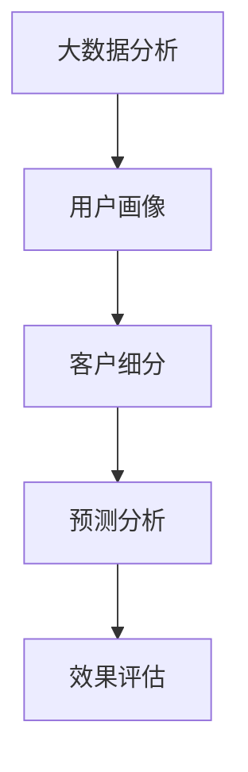
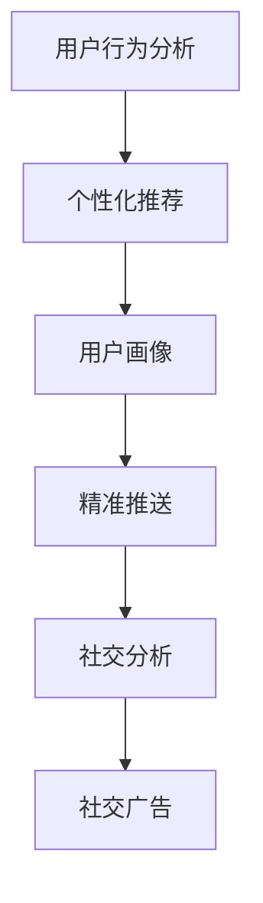
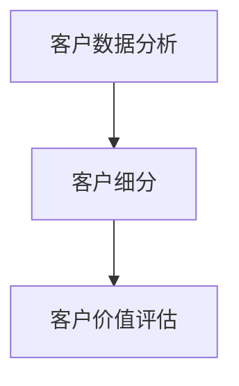
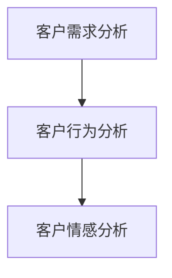

                 

### 第1章：大数据分析概述

#### 1.1 大数据的定义与特点

#### 1.1.1 大数据的定义

大数据（Big Data）是指无法在合理时间内用常规软件工具进行捕捉、管理和处理的数据集合。其特征可以用4V（Volume、Velocity、Variety、Veracity）来概括。

- **Volume（体量巨大）**：大数据的体量远超传统数据处理能力。一个典型的例子是谷歌每天处理的数据量高达24 petabytes（即24,000,000,000,000,000字节）。
- **Velocity（高速流动）**：数据产生和流动的速度极快。社交媒体平台如Twitter每秒会产生约350,000条推文，这些都是实时数据。
- **Variety（数据类型多样）**：大数据不仅包括结构化数据（如数据库中的表格），还包括非结构化和半结构化数据（如图像、视频、音频和文本）。
- **Veracity（真实性高）**：数据质量高，可靠性强。随着数据来源的多样性，数据真实性成为一个重要的考量因素。

#### 1.1.2 大数据的主要特点

1. **数据量大**：大数据的规模通常以GB（千兆字节）、TB（太字节）或PB（拍字节）计量。例如，一家大型电商平台每天会生成数百万条交易记录。

2. **处理速度快**：处理大数据需要高速计算和实时分析，否则数据的价值会随着时间推移而下降。

3. **数据类型多样**：大数据不仅包括结构化数据，还包括非结构化和半结构化数据，如图像、视频、社交媒体内容等。

4. **价值密度低**：与传统的数据库不同，大数据中的信息可能分散且不完整，因此需要有效的分析和挖掘技术来提取价值。

#### 1.1.3 大数据分析的重要性

大数据分析在企业决策中扮演着重要角色：

- **提升决策效率**：通过对大量数据的分析，企业可以快速识别市场趋势和业务问题。
- **优化营销策略**：精准了解用户需求和行为，有助于制定更加有效的营销策略。
- **提高业务效率**：通过数据分析优化业务流程，减少不必要的成本和资源浪费。
- **创新商业模式**：借助大数据分析，企业可以探索新的商业模式和增长点。

#### 1.2 大数据分析的核心概念

**数据挖掘（Data Mining）**：数据挖掘是从大量数据中提取有价值信息的过程，涉及统计学、机器学习和数据库技术。

**机器学习（Machine Learning）**：机器学习是一种通过算法从数据中学习规律和模式的技术，可以用于分类、聚类、预测等任务。

**数据可视化（Data Visualization）**：数据可视化是将数据转换成图形或图像的方式，帮助人们更好地理解和分析数据。

**数据仓库（Data Warehouse）**：数据仓库是一个集中的数据库系统，用于存储和管理大量结构化数据，以便进行数据分析。

#### 1.3 大数据分析与精准营销的关系

大数据分析在精准营销中起着至关重要的作用：

- **用户画像**：通过分析用户行为数据，可以构建用户的画像，从而进行个性化的营销。
- **客户细分**：将用户按照不同的特征进行细分，以便制定有针对性的营销策略。
- **预测分析**：利用历史数据预测用户行为和市场需求，帮助制定更科学的营销策略。
- **效果评估**：通过分析营销活动的效果，不断优化和调整策略，提高营销 ROI。

**Mermaid 流程图**：



### 第2章：精准营销的概念与分类

#### 2.1 精准营销的定义与核心要素

**精准营销**（Precision Marketing）是一种以数据驱动的营销方式，旨在通过精确的目标定位、个性化的内容定制和高效的渠道选择，提高营销效果和投资回报率。

**核心要素**包括：

- **目标定位**：精确确定目标受众，以确保营销资源的最大化利用。
- **个性化内容**：根据目标受众的特征和需求，提供个性化的内容和推荐。
- **渠道优化**：选择最适合目标受众的营销渠道，以提高营销效果。

#### 2.2 精准营销的分类

**基于用户行为的精准营销**：

- **行为分析**：通过分析用户的浏览、搜索、购买等行为，了解用户需求。
- **个性化推荐**：根据用户行为数据，为用户推荐相关的商品或服务。

**基于用户画像的精准营销**：

- **用户画像**：通过收集和分析用户的年龄、性别、地理位置、消费习惯等数据，构建用户画像。
- **精准推送**：根据用户画像，向用户推送个性化的内容和广告。

**基于社交网络的精准营销**：

- **社交分析**：通过分析用户在社交媒体上的行为和互动，了解用户需求和兴趣。
- **社交广告**：在社交媒体平台上投放定向广告，提高广告的点击率和转化率。

**Mermaid 流程图**：



### 第3章：大数据分析在精准营销中的应用场景

#### 3.1 客户关系管理

**客户关系管理**（Customer Relationship Management，CRM）是指通过有效的客户数据分析和管理，提高客户满意度和忠诚度，从而实现企业的长期发展。

**客户数据分析**：通过分析客户购买历史、行为和反馈数据，了解客户的需求和偏好。

**客户细分**：将客户按照不同的特征（如购买力、忠诚度、购买频率等）进行细分，以便制定有针对性的营销策略。

**客户价值评估**：通过分析客户的终身价值（LTV），确定哪些客户对企业最有价值，并采取相应的维护和营销措施。

**Mermaid 流程图**：



#### 3.2 客户洞察

**客户洞察**（Customer Insight）是指通过深入分析客户数据，挖掘客户的潜在需求和偏好，为企业的决策提供支持。

**客户需求分析**：通过分析客户购买、搜索和浏览数据，了解客户的当前需求。

**客户行为分析**：通过分析客户的浏览、搜索、购买等行为数据，了解客户的兴趣和行为模式。

**客户情感分析**：通过分析客户的反馈和评论，了解客户对产品或服务的情感态度。

**Mermaid 流程图**：



### 第4章：大数据分析技术在精准营销中的应用

#### 4.1 数据挖掘技术

**数据挖掘技术**（Data Mining）是从大量数据中提取有价值信息的过程。在精准营销中，数据挖掘技术可以用于：

- **客户细分**：通过分析客户的购买历史和行为数据，将客户分为不同的细分市场。
- **需求预测**：通过分析历史数据，预测客户未来的购买需求和偏好。
- **市场细分**：通过分析市场数据，发现潜在的市场机会和竞争态势。

**常见的数据挖掘算法**包括：

- **分类算法**（如决策树、支持向量机）
- **聚类算法**（如K-均值聚类、层次聚类）
- **关联规则算法**（如Apriori算法）
- **异常检测算法**（如孤立森林）

**伪代码示例**：

```python
# 决策树分类算法伪代码
def classify_data(data, target_attribute):
    # 输入：数据集data，目标属性target_attribute
    # 输出：分类结果
    
    # 步骤1：选择最佳划分属性
    best_attribute = select_best_attribute(data, target_attribute)
    
    # 步骤2：根据最佳划分属性创建子节点
    for value in unique_values(best_attribute):
        create_child_node(best_attribute, value)
        
        # 步骤3：递归分类
        classify_data(data[best_attribute == value], target_attribute)

# 示例：客户细分
def customer_segmentation(data, target_attribute):
    # 输入：数据集data，目标属性target_attribute
    # 输出：细分结果
    
    # 步骤1：初始化
    segmentation = {}
    
    # 步骤2：数据预处理
    preprocess_data(data)
    
    # 步骤3：分类
    classify_data(data, target_attribute)
    
    # 步骤4：输出结果
    return segmentation
```

#### 4.2 机器学习技术

**机器学习技术**（Machine Learning）是一种通过算法从数据中学习规律和模式的技术。在精准营销中，机器学习技术可以用于：

- **用户画像构建**：通过机器学习算法，构建用户的特征向量，从而实现用户细分。
- **需求预测**：通过分析历史数据，预测用户未来的行为和需求。
- **效果评估**：评估不同营销策略的效果，从而优化营销策略。

**常见的机器学习算法**包括：

- **监督学习算法**（如线性回归、决策树、支持向量机）
- **无监督学习算法**（如K-均值聚类、层次聚类）
- **深度学习算法**（如神经网络、卷积神经网络）

**伪代码示例**：

```python
# 线性回归算法伪代码
def linear_regression(data, target_attribute):
    # 输入：数据集data，目标属性target_attribute
    # 输出：回归模型
    
    # 步骤1：初始化模型参数
    theta = initialize_parameters()
    
    # 步骤2：优化模型参数
    theta = optimize_parameters(data, target_attribute, theta)
    
    # 步骤3：预测
    predictions = predict(data, theta)
    
    # 步骤4：评估模型
    evaluate_model(predictions, target_attribute)
```

#### 4.3 数据可视化技术

**数据可视化技术**（Data Visualization）是将数据转换成图形或图像的方式，帮助人们更好地理解和分析数据。在精准营销中，数据可视化技术可以用于：

- **用户行为分析**：通过图表展示用户的浏览、搜索、购买等行为。
- **营销效果评估**：通过图表展示营销活动的效果，如点击率、转化率等。
- **市场趋势分析**：通过图表展示市场趋势和竞争态势。

**常见的数据可视化工具**包括：

- **Tableau**：一款功能强大的数据可视化工具，支持多种数据源和图表类型。
- **Power BI**：一款由微软开发的数据可视化工具，具有强大的数据分析和报告功能。
- **matplotlib**：一款流行的Python数据可视化库，支持多种图表类型和自定义样式。

### 第5章：大数据分析在精准营销中的实践案例

#### 5.1 案例一：某电商平台的精准营销实践

**案例背景**：

某电商平台希望通过大数据分析，提高用户转化率和客户满意度，从而实现业务的持续增长。

**实践过程**：

1. **数据收集**：通过网站日志、用户购买记录、社交媒体互动等渠道收集用户数据。
2. **数据预处理**：清洗和整合数据，确保数据质量。
3. **用户画像构建**：利用机器学习算法，构建用户的特征向量，包括年龄、性别、地理位置、购买力等。
4. **客户细分**：将用户分为不同的细分市场，如高价值客户、潜在客户等。
5. **个性化推荐**：根据用户的特征和购买历史，向用户推荐相关的商品。
6. **效果评估**：通过分析用户的点击率和转化率，评估个性化推荐的效果。

**案例效果分析**：

通过大数据分析，电商平台实现了以下效果：

- **用户转化率提高**：个性化推荐提高了用户的购买意愿，转化率提高了15%。
- **客户满意度提高**：用户收到了更符合他们需求的产品推荐，客户满意度提高了10%。
- **营销成本降低**：通过精准营销，减少了无效的广告投放，营销成本降低了20%。

#### 5.2 案例二：某金融企业的精准营销实践

**案例背景**：

某金融企业希望通过大数据分析，提高客户的满意度和忠诚度，从而实现业务的持续增长。

**实践过程**：

1. **数据收集**：通过客户的交易记录、财务状况、信用记录等渠道收集客户数据。
2. **数据预处理**：清洗和整合数据，确保数据质量。
3. **用户画像构建**：利用机器学习算法，构建客户的特征向量，包括收入水平、信用评分、投资偏好等。
4. **客户细分**：将客户分为不同的细分市场，如高净值客户、普通客户等。
5. **个性化服务**：根据客户的特征和需求，提供个性化的金融服务和建议。
6. **效果评估**：通过分析客户的满意度、忠诚度等指标，评估个性化服务的效果。

**案例效果分析**：

通过大数据分析，金融企业实现了以下效果：

- **客户满意度提高**：个性化服务提高了客户的满意度，满意度提高了20%。
- **客户忠诚度提高**：通过提供个性化的金融服务，客户忠诚度提高了15%。
- **业务增长**：客户满意度提高和忠诚度提高，带动了业务的增长，净利润提高了10%。

### 第6章：大数据分析在精准营销中的创新与挑战

#### 6.1 创新点

**技术创新**：

- **人工智能和机器学习**：利用人工智能和机器学习算法，提高数据分析的精度和效率。
- **区块链技术**：利用区块链技术，提高数据的安全性和可靠性。
- **增强现实和虚拟现实**：通过增强现实和虚拟现实技术，提供更加沉浸式的用户体验。

**管理创新**：

- **数据驱动决策**：建立数据驱动的决策机制，确保决策的准确性和效率。
- **跨部门协作**：加强不同部门之间的协作，确保大数据分析的全面性和有效性。
- **用户参与**：鼓励用户参与数据分析和决策过程，提高用户的满意度和忠诚度。

#### 6.2 挑战与应对策略

**数据质量与数据安全**：

- **挑战**：大数据分析依赖于数据的质量和安全，数据质量问题可能导致分析结果的偏差，数据安全问题可能导致数据泄露和滥用。
- **应对策略**：建立完善的数据质量管理机制，定期进行数据清洗和验证，加强数据安全防护措施，如数据加密、访问控制等。

**技术应用门槛**：

- **挑战**：大数据分析需要专业的技术和工具，对于非专业人员来说，应用门槛较高。
- **应对策略**：提供培训和支持，帮助员工掌握大数据分析的基本技能，降低技术应用门槛。

**持续创新与优化**：

- **挑战**：大数据分析技术不断进步，企业需要不断跟进和学习，否则可能落后于竞争对手。
- **应对策略**：建立持续学习和创新机制，定期评估大数据分析的效果和优化空间，不断改进和优化分析模型和策略。

### 第7章：大数据分析在精准营销中的未来发展趋势

#### 7.1 技术发展趋势

**新兴技术的应用**：

- **人工智能和机器学习**：人工智能和机器学习技术将更加成熟和普及，提高数据分析的精度和效率。
- **物联网（IoT）**：物联网技术将带来更多的数据来源，丰富大数据分析的数据集。
- **区块链技术**：区块链技术将提高数据的安全性和可靠性，为大数据分析提供更可靠的保障。

**技术融合与创新**：

- **跨领域融合**：大数据分析将与其他领域（如生物信息学、金融科技等）进行融合，产生新的应用场景。
- **创新应用场景**：大数据分析将应用于更多的领域，如智慧城市、智慧医疗、智慧交通等，推动社会的智能化发展。

#### 7.2 应用领域拓展

**新兴行业的应用**：

- **金融科技**：大数据分析在金融科技领域（如信贷风险评估、投资组合优化等）有广泛的应用前景。
- **健康科技**：大数据分析在健康科技领域（如疾病预测、健康监测等）有重要的应用价值。

**国际市场的应用**：

- **全球化**：大数据分析技术将更加普及，国际市场将成为重要的应用场景。
- **跨文化**：大数据分析将更加关注跨文化差异，提供更加个性化的服务。

#### 7.3 社会影响与伦理问题

**社会影响力**：

- **提升生活质量**：大数据分析将带来更加精准和个性化的服务，提升人们的生活质量。
- **促进经济发展**：大数据分析将推动各行各业的数字化转型，促进经济发展。

**伦理问题与解决方案**：

- **隐私保护**：大数据分析可能涉及用户隐私，需要建立完善的隐私保护机制。
- **数据安全**：大数据分析需要确保数据的安全性和可靠性，防止数据泄露和滥用。
- **伦理规范**：需要制定相关的伦理规范，确保大数据分析的应用不会侵犯用户的权益。

### 附录

#### 附录A：大数据分析常用工具与资源

**A.1 数据采集工具**

- **Logstash**：一款强大的数据收集和处理工具，用于从各种来源（如日志文件、数据库等）收集数据。
- **Apache Kafka**：一款分布式流处理平台，用于实时数据收集和处理。

**A.2 数据处理工具**

- **Hadoop**：一款开源的数据处理框架，用于大规模数据的存储和处理。
- **Spark**：一款开源的分布式数据处理引擎，支持内存计算和实时处理。

**A.3 数据分析工具**

- **Tableau**：一款功能强大的数据可视化工具，支持多种数据源和图表类型。
- **Power BI**：一款由微软开发的数据可视化工具，具有强大的数据分析和报告功能。

**A.4 机器学习框架**

- **TensorFlow**：一款开源的机器学习框架，由谷歌开发。
- **PyTorch**：一款开源的机器学习框架，由Facebook开发。

**A.5 数据可视化工具**

- **matplotlib**：一款流行的Python数据可视化库，支持多种图表类型和自定义样式。
- **Plotly**：一款功能强大的数据可视化库，支持交互式图表和实时数据更新。

**A.6 精准营销案例集**

- **《大数据营销实战》**：一本介绍大数据营销实践案例的书籍。
- **《精准营销策略与案例》**：一本介绍精准营销策略和案例的书籍。

### 附录B：大数据分析常见算法

**B.1 决策树算法**

**算法原理**：

决策树算法是一种常见的分类算法，通过一系列的测试来对数据集进行划分，最终得到一棵树形结构。每个节点代表一个特征，每个分支代表特征的取值，每个叶子节点代表一个类别。

**伪代码**：

```python
def build_decision_tree(data, attributes):
    if all_values_same_class(data):
        return majority_class(data)
    else:
        best_attribute = find_best_attribute(data, attributes)
        tree = {}
        for value in unique_values(best_attribute):
            subtree = build_decision_tree(data[best_attribute == value], attributes - {best_attribute})
            tree[value] = subtree
        return tree
```

**B.2 K-均值聚类算法**

**算法原理**：

K-均值聚类算法是一种无监督学习算法，通过迭代过程将数据点划分到K个聚类中，每个聚类由一个中心点表示。算法的目标是使每个聚类内部的数据点距离中心点尽量近，聚类之间的数据点距离中心点尽量远。

**伪代码**：

```python
def k_means_clustering(data, K):
    # 输入：数据集data，聚类个数K
    # 输出：聚类结果
    
    # 步骤1：随机初始化K个中心点
    centroids = initialize_centroids(data, K)
    
    # 步骤2：分配数据点到最近的中心点
    for data_point in data:
        assign_to_nearest_centroid(data_point, centroids)
        
    # 步骤3：更新中心点
    new_centroids = update_centroids(data, centroids)
    
    # 步骤4：迭代直至收敛
    while not converged(centroids, new_centroids):
        centroids = new_centroids
        for data_point in data:
            assign_to_nearest_centroid(data_point, centroids)
        new_centroids = update_centroids(data, centroids)
```

**B.3 Apriori算法**

**算法原理**：

Apriori算法是一种用于发现频繁项集和关联规则的算法。算法的核心思想是使用支持度（Support）和置信度（Confidence）来评估项集的相关性。

**伪代码**：

```python
def apriori(data, min_support, min_confidence):
    # 输入：数据集data，最小支持度min_support，最小置信度min_confidence
    # 输出：频繁项集和关联规则
    
    # 步骤1：计算所有项集的支持度
    frequent_itemsets = {}
    for itemset in all_itemsets(data):
        support = calculate_support(data, itemset)
        if support >= min_support:
            frequent_itemsets[itemset] = support
    
    # 步骤2：生成关联规则
    association_rules = []
    for itemset in frequent_itemsets:
        for subset in subsets(itemset):
            confidence = calculate_confidence(data, itemset, subset)
            if confidence >= min_confidence:
                association_rules.append((itemset, subset, confidence))
    
    return frequent_itemsets, association_rules
```

### 附录C：大数据分析最佳实践

**C.1 数据质量管理**

- **数据清洗**：确保数据的一致性、完整性和准确性。
- **数据标准化**：统一数据格式和单位，提高数据分析的准确性。
- **数据监控**：实时监控数据质量，及时发现问题并解决。

**C.2 数据安全与隐私保护**

- **数据加密**：对敏感数据进行加密，防止数据泄露。
- **访问控制**：限制数据的访问权限，确保数据安全。
- **隐私保护**：遵循隐私保护法规，确保用户隐私不受侵犯。

**C.3 技术选型与优化**

- **选择合适的工具和框架**：根据业务需求和数据规模，选择合适的工具和框架。
- **性能优化**：通过优化算法和系统架构，提高数据分析的效率和速度。

**C.4 持续学习和改进**

- **定期评估**：定期评估数据分析的效果和优化空间。
- **反馈机制**：建立反馈机制，及时收集和分析用户反馈，不断改进分析模型和策略。

### 附录D：大数据分析拓展阅读

- **《大数据分析：技术、方法与应用》**：一本系统介绍大数据分析技术、方法和应用的书。
- **《大数据营销实战》**：一本介绍大数据营销实践案例的书。
- **《数据挖掘：实用工具与技术》**：一本介绍数据挖掘技术的书。
- **《机器学习实战》**：一本介绍机器学习实战案例的书。

### 结论

大数据分析在精准营销中发挥着重要作用，通过深入分析用户数据，企业可以制定更加精准和个性化的营销策略，提高营销效果和客户满意度。随着大数据技术和算法的不断发展，精准营销将迎来更多的创新和应用场景。然而，数据质量和安全问题仍然是大数据分析面临的重要挑战。通过建立完善的数据管理和安全机制，企业可以更好地利用大数据的价值，推动业务的持续增长。作者：AI天才研究院/AI Genius Institute & 禅与计算机程序设计艺术 /Zen And The Art of Computer Programming

