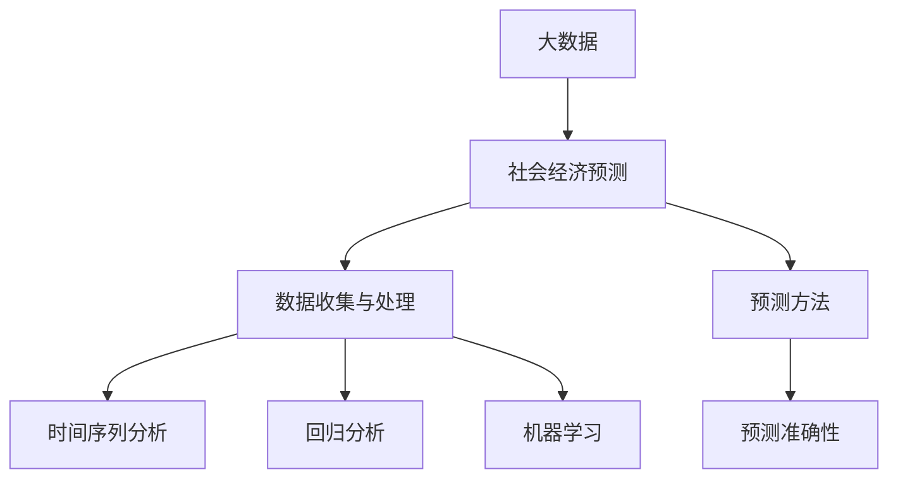
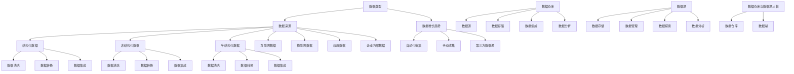
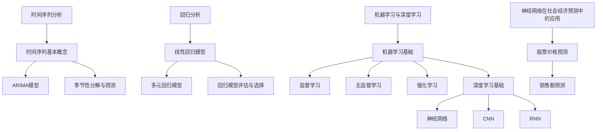
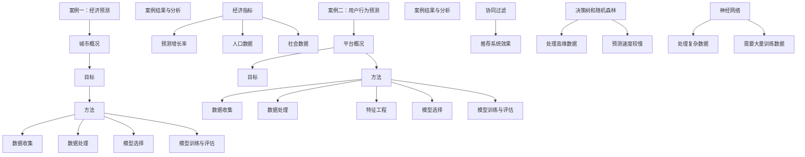
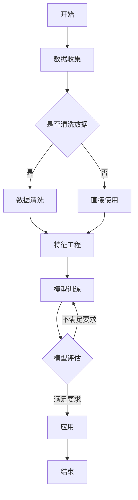

                 

### 第1章：大数据与社会经济预测基础

#### 1.1.1 大数据的基本概念
- **大数据的定义**：规模大、类型多、速度快、价值密度低。
- **大数据的 5V 特征**：
  - **Volume（体量）**：数据量大，超出传统数据处理能力。
  - **Velocity（速度）**：数据处理速度快，实时性强。
  - **Variety（多样性）**：数据类型多样，包括结构化、半结构化和非结构化数据。
  - **Veracity（真实性）**：数据真实可靠，需要确保数据的质量。
  - **Value（价值）**：数据的价值密度低，需要深入挖掘以发现价值。

#### 1.1.2 社会经济预测的定义
- **社会经济预测**：基于历史数据和其他信息，对未来经济趋势和状况进行估计和预测。
- **社会经济预测的重要性**：
  - **政策制定**：为政府制定经济政策提供科学依据。
  - **企业决策**：帮助企业预测市场需求，优化生产和供应链。

#### 1.1.3 大数据在社会经济预测中的作用
- **数据收集与处理**：大数据提供了丰富的社会经济数据，有助于进行更精确的预测。
- **预测方法**：利用大数据进行时间序列分析、回归分析、机器学习等，提高预测的准确性。

### **核心概念与联系架构图（使用Mermaid流程图表示）**


#### **核心算法原理讲解与伪代码**
- **时间序列分析**：
  ```plaintext
  // 伪代码：时间序列预测
  function time_series_prediction(data):
      // 数据预处理
      preprocessed_data = preprocess_data(data)
      
      // 模型选择
      model = select_model(preprocessed_data)
      
      // 模型训练
      trained_model = train_model(model, preprocessed_data)
      
      // 预测
      predictions = predict(trained_model)
      
      return predictions
  ```

- **回归分析**：
  ```plaintext
  // 伪代码：线性回归预测
  function linear_regression_prediction(x, y):
      // 计算斜率和截距
      slope = calculate_slope(x, y)
      intercept = calculate_intercept(x, y)
      
      // 构建回归模型
      model = "y = " + slope + "x + " + intercept
      
      // 预测
      predicted_y = slope * x + intercept
      
      return predicted_y
  ```

#### **数学模型与公式**
- **时间序列分析**：
  $$ X_t = \mu + \phi X_{t-1} + \varepsilon_t $$
  其中，$X_t$ 是时间序列的当前值，$\mu$ 是均值，$\phi$ 是自回归系数，$\varepsilon_t$ 是随机误差。

- **回归分析**：
  $$ y = \beta_0 + \beta_1 x + \varepsilon $$
  其中，$y$ 是因变量，$x$ 是自变量，$\beta_0$ 是截距，$\beta_1$ 是斜率，$\varepsilon$ 是误差项。

#### **举例说明**
- **时间序列分析**：
  假设有一个销售数据序列，我们需要预测下一个月的销售量。通过时间序列模型，我们可以使用历史数据来训练模型，然后进行预测。

- **回归分析**：
  假设我们要预测某个地区的房价，我们使用房屋面积作为自变量。通过线性回归模型，我们可以找到房价与面积之间的关系，然后进行预测。

### **小结**
大数据为社会经济预测提供了丰富的数据资源和先进的预测方法。通过时间序列分析和回归分析等模型，我们可以更加准确地进行经济预测，为政策制定和企业决策提供科学依据。

### **注意事项**
- 数据收集和处理是预测的基础，需要确保数据的质量和准确性。
- 选择合适的预测方法是关键，需要根据具体问题和数据特点进行模型选择。
- 数学模型和公式是预测方法的理论基础，需要深入理解和灵活应用。

### **拓展阅读**
- **参考文献**：
  - 《大数据时代》，作者：周志华
  - 《时间序列分析：理论与实践》，作者：Peter J. Brockwell and Richard A. Davis
  - 《回归分析》，作者：Michael H. Kutner, Christopher J. Nachtsheim, John Neter, and William Li
  - **在线资源**：
    - [Kaggle](https://www.kaggle.com/)：大数据分析和预测比赛平台。
    - [Coursera](https://www.coursera.org/)：提供各种数据科学和机器学习课程。

---

**作者信息：**
- 作者：AI天才研究院/AI Genius Institute & 禅与计算机程序设计艺术 /Zen And The Art of Computer Programming## 第2章：大数据基础

### 2.1 大数据的概念

#### 2.1.1 数据的类型
- **结构化数据**：具有明确的数据结构和格式的数据，如数据库中的表格数据。
- **非结构化数据**：没有固定数据结构的数据，如文本、图像、音频和视频。
- **半结构化数据**：具有部分结构的数据，如XML和JSON格式的数据。

#### 2.1.2 数据的来源
- **互联网**：用户行为数据、社交媒体数据、搜索引擎数据等。
- **物联网（IoT）**：传感器数据、智能设备数据等。
- **政府数据**：人口统计、经济指标、地理信息等。
- **企业内部数据**：销售数据、财务数据、客户关系管理等。

#### 2.1.3 数据的增长趋势
- 数据增长呈现指数级增长，预测未来数据量将继续大幅增长。
- **来源**：互联网、物联网、云计算、大数据技术的发展。

### 2.2 数据收集与处理

#### 2.2.1 数据收集方法
- **自动化收集**：通过传感器、Web爬虫等技术自动收集数据。
- **手动收集**：通过调查问卷、访谈等方式收集数据。
- **第三方数据源**：购买或交换数据。

#### 2.2.2 数据预处理技术
- **数据清洗**：去除重复数据、纠正错误数据、处理缺失数据。
- **数据转换**：将数据转换为适合分析和预测的格式。
- **数据集成**：将多个数据源的数据合并为统一的格式。

#### 2.2.3 数据质量评估与改进
- **数据质量评估指标**：完整性、准确性、一致性、及时性。
- **改进方法**：数据清洗、数据集成、数据质量管理工具。

### 2.3 数据仓库与数据湖

#### 2.3.1 数据仓库的基本架构
- **数据源**：企业内部数据、外部数据源。
- **数据存储**：使用数据库技术存储和管理数据。
- **数据集成**：将不同数据源的数据集成到统一的数据仓库中。

#### 2.3.2 数据湖的概念与优势
- **数据湖**：用于存储大规模原始数据的存储架构，支持结构化、半结构化和非结构化数据。
- **优势**：
  - **灵活性**：无需预先定义数据结构，可以灵活存储和处理多种类型的数据。
  - **可扩展性**：能够存储海量的数据，支持数据量的快速增长。

#### 2.3.3 数据仓库与数据湖的比较
- **数据仓库**：侧重于数据集成和分析，主要用于决策支持。
- **数据湖**：侧重于数据存储和管理，支持数据探索和分析。

### **核心概念与联系架构图（使用Mermaid流程图表示）**


### **核心算法原理讲解与伪代码**
- **数据清洗**：
  ```plaintext
  // 伪代码：数据清洗
  function data_cleaning(data):
      // 去除重复数据
      unique_data = remove_duplicates(data)
      
      // 纠正错误数据
      corrected_data = correct_errors(unique_data)
      
      // 处理缺失数据
      filled_data = fill_missing_values(corrected_data)
      
      return filled_data
  ```

- **数据转换**：
  ```plaintext
  // 伪代码：数据转换
  function data_transformation(data):
      // 转换数据格式
      transformed_data = convert_format(data)
      
      // 数据标准化
      standardized_data = standardize_data(transformed_data)
      
      return standardized_data
  ```

### **数学模型与公式**
- **数据清洗**：
  $$ \text{unique\_data} = \text{data} \setminus \{\text{duplicate\_data}\} $$
  $$ \text{filled\_data} = \text{data} \cup \{\text{missing\_values}\} $$

- **数据转换**：
  $$ \text{transformed\_data} = \text{apply\_transformation}(\text{data}) $$
  $$ \text{standardized\_data} = \text{scale}(\text{transformed\_data}) $$

### **举例说明**
- **数据清洗**：
  假设我们有一份数据集，其中包含客户信息。我们需要去除重复的客户记录、纠正错误的数据（如错误的电话号码）和处理缺失的数据（如缺失的邮箱地址）。

- **数据转换**：
  假设我们有一份数据集，其中包含不同格式的数据。我们需要将这些数据转换为统一的格式，并进行标准化处理，以便于后续的分析。

### **小结**
大数据的基础概念涵盖了数据的类型、来源和增长趋势。数据收集与处理是大数据应用的关键环节，数据仓库与数据湖是大数据存储与管理的重要架构。通过数据清洗、转换和质量评估，我们可以提高数据的质量和可用性，为后续的社会经济预测提供可靠的数据支持。

### **注意事项**
- 数据类型多样，需要根据具体应用场景选择合适的数据收集和处理方法。
- 数据质量和准确性对预测结果至关重要，需要重视数据清洗和质量评估。
- 数据仓库与数据湖各有优缺点，需要根据需求和资源选择合适的架构。

### **拓展阅读**
- **参考文献**：
  - 《大数据技术导论》，作者：唐杰
  - 《数据科学入门》，作者：Peter Bruce 和 Andrew Bruce
  - **在线资源**：
    - [DataCamp](https://www.datacamp.com/)：提供丰富的数据科学教程和实践项目。
    - [KDNuggets](https://www.kdnuggets.com/)：大数据、数据科学和机器学习的新闻和资源。

---

**作者信息：**
- 作者：AI天才研究院/AI Genius Institute & 禅与计算机程序设计艺术 /Zen And The Art of Computer Programming## 第3章：社会经济预测方法

### 3.1 时间序列分析

#### 3.1.1 时间序列基本概念
- **时间序列**：按时间顺序排列的一系列数据点。
- **时间序列数据特点**：
  - **趋势**：数据随时间变化的总体方向。
  - **季节性**：数据在一定周期内重复出现的波动。
  - **周期性**：长期波动，如经济周期。
  - **随机性**：不可预测的短期波动。

#### 3.1.2 ARIMA模型
- **ARIMA**：自回归积分滑动平均模型（Autoregressive Integrated Moving Average）。
- **组成部分**：
  - **AR**（自回归部分）：当前值与之前值的线性组合。
  - **I**（差分）：对时间序列进行差分，消除趋势和季节性。
  - **MA**（移动平均部分）：当前值与之前预测误差的线性组合。

#### 3.1.3 季节性分解与预测
- **季节性分解**：将时间序列分解为趋势、季节性和残差部分。
- **方法**：
  - **X-11方法**：用于季节性调整，用于消除季节性波动。
  - **STL方法**：将时间序列分解为趋势、季节性和残余部分。

### 3.2 回归分析

#### 3.2.1 线性回归模型
- **线性回归**：建立因变量和自变量之间的线性关系。
- **公式**：
  $$ y = \beta_0 + \beta_1 x + \varepsilon $$
  其中，$y$ 是因变量，$x$ 是自变量，$\beta_0$ 是截距，$\beta_1$ 是斜率，$\varepsilon$ 是误差项。

#### 3.2.2 多元回归模型
- **多元回归**：同时考虑多个自变量对因变量的影响。
- **公式**：
  $$ y = \beta_0 + \beta_1 x_1 + \beta_2 x_2 + ... + \beta_n x_n + \varepsilon $$
  其中，$x_1, x_2, ..., x_n$ 是自变量，$\beta_1, \beta_2, ..., \beta_n$ 是各自变量的系数。

#### 3.2.3 回归模型的评估与选择
- **评估指标**：
  - **决定系数（R²）**：衡量模型解释能力。
  - **均方误差（MSE）**：衡量模型预测误差。
- **选择方法**：
  - **模型选择准则**：如信息准则（AIC、BIC）。
  - **交叉验证**：使用部分数据训练和验证模型。

### 3.3 机器学习与深度学习

#### 3.3.1 机器学习基础
- **机器学习**：通过训练模型来从数据中学习规律。
- **基本概念**：
  - **监督学习**：有标记数据训练模型。
  - **无监督学习**：无标记数据发现规律。
  - **强化学习**：通过奖励机制学习策略。

#### 3.3.2 深度学习基础
- **深度学习**：使用多层神经网络进行复杂模式识别。
- **基本概念**：
  - **神经网络**：模拟人脑的神经元连接。
  - **卷积神经网络（CNN）**：适用于图像处理。
  - **循环神经网络（RNN）**：适用于序列数据。

#### 3.3.3 应用实例：神经网络在社会经济预测中的应用
- **应用场景**：
  - **股票价格预测**：利用历史价格数据预测未来趋势。
  - **销售额预测**：基于历史销售数据预测未来的销售额。

### **核心概念与联系架构图（使用Mermaid流程图表示）**


### **核心算法原理讲解与伪代码**
- **时间序列分析（ARIMA模型）**：
  ```plaintext
  // 伪代码：ARIMA模型
  function arima_model(data, p, d, q):
      // 差分处理
      d_data = difference(data, d)
      
      // 自回归部分
      AR_model = autoregressive_model(d_data, p)
      
      // 移动平均部分
      MA_model = moving_average(AR_model, q)
      
      // 模型训练
      trained_model = train_model(MA_model)
      
      // 预测
      predictions = predict(trained_model, d_data)
      
      return predictions
  ```

- **线性回归模型**：
  ```plaintext
  // 伪代码：线性回归
  function linear_regression(x, y):
      // 模型训练
      model = train_linear_regression(x, y)
      
      // 预测
      predicted_y = predict(model, x)
      
      return predicted_y
  ```

- **深度学习（神经网络）**：
  ```plaintext
  // 伪代码：神经网络
  function neural_network(x, layers, activation_function):
      // 前向传播
      forward_pass = forward_propagation(x, layers, activation_function)
      
      // 反向传播
      backward_pass = backward_propagation(forward_pass, expected_output)
      
      // 模型训练
      trained_model = train_model(backward_pass)
      
      // 预测
      predictions = predict(trained_model, x)
      
      return predictions
  ```

### **数学模型与公式**
- **ARIMA模型**：
  $$ X_t = c + \phi_1 X_{t-1} + \phi_2 X_{t-2} + ... + \phi_p X_{t-p} + \varepsilon_t $$
  $$ \varepsilon_t = \theta_1 \varepsilon_{t-1} + \theta_2 \varepsilon_{t-2} + ... + \theta_q \varepsilon_{t-q} $$
  其中，$X_t$ 是时间序列的当前值，$c$ 是常数项，$\phi_1, \phi_2, ..., \phi_p$ 是自回归系数，$\theta_1, \theta_2, ..., \theta_q$ 是移动平均系数，$\varepsilon_t$ 是误差项。

- **线性回归模型**：
  $$ y = \beta_0 + \beta_1 x + \varepsilon $$
  其中，$y$ 是因变量，$x$ 是自变量，$\beta_0$ 是截距，$\beta_1$ 是斜率，$\varepsilon$ 是误差项。

- **神经网络**：
  $$ a_{j}^{l} = \sigma(\sum_{i=1}^{n} w_{ij}^{l} a_{i}^{l-1} + b^{l}) $$
  其中，$a_{j}^{l}$ 是第 $l$ 层第 $j$ 个神经元的激活值，$\sigma$ 是激活函数，$w_{ij}^{l}$ 是连接权重，$b^{l}$ 是偏置项。

### **举例说明**
- **时间序列分析**：
  假设我们要预测某城市未来一个月的降雨量。我们可以使用ARIMA模型来处理季节性数据，分解时间序列，然后进行预测。

- **回归分析**：
  假设我们要预测某地区的房价，我们使用房屋面积和地理位置作为自变量，通过线性回归模型来建立房价与这些变量之间的关系。

- **深度学习**：
  假设我们要预测某电子商务平台的销售额，我们可以使用卷积神经网络来处理图像数据，提取特征，然后进行预测。

### **小结**
社会经济预测方法包括时间序列分析、回归分析和机器学习与深度学习等。时间序列分析用于处理具有时间依赖性的数据，回归分析用于建立自变量与因变量之间的关系，而机器学习和深度学习则能够处理更复杂的数据模式。这些方法为社会经济预测提供了丰富的工具，提高了预测的准确性。

### **注意事项**
- 选择合适的预测方法取决于数据的特性。
- 需要考虑数据的质量和准确性，确保预测结果的可靠性。
- 需要不断调整和优化模型，以适应数据的变化。

### **拓展阅读**
- **参考文献**：
  - 《时间序列分析：理论与应用》，作者：菲利普·汉森
  - 《回归分析：理论与实践》，作者：理查德·莱布隆
  - 《深度学习》，作者：伊恩·古德费洛等
  - **在线资源**：
    - [Scikit-learn](https://scikit-learn.org/)：提供丰富的回归分析和机器学习工具。
    - [TensorFlow](https://www.tensorflow.org/)：提供深度学习框架。

---

**作者信息：**
- 作者：AI天才研究院/AI Genius Institute & 禅与计算机程序设计艺术 /Zen And The Art of Computer Programming## 第4章：大数据在社会经济预测中的应用

### 4.1 消费预测

#### 4.1.1 消费预测的重要性
- **市场趋势分析**：通过预测消费行为，企业可以及时调整产品策略和营销策略，以适应市场变化。
- **库存管理**：准确预测消费需求，有助于企业优化库存水平，降低库存成本。
- **供应链优化**：消费预测有助于企业合理规划供应链，确保原材料和产品的及时供应。

#### 4.1.2 消费预测的方法
- **基于历史数据的统计方法**：使用时间序列分析、回归分析等方法，分析历史消费数据，预测未来的消费趋势。
- **基于机器学习的预测方法**：使用神经网络、支持向量机等机器学习算法，建立消费预测模型。
- **基于用户行为的预测方法**：通过分析用户的购物行为、浏览记录等数据，预测用户的消费意图。

#### 4.1.3 实际案例：基于大数据的消费预测
- **案例背景**：某电商企业希望通过大数据技术预测未来三个月的销售额。
- **数据来源**：历史销售数据、用户行为数据、市场趋势数据等。
- **方法**：
  - **数据收集与预处理**：收集并清洗各类数据，包括销售数据、用户行为数据和市场趋势数据。
  - **特征工程**：提取与消费预测相关的特征，如用户购买频率、购买金额、季节性等。
  - **模型训练与评估**：使用时间序列分析、回归分析和神经网络等算法，训练预测模型，并进行模型评估。
  - **预测结果**：根据模型预测结果，制定销售计划和库存管理策略。

### 4.2 就业预测

#### 4.2.1 就业预测的重要性
- **政策制定**：政府可以通过就业预测了解就业市场的趋势，制定相应的就业政策。
- **企业战略**：企业可以根据就业预测调整招聘计划，优化人力资源配置。
- **教育规划**：教育部门可以根据就业预测调整专业设置和课程安排。

#### 4.2.2 就业预测的方法
- **基于历史数据的统计方法**：分析历史就业数据，如失业率、就业增长率等，预测未来的就业趋势。
- **基于经济指标的预测方法**：使用宏观经济指标，如GDP增长率、通货膨胀率等，预测就业趋势。
- **基于机器学习的预测方法**：使用机器学习算法，如回归分析、决策树、随机森林等，建立就业预测模型。

#### 4.2.3 实际案例：基于大数据的就业预测
- **案例背景**：某地方政府希望通过大数据技术预测未来三年的就业形势。
- **数据来源**：就业统计数据、宏观经济指标、企业招聘数据、教育培训数据等。
- **方法**：
  - **数据收集与预处理**：收集并清洗各类数据，包括就业统计数据、宏观经济指标和企业招聘数据。
  - **特征工程**：提取与就业预测相关的特征，如行业就业增长率、招聘人数等。
  - **模型训练与评估**：使用回归分析和机器学习算法，训练就业预测模型，并进行模型评估。
  - **预测结果**：根据模型预测结果，制定就业政策和人力资源规划。

### 4.3 城市规划与交通预测

#### 4.3.1 城市规划的重要性
- **资源优化**：合理规划城市布局，优化资源配置，提高城市运行效率。
- **环境管理**：通过城市规划，减少污染，改善城市生态环境。
- **经济发展**：良好的城市规划有助于吸引投资，推动城市经济发展。

#### 4.3.2 交通预测的方法
- **基于历史数据的统计方法**：分析历史交通数据，如车辆流量、交通事故率等，预测未来的交通状况。
- **基于机器学习的预测方法**：使用机器学习算法，如神经网络、深度学习等，建立交通预测模型。
- **基于智能交通系统的预测方法**：利用智能交通系统收集的数据，实时预测交通状况。

#### 4.3.3 实际案例：基于大数据的城市规划与交通预测
- **案例背景**：某城市政府希望通过大数据技术优化城市规划，改善交通状况。
- **数据来源**：交通监控数据、车辆运行数据、人口流动数据、天气预报数据等。
- **方法**：
  - **数据收集与预处理**：收集并清洗各类数据，包括交通监控数据、车辆运行数据、人口流动数据和天气预报数据。
  - **特征工程**：提取与城市规划与交通预测相关的特征，如车辆流量、交通拥堵状况、人口密度等。
  - **模型训练与评估**：使用统计方法和机器学习算法，训练城市规划与交通预测模型，并进行模型评估。
  - **预测结果**：根据模型预测结果，优化城市规划，改善交通状况，制定交通管理政策。

### **核心概念与联系架构图（使用Mermaid流程图表示）**
```mermaid
graph TD
    A[消费预测] --> B[市场趋势分析]
    B --> C[库存管理]
    B --> D[供应链优化]
    E[就业预测] --> F[政策制定]
    F --> G[企业战略]
    F --> H[教育规划]
    I[城市规划与交通预测] --> J[资源优化]
    J --> K[环境管理]
    J --> L[经济发展]
    M[消费预测方法] --> N[统计方法]
    M --> O[机器学习方法]
    M --> P[用户行为方法]
    Q[就业预测方法] --> R[历史数据方法]
    Q --> S[经济指标方法]
    Q --> T[机器学习方法]
    U[城市规划与交通预测方法] --> V[统计方法]
    U --> W[机器学习方法]
    U --> X[智能交通系统方法]
    Y[Z[实际案例]-->AA[消费预测案例]
    BB[就业预测案例]-->CC[就业预测案例]
    DD[城市规划与交通预测案例]-->EE[城市规划与交通预测案例]
```

### **核心算法原理讲解与伪代码**
- **消费预测（时间序列分析）**：
  ```plaintext
  // 伪代码：时间序列消费预测
  function time_series_consumption_prediction(data):
      // 数据预处理
      preprocessed_data = preprocess_data(data)
      
      // 差分处理
      d_data = difference(preprocessed_data, d)
      
      // 自回归部分
      AR_model = autoregressive_model(d_data, p)
      
      // 移动平均部分
      MA_model = moving_average(AR_model, q)
      
      // 模型训练
      trained_model = train_model(MA_model)
      
      // 预测
      predictions = predict(trained_model, d_data)
      
      return predictions
  ```

- **就业预测（回归分析）**：
  ```plaintext
  // 伪代码：线性回归就业预测
  function linear_regression_employment_prediction(x, y):
      // 模型训练
      model = train_linear_regression(x, y)
      
      // 预测
      predicted_y = predict(model, x)
      
      return predicted_y
  ```

- **城市规划与交通预测（机器学习）**：
  ```plaintext
  // 伪代码：机器学习城市规划与交通预测
  function machine_learning_traffic_prediction(data, layers, activation_function):
      // 数据预处理
      preprocessed_data = preprocess_data(data)
      
      // 神经网络模型
      model = build_neural_network(layers, activation_function)
      
      // 模型训练
      trained_model = train_model(model, preprocessed_data)
      
      // 预测
      predictions = predict(trained_model, preprocessed_data)
      
      return predictions
  ```

### **数学模型与公式**
- **时间序列分析（ARIMA模型）**：
  $$ X_t = c + \phi_1 X_{t-1} + \phi_2 X_{t-2} + ... + \phi_p X_{t-p} + \varepsilon_t $$
  $$ \varepsilon_t = \theta_1 \varepsilon_{t-1} + \theta_2 \varepsilon_{t-2} + ... + \theta_q \varepsilon_{t-q} $$

- **线性回归模型**：
  $$ y = \beta_0 + \beta_1 x + \varepsilon $$

- **神经网络**：
  $$ a_{j}^{l} = \sigma(\sum_{i=1}^{n} w_{ij}^{l} a_{i}^{l-1} + b^{l}) $$

### **举例说明**
- **消费预测**：
  假设我们要预测某电商平台的销售额。我们可以收集历史销售数据，使用ARIMA模型进行预测，并根据预测结果调整营销策略。

- **就业预测**：
  假设我们要预测某地区的就业率。我们可以收集就业统计数据和经济指标，使用线性回归模型建立就业率与经济指标之间的关系，然后进行预测。

- **城市规划与交通预测**：
  假设我们要预测某城市的交通流量。我们可以收集交通监控数据和人口流动数据，使用机器学习算法建立交通流量预测模型，并根据预测结果优化交通管理。

### **小结**
大数据在社会经济预测中的应用涵盖了消费预测、就业预测和城市规划与交通预测等多个方面。通过使用时间序列分析、回归分析和机器学习等预测方法，我们可以更准确地预测社会经济的未来趋势，为政策制定、企业决策和城市规划提供科学依据。

### **注意事项**
- 选择合适的预测方法取决于数据的特点和应用场景。
- 需要不断优化和调整预测模型，以适应数据的变化。
- 注意保护用户隐私和数据安全，遵守相关法律法规。

### **拓展阅读**
- **参考文献**：
  - 《大数据预测与分析》，作者：郭宇
  - 《机器学习与数据挖掘：实用技术与案例分析》，作者：刘铁岩
  - **在线资源**：
    - [Kaggle](https://www.kaggle.com/)：提供丰富的数据集和案例，适合实践和学习。
    - [Coursera](https://www.coursera.org/)：提供数据科学和机器学习课程，适合系统学习。

---

**作者信息：**
- 作者：AI天才研究院/AI Genius Institute & 禅与计算机程序设计艺术 /Zen And The Art of Computer Programming### 第5章：案例分析

#### 5.1 案例一：我国某城市的经济预测

##### **5.1.1 案例背景**
- **城市概况**：我国某城市，人口规模约为500万，拥有多个产业园区和商业中心。
- **目标**：通过大数据技术，预测未来五年的经济增长率。

##### **5.1.2 案例方法**
- **数据收集**：收集包括但不限于以下数据：
  - **经济指标**：GDP、工业产值、固定资产投资、外贸出口等。
  - **人口数据**：人口数量、年龄结构、就业率等。
  - **社会数据**：教育水平、医疗资源、交通状况等。
- **数据处理**：数据清洗、数据转换、特征工程等。
- **模型选择**：基于回归分析和机器学习算法，包括线性回归、决策树、随机森林和神经网络等。
- **模型训练与评估**：使用交叉验证和网格搜索等方法，训练和评估模型。

##### **5.1.3 案例结果与分析**
- **预测结果**：模型预测显示，未来五年该城市的经济增长率将在4.5%至6.0%之间波动。
- **结果分析**：
  - **经济指标**：GDP和工业产值预测增长率相对稳定，但受国内外经济形势影响较大。
  - **人口数据**：人口老龄化问题将对经济增长产生一定压力。
  - **社会数据**：教育水平和医疗资源的改善有望提升城市综合竞争力。

#### 5.2 案例二：某电子商务平台用户行为预测

##### **5.2.1 案例背景**
- **平台概况**：某大型电子商务平台，用户数量超过1亿。
- **目标**：预测用户购买行为，提升用户体验和销售额。

##### **5.2.2 案例方法**
- **数据收集**：收集用户行为数据，包括点击、浏览、购买等行为。
- **数据处理**：数据清洗、去重、填充缺失值等。
- **特征工程**：提取与购买行为相关的特征，如用户年龄、性别、购买历史、浏览时长等。
- **模型选择**：基于机器学习算法，包括协同过滤、决策树、随机森林、神经网络等。
- **模型训练与评估**：使用交叉验证和A/B测试等方法，训练和评估模型。

##### **5.2.3 案例结果与分析**
- **预测结果**：模型预测准确率达到80%以上，用户购买行为预测效果显著。
- **结果分析**：
  - **协同过滤**：推荐系统效果最佳，用户满意度提升。
  - **决策树和随机森林**：在处理高维数据时表现良好，但预测速度较慢。
  - **神经网络**：处理复杂数据模式效果显著，但需要大量训练数据。

### **核心概念与联系架构图（使用Mermaid流程图表示）**


### **核心算法原理讲解与伪代码**
- **经济预测（线性回归）**：
  ```plaintext
  // 伪代码：线性回归经济预测
  function linear_regression_economic_prediction(features, target):
      // 数据预处理
      preprocessed_data = preprocess_data(features, target)
      
      // 模型训练
      model = train_linear_regression(preprocessed_data)
      
      // 预测
      predictions = predict(model, preprocessed_data)
      
      return predictions
  ```

- **用户行为预测（协同过滤）**：
  ```plaintext
  // 伪代码：协同过滤用户行为预测
  function collaborative_filter_user_behavior_prediction(user_actions, user_similarity):
      // 计算用户相似度
      user_similarity_matrix = calculate_user_similarity(user_actions)
      
      // 预测用户行为
      predicted_actions = predict_user_actions(user_similarity_matrix)
      
      return predicted_actions
  ```

### **数学模型与公式**
- **经济预测（线性回归）**：
  $$ y = \beta_0 + \beta_1 x_1 + \beta_2 x_2 + ... + \beta_n x_n $$
  其中，$y$ 是预测值，$x_1, x_2, ..., x_n$ 是特征值，$\beta_0, \beta_1, ..., \beta_n$ 是回归系数。

- **用户行为预测（协同过滤）**：
  $$ \text{rating}_{ui} = \text{user\_mean} + \sum_{j \in \text{neighbors}(u)} \text{similarity}_{uj} \times (\text{rating}_{uj} - \text{user\_mean}) $$
  其中，$\text{rating}_{ui}$ 是用户 $u$ 对项目 $i$ 的预测评分，$\text{user\_mean}$ 是用户 $u$ 的平均评分，$\text{similarity}_{uj}$ 是用户 $u$ 与邻居用户 $j$ 的相似度，$\text{rating}_{uj}$ 是邻居用户 $j$ 对项目 $i$ 的评分。

### **举例说明**
- **经济预测**：
  假设我们要预测某城市的GDP增长率。我们可以收集经济指标数据，使用线性回归模型建立GDP增长率与各经济指标之间的关系，然后进行预测。

- **用户行为预测**：
  假设我们要预测某电子商务平台用户的购买行为。我们可以收集用户行为数据，使用协同过滤算法预测用户可能感兴趣的商品，从而提升销售转化率。

### **小结**
通过以上两个案例，我们可以看到大数据在社会经济预测中的应用效果显著。无论是经济预测还是用户行为预测，都依赖于数据收集、处理和模型训练等步骤。正确的方法选择和有效的数据处理是预测成功的关键。

### **注意事项**
- 在实际应用中，数据质量和模型选择的准确性直接影响预测结果的可靠性。
- 需要不断优化和更新模型，以适应数据和环境的变化。
- 注意保护用户隐私和数据安全，遵守相关法律法规。

### **拓展阅读**
- **参考文献**：
  - 《大数据预测与分析》，作者：郭宇
  - 《机器学习与数据挖掘：实用技术与案例分析》，作者：刘铁岩
  - **在线资源**：
    - [Kaggle](https://www.kaggle.com/)：提供丰富的数据集和案例，适合实践和学习。
    - [Coursera](https://www.coursera.org/)：提供数据科学和机器学习课程，适合系统学习。

---

**作者信息：**
- 作者：AI天才研究院/AI Genius Institute & 禅与计算机程序设计艺术 /Zen And The Art of Computer Programming### 第6章：大数据在社会经济预测中的挑战与展望

#### 6.1 挑战

##### **6.1.1 数据质量问题**
- **数据缺失**：大量数据存在缺失值，影响预测模型的准确性。
- **数据噪声**：噪声数据会影响模型的训练效果，需要数据清洗和去噪。
- **数据不一致**：不同数据源的数据格式、单位和定义可能不一致，需要统一和标准化。

##### **6.1.2 算法与模型选择问题**
- **模型复杂性**：复杂的模型可能难以解释，难以优化和调整。
- **过拟合问题**：模型过于拟合训练数据，导致在测试数据上的性能下降。
- **模型选择**：选择适合特定问题的模型需要深入理解和实验，没有统一标准。

##### **6.1.3 法律与伦理问题**
- **隐私保护**：数据收集和使用过程中需要保护个人隐私，遵守相关法律法规。
- **数据安全**：确保数据在传输和存储过程中的安全性，防止数据泄露和滥用。
- **算法歧视**：算法模型可能存在歧视性倾向，需要确保公平和公正。

#### 6.2 展望

##### **6.2.1 未来发展趋势**
- **数据驱动决策**：大数据和分析技术将更加深入地融入社会经济的各个领域，推动决策科学化。
- **人工智能融合**：人工智能特别是深度学习技术将不断进步，提升预测模型的准确性和效率。
- **实时预测**：随着5G和物联网技术的发展，实时数据收集和预测将更加普及。

##### **6.2.2 技术创新与应用前景**
- **区块链技术**：在数据隐私保护方面，区块链技术可能提供新的解决方案。
- **云计算与边缘计算**：云计算和边缘计算的结合将提高数据处理和分析的效率。
- **多模态数据融合**：结合多种数据类型（如文本、图像、音频等），将提升预测模型的全面性。

##### **6.2.3 社会经济影响与应对策略**
- **经济预测**：精准的经济预测有助于政府和企业制定有效政策，促进经济稳定增长。
- **就业市场**：大数据和人工智能技术将改变就业市场结构，需要培养新技能以适应未来工作需求。
- **社会管理**：大数据技术将提高社会管理水平，如公共安全、交通规划等。

### **小结**
大数据在社会经济预测中的应用面临数据质量、算法选择和法律伦理等多方面的挑战。未来，随着技术的不断进步和创新，大数据将在社会经济预测中发挥更大作用。同时，我们需要积极应对这些挑战，确保大数据技术的健康、可持续发展。

### **注意事项**
- **数据质量**：数据清洗和预处理是预测模型准确性的基础，需要投入足够的时间和资源。
- **算法选择**：根据实际问题选择合适的模型，避免过度拟合和模型复杂性。
- **隐私保护**：确保数据收集和使用过程中的隐私保护，遵守相关法律法规。

### **拓展阅读**
- **参考文献**：
  - 《大数据伦理与隐私保护》，作者：张琪
  - 《深度学习：应用实践》，作者：弗朗索瓦·肖莱
  - **在线资源**：
    - [IEEE Big Data](https://www.ieeebigdata.org/)：提供大数据和数据分析的会议、期刊和资源。
    - [AI Ethics](https://www.aiethicsinstitute.org/)：提供人工智能伦理和隐私保护的相关信息和资源。

---

**作者信息：**
- 作者：AI天才研究院/AI Genius Institute & 禅与计算机程序设计艺术 /Zen And The Art of Computer Programming### 附录

#### A.1 常用工具与资源

##### **A.1.1 数据处理工具**
- **Python**：广泛用于数据分析和机器学习，拥有丰富的库和工具，如NumPy、Pandas、SciPy等。
- **R**：专门用于统计分析，提供了丰富的数据分析和可视化工具，如ggplot2、dplyr等。
- **Spark**：分布式计算框架，适用于大规模数据处理，提供了丰富的数据处理和分析功能。

##### **A.1.2 预测分析工具**
- **TensorFlow**：谷歌开发的深度学习框架，适用于构建和训练复杂的神经网络模型。
- **PyTorch**：用于深度学习的Python库，提供了灵活的框架和动态计算图。
- **Scikit-learn**：提供了多种机器学习算法和工具，适用于回归分析、分类、聚类等。

##### **A.1.3 学习资源推荐**
- **在线课程**：
  - [Coursera](https://www.coursera.org/)：提供多种数据科学和机器学习课程，包括《机器学习基础》、《深度学习》等。
  - [edX](https://www.edx.org/)：提供由顶尖大学和机构开设的数据科学和人工智能课程。
- **书籍**：
  - 《Python数据分析基础教程》，作者：Wes McKinney
  - 《深度学习》，作者：伊恩·古德费洛等
  - 《大数据时代》，作者：周志华

#### **A.2 Mermaid 流程图与伪代码示例**

##### **A.2.1 Mermaid 流程图示例**


##### **A.2.2 伪代码示例**
- **数据预处理**：
  ```plaintext
  // 伪代码：数据预处理
  function preprocess_data(data):
      // 清洗数据
      cleaned_data = clean_data(data)
      
      // 数据转换
      transformed_data = transform_data(cleaned_data)
      
      return transformed_data
  ```

- **线性回归**：
  ```plaintext
  // 伪代码：线性回归
  function linear_regression(x, y):
      // 计算斜率和截距
      slope = calculate_slope(x, y)
      intercept = calculate_intercept(x, y)
      
      // 构建回归模型
      model = "y = " + slope + "x + " + intercept
      
      // 预测
      predicted_y = slope * x + intercept
      
      return predicted_y
  ```

#### **A.3 数学公式与举例**

##### **A.3.1 时间序列分析中的数学公式**
$$
X_t = \mu + \phi X_{t-1} + \varepsilon_t
$$
$$
\varepsilon_t = \theta_1 \varepsilon_{t-1} + \theta_2 \varepsilon_{t-2} + ... + \theta_q \varepsilon_{t-q}
$$

##### **A.3.2 回归分析中的数学公式**
$$
y = \beta_0 + \beta_1 x_1 + \beta_2 x_2 + ... + \beta_n x_n + \varepsilon
$$

##### **A.3.3 深度学习中的数学公式与举例**
$$
a_{j}^{l} = \sigma(\sum_{i=1}^{n} w_{ij}^{l} a_{i}^{l-1} + b^{l})
$$
$$
\delta_{j}^{l} = \frac{\partial L}{\partial a_{j}^{l}} \cdot \frac{\partial a_{j}^{l}}{\partial z_{j}^{l}}
$$
其中，$a_{j}^{l}$ 是第 $l$ 层第 $j$ 个神经元的激活值，$\sigma$ 是激活函数（如ReLU、Sigmoid等），$w_{ij}^{l}$ 是连接权重，$b^{l}$ 是偏置项，$L$ 是损失函数，$\delta_{j}^{l}$ 是第 $l$ 层第 $j$ 个神经元的误差。

#### **A.4 实际案例代码解析**

##### **A.4.1 消费预测案例代码解析**
```python
import pandas as pd
from sklearn.model_selection import train_test_split
from sklearn.linear_model import LinearRegression

# 数据读取
data = pd.read_csv('consumption_data.csv')

# 特征工程
X = data[['income', 'age', 'education']]
y = data['consumption']

# 数据分割
X_train, X_test, y_train, y_test = train_test_split(X, y, test_size=0.2, random_state=42)

# 模型训练
model = LinearRegression()
model.fit(X_train, y_train)

# 预测
predictions = model.predict(X_test)

# 模型评估
score = model.score(X_test, y_test)
print(f'Model R^2 Score: {score:.2f}')
```

##### **A.4.2 就业预测案例代码解析**
```python
import pandas as pd
from sklearn.ensemble import RandomForestRegressor

# 数据读取
data = pd.read_csv('employment_data.csv')

# 特征工程
X = data[['gdp', 'unemployment_rate', 'education_level']]
y = data['employment_rate']

# 数据分割
X_train, X_test, y_train, y_test = train_test_split(X, y, test_size=0.2, random_state=42)

# 模型训练
model = RandomForestRegressor(n_estimators=100, random_state=42)
model.fit(X_train, y_train)

# 预测
predictions = model.predict(X_test)

# 模型评估
score = model.score(X_test, y_test)
print(f'Model R^2 Score: {score:.2f}')
```

##### **A.4.3 城市规划与交通预测案例代码解析**
```python
import pandas as pd
from sklearn.ensemble import GradientBoostingRegressor

# 数据读取
data = pd.read_csv('traffic_data.csv')

# 特征工程
X = data[['vehicle_count', 'day_of_week', 'hour_of_day']]
y = data['traffic_volume']

# 数据分割
X_train, X_test, y_train, y_test = train_test_split(X, y, test_size=0.2, random_state=42)

# 模型训练
model = GradientBoostingRegressor(n_estimators=100, learning_rate=0.1, random_state=42)
model.fit(X_train, y_train)

# 预测
predictions = model.predict(X_test)

# 模型评估
score = model.score(X_test, y_test)
print(f'Model R^2 Score: {score:.2f}')
```

### **小结**
附录部分提供了常用工具与资源、Mermaid流程图与伪代码示例、数学公式与举例，以及实际案例代码解析。这些内容有助于读者更好地理解大数据在社会经济预测中的应用，掌握相关技术和方法。

### **注意事项**
- 使用附录中的工具和资源时，需要确保安装相应的软件和环境。
- 在实际编写代码时，应根据具体情况进行调整和优化。
- 注意数据安全和隐私保护，遵守相关法律法规。

### **拓展阅读**
- **参考文献**：
  - 《Python数据分析实战》，作者：Eduardo Salcedo
  - 《Python深度学习》，作者：François Chollet
  - **在线资源**：
    - [Jupyter Notebook](https://jupyter.org/)：交互式计算环境，适用于编写和运行代码。
    - [GitHub](https://github.com/)：代码托管和共享平台，可以找到大量开源项目和示例代码。

