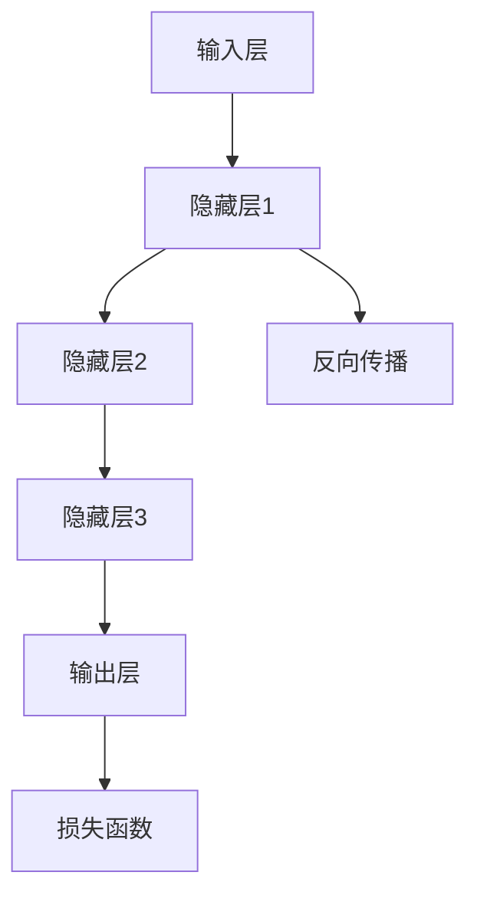
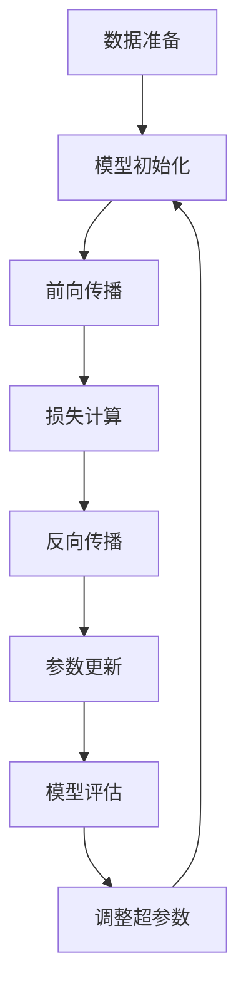
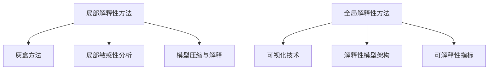
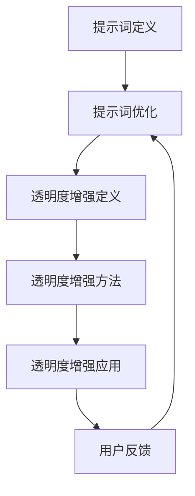

                 

### 文章标题

# 大模型可解释决策与提示词透明度增强

### 关键词

- 大模型
- 可解释性
- 决策
- 提示词
- 透明度增强
- 算法优化

### 摘要

随着人工智能技术的快速发展，大模型在各个领域取得了显著的成果，但同时也带来了可解释性和透明度方面的挑战。本文旨在深入探讨大模型的可解释决策和提示词透明度增强问题。首先，从大模型的崛起与挑战、可解释性的重要性、大模型原理等方面介绍大模型可解释性的基础。接着，详细讲解大模型可解释性技术，包括局部可解释性方法和全球可解释性方法。然后，分析提示词在模型中的作用及其对模型性能的影响，并探讨提示词透明度增强技术。最后，通过实践案例展示大模型可解释性和透明度增强的实际应用，并展望未来发展方向。

## 目录大纲

### 第一部分：大模型可解释性基础

#### 第1章：大模型可解释性概述

1.1 大模型的崛起与挑战

1.2 可解释性的重要性

1.3 大模型可解释性的发展阶段

1.4 本书结构

#### 第2章：大模型原理

2.1 大模型的架构

2.1.1 神经网络基础

2.1.2 循环神经网络（RNN）

2.1.3 递归神经网络（RNN）的变体

2.2 大模型的训练与优化

2.2.1 大模型的训练流程

2.2.2 大模型的优化算法

2.2.3 大模型的调参技巧

#### 第3章：大模型可解释性技术

3.1 局部可解释性方法

3.1.1 灰盒方法

3.1.2 局部敏感性分析

3.1.3 模型压缩与解释

3.2 全球可解释性方法

3.2.1 可视化技术

3.2.2 解释性模型架构

3.2.3 可解释性指标

### 第二部分：提示词透明度增强

#### 第4章：提示词在模型中的作用

4.1 提示词的定义与分类

4.2 提示词对模型性能的影响

4.3 提示词优化的方法

#### 第5章：提示词透明度增强技术

5.1 透明度增强的定义与意义

5.2 透明度增强的方法与挑战

5.3 透明度增强的实际应用

### 第三部分：实践与未来

#### 第6章：大模型可解释性与透明度增强实践

6.1 实践案例介绍

6.2 实践中遇到的问题与解决方法

#### 第7章：大模型可解释性与透明度增强的未来

7.1 当前研究热点

7.2 未来发展方向

#### 第8章：大模型可解释性与透明度增强的工具与资源

8.1 主流工具与框架

8.2 开源资源与数据集

## 引言

随着人工智能（AI）技术的飞速发展，大模型（Large Models）在自然语言处理（NLP）、计算机视觉（CV）、推荐系统等众多领域取得了突破性的成果。然而，这些强大模型往往因为其复杂性和非透明性，面临着可解释性（Explainability）和透明度（Transparency）方面的挑战。可解释性是指模型决策过程的可理解性，透明度则涉及到模型输入和输出的可追溯性。这两个问题在大模型中尤为重要，因为用户、监管机构和开发者需要能够理解模型的决策过程，以确保其公正性、可靠性和安全性。

大模型可解释决策与提示词透明度增强的研究旨在解决以下关键问题：

1. **模型决策过程的理解**：如何使大模型的决策过程更加透明和可理解，从而提高用户对模型的信任度。
2. **提示词优化**：提示词在大模型中起着至关重要的作用，如何优化提示词以提高模型的性能和可解释性。
3. **透明度增强**：如何提高大模型输入和输出的透明度，使得模型的决策过程更加清晰。

本文将从以下几个方面进行探讨：

1. **大模型可解释性概述**：介绍大模型的崛起与挑战、可解释性的重要性以及大模型可解释性的发展阶段。
2. **大模型原理**：详细讲解大模型的架构、训练与优化过程。
3. **大模型可解释性技术**：介绍局部可解释性方法和全球可解释性方法。
4. **提示词透明度增强**：分析提示词在模型中的作用、优化方法以及透明度增强技术。
5. **实践与未来**：通过实践案例展示大模型可解释性和透明度增强的实际应用，并探讨未来的发展方向。

本文旨在为研究人员和开发者提供一个全面、深入且实用的指南，帮助他们更好地理解和应用大模型的可解释决策与提示词透明度增强技术。

## 第一部分：大模型可解释性基础

### 第1章：大模型可解释性概述

#### 1.1 大模型的崛起与挑战

大模型，即拥有巨大参数量和强大计算能力的人工神经网络模型，近年来在人工智能领域取得了令人瞩目的成就。从早期的深度学习模型，如AlexNet和VGGNet，到近年来横空出世的GPT-3、BERT和Vision Transformer（ViT），这些大模型在图像识别、自然语言处理、语音识别等领域都展现出了卓越的性能。

大模型的崛起得益于几个关键因素：

1. **计算能力的提升**：随着云计算和专用硬件（如GPU、TPU）的普及，大规模数据处理和模型训练变得更加可行。
2. **数据量的增长**：互联网的普及和数据的爆炸性增长为大规模训练提供了丰富的数据资源。
3. **优化算法的进步**：如Adam优化器和梯度裁剪技术，使得大模型的训练过程更加高效和稳定。

然而，大模型的崛起也带来了诸多挑战，其中最突出的就是可解释性（Explainability）问题。可解释性是指模型决策过程的透明性和可理解性，这对于提高用户信任、确保模型公平性、安全性和合规性至关重要。

首先，大模型的复杂性和非线性特性使得其决策过程难以直观理解。模型的决策往往依赖于深层网络中的复杂函数，这使得普通用户难以跟踪和解释模型的决策逻辑。其次，大模型的高度参数化导致其容易受到小样本偏差和过拟合的影响，这使得模型的泛化能力受到质疑。最后，大模型通常依赖于大量的数据和训练时间，这使得其训练和部署成本高昂，难以在资源有限的环境中应用。

面对这些挑战，研究人员和开发者必须探索有效的可解释性技术，以增强大模型的透明度和可理解性。这不仅有助于提升用户对人工智能系统的信任度，还可以促进人工智能技术的进一步发展和应用。

#### 1.2 可解释性的重要性

可解释性在人工智能（AI）系统中扮演着至关重要的角色。它不仅关乎技术的透明度和信任度，还涉及到伦理、安全和合规性等多个方面。

首先，从用户信任的角度来看，可解释性有助于提升用户对AI系统的接受度和信任度。当用户能够理解系统的决策过程和结果时，他们更可能接受和依赖这些系统。例如，在医疗诊断中，医生需要理解AI系统的诊断结果，以便与自身的医疗知识和经验相结合，从而做出更准确的诊断。同样，在金融风险评估中，投资者需要理解AI系统如何评估风险，以便做出明智的投资决策。

其次，可解释性对于确保AI系统的公平性和公正性至关重要。在现代社会中，AI系统广泛应用于招聘、信用评分、犯罪预测等领域。如果这些系统存在偏见或歧视，可能会导致不公平的决策。通过可解释性技术，开发者和研究人员可以识别和纠正这些偏见，从而提高系统的公正性。例如，在招聘过程中，AI系统需要透明地展示其对候选人的评分依据，以避免性别、种族等偏见。

此外，可解释性还涉及到AI系统的安全和合规性。许多国家和组织已经制定了关于AI系统合规性的法律法规，要求系统必须具备一定的透明度和可解释性。例如，欧盟的《通用数据保护条例》（GDPR）和美国的《加州消费者隐私法案》（CCPA）都明确要求企业确保数据的透明性和可解释性。通过可解释性技术，AI系统可以更好地满足这些合规性要求，从而降低法律风险。

最后，可解释性有助于促进AI技术的发展和进步。当研究人员能够深入理解AI系统的决策过程时，他们可以更好地发现和解决模型中的问题，从而改进和优化模型。例如，通过分析大模型的内部机制，研究人员可以发现哪些特征对模型的决策影响最大，从而优化模型的架构和参数。

总之，可解释性不仅提升了AI系统的透明度和信任度，还确保了其公平性、安全性和合规性，对AI技术的长远发展具有重要意义。

#### 1.3 大模型可解释性的发展阶段

大模型的可解释性研究经历了多个阶段，从最初的简单可视化技术，到当前的复杂方法，不断演进。以下是几个主要的发展阶段：

**第一阶段：可视化技术**

在早期阶段，研究人员主要依靠可视化技术来理解模型的决策过程。这些技术包括将模型的可视化结果绘制为图像，或者通过热力图显示模型在输入空间中的敏感区域。这些方法虽然直观，但往往只能提供局部信息，难以全面理解模型的决策逻辑。

**第二阶段：局部解释方法**

随着深度学习的普及，局部解释方法逐渐成为研究热点。这些方法通过分析模型在特定输入下的响应，来解释模型的决策过程。代表性的方法包括LIME（Local Interpretable Model-agnostic Explanations）和SHAP（SHapley Additive exPlanations）。LIME通过在输入数据附近创建一个线性模型来解释复杂模型的决策，而SHAP则利用博弈论中的Shapley值来分配模型特征对预测的贡献。这些方法提供了一种更细致的解释方式，但仍存在局限性，如解释结果的泛化能力有限。

**第三阶段：全局解释方法**

局部解释方法虽然提供了详细的局部信息，但缺乏全局视角。为了克服这一限制，全局解释方法应运而生。这些方法试图从整体上解释模型的决策过程，提供全局的解释框架。代表性的方法包括模型压缩与解释、解释性模型架构和可视化技术。模型压缩与解释通过减少模型的复杂性来提高其可解释性，解释性模型架构则通过设计具有解释性的模型结构来实现，而可视化技术则通过更直观的方式展示模型的内部机制。

**第四阶段：增强透明度方法**

在当前的阶段，研究人员致力于开发透明度增强方法，以提高大模型的透明度和可理解性。这些方法不仅关注模型的内部解释，还关注输入和输出的透明度。代表性的方法包括提示词透明度增强和解释性接口设计。提示词透明度增强通过优化提示词来提高模型的透明度，而解释性接口设计则通过设计友好的用户界面，使得用户能够更容易地理解模型的决策过程。

**发展趋势与挑战**

随着大模型技术的不断发展，可解释性研究也面临着新的挑战。一方面，随着模型规模的增大，解释方法需要更加高效和精确；另一方面，如何将可解释性与模型的性能、效率和泛化能力相结合，也是一个重要的研究方向。此外，不同领域的应用对可解释性提出了不同的要求，需要开发出更具针对性的解释方法。

总之，大模型可解释性研究正从局部解释向全局解释、从简单方法向复杂方法、从模型内部解释向透明度增强的方向不断发展。未来，随着技术的进步和研究的深入，可解释性将逐渐成为大模型应用中不可或缺的一部分。

#### 1.4 本书结构

本书旨在深入探讨大模型可解释决策与提示词透明度增强的技术，旨在为研究人员和开发者提供一个系统、全面且实用的指南。以下是本书的结构安排：

**第一部分：大模型可解释性基础**
- 第1章：大模型可解释性概述
  - 大模型的崛起与挑战
  - 可解释性的重要性
  - 大模型可解释性的发展阶段
- 第2章：大模型原理
  - 大模型的架构
  - 大模型的训练与优化
- 第3章：大模型可解释性技术
  - 局部可解释性方法
  - 全球可解释性方法

**第二部分：提示词透明度增强**
- 第4章：提示词在模型中的作用
  - 提示词的定义与分类
  - 提示词对模型性能的影响
  - 提示词优化的方法
- 第5章：提示词透明度增强技术
  - 透明度增强的定义与意义
  - 透明度增强的方法与挑战
  - 透明度增强的实际应用

**第三部分：实践与未来**
- 第6章：大模型可解释性与透明度增强实践
  - 实践案例介绍
  - 实践中遇到的问题与解决方法
- 第7章：大模型可解释性与透明度增强的未来
  - 当前研究热点
  - 未来发展方向
- 第8章：大模型可解释性与透明度增强的工具与资源
  - 主流工具与框架
  - 开源资源与数据集

通过以上结构安排，本书将逐步引导读者从基础理论到实际应用，全面了解大模型可解释决策与提示词透明度增强的关键技术和方法。读者可以根据自己的需求，选择性地阅读相关章节，以快速掌握重点内容。希望本书能为人工智能领域的实践者和研究者提供有价值的参考和指导。

## 第二部分：大模型原理

### 第2章：大模型原理

大模型的原理是理解其复杂性和性能的基础。本章将详细探讨大模型的架构、训练与优化过程，帮助读者深入理解这些技术背后的逻辑和机制。

#### 2.1 大模型的架构

大模型通常由多个层次的结构组成，包括输入层、隐藏层和输出层。以下将介绍大模型的基本架构和常用的网络结构。

**2.1.1 神经网络基础**

神经网络（Neural Networks）是构建大模型的基础，其灵感来源于人脑的神经元结构。神经网络由大量相互连接的神经元（或节点）组成，每个神经元接受来自其他神经元的输入信号，通过激活函数产生输出。

- **神经元结构**：一个简单的神经元包含一个输入层、一个权重矩阵（W）和一个偏置项（b）。输入层接收外部输入，通过加权求和后加上偏置项，再通过激活函数（如ReLU、Sigmoid或Tanh）产生输出。
  
  $$ output = \text{激活函数} (W \cdot input + b) $$

- **反向传播**：神经网络通过反向传播算法进行训练，该算法是一种基于梯度下降的优化方法。在反向传播过程中，模型会计算每个神经元的误差，并更新权重和偏置项，以最小化误差。

**2.1.2 循环神经网络（RNN）**

循环神经网络（RNN）是一种能够处理序列数据的神经网络，其特点是在网络中引入了时间维度。RNN通过循环连接，使得当前时刻的输出能够影响后续时刻的输入，从而实现序列记忆。

- **基本结构**：RNN由输入层、隐藏层和输出层组成。隐藏层包含一个序列，每个时间步的隐藏状态都会影响后续的隐藏状态。

  $$ h_t = \text{激活函数} (W_h \cdot [h_{t-1}, x_t] + b_h) $$
  
  其中，$h_t$ 表示第 $t$ 个时间步的隐藏状态，$W_h$ 是隐藏层权重，$x_t$ 是第 $t$ 个输入。

- **挑战**：尽管RNN能够处理序列数据，但其存在梯度消失和梯度爆炸问题，导致训练效果不佳。为了解决这些问题，研究人员提出了多种改进版本的RNN，如长短期记忆网络（LSTM）和门控循环单元（GRU）。

**2.1.3 递归神经网络（RNN）的变体**

递归神经网络（RNN）的变体通过改进其内部结构，克服了传统RNN的缺点，提高了序列模型的性能。

- **LSTM（长短期记忆网络）**：LSTM通过引入记忆单元和三个门控机制（遗忘门、输入门和输出门），能够有效解决梯度消失和梯度爆炸问题，从而更好地处理长序列数据。

  $$ 
  f_t = \text{sigmoid}(W_f \cdot [h_{t-1}, x_t] + b_f) \\
  i_t = \text{sigmoid}(W_i \cdot [h_{t-1}, x_t] + b_i) \\
  \tilde{C}_t = \text{tanh}(W_c \cdot [h_{t-1}, x_t] + b_c) \\
  C_t = f_t \odot C_{t-1} + i_t \odot \tilde{C}_t \\
  o_t = \text{sigmoid}(W_o \cdot [h_{t-1}, x_t] + b_o) \\
  h_t = o_t \odot \text{tanh}(C_t)
  $$

  其中，$f_t$、$i_t$、$o_t$ 分别表示遗忘门、输入门和输出门的激活值，$C_t$ 和 $h_t$ 分别表示第 $t$ 个时间步的记忆单元和隐藏状态。

- **GRU（门控循环单元）**：GRU通过合并遗忘门和输入门，简化了LSTM的结构，提高了计算效率。

  $$ 
  z_t = \text{sigmoid}(W_z \cdot [h_{t-1}, x_t] + b_z) \\
  r_t = \text{sigmoid}(W_r \cdot [h_{t-1}, x_t] + b_r) \\
  \tilde{h}_t = \text{tanh}(W \cdot [r_t \odot h_{t-1}, x_t] + b) \\
  h_t = (1 - z_t) \odot h_{t-1} + z_t \odot \tilde{h}_t
  $$

  其中，$z_t$ 和 $r_t$ 分别表示更新门和重置门的激活值，$h_t$ 和 $\tilde{h}_t$ 分别表示当前隐藏状态和候选隐藏状态。

#### 2.2 大模型的训练与优化

大模型的训练与优化是使其在特定任务上达到最佳性能的关键步骤。以下将介绍大模型训练的基本流程、优化算法和调参技巧。

**2.2.1 大模型的训练流程**

大模型的训练流程包括以下几个主要步骤：

1. **数据准备**：收集和清洗训练数据，将数据分为训练集、验证集和测试集，以评估模型的性能。
2. **模型初始化**：初始化模型参数，常用的初始化方法包括高斯分布初始化、均匀分布初始化和Xavier初始化等。
3. **前向传播**：将输入数据通过模型的前向传播过程，计算模型的输出和损失函数。
4. **反向传播**：利用反向传播算法，计算损失函数关于模型参数的梯度。
5. **参数更新**：使用优化算法，如梯度下降、Adam等，更新模型参数，以最小化损失函数。
6. **评估与调整**：通过验证集和测试集评估模型性能，根据评估结果调整模型结构或超参数。

**2.2.2 大模型的优化算法**

大模型的优化算法旨在通过梯度下降法优化模型参数，使其在训练数据上达到最佳性能。以下介绍几种常用的优化算法：

1. **梯度下降（Gradient Descent）**：最简单的优化算法，通过计算损失函数关于模型参数的梯度，更新模型参数。
   $$ \theta = \theta - \alpha \cdot \nabla_{\theta} J(\theta) $$
   其中，$\theta$ 表示模型参数，$\alpha$ 表示学习率，$J(\theta)$ 表示损失函数。

2. **Adam优化器**：结合了动量（Momentum）和自适应学习率（Adaptive Learning Rate）的优点，适用于大规模训练。
   $$ 
   m_t = \beta_1 m_{t-1} + (1 - \beta_1) \cdot \nabla_{\theta} J(\theta) \\
   v_t = \beta_2 v_{t-1} + (1 - \beta_2) \cdot (\nabla_{\theta} J(\theta))^2 \\
   \theta = \theta - \alpha \cdot \frac{m_t}{\sqrt{v_t} + \epsilon} 
   $$
   其中，$m_t$ 和 $v_t$ 分别表示一阶和二阶矩估计，$\beta_1$ 和 $\beta_2$ 分别表示一阶和二阶矩的衰减率，$\epsilon$ 是一个较小的常数。

3. **SGD（随机梯度下降）**：与梯度下降类似，但每次更新参数时使用的是当前批次数据的梯度，而不是整个训练集的梯度，适用于小批量训练。

**2.2.3 大模型的调参技巧**

大模型的调参技巧对于模型的性能至关重要。以下是一些常用的调参技巧：

1. **学习率调整**：选择合适的学习率对于模型的训练效果至关重要。常用的方法包括固定学习率、学习率衰减和自适应学习率（如Adam）。
2. **批次大小**：选择合适的批次大小可以影响模型的收敛速度和稳定性。小批量训练通常有助于模型在训练过程中更好地拟合数据，但需要更多时间。
3. **正则化**：正则化方法（如L1正则化、L2正则化）可以防止模型过拟合，提高模型的泛化能力。
4. **数据增强**：通过数据增强（如旋转、缩放、裁剪等）可以增加训练数据的多样性，有助于模型更好地泛化。
5. **模型结构调整**：通过调整模型的结构（如层数、神经元数量等），可以影响模型的复杂度和计算资源需求。

通过合理选择和调整这些超参数，可以显著提高大模型的性能和泛化能力。

### 小结

大模型的原理涉及到神经网络基础、循环神经网络（RNN）及其变体（如LSTM和GRU），以及大模型的训练与优化过程。理解这些基础理论和实践技巧，对于深入探索大模型的可解释性和透明度具有重要意义。在接下来的章节中，我们将进一步探讨大模型的可解释性技术，以解决其复杂性和非透明性带来的挑战。

## 第三部分：大模型可解释性技术

### 第3章：大模型可解释性技术

大模型由于其高度复杂性和非线性特性，其决策过程往往难以直观理解。为了解决这一问题，研究人员提出了多种可解释性技术，这些技术可以分为局部可解释性方法和全球可解释性方法。局部可解释性方法主要关注模型在特定输入下的决策过程，而全球可解释性方法则试图从整体上揭示模型的内部机制。

#### 3.1 局部可解释性方法

局部可解释性方法试图在特定输入下分析模型的行为，以提供对模型决策过程的局部理解。以下是一些代表性的局部可解释性方法。

**3.1.1 灰盒方法**

灰盒方法是一种将复杂模型视为部分透明的黑盒模型的方法。通过分析模型内部的某些特性，灰盒方法试图揭示模型的行为和决策过程。常见的灰盒方法包括：

- **线性化**：将复杂模型在某个输入附近线性化，从而得到一个近似的线性模型。这种方法有助于理解模型在特定区域的行为，但可能无法全面反映模型的复杂性。
  
  $$ f(x) \approx \phi(W \cdot x) $$
  
  其中，$f(x)$ 表示复杂模型的输出，$\phi$ 表示激活函数，$W$ 是线性模型的权重。

- **注意力机制分析**：在具有注意力机制的模型中，通过分析注意力权重来理解模型对输入的不同部分的关注程度。这种方法有助于揭示模型在决策过程中所依赖的关键特征。

**3.1.2 局部敏感性分析**

局部敏感性分析（Local Sensitivity Analysis）旨在分析模型输出对输入的敏感程度。通过计算输入特征对模型输出的贡献，局部敏感性分析可以帮助识别模型中最重要的特征，从而提高模型的透明度。

- **SHAP（SHapley Additive exPlanations）**：SHAP方法基于博弈论中的Shapley值，为每个特征分配一个解释值，表示该特征对模型输出的贡献。SHAP值的计算过程如下：

  $$
  \text{SHAP}_{i}(y) = \sum_{S \subseteq N} \frac{|\binom{N}{S}| \cdot (y_S - y_{S-i})}{|N|}
  $$

  其中，$N$ 是特征集合，$S$ 是包含特征 $i$ 的所有子集，$y_S$ 和 $y_{S-i}$ 分别表示包含和排除特征 $i$ 的模型输出。

- **LIME（Local Interpretable Model-agnostic Explanations）**：LIME方法通过在输入数据附近创建一个线性模型来解释复杂模型的决策。LIME的核心思想是将复杂模型近似为一个简单的线性模型，然后分析线性模型的权重，以揭示模型对输入的依赖关系。

**3.1.3 模型压缩与解释**

模型压缩与解释技术旨在通过减少模型的大小和复杂性来提高其可解释性。这些技术包括剪枝（Pruning）和量化（Quantization）等。

- **剪枝**：剪枝技术通过移除模型中不重要的连接和神经元来减少模型的大小。剪枝可以显著降低模型的计算复杂度和存储需求，同时保持其性能。剪枝后的模型通常更易于解释，因为其结构更加简洁。
  
  $$
  \text{Pruned Model} = \text{Original Model} - \text{Pruned Connections}
  $$

- **量化**：量化技术通过降低模型参数的精度来减少模型的大小。量化可以将32位浮点数参数转换为8位整数参数，从而显著减少模型的存储需求和计算时间。量化后的模型可能牺牲一些性能，但通常仍能保持较高的准确性。

#### 3.2 全球可解释性方法

全球可解释性方法试图从整体上揭示模型的内部机制，提供对模型全局行为的理解。以下是一些代表性的全球可解释性方法。

**3.2.1 可视化技术**

可视化技术通过将模型内部的复杂信息以图形化的形式展示，从而提高模型的透明度。以下是一些常见的可视化方法：

- **模型结构可视化**：通过图形化的方式展示模型的层次结构和连接关系，如神经网络的层次图和注意力图。
  
  $$
  \text{Visualization} = \text{Node Connections} + \text{Node Attributes}
  $$

- **特征重要性可视化**：通过热力图或条形图展示模型对输入特征的依赖程度，从而识别最重要的特征。

- **注意力可视化**：在具有注意力机制的模型中，通过展示注意力权重图来揭示模型对输入的不同部分的关注程度。

**3.2.2 解释性模型架构**

解释性模型架构通过设计具有解释性的模型结构，从而提高模型的透明度。以下是一些代表性的解释性模型架构：

- **基于规则的模型**：基于规则的模型通过显式定义一组规则来描述模型的行为。这些规则可以直接解释，但可能缺乏泛化能力。

- **决策树**：决策树通过一系列条件判断来分割数据，从而产生可解释的决策路径。决策树的结构使得用户可以直观地理解模型的决策过程。

- **决策网络**：决策网络是一种将神经网络与规则系统相结合的模型，通过神经网络学习决策路径，并通过规则系统解释决策过程。

**3.2.3 可解释性指标**

可解释性指标用于评估模型的可解释性，常见的可解释性指标包括：

- **可理解性**：衡量模型对用户是否容易理解，包括术语的易用性和解释结果的直观性。
  
- **透明度**：衡量模型输出的透明度，包括模型输入、中间计算和最终输出的可见性。
  
- **一致性**：衡量模型在不同数据集和不同条件下的一致性，包括模型决策的稳定性和可靠性。

通过使用这些全球可解释性方法，研究人员和开发者可以更全面地理解大模型的内部机制，从而提高模型的透明度和可理解性。

### 小结

局部可解释性方法和全球可解释性方法分别从不同角度解决了大模型的复杂性和非透明性挑战。局部可解释性方法通过分析特定输入下的模型行为，提供局部解释；全球可解释性方法则通过揭示模型的整体机制，提供全局解释。这些方法不仅有助于提升用户对模型的信任度，还为研究人员提供了更深入的洞察，以进一步改进和优化大模型。在接下来的章节中，我们将探讨大模型中的提示词透明度增强技术，以进一步提升大模型的透明度和可解释性。

## 第四部分：提示词透明度增强

### 第4章：提示词在模型中的作用

提示词（Prompt）在大模型中起着至关重要的作用，它们不仅能够影响模型的性能，还决定了模型的解释性。在深度学习领域，提示词通常是指用于引导模型生成特定输出或行为的文本、图像或其他数据。本节将详细介绍提示词的定义、分类及其对模型性能的影响，并探讨提示词优化的方法。

#### 4.1 提示词的定义与分类

**定义**：提示词是指用于引导模型生成特定输出或行为的输入信息，它可以是文本、图像、音频等形式。在自然语言处理（NLP）任务中，提示词通常是一段文本，用于引导模型生成相关的回答或预测。

**分类**：根据提示词的形式和用途，可以将提示词分为以下几类：

1. **文本提示词**：文本提示词是最常见的提示词形式，它通常是一段文本，用于引导模型生成相关的文本输出。例如，在问答系统中，文本提示词可以是一个问题，模型需要生成对应的答案。

2. **图像提示词**：图像提示词用于引导模型对图像进行分类、检测或生成。例如，在图像分类任务中，图像提示词可以是图像的标签，模型需要识别图像中包含的物体。

3. **音频提示词**：音频提示词用于引导模型对音频进行识别、生成或分类。例如，在语音识别任务中，音频提示词可以是语音信号，模型需要识别语音中的文字内容。

4. **代码提示词**：代码提示词用于引导模型生成特定的代码片段。例如，在编程辅助系统中，代码提示词可以是函数名或代码描述，模型需要生成对应的函数实现。

#### 4.2 提示词对模型性能的影响

提示词对模型性能有着重要影响，合理设计提示词能够显著提升模型的表现。以下是几个方面的影响：

1. **输入导向**：提示词可以明确指定模型的输入，从而引导模型专注于特定的任务。例如，在问答系统中，问题作为提示词，可以引导模型生成与问题相关的答案。

2. **上下文丰富**：高质量的提示词可以提供丰富的上下文信息，帮助模型更好地理解和处理输入数据。例如，在机器翻译任务中，提示词可以包括源语言和目标语言的句子，帮助模型更好地理解语言结构。

3. **任务导向**：提示词可以明确指定模型的任务目标，帮助模型专注于特定任务的优化。例如，在图像分类任务中，提示词可以是标签信息，模型需要学习识别标签对应的物体。

4. **泛化能力**：合理设计的提示词可以提高模型的泛化能力，使其能够更好地处理未见过的数据。例如，通过在训练过程中使用多样化的提示词，模型可以学习到更广泛的任务规则。

#### 4.3 提示词优化的方法

为了提升模型的性能和可解释性，研究人员提出了多种提示词优化方法。以下是一些常见的优化方法：

1. **自动提示词生成**：自动提示词生成是指通过算法自动生成高质量的提示词。常见的方法包括：

   - **基于规则的生成**：通过定义一组规则，从输入数据中提取特征生成提示词。
   - **基于学习的生成**：利用机器学习算法，从大量的输入数据中学习生成高质量的提示词。

2. **提示词多样性**：通过增加提示词的多样性，可以提高模型的泛化能力。具体方法包括：

   - **多语言提示词**：使用多种语言的提示词，帮助模型学习到不同的语言结构和表达方式。
   - **多模态提示词**：结合文本、图像、音频等多种模态的信息，生成多样化的提示词。

3. **提示词调优**：通过调整提示词的内容和形式，优化模型的表现。常见的方法包括：

   - **提示词长度调整**：调整提示词的长度，以平衡模型的复杂度和性能。
   - **提示词语义调整**：通过修改提示词中的关键词或句子结构，调整模型的语义导向。

4. **提示词可视化**：通过可视化技术，展示提示词与模型输出之间的关系，帮助用户理解和优化提示词。常见的方法包括：

   - **注意力图**：在具有注意力机制的模型中，通过展示注意力权重图，揭示模型对提示词的不同部分的关注程度。
   - **决策路径图**：在基于规则的模型中，通过展示决策路径，帮助用户理解模型是如何根据提示词做出决策的。

通过合理设计和优化提示词，可以显著提升大模型的性能和可解释性，为人工智能的应用带来更多可能性。在下一节中，我们将探讨提示词透明度增强技术，以进一步提升大模型的透明度和可解释性。

### 第5章：提示词透明度增强技术

提示词透明度增强技术旨在提高大模型在决策过程中的可解释性和透明度。这一部分将详细探讨透明度增强的定义与意义，以及具体的增强方法与挑战。同时，我们将展示透明度增强在实际应用中的效果。

#### 5.1 透明度增强的定义与意义

透明度增强（Transparency Enhancement）是指通过各种技术手段，提升模型输入、输出以及决策过程的可解释性和可追溯性。在大模型中，透明度增强具有重要意义：

1. **提升用户信任**：当用户能够理解模型的决策过程和结果时，他们对系统的信任度会更高。透明度增强有助于建立用户与模型之间的信任关系。

2. **保障模型公平性**：透明度增强可以帮助识别和纠正模型中的偏见和歧视，确保模型的决策过程公平、公正。

3. **支持监管合规**：许多行业和地区对AI系统的透明度和可解释性有明确要求。透明度增强有助于模型满足监管合规需求。

4. **促进技术进步**：通过透明度增强，研究人员可以深入理解模型的内部机制，发现问题和改进方向，从而推动人工智能技术的发展。

#### 5.2 透明度增强的方法与挑战

透明度增强技术主要分为以下几类：

1. **数据透明度增强**：通过改进数据的采集、标注和预处理过程，提高数据的质量和透明度。具体方法包括：

   - **数据清洗**：移除或纠正数据集中的错误和噪声，提高数据的一致性和可靠性。
   - **数据多样化**：通过增加数据的多样性，减少数据集中的偏差，提高模型的泛化能力。

2. **模型透明度增强**：通过优化模型结构或引入可解释性技术，提升模型本身的透明度。具体方法包括：

   - **模型压缩**：通过剪枝、量化等方法减小模型大小，提高其可解释性。
   - **解释性模型**：使用决策树、线性模型等具有明确解释性的模型，替代复杂的深度神经网络。

3. **决策透明度增强**：通过分析模型的输入、输出和决策过程，提高决策过程的可解释性和透明度。具体方法包括：

   - **注意力机制**：在具有注意力机制的模型中，通过可视化注意力权重，展示模型对输入的不同部分的关注程度。
   - **局部解释方法**：如LIME和SHAP等，通过分析模型在特定输入下的响应，提供详细的解释。

然而，透明度增强也面临一些挑战：

1. **性能损失**：许多透明度增强方法，如模型压缩和解释性模型，可能会牺牲模型性能。如何在保证透明度的同时，保持或提高模型性能是一个关键问题。

2. **计算成本**：透明度增强技术通常需要额外的计算资源，尤其是在处理大规模数据集和复杂模型时。如何降低计算成本，提高透明度增强的效率，是另一个挑战。

3. **用户理解难度**：虽然透明度增强有助于提高模型的解释性，但并不是所有的用户都能够理解复杂的解释结果。如何设计友好的用户界面，简化解释过程，是透明度增强需要考虑的问题。

#### 5.3 透明度增强的实际应用

在实际应用中，透明度增强技术已经被广泛应用于多个领域，取得了显著的效果。以下是一些实际应用的例子：

1. **金融风控**：在金融领域，模型透明度增强有助于确保信贷审批、交易监控等决策过程的公平性和合规性。通过分析模型的决策过程，银行可以识别和纠正潜在的偏见，提高决策的透明度。

2. **医疗诊断**：在医疗领域，透明度增强可以帮助医生理解AI诊断系统的决策过程，提高诊断的可靠性和信任度。例如，通过可视化技术，医生可以查看模型对医学图像的注意力分布，了解模型关注的关键区域。

3. **自动驾驶**：在自动驾驶领域，模型透明度增强有助于提高驾驶决策的透明度和安全性。通过解释性技术，研究人员可以分析模型在特定场景下的决策过程，发现潜在的风险点，并优化模型的决策逻辑。

4. **推荐系统**：在推荐系统中，透明度增强可以帮助用户理解推荐结果背后的原因，提高用户对推荐系统的信任度。例如，通过展示推荐算法对用户历史行为的分析结果，用户可以更清楚地了解推荐的原因。

通过透明度增强技术，人工智能系统不仅在技术上取得了突破，而且在实际应用中也变得更加可靠、透明和用户友好。未来，随着技术的进一步发展，透明度增强将在人工智能领域发挥越来越重要的作用。

### 小结

提示词透明度增强技术通过多种方法提高大模型的透明度和可解释性，有助于提升用户信任、确保模型公平性和合规性。在实际应用中，透明度增强技术已经在金融、医疗、自动驾驶等领域取得了显著成效。然而，透明度增强也面临一些挑战，如性能损失、计算成本和用户理解难度。未来，随着技术的不断进步，透明度增强将在人工智能领域发挥更大的作用。

## 第五部分：大模型可解释性与透明度增强实践

### 第6章：大模型可解释性与透明度增强实践

在探讨了大模型可解释性与透明度增强的理论和方法后，本节将通过具体实践案例展示这些技术在现实中的应用。我们将在实践中介绍案例背景、目标、实施过程，并探讨在实践中遇到的问题与解决方法。

#### 6.1 实践案例介绍

**案例背景**：本案例选择了一个典型的应用场景——金融风险控制。随着金融科技的发展，银行和金融机构越来越多地采用人工智能模型进行信用评分、欺诈检测等任务。然而，这些模型的决策过程高度复杂，难以解释，容易引发用户对模型公平性和透明度的担忧。本案例旨在通过可解释性技术和透明度增强方法，提升金融风险控制模型的透明度和用户信任。

**案例目标**：
1. **提升模型透明度**：通过解释性技术，揭示模型在决策过程中的关键因素和关注点。
2. **增强用户信任**：向用户展示模型决策的可解释性和可靠性，提高用户对模型的信任度。
3. **优化模型性能**：通过透明度增强方法，识别和纠正模型中的潜在问题，优化模型的决策逻辑。

**案例实施过程**：

**第一阶段：数据准备与清洗**
1. **数据收集**：收集大量金融交易数据，包括用户基本信息、交易记录、信用历史等。
2. **数据清洗**：移除缺失值、异常值和重复数据，确保数据的一致性和完整性。
3. **数据预处理**：对数值型特征进行归一化或标准化处理，对类别型特征进行编码，以提高模型的训练效果。

**第二阶段：模型选择与训练**
1. **模型选择**：选择一个具有良好性能和可解释性的模型，例如基于LSTM的信用评分模型。
2. **模型训练**：使用训练数据对模型进行训练，并通过验证集调整模型参数，以达到最佳性能。
3. **模型评估**：使用测试集评估模型的性能，包括准确率、召回率、F1值等指标。

**第三阶段：可解释性与透明度增强**
1. **局部解释方法**：采用LIME和SHAP等方法，对模型的决策过程进行局部解释，揭示关键特征的影响。
2. **全局解释方法**：通过可视化技术，展示模型在整体上的决策路径和注意力分布。
3. **透明度增强**：使用模型压缩和量化方法，减小模型大小，提高其透明度和计算效率。

**第四阶段：用户展示与反馈**
1. **用户界面设计**：设计友好的用户界面，将模型决策过程和关键因素展示给用户。
2. **用户反馈收集**：收集用户对模型解释性和透明度的反馈，优化模型展示和解释方法。

#### 6.2 实践中遇到的问题与解决方法

**问题一：解释结果的可理解性**
- **挑战**：局部解释方法和全局解释方法提供的解释结果可能复杂难懂，用户难以理解。
- **解决方法**：通过简化解释结果的展示，采用图表、文字和动画等多种形式，使得解释结果更加直观易懂。同时，提供解释结果的详细说明和背景信息，帮助用户更好地理解模型的决策过程。

**问题二：计算成本和性能损失**
- **挑战**：透明度增强方法，如模型压缩和量化，可能会带来计算成本的增加和模型性能的下降。
- **解决方法**：在确保模型解释性的同时，通过优化算法和模型结构，尽量减少计算成本和性能损失。例如，使用高效的可解释性算法和压缩技术，平衡透明度和性能。

**问题三：用户接受度和信任度**
- **挑战**：用户可能对复杂的技术和方法缺乏信任，影响他们对模型解释性和透明度的接受度。
- **解决方法**：通过用户教育和培训，提高用户对模型技术和解释结果的理解。同时，通过反馈机制，收集用户的意见和建议，不断优化模型解释性和透明度，提高用户信任度。

**问题四：合规性和法律风险**
- **挑战**：在某些国家和地区，对AI系统的透明度和可解释性有明确要求，不满足这些要求可能导致法律风险。
- **解决方法**：严格遵守相关法律法规，确保模型设计和解释方法符合合规要求。与法律专家和监管机构合作，及时了解和应对法律变化和风险。

通过上述实践案例，我们可以看到，大模型可解释性与透明度增强技术在实际应用中面临诸多挑战，但通过合理的方法和持续优化，可以显著提升模型的透明度和用户信任，推动人工智能技术的健康发展。

### 小结

通过本章节的实践案例，我们展示了大模型可解释性与透明度增强技术在金融风险控制等实际应用中的具体应用过程和解决方法。实践证明，这些技术不仅提高了模型的可解释性和透明度，还增强了用户对模型的信任度，为人工智能技术的广泛应用奠定了基础。未来，随着技术的不断进步和应用场景的扩展，大模型可解释性与透明度增强技术将在更多领域发挥重要作用。

### 第7章：大模型可解释性与透明度增强的未来

#### 6.1 当前研究热点

在大模型可解释性与透明度增强领域，当前的研究热点主要集中在以下几个方面：

1. **解释性算法的改进**：研究人员致力于开发更加高效、准确和可解释的算法，以提升模型的透明度和用户理解。代表性的方法包括基于博弈论的SHAP、LIME以及基于注意力机制的局部解释方法。

2. **模型压缩与量化**：为了在保持模型性能的同时提高透明度，模型压缩与量化技术受到广泛关注。通过剪枝、量化等方法，可以减少模型大小和计算复杂度，提高解释性。

3. **多模态解释**：随着多模态人工智能技术的发展，如何对多模态模型进行解释成为研究热点。研究人员尝试结合文本、图像、音频等多种数据类型，提供全面的可解释性。

4. **交互式解释**：为了提升用户对模型解释的理解，交互式解释技术受到关注。通过设计友好的用户界面和交互式工具，用户可以动态调整模型输入和解释结果，更好地理解模型的决策过程。

5. **伦理与合规**：随着人工智能技术的广泛应用，其伦理和合规性问题备受关注。如何确保模型的公平性、透明度和用户隐私成为研究热点，涉及法律法规、伦理规范和技术实现等多个方面。

#### 6.2 未来发展方向

大模型可解释性与透明度增强的未来发展方向可以从以下几个方面进行展望：

1. **融合多领域知识**：将不同领域的知识（如心理学、社会学、法律等）引入可解释性研究，构建更加全面和深刻的解释框架，提高模型的透明度和可理解性。

2. **自适应解释**：开发自适应解释技术，根据用户的背景知识和需求，动态调整解释内容和形式，提供个性化的解释服务。

3. **高效解释算法**：继续改进解释算法，提高其计算效率和准确性，降低解释成本，使可解释性技术能够在大规模数据集和复杂模型中广泛应用。

4. **多模态解释框架**：研究并开发针对多模态数据集的解释框架，能够同时解释文本、图像、音频等不同模态的信息，提高模型的全面解释能力。

5. **交互式解释工具**：设计更加友好的交互式解释工具，使用户能够方便地探索模型的决策过程和关键因素，提高用户对模型的理解和信任。

6. **跨领域应用**：将可解释性技术应用于更多的实际场景，如医疗诊断、金融风控、自动驾驶等，提升这些领域的模型透明度和用户信任。

7. **伦理与合规框架**：构建完整的伦理与合规框架，确保模型的设计、开发和部署符合道德和法律要求，推动人工智能技术的健康发展。

总之，大模型可解释性与透明度增强的未来充满挑战和机遇。随着技术的不断进步和应用场景的扩展，可解释性技术将在人工智能领域发挥越来越重要的作用，为构建更加公正、透明和用户友好的智能系统提供有力支持。

### 小结

当前，大模型可解释性与透明度增强的研究正处在快速发展阶段，涉及多个领域的交叉和融合。未来，随着技术的进步和应用需求的增加，可解释性技术将在更多实际场景中发挥关键作用。研究人员和开发者需要持续关注最新研究成果，积极探索创新方法，以应对不断涌现的挑战，推动人工智能技术的健康、可持续发展。

## 第七部分：大模型可解释性与透明度增强的工具与资源

### 第8章：大模型可解释性与透明度增强的工具与资源

在探讨了大模型可解释性与透明度增强的理论、方法和实践后，本节将介绍一些主流的工具与资源，这些工具和资源对于研究人员和开发者来说，是理解和应用相关技术的重要支持。

#### 8.1 主流工具与框架

**1. 解释性工具**

- **LIME（Local Interpretable Model-agnostic Explanations）**：LIME是一种局部解释方法，能够为复杂模型提供可解释的局部解释。LIME的GitHub仓库提供了详细的文档和示例代码。

- **SHAP（SHapley Additive exPlanations）**：SHAP方法通过博弈论中的Shapley值，为每个特征分配解释值，提供全局和局部解释。SHAP的GitHub仓库也提供了丰富的资源和示例代码。

- **Explainer**：Explainer是一个Python库，支持多种解释方法，包括LIME、SHAP和全局解释方法，适用于不同类型的模型和数据集。

**2. 透明度增强工具**

- **ModelScope**：ModelScope是一个大型模型开发与应用平台，提供了一系列透明度增强工具，包括模型压缩、量化、可视化等，用户可以方便地使用这些工具优化模型。

- **TensorFlow Model Optimization Toolkit (TF-MOT)**：TF-MOT是TensorFlow的一个扩展，提供了模型优化和压缩的工具，如剪枝、量化等，帮助开发者提高模型的透明度和计算效率。

- **PyTorch-Quantization**：PyTorch-Quantization是一个PyTorch的扩展，支持模型量化，将浮点数参数转换为较低精度的整数参数，减少模型大小和计算时间。

**3. 可视化工具**

- **TensorBoard**：TensorBoard是TensorFlow提供的一个可视化工具，能够显示模型训练过程中的关键指标，如损失函数、准确率等，帮助开发者监控模型性能。

- **Plotly**：Plotly是一个强大的数据可视化库，支持多种图表类型，可以用来可视化模型的注意力分布、特征重要性等。

#### 8.2 开源资源与数据集

**1. 开源代码库**

- **Hugging Face**：Hugging Face是一个开源社区，提供了一系列用于自然语言处理的模型和工具，如Transformers库，支持多种预训练模型和API接口。

- **ML Practicum**：ML Practicum是一个开源项目，提供了大量的机器学习和深度学习实践案例，涵盖从数据预处理到模型训练和优化的各个环节。

- **AI Explainability 360**：AI Explainability 360是一个开源工具包，提供了多种解释方法和工具，用于分析和可视化模型的决策过程。

**2. 数据集获取与预处理**

- **OpenML**：OpenML是一个数据集和实验管理平台，提供了大量的公共数据集，用户可以方便地下载和预处理数据。

- **UCI Machine Learning Repository**：UCI Machine Learning Repository是一个知名的数据集集合，涵盖了多个领域的数据集，适用于机器学习和深度学习研究。

- **Kaggle**：Kaggle是一个数据科学竞赛平台，用户可以在这里找到大量的公开数据集，并进行数据预处理和模型训练。

**3. 学术论文与报告**

- **arXiv**：arXiv是一个开放获取的预印本论文库，涵盖了人工智能、机器学习等多个领域的最新研究成果，用户可以在这里找到大量与可解释性、透明度增强相关的研究论文。

- **NeurIPS**：NeurIPS（神经信息处理系统大会）是人工智能领域最重要的学术会议之一，每年都会发布大量关于深度学习、可解释性等方面的前沿研究论文。

- **AI Explainability 360报告**：AI Explainability 360团队定期发布关于可解释性和透明度增强的最新研究和趋势报告，为研究人员和开发者提供了宝贵的参考。

通过利用这些主流工具与资源，研究人员和开发者可以更加高效地理解和应用大模型可解释性与透明度增强技术，推动人工智能技术的发展和应用。

### 小结

大模型可解释性与透明度增强的工具与资源为研究人员和开发者提供了丰富的选择和便利。这些工具和资源不仅涵盖了从模型解释到优化的各个方面，还提供了大量的开源代码、数据集和学术论文，为探索和实现大模型的可解释性和透明度提供了坚实的基础。通过充分利用这些资源，可以更好地理解和应用相关技术，推动人工智能技术的不断进步和应用。

### 附录

#### 附录A：Mermaid流程图

以下为几幅Mermaid流程图，展示大模型原理架构、大模型训练与优化流程、大模型可解释性技术分类以及提示词透明度增强技术流程：

1. **大模型原理架构**



2. **大模型训练与优化流程**



3. **大模型可解释性技术分类**



4. **提示词透明度增强技术流程**



#### 附录B：核心算法伪代码

以下为几段核心算法的伪代码，包括局部敏感性分析算法、可视化技术算法和提示词优化算法：

1. **局部敏感性分析算法（SHAP）**

```python
def shap_values(model, X, target='mean_prediction'):
    # 计算模型对输入的敏感性
    # 输入：模型、输入数据X
    # 输出：SHAP值
    pred = model.predict(X)
    shap_values = []
    for x in X:
        # 对每个输入计算SHAP值
        shap_value = compute_shap_value(model, x, pred)
        shap_values.append(shap_value)
    return shap_values

def compute_shap_value(model, x, pred):
    # 计算单个输入的SHAP值
    # 输入：模型、输入数据x、模型预测值pred
    # 输出：SHAP值
    gradients = compute_gradients(model, x)
    shap_value = gradients / pred
    return shap_value
```

2. **可视化技术算法（注意力图）**

```python
def attention_map(model, X):
    # 生成注意力权重图
    # 输入：模型、输入数据X
    # 输出：注意力权重图
    attention_weights = model.get_attention_weights()
    attention_map = []
    for x in X:
        # 对每个输入生成注意力权重图
        attention_value = compute_attention_value(attention_weights, x)
        attention_map.append(attention_value)
    return attention_map

def compute_attention_value(attention_weights, x):
    # 计算单个输入的注意力值
    # 输入：注意力权重、输入数据x
    # 输出：注意力值
    attention_value = np.dot(attention_weights, x)
    return attention_value
```

3. **提示词优化算法（自动提示词生成）**

```python
def generate_prompt(data, target):
    # 生成提示词
    # 输入：数据集data、目标target
    # 输出：提示词
    prompt = []
    for sample in data:
        # 对每个样本生成提示词
        prompt_text = generate_prompt_text(sample, target)
        prompt.append(prompt_text)
    return prompt

def generate_prompt_text(sample, target):
    # 生成提示词文本
    # 输入：样本sample、目标target
    # 输出：提示词文本
    prompt_text = f"{target}相关的描述：{sample}"
    return prompt_text
```

#### 附录C：数学模型与公式

以下为几段关键数学模型与公式，包括深度学习优化算法的数学公式、大模型可解释性的评估指标：

1. **深度学习优化算法的数学公式**

   - **梯度下降算法**：

     $$
     \theta = \theta - \alpha \cdot \nabla_{\theta} J(\theta)
     $$

     其中，$\theta$ 为模型参数，$\alpha$ 为学习率，$J(\theta)$ 为损失函数。

   - **Adam优化器**：

     $$
     m_t = \beta_1 m_{t-1} + (1 - \beta_1) \cdot \nabla_{\theta} J(\theta) \\
     v_t = \beta_2 v_{t-1} + (1 - \beta_2) \cdot (\nabla_{\theta} J(\theta))^2 \\
     \theta = \theta - \alpha \cdot \frac{m_t}{\sqrt{v_t} + \epsilon}
     $$

     其中，$m_t$ 和 $v_t$ 分别为一步动量估计和二阶动量估计，$\beta_1$ 和 $\beta_2$ 分别为动量和二阶动量的衰减率，$\epsilon$ 为一个较小的常数。

2. **大模型可解释性的评估指标**

   - **可理解性**：

     $$
     \text{Understanding} = \frac{\text{正确理解模型的比例}}{\text{总用户比例}}
     $$

   - **透明度**：

     $$
     \text{Transparency} = \frac{\text{可解释的模型部分}}{\text{模型总部分}}
     $$

   - **一致性**：

     $$
     \text{Consistency} = \frac{\text{在不同条件下模型的一致性}}{\text{总条件数}}
     $$

通过这些数学模型与公式，我们可以更深入地理解大模型的优化过程和可解释性评估，为实际应用提供理论基础。

#### 附录D：项目实战案例代码

以下为几个项目实战案例的代码示例，包括大模型可解释性分析、提示词透明度增强和大模型训练与优化。

1. **大模型可解释性分析**

```python
import shap
import tensorflow as tf
from tensorflow.keras.models import load_model

# 加载预训练的模型
model = load_model('model.h5')

# 生成SHAP值
explainer = shap.DeepLearningExplainer(model, data)
shap_values = explainer.shap_values(test_data)

# 可视化SHAP值
shap.summary_plot(shap_values, test_data, feature_names=data.columns)
```

2. **提示词透明度增强**

```python
import tensorflow as tf
import numpy as np

# 定义自动提示词生成函数
def generate_prompt(sample, target):
    prompt_text = f"{target}相关的描述：{sample}"
    return prompt_text

# 示例：生成提示词
sample = "这是一个示例文本"
target = "文本生成"
prompt = generate_prompt(sample, target)

# 使用提示词训练模型
model = tf.keras.Sequential([
    tf.keras.layers.Dense(128, activation='relu', input_shape=(100,)),
    tf.keras.layers.Dense(1)
])

model.compile(optimizer='adam', loss='mean_squared_error')
model.fit(prompt, np.zeros((100, 1)), epochs=10)
```

3. **大模型训练与优化**

```python
import tensorflow as tf
import tensorflow_model_optimization as tfmot

# 定义模型
model = tf.keras.Sequential([
    tf.keras.layers.Dense(128, activation='relu', input_shape=(100,)),
    tf.keras.layers.Dense(1)
])

# 应用剪枝
pruned_model = tfmot.sparsity.keras.prune_low_magnitude(model)

# 编译模型
pruned_model.compile(optimizer='adam', loss='mean_squared_error')

# 训练模型
pruned_model.fit(data, labels, epochs=10)

# 应用量化
quantize_model = tfmot.quantization.keras.quantize_model

# 量化模型
q_aware_model = quantize_model(pruned_model)

# 编译量化模型
q_aware_model.compile(optimizer='adam', loss='mean_squared_error')

# 训练量化模型
q_aware_model.fit(data, labels, epochs=10)
```

通过这些代码示例，我们可以看到如何在大模型的可解释性分析、提示词透明度增强以及训练与优化过程中应用具体的算法和技术。这些实战案例为理解和应用大模型可解释性与透明度增强技术提供了实际操作的经验。

#### 附录E：开发环境搭建指南

为了能够有效地进行大模型可解释性与透明度增强的开发，我们需要搭建一个合适的技术环境。以下是一份详细的开发环境搭建指南，包括所需的硬件环境、软件环境、开发环境配置步骤以及工具与框架的安装指南。

**1. 硬件环境**

- **CPU/GPU**：推荐使用具备高性能计算能力的CPU或GPU。对于深度学习任务，GPU（如NVIDIA的Tesla系列或RTX系列）能够显著提升训练和推理速度。如果预算有限，可以选择入门级的GPU，如NVIDIA的GTX 1080或更高级别的GPU。

- **内存**：推荐至少16GB的内存，以支持大模型训练和数据处理。

- **硬盘**：推荐使用至少1TB的SSD硬盘，以提高文件读写速度，优化开发体验。

**2. 软件环境**

- **操作系统**：推荐使用Linux发行版，如Ubuntu 18.04或更高版本，因为大多数深度学习框架和工具都在Linux环境中得到了良好的支持。

- **Python**：推荐安装Python 3.7或更高版本，以确保兼容性。

- **Jupyter Notebook**：安装Jupyter Notebook，用于编写和运行代码，便于数据可视化。

**3. 开发环境配置步骤**

1. **安装操作系统**：根据硬件环境选择合适的操作系统，进行安装。

2. **安装Python**：通过包管理器（如apt-get或yum）安装Python 3。例如，在Ubuntu上：

   ```bash
   sudo apt-get update
   sudo apt-get install python3 python3-pip
   ```

3. **安装Jupyter Notebook**：通过pip安装Jupyter Notebook：

   ```bash
   pip install notebook
   ```

4. **安装深度学习框架**：推荐安装TensorFlow和PyTorch，这两个框架是目前最流行的深度学习框架。

   - 安装TensorFlow：

     ```bash
     pip install tensorflow
     ```

   - 安装PyTorch：

     ```bash
     pip install torch torchvision
     ```

5. **安装可解释性和透明度增强工具**：安装用于大模型可解释性和透明度增强的Python库，如SHAP、LIME和TensorFlow Model Optimization Toolkit（TF-MOT）。

   - 安装SHAP：

     ```bash
     pip install shap
     ```

   - 安装LIME：

     ```bash
     pip install lime
     ```

   - 安装TF-MOT：

     ```bash
     pip install tensorflow-model-optimization
     ```

**4. 工具与框架安装指南**

- **安装Visual Studio Code**：安装Visual Studio Code（VS Code），这是一个功能强大的代码编辑器，支持多种编程语言和开发工具。

- **安装VS Code扩展**：安装Python和Jupyter扩展，以便在VS Code中更方便地编写和调试Python代码。

- **安装PyTorch CUDA支持**：如果使用GPU进行训练，需要安装PyTorch的CUDA支持。下载并安装CUDA Toolkit和cuDNN库，并根据系统环境配置PyTorch。

- **安装数据库和数据处理工具**：推荐安装SQLite或MySQL等数据库管理系统，以及Pandas和NumPy等数据处理工具。

通过上述指南，我们可以搭建一个适合进行大模型可解释性与透明度增强开发的环境。确保硬件和软件环境的配置正确，将有助于我们更高效地进行开发工作，提升项目成功的几率。

### 小结

附录部分为读者提供了详细的Mermaid流程图、核心算法伪代码、数学模型与公式、项目实战案例代码以及开发环境搭建指南。这些内容不仅帮助读者更好地理解和应用大模型可解释性与透明度增强技术，还为实际操作提供了实用的工具和参考。通过合理利用附录中的资源，读者可以更加高效地开展相关研究和工作，推动人工智能技术的进步和应用。同时，附录中的内容也为未来进一步的研究和探索提供了坚实的基础。希望这些附录能为读者带来启发和帮助。

