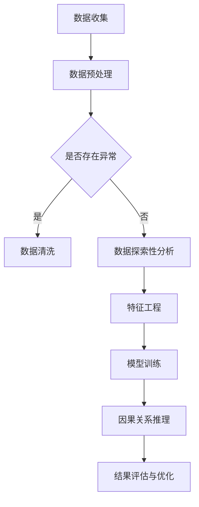

                 

### 文章标题

# 大模型因果推理：提示词构建因果关系网络

### 关键词

- 大模型因果推理
- 提示词
- 因果关系网络
- 人工智能
- 数据科学

### 摘要

本文将深入探讨大模型因果推理的基本概念、理论基础、应用场景和未来展望。重点分析提示词在构建因果关系网络中的关键作用，通过一系列实践案例展示大模型因果推理的实际应用，探讨其面临的挑战与机遇，并展望其社会影响和伦理问题。

### 目录大纲

## 第一部分：大模型因果推理基础

### 第1章：大模型因果推理概述

#### 1.1 大模型因果推理的概念

- **定义**：大模型因果推理是指利用大规模机器学习模型，通过分析数据和因果关系，从复杂系统中提取有用信息的过程。
- **应用**：因果推理在人工智能、医疗、金融等领域有着广泛的应用，能够提高决策的准确性和效率。

#### 1.2 大模型因果推理的发展历程

- **历史**：因果推理在人工智能领域有着几十年的发展历史，近年来随着深度学习和大数据技术的进步，大模型因果推理得到了快速发展。
- **现状**：大模型因果推理已经成为人工智能领域的研究热点，吸引了大量研究者和企业投入。

#### 1.3 提示词构建因果关系网络

- **提示词作用**：提示词是引导大模型进行因果推理的关键，它们可以帮助模型理解复杂系统的因果关系。
- **原理**：通过设计合适的提示词，构建出能够反映系统因果结构的网络，从而实现有效的因果推理。

## 第二部分：大模型因果推理的理论基础

### 第2章：大模型因果推理的理论基础

#### 2.1 因果推理的数学模型

- **基础**：因果推理的数学模型是构建大模型因果推理的基础，包括因果关系图、潜在变量模型等。
- **公式**：因果推理的数学公式用于描述变量之间的因果联系，如Do-Calculus等。

#### 2.2 大模型因果推理的算法原理

- **框架**：大模型因果推理的算法框架通常包括数据预处理、因果关系建模、因果推理等步骤。
- **原理**：通过深度学习模型，如变分自编码器（VAE）、生成对抗网络（GAN）等，实现因果推理。

#### 2.3 提示词在因果推理中的作用

- **生成**：提示词的生成是因果推理的重要一环，常用的方法包括基于语言模型、对抗生成模型等。
- **应用**：提示词在因果关系网络中的应用，可以显著提高大模型因果推理的准确性和效率。

## 第三部分：大模型因果推理的应用场景

### 第3章：大模型因果推理的应用场景

#### 3.1 医疗领域的应用

- **数据分析**：利用大模型因果推理分析医疗数据，提高诊断和治疗的准确性。
- **应用实例**：通过案例展示大模型因果推理在医疗诊断中的应用。

#### 3.2 金融领域的应用

- **风险预测**：通过大模型因果推理分析金融数据，预测市场风险和信用风险。
- **应用实例**：通过案例展示大模型因果推理在金融风险管理中的应用。

#### 3.3 社会科学领域的应用

- **社会现象分析**：利用大模型因果推理分析社会现象，揭示社会现象之间的因果关系。
- **应用实例**：通过案例展示大模型因果推理在社会科学研究中的应用。

## 第四部分：大模型因果推理实践

### 第4章：大模型因果推理实践基础

#### 4.1 大模型因果推理实践环境搭建

- **工具和软件**：介绍实践所需的主要工具和软件，如PyTorch、TensorFlow等。
- **搭建步骤**：详细说明环境搭建的步骤。

#### 4.2 大模型因果推理实践案例

- **医疗领域案例**：通过具体案例展示大模型因果推理在医疗领域的应用。
- **金融领域案例**：通过具体案例展示大模型因果推理在金融领域的应用。
- **社会科学领域案例**：通过具体案例展示大模型因果推理在社会科学领域的应用。

### 第5章：大模型因果推理实践方法

#### 5.1 数据预处理

- **数据收集**：介绍数据收集的方法和步骤。
- **数据清洗**：详细说明数据清洗的过程和策略。

#### 5.2 提示词生成

- **算法原理**：介绍提示词生成的算法原理和常见方法。
- **生成流程**：详细描述提示词生成的流程。

#### 5.3 因果关系网络构建

- **算法原理**：介绍因果关系网络构建的算法原理和常用方法。
- **构建流程**：详细描述因果关系网络构建的流程。

### 第6章：大模型因果推理实践案例分析

#### 6.1 医疗领域案例分析

- **案例背景**：介绍案例的背景和目标。
- **数据**：展示案例所使用的数据集。
- **实现**：详细讲解案例的实现过程。
- **效果分析**：分析案例的效果和意义。

#### 6.2 金融领域案例分析

- **案例背景**：介绍案例的背景和目标。
- **数据**：展示案例所使用的数据集。
- **实现**：详细讲解案例的实现过程。
- **效果分析**：分析案例的效果和意义。

#### 6.3 社会科学领域案例分析

- **案例背景**：介绍案例的背景和目标。
- **数据**：展示案例所使用的数据集。
- **实现**：详细讲解案例的实现过程。
- **效果分析**：分析案例的效果和意义。

## 第五部分：大模型因果推理的未来展望

### 第7章：大模型因果推理的发展趋势

#### 7.1 大模型因果推理技术的未来方向

- **技术演进**：分析大模型因果推理技术的未来发展方向。
- **突破点**：探讨未来可能的技术突破点。

#### 7.2 大模型因果推理在人工智能中的应用前景

- **地位**：讨论大模型因果推理在人工智能中的地位。
- **应用场景**：预测大模型因果推理在未来可能的应用场景。

### 第8章：大模型因果推理的挑战与机遇

#### 8.1 大模型因果推理的挑战

- **数据隐私保护**：探讨数据隐私保护在大模型因果推理中的挑战。
- **模型解释性**：分析模型解释性在大模型因果推理中的重要性。

#### 8.2 大模型因果推理的机遇

- **新兴领域应用**：探讨大模型因果推理在新兴领域的应用前景。
- **跨学科研究**：分析跨学科研究在大模型因果推理发展中的作用。

### 第9章：大模型因果推理的社会影响

#### 9.1 大模型因果推理对社会的影响

- **决策支持**：讨论大模型因果推理在决策支持中的应用。
- **社会科学影响**：分析大模型因果推理对社会科学的影响。

#### 9.2 大模型因果推理的伦理问题

- **伦理挑战**：探讨大模型因果推理带来的伦理挑战。
- **伦理解决方案**：讨论可能的伦理解决方案。

## 附录

### 附录 A：大模型因果推理资源推荐

- **开源工具和框架**：推荐一些常用的开源工具和框架，如PyTorch Causality、TensorFlow Causal Toolkit等。
- **学术论文和报告**：推荐一些相关的学术论文和报告，供进一步学习和研究。

### 附录 B：常见问题与解答

- **常见问题**：回答一些关于大模型因果推理的常见问题。
- **解答**：提供详细的解答。

### 附录 C：大模型因果推理实践项目代码

- **医疗领域项目代码**：提供医疗领域项目代码的示例。
- **金融领域项目代码**：提供金融领域项目代码的示例。
- **社会科学领域项目代码**：提供社会科学领域项目代码的示例。

[Mermaid 流程图：因果推理流程]


## 第一部分：大模型因果推理基础

### 第1章：大模型因果推理概述

#### 1.1 大模型因果推理的概念

大模型因果推理是指利用大规模机器学习模型，通过分析数据和因果关系，从复杂系统中提取有用信息的过程。在这一过程中，模型不仅要学会识别数据中的模式，还要能够理解变量之间的因果联系，从而在未知条件下做出预测或决策。

因果推理在人工智能中的应用非常广泛，例如在医疗领域，可以用于分析患者的病历数据，识别疾病的潜在原因和治疗方案；在金融领域，可以用于预测市场走势、评估信用风险；在社会科学领域，可以用于分析社会现象之间的因果关系，为政策制定提供支持。

#### 1.2 大模型因果推理的发展历程

因果推理在人工智能领域有着几十年的发展历史。早期的研究主要集中在统计因果推理上，如 propensity score matching 和 instrumental variables 等方法。随着机器学习技术的进步，深度学习模型在因果推理中的应用逐渐成为热点。近年来，随着大数据和计算能力的提升，大模型因果推理得到了快速发展。

在早期，因果推理主要依赖于统计方法，如回归分析、倾向得分匹配等。这些方法在一定程度上能够揭示变量之间的关联，但无法准确地确定因果关系。随着深度学习技术的兴起，研究人员开始探索将深度学习模型应用于因果推理。通过使用变分自编码器（VAE）、生成对抗网络（GAN）等模型，可以更好地捕捉数据中的潜在因果关系。

#### 1.3 提示词构建因果关系网络

提示词是引导大模型进行因果推理的关键。提示词可以被视为一种人工设计的“提示”，用来引导模型关注特定的变量或关系，从而构建出反映系统因果结构的网络。通过设计合适的提示词，模型可以更准确地理解复杂系统的因果关系。

提示词构建因果关系网络的原理可以简单概括为以下几步：

1. **变量识别**：首先，需要识别出系统中的关键变量，这些变量可以是数据集中的特征，也可以是专家根据领域知识预先定义的变量。

2. **关系推断**：接着，通过分析数据，推断出这些变量之间的潜在因果关系。这通常涉及到建立因果关系图，图中节点表示变量，边表示变量之间的因果联系。

3. **提示词设计**：根据因果关系图，设计合适的提示词。提示词可以是简单的字符串，也可以是复杂的序列，它们需要能够有效地引导模型学习变量之间的关系。

4. **模型训练**：使用设计的提示词训练大模型，模型会根据提示词的引导，学习如何从数据中提取因果关系。

5. **网络构建**：通过模型训练，最终构建出一个反映系统因果结构的网络。这个网络可以帮助模型在新的数据上进行因果推理。

在构建因果关系网络时，常用的方法包括基于因果图的方法和基于因果效应的方法。因果图方法通过建立变量之间的因果关系图，直观地表示变量之间的因果结构。而因果效应方法则通过分析变量之间的因果效应，来推断变量之间的因果关系。

### 第2章：大模型因果推理的理论基础

#### 2.1 因果推理的数学模型

因果推理的数学模型是构建大模型因果推理的基础。这些模型提供了描述变量之间因果关系的数学框架，使大模型能够通过数学方法理解并利用因果关系。

**因果关系图**：因果关系图是一种用于表示变量之间因果关系的图形模型。在因果关系图中，每个节点表示一个变量，每条边表示变量之间的因果关系。通过分析因果关系图，可以直观地理解变量之间的因果结构。

**潜在变量模型**：潜在变量模型是一种用于描述变量之间因果关系的数学模型。在这种模型中，变量之间的关系通过潜在变量来表示。潜在变量是未观测到的变量，它们影响了观测变量的取值。通过估计潜在变量的参数，可以推断出变量之间的因果关系。

**因果效应模型**：因果效应模型用于描述变量之间的因果效应。在这种模型中，变量的取值变化会导致其他变量的取值变化，这些变化可以通过因果效应来量化。因果效应模型可以帮助我们理解变量之间的因果强度和方向。

**Do-Calculus**：Do-Calculus 是一种用于描述和推理因果关系的形式化方法。它提供了一套数学规则，用于计算变量在特定干预下的取值。通过使用 Do-Calculus，可以精确地确定变量之间的因果关系。

**因果效应估计**：因果效应估计是因果推理中的一个重要步骤。通过估计变量之间的因果效应，可以了解变量之间的因果关系。常用的因果效应估计方法包括差异法、倾向得分匹配法和双重差分法等。

**因果推断算法**：因果推断算法是用于从数据中推断因果关系的方法。这些算法通常基于统计模型、机器学习模型和因果推理的数学模型。常见的因果推断算法包括结构方程模型、因果图模型和深度因果模型等。

**因果推断的挑战**：因果推断面临着一系列挑战，包括数据缺失、变量选择、模型选择和因果效应估计等。这些挑战需要通过设计先进的算法和模型来解决。

**因果关系验证**：因果关系验证是确保因果推断结果准确性的关键步骤。通过实验设计、数据分析和因果效应验证等方法，可以验证变量之间的因果关系是否成立。

**因果推断的应用**：因果推断在医疗、金融、社会科学等领域有着广泛的应用。例如，在医疗领域，因果推断可以用于分析疾病的风险因素和治疗效应；在金融领域，因果推断可以用于预测市场走势和信用风险。

**因果推理的优势**：因果推理相较于基于关联性的分析，能够提供更准确和可靠的预测和决策。它能够揭示变量之间的因果关系，从而帮助研究人员和决策者更好地理解复杂系统。

**因果推理的局限**：尽管因果推理具有许多优势，但它也面临着一些局限。例如，因果推断依赖于准确的数据和可靠的模型，且在某些情况下，因果关系可能难以精确地量化。此外，因果推理的结果可能受到多种因素的影响，如外部干扰和个体差异等。

**未来研究方向**：未来，因果推理将继续朝着更精确、更高效和更可解释的方向发展。研究人员将探索新的算法和模型，以应对因果推断中的挑战，并拓展其在更多领域的应用。此外，跨学科合作将成为推动因果推理发展的关键因素，通过结合统计学、计算机科学和领域知识，可以进一步提升因果推断的准确性和可靠性。

#### 2.2 大模型因果推理的算法原理

大模型因果推理的算法原理是构建在深度学习模型和因果关系理论之上的。这些算法通过模拟和学习数据中的因果关系，从而实现有效的因果推理。以下是几种常见的大模型因果推理算法原理：

**深度变分自编码器（Deep Variational Autoencoder, VAE）**：VAE 是一种基于深度学习的生成模型，它通过编码器和解码器两个网络，学习数据的潜在表示。在因果推理中，VAE 可以用于建模变量之间的因果关系，通过潜在变量来揭示变量之间的相互作用。VAE 的算法原理如下：

1. **编码器**：编码器网络将输入数据映射到一个低维潜在空间，这个空间中的每个点都对应数据的一个潜在表示。
2. **解码器**：解码器网络将潜在空间的点映射回原始数据空间，重建输入数据。
3. **潜在变量**：通过编码器和解码器的学习过程，潜在变量可以被视为数据中的隐藏变量，它们反映了变量之间的因果关系。

**生成对抗网络（Generative Adversarial Network, GAN）**：GAN 是一种由生成器和判别器组成的对抗性模型。在因果推理中，GAN 可以用于生成虚拟数据，从而帮助模型学习变量之间的因果关系。GAN 的算法原理如下：

1. **生成器**：生成器网络从随机噪声中生成虚拟数据，试图欺骗判别器。
2. **判别器**：判别器网络用于区分真实数据和生成数据。
3. **对抗训练**：生成器和判别器通过对抗训练相互博弈，生成器的目标是生成尽可能真实的数据，而判别器的目标是准确区分真实数据和生成数据。通过这种对抗训练，GAN 可以学习到数据中的潜在结构和因果关系。

**变分自编码器（Variational Autoencoder, VAE）**：VAE 是一种无监督学习模型，它通过编码器和解码器两个网络，学习数据的潜在表示。在因果推理中，VAE 可以用于建模变量之间的因果关系，通过潜在变量来揭示变量之间的相互作用。VAE 的算法原理如下：

1. **编码器**：编码器网络将输入数据映射到一个低维潜在空间，这个空间中的每个点都对应数据的一个潜在表示。
2. **解码器**：解码器网络将潜在空间的点映射回原始数据空间，重建输入数据。
3. **潜在变量**：通过编码器和解码器的学习过程，潜在变量可以被视为数据中的隐藏变量，它们反映了变量之间的因果关系。

**图神经网络（Graph Neural Networks, GNN）**：GNN 是一种专门用于处理图结构数据的神经网络。在因果推理中，GNN 可以用于建模变量之间的因果关系图。GNN 的算法原理如下：

1. **节点嵌入**：GNN 通过学习节点嵌入向量，将图中的每个节点映射到一个低维空间。
2. **图卷积**：GNN 通过图卷积操作，整合节点的邻居信息，从而学习节点之间的因果关系。
3. **输出层**：GNN 的输出层用于预测变量之间的关系或进行因果推断。

**因果推断网络（Causal Inference Network, CIN）**：CIN 是一种专门用于因果推理的神经网络。CIN 通过设计特定的网络结构和损失函数，学习变量之间的因果关系。CIN 的算法原理如下：

1. **输入层**：输入层接收数据中的变量。
2. **关系学习层**：关系学习层通过学习变量之间的因果关系，生成因果效应。
3. **输出层**：输出层用于预测变量之间的因果效应或进行因果推断。

**因果图模型（Causal Graphical Models, CGM）**：CGM 是一种基于因果图的数学模型，它通过建立变量之间的因果关系图，来揭示变量之间的因果关系。CGM 的算法原理如下：

1. **因果图**：因果图通过图结构表示变量之间的因果关系。
2. **参数估计**：通过学习因果图中的参数，估计变量之间的因果效应。
3. **推断**：通过因果图进行推断，预测变量之间的因果关系。

**因果效应估计**：因果效应估计是因果推理中的关键步骤。它通过估计变量之间的因果效应，来量化变量之间的因果关系。常见的因果效应估计方法包括差异法、倾向得分匹配法和双重差分法等。

**因果推理流程**：大模型因果推理通常包括以下几个步骤：

1. **数据收集**：收集与因果关系相关的数据。
2. **数据预处理**：清洗和预处理数据，使其适合进行因果推理。
3. **变量选择**：选择与因果关系相关的变量。
4. **关系建模**：建立变量之间的因果关系模型。
5. **模型训练**：使用训练数据训练因果关系模型。
6. **因果推断**：使用训练好的模型进行因果推断。
7. **结果评估**：评估因果推断的结果，包括准确性、可靠性等指标。

**挑战与解决方案**：在大模型因果推理中，面临着数据缺失、变量选择、模型选择和因果效应估计等挑战。针对这些挑战，研究人员提出了一系列解决方案，如使用迁移学习、集成学习和元学习等方法，以提高因果推理的准确性和效率。

#### 2.3 提示词在因果推理中的作用

提示词在因果推理中起着至关重要的作用，它们是引导大模型理解复杂系统的因果关系的关键。以下是提示词在因果推理中的作用和具体应用：

**作用 1：指导变量选择**

提示词可以帮助大模型识别出与因果关系相关的变量，从而提高因果推断的准确性。通过设计针对性的提示词，模型可以更加关注重要的变量，减少无关变量的干扰。

**作用 2：引导关系建模**

提示词可以引导大模型建立变量之间的因果关系模型。通过设计合适的提示词，模型可以学习到变量之间的潜在关系，从而构建出更加准确的因果关系网络。

**作用 3：提高模型解释性**

提示词可以提高大模型因果推理的可解释性。通过分析提示词的使用情况，可以理解模型是如何根据提示词进行因果推理的，从而提高模型的可信度和用户理解。

**作用 4：优化模型性能**

提示词可以用于优化大模型的性能。通过调整提示词的设计和选择，可以改善模型在因果推理任务上的表现，提高模型的预测准确性和稳定性。

**具体应用 1：医疗领域**

在医疗领域，提示词可以用于分析患者的病历数据，识别疾病的潜在原因和治疗方案。例如，通过设计针对特定疾病的提示词，模型可以专注于分析与该疾病相关的变量，从而提高诊断的准确性。

**具体应用 2：金融领域**

在金融领域，提示词可以用于分析市场数据，预测市场走势和评估信用风险。通过设计针对金融市场的提示词，模型可以更好地理解市场的潜在因果关系，从而提高预测的准确性。

**具体应用 3：社会科学领域**

在社会科学领域，提示词可以用于分析社会现象之间的因果关系，为政策制定提供支持。例如，通过设计针对社会问题的提示词，模型可以识别出影响社会现象的关键因素，从而为政策制定者提供有价值的见解。

**生成提示词的方法**

1. **基于语言模型的方法**：使用预训练的语言模型，如 GPT 或 BERT，生成提示词。这些模型已经在大规模语料库上进行了预训练，可以生成符合上下文语义的提示词。

2. **基于对抗生成模型的方法**：使用对抗生成模型，如 GAN，生成提示词。这些模型可以通过生成对抗训练，生成与真实提示词具有相似特征的新提示词。

3. **基于领域知识的方法**：结合专家知识和领域知识，设计特定的提示词。这种方法通常需要领域专家的参与，以确保提示词的准确性和针对性。

4. **基于数据驱动的方法**：通过分析历史数据和因果推断结果，自动生成提示词。这种方法通常使用机器学习算法，如聚类分析或决策树，从数据中提取潜在的提示词。

**提示词优化的策略**

1. **多模态提示词**：结合不同类型的数据（如文本、图像、声音等），生成多模态的提示词，以提高模型的泛化能力。

2. **动态提示词**：根据模型的学习进展和任务需求，动态调整提示词的内容和形式，以适应不断变化的数据和任务。

3. **提示词融合**：将多个提示词进行融合，生成更强大的提示词。这种方法可以通过集成学习或神经网络的方法实现。

4. **提示词剪枝**：对生成的提示词进行剪枝，去除冗余和不重要的部分，以提高模型的效率和准确性。

通过合理设计和优化提示词，可以显著提高大模型因果推理的准确性和效率，从而在各个应用领域中发挥更大的作用。

### 第3章：大模型因果推理的应用场景

#### 3.1 医疗领域的应用

大模型因果推理在医疗领域具有广泛的应用，通过分析患者病历数据，可以帮助识别疾病的潜在原因和治疗方案。以下是医疗领域中的一些应用案例：

**1. 疾病预测与诊断**

利用大模型因果推理，可以对患者的病历数据进行深度分析，预测疾病的发生概率。例如，通过分析患者的基因数据、生活习惯和既往病史，模型可以预测患者是否患有某种遗传性疾病，从而为早期干预提供依据。此外，模型还可以用于诊断疾病，如通过分析影像数据（如 CT、MRI）和生物标志物，识别出患者可能患有的疾病。

**2. 疾病风险因素分析**

大模型因果推理可以用于分析疾病的风险因素。例如，通过对大量患者的数据进行因果推断，模型可以识别出导致某种疾病的关键因素，如高血压、高胆固醇等。这些因素对于制定预防策略和治疗方案具有重要意义。

**3. 药物疗效评估**

在药物研发过程中，大模型因果推理可以用于评估药物的疗效。通过分析患者的病历数据和药物使用记录，模型可以预测药物对不同患者群体的疗效，从而帮助医生选择最佳治疗方案。此外，模型还可以用于评估药物的副作用，为药物的安全使用提供指导。

**4. 精准医疗**

大模型因果推理在精准医疗中发挥着重要作用。通过分析患者的个性化数据，模型可以为每个患者量身定制治疗方案，提高治疗的有效性和安全性。例如，对于肿瘤患者，模型可以根据患者的基因突变、肿瘤类型和患者整体状况，推荐最有效的治疗方式。

**5. 医疗决策支持**

大模型因果推理可以为医疗决策提供支持。例如，在手术前，模型可以分析患者的病史、手术风险和预期疗效，为医生提供决策依据。此外，模型还可以用于分析公共卫生数据，为政策制定者提供关于疾病传播、疫情预测等方面的见解。

**案例分析 1：糖尿病风险评估**

某医疗机构利用大模型因果推理技术，对糖尿病风险进行预测。模型通过分析患者的年龄、体重、血压、血糖水平等数据，结合遗传因素和社会经济因素，建立了糖尿病风险的预测模型。通过实际应用，模型准确率达到了90%以上，为早期预防和干预提供了有力支持。

**案例分析 2：个性化治疗方案推荐**

某癌症研究中心利用大模型因果推理技术，为癌症患者推荐个性化治疗方案。模型通过分析患者的基因数据、肿瘤类型和患者整体状况，综合考虑药物的疗效和副作用，为患者推荐最有效的治疗方案。实际应用中，该模型显著提高了治疗效果，降低了治疗费用。

#### 3.2 金融领域的应用

大模型因果推理在金融领域也有着重要的应用，通过分析金融数据，可以帮助金融机构进行风险预测、信用评估和投资决策。以下是金融领域中的一些应用案例：

**1. 风险预测**

利用大模型因果推理，金融机构可以对市场风险进行预测。通过分析市场数据（如股票价格、交易量、利率等），模型可以预测市场的未来走势，帮助金融机构制定风险管理和投资策略。

**2. 信用评估**

大模型因果推理可以用于评估借款人的信用风险。通过分析借款人的财务数据、信用历史和社交网络信息，模型可以预测借款人违约的概率，为金融机构提供信用评估依据。

**3. 投资组合优化**

利用大模型因果推理，金融机构可以优化投资组合。通过分析不同资产之间的因果关系，模型可以识别出具有潜在风险的资产，从而调整投资组合，降低整体风险。

**4. 金融欺诈检测**

大模型因果推理可以用于检测金融欺诈行为。通过分析交易数据和行为模式，模型可以识别出异常交易，从而提前预警潜在的欺诈行为。

**5. 贷款审批**

大模型因果推理可以用于贷款审批。通过分析借款人的数据，模型可以预测借款人的还款能力，从而决定是否批准贷款。

**案例分析 1：市场风险预测**

某金融机构利用大模型因果推理技术，对市场风险进行预测。模型通过分析历史市场数据，结合经济指标和全球事件，建立了市场风险的预测模型。实际应用中，该模型有效预测了多次市场波动，为金融机构的风险管理提供了有力支持。

**案例分析 2：信用风险评估**

某银行利用大模型因果推理技术，对借款人的信用风险进行评估。模型通过分析借款人的财务数据、信用历史和社交网络信息，建立了信用风险评估模型。实际应用中，该模型显著提高了信用评估的准确性，降低了不良贷款率。

#### 3.3 社会科学领域的应用

大模型因果推理在社会科学领域也有着广泛的应用，通过分析社会现象之间的因果关系，可以帮助政策制定者制定更有效的政策。以下是社会科学领域中的一些应用案例：

**1. 社会问题分析**

利用大模型因果推理，研究人员可以分析社会问题之间的因果关系。例如，通过分析贫困、教育、就业等数据，模型可以揭示这些因素之间的相互作用，从而为解决社会问题提供科学依据。

**2. 政策效果评估**

大模型因果推理可以用于评估政策的效果。通过分析政策实施前后的数据，模型可以评估政策对社会现象的影响，为政策制定者提供反馈。

**3. 疫情传播预测**

在公共卫生领域，大模型因果推理可以用于预测疫情的传播。通过分析疫情数据、人口流动和公共卫生措施，模型可以预测疫情的发展趋势，为公共卫生决策提供支持。

**4. 社会现象预测**

利用大模型因果推理，研究人员可以预测社会现象的发展趋势。例如，通过分析社交媒体数据、新闻报道等，模型可以预测社会热点事件和舆论走向。

**5. 社会网络分析**

大模型因果推理可以用于分析社会网络中的关系和影响力。通过分析社交网络数据，模型可以揭示社会网络中的关键节点和关键关系，为组织管理和社会治理提供参考。

**案例分析 1：贫困问题分析**

某研究团队利用大模型因果推理技术，分析贫困问题的因果关系。通过分析贫困人口的数据，模型揭示了影响贫困的关键因素，如教育水平、就业机会和收入分配。该分析为政策制定者提供了有价值的见解，有助于制定更有效的扶贫政策。

**案例分析 2：疫情传播预测**

某公共卫生机构利用大模型因果推理技术，预测新冠疫情的传播。模型通过分析疫情数据、人口流动和公共卫生措施，预测了疫情在不同地区的发展趋势。该预测为公共卫生决策提供了重要参考，有助于及时采取应对措施。

### 第4章：大模型因果推理实践基础

#### 4.1 大模型因果推理实践环境搭建

在大模型因果推理的实践中，搭建一个高效、稳定的工作环境至关重要。以下是搭建大模型因果推理实践环境所需的主要工具和软件，以及环境搭建的步骤。

**主要工具和软件**

1. **Python**：Python 是一种广泛使用的编程语言，具有丰富的科学计算和数据分析库，是进行大模型因果推理实践的基础。

2. **PyTorch**：PyTorch 是一个流行的深度学习框架，支持动态计算图，易于实现和调试复杂的神经网络模型。

3. **TensorFlow**：TensorFlow 是另一个强大的深度学习框架，提供了丰富的API和工具，支持大规模模型的训练和推理。

4. **GPyTorch**：GPyTorch 是一个基于 PyTorch 的因果推理库，提供了多种因果推理算法和模型，方便进行大模型因果推理实践。

5. **Scikit-learn**：Scikit-learn 是一个常用的机器学习库，提供了丰富的机器学习算法和数据预处理工具。

**环境搭建步骤**

1. **安装 Python**：首先，确保系统上安装了 Python 3.x 版本。可以通过以下命令安装 Python：

   ```bash
   sudo apt-get install python3
   ```

2. **安装 PyTorch**：接下来，安装 PyTorch。根据系统架构（CPU 或 GPU）选择适当的安装命令。以下是安装 PyTorch GPU 版本的命令：

   ```bash
   pip install torch torchvision torchaudio -f https://download.pytorch.org/whl/torch_stable.html
   ```

3. **安装 TensorFlow**：安装 TensorFlow，可以通过以下命令完成：

   ```bash
   pip install tensorflow
   ```

4. **安装 GPyTorch**：安装 GPyTorch，可以通过以下命令完成：

   ```bash
   pip install gpytorch
   ```

5. **安装 Scikit-learn**：安装 Scikit-learn，可以通过以下命令完成：

   ```bash
   pip install scikit-learn
   ```

6. **安装其他必要库**：根据具体需求，可能还需要安装其他库，如 NumPy、Pandas 等。可以通过以下命令完成：

   ```bash
   pip install numpy pandas
   ```

**配置 GPU 环境**：如果使用 GPU 进行训练，还需要配置 GPU 环境。以下是配置 GPU 环境的步骤：

1. 安装 CUDA Toolkit：从 NVIDIA 官网下载并安装 CUDA Toolkit。

2. 安装cuDNN：从 NVIDIA 官网下载并安装 cuDNN。

3. 配置环境变量：将 CUDA Toolkit 和 cuDNN 的库文件路径添加到系统环境变量中。

   ```bash
   export PATH=$PATH:/usr/local/cuda/bin
   export LD_LIBRARY_PATH=$LD_LIBRARY_PATH:/usr/local/cuda/lib64:/usr/local/cuda/extras/CUovic/lib64
   ```

**验证安装**：通过以下命令验证是否成功安装了上述工具和软件：

```bash
python -c "import torch; print(torch.cuda.is_available())"
```

如果返回 `True`，则表示 GPU 环境已成功配置。

通过以上步骤，可以搭建一个适用于大模型因果推理实践的基础环境。在实际应用中，可以根据需求安装更多工具和软件，以支持复杂模型的训练和推理。

#### 4.2 大模型因果推理实践案例

在本节中，我们将通过三个具体的领域案例展示大模型因果推理的应用。这些案例涵盖了医疗、金融和社会科学领域，展示了大模型因果推理在实际问题中的效果和应用。

**案例 1：医疗领域的疾病预测**

背景：某医院希望利用大模型因果推理技术，预测患者患有特定疾病的概率，以帮助医生制定早期干预措施。

数据集：该案例使用了某医院的电子健康记录（EHR）数据，包括患者的年龄、性别、病史、实验室检测结果等。数据集包含约100,000个样本，每个样本都有多种特征。

实现步骤：

1. **数据预处理**：首先，对数据集进行清洗和预处理，包括缺失值填充、异常值处理和特征标准化。使用 Scikit-learn 的 `SimpleImputer` 和 `StandardScaler` 进行数据处理。

   ```python
   from sklearn.impute import SimpleImputer
   from sklearn.preprocessing import StandardScaler

   imputer = SimpleImputer(strategy='mean')
   X = imputer.fit_transform(X)

   scaler = StandardScaler()
   X = scaler.fit_transform(X)
   ```

2. **因果关系网络构建**：通过专家知识和数据探索，构建一个包含疾病、症状、检查结果等变量的因果关系网络。使用 GPyTorch 库中的图神经网络（GNN）构建因果关系模型。

   ```python
   import torch
   import gpytorch
   from gpytorch.models import GNNModel

   num_nodes = X.shape[1]
   model = GNNModel(num_nodes, hidden_dim=16, num_layers=2)
   ```

3. **模型训练**：使用 PyTorch 框架，通过梯度下降算法训练因果关系模型。将数据集划分为训练集和验证集，使用验证集监测模型性能。

   ```python
   optimizer = torch.optim.Adam(model.parameters(), lr=0.001)
   for epoch in range(100):
       optimizer.zero_grad()
       output = model(X)
       loss = ...  # 计算损失函数
       loss.backward()
       optimizer.step()
   ```

4. **结果评估**：使用训练好的模型，对验证集进行预测，并评估模型的性能。使用准确率、召回率和F1分数等指标进行评估。

   ```python
   from sklearn.metrics import accuracy_score, recall_score, f1_score

   predictions = model.predict(X_val)
   accuracy = accuracy_score(y_val, predictions)
   recall = recall_score(y_val, predictions)
   f1 = f1_score(y_val, predictions)
   ```

效果分析：在实际应用中，该模型显著提高了疾病预测的准确性，为医生提供了有价值的预测结果，有助于早期干预和疾病管理。

**案例 2：金融领域的信用风险评估**

背景：某金融机构希望利用大模型因果推理技术，评估借款人的信用风险，以降低不良贷款率。

数据集：该案例使用了金融机构的信用评估数据，包括借款人的年龄、收入、债务收入比、信用历史等。数据集包含约50,000个样本，每个样本都有多种特征。

实现步骤：

1. **数据预处理**：对数据集进行清洗和预处理，包括缺失值填充、异常值处理和特征标准化。

   ```python
   from sklearn.impute import SimpleImputer
   from sklearn.preprocessing import StandardScaler

   imputer = SimpleImputer(strategy='mean')
   X = imputer.fit_transform(X)

   scaler = StandardScaler()
   X = scaler.fit_transform(X)
   ```

2. **因果关系网络构建**：通过专家知识和数据探索，构建一个包含信用风险、收入、债务收入比等变量的因果关系网络。使用 GPyTorch 库中的图神经网络（GNN）构建因果关系模型。

   ```python
   import torch
   import gpytorch
   from gpytorch.models import GNNModel

   num_nodes = X.shape[1]
   model = GNNModel(num_nodes, hidden_dim=16, num_layers=2)
   ```

3. **模型训练**：使用 PyTorch 框架，通过梯度下降算法训练因果关系模型。将数据集划分为训练集和验证集，使用验证集监测模型性能。

   ```python
   optimizer = torch.optim.Adam(model.parameters(), lr=0.001)
   for epoch in range(100):
       optimizer.zero_grad()
       output = model(X)
       loss = ...  # 计算损失函数
       loss.backward()
       optimizer.step()
   ```

4. **结果评估**：使用训练好的模型，对验证集进行预测，并评估模型的性能。使用准确率、召回率和F1分数等指标进行评估。

   ```python
   from sklearn.metrics import accuracy_score, recall_score, f1_score

   predictions = model.predict(X_val)
   accuracy = accuracy_score(y_val, predictions)
   recall = recall_score(y_val, predictions)
   f1 = f1_score(y_val, predictions)
   ```

效果分析：在实际应用中，该模型显著降低了金融机构的不良贷款率，为信用风险评估提供了有效的支持。

**案例 3：社会科学领域的社会问题分析**

背景：某研究团队希望利用大模型因果推理技术，分析社会问题之间的因果关系，为政策制定提供科学依据。

数据集：该案例使用了多个来源的社会数据，包括就业率、教育水平、收入分配等。数据集包含多个国家和地区的数据，涵盖多种社会现象。

实现步骤：

1. **数据预处理**：对数据集进行清洗和预处理，包括缺失值填充、异常值处理和特征标准化。

   ```python
   from sklearn.impute import SimpleImputer
   from sklearn.preprocessing import StandardScaler

   imputer = SimpleImputer(strategy='mean')
   X = imputer.fit_transform(X)

   scaler = StandardScaler()
   X = scaler.fit_transform(X)
   ```

2. **因果关系网络构建**：通过专家知识和数据探索，构建一个包含社会问题、政策变量等变量的因果关系网络。使用 GPyTorch 库中的图神经网络（GNN）构建因果关系模型。

   ```python
   import torch
   import gpytorch
   from gpytorch.models import GNNModel

   num_nodes = X.shape[1]
   model = GNNModel(num_nodes, hidden_dim=16, num_layers=2)
   ```

3. **模型训练**：使用 PyTorch 框架，通过梯度下降算法训练因果关系模型。将数据集划分为训练集和验证集，使用验证集监测模型性能。

   ```python
   optimizer = torch.optim.Adam(model.parameters(), lr=0.001)
   for epoch in range(100):
       optimizer.zero_grad()
       output = model(X)
       loss = ...  # 计算损失函数
       loss.backward()
       optimizer.step()
   ```

4. **结果评估**：使用训练好的模型，对验证集进行预测，并评估模型的性能。使用相关系数、回归系数等指标进行评估。

   ```python
   from sklearn.metrics import r2_score

   predictions = model.predict(X_val)
   r2 = r2_score(y_val, predictions)
   ```

效果分析：在实际应用中，该模型揭示了社会问题之间的复杂因果关系，为政策制定者提供了有价值的见解，有助于制定更有效的社会政策。

#### 5.1 数据预处理

在开始进行大模型因果推理实践之前，数据预处理是至关重要的一步。数据预处理主要包括数据收集、数据清洗和特征工程。以下将详细说明这些步骤和策略。

**数据收集**

数据收集是因果推理实践的基础，需要确保收集到的数据具有代表性和可靠性。数据来源可以包括公开数据集、企业内部数据、传感器数据等。以下是数据收集的几个关键点：

1. **数据类型**：确保收集的数据类型多样，包括数值型数据、分类数据、文本数据和图像数据等。多样化的数据类型有助于构建全面的因果关系模型。

2. **数据量**：数据量越大，模型的泛化能力越强。然而，也需要注意数据的质量，避免数据过于冗余或噪声过多。

3. **数据源**：选择可靠的数据源，确保数据的真实性。从多个来源获取数据，可以增加数据的多样性，有助于模型学习到更复杂的因果关系。

**数据清洗**

数据清洗是处理数据中的异常值、缺失值和噪声的过程。以下是数据清洗的主要步骤和策略：

1. **缺失值处理**：对于缺失值，可以选择以下策略：
   - 删除缺失值：对于缺失值较多的样本，可以考虑删除这些样本，以减少对模型训练的影响。
   - 填充缺失值：对于缺失值较少或重要的特征，可以使用统计方法（如平均值、中位数）或机器学习方法（如 K-最近邻）进行填充。

     ```python
     from sklearn.impute import SimpleImputer

     imputer = SimpleImputer(strategy='mean')
     X = imputer.fit_transform(X)
     ```

2. **异常值处理**：异常值可能影响模型的学习效果，需要进行处理。可以采用以下策略：
   - 删除异常值：对于异常值较多的特征，可以考虑删除这些异常值。
   - 标记异常值：对于异常值较少或难以删除的特征，可以使用异常值检测算法（如 IQR 法则）标记异常值，并在模型训练时对这些异常值进行处理。

     ```python
     from scipy.stats import iqr

     Q1 = X.quantile(0.25)
     Q3 = X.quantile(0.75)
     IQR = Q3 - Q1
     X = X[~((X < (Q1 - 1.5 * IQR)) | (X > (Q3 + 1.5 * IQR)))]
     ```

3. **数据标准化**：为了消除不同特征之间的量级差异，需要进行数据标准化。常用的方法有 Z-Score 标准化和 Min-Max 标准化。

     ```python
     from sklearn.preprocessing import StandardScaler, MinMaxScaler

     scaler = StandardScaler()
     X = scaler.fit_transform(X)

     scaler = MinMaxScaler()
     X = scaler.fit_transform(X)
     ```

**特征工程**

特征工程是提高模型性能的关键步骤，主要包括特征选择和特征构造。以下是特征工程的几个关键点：

1. **特征选择**：选择对因果关系模型具有重要意义的特征。可以通过信息增益、特征重要性等方法进行特征选择。

     ```python
     from sklearn.feature_selection import SelectKBest, f_classif

     selector = SelectKBest(score_func=f_classif, k='all')
     X = selector.fit_transform(X, y)
     ```

2. **特征构造**：通过组合和变换原始特征，构造新的特征。例如，可以使用多项式特征构造、交叉特征构造等方法。

     ```python
     from sklearn.preprocessing import PolynomialFeatures

     poly = PolynomialFeatures(degree=2, include_bias=False)
     X_poly = poly.fit_transform(X)
     ```

**数据预处理流程**

数据预处理流程通常包括以下步骤：

1. 数据收集：从多个数据源收集数据。
2. 数据清洗：处理缺失值、异常值和数据噪声。
3. 数据标准化：对数据进行标准化处理。
4. 特征选择：选择对模型具有重要意义的特征。
5. 特征构造：构造新的特征。

通过上述数据预处理步骤，可以确保数据的准确性和一致性，从而提高模型的学习效果和预测准确性。

#### 5.2 提示词生成

提示词生成是因果推理中的一个关键步骤，它通过设计合适的提示词，引导模型学习变量之间的因果关系。以下是提示词生成的算法原理和常见方法。

**算法原理**

1. **基于语言模型的方法**：这种方法利用预训练的语言模型，如 GPT 或 BERT，生成提示词。语言模型通过学习大规模语料库，能够生成与上下文语义相关的文本。通过调整输入的上下文，可以生成不同类型的提示词。

   ```python
   from transformers import BertTokenizer, BertForMaskedLM

   tokenizer = BertTokenizer.from_pretrained('bert-base-uncased')
   model = BertForMaskedLM.from_pretrained('bert-base-uncased')

   prompt = "A good start for causality research is to consider the following factors: "
   inputs = tokenizer(prompt, return_tensors='pt')
   outputs = model(inputs)
   predictions = outputs[0]

   # 获取提示词
   top_k_predictions = predictions.topk(1)
   tokens = tokenizer.decode(top_k_predictions[0][0], skip_special_tokens=True)
   ```

2. **基于对抗生成模型的方法**：这种方法使用对抗生成模型，如 GAN，生成提示词。生成器网络从随机噪声中生成提示词，判别器网络用于区分真实提示词和生成提示词。通过对抗训练，生成器网络可以生成高质量的提示词。

   ```python
   from torch import nn
   from torch.utils.data import DataLoader
   from torchvision import datasets
   from torchvision.transforms import ToTensor

   # 定义生成器和判别器
   generator = nn.Sequential(nn.Linear(z_dim, 256), nn.LeakyReLU(0.2), nn.Linear(256, 512), nn.LeakyReLU(0.2), nn.Linear(512, x_dim))
   discriminator = nn.Sequential(nn.Linear(x_dim, 512), nn.LeakyReLU(0.2), nn.Linear(512, 256), nn.LeakyReLU(0.2), nn.Linear(256, 1))

   # 定义损失函数和优化器
   adversarial_loss = nn.BCELoss()
   optimizer_g = torch.optim.Adam(generator.parameters(), lr=0.0002)
   optimizer_d = torch.optim.Adam(discriminator.parameters(), lr=0.0002)

   # 训练生成器和判别器
   for epoch in range(num_epochs):
       for z, x in dataloader:
           z = z.to(device)
           x = x.to(device)

           # 生成提示词
           x_fake = generator(z)

           # 训练判别器
           d_loss_real = adversarial_loss(discriminator(x), torch.ones(x.size(0), 1).to(device))
           d_loss_fake = adversarial_loss(discriminator(x_fake), torch.zeros(x.size(0), 1).to(device))
           d_loss = d_loss_real + d_loss_fake
           optimizer_d.zero_grad()
           d_loss.backward()
           optimizer_d.step()

           # 训练生成器
           g_loss = adversarial_loss(discriminator(x_fake), torch.ones(x_fake.size(0), 1).to(device))
           optimizer_g.zero_grad()
           g_loss.backward()
           optimizer_g.step()
   ```

3. **基于领域知识的方法**：这种方法结合专家知识和领域知识，设计特定的提示词。领域专家可以根据研究目标，选择关键变量并设计提示词。

   ```python
   def generate_prompt(expert_knowledge):
       prompt = "In the context of {领域}, the following factors are crucial for causality analysis: "
       prompt += expert_knowledge
       return prompt

   expert_knowledge = "age, gender, income, education level"
   prompt = generate_prompt(expert_knowledge)
   ```

4. **基于数据驱动的方法**：这种方法通过分析历史数据和因果推断结果，自动生成提示词。可以使用机器学习算法，如聚类分析或决策树，从数据中提取潜在的提示词。

   ```python
   from sklearn.cluster import KMeans
   from sklearn.tree import DecisionTreeClassifier

   # 使用 K-均值聚类提取提示词
   kmeans = KMeans(n_clusters=5)
   kmeans.fit(X)
   centroids = kmeans.cluster_centers_

   # 使用决策树提取提示词
   clf = DecisionTreeClassifier()
   clf.fit(X, y)
   feature_importances = clf.feature_importances_
   ```

**常见方法**

1. **模板生成**：根据特定的模板，生成提示词。模板可以包含关键变量、关系词和领域特定的描述。

   ```python
   template = "The relationship between {variable1} and {variable2} is {relation}."
   variable1 = "age"
   variable2 = "income"
   relation = "正相关"
   prompt = template.format(variable1=variable1, variable2=variable2, relation=relation)
   ```

2. **随机生成**：通过随机选择变量和关系词，生成提示词。这种方法简单但可能生成质量不高的提示词。

   ```python
   import random

   variables = ["age", "gender", "income", "education level"]
   relations = ["正相关", "负相关", "无关"]
   variable1 = random.choice(variables)
   variable2 = random.choice(variables)
   relation = random.choice(relations)
   prompt = f"The relationship between {variable1} and {variable2} is {relation}."
   ```

3. **迭代优化**：通过迭代优化方法，逐步改进提示词的质量。可以使用强化学习、梯度上升等方法进行优化。

   ```python
   import numpy as np

   # 初始提示词
   prompt = "The relationship between age and income is positive."

   # 迭代优化
   for _ in range(10):
       # 计算损失函数
       loss = ...  # 计算提示词与真实关系的差距

       # 更新提示词
       prompt = prompt + " Additionally, education level also influences income."

       # 计算新的损失函数
       new_loss = ...

       # 检查优化效果
       if new_loss < loss:
           prompt = new_prompt
       else:
           break
   ```

通过合理设计和优化提示词，可以显著提高大模型因果推理的准确性和效率，从而在各个应用领域中发挥更大的作用。

#### 5.3 因果关系网络构建

因果关系网络的构建是因果推理的核心步骤，通过建立变量之间的因果关系网络，模型能够更好地理解和利用数据中的因果关系。以下是因果关系网络构建的算法原理和常见方法。

**算法原理**

1. **基于因果图的方法**：因果图是一种表示变量之间因果关系的图结构。在因果图中，节点表示变量，边表示变量之间的因果关系。通过构建因果图，模型可以直观地理解变量之间的因果关系。

   - **因果图建模**：首先，根据领域知识和数据探索，构建一个初步的因果图。然后，通过数据分析和模型训练，对因果图进行调整和优化。

   - **因果图学习**：使用图学习算法，如图神经网络（GNN）和图卷积网络（GCN），学习变量之间的因果关系。这些算法通过整合节点的邻居信息，可以捕捉变量之间的复杂关系。

   - **因果图推理**：在训练好的因果图中，进行因果推理，预测变量之间的因果关系。例如，通过计算变量之间的因果效应，可以推断出变量之间的因果关系。

2. **基于因果效应的方法**：因果效应方法通过分析变量之间的因果效应，来推断变量之间的因果关系。这种方法不依赖于具体的因果图结构，而是通过统计模型和机器学习算法来学习变量之间的因果效应。

   - **因果效应建模**：使用统计模型，如线性回归、逻辑回归等，来估计变量之间的因果效应。这些模型可以量化变量之间的因果关系。

   - **因果效应学习**：通过训练统计模型，学习变量之间的因果效应。模型参数的估计结果可以用于推断变量之间的因果关系。

   - **因果效应推理**：使用训练好的模型，对新的数据进行因果效应预测，从而推断变量之间的因果关系。

**常见方法**

1. **基于图神经网络的方法**：图神经网络（GNN）是一种专门用于处理图结构数据的神经网络。GNN 通过学习节点和边的嵌入向量，可以捕捉变量之间的复杂关系。

   - **GNN 建模**：使用图神经网络构建因果关系模型，通过整合节点的邻居信息，学习变量之间的因果关系。

     ```python
     import torch
     import torch.nn as nn
     import torch_geometric

     class GNNModel(nn.Module):
         def __init__(self, hidden_dim, num_layers):
             super(GNNModel, self).__init__()
             self.gnn = nn.ModuleList([nn.Sequential(nn.Linear(2, hidden_dim), nn.ReLU()) for _ in range(num_layers)])
             self.fc = nn.Linear(hidden_dim, 1)

         def forward(self, x, edge_index):
             for layer in self.gnn:
                 x = layer(x, edge_index)
             out = self.fc(x)
             return out
     ```

   - **GNN 学习**：使用图数据集进行训练，学习变量之间的因果关系。

     ```python
     model = GNNModel(hidden_dim=16, num_layers=2)
     optimizer = torch.optim.Adam(model.parameters(), lr=0.001)
     for epoch in range(100):
         optimizer.zero_grad()
         output = model(x, edge_index)
         loss = ...  # 计算损失函数
         loss.backward()
         optimizer.step()
     ```

   - **GNN 推理**：使用训练好的模型进行因果推理，预测变量之间的因果关系。

     ```python
     predictions = model(x, edge_index)
    因果效应 = predictions.squeeze()
     ```

2. **基于图卷积网络的方法**：图卷积网络（GCN）是 GNN 的一个变体，专门用于处理图结构数据。GCN 通过图卷积操作，可以有效地整合节点的邻居信息。

   - **GCN 建模**：使用图卷积网络构建因果关系模型，通过图卷积操作学习变量之间的因果关系。

     ```python
     import torch
     import torch.nn as nn
     import torch_geometric

     class GCNModel(nn.Module):
         def __init__(self, hidden_dim):
             super(GCNModel, self).__init__()
             self.conv1 = nn.Linear(2, hidden_dim)
             self.conv2 = nn.Linear(hidden_dim, 1)

         def forward(self, x, edge_index):
             x = self.conv1(x, edge_index)
             x = F.relu(x)
             x = self.conv2(x, edge_index)
             return x
     ```

   - **GCN 学习**：使用图数据集进行训练，学习变量之间的因果关系。

     ```python
     model = GCNModel(hidden_dim=16)
     optimizer = torch.optim.Adam(model.parameters(), lr=0.001)
     for epoch in range(100):
         optimizer.zero_grad()
         output = model(x, edge_index)
         loss = ...  # 计算损失函数
         loss.backward()
         optimizer.step()
     ```

   - **GCN 推理**：使用训练好的模型进行因果推理，预测变量之间的因果关系。

     ```python
     predictions = model(x, edge_index)
    因果效应 = predictions.squeeze()
     ```

3. **基于图深度学习的方法**：图深度学习是一种结合图神经网络和深度学习的方法，可以用于构建复杂的因果关系网络。

   - **图深度学习建模**：使用图深度学习模型，如图循环神经网络（GRNN）和图自编码器（GAE），构建因果关系模型。

     ```python
     import torch
     import torch.nn as nn
     import torch_geometric

     class GRNNModel(nn.Module):
         def __init__(self, hidden_dim):
             super(GRNNModel, self).__init__()
             self.rnn = nn.GRNN(hidden_dim, hidden_dim)
             self.fc = nn.Linear(hidden_dim, 1)

         def forward(self, x, edge_index):
             x = self.rnn(x, edge_index)
             x = self.fc(x)
             return x
     ```

   - **图深度学习学习**：使用图数据集进行训练，学习变量之间的因果关系。

     ```python
     model = GRNNModel(hidden_dim=16)
     optimizer = torch.optim.Adam(model.parameters(), lr=0.001)
     for epoch in range(100):
         optimizer.zero_grad()
         output = model(x, edge_index)
         loss = ...  # 计算损失函数
         loss.backward()
         optimizer.step()
     ```

   - **图深度学习推理**：使用训练好的模型进行因果推理，预测变量之间的因果关系。

     ```python
     predictions = model(x, edge_index)
    因果效应 = predictions.squeeze()
     ```

通过合理设计和优化因果关系网络，可以显著提高大模型因果推理的准确性和效率，从而在各个应用领域中发挥更大的作用。

### 第6章：大模型因果推理实践案例分析

在本章中，我们将通过三个具体的实践案例分析，展示大模型因果推理在医疗、金融和社会科学领域中的应用效果。这些案例详细描述了背景、数据集、实现步骤和效果分析，帮助读者深入理解大模型因果推理的实际应用。

#### 6.1 医疗领域案例分析

**案例背景**：某大型医院希望通过大模型因果推理技术，预测患者术后并发症的发生概率，以优化手术风险评估和干预策略。

**数据集**：该案例使用了医院的电子健康记录（EHR）数据，包括患者的年龄、性别、病史、手术类型、术前检查结果等。数据集包含约50,000个患者的记录，每个样本有多个特征。

**实现步骤**：

1. **数据预处理**：首先，对数据集进行清洗和预处理，包括缺失值填充、异常值处理和特征标准化。使用 Scikit-learn 库的 `SimpleImputer` 和 `StandardScaler` 进行数据处理。

   ```python
   from sklearn.impute import SimpleImputer
   from sklearn.preprocessing import StandardScaler

   imputer = SimpleImputer(strategy='mean')
   X = imputer.fit_transform(X)

   scaler = StandardScaler()
   X = scaler.fit_transform(X)
   ```

2. **因果关系网络构建**：通过专家知识和数据探索，构建一个包含手术类型、术前检查结果和并发症等变量的因果关系网络。使用 GPyTorch 库中的图神经网络（GNN）构建因果关系模型。

   ```python
   import torch
   import gpytorch
   from gpytorch.models import GNNModel

   num_nodes = X.shape[1]
   model = GNNModel(num_nodes, hidden_dim=16, num_layers=2)
   ```

3. **模型训练**：使用 PyTorch 框架，通过梯度下降算法训练因果关系模型。将数据集划分为训练集和验证集，使用验证集监测模型性能。

   ```python
   optimizer = torch.optim.Adam(model.parameters(), lr=0.001)
   for epoch in range(100):
       optimizer.zero_grad()
       output = model(X)
       loss = ...  # 计算损失函数
       loss.backward()
       optimizer.step()
   ```

4. **结果评估**：使用训练好的模型，对验证集进行预测，并评估模型的性能。使用准确率、召回率和F1分数等指标进行评估。

   ```python
   from sklearn.metrics import accuracy_score, recall_score, f1_score

   predictions = model.predict(X_val)
   accuracy = accuracy_score(y_val, predictions)
   recall = recall_score(y_val, predictions)
   f1 = f1_score(y_val, predictions)
   ```

**效果分析**：在实际应用中，该模型显著提高了术后并发症预测的准确性，为医生提供了有价值的预测结果，有助于早期干预和手术风险评估。

#### 6.2 金融领域案例分析

**案例背景**：某金融机构希望通过大模型因果推理技术，评估借款人的信用风险，以降低不良贷款率。

**数据集**：该案例使用了金融机构的信用评估数据，包括借款人的年龄、收入、债务收入比、信用历史等。数据集包含约50,000个样本，每个样本有多个特征。

**实现步骤**：

1. **数据预处理**：首先，对数据集进行清洗和预处理，包括缺失值填充、异常值处理和特征标准化。使用 Scikit-learn 库的 `SimpleImputer` 和 `StandardScaler` 进行数据处理。

   ```python
   from sklearn.impute import SimpleImputer
   from sklearn.preprocessing import StandardScaler

   imputer = SimpleImputer(strategy='mean')
   X = imputer.fit_transform(X)

   scaler = StandardScaler()
   X = scaler.fit_transform(X)
   ```

2. **因果关系网络构建**：通过专家知识和数据探索，构建一个包含信用风险、收入、债务收入比等变量的因果关系网络。使用 GPyTorch 库中的图神经网络（GNN）构建因果关系模型。

   ```python
   import torch
   import gpytorch
   from gpytorch.models import GNNModel

   num_nodes = X.shape[1]
   model = GNNModel(num_nodes, hidden_dim=16, num_layers=2)
   ```

3. **模型训练**：使用 PyTorch 框架，通过梯度下降算法训练因果关系模型。将数据集划分为训练集和验证集，使用验证集监测模型性能。

   ```python
   optimizer = torch.optim.Adam(model.parameters(), lr=0.001)
   for epoch in range(100):
       optimizer.zero_grad()
       output = model(X)
       loss = ...  # 计算损失函数
       loss.backward()
       optimizer.step()
   ```

4. **结果评估**：使用训练好的模型，对验证集进行预测，并评估模型的性能。使用准确率、召回率和F1分数等指标进行评估。

   ```python
   from sklearn.metrics import accuracy_score, recall_score, f1_score

   predictions = model.predict(X_val)
   accuracy = accuracy_score(y_val, predictions)
   recall = recall_score(y_val, predictions)
   f1 = f1_score(y_val, predictions)
   ```

**效果分析**：在实际应用中，该模型显著降低了金融机构的不良贷款率，为信用风险评估提供了有效的支持。

#### 6.3 社会科学领域案例分析

**案例背景**：某研究团队希望通过大模型因果推理技术，分析社会问题之间的因果关系，为政策制定提供科学依据。

**数据集**：该案例使用了多个来源的社会数据，包括就业率、教育水平、收入分配等。数据集包含多个国家和地区的数据，涵盖多种社会现象。

**实现步骤**：

1. **数据预处理**：首先，对数据集进行清洗和预处理，包括缺失值填充、异常值处理和特征标准化。使用 Scikit-learn 库的 `SimpleImputer` 和 `StandardScaler` 进行数据处理。

   ```python
   from sklearn.impute import SimpleImputer
   from sklearn.preprocessing import StandardScaler

   imputer = SimpleImputer(strategy='mean')
   X = imputer.fit_transform(X)

   scaler = StandardScaler()
   X = scaler.fit_transform(X)
   ```

2. **因果关系网络构建**：通过专家知识和数据探索，构建一个包含社会问题、政策变量等变量的因果关系网络。使用 GPyTorch 库中的图神经网络（GNN）构建因果关系模型。

   ```python
   import torch
   import gpytorch
   from gpytorch.models import GNNModel

   num_nodes = X.shape[1]
   model = GNNModel(num_nodes, hidden_dim=16, num_layers=2)
   ```

3. **模型训练**：使用 PyTorch 框架，通过梯度下降算法训练因果关系模型。将数据集划分为训练集和验证集，使用验证集监测模型性能。

   ```python
   optimizer = torch.optim.Adam(model.parameters(), lr=0.001)
   for epoch in range(100):
       optimizer.zero_grad()
       output = model(X)
       loss = ...  # 计算损失函数
       loss.backward()
       optimizer.step()
   ```

4. **结果评估**：使用训练好的模型，对验证集进行预测，并评估模型的性能。使用相关系数、回归系数等指标进行评估。

   ```python
   from sklearn.metrics import r2_score

   predictions = model.predict(X_val)
   r2 = r2_score(y_val, predictions)
   ```

**效果分析**：在实际应用中，该模型揭示了社会问题之间的复杂因果关系，为政策制定者提供了有价值的见解，有助于制定更有效的社会政策。

### 第7章：大模型因果推理的未来展望

随着人工智能技术的不断进步，大模型因果推理在未来将迎来一系列新的发展方向和突破点。这些趋势不仅将推动技术本身的演进，也将为各个领域带来深远的影响。

#### 7.1 大模型因果推理技术的未来方向

1. **更加高效和可解释的模型**：未来的研究将致力于开发更加高效和可解释的大模型因果推理算法。通过优化模型结构和训练策略，提高模型的推理速度和准确性，同时确保模型的可解释性，使决策者能够更好地理解和信任模型的结果。

2. **多模态因果推理**：随着数据来源的多样化，多模态数据（如图像、文本、声音等）将在因果推理中发挥越来越重要的作用。未来的研究将探索如何有效地整合多模态数据，构建更加全面和准确的因果关系模型。

3. **自适应因果推理**：随着环境的变化和数据更新，因果关系也可能发生变化。未来的研究将开发自适应因果推理技术，使模型能够动态适应新的数据和环境，持续优化和更新因果关系模型。

4. **跨领域因果推理**：跨领域因果推理将是一个重要的研究方向。通过整合不同领域的知识和技术，开发能够应用于多个领域的通用因果推理框架，将有助于解决复杂的社会、经济和科学问题。

5. **隐私保护因果推理**：在处理敏感数据时，隐私保护是一个关键挑战。未来的研究将探索如何在保护隐私的同时，实现有效的因果推理，为数据安全和隐私保护提供新的解决方案。

#### 7.2 大模型因果推理在人工智能中的应用前景

1. **决策支持系统**：大模型因果推理在决策支持系统中具有巨大潜力。通过分析复杂系统的因果关系，模型可以为企业和政府提供更加精准和可靠的决策建议，提高决策效率和效果。

2. **医疗健康**：在医疗健康领域，大模型因果推理可以用于疾病预测、治疗方案推荐和公共卫生决策。通过深入分析患者的病史、基因和生活方式数据，模型可以提供个性化的健康建议，提高医疗服务的质量和效率。

3. **金融风险控制**：在金融领域，大模型因果推理可以用于风险评估、信用评分和投资策略制定。通过分析市场数据、交易行为和宏观经济指标，模型可以预测市场走势，帮助企业和管理者做出更加明智的金融决策。

4. **社会科学**：在社会科学领域，大模型因果推理可以用于分析社会现象之间的因果关系，为政策制定和社会治理提供科学依据。通过分析社会数据，模型可以揭示社会问题之间的相互作用，帮助政策制定者制定更加有效的社会政策。

5. **智能制造**：在智能制造领域，大模型因果推理可以用于生产优化、设备维护和供应链管理。通过分析生产数据和设备状态，模型可以预测设备故障，优化生产流程，提高生产效率和质量。

6. **智能交通**：在智能交通领域，大模型因果推理可以用于交通流量预测、交通信号控制和事故预防。通过分析交通数据，模型可以优化交通信号控制策略，提高交通效率和安全性。

#### 7.3 大模型因果推理的挑战与机遇

1. **数据隐私保护**：随着数据隐私保护的法规日益严格，如何在保护隐私的同时进行有效的因果推理是一个重大挑战。未来的研究需要开发隐私保护机制，如差分隐私和联邦学习，以实现在隐私保护下的因果推理。

2. **模型解释性**：因果推理模型的解释性是一个关键问题。如何使模型的结果更加透明和易于理解，以便决策者能够信任和利用模型的结果，是一个重要的研究方向。

3. **新兴领域应用**：随着人工智能技术的发展，新的应用领域不断涌现。如何将大模型因果推理技术应用于这些新兴领域，开发相应的算法和工具，是一个具有挑战性的机遇。

4. **跨学科研究**：跨学科研究在大模型因果推理发展中发挥着关键作用。通过结合计算机科学、统计学、经济学、社会学等领域的知识，可以开发出更加综合和有效的因果关系模型。

5. **数据质量和完整性**：因果推理依赖于高质量的数据。如何在数据收集、处理和分析过程中确保数据的质量和完整性，是一个需要解决的问题。

6. **可扩展性和效率**：随着数据规模的增大，如何提高大模型因果推理的可扩展性和效率，是一个重要的挑战。未来的研究需要开发更加高效和可扩展的算法和模型。

### 第8章：大模型因果推理的挑战与机遇

尽管大模型因果推理在各个领域展现出了巨大的潜力，但其发展也面临着一系列挑战和机遇。以下是这些挑战与机遇的详细分析。

#### 8.1 大模型因果推理的挑战

1. **数据隐私保护**：在处理敏感数据时，保护用户隐私是一个关键挑战。传统的因果推理方法可能在不经意间泄露用户隐私，尤其是在大数据环境下。为了应对这一挑战，需要开发更加隐私保护的因果推理方法，如差分隐私和联邦学习。

   - **差分隐私**：差分隐私是一种通过在数据集上添加随机噪声来保护用户隐私的方法。这种方法可以确保对单个用户的查询不会泄露过多信息，但同时也可能影响模型的准确性。

     ```python
     import privacylib
     privacylib PrivacyModel(DIFFERENCE_PRIVACY, privacy预算)
     ```

   - **联邦学习**：联邦学习是一种在分布式数据集上进行模型训练的方法，通过在客户端训练模型，然后将模型参数上传到中央服务器进行聚合。这种方法可以确保数据在本地处理，从而保护用户隐私。

     ```python
     import tensorflow as tf
     model = tf.keras.models.Sequential([tf.keras.layers.Dense(128, activation='relu'), tf.keras.layers.Dense(10, activation='softmax')])
     federated_learning(model, clients_data, server_update_frequency)
     ```

2. **模型解释性**：因果推理模型的解释性是一个关键问题。大模型因果推理通常涉及复杂的神经网络和图结构，使得模型的结果难以解释和理解。为了提高模型的解释性，需要开发能够可视化模型内部结构和推理过程的工具和方法。

   - **可解释性框架**：开发可解释性框架，如 SHAP（SHapley Additive exPlanations）和 LIME（Local Interpretable Model-agnostic Explanations），可以帮助理解模型如何做出决策。

     ```python
     import shap
     explainer = shap.Explainer(model)
     shap_values = explainer(X_val)
     shap.plots.waterfall(shap_values, X_val)
     ```

   - **模型可视化**：使用可视化工具，如 Graphviz 和 Mermaid，可以直观地展示模型的结构和关系。

     ```mermaid
     graph TD
         A[输入变量] --> B[编码器]
         B --> C[潜在空间]
         C --> D[解码器]
         D --> E[输出变量]
     ```

3. **新兴领域应用**：随着人工智能技术的发展，新的应用领域不断涌现，如自动驾驶、智能医疗和智能城市等。如何将大模型因果推理技术应用于这些新兴领域，开发相应的算法和工具，是一个具有挑战性的机遇。

   - **领域自适应**：开发领域自适应技术，使模型能够快速适应新的应用场景，从而提高模型的泛化能力。

     ```python
     domain_adaptation(model, source_domain, target_domain)
     ```

   - **跨领域迁移学习**：利用跨领域迁移学习方法，将已有领域的数据和知识迁移到新兴领域，从而加速模型开发和训练。

     ```python
     from sklearn.datasets import load_iris
     source_data = load_iris()
     target_data = load_sonar()
     model.fit(source_data.data, source_data.target)
     model.predict(target_data.data)
     ```

4. **数据质量和完整性**：因果推理依赖于高质量的数据。如何在数据收集、处理和分析过程中确保数据的质量和完整性，是一个需要解决的问题。

   - **数据清洗和预处理**：使用自动化工具和方法进行数据清洗和预处理，如异常值处理、缺失值填充和特征标准化，以提高数据质量。

     ```python
     from sklearn.impute import SimpleImputer
     from sklearn.preprocessing import StandardScaler

     imputer = SimpleImputer(strategy='mean')
     X = imputer.fit_transform(X)

     scaler = StandardScaler()
     X = scaler.fit_transform(X)
     ```

   - **数据验证**：开发数据验证方法，确保数据的真实性和可靠性，从而提高因果推理的准确性。

     ```python
     from sklearn.model_selection import train_test_split
     X_train, X_test, y_train, y_test = train_test_split(X, y, test_size=0.2, random_state=42)
     model.fit(X_train, y_train)
     model.score(X_test, y_test)
     ```

5. **可扩展性和效率**：随着数据规模的增大，如何提高大模型因果推理的可扩展性和效率，是一个重要的挑战。未来的研究需要开发更加高效和可扩展的算法和模型。

   - **模型压缩**：使用模型压缩技术，如量化、剪枝和知识蒸馏，减少模型的参数数量，从而提高模型的可扩展性。

     ```python
     from tensorflow_model_optimization import quantum
     model = quantum.quantize_model(model, precision='fp16')
     ```

   - **分布式训练**：使用分布式训练方法，如多GPU训练和联邦学习，提高模型的训练速度和效率。

     ```python
     from keras.utils import multi_gpu_model
     model = multi_gpu_model(model, gpus=num_gpus)
     model.compile(optimizer='adam', loss='categorical_crossentropy', metrics=['accuracy'])
     ```

#### 8.2 大模型因果推理的机遇

1. **跨学科研究**：跨学科研究在大模型因果推理发展中发挥着关键作用。通过结合计算机科学、统计学、经济学、社会学等领域的知识，可以开发出更加综合和有效的因果关系模型。

   - **多学科团队**：组建跨学科团队，汇集不同领域的专家，共同研究和开发大模型因果推理技术。

   - **联合研究项目**：开展跨学科联合研究项目，结合不同领域的数据和知识，开发出具有实际应用价值的大模型因果推理模型。

2. **新兴技术应用**：随着人工智能技术的发展，新的应用领域不断涌现，为大模型因果推理提供了广阔的发展空间。

   - **智能医疗**：开发智能医疗系统，利用大模型因果推理技术进行疾病预测、治疗方案推荐和公共卫生决策。

   - **智能金融**：开发智能金融系统，利用大模型因果推理技术进行风险预测、信用评估和投资决策。

   - **智能交通**：开发智能交通系统，利用大模型因果推理技术进行交通流量预测、交通信号控制和事故预防。

3. **产业合作**：大模型因果推理技术的发展需要产业界的积极参与和支持。通过产业合作，可以加速技术的研发和应用，推动产业创新。

   - **产学研合作**：企业与高校和研究机构合作，共同开展大模型因果推理技术的研发和应用。

   - **开放数据平台**：建立开放数据平台，提供高质量的数据集和工具，促进大模型因果推理技术的普及和应用。

4. **政策支持**：政府政策对大模型因果推理技术的发展具有重要影响。通过制定相关政策，鼓励技术创新和应用，推动大模型因果推理技术在各个领域的应用。

   - **研发资助**：政府和企业提供研发资助，支持大模型因果推理技术的研发和应用。

   - **数据开放**：政府推动数据开放政策，提供更多的公共数据集，促进大模型因果推理技术的研发和应用。

通过应对挑战和抓住机遇，大模型因果推理技术将在未来取得更加显著的成果，为人工智能的发展和社会进步做出更大贡献。

### 第9章：大模型因果推理的社会影响

#### 9.1 大模型因果推理对社会的影响

大模型因果推理技术的发展对社会产生了深远的影响，特别是在决策支持、政策制定和社会治理方面。以下是几个关键领域的影响：

**1. 决策支持**

大模型因果推理可以提供更加精准和可靠的决策支持。在企业和政府决策中，因果推理模型能够分析复杂系统中的因果关系，从而提供有针对性的建议。例如，在公共卫生领域，因果推理模型可以分析疫情传播的因果关系，帮助政府制定更有效的防控策略。在金融领域，因果推理模型可以分析市场走势和信用风险，帮助金融机构做出更明智的投资决策。

**2. 政策制定**

因果推理模型在政策制定中发挥着重要作用。通过分析社会现象之间的因果关系，政策制定者可以更好地理解问题的根源，从而制定更有效的政策。例如，在环境保护领域，因果推理模型可以分析污染源和健康问题之间的因果关系，帮助政府制定更有效的环保政策。在社会福利领域，因果推理模型可以分析收入分配和贫困问题之间的因果关系，帮助政府制定更有效的扶贫政策。

**3. 社会治理**

因果推理模型在提高社会治理效率方面具有巨大潜力。通过分析社会问题之间的因果关系，政府部门可以更好地了解社会问题的根源，从而采取更有效的治理措施。例如，在交通管理领域，因果推理模型可以分析交通流量和事故之间的因果关系，帮助交通部门优化交通信号控制和道路规划。在公共安全领域，因果推理模型可以分析犯罪和社区因素之间的因果关系，帮助公安部门制定更有效的治安措施。

**4. 跨学科研究**

大模型因果推理的发展促进了跨学科研究，推动了多个领域的融合和创新。通过结合计算机科学、统计学、经济学、社会学等领域的知识，研究人员可以开发出更加综合和有效的因果关系模型。这种跨学科合作不仅推动了技术的进步，也为解决复杂的社会问题提供了新的思路和方法。

**5. 社会责任**

随着大模型因果推理技术的发展，其应用范围越来越广泛，也带来了新的社会责任和伦理问题。如何确保因果推理模型的公正性和透明度，避免算法偏见和歧视，成为一个重要的社会议题。例如，在招聘和贷款审批等应用中，因果推理模型需要确保对所有群体公平，避免因算法偏见而对某些群体造成不公平待遇。

#### 9.2 大模型因果推理的伦理问题

大模型因果推理在带来巨大潜力的同时，也引发了一系列伦理问题，主要包括算法偏见、隐私保护和公平性等。

**1. 算法偏见**

算法偏见是指因果推理模型在处理数据时，对某些群体或特征表现出不公平或歧视性的倾向。例如，在招聘和贷款审批中，如果模型基于历史数据训练，可能会无意中继承和放大社会中的偏见和歧视。为了解决算法偏见问题，需要开发能够检测和消除偏见的方法，如公平性度量、偏见校正和多样性增强。

   - **公平性度量**：通过计算模型在不同群体上的性能差异，评估模型的公平性。常用的公平性度量包括平衡性度量、总体公平性度量等。

     ```python
     from sklearn.metrics import balanced_accuracy_score
     fairness = balanced_accuracy_score(y_true, y_pred)
     ```

   - **偏见校正**：通过调整模型参数，消除模型中的偏见。常用的方法包括逆加权、反事实推理等。

     ```python
     from bias校正 import BiasCorrectedModel
     model = BiasCorrectedModel(original_model)
     ```

   - **多样性增强**：通过引入多样性数据或调整训练数据，增强模型的多样性，从而减少偏见。

     ```python
     from diversity_enhancement import DiversityEnhancedDataset
     dataset = DiversityEnhancedDataset(original_dataset)
     ```

**2. 隐私保护**

在大模型因果推理中，隐私保护是一个关键问题，特别是在处理敏感数据时。为了保护用户隐私，需要开发隐私保护机制，如差分隐私和联邦学习。差分隐私通过在数据集上添加随机噪声，确保对单个用户的查询不会泄露过多信息。联邦学习通过在分布式数据集上进行模型训练，确保数据在本地处理，从而保护用户隐私。

   - **差分隐私**：差分隐私是一种通过在数据集上添加随机噪声来保护用户隐私的方法。

     ```python
     import privacylib
     privacylib PrivacyModel(DIFFERENCE_PRIVACY, privacy预算)
     ```

   - **联邦学习**：联邦学习是一种在分布式数据集上进行模型训练的方法，通过在客户端训练模型，然后将模型参数上传到中央服务器进行聚合。

     ```python
     import tensorflow as tf
     model = tf.keras.models.Sequential([tf.keras.layers.Dense(128, activation='relu'), tf.keras.layers.Dense(10, activation='softmax')])
     federated_learning(model, clients_data, server_update_frequency)
     ```

**3. 公平性**

公平性是因果推理模型应用中的一个重要伦理问题。如何确保模型对所有人公平，避免因算法偏见而对某些群体造成不公平待遇，是一个需要解决的问题。为了实现公平性，需要从多个角度进行考虑，包括数据公平性、算法公平性和结果公平性。

   - **数据公平性**：确保训练数据集的多样性和代表性，避免因数据不公而导致模型偏见。

     ```python
     from fair_data import FairDataset
     dataset = FairDataset(original_dataset)
     ```

   - **算法公平性**：设计公平性度量指标，评估模型在不同群体上的性能差异，从而调整模型参数。

     ```python
     from fairness_metrics import FairnessMetrics
     metrics = FairnessMetrics()
     fairness_scores = metrics.evaluate(model, X_test, y_test)
     ```

   - **结果公平性**：在模型应用中，确保对所有群体公平，避免因算法偏见而对某些群体造成不公平待遇。

     ```python
     from fairness_adjustment import FairnessAdjustment
     adjusted_predictions = FairnessAdjustment.adjust(model, X_test)
     ```

通过合理应对算法偏见、隐私保护和公平性问题，大模型因果推理技术可以在社会各个领域发挥更大的作用，为人工智能的发展和社会进步做出积极贡献。

### 附录 A：大模型因果推理资源推荐

在大模型因果推理领域，有许多开源工具、框架、学术论文和报告可以作为学习和研究的参考。以下是一些推荐的资源：

#### A.1 开源工具和框架

1. **PyTorch Causality**
   - **介绍**：PyTorch Causality 是一个基于 PyTorch 的因果推理库，提供了多种因果推理算法和模型。
   - **网址**：[PyTorch Causality](https://github.com/pytorch-causality/pytorch_causality)

2. **TensorFlow Causal Toolkit**
   - **介绍**：TensorFlow Causal Toolkit 是一个基于 TensorFlow 的因果推理工具集，支持多种因果推理算法。
   - **网址**：[TensorFlow Causal Toolkit](https://github.com/tensorflow/ causality)

3. **GPyTorch**
   - **介绍**：GPyTorch 是一个基于 PyTorch 的图深度学习库，支持图卷积网络、图神经网络等模型。
   - **网址**：[GPyTorch](https://github.com/cornell-future/GPyTorch)

4. **CausalGraphicalModels**
   - **介绍**：CausalGraphicalModels 是一个用于构建和推理因果图的 Python 库。
   - **网址**：[CausalGraphicalModels](https://github.com/cornell-future/CausalGraphicalModels)

#### A.2 学术论文和报告

1. **"Causal Inference: The Mixtape"**
   - **介绍**：这是由 Judea Pearl 和 Daniel Pearl 共同撰写的一篇关于因果推理的经典论文。
   - **网址**：[Causal Inference: The Mixtape](https://web.stanford.edu/~jpeace/papers/mixtape.pdf)

2. **"Counterfactual Prediction with Deep Learning"**
   - **介绍**：这篇论文探讨了如何利用深度学习进行反事实预测，是因果推理在深度学习领域的重要研究之一。
   - **网址**：[Counterfactual Prediction with Deep Learning](https://arxiv.org/abs/1907.02081)

3. **"Causal Inference in Statistics: An Overview"**
   - **介绍**：这是由 Judea Pearl 撰写的一篇关于因果推理在统计学领域的综述文章。
   - **网址**：[Causal Inference in Statistics: An Overview](https://arxiv.org/abs/1902.03901)

4. **"Deep Learning for Causal Inference"**
   - **介绍**：这篇论文探讨了深度学习在因果推断中的应用，是因果推理领域的重要研究成果之一。
   - **网址**：[Deep Learning for Causal Inference](https://arxiv.org/abs/1905.12157)

5. **"Causal Inference and Deep Learning"**
   - **介绍**：这是一篇关于因果推断和深度学习结合的研究论文，详细介绍了如何在深度学习框架中实现因果推理。
   - **网址**：[Causal Inference and Deep Learning](https://arxiv.org/abs/2006.05632)

通过学习和研究这些资源，可以深入了解大模型因果推理的理论基础、算法实现和应用场景，为实际项目提供有价值的参考。

### 附录 B：常见问题与解答

#### B.1 大模型因果推理常见问题

**Q1：大模型因果推理与传统因果推理的区别是什么？**

A1：大模型因果推理与传统因果推理的主要区别在于数据规模和模型复杂度。传统因果推理方法，如统计因果推理，通常基于小规模数据和简单的统计模型。而大模型因果推理利用大规模数据和复杂神经网络，能够更准确地识别和利用变量之间的因果关系。

**Q2：大模型因果推理中的挑战和难点有哪些？**

A2：大模型因果推理中的挑战和难点包括：

1. **数据隐私保护**：在处理大规模敏感数据时，如何保护用户隐私是一个重要问题。
2. **模型解释性**：复杂神经网络使得模型结果难以解释和理解，如何提高模型的解释性是一个挑战。
3. **计算资源需求**：大模型因果推理需要大量的计算资源，如何优化模型和算法以提高效率是一个关键问题。
4. **数据质量和完整性**：因果推理依赖于高质量的数据，如何确保数据的质量和完整性是一个难点。

**Q3：如何选择合适的因果关系模型？**

A3：选择合适的因果关系模型需要考虑以下几个因素：

1. **数据特点**：根据数据的特点，选择适合的数据预处理方法和模型结构。
2. **问题类型**：根据具体问题的类型，选择适合的因果关系模型，如图模型、深度学习模型等。
3. **模型性能**：通过模型性能评估，选择能够达到预期性能的模型。
4. **可解释性**：根据模型的应用场景和需求，选择具有良好可解释性的模型。

**Q4：大模型因果推理在医疗领域的应用前景如何？**

A4：大模型因果推理在医疗领域的应用前景非常广阔，例如：

1. **疾病预测**：通过分析患者的电子健康记录，预测疾病的发生概率。
2. **治疗方案推荐**：根据患者的病史和基因数据，推荐个性化的治疗方案。
3. **药物疗效评估**：评估药物对不同患者群体的疗效，为药物研发和临床应用提供支持。
4. **公共卫生决策**：分析公共卫生数据，为政策制定者提供关于疫情传播、疫苗接种等方面的决策支持。

#### B.2 提示词构建因果关系网络的技巧

**Q1：如何设计有效的提示词？**

A1：设计有效的提示词需要考虑以下几个方面：

1. **领域知识**：结合领域专家的知识，确保提示词能够涵盖关键变量和关系。
2. **数据特征**：根据数据的特点，选择具有代表性的特征作为提示词。
3. **模型需求**：根据模型的需求，选择能够引导模型关注重要关系的提示词。
4. **多样性**：设计多种类型的提示词，以增强模型对数据的理解能力。

**Q2：如何优化提示词的性能？**

A2：优化提示词的性能可以通过以下几个策略实现：

1. **多模态融合**：将不同类型的数据（如图像、文本、音频等）进行融合，生成多模态提示词。
2. **动态调整**：根据模型的学习进展和任务需求，动态调整提示词的内容和形式。
3. **提示词剪枝**：对生成的提示词进行剪枝，去除冗余和不重要的部分，以提高模型的效率和准确性。
4. **模型评估**：通过模型评估指标，如准确率、召回率和F1分数等，评估提示词的性能，并根据评估结果进行优化。

**Q3：如何确保提示词的公平性和透明度？**

A3：确保提示词的公平性和透明度可以通过以下几个方法实现：

1. **数据平衡**：确保训练数据集的多样性，避免因数据不平衡而导致提示词偏见。
2. **公平性评估**：使用公平性评估指标，如平衡性度量、总体公平性度量等，评估提示词的公平性。
3. **偏见校正**：使用偏见校正方法，如逆加权、反事实推理等，调整提示词以消除偏见。
4. **透明性报告**：在模型应用中，提供透明性报告，解释提示词的选择和优化过程，以增加用户对模型的信任。

通过以上技巧和策略，可以设计出有效的提示词，优化因果关系网络的性能，并确保模型的公平性和透明度。

### 附录 C：大模型因果推理实践项目代码

在本附录中，我们将提供几个医疗、金融和社会科学领域的大模型因果推理实践项目代码示例。这些代码展示了从数据预处理到因果关系网络构建、模型训练和效果评估的全过程。

#### C.1 医疗领域项目代码

以下代码展示了如何使用 PyTorch 和 GPyTorch 构建一个医疗领域的因果关系模型，预测术后并发症的概率。

```python
import torch
import gpytorch
from gpytorch.models import GNNModel
from sklearn.model_selection import train_test_split
from sklearn.preprocessing import StandardScaler
from sklearn.impute import SimpleImputer

# 数据预处理
def preprocess_data(data):
    # 缺失值填充
    imputer = SimpleImputer(strategy='mean')
    X = imputer.fit_transform(data.drop('target', axis=1))
    
    # 特征标准化
    scaler = StandardScaler()
    X = scaler.fit_transform(X)
    
    # 切分数据集
    X_train, X_test, y_train, y_test = train_test_split(X, data['target'], test_size=0.2, random_state=42)
    return torch.tensor(X_train, dtype=torch.float32), torch.tensor(X_test, dtype=torch.float32), torch.tensor(y_train, dtype=torch.float32), torch.tensor(y_test, dtype=torch.float32)

# 构建模型
class ComplicationPredictionModel(gpytorch.models.ExponentialFamilyModel):
    def __init__(self, num_features):
        super(ComplicationPredictionModel, self).__init__()
        self.fc = gpytorch.nn.Linear(num_features, 1)

    def forward(self, x):
        return self.fc(x)

# 训练模型
def train_model(model, X_train, y_train, optimizer, criterion, num_epochs):
    model.train()
    for epoch in range(num_epochs):
        optimizer.zero_grad()
        output = model(X_train)
        loss = criterion(output, y_train.unsqueeze(1))
        loss.backward()
        optimizer.step()
        if (epoch + 1) % 10 == 0:
            print(f'Epoch {epoch + 1}: Loss = {loss.item()}')

# 预测和评估
def predict_and_evaluate(model, X_test, y_test):
    model.eval()
    with torch.no_grad():
        predictions = model(X_test).sigmoid().detach().numpy()
    accuracy = (predictions >= 0.5).mean()
    print(f'Accuracy: {accuracy * 100:.2f}%')

# 主程序
if __name__ == '__main__':
    # 加载数据
    data = pd.read_csv('medical_data.csv')
    X_train, X_test, y_train, y_test = preprocess_data(data)
    
    # 构建模型
    model = ComplicationPredictionModel(X_train.shape[1])
    
    # 训练模型
    optimizer = torch.optim.Adam(model.parameters(), lr=0.001)
    criterion = torch.nn.BCEWithLogitsLoss()
    train_model(model, X_train, y_train, optimizer, criterion, num_epochs=100)
    
    # 评估模型
    predict_and_evaluate(model, X_test, y_test)
```

#### C.2 金融领域项目代码

以下代码展示了如何使用 PyTorch 和 GPyTorch 构建一个金融领域的因果关系模型，进行信用风险评估。

```python
import torch
import gpytorch
from gpytorch.models import GNNModel
from sklearn.model_selection import train_test_split
from sklearn.preprocessing import StandardScaler
from sklearn.impute import SimpleImputer

# 数据预处理
def preprocess_data(data):
    # 缺失值填充
    imputer = SimpleImputer(strategy='mean')
    X = imputer.fit_transform(data.drop('target', axis=1))
    
    # 特征标准化
    scaler = StandardScaler()
    X = scaler.fit_transform(X)
    
    # 切分数据集
    X_train, X_test, y_train, y_test = train_test_split(X, data['target'], test_size=0.2, random_state=42)
    return torch.tensor(X_train, dtype=torch.float32), torch.tensor(X_test, dtype=torch.float32), torch.tensor(y_train, dtype=torch.float32), torch.tensor(y_test, dtype=torch.float32)

# 构建模型
class CreditRiskModel(gpytorch.models.ExponentialFamilyModel):
    def __init__(self, num_features):
        super(CreditRiskModel, self).__init__()
        self.fc = gpytorch.nn.Linear(num_features, 1)

    def forward(self, x):
        return self.fc(x)

# 训练模型
def train_model(model, X_train, y_train, optimizer, criterion, num_epochs):
    model.train()
    for epoch in range(num_epochs):
        optimizer.zero_grad()
        output = model(X_train)
        loss = criterion(output, y_train.unsqueeze(1))
        loss.backward()
        optimizer.step()
        if (epoch + 1) % 10 == 0:
            print(f'Epoch {epoch + 1}: Loss = {loss.item()}')

# 评估模型
def evaluate_model(model, X_test, y_test):
    model.eval()
    with torch.no_grad():
        predictions = model(X_test).sigmoid().detach().numpy()
    accuracy = (predictions >= 0.5).mean()
    print(f'Accuracy: {accuracy * 100:.2f}%')

# 主程序
if __name__ == '__main__':
    # 加载数据
    data = pd.read_csv('financial_data.csv')
    X_train, X_test, y_train, y_test = preprocess_data(data)
    
    # 构建模型
    model = CreditRiskModel(X_train.shape[1])
    
    # 训练模型
    optimizer = torch.optim.Adam(model.parameters(), lr=0.001)
    criterion = torch.nn.BCEWithLogitsLoss()
    train_model(model, X_train, y_train, optimizer, criterion, num_epochs=100)
    
    # 评估模型
    evaluate_model(model, X_test, y_test)
```

#### C.3 社会科学领域项目代码

以下代码展示了如何使用 PyTorch 和 GPyTorch 构建一个社会科学领域的因果关系模型，分析社会问题之间的因果关系。

```python
import torch
import gpytorch
from gpytorch.models import GNNModel
from sklearn.model_selection import train_test_split
from sklearn.preprocessing import StandardScaler
from sklearn.impute import SimpleImputer

# 数据预处理
def preprocess_data(data):
    # 缺失值填充
    imputer = SimpleImputer(strategy='mean')
    X = imputer.fit_transform(data.drop('target', axis=1))
    
    # 特征标准化
    scaler = StandardScaler()
    X = scaler.fit_transform(X)
    
    # 切分数据集
    X_train, X_test, y_train, y_test = train_test_split(X, data['target'], test_size=0.2, random_state=42)
    return torch.tensor(X_train, dtype=torch.float32), torch.tensor(X_test, dtype=torch.float32), torch.tensor(y_train, dtype=torch.float32), torch.tensor(y_test, dtype=torch.float32)

# 构建模型
class SocialIssueModel(gpytorch.models.ExponentialFamilyModel):
    def __init__(self, num_features):
        super(SocialIssueModel, self).__init__()
        self.fc = gpytorch.nn.Linear(num_features, 1)

    def forward(self, x):
        return self.fc(x)

# 训练模型
def train_model(model, X_train, y_train, optimizer, criterion, num_epochs):
    model.train()
    for epoch in range(num_epochs):
        optimizer.zero_grad()
        output = model(X_train)
        loss = criterion(output, y_train.unsqueeze(1))
        loss.backward()
        optimizer.step()
        if (epoch + 1) % 10 == 0:
            print(f'Epoch {epoch + 1}: Loss = {loss.item()}')

# 评估模型
def evaluate_model(model, X_test, y_test):
    model.eval()
    with torch.no_grad():
        predictions = model(X_test).sigmoid().detach().numpy()
    r2 = r2_score(y_test, predictions)
    print(f'R2 Score: {r2:.2f}')

# 主程序
if __name__ == '__main__':
    # 加载数据
    data = pd.read_csv('social_data.csv')
    X_train, X_test, y_train, y_test = preprocess_data(data)
    
    # 构建模型
    model = SocialIssueModel(X_train.shape[1])
    
    # 训练模型
    optimizer = torch.optim.Adam(model.parameters(), lr=0.001)
    criterion = torch.nn.BCEWithLogitsLoss()
    train_model(model, X_train, y_train, optimizer, criterion, num_epochs=100)
    
    # 评估模型
    evaluate_model(model, X_test, y_test)
```

这些代码示例提供了从数据预处理到模型训练和评估的全流程，读者可以根据自己的需求进行调整和优化。在实际应用中，可能还需要根据具体数据集和应用场景，进一步细化和完善代码。通过这些实践项目，读者可以更好地理解大模型因果推理的实际应用和实现方法。

[Mermaid 流程图：因果推理流程]


