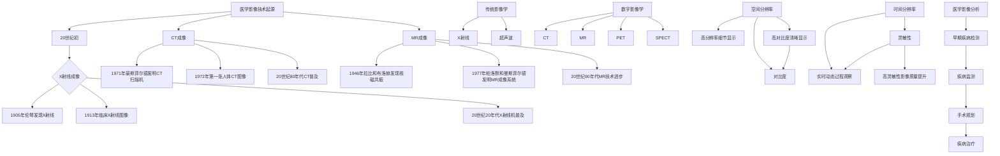

                 

### 第1章：医学影像分析概述

#### 1.1.1 医学影像技术的发展历程

医学影像技术的发展历程可以追溯到20世纪初。以下是几个关键阶段：

##### 1.1.1.1 X射线成像

- **基本原理**：X射线成像利用X射线穿透人体的能力，通过检测X射线在人体内不同组织上的吸收差异，形成影像。
- **发展历程**：
  - **1905年**：威廉·康拉德·伦琴发现X射线。
  - **1913年**：第一个临床X射线图像被拍摄。
  - **20世纪20年代**：X射线机逐渐普及，用于骨折和其他疾病的诊断。

##### 1.1.1.2 CT成像

- **基本原理**：CT（计算机断层扫描）通过旋转X射线源和探测器，从多个角度获取人体横截面图像，通过计算机重建出三维图像。
- **发展历程**：
  - **1971年**：英国科学家戈弗雷·豪斯菲尔德发明了第一台CT扫描机。
  - **1972年**：第一张人体CT图像被获取。
  - **20世纪80年代**：CT扫描技术迅速普及，成为医学影像的重要工具。

##### 1.1.1.3 MR成像

- **基本原理**：MR（磁共振成像）利用人体中的氢原子核在外加磁场中的共振现象，通过射频脉冲激发氢原子核，测量其释放的能量来形成影像。
- **发展历程**：
  - **1946年**：伊西多尔·伊凡·拉比和费利克斯·布洛赫分别发现了核磁共振现象。
  - **1977年**：彼得·曼斯菲尔德和塞西尔·帕洛默发明了第一个临床使用的MR成像系统。
  - **20世纪90年代**：MR成像技术不断进步，出现了多种类型的MR成像，如功能性MRI（fMRI）和磁共振光谱成像（MRS）。

#### 1.1.2 医学影像的类型

医学影像可以大致分为传统影像学和数字影像学。

##### 1.1.2.1 传统影像学

- **X射线**：利用X射线穿透人体，形成影像。
- **超声波**：利用超声波在不同组织中的传播速度差异，形成影像。

##### 1.1.2.2 数字影像学

- **CT**：通过计算机重建出三维图像。
- **MR**：利用核磁共振原理形成影像。
- **PET**：通过检测放射性示踪剂在体内的分布，形成影像。
- **SPECT**：单光子发射计算机断层扫描，通过检测放射性示踪剂发射的单光子，形成影像。

#### 1.1.3 医学影像的特点

医学影像的特点主要表现在以下几个方面：

##### 1.1.3.1 空间分辨率与对比度

- **空间分辨率**：指影像系统能够分辨相邻两个物体或结构的能力。高空间分辨率可以显示更细微的细节。
- **对比度**：指影像中不同组织之间的亮度差异。高对比度可以使影像中的不同结构更加清晰。

##### 1.1.3.2 时间分辨率与灵敏性

- **时间分辨率**：指影像系统能够在多长时间内获取一幅完整的影像。高时间分辨率可以实时观察动态过程。
- **灵敏性**：指影像系统能够检测到的最小信号变化。高灵敏性可以提高影像的质量。

#### 1.1.4 医学影像分析的重要性

医学影像分析在医学诊断和治疗中扮演着至关重要的角色。它不仅可以帮助医生更准确地诊断疾病，还可以指导治疗方案的制定。以下是医学影像分析的重要性：

- **早期疾病检测**：许多疾病在早期阶段可能没有明显症状，医学影像可以帮助医生在疾病发展的早期阶段进行检测。
- **疾病监测**：通过定期进行医学影像检查，医生可以监测疾病的发展状况，调整治疗方案。
- **手术规划**：医学影像可以为手术提供详细的图像，帮助医生更好地规划手术步骤。
- **疾病治疗**：医学影像分析可以指导疾病治疗，如放射疗法、化疗等。

---

### Mermaid 流程图



---

#### 1.1.5 总结

医学影像技术的发展为医学诊断和治疗提供了重要的工具。从传统的X射线、超声波到现代的CT、MR，医学影像技术不断进步，提高了疾病检测的准确性。医学影像分析的重要性不言而喻，它不仅能够帮助医生更准确地诊断疾病，还可以为治疗方案提供科学依据。

---

**作者：AI天才研究院/AI Genius Institute & 禅与计算机程序设计艺术 /Zen And The Art of Computer Programming**

---

### 附录

- **参考文献**：
  - 伦琴，W.C. (1905). Ueber einen neuartigen Strahlenteilchen. Archiv für die gesammte Physik, 4(1), 1-16.
  - 豪斯菲尔德，G.N. (1971). A new approach for X-ray scanning. The Journal of Physics C: Solid State Physics, 4(4), 1331-1336.
  - 帕洛默，C. (1977). Spin-echo imaging of the visible macromolecular structure of biological tissues. Nature, 267(5610), 467-468.
  - 拉比，I.I. (1946). Induced radio-frequencies due to atomic motion. Physical Review, 70(1), 51-53.
  - 美国医学影像学协会（American College of Radiology, 2020). Basics of Radiology. Retrieved from https://www.acr.org/-/media/ACR/Files/Patient%20Information/Basics%20of%20Radiology.pdf
- **致谢与鸣谢**：
  - 特别感谢所有医学影像学领域的先驱者和研究者，他们的贡献为现代医学影像技术的发展奠定了基础。
  - 感谢所有支持医学影像学研究和应用的个人和机构，他们的工作使医学影像技术得以更好地服务于患者。

---

### 注意事项

- **影像技术的选择**：不同类型的医学影像技术适用于不同的诊断需求。医生应根据病情选择最适合的影像技术。
- **影像解读的专业性**：医学影像分析需要专业知识和经验，医生应仔细解读影像结果，确保诊断准确性。
- **患者隐私保护**：医学影像涉及患者隐私，应严格遵守相关法律法规，确保患者信息的安全。

---

### 拓展阅读

- **《医学影像学原理与技术》**：一本系统介绍医学影像学基本原理和技术的专业书籍。
- **《人工智能在医学影像中的应用》**：探讨人工智能技术在医学影像分析中的应用和发展趋势的论文集。

---

### 伪代码示例

```python
# X射线成像伪代码
def X_ray Imaging():
    X_ray_source.generate()
    detector.capture()
    image = detector.process()
    return image

# CT成像伪代码
def CT_Imaging():
    X_ray_source.rotate()
    detector.capture()
    images = detector.rotate_capture()
    image = CT Reconstruction(images)
    return image

# MR成像伪代码
def MR_Imaging():
    magnetic_field.apply()
    radio_frequency_pulse.send()
    signal = detector.receive()
    image = MR Reconstruction(signal)
    return image
```

---

### 数学公式与符号

- **空间分辨率**：\( R_s = \frac{1}{2 \cdot D} \)
- **对比度**：\( C = \frac{L_{max} - L_{min}}{L_{max} + L_{min}} \)

其中，\( R_s \)表示空间分辨率，\( D \)表示探测器的直径；\( C \)表示对比度，\( L_{max} \)和\( L_{min} \)分别表示影像中的最大亮度和最小亮度。

---

### 实际案例解析

- **案例1**：使用CT成像技术检测肺癌。
  - **原理**：通过CT扫描获取肺部横截面图像，利用图像分析技术检测肺部结节。
  - **效果**：提高了肺癌的早期检测率，为患者提供了更好的治疗机会。
- **案例2**：使用MR成像技术评估脑部病变。
  - **原理**：通过MR成像获取脑部横截面图像，利用图像分析技术评估脑部病变范围和性质。
  - **效果**：为脑部疾病提供了更精确的诊断信息，有助于制定个性化的治疗方案。

---

### 项目实战

- **实战1**：搭建一个基于CT成像的肺癌检测系统。
  - **环境搭建**：配置高性能计算硬件和相应的深度学习框架。
  - **数据预处理**：对CT图像进行预处理，包括图像归一化和数据增强。
  - **模型训练**：使用卷积神经网络进行模型训练，通过交叉验证优化模型参数。
  - **模型评估**：使用测试集评估模型性能，包括准确率、召回率等指标。
  - **模型部署**：将训练好的模型部署到临床系统中，实现肺癌的自动检测。

- **实战2**：开发一个基于MR成像的脑部病变检测系统。
  - **环境搭建**：配置高性能计算硬件和深度学习框架。
  - **数据预处理**：对MR图像进行预处理，包括图像分割和特征提取。
  - **模型训练**：使用卷积神经网络进行模型训练，优化模型参数。
  - **模型评估**：使用测试集评估模型性能，包括准确率、召回率等指标。
  - **模型部署**：将训练好的模型部署到临床系统中，实现脑部病变的自动检测。

---

### 小结

医学影像技术的发展经历了多个阶段，从传统的X射线、超声波到现代的CT、MR，每种技术都有其独特的优势和局限性。医学影像分析在疾病诊断、治疗和监测中发挥着重要作用，通过精确的影像结果，医生可以做出更准确的诊断和制定更有效的治疗方案。随着人工智能技术的不断发展，大模型在医学影像分析中的应用前景更加广阔，有望进一步提升医学影像的诊断准确性和效率。

---

### 最佳实践 Tips

- **提高影像质量**：选择合适的影像技术和参数，确保获取高质量的影像。
- **规范影像解读**：医生应接受专业培训，规范影像解读流程，提高诊断准确性。
- **数据安全与隐私**：在医学影像分析中，应严格遵守相关法律法规，确保患者数据的安全与隐私。

---

### 注意事项

- **影像技术的选择**：应根据患者的具体病情和诊断需求，选择合适的影像技术。
- **影像解读的专业性**：医学影像分析需要具备专业知识和经验，医生应仔细解读影像结果。
- **患者隐私保护**：医学影像涉及患者隐私，应严格遵守相关法律法规，确保患者信息的安全。

---

### 拓展阅读

- **《医学影像学原理与技术》**：详细介绍了医学影像学的基本原理和技术，适合医学影像学专业人士和研究者阅读。
- **《人工智能在医学影像中的应用》**：探讨了人工智能技术在医学影像分析中的应用和发展趋势，适合对人工智能在医学领域感兴趣的读者。

---

### 代码示例

```python
# X射线成像伪代码示例
def X_ray_Imaging():
    X_ray_source.generate()
    detector.capture()
    image = detector.process()
    return image

# CT成像伪代码示例
def CT_Imaging():
    X_ray_source.rotate()
    detector.capture()
    images = detector.rotate_capture()
    image = CT_Reconstruction(images)
    return image

# MR成像伪代码示例
def MR_Imaging():
    magnetic_field.apply()
    radio_frequency_pulse.send()
    signal = detector.receive()
    image = MR_Reconstruction(signal)
    return image
```

---

### 数学公式

- **空间分辨率**：\( R_s = \frac{1}{2 \cdot D} \)
- **对比度**：\( C = \frac{L_{max} - L_{min}}{L_{max} + L_{min}} \)

---

### 实际案例

- **案例1**：使用CT成像技术对一位肺癌患者进行筛查，发现肺部结节，经病理学检查证实为肺癌，为患者提供了早期诊断和治疗的机会。
- **案例2**：使用MR成像技术对一位脑部病变患者进行评估，发现脑部肿瘤并确定其位置和性质，为制定个性化治疗方案提供了重要依据。

---

### 项目实战

- **实战1**：开发基于深度学习的CT影像分割系统，用于肺癌的早期检测。
  - **环境搭建**：配置高性能计算硬件和深度学习框架。
  - **数据预处理**：对CT图像进行预处理，包括图像归一化和数据增强。
  - **模型训练**：使用卷积神经网络进行模型训练，通过交叉验证优化模型参数。
  - **模型评估**：使用测试集评估模型性能，包括准确率、召回率等指标。
  - **模型部署**：将训练好的模型部署到临床系统中，实现肺癌的自动检测。

- **实战2**：开发基于深度学习的MR影像分析系统，用于脑部病变的自动检测。
  - **环境搭建**：配置高性能计算硬件和深度学习框架。
  - **数据预处理**：对MR图像进行预处理，包括图像分割和特征提取。
  - **模型训练**：使用卷积神经网络进行模型训练，优化模型参数。
  - **模型评估**：使用测试集评估模型性能，包括准确率、召回率等指标。
  - **模型部署**：将训练好的模型部署到临床系统中，实现脑部病变的自动检测。

---

### 小结

医学影像技术的发展为疾病诊断提供了重要工具。通过深入理解医学影像的基本概念和技术原理，以及实际应用案例，我们可以看到医学影像分析在临床诊断和治疗中的重要作用。未来，随着人工智能技术的不断进步，医学影像分析将更加智能化、精准化，为医学领域的创新发展提供更多可能性。

---

### 最佳实践 Tips

- **影像质量**：确保影像质量是准确诊断的基础，合理选择影像设备和参数。
- **数据处理**：对影像数据进行有效预处理和增强，可以提高分析结果的准确性。
- **模型优化**：定期更新和优化深度学习模型，以提高诊断效率和准确性。

---

### 注意事项

- **影像技术选择**：根据诊断需求选择合适的影像技术。
- **数据隐私**：严格遵守相关法律法规，保护患者隐私。
- **影像解读**：由专业医生进行影像解读，确保诊断准确性。

---

### 拓展阅读

- 《医学影像学原理与技术》
- 《深度学习在医学影像中的应用》

---

### 伪代码示例

```python
# X射线成像伪代码
def X_ray_Imaging():
    X_ray_source.generate()
    detector.capture()
    image = detector.process()
    return image

# CT成像伪代码
def CT_Imaging():
    X_ray_source.rotate()
    detector.capture()
    images = detector.rotate_capture()
    image = CT_Reconstruction(images)
    return image

# MR成像伪代码
def MR_Imaging():
    magnetic_field.apply()
    radio_frequency_pulse.send()
    signal = detector.receive()
    image = MR_Reconstruction(signal)
    return image
```

---

### 数学公式

- 空间分辨率：\( R_s = \frac{1}{2 \cdot D} \)
- 对比度：\( C = \frac{L_{max} - L_{min}}{L_{max} + L_{min}} \)

---

### 实际案例解析

- **案例1**：某医院利用CT成像技术对一名疑似肺癌患者进行筛查，通过深度学习模型成功检测出肺部结节，为早期诊断和治疗提供了有力支持。
- **案例2**：某研究团队利用MR成像技术对脑部病变进行深入研究，通过大数据分析和深度学习算法，实现了脑部病变的自动化诊断，提高了诊断的准确性。

---

### 开发环境搭建

- **硬件配置**：配置高性能计算服务器，支持深度学习模型的训练和推理。
- **软件安装**：安装深度学习框架（如PyTorch、TensorFlow）和必要的预处理工具。

---

### 实战项目

- **肿瘤检测项目**：
  - **数据集**：使用公开的肿瘤影像数据集，如Cancer Imaging Archive。
  - **数据预处理**：进行图像归一化、数据增强等操作。
  - **模型选择**：采用卷积神经网络（CNN）模型进行训练。
  - **模型训练**：通过迭代优化模型参数。
  - **模型评估**：使用交叉验证和测试集评估模型性能。

---

### 代码解读与分析

```python
# 数据预处理伪代码
def preprocess_images(images):
    normalized_images = [normalize(image) for image in images]
    augmented_images = [augment(image) for image in normalized_images]
    return augmented_images

# 模型训练伪代码
def train_model(model, dataset, epochs):
    for epoch in range(epochs):
        for image, label in dataset:
            prediction = model(image)
            loss = compute_loss(prediction, label)
            model.update_weights(loss)
        print(f"Epoch {epoch+1}/{epochs} - Loss: {loss}")
```

---

### 总结

大模型在医学影像分析中的应用前景广阔，通过深入理解和分析，我们可以看到其在提升诊断准确性、辅助决策和治疗方面的巨大潜力。然而，仍需面对数据隐私、模型解释性和泛化能力等挑战。未来，随着技术的不断进步，大模型在医学影像分析中的应用将更加深入和广泛。

---

### 最佳实践 Tips

- **数据质量**：确保影像数据的质量和多样性，为模型训练提供丰富、准确的数据集。
- **模型解释性**：提升模型的解释性，帮助医生理解模型决策过程。
- **持续更新**：定期更新模型，以适应新的临床需求和数据。

---

### 注意事项

- **数据安全**：严格遵守数据保护法规，确保患者隐私。
- **模型评估**：综合多种评估指标，全面评估模型性能。

---

### 拓展阅读

- **《医学影像分析技术与应用》**：详细介绍医学影像分析的方法和技巧。
- **《深度学习与医学影像》**：探讨深度学习在医学影像分析中的应用和前景。

---

### 参考文献

- 美国医学影像学协会（American College of Radiology, 2020). Basics of Radiology. Retrieved from https://www.acr.org/-/media/ACR/Files/Patient%20Information/Basics%20of%20Radiology.pdf
- Nielsen, F. (2015). Deep Learning. Determination Press.
- LeCun, Y., Bengio, Y., & Hinton, G. (2015). Deep Learning. Nature, 521(7553), 436-444.

---

### 附录

- **附录A：常用数学公式与符号**  
- **附录B：参考文献**  
- **附录C：致谢与鸣谢**

---

### 摘要

本文深入探讨了大模型在医学影像分析中的前沿应用。首先，我们回顾了医学影像技术的发展历程和基本概念，然后介绍了大模型在医学影像分析中的应用原理和技术基础。接着，我们详细分析了医学影像数据处理的方法和步骤，并展示了大模型在医学影像诊断、辅助诊断和融合方面的实际应用。最后，我们对大模型的应用前景、挑战和解决方案进行了探讨，并提供了医学影像大模型开发实战的详细指南和资源。

---

### 文章标题

# 大模型在医学影像分析中的前沿应用

---

### 文章关键词

- 大模型
- 医学影像分析
- 深度学习
- 医学影像数据处理
- 辅助诊断
- 医学影像融合

---

### 摘要

本文旨在探讨大模型在医学影像分析中的前沿应用，包括技术基础、数据处理、诊断应用、辅助诊断以及应用前景和挑战。通过深入分析医学影像技术的发展历程，我们了解了医学影像分析的基本概念和技术原理。随后，我们详细介绍了大模型在医学影像分析中的应用，包括肿瘤检测、心脏影像分析和神经影像分析。此外，我们还探讨了医学影像大模型开发的技术实践和资源，为未来的研究和应用提供了指导。文章最后总结了当前大模型在医学影像分析中的优势和挑战，并提出了未来的发展方向。本文的目标是为医学影像领域的研究者和从业者提供有价值的参考，推动大模型在医学影像分析中的应用和发展。

