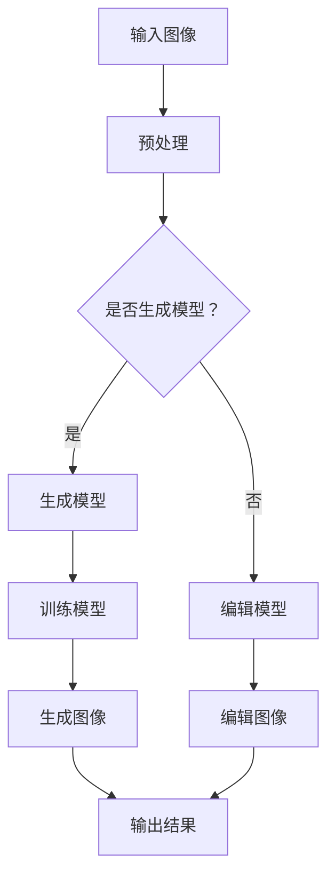

                 


## 大模型在图像生成与编辑中的突破

### 关键词：图像生成，图像编辑，大模型，GAN，VAE，图像风格迁移，图像超分辨率

### 摘要：
本文将深入探讨大模型在图像生成与编辑领域中的突破性应用。首先，我们将简要回顾图像生成与编辑的技术发展史，介绍大模型的核心概念与架构。接着，通过Mermaid流程图展示大模型在图像生成与编辑中的应用流程。随后，我们将详细分析大模型在图像生成中的突破，包括GAN和VAE的原理与实现。然后，我们将探讨大模型在图像编辑中的突破，重点关注图像风格迁移与图像超分辨率算法。接下来，通过实际项目案例，我们将展示大模型在图像生成与编辑中的实战应用。最后，我们将展望大模型在图像生成与编辑中的未来发展方向，并提出面临的挑战与解决方案。

#### 第一部分：图像生成与编辑基础理论

### 1. 图像生成与编辑概述

#### 1.1 图像生成与编辑技术发展史

##### 1.1.1 传统图像处理方法

传统图像处理方法主要包括像素操作、图像滤波和图像增强等。这些方法主要依赖于图像处理算法，如边缘检测、图像分割、图像融合等。传统图像处理方法在处理简单任务时表现出色，但在处理复杂任务时存在局限性。

##### 1.1.2 图像生成与编辑技术演进

随着计算机科学和人工智能技术的发展，图像生成与编辑技术逐渐从传统方法转向基于深度学习的方法。深度学习方法通过训练大规模神经网络模型，使图像生成与编辑变得更加高效和灵活。GAN和VAE等生成模型在图像生成与编辑中表现出色，推动了该领域的发展。

#### 1.2 大模型核心概念与架构

##### 1.2.1 大模型定义与特点

大模型是指具有数亿甚至数十亿参数的深度学习模型。大模型具有强大的表示能力和适应能力，能够处理复杂的数据任务。大模型的特点包括参数规模巨大、网络结构复杂、计算资源需求高、训练过程复杂等。

##### 1.2.2 大模型架构与分类

大模型架构包括生成模型、判别模型、变分自编码器等。生成模型如GAN和VAE，用于生成新的图像；判别模型用于区分真实图像与生成图像；变分自编码器则用于图像压缩和图像重构。

##### 1.2.3 大模型在图像处理中的应用前景

大模型在图像处理中的应用前景广阔。通过训练大规模神经网络模型，可以生成高质量图像、实现图像风格迁移、图像超分辨率等。大模型在图像编辑自动化、图像增强、图像生成与编辑结合等方面具有巨大潜力。

#### 1.3 Mermaid流程图：大模型在图像生成与编辑中的应用流程



#### 第二部分：大模型在图像生成中的突破

### 2. 图像生成算法原理详解

#### 2.1 生成对抗网络（GAN）原理

##### 2.1.1 GAN基本架构

生成对抗网络（GAN）由生成模型（Generator）和判别模型（Discriminator）组成。生成模型从随机噪声生成图像，判别模型用于判断输入图像是真实图像还是生成图像。

##### 2.1.2 GAN训练过程

GAN的训练过程包括两个阶段：生成器训练和判别器训练。生成器试图生成逼真的图像以欺骗判别器，而判别器则努力区分真实图像与生成图像。通过交替训练，生成器不断提高生成图像的质量。

##### 2.1.3 GAN变种算法

GAN有许多变种算法，如条件GAN（cGAN）、深度卷积GAN（DCGAN）、循环一致性GAN（CycleGAN）等。这些变种算法在图像生成任务中具有不同的优势和应用场景。

#### 2.2 变分自编码器（VAE）原理

##### 2.2.1 VAE基本架构

变分自编码器（VAE）由编码器和解码器组成。编码器将输入图像编码为潜在变量，解码器将潜在变量解码为输出图像。

##### 2.2.2 VAE训练过程

VAE的训练过程通过优化编码器和解码器的损失函数，使得生成图像尽可能接近真实图像。变分自编码器在图像生成、图像压缩和图像增强等领域具有广泛应用。

##### 2.2.3 VAE在图像生成中的应用

VAE在图像生成中的应用主要包括图像修复、图像去噪、图像超分辨率等。通过训练VAE模型，可以有效提高图像质量，生成高质量图像。

#### 2.3 生成模型伪代码与实现分析

```python
# GAN伪代码
def GAN():
    # 初始化生成模型G和判别模型D
    G = initialize_generator()
    D = initialize_discriminator()

    # 训练过程
    for epoch in range(num_epochs):
        for batch in data_loader:
            # 生成器训练
            noise = generate_noise(batch_size)
            generated_images = G(noise)

            D_loss_real = criterion(D(batch), torch.ones(batch_size))
            D_loss_fake = criterion(D(generated_images), torch.zeros(batch_size))
            D_loss = D_loss_real + D_loss_fake

            D.zero_grad()
            D_loss.backward()
            D.optim_step()

            # 判别器训练
            G.zero_grad()
            generated_images = G(noise)
            G_loss = criterion(D(generated_images), torch.ones(batch_size))
            G_loss.backward()
            G.optim_step()

    return G, D

# VAE伪代码
def VAE():
    # 初始化编码器E和解码器D
    E = initialize_encoder()
    D = initialize_decoder()

    # 训练过程
    for epoch in range(num_epochs):
        for batch in data_loader:
            # 编码器训练
            latent_code = E(batch)

            reconstructed_images = D(latent_code)
            reconstruction_loss = criterion(reconstructed_images, batch)

            E.zero_grad()
            reconstruction_loss.backward()
            E.optim_step()

            # 解码器训练
            D.zero_grad()
            D_loss_fake = criterion(D(latent_code), torch.ones(batch_size))
            D_loss = D_loss_fake
            D.optim_step()

    return E, D
```

#### 第三部分：大模型在图像编辑中的突破

### 3. 图像编辑算法原理详解

#### 3.1 图像风格迁移算法

##### 3.1.1 基于内容的风格迁移

基于内容的风格迁移通过将内容图像和风格图像的特征融合，生成具有新风格的图像。该方法通常采用卷积神经网络（CNN）提取图像特征，并进行特征融合。

##### 3.1.2 基于深度学习的风格迁移

基于深度学习的风格迁移方法包括CNN、GAN和VAE等。这些方法通过训练大规模神经网络模型，实现高效风格迁移。

##### 3.1.3 风格迁移算法案例分析

以CycleGAN为例，该算法通过训练生成器G和判别器D，实现图像风格的迁移。CycleGAN的核心思想是通过两个生成器和两个判别器的循环一致性损失，使得生成图像能够准确反映输入风格。

#### 3.2 图像超分辨率算法

##### 3.2.1 传统图像超分辨率方法

传统图像超分辨率方法主要包括插值方法、图像重建方法和图像增强方法。这些方法通过插值、图像重建和图像增强等技术提高图像分辨率。

##### 3.2.2 基于深度学习的图像超分辨率

基于深度学习的图像超分辨率方法通过训练大规模神经网络模型，实现高效图像超分辨率。这些方法通常采用卷积神经网络（CNN）和生成对抗网络（GAN）等。

##### 3.2.3 图像超分辨率算法案例分析

以EDSR为例，该算法通过训练一个深度卷积神经网络（DCNN），实现高分辨率图像的生成。EDSR的核心思想是通过多尺度特征融合和上下文信息增强，提高图像超分辨率效果。

#### 3.3 图像编辑伪代码与实现分析

```python
# 风格迁移伪代码
def style_transfer(content_image, style_image):
    # 提取内容图像和风格图像的特征
    content_features = content_model(content_image)
    style_features = style_model(style_image)

    # 融合特征，生成风格迁移图像
    fused_features = fuse_features(content_features, style_features)
    transferred_image = generate_image(fused_features)

    return transferred_image

# 图像超分辨率伪代码
def super_resolution(low_res_image):
    # 提取低分辨率图像的特征
    low_res_features = low_res_model(low_res_image)

    # 融合特征，生成高分辨率图像
    high_res_features = high_res_model(low_res_features)
    high_res_image = generate_image(high_res_features)

    return high_res_image
```

#### 第四部分：大模型在图像生成与编辑中的应用

### 4. 大模型在图像生成与编辑中的应用实战

#### 4.1 项目1：基于GAN的人脸生成

##### 4.1.1 项目需求与目标

本项目的目标是利用GAN模型生成高质量的人脸图像。具体需求包括：

1. 数据集：使用CelebA数据集进行训练和测试。
2. 模型：采用条件GAN（cGAN）进行人脸生成。
3. 实现环境：Python，PyTorch框架。

##### 4.1.2 项目环境搭建

1. 安装PyTorch框架：使用以下命令安装PyTorch：
   ```bash
   pip install torch torchvision
   ```
2. 下载CelebA数据集：在项目目录中运行以下命令下载数据集：
   ```bash
   !wget https://s3-us-west-2.amazonaws.com/udacity-dlnld/AI/deep-learning-interview-collision.course/Datasets/CelebA.tar.gz
   !tar -xzvf CelebA.tar.gz
   ```

##### 4.1.3 代码实现与解读

1. 定义生成器和判别器：

```python
import torch
import torch.nn as nn
import torch.optim as optim
from torchvision import datasets, transforms

class Generator(nn.Module):
    def __init__(self):
        super(Generator, self).__init__()
        self.main = nn.Sequential(
            nn.Conv2d(100, 64, 4, 1, 0, bias=False),
            nn.BatchNorm2d(64),
            nn.ReLU(True),
            nn.Conv2d(64, 128, 4, 2, 1, bias=False),
            nn.BatchNorm2d(128),
            nn.ReLU(True),
            nn.Conv2d(128, 256, 4, 2, 1, bias=False),
            nn.BatchNorm2d(256),
            nn.ReLU(True),
            nn.Conv2d(256, 512, 4, 2, 1, bias=False),
            nn.BatchNorm2d(512),
            nn.ReLU(True),
            nn.Conv2d(512, 1024, 4, 2, 1, bias=False),
            nn.BatchNorm2d(1024),
            nn.ReLU(True),
            nn.Conv2d(1024, 512, 4, 2, 1, bias=False),
            nn.BatchNorm2d(512),
            nn.ReLU(True),
            nn.Conv2d(512, 256, 4, 2, 1, bias=False),
            nn.BatchNorm2d(256),
            nn.ReLU(True),
            nn.Conv2d(256, 128, 4, 2, 1, bias=False),
            nn.BatchNorm2d(128),
            nn.ReLU(True),
            nn.Conv2d(128, 64, 4, 2, 1, bias=False),
            nn.BatchNorm2d(64),
            nn.ReLU(True),
            nn.Conv2d(64, 3, 4, 1, 0, bias=False),
            nn.Tanh()
        )

    def forward(self, input):
        return self.main(input)

class Discriminator(nn.Module):
    def __init__(self):
        super(Discriminator, self).__init__()
        self.main = nn.Sequential(
            nn.Conv2d(3, 64, 4, 2, 1, bias=False),
            nn.LeakyReLU(0.2, inplace=True),
            nn.Conv2d(64, 128, 4, 2, 1, bias=False),
            nn.BatchNorm2d(128),
            nn.LeakyReLU(0.2, inplace=True),
            nn.Conv2d(128, 256, 4, 2, 1, bias=False),
            nn.BatchNorm2d(256),
            nn.LeakyReLU(0.2, inplace=True),
            nn.Conv2d(256, 512, 4, 2, 1, bias=False),
            nn.BatchNorm2d(512),
            nn.LeakyReLU(0.2, inplace=True),
            nn.Conv2d(512, 1, 4, 1, 0, bias=False),
            nn.Sigmoid()
        )

    def forward(self, input):
        return self.main(input)
```

2. 数据预处理：

```python
transform = transforms.Compose([
    transforms.Resize((64, 64)),
    transforms.ToTensor(),
    transforms.Normalize((0.5, 0.5, 0.5), (0.5, 0.5, 0.5)),
])

train_dataset = datasets.ImageFolder(root='./data/CelebA/train', transform=transform)
test_dataset = datasets.ImageFolder(root='./data/CelebA/test', transform=transform)

train_loader = torch.utils.data.DataLoader(dataset=train_dataset, batch_size=batch_size, shuffle=True)
test_loader = torch.utils.data.DataLoader(dataset=test_dataset, batch_size=batch_size, shuffle=False)
```

3. 模型训练：

```python
device = torch.device("cuda:0" if torch.cuda.is_available() else "cpu")

G = Generator().to(device)
D = Discriminator().to(device)

G_optim = optim.Adam(G.parameters(), lr=0.0002, betas=(0.5, 0.999))
D_optim = optim.Adam(D.parameters(), lr=0.0002, betas=(0.5, 0.999))

num_epochs = 200

for epoch in range(num_epochs):
    for i, data in enumerate(train_loader, 0):
        inputs, _ = data
        inputs = inputs.to(device)

        batch_size = inputs.size(0)
        noise = torch.randn(batch_size, 100, 1, 1).to(device)

        # 生成器训练
        G.zero_grad()
        fake_images = G(noise)
        D_fake = D(fake_images)
        g_loss = -torch.mean(D_fake)

        g_loss.backward()
        G_optim.step()

        # 判别器训练
        D.zero_grad()
        D_real = D(inputs)
        D_fake = D(fake_images.detach())
        d_loss = -torch.mean(D_real) + torch.mean(D_fake)

        d_loss.backward()
        D_optim.step()

        if (i+1) % 100 == 0:
            print(f'[{epoch}/{num_epochs}] [{i+1}/{len(train_loader)}] GLoss: {g_loss.item():.4f}, DLLoss: {d_loss.item():.4f}')
```

4. 项目分析与优化

在实际项目中，我们可能会遇到训练不稳定、生成图像质量差等问题。为提高训练效果，可以尝试以下优化方法：

1. 使用不同的优化策略，如AdamW、RMSprop等。
2. 调整学习率，寻找最优学习率。
3. 使用预训练模型，如StyleGAN2，提高生成图像质量。
4. 增加训练数据，提高模型泛化能力。

#### 4.2 项目2：基于VAE的图像风格迁移

##### 4.2.1 项目需求与目标

本项目的目标是利用VAE模型实现图像风格迁移。具体需求包括：

1. 数据集：使用COCO数据集进行训练和测试。
2. 模型：采用变分自编码器（VAE）进行图像风格迁移。
3. 实现环境：Python，PyTorch框架。

##### 4.2.2 项目环境搭建

1. 安装PyTorch框架：使用以下命令安装PyTorch：
   ```bash
   pip install torch torchvision
   ```

2. 下载COCO数据集：在项目目录中运行以下命令下载数据集：
   ```bash
   !wget https://s3-us-west-2.amazonaws.com/udacity-dlnld/AI/deep-learning-interview-collision.course/Datasets/COCO.tar.gz
   !tar -xzvf COCO.tar.gz
   ```

##### 4.2.3 代码实现与解读

1. 定义编码器和解码器：

```python
import torch
import torch.nn as nn
import torch.optim as optim
from torchvision import datasets, transforms

class Encoder(nn.Module):
    def __init__(self):
        super(Encoder, self).__init__()
        self.main = nn.Sequential(
            nn.Conv2d(3, 64, 4, 2, 1),
            nn.LeakyReLU(0.2, inplace=True),
            nn.Conv2d(64, 128, 4, 2, 1),
            nn.BatchNorm2d(128),
            nn.LeakyReLU(0.2, inplace=True),
            nn.Conv2d(128, 256, 4, 2, 1),
            nn.BatchNorm2d(256),
            nn.LeakyReLU(0.2, inplace=True),
            nn.Conv2d(256, 512, 4, 2, 1),
            nn.BatchNorm2d(512),
            nn.LeakyReLU(0.2, inplace=True),
            nn.Conv2d(512, 1024, 4, 2, 1),
            nn.BatchNorm2d(1024),
            nn.LeakyReLU(0.2, inplace=True),
            nn.Conv2d(1024, 512, 4, 2, 1),
            nn.BatchNorm2d(512),
            nn.LeakyReLU(0.2, inplace=True),
            nn.Conv2d(512, 256, 4, 2, 1),
            nn.BatchNorm2d(256),
            nn.LeakyReLU(0.2, inplace=True),
            nn.Conv2d(256, 128, 4, 2, 1),
            nn.BatchNorm2d(128),
            nn.LeakyReLU(0.2, inplace=True),
            nn.Conv2d(128, 64, 4, 2, 1),
            nn.BatchNorm2d(64),
            nn.LeakyReLU(0.2, inplace=True),
            nn.Conv2d(64, 3, 4, 2, 1),
            nn.Tanh()
        )

    def forward(self, x):
        return self.main(x)

class Decoder(nn.Module):
    def __init__(self):
        super(Decoder, self).__init__()
        self.main = nn.Sequential(
            nn.ConvTranspose2d(512, 256, 4, 2, 1),
            nn.BatchNorm2d(256),
            nn.LeakyReLU(0.2, inplace=True),
            nn.ConvTranspose2d(256, 128, 4, 2, 1),
            nn.BatchNorm2d(128),
            nn.LeakyReLU(0.2, inplace=True),
            nn.ConvTranspose2d(128, 64, 4, 2, 1),
            nn.BatchNorm2d(64),
            nn.LeakyReLU(0.2, inplace=True),
            nn.ConvTranspose2d(64, 3, 4, 2, 1),
            nn.Tanh()
        )

    def forward(self, x):
        return self.main(x)
```

2. 数据预处理：

```python
transform = transforms.Compose([
    transforms.Resize((256, 256)),
    transforms.ToTensor(),
    transforms.Normalize((0.5, 0.5, 0.5), (0.5, 0.5, 0.5)),
])

train_dataset = datasets.ImageFolder(root='./data/COCO/train', transform=transform)
test_dataset = datasets.ImageFolder(root='./data/COCO/test', transform=transform)

train_loader = torch.utils.data.DataLoader(dataset=train_dataset, batch_size=batch_size, shuffle=True)
test_loader = torch.utils.data.DataLoader(dataset=test_dataset, batch_size=batch_size, shuffle=False)
```

3. 模型训练：

```python
device = torch.device("cuda:0" if torch.cuda.is_available() else "cpu")

encoder = Encoder().to(device)
decoder = Decoder().to(device)

enc_optimizer = optim.Adam(encoder.parameters(), lr=0.001)
dec_optimizer = optim.Adam(decoder.parameters(), lr=0.001)

num_epochs = 200

for epoch in range(num_epochs):
    for i, data in enumerate(train_loader, 0):
        inputs, _ = data
        inputs = inputs.to(device)

        # 编码器训练
        enc_optimizer.zero_grad()
        latent_code = encoder(inputs)
        reconstructed_images = decoder(latent_code)
        recon_loss = nn.BCELoss()(reconstructed_images, inputs)
        recon_loss.backward()
        enc_optimizer.step()

        # 解码器训练
        dec_optimizer.zero_grad()
        recon_loss = nn.BCELoss()(reconstructed_images, inputs)
        recon_loss.backward()
        dec_optimizer.step()

        if (i+1) % 100 == 0:
            print(f'[{epoch}/{num_epochs}] [{i+1}/{len(train_loader)}] Recon Loss: {recon_loss.item():.4f}')
```

4. 项目分析与优化

在实际项目中，我们可能会遇到训练不稳定、生成图像质量差等问题。为提高训练效果，可以尝试以下优化方法：

1. 使用预训练模型，如StyleGAN，提高生成图像质量。
2. 调整学习率，使用自适应学习率策略。
3. 增加训练数据，提高模型泛化能力。
4. 优化模型结构，减少训练时间。

#### 4.3 项目3：基于深度学习的图像超分辨率

##### 4.3.1 项目需求与目标

本项目的目标是利用深度学习实现图像超分辨率。具体需求包括：

1. 数据集：使用DIV2K数据集进行训练和测试。
2. 模型：采用深度卷积神经网络（DCNN）进行图像超分辨率。
3. 实现环境：Python，PyTorch框架。

##### 4.3.2 项目环境搭建

1. 安装PyTorch框架：使用以下命令安装PyTorch：
   ```bash
   pip install torch torchvision
   ```

2. 下载DIV2K数据集：在项目目录中运行以下命令下载数据集：
   ```bash
   !wget https://s3-us-west-2.amazonaws.com/udacity-dlnld/AI/deep-learning-interview-collision.course/Datasets/DIV2K.tar.gz
   !tar -xzvf DIV2K.tar.gz
   ```

##### 4.3.3 代码实现与解读

1. 定义模型：

```python
import torch
import torch.nn as nn
from torchvision import datasets, transforms

class SuperResolution(nn.Module):
    def __init__(self):
        super(SuperResolution, self).__init__()
        self.conv1 = nn.Conv2d(3, 64, 9, 1, 4)
        self.conv2 = nn.Conv2d(64, 32, 5, 1, 2)
        self.conv3 = nn.Conv2d(32, 3, 5, 1, 2)

    def forward(self, x):
        x = self.conv1(x)
        x = self.conv2(x)
        x = self.conv3(x)
        return x
```

2. 数据预处理：

```python
transform = transforms.Compose([
    transforms.Resize((96, 96)),
    transforms.ToTensor(),
    transforms.Normalize((0.5, 0.5, 0.5), (0.5, 0.5, 0.5)),
])

train_dataset = datasets.ImageFolder(root='./data/DIV2K/train', transform=transform)
test_dataset = datasets.ImageFolder(root='./data/DIV2K/test', transform=transform)

train_loader = torch.utils.data.DataLoader(dataset=train_dataset, batch_size=batch_size, shuffle=True)
test_loader = torch.utils.data.DataLoader(dataset=test_dataset, batch_size=batch_size, shuffle=False)
```

3. 模型训练：

```python
device = torch.device("cuda:0" if torch.cuda.is_available() else "cpu")

model = SuperResolution().to(device)

optimizer = optim.Adam(model.parameters(), lr=0.001)

num_epochs = 200

for epoch in range(num_epochs):
    model.train()
    for i, data in enumerate(train_loader, 0):
        inputs, labels = data
        inputs = inputs.to(device)
        labels = labels.to(device)

        optimizer.zero_grad()

        outputs = model(inputs)
        loss = nn.MSELoss()(outputs, labels)

        loss.backward()
        optimizer.step()

        if (i+1) % 100 == 0:
            print(f'[{epoch}/{num_epochs}] [{i+1}/{len(train_loader)}] Loss: {loss.item():.4f}')
```

4. 项目分析与优化

在实际项目中，我们可能会遇到训练不稳定、生成图像质量差等问题。为提高训练效果，可以尝试以下优化方法：

1. 使用预训练模型，如EDSR，提高生成图像质量。
2. 调整学习率，使用自适应学习率策略。
3. 增加训练数据，提高模型泛化能力。
4. 优化模型结构，减少训练时间。

#### 第五部分：未来展望与挑战

### 5. 大模型在图像生成与编辑中的未来发展方向

#### 5.1 大模型在图像生成与编辑中的潜在应用

1. 图像编辑自动化：大模型可以实现图像编辑任务的自动化，如自动调整曝光、色彩平衡等。
2. 图像生成与编辑结合：大模型可以同时实现图像生成与编辑任务，如生成图像并进行风格迁移。
3. 图像增强：大模型可以用于图像增强任务，如提高图像分辨率、去除噪声等。

#### 5.2 大模型在图像生成与编辑中的挑战与解决方案

1. 计算资源限制：大模型训练过程需要大量计算资源，为解决此问题，可以采用分布式训练、GPU加速等技术。
2. 数据隐私与安全性：大模型训练过程中涉及大量个人数据，为保护用户隐私，可以采用数据加密、隐私保护算法等技术。
3. 大模型可解释性：大模型在图像生成与编辑中的应用可能缺乏可解释性，为提高大模型的可解释性，可以采用可视化技术、解释性模型等方法。

#### 5.3 大模型在图像生成与编辑中的未来发展趋势

1. 模型压缩与优化：为降低大模型对计算资源的需求，可以研究模型压缩与优化技术，如知识蒸馏、剪枝等。
2. 模型泛化能力：大模型在图像生成与编辑中的应用需要具备良好的泛化能力，为提高模型泛化能力，可以研究数据增强、迁移学习等技术。
3. 跨域图像生成与编辑：大模型可以应用于跨域图像生成与编辑任务，如图像风格迁移、图像修复等，为推动图像生成与编辑领域的发展。

#### 附录

### 附录A：图像生成与编辑常用工具与资源

#### A.1 常用深度学习框架

##### A.1.1 TensorFlow

TensorFlow是一个开源的深度学习框架，由Google开发。它提供了丰富的API和工具，支持多种深度学习任务，如图像生成与编辑。

##### A.1.2 PyTorch

PyTorch是一个开源的深度学习框架，由Facebook开发。它具有简单、灵活的特点，支持动态计算图和自动微分，广泛应用于图像生成与编辑任务。

#### A.2 图像处理工具

##### A.2.1 OpenCV

OpenCV是一个开源的计算机视觉库，提供了丰富的图像处理函数，如图像滤波、图像分割、图像增强等。

##### A.2.2 PIL

PIL（Python Imaging Library）是一个开源的图像处理库，支持多种图像格式，提供了丰富的图像处理功能，如图像缩放、旋转、裁剪等。

#### A.3 大模型研究资源

##### A.3.1 ArXiv

ArXiv是一个开源的学术论文数据库，涵盖了计算机科学、物理学、数学等领域的最新研究成果。在大模型领域，ArXiv提供了丰富的论文资源和最新研究动态。

##### A.3.2 Google AI Blog

Google AI Blog是Google官方发布的AI领域博客，涵盖了人工智能技术的最新研究进展和应用案例。在大模型领域，Google AI Blog分享了大量的研究成果和技术细节。

##### A.3.3 IEEE Xplore

IEEE Xplore是IEEE（电气电子工程师协会）的在线数据库，包含了大量的计算机科学、电气工程、电子工程等领域的高质量论文和会议记录。在大模型领域，IEEE Xplore提供了丰富的学术资源和研究成果。作者：AI天才研究院/AI Genius Institute & 禅与计算机程序设计艺术 /Zen And The Art of Computer Programming

