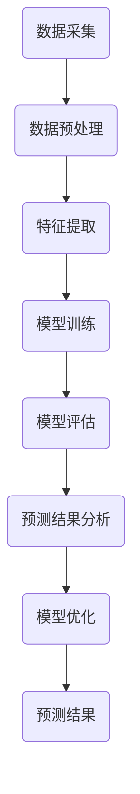

                 

### 文章标题

# 大模型在时间序列预测中的突破

> 关键词：大模型、时间序列预测、深度学习、金融、能源

> 摘要：本文将深入探讨大模型在时间序列预测领域的突破，从基础理论、核心概念、实际应用以及突破性案例等多个维度，全面解析大模型如何通过深度学习等方法，在金融、能源等领域的预测中发挥重要作用。文章旨在为读者提供全面、系统的理解和应用指南，助力读者在时间序列预测领域取得显著成效。

### 第一部分：大模型在时间序列预测中的基础理论

在探讨大模型在时间序列预测中的突破之前，我们首先需要理解时间序列预测的基本概念、方法和面临的挑战。

#### 第1章：时间序列预测概述

##### 1.1 时间序列预测的基本概念

时间序列预测是指利用历史时间序列数据，预测未来某一时间点的数值。时间序列数据具有以下基本特征：

- **时间依赖性**：时间序列中的每个数据点不仅与其当前时间点的数据相关，还与其历史数据相关。
- **趋势性**：数据点在时间轴上可能呈现增长、下降或平稳的趋势。
- **季节性**：数据点在一年内的某些时间段内可能呈现出周期性的波动。
- **非平稳性**：时间序列的数据特征可能随时间发生变化，呈现出非平稳性。

##### 1.2 时间序列预测的重要性

时间序列预测在许多领域具有重要应用，如金融、气象、医疗、物流等。其重要性主要体现在以下几个方面：

- **决策支持**：通过时间序列预测，可以为决策者提供未来的数据趋势和预测结果，支持决策制定。
- **风险管理**：在金融领域，时间序列预测可以帮助金融机构评估风险、制定投资策略。
- **资源优化**：在能源领域，时间序列预测可以帮助预测能源需求，优化资源配置。
- **供应链管理**：在物流领域，时间序列预测可以帮助预测运输需求，优化物流路线和库存管理。

##### 1.3 时间序列分析的方法

时间序列分析的方法主要分为以下几类：

- **统计方法**：如自回归模型（AR）、移动平均模型（MA）、自回归移动平均模型（ARMA）等。
- **经典机器学习方法**：如支持向量机（SVM）、决策树、随机森林等。
- **现代深度学习方法**：如循环神经网络（RNN）、长短时记忆网络（LSTM）、门控循环单元（GRU）等。

每种方法都有其适用范围和优缺点，在实际应用中需要根据具体问题选择合适的方法。

##### 1.4 时间序列预测中的常见问题

时间序列预测面临以下常见问题：

- **季节性**：如何准确捕捉季节性波动，提高预测准确性。
- **非平稳性**：如何处理非平稳时间序列数据，使其满足预测模型的要求。
- **趋势性**：如何处理趋势性数据，提取有用的特征。
- **噪声干扰**：如何去除噪声数据，提高预测模型的鲁棒性。

#### 第2章：时间序列预测的核心概念与联系

为了深入理解时间序列预测，我们需要掌握核心概念和联系，包括时间序列预测的原理、流程、数学模型以及深度学习模型。

##### 2.1 Mermaid 流程图：时间序列预测的原理与架构

以下是时间序列预测的Mermaid流程图：

- **数据采集**：收集历史时间序列数据。
- **数据预处理**：对数据清洗、归一化等操作。
- **特征提取**：提取时间序列特征，如趋势、季节性等。
- **模型训练**：使用训练数据训练预测模型。
- **模型评估**：评估模型的预测性能。
- **预测结果分析**：分析预测结果，调整模型参数。
- **模型优化**：优化模型，提高预测准确性。
- **预测结果**：输出预测结果。

##### 2.2 时间序列预测中的数学模型

时间序列预测中的数学模型主要包括以下几种：

- **自回归模型（AR）**：

  $$ y_t = c + \phi_1 y_{t-1} + \phi_2 y_{t-2} + ... + \phi_p y_{t-p} $$

  自回归模型通过历史值预测当前值，适用于平稳时间序列。

- **移动平均模型（MA）**：

  $$ y_t = \theta_1 y_{t-1} + \theta_2 y_{t-2} + ... + \theta_q y_{t-q} + \varepsilon_t $$

  移动平均模型通过预测误差的移动平均来预测当前值，适用于非平稳时间序列。

- **自回归移动平均模型（ARMA）**：

  $$ y_t = c + \phi_1 y_{t-1} + ... + \phi_p y_{t-p} + \theta_1 \varepsilon_{t-1} + ... + \theta_q \varepsilon_{t-q} $$

  ARMA模型结合了自回归和移动平均模型，适用于平稳时间序列。

- **自回归积分滑动平均模型（ARIMA）**：

  $$ y_t = c + \phi_1 y_{t-1} + ... + \phi_p y_{t-p} + \theta_1 \varepsilon_{t-1} + ... + \theta_q \varepsilon_{t-q} + \varepsilon_t $$

  ARIMA模型适用于非平稳时间序列，通过差分处理消除趋势性和季节性。

##### 2.3 时间序列预测中的深度学习模型

深度学习模型在时间序列预测中表现出强大的能力，主要包括以下几种：

- **循环神经网络（RNN）**：

  RNN通过循环结构处理序列数据，适用于短期依赖关系。

- **长短时记忆网络（LSTM）**：

  LSTM是RNN的一种改进，能够处理长期依赖关系。

- **门控循环单元（GRU）**：

  GRU是LSTM的简化版本，具有更简洁的结构。

- **Transformer模型**：

  Transformer模型通过自注意力机制处理序列数据，具有强大的序列建模能力。

以上是时间序列预测的基础理论部分，接下来我们将探讨大模型在时间序列预测中的实际应用。

### 第二部分：大模型在时间序列预测中的实际应用

大模型在时间序列预测中的应用主要体现在其强大的数据处理能力和非线性建模能力。本部分将详细介绍大模型在时间序列预测中的原理、应用和项目实战。

#### 第3章：大模型在时间序列预测中的应用原理

##### 3.1 大模型在时间序列预测中的优势

大模型在时间序列预测中的优势主要体现在以下几个方面：

- **模型泛化能力**：大模型具有更强的泛化能力，能够处理复杂的多变量时间序列数据。
- **模型解释性**：尽管大模型的黑箱性质较难解释，但通过合适的正则化和解释性技术，可以提高模型的可解释性。
- **处理复杂非线性关系**：大模型通过非线性变换和组合，能够捕捉时间序列数据中的复杂非线性关系。

##### 3.2 常见大模型在时间序列预测中的应用

在时间序列预测中，常见的大模型包括以下几种：

- **Transformer模型**：通过自注意力机制处理序列数据，具有强大的序列建模能力。
- **Gated Recurrent Unit（GRU）模型**：简化了LSTM的结构，适用于处理长期依赖关系。
- **Long Short-Term Memory（LSTM）模型**：能够处理长期依赖关系，适用于复杂时间序列预测。

#### 第4章：时间序列预测项目实战

##### 4.1 项目背景与目标

为了展示大模型在时间序列预测中的实际应用，我们以一个能源需求预测项目为例。

- **项目背景**：某电力公司希望利用历史能源需求数据，预测未来一周的能源需求，以优化发电计划和能源供应。
- **项目目标**：通过大模型，实现对能源需求的准确预测，提高能源利用率，降低运营成本。

##### 4.2 数据采集与预处理

- **数据源选择**：从某电力公司获取了历史能源需求数据，包括日负荷、周负荷、月负荷等。
- **数据预处理流程**：对数据进行清洗、缺失值填充、归一化等操作，将数据转换为适合模型训练的形式。

##### 4.3 特征提取与选择

- **时间特征**：提取日期、季节、节假日等信息，用于捕捉季节性和周期性。
- **空间特征**：提取地理位置、人口密度等信息，用于捕捉空间相关性。
- **状态特征**：提取天气、温度等信息，用于捕捉外部环境对能源需求的影响。

##### 4.4 模型训练与评估

- **模型选择**：选用Transformer模型作为预测模型，其自注意力机制有助于捕捉时间序列数据中的复杂关系。
- **模型训练过程**：使用训练数据进行模型训练，调整模型参数，优化模型性能。
- **模型评估指标**：使用均方误差（MSE）、平均绝对误差（MAE）等指标评估模型性能。

##### 4.5 预测结果分析与优化

- **预测结果分析**：对预测结果进行分析，发现模型能够较好地捕捉能源需求的变化趋势。
- **模型优化策略**：通过调整模型参数、增加数据预处理步骤等策略，进一步提高模型性能。
- **模型调参技巧**：介绍调参技巧，如随机搜索、贝叶斯优化等，帮助读者在实际项目中快速提升模型性能。

##### 4.6 项目小结

通过本项目的实施，我们展示了大模型在时间序列预测中的应用，为电力公司提供了准确的能源需求预测，优化了发电计划和能源供应。本项目的主要收获包括：

- **模型选择与优化**：掌握了大模型的选择和优化技巧，能够根据具体问题选择合适的模型。
- **特征提取与选择**：了解了时间特征、空间特征、状态特征的提取方法，能够根据实际需求提取有效特征。
- **项目实施经验**：积累了项目实施经验，能够根据实际情况调整项目进度和策略，确保项目成功。

### 第三部分：大模型在时间序列预测中的突破

在时间序列预测领域，大模型的应用带来了显著的突破，尤其在金融、能源等领域的预测中表现突出。本部分将深入探讨大模型在这些领域的应用。

#### 第5章：大模型在金融时间序列预测中的应用

金融时间序列预测具有高度非线性、非平稳性和季节性等特点，大模型在这些特点上表现出较强的优势。

##### 5.1 金融时间序列预测的特点

- **高度非线性**：金融市场的价格波动具有高度非线性特征，大模型能够通过非线性变换和组合，捕捉价格波动的复杂关系。
- **非平稳性**：金融时间序列数据具有非平稳性，大模型能够通过自适应调整模型参数，适应数据的变化。
- **季节性**：金融市场的交易活动具有季节性特征，大模型能够通过提取时间特征，捕捉季节性波动。

##### 5.2 基于大模型的金融预测模型

- **LSTM模型在金融时间序列预测中的应用**：LSTM模型能够处理长期依赖关系，通过提取历史数据中的复杂关系，实现对金融价格的良好预测。
- **GRU模型在金融时间序列预测中的应用**：GRU模型简化了LSTM的结构，计算效率更高，适用于实时金融预测。
- **Transformer模型在金融时间序列预测中的应用**：Transformer模型通过自注意力机制，能够捕捉时间序列数据中的复杂关系，适用于复杂金融预测。

#### 第6章：大模型在能源时间序列预测中的应用

能源时间序列预测在能源供需平衡、能源需求预测等方面具有重要意义，大模型在这些领域表现出较强的预测能力。

##### 6.1 能源时间序列预测的重要性

- **能源需求预测**：通过能源需求预测，可以为能源企业和政府部门提供决策支持，优化能源供应和资源配置。
- **能源产量预测**：通过能源产量预测，可以为企业制定生产计划和投资决策提供依据。
- **能源供需平衡预测**：通过能源供需平衡预测，可以为能源市场和能源政策制定提供参考，促进能源市场稳定发展。

##### 6.2 基于大模型的能源预测模型

- **LSTM模型在能源时间序列预测中的应用**：LSTM模型能够处理长期依赖关系，通过提取历史数据中的复杂关系，实现对能源需求、产量和供需平衡的良好预测。
- **GRU模型在能源时间序列预测中的应用**：GRU模型简化了LSTM的结构，计算效率更高，适用于实时能源预测。
- **Transformer模型在能源时间序列预测中的应用**：Transformer模型通过自注意力机制，能够捕捉时间序列数据中的复杂关系，适用于复杂能源预测。

### 结论

大模型在时间序列预测中的突破，为金融、能源等领域带来了革命性的变化。本文通过深入探讨大模型在时间序列预测中的基础理论、实际应用和突破性案例，展示了大模型在时间序列预测中的强大能力。未来，随着技术的不断发展，大模型在时间序列预测中的应用将更加广泛，为各行各业提供更准确、更智能的预测服务。

### 作者信息

作者：AI天才研究院/AI Genius Institute & 禅与计算机程序设计艺术 /Zen And The Art of Computer Programming

### 最佳实践 tips

- **模型选择**：根据具体问题和数据特点，选择合适的模型。
- **特征提取**：提取具有代表性的特征，提高模型预测准确性。
- **数据预处理**：对数据进行清洗、归一化等处理，提高模型训练效果。
- **模型调参**：通过调参技巧，优化模型性能。
- **实时预测**：结合实时数据，动态调整预测模型。

### 注意事项

- **数据质量**：保证数据质量，避免噪声干扰。
- **模型解释性**：关注模型解释性，确保模型可解释。
- **计算资源**：根据计算资源选择合适的模型和算法。

### 拓展阅读

- **《深度学习》**：Goodfellow, I., Bengio, Y., & Courville, A. (2016). Deep Learning. MIT Press.
- **《时间序列分析及应用》**：Box, G. E. P., Jenkins, G. M., & Reinsel, G. C. (2015). Time Series Analysis: Forecasting and Control. Wiley.
- **《金融时间序列分析》**：Hamilton, J. D. (1994). Time Series Analysis. Princeton University Press.

