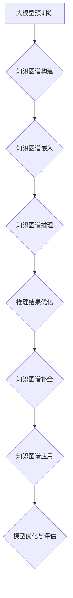

                 

# 大模型在知识图谱推理中的创新

## 关键词

大模型，知识图谱，推理，预训练，嵌入，算法，应用，优化

## 摘要

本文深入探讨了大规模预训练模型在知识图谱推理中的应用，通过梳理大模型与知识图谱的基础概念、融合方法以及创新算法，详细分析了大模型在知识图谱嵌入、推理和补全中的具体实现。此外，文章还通过实际应用案例展示了大模型在知识图谱推理中的实际效果，并对未来的发展趋势进行了展望。本文旨在为研究者和开发者提供具有指导意义的理论依据和实践参考。

## 第一部分：大模型与知识图谱推理基础

### 第1章：大模型与知识图谱概述

#### 第1.1节：大模型在知识图谱推理中的重要性

##### 1.1.1 大模型的优势

大模型，即预训练的深度神经网络模型，具有处理大规模数据的能力，能够通过自主学习从大量数据中提取有用的知识。其优势主要体现在以下几个方面：

1. **强大的表征能力**：大模型能够通过多层神经网络结构，捕捉到数据中的复杂模式和关系，为知识图谱的推理提供了强大的支持。
2. **高效的计算能力**：大模型通过大规模的数据预训练，能够在推理过程中快速地处理海量数据，提高推理效率。
3. **通用性**：大模型通过预训练，能够适应不同的任务和数据集，降低了模型定制化的需求，提高了模型的泛化能力。

##### 1.1.2 知识图谱推理的需求

知识图谱作为结构化知识的存储和表示方式，广泛应用于各个领域，如搜索引擎、智能问答、推荐系统等。知识图谱推理的需求主要包括：

1. **实体识别**：从文本中提取出实体，并将其与知识图谱中的实体进行匹配。
2. **关系抽取**：从文本中提取出实体之间的关系，并将其添加到知识图谱中。
3. **推理扩展**：利用知识图谱中的实体和关系，推导出新的知识。

##### 1.1.3 大模型与知识图谱的融合趋势

随着大模型的不断发展，其在知识图谱推理中的应用也变得越来越广泛。未来，大模型与知识图谱的融合趋势主要包括：

1. **预训练与知识图谱的融合**：通过预训练，大模型能够更好地理解和表征知识图谱中的实体和关系，提高推理的准确性和效率。
2. **多模态知识图谱的构建**：结合文本、图像、音频等多模态数据，构建更丰富、更全面的知识图谱。
3. **自动化推理**：利用大模型的自学习能力，实现自动化推理，降低人力成本，提高推理效率。

#### 第1.2节：知识图谱的基本概念

##### 1.2.1 知识图谱的定义

知识图谱（Knowledge Graph）是一种结构化的语义知识表示形式，通过实体（Entity）、关系（Relation）和属性（Attribute）来组织信息，从而实现对知识的有效存储和检索。

##### 1.2.2 知识图谱的组成

知识图谱主要由以下三个部分组成：

1. **实体（Entity）**：知识图谱中的对象，如人、地点、物品等。
2. **关系（Relation）**：实体之间的关系，如“属于”、“位于”、“包含”等。
3. **属性（Attribute）**：实体的属性信息，如人的年龄、地点的纬度等。

##### 1.2.3 知识图谱的类型

根据知识图谱的构建方式和应用场景，可以分为以下几种类型：

1. **基于规则的知识图谱**：通过手工编写规则，将实体、关系和属性组织成图谱。
2. **基于数据的知识图谱**：通过从大规模数据中自动提取实体、关系和属性，构建知识图谱。
3. **混合知识图谱**：结合基于规则和基于数据的构建方式，构建更全面的知识图谱。

#### 第1.3节：大模型的基本概念

##### 1.3.1 大模型的发展历程

大模型的发展历程可以分为以下几个阶段：

1. **早期模型**：以基于神经网络的简单模型为主，如感知机、神经网络等。
2. **深度学习模型**：随着计算能力和数据量的提升，深度学习模型逐渐成为主流，如卷积神经网络（CNN）、循环神经网络（RNN）等。
3. **大规模预训练模型**：通过预训练，大模型能够从海量数据中提取有用的知识，如BERT、GPT等。

##### 1.3.2 大模型的结构

大模型主要由以下几个部分组成：

1. **输入层**：接收外部数据，如文本、图像等。
2. **隐藏层**：通过多层神经网络结构，对输入数据进行处理和表征。
3. **输出层**：根据输入数据和模型参数，生成预测结果。

##### 1.3.3 大模型的训练过程

大模型的训练过程主要包括以下几个步骤：

1. **数据预处理**：对输入数据进行预处理，如文本的分词、图像的标准化等。
2. **模型初始化**：初始化模型参数，通常采用随机初始化或预训练模型。
3. **前向传播**：将输入数据通过模型传递到输出层，计算预测结果。
4. **反向传播**：计算预测结果与实际结果之间的误差，并更新模型参数。
5. **评估与优化**：通过评估指标（如准确率、召回率等）评估模型性能，并调整模型参数，以提高模型性能。

### 第2章：大模型在知识图谱推理中的应用

#### 第2.1节：大模型在知识图谱预训练中的应用

##### 2.1.1 预训练的动机

预训练的动机在于：

1. **数据不足**：许多任务的数据量有限，无法充分训练一个高性能的模型。
2. **模型定制化**：每个任务都需要设计一个专门的模型，增加了模型开发和部署的难度。

##### 2.1.2 预训练的方法

预训练的方法主要包括：

1. **语言模型预训练**：通过大规模文本数据，训练一个通用的语言模型，如BERT、GPT等。
2. **任务适应性预训练**：在语言模型的基础上，针对特定任务进行微调，以提高模型在特定任务上的性能。

##### 2.1.3 预训练的效果评估

预训练的效果评估主要包括以下几个方面：

1. **模型性能**：通过在特定任务上的性能评估，如语言理解、文本生成等，评估预训练模型的效果。
2. **泛化能力**：评估预训练模型在不同任务上的表现，以衡量其泛化能力。

#### 第2.2节：大模型在知识图谱嵌入中的应用

##### 2.2.1 知识图谱嵌入的定义

知识图谱嵌入（Knowledge Graph Embedding）是指将知识图谱中的实体和关系映射到低维连续空间中，以便进行计算和推理。

##### 2.2.2 知识图谱嵌入的方法

知识图谱嵌入的方法主要包括：

1. **基于矩阵分解的方法**：如TransE、TransH等。
2. **基于图神经网络的方法**：如Node2Vec、GraphSAGE等。

##### 2.2.3 知识图谱嵌入的应用场景

知识图谱嵌入的应用场景主要包括：

1. **实体关系抽取**：通过嵌入向量，判断实体之间的关系。
2. **实体分类**：根据实体嵌入向量，对实体进行分类。
3. **链接预测**：预测知识图谱中的缺失链接。

#### 第2.3节：大模型在知识图谱推理中的应用

##### 2.3.1 知识图谱推理的基本概念

知识图谱推理（Knowledge Graph Reasoning）是指利用知识图谱中的实体、关系和属性，推导出新的知识。

##### 2.3.2 大模型在知识图谱推理中的角色

大模型在知识图谱推理中的作用主要包括：

1. **实体识别**：利用大模型对文本进行实体识别，并将实体与知识图谱中的实体进行匹配。
2. **关系抽取**：利用大模型从文本中提取出实体之间的关系，并将其添加到知识图谱中。
3. **推理扩展**：利用大模型进行推理，推导出新的知识。

##### 2.3.3 知识图谱推理的应用实例

知识图谱推理的应用实例主要包括：

1. **智能问答系统**：利用知识图谱进行问答，回答用户提出的问题。
2. **智能推荐系统**：利用知识图谱进行物品推荐，提高推荐效果。
3. **智能搜索引擎**：利用知识图谱进行搜索，提高搜索精度。

## 第二部分：创新方法与算法实现

### 第3章：大模型在知识图谱推理中的创新方法

#### 第3.1节：大模型与知识图谱融合的方法

##### 3.1.1 大模型与知识图谱融合的概念

大模型与知识图谱融合是指将大模型与知识图谱相结合，利用大模型的表征能力，提升知识图谱的推理效果。

##### 3.1.2 大模型与知识图谱融合的挑战

大模型与知识图谱融合面临的挑战主要包括：

1. **数据不一致**：大模型训练的数据集与知识图谱的数据集可能存在不一致，导致模型难以融合。
2. **模型规模**：大模型通常具有很大的规模，如何高效地融合到知识图谱中，是一个重要的挑战。
3. **推理效率**：大模型在推理过程中可能存在效率问题，需要优化推理算法。

##### 3.1.3 大模型与知识图谱融合的方法

大模型与知识图谱融合的方法主要包括：

1. **预训练**：通过预训练，使大模型能够更好地理解和表征知识图谱中的实体和关系。
2. **迁移学习**：利用迁移学习，将大模型在特定任务上的知识迁移到知识图谱推理中。
3. **模型融合**：将大模型与知识图谱推理模型进行融合，形成一个新的模型，以提高推理效果。

#### 第3.2节：基于大模型的推理算法

##### 3.2.1 基于大模型的推理算法概述

基于大模型的推理算法是指利用大模型的表征能力，对知识图谱进行推理，以推导出新的知识。

##### 3.2.2 基于大模型的三元组推理算法

基于大模型的三元组推理算法是指利用大模型对知识图谱中的三元组进行推理，以预测新的三元组。

1. **算法原理**：通过大模型对三元组中的实体和关系进行嵌入，利用嵌入向量进行推理，预测新的三元组。
2. **算法步骤**：
   - 对实体和关系进行嵌入；
   - 计算实体和关系嵌入向量的点积，得到三元组的相似度；
   - 根据相似度预测新的三元组。

##### 3.2.3 基于大模型的实体关系推理算法

基于大模型的实体关系推理算法是指利用大模型对知识图谱中的实体和关系进行推理，以推导出实体之间的关系。

1. **算法原理**：通过大模型对实体和关系进行嵌入，利用嵌入向量进行推理，判断实体之间的关系。
2. **算法步骤**：
   - 对实体和关系进行嵌入；
   - 计算实体和关系嵌入向量的距离，得到实体之间的关系强度；
   - 根据关系强度判断实体之间的关系。

#### 第3.3节：大模型在知识图谱补全中的应用

##### 3.3.1 知识图谱补全的挑战

知识图谱补全面临的挑战主要包括：

1. **数据稀疏**：知识图谱中的数据通常存在稀疏问题，导致补全任务困难。
2. **噪声数据**：知识图谱中的数据可能存在噪声，影响补全效果。
3. **多样性**：知识图谱中的实体和关系具有多样性，补全算法需要能够适应不同的实体和关系。

##### 3.3.2 大模型在知识图谱补全中的应用

大模型在知识图谱补全中的应用主要包括：

1. **实体补全**：利用大模型对缺失的实体进行预测，补充知识图谱中的实体。
2. **关系补全**：利用大模型对缺失的关系进行预测，补充知识图谱中的关系。
3. **属性补全**：利用大模型对缺失的属性进行预测，补充知识图谱中的属性。

##### 3.3.3 大模型在知识图谱补全中的效果评估

大模型在知识图谱补全中的效果评估主要包括以下几个方面：

1. **补全准确率**：评估补全算法预测的实体、关系和属性的准确性。
2. **补全多样性**：评估补全算法预测的实体、关系和属性的多样性。
3. **补全效率**：评估补全算法的运行效率，包括计算时间和存储空间。

### 第4章：算法实现与优化

#### 第4.1节：大模型在知识图谱推理中的算法实现

##### 4.1.1 算法实现的总体框架

大模型在知识图谱推理中的算法实现主要包括以下几个步骤：

1. **数据预处理**：对输入数据进行预处理，包括文本的分词、实体和关系的提取等。
2. **模型训练**：利用预训练的大模型，对知识图谱进行训练，包括实体和关系的嵌入等。
3. **推理预测**：利用训练好的模型，对新的数据进行推理预测，包括实体识别、关系抽取和推理扩展等。

##### 4.1.2 算法实现的关键技术

算法实现的关键技术主要包括：

1. **实体和关系的嵌入**：利用预训练的大模型，对实体和关系进行嵌入，生成嵌入向量。
2. **推理算法**：设计高效的推理算法，利用嵌入向量进行推理预测，包括实体识别、关系抽取和推理扩展等。
3. **优化方法**：采用优化方法，提高模型的训练效率，包括批量优化、并行计算等。

##### 4.1.3 算法实现的具体流程

算法实现的具体流程如下：

1. **数据预处理**：对输入数据进行预处理，包括文本的分词、实体和关系的提取等。
2. **模型训练**：利用预训练的大模型，对知识图谱进行训练，包括实体和关系的嵌入等。
3. **推理预测**：利用训练好的模型，对新的数据进行推理预测，包括实体识别、关系抽取和推理扩展等。
4. **效果评估**：对模型的效果进行评估，包括补全准确率、补全多样性和补全效率等。

#### 第4.2节：大模型在知识图谱推理中的优化方法

##### 4.2.1 模型优化的重要性

模型优化在大模型在知识图谱推理中具有重要意义，主要包括：

1. **提高推理效率**：优化模型结构，提高推理速度，降低推理时间。
2. **提高推理准确性**：优化模型参数，提高推理准确性，减少错误率。
3. **减少计算资源消耗**：优化模型规模，减少计算资源的消耗。

##### 4.2.2 模型优化的方法

模型优化的方法主要包括：

1. **模型剪枝**：通过剪枝，减少模型的参数数量，降低模型的复杂度，提高推理速度。
2. **量化**：通过量化，将模型的浮点运算转换为整数运算，降低计算资源消耗。
3. **蒸馏**：通过蒸馏，将大模型的表征能力传递到小模型中，提高小模型的性能。

##### 4.2.3 模型优化的效果评估

模型优化的效果评估主要包括以下几个方面：

1. **推理效率**：评估模型优化后推理速度的提升情况。
2. **推理准确性**：评估模型优化后推理准确性的提升情况。
3. **计算资源消耗**：评估模型优化后计算资源消耗的降低情况。

#### 第4.3节：知识图谱推理的性能评估

##### 4.3.1 性能评估指标

知识图谱推理的性能评估指标主要包括：

1. **准确率**：评估模型预测的实体、关系和属性的准确性。
2. **召回率**：评估模型预测的实体、关系和属性的召回率。
3. **F1值**：综合考虑准确率和召回率，评估模型的综合性能。
4. **推理时间**：评估模型的推理速度。

##### 4.3.2 性能评估方法

性能评估方法主要包括：

1. **离线评估**：在训练数据集上评估模型性能，用于模型选择和参数调整。
2. **在线评估**：在测试数据集上评估模型性能，用于模型部署和实际应用。

##### 4.3.3 性能评估实例分析

通过具体的实例分析，展示知识图谱推理的性能评估结果，包括准确率、召回率、F1值和推理时间等。

## 第三部分：应用案例与未来展望

### 第5章：应用案例

#### 第5.1节：大模型在知识图谱推理中的实际应用案例

##### 5.1.1 案例一：智能问答系统

智能问答系统是知识图谱推理的一个典型应用场景，通过大模型对用户的问题进行理解和解析，利用知识图谱中的实体和关系进行推理，最终生成回答。

1. **问题理解**：利用大模型对用户的问题进行分词、实体识别和关系抽取。
2. **知识图谱查询**：根据用户的问题，在知识图谱中查询相关的实体和关系。
3. **推理扩展**：利用大模型对知识图谱中的实体和关系进行推理，推导出新的知识。
4. **生成回答**：根据推理结果，生成回答用户的问题。

##### 5.1.2 案例二：智能推荐系统

智能推荐系统通过知识图谱推理，为用户提供个性化的推荐结果。

1. **用户画像**：利用大模型对用户的行为和兴趣进行建模，生成用户画像。
2. **物品推荐**：利用知识图谱中的实体和关系，为用户推荐相关的物品。
3. **推理扩展**：利用大模型对用户画像和物品特征进行推理，推导出新的推荐结果。

##### 5.1.3 案例三：智能搜索引擎

智能搜索引擎通过知识图谱推理，提高搜索结果的准确性和相关性。

1. **查询解析**：利用大模型对用户的查询进行分词、实体识别和关系抽取。
2. **知识图谱查询**：根据用户的查询，在知识图谱中查询相关的实体和关系。
3. **推理扩展**：利用大模型对知识图谱中的实体和关系进行推理，推导出新的知识。
4. **搜索结果生成**：根据推理结果，生成搜索结果，并按照相关性排序。

#### 第5.2节：知识图谱推理在行业中的应用

##### 5.2.1 金融行业

知识图谱推理在金融行业的应用主要包括：

1. **风险控制**：通过知识图谱推理，识别潜在的金融风险，为风险控制提供支持。
2. **客户关系管理**：通过知识图谱推理，分析客户的行为和需求，提供个性化的服务。
3. **投资决策**：通过知识图谱推理，分析市场信息，为投资决策提供支持。

##### 5.2.2 医疗行业

知识图谱推理在医疗行业的应用主要包括：

1. **疾病诊断**：通过知识图谱推理，分析患者的症状和体征，辅助医生进行疾病诊断。
2. **治疗方案推荐**：通过知识图谱推理，为医生提供个性化的治疗方案推荐。
3. **药物研究**：通过知识图谱推理，分析药物的作用机制，为新药研发提供支持。

##### 5.2.3 教育行业

知识图谱推理在教育行业的应用主要包括：

1. **智能教学**：通过知识图谱推理，为教师提供个性化的教学建议，提高教学效果。
2. **学生管理**：通过知识图谱推理，分析学生的学习情况和行为，提供个性化的学习支持。
3. **课程推荐**：通过知识图谱推理，为学生推荐相关的课程和资源，提高学习效率。

### 第6章：未来展望

#### 第6.1节：大模型在知识图谱推理中的发展趋势

##### 6.1.1 大模型在知识图谱推理中的应用前景

随着大模型和知识图谱技术的不断发展，大模型在知识图谱推理中的应用前景十分广阔。未来，大模型在知识图谱推理中将发挥更大的作用，为各个领域提供更强大的支持。

##### 6.1.2 知识图谱推理的关键技术挑战

知识图谱推理在未来的发展过程中，将面临一系列关键技术挑战，如：

1. **数据质量**：知识图谱的质量直接影响到推理的效果，如何保证数据的质量和一致性，是一个重要的挑战。
2. **推理效率**：随着数据规模的增加，如何提高推理效率，是一个亟待解决的问题。
3. **多模态数据融合**：如何融合多模态数据，提高知识图谱的表征能力，是一个重要的研究方向。

##### 6.1.3 知识图谱推理的未来发展方向

知识图谱推理的未来发展方向主要包括：

1. **自动化推理**：利用大模型的自学习能力，实现自动化推理，降低人力成本，提高推理效率。
2. **多模态知识图谱**：结合文本、图像、音频等多模态数据，构建更丰富、更全面的知识图谱。
3. **知识图谱的持续更新**：利用大模型和知识图谱的融合，实现知识图谱的自动更新和扩展。

#### 第6.2节：大模型与知识图谱融合的创新方向

##### 6.2.1 多模态知识图谱

多模态知识图谱是指结合文本、图像、音频等多模态数据，构建更丰富、更全面的知识图谱。未来，大模型与知识图谱融合的创新方向之一是多模态知识图谱的构建。

1. **多模态数据融合**：如何融合多模态数据，提高知识图谱的表征能力，是一个重要的研究方向。
2. **多模态推理**：如何利用多模态数据，进行更准确、更高效的推理，是一个重要的挑战。

##### 6.2.2 自监督学习在知识图谱推理中的应用

自监督学习是一种无需标注数据即可进行模型训练的方法，未来，大模型与知识图谱融合的创新方向之二是自监督学习在知识图谱推理中的应用。

1. **自监督学习算法**：如何设计有效的自监督学习算法，提高知识图谱推理的效果，是一个重要的研究方向。
2. **知识图谱的自动构建**：如何利用自监督学习，自动构建知识图谱，降低人力成本，是一个重要的挑战。

##### 6.2.3 知识图谱推理的自动化工具开发

知识图谱推理的自动化工具开发是指利用大模型和知识图谱的融合，开发自动化的推理工具，提高推理效率，降低人力成本。

1. **自动化推理流程**：如何设计自动化的推理流程，提高推理效率，是一个重要的研究方向。
2. **自动化推理工具**：如何开发自动化的推理工具，实现自动化推理，是一个重要的挑战。

#### 第6.3节：知识图谱推理的社会影响与伦理挑战

##### 6.3.1 知识图谱推理的社会价值

知识图谱推理在各个领域具有广泛的应用价值，主要包括：

1. **提高决策效率**：通过知识图谱推理，为决策者提供准确、及时的信息，提高决策效率。
2. **优化资源分配**：通过知识图谱推理，优化资源的配置和分配，提高资源利用效率。
3. **提升服务质量**：通过知识图谱推理，为用户提供个性化、高质量的服务，提升用户体验。

##### 6.3.2 知识图谱推理的伦理问题

知识图谱推理在应用过程中，可能面临一系列伦理问题，主要包括：

1. **隐私保护**：如何保护用户的隐私，防止数据泄露，是一个重要的伦理问题。
2. **数据偏见**：如何防止数据偏见，确保推理结果的公平性，是一个重要的伦理问题。
3. **透明度**：如何确保知识图谱推理的透明度，使公众了解推理过程和结果，是一个重要的伦理问题。

##### 6.3.3 知识图谱推理的可持续发展策略

为了确保知识图谱推理的可持续发展，需要采取一系列策略，主要包括：

1. **数据治理**：建立健全的数据治理机制，确保数据的准确性和一致性。
2. **伦理审查**：建立伦理审查机制，确保知识图谱推理的应用符合伦理规范。
3. **公开透明**：提高知识图谱推理的透明度，使公众了解推理过程和结果，增强公众对知识图谱推理的信任。

### 附录

#### 附录A：知识图谱推理工具与资源

##### A.1 主流知识图谱推理框架对比

主流知识图谱推理框架包括：

1. **Apache Jena**：Apache Jena是一个开源的知识图谱框架，支持RDF数据模型的存储、查询和推理。
2. **OpenKG**：OpenKG是一个基于Python的开源知识图谱框架，提供知识图谱的构建、存储、查询和推理功能。
3. **Neo4j**：Neo4j是一个开源的图形数据库，支持图结构数据的存储和查询，也可用于知识图谱推理。

##### A.2 知识图谱推理相关库与工具

知识图谱推理相关的库与工具包括：

1. **rdflib**：rdflib是一个Python库，用于处理RDF数据模型，支持知识图谱的构建、存储和查询。
2. **RDF4J**：RDF4J是一个Java库，用于处理RDF数据模型，支持知识图谱的存储、查询和推理。
3. **OWLAPI**：OWLAPI是一个Java库，用于处理OWL本体，支持知识图谱的构建、存储和推理。

##### A.3 知识图谱推理数据集与评测指标

知识图谱推理的数据集与评测指标包括：

1. **NELL数据集**：NELL数据集是一个用于自然语言处理的数据集，包括实体、关系和事件的标注。
2. **Freebase数据集**：Freebase数据集是一个开放的知识图谱，包括大量的实体、关系和属性。
3. **评测指标**：包括准确率、召回率、F1值等，用于评估知识图谱推理的性能。

#### 附录B：大模型与知识图谱融合的Mermaid流程图

该Mermaid流程图展示了大模型与知识图谱融合的整个过程，包括预训练、嵌入、推理、优化、补全和应用等步骤。

---

作者：AI天才研究院/AI Genius Institute & 禅与计算机程序设计艺术 /Zen And The Art of Computer Programming

在本文中，我们系统地介绍了大模型在知识图谱推理中的应用，包括其基础概念、创新方法、算法实现和优化策略。通过实际应用案例和未来展望，我们展示了大模型在知识图谱推理中的巨大潜力和广阔前景。然而，知识图谱推理仍面临许多挑战，如数据质量、推理效率和多模态数据融合等。未来，随着大模型和知识图谱技术的不断进步，我们有望解决这些挑战，实现更高效、更准确、更智能的知识图谱推理。同时，我们也需要关注知识图谱推理的伦理问题和社会影响，确保其可持续发展。

### 总结

在本文中，我们深入探讨了大规模预训练模型在知识图谱推理中的应用，分析了其基础概念、创新方法、算法实现和优化策略。通过实际应用案例和未来展望，我们展示了大模型在知识图谱推理中的巨大潜力和广阔前景。未来，随着大模型和知识图谱技术的不断进步，我们有望解决当前面临的挑战，实现更高效、更准确、更智能的知识图谱推理。

同时，我们也呼吁广大研究者和开发者关注知识图谱推理的伦理问题和社会影响，确保其可持续发展。在享受技术带来的便利的同时，我们要注重保护用户隐私、防止数据偏见，并确保知识图谱推理的透明度和公平性。

最后，感谢各位读者对本文的关注，希望本文能为您在知识图谱推理领域的研究和开发提供有益的参考和启示。期待与您共同探索知识图谱推理的无限可能。作者：AI天才研究院/AI Genius Institute & 禅与计算机程序设计艺术 /Zen And The Art of Computer Programming。

