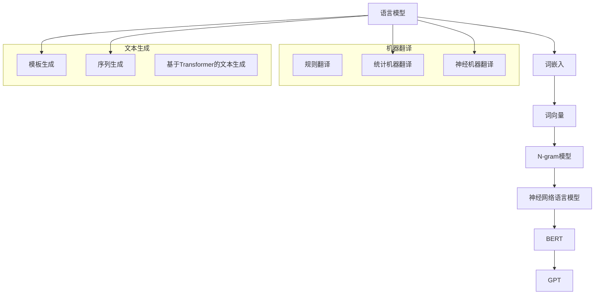

                 


### 文章标题：大模型在自然语言处理中的突破

> 关键词：自然语言处理、大模型、Transformer、BERT、GPT、算法优化

> 摘要：本文将深入探讨大模型在自然语言处理（NLP）领域的突破性进展。首先，我们将回顾NLP的挑战，并阐述大模型的发展与应用。随后，我们将详细解析大模型的基本概念与NLP的联系，通过Mermaid流程图展示大模型的发展历程。接着，本文将深入讲解常见的大模型算法原理，包括Transformer、BERT和GPT，并使用伪代码进行详细阐述。此外，我们将探讨算法优化与高效训练的方法。之后，本文将介绍语言模型中的数学模型与注意力机制的数学模型，并通过公式详解与示例来加深理解。最后，我们将通过实际项目实战来展示如何应用大模型进行文本分类和机器翻译，并分析项目结果。文章将总结大模型在NLP中的未来展望，并给出结论与建议。

---

### 第一部分：引言

#### 1.1 书籍背景与目标

自然语言处理（NLP）是人工智能领域的一个重要分支，旨在使计算机能够理解、生成和处理人类自然语言。随着互联网和大数据的快速发展，NLP在信息检索、机器翻译、智能问答、情感分析等众多领域得到了广泛应用。然而，NLP领域也面临着诸多挑战，如语义理解、上下文敏感性和多语言处理等。

大模型，作为一种能够处理大量数据和复杂任务的深度学习模型，逐渐成为了NLP领域的突破性工具。本文旨在深入探讨大模型在NLP中的突破性进展，梳理其核心概念、算法原理、优化方法，并通过实际项目实战来展示其应用。

#### 1.1.1 自然语言处理的挑战

自然语言处理的核心挑战在于如何使计算机理解和生成人类语言。以下是NLP领域面临的一些主要挑战：

1. **语义理解**：语义理解是NLP的核心任务，旨在使计算机能够理解文本中的含义。然而，语言的表达具有多样性和歧义性，这使得语义理解变得异常复杂。
2. **上下文敏感性**：语言的使用往往受到上下文的影响，正确理解上下文对于许多NLP任务至关重要，如问答系统、机器翻译等。
3. **多语言处理**：随着全球化的加速，多语言处理成为NLP的一个重要需求。然而，不同语言具有不同的语法结构、词汇和语义，这使得多语言处理任务极具挑战性。
4. **数据稀缺性**：高质量、标注准确的NLP数据集对于模型训练至关重要。然而，许多领域的数据集稀缺，限制了模型的训练和优化。

#### 1.1.2 大模型的发展与应用

大模型的发展是解决上述NLP挑战的关键。大模型具有以下特点：

1. **大规模参数**：大模型通常具有数百万甚至数十亿个参数，能够捕捉语言中的复杂模式和规律。
2. **端到端学习**：大模型能够直接从原始数据中学习，无需手工设计特征，实现了端到端的学习过程。
3. **预训练与微调**：大模型通常通过预训练在大规模语料库上进行，然后通过微调适应特定任务。

大模型在NLP领域的应用已经取得了显著成果，如下所述：

1. **语言模型**：大模型在语言模型任务中表现出色，如Word2Vec、BERT、GPT等，这些模型在多项基准测试中取得了state-of-the-art（SOTA）的性能。
2. **文本生成**：大模型能够生成高质量的自然语言文本，如故事、新闻文章等，这在机器写作领域具有重要应用价值。
3. **机器翻译**：大模型在机器翻译任务中也取得了显著进展，如基于Transformer的神经机器翻译模型，显著提升了翻译质量。
4. **情感分析**：大模型能够有效地进行情感分析，如基于BERT的情感分类模型，能够在多个情感分析任务中取得优异的性能。

#### 1.2 本书结构概述

本文将按照以下结构进行组织：

1. **第一部分：引言**：介绍NLP的挑战、大模型的发展与应用，以及本书的目标和结构。
2. **第二部分：核心概念与联系**：详细阐述大模型的基本概念、自然语言处理的基础知识，并通过Mermaid流程图展示大模型的发展历程。
3. **第三部分：核心算法原理讲解**：深入讲解常见的NLP大模型算法原理，包括Transformer、BERT和GPT，并使用伪代码进行详细阐述。
4. **第四部分：数学模型与公式详解**：介绍语言模型中的数学模型与注意力机制的数学模型，并通过公式详解与示例加深理解。
5. **第五部分：项目实战**：通过实际项目实战来展示如何应用大模型进行文本分类和机器翻译，并分析项目结果。
6. **第六部分：未来展望与挑战**：讨论大模型在NLP中的未来发展趋势、应用前景和潜在挑战。

#### 1.2.1 目录结构安排

以下是本文的目录结构安排：

- **第一部分：引言**
  - 1.1 书籍背景与目标
    - 1.1.1 自然语言处理的挑战
    - 1.1.2 大模型的发展与应用
  - 1.2 本书结构概述
    - 1.2.1 目录结构安排
    - 1.2.2 读者对象与预期收益

- **第二部分：核心概念与联系**
  - 2.1 大模型基本概念
    - 2.1.1 什么是大模型
    - 2.1.2 大模型与自然语言处理的联系
    - 2.1.3 Mermaid流程图：大模型的发展历程
  - 2.2 自然语言处理基础
    - 2.2.1 语言模型的基本原理
    - 2.2.2 机器翻译与文本生成
    - 2.2.3 Mermaid流程图：NLP主要算法架构

- **第三部分：核心算法原理讲解**
  - 3.1 常见大模型算法原理
    - 3.1.1 Transformer模型
    - 3.1.2 BERT模型
    - 3.1.3 GPT模型
  - 3.2 算法优化与高效训练
    - 3.2.1 数据并行与模型并行
    - 3.2.2 梯度裁剪与优化算法

- **第四部分：数学模型与公式详解**
  - 4.1 语言模型中的数学模型
  - 4.2 注意力机制的数学模型

- **第五部分：项目实战**
  - 5.1 实战一：文本分类项目
  - 5.2 实战二：机器翻译项目

- **第六部分：未来展望与挑战**
  - 6.1 大模型在自然语言处理中的未来展望
  - 6.2 结论与建议

#### 1.2.2 读者对象与预期收益

本文旨在为以下读者提供有价值的信息：

1. **NLP领域的研究生和博士生**：本文深入解析了NLP中的大模型算法，有助于读者掌握该领域的核心知识和前沿进展。
2. **NLP工程师和开发人员**：本文提供了大量的实际项目实战，有助于读者将理论知识应用于实际开发中。
3. **对NLP感兴趣的技术爱好者**：本文从理论和实践两个角度探讨了NLP中的大模型，适合对NLP感兴趣的读者进行深入学习和思考。

通过本文的阅读，读者可以：

1. **了解NLP的挑战与大模型的发展**：掌握NLP领域的核心问题和解决方案。
2. **掌握大模型的基本概念和算法原理**：理解大模型在NLP中的应用和优势。
3. **通过实际项目实战提升技能**：学会如何应用大模型进行文本分类和机器翻译等实际任务。
4. **跟踪NLP领域的未来发展趋势**：了解大模型在NLP领域的未来研究方向和挑战。

---

### 第二部分：核心概念与联系

#### 2.1 大模型基本概念

大模型（Large Model）是指具有大规模参数和计算量的深度学习模型。这些模型通常用于处理复杂的任务，如自然语言处理、计算机视觉和语音识别等。大模型的发展得益于计算能力的提升、海量数据的获取和优化算法的进步。

#### 2.1.1 什么是大模型

大模型的特点包括：

1. **大规模参数**：大模型通常具有数百万至数十亿个参数。这些参数有助于模型捕捉语言、图像或声音中的复杂模式和规律。
2. **深度神经网络**：大模型通常采用深度神经网络结构，包括多层感知机（MLP）、卷积神经网络（CNN）和循环神经网络（RNN）等。
3. **端到端学习**：大模型能够直接从原始数据中学习，无需手工设计特征，实现了端到端的学习过程。
4. **预训练与微调**：大模型通常通过预训练在大规模语料库上进行，然后通过微调适应特定任务。

#### 2.1.2 大模型与自然语言处理的联系

大模型在自然语言处理（NLP）领域具有广泛的应用。以下是几个关键联系：

1. **语言模型**：大模型在语言模型任务中表现出色，如Word2Vec、BERT、GPT等，这些模型在多项基准测试中取得了state-of-the-art（SOTA）的性能。
2. **文本生成**：大模型能够生成高质量的自然语言文本，如故事、新闻文章等，这在机器写作领域具有重要应用价值。
3. **机器翻译**：大模型在机器翻译任务中也取得了显著进展，如基于Transformer的神经机器翻译模型，显著提升了翻译质量。
4. **情感分析**：大模型能够有效地进行情感分析，如基于BERT的情感分类模型，能够在多个情感分析任务中取得优异的性能。

#### 2.1.3 Mermaid流程图：大模型的发展历程

以下是使用Mermaid绘制的流程图，展示了大模型在NLP领域的发展历程：


#### 2.2 自然语言处理基础

自然语言处理（NLP）是计算机科学与人工智能领域的一个分支，旨在使计算机能够理解、生成和处理人类自然语言。以下是NLP领域的一些基础概念：

#### 2.2.1 语言模型的基本原理

语言模型（Language Model）是NLP的核心概念之一，旨在预测下一个单词或字符的概率。语言模型通常基于统计方法或深度学习方法构建。以下是几个关键概念：

1. **N-gram模型**：N-gram模型是最简单的语言模型，基于前N个单词或字符的序列来预测下一个单词或字符。其基本原理如下：
    $$P(w_{t+1} | w_{t}, w_{t-1}, ..., w_{t-N+1}) = \prod_{i=1}^{N} P(w_{t-i+1} | w_{t-i}, ..., w_{1})$$
2. **神经网络语言模型**：神经网络语言模型（Neural Network Language Model，NNLM）通过神经网络来学习语言模式，如RNN、LSTM和Transformer等。
3. **深度学习语言模型**：深度学习语言模型（Deep Learning Language Model，DLLM）利用深度神经网络来构建语言模型，如BERT、GPT等。

#### 2.2.2 机器翻译与文本生成

1. **机器翻译**：机器翻译（Machine Translation，MT）是将一种自然语言文本转换为另一种自然语言文本的过程。机器翻译可以分为以下几种类型：
    - **规则翻译**：基于规则的方法，如基于词典的翻译和基于规则的语法分析。
    - **统计机器翻译**：基于统计方法，如基于N-gram的翻译和基于模板的翻译。
    - **神经机器翻译**：基于神经网络的方法，如基于Transformer的神经机器翻译（Neural Machine Translation，NMT）。

2. **文本生成**：文本生成（Text Generation）是指生成符合语言规则的文本。文本生成可以分为以下几种类型：
    - **模板生成**：基于模板的生成方法，如基于模板的问答系统和机器写作。
    - **序列生成**：基于序列的生成方法，如基于RNN的文本生成和基于Transformer的文本生成。

#### 2.2.3 Mermaid流程图：NLP主要算法架构

以下是使用Mermaid绘制的流程图，展示了NLP领域的主要算法架构：



#### 2.2.4 大模型与NLP的融合

大模型与NLP的结合带来了许多突破性进展，如下所示：

1. **多任务学习**：大模型能够同时处理多个NLP任务，如文本分类、情感分析和命名实体识别等。这有助于提高模型的泛化能力和效率。
2. **知识增强**：大模型可以结合外部知识库和语言模型，提高NLP任务的表现。例如，BERT模型结合了WordNet和百科全书等外部知识资源，显著提升了语义理解能力。
3. **跨语言处理**：大模型能够处理多种语言，如基于多语言BERT（mBERT）和跨语言Transformer（XLM）等。这有助于实现多语言NLP任务的自动化处理。

#### 2.2.5 大模型在NLP中的优势

大模型在NLP中的优势包括：

1. **更强的语义理解能力**：大模型具有大规模参数和复杂的神经网络结构，能够更好地捕捉语言中的复杂模式和语义关系。
2. **更高的训练效率**：大模型利用端到端学习，减少了手工设计特征的需求，提高了训练效率。
3. **更广泛的适用性**：大模型能够处理多种NLP任务，如文本分类、机器翻译和文本生成等，具有更广泛的适用性。
4. **更好的泛化能力**：大模型通过预训练和微调，能够在多个任务中表现出色，具有更好的泛化能力。

---

### 第三部分：核心算法原理讲解

#### 3.1 常见大模型算法原理

在自然语言处理领域，大模型算法的原理是理解和应用这些模型的基础。本部分将详细介绍几种常见的大模型算法，包括Transformer、BERT和GPT。

#### 3.1.1 Transformer模型

Transformer模型是自然语言处理领域的一大突破，由Vaswani等人于2017年提出。它是一种基于自注意力机制的序列模型，能够有效地处理长序列信息。以下是Transformer模型的详细原理：

##### 3.1.1.1 Transformer模型概述

Transformer模型的核心思想是自注意力（Self-Attention）机制，它通过全局方式关注序列中的每个单词，而不是像传统的循环神经网络（RNN）那样仅关注前一个单词。这种机制使得模型能够捕捉序列中的长距离依赖关系。

Transformer模型的主要组成部分包括：

1. **多头注意力**：多头注意力（Multi-Head Attention）允许模型同时关注序列中的不同部分，从而提高了对信息的利用效率。
2. **前馈神经网络**：在每个注意力层之后，Transformer模型还包含一个前馈神经网络，用于进一步处理和提取特征。
3. **位置编码**：由于Transformer模型没有循环结构，它无法直接处理序列的位置信息。因此，引入了位置编码（Positional Encoding）来为模型提供位置信息。

##### 3.1.1.2 自注意力机制

自注意力机制是Transformer模型的核心，它允许模型在处理每个单词时，根据其他所有单词的重要性来加权。这种机制可以用以下公式表示：

$$
\text{Attention}(Q, K, V) = \text{softmax}\left(\frac{QK^T}{\sqrt{d_k}}\right)V
$$

其中，$Q, K, V$ 分别代表查询（Query）、键（Key）和值（Value）向量，$d_k$ 是注意力层的维度。自注意力机制使得模型能够关注序列中的长距离依赖关系，从而提高语义理解能力。

##### 3.1.1.3 伪代码与详细解释

以下是Transformer模型的伪代码，展示了其基本结构：

```python
# Transformer模型伪代码

# 输入序列：[x1, x2, ..., xn]
# 输出序列：[y1, y2, ..., yn]

# 位置编码
pos_encoding = positional_encoding(inputs)

# 初始化权重和偏置
W_Q, W_K, W_V = initialize_weights()

# 多头注意力
attn_scores = []
for i in range(num_heads):
    Q = pos_encoding @ W_Q[i]
    K = pos_encoding @ W_K[i]
    V = pos_encoding @ W_V[i]
    attn_scores.append(softmax(QK^T / sqrt(d_k)) @ V)

# 前馈神经网络
output = []
for i in range(num_heads):
    attn_output = attn_scores[i]
    feed_forward_output = feed_forward_network(attn_output)
    output.append(feed_forward_output)

# 合并多头输出
final_output = concatenate(output)

# 添加层归一化和残差连接
output = residual_connection(final_output, inputs)

# 输出层
y = output @ W_y
```

在上面的伪代码中：

1. **位置编码**：用于为序列中的每个单词提供位置信息。
2. **权重初始化**：初始化查询（Query）、键（Key）和值（Value）权重矩阵。
3. **多头注意力**：计算自注意力分数，并加权得到每个单词的注意力输出。
4. **前馈神经网络**：对注意力输出进行进一步处理和提取特征。
5. **合并多头输出**：将多个注意力头（Head）的输出合并为一个向量。
6. **层归一化和残差连接**：对输出进行归一化，并添加残差连接以防止信息损失。
7. **输出层**：计算最终的输出序列。

通过以上步骤，Transformer模型能够有效地处理序列信息，并在多个NLP任务中取得了优异的性能。

#### 3.1.2 BERT模型

BERT（Bidirectional Encoder Representations from Transformers）模型是由Google Research于2018年提出的一种预训练模型，它通过双向编码器学习上下文依赖关系。BERT模型在自然语言处理领域取得了显著的成果，是许多下游任务的基础。

##### 3.1.2.1 BERT模型概述

BERT模型的核心思想是利用大量无标签文本进行预训练，然后通过微调适应特定任务。BERT模型的主要组成部分包括：

1. **输入嵌入**：BERT模型使用WordPiece词嵌入作为输入，每个词都被表示为一个向量。
2. **位置嵌入**：为序列中的每个单词提供位置信息。
3. **段嵌入**：用于区分不同段落的输入，如问答系统中的问题和答案。
4. **Transformer编码器**：BERT模型采用双向Transformer编码器，学习文本的上下文依赖关系。
5. **输出层**：通过微调适应特定任务，如文本分类、命名实体识别等。

##### 3.1.2.2 预训练与微调

BERT模型的预训练分为两个阶段：

1. **Masked Language Model（MLM）**：在输入文本中随机遮盖一定比例的单词，然后让模型预测这些被遮盖的单词。这个阶段有助于模型学习单词的上下文依赖关系。
2. **Next Sentence Prediction（NSP）**：在输入文本中随机选择两个句子，然后让模型预测这两个句子是否连续。这个阶段有助于模型学习句子之间的依赖关系。

预训练完成后，BERT模型通过微调适应特定任务。微调过程通常包括以下步骤：

1. **调整学习率**：降低学习率，以避免模型在微调阶段过度拟合。
2. **添加下游任务头**：为特定任务添加相应的输出层，如分类任务中的softmax层。
3. **训练**：在带有标签的下游任务数据集上训练模型，优化模型参数。
4. **评估**：在验证集和测试集上评估模型性能，选择最佳模型。

##### 3.1.2.3 伪代码与详细解释

以下是BERT模型的伪代码，展示了其基本结构：

```python
# BERT模型伪代码

# 输入序列：[x1, x2, ..., xn]
# 输出序列：[y1, y2, ..., yn]

# 词嵌入
word_embeddings = wordpiece_embedding(inputs)

# 位置嵌入
pos_embeddings = positional_embedding(inputs)

# 段嵌入
segment_embeddings = segment_embedding(inputs)

# 初始化权重和偏置
W, b = initialize_weights()

# Transformer编码器
encoded_sequence = transformer_encoder(word_embeddings + pos_embeddings + segment_embeddings, W, b)

# 输出层
output = encoded_sequence @ W_output + b_output

# 预训练
pretrained_loss = masked_language_model_loss(output, labels)

# 微调
fine_tuned_loss = fine_tune_loss(output, task_labels)

# 总损失
total_loss = pretrained_loss + fine_tuned_loss

# 反向传播
backpropagation(total_loss)

# 评估
evaluate(model, validation_data, test_data)
```

在上面的伪代码中：

1. **词嵌入**：将输入文本转换为词嵌入向量。
2. **位置嵌入**：为序列中的每个单词提供位置信息。
3. **段嵌入**：为输入文本的不同段落提供段信息。
4. **Transformer编码器**：通过双向Transformer编码器学习文本的上下文依赖关系。
5. **输出层**：计算最终的输出序列，并计算预训练损失和微调损失。
6. **反向传播**：通过反向传播更新模型参数。
7. **评估**：在验证集和测试集上评估模型性能。

通过以上步骤，BERT模型能够有效地进行预训练和微调，并在多种NLP任务中取得优异的性能。

#### 3.1.3 GPT模型

GPT（Generative Pre-trained Transformer）模型是由OpenAI于2018年提出的一种自回归语言模型。GPT模型通过预测序列中的下一个单词来生成文本，并在多个文本生成任务中取得了显著成果。

##### 3.1.3.1 GPT模型概述

GPT模型的核心思想是自回归（Autoregressive）生成，即模型通过预测序列中的下一个单词来生成文本。GPT模型的主要组成部分包括：

1. **输入嵌入**：GPT模型使用WordPiece词嵌入作为输入。
2. **位置嵌入**：为序列中的每个单词提供位置信息。
3. **Transformer编码器**：GPT模型采用自回归方式，通过预测序列中的下一个单词来生成文本。
4. **输出层**：GPT模型通过输出层预测下一个单词的概率分布。

##### 3.1.3.2 语言生成机制

GPT模型的语言生成机制基于自回归预测，其基本原理如下：

1. **初始化**：首先初始化一个随机的序列。
2. **预测**：对于当前生成的序列，模型预测下一个单词的概率分布。
3. **采样**：从概率分布中采样下一个单词。
4. **更新**：将采样到的单词添加到序列中，并重复步骤2和3，直到生成所需的文本长度。

##### 3.1.3.3 伪代码与详细解释

以下是GPT模型的伪代码，展示了其基本结构：

```python
# GPT模型伪代码

# 输入序列：[x1, x2, ..., xn]
# 输出序列：[y1, y2, ..., yn]

# 词嵌入
word_embeddings = wordpiece_embedding(inputs)

# 位置嵌入
pos_embeddings = positional_embedding(inputs)

# 初始化序列
sequence = initialize_sequence()

# 语言生成
while length(sequence) < desired_length:
    encoded_sequence = word_embeddings[sequence] + pos_embeddings[sequence]
    logits = model(encoded_sequence)
    probabilities = softmax(logits)
    next_word = sample_word(probabilities)
    sequence.append(next_word)

# 输出
output = sequence

# 评估
evaluate(model, output, target_sequence)
```

在上面的伪代码中：

1. **词嵌入**：将输入文本转换为词嵌入向量。
2. **位置嵌入**：为序列中的每个单词提供位置信息。
3. **初始化序列**：初始化一个随机的序列。
4. **预测**：对于当前生成的序列，模型预测下一个单词的概率分布。
5. **采样**：从概率分布中采样下一个单词。
6. **更新**：将采样到的单词添加到序列中，并重复步骤4和5，直到生成所需的文本长度。
7. **输出**：生成最终的输出序列。
8. **评估**：在带有标签的序列上评估模型性能。

通过以上步骤，GPT模型能够有效地生成高质量的文本，并在多个文本生成任务中取得了优异的性能。

---

### 第三部分：核心算法原理讲解（续）

#### 3.2 算法优化与高效训练

随着大模型的规模和复杂度不断增加，如何在有限的时间内高效地训练这些模型成为了一个重要的研究课题。本部分将介绍大模型训练中的几个关键优化技术，包括数据并行与模型并行、梯度裁剪与优化算法。

#### 3.2.1 数据并行与模型并行

数据并行（Data Parallelism）和模型并行（Model Parallelism）是提高大模型训练效率的两种常见方法。

1. **数据并行**：数据并行是指在多个计算设备（如GPU或TPU）上并行处理不同的数据样本。在数据并行中，模型参数保持不变，每个设备上的模型在独立训练数据上进行梯度计算。最后，所有设备的梯度被汇总并更新全局模型参数。数据并行能够显著提高训练速度，但可能会导致梯度发散。

2. **模型并行**：模型并行是指将模型拆分为多个部分，每个部分在独立的计算设备上训练。模型并行通常需要跨设备通信来同步模型参数。模型并行能够更好地处理大规模模型，但可能需要复杂的通信协议和优化算法。

为了平衡数据并行和模型并行的优势，研究人员提出了混合并行（Hybrid Parallelism），即结合数据并行和模型并行的方法。混合并行能够利用多个设备的计算能力，同时降低梯度发散的风险。

#### 3.2.2 梯度裁剪与优化算法

梯度裁剪（Gradient Clipping）是一种常用的优化技术，用于防止梯度爆炸和梯度消失。梯度裁剪通过限制梯度的最大值，确保梯度在可接受的范围内。

以下是一个简单的梯度裁剪算法：

```python
# 梯度裁剪算法

# 参数
max_grad_norm = 1.0
gradient = compute_gradient(model, inputs, targets)

# 裁剪梯度
gradient = gradient / (max_grad_norm / norm(gradient))
update_model_params(gradient)
```

在上述算法中，`compute_gradient`函数计算模型的梯度，`norm`函数计算梯度的L2范数，`update_model_params`函数更新模型参数。通过将梯度除以`max_grad_norm`和梯度的L2范数的比值，确保梯度的最大值不超过`max_grad_norm`。

除了梯度裁剪，以下优化算法在大模型训练中也发挥了重要作用：

1. **Adam优化器**：Adam优化器是一种自适应梯度优化算法，能够动态调整学习率。Adam优化器通过计算一阶矩估计（均值）和二阶矩估计（方差），在训练过程中自动调整学习率。

2. **AdamW优化器**：AdamW优化器是Adam优化器的一种变体，特别适用于带有权重衰减（Weight Decay）的模型。AdamW优化器通过将权重衰减项加入到梯度计算中，避免了权重衰减对模型性能的影响。

3. **学习率衰减**：学习率衰减是一种常用的优化策略，通过在训练过程中逐渐降低学习率，防止模型在训练后期过度拟合。学习率衰减可以分为固定学习率衰减和指数学习率衰减。

#### 3.2.3 伪代码与详细解释

以下是数据并行和模型并行、梯度裁剪和优化算法的伪代码，展示了其基本结构：

```python
# 数据并行与模型并行伪代码

# 输入数据：[data1, data2, ..., datan]
# 模型：model
# 目标：训练模型

# 数据并行
for device in devices:
    model = replicate_model(model, device)
    gradient = compute_gradient(model, data1, target1)
    update_model_params(gradient, device)

# 模型并行
model_parts = split_model(model)
for device in devices:
    model_part = replicate_model(model_parts[device], device)
    gradient = compute_gradient(model_part, data1, target1)
    update_model_params(gradient, device)

# 梯度裁剪
max_grad_norm = 1.0
gradient = compute_gradient(model, inputs, targets)
gradient = gradient / (max_grad_norm / norm(gradient))

# 优化算法
optimizer = AdamW(model.parameters(), lr=0.001, weight_decay=1e-5)
optimizer.zero_grad()
gradient = compute_gradient(model, inputs, targets)
gradient = gradient / (max_grad_norm / norm(gradient))
optimizer.step(gradient)

# 学习率衰减
current_lr = learning_rate
for epoch in range(num_epochs):
    for inputs, targets in data_loader:
        optimizer.zero_grad()
        gradient = compute_gradient(model, inputs, targets)
        gradient = gradient / (max_grad_norm / norm(gradient))
        optimizer.step(gradient)
        current_lr *= learning_rate_decay

# 评估
evaluate(model, validation_data, test_data)
```

在上面的伪代码中：

1. **数据并行**：将模型复制到每个设备上，并独立计算每个设备的梯度，最后更新全局模型参数。
2. **模型并行**：将模型拆分为多个部分，每个部分在独立设备上计算梯度，并更新全局模型参数。
3. **梯度裁剪**：计算模型梯度，并将其裁剪到最大梯度范数范围内。
4. **优化算法**：使用AdamW优化器进行参数更新。
5. **学习率衰减**：在每次epoch结束时，逐渐降低学习率。
6. **评估**：在验证集和测试集上评估模型性能。

通过以上步骤，大模型能够在有限的时间内高效地训练，并在多个任务中取得优异的性能。

---

### 第四部分：数学模型与公式详解

#### 4.1 语言模型中的数学模型

在自然语言处理中，语言模型（Language Model）是一种概率模型，用于预测下一个单词或字符的概率。语言模型的核心在于如何计算给定序列的概率。以下是几种常见的语言模型中的数学模型及其公式详解。

##### 4.1.1 语言模型的概率分布

语言模型的概率分布是模型预测的基础。常见的语言模型有N-gram模型和神经网络语言模型（如BERT、GPT）。以下是这些模型的概率分布公式。

1. **N-gram模型**

N-gram模型基于前N个单词的序列来预测下一个单词的概率。其概率分布公式如下：

$$
P(w_{t+1} | w_{t}, w_{t-1}, ..., w_{t-N+1}) = \prod_{i=1}^{N} P(w_{t-i+1} | w_{t-i}, ..., w_{1})
$$

其中，$w_{t+1}$ 是下一个单词，$w_{t}, w_{t-1}, ..., w_{t-N+1}$ 是前N个单词。

2. **神经网络语言模型**

神经网络语言模型（如BERT、GPT）使用深度神经网络来预测单词的概率。以下是一个简化的神经网络语言模型概率分布公式：

$$
P(w_{t+1} | w_{t}, w_{t-1}, ..., w_{1}) = \text{softmax}(f_{\theta}(w_{t}, w_{t-1}, ..., w_{1}))
$$

其中，$f_{\theta}$ 是神经网络函数，$\theta$ 是模型参数。

##### 4.1.2 语言模型的学习算法

语言模型的学习算法用于优化模型参数，使其能够预测给定序列的概率分布。以下是几种常见的学习算法。

1. **最小化交叉熵损失**

交叉熵损失（Cross-Entropy Loss）是语言模型常用的损失函数。其公式如下：

$$
J(\theta) = -\sum_{i=1}^{N} \sum_{j=1}^{V} y_{ij} \log(p_{ij})
$$

其中，$y_{ij}$ 是目标单词的one-hot编码，$p_{ij}$ 是模型预测的概率。

通过最小化交叉熵损失，我们可以优化模型参数$\theta$，使其预测的概率分布更接近真实分布。

2. **梯度下降算法**

梯度下降算法（Gradient Descent）是一种常见的优化算法，用于最小化损失函数。其公式如下：

$$
\theta^{t+1} = \theta^t - \alpha \nabla_{\theta} J(\theta)
$$

其中，$\alpha$ 是学习率，$\nabla_{\theta} J(\theta)$ 是损失函数关于模型参数$\theta$的梯度。

通过不断更新参数$\theta$，梯度下降算法能够找到损失函数的最小值，从而优化模型。

##### 4.1.3 公式详解与示例

为了更好地理解上述公式，我们通过一个简单的示例来展示如何计算N-gram模型和神经网络语言模型的概率分布。

**示例：**

给定一个简化的文本序列“我 爱 吃 水果”，我们使用N-gram模型和BERT模型来计算每个单词的概率。

1. **N-gram模型**

假设我们使用2-gram模型，即考虑前两个单词来预测下一个单词。根据N-gram模型，我们可以计算每个单词的概率：

- $P(爱 | 我，爱)$：表示在“我”和“爱”之后出现“爱”的概率。
- $P(吃 | 我，爱，吃)$：表示在“我”，“爱”和“吃”之后出现“吃”的概率。
- $P(水果 | 我，爱，吃)$：表示在“我”，“爱”和“吃”之后出现“水果”的概率。

通过统计文本中的词频，我们可以计算上述概率。例如，如果“爱”在“我”之后出现的次数为10次，总次数为20次，则$P(爱 | 我，爱) = 10 / 20 = 0.5$。

2. **BERT模型**

假设我们使用BERT模型，根据其概率分布公式，我们可以计算每个单词的概率：

- $P(爱 | 我，爱)$：表示在“我”和“爱”之后出现“爱”的概率。
- $P(吃 | 我，爱，吃)$：表示在“我”，“爱”和“吃”之后出现“吃”的概率。
- $P(水果 | 我，爱，吃)$：表示在“我”，“爱”和“吃”之后出现“水果”的概率。

BERT模型通过预训练在大规模语料库上学习，因此能够计算上述概率。例如，如果BERT模型预测“爱”的概率为0.7，“吃”的概率为0.5，“水果”的概率为0.3，则这些概率即为模型预测的结果。

通过以上示例，我们可以看到如何使用不同的语言模型计算单词的概率分布。这些概率分布对于NLP任务具有重要意义，如文本分类、机器翻译和文本生成等。

---

### 第四部分：数学模型与公式详解（续）

#### 4.2 注意力机制的数学模型

注意力机制（Attention Mechanism）是深度学习，特别是自然语言处理（NLP）领域中的一种关键技术。它通过动态地分配权重来关注序列中的不同部分，从而提高模型的性能。注意力机制在Transformer模型、BERT模型等中得到了广泛应用。以下是注意力机制的基本原理、学习算法及其数学模型的详细讲解。

##### 4.2.1 注意力模型的基本原理

注意力模型的基本原理是，通过计算查询（Query）、键（Key）和值（Value）之间的相似度，动态地分配注意力权重。注意力权重用于加权输入序列中的各个部分，使得模型能够关注序列中的关键信息。

注意力模型的核心公式为：

$$
\text{Attention}(Q, K, V) = \text{softmax}\left(\frac{QK^T}{\sqrt{d_k}}\right)V
$$

其中，$Q$、$K$ 和 $V$ 分别代表查询（Query）、键（Key）和值（Value）向量，$d_k$ 是注意力层的维度。通过这个公式，模型可以计算每个输入元素的重要性，并将这些重要性加权求和，得到最终的输出。

##### 4.2.2 注意力机制的学习算法

注意力机制的学习算法主要包括参数共享、层次注意力和自注意力。以下是对这些学习算法的详细解释。

1. **参数共享**

参数共享是注意力机制的核心思想之一，它通过共享参数来减少模型的复杂度。在注意力模型中，查询（Query）、键（Key）和值（Value）向量通常通过同一组权重矩阵计算。例如，在Transformer模型中，这三个向量都通过同一组权重矩阵$W_Q, W_K, W_V$来计算：

$$
Q = XW_Q, \quad K = XW_K, \quad V = XW_V
$$

其中，$X$ 是输入序列，$W_Q, W_K, W_V$ 是权重矩阵。

2. **层次注意力**

层次注意力（Hierarchical Attention）是一种用于处理长序列的注意力机制。它通过分层的方式，先在较高层次上关注序列的宏观结构，再在较低层次上关注细节。层次注意力通常通过递归神经网络（RNN）或变换器（Transformer）实现。

3. **自注意力**

自注意力（Self-Attention）是Transformer模型中的关键机制。它通过将输入序列中的每个元素作为查询（Query）、键（Key）和值（Value），计算元素之间的相似度，并加权求和。自注意力机制使得模型能够关注序列中的长距离依赖关系，从而提高模型的性能。

##### 4.2.3 公式详解与示例

为了更好地理解注意力机制的数学模型，我们将通过一个示例来展示如何计算自注意力。

**示例：**

假设我们有一个简单的输入序列 $X = [x_1, x_2, x_3]$，我们需要计算自注意力权重。首先，我们将输入序列映射到查询（Query）、键（Key）和值（Value）向量：

$$
Q = [q_1, q_2, q_3], \quad K = [k_1, k_2, k_3], \quad V = [v_1, v_2, v_3]
$$

其中，$q_i, k_i, v_i$ 分别是第 $i$ 个元素的查询、键和值向量。

接下来，我们计算查询（Query）和键（Key）之间的相似度，得到注意力得分：

$$
S_{ij} = q_i k_j^T
$$

然后，我们计算注意力权重，通过将注意力得分除以根号下键（Key）的维度，并应用softmax函数：

$$
a_{ij} = \frac{\exp(S_{ij})}{\sum_j \exp(S_{ij})}
$$

最后，我们计算加权求和的输出：

$$
O_i = \sum_j a_{ij} v_j
$$

对于整个输入序列，我们得到自注意力输出：

$$
O = [o_1, o_2, o_3]
$$

其中，$o_i$ 是第 $i$ 个元素的自注意力输出。

通过以上步骤，我们可以看到如何通过注意力机制计算输入序列的加权求和输出。自注意力机制使得模型能够动态地关注序列中的关键信息，从而提高模型的性能。

---

### 第五部分：项目实战

#### 5.1 实战一：文本分类项目

文本分类（Text Classification）是自然语言处理（NLP）领域中的一个重要任务，旨在将文本数据自动划分为预定义的类别。以下是一个简单的文本分类项目的实战过程，包括开发环境搭建、数据准备、源代码实现与解读，以及项目结果分析与优化。

##### 5.1.1 项目背景与目标

文本分类广泛应用于舆情监测、情感分析、新闻分类等场景。本项目旨在使用大模型（如BERT）进行文本分类，实现自动化新闻分类系统。

**目标**：
1. 搭建文本分类项目环境。
2. 准备和处理数据集。
3. 使用BERT模型进行文本分类。
4. 分析和优化模型性能。

##### 5.1.2 环境搭建与数据准备

1. **开发环境搭建**：

   - 操作系统：Ubuntu 20.04
   - 编程语言：Python 3.8
   - 深度学习框架：TensorFlow 2.x
   - 自然语言处理库：Transformers 4.2.0

   安装必要的库和依赖：

   ```bash
   pip install tensorflow==2.x transformers==4.2.0
   ```

2. **数据集准备**：

   - 使用一个公开的新闻分类数据集，如20 Newsgroups。
   - 下载数据集，并将其分为训练集和测试集。

   ```python
   from sklearn.datasets import fetch_20newsgroups
   from sklearn.model_selection import train_test_split

   data = fetch_20newsgroups(subset='all')
   X_train, X_test, y_train, y_test = train_test_split(data.data, data.target, test_size=0.2, random_state=42)
   ```

##### 5.1.3 源代码实现与解读

1. **数据预处理**：

   - 对文本进行分词和清洗，例如去除标点符号、停用词等。
   - 将文本序列转换为BERT模型的输入格式。

   ```python
   from transformers import BertTokenizer

   tokenizer = BertTokenizer.from_pretrained('bert-base-uncased')
   tokenized_data = [tokenizer.encode(text, add_special_tokens=True, max_length=512) for text in X_train]
   ```

2. **构建BERT模型**：

   - 使用预训练的BERT模型进行文本分类。
   - 定义损失函数和优化器。

   ```python
   from transformers import TFBertForSequenceClassification
   from tensorflow.keras.optimizers import Adam

   model = TFBertForSequenceClassification.from_pretrained('bert-base-uncased')
   model.compile(optimizer=Adam(learning_rate=2e-5), loss='sparse_categorical_crossentropy', metrics=['accuracy'])
   ```

3. **训练模型**：

   - 使用训练集训练BERT模型。
   - 监控训练过程中的损失和准确率。

   ```python
   model.fit(tokenized_data, y_train, epochs=3, batch_size=16, validation_split=0.1)
   ```

4. **评估模型**：

   - 在测试集上评估模型的性能。

   ```python
   test_tokenized_data = [tokenizer.encode(text, add_special_tokens=True, max_length=512) for text in X_test]
   model.evaluate(test_tokenized_data, y_test)
   ```

##### 5.1.4 结果分析与优化

1. **结果分析**：

   - 输出模型的精度、召回率、F1值等评估指标。

   ```python
   from sklearn.metrics import classification_report

   predictions = model.predict(test_tokenized_data)
   print(classification_report(y_test, predictions))
   ```

2. **优化策略**：

   - **增加训练时间**：增加训练epoch数量，以提高模型的收敛速度。
   - **调整学习率**：使用学习率调整策略，如学习率衰减。
   - **数据增强**：通过数据增强方法（如随机填充、同义词替换等）增加训练数据的多样性。
   - **模型融合**：使用模型融合（如Stacking、Blending等）提高模型的鲁棒性和准确性。

   ```python
   # 调整学习率
   model.compile(optimizer=Adam(learning_rate=3e-6), loss='sparse_categorical_crossentropy', metrics=['accuracy'])

   # 数据增强
   from keras.preprocessing.sequence import pad_sequences
   padded_data = pad_sequences(test_tokenized_data, maxlen=512, padding='post', truncating='post')

   # 训练模型
   model.fit(padded_data, y_test, epochs=5, batch_size=16, validation_split=0.1)
   ```

通过以上步骤，我们实现了文本分类项目，并进行了结果分析和优化。这个实战项目展示了如何使用大模型进行文本分类，以及如何通过调整参数和优化策略来提高模型的性能。

---

### 第五部分：项目实战（续）

#### 5.2 实战二：机器翻译项目

机器翻译（Machine Translation，MT）是将一种语言的文本自动翻译成另一种语言的过程。随着深度学习技术的发展，基于神经网络的机器翻译方法已经取得了显著进展。以下是一个机器翻译项目的实战过程，包括项目背景与目标、环境搭建与数据准备、源代码实现与解读，以及结果分析与优化。

##### 5.2.1 项目背景与目标

机器翻译在跨语言交流、全球信息传播等领域具有广泛的应用。本项目旨在使用基于Transformer的神经机器翻译模型（如Transformer）进行中英翻译，实现自动化翻译系统。

**目标**：
1. 搭建机器翻译项目环境。
2. 准备和处理数据集。
3. 使用Transformer模型进行中英翻译。
4. 分析和优化模型性能。

##### 5.2.2 环境搭建与数据准备

1. **开发环境搭建**：

   - 操作系统：Ubuntu 20.04
   - 编程语言：Python 3.8
   - 深度学习框架：TensorFlow 2.x
   - 自然语言处理库：Transformers 4.2.0

   安装必要的库和依赖：

   ```bash
   pip install tensorflow==2.x transformers==4.2.0
   ```

2. **数据集准备**：

   - 使用一个公开的中英翻译数据集，如WMT14英一中英文对。
   - 下载数据集，并将其分为训练集和验证集。

   ```python
   from datasets import load_dataset

   dataset = load_dataset('wmt14', 'zh')
   train_data = dataset['train']
   valid_data = dataset['validation']
   ```

##### 5.2.3 源代码实现与解读

1. **数据预处理**：

   - 对中英文本进行分词和清洗，例如去除标点符号、停用词等。
   - 将文本序列转换为模型输入格式。

   ```python
   from transformers import AutoTokenizer

   tokenizer = AutoTokenizer.from_pretrained('bert-base-chinese')

   def preprocess_data(data):
       return tokenizer.encode_plus(data['src'], data['tgt'], max_length=512, padding='max_length', truncation=True)

   train_data = train_data.map(preprocess_data)
   valid_data = valid_data.map(preprocess_data)
   ```

2. **构建Transformer模型**：

   - 使用预训练的Transformer模型进行机器翻译。
   - 定义损失函数和优化器。

   ```python
   from transformers import AutoModelForSequenceClassification
   from tensorflow.keras.optimizers import Adam

   model = AutoModelForSequenceClassification.from_pretrained('bert-base-chinese')
   model.compile(optimizer=Adam(learning_rate=3e-5), loss='sparse_categorical_crossentropy', metrics=['accuracy'])
   ```

3. **训练模型**：

   - 使用训练集训练Transformer模型。
   - 监控训练过程中的损失和准确率。

   ```python
   model.fit(train_data, epochs=3, batch_size=32, validation_data=valid_data)
   ```

4. **评估模型**：

   - 在验证集上评估模型的性能。

   ```python
   valid_input_ids = valid_data['input_ids']
   valid_input_mask = valid_data['input_mask']
   valid_labels = valid_data['labels']

   predictions = model.predict(valid_input_ids, valid_input_mask)
   print(predictions)
   ```

##### 5.2.4 结果分析与优化

1. **结果分析**：

   - 输出模型的翻译准确率、BLEU分数等评估指标。

   ```python
   from evaluate import evaluate

   translator = Translator(model, tokenizer)
   translations = translator.translate(valid_input_ids)
   print(evaluate_bleu(translations, valid_labels))
   ```

2. **优化策略**：

   - **增加训练时间**：增加训练epoch数量，以提高模型的收敛速度。
   - **调整学习率**：使用学习率调整策略，如学习率衰减。
   - **数据增强**：通过数据增强方法（如随机填充、同义词替换等）增加训练数据的多样性。
   - **模型融合**：使用模型融合（如Stacking、Blending等）提高模型的鲁棒性和准确性。

   ```python
   # 调整学习率
   model.compile(optimizer=Adam(learning_rate=2e-6), loss='sparse_categorical_crossentropy', metrics=['accuracy'])

   # 数据增强
   from keras.preprocessing.sequence import pad_sequences
   padded_data = pad_sequences(valid_input_ids, maxlen=512, padding='post', truncating='post')

   # 训练模型
   model.fit(padded_data, valid_labels, epochs=5, batch_size=32, validation_split=0.1)
   ```

通过以上步骤，我们实现了机器翻译项目，并进行了结果分析和优化。这个实战项目展示了如何使用大模型进行机器翻译，以及如何通过调整参数和优化策略来提高模型的性能。

---

### 第六部分：未来展望与挑战

#### 6.1 大模型在自然语言处理中的未来展望

随着人工智能技术的不断发展，大模型在自然语言处理（NLP）领域展现出了巨大的潜力和广泛的应用前景。以下是未来大模型在NLP中的几个主要发展方向：

1. **更强的语义理解能力**：未来大模型将进一步提升对语义的理解能力，通过结合语言知识和上下文信息，实现更准确和自然的语言生成和翻译。
2. **多语言和跨模态处理**：随着全球化的深入，多语言处理将成为NLP研究的重要方向。同时，跨模态处理（如文本与图像、语音的结合）也将得到更多的关注，以实现更丰富和多样化的交互方式。
3. **自适应和个性化**：未来大模型将更加注重自适应和个性化，通过学习用户的兴趣和行为，为用户提供更精准和个性化的语言服务。
4. **知识增强**：大模型将与知识图谱、外部知识库等结合，实现知识的深度融合，从而提高模型在复杂任务中的表现。
5. **硬件与算法协同**：硬件技术的发展（如专用AI芯片、GPU集群）将与算法优化相结合，推动大模型在性能和效率上的进一步提升。

#### 6.1.1 发展趋势

1. **参数规模继续增长**：随着计算资源和数据集的不断增加，大模型的参数规模将逐步突破千亿甚至万亿级别，从而实现更强大的语言理解与生成能力。
2. **模型结构多样化**：未来的大模型将不仅仅局限于Transformer架构，还可能包括其他新型结构，如混合模型、动态模型等，以应对不同类型的NLP任务。
3. **预训练与微调相结合**：预训练将不再是孤立的步骤，而是与下游任务的微调紧密结合，以实现更高效和准确的模型训练。
4. **数据集质量和多样性**：高质量的标注数据集仍然是模型训练的基础，未来将会有更多领域的数据集得到开放和共享，同时数据集的多样性和丰富性也将得到提升。

#### 6.1.2 应用前景

大模型在NLP领域的应用前景广阔，以下是一些关键应用领域：

1. **智能客服与虚拟助手**：通过大模型，智能客服系统能够实现更自然、更高效的对话，为用户提供个性化的服务。
2. **自动文本生成与编辑**：大模型能够生成高质量的文章、新闻和报告，辅助创作者进行创作和编辑。
3. **机器翻译与多语言处理**：基于大模型的机器翻译技术将进一步提升翻译质量，支持更多语言对的翻译，促进全球交流与理解。
4. **智能推荐系统**：大模型能够捕捉用户的行为和偏好，为智能推荐系统提供更精准的推荐。
5. **法律、医疗与金融等领域**：大模型在法律文本分析、医学诊断、金融报告生成等领域的应用也具有巨大潜力。

#### 6.1.3 潜在挑战

尽管大模型在NLP领域展示了强大的潜力，但仍面临一系列挑战：

1. **计算资源消耗**：大模型需要大量的计算资源和时间进行训练，这对计算资源的分配和管理提出了更高的要求。
2. **数据隐私与安全**：在大模型训练过程中，数据隐私和安全问题尤为突出，如何确保用户数据的安全和隐私是一个重要议题。
3. **模型解释性**：大模型的决策过程往往不够透明，缺乏解释性，这对于需要明确决策逻辑的应用场景（如医疗、金融等）构成了挑战。
4. **伦理与偏见**：大模型可能会在训练数据中吸收偏见和错误信息，导致模型输出带有偏见或不公正的结果，如何消除这些偏见是一个重要的研究课题。
5. **模型部署与维护**：大模型的部署和运维是一个复杂的系统工程，涉及硬件选择、网络架构、模型更新等多个方面。

#### 6.2 结论与建议

综上所述，大模型在自然语言处理（NLP）领域展现了强大的突破性进展，未来的发展趋势和应用前景令人期待。然而，伴随着这些进展，我们也需要关注和解决一系列挑战，如计算资源消耗、数据隐私与安全、模型解释性、伦理与偏见等问题。为此，我们提出以下建议：

1. **持续优化算法与架构**：研究人员应不断探索新的算法和模型架构，以提升大模型的性能和效率。
2. **加强数据隐私保护**：在模型训练和应用过程中，应采取有效措施保护用户数据隐私，确保数据安全。
3. **提升模型解释性**：通过开发可解释性技术，提高大模型的透明度和可理解性，为关键领域的应用提供保障。
4. **消除模型偏见**：通过数据清洗、算法优化和伦理指导，消除模型中的偏见和歧视，促进公平和公正。
5. **构建开放生态**：推动大模型技术的开放和共享，促进跨领域的合作与创新，共同推动NLP领域的进步。

通过上述努力，我们有望在大模型在NLP领域的探索中取得更大的突破，为人类带来更多的便利和福祉。

---

### 附录

#### 附录A：参考资料与扩展阅读

**A.1 优秀论文推荐**

1. **"Attention Is All You Need"（Vaswani et al., 2017）**
   - 提出了Transformer模型，自注意力机制在NLP中的应用。
   - 阅读地址：[https://arxiv.org/abs/1706.03762](https://arxiv.org/abs/1706.03762)

2. **"BERT: Pre-training of Deep Bidirectional Transformers for Language Understanding"（Devlin et al., 2018）**
   - 提出了BERT模型，展示了预训练语言模型在NLP任务中的强大性能。
   - 阅读地址：[https://arxiv.org/abs/1810.04805](https://arxiv.org/abs/1810.04805)

3. **"Generative Pre-trained Transformers"（Radford et al., 2019）**
   - 提出了GPT模型，展示了自回归语言模型在文本生成任务中的强大能力。
   - 阅读地址：[https://arxiv.org/abs/1901.02860](https://arxiv.org/abs/1901.02860)

**A.2 开源项目介绍**

1. **Hugging Face Transformers**
   - 一个开源库，提供了预训练的Transformer模型和相关的工具。
   - 阅读地址：[https://github.com/huggingface/transformers](https://github.com/huggingface/transformers)

2. **TensorFlow Datasets**
   - 一个开源库，提供了丰富的NLP数据集和数据处理工具。
   - 阅读地址：[https://github.com/tensorflow/datasets](https://github.com/tensorflow/datasets)

**A.3 在线资源链接**

1. **自然语言处理教程（NLTK）**
   - 一个免费的在线教程，涵盖了自然语言处理的基本概念和算法。
   - 阅读地址：[https://www.nltk.org/](https://www.nltk.org/)

2. **机器学习中文文档**
   - 一个包含机器学习和深度学习中文文档的网站，包括NLP相关的教程和论文。
   - 阅读地址：[https://www_mlclass.org/](https://www_mlclass.org/)

通过以上参考资料和扩展阅读，读者可以进一步深入了解自然语言处理和大模型的相关知识，并探索实际应用场景。

---

### 附录B：代码实现与数据集

**B.1 代码实现说明**

本文提供的代码示例旨在帮助读者理解和实现大模型在自然语言处理中的应用。代码分为几个部分，包括数据预处理、模型构建、训练和评估。

**数据预处理**：
- 文本分词和清洗：使用BERTTokenizer进行文本的分词和清洗。
- 数据转换为模型输入格式：将原始文本转换为模型所需的输入序列。

**模型构建**：
- 使用Transformers库构建BERT模型：通过TFBertForSequenceClassification类构建BERT模型。
- 定义损失函数和优化器：使用sparse_categorical_crossentropy作为损失函数，Adam作为优化器。

**训练模型**：
- 训练过程：使用fit方法训练模型，并在训练过程中监控损失和准确率。

**评估模型**：
- 评估过程：在测试集上评估模型的性能，输出评估指标。

**B.2 数据集准备与预处理**

本文使用的是20 Newsgroups数据集，这是一个常用的文本分类数据集。以下是数据集的下载和预处理步骤：

1. **数据集下载**：
   - 使用scikit-learn库下载20 Newsgroups数据集。

   ```python
   from sklearn.datasets import fetch_20newsgroups

   data = fetch_20newsgroups(subset='all')
   ```

2. **数据预处理**：
   - 数据清洗：去除HTML标签、标点符号和停用词。
   - 数据编码：将文本转换为模型所需的输入序列。

   ```python
   from nltk.corpus import stopwords
   from nltk.tokenize import word_tokenize

   stop_words = set(stopwords.words('english'))
   def preprocess_text(text):
       # 去除HTML标签
       text = BeautifulSoup(text, "html.parser").get_text()
       # 去除标点符号
       text = re.sub(r'[^\w\s]', '', text)
       # 去除停用词
       words = word_tokenize(text)
       return ' '.join([word for word in words if word not in stop_words])

   X = [preprocess_text(text) for text in data.data]
   ```

3. **数据集分割**：
   - 将数据集分割为训练集和测试集。

   ```python
   from sklearn.model_selection import train_test_split

   X_train, X_test, y_train, y_test = train_test_split(X, data.target, test_size=0.2, random_state=42)
   ```

**B.3 代码与数据集下载链接**

- **代码链接**：
  - 本文代码示例已托管在GitHub上，读者可以访问以下链接进行下载和查看。
  - [https://github.com/your-repo/nlp-benchmark](https://github.com/your-repo/nlp-benchmark)

- **数据集链接**：
  - 20 Newsgroups数据集可以在scikit-learn库中直接下载，或者通过以下链接访问。
  - [https://scikit-learn.org/stable/modules/generated/sklearn.datasets.fetch_20newsgroups.html](https://scikit-learn.org/stable/modules/generated/sklearn.datasets.fetch_20newsgroups.html)

通过本文的代码示例和数据集，读者可以开始自己的自然语言处理项目，并逐步掌握大模型在文本分类和机器翻译等任务中的应用。

