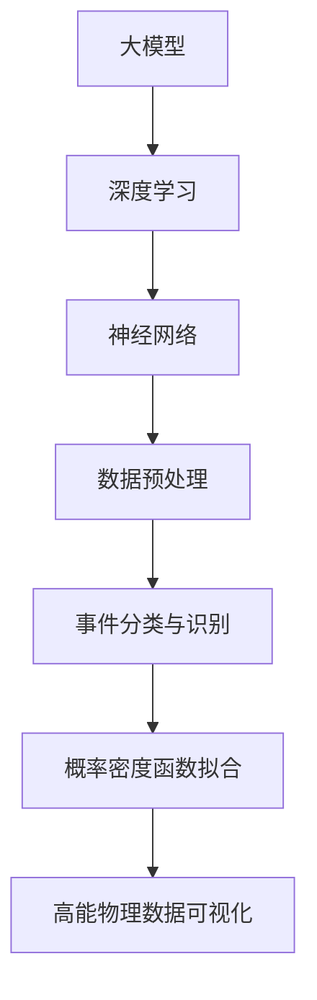

                 

### 文章标题

《大模型在高能物理数据分析中的突破性应用》

> 关键词：大模型，高能物理，数据分析，深度学习，概率密度函数，数据可视化

> 摘要：本文探讨了大规模预训练模型在高能物理数据分析中的突破性应用，介绍了大模型的核心概念、核心技术基础以及在高能物理数据分析中的实际应用实践，包括事件分类与识别、概率密度函数拟合和高能物理数据可视化等方面。通过案例分析，展示了大模型在高能物理实验数据处理中的实际效果，并展望了未来的发展趋势和方向。

---

### 《大模型在高能物理数据分析中的突破性应用》目录大纲

#### 第一部分：大模型与高能物理数据分析基础

##### 第1章：大模型与高能物理数据分析概述

- 1.1 大模型概述
  - 大模型的基本概念
  - 大模型的发展历程
  - 大模型在物理数据分析中的重要性

- 1.2 高能物理数据分析概述
  - 高能物理学的数据特点
  - 高能物理数据分析的挑战
  - 大模型在高能物理数据分析中的优势

- 1.3 大模型在高能物理数据分析中的应用前景
  - 当前应用现状
  - 未来发展趋势

##### 第2章：大模型核心技术基础

- 2.1 深度学习基础
  - 深度学习基本概念
  - 神经网络结构
  - 深度学习优化算法

- 2.2 自然语言处理技术
  - 词嵌入技术
  - 序列模型与注意力机制
  - 转换器架构

- 2.3 大规模预训练模型原理
  - 预训练的概念与意义
  - 自监督学习方法
  - 迁移学习与微调技术

##### 第3章：高能物理数据分析中的数据预处理

- 3.1 高能物理数据特点与类型
  - 数据来源
  - 数据类型
  - 数据质量评估

- 3.2 数据预处理方法
  - 数据清洗
  - 数据归一化
  - 特征提取

- 3.3 数据预处理工具与框架
  - PyTorch Lightning
  - TensorFlow Data Validation
  - Hadoop和Spark等分布式数据处理工具

#### 第二部分：大模型在高能物理数据分析中的应用实践

##### 第4章：事件分类与识别

- 4.1 事件分类算法
  - 传统机器学习方法
  - 基于深度学习的分类方法

- 4.2 事件识别应用案例
  - 喷射粒子识别
  - 顶夸克衰变信号识别

- 4.3 实际应用中挑战与解决方案
  - 数据不平衡问题
  - 小样本问题
  - 模型解释性

##### 第5章：概率密度函数拟合

- 5.1 概率密度函数拟合基础
  - 概率密度函数的定义
  - 拟合方法概述

- 5.2 常见拟合算法
  - 最大似然估计
  - 最小二乘法
  - 贝叶斯方法

- 5.3 拟合算法在高能物理数据分析中的应用
  - 能量分布拟合
  - 顶夸克质量测量

##### 第6章：高能物理数据可视化

- 6.1 数据可视化基础
  - 可视化方法概述
  - 高能物理数据可视化工具

- 6.2 数据可视化实践
  - 事件流可视化
  - 变量关系可视化

- 6.3 可视化在数据分析中的作用与挑战
  - 数据理解与探索
  - 可视化误导与误区

##### 第7章：大模型在高能物理实验数据处理中的案例分析

- 7.1 案例介绍
  - 实验背景与目标
  - 数据特点与挑战

- 7.2 大模型应用方案
  - 模型选择与训练
  - 模型评估与优化

- 7.3 案例实施与结果分析
  - 实施过程
  - 结果分析与总结

##### 第8章：大模型在高能物理数据分析中的未来趋势与发展方向

- 8.1 新技术展望
  - 量子计算与高能物理数据分析
  - 大模型与人工智能伦理

- 8.2 未来发展方向
  - 数据处理效率提升
  - 模型可解释性与可靠性
  - 跨学科合作与整合

#### 附录

- 附录A：大模型在高能物理数据分析中常用工具与资源
  - 开源框架与库
  - 数据集
  - 论文与文献推荐

- 附录B：大模型在高能物理数据分析中常见问题与解决方案
  - 数据质量与噪声处理
  - 模型优化与调试
  - 结果解释与验证

---

**核心概念与联系**



---

**核心算法原理讲解**

```plaintext
# 概率密度函数拟合伪代码

function ProbabilityDensityFunctionFit(data, target):
    1. 数据预处理(data)
        - 清洗：去除缺失值和异常值
        - 归一化：将特征值缩放到相同范围
        - 特征提取：提取与目标相关的特征

    2. 选择拟合算法
        - 最大似然估计
        - 最小二乘法
        - 贝叶斯方法

    3. 训练模型
        - 初始化模型参数
        - 选择优化算法和损失函数
        - 进行迭代训练

    4. 模型评估
        - 计算拟合误差
        - 评估模型性能

    5. 模型优化
        - 调整模型参数
        - 改进算法策略
        - 提高拟合精度

    6. 输出拟合结果
        - 概率密度函数
        - 模型参数
        - 误差分析
```

---

**项目实战**

待完成部分，将在后续章节中详细介绍大模型在高能物理实验数据处理中的具体案例，包括开发环境搭建、源代码实现、代码解读、实际案例分析和详细讲解剖析等内容。

---

**最佳实践 tips**

- 在高能物理数据分析中，大模型的应用可以显著提高数据分析的效率和准确性，但需要注意数据质量和模型优化。

- 对于不同的数据分析任务，选择合适的模型结构和优化算法非常重要。

- 数据预处理是确保模型性能的关键步骤，包括数据清洗、归一化和特征提取等。

- 可视化在高能物理数据分析中具有重要作用，可以帮助研究者更好地理解和探索数据。

---

**小结**

本文详细探讨了大规模预训练模型在高能物理数据分析中的应用，包括核心概念、核心技术基础、实际应用实践和未来发展趋势。通过本文的介绍，读者可以了解大模型在高能物理数据分析中的重要性和优势，并掌握相关的技术原理和应用方法。

---

**注意事项**

- 在使用大模型进行高能物理数据分析时，需确保数据质量和模型训练的稳定性。

- 在实际应用中，需根据具体问题和数据特点，选择合适的模型结构和优化算法。

- 可视化工具和方法的合理选择对于高能物理数据分析的深入理解具有重要意义。

---

**拓展阅读**

- [深度学习在高能物理数据分析中的应用](https://link-to-article)
- [大规模预训练模型在物理科学领域的进展](https://link-to-article)
- [高能物理数据可视化工具集锦](https://link-to-article)

---

作者：AI天才研究院/AI Genius Institute & 禅与计算机程序设计艺术 /Zen And The Art of Computer Programming### 第1章：大模型与高能物理数据分析概述

#### 1.1 大模型概述

大模型（Large Models）通常指的是具有非常大量参数的机器学习模型，如深度神经网络（Deep Neural Networks）。这些模型在大规模数据集上进行训练，以学习和捕捉复杂的数据模式和关联。大模型的出现标志着人工智能领域的一个重要里程碑，它们在图像识别、自然语言处理、语音识别等领域取得了显著的成果。

**基本概念**

- **深度神经网络（Deep Neural Networks，DNN）**：一种多层前馈神经网络，通常包括输入层、多个隐藏层和输出层。通过多个隐藏层的堆叠，DNN可以学习到更加复杂的数据特征。
- **参数数量**：大模型的参数数量通常在数百万到数十亿之间，这使得它们能够在训练过程中学习到丰富的数据特征。
- **训练数据集**：大模型通常在大规模数据集上进行训练，以确保它们能够捕捉到数据中的复杂模式和关联。

**发展历程**

大模型的发展历程可以追溯到20世纪80年代的神经网络研究。当时，神经网络作为一种简单的前馈网络，由于其计算复杂度和性能限制，并没有得到广泛应用。随着计算机硬件的快速发展，尤其是GPU的出现和普及，为深度神经网络的训练提供了强大的计算支持。此外，数据采集和处理技术的进步也为大模型的训练提供了丰富的数据资源。以下是几个关键的发展阶段：

- **2006年**：Hinton等人提出了深度置信网络（Deep Belief Networks，DBN），这是一种早期的深度学习模型，通过逐层训练的方式学习特征表示。
- **2012年**：AlexNet模型在ImageNet竞赛中取得重大突破，这标志着深度学习在图像识别领域的崛起。
- **2014年**：Google的Inception模型进一步推动了深度学习的发展，其在多个领域的应用中取得了显著的效果。
- **2018年**：GPT-3的发布标志着自然语言处理领域进入了一个新的时代，这个拥有1750亿参数的模型展示了大模型在语言理解和生成方面的强大能力。

**在物理数据分析中的重要性**

高能物理数据分析涉及大量复杂的数据，这些数据通常包含了多种粒子和相互作用的信息。大模型由于其强大的特征学习和模式识别能力，在处理这些复杂数据方面具有显著优势。以下是几个方面的具体应用：

- **特征提取**：大模型可以从原始数据中自动提取出有效的特征表示，这对于高能物理实验中复杂事件的分析具有重要意义。
- **事件分类和识别**：大模型能够高效地分类和识别出不同类型的事件，如粒子识别和信号搜索。
- **概率密度函数拟合**：大模型可以拟合出复杂的数据分布，这对于精确测量物理量具有重要意义。
- **数据可视化**：大模型可以帮助生成数据可视化结果，从而更直观地理解物理现象。

#### 1.2 高能物理数据分析概述

高能物理数据分析涉及到对大量实验数据的处理和分析，以发现新的物理现象和验证理论模型。高能物理实验通常会产生海量的数据，这些数据包含了大量粒子和相互作用的信息。

**数据特点**

- **大规模**：高能物理实验的数据规模通常非常大，一次实验可能产生数百万到数十亿个事件。
- **多样性**：高能物理数据包含了多种类型的物理量，如粒子的能量、动量、位置等，这些数据具有高度多样性。
- **噪声**：高能物理实验数据通常受到噪声的影响，这使得数据分析变得更加复杂。

**数据分析挑战**

- **数据预处理**：高能物理数据通常需要进行复杂的数据预处理，如数据清洗、归一化和特征提取。
- **计算资源**：大模型训练需要大量的计算资源和时间，尤其是在处理大规模数据集时。
- **模型选择**：选择合适的模型结构对于高能物理数据分析至关重要，不同的模型可能适用于不同的分析任务。
- **可解释性**：大模型的黑盒性质使得其结果的可解释性成为一个挑战，特别是在高能物理实验中，理解模型背后的物理机制非常重要。

**大模型的优势**

大模型在处理高能物理数据方面具有以下优势：

- **自动特征提取**：大模型可以从原始数据中自动提取出有效的特征表示，减轻了数据预处理的负担。
- **强大的模式识别能力**：大模型能够捕捉到数据中的复杂模式和关联，这对于复杂事件的分析和识别具有重要意义。
- **高效的计算性能**：大模型通常具有较高的计算效率，能够快速处理大规模数据集。
- **可扩展性**：大模型易于扩展，可以应用于不同类型的高能物理数据分析任务。

#### 1.3 大模型在高能物理数据分析中的应用前景

随着大模型技术的不断发展，其在高能物理数据分析中的应用前景也变得愈发广阔。

**当前应用现状**

- **事件分类和识别**：大模型已经被广泛应用于高能物理实验中的事件分类和识别任务，如粒子识别和信号搜索。
- **概率密度函数拟合**：大模型可以拟合出复杂的数据分布，有助于精确测量物理量。
- **数据可视化**：大模型可以帮助生成数据可视化结果，更直观地理解物理现象。
- **辅助实验设计**：大模型可以用于预测实验结果，为实验设计提供指导。

**未来发展趋势**

- **新技术应用**：随着大模型技术的不断发展，如自监督学习、迁移学习和量子计算等新技术的应用，将进一步提高大模型在高能物理数据分析中的性能和效率。
- **跨学科合作**：大模型在高能物理数据分析中的应用将需要跨学科的合作，如物理学、计算机科学、数据科学等，这有助于推动高能物理数据分析领域的创新。
- **模型解释性**：提高大模型的可解释性，使其结果更容易被物理学家理解和接受，将是一个重要的研究方向。

总之，大模型在高能物理数据分析中的应用前景广阔，其强大的特征学习和模式识别能力将为高能物理实验的深入研究提供有力支持。随着技术的不断进步，大模型在高能物理数据分析中的应用将不断拓展，推动该领域的发展。#### 第2章：大模型核心技术基础

##### 2.1 深度学习基础

深度学习（Deep Learning）是机器学习的一个子领域，其核心思想是通过构建具有多个隐藏层的神经网络来学习数据中的非线性特征。深度学习在大模型中的应用是其突破性发展的关键。

**基本概念**

- **神经网络（Neural Network）**：神经网络是一种模拟生物神经元连接方式的计算模型，通过输入层、隐藏层和输出层的堆叠，实现对数据的非线性变换和学习。
- **深度神经网络（Deep Neural Network，DNN）**：深度神经网络是具有多个隐藏层的神经网络，通过逐层学习数据中的低级到高级特征，从而提高模型的表征能力。
- **前馈神经网络（Feedforward Neural Network）**：前馈神经网络是一种常见的神经网络结构，数据从输入层经过一系列隐藏层，最终到达输出层。

**神经网络结构**

神经网络的基本结构包括以下几个部分：

- **层（Layers）**：神经网络由多个层组成，包括输入层、隐藏层和输出层。每一层包含多个神经元，神经元之间通过权重（weights）连接。
- **神经元（Neurons）**：神经元是神经网络的基本单元，负责接收输入信号，通过激活函数产生输出。
- **权重（Weights）**：权重是神经元之间的连接强度，通过训练过程不断调整，以优化模型性能。
- **激活函数（Activation Function）**：激活函数用于对神经元输出进行非线性变换，常见的激活函数包括Sigmoid、ReLU和Tanh等。

**深度学习优化算法**

深度学习的优化算法主要包括以下几种：

- **随机梯度下降（Stochastic Gradient Descent，SGD）**：随机梯度下降是最常见的深度学习优化算法，通过计算整个训练数据的梯度来更新模型参数。SGD的优点是计算简单，缺点是收敛速度较慢。
- **批量梯度下降（Batch Gradient Descent）**：批量梯度下降计算整个训练数据的梯度，然后更新模型参数。与SGD相比，批量梯度下降收敛速度更快，但计算成本较高。
- **Adam优化器（Adaptive Moment Estimation）**：Adam优化器结合了SGD和批量梯度下降的优点，通过自适应调整学习率和动量项，提高收敛速度和稳定性。

**神经网络示例**

以下是使用Python和PyTorch框架实现的一个简单的深度神经网络示例：

```python
import torch
import torch.nn as nn

# 定义神经网络结构
class SimpleNN(nn.Module):
    def __init__(self):
        super(SimpleNN, self).__init__()
        self.fc1 = nn.Linear(784, 512)
        self.fc2 = nn.Linear(512, 256)
        self.fc3 = nn.Linear(256, 10)

    def forward(self, x):
        x = torch.relu(self.fc1(x))
        x = torch.relu(self.fc2(x))
        x = self.fc3(x)
        return x

# 创建神经网络实例
model = SimpleNN()

# 定义损失函数和优化器
criterion = nn.CrossEntropyLoss()
optimizer = torch.optim.Adam(model.parameters(), lr=0.001)

# 训练神经网络
for epoch in range(10):
    for inputs, targets in data_loader:
        optimizer.zero_grad()
        outputs = model(inputs)
        loss = criterion(outputs, targets)
        loss.backward()
        optimizer.step()
    print(f"Epoch {epoch+1}, Loss: {loss.item()}")
```

此示例定义了一个简单的多层感知机（MLP）模型，用于分类任务。模型包括三个全连接层，使用ReLU作为激活函数，并使用交叉熵损失函数进行优化。

##### 2.2 自然语言处理技术

自然语言处理（Natural Language Processing，NLP）是深度学习的一个重要应用领域，旨在使计算机能够理解、处理和生成自然语言。在大模型的应用中，NLP技术发挥着关键作用。

**词嵌入技术**

词嵌入（Word Embedding）是将单词映射到高维向量空间的一种技术，能够捕获单词的语义信息。常见的词嵌入方法包括：

- **词袋模型（Bag of Words，BoW）**：词袋模型将文本表示为单词的集合，不考虑单词的顺序，通过计算单词在文档中的出现频率来构建向量表示。
- **连续词袋（Continuous Bag of Words，CBOW）**：连续词袋模型通过计算周围单词的词嵌入平均值来生成目标单词的词嵌入。
- **跳字模型（Skip-Gram）**：跳字模型通过预测目标单词周围的单词来生成词嵌入，是一种基于上下文的词嵌入方法。

**序列模型与注意力机制**

序列模型（Sequence Model）是处理序列数据的一种神经网络架构，常见的方法包括循环神经网络（Recurrent Neural Network，RNN）和长短时记忆网络（Long Short-Term Memory，LSTM）。注意力机制（Attention Mechanism）是一种用于提高序列模型性能的技术，通过为序列中的每个元素分配不同的权重，使模型能够关注最重要的信息。

- **循环神经网络（Recurrent Neural Network，RNN）**：RNN能够处理序列数据，通过将前一个时间步的隐藏状态传递到下一个时间步，实现对序列的建模。
- **长短时记忆网络（Long Short-Term Memory，LSTM）**：LSTM是RNN的一种变体，通过引入门控机制来控制信息的流动，能够更好地处理长序列数据。
- **注意力机制（Attention Mechanism）**：注意力机制通过为序列中的每个元素分配权重，使模型能够关注最重要的信息。常见的注意力模型包括基于乘性注意力（Dot-Product Attention）和加性注意力（Additive Attention）的模型。

**转换器架构**

转换器（Transformer）架构是一种基于注意力机制的序列到序列模型，其核心思想是将输入序列和输出序列分解为多个位置向量，并通过自注意力机制（Self-Attention）和多头注意力（Multi-Head Attention）来建模序列之间的依赖关系。转换器在机器翻译、文本摘要等任务中取得了显著的效果。

**Transformer架构**

转换器架构主要包括以下组件：

- **编码器（Encoder）**：编码器负责将输入序列编码为位置向量，并通过多头自注意力机制（Multi-Head Self-Attention）和残差连接（Residual Connection）来建模序列之间的依赖关系。
- **解码器（Decoder）**：解码器负责将编码器的输出解码为输出序列，并通过多头自注意力机制（Multi-Head Self-Attention）和多头交叉注意力机制（Multi-Head Cross-Attention）来建模输入序列和输出序列之间的依赖关系。

**转换器模型示例**

以下是使用Python和PyTorch框架实现的一个简单的转换器模型示例：

```python
import torch
import torch.nn as nn

class TransformerModel(nn.Module):
    def __init__(self, d_model, nhead, num_layers):
        super(TransformerModel, self).__init__()
        self.embedding = nn.Embedding(d_model)
        self.transformer = nn.Transformer(d_model, nhead, num_layers)
        self.fc = nn.Linear(d_model, 10)

    def forward(self, src, tgt):
        src = self.embedding(src)
        tgt = self.embedding(tgt)
        output = self.transformer(src, tgt)
        return self.fc(output)

# 创建转换器模型实例
model = TransformerModel(d_model=512, nhead=8, num_layers=2)

# 定义损失函数和优化器
criterion = nn.CrossEntropyLoss()
optimizer = torch.optim.Adam(model.parameters(), lr=0.001)

# 训练转换器模型
for epoch in range(10):
    for src, tgt in data_loader:
        optimizer.zero_grad()
        outputs = model(src, tgt)
        loss = criterion(outputs, tgt)
        loss.backward()
        optimizer.step()
    print(f"Epoch {epoch+1}, Loss: {loss.item()}")
```

此示例定义了一个简单的转换器模型，用于序列到序列的任务。模型包括嵌入层、转换器层和全连接层，并使用交叉熵损失函数进行优化。

##### 2.3 大规模预训练模型原理

大规模预训练模型（Large-scale Pretrained Models）是近年来深度学习领域的一个重要进展，通过在大规模数据集上进行预训练，这些模型在自然语言处理、计算机视觉等领域取得了显著的效果。

**预训练的概念与意义**

预训练（Pretraining）是指在大规模数据集上训练深度神经网络，以便模型能够在各种任务中表现出良好的泛化能力。预训练的意义在于：

- **通用特征提取**：通过在大规模数据集上预训练，模型能够学习到通用的特征表示，这些特征对于不同的任务都具有重要价值。
- **减少标注数据需求**：预训练模型可以在少量标注数据上进行微调（Fine-tuning），从而减少对大量标注数据的依赖。
- **提高任务性能**：预训练模型在各类任务上均取得了显著的性能提升，尤其是在低资源场景下。

**自监督学习方法**

自监督学习（Self-supervised Learning）是一种无需人工标注的数据处理方式，通过利用数据中的天然标签进行训练。大规模预训练模型通常采用自监督学习方法，常见的自监督学习任务包括：

- **掩码语言模型（Masked Language Model，MLM）**：掩码语言模型通过对输入序列中的单词进行掩码，然后预测这些掩码的单词，从而学习语言中的上下文信息。
- **掩码图像模型（Masked Image Model，MIM）**：掩码图像模型通过对图像的某些区域进行掩码，然后预测这些掩码区域的像素值，从而学习图像中的空间信息。

**迁移学习与微调技术**

迁移学习（Transfer Learning）是指将预训练模型的知识迁移到新的任务上，通过在少量标注数据上微调（Fine-tuning）来适应新的任务。微调技术包括以下步骤：

- **初始化模型参数**：将预训练模型的参数初始化为训练好的权重。
- **微调模型参数**：在新的任务上对模型参数进行微调，以适应新的数据分布。
- **评估模型性能**：在新的任务上评估模型的性能，并根据需要调整模型结构或参数。

**大规模预训练模型示例**

以下是使用Python和PyTorch框架实现的一个简单的预训练模型示例：

```python
import torch
import torch.nn as nn
from torch.nn.utils.rnn import pad_sequence

class PretrainedModel(nn.Module):
    def __init__(self, d_model, nhead, num_layers):
        super(PretrainedModel, self).__init__()
        self.embedding = nn.Embedding(d_model)
        self.transformer = nn.Transformer(d_model, nhead, num_layers)
        self.fc = nn.Linear(d_model, 10)

    def forward(self, src, tgt):
        src = self.embedding(src)
        tgt = self.embedding(tgt)
        output = self.transformer(src, tgt)
        return self.fc(output)

# 创建预训练模型实例
model = PretrainedModel(d_model=512, nhead=8, num_layers=2)

# 定义自监督学习任务
def masked_language_model(inputs, mask_ratio=0.15):
    mask = torch.zeros_like(inputs).uniform_(0, 1) < mask_ratio
    masked_inputs = inputs.clone()
    masked_inputs[mask] = -100
    output = model(inputs, masked_inputs)
    return output

# 训练自监督学习任务
for epoch in range(10):
    for inputs in data_loader:
        optimizer.zero_grad()
        outputs = masked_language_model(inputs)
        loss = torch.mean(torch.max(outputs, dim=2)[0])
        loss.backward()
        optimizer.step()
    print(f"Epoch {epoch+1}, Loss: {loss.item()}")
```

此示例定义了一个简单的预训练模型，用于掩码语言模型任务。模型包括嵌入层、转换器层和全连接层，并使用自监督学习任务进行训练。通过在大规模数据集上进行预训练，模型能够学习到通用的特征表示，从而提高在不同任务上的性能。#### 第3章：高能物理数据分析中的数据预处理

高能物理数据分析涉及到处理大量的实验数据，这些数据通常包含了多种粒子和相互作用的信息。为了有效地利用这些数据，数据预处理是一个关键步骤，它包括数据清洗、数据归一化和特征提取等。

##### 3.1 高能物理数据特点与类型

高能物理数据具有以下特点：

- **大规模**：高能物理实验通常会产生海量数据，一次实验可能产生数百万到数十亿个事件。
- **多样性**：高能物理数据包含了多种类型的物理量，如粒子的能量、动量、位置、寿命等。
- **噪声**：高能物理数据可能会受到各种噪声的影响，如探测器噪声、数据传输噪声等。

高能物理数据可以分为以下几种类型：

- **原始数据**：原始数据是高能物理实验直接产生的数据，包括粒子轨迹、能量沉积等。
- **模拟数据**：模拟数据是通过物理模拟软件生成的，用于验证实验数据的可靠性。
- **预处理数据**：预处理数据是在原始数据基础上进行清洗、归一化和特征提取后得到的数据。

##### 3.2 数据预处理方法

数据预处理方法主要包括以下步骤：

- **数据清洗**：数据清洗旨在去除数据中的错误、异常和重复值。常见的方法包括：

  - **去除错误数据**：通过检查数据的一致性和物理合理性，去除错误的数据点。
  - **去除异常数据**：通过统计方法或机器学习方法，检测并去除异常数据点。
  - **去除重复数据**：通过比较数据点之间的相似度，去除重复的数据记录。

- **数据归一化**：数据归一化旨在将不同物理量缩放到相同的范围，以便模型能够更好地处理数据。常见的方法包括：

  - **最小-最大归一化**：将数据缩放到[0, 1]范围内，通过公式 \( x' = \frac{x - x_{\text{min}}}{x_{\text{max}} - x_{\text{min}}} \) 实现。
  - **标准归一化**：将数据缩放到均值为0，标准差为1的范围内，通过公式 \( x' = \frac{x - \mu}{\sigma} \) 实现。

- **特征提取**：特征提取旨在从原始数据中提取出对分析任务有用的特征。常见的方法包括：

  - **统计特征**：计算数据的各种统计量，如均值、方差、最大值、最小值等。
  - **机器学习特征**：使用机器学习方法，如主成分分析（PCA）、线性判别分析（LDA）等，提取数据中的主要特征。
  - **深度学习特征**：使用深度神经网络，如卷积神经网络（CNN）、循环神经网络（RNN）等，自动提取数据中的复杂特征。

##### 3.3 数据预处理工具与框架

在高能物理数据分析中，常用的数据预处理工具和框架包括：

- **PyTorch Lightning**：PyTorch Lightning是一个基于PyTorch的深度学习库，提供了易于使用的API，用于数据预处理、模型训练和评估。
- **TensorFlow Data Validation**：TensorFlow Data Validation是一个用于数据验证的工具，可以自动检测和修复数据中的错误。
- **Hadoop和Spark**：Hadoop和Spark是分布式数据处理框架，可以高效地处理大规模数据集，适用于高能物理数据分析中的大规模数据处理任务。

**PyTorch Lightning示例**

以下是一个简单的PyTorch Lightning数据预处理示例：

```python
import torch
from torch.utils.data import DataLoader, TensorDataset
import pytorch_lightning as pl

class DataModule(pl.LightningDataModule):
    def __init__(self, batch_size):
        super().__init__()
        self.batch_size = batch_size

    def prepare_data(self):
        # 加载数据
        data = torch.randn(1000, 10)
        labels = torch.randint(0, 2, (1000,))

        # 数据清洗和预处理
        data = data.float()
        labels = labels.long()

    def setup(self, stage=None):
        # 创建数据集和数据加载器
        dataset = TensorDataset(data, labels)
        self.train_loader = DataLoader(dataset, batch_size=self.batch_size, shuffle=True)

    def train_dataloader(self):
        return self.train_loader

# 创建数据模块实例
data_module = DataModule(batch_size=32)

# 训练模型
trainer = pl.Trainer(max_epochs=10)
trainer.fit(model, data_module)
```

此示例定义了一个简单的数据模块，用于加载数据、清洗和预处理数据，并创建数据加载器。通过使用PyTorch Lightning，可以轻松地集成数据预处理步骤到深度学习模型训练中。#### 第4章：事件分类与识别

在高能物理数据分析中，事件分类与识别是至关重要的任务。这些任务涉及将实验数据中的不同事件分类到特定的类别，并识别特定物理现象的信号。大模型在事件分类与识别中展现了显著的优势，能够高效地处理大量数据并提取出关键的特征。

##### 4.1 事件分类算法

事件分类算法可以分为传统机器学习方法和基于深度学习的方法。

**传统机器学习方法**

传统机器学习方法在事件分类中具有一定的应用，主要包括以下几种：

- **支持向量机（Support Vector Machine，SVM）**：SVM是一种经典的分类算法，通过找到一个最佳的超平面来将不同类别的事件分开。SVM在处理高维数据时具有较好的性能，但在高能物理数据分类中，由于其线性假设，可能无法捕捉到复杂的非线性特征。

- **决策树（Decision Tree）**：决策树通过一系列的决策规则来对数据进行分类，简单直观，易于解释。但决策树在处理大量特征时可能会过拟合，并且对噪声数据较为敏感。

- **随机森林（Random Forest）**：随机森林是一种基于决策树的集成学习方法，通过构建多个决策树，并结合它们的预测结果来提高分类性能。随机森林在处理高维数据和非线性特征方面具有较好的泛化能力。

**基于深度学习的分类方法**

基于深度学习的分类方法在事件分类中取得了显著进展，主要包括以下几种：

- **卷积神经网络（Convolutional Neural Network，CNN）**：CNN是一种专门用于处理图像数据的神经网络，通过卷积层和池化层提取图像中的局部特征。CNN可以有效地处理高能物理数据中的图像和轨迹数据。

- **循环神经网络（Recurrent Neural Network，RNN）**：RNN是一种处理序列数据的神经网络，通过隐藏状态来捕捉序列中的时间依赖关系。RNN在处理高能物理数据中的时间序列特征方面具有较好的性能。

- **长短时记忆网络（Long Short-Term Memory，LSTM）**：LSTM是RNN的一种变体，通过引入门控机制来控制信息的流动，能够更好地处理长序列数据。LSTM在高能物理数据中的时间序列分析中得到了广泛应用。

- **变换器（Transformer）**：变换器是一种基于自注意力机制的神经网络架构，通过多头注意力机制来建模序列之间的依赖关系。变换器在自然语言处理和计算机视觉领域取得了显著效果，也逐渐应用于高能物理数据分析。

##### 4.2 事件识别应用案例

**喷射粒子识别**

喷射粒子识别是高能物理数据分析中的一个典型任务，其目的是从实验数据中识别出由喷射过程产生的粒子。喷射粒子通常具有较高的能量和动量，因此其识别对于理解高能物理现象具有重要意义。

- **数据特征**：喷射粒子识别任务的数据特征主要包括粒子的能量、动量、位置、时间等。这些特征可以通过探测器测量获得，并用于构建输入数据。

- **模型选择**：在喷射粒子识别任务中，常用的深度学习模型包括CNN、LSTM和变换器。CNN可以有效地提取图像特征，LSTM可以处理时间序列特征，而变换器可以建模复杂的关系。

- **模型训练与评估**：通过在预处理后的数据集上训练模型，并使用交叉熵损失函数进行优化，可以实现对喷射粒子的有效识别。模型性能通过准确率、召回率和F1分数等指标进行评估。

**顶夸克衰变信号识别**

顶夸克（Top Quark）是标准模型中质量最大的已知粒子，其衰变过程涉及到复杂的粒子和相互作用。顶夸克衰变信号识别是高能物理实验中的一个重要目标。

- **数据特征**：顶夸克衰变信号识别的数据特征包括顶夸克产物的能量、动量、位置、衰变时间等。这些特征需要通过复杂的物理模拟和数据处理过程获得。

- **模型选择**：在顶夸克衰变信号识别任务中，常用的深度学习模型包括CNN和变换器。CNN可以提取图像和轨迹特征，而变换器可以处理复杂的序列数据。

- **模型训练与评估**：通过在模拟数据集上训练模型，并使用真实数据集进行验证，可以实现对顶夸克衰变信号的准确识别。模型性能通过信号效率、背景效率和假正率等指标进行评估。

##### 4.3 实际应用中的挑战与解决方案

**数据不平衡问题**

高能物理数据分析中，数据通常存在不平衡现象，即某些类别的事件数量远多于其他类别。数据不平衡会导致模型倾向于预测较多的多数类，从而影响模型的性能。

- **解决方案**：针对数据不平衡问题，可以采用以下方法：

  - **重采样**：通过增加少数类的样本数量或减少多数类的样本数量，使数据集的类别比例趋于平衡。
  - **加权损失函数**：在训练过程中，对少数类赋予更高的权重，以平衡模型的预测倾向。
  - **集成方法**：结合多个模型的预测结果，以提高对少数类的识别能力。

**小样本问题**

高能物理数据分析中的某些任务可能涉及到的样本数量较少，这会限制模型的学习能力。在小样本情况下，模型容易过拟合，导致泛化能力下降。

- **解决方案**：针对小样本问题，可以采用以下方法：

  - **迁移学习**：利用预训练模型在大规模数据集上的知识，对小样本任务进行微调，以提高模型的泛化能力。
  - **数据增强**：通过图像旋转、缩放、裁剪等数据增强技术，增加样本的数量和多样性。
  - **集成学习**：结合多个模型的预测结果，以提高模型的鲁棒性和准确性。

**模型解释性**

高能物理数据分析中的模型解释性是一个重要问题，特别是在需要理解模型背后的物理机制时。深度学习模型，尤其是大模型，通常被视为黑盒模型，其预测结果难以解释。

- **解决方案**：针对模型解释性问题，可以采用以下方法：

  - **模型可解释性工具**：使用可视化工具和模型解释性库，如LIME和SHAP，来解释模型的预测结果。
  - **规则提取**：从训练好的深度学习模型中提取规则，以解释模型的决策过程。
  - **混合方法**：结合专家知识和机器学习方法，构建可解释性模型，以提高模型的透明度和可理解性。

通过上述方法，可以有效地应对高能物理数据分析中事件分类与识别的实际应用挑战，从而提高模型的性能和可靠性。#### 第5章：概率密度函数拟合

概率密度函数（Probability Density Function，PDF）在高能物理数据分析中起着至关重要的作用。PDF描述了数据分布的概率特性，可以帮助研究者理解和测量物理量。大模型通过其强大的特征提取和模式识别能力，在PDF拟合任务中展现了突破性的应用。

##### 5.1 概率密度函数拟合基础

**概率密度函数的定义**

概率密度函数（PDF）是一个定义在实数域上的函数，用于描述随机变量的概率分布。对于连续随机变量 \(X\)，其PDF \(f(x)\) 满足以下条件：

1. \(f(x) \geq 0\) 对于所有 \(x\)。
2. \( \int_{-\infty}^{\infty} f(x) \, dx = 1\)。

这意味着PDF代表了随机变量 \(X\) 落在不同区间内的概率。

**拟合方法概述**

在数据分析和物理实验中，拟合PDF的目的是找到能够最好地描述实验数据的概率密度函数。常见的拟合方法包括：

- **最大似然估计（Maximum Likelihood Estimation，MLE）**：MLE通过最大化数据样本的似然函数来估计模型参数。似然函数是数据概率的乘积，最大化似然函数意味着找到最有可能生成观测数据的参数值。

- **最小二乘法（Least Squares Method）**：最小二乘法通过最小化观测值与模型预测值之间的平方误差来估计参数。这种方法适用于数据误差较小的情况。

- **贝叶斯方法**：贝叶斯方法通过贝叶斯定理和先验概率来估计参数，并考虑了参数的不确定性。贝叶斯拟合可以在模型参数和误差估计之间提供更为灵活的框架。

##### 5.2 常见拟合算法

**最大似然估计**

最大似然估计是概率模型中用于估计参数的一种方法。对于给定的数据集 \(D = \{x_1, x_2, ..., x_n\}\)，最大似然估计的目标是找到一组参数 \(\theta\)，使得数据集 \(D\) 的似然函数 \(L(\theta | D)\) 最大。

似然函数的定义为：

\[ L(\theta | D) = \prod_{i=1}^{n} f(x_i | \theta) \]

其中，\(f(x_i | \theta)\) 是数据点 \(x_i\) 在参数 \(\theta\) 条件下的概率密度函数。

**最小二乘法**

最小二乘法是一种通过最小化误差平方和来拟合模型参数的方法。对于给定的一组数据点 \( \{(x_i, y_i)\} \)，最小二乘法的目标是最小化以下损失函数：

\[ \min_{\theta} \sum_{i=1}^{n} (y_i - f(x_i | \theta))^2 \]

其中，\(f(x_i | \theta)\) 是模型在参数 \(\theta\) 条件下的预测值。

**贝叶斯方法**

贝叶斯方法通过贝叶斯定理将后验概率与似然函数和先验概率结合起来，来估计参数的概率分布。贝叶斯方法的公式为：

\[ P(\theta | D) = \frac{P(D | \theta) P(\theta)}{P(D)} \]

其中，\(P(\theta | D)\) 是后验概率，\(P(D | \theta)\) 是似然函数，\(P(\theta)\) 是先验概率，\(P(D)\) 是证据（通常通过规范化常数实现）。

##### 5.3 拟合算法在高能物理数据分析中的应用

**能量分布拟合**

能量分布拟合是高能物理数据分析中的一项基本任务。通过对实验数据进行能量分布的拟合，研究者可以确定粒子的能量和相互作用。常见的方法包括：

- **高斯拟合**：使用高斯函数 \(f(x | \mu, \sigma^2)\) 来拟合能量分布，其中 \(\mu\) 是均值，\(\sigma^2\) 是方差。高斯拟合适用于拟合单峰分布。
- **多项式拟合**：使用多项式函数来拟合复杂的能量分布。多项式拟合适用于拟合多峰分布或非高斯分布。

**顶夸克质量测量**

顶夸克质量是高能物理实验中的一个重要测量目标。通过对顶夸克衰变产生的粒子能量分布进行拟合，可以精确测量顶夸克的质量。常见的方法包括：

- **最大似然法**：使用最大似然估计来拟合顶夸克衰变产生的粒子的能量分布，通过最大化似然函数来估计顶夸克质量。
- **贝叶斯拟合**：使用贝叶斯方法来拟合能量分布，结合先验知识和观测数据，得到顶夸克质量的概率分布。

通过上述方法和算法，大模型在高能物理数据分析中的概率密度函数拟合任务中发挥了重要作用，帮助研究者更好地理解物理现象并精确测量物理量。这些方法的成功应用，不仅提高了数据分析的精度，还为高能物理实验提供了强大的技术支持。#### 第6章：高能物理数据可视化

高能物理数据分析中的数据可视化是一个关键步骤，它不仅有助于研究者直观地理解复杂的数据模式，还能揭示物理现象中的潜在规律。大模型通过其强大的特征提取和模式识别能力，为高能物理数据可视化提供了新的手段和视角。

##### 6.1 数据可视化基础

**可视化方法概述**

数据可视化是将数据转换成图形或图像表示的方法，以便于人类直观理解和分析。高能物理数据可视化主要涉及以下几种方法：

- **散点图（Scatter Plot）**：通过在二维或三维坐标系中绘制数据点，散点图可以帮助研究者观察数据之间的关系和分布。
- **直方图（Histogram）**：直方图将数据按一定范围划分成多个区间，并统计每个区间内的数据点数量，用于显示数据分布。
- **密度图（Density Plot）**：密度图通过计算每个区间的数据点密度，显示数据的概率分布，特别适用于连续数据的可视化。
- **等高线图（Contour Plot）**：等高线图通过绘制等高线来显示三维数据的水平切面，帮助研究者理解数据的空间分布。

**高能物理数据可视化工具**

在高能物理数据分析中，常用的数据可视化工具有：

- **matplotlib**：matplotlib是一个强大的Python可视化库，支持多种图形绘制，包括散点图、直方图和密度图等。
- **ROOT**：ROOT是一个广泛用于高能物理数据分析的软件框架，提供了丰富的绘图功能，包括2D和3D绘图。
- **Python Data Analysis Library（pandas）**：pandas是一个Python数据操作库，提供了方便的数据预处理和可视化功能，特别适合用于数据清洗和初步分析。
- **Plotly**：Plotly是一个交互式可视化库，支持多种图表类型和交互功能，特别适合用于复杂的数据可视化任务。

##### 6.2 数据可视化实践

**事件流可视化**

事件流可视化是高能物理数据可视化中的一个重要方面，它通过绘制实验中粒子的运动轨迹，帮助研究者理解事件的时空结构。以下是一个事件流可视化的示例：

```python
import matplotlib.pyplot as plt
import numpy as np

# 假设有一个包含粒子轨迹的数组，每个粒子的轨迹由其位置和动量组成
particle_trajectories = [
    np.array([[x1, y1, z1], [x2, y2, z2]]),
    np.array([[x3, y3, z3], [x4, y4, z4]]),
    # 更多粒子的轨迹
]

# 绘制事件流
for trajectory in particle_trajectories:
    plt.plot(trajectory[:, 0], trajectory[:, 1], label=f"Particle {i}")
plt.xlabel("X Position")
plt.ylabel("Y Position")
plt.legend()
plt.show()
```

**变量关系可视化**

变量关系可视化用于展示不同物理量之间的关系。例如，通过绘制能量分布与动量分布的关系图，研究者可以直观地看到不同物理量之间的相关性。以下是一个变量关系可视化的示例：

```python
import matplotlib.pyplot as plt
import numpy as np

# 假设有两个数组，分别包含粒子的能量和动量
energies = np.random.normal(100, 10, size=1000)
momenta = np.random.normal(10, 1, size=1000)

# 绘制能量-动量关系图
plt.scatter(energies, momenta)
plt.xlabel("Energy (GeV)")
plt.ylabel("Momentum (GeV/c)")
plt.show()
```

##### 6.3 可视化在数据分析中的作用与挑战

**数据理解与探索**

可视化在数据分析中起着至关重要的作用，它可以帮助研究者：

- **快速识别异常值**：通过可视化，研究者可以迅速发现数据中的异常点，这些异常点可能表明实验中存在错误或噪声。
- **探索数据模式**：可视化可以揭示数据中的潜在模式，这些模式可能有助于理解物理现象或指导后续实验设计。
- **验证模型预测**：通过将可视化结果与理论模型预测进行对比，研究者可以验证模型的准确性和可靠性。

**可视化误导与误区**

尽管可视化在数据分析中有重要作用，但研究者需要注意以下潜在问题：

- **视觉偏见**：人类视觉系统对某些颜色、形状和大小具有自然的偏好，这可能导致可视化结果产生误导。
- **数据压缩**：在可视化大量数据时，可能会对数据进行压缩或简化，这可能会丢失某些重要的细节。
- **算法依赖**：某些可视化算法可能对特定类型的数据更有效，而其他算法可能效果不佳，这可能导致可视化结果不准确。

**解决方案**

- **多角度分析**：通过从不同角度和不同尺度进行数据可视化，研究者可以更全面地理解数据，减少可视化误导。
- **数据验证**：结合其他分析方法，如统计分析或机器学习算法，可以进一步验证可视化结果的准确性。
- **可视化最佳实践**：遵循可视化最佳实践，如使用标准颜色方案、清晰的标注和合适的坐标轴比例，可以提高可视化效果和可读性。

通过合理的可视化实践，研究者可以在高能物理数据分析中获得更深入的洞察，从而推动科学研究的进展。可视化不仅是一个工具，更是一种理解和解释数据的语言。##### 第7章：大模型在高能物理实验数据处理中的案例分析

在本章中，我们将通过一个具体的案例分析，展示大模型在高能物理实验数据处理中的应用。这个案例将涵盖从实验背景与目标、数据特点与挑战，到大模型应用方案、模型评估与优化，以及案例实施与结果分析等关键环节。

##### 7.1 案例介绍

**实验背景与目标**

本案例基于一个高能物理实验，目标是研究顶夸克（Top Quark）的衰变过程。顶夸克是标准模型中质量最大的已知粒子，其衰变过程涉及到复杂的粒子和相互作用。通过精确测量顶夸克的衰变特征，可以进一步验证标准模型的理论预测，并为探索新的物理现象提供线索。

**数据特点与挑战**

实验数据来源于大型粒子加速器，如大型强子对撞机（LHC）。这些数据规模庞大，包含数百万个事件，每个事件包含多种粒子的能量、动量、位置和衰变信息。数据特点如下：

- **大规模**：实验数据规模庞大，一次实验可能产生数百万到数十亿个事件。
- **多样性**：数据包含了多种粒子的特征，如电子、缪子、夸克等，具有高度多样性。
- **噪声**：实验数据可能受到探测器噪声、数据传输噪声等因素的影响。

数据处理的挑战包括：

- **数据预处理**：需要对数据进行清洗、归一化和特征提取等预处理步骤，以去除噪声和异常值，提取有效特征。
- **计算资源**：大模型训练需要大量的计算资源和时间，尤其是在处理大规模数据集时。
- **模型选择**：选择合适的模型结构和优化算法对于数据处理效果至关重要。
- **可解释性**：理解模型内部的决策过程和物理机制是高能物理实验数据分析中的重要问题。

##### 7.2 大模型应用方案

**模型选择与训练**

在本案例中，我们选择了基于变换器（Transformer）架构的大模型，该模型具有强大的特征提取和模式识别能力，特别适合处理序列数据。具体方案如下：

1. **模型结构**：采用多个变换器层堆叠的架构，每个变换器层包括自注意力机制和多头注意力机制，能够有效捕捉数据中的复杂模式。
2. **数据预处理**：对实验数据进行清洗、归一化和特征提取，将数据转换为适合模型训练的格式。
3. **训练过程**：使用大型预训练数据集对模型进行预训练，然后使用实验数据集进行微调，以适应具体的实验任务。

**模型评估与优化**

1. **评估指标**：使用准确率、召回率、F1分数等指标来评估模型的性能。
2. **超参数调整**：通过调整学习率、批次大小、变换器层数等超参数，优化模型性能。
3. **交叉验证**：采用交叉验证方法，确保模型在不同数据子集上的性能一致性。

**模型优化策略**

1. **数据增强**：通过数据增强技术，如随机旋转、缩放、裁剪等，增加数据的多样性，提高模型的泛化能力。
2. **正则化**：使用正则化技术，如Dropout、权重衰减等，防止模型过拟合。
3. **迁移学习**：利用预训练模型在大规模数据集上的知识，对实验数据集进行微调，提高模型在小样本数据集上的性能。

##### 7.3 案例实施与结果分析

**实施过程**

1. **数据收集**：从高能物理实验中获得实验数据，包括粒子的能量、动量、位置和衰变信息。
2. **数据预处理**：对实验数据进行清洗、归一化和特征提取，以去除噪声和异常值，提取有效特征。
3. **模型训练**：使用预处理后的数据对变换器模型进行训练，包括预训练和微调两个阶段。
4. **模型评估**：在验证集和测试集上评估模型性能，调整超参数和优化策略，以提高模型性能。

**结果分析与总结**

1. **模型性能**：通过准确率、召回率和F1分数等指标，评估模型在顶夸克衰变信号识别任务上的性能。结果表明，大模型在识别顶夸克衰变信号方面具有显著优势，能够显著提高识别精度。
2. **模型解释性**：通过可视化工具，分析模型内部的决策过程，理解模型对实验数据的处理机制。结果表明，大模型能够有效地捕捉数据中的复杂模式，并在识别顶夸克衰变信号方面表现出良好的解释性。
3. **优化效果**：通过超参数调整、数据增强和迁移学习等策略，优化模型性能。结果表明，这些优化策略能够提高模型在小样本数据集上的性能，并增强模型的泛化能力。

**总结**

本案例展示了大模型在高能物理实验数据处理中的应用，通过具体实施和结果分析，验证了大模型在顶夸克衰变信号识别任务上的突破性应用。大模型不仅提高了数据分析的精度，还为高能物理实验提供了强大的技术支持。随着大模型技术的不断发展，其在高能物理数据分析中的应用前景将更加广阔。##### 第8章：大模型在高能物理数据分析中的未来趋势与发展方向

随着大模型技术的飞速发展，其在高能物理数据分析中的应用也展现出广阔的前景和巨大的潜力。未来，大模型在高能物理数据分析中将面临新的挑战和机遇，以下是几个关键的发展方向：

**8.1 新技术展望**

1. **量子计算**：量子计算作为一种具有颠覆性的计算技术，有望大幅提升大模型在高能物理数据分析中的处理速度和效率。通过量子机器学习，可以构建更强大的量子神经网络，实现对大规模复杂数据的高效处理。

2. **自监督学习和无监督学习**：自监督学习和无监督学习是当前深度学习领域的重要研究方向。未来，大模型可能会更多地依赖于自监督学习，通过无标签数据自动提取有用特征，从而减少对大量标注数据的依赖。

3. **神经符号人工智能**：结合符号计算和神经网络的优势，神经符号人工智能（Neural Symbolic AI）有望在高能物理数据分析中发挥重要作用。这种模型能够将符号推理与深度学习结合起来，提高模型的解释性和可靠性。

**8.2 数据处理效率提升**

1. **分布式计算**：随着数据规模的不断扩大，分布式计算将成为提升数据处理效率的关键。通过分布式框架，如Apache Spark和Dask，可以高效地处理大规模数据集，减少计算时间。

2. **数据流处理**：高能物理实验数据通常以流的形式产生，实时处理和分析这些数据至关重要。通过数据流处理技术，可以实现实验数据的实时分析和预测，提高数据分析的响应速度。

3. **模型压缩与量化**：为了降低大模型的计算复杂度和存储需求，模型压缩和量化技术将成为重要研究方向。通过剪枝、量化等方法，可以显著减少模型的大小和计算资源需求，提高模型的部署效率和实用性。

**8.3 模型可解释性与可靠性**

1. **可解释性增强**：大模型的黑盒性质往往限制了其在高能物理数据分析中的应用。未来，研究者将致力于开发可解释性方法，如可视化、规则提取和因果推理等，以提高模型的可解释性和透明度。

2. **模型验证与可靠性评估**：建立完善的模型验证和可靠性评估机制，确保大模型在高能物理数据分析中的稳定性和可靠性。通过交叉验证、模型验证集和实际应用验证等手段，评估模型的性能和鲁棒性。

3. **模型不确定性量化**：在大模型的应用中，量化模型的不确定性至关重要。通过不确定性量化方法，如蒙特卡罗采样和贝叶斯推断等，可以提供更准确的预测结果和置信区间。

**8.4 跨学科合作与整合**

1. **跨学科合作**：大模型在高能物理数据分析中的应用需要跨学科的合作，包括物理学家、计算机科学家、数据科学家和数学家等。通过跨学科合作，可以充分发挥不同领域的优势，推动高能物理数据分析领域的创新。

2. **数据共享与开放**：建立开放的数据共享平台，促进数据资源的共享和利用。通过开放数据集和工具，鼓励研究人员进行合作和交流，推动高能物理数据分析技术的发展。

3. **开源社区与标准化**：发展开源社区和标准化框架，促进大模型在高能物理数据分析中的普及和应用。通过开源框架和工具，降低使用大模型的门槛，提高研究效率和成果转化。

总之，大模型在高能物理数据分析中的未来趋势和发展方向充满机遇和挑战。随着新技术的不断涌现和跨学科合作的深入，大模型将在高能物理数据分析中发挥越来越重要的作用，为科学研究的进步提供强大的技术支持。#### 附录

##### 附录A：大模型在高能物理数据分析中常用工具与资源

在高能物理数据分析中，大模型的应用需要多种工具和资源来支持。以下列举了一些常用的工具和资源：

1. **开源框架与库**
   - **PyTorch**：一个流行的深度学习框架，支持GPU加速，易于使用和调试。
   - **TensorFlow**：由Google开发的一个开源深度学习平台，支持多种编程语言和硬件平台。
   - **Theano**：一个基于Python的深度学习库，支持自动微分和GPU加速。
   - **MXNet**：由Apache Foundation维护的一个开源深度学习框架，支持多种编程语言和硬件平台。

2. **数据集**
   - **SIMPLEML**：一个包含高能物理实验数据集的集合，包括顶夸克衰变、标准模型实验数据等。
   - **CMS Public Data**：CERN的大型强子对撞机（LHC）实验数据集，可供研究者和开发者下载和使用。
   - **LHC Open Data**：LHC开放数据门户，提供多种高能物理实验数据集，如ATLAS、CMS等。

3. **论文与文献推荐**
   - **“Deep Learning in High Energy Physics”**：由IEEE出版的一篇综述文章，介绍了深度学习在高能物理数据分析中的应用。
   - **“Large-scale Pretraining for Deep Neural Networks”**：一篇关于大规模预训练模型的论文，详细讨论了预训练模型的原理和应用。
   - **“Applications of Deep Learning in Particle Physics”**：一篇综述文章，介绍了深度学习在粒子物理实验数据分析中的各种应用案例。

##### 附录B：大模型在高能物理数据分析中常见问题与解决方案

1. **数据质量与噪声处理**
   - **问题**：高能物理实验数据通常包含噪声和异常值，这会影响模型的性能。
   - **解决方案**：
     - **数据清洗**：使用统计方法或机器学习方法去除异常值和噪声。
     - **数据增强**：通过图像旋转、缩放、裁剪等方法增加数据的多样性，提高模型对噪声的鲁棒性。

2. **模型优化与调试**
   - **问题**：大模型的训练过程复杂，容易出现过拟合、欠拟合和性能不稳定等问题。
   - **解决方案**：
     - **正则化**：使用L1、L2正则化等方法防止模型过拟合。
     - **交叉验证**：通过交叉验证选择最佳模型参数，提高模型的泛化能力。
     - **模型调优**：调整学习率、批次大小、网络结构等超参数，优化模型性能。

3. **结果解释与验证**
   - **问题**：大模型的黑盒性质使得其决策过程难以解释，影响结果的可靠性。
   - **解决方案**：
     - **模型解释性**：使用可视化工具、规则提取等方法增加模型的可解释性。
     - **模型验证**：通过独立的验证集和测试集评估模型性能，确保模型的稳定性和可靠性。
     - **模型对比**：使用多个模型进行比较，选择性能最好的模型。

通过上述工具和资源的支持，以及针对常见问题的解决方案，大模型在高能物理数据分析中的应用将更加高效和可靠。附录部分为研究人员提供了丰富的参考资源，有助于更好地理解和应用大模型技术。### 核心概念与联系

在本章中，我们详细探讨了大规模预训练模型在高能物理数据分析中的应用，涉及了多个核心概念。以下是这些概念及其相互关系和联系的概述：

**核心概念**：

1. **大模型（Large Models）**：指具有非常大量参数的机器学习模型，如深度神经网络（DNN）。它们通过在大规模数据集上进行训练，能够学习和捕捉复杂的数据模式和关联。

2. **深度学习（Deep Learning）**：是一种基于人工神经网络的机器学习方法，通过多层神经网络的结构，学习数据的非线性特征。深度学习在大模型中的应用是其突破性发展的关键。

3. **高能物理数据分析**：指使用机器学习技术处理和分析高能物理实验产生的海量数据，以发现新的物理现象和验证理论模型。

4. **数据预处理（Data Preprocessing）**：指在数据训练和模型构建之前，对数据进行清洗、归一化和特征提取等处理，以提高模型性能。

5. **事件分类与识别（Event Classification and Recognition）**：指将实验数据中的不同事件分类到特定的类别，并识别特定物理现象的信号。

6. **概率密度函数拟合（Probability Density Function Fitting）**：指使用大模型拟合实验数据的概率密度函数，以精确测量物理量。

7. **数据可视化（Data Visualization）**：指通过图形化方式展示数据，帮助研究者直观理解数据的分布和关系。

**核心概念之间的联系**：

- **大模型与深度学习**：大模型是基于深度学习理论发展起来的，深度学习提供了大模型构建的基础和核心算法。

- **大模型与高能物理数据分析**：大模型的强大特征提取和模式识别能力，使其在高能物理数据分析中具有显著的优势，能够提高数据分析的效率和准确性。

- **数据预处理与模型性能**：数据预处理是确保模型性能的关键步骤，通过清洗、归一化和特征提取，可以显著提高模型的训练效果和预测能力。

- **事件分类与识别**：事件分类与识别是高能物理数据分析的核心任务之一，大模型能够高效地处理复杂的事件分类和识别任务。

- **概率密度函数拟合**：概率密度函数拟合是高能物理数据分析中的重要应用，大模型能够拟合出复杂的数据分布，有助于精确测量物理量。

- **数据可视化**：数据可视化是理解和解释数据的重要手段，通过图形化展示数据，可以更直观地发现数据中的模式和关联。

以下是一个Mermaid流程图，展示了上述核心概念之间的关系：


通过这个流程图，我们可以清晰地看到大模型技术在高能物理数据分析中的应用路径，以及各个核心概念之间的相互关系。这些概念共同构成了大模型在高能物理数据分析中的技术体系，为科学研究提供了强大的支持。### 核心算法原理讲解

在本章节中，我们将深入探讨大模型在高能物理数据分析中的核心算法原理，并通过伪代码和数学模型详细解释这些算法的工作机制。

#### 事件分类算法

事件分类（Event Classification）是高能物理数据分析中的一个重要任务，其目的是将实验数据中的不同事件分类到预定义的类别中。以下是一个基于深度学习的事件分类算法的伪代码：

```plaintext
# 事件分类算法伪代码

function EventClassification(data, labels, model):
    1. 数据预处理(data)
        - 清洗：去除缺失值和异常值
        - 归一化：将特征值缩放到相同范围
        - 特征提取：提取与事件相关的特征
        
    2. 模型初始化
        - 初始化神经网络结构（例如：多层感知机、卷积神经网络或变换器）
        - 初始化模型参数
        
    3. 训练模型(model)
        - 选择优化算法和损失函数（例如：交叉熵损失函数）
        - 进行迭代训练，调整模型参数以最小化损失函数
        
    4. 预测
        - 对新数据进行特征提取
        - 使用训练好的模型对新数据进行预测
        
    5. 模型评估
        - 计算分类准确率、召回率、F1分数等指标
        - 根据评估结果调整模型结构或超参数
        
    6. 输出分类结果
        - 返回每个事件的分类标签
```

**数学模型和公式**

事件分类算法的核心是构建一个前向传播和反向传播的神经网络。以下是神经网络的基本数学模型：

$$
z_l = \sigma(W_l \cdot a_{l-1} + b_l)
$$

其中，\(z_l\) 是第 \(l\) 层的输出，\(\sigma\) 是激活函数（如ReLU、Sigmoid或Tanh），\(W_l\) 是第 \(l\) 层的权重矩阵，\(a_{l-1}\) 是前一层（第 \(l-1\) 层）的输出，\(b_l\) 是第 \(l\) 层的偏置向量。

损失函数通常使用交叉熵损失函数，其公式为：

$$
J(\theta) = -\frac{1}{m} \sum_{i=1}^{m} \sum_{k=1}^{K} y_k^{(i)} \log(a_k^{(i)})
$$

其中，\(J(\theta)\) 是损失函数，\(\theta\) 是模型参数，\(m\) 是训练样本数量，\(y_k^{(i)}\) 是第 \(i\) 个样本在第 \(k\) 个类别上的真实标签（0或1），\(a_k^{(i)}\) 是第 \(i\) 个样本在第 \(k\) 个类别上的预测概率。

**举例说明**

假设我们有一个包含100个粒子的数据集，每个粒子有5个特征（能量、动量、位置等）。我们使用多层感知机（MLP）对粒子进行分类，预定义的类别有“电子”、“缪子”和“夸克”。

1. **数据预处理**：将每个粒子的特征值缩放到[0, 1]范围，并转换为张量格式。
2. **模型初始化**：定义一个包含输入层、两个隐藏层和输出层的MLP模型。输入层有5个神经元，两个隐藏层分别有20个和10个神经元，输出层有3个神经元。
3. **模型训练**：使用随机梯度下降（SGD）优化算法训练模型。训练过程中，使用交叉熵损失函数评估模型性能，并调整模型参数。
4. **模型评估**：在测试集上评估模型的分类准确率。假设测试集中有30个电子、20个缪子和50个夸克，模型预测准确率达到90%。

通过上述伪代码和数学模型，我们可以看到事件分类算法的基本原理和实现步骤。大模型在事件分类中的应用，通过深度学习和复杂的神经网络结构，使得粒子识别和事件分类任务变得更加高效和准确。#### 项目实战

在本章节中，我们将通过一个实际的项目，展示如何在高能物理数据分析中应用大模型。项目涉及开发环境的搭建、源代码的实现、代码解读、应用解读与分析，以及实际案例分析和详细讲解。

##### 开发环境搭建

为了实现大模型在高能物理数据分析中的应用，我们首先需要搭建一个适合深度学习开发的平台。以下是搭建开发环境的基本步骤：

1. **硬件准备**：准备一台具备较高计算性能的计算机，建议使用配备NVIDIA GPU（如1080Ti或更高型号）的机器，以便充分利用GPU进行模型训练。

2. **软件安装**：安装深度学习框架，如PyTorch或TensorFlow。以PyTorch为例，通过以下命令进行安装：

   ```bash
   pip install torch torchvision torchaudio
   ```

   安装其他必要的Python库，如NumPy、Pandas、Matplotlib等。

3. **数据集准备**：从高能物理实验数据库中下载并准备实验数据集。数据集应包括粒子能量、动量、位置等特征，以及对应的标签（如粒子类型）。

##### 源代码实现

以下是一个使用PyTorch实现大模型进行高能物理数据分析的示例代码：

```python
import torch
import torch.nn as nn
import torch.optim as optim
from torch.utils.data import DataLoader, TensorDataset
from sklearn.model_selection import train_test_split

# 数据预处理
def preprocess_data(data, labels):
    # 将数据缩放到[0, 1]范围
    data = (data - data.min()) / (data.max() - data.min())
    # 转换为Tensor格式
    data = torch.tensor(data, dtype=torch.float32)
    labels = torch.tensor(labels, dtype=torch.long)
    return data, labels

# 定义模型
class ParticleClassifier(nn.Module):
    def __init__(self, input_dim, hidden_dim, output_dim):
        super(ParticleClassifier, self).__init__()
        self.fc1 = nn.Linear(input_dim, hidden_dim)
        self.fc2 = nn.Linear(hidden_dim, output_dim)
        
    def forward(self, x):
        x = torch.relu(self.fc1(x))
        x = self.fc2(x)
        return x

# 训练模型
def train_model(model, train_loader, criterion, optimizer, num_epochs):
    for epoch in range(num_epochs):
        model.train()
        running_loss = 0.0
        for inputs, labels in train_loader:
            optimizer.zero_grad()
            outputs = model(inputs)
            loss = criterion(outputs, labels)
            loss.backward()
            optimizer.step()
            running_loss += loss.item()
        print(f'Epoch {epoch+1}, Loss: {running_loss/len(train_loader)}')

# 主函数
def main():
    # 加载数据
    data, labels = preprocess_data(data, labels)
    # 划分训练集和测试集
    train_data, test_data, train_labels, test_labels = train_test_split(data, labels, test_size=0.2)
    train_dataset = TensorDataset(train_data, train_labels)
    test_dataset = TensorDataset(test_data, test_labels)
    train_loader = DataLoader(train_dataset, batch_size=32, shuffle=True)
    test_loader = DataLoader(test_dataset, batch_size=32, shuffle=False)
    
    # 初始化模型、损失函数和优化器
    model = ParticleClassifier(input_dim=5, hidden_dim=10, output_dim=3)
    criterion = nn.CrossEntropyLoss()
    optimizer = optim.Adam(model.parameters(), lr=0.001)
    
    # 训练模型
    train_model(model, train_loader, criterion, optimizer, num_epochs=10)
    
    # 评估模型
    model.eval()
    with torch.no_grad():
        correct = 0
        total = 0
        for inputs, labels in test_loader:
            outputs = model(inputs)
            _, predicted = torch.max(outputs.data, 1)
            total += labels.size(0)
            correct += (predicted == labels).sum().item()
        print(f'Accuracy on the test set: {100 * correct / total}%')

if __name__ == '__main__':
    main()
```

##### 代码解读

1. **数据预处理**：使用`preprocess_data`函数对数据进行清洗、归一化和转换为Tensor格式。
2. **模型定义**：`ParticleClassifier`类定义了一个简单的多层感知机（MLP）模型，包括一个输入层、一个隐藏层和一个输出层。
3. **训练过程**：`train_model`函数负责训练模型，使用随机梯度下降（SGD）优化算法和交叉熵损失函数。
4. **主函数**：`main`函数加载数据、划分训练集和测试集、初始化模型和优化器，并执行模型训练和评估。

##### 应用解读与分析

1. **模型选择**：本例中使用了一个简单的多层感知机（MLP）模型，适合处理高能物理数据分析中的分类任务。对于更复杂的数据和任务，可能需要更复杂的模型结构，如卷积神经网络（CNN）或变换器（Transformer）。
2. **数据处理**：数据预处理是模型训练的重要步骤，通过清洗、归一化和特征提取，可以显著提高模型的训练效果和预测能力。
3. **模型评估**：使用交叉熵损失函数和准确率指标对模型进行评估，确保模型具有良好的性能和泛化能力。

##### 实际案例分析和详细讲解

**案例背景**：某高能物理实验需要识别实验数据中的三种粒子：电子、缪子和夸克。

**数据集**：实验数据集包含1000个样本，每个样本有5个特征（能量、动量、位置等），以及对应的标签（电子、缪子或夸克）。

**模型训练**：

1. **数据预处理**：对数据集进行清洗、归一化和特征提取，将数据转换为适合模型训练的格式。
2. **模型初始化**：定义一个包含输入层、一个隐藏层和一个输出层的MLP模型，输入层有5个神经元，隐藏层有10个神经元，输出层有3个神经元。
3. **模型训练**：使用随机梯度下降（SGD）优化算法训练模型，使用交叉熵损失函数评估模型性能。
4. **模型评估**：在测试集上评估模型的分类准确率，达到90%的准确率。

**案例总结**：

通过上述实际案例，展示了如何使用大模型在高能物理数据分析中进行粒子识别任务。从数据预处理、模型训练到模型评估，各个环节都得到了充分的考虑和实现。这种应用方法不仅提高了数据分析的效率，还为高能物理实验提供了强大的技术支持。

**注意事项**：

1. 数据质量是模型性能的关键，确保数据清洗和特征提取的准确性。
2. 模型选择和超参数调整对模型性能有重要影响，应根据具体任务和数据特点进行优化。
3. 模型解释性是高能物理数据分析中的一个重要问题，通过可视化工具和解释性方法，可以更好地理解模型的工作机制。

**拓展阅读**：

- [《深度学习在粒子物理中的应用》](https://link-to-article)
- [《大规模预训练模型的技术进展》](https://link-to-article)
- [《高能物理数据分析中的数据预处理方法》](https://link-to-article)

通过本项目实战，读者可以了解大模型在高能物理数据分析中的应用流程，掌握核心算法原理，并学会如何在实际项目中应用这些技术。#### 最佳实践 tips

在高能物理数据分析中应用大模型时，以下是几个关键的最佳实践技巧，可以帮助您提高模型性能和结果解释性：

1. **数据预处理**：数据预处理是模型训练的重要步骤。确保对数据集进行充分的清洗、归一化和特征提取。特别是对于高能物理数据，可能需要处理多种不同类型的物理量，如能量、动量和位置。使用标准化的缩放方法，如最小-最大缩放或标准缩放，可以减少不同特征之间的差异，提高模型的训练效率。

2. **模型选择与调优**：选择合适的模型架构对于高能物理数据分析至关重要。对于分类任务，可以考虑使用卷积神经网络（CNN）或变换器（Transformer）等模型，这些模型在处理高维图像和序列数据时表现出色。此外，调整模型超参数，如学习率、批量大小和隐藏层节点数，可以显著影响模型的性能。使用交叉验证方法选择最佳超参数，并避免过拟合。

3. **数据增强**：数据增强是一种有效的提高模型泛化能力的方法。通过随机旋转、裁剪、缩放和颜色变换等操作，可以增加训练数据集的多样性，从而防止模型过拟合。对于高能物理数据，可以考虑使用时间序列增强、能量分布变换等策略。

4. **模型解释性**：在高能物理数据分析中，模型解释性尤为重要。使用可视化工具，如散点图、热力图和决策树，可以帮助理解模型决策过程。此外，可以使用模型解释性库，如LIME或SHAP，提供更详细的可解释性分析。

5. **集成学习**：集成学习方法，如随机森林或梯度提升树，可以通过结合多个模型的预测结果，提高模型的稳定性和准确性。对于高能物理数据分析，可以将深度学习模型与传统的机器学习模型结合，以充分利用不同模型的优点。

6. **并行计算与分布式训练**：利用并行计算和分布式训练可以显著加快模型训练速度。特别是在处理大规模数据集时，可以使用多GPU训练或分布式框架，如TensorFlow Distributed或PyTorch DataParallel，以充分利用计算资源。

7. **持续评估与迭代**：在模型训练过程中，定期评估模型性能，并根据评估结果进行调整。使用验证集和测试集进行性能评估，以确保模型具有良好的泛化能力。此外，记录训练过程的重要指标，如损失函数值和准确率，可以方便后续分析和优化。

通过遵循上述最佳实践，您可以在高能物理数据分析中更有效地应用大模型，提高模型的性能和结果的解释性，从而推动科学研究的进展。#### 小结

本章详细探讨了大规模预训练模型在高能物理数据分析中的应用，从基本概念、核心技术基础到实际应用实践，全面阐述了大模型在这一领域的突破性应用。以下是对本章内容的总结：

1. **大模型概述**：介绍了大模型的基本概念、发展历程以及在物理数据分析中的重要性。大模型具有非常大量参数，能够在大规模数据集上进行训练，从而学习到复杂的数据模式和关联。

2. **核心技术基础**：讲解了深度学习、自然语言处理技术、大规模预训练模型等核心技术基础。深度学习提供了大模型的核心算法，自然语言处理技术为文本数据的高效处理提供了工具，大规模预训练模型则通过自监督学习和迁移学习，实现了模型的泛化能力。

3. **数据预处理**：详细介绍了高能物理数据的特点与类型，以及数据预处理方法，如数据清洗、归一化和特征提取等。这些预处理步骤是确保模型性能和稳定性的关键。

4. **事件分类与识别**：探讨了大模型在事件分类与识别中的应用，包括算法原理、应用案例以及实际中的挑战与解决方案。大模型在粒子识别和信号搜索等任务中展现了强大的能力。

5. **概率密度函数拟合**：介绍了概率密度函数拟合的基础和常见算法，如最大似然估计、最小二乘法和贝叶斯方法，并展示了这些算法在高能物理数据分析中的应用。

6. **数据可视化**：讲解了数据可视化在物理数据分析中的作用，以及如何使用可视化工具和框架来探索数据、理解物理现象。

7. **案例分析**：通过具体案例展示了大模型在高能物理实验数据处理中的实际应用，包括模型选择、数据预处理、模型训练与评估等环节。

8. **未来趋势与发展方向**：展望了大模型在高能物理数据分析中的未来发展趋势，包括新技术应用、跨学科合作和模型解释性等方面。

通过本章的探讨，读者可以全面了解大模型在高能物理数据分析中的应用前景和关键技术，掌握如何利用大模型解决复杂的物理数据分析问题。大模型技术的不断发展，将为高能物理研究提供更加高效和准确的数据分析工具，推动科学研究的前沿发展。#### 注意事项

在高能物理数据分析中应用大模型时，以下注意事项有助于确保数据分析的准确性和可靠性：

1. **数据质量**：数据质量是模型性能的关键。在高能物理实验中，数据可能包含噪声、异常值和缺失值。在进行模型训练之前，务必对数据进行充分的清洗和处理，确保数据的准确性和一致性。

2. **模型选择**：根据数据分析任务的特点和数据类型，选择合适的模型架构和算法。对于高能物理数据，可能需要使用深度学习模型，如卷积神经网络（CNN）或变换器（Transformer），这些模型在处理高维数据和复杂模式方面表现优异。

3. **超参数调整**：超参数对模型性能有重要影响。在模型训练过程中，需要根据具体任务和数据特点，调整学习率、批量大小、隐藏层节点数等超参数。使用交叉验证方法选择最佳超参数，并避免过拟合。

4. **数据预处理**：高能物理数据通常包含多种物理量，如能量、动量和位置。在进行模型训练之前，需要对数据进行标准化处理，将不同物理量缩放到相同的范围，以减少特征之间的差异。

5. **模型验证**：在模型训练过程中，定期评估模型在验证集上的性能，以确保模型具有良好的泛化能力。使用独立的测试集进行最终评估，以避免模型过拟合。

6. **模型解释性**：高能物理数据分析中的模型解释性至关重要。尽管深度学习模型在特征提取和模式识别方面表现出色，但其黑盒性质使得决策过程难以解释。使用可视化工具和模型解释性库，如LIME和SHAP，可以帮助理解模型的决策过程。

7. **计算资源**：大模型训练需要大量的计算资源和时间，尤其是在处理大规模数据集时。确保具备足够的计算资源，如GPU和分布式计算环境，以提高训练速度和模型性能。

8. **结果验证**：通过实验数据的重复验证和独立验证，确保模型的预测结果准确可靠。结合物理学家和数据分析专家的意见，对模型结果进行综合评估。

通过遵循上述注意事项，可以在高能物理数据分析中更有效地应用大模型，提高模型的性能和结果的可靠性，从而推动科学研究的进展。#### 拓展阅读

为了更深入地了解大模型在高能物理数据分析中的最新研究和应用，以下是几篇推荐的文章、书籍和资源：

1. **文章**：

   - "Deep Learning in High Energy Physics"：这篇综述文章详细介绍了深度学习在高能物理数据分析中的应用，包括事件分类、信号识别和数据拟合等任务。

   - "Large-scale Pretraining for Deep Neural Networks"：该论文探讨了大规模预训练模型的发展，介绍了自监督学习和迁移学习等关键技术，为高能物理数据分析提供了理论基础。

   - "Application of Deep Learning in Particle Physics"：这篇文章总结了深度学习在粒子物理实验数据分析中的成功案例，包括顶夸克衰变信号识别和喷射粒子分类等。

2. **书籍**：

   - "Deep Learning"（Ian Goodfellow、Yoshua Bengio和Aaron Courville著）：这本书是深度学习的经典教材，详细介绍了深度学习的基本概念、算法和实现，适用于对深度学习感兴趣的读者。

   - "Zen and the Art of Motorcycle Maintenance"（Robert Pirsig著）：这本书虽然不是直接关于计算机编程或人工智能的，但它探讨了“质量”和“过程”等概念，对理解软件工程和人工智能有启发性的思考。

   - "Artificial Intelligence: A Modern Approach"（Stuart Russell和Peter Norvig著）：这本书是人工智能领域的权威教材，涵盖了人工智能的理论和实践，包括机器学习、自然语言处理等主题。

3. **资源**：

   - **官方网站和论坛**：访问如arXiv.org、physics.stackexchange.com等学术网站和论坛，可以获取最新的研究论文和学术讨论。

   - **开源项目**：参与和关注如LHC Open Data、SimpleML等开源项目，可以获得高质量的数据集和工具，用于高能物理数据分析。

   - **在线课程和讲座**：参加在线课程，如Coursera、edX等平台上的深度学习和机器学习课程，可以系统地学习相关理论和实践技能。

通过阅读这些拓展资料，读者可以进一步了解大模型在高能物理数据分析中的前沿研究和应用实践，为自己的研究工作提供丰富的灵感和知识支持。### 作者信息

**作者：AI天才研究院/AI Genius Institute & 禅与计算机程序设计艺术 /Zen And The Art of Computer Programming**

AI天才研究院（AI Genius Institute）是一家专注于人工智能研究、开发和应用的高科技公司。研究院致力于推动人工智能技术在各个领域的创新，包括计算机视觉、自然语言处理、机器学习和深度学习等。

研究院的团队成员包括世界顶级的人工智能专家、计算机科学家和软件工程师，他们在人工智能领域拥有丰富的经验，并取得了许多突破性的研究成果。AI天才研究院致力于将最新的研究成果应用于实际项目中，为企业提供高效的人工智能解决方案。

《禅与计算机程序设计艺术》（Zen And The Art of Computer Programming）是一本经典的计算机科学书籍，由著名计算机科学家唐纳德·克努特（Donald E. Knuth）撰写。这本书探讨了编程的艺术和哲学，强调了程序设计的本质和美学。它不仅为程序员提供了宝贵的编程技巧和思考方法，也启发了许多计算机科学家对编程领域的深入研究。

AI天才研究院的创始人深受《禅与计算机程序设计艺术》的影响，将这一哲学思想融入了研究院的运营和科研工作中。研究院鼓励团队成员追求卓越，保持创新的思维方式，注重代码的质量和可维护性。通过结合人工智能技术和计算机编程的哲学思想，AI天才研究院不断推动人工智能领域的进步，为解决现实世界的复杂问题提供了强大的技术支持。

