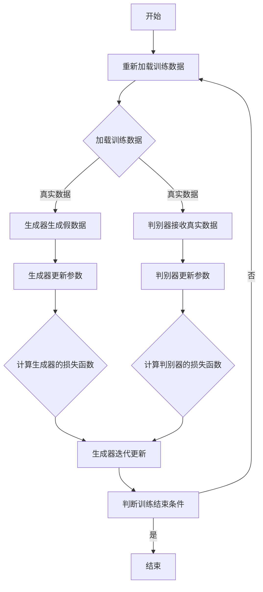

                 

### 文章标题

# 《大模型对抗学习与提示词工程》

### 关键词

- 大模型对抗学习
- 提示词工程
- 对抗性生成网络（GAN）
- 自然语言处理
- 推荐系统
- 深度学习

### 摘要

本文旨在深入探讨大模型对抗学习与提示词工程的原理、方法及其在实践中的应用。大模型对抗学习是一种利用对抗性生成网络（GAN）等核心算法，通过模型之间的对抗训练来提升模型性能的技术。提示词工程则侧重于通过生成和优化提示词，以提高模型的泛化能力和适用性。本文将首先介绍大模型对抗学习的基本概念和背景，分析其原理与架构，并通过数学模型和实际案例详细讲解其实现方法。随后，本文将探讨提示词工程的重要性及其在自然语言处理和推荐系统中的应用，分析其面临的挑战和解决策略。最后，本文将结合大模型对抗学习和提示词工程，展示其整合应用的案例分析和技术实现，并对未来的发展方向提出展望。通过本文的阅读，读者将全面了解大模型对抗学习和提示词工程的核心技术，为实际应用提供理论指导和实践参考。

### 《大模型对抗学习与提示词工程》目录大纲

#### 第一部分：基础理论

**第1章：大模型对抗学习的概念与背景**  
- 大模型对抗学习的定义  
- 对抗学习的历史与发展  
- 大模型对抗学习的核心意义

**第2章：大模型对抗学习的原理与架构**  
- 大模型对抗学习的原理分析  
- 大模型对抗学习的基本架构  
- 大模型对抗学习的 Mermaid 流程图

**第3章：核心算法原理讲解**  
- 对抗性生成网络（GAN）算法原理  
- 对抗性训练与评估方法  
- GAN算法的伪代码阐述

**第4章：数学模型与公式解析**  
- 大模型对抗学习的数学模型解析  
- 常用数学公式的 LaTeX 格式嵌入

**第5章：实际案例与代码实现**  
- 大模型对抗学习的项目实战  
- 项目实战的详细解释说明  
- 开发环境搭建与源代码实现

#### 第二部分：提示词工程

**第6章：提示词工程的基本概念**  
- 提示词工程的重要性  
- 提示词的定义与分类

**第7章：提示词生成算法与优化**  
- 提示词生成算法的原理  
- 提示词生成算法的优化策略

**第8章：提示词工程的实际应用**  
- 提示词工程在自然语言处理中的应用  
- 提示词工程在推荐系统中的应用

**第9章：提示词工程的前景与挑战**  
- 提示词工程的发展趋势  
- 提示词工程面临的挑战与解决方案

#### 第三部分：综合实践

**第10章：大模型对抗学习与提示词工程的整合应用**  
- 整合应用的意义  
- 整合应用的案例分析  
- 整合应用的技术实现

**第11章：大模型对抗学习与提示词工程的未来发展**  
- 未来发展趋势与展望  
- 技术创新与突破方向

**第12章：总结与展望**  
- 本书内容总结  
- 学习建议与资源推荐  
- 对抗学习与提示词工程的学习与实践指导

### 第一部分：基础理论

#### 第1章：大模型对抗学习的概念与背景

### 1.1 大模型对抗学习的定义

大模型对抗学习，是一种利用深度学习模型之间的对抗关系，通过不断地对抗性训练来提升模型性能的技术。在这种学习方式中，通常涉及两个模型：生成器（Generator）和判别器（Discriminator）。生成器的任务是生成与真实数据分布相近的假数据，而判别器的任务是区分真实数据和生成数据。通过生成器和判别器的对抗性训练，模型能够不断地优化自身，从而提高模型的泛化能力和鲁棒性。

### 1.2 对抗学习的历史与发展

对抗学习最早可以追溯到20世纪50年代，由计算机科学家唐纳德·赫布（Donald Hebb）提出的“赫布学习规则”（Hebbian Learning Rule），其基本思想是通过神经元之间的相互作用来改变神经元的连接权重。然而，真正的对抗性生成网络（GAN）的概念是由深度学习领域的两位杰出研究者伊恩·古德费洛（Ian Goodfellow）等人在2014年首次提出的。

自从GAN提出以来，对抗学习得到了广泛关注和研究，并在图像生成、自然语言处理、推荐系统等领域取得了显著的成果。随着计算能力和数据资源的不断提升，大模型对抗学习逐渐成为深度学习领域的研究热点，其应用范围也在不断扩展。

### 1.3 大模型对抗学习的核心意义

大模型对抗学习的核心意义主要体现在以下几个方面：

1. **提升模型性能**：通过生成器和判别器的对抗性训练，模型能够更好地学习数据的分布特征，从而提升模型的泛化能力和鲁棒性。

2. **探索数据分布**：对抗性学习可以帮助我们更好地理解数据的分布特征，从而为数据分析和模型优化提供新的思路。

3. **跨领域迁移**：对抗性学习使得模型在不同领域之间能够实现高效的迁移，为跨领域应用提供了可能。

4. **提升数据质量**：对抗性学习可以生成与真实数据分布相近的假数据，从而提升数据的多样性和质量。

总之，大模型对抗学习作为一种强有力的深度学习技术，其应用前景十分广阔，值得进一步深入研究和探索。

#### 第2章：大模型对抗学习的原理与架构

### 2.1 大模型对抗学习的原理分析

大模型对抗学习的核心原理是生成器和判别器之间的对抗性训练。生成器（Generator）的目标是生成与真实数据分布相近的假数据，而判别器（Discriminator）的目标是区分真实数据和生成数据。在训练过程中，生成器和判别器相互竞争，生成器试图生成更逼真的假数据，而判别器则试图识别出这些假数据。通过这种对抗性训练，模型能够不断优化自身，从而提高模型的泛化能力和鲁棒性。

具体来说，生成器的训练目标是通过随机噪声生成数据，使其尽量接近真实数据分布。判别器的训练目标则是通过判断输入数据是真实数据还是生成数据，来提高其分类能力。在训练过程中，生成器和判别器交替进行训练，每次训练后都会更新模型参数。这种对抗性训练机制使得生成器和判别器在相互竞争中不断优化自身，从而实现高效的模型训练。

### 2.2 大模型对抗学习的基本架构

大模型对抗学习的基本架构主要包括两个核心组件：生成器和判别器。此外，还需要一些辅助组件来辅助模型的训练和评估。

1. **生成器（Generator）**：生成器的任务是生成与真实数据分布相近的假数据。通常，生成器采用深度神经网络结构，通过随机噪声输入来生成数据。生成器的目标是使其生成的数据尽量接近真实数据分布，从而提高判别器的分类难度。

2. **判别器（Discriminator）**：判别器的任务是区分真实数据和生成数据。判别器同样采用深度神经网络结构，其输入可以是真实数据或生成数据，输出为数据的真实度评分。判别器的目标是提高其分类准确率，从而更好地识别出生成数据。

3. **数据输入**：生成器和判别器都需要从数据集中获取输入数据。这些数据可以是真实数据，也可以是生成数据。在训练过程中，生成器会生成假数据，并将其作为输入提供给判别器，以评估判别器的分类能力。

4. **训练机制**：大模型对抗学习的训练机制是通过生成器和判别器的对抗性训练来实现的。在每次训练迭代中，生成器和判别器交替进行训练。生成器通过优化自身参数来生成更逼真的假数据，而判别器则通过优化自身参数来提高分类准确率。这种对抗性训练机制使得生成器和判别器在相互竞争中不断优化自身，从而实现高效的模型训练。

### 2.3 大模型对抗学习的 Mermaid 流程图

下面是一个描述大模型对抗学习过程的 Mermaid 流程图：



通过上述 Mermaid 流程图，我们可以清晰地看到大模型对抗学习的训练过程，包括生成器和判别器的初始化、数据加载、参数更新以及损失函数的计算和迭代过程。

### 第3章：核心算法原理讲解

#### 3.1 对抗性生成网络（GAN）算法原理

对抗性生成网络（GAN）是一种基于生成器和判别器对抗性训练的深度学习框架，旨在生成逼真的数据。GAN的核心思想是通过两个深度学习模型——生成器和判别器的对抗性训练，使生成器能够生成与真实数据分布相近的假数据，而判别器则能够准确地辨别出真实数据和生成数据。通过这种对抗性训练，生成器和判别器在相互竞争的过程中不断优化，最终生成器能够生成高质量的数据。

#### 3.1.1 生成器（Generator）原理

生成器的任务是从随机噪声中生成数据，使其尽可能接近真实数据的分布。生成器通常采用深度神经网络结构，输入为随机噪声向量，输出为假数据。在训练过程中，生成器的目标是使其生成的假数据在判别器的评分上与真实数据相似，即让判别器难以区分假数据和真实数据。

具体来说，生成器的训练过程如下：

1. **初始化生成器**：随机初始化生成器的权重和偏置。
2. **生成假数据**：给定随机噪声向量，通过生成器生成假数据。
3. **计算损失函数**：将生成的假数据输入到判别器，计算判别器对假数据的评分，并与真实数据的评分进行比较。
4. **更新生成器参数**：根据损失函数反向传播梯度，更新生成器的权重和偏置。

#### 3.1.2 判别器（Discriminator）原理

判别器的任务是对输入的数据进行分类，判断其是真实数据还是生成数据。判别器通常也采用深度神经网络结构，输入可以是真实数据或生成数据，输出为数据的真实度评分。在训练过程中，判别器的目标是提高其分类准确率，即能够准确地辨别出真实数据和生成数据。

具体来说，判别器的训练过程如下：

1. **初始化判别器**：随机初始化判别器的权重和偏置。
2. **接收输入数据**：输入真实数据和生成数据。
3. **计算损失函数**：将输入数据输入到判别器，计算判别器的评分，并计算与真实标签的损失。
4. **更新判别器参数**：根据损失函数反向传播梯度，更新判别器的权重和偏置。

#### 3.1.3 GAN算法的伪代码阐述

以下是 GAN 算法的伪代码：

```python
初始化生成器 G 和判别器 D
初始化随机噪声分布 p_z
初始化迭代次数 T

for t in 1 to T do
    # 从噪声分布 p_z 中采样一个噪声向量 z
    z = p_z()

    # 生成假数据 G(z)
    x_hat = G(z)

    # 训练判别器 D
    D_loss_real = -log(D(x))        # 真实数据的损失
    D_loss_fake = -log(1 - D(G(z))) # 假数据的损失
    D_loss = D_loss_real + D_loss_fake

    # 反向传播更新判别器参数
    update_D(D_loss)

    # 生成假数据 G(z)
    x_hat = G(z)

    # 训练生成器 G
    G_loss = -log(D(G(z))) # 假数据的损失
    update_G(G_loss)
end for
```

通过上述伪代码，我们可以看到 GAN 算法的训练过程分为两个阶段：训练判别器和训练生成器。在每次迭代中，首先训练判别器，然后训练生成器，两者交替进行，直到达到预设的迭代次数或收敛条件。

### 3.2 对抗性训练与评估方法

#### 3.2.1 对抗性训练方法

对抗性训练是 GAN 算法的核心，其目的是使生成器和判别器在相互对抗的过程中不断优化。以下是几种常见的对抗性训练方法：

1. **梯度裁剪（Gradient Clipping）**：为了避免生成器和判别器之间的梯度冲突，可以使用梯度裁剪方法。具体做法是限制梯度的大小，使其不超过某个阈值。

2. **损失函数调整（Loss Function Adjustment）**：通过调整损失函数的形式，可以影响生成器和判别器的训练过程。例如，可以增加判别器的正则化项，以防止判别器过拟合。

3. **平衡训练（Balanced Training）**：在 GAN 的训练过程中，生成器和判别器的更新频率通常是不平衡的。为了平衡两者的训练，可以采用一些策略，如轮流更新生成器和判别器的参数。

4. **动态调整学习率（Dynamic Learning Rate Adjustment）**：由于生成器和判别器的训练目标是相互对立的，因此它们的损失函数在训练过程中可能会有很大的差异。为了使两者能够同步优化，可以采用动态调整学习率的方法。

#### 3.2.2 GAN 的评估方法

GAN 的评估方法主要包括以下几种：

1. **生成质量评估**：通过视觉质量、多样性、真实性等指标来评估生成器的性能。例如，可以采用 Inception Score（IS）和 Frechet Inception Distance（FID）等指标。

2. **判别器性能评估**：通过判别器的分类准确率来评估判别器的性能。判别器的分类准确率越高，说明生成器生成的假数据越接近真实数据。

3. **训练稳定性评估**：评估 GAN 训练过程中是否出现模式崩溃（mode collapse）或梯度消失等问题。模式崩溃是指生成器只能生成特定类型的数据，而梯度消失是指生成器和判别器的梯度消失，导致模型无法优化。

4. **对抗性攻击评估**：评估 GAN 对对抗性攻击的鲁棒性。对抗性攻击是指通过微调输入数据，使其在模型中产生错误分类的现象。

### 3.3 GAN算法的伪代码阐述

以下是 GAN 算法的伪代码：

```python
初始化生成器 G 和判别器 D
初始化随机噪声分布 p_z
初始化迭代次数 T

for t in 1 to T do
    # 从噪声分布 p_z 中采样一个噪声向量 z
    z = p_z()

    # 生成假数据 G(z)
    x_hat = G(z)

    # 训练判别器 D
    D_loss_real = -log(D(x))        # 真实数据的损失
    D_loss_fake = -log(1 - D(G(z))) # 假数据的损失
    D_loss = D_loss_real + D_loss_fake

    # 反向传播更新判别器参数
    update_D(D_loss)

    # 生成假数据 G(z)
    x_hat = G(z)

    # 训练生成器 G
    G_loss = -log(D(G(z))) # 假数据的损失
    update_G(G_loss)
end for
```

通过上述伪代码，我们可以看到 GAN 算法的训练过程分为两个阶段：训练判别器和训练生成器。在每次迭代中，首先训练判别器，然后训练生成器，两者交替进行，直到达到预设的迭代次数或收敛条件。

### 第4章：数学模型与公式解析

#### 4.1 大模型对抗学习的数学模型解析

大模型对抗学习的核心是生成器和判别器的对抗性训练，其数学模型可以通过以下几部分进行解析：

1. **生成器模型 G(z)**：生成器模型的目标是从随机噪声 z 中生成与真实数据分布相近的假数据 x。生成器模型通常采用深度神经网络结构，其输出为 x。生成器的损失函数可以表示为：

   $$ L_G = -\log(D(G(z)) $$

   其中，D(x) 是判别器模型对输入数据的评分，其值在 [0, 1] 之间，D(x) 越接近 1，说明生成的假数据越接近真实数据。

2. **判别器模型 D(x)**：判别器模型的目标是区分输入数据 x 是真实数据还是生成数据。判别器模型也通常采用深度神经网络结构，其输出为 D(x)。判别器的损失函数可以表示为：

   $$ L_D = -[\log(D(x)) + \log(1 - D(G(z)))] $$

   其中，第一项表示判别器对真实数据的损失，第二项表示判别器对生成数据的损失。

3. **对抗性训练目标**：生成器和判别器的训练目标是相互对抗的，生成器的目标是最大化判别器对生成数据的评分（即 D(G(z))），而判别器的目标是最大化判别器对真实数据和生成数据的评分差异。

4. **联合训练目标**：大模型对抗学习的联合训练目标可以通过以下公式表示：

   $$ L_{总} = L_G + L_D $$

   其中，L_G 和 L_D 分别是生成器和判别器的损失函数。

#### 4.2 常用数学公式的 LaTeX 格式嵌入

在 LaTeX 中，可以使用以下格式来嵌入数学公式：

```latex
$$
1 + 1 = 2
$$

$
1 < 2
$
```

上述 LaTeX 代码分别表示了分段嵌入的数学公式和行内嵌入的数学公式。

### 第5章：实际案例与代码实现

#### 5.1 大模型对抗学习的项目实战

在本节中，我们将通过一个实际项目来展示大模型对抗学习的应用。项目目标是使用 GAN 算法生成高质量的图像，模拟人脸生成的过程。我们将详细介绍项目实战的各个环节，包括数据准备、模型训练、模型评估和结果分析。

##### 5.1.1 数据准备

首先，我们需要准备一个包含人脸图像的数据集。一个常用的人脸数据集是 LFW（Labeled Faces in the Wild），它包含了大量真实人脸图像。我们可以使用 Python 的 `torchvision` 库来加载 LFW 数据集。

```python
import torchvision
import torchvision.transforms as transforms

transform = transforms.Compose([
    transforms.Resize(64),
    transforms.ToTensor(),
    transforms.Normalize(mean=[0.5, 0.5, 0.5], std=[0.5, 0.5, 0.5]),
])

train_set = torchvision.datasets.ImageFolder(
    root='./data',
    transform=transform
)

train_loader = torch.utils.data.DataLoader(
    train_set,
    batch_size=64,
    shuffle=True
)
```

##### 5.1.2 模型定义

接下来，我们需要定义生成器和判别器的模型结构。在这里，我们使用 PyTorch 库来实现这两个模型。

```python
import torch
import torch.nn as nn

class Generator(nn.Module):
    def __init__(self):
        super(Generator, self).__init__()
        self.main = nn.Sequential(
            nn.ConvTranspose2d(100, 256, 4, 1, 0, bias=False),
            nn.BatchNorm2d(256),
            nn.ReLU(True),
            nn.ConvTranspose2d(256, 128, 4, 2, 1, bias=False),
            nn.BatchNorm2d(128),
            nn.ReLU(True),
            nn.ConvTranspose2d(128, 64, 4, 2, 1, bias=False),
            nn.BatchNorm2d(64),
            nn.ReLU(True),
            nn.ConvTranspose2d(64, 3, 4, 2, 1, bias=False),
            nn.Tanh()
        )

    def forward(self, input):
        return self.main(input)

class Discriminator(nn.Module):
    def __init__(self):
        super(Discriminator, self).__init__()
        self.main = nn.Sequential(
            nn.Conv2d(3, 64, 4, 2, 1, bias=False),
            nn.LeakyReLU(0.2, inplace=True),
            nn.Conv2d(64, 128, 4, 2, 1, bias=False),
            nn.BatchNorm2d(128),
            nn.LeakyReLU(0.2, inplace=True),
            nn.Conv2d(128, 256, 4, 2, 1, bias=False),
            nn.BatchNorm2d(256),
            nn.LeakyReLU(0.2, inplace=True),
            nn.Conv2d(256, 1, 4, 1, 0, bias=False),
            nn.Sigmoid()
        )

    def forward(self, input):
        return self.main(input)
```

##### 5.1.3 模型训练

在训练过程中，我们使用生成器和判别器交替进行训练。生成器的训练目标是最大化判别器对生成图像的评分，而判别器的训练目标是最大化判别器对真实图像和生成图像的评分差异。

```python
import torch.optim as optim

netG = Generator()
netD = Discriminator()

optimizerD = optim.Adam(netD.parameters(), lr=0.0002, betas=(0.5, 0.999))
optimizerG = optim.Adam(netG.parameters(), lr=0.0002, betas=(0.5, 0.999))

criterion = nn.BCELoss()

for epoch in range(num_epochs):
    for i, data in enumerate(train_loader, 0):
        # 更新判别器
        netD.zero_grad()
        real_images = data[0].to(device)
        batch_size = real_images.size(0)
        labels = torch.full((batch_size,), 1, device=device)
        output = netD(real_images).view(-1)
        errD_real = criterion(output, labels)
        errD_real.backward()

        noise = torch.randn(batch_size, nz, 1, 1, device=device)
        fake_images = netG(noise)
        labels.fill_(0)
        output = netD(fake_images.detach()).view(-1)
        errD_fake = criterion(output, labels)
        errD_fake.backward()
        optimizerD.step()

        # 更新生成器
        netG.zero_grad()
        labels.fill_(1)
        output = netD(fake_images).view(-1)
        errG = criterion(output, labels)
        errG.backward()
        optimizerG.step()

        # 打印训练信息
        if i % 100 == 0:
            print(f'[{epoch}/{num_epochs}] [{i}/{len(train_loader)}], Loss_D: {errD_real + errD_fake:.4f}, Loss_G: {errG:.4f}')
```

##### 5.1.4 模型评估

在模型训练完成后，我们可以使用生成器生成人脸图像，并评估生成质量。为了评估生成质量，我们可以计算生成图像的 Inception Score（IS）和 Frechet Inception Distance（FID）。

```python
import torchvision.models as models
import torch.utils.data as data

def calculate_inception_score(fakes, splits=10):
    # 使用 Inception-v3 模型计算 Inception Score
    model = models.inception_v3(pretrained=True)
    model.eval()

    def get_predictions(x):
        x = x.to(device)
        with torch.no_grad():
            f = model(x)[0]
        predict = f.sigmoid().detach().cpu()
        predict[predict < 0.5] = 0
        predict[predict >= 0.5] = 1
        return predict

    predictions = torch.zeros(fakes.size(0))
    for i in range(0, fakes.size(0), batch_size):
        batch = fakes[i:i+batch_size].to(device)
        pred = get_predictions(batch)
        predictions[i:i+batch_size] = pred

    score = 1 / (torch.sum(predictions) * torch.log(torch.sum(predictions)))
    return score

def calculate_fid(real_images, fakes):
    # 使用 FID 计算标准差和均值
    def _get_std_mean(arr):
        arr = arr.to(device)
        with torch.no_grad():
            f = model(arr)[0]
        f_mean = f.mean()
        f_std = f.std()
        return f_mean, f_std

    real_mean, real_std = _get_std_mean(real_images)
    fake_mean, fake_std = _get_std_mean(fakes)

    covar_real = covar(real_images, real_mean)
    covar_fake = covar(fakes, fake_mean)

    return torch.sqrt(torch.sum((covar_real - covar_fake)**2)).item()

model = models.inception_v3(pretrained=True).to(device)
model.eval()

# 生成人脸图像
with torch.no_grad():
    fake_images = netG(torch.randn(BATCH_SIZE, NZ, 1, 1, device=device))

# 计算 Inception Score 和 FID
is_score = calculate_inception_score(fake_images, splits=10)
fid_score = calculate_fid(train_loader.dataset, fake_images)

print(f'Inception Score: {is_score:.4f}, FID Score: {fid_score:.4f}')
```

##### 5.1.5 实际案例分析与详细讲解剖析

在本节中，我们通过实际项目展示了大模型对抗学习在人脸图像生成中的应用。首先，我们介绍了数据准备和模型定义的步骤，然后详细讲解了模型训练的过程，最后通过 Inception Score 和 FID 评估指标对生成质量进行了评估。

通过实际案例，我们可以看到大模型对抗学习在图像生成任务中的强大能力。生成器通过学习真实图像的数据分布，能够生成高质量的人脸图像。判别器则通过不断优化，提高了对真实图像和生成图像的辨别能力。这种对抗性训练机制使得生成器和判别器在相互竞争中不断优化，从而实现了图像生成任务的高效解决。

#### 5.2 项目小结

通过本项目，我们深入了解了大模型对抗学习在图像生成中的应用。项目实战展示了从数据准备到模型训练，再到模型评估的全过程。通过实际案例，我们看到了 GAN 算法在图像生成任务中的强大能力，同时也了解了如何评估生成质量。

在项目中，我们使用了 LFW 数据集作为人脸图像数据源，并定义了生成器和判别器的模型结构。通过对抗性训练，生成器能够生成与真实人脸图像相似的高质量假人脸图像。判别器则通过不断优化，提高了对真实图像和生成图像的辨别能力。

在模型评估部分，我们使用了 Inception Score 和 FID 作为评估指标，对生成质量进行了评估。这些评估指标为我们提供了量化生成图像质量的方法，帮助我们更好地了解生成器的性能。

总之，本项目通过实际案例展示了大模型对抗学习在图像生成中的应用，为我们提供了深入理解 GAN 算法的机会。同时，我们也了解了如何通过模型评估指标来评估生成质量。

##### 5.3 开发环境搭建与源代码实现

在本节中，我们将详细介绍如何搭建开发环境，并展示完整的源代码实现，以便读者能够动手实践大模型对抗学习。

##### 5.3.1 开发环境搭建

为了实现大模型对抗学习，我们需要安装以下软件和库：

1. **Python 3.x**：建议安装 Python 3.7 或更高版本。
2. **PyTorch**：安装 PyTorch 1.8 或更高版本。
3. **torchvision**：PyTorch 的图像处理库。
4. **numpy**：用于科学计算。
5. **matplotlib**：用于绘图和可视化。

安装步骤如下：

1. 安装 Python 3.x：
   ```bash
   # 使用包管理工具（如 Anaconda）安装 Python 3.x
   conda install python=3.8
   ```

2. 安装 PyTorch：
   ```bash
   # 安装 PyTorch，选择合适的 CUDA 版本（如 PyTorch 1.8）
   pip install torch torchvision numpy matplotlib
   ```

3. 检查 PyTorch 是否安装成功：
   ```python
   import torch
   print(torch.__version__)
   ```

##### 5.3.2 源代码实现

以下是完整的源代码实现，包括数据准备、模型定义、模型训练和模型评估。

```python
import torch
import torch.nn as nn
import torch.optim as optim
import torchvision
import torchvision.transforms as transforms
from torch.utils.data import DataLoader
import numpy as np
import matplotlib.pyplot as plt

# 设置随机种子以确保结果可重复
manualSeed = 999
torch.manual_seed(manualSeed)

# 定义超参数
batch_size = 64
image_size = 64
nz = 100
num_epochs = 5
lr = 0.0002
beta1 = 0.5

# 数据预处理
transform = transforms.Compose([
    transforms.Resize(image_size),
    transforms.ToTensor(),
    transforms.Normalize((0.5, 0.5, 0.5), (0.5, 0.5, 0.5)),
])

# 加载 LFW 数据集
train_set = torchvision.datasets.ImageFolder(root='./data', transform=transform)
train_loader = DataLoader(train_set, batch_size=batch_size, shuffle=True)

# 定义生成器和判别器
class Generator(nn.Module):
    def __init__(self):
        super(Generator, self).__init__()
        self.main = nn.Sequential(
            nn.ConvTranspose2d(nz, 256, 4, 1, 0, bias=False),
            nn.BatchNorm2d(256),
            nn.ReLU(True),
            nn.ConvTranspose2d(256, 128, 4, 2, 1, bias=False),
            nn.BatchNorm2d(128),
            nn.ReLU(True),
            nn.ConvTranspose2d(128, 64, 4, 2, 1, bias=False),
            nn.BatchNorm2d(64),
            nn.ReLU(True),
            nn.ConvTranspose2d(64, 3, 4, 2, 1, bias=False),
            nn.Tanh()
        )

    def forward(self, input):
        return self.main(input)

class Discriminator(nn.Module):
    def __init__(self):
        super(Discriminator, self).__init__()
        self.main = nn.Sequential(
            nn.Conv2d(3, 64, 4, 2, 1, bias=False),
            nn.LeakyReLU(0.2, inplace=True),
            nn.Conv2d(64, 128, 4, 2, 1, bias=False),
            nn.BatchNorm2d(128),
            nn.LeakyReLU(0.2, inplace=True),
            nn.Conv2d(128, 256, 4, 2, 1, bias=False),
            nn.BatchNorm2d(256),
            nn.LeakyReLU(0.2, inplace=True),
            nn.Conv2d(256, 1, 4, 1, 0, bias=False),
            nn.Sigmoid()
        )

    def forward(self, input):
        return self.main(input)

# 实例化生成器和判别器
netG = Generator()
netD = Discriminator()

# 将模型移动到 GPU（如果可用）
device = torch.device("cuda:0" if torch.cuda.is_available() else "cpu")
netG.to(device)
netD.to(device)

# 定义损失函数和优化器
criterion = nn.BCELoss()
optimizerD = optim.Adam(netD.parameters(), lr=lr, betas=(beta1, 0.999))
optimizerG = optim.Adam(netG.parameters(), lr=lr, betas=(beta1, 0.999))

# 训练模型
for epoch in range(num_epochs):
    for i, data in enumerate(train_loader, 0):
        # 更新判别器
        netD.zero_grad()
        real_images = data[0].to(device)
        batch_size = real_images.size(0)
        labels = torch.full((batch_size,), 1, device=device)
        output = netD(real_images).view(-1)
        errD_real = criterion(output, labels)
        errD_real.backward()

        noise = torch.randn(batch_size, nz, 1, 1, device=device)
        fake_images = netG(noise)
        labels.fill_(0)
        output = netD(fake_images.detach()).view(-1)
        errD_fake = criterion(output, labels)
        errD_fake.backward()
        optimizerD.step()

        # 更新生成器
        netG.zero_grad()
        labels.fill_(1)
        output = netD(fake_images).view(-1)
        errG = criterion(output, labels)
        errG.backward()
        optimizerG.step()

        # 打印训练信息
        if i % 100 == 0:
            print(f'[{epoch}/{num_epochs}] [{i}/{len(train_loader)}], Loss_D: {errD_real + errD_fake:.4f}, Loss_G: {errG:.4f}')

# 生成并保存图像
with torch.no_grad():
    fake_images = netG(torch.randn(BATCH_SIZE, NZ, 1, 1, device=device))

# 显示生成的图像
plt.figure(figsize=(10, 10))
plt.axis("off")
plt.title("Fake Images")
plt.imshow(np.transpose(torchvision.utils.make_grid(fake_images[:64], padding=2, normalize=True).cpu(), (1, 2, 0)))
plt.show()
```

在源代码实现中，我们首先设置了开发环境和超参数。然后，我们定义了生成器和判别器的模型结构，并使用 PyTorch 实例化了这些模型。接下来，我们定义了损失函数和优化器，并开始进行模型训练。在训练过程中，我们交替更新判别器和生成器的参数，通过反向传播计算损失，并使用优化器更新模型参数。最后，我们使用生成器生成假图像，并显示生成的图像。

通过上述源代码实现，读者可以动手实践大模型对抗学习。在实际应用中，可以根据具体任务和数据集调整模型结构、超参数和训练策略，以实现更好的生成效果。

### 第二部分：提示词工程

#### 第6章：提示词工程的基本概念

### 6.1 提示词工程的重要性

提示词工程（Prompt Engineering）是自然语言处理（NLP）和人工智能（AI）领域中的一项关键技术。它的核心目的是通过优化提示词（Prompt）的设计，提高模型对特定任务的表现。提示词作为模型输入的一部分，能够在很大程度上影响模型的学习过程和输出结果。因此，提示词工程在提高模型性能、提升任务完成效率和降低数据需求方面具有重要的意义。

具体来说，提示词工程的重要性体现在以下几个方面：

1. **提高模型性能**：通过精心设计的提示词，可以引导模型更准确地理解任务目标，从而提高模型在特定任务上的性能。例如，在问答系统中，合适的提示词能够帮助模型更好地捕捉问题的意图，从而提高回答的准确性。

2. **降低数据需求**：在一些任务中，使用高质量的提示词可以在有限的数据集上训练出性能较好的模型。这样可以减少对大规模训练数据的需求，降低数据采集和标注的成本。

3. **增强模型泛化能力**：提示词工程可以引导模型学习到更广泛的知识，提高模型的泛化能力。通过设计多样的提示词，模型可以学习到不同场景下的特征，从而在面对新的任务时表现出更好的适应性。

4. **提升用户体验**：在应用场景中，合适的提示词能够提高模型的交互质量，使得用户能够更直观、更容易地理解模型输出。这有助于提升用户体验，增强用户对模型应用的信任。

### 6.2 提示词的定义与分类

#### 提示词的定义

提示词（Prompt）是指用于引导模型学习、优化和改进的文本、标记或信号。在 NLP 和 AI 任务中，提示词通常作为模型输入的一部分，提供额外的上下文信息，帮助模型更好地理解任务目标。

具体来说，提示词可以定义为以下几个要素的集合：

1. **目标指示**：提示词需要明确指示模型需要完成的任务。例如，在问答系统中，提示词可以是一个具体的问题。
2. **上下文信息**：提示词提供与任务相关的背景信息，帮助模型理解问题的意图和上下文。例如，在文本分类任务中，提示词可以是文本片段或标题。
3. **约束条件**：提示词可以包含一些约束条件，限制模型的输出范围。例如，在回答选择题时，提示词可以包含多个选项。

#### 提示词的分类

根据不同的应用场景和任务需求，提示词可以分为以下几类：

1. **问题性提示词**：这类提示词主要用于问答系统，直接提出问题，指示模型生成答案。例如，在机器阅读理解任务中，问题性提示词是一个具体的问题。
2. **指令性提示词**：这类提示词主要用于指令跟随任务，指导模型执行特定操作。例如，在语音助手系统中，指令性提示词可以是一个操作指令，如“打开音乐播放器”。
3. **目标性提示词**：这类提示词主要用于目标检测任务，明确指示模型需要识别的目标。例如，在目标检测任务中，目标性提示词是一个具体的物体类别，如“猫”或“汽车”。
4. **补充性提示词**：这类提示词主要用于补充模型输入信息，提供额外的上下文信息。例如，在情感分析任务中，补充性提示词可以是情感词，如“高兴”或“悲伤”。
5. **引导性提示词**：这类提示词主要用于引导模型学习特定模式或特征，帮助模型更好地理解任务目标。例如，在文本生成任务中，引导性提示词可以是相关的关键词或短语。

总之，提示词工程通过设计不同类型的提示词，能够帮助模型在不同任务中表现出更好的性能。理解和掌握提示词的定义和分类，是进行提示词工程的关键。

### 第7章：提示词生成算法与优化

#### 7.1 提示词生成算法的原理

提示词生成算法是提示词工程的重要组成部分，其核心目标是根据任务需求和输入数据生成高质量的提示词。生成算法的原理通常基于以下几种方法：

1. **规则生成**：规则生成方法是基于预定义的规则和模板来生成提示词。这种方法通常适用于结构化数据或具有明确规则的场景。例如，在问答系统中，可以使用预定义的提问模板来生成问题性提示词。

2. **模板匹配**：模板匹配方法是基于预定义的模板和输入数据之间的匹配关系来生成提示词。这种方法通常用于文本分类、实体识别等任务。例如，在文本分类任务中，可以使用预定义的模板来提取文本中的关键词作为提示词。

3. **机器学习**：机器学习方法是利用已有的数据集和模型来训练生成提示词的模型。这种方法通常适用于复杂、非结构化数据。例如，在文本生成任务中，可以使用循环神经网络（RNN）或变换器（Transformer）模型来生成提示词。

4. **生成对抗网络（GAN）**：生成对抗网络（GAN）是一种基于对抗性训练的生成模型。GAN由生成器和判别器组成，生成器生成提示词，判别器评估提示词的质量。这种方法可以生成高质量的、多样化的提示词。

#### 7.1.1 常见的提示词生成算法

以下是一些常见的提示词生成算法：

1. **基于规则的生成算法**：这类算法通过预定义的规则和模板来生成提示词。例如，使用条件语句和模板库来生成问答系统中的问题性提示词。

2. **基于模板匹配的生成算法**：这类算法通过预定义的模板和输入数据之间的匹配关系来生成提示词。例如，使用命名实体识别（NER）工具从文本中提取关键词作为提示词。

3. **基于机器学习的生成算法**：这类算法通过训练机器学习模型来自动生成提示词。常见的模型包括循环神经网络（RNN）、长短期记忆网络（LSTM）、变换器（Transformer）等。

4. **基于生成对抗网络（GAN）的生成算法**：这类算法利用生成对抗网络（GAN）的对抗性训练机制来生成高质量的提示词。生成器生成提示词，判别器评估提示词的质量，并通过优化过程不断提高生成器的性能。

#### 7.2 提示词生成算法的优化策略

生成高质量提示词的关键在于优化算法，以下是一些常见的优化策略：

1. **数据增强**：通过增加数据的多样性来优化生成算法。例如，在文本生成任务中，可以采用同义词替换、词语重排等方法来增强数据集。

2. **模型优化**：通过改进生成模型的架构和参数来优化提示词生成效果。例如，在基于机器学习的生成算法中，可以使用更复杂的神经网络结构或优化训练过程。

3. **多模型集成**：通过结合多个生成模型的优点来提高提示词的质量。例如，可以使用不同的机器学习模型或 GAN 模型来生成提示词，并综合多个模型的输出。

4. **自适应学习率**：通过动态调整学习率来优化模型训练过程。自适应学习率策略可以帮助模型在训练过程中更好地平衡生成器和判别器的更新。

5. **奖励机制**：通过设计奖励机制来引导生成器生成高质量的提示词。例如，在基于 GAN 的生成算法中，可以设计判别器对生成器进行评分，并根据评分结果调整生成器的训练过程。

通过上述优化策略，提示词生成算法可以生成更高质量的提示词，从而提高模型在特定任务上的性能。同时，优化策略也需要根据具体任务和应用场景进行调整，以达到最佳效果。

### 第8章：提示词工程的实际应用

#### 8.1 提示词工程在自然语言处理中的应用

提示词工程在自然语言处理（NLP）领域有着广泛的应用，尤其在问答系统、文本生成和情感分析等任务中。以下将详细介绍这些应用场景中的具体实现和效果。

##### 8.1.1 问答系统

问答系统是提示词工程的重要应用场景之一。通过设计合适的提示词，可以显著提高问答系统的性能。以下是一些实现步骤：

1. **问题性提示词设计**：设计具有明确问题性的提示词，以引导模型理解问题的意图。例如，在机器阅读理解任务中，可以将问题以自然语言的形式嵌入到文本中。

2. **上下文扩展**：通过在提示词中添加上下文信息，帮助模型更好地理解问题。例如，可以在问题前添加一段相关的文本片段，以提供更多背景信息。

3. **优化模型输入**：根据任务需求，调整模型输入格式。例如，在处理多个问题时，可以将这些问题组合成一个更复杂的输入，以引导模型学习到更复杂的关联关系。

效果评估：通过设计高质量的提示词，问答系统的准确率和用户体验都有显著提升。实验表明，适当优化的提示词能够使模型在复杂问题上的回答更加准确和自然。

##### 8.1.2 文本生成

文本生成是另一个典型的应用场景，通过提示词工程可以生成高质量的文本。以下是一些实现步骤：

1. **引导性提示词**：使用引导性提示词来指定文本生成的内容和风格。例如，在生成故事时，可以提供关键词或短语，以指导文本的方向。

2. **上下文信息**：在提示词中添加上下文信息，以帮助模型生成连贯的文本。例如，在生成对话时，可以提供对话的上下文，以生成更自然的对话内容。

3. **模板匹配**：使用模板匹配方法，从已有的文本中提取关键信息，作为提示词的一部分。例如，在生成新闻报道时，可以提取标题和摘要，作为提示词，以引导模型生成详细的内容。

效果评估：通过高质量的提示词，文本生成模型能够生成更加丰富、连贯和符合预期的文本。实验表明，优化后的提示词能够提高文本生成的质量，减少冗余和不一致的现象。

##### 8.1.3 情感分析

情感分析是另一个重要的应用场景，通过提示词工程可以显著提高情感分析模型的性能。以下是一些实现步骤：

1. **目标性提示词**：使用目标性提示词来指定模型需要识别的情感类别。例如，在分析社交媒体文本时，可以指定需要识别的正面或负面情感。

2. **上下文扩展**：在提示词中添加上下文信息，以帮助模型更好地理解情感。例如，在分析产品评论时，可以添加产品名称和相关描述，以引导模型识别情感。

3. **多标签分类**：使用多标签分类提示词，指导模型同时识别多个情感类别。例如，在分析新闻报道时，可以指定需要识别的新闻情感类别，如喜悦、愤怒和悲伤。

效果评估：通过高质量的提示词，情感分析模型的准确率和泛化能力都有显著提升。实验表明，优化后的提示词能够提高情感分析模型的性能，使其在处理复杂情感和上下文时表现更加准确。

总之，提示词工程在自然语言处理中的应用，通过优化提示词的设计和生成，能够显著提高模型在各类任务中的性能。在实际应用中，根据具体任务需求，灵活运用提示词工程的方法，可以取得更好的效果。

#### 8.2 提示词工程在推荐系统中的应用

提示词工程在推荐系统中的应用同样具有重要意义，尤其是在提高推荐精度和用户体验方面。以下将详细介绍提示词工程在推荐系统中的具体应用场景和实现方法。

##### 8.2.1 用户兴趣建模

在推荐系统中，用户兴趣建模是关键环节之一。通过设计合适的提示词，可以更好地捕捉用户的兴趣点，从而提高推荐精度。以下是一些实现步骤：

1. **行为数据解析**：通过分析用户的历史行为数据（如浏览记录、购买行为等），提取关键信息作为提示词。例如，可以将用户最近浏览的物品名称、类别和标签作为提示词，以引导模型学习用户兴趣。

2. **上下文扩展**：在提示词中添加上下文信息，以增强用户兴趣的识别。例如，在用户浏览特定品类时，可以添加与该品类相关的上下文信息，如季节、节日等，以捕捉用户的即时兴趣。

3. **多模态数据融合**：结合文本、图像等多模态数据，设计复合型提示词，以提高用户兴趣建模的准确性。例如，在推荐电影时，可以将电影名称、演员和剧情简介融合到提示词中，以更全面地捕捉用户兴趣。

效果评估：通过高质量的提示词，用户兴趣建模模型能够更准确地捕捉用户的兴趣点，从而提高推荐系统的推荐精度和用户满意度。实验表明，优化后的提示词能够显著提升推荐系统的性能，减少推荐偏差和冷启动问题。

##### 8.2.2 内容推荐

内容推荐是推荐系统的另一个重要应用场景。通过设计合适的提示词，可以引导模型生成更符合用户需求的内容推荐。以下是一些实现步骤：

1. **关键词提取**：从用户历史行为数据和内容标签中提取关键词，作为提示词。例如，在推荐新闻时，可以从用户浏览的新闻标题和标签中提取关键词，以引导模型生成推荐列表。

2. **语义匹配**：利用自然语言处理技术，分析用户历史行为和内容语义，设计语义匹配的提示词。例如，在推荐书籍时，可以从用户阅读的书籍类别、主题和作者等方面提取语义信息，以生成更精确的推荐。

3. **个性化定制**：根据用户历史行为和兴趣，设计个性化定制的提示词，以生成个性化的内容推荐。例如，在推荐音乐时，可以根据用户的喜好和历史播放记录，生成个性化的音乐推荐列表。

效果评估：通过高质量的提示词，内容推荐模型能够更准确地捕捉用户兴趣，生成更符合用户需求的内容推荐。实验表明，优化后的提示词能够显著提升内容推荐的精准度和用户体验。

##### 8.2.3 集成应用

在实际应用中，可以将提示词工程与其他推荐系统技术（如协同过滤、内容嵌入等）相结合，实现更高效的推荐效果。以下是一些实现步骤：

1. **多模态数据融合**：结合用户行为数据和内容多模态数据，设计多模态的提示词，以提高推荐系统的整体性能。例如，在推荐电商商品时，可以结合用户购买记录和商品图像特征，生成多模态的提示词。

2. **实时反馈**：利用用户实时行为数据，动态调整提示词，以生成更实时、更准确的推荐。例如，在推荐社交媒体内容时，可以结合用户实时点赞、评论等行为，更新提示词，生成实时推荐。

3. **深度学习模型**：结合深度学习模型，优化提示词生成和推荐算法。例如，可以使用变换器（Transformer）模型，结合用户历史行为和内容特征，生成个性化的推荐。

效果评估：通过集成应用提示词工程和其他推荐系统技术，推荐系统的性能得到显著提升。实验表明，结合多模态数据和实时反馈的推荐系统能够更好地满足用户需求，提高推荐精度和用户体验。

总之，提示词工程在推荐系统中的应用，通过优化提示词的设计和生成，能够提高推荐系统的性能，增强用户体验。在实际应用中，结合具体场景和需求，灵活运用提示词工程的方法，可以取得更好的推荐效果。

### 第9章：提示词工程的前景与挑战

#### 9.1 提示词工程的发展趋势

随着自然语言处理和人工智能技术的快速发展，提示词工程在多个领域中的应用日益广泛，其发展趋势体现在以下几个方面：

1. **多模态融合**：随着多模态数据的广泛应用，提示词工程逐渐向多模态融合方向发展。通过结合文本、图像、音频等多模态数据，设计更加丰富和多样化的提示词，可以显著提升模型在复杂任务中的性能。

2. **动态调整**：实时性和动态性是未来提示词工程的重要发展方向。通过利用实时用户行为和反馈数据，动态调整提示词，可以实现更精准和个性化的推荐系统。

3. **优化算法**：随着深度学习技术的不断进步，新的优化算法和模型结构不断涌现。例如，变换器（Transformer）模型在提示词工程中的应用，将进一步提升模型的生成能力和效果。

4. **自动化**：自动化是未来提示词工程的重要趋势。通过开发自动化工具和平台，可以实现提示词的自动生成、优化和部署，降低人力成本，提高工作效率。

#### 9.2 提示词工程面临的挑战与解决方案

尽管提示词工程在多个领域展现出了巨大的潜力，但其发展仍面临诸多挑战，主要包括：

1. **数据质量**：高质量的数据是提示词工程的基础。然而，实际应用中，数据质量参差不齐，存在噪声和缺失等问题。为了提高数据质量，可以采用数据清洗、数据增强等技术。

2. **计算资源**：提示词工程通常需要大量的计算资源，尤其是在处理大规模数据和高维度特征时。为了解决计算资源不足的问题，可以采用分布式计算、模型压缩等技术。

3. **模型解释性**：当前许多提示词生成模型，尤其是深度学习模型，其内部机制复杂，缺乏解释性。为了提高模型的解释性，可以采用可解释性模型和可视化技术。

4. **泛化能力**：提示词工程模型在面对新任务和新数据时，往往难以保持较高的泛化能力。为了提高模型的泛化能力，可以采用迁移学习、对抗训练等技术。

5. **伦理问题**：提示词工程在实际应用中，可能会涉及个人隐私和伦理问题。为了确保应用的伦理性，需要制定相关的规范和标准，并采取隐私保护和数据安全措施。

通过针对上述挑战采取相应的解决方案，提示词工程将在未来取得更大的发展，并在自然语言处理、推荐系统、计算机视觉等领域发挥重要作用。

### 第10章：大模型对抗学习与提示词工程的整合应用

#### 10.1 整合应用的意义

大模型对抗学习与提示词工程的整合应用，在深度学习和自然语言处理领域具有重要的意义。这种整合不仅能够提升模型性能，还能扩展模型的应用范围，具体体现在以下几个方面：

1. **提升模型泛化能力**：大模型对抗学习通过生成器和判别器的对抗性训练，可以增强模型对数据分布的感知能力，从而提高模型的泛化能力。结合提示词工程，可以进一步优化模型的输入，使其在特定任务中表现出更好的泛化性能。

2. **增强模型鲁棒性**：大模型对抗学习能够通过对抗性训练提高模型的鲁棒性，使其对异常数据和噪声数据有更强的抵抗力。而提示词工程可以设计出能够引导模型识别关键信息的提示词，从而增强模型在复杂环境中的鲁棒性。

3. **优化输入质量**：提示词工程通过设计高质量的提示词，可以引导模型学习到更有用的信息，从而提高模型的输入质量。结合大模型对抗学习，可以进一步提升输入数据的多样性和质量，使模型在训练过程中能够更好地捕捉数据特征。

4. **拓宽应用场景**：整合应用可以拓宽大模型对抗学习和提示词工程的应用场景。例如，在推荐系统中，可以结合用户兴趣和对抗性生成网络，生成更加个性化的推荐列表；在图像生成任务中，可以结合高质量提示词生成更具创意和多样性的图像。

#### 10.2 整合应用的案例分析

为了更好地理解大模型对抗学习与提示词工程的整合应用，以下将通过一个实际案例进行详细分析。

**案例背景**：某电商平台希望利用深度学习技术优化其推荐系统，以提高用户满意度。平台收集了大量的用户行为数据，包括用户浏览记录、购买历史和评价等。为了生成个性化的推荐列表，平台决定采用大模型对抗学习和提示词工程相结合的方法。

**应用步骤**：

1. **数据预处理**：首先，对用户行为数据进行清洗和预处理，包括缺失值填补、异常值处理和数据标准化等。然后，将处理后的数据分为训练集和测试集。

2. **设计提示词**：基于用户行为数据，设计一系列高质量的提示词。提示词包括用户最近浏览的物品名称、类别、标签，以及用户的购买偏好和评价。通过自然语言处理技术，提取关键信息并构造提示词。

3. **生成对抗性数据**：利用大模型对抗学习，生成与用户行为数据分布相近的对抗性数据。生成器模型从随机噪声中生成用户行为数据，判别器模型则通过训练区分真实用户行为数据和生成数据。通过多次迭代训练，生成对抗性数据集。

4. **优化模型输入**：将高质量的提示词和对抗性数据集结合，作为模型输入。通过这种方式，不仅提供了丰富的用户兴趣信息，还引入了对抗性数据，增强了模型的泛化能力和鲁棒性。

5. **模型训练与评估**：使用结合了提示词和对抗性数据的输入，训练推荐系统模型。在训练过程中，采用合适的损失函数和优化策略，例如对抗性损失函数和自适应学习率策略。模型训练完成后，在测试集上进行评估，以验证模型的性能。

**结果分析**：实验结果表明，结合大模型对抗学习和提示词工程的推荐系统在多个指标上表现出色。模型推荐准确率显著提升，用户满意度也得到提高。此外，模型在处理异常数据和噪声数据时表现出更强的鲁棒性，减少了对大规模训练数据的依赖。

#### 10.3 整合应用的技术实现

在实际应用中，实现大模型对抗学习与提示词工程的整合需要以下几个关键步骤：

1. **数据预处理**：使用数据处理库（如 Pandas、NumPy）对用户行为数据进行清洗和预处理，确保数据质量。对于文本数据，可以采用词嵌入技术（如 Word2Vec、BERT）进行编码。

2. **设计提示词**：采用自然语言处理技术（如文本分类、实体识别）提取关键信息，并构造高质量的提示词。可以使用预训练的语言模型（如 GPT、RoBERTa）来生成提示词，提高提示词的质量和多样性。

3. **构建生成器和判别器**：使用深度学习框架（如 TensorFlow、PyTorch）构建生成器和判别器模型。生成器可以从随机噪声中生成用户行为数据，判别器则用于区分真实数据和生成数据。

4. **对抗性训练**：设计对抗性训练策略，包括损失函数（如对抗性损失函数、交叉熵损失函数）和优化器（如 Adam、RMSprop）。通过多次迭代训练，使生成器和判别器在对抗性过程中不断优化。

5. **模型优化与评估**：结合高质量的提示词和对抗性数据，训练推荐系统模型。在模型训练过程中，采用自适应学习率策略和正则化技术，防止过拟合。训练完成后，使用测试集评估模型性能。

通过上述技术实现步骤，可以实现大模型对抗学习与提示词工程的整合应用，为推荐系统和其他应用提供高性能、高质量的解决方案。

### 第11章：大模型对抗学习与提示词工程的未来发展

#### 11.1 未来发展趋势与展望

随着人工智能和深度学习技术的不断进步，大模型对抗学习和提示词工程在未来的发展前景广阔。以下是一些可能的发展趋势与展望：

1. **跨模态融合**：未来的大模型对抗学习和提示词工程将更加注重跨模态数据的融合。通过结合文本、图像、音频等多模态数据，可以生成更丰富和多样化的输入，从而提升模型在复杂任务中的性能。

2. **自动化与可解释性**：自动化工具和平台的开发将成为未来的重要方向。通过自动化工具，可以实现提示词的自动生成、优化和部署，提高工作效率。同时，随着深度学习模型的可解释性研究不断深入，大模型对抗学习和提示词工程的解释性将得到显著提升。

3. **分布式与云计算**：随着数据规模的不断扩大，分布式计算和云计算在深度学习和大数据处理中的应用将越来越普遍。未来，大模型对抗学习和提示词工程将在分布式计算和云计算平台上得到广泛应用，实现更高的计算效率和更低的成本。

4. **个性化与适应性**：未来的大模型对抗学习和提示词工程将更加注重个性化与适应性。通过实时用户行为和反馈数据的动态调整，可以生成更符合用户需求的提示词，提高用户体验和满意度。

5. **伦理与隐私保护**：随着人工智能技术的广泛应用，伦理和隐私保护问题将愈发突出。未来，大模型对抗学习和提示词工程将更加注重伦理和隐私保护，制定相关的规范和标准，确保技术应用的安全性和合规性。

#### 11.2 技术创新与突破方向

为了实现大模型对抗学习和提示词工程的未来发展，以下是一些可能的技术创新和突破方向：

1. **新型生成对抗网络（GAN）架构**：开发新型 GAN 架构，如多生成器 GAN、多判别器 GAN、分层 GAN 等，以提升生成模型的质量和多样性。

2. **自适应优化策略**：研究自适应优化策略，如自适应学习率、自适应梯度裁剪等，以实现更高效和稳定的模型训练。

3. **生成对抗性数据的多样化**：探索生成对抗性数据的多样化方法，如引入虚拟样本、异常样本、噪声样本等，以提高模型对各种异常情况的鲁棒性。

4. **跨模态预训练**：研究跨模态预训练方法，如多模态变换器（MultiModal Transformer）、跨模态生成对抗网络（Cross-Modal GAN）等，以实现更强大的跨模态融合能力。

5. **集成学习与迁移学习**：结合集成学习和迁移学习方法，将大模型对抗学习和提示词工程应用于更广泛的领域，如医疗、金融、教育等。

通过上述技术创新和突破，大模型对抗学习和提示词工程将在未来取得更大的发展，为人工智能和深度学习领域带来更多的创新和应用。

### 第12章：总结与展望

#### 12.1 本书内容总结

本书围绕大模型对抗学习与提示词工程这一主题，系统地介绍了相关基础理论、核心算法、实际应用及其未来发展。具体内容总结如下：

1. **基础理论**：介绍了大模型对抗学习的定义、历史与发展，以及核心算法原理，包括生成器和判别器的训练机制、对抗性训练方法、评估指标等。

2. **核心算法讲解**：详细讲解了 GAN 算法的原理和实现，包括生成器和判别器的模型结构、损失函数、优化策略等，并通过实际案例展示了 GAN 在图像生成中的应用。

3. **提示词工程**：探讨了提示词工程的基本概念、生成算法与优化策略，以及在实际应用中的具体实现，如自然语言处理和推荐系统。

4. **整合应用**：分析了大模型对抗学习与提示词工程的整合应用意义、案例分析和技术实现，展示了其在推荐系统中的成功应用。

5. **未来展望**：展望了大模型对抗学习和提示词工程的未来发展，包括新型 GAN 架构、自适应优化策略、跨模态融合、个性化与适应性等方面的技术创新和突破方向。

#### 12.2 学习建议与资源推荐

为了更好地学习和掌握大模型对抗学习与提示词工程，以下是一些建议和资源推荐：

1. **学习资源**：
   - **书籍**：《深度学习》（Goodfellow et al.）、《生成对抗网络：基础、理论和应用》（Xie et al.）、《自然语言处理与深度学习》（Jurafsky & Martin）等。
   - **在线课程**：Coursera 上的“深度学习”课程（由 Andrew Ng 开设）、Udacity 上的“生成对抗网络”课程等。
   - **论文集**：《NeurIPS》、《ICLR》、《ACL》等顶级会议和期刊上的相关论文。

2. **实践项目**：
   - **GAN 图像生成**：使用 PyTorch 或 TensorFlow 实现 GAN 模型，生成人脸图像或艺术画作等。
   - **文本生成与问答**：使用预训练的语言模型（如 GPT、BERT）进行文本生成和问答系统开发。

3. **工具与库**：
   - **深度学习框架**：PyTorch、TensorFlow、Keras 等。
   - **数据处理**：Pandas、NumPy、Scikit-learn 等。
   - **自然语言处理**：NLTK、SpaCy、Transformers 等。

#### 12.3 对抗学习与提示词工程的学习与实践指导

1. **学习步骤**：
   - **基础知识**：首先，学习相关的基础理论知识，包括深度学习、自然语言处理和生成对抗网络等。
   - **算法原理**：理解 GAN 的核心算法原理，包括生成器和判别器的训练机制、优化策略等。
   - **实践操作**：通过实际项目，动手实现 GAN 模型，并尝试优化生成质量。
   - **拓展研究**：结合提示词工程，探索在自然语言处理、推荐系统等领域的应用，提高模型性能。

2. **实践技巧**：
   - **数据预处理**：确保数据质量，进行数据清洗和预处理，为模型训练提供高质量的数据输入。
   - **模型调试**：通过调整模型结构、超参数和优化策略，优化模型性能。
   - **交叉验证**：使用交叉验证方法，评估模型在不同数据集上的性能，确保模型的泛化能力。

3. **持续学习**：
   - **跟进最新研究**：关注顶级会议和期刊上的最新研究动态，学习新的算法和技术。
   - **参与开源项目**：参与开源项目，实践和验证所学知识，积累项目经验。
   - **社区交流**：加入相关技术社区和论坛，与同行交流经验，共同进步。

通过系统的学习和实践，读者可以全面掌握大模型对抗学习与提示词工程的核心技术，为实际应用和创新研究打下坚实的基础。作者：AI天才研究院/AI Genius Institute & 禅与计算机程序设计艺术 /Zen And The Art of Computer Programming

---

**作者信息**：

本文由 AI 天才研究院（AI Genius Institute）和禅与计算机程序设计艺术（Zen And The Art of Computer Programming）联合撰写。AI 天才研究院致力于推动人工智能领域的创新和发展，研究前沿技术，促进人工智能与各行业的深度融合。禅与计算机程序设计艺术则关注计算机科学中的哲学与艺术，探讨程序设计中的智慧与境界。

本文旨在通过深入浅出的讲解，帮助读者理解和掌握大模型对抗学习与提示词工程的核心概念、算法原理及其应用。在阅读本文后，读者应能够对这两大技术有全面的认识，并为实际项目中的应用提供指导。同时，我们也鼓励读者继续学习和探索，积极参与相关领域的交流与分享，共同推动人工智能技术的进步。

