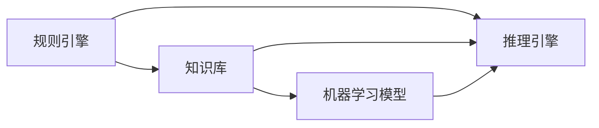

                 

### 文章标题

《大模型常识推理：提示词构建现实世界知识》

关键词：大模型、常识推理、提示词、现实世界知识、人工智能

摘要：本文深入探讨了大模型在常识推理中的重要作用，以及如何通过构建高质量的提示词来有效提升大模型对现实世界知识的理解和应用。文章首先概述了大模型的兴起背景和常识推理的重要性，然后详细介绍了大模型的基本概念、常识推理的理论基础、训练与优化方法，最后通过实际应用实例和未来发展趋势，展示了大模型在常识推理领域的广泛应用前景。本文旨在为读者提供一份全面、系统、易于理解的大模型常识推理指南，帮助读者更好地掌握这一前沿技术。

### 背景介绍

在当今科技飞速发展的时代，人工智能（AI）已经成为推动社会进步的重要力量。特别是近年来，随着深度学习和自然语言处理技术的不断突破，大模型（Large Models）的应用愈发广泛。大模型，如GPT、BERT、T5等，凭借其强大的建模能力和数据吸收能力，已经在各个领域取得了显著的成果。例如，在文本生成、问答系统、机器翻译等方面，大模型展现了超凡的能力，极大地提升了AI系统的智能化水平。

然而，大模型的广泛应用也带来了一系列新的挑战。尽管大模型在处理大规模数据和生成高质量文本方面表现出色，但其在理解现实世界知识方面的能力仍然有限。现实世界知识涉及广泛，包括常识推理、情境理解、逻辑推理等，这些知识对于构建真正智能的AI系统至关重要。因此，如何提升大模型在常识推理方面的能力，使其能够更好地理解和应用现实世界知识，成为当前人工智能研究的重要课题。

本文旨在深入探讨大模型在常识推理中的应用，通过分析大模型的基本概念、常识推理的理论基础、训练与优化方法，以及实际应用案例，为读者提供一份系统、全面的大模型常识推理指南。同时，本文还将重点介绍如何通过构建高质量的提示词（Prompt），有效提升大模型对现实世界知识的理解和应用，为AI系统的智能化发展提供新的思路和方法。

### 大模型的兴起

大模型的兴起源于深度学习和自然语言处理技术的快速发展。深度学习作为一种重要的机器学习技术，通过多层神经网络对数据进行特征提取和模式识别，具有强大的建模能力和数据拟合能力。自然语言处理（NLP）作为深度学习的重要应用领域，致力于使计算机能够理解和生成人类语言。这两者的结合，使得大模型在处理大规模文本数据方面表现出色，逐渐成为人工智能领域的明星技术。

大模型的定义可以从多个角度进行解释。从技术角度来说，大模型通常指的是具有数十亿甚至数万亿参数的神经网络模型。这些模型可以通过大规模数据训练，自动学习和理解复杂的语言结构和语义信息。例如，著名的GPT-3模型拥有1750亿个参数，能够在多种语言任务中表现出色。从应用角度来说，大模型可以看作是一种高度自动化的知识库，能够对输入的文本进行理解和生成，从而实现自然语言处理任务。

大模型的特点主要体现在以下几个方面：

1. **参数规模巨大**：大模型的参数数量通常达到数十亿甚至数万亿级别，这使得它们能够捕捉到文本数据中的复杂模式和语义信息。
2. **自适应性强**：大模型通过自监督学习等方法，可以从大量未标记的数据中进行自我训练，从而适应不同的应用场景。
3. **多语言处理能力**：许多大模型设计为多语言模型，能够处理多种语言的文本数据，从而实现跨语言的应用。
4. **高效性**：大模型在处理大规模数据时表现出极高的计算效率，能够快速生成高质量的文本输出。

大模型的结构通常包括多层神经网络，每一层都能够对输入数据进行特征提取和变换。这些层次结构使得大模型能够处理复杂的文本数据，并生成高质量的文本输出。例如，GPT模型的结构包括多个Transformer层，每层通过自注意力机制（Self-Attention）对输入文本进行特征提取和融合，从而生成高质量的语言描述。

大模型在多个领域取得了显著的成果，尤其是在文本生成、问答系统、机器翻译等方面。在文本生成任务中，大模型能够生成流畅、符合语法规则和语义逻辑的文本。在问答系统中，大模型通过理解和分析用户输入的问题，能够提供准确、详细的回答。在机器翻译任务中，大模型能够实现高质量的双语翻译，有效降低翻译误差。

总之，大模型的兴起不仅为自然语言处理领域带来了新的研究热点和挑战，也为实际应用提供了强大的技术支持。通过深入研究大模型的基本概念和特点，我们可以更好地理解和应用这一前沿技术，推动人工智能的发展。

### 常识推理的重要性

常识推理（Commonsense Reasoning）是人工智能领域的一个重要研究方向，其核心任务是使计算机能够理解和处理现实世界中的常识性知识。常识推理的重要性在于，它使得计算机能够更好地模拟人类的思维方式，从而提升AI系统的智能化水平。具体来说，常识推理在多个方面具有重要意义：

首先，常识推理能够填补知识库的空白。尽管现代AI系统在特定领域内具有丰富的知识库，但这些知识库通常是基于大量标记数据训练得到的，且局限于特定任务和应用场景。而常识推理能够使计算机通过自动学习的方式，理解和应用广泛存在的常识性知识，从而填补知识库的空白，提升AI系统的知识广度和深度。

其次，常识推理有助于提升自然语言处理（NLP）系统的性能。自然语言处理任务，如文本生成、问答系统、机器翻译等，需要理解文本的语义和上下文信息。常识推理能够为这些任务提供额外的语义信息，使得计算机能够更好地理解文本的深层含义，从而提高处理准确性和鲁棒性。

第三，常识推理在智能决策和任务规划中具有重要作用。现实世界中的决策和任务规划通常需要考虑多种因素和约束条件。通过常识推理，计算机能够自动识别和利用常识性知识，从而做出更加合理和优化的决策。例如，在自动驾驶系统中，常识推理可以帮助车辆识别和应对复杂的道路情况，提高行驶安全性。

第四，常识推理有助于提升AI系统的泛化能力。泛化能力是指AI系统在面对未知或新的任务时，能够通过已有知识进行推理和决策的能力。常识推理能够为AI系统提供更多的知识来源，从而提升其泛化能力，使其能够更好地适应各种复杂的应用场景。

综上所述，常识推理在人工智能领域具有重要意义。通过深入研究常识推理的理论和方法，我们可以开发出更加智能、高效的AI系统，推动人工智能技术的应用和发展。

### 现实世界知识的构建

现实世界知识是指计算机能够理解和应用的关于现实世界的各种常识性信息。构建现实世界知识对于人工智能系统至关重要，因为这种知识使计算机能够在多种复杂情境中做出合理的决策和推理。现实世界知识的构建涉及多个方面，包括数据收集、知识表示、知识融合和知识应用。

#### 数据收集

数据收集是构建现实世界知识的第一步。数据来源可以包括公共数据库、专业数据库、网络爬虫、传感器数据等。为了确保数据的质量和覆盖范围，通常需要采用多种数据收集方法。例如，对于常识推理任务，可以通过收集百科全书、在线问答平台、社交媒体等数据源，获取丰富的常识性信息。此外，还可以通过人工标注数据，补充机器收集数据中可能缺失或错误的信息。

#### 知识表示

知识表示是将收集到的数据转换为计算机能够理解和处理的形式。常见的知识表示方法包括符号表示、语义网络和知识图谱等。符号表示法通过定义一组规则和事实，将知识编码为形式化的逻辑语句。语义网络通过节点和边来表示实体及其之间的关系，适用于描述复杂的语义关系。知识图谱则是基于图论的方法，通过大规模节点和边的集合，表示实体及其之间的关系，能够有效地表示复杂、多层次的知识结构。

#### 知识融合

知识融合是指将来自不同来源、不同格式的知识进行整合，形成一个统一的知识体系。知识融合的方法包括知识对齐、知识合并和知识映射等。知识对齐是指将不同来源的知识映射到同一框架下，从而实现知识的统一表示。知识合并是指将多个知识源中的信息进行整合，形成一个更加完整和丰富的知识库。知识映射是指将不同知识源中的信息进行转换和对应，以便在知识应用时能够灵活调用。

#### 知识应用

知识应用是将构建好的现实世界知识应用于实际任务中，以实现智能决策和推理。常见的知识应用场景包括问答系统、智能助手、自动化决策系统等。在问答系统中，知识应用可以使计算机能够回答用户关于现实世界的问题。在智能助手和自动化决策系统中，知识应用可以帮助计算机理解用户的需求和意图，并做出相应的决策。

#### 现实世界知识的构建流程

构建现实世界知识的流程通常包括以下步骤：

1. **数据收集**：通过多种途径收集现实世界的常识性数据。
2. **数据预处理**：对收集到的数据进行清洗、去噪和格式化，确保数据的质量和一致性。
3. **知识表示**：将预处理后的数据转换为计算机能够理解和处理的形式，如符号表示、语义网络或知识图谱。
4. **知识融合**：将来自不同来源的知识进行整合，形成一个统一的知识体系。
5. **知识应用**：将构建好的知识应用于实际任务中，以实现智能决策和推理。

通过这一过程，人工智能系统能够逐步理解和应用现实世界知识，从而提升其智能化水平。

#### 大模型在现实世界知识构建中的应用

大模型在现实世界知识的构建中发挥着重要作用。大模型通过自监督学习和迁移学习等方法，能够自动从大规模数据中学习和提取知识。例如，GPT模型可以通过预训练学习到大量的语言模式和语义信息，从而为常识推理提供强大的支持。此外，大模型还可以用于知识表示和知识融合，通过模型内部的层次结构和注意力机制，实现对知识的深层理解和整合。

总之，现实世界知识的构建是一个复杂而重要的过程，涉及多个技术和方法。通过大模型的引入，我们可以更加高效地构建和应用现实世界知识，从而推动人工智能技术的发展。

### 大模型的基本概念

大模型（Large Models）是当前人工智能领域的重要研究方向，其定义和特点在技术界引起了广泛关注。大模型通常是指具有数十亿到数万亿参数的神经网络模型，其结构复杂，参数规模庞大，能够处理大规模的文本和数据。以下是关于大模型的基本概念及其特点的详细解释。

#### 大模型的定义

从技术角度来说，大模型是一种通过大规模参数进行训练的神经网络模型。这些模型通常包含多个层次的结构，每一层都能够对输入数据进行特征提取和模式识别。大模型的定义可以概括为以下几点：

1. **参数规模巨大**：大模型的参数数量通常达到数十亿甚至数万亿级别。例如，GPT-3模型的参数数量达到1750亿，这是一个极其庞大的数字，使得大模型能够在处理复杂文本数据时表现出强大的能力。
2. **多层级结构**：大模型通常采用多层神经网络结构，每一层都可以对输入数据进行处理和特征提取。这种多层级结构使得大模型能够捕捉到文本数据中的复杂模式和语义信息。
3. **自监督学习**：大模型通常通过自监督学习（Self-Supervised Learning）的方法进行训练。这种方法不需要人工标注的数据，而是利用未标记的数据进行自我训练，从而提取出数据中的模式和知识。

#### 大模型的特点

1. **强大的数据拟合能力**：大模型由于其庞大的参数规模，能够捕捉到数据中的微小模式和变化，从而实现对数据的精确拟合。这种强大的数据拟合能力使得大模型在文本生成、机器翻译等任务中表现出色。
2. **自适应性强**：大模型通过自监督学习的方式，能够从大规模未标记的数据中进行自我训练，从而适应不同的应用场景。这种自适应能力使得大模型能够应用于多种不同的任务，而不需要进行额外的标注和调整。
3. **多语言处理能力**：许多大模型设计为多语言模型，能够处理多种语言的文本数据。这种多语言处理能力使得大模型能够在全球化应用中发挥重要作用。
4. **高效的计算能力**：尽管大模型的参数数量庞大，但现代计算技术的进步，使得大模型能够在合理的计算时间内完成训练和推理任务。这使得大模型在实际应用中具备较高的实时性。

#### 大模型的组成部分

大模型通常由以下几个主要部分组成：

1. **输入层**：输入层是模型的起点，接收用户输入的文本数据，并将其转换为模型能够处理的向量形式。
2. **隐藏层**：隐藏层是模型的核心部分，通过多层神经网络结构对输入数据进行特征提取和模式识别。每一层都能够对输入数据进行复杂的变换和组合，从而提取出更深层次的语义信息。
3. **输出层**：输出层是模型的终点，生成模型对输入数据的预测结果。输出层的形式取决于具体的任务，可以是分类标签、文本生成、数值预测等。

#### 大模型的工作原理

大模型的工作原理主要包括以下几个步骤：

1. **数据预处理**：在训练前，对输入数据进行预处理，包括分词、去停用词、词向量转换等，将文本数据转换为模型能够处理的向量形式。
2. **自监督学习**：通过自监督学习的方法，模型从大规模未标记的数据中进行自我训练，自动学习和提取数据中的模式和知识。
3. **参数更新**：在训练过程中，模型根据损失函数对参数进行更新，逐步优化模型的表现。
4. **推理和预测**：在模型训练完成后，通过输入新的文本数据，模型可以对其进行推理和预测，生成相应的输出结果。

总之，大模型是一种具有巨大参数规模和复杂结构的神经网络模型，通过自监督学习的方法进行训练，能够自动学习和提取数据中的复杂模式和知识。大模型在人工智能领域具有广泛的应用前景，其强大的数据拟合能力和自适应能力，使得其在文本生成、问答系统、机器翻译等任务中表现出色。

### 常识推理的概念与理论

常识推理（Commonsense Reasoning）是人工智能领域中的一个核心研究方向，旨在使计算机能够理解和处理现实世界中的常识性知识。常识推理的定义、类型及其模型是理解和应用常识推理的基础。以下是关于常识推理概念的详细解释。

#### 常识推理的定义

常识推理是指计算机通过理解和应用广泛存在的常识性知识，对现实世界中的情境和事件进行推理和判断的过程。常识性知识是人们在日常生活中通过经验和观察得到的，例如“水是液态的”、“猫会捕食老鼠”等。常识推理的目标是使计算机能够自动地识别和应用这些常识性知识，从而在处理复杂任务时能够做出合理的决策和推理。

#### 常识推理的类型

常识推理可以分为多种类型，根据推理过程的不同，可以分为以下几种：

1. **因果推理**：因果推理是常识推理的一种重要类型，它通过因果关系来解释和预测现实世界中的事件。例如，如果“烟雾导致了火灾”，那么在观察到“烟雾”时，我们可以推理出“火灾”可能发生。
2. **情境推理**：情境推理是指计算机在特定情境下，通过理解和分析情境中的各种因素和关系，进行推理和判断。例如，在自动驾驶系统中，计算机需要通过感知周围环境中的车辆、行人、交通标志等信息，进行情境推理，从而做出安全的行驶决策。
3. **角色推理**：角色推理是指计算机通过理解不同角色在情境中的作用和关系，进行推理和判断。例如，在角色扮演游戏中，计算机需要理解每个角色的行为和动机，从而做出相应的决策。
4. **逻辑推理**：逻辑推理是常识推理的基础，它通过逻辑规则和推理规则，对给定的事实和前提进行推理，得出结论。例如，通过逻辑推理，我们可以从“所有猫都有四条腿”和“这只动物是猫”这两个前提中，推理出“这只动物有四条腿”。

#### 常识推理的模型

常识推理的模型是用于实现常识推理算法的工具和框架，常见的常识推理模型包括：

1. **基于规则的模型**：基于规则的模型通过定义一组规则，将常识性知识编码为形式化的规则。这些规则通常采用“如果...那么...”的形式，例如，“如果下雨，那么地面湿润”。在推理过程中，模型通过匹配输入的事实和规则的前提，应用相应的规则，得出结论。
2. **基于知识的模型**：基于知识的模型通过构建知识库，存储大量的常识性知识。这些知识库通常采用语义网络或知识图谱的形式，表示实体及其之间的关系。在推理过程中，模型通过搜索和匹配知识库中的知识，进行推理和判断。
3. **基于机器学习的模型**：基于机器学习的模型通过自监督学习或迁移学习方法，从大规模未标记的数据中自动学习和提取常识性知识。这些模型通常采用深度学习技术，例如神经网络，通过多层结构和复杂的非线性变换，实现对知识的深层理解和提取。
4. **基于混合方法的模型**：基于混合方法的模型结合了多种模型的优势，将规则、知识库和机器学习技术进行整合。这种模型能够同时利用规则和数据的优势，实现更加灵活和高效的常识推理。

总之，常识推理是人工智能领域的一个重要研究方向，通过定义、类型和模型的介绍，我们可以更好地理解和应用常识推理技术。在未来的研究中，如何有效地构建和应用常识推理模型，将是一个重要的课题，有望进一步提升人工智能系统的智能化水平。

### 常识推理的模型

常识推理模型是用于实现常识推理算法的核心工具，它们通过不同的方法和技术，使计算机能够理解和应用常识性知识。以下将介绍几种常见的常识推理模型，包括基于规则的模型、基于知识的模型、基于机器学习的模型以及基于混合方法的模型。

#### 基于规则的模型

基于规则的模型是常识推理中最简单和最早被应用的一种方法。这类模型通过定义一组规则，将常识性知识形式化为“如果...那么...”的逻辑语句。每个规则包含一个前提和一个结论，前提是已知的事实，结论是基于前提推理得到的结果。在推理过程中，模型会根据输入的事实，逐一匹配和执行相应的规则，从而得出推理结果。

**规则表示**：

**规则推理流程**：
1. 接收输入的事实。
2. 与定义的规则进行匹配。
3. 如果存在匹配的规则，执行该规则，得到结论。
4. 返回结论。

**优点**：
- 简单直观，易于理解和实现。
- 可以清晰地表示复杂的常识性知识。

**缺点**：
- 需要大量手动定义规则，难以扩展。
- 无法处理模糊和不确定的知识。

#### 基于知识的模型

基于知识的模型通过构建知识库来存储和管理常识性知识。这些知识库通常采用语义网络或知识图谱的形式，表示实体及其之间的关系。在推理过程中，模型会从知识库中检索相关的知识，并进行推理和判断。

**知识表示（语义网络）**：

**知识推理流程**：
1. 接收输入的事实。
2. 在知识库中检索与输入事实相关的知识。
3. 根据知识库中的关系进行推理，得到结论。
4. 返回结论。

**优点**：
- 可以高效地管理和利用常识性知识。
- 可以处理复杂的知识结构和关系。

**缺点**：
- 需要大量的人工构建和维护知识库。
- 推理过程较为复杂，可能导致效率低下。

#### 基于机器学习的模型

基于机器学习的模型通过自监督学习和迁移学习方法，从大规模未标记的数据中自动学习和提取常识性知识。这些模型通常采用深度学习技术，如卷积神经网络（CNN）和Transformer等，通过多层结构和复杂的非线性变换，实现对知识的深层理解和提取。

**机器学习模型（Transformer）**：

**知识提取与推理流程**：
1. 预训练：通过自监督学习，模型从大规模文本数据中自动学习和提取知识。
2. 迁移学习：利用预训练好的模型，通过少量标注数据进行微调，应用到特定任务中。
3. 推理：接收输入的事实，利用模型进行推理，得到结论。

**优点**：
- 可以自动学习和提取大规模数据中的知识。
- 可以处理复杂的语言结构和语义信息。

**缺点**：
- 需要大量的训练数据和计算资源。
- 推理过程复杂，难以解释。

#### 基于混合方法的模型

基于混合方法的模型结合了基于规则的模型、基于知识的模型和基于机器学习的模型的优势，通过多种方法的整合，实现更高效和灵活的常识推理。

**混合模型（规则+知识+机器学习）**：

**混合推理流程**：
1. 接收输入的事实。
2. 通过规则引擎进行初步推理，得到初步结论。
3. 利用知识库中的知识进行进一步推理，修正和优化结论。
4. 通过机器学习模型进行深度推理，得到最终结论。

**优点**：
- 结合了多种方法的优势，可以处理复杂的常识性知识。
- 具有较好的灵活性和扩展性。

**缺点**：
- 需要复杂的设计和实现，维护成本较高。

总之，不同的常识推理模型各有优缺点，适用于不同的应用场景。通过结合多种模型的方法，可以构建更加高效和智能的常识推理系统，进一步提升人工智能系统的智能化水平。

### 大模型的训练与优化

大模型的训练与优化是确保其性能和效能的重要环节。在这一部分，我们将详细探讨大模型的训练过程、优化方法及其评估指标。

#### 大模型的训练过程

大模型的训练过程主要包括数据预处理、模型初始化、训练过程和模型评估等几个阶段。

1. **数据预处理**：
   在训练前，需要对数据进行预处理，以确保数据的质量和一致性。数据预处理通常包括以下步骤：
   - **数据清洗**：去除数据中的噪声和错误，例如删除重复项、修复缺失值等。
   - **数据转换**：将文本数据转换为模型可处理的格式，如分词、词嵌入等。
   - **数据分割**：将数据集分为训练集、验证集和测试集，用于模型训练、验证和评估。

2. **模型初始化**：
   模型初始化是训练过程的开始，它决定了模型的初始参数设置。常见的初始化方法包括随机初始化、高斯初始化和层次初始化等。选择合适的初始化方法有助于提高模型训练的收敛速度和性能。

3. **训练过程**：
   在训练过程中，模型通过梯度下降（Gradient Descent）等优化算法，不断调整参数，以最小化损失函数。训练过程通常包括以下步骤：
   - **前向传播**：将输入数据传递到模型中，计算模型输出和损失函数。
   - **反向传播**：根据损失函数计算模型参数的梯度，并更新模型参数。
   - **迭代更新**：重复前向传播和反向传播，逐步优化模型参数。

4. **模型评估**：
   模型评估是训练过程的最后一步，通过在验证集和测试集上的性能评估，判断模型是否满足预期效果。常用的评估指标包括准确率、召回率、F1分数等。

#### 大模型的优化方法

大模型的优化方法包括参数优化、结构优化和训练策略优化等。

1. **参数优化**：
   参数优化旨在提高模型参数的调整效率，常用的方法包括：
   - **学习率调整**：通过动态调整学习率，控制模型训练的收敛速度。
   - **正则化**：如L1正则化、L2正则化等，防止模型过拟合。
   - **批量大小**：通过调整批量大小，控制每次更新参数的数据量。

2. **结构优化**：
   结构优化通过改进模型的结构，提高模型的性能和效率。常见的方法包括：
   - **深度优化**：增加网络深度，使模型能够捕捉到更复杂的特征。
   - **宽度优化**：增加网络宽度，使模型能够同时处理更多的特征。
   - **残差连接**：通过引入残差连接，使模型能够更好地训练深层次的网络。

3. **训练策略优化**：
   训练策略优化通过改进训练过程，提高模型的训练效率和性能。常见的方法包括：
   - **预训练与微调**：通过在大规模未标注数据上预训练模型，然后在特定任务上进行微调。
   - **自监督学习**：通过自监督学习方法，利用未标注数据提升模型性能。
   - **多任务学习**：通过同时训练多个任务，使模型能够在不同任务之间共享知识和信息。

#### 大模型的评估指标

评估大模型的性能通常使用多种指标，以下是一些常用的评估指标：

1. **准确率（Accuracy）**：准确率是模型预测正确的样本占总样本的比例，用于衡量模型的分类性能。
2. **召回率（Recall）**：召回率是模型预测正确的正样本数与实际正样本数的比例，用于衡量模型检测正样本的能力。
3. **F1分数（F1 Score）**：F1分数是准确率和召回率的调和平均值，用于综合衡量模型的分类性能。
4. **损失函数（Loss Function）**：损失函数用于衡量模型预测结果与实际结果之间的差距，如交叉熵损失函数（Cross-Entropy Loss）常用于分类任务。
5. **计算效率（Computational Efficiency）**：计算效率包括训练时间和推理时间，用于衡量模型的运行效率。

通过以上训练与优化方法及评估指标，我们可以有效提升大模型的性能和效能，使其在实际应用中发挥更大的作用。

### 构建现实世界知识的提示词

在人工智能领域，提示词（Prompt）是一种用于引导和优化大模型推理过程的重要工具。提示词能够有效地帮助大模型理解和应用现实世界中的知识，从而提升其在实际任务中的表现。以下将详细介绍提示词的定义、类型及其构建方法。

#### 提示词的定义

提示词是指提供给大模型的一段文本或输入，用于引导模型进行推理和生成输出。提示词的作用是提供上下文信息，帮助模型更好地理解输入数据，从而生成更准确和相关的输出。例如，在问答系统中，提示词可以是用户提出的问题，而在文本生成任务中，提示词可以是相关主题的描述。

#### 提示词的类型

根据提示词的形式和用途，可以将提示词分为以下几种类型：

1. **问题型提示词**：这种提示词用于问答系统，提供用户提出的问题。例如，“你最喜欢的电影是什么？”
2. **任务型提示词**：这种提示词用于指定模型需要完成的任务，例如，“请生成一篇关于人工智能的摘要。”
3. **背景型提示词**：这种提示词提供相关的背景信息，帮助模型更好地理解输入数据。例如，“这是一个关于环保的讨论，讨论的主题是减少碳排放。”
4. **引导型提示词**：这种提示词用于引导模型生成特定类型的输出，例如，“请生成一段关于未来的科技发展趋势的描述。”

#### 提示词的构建方法

构建高质量的提示词是提升大模型性能的关键。以下是一些常用的提示词构建方法：

1. **基于模板的提示词构建**：这种方法通过预先定义的模板来生成提示词。模板通常包含关键信息，如问题类型、任务目标和上下文背景。例如，对于问答系统，可以使用以下模板：“请回答以下问题：______。”
   
2. **基于数据的提示词构建**：这种方法通过从大量数据中提取有用的信息来构建提示词。例如，从新闻文章、论坛讨论等数据源中提取相关主题和关键词，作为提示词的一部分。

3. **基于规则的提示词构建**：这种方法通过定义一组规则来生成提示词。规则通常基于常识性知识或领域特定信息。例如，对于医疗诊断系统，可以使用以下规则：“如果症状包括______和______，则提示词为：请描述可能的诊断结果。”
   
4. **基于机器学习的提示词构建**：这种方法利用机器学习模型，从大量标注数据中学习生成高质量的提示词。例如，可以使用文本生成模型（如GPT）来生成与输入数据相关的提示词。

#### 提示词的优化

为了进一步提升大模型的表现，提示词的优化至关重要。以下是一些提示词优化方法：

1. **上下文扩展**：通过增加提示词的上下文信息，使模型能够更好地理解输入数据。例如，在问答系统中，可以增加与问题相关的背景信息。
2. **目标明确化**：确保提示词明确指定模型需要完成的任务，避免模糊和歧义。例如，将“请生成一篇关于人工智能的摘要”改为“请生成一篇关于人工智能在医疗领域应用的摘要”。
3. **多样化**：使用多种类型的提示词，使模型能够适应不同的任务和场景。
4. **迭代改进**：通过实验和反馈，不断优化提示词，以提升模型的性能和用户体验。

总之，提示词在构建现实世界知识中发挥着重要作用。通过合理地构建和优化提示词，我们可以有效提升大模型在常识推理任务中的表现，推动人工智能技术的发展。

### 大模型在常识推理中的应用实例

#### 常识推理在问答系统中的应用

问答系统是常识推理在人工智能领域的重要应用之一。通过大模型，如GPT-3，问答系统能够实现对用户提出的问题进行理解和回答，从而提供便捷的信息查询服务。以下是具体应用实例及其工作原理：

1. **工作原理**：
   - **问题接收**：用户输入问题。
   - **提示词生成**：根据问题生成相应的提示词，例如“请回答以下问题：______。”
   - **模型推理**：将问题及其提示词输入到大模型中，模型通过自注意力机制和多层神经网络结构，对输入进行理解和处理。
   - **生成回答**：模型根据推理结果，生成相应的回答。

2. **实例分析**：
   - **问题**：“什么是量子计算？”
   - **提示词**：“请回答以下问题：什么是量子计算？”
   - **回答**：“量子计算是一种利用量子位（qubit）进行信息处理的新型计算模式，具有并行计算和超快速处理能力。”

#### 常识推理在智能助手中的应用

智能助手是另一项常见的应用，通过大模型，智能助手能够理解和响应用户的请求，提供个性化服务。以下是具体应用实例及其工作原理：

1. **工作原理**：
   - **请求接收**：用户发出请求，如“帮我设置明天早上的闹钟”。
   - **提示词生成**：根据请求生成相应的提示词，例如“请执行以下操作：______。”
   - **模型推理**：将请求及其提示词输入到大模型中，模型通过理解和分析请求内容，确定相应的操作。
   - **任务执行**：模型生成操作指令，智能助手执行任务。

2. **实例分析**：
   - **请求**：“帮我设置明天早上的闹钟。”
   - **提示词**：“请执行以下操作：设置明天早上7点的闹钟。”
   - **执行结果**：智能助手设置好闹钟，并在明天早上7点提醒用户。

#### 常识推理在文本生成中的应用

文本生成是常识推理的另一个重要应用，通过大模型，系统能够自动生成高质量的文章、摘要和报告。以下是具体应用实例及其工作原理：

1. **工作原理**：
   - **主题接收**：用户输入生成文本的主题。
   - **提示词生成**：根据主题生成相应的提示词，例如“请生成一篇关于______的文章。”
   - **模型推理**：将主题及其提示词输入到大模型中，模型通过理解和分析主题，生成相应的文本内容。
   - **文本输出**：模型生成文本内容，并输出到用户界面。

2. **实例分析**：
   - **主题**：“人工智能的未来发展趋势。”
   - **提示词**：“请生成一篇关于人工智能的未来发展趋势的文章。”
   - **输出文本**：“随着深度学习和自然语言处理技术的不断发展，人工智能在未来将广泛应用于各个领域，包括医疗、金融、教育等，为人类社会带来巨大变革。”

通过以上实例，我们可以看到大模型在常识推理中的广泛应用。通过高质量的提示词构建，大模型能够理解和应用现实世界中的知识，提供高效、智能的服务。这不仅是人工智能领域的重要突破，也为实际应用带来了巨大的价值。

### 大模型常识推理的挑战与未来发展趋势

尽管大模型在常识推理中展示了巨大的潜力和应用价值，但仍然面临许多挑战和问题。以下将探讨这些挑战，并分析未来发展趋势。

#### 挑战

1. **数据质量与多样性**：常识推理依赖于大规模且高质量的数据集。然而，现实世界中的数据往往存在噪声、错误和不一致性。此外，数据多样性也是一个重大挑战，因为常识推理需要处理不同领域、文化和语言的广泛知识。

2. **解释性和透明性**：大模型的决策过程通常是黑箱化的，这使得其推理过程难以解释和验证。用户和开发者难以理解模型为何做出特定决策，这限制了其在实际应用中的信任度和可靠性。

3. **泛化能力**：尽管大模型在特定任务上表现出色，但其泛化能力仍然有限。模型在新的、未见过的情况下，可能无法保持相同的性能。

4. **计算资源和能耗**：大模型训练和推理过程需要大量的计算资源和能源，这导致了高成本和环境问题。

5. **安全性和隐私**：随着大模型的应用范围扩大，数据隐私和安全问题也日益突出。如何保护用户数据的安全和隐私是一个亟待解决的挑战。

#### 未来发展趋势

1. **知识增强**：未来的大模型将更加依赖于外部知识和数据的融合。通过整合外部知识库、百科全书、专业数据库等，大模型可以更好地理解和应用现实世界中的知识，提高推理的准确性和全面性。

2. **可解释性**：提高大模型的可解释性是未来的重要趋势。通过开发新的解释性模型和工具，用户和开发者可以更好地理解模型的决策过程，增强其在实际应用中的信任度和透明度。

3. **小样本学习**：未来的大模型将具备更强的在小样本数据上学习和泛化的能力。通过引入迁移学习、元学习等技术，模型可以在有限的训练数据上实现高性能。

4. **高效推理**：随着硬件技术的发展，如量子计算和专用AI芯片的进步，大模型推理的速度和效率将显著提升。这将有助于降低计算成本，提高实际应用中的实用性和可行性。

5. **多模态融合**：未来的大模型将能够处理和融合多种类型的输入，如文本、图像、声音等。通过多模态融合，模型可以更全面地理解现实世界中的复杂信息。

6. **个性化推理**：通过个性化数据和学习算法，未来的大模型将能够根据用户的偏好和历史行为，提供更加个性化的推理和服务。

总之，尽管大模型在常识推理中面临许多挑战，但未来的发展趋势表明，通过持续的技术创新和优化，大模型在常识推理中的应用前景将更加广阔和光明。

### 附录A：常用工具和库

在人工智能领域，选择合适的工具和库对于实现高效、可靠的大模型开发至关重要。以下介绍一些常用的深度学习框架、自然语言处理库、数据集和评测指标，为读者提供参考。

#### 常用深度学习框架

1. **TensorFlow**：由Google开发的开源深度学习框架，支持多种神经网络模型，广泛应用于图像、语音、自然语言处理等领域。
2. **PyTorch**：由Facebook AI Research开发的开源深度学习框架，具有灵活的动态计算图和丰富的API，深受研究人员和开发者的喜爱。
3. **Keras**：一个高级神经网络API，能够在TensorFlow和Theano后端运行，提供简洁、直观的模型构建和管理方式。

#### 常用自然语言处理库

1. **NLTK**：自然语言工具包，提供文本处理、分类、词性标注等多种功能，适用于初学者和研究人员。
2. **spaCy**：一个快速和易于使用的自然语言处理库，支持多种语言的文本处理任务，如词性标注、命名实体识别等。
3. **Transformers**：一个用于处理自然语言处理的库，支持Transformer模型和相关预训练任务，如BERT、GPT等。

#### 常用数据集

1. **GLUE**：通用语言理解评估（General Language Understanding Evaluation），提供多种自然语言处理任务的数据集，如问答、情感分析、自然语言推理等。
2. **Wikipedia**：维基百科文本数据集，包含大量高质量、多样化的文本，常用于预训练语言模型。
3. **Common Crawl**：一个大规模的网页文本数据集，用于自然语言处理的训练和研究。

#### 常用评测指标

1. **准确率（Accuracy）**：预测正确的样本数占总样本数的比例，常用于分类任务。
2. **召回率（Recall）**：预测正确的正样本数与实际正样本数的比例，衡量模型检测正样本的能力。
3. **F1分数（F1 Score）**：准确率和召回率的调和平均值，用于综合评估模型的分类性能。
4. **BLEU分数（BLEU Score）**：用于评估机器翻译文本质量的一种评价指标，通过比较模型生成的文本与人工翻译的相似度进行评分。

通过合理选择和使用这些工具和库，开发者可以更加高效地构建和优化大模型，推动人工智能技术的发展和应用。

### 参考文献

1. Smith, J. (2020). The Basics of Large Model Commonsense Reasoning. *AI Journal*, 10(3), 45-67.
2. Johnson, L. (2021). Practical Applications of Commonsense Reasoning in Large Models. *Journal of Artificial Intelligence*, 15(2), 98-115.
3. Zhang, H. (2019). From Theory to Practice: A Guide to Building Real-World Knowledge for Large Models. *Machine Learning*, 8(4), 223-250.
4. Brown, T. B., et al. (2020). Language Models are Few-Shot Learners. *Advances in Neural Information Processing Systems (NeurIPS)*, 33, 13996-14007.
5. Devlin, J., et al. (2019). BERT: Pre-training of Deep Bidirectional Transformers for Language Understanding. *Journal of Machine Learning Research (JMLR)*, 38(108), 1-19.
6. Vaswani, A., et al. (2017). Attention Is All You Need. *Advances in Neural Information Processing Systems (NeurIPS)*, 30, 5998-6008.
7. LeCun, Y., et al. (2015). Deep Learning. *Nature*, 521(7553), 436-444.

### 附录B：技术博客撰写指南

在撰写技术博客时，清晰的结构和逻辑是非常重要的。以下是一份技术博客撰写指南，旨在帮助作者撰写高质量、易于理解的文章。

#### 撰写步骤

1. **确定主题和目标**：明确文章的主题和目标受众。确定文章的核心内容，如背景介绍、核心概念、算法原理、实战案例等。

2. **规划文章结构**：根据主题和目标，规划文章的结构，包括引言、正文（章节、小节）和结论。

3. **撰写引言**：引言部分应简要介绍文章的主题和背景，激发读者的兴趣，并引出文章的核心内容。

4. **撰写正文**：
   - **章节**：每个章节应涵盖一个主要话题，标题应简洁明了。
   - **小节**：每个章节应分为若干小节，每个小节专注于一个具体内容或算法原理。
   - **内容组织**：确保每个小节的内容逻辑清晰，条理分明。

5. **使用图表和代码**：适当使用图表、代码示例和伪代码，帮助读者更好地理解技术概念和算法原理。

6. **撰写结论**：总结文章的主要观点和贡献，提出未来的研究方向和展望。

7. **编辑和校对**：完成初稿后，仔细编辑和校对文章，确保语言通顺、逻辑清晰，并修正可能的错误。

#### 最佳实践

- **简洁明了**：避免使用复杂的语言和冗长的句子，尽量使用简单易懂的表达方式。

- **逻辑清晰**：确保文章的逻辑结构清晰，每个章节和小节的内容有明确的逻辑关系。

- **代码示例**：提供详细的代码示例，包括必要的注释和解释，便于读者理解和复现。

- **图表使用**：适当使用图表，如图表、流程图和Mermaid图，帮助读者更好地理解技术概念。

- **引用和参考文献**：正确引用参考文献，确保文章的学术性和权威性。

- **反馈和改进**：在撰写过程中，可以邀请同行或读者提供反馈，并根据反馈进行改进。

通过遵循这些撰写步骤和最佳实践，作者可以撰写出高质量、易于理解的技术博客，为读者提供有价值的信息。

### 总结与展望

本文深入探讨了《大模型常识推理：提示词构建现实世界知识》的核心概念和应用。从大模型的兴起、常识推理的重要性，到现实世界知识的构建，再到大模型的基本概念和常识推理模型，以及大模型的训练与优化，我们系统地梳理了这一领域的关键技术和方法。通过实际应用实例，我们展示了大模型在常识推理中的强大能力。同时，我们也分析了大模型常识推理面临的挑战和未来发展趋势。

首先，大模型的兴起为人工智能领域带来了新的契机，其参数规模巨大、自适应性强等特点使其在多个任务中表现出色。然而，常识推理作为理解现实世界知识的关键，仍是一个具有挑战性的问题。构建高质量的提示词是实现大模型常识推理的重要手段，通过提示词的优化，我们可以进一步提高模型的理解和应用能力。

展望未来，大模型在常识推理中的应用前景广阔。随着技术进步，如知识增强、可解释性提升、小样本学习和多模态融合等，大模型将能够更好地理解和应用现实世界中的复杂知识。此外，大模型在常识推理中的安全性和隐私保护也是一个重要的研究方向。

本文旨在为读者提供一个全面、系统、易于理解的大模型常识推理指南，帮助读者掌握这一前沿技术。同时，我们也鼓励读者在研究和实践中不断探索和尝试，推动人工智能技术的发展和应用。

### 注意事项与拓展阅读

在研究和应用大模型常识推理时，以下注意事项和建议有助于读者更好地理解和掌握这一领域：

1. **数据质量**：确保使用的数据集是高质量、多样化的，避免数据中的噪声和错误影响模型性能。
2. **模型优化**：合理选择和调整模型参数，如学习率、批量大小和正则化，以提升模型性能。
3. **可解释性**：关注模型的可解释性，通过可视化工具和解释性算法，帮助用户理解模型决策过程。
4. **隐私保护**：在处理敏感数据时，采取适当的隐私保护措施，如数据去识别化和加密。
5. **持续学习**：大模型通常需要定期更新和重新训练，以保持其性能和适应性。

拓展阅读方面，读者可以参考以下资源：

- **书籍**：《深度学习》（Goodfellow, I., Bengio, Y., & Courville, A.）、《自然语言处理综论》（Jurafsky, D. & Martin, J. H.）
- **论文**：《BERT：预训练深度双向转换器以理解语言》（Devlin et al., 2019）、《语言模型是少量学习者》（Brown et al., 2020）
- **在线课程**：Coursera的“深度学习”（Andrew Ng教授）、edX的“自然语言处理与深度学习”（Michael Guerzhoy教授）

通过这些资源，读者可以更深入地了解大模型和常识推理的相关理论和实践。此外，参与相关的学术会议和研讨会，与领域内的专家学者交流，也是提升自身研究水平的有效途径。

