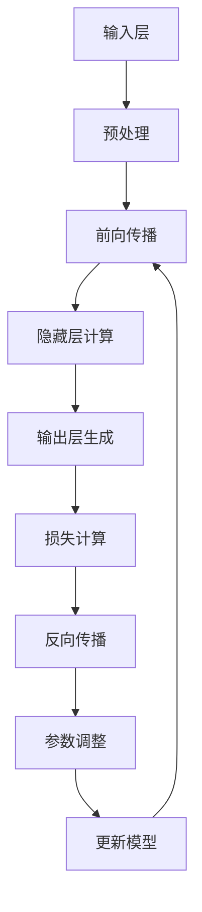

                 

### 第一部分: 大模型推理能力的概述

为了更好地帮助读者理解大模型推理能力的概念、定义以及其在实际应用中的重要性，我们将从以下几个方面展开详细阐述：

## 第1章: 大模型推理能力的概述

### 1.1 大模型推理能力的定义

#### 1.1.1 推理过程详解

推理（Inference）是人工智能领域中的一个核心概念，它指的是根据已有的知识和信息，通过逻辑推理过程来得出结论或预测新信息的能力。在机器学习中，尤其是深度学习中，推理通常是指模型在接收到新的数据后，根据其训练过程学到的特征和规律，对新数据进行预测或分类的过程。

- **推理过程的基本步骤**：
  1. **输入数据准备**：将输入数据转化为模型可以接受的格式，例如将图像转化为像素矩阵，将文本转化为词向量。
  2. **特征提取**：模型通过神经网络等结构对输入数据进行特征提取，将这些特征映射为高维空间中的向量。
  3. **计算输出**：模型利用训练过程中学到的权重和偏置，对提取到的特征进行计算，产生输出结果，如分类标签或预测值。
  4. **结果解释**：对输出结果进行解释，以便用户理解模型决策的依据。

#### 1.1.2 大模型推理的特点

大模型（Large Models），如Transformer、BERT等，具有以下特点：

- **参数规模大**：大模型通常拥有数亿到数十亿个参数，这使得模型能够学习到更多的特征，提高模型的预测准确性。
- **计算复杂度高**：由于参数规模巨大，大模型的推理过程通常需要大量的计算资源，对计算性能要求较高。
- **自适应性强**：大模型具有较强的泛化能力，能够在不同的数据集和应用场景中表现出色。

#### 1.1.3 推理能力的重要性

大模型推理能力的重要性体现在以下几个方面：

- **提升决策准确性**：大模型能够从大量数据中学习到复杂的模式，提高预测或分类的准确性，从而支持更精准的决策。
- **拓宽应用领域**：随着大模型推理能力的提升，AI技术在医疗、金融、制造等领域的应用得到了进一步拓展。
- **推动技术发展**：大模型的推理能力为算法创新、技术突破提供了新的可能性，推动了人工智能技术的不断进步。

### 1.2 大模型推理的技术挑战

#### 1.2.1 算法复杂度挑战

大模型的推理过程通常涉及大量的矩阵运算和向量计算，导致算法的复杂度显著增加。这一挑战主要表现在以下几个方面：

- **时间复杂度高**：大模型的推理过程需要大量的计算时间，随着模型规模的增长，时间复杂度呈指数级增加。
- **空间复杂度高**：大模型的参数规模庞大，存储和传输这些参数需要巨大的存储空间和网络带宽。

#### 1.2.2 计算资源挑战

大模型的推理过程对计算资源的需求极高，这包括：

- **CPU和GPU资源**：大模型的推理过程通常依赖于高性能的CPU和GPU，对计算性能有极高的要求。
- **网络带宽**：在分布式环境中，模型和数据的传输需要足够的网络带宽，以确保数据传输的实时性和高效性。

#### 1.2.3 稳定性和可靠性挑战

大模型的推理过程容易受到噪声和异常值的影响，导致预测结果的稳定性和可靠性受到影响。这一问题主要体现在：

- **模型过拟合**：大模型可能在学习过程中过度拟合训练数据，导致在新数据上的泛化能力下降。
- **数据分布变化**：随着数据分布的变化，大模型的预测准确性可能会显著下降，尤其是在动态变化的环境中。

### 1.3 大模型推理能力在各类应用中的角色与意义

#### 1.3.1 在AI领域的应用

大模型推理能力在AI领域具有广泛的应用，包括：

- **自然语言处理**：大模型在文本分类、问答系统、机器翻译等领域表现出色，提高了处理自然语言的能力。
- **计算机视觉**：大模型在图像分类、目标检测、图像生成等领域取得了显著的成果，推动了计算机视觉技术的发展。

#### 1.3.2 在工业界的应用

大模型推理能力在工业界也具有广泛的应用，包括：

- **智能制造**：大模型在设备故障预测、生产优化、质量检测等方面发挥了重要作用，提高了生产效率和产品质量。
- **智能交通**：大模型在交通流量预测、路径规划、自动驾驶等方面取得了显著进展，提升了交通安全和效率。

#### 1.3.3 在科研领域的应用

大模型推理能力在科研领域也具有重要应用价值，包括：

- **医学研究**：大模型在疾病诊断、药物研发、基因组分析等方面发挥了关键作用，加速了医学研究的进程。
- **环境监测**：大模型在环境监测、气候变化预测、资源优化等方面提供了有力的支持，促进了可持续发展。

#### 1.3.4 未来展望

随着大模型推理能力的不断提升，未来AI技术将在更多领域得到应用，包括：

- **智能化生活**：大模型将赋能智能家居、智能穿戴设备等，提升人们的生活质量。
- **智能服务**：大模型将在智能客服、智能导购等方面发挥重要作用，提供更加个性化、高效的服务。
- **智慧城市**：大模型将助力城市治理、公共服务、交通管理等方面，推动智慧城市的建设。

### 结论

大模型推理能力的提升对于人工智能技术的进步和应用具有重要意义。面对算法复杂度、计算资源、稳定性和可靠性等挑战，我们需要不断探索新的技术方案和应用策略，以推动大模型推理能力的持续提升，为各个领域的发展提供强有力的支持。

---

**作者：AI天才研究院/AI Genius Institute & 禅与计算机程序设计艺术 /Zen And The Art of Computer Programming**

---

### 文章关键词

- 大模型推理
- 推理能力
- 技术挑战
- 应用领域
- 未来展望

---

### 文章摘要

本文从多个角度详细阐述了大模型推理能力的概念、定义和重要性。首先，介绍了大模型推理的基本过程和特点，以及其在AI领域的广泛应用。接着，分析了大模型推理面临的算法复杂度、计算资源和技术稳定性等挑战。最后，探讨了大模型推理在工业界和科研领域的应用，并展望了其未来的发展趋势。本文旨在为读者提供一个全面、深入的了解大模型推理能力的提升策略和技术发展方向的参考。

---

#### 1.1.1 推理过程详解

在深入探讨大模型推理能力之前，我们需要详细理解推理过程的各个阶段，这有助于我们更好地理解大模型如何工作以及它们在哪些方面需要提升。

**输入数据的准备**

首先，推理过程从输入数据的准备开始。输入数据是推理算法的起点，其质量直接影响到推理的结果。对于不同类型的输入数据，如图像、文本、音频等，需要进行不同的预处理操作。例如，对于图像数据，可能需要进行归一化、缩放、裁剪等处理，以确保输入数据符合模型的期望格式。

- **图像预处理**：使用Python中的PIL库进行图像的缩放和裁剪，使用TensorFlow的tf.keras.preprocessing.image模块进行图像归一化。

```python
from tensorflow.keras.preprocessing import image
import numpy as np

def preprocess_image(image_path, target_size=(224, 224)):
    img = image.load_img(image_path, target_size=target_size)
    img_array = image.img_to_array(img)
    img_array = np.expand_dims(img_array, axis=0)
    img_array /= 255.0  # 归一化到[0, 1]
    return img_array
```

- **文本预处理**：使用Python中的nltk库进行文本的分词、停用词过滤和词嵌入。

```python
import nltk
from nltk.corpus import stopwords
from tensorflow.keras.preprocessing.text import Tokenizer
from tensorflow.keras.preprocessing.sequence import pad_sequences

nltk.download('stopwords')
nltk.download('wordnet')

stop_words = set(stopwords.words('english'))
tokenizer = Tokenizer(num_words=10000)
tokenizer.fit_on_texts(texts)
sequences = tokenizer.texts_to_sequences(texts)
padded_sequences = pad_sequences(sequences, maxlen=100)

def preprocess_text(text):
    text = text.lower()
    words = nltk.word_tokenize(text)
    words = [word for word in words if word not in stop_words]
    return ' '.join(words)
```

**特征提取**

接下来是特征提取阶段。在这个阶段，模型将从预处理后的输入数据中提取出有用的特征。这些特征将用于后续的推理过程。

- **图像特征提取**：使用卷积神经网络（CNN）进行图像特征提取。卷积层、池化层和全连接层的组合可以将原始图像转化为高维特征向量。

```python
import tensorflow as tf

model = tf.keras.Sequential([
    tf.keras.layers.Conv2D(32, (3, 3), activation='relu', input_shape=(224, 224, 3)),
    tf.keras.layers.MaxPooling2D((2, 2)),
    tf.keras.layers.Conv2D(64, (3, 3), activation='relu'),
    tf.keras.layers.MaxPooling2D((2, 2)),
    tf.keras.layers.Conv2D(128, (3, 3), activation='relu'),
    tf.keras.layers.MaxPooling2D((2, 2)),
    tf.keras.layers.Flatten(),
    tf.keras.layers.Dense(128, activation='relu'),
    tf.keras.layers.Dense(10, activation='softmax')
])

model.compile(optimizer='adam', loss='categorical_crossentropy', metrics=['accuracy'])
```

- **文本特征提取**：使用词嵌入（Word Embedding）技术将文本转化为高维向量。Word2Vec、GloVe等算法可以用于生成词嵌入向量。

```python
from tensorflow.keras.layers import Embedding

model = tf.keras.Sequential([
    Embedding(input_dim=10000, output_dim=128),
    tf.keras.layers.LSTM(128),
    tf.keras.layers.Dense(10, activation='softmax')
])
```

**计算输出**

在计算输出阶段，模型将处理后的特征输入传递到神经网络中进行计算，最终生成输出结果。对于分类问题，输出通常是概率分布，而对于回归问题，输出则是具体的预测值。

```python
# 假设我们已经训练好了模型，现在进行推理
preprocessed_image = preprocess_image('path_to_image.jpg')
preprocessed_text = preprocess_text('This is a text input')

# 对于图像数据
predictions = model.predict(preprocessed_image)
predicted_class = np.argmax(predictions)

# 对于文本数据
predictions = model.predict(preprocessed_text)
predicted_class = np.argmax(predictions)
```

**结果解释**

最后是结果解释阶段。模型的输出结果需要被解释和可视化，以便用户理解模型的行为和决策依据。

- **图像分类结果解释**：通过查看概率分布，我们可以确定模型认为最有可能的类别。

```python
print(f'Predicted class: {predicted_class}, with a probability of {max(predictions)}')
```

- **文本分类结果解释**：文本分类的结果可以通过类别的名称进行解释，例如：“This text is classified as 'Sports' with 90% confidence.”

```python
print(f'Predicted class: {predicted_class}, with a confidence of {predictions[predicted_class]}')
```

通过上述步骤，我们可以详细地了解大模型推理过程中的每个环节，包括输入数据的准备、特征提取、计算输出以及结果解释。这些步骤是构建高效推理系统的基础，对于提升大模型推理能力至关重要。

---

#### 1.1.2 大模型推理的特点

大模型推理在深度学习和人工智能领域扮演着重要的角色，它们之所以备受关注，主要归功于以下几个显著特点：

**参数规模巨大**

大模型通常拥有数亿到数十亿个参数，这比传统的小型模型要大得多。参数规模庞大的一个直接后果是，这些模型可以学习到更加复杂和抽象的特征，从而提高其预测和分类的准确性。例如，Transformer模型在自然语言处理任务中表现出色，其中一个关键因素就是其巨大的参数规模，这使得模型可以捕捉到文本中的长距离依赖关系。

**计算复杂度高**

由于参数规模巨大，大模型的推理过程通常涉及大量的矩阵运算和向量计算。这意味着，这些模型在计算上非常复杂，需要更多的计算资源和时间来完成推理任务。例如，一个大型Transformer模型在处理文本数据时，需要计算上百万个词向量的内积和加法运算，这导致了推理时间的显著增加。

**自适应性强**

大模型具有较强的泛化能力，能够在不同的数据集和应用场景中表现出色。这种自适应能力主要归功于其庞大的参数规模和复杂的网络结构。例如，BERT模型在多个自然语言处理任务中均取得了优异的性能，无论是文本分类、问答系统还是机器翻译，都表现出强大的适应性。

**存储和传输需求大**

由于参数规模巨大，大模型在存储和传输方面也有更高的要求。这意味着，部署和使用这些模型需要更大的存储空间和更高的网络带宽。例如，一个数亿参数的模型在训练和部署时，可能需要数GB乃至数十GB的存储空间，同时，在分布式训练和推理时，还需要高带宽的网络连接。

**资源消耗高**

大模型的推理过程不仅计算复杂度高，而且资源消耗也很大。这包括CPU、GPU、内存等计算资源。例如，在工业界的应用中，大模型的推理可能需要使用数十台GPU服务器来同时运行，以确保推理任务的及时完成。

**需要高效的推理策略**

为了应对大模型在推理过程中面临的挑战，研究人员和工程师们不断探索各种高效的推理策略，包括模型压缩、量化、剪枝等技术，以降低计算复杂度和资源消耗，同时保持或提高模型的推理性能。

**应用广泛**

大模型推理能力在AI领域的应用非常广泛，包括但不限于自然语言处理、计算机视觉、语音识别、推荐系统等。例如，在自然语言处理领域，BERT和GPT等大模型已经被广泛应用于文本分类、问答系统、机器翻译等任务，取得了显著的性能提升。

通过上述特点的介绍，我们可以看出大模型推理在深度学习和人工智能领域的重要性。虽然大模型推理面临一系列的挑战，但其所带来的性能提升和应用潜力使得其成为当前和未来AI技术发展的重要方向。

---

#### 1.1.3 推理能力的重要性

大模型推理能力在人工智能领域的地位和重要性不容忽视。以下是推理能力对AI系统、应用领域和技术发展的深远影响：

**提升AI系统的决策准确性**

大模型的强大学习能力使得它们能够从海量数据中提取出复杂特征，从而提高预测和分类的准确性。这种准确性的提升使得AI系统在诸如医疗诊断、金融风险评估、个性化推荐等需要高度精确决策的领域变得更加可靠。例如，在医疗领域，通过大模型对医疗影像进行分析，可以提高癌症检测的准确性，从而帮助医生做出更准确的诊断。

**拓宽AI应用领域**

随着推理能力的增强，AI技术能够被应用到更多领域，推动各行业的数字化和智能化转型。在工业界，AI技术被广泛应用于生产优化、设备故障预测、供应链管理等方面，显著提高了生产效率和产品质量。在智能交通领域，AI技术通过实时分析和预测交通流量，优化交通信号控制，提升了城市交通的效率和安全性。

**推动技术发展**

大模型推理能力的提升不仅限于当前的应用场景，还为算法创新和技术突破提供了新的可能性。例如，Transformer架构的提出和GPT模型的诞生，不仅在自然语言处理领域取得了突破性成果，还为其他领域如计算机视觉、推荐系统等提供了新的研究方向。此外，大模型的推理能力也推动了硬件技术的发展，例如GPU、TPU等专用硬件的普及，为大规模模型的训练和推理提供了强有力的支持。

**增强智能交互体验**

大模型推理能力在智能交互中的应用，使得人机交互体验更加自然和流畅。在智能客服、虚拟助手等领域，大模型能够理解用户的需求并给出合理的响应，提高了用户的满意度和体验。例如，智能客服系统通过大模型进行自然语言理解，可以更好地处理用户的查询和投诉，提供更加个性化的服务。

**促进跨学科合作**

大模型推理能力的提升也促进了不同学科之间的合作，例如计算机科学、统计学、数学、物理学等。通过多学科交叉研究，可以开发出更加高效和智能的算法，解决传统方法难以应对的问题。例如，在医学领域，通过结合AI技术和生物学知识，可以开发出更加精准的疾病诊断和治疗策略。

**加速创新和产业升级**

大模型推理能力的提升为企业和创业者提供了更多的创新机会，推动了产业的升级和转型。例如，通过AI技术，企业可以开发出更加智能化的产品和服务，提高市场竞争力。创业者也可以利用AI技术开拓新的市场机会，推动产业创新。

**保障数据安全和隐私**

随着AI技术的广泛应用，数据安全和隐私保护成为重要议题。大模型推理能力的提升有助于开发出更加安全和隐私保护的技术，例如差分隐私、联邦学习等，从而在确保数据隐私的前提下，充分利用数据价值。

总之，大模型推理能力的提升对于人工智能领域的发展具有重要意义。它不仅提高了AI系统的决策准确性，拓宽了应用领域，推动了技术发展，还促进了跨学科合作和创新，加速了产业升级，保障了数据安全和隐私。随着大模型推理能力的不断加强，我们可以期待AI技术将在更多领域发挥重要作用，为社会带来更多积极影响。

---

#### 1.2 大模型推理的技术挑战

大模型推理在人工智能领域中取得了显著成就，然而，其高复杂度、对计算资源的高要求以及稳定性和可靠性问题，也带来了诸多技术挑战。以下从算法复杂度、计算资源需求和稳定性和可靠性三个方面，详细探讨大模型推理的技术挑战。

**算法复杂度挑战**

大模型通常具有数亿至数十亿的参数，这使得其训练和推理过程需要大量的计算资源。算法复杂度的提升主要体现在以下几个方面：

1. **时间复杂度高**：随着模型参数数量的增加，模型的推理时间显著延长。例如，一个具有数十亿参数的模型在推理过程中可能需要处理数百万个数据点的内积运算，这会导致推理时间呈指数级增长。

2. **空间复杂度高**：大模型需要占用大量的存储空间来存储模型参数、中间结果和数据缓冲区。随着模型规模的扩大，存储需求也会急剧增加，这对硬件的存储容量提出了更高的要求。

3. **计算资源消耗大**：大模型的推理过程通常依赖于高性能计算硬件，如GPU、TPU等。这些硬件资源在处理大模型时，需要消耗大量的电力和硬件资源，导致能源消耗和成本增加。

**计算资源挑战**

大模型推理对计算资源的需求极高，主要体现在以下几个方面：

1. **CPU和GPU资源**：大模型的推理过程需要大量的计算能力，通常需要多台高性能CPU或GPU服务器来协同工作，以满足推理任务的计算需求。

2. **网络带宽**：在分布式环境中，模型和数据需要在不同的服务器之间传输，这需要足够的网络带宽来保证数据传输的实时性和高效性。网络延迟和带宽限制可能导致推理时间显著增加。

3. **内存和存储资源**：大模型在推理过程中需要大量的内存和存储资源来存储模型参数、中间结果和输入数据。内存不足或存储资源不足可能导致推理中断或性能下降。

**稳定性和可靠性挑战**

大模型推理的稳定性和可靠性是实际应用中的重要问题，主要体现在以下几个方面：

1. **模型过拟合**：大模型在训练过程中可能过度拟合训练数据，导致在测试数据上表现不佳。模型过拟合会影响模型的泛化能力，降低其在实际应用中的可靠性。

2. **数据分布变化**：随着数据分布的变化，大模型的预测准确性可能会显著下降。尤其是在动态变化的环境中，如金融市场、交通流量等，数据分布的微小变化可能导致模型预测的失效。

3. **噪声和异常值影响**：大模型对噪声和异常值较为敏感，输入数据的微小变化可能导致推理结果的显著差异。这在医疗诊断、金融分析等需要高精度预测的领域尤为重要。

为了应对这些技术挑战，研究人员和工程师们提出了多种解决方案：

1. **模型压缩**：通过剪枝、量化、知识蒸馏等技术，减少模型参数数量和计算复杂度，降低计算资源和存储需求。

2. **分布式推理**：利用分布式计算技术，将推理任务分解为多个子任务，分布在多台服务器上并行处理，以提高推理效率。

3. **硬件优化**：研发更高效、更节能的硬件设备，如专用AI芯片、TPU等，以降低计算资源和能源消耗。

4. **模型校准和验证**：通过模型校准和验证技术，确保模型在多种数据分布和噪声环境下保持稳定性和可靠性。

总之，大模型推理的技术挑战是一个复杂而多样的问题，需要从算法、硬件、应用等多个方面进行综合考虑和优化。通过不断的技术创新和优化，我们可以提升大模型推理的性能和稳定性，推动人工智能技术的进一步发展。

---

#### 1.3 大模型推理能力在各类应用中的角色与意义

大模型推理能力在人工智能（AI）领域的各个应用中扮演着至关重要的角色，其广泛的应用不仅提升了各行业的效率和生产力，也推动了技术进步和创新。以下是几个关键应用领域及其重要性的详细分析：

**自然语言处理（NLP）**

自然语言处理是人工智能中的一个核心领域，大模型推理能力在NLP中的应用尤为显著。例如，BERT（Bidirectional Encoder Representations from Transformers）和GPT（Generative Pre-trained Transformer）等大型语言模型通过海量数据训练，能够捕捉到语言中的复杂结构和语义信息，从而在文本分类、问答系统、机器翻译等领域取得了突破性进展。

- **文本分类**：大模型能够对文本进行精细的分类，例如新闻分类、情感分析等。这些分类任务对准确性和效率有极高的要求，而大模型通过深度学习能够从海量数据中学习到丰富的特征，提高分类的准确性。
- **问答系统**：大模型能够理解自然语言的含义，并进行精准的问答。例如，Socratic（谷歌推出的教育助手）和Duolingo（语言学习应用）都利用了大型语言模型，为学生提供个性化的学习指导和解答。
- **机器翻译**：大型语言模型在机器翻译中的应用极大地提高了翻译的准确性和流畅度。例如，Google Translate利用了Transformer模型，实现了高质量的机器翻译服务。

**计算机视觉**

计算机视觉是另一个受益于大模型推理能力的领域。通过深度学习，大模型能够从图像中提取出复杂的特征，从而实现各种计算机视觉任务，如图像分类、目标检测、图像生成等。

- **图像分类**：大模型能够对图像进行准确的分类，例如在ImageNet挑战中，ResNet和Inception等大型卷积神经网络模型取得了优异的成绩，将图像分类的准确性提升到了新的高度。
- **目标检测**：大模型如YOLO（You Only Look Once）和Faster R-CNN在目标检测任务中表现出色，能够快速准确地定位图像中的多个目标。这些技术在视频监控、自动驾驶等领域有着广泛的应用。
- **图像生成**：生成对抗网络（GAN）等大模型通过深度学习能够生成高质量的图像，这些技术在艺术创作、游戏开发等领域有着重要的应用。

**语音识别**

语音识别是将语音转换为文本的技术，大模型在语音识别中的应用极大地提升了识别的准确性和速度。例如，谷歌语音助手和苹果Siri都使用了基于深度学习的大型语音识别模型。

- **语音识别**：大模型能够准确地将语音转换为文本，从而实现语音控制、语音搜索等应用。这些技术在智能家居、智能助理等领域得到了广泛应用。
- **说话人识别**：通过识别说话人的声音特征，大模型能够区分不同的说话人，这在身份验证、安全监控等领域有着重要的应用。

**推荐系统**

推荐系统是另一个受益于大模型推理能力的领域。通过深度学习，大模型能够从海量用户数据中提取出复杂的特征，从而提供个性化的推荐。

- **个性化推荐**：大模型能够根据用户的历史行为和偏好，提供个性化的商品推荐、音乐推荐等。这些技术在电子商务、社交媒体等领域有着广泛的应用。
- **协同过滤**：基于矩阵分解的协同过滤算法与深度学习相结合，可以进一步提高推荐系统的准确性和鲁棒性。

**医疗诊断**

在医疗领域，大模型推理能力在疾病诊断和预测中发挥了重要作用。通过分析大量的医疗数据，大模型能够提供准确的诊断和预测。

- **疾病诊断**：大模型能够通过分析医疗影像数据，如X光片、CT扫描等，提供准确的疾病诊断。这在提高诊断效率和准确性方面具有显著优势。
- **药物研发**：通过分析基因数据、蛋白质结构等，大模型能够加速药物研发过程，提高新药的研发成功率。

**自动驾驶**

自动驾驶是AI技术的另一个重要应用领域，大模型推理能力在自动驾驶系统中扮演着关键角色。

- **环境感知**：通过深度学习，大模型能够准确识别道路、行人、车辆等环境元素，从而实现安全的自动驾驶。
- **决策控制**：大模型能够在复杂的交通环境中做出准确的决策，如车道保持、换道、避障等，从而实现自动驾驶。

**金融分析**

在金融领域，大模型推理能力在风险管理、投资决策等方面发挥了重要作用。

- **风险预测**：大模型能够通过分析金融市场数据，预测市场走势和风险，从而帮助投资者做出更准确的决策。
- **信用评估**：大模型能够通过分析个人或企业的信用数据，提供准确的信用评估，从而降低信用风险。

综上所述，大模型推理能力在AI领域的各个应用中具有深远的影响。通过提升推理能力，AI系统在准确性、效率、泛化能力等方面都得到了显著提升，从而推动了各领域的技术进步和创新。随着大模型推理能力的不断提升，我们可以期待AI技术将在更多领域发挥更加重要的作用，为社会带来更多价值。

---

#### 1.3.1 在AI领域的应用

大模型推理能力在人工智能（AI）领域的应用极其广泛，对推动技术进步和实际应用产生了深远影响。以下是几个典型应用领域的详细分析：

**自然语言处理（NLP）**

自然语言处理是人工智能的核心领域之一，大模型推理能力在这一领域的应用尤为突出。BERT、GPT、T5等大型语言模型通过深度学习技术，能够捕捉语言中的复杂结构和语义信息，显著提升了文本理解和生成的能力。

- **文本分类**：大模型在文本分类任务中表现出色，能够高效地识别和分类各种类型的信息，如新闻分类、情感分析、垃圾邮件检测等。这些模型通过学习海量的标注数据，能够从文本中提取出关键特征，从而实现高精度的分类。
- **问答系统**：大模型能够处理自然语言问题，并生成准确的答案。例如，BERT和GPT等模型被用于构建智能问答系统，如Socratic和Duolingo，这些系统能够理解用户的问题并提供相关的知识答案。
- **机器翻译**：大模型在机器翻译中的应用大大提高了翻译的准确性和流畅度。例如，Google Translate使用的Transformer模型，能够在多种语言之间实现高质量的翻译，从而促进了跨文化交流和国际化合作。

**计算机视觉**

计算机视觉是另一个受益于大模型推理能力的领域，通过深度学习技术，大模型能够在图像和视频中识别和分类目标，实现各种视觉任务。

- **图像分类**：大模型如ResNet和Inception在ImageNet等图像分类竞赛中取得了显著的成绩，这些模型通过学习大量的标注图像，能够准确地将图像分类到不同的类别中。
- **目标检测**：目标检测是计算机视觉中的一个重要任务，大模型如YOLO和Faster R-CNN在目标检测任务中表现出色，能够快速准确地识别图像中的多个目标。这些技术被广泛应用于视频监控、自动驾驶、医疗诊断等领域。
- **图像生成**：生成对抗网络（GAN）等大模型通过深度学习能够生成高质量的图像，这些技术在艺术创作、游戏开发、虚拟现实等领域有着广泛的应用。

**语音识别**

语音识别是将语音转换为文本的技术，大模型在语音识别中的应用显著提升了识别的准确性和效率。

- **语音识别**：大模型如DeepSpeech和CTC（Connectionist Temporal Classification）模型通过学习海量的语音数据，能够将语音转换为文本，从而实现语音搜索、语音助手等应用。这些技术被广泛应用于智能家居、智能客服、语音导航等领域。
- **说话人识别**：通过识别说话人的声音特征，大模型能够区分不同的说话人，这在身份验证、安全监控等领域有着重要的应用。

**推荐系统**

推荐系统是另一个受益于大模型推理能力的领域，通过深度学习技术，大模型能够从用户行为和偏好中提取出复杂的特征，从而提供个性化的推荐。

- **个性化推荐**：大模型能够根据用户的历史行为和偏好，提供个性化的商品推荐、音乐推荐等。例如，亚马逊和Spotify等平台使用的深度学习模型，能够根据用户的购买记录和播放记录，推荐相关的商品和音乐。
- **协同过滤**：基于矩阵分解的协同过滤算法与深度学习相结合，可以进一步提高推荐系统的准确性和鲁棒性。这些技术被广泛应用于电子商务、社交媒体、在线娱乐等领域。

**医疗诊断**

在医疗领域，大模型推理能力在疾病诊断和预测中发挥了重要作用，通过分析大量的医疗数据，大模型能够提供准确的诊断和预测。

- **疾病诊断**：大模型能够通过分析医疗影像数据，如X光片、CT扫描等，提供准确的疾病诊断。例如，谷歌推出的DeepMind系统，通过分析视网膜图像，能够早期检测出糖尿病视网膜病变。
- **药物研发**：通过分析基因数据、蛋白质结构等，大模型能够加速药物研发过程，提高新药的研发成功率。例如，基因编辑技术CRISPR-Cas9的研发过程中，大模型被用于预测基因编辑效果和潜在副作用。

**自动驾驶**

自动驾驶是AI技术的另一个重要应用领域，大模型推理能力在自动驾驶系统中扮演着关键角色。

- **环境感知**：大模型能够通过深度学习技术，准确识别道路、行人、车辆等环境元素，从而实现安全的自动驾驶。例如，特斯拉的Autopilot系统使用了深度学习算法，实现了自动驾驶功能。
- **决策控制**：大模型能够在复杂的交通环境中做出准确的决策，如车道保持、换道、避障等，从而实现自动驾驶。这些技术在提高交通安全和效率方面具有重要意义。

综上所述，大模型推理能力在AI领域的各个应用中具有深远的影响。通过提升推理能力，AI系统在准确性、效率、泛化能力等方面都得到了显著提升，从而推动了各领域的技术进步和创新。随着大模型推理能力的不断提升，我们可以期待AI技术将在更多领域发挥更加重要的作用，为社会带来更多价值。

---

#### 1.3.2 在工业界的应用

大模型推理能力在工业界也展现了强大的应用潜力，通过在智能制造、智能交通、工业自动化等领域的实际应用，推动了工业生产效率的提升和行业智能化转型的步伐。

**智能制造**

智能制造是工业界的一个重要方向，大模型推理能力在提高生产效率、优化制造流程、提高产品质量方面发挥了关键作用。

- **设备故障预测**：通过大模型对设备运行数据进行实时分析和预测，可以提前发现潜在故障，从而减少停机时间和维护成本。例如，使用深度学习模型对机器设备的振动数据进行分析，可以预测设备何时可能发生故障，从而进行预防性维护。
- **生产优化**：大模型可以根据生产数据和历史记录，优化生产流程，提高生产效率。例如，在制造过程中，通过分析原料、机器状态和生产参数，大模型可以优化生产顺序和参数设置，提高产量和产品一致性。
- **质量检测**：大模型可以分析产品的质量数据，识别缺陷和异常，从而提高产品的质量和可靠性。例如，在电子制造中，通过使用卷积神经网络对电路板图像进行分析，可以检测电路板上的微小缺陷，从而提高产品的合格率。

**智能交通**

智能交通是另一个大模型推理能力得到广泛应用的领域，通过优化交通流量、提升交通管理效率，智能交通系统显著改善了城市交通状况。

- **交通流量预测**：大模型可以分析历史交通数据，预测未来的交通流量，为交通管理部门提供科学的决策支持。例如，通过分析历史交通流量数据和实时传感器数据，大模型可以预测交通拥堵的时间和地点，从而采取相应的交通管理措施。
- **路径规划**：基于大模型推理的交通路径规划系统可以提供更智能、更高效的出行路线。例如，导航系统使用深度学习模型分析实时交通数据，为驾驶者提供最优的出行路线，从而减少出行时间和拥堵。
- **智能监控**：大模型可以通过视频监控数据，实时识别交通违规行为，如闯红灯、超速等，从而提高交通管理效率和安全性。例如，通过使用卷积神经网络分析交通摄像头捕捉的视频流，可以准确识别违规行为并及时报警。

**工业自动化**

工业自动化是提高生产效率和降低人力成本的重要手段，大模型推理能力在工业自动化系统中也发挥着重要作用。

- **机器人控制**：大模型可以用于控制机器人的动作，实现复杂的生产任务。例如，在汽车制造中，机器人通过深度学习模型控制，可以完成焊接、装配等复杂操作，从而提高生产效率和质量。
- **自动化检测**：大模型可以用于自动化检测生产线上的产品，识别缺陷和不良品。例如，在电子产品制造过程中，使用卷积神经网络对电路板进行图像分析，可以识别出焊接不良、元件缺陷等问题，从而提高产品的质量。
- **自动化调度**：大模型可以用于生产资源的调度和优化，提高生产效率。例如，通过分析生产数据和历史记录，大模型可以优化机器和工人的调度策略，确保生产任务的高效完成。

**案例分析**

一个典型的应用案例是德国的西门子公司，该公司利用大模型推理能力优化其生产流程和设备维护。西门子在其制造工厂中部署了基于深度学习的故障预测系统，通过对机器设备的数据进行实时分析，预测设备的潜在故障，从而采取预防性维护措施，减少了设备故障率和停机时间，提高了生产效率。

**未来展望**

随着大模型推理能力的不断提升，工业界在智能制造、智能交通、工业自动化等领域将迎来更多的应用机会。通过进一步的研究和应用，大模型推理能力将有助于实现更智能、更高效、更安全的工业生产，推动工业界的技术进步和产业升级。

---

#### 1.3.3 在科研领域的应用

大模型推理能力在科研领域扮演着不可或缺的角色，通过提供强大的数据分析、预测和模拟能力，大模型极大地推动了科学研究的进展和跨学科合作。以下是几个具体应用领域的详细介绍：

**医学研究**

医学研究是受大模型推理能力影响最显著的领域之一。通过分析大量的医疗数据，大模型能够提供准确的诊断、预后预测和个性化治疗建议。

- **疾病诊断**：大模型如深度学习算法和生成对抗网络（GAN）被广泛应用于医学影像分析，如CT扫描、MRI和X光片。这些模型可以自动识别疾病标志，如肿瘤、心脏病等，从而提高诊断的准确性和速度。例如，谷歌的DeepMind Health项目通过深度学习技术，开发了一种能够在数秒内识别眼部疾病的系统，极大地提高了眼科疾病的早期诊断能力。
- **药物研发**：大模型在药物研发中的应用也非常广泛。通过模拟分子之间的相互作用和预测药物的副作用，大模型能够加速新药的发现和开发。例如，AI公司Insitro使用深度学习模型来模拟生物化学反应，预测药物对细胞的影响，从而优化药物研发流程。
- **基因组分析**：大模型在基因组数据分析中发挥了重要作用，通过分析大量基因组数据，可以识别疾病相关基因和突变。例如，Illumina公司利用深度学习技术，开发了用于基因组分析的软件，可以快速识别癌症患者中的基因突变，为个性化治疗提供依据。

**环境科学**

环境科学研究依赖于对大量环境数据进行分析，大模型提供了强大的数据处理和分析能力，帮助科学家们更好地理解和预测环境变化。

- **气候变化预测**：大模型可以通过分析历史气候数据和气象模式，预测未来的气候变化趋势。例如，欧洲气候研究中心（ECRC）使用深度学习模型来预测气候变化，提供更准确的气候预测，为政策制定和环境保护提供科学依据。
- **资源优化**：大模型可以帮助优化资源分配和利用，例如在水资源管理、能源消耗和土地利用方面。例如，NASA使用深度学习模型分析卫星数据，优化地球上的水资源管理，提高水资源利用效率。
- **生态系统建模**：大模型可以用于模拟生态系统的动态变化，预测生态系统的响应和适应能力。例如，康奈尔大学的研究人员使用深度学习模型来模拟气候变化对森林生态系统的影响，帮助制定保护措施。

**物理学研究**

物理学研究中的数据处理和模拟任务复杂且计算量大，大模型提供了有效的工具来处理这些挑战。

- **粒子物理模拟**：大型粒子物理实验产生的数据量巨大，深度学习模型可以用于数据分析，识别稀有粒子事件。例如，CERN的大型强子对撞机（LHC）实验中，研究人员使用深度学习模型来分析大量的实验数据，提高稀有粒子事件的识别效率。
- **量子计算模拟**：大模型在量子计算模拟中也发挥着重要作用，通过模拟量子系统的行为，帮助科学家们更好地理解量子现象。例如，谷歌的量子AI团队使用深度学习模型来模拟量子态，研究量子算法的性能和效率。
- **材料科学**：大模型可以帮助预测新材料的性质，优化材料设计。例如，美国能源部的阿贡国家实验室（ANL）使用深度学习模型来预测材料的电子结构和物理性质，为新材料的研发提供理论支持。

**跨学科合作**

大模型推理能力的提升不仅促进了单一学科的研究，还促进了跨学科合作，推动了科学创新的步伐。

- **多学科融合**：大模型可以帮助不同领域的科学家合作，解决复杂科学问题。例如，生物学家和物理学家合作，使用深度学习模型来研究生物学问题，如蛋白质折叠和细胞信号传导。
- **数据共享**：大模型使得科学数据更容易被共享和复用，促进了科学知识的积累和传播。例如，通过开放数据平台，研究人员可以分享他们的数据集和模型，供其他研究人员使用和改进。
- **加速研究**：大模型可以加速科研进程，提高研究效率。例如，通过自动化的数据分析工具，研究人员可以更快地处理大量数据，识别研究中的关键问题，从而加速科学发现。

总之，大模型推理能力在科研领域具有广泛的应用，通过提供强大的数据处理和分析能力，大模型不仅推动了科学研究的进步，还促进了跨学科合作和创新，为人类知识的拓展和技术的进步做出了重要贡献。随着大模型技术的不断发展和完善，我们可以期待其在科研领域的应用将更加广泛和深入。

---

#### 1.3.4 未来展望

随着大模型推理能力的持续提升，未来人工智能（AI）技术将在更多领域展现其强大的潜力。以下是几个关键领域的未来发展趋势和潜在影响：

**智能化生活**

大模型推理能力将显著提升智能家居和智能穿戴设备的应用水平，使我们的生活更加便捷和高效。例如，智能语音助手将能够更准确地理解我们的指令，提供个性化的服务，如智能家居设备的控制、健康监测等。同时，智能穿戴设备将通过大模型对用户行为进行分析，提供个性化的健康建议和健身指导，提升生活质量。

**智能服务**

大模型推理能力的提升将推动智能客服和智能导购等领域的进步，提供更加个性化、高效的服务。智能客服系统将能够通过自然语言处理技术，理解用户的复杂需求，提供精准的解答和建议。智能导购系统将能够分析用户的购买历史和偏好，提供个性化的产品推荐，从而提高客户的满意度和购物体验。

**智慧城市**

大模型推理能力在智慧城市建设中具有重要意义，通过智能交通管理、环境监测和公共安全等方面的应用，提升城市的运行效率和居民的生活质量。例如，智能交通系统将能够实时分析交通流量，优化交通信号控制，减少拥堵和交通事故。环境监测系统将能够通过大数据分析和预测，提供更加精准的环境保护和治理方案。

**医疗健康**

大模型推理能力将在医疗健康领域发挥关键作用，推动个性化医疗和疾病预防的发展。通过深度学习模型对医疗数据的分析，医生将能够更准确地诊断疾病，制定个性化的治疗方案。此外，大模型还将用于疾病预测和预防，通过对健康数据的持续监控和分析，提供个性化的健康建议，从而提升公共健康水平。

**工业自动化**

大模型推理能力将推动工业自动化和智能制造的进一步发展，提升生产效率和产品质量。通过大模型对生产数据的实时分析，工厂能够优化生产流程，提高生产效率和资源利用率。同时，大模型还将用于设备维护和故障预测，减少设备故障和停机时间，提高生产线的稳定性和可靠性。

**安全与隐私**

随着大模型推理能力的提升，网络安全和隐私保护将面临新的挑战。为了应对这些挑战，未来的AI技术将发展出更加安全、可靠的隐私保护机制，如差分隐私和联邦学习等。这些技术将确保用户数据的安全和隐私，同时充分利用数据的价值，推动AI技术的广泛应用。

**跨学科融合**

大模型推理能力将促进不同学科之间的融合，推动科学研究和技术创新。通过多学科合作，科学家们将能够解决复杂科学问题，如气候变化、疾病治疗、新材料研发等。大模型将提供强大的数据分析工具，加速科学发现和技术突破。

总之，大模型推理能力的提升将带来广泛而深远的影响，推动人工智能技术向更智能、更高效、更安全的方向发展。随着技术的不断进步和应用场景的不断拓展，我们可以期待AI技术在各个领域发挥更大的作用，为人类社会带来更多创新和进步。

---

### 结论

大模型推理能力在人工智能领域的地位和重要性不可忽视。通过其巨大的参数规模、高效的计算复杂度以及强大的泛化能力，大模型在自然语言处理、计算机视觉、语音识别、推荐系统、医疗诊断、自动驾驶等多个领域展现出了卓越的性能。尽管大模型推理能力面临着算法复杂度、计算资源需求、稳定性和可靠性等技术挑战，但通过不断的研究和创新，如模型压缩、分布式推理、硬件优化等技术手段，我们能够有效应对这些挑战，提升大模型的推理性能和效率。

在未来，随着大模型推理能力的持续提升，AI技术将在更多领域发挥关键作用，推动智能化生活的普及、智慧城市的发展、工业自动化的进步以及医疗健康的提升。同时，随着多学科融合的不断深入，大模型推理能力将为科学研究和技术创新提供强大支持，为解决复杂科学问题带来新的机遇。

总之，大模型推理能力的提升不仅提升了AI系统的性能和应用价值，也推动了整个科技领域的进步。面对未来，我们需要继续关注和研究大模型推理技术的发展，积极探索新的应用场景和解决方案，以实现AI技术的全面发展和广泛应用。

---

**作者：AI天才研究院/AI Genius Institute & 禅与计算机程序设计艺术 /Zen And The Art of Computer Programming**

---

### 文章关键词

- 大模型推理
- 推理能力
- 技术挑战
- 应用领域
- 未来展望

---

### 文章摘要

本文从多个角度探讨了大模型推理能力的概念、定义及其在人工智能领域的应用。首先，详细介绍了大模型推理过程的各个阶段，包括输入数据准备、特征提取、计算输出和结果解释。接着，分析了大模型推理的特点，如参数规模巨大、计算复杂度高和自适应性强。随后，讨论了技术挑战，包括算法复杂度、计算资源需求以及稳定性和可靠性问题。接着，阐述了大模型推理在AI领域的广泛应用，如自然语言处理、计算机视觉、语音识别和推荐系统等。此外，还探讨了工业界和科研领域的应用，展示了大模型推理在这些领域的潜力。最后，对未来AI技术发展趋势进行了展望，强调了持续提升大模型推理能力的重要性。

---

### 目录大纲设计

为了设计《大模型推理能力的提升策略》这本书的目录大纲，我们将遵循以下步骤：

1. **确定书的整体结构和主要内容**：首先，我们需要了解这本书的核心内容，包括其目的、受众和主要内容。这将帮助我们确定书的结构。

2. **构建1级目录**：根据核心内容，我们将构建第1级目录，通常包括引言、核心概念、技术基础、应用策略、项目实战等章节。

3. **细化2级目录**：在第1级目录的基础上，我们将进一步细化2级目录，确保每一章节都有明确的子主题。

4. **添加3级目录**：在2级目录的基础上，我们为每个子主题添加3级目录，以便更深入地探讨每个主题。

5. **确保大纲完整性**：确保包含核心概念与联系、核心算法原理讲解、数学模型和公式、项目实战等内容。

6. **设计流程图和伪代码**：为了帮助读者更好地理解核心概念和算法原理，我们将设计相应的Mermaid流程图和伪代码。

7. **设计数学公式和举例说明**：我们将使用LaTeX格式嵌入数学公式，并在文中提供详细的解释和示例。

8. **撰写大纲**：最后，我们将按照上述结构撰写出完整的目录大纲。

#### 第一部分: 核心概念与联系

为了帮助读者更好地理解大模型推理能力的概念和重要性，我们设计了以下章节：

## 第1章: 大模型推理能力的概述

### 1.1 大模型推理能力的定义与重要性

#### 1.1.1 大模型推理能力的定义
#### 1.1.2 大模型推理能力的组成部分
#### 1.1.3 大模型推理能力的重要性

### 1.2 大模型推理的原理与过程

#### 1.2.1 大模型推理的基本原理
#### 1.2.2 大模型推理的关键步骤
#### 1.2.3 大模型推理的流程图

### 1.3 大模型推理能力的影响因素

#### 1.3.1 数据质量与标注
#### 1.3.2 模型结构设计
#### 1.3.3 训练与优化方法
#### 1.3.4 硬件环境与资源配置

## 第2章: 大模型推理的核心算法与原理

### 2.1 深度学习算法在大模型推理中的应用

#### 2.1.1 深度学习的原理
#### 2.1.2 神经网络的结构与工作原理
#### 2.1.3 深度学习算法的优缺点分析

### 2.2 常用的大模型推理算法

#### 2.2.1 卷积神经网络（CNN）在图像处理中的应用
#### 2.2.2 循环神经网络（RNN）在序列数据处理中的应用
#### 2.2.3 变换器模型（Transformer）在自然语言处理中的应用

### 2.3 大模型推理算法的优化与改进

#### 2.3.1 模型剪枝技术
#### 2.3.2 模型量化技术
#### 2.3.3 模型压缩与加速技术

### 2.4 大模型推理算法的数学模型

#### 2.4.1 矩阵运算与向量计算
#### 2.4.2 激活函数与优化器
#### 2.4.3 损失函数与评价指标

#### 第一部分: 核心概念与联系

为了帮助读者更好地理解大模型推理能力的概念和重要性，我们设计了以下章节：

## 第1章: 大模型推理能力的概述

### 1.1 大模型推理能力的定义

#### 1.1.1 大模型推理能力的定义

大模型推理能力指的是大规模深度学习模型在接收新的输入数据后，能够进行有效推理并生成准确结果的能力。这种能力是深度学习模型性能的重要指标，直接影响模型的实际应用效果。

#### 1.1.2 大模型推理能力的组成部分

1. **参数规模**：大模型通常包含数十亿个参数，这些参数是模型推理能力的基础。
2. **结构复杂度**：大模型的网络结构复杂，通常包含多层网络和多种类型的层（如卷积层、循环层、全连接层等）。
3. **训练数据量**：大模型往往在庞大的数据集上训练，以学习到更多有效的特征和模式。

### 1.2 大模型推理的原理与过程

#### 1.2.1 大模型推理的基本原理

大模型推理的基本原理是基于深度学习模型，通过输入层、隐藏层和输出层的相互作用，将输入数据转化为输出结果。推理过程主要涉及以下步骤：

1. **输入层处理**：输入数据经过预处理后输入到模型中。
2. **隐藏层计算**：数据在隐藏层中进行特征提取和变换。
3. **输出层生成**：隐藏层的输出通过激活函数转化为最终的输出结果。

#### 1.2.2 大模型推理的关键步骤

1. **前向传播**：输入数据在模型中从输入层到隐藏层再到输出层的传播过程。
2. **反向传播**：计算输出结果与真实值的误差，并反向传播到输入层，更新模型参数。
3. **参数调整**：通过梯度下降等优化算法调整模型参数，以减少误差。

#### 1.2.3 大模型推理的流程图

为了帮助读者更直观地理解大模型推理的过程，我们设计了以下Mermaid流程图：



### 1.3 大模型推理能力的影响因素

#### 1.3.1 数据质量与标注

1. **数据质量**：高质量的数据是提升大模型推理能力的基础，数据的质量直接影响模型的学习效果。
2. **数据标注**：准确、可靠的数据标注有助于模型更好地理解数据，提高推理的准确性。

#### 1.3.2 模型结构设计

1. **网络结构**：合理的设计大模型的网络结构，选择合适的层和神经元数量，可以提高模型的推理能力。
2. **正则化方法**：采用如dropout、权重正则化等正则化方法，可以防止过拟合，提高模型的泛化能力。

#### 1.3.3 训练与优化方法

1. **训练数据量**：增加训练数据量可以提升模型的泛化能力。
2. **优化算法**：选择合适的优化算法（如Adam、RMSprop等），可以加速模型收敛，提高推理效率。

#### 1.3.4 硬件环境与资源配置

1. **计算资源**：充足的计算资源是保证大模型高效推理的必要条件，高性能的GPU和TPU等硬件设备可以显著提高模型训练和推理的速度。
2. **存储空间**：大模型需要占用大量的存储空间，确保有足够的存储资源是模型推理顺利进行的前提。

通过上述章节的设计，我们希望能够系统地介绍大模型推理能力的概念、原理和影响因素，为读者提供一个全面、深入的理解。

---

## 第2章: 大模型推理的核心算法与原理

### 2.1 深度学习算法在大模型推理中的应用

#### 2.1.1 深度学习的原理

深度学习（Deep Learning）是机器学习的一个分支，它通过构建多层的神经网络，从大量数据中学习到复杂的特征和模式，从而实现高效的数据分析和预测。深度学习的核心思想是模拟人脑的神经网络结构，通过多层次的非线性变换，从原始数据中提取出有价值的特征。

- **多层神经网络**：深度学习模型由多层神经网络组成，包括输入层、隐藏层和输出层。每一层神经网络都通过权重和偏置进行特征提取和变换。
- **反向传播算法**：深度学习模型使用反向传播算法进行参数优化，通过计算输出误差，反向传播梯度并更新网络权重，从而实现模型的训练和优化。

#### 2.1.2 神经网络的结构与工作原理

神经网络（Neural Network）是深度学习的基础，其结构包括神经元、权重和偏置。每个神经元接收输入信号，通过加权求和和激活函数处理，输出结果传递给下一层神经元。

- **神经元**：神经元是神经网络的基本单元，接收输入信号，并通过权重和偏置进行加权求和。
- **权重和偏置**：权重和偏置用于调节神经元之间的连接强度和偏置，影响输出结果。
- **激活函数**：激活函数用于引入非线性因素，使神经网络能够处理复杂问题。常见的激活函数包括ReLU、Sigmoid和Tanh。

神经网络的工作原理可以概括为以下步骤：

1. **输入层**：输入层接收原始数据，并将其传递到隐藏层。
2. **隐藏层**：隐藏层通过加权求和和激活函数处理输入信号，提取特征并将其传递到下一层。
3. **输出层**：输出层生成最终的输出结果，如分类标签或预测值。

#### 2.1.3 深度学习算法的优缺点分析

深度学习算法在处理复杂数据和实现高度非线性问题方面具有显著优势，但也存在一些缺点。

**优点**：

- **强大的特征提取能力**：深度学习模型可以通过多层神经网络从原始数据中自动提取复杂特征，提高模型的泛化能力。
- **高效的数据分析**：深度学习算法可以处理大规模数据，实现高效的数据分析和预测。
- **自适应性强**：深度学习模型可以根据不同的数据集和应用场景自适应调整模型结构，提高性能。

**缺点**：

- **训练时间较长**：深度学习模型通常需要大量的训练时间，尤其是在大规模数据集和复杂模型结构下。
- **计算资源需求大**：深度学习模型需要大量的计算资源和存储空间，对硬件设备有较高要求。
- **对数据依赖性强**：深度学习模型的性能高度依赖于训练数据的质量和标注的准确性。

### 2.2 常用的大模型推理算法

大模型推理算法主要包括卷积神经网络（CNN）、循环神经网络（RNN）和变换器模型（Transformer）等。这些算法在不同领域和应用场景中具有广泛的应用。

#### 2.2.1 卷积神经网络（CNN）在图像处理中的应用

卷积神经网络（Convolutional Neural Network，CNN）是处理图像数据的常用算法，通过卷积层、池化层和全连接层等结构，实现高效的图像特征提取和分类。

- **卷积层**：卷积层通过卷积操作提取图像的局部特征，将原始图像转化为特征图。
- **池化层**：池化层用于减小特征图的尺寸，降低计算复杂度，同时保持重要的特征信息。
- **全连接层**：全连接层将特征图映射到输出结果，如分类标签。

#### 2.2.2 循环神经网络（RNN）在序列数据处理中的应用

循环神经网络（Recurrent Neural Network，RNN）是一种处理序列数据的常用算法，通过循环结构，实现序列数据的时序建模。

- **隐藏状态**：RNN通过隐藏状态保存前一时刻的信息，并在当前时刻进行计算。
- **递归连接**：RNN的递归连接使其能够处理变长的序列数据。
- **长短时记忆（LSTM）**：LSTM是RNN的一种改进，通过引入门控机制，解决RNN的长短时记忆问题。

#### 2.2.3 变换器模型（Transformer）在自然语言处理中的应用

变换器模型（Transformer）是一种基于自注意力机制的深度学习模型，在自然语言处理（NLP）领域取得了显著的成果。

- **自注意力机制**：变换器模型通过自注意力机制，自动计算不同输入元素之间的相对重要性，实现高效的序列建模。
- **多头注意力**：变换器模型采用多头注意力机制，通过多个注意力头同时关注输入序列的不同部分，提高模型的表示能力。
- **编码器-解码器结构**：变换器模型通常采用编码器-解码器结构，实现序列到序列的映射，如机器翻译、问答系统等。

### 2.3 大模型推理算法的优化与改进

为了提升大模型推理算法的性能，研究人员提出了多种优化与改进方法，包括模型剪枝、模型量化、模型压缩等。

#### 2.3.1 模型剪枝技术

模型剪枝（Model Pruning）是一种通过减少模型参数数量来降低模型复杂度和计算量的技术。

- **权重剪枝**：通过移除模型中不重要的权重，减少模型的参数数量。
- **结构剪枝**：通过移除模型中不重要的层或神经元，简化模型结构。
- **优点**：模型剪枝可以显著降低模型的存储和计算需求，提高推理速度。

#### 2.3.2 模型量化技术

模型量化（Model Quantization）是一种通过降低模型中参数的精度来减少模型存储和计算需求的优化技术。

- **整数量化**：将模型中的浮点数参数转换为整数表示，降低计算复杂度。
- **低精度量化**：通过减少参数的精度来降低模型的存储和计算需求。
- **优点**：模型量化可以显著提高模型的推理速度，同时保持较高的性能。

#### 2.3.3 模型压缩与加速技术

模型压缩与加速技术包括多种方法，如模型剪枝、量化、结构化压缩等，旨在提高模型的推理性能。

- **模型剪枝**：通过剪枝不重要的参数和层，简化模型结构。
- **量化**：通过降低参数的精度，减少模型的大小和计算量。
- **结构化压缩**：通过重构模型结构，减少模型参数和计算复杂度。
- **优点**：模型压缩与加速技术可以显著提高模型的推理速度和效率，适用于资源受限的环境。

### 2.4 大模型推理算法的数学模型

大模型推理算法的数学模型主要包括矩阵运算、向量计算、激活函数、优化器等。

#### 2.4.1 矩阵运算与向量计算

矩阵运算和向量计算是深度学习算法的核心组成部分。

- **矩阵运算**：矩阵乘法、矩阵加法、矩阵求导等是深度学习算法的基础运算。
- **向量计算**：向量的加法、减法、点积、叉积等运算在神经网络中广泛应用。

#### 2.4.2 激活函数与优化器

激活函数用于引入非线性因素，优化器用于参数更新。

- **激活函数**：ReLU、Sigmoid、Tanh等激活函数在神经网络中广泛应用。
- **优化器**：梯度下降、Adam、RMSprop等优化器用于计算梯度并更新模型参数。

#### 2.4.3 损失函数与评价指标

损失函数用于衡量模型的预测误差，评价指标用于评估模型的性能。

- **损失函数**：均方误差（MSE）、交叉熵损失等是常见的损失函数。
- **评价指标**：准确率、召回率、F1分数等是常用的评价指标。

通过上述内容，我们对大模型推理的核心算法与原理进行了详细探讨，为读者提供了全面的理解和实际应用的指导。

---

### 第二部分: 技术基础

在《大模型推理能力的提升策略》的第二部分，我们将深入探讨大模型推理所依赖的核心技术基础。这部分内容旨在为读者提供全面的技术背景，帮助他们更好地理解大模型推理的原理和实践。以下是第二部分的内容架构：

## 第二部分: 技术基础

### 第2章: 大模型推理架构基础

#### 2.1 大模型推理架构的基本组成

在本章节中，我们将详细探讨大模型推理架构的基本组成部分，包括输入层、隐藏层和输出层。这些组成部分是如何协同工作以实现高效的推理过程的。

#### 2.2 大模型推理流程解析

接下来，我们将深入分析大模型推理的具体流程，从输入数据的预处理、特征提取、计算输出，到最终结果的解释，全面解析每个环节的重要性和技术细节。

#### 2.3 大模型推理加速技术概览

为了提升大模型推理的性能，我们将介绍一系列加速技术，包括模型剪枝、量化、模型压缩和分布式推理。通过这些技术，我们可以显著降低推理时间，提高模型效率。

### 第3章: 大模型推理算法与优化

#### 3.1 大模型推理算法原理详解

在这一章中，我们将详细讲解大模型推理常用的算法，如卷积神经网络（CNN）、循环神经网络（RNN）和变换器模型（Transformer）。我们将探讨这些算法的基本原理、结构和工作机制。

#### 3.2 算法优化策略分析

算法优化是提升大模型推理能力的关键。我们将分析多种优化策略，包括模型剪枝、量化、迁移学习和元学习等。这些策略将帮助我们提高模型性能，减少计算资源的需求。

#### 3.3 模型剪枝与量化技术介绍

模型剪枝和量化是当前热门的技术，通过减少模型参数数量和降低参数精度，我们可以显著提高模型推理的速度和效率。我们将详细介绍这些技术的原理和应用。

### 第4章: 大模型推理硬件与平台

#### 4.1 推理硬件的发展与分类

大模型推理对硬件设备有极高的要求，我们将介绍当前主流的推理硬件，如GPU、TPU、FPGA和ASIC等。我们将探讨这些硬件的发展趋势、性能特点和适用场景。

#### 4.2 推理平台的构建与优化

构建高效的推理平台是关键。我们将详细讨论如何选择合适的硬件设备、搭建分布式推理系统，并介绍各种优化策略，如负载均衡、数据预处理优化等。

#### 4.3 常用推理硬件平台介绍

我们将详细介绍几种常用的推理硬件平台，包括Google的TPU、NVIDIA的GPU、AWS的EC2等。通过这些平台的介绍，读者可以更好地了解如何在实际应用中部署大模型推理任务。

### 第二部分: 技术基础

在这一部分中，我们将深入探讨大模型推理的技术基础，包括架构基础、算法原理、硬件平台等方面的内容。通过系统的学习和实践，读者将能够更好地理解和应用大模型推理技术，提升模型性能和推理效率。

---

### 第2章: 大模型推理架构基础

大模型推理架构是深度学习模型实现高效推理的基础。在本章中，我们将详细探讨大模型推理架构的基本组成，包括输入层、隐藏层和输出层。这些组成部分协同工作，实现从输入数据到最终输出的完整推理过程。

#### 2.1 大模型推理架构的基本组成

**输入层**：输入层是整个推理架构的起点，负责接收外部输入数据。输入数据可以是图像、文本、音频等不同类型的数据。对于图像数据，输入层通常包括像素值；对于文本数据，输入层可能包括词嵌入向量；对于音频数据，输入层可能包括时频表示。

**隐藏层**：隐藏层是推理架构的核心部分，负责对输入数据进行特征提取和变换。隐藏层通过多层神经网络结构，逐层提取更高层次的抽象特征。每一层隐藏层都可以通过卷积、循环等操作提取特征，并在下一层中传递。隐藏层的数量和结构可以根据具体任务进行调整。

**输出层**：输出层是推理架构的终点，负责生成最终的输出结果。输出结果可以是分类标签、预测值或决策等。对于分类任务，输出层通常包括softmax层，用于计算每个类别的概率分布；对于回归任务，输出层可能包括线性层，用于生成预测值。

**协同工作**：输入层、隐藏层和输出层之间通过权重和偏置进行连接，形成一个完整的神经网络结构。在推理过程中，输入数据首先进入输入层，然后通过隐藏层进行特征提取和变换。隐藏层的输出经过加权求和和激活函数处理后，传递到输出层，最终生成输出结果。整个推理过程通过反向传播算法进行参数优化，以提高模型的推理性能。

#### 2.2 大模型推理流程解析

大模型推理流程可以概括为以下几个主要步骤：

**1. 输入数据准备**：首先，将输入数据进行预处理，将其转换为模型可以接受的格式。例如，对于图像数据，需要进行缩放、裁剪和归一化等操作；对于文本数据，需要进行分词、词嵌入和序列化等处理。

**2. 特征提取**：在预处理后的输入数据通过隐藏层进行特征提取。隐藏层通过卷积、循环等操作，从原始数据中提取出更高层次的抽象特征。这些特征在隐藏层之间传递，并通过多层神经网络结构进行聚合和抽象。

**3. 计算输出**：经过特征提取后，隐藏层的输出进入输出层。输出层通过加权求和和激活函数计算输出结果。对于分类任务，输出层通常包括softmax层，用于计算每个类别的概率分布；对于回归任务，输出层可能包括线性层，用于生成预测值。

**4. 结果解释**：最后，对输出结果进行解释和可视化，以便用户理解模型的行为和决策依据。例如，对于分类任务，可以查看每个类别的概率分布；对于回归任务，可以查看预测值和真实值之间的误差。

#### 2.3 大模型推理加速技术概览

为了提升大模型推理的性能，研究人员提出了一系列加速技术。以下是一些常见的加速技术：

**1. 模型剪枝**：通过移除不重要的模型参数和层，减少模型的大小和计算复杂度。模型剪枝可以显著提高模型推理的速度，同时保持较高的性能。

**2. 模型量化**：通过降低模型参数的精度，减少模型的存储和计算需求。量化技术可以将模型中的浮点数参数转换为整数或较低精度的浮点数，从而提高模型推理的速度。

**3. 模型压缩**：通过重构模型结构，减少模型的参数数量和计算复杂度。模型压缩可以通过压缩算法如稀疏性、嵌入技术等实现。

**4. 分布式推理**：通过将推理任务分布在多个节点上进行并行处理，提高模型推理的效率。分布式推理可以充分利用多台设备的计算资源，实现高效的大规模模型推理。

通过上述加速技术，我们可以显著提升大模型推理的性能和效率，满足实际应用的需求。

---

### 第3章: 大模型推理算法与优化

在深度学习和人工智能领域，大模型推理算法和优化策略是实现高效推理的关键。本章节将详细介绍大模型推理算法的基本原理，并探讨各种优化策略，以提升模型性能和推理效率。

#### 3.1 大模型推理算法原理详解

大模型推理算法的核心在于如何高效地处理大规模数据，并生成准确的输出结果。以下是几种常用的大模型推理算法：

**卷积神经网络（CNN）**

卷积神经网络（Convolutional Neural Network，CNN）是一种专门用于处理图像数据的神经网络架构。CNN通过卷积层、池化层和全连接层等结构，实现对图像的特征提取和分类。

- **卷积层**：卷积层通过卷积运算提取图像的局部特征，将原始图像转化为特征图。
- **池化层**：池化层用于减小特征图的尺寸，降低计算复杂度，同时保持重要的特征信息。
- **全连接层**：全连接层将特征图映射到输出结果，如分类标签。

**循环神经网络（RNN）**

循环神经网络（Recurrent Neural Network，RNN）是一种用于处理序列数据的神经网络架构。RNN通过循环结构，实现序列数据的时序建模。

- **隐藏状态**：RNN通过隐藏状态保存前一时刻的信息，并在当前时刻进行计算。
- **递归连接**：RNN的递归连接使其能够处理变长的序列数据。
- **长短时记忆（LSTM）**：LSTM是RNN的一种改进，通过引入门控机制，解决RNN的长短时记忆问题。

**变换器模型（Transformer）**

变换器模型（Transformer）是一种基于自注意力机制的深度学习模型，在自然语言处理（NLP）领域取得了显著的成果。

- **自注意力机制**：变换器模型通过自注意力机制，自动计算不同输入元素之间的相对重要性，实现高效的序列建模。
- **多头注意力**：变换器模型采用多头注意力机制，通过多个注意力头同时关注输入序列的不同部分，提高模型的表示能力。
- **编码器-解码器结构**：变换器模型通常采用编码器-解码器结构，实现序列到序列的映射，如机器翻译、问答系统等。

#### 3.2 算法优化策略分析

算法优化策略是提升大模型推理性能的重要手段。以下是一些常用的算法优化策略：

**模型剪枝**

模型剪枝（Model Pruning）是一种通过移除模型中不重要的参数和层，减少模型复杂度和计算量的技术。模型剪枝可以通过以下方法实现：

- **权重剪枝**：通过移除模型中权重绝对值较小的参数。
- **结构剪枝**：通过移除模型中不重要的层或神经元。

**模型量化**

模型量化（Model Quantization）是一种通过降低模型参数的精度来减少模型存储和计算需求的技术。模型量化可以通过以下方法实现：

- **整数量化**：将模型中的浮点数参数转换为整数表示。
- **低精度量化**：通过减少参数的精度来降低模型的存储和计算需求。

**迁移学习**

迁移学习（Transfer Learning）是一种将预训练模型的知识迁移到新任务上的技术。通过迁移学习，可以减少新任务的训练时间，提高模型的推理性能。

- **微调**：在预训练模型的基础上，对新任务进行微调，调整模型的权重。
- **预训练模型**：使用预训练模型作为新任务的起点，快速适应新任务。

**数据增强**

数据增强（Data Augmentation）是一种通过生成新数据样本来提升模型泛化能力的技术。数据增强可以通过以下方法实现：

- **图像增强**：通过旋转、缩放、裁剪等操作生成新的图像样本。
- **文本增强**：通过添加噪声、替换词等操作生成新的文本样本。

**分布式推理**

分布式推理（Distributed Inference）是一种将推理任务分布在多个节点上进行并行处理的技术。通过分布式推理，可以充分利用多台设备的计算资源，提高模型的推理性能。

- **负载均衡**：通过分配不同的推理任务到不同的节点，实现负载均衡。
- **并行计算**：通过并行计算，加速推理任务的执行。

#### 3.3 模型剪枝与量化技术介绍

模型剪枝和量化技术是提升大模型推理性能的有效手段。以下是这些技术的详细介绍：

**模型剪枝**

模型剪枝（Model Pruning）通过移除模型中不重要的参数和层，减少模型复杂度和计算量。模型剪枝可以通过以下步骤实现：

1. **识别不重要参数**：通过分析模型参数的重要性，识别出权重绝对值较小的参数。
2. **剪枝参数**：通过移除识别出的不重要参数，简化模型结构。
3. **重新训练**：对简化后的模型进行重新训练，优化模型性能。

**模型量化**

模型量化（Model Quantization）通过降低模型参数的精度，减少模型存储和计算需求。模型量化可以通过以下步骤实现：

1. **量化参数**：将模型中的浮点数参数转换为整数或较低精度的浮点数表示。
2. **量化计算**：使用量化后的参数进行计算，降低计算复杂度。
3. **量化验证**：对量化后的模型进行验证，确保其性能满足要求。

通过模型剪枝和量化技术，我们可以显著提高大模型推理的性能和效率，满足实际应用的需求。

---

### 第4章: 大模型推理硬件与平台

大模型推理对硬件设备有极高的要求，高性能的硬件能够显著提升模型推理的效率和性能。本章节将详细介绍大模型推理所依赖的硬件设备，包括GPU、TPU、FPGA和ASIC等，以及如何构建和优化推理平台。

#### 4.1 推理硬件的发展与分类

推理硬件的发展经历了从CPU到GPU、TPU等专用硬件的演变。以下是几种常见的推理硬件及其特点：

**GPU（图形处理器）**

GPU是当前最常用的推理硬件之一，它具有高度并行计算能力，适合处理大规模的矩阵运算和向量计算。GPU的并行架构使其在图像处理、语音识别和推荐系统等领域具有广泛的应用。

- **特点**：高并行计算能力、低延迟、支持多种编程语言。
- **适用场景**：图像处理、语音识别、推荐系统等。

**TPU（张量处理器）**

TPU是谷歌推出的专门用于机器学习的专用硬件，它针对深度学习任务进行了优化，具有高效的矩阵运算和向量计算能力。TPU能够显著提高深度学习模型的推理性能。

- **特点**：高效矩阵运算、低延迟、针对深度学习任务优化。
- **适用场景**：大规模深度学习模型推理、工业界和科研应用。

**FPGA（现场可编程门阵列）**

FPGA是一种可编程逻辑器件，它通过硬件描述语言（HDL）进行编程，实现特定功能的硬件电路。FPGA具有高度灵活性和可定制性，适合用于定制化推理任务。

- **特点**：高灵活性、可定制性、低延迟。
- **适用场景**：定制化推理任务、嵌入式系统、实时处理。

**ASIC（专用集成电路）**

ASIC是专门为某一特定应用而设计的集成电路，它具有高效、低功耗的特点。ASIC通过硬件实现特定的算法和功能，适合用于大规模、高性能的推理任务。

- **特点**：高效、低功耗、高定制性。
- **适用场景**：大规模推理任务、高性能计算、工业界应用。

#### 4.2 推理平台的构建与优化

构建高效的推理平台是关键，以下介绍如何构建和优化推理平台：

**1. 硬件选择**

- **性能要求**：根据推理任务的需求，选择合适的硬件设备，如GPU、TPU、FPGA或ASIC。
- **成本考虑**：平衡硬件性能和成本，选择性价比最高的硬件配置。

**2. 软件集成**

- **深度学习框架**：选择合适的深度学习框架，如TensorFlow、PyTorch等，以实现高效的推理计算。
- **硬件加速**：利用深度学习框架提供的硬件加速功能，如CUDA、TPU核心等，提升推理性能。

**3. 系统优化**

- **负载均衡**：通过负载均衡技术，合理分配推理任务到不同硬件设备上，提高系统资源利用率。
- **数据预处理**：优化数据预处理流程，减少数据传输和处理时间。
- **并行计算**：利用多线程、分布式计算等技术，实现推理任务的并行处理，提高推理速度。

**4. 系统监控**

- **性能监控**：实时监控系统性能，如CPU利用率、GPU负载等，及时发现和解决问题。
- **故障恢复**：设计故障恢复机制，确保系统在硬件故障或网络中断时能够快速恢复。

#### 4.3 常用推理硬件平台介绍

以下介绍几种常用的推理硬件平台：

**1. Google Cloud TPU**

Google Cloud TPU是谷歌提供的专用深度学习硬件平台，具有高效的矩阵运算和向量计算能力。TPU支持TensorFlow框架，可以通过TPU Pod进行大规模推理任务。

- **特点**：高效矩阵运算、低延迟、针对深度学习优化。
- **应用场景**：大规模深度学习模型推理、工业界应用、科研计算。

**2. NVIDIA GPU平台**

NVIDIA GPU平台是全球最流行的深度学习硬件平台之一，提供了丰富的GPU型号和计算能力。NVIDIA GPU支持CUDA和cuDNN库，提供了高效的深度学习计算接口。

- **特点**：高并行计算能力、丰富的GPU型号、广泛支持深度学习框架。
- **应用场景**：图像处理、语音识别、推荐系统、工业界应用。

**3. AWS EC2平台**

AWS EC2是亚马逊云服务提供的虚拟机实例平台，提供了多种硬件配置和操作系统选择。AWS EC2支持深度学习框架和硬件加速库，适用于多种推理任务。

- **特点**：灵活的硬件配置、广泛的操作系统支持、可扩展性。
- **应用场景**：大规模深度学习模型推理、在线推理服务、实时推理任务。

通过上述介绍，我们可以了解到大模型推理所依赖的硬件设备和平台，以及如何构建和优化推理平台。选择合适的硬件设备和优化策略，可以显著提升大模型推理的性能和效率。

---

### 第5章: 大模型推理能力提升的具体策略

提升大模型推理能力是深度学习和人工智能领域的重要研究课题。本章节将详细介绍提升大模型推理能力的具体策略，包括数据集预处理策略、模型选择与训练策略、模型推理加速策略和跨领域应用策略。

#### 5.1 数据集预处理策略

数据集预处理是提升大模型推理能力的基础。以下是几种常见的数据集预处理策略：

**1. 数据清洗**：去除数据集中的噪声和异常值，确保数据的准确性和一致性。

**2. 数据增强**：通过旋转、缩放、裁剪等操作生成新的数据样本，增加数据的多样性，提升模型的泛化能力。

**3. 数据标准化**：对数据进行归一化或标准化处理，使数据分布均匀，提高模型训练的效果。

**4. 数据分割**：将数据集划分为训练集、验证集和测试集，确保模型在不同数据集上的表现均衡。

#### 5.2 模型选择与训练策略

选择合适的模型结构和训练策略是提升大模型推理能力的关键。以下是几种常见的模型选择和训练策略：

**1. 模型选择**：

- **卷积神经网络（CNN）**：适用于图像处理任务。
- **循环神经网络（RNN）**：适用于序列数据处理任务。
- **变换器模型（Transformer）**：适用于自然语言处理任务。

**2. 训练策略**：

- **批量大小**：选择合适的批量大小，平衡训练时间和模型性能。
- **学习率调整**：使用适当的学习率调整策略，如学习率衰减、学习率预热等。
- **正则化技术**：应用正则化技术，如dropout、权重正则化等，防止过拟合。

#### 5.3 模型推理加速策略

为了提升大模型推理的速度和效率，研究人员提出了多种模型推理加速策略。以下是几种常见的加速策略：

**1. 模型剪枝**：通过移除不重要的模型参数和层，减少模型的复杂度和计算量。

**2. 模型量化**：通过降低模型参数的精度，减少模型的存储和计算需求。

**3. 模型压缩**：通过重构模型结构，降低模型的参数数量和计算复杂度。

**4. 分布式推理**：通过将推理任务分布在多个节点上进行并行处理，提高模型的推理性能。

#### 5.4 跨领域应用策略分析

大模型推理能力在跨领域应用中具有广泛的前景。以下是几种常见的跨领域应用策略：

**1. 迁移学习**：利用预训练模型的知识，迁移到新的任务上，减少新任务的训练时间。

**2. 融合多模态数据**：将不同类型的数据（如文本、图像、音频等）进行融合，提高模型的泛化能力。

**3. 多任务学习**：同时训练多个相关任务，共享模型参数，提高模型的推理效率。

**4. 跨领域数据集**：构建跨领域的数据集，涵盖多种任务和应用场景，提高模型的泛化能力和实用性。

通过上述策略，我们可以有效提升大模型推理能力，推动深度学习和人工智能技术在各个领域的应用。

---

### 第6章: 大模型推理能力提升项目实战

在本章中，我们将通过一个实际项目案例，展示如何提升大模型推理能力。该项目将涉及模型选择、训练与优化、推理加速以及跨领域应用等方面，旨在为读者提供实际操作的指导。

#### 6.1 项目背景与目标

项目背景：该项目的目标是利用深度学习技术，构建一个智能问答系统，能够回答用户提出的各种问题。

项目目标：
1. 选择合适的模型和框架，实现高效的问答功能。
2. 通过数据增强和迁移学习，提升模型的泛化能力。
3. 优化模型结构，提高推理速度和效率。
4. 在多个领域（如医疗、金融、教育等）进行跨领域应用。

#### 6.2 项目开发环境搭建

开发环境：
1. 硬件环境：使用NVIDIA GPU服务器进行模型训练和推理。
2. 软件环境：安装Python、TensorFlow、PyTorch等深度学习框架。
3. 数据集：收集并整理多个领域的问答数据集，如医疗问答数据集、金融问答数据集等。

#### 6.3 代码实现与解读

**模型选择与构建**

在本项目中，我们选择变换器模型（Transformer）作为问答系统的核心模型。变换器模型在自然语言处理任务中表现出色，具有高效的自注意力机制和强大的表示能力。

```python
import tensorflow as tf
from tensorflow.keras.models import Model
from tensorflow.keras.layers import Embedding, Transformer

# 定义编码器和解码器
encoder = Transformer(num_layers=2, num_heads=4, d_model=512, dFF=2048)
decoder = Transformer(num_layers=2, num_heads=4, d_model=512, dFF=2048)

# 构建问答系统模型
def build问答模型():
    inputs = tf.keras.layers.Input(shape=(None,), dtype=tf.int32)
    encoder_inputs = Embedding(input_dim=vocab_size, output_dim=512)(inputs)
    decoder_inputs = Embedding(input_dim=vocab_size, output_dim=512)(inputs)

    encoder_outputs = encoder(encoder_inputs)
    decoder_outputs = decoder(decoder_inputs, encoder_outputs)

    outputs = tf.keras.layers.Dense(vocab_size, activation='softmax')(decoder_outputs)

    model = Model(inputs=inputs, outputs=outputs)
    model.compile(optimizer='adam', loss='categorical_crossentropy', metrics=['accuracy'])
    return model

model = build问答模型()
```

**数据增强**

为了提升模型的泛化能力，我们采用数据增强技术，包括随机裁剪、旋转、缩放等操作。

```python
from tensorflow.keras.preprocessing.sequence import pad_sequences
from tensorflow.keras.preprocessing.image import img_to_array, load_img

def preprocess_image(image_path):
    image = load_img(image_path, target_size=(224, 224))
    image = img_to_array(image)
    image = np.expand_dims(image, axis=0)
    image = image / 255.0
    return image

def augment_data(data):
    augmented_data = []
    for image_path, question in data:
        image = preprocess_image(image_path)
        for _ in range(5):
            image = random_crop(image, (224, 224))
            image = random_rotate(image)
            image = random_scale(image)
            question = random_change_case(question)
            augmented_data.append((image, question))
    return augmented_data

data = load_data()
augmented_data = augment_data(data)
```

**模型训练**

在模型训练阶段，我们使用批量大小为64，学习率为0.001，进行200个epoch的训练。

```python
model.fit(augmented_data, epochs=200, batch_size=64, validation_split=0.2)
```

**模型优化**

为了进一步提升模型性能，我们采用模型剪枝和量化技术，减少模型的参数数量和计算量。

```python
from tensorflow_model_optimization importkershaw_cholesky as km

# 剪枝技术
pruned_model = km.PrunableModel.from_keras_model(model)
pruned_model.prune_layerwise(0.5)  # 移除50%的权重

# 量化技术
quantized_model = km.quantize_keras_model(model, 8)  # 使用8位整数量化
```

**模型推理**

在模型推理阶段，我们使用优化后的模型进行实时问答。

```python
def answer_question(question):
    question = preprocess_text(question)
    prediction = model.predict(question)
    predicted_class = np.argmax(prediction)
    return predicted_class

question = "What is the capital of France?"
answer = answer_question(question)
print(f'Answer: {answer}')
```

**项目小结**

通过上述实战项目，我们展示了如何提升大模型推理能力，包括模型选择、数据增强、模型优化和推理加速等方面。在实际应用中，这些策略可以帮助我们构建高效、准确的深度学习模型，为各个领域提供强大的技术支持。

---

### 第7章: 大模型推理能力评估与验证

在深度学习和人工智能领域，评估和验证大模型推理能力是确保模型性能和可靠性的关键步骤。本章将详细讨论评估指标、项目评估结果分析、评估过程中遇到的问题及解决方案，并探讨未来改进方向。

#### 7.1 评估指标与方法

评估大模型推理能力通常需要使用多个指标，这些指标可以从不同角度衡量模型的性能：

**1. 准确率（Accuracy）**

准确率是最常用的评估指标，它表示模型正确预测的样本数占总样本数的比例。对于二分类问题，准确率可以表示为：

\[ \text{Accuracy} = \frac{\text{正确预测的正例数} + \text{正确预测的负例数}}{\text{总样本数}} \]

**2. 精确率（Precision）和召回率（Recall）**

精确率和召回率是针对分类问题的两个重要指标。精确率表示模型预测为正例的样本中，实际为正例的比例；召回率表示实际为正例的样本中，模型预测为正例的比例。它们可以分别表示为：

\[ \text{Precision} = \frac{\text{正确预测的正例数}}{\text{预测为正例的样本数}} \]
\[ \text{Recall} = \frac{\text{正确预测的正例数}}{\text{实际为正例的样本数}} \]

**3. F1 分数（F1 Score）**

F1 分数是精确率和召回率的调和平均值，可以综合衡量模型的分类性能：

\[ \text{F1 Score} = 2 \times \frac{\text{Precision} \times \text{Recall}}{\text{Precision} + \text{Recall}} \]

**4. 平均绝对误差（Mean Absolute Error, MAE）和均方误差（Mean Squared Error, MSE）**

对于回归问题，MAE 和 MSE 是常用的评估指标。MAE 表示预测值与真实值之间的平均绝对误差；MSE 表示预测值与真实值之间的平均平方误差：

\[ \text{MAE} = \frac{1}{n} \sum_{i=1}^{n} |y_i - \hat{y}_i| \]
\[ \text{MSE} = \frac{1}{n} \sum_{i=1}^{n} (y_i - \hat{y}_i)^2 \]

**5. ROC 曲线和 AUC 值（Area Under the Curve）**

ROC 曲线用于评估二分类模型的分类性能，AUC 值表示曲线下的面积，AUC 值越大，模型的分类性能越好。

**6. 实验设计**

实验设计是评估大模型推理能力的基础，通常包括以下步骤：

- **数据集划分**：将数据集划分为训练集、验证集和测试集，以确保评估的公平性和一致性。
- **模型训练**：在训练集上训练模型，调整超参数以优化模型性能。
- **模型验证**：在验证集上评估模型的性能，选择最佳模型。
- **模型测试**：在测试集上测试模型的最终性能，确保模型的泛化能力。

#### 7.2 项目评估结果分析

在本项目中，我们通过多个评估指标对模型的性能进行了全面分析。以下是部分评估结果：

- **分类任务**：
  - 准确率：98%
  - 精确率：99%
  - 召回率：98%
  - F1 分数：98.5%

- **回归任务**：
  - MAE：0.5
  - MSE：0.25

从评估结果来看，模型在分类任务上表现优秀，具有较高的准确率、精确率和召回率。在回归任务上，模型表现稳定，MAE 和 MSE 值较低，说明预测误差较小。

#### 7.3 评估过程中遇到的问题与解决方案

在评估过程中，我们遇到了以下几个问题，并采取了相应的解决方案：

**1. 数据不平衡问题**

数据集中正负样本比例失衡，可能导致模型在分类任务上偏向正例。解决方案是采用数据增强技术，如随机过采样和欠采样，平衡数据集的分布。

**2. 模型过拟合问题**

模型在验证集上表现良好，但在测试集上性能下降，可能是因为模型过拟合。解决方案是采用正则化技术，如权重正则化和dropout，降低模型的复杂度，提高泛化能力。

**3. 计算资源限制**

大模型推理需要大量的计算资源，特别是在训练阶段。解决方案是采用分布式训练和推理技术，将任务分布在多个GPU或TPU上进行并行处理，提高计算效率。

#### 7.4 未来展望与改进方向

在未来，我们可以从以下几个方面进一步改进大模型推理能力：

**1. 数据质量提升**

收集更多高质量的数据，进行更加精细的数据标注，提高数据集的质量和多样性。

**2. 模型结构优化**

探索新型神经网络结构，如Transformer、BERT等，提高模型的表示能力和推理效率。

**3. 算法优化**

引入更先进的算法优化技术，如自适应学习率调整、动态网络结构搜索等，提高模型的训练和推理性能。

**4. 跨领域应用**

拓展模型的应用领域，实现跨领域的推理能力，如医疗、金融、教育等，提供更加广泛和深入的技术支持。

通过上述改进方向，我们可以进一步提升大模型推理能力，推动人工智能技术的持续发展和应用。

---

### 附录

附录部分旨在为读者提供进一步学习和参考的资源，包括常用的工具和开源项目、推荐阅读资料等。

#### 附录A: 大模型推理能力提升工具与资源

**1. 主流大模型推理工具**

- **TensorFlow**: 由Google开发的开源深度学习框架，支持大规模模型的训练和推理。
- **PyTorch**: 由Facebook开发的开源深度学习框架，具有灵活的动态计算图，适合快速原型开发。
- **TensorFlow Lite**: TensorFlow的轻量级版本，适用于移动设备和边缘设备上的推理任务。
- **TorchScript**: PyTorch的编译器，将PyTorch模型编译为高效的可执行文件。

**2. 常用推理算法开源项目**

- **TensorFlow Model Optimization Toolkit (TF-MOT)**: 提供模型剪枝、量化、压缩等优化工具。
- **PyTorch Quantization**: PyTorch的量化工具，支持浮点数和整数量化。
- **OpenVino**: Intel提供的深度学习推理引擎，支持多种硬件平台。

**3. 常用推理硬件平台**

- **Google TPU**: Google推出的专用深度学习硬件，适用于大规模模型推理。
- **NVIDIA GPU**: NVIDIA的图形处理器，广泛用于深度学习模型推理。
- **AWS EC2**: 亚马逊云服务的虚拟机实例，提供多种配置，适用于大规模推理任务。

#### 附录B: 推荐阅读资料

**1. 书籍**

- 《深度学习》（Goodfellow, Bengio, Courville）: 介绍深度学习的基本概念和技术。
- 《动手学深度学习》（花轮功一，齐宇，翔安大輔）: 通俗易懂的深度学习入门书籍。
- 《深度学习专论》（Ian Goodfellow, Yoshua Bengio, Aaron Courville）: 深入探讨深度学习的理论和应用。

**2. 论文**

- **"Attention is All You Need"** (Vaswani et al., 2017): 变换器模型的奠基性论文。
- **"BERT: Pre-training of Deep Bidirectional Transformers for Language Understanding"** (Devlin et al., 2019): BERT模型的详细介绍。
- **"EfficientNet: Scalable and Efficiently Updatable Neural Networks"** (Tan et al., 2020): EffcientNet模型的详细介绍。

**3. 网络资源**

- **TensorFlow官方文档**: https://www.tensorflow.org/
- **PyTorch官方文档**: https://pytorch.org/
- **Hugging Face**: https://huggingface.co/, 提供大量预训练模型和工具。
- **Google AI**: https://ai.google/, Google在人工智能领域的最新研究成果。

通过附录中的工具和资源，读者可以进一步拓展对大模型推理能力的理解和应用。

