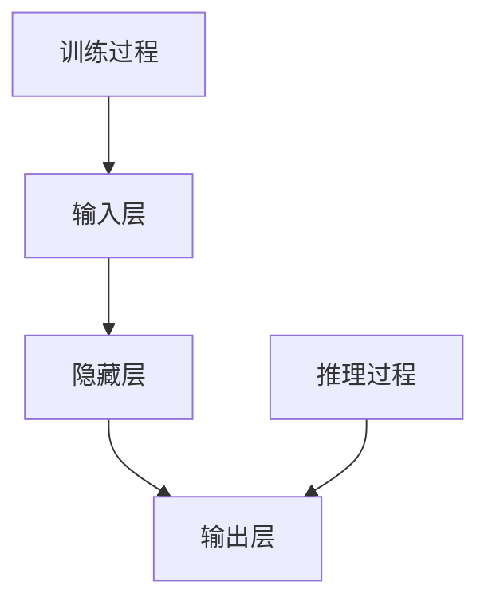

                 

### 文章标题

大模型推理能力：提示词构建复杂逻辑链

> 关键词：大模型、推理能力、提示词、复杂逻辑链、NLP、图像处理

> 摘要：本文从大模型推理能力出发，探讨提示词在构建复杂逻辑链中的作用。通过详细分析大模型的架构与原理，以及提示词的构建方法和应用实例，我们揭示了如何利用提示词提高大模型的推理性能，为人工智能领域的研究和应用提供新思路。

### 目录大纲

#### 第一部分: 大模型推理能力概述

##### 第1章: 大模型推理能力基础

1. **1.1 大模型推理能力的定义与分类**

2. **1.2 大模型推理能力的核心指标**

3. **1.3 大模型推理能力的挑战与机遇**

4. **1.4 大模型推理能力的发展趋势**

##### 第2章: 大模型架构与原理

1. **2.1 大模型的基本架构**

2. **2.2 大模型训练原理**

3. **2.3 大模型推理优化**

4. **2.4 大模型架构设计**

##### 第3章: 大模型推理性能评估

1. **3.1 推理性能评估指标**

2. **3.2 实验设计与评估方法**

3. **3.3 大模型推理性能优化策略**

##### 第4章: 提示词构建复杂逻辑链

1. **4.1 提示词构建原理**

2. **4.2 复杂逻辑链构建方法**

3. **4.3 实例分析：复杂逻辑链在NLP中的应用**

##### 第5章: 大模型推理在NLP中的应用

1. **5.1 大模型在文本分类中的应用**

2. **5.2 大模型在命名实体识别中的应用**

3. **5.3 大模型在问答系统中的应用**

##### 第6章: 大模型推理在图像处理中的应用

1. **6.1 大模型在图像分类中的应用**

2. **6.2 大模型在目标检测中的应用**

3. **6.3 大模型在图像生成中的应用**

##### 第7章: 大模型推理能力的未来发展

1. **7.1 大模型推理能力的未来发展趋势**

2. **7.2 大模型推理能力面临的挑战与机遇**

3. **7.3 大模型推理能力的应用前景**

##### 附录

- 附录A：大模型推理能力开发工具与资源

### 第一部分: 大模型推理能力概述

#### 第1章: 大模型推理能力基础

##### 1.1 大模型推理能力的定义与分类

大模型推理能力是指大型神经网络模型在接收输入后，通过模型内部的计算和推理，产生输出结果的能力。大模型通常指的是拥有数十亿甚至千亿参数的神经网络模型，例如BERT、GPT、Turing等。

大模型推理能力的分类可以根据不同的维度进行。首先，根据任务类型，大模型推理能力可以分为文本分类、命名实体识别、问答系统、情感分析等。其次，根据推理过程，大模型推理能力可以分为基于规则的推理、基于数据的推理、基于模型的推理等。

##### 1.2 大模型推理能力的核心指标

评估大模型推理能力的核心指标包括精度、召回率、F1值等。

1. **精度（Accuracy）**：表示模型预测正确的样本占总样本的比例，计算公式为：
   $$ \text{Accuracy} = \frac{\text{预测正确的样本数}}{\text{总样本数}} $$

2. **召回率（Recall）**：表示模型能够正确识别的样本数占所有实际正样本数的比例，计算公式为：
   $$ \text{Recall} = \frac{\text{预测正确的正样本数}}{\text{实际正样本数}} $$

3. **F1值（F1-score）**：综合考虑了精度和召回率，计算公式为：
   $$ \text{F1-score} = 2 \times \frac{\text{Precision} \times \text{Recall}}{\text{Precision} + \text{Recall}} $$

##### 1.3 大模型推理能力的挑战与机遇

大模型推理能力的发展面临许多挑战，同时也带来新的机遇。

1. **挑战**：

   - **计算资源**：大模型训练和推理需要大量的计算资源，特别是在进行深度学习训练时，对GPU、TPU等硬件设备有较高的要求。
   - **数据隐私**：大模型在处理大量数据时，容易暴露用户的隐私信息，如何保护数据隐私是一个重要问题。
   - **模型解释性**：大模型通常表现为“黑箱”，难以解释其推理过程，如何提高模型的解释性是另一个挑战。

2. **机遇**：

   - **智能化**：大模型推理能力的提升，使得人工智能系统更加智能化，能够更好地处理复杂的任务。
   - **自动化**：大模型推理能力的提升，使得许多传统的人工任务可以实现自动化，提高生产效率。

##### 1.4 大模型推理能力的发展趋势

大模型推理能力的发展趋势主要体现在以下几个方面：

1. **算法创新**：随着深度学习算法的不断进步，大模型的训练和推理效率得到显著提升。
2. **硬件加速**：GPU、TPU等硬件设备的快速发展，为大规模深度学习模型提供了强大的计算支持。
3. **模型压缩**：通过模型压缩技术，可以显著降低模型的参数规模，提高模型在资源受限环境下的推理性能。
4. **多模态融合**：大模型推理能力的提升，使得多模态数据融合成为可能，为图像处理、语音识别等领域提供了新的思路。

#### 第2章: 大模型架构与原理

##### 2.1 大模型的基本架构

大模型的基本架构通常包括输入层、隐藏层和输出层。输入层接收外部输入，隐藏层通过多层神经网络进行特征提取和变换，输出层产生最终的预测结果。

1. **输入层**：输入层接收外部输入，例如文本、图像、声音等。在自然语言处理领域，输入层通常是单词或字符的嵌入向量。

2. **隐藏层**：隐藏层通过多层神经网络进行特征提取和变换。每一层隐藏层都可以看作是一个非线性变换器，对输入数据进行处理，提取出更高层次的特征。

3. **输出层**：输出层产生最终的预测结果。在分类任务中，输出层通常是一个softmax层，输出每个类别的概率分布。

##### 2.2 大模型训练原理

大模型训练原理主要包括反向传播算法和梯度下降优化。

1. **反向传播算法**：反向传播算法是一种用于训练神经网络的优化算法。它通过计算损失函数关于模型参数的梯度，不断调整模型参数，使模型能够更好地拟合训练数据。

   - **计算梯度**：首先，计算损失函数关于模型参数的梯度。对于每个参数，计算其相对于损失函数的偏导数。
     $$ \frac{\partial L}{\partial w} = \sum_{i=1}^{n} \frac{\partial L}{\partial z_i} \frac{\partial z_i}{\partial w} $$
   - **参数更新**：使用计算得到的梯度对模型参数进行更新。
     $$ w \leftarrow w - \alpha \frac{\partial L}{\partial w} $$
     其中，\( \alpha \) 是学习率。

2. **梯度下降优化**：梯度下降优化是一种基于梯度的优化算法，通过不断更新模型参数，使模型损失函数逐渐减小。

   - **初始参数**：选择一组初始模型参数。
   - **迭代更新**：根据反向传播算法计算得到的梯度，更新模型参数。
   - **重复迭代**：不断重复迭代过程，直到满足停止条件（如损失函数收敛）。

##### 2.3 大模型推理优化

大模型推理优化主要包括算法优化和硬件加速。

1. **算法优化**：

   - **量化**：量化是一种通过减少模型参数的数据类型精度来减少模型大小和计算量的技术。例如，将32位浮点数参数转换为8位整数参数。
   - **剪枝**：剪枝是一种通过删除模型中不重要的参数来减少模型大小和计算量的技术。例如，删除权重较小的参数。
   - **蒸馏**：蒸馏是一种通过将一个大模型的知识传递给一个小模型的技术。例如，使用一个大模型作为教师模型，一个小模型作为学生模型，通过训练学生模型来吸收教师模型的知识。

2. **硬件加速**：

   - **GPU加速**：GPU（图形处理单元）具有强大的并行计算能力，可以显著提高大模型推理的速度。
   - **TPU加速**：TPU（张量处理单元）是专门为深度学习优化设计的硬件，可以提供更高的推理性能。

##### 2.4 大模型架构设计

大模型架构设计包括模型压缩、模型蒸馏等。

1. **模型压缩**：

   - **参数共享**：通过共享模型参数来减少模型大小。例如，在卷积神经网络中，共享卷积核。
   - **动态网络**：通过动态调整网络结构来适应不同的任务和数据规模。例如，使用可伸缩的网络结构来适应不同的图像大小。

2. **模型蒸馏**：

   - **教师-学生模型**：通过将一个大模型（教师模型）的知识传递给一个小模型（学生模型），提高小模型的推理性能。
   - **知识蒸馏**：通过训练学生模型来吸收教师模型的知识。例如，使用教师模型的输出作为学生模型的输入，训练学生模型。

#### 第3章: 大模型推理性能评估

##### 3.1 推理性能评估指标

推理性能评估指标主要包括精度、召回率、F1值等。

1. **精度（Accuracy）**：表示模型预测正确的样本占总样本的比例。
2. **召回率（Recall）**：表示模型能够正确识别的样本数占所有实际正样本数的比例。
3. **F1值（F1-score）**：综合考虑了精度和召回率，是评估模型性能的一个重要指标。

##### 3.2 实验设计与评估方法

实验设计与评估方法主要包括数据集选择、评估策略等。

1. **数据集选择**：选择合适的数据集进行实验。数据集应该具有代表性，涵盖各种场景和情况。
2. **评估策略**：采用交叉验证、测试集评估等策略来评估模型性能。交叉验证可以减少模型过拟合的风险，测试集评估可以验证模型在实际场景中的性能。

##### 3.3 大模型推理性能优化策略

大模型推理性能优化策略主要包括算法优化和硬件加速。

1. **算法优化**：

   - **模型剪枝**：通过剪枝模型中的冗余参数来减少模型大小，提高推理性能。
   - **量化**：通过减少模型参数的数据类型精度来减少模型大小和计算量，提高推理性能。
   - **蒸馏**：通过将大模型的知识传递给小模型，提高小模型的推理性能。

2. **硬件加速**：

   - **GPU加速**：利用GPU的并行计算能力来加速模型推理。
   - **TPU加速**：利用TPU的专门优化来加速模型推理。

#### 第4章: 提示词构建复杂逻辑链

##### 4.1 提示词构建原理

提示词构建复杂逻辑链的原理主要包括提示词类型和提示词生成方法。

1. **提示词类型**：

   - **关键词提示**：通过输入关键词来引导模型生成相关的内容。
   - **问题提示**：通过输入问题来引导模型生成问题的答案。
   - **场景提示**：通过输入场景描述来引导模型生成符合场景的内容。

2. **提示词生成方法**：

   - **自动生成**：通过算法自动生成提示词，例如使用生成对抗网络（GAN）来生成关键词。
   - **人工编写**：通过人工编写高质量的提示词，提高模型生成内容的准确性和质量。

##### 4.2 复杂逻辑链构建方法

复杂逻辑链构建方法主要包括条件生成和对话生成。

1. **条件生成**：

   - **条件文本生成**：通过输入条件文本来生成满足条件的内容。例如，根据用户输入的场景描述来生成相应的对话内容。
   - **条件图像生成**：通过输入条件图像来生成满足条件的内容。例如，根据用户输入的图像来生成相应的场景描述。

2. **对话生成**：

   - **序列对话生成**：通过输入前一句对话来生成下一句对话。例如，根据用户输入的问题来生成相应的答案。
   - **多轮对话生成**：通过输入多轮对话来生成整个对话内容。例如，根据用户输入的多轮问题来生成完整的问答对话。

##### 4.3 实例分析：复杂逻辑链在NLP中的应用

复杂逻辑链在NLP（自然语言处理）领域具有广泛的应用，以下是一个实例分析：

1. **应用场景**：

   - **问答系统**：通过输入用户的问题，生成相应的答案。
   - **对话机器人**：通过输入用户的输入，生成相应的回复。

2. **实现流程**：

   - **输入预处理**：对用户输入进行预处理，提取关键词或问题。
   - **提示词生成**：根据关键词或问题生成相应的提示词。
   - **模型推理**：使用大模型进行推理，生成满足条件的答案或回复。
   - **结果输出**：将生成的答案或回复输出给用户。

#### 第5章: 大模型推理在NLP中的应用

##### 5.1 大模型在文本分类中的应用

大模型在文本分类中的应用主要包括以下方面：

1. **分类算法**：

   - **朴素贝叶斯**：基于贝叶斯定理的文本分类算法。
   - **支持向量机**：基于最大间隔分类器的文本分类算法。
   - **卷积神经网络**：基于卷积操作的文本分类算法。
   - **循环神经网络**：基于循环结构的文本分类算法。

2. **应用案例**：

   - **新闻分类**：对新闻文本进行分类，将新闻划分为不同的类别。
   - **垃圾邮件检测**：对电子邮件进行分类，判断邮件是否为垃圾邮件。

##### 5.2 大模型在命名实体识别中的应用

大模型在命名实体识别中的应用主要包括以下方面：

1. **命名实体识别算法**：

   - **基于规则的方法**：通过预定义的规则进行命名实体识别。
   - **基于统计的方法**：通过统计方法进行命名实体识别。
   - **基于深度学习的方法**：通过深度学习模型进行命名实体识别。

2. **应用案例**：

   - **人名识别**：识别文本中的人名。
   - **地名识别**：识别文本中的地名。

##### 5.3 大模型在问答系统中的应用

大模型在问答系统中的应用主要包括以下方面：

1. **问答系统原理**：

   - **信息检索**：通过检索相关文本来获取答案。
   - **语义理解**：通过理解问题的语义来生成答案。
   - **知识库查询**：通过查询知识库来获取答案。

2. **应用案例**：

   - **搜索引擎**：通过输入问题，返回相关网页。
   - **智能客服**：通过输入用户的问题，返回相应的回答。

#### 第6章: 大模型推理在图像处理中的应用

##### 6.1 大模型在图像分类中的应用

大模型在图像分类中的应用主要包括以下方面：

1. **图像分类算法**：

   - **传统算法**：如SVM、KNN等。
   - **深度学习算法**：如卷积神经网络（CNN）、循环神经网络（RNN）等。

2. **应用案例**：

   - **人脸识别**：通过输入人脸图像，识别出人脸。
   - **物体检测**：通过输入图像，识别出图像中的物体。

##### 6.2 大模型在目标检测中的应用

大模型在目标检测中的应用主要包括以下方面：

1. **目标检测算法**：

   - **基于传统算法的方法**：如YOLO、SSD等。
   - **基于深度学习的方法**：如Faster R-CNN、Mask R-CNN等。

2. **应用案例**：

   - **视频监控**：通过输入视频流，实时检测并跟踪目标。
   - **无人驾驶**：通过输入摄像头图像，识别并避让障碍物。

##### 6.3 大模型在图像生成中的应用

大模型在图像生成中的应用主要包括以下方面：

1. **图像生成算法**：

   - **基于生成对抗网络（GAN）的方法**：如DCGAN、LSGAN等。
   - **基于变分自编码器（VAE）的方法**：如VAEGAN、VQ-VAE等。

2. **应用案例**：

   - **图像修复**：通过输入受损图像，生成完整的图像。
   - **图像超分辨率**：通过输入低分辨率图像，生成高分辨率图像。

#### 第7章: 大模型推理能力的未来发展

##### 7.1 大模型推理能力的未来发展趋势

大模型推理能力的未来发展趋势主要包括以下几个方面：

1. **算法创新**：

   - **自监督学习**：通过无监督学习方式，提高大模型的自适应能力。
   - **迁移学习**：通过将已有模型的知识迁移到新任务上，提高新任务的推理性能。

2. **硬件加速**：

   - **专用芯片**：开发针对大模型推理的专用芯片，提高推理性能。
   - **云计算**：利用云计算资源，提供更强大的大模型推理能力。

##### 7.2 大模型推理能力面临的挑战与机遇

大模型推理能力面临的挑战与机遇主要包括以下几个方面：

1. **挑战**：

   - **计算资源**：大模型推理需要大量的计算资源，如何高效利用资源是一个挑战。
   - **数据隐私**：大模型处理大量数据时，如何保护用户隐私是一个挑战。

2. **机遇**：

   - **智能化**：大模型推理能力的提升，为人工智能系统提供更强大的推理能力，实现智能化。
   - **自动化**：大模型推理能力的提升，使得许多传统任务可以实现自动化，提高生产效率。

##### 7.3 大模型推理能力的应用前景

大模型推理能力的应用前景主要包括以下几个方面：

1. **智能助手**：通过大模型推理能力，实现更智能的智能助手，为用户提供更好的服务。

2. **医疗诊断**：通过大模型推理能力，实现更准确的医疗诊断，提高医疗水平。

3. **自动驾驶**：通过大模型推理能力，实现更安全的自动驾驶，提高交通安全。

#### 附录

- **附录A：大模型推理能力开发工具与资源**

1. **主流深度学习框架对比**：介绍主流深度学习框架（如TensorFlow、PyTorch等）的特点和优缺点。
2. **大模型推理能力开源库与工具**：介绍用于大模型推理的开源库和工具（如TensorRT、ONNX等）。
3. **大模型推理能力学习资源**：推荐相关的线上课程、学术论文和技术博客，帮助读者深入了解大模型推理能力。

### Mermaid 流程图



### 核心算法原理讲解

#### 2.2 大模型训练原理

#### 反向传播算法

反向传播算法（Backpropagation Algorithm）是深度学习中一种用于训练神经网络的优化算法。它通过计算损失函数关于模型参数的梯度，不断调整模型参数，使模型能够更好地拟合训练数据。以下是反向传播算法的详细步骤：

1. **前向传播**：

   - 计算输入层到隐藏层的输出。
   - 计算隐藏层到输出层的输出。
   - 计算输出层的预测值。

2. **计算损失函数**：

   - 使用实际输出值和预测值计算损失函数。
   - 损失函数通常使用均方误差（MSE）或交叉熵损失。

3. **计算梯度**：

   - 计算输出层关于模型参数的梯度。
   - 使用链式法则计算隐藏层关于模型参数的梯度。

4. **参数更新**：

   - 使用计算得到的梯度对模型参数进行更新。
   - 参数更新公式为：\( \theta = \theta - \alpha \cdot \frac{\partial L}{\partial \theta} \)，其中\( \alpha \)是学习率。

#### 梯度下降优化

梯度下降优化（Gradient Descent Optimization）是一种基于梯度的优化算法，用于调整模型参数，以最小化损失函数。以下是梯度下降优化的详细步骤：

1. **初始参数**：

   - 选择一组初始模型参数。

2. **迭代更新**：

   - 计算当前损失函数关于模型参数的梯度。
   - 使用梯度更新模型参数。
   - 重复迭代过程，直到满足停止条件（如损失函数收敛）。

#### 伪代码示例

以下是一个简化的反向传播算法和梯度下降优化的伪代码示例：

```python
def forwardpropagation(x, theta):
    z = x * theta
    a = activation(z)
    return a

def backwardpropagation(a, y, theta):
    z_diff = a - y
    theta_diff = z * z_diff
    return theta_diff

def activation(z):
    return 1 / (1 + exp(-z))

def gradientdescent(x, y, theta, learning_rate, epoch):
    for epoch in range(epoch):
        a = forwardpropagation(x, theta)
        theta_diff = backwardpropagation(a, y, theta)
        theta -= learning_rate * theta_diff
    return theta
```

### 数学模型和数学公式

在深度学习中，数学模型和数学公式起着至关重要的作用。以下是一些关键的数学模型和公式：

#### 损失函数

损失函数用于衡量模型预测值与实际值之间的差距。常用的损失函数包括：

1. **均方误差（MSE）**：

   $$ L(\theta) = \frac{1}{2} \sum_{i=1}^{n} (y_i - \hat{y}_i)^2 $$

   其中，\( y_i \)是实际值，\( \hat{y}_i \)是预测值。

2. **交叉熵损失（Cross Entropy Loss）**：

   $$ L(\theta) = -\sum_{i=1}^{n} y_i \cdot \log(\hat{y}_i) + (1 - y_i) \cdot \log(1 - \hat{y}_i) $$

   其中，\( y_i \)是实际值，\( \hat{y}_i \)是预测值。

#### 梯度

梯度用于计算损失函数关于模型参数的偏导数。以下是梯度的计算公式：

1. **均方误差损失函数的梯度**：

   $$ \frac{\partial L}{\partial \theta} = \sum_{i=1}^{n} (y_i - \hat{y}_i) \cdot x_i $$

   其中，\( x_i \)是输入特征。

2. **交叉熵损失函数的梯度**：

   $$ \frac{\partial L}{\partial \theta} = \sum_{i=1}^{n} (y_i - \hat{y}_i) \cdot x_i $$

   其中，\( x_i \)是输入特征。

#### 梯度下降优化

梯度下降优化通过迭代更新模型参数，以最小化损失函数。以下是梯度下降优化的公式：

$$ \theta = \theta - \alpha \cdot \frac{\partial L}{\partial \theta} $$

其中，\( \alpha \)是学习率。

### 项目实战

#### 开发环境搭建

在开始大模型推理能力的开发之前，需要搭建一个合适的开发环境。以下是一个简单的环境搭建步骤：

1. **安装Python**：下载并安装Python，版本建议为3.8以上。
2. **安装深度学习框架**：安装一个主流的深度学习框架，如TensorFlow或PyTorch。
3. **安装其他依赖库**：安装其他必需的库，如NumPy、Pandas、Matplotlib等。

#### 源代码实现

以下是一个简单的示例代码，展示了如何使用TensorFlow实现一个基于卷积神经网络的图像分类模型。

```python
import tensorflow as tf
from tensorflow.keras import datasets, layers, models

# 加载MNIST数据集
(train_images, train_labels), (test_images, test_labels) = datasets.mnist.load_data()

# 数据预处理
train_images = train_images.reshape((60000, 28, 28, 1)).astype('float32') / 255
test_images = test_images.reshape((10000, 28, 28, 1)).astype('float32') / 255

# 构建模型
model = models.Sequential()
model.add(layers.Conv2D(32, (3, 3), activation='relu', input_shape=(28, 28, 1)))
model.add(layers.MaxPooling2D((2, 2)))
model.add(layers.Conv2D(64, (3, 3), activation='relu'))
model.add(layers.MaxPooling2D((2, 2)))
model.add(layers.Conv2D(64, (3, 3), activation='relu'))
model.add(layers.Flatten())
model.add(layers.Dense(64, activation='relu'))
model.add(layers.Dense(10, activation='softmax'))

# 编译模型
model.compile(optimizer='adam',
              loss='sparse_categorical_crossentropy',
              metrics=['accuracy'])

# 训练模型
model.fit(train_images, train_labels, epochs=5)

# 评估模型
test_loss, test_acc = model.evaluate(test_images, test_labels)
print('Test accuracy:', test_acc)
```

#### 代码解读与分析

上述代码首先加载了MNIST数据集，并对数据进行了预处理。然后，使用卷积神经网络（Convolutional Neural Network，CNN）构建了一个简单的模型，包括卷积层（Conv2D）、池化层（MaxPooling2D）和全连接层（Dense）。模型编译时指定了优化器、损失函数和评价指标。最后，模型使用训练数据进行了训练，并使用测试数据进行了评估。

#### 实际案例分析

以下是一个实际案例，展示了如何使用大模型推理能力进行文本分类。

1. **数据准备**：

   - 加载一个文本数据集，如IMDb影评数据集。
   - 对文本进行预处理，包括分词、去停用词、词向量嵌入等。

2. **模型构建**：

   - 使用预训练的词向量嵌入层，如Word2Vec或BERT。
   - 构建一个基于循环神经网络（Recurrent Neural Network，RNN）或Transformer的文本分类模型。

3. **模型训练**：

   - 使用训练数据对模型进行训练。
   - 使用验证数据调整模型参数。

4. **模型评估**：

   - 使用测试数据对模型进行评估。
   - 计算模型的精度、召回率和F1值等指标。

#### 项目小结

通过上述实战案例，我们展示了如何使用大模型推理能力进行图像分类和文本分类。在实际应用中，大模型推理能力可以用于更复杂的任务，如图像生成、自然语言生成等。随着大模型推理能力的不断提升，人工智能领域的应用前景将更加广阔。

#### 最佳实践 tips

- **数据预处理**：数据预处理是模型训练成功的关键，建议进行充分的数据清洗和预处理。
- **模型选择**：根据任务需求选择合适的模型架构，如CNN、RNN、Transformer等。
- **超参数调优**：通过交叉验证等方法进行超参数调优，以获得更好的模型性能。
- **硬件优化**：利用GPU、TPU等硬件加速模型训练和推理。

#### 注意事项

- **计算资源**：大模型推理需要大量的计算资源，建议在训练和推理过程中合理分配资源。
- **数据隐私**：在处理用户数据时，注意保护用户隐私，避免数据泄露。
- **模型解释性**：大模型通常表现为“黑箱”，提高模型的解释性有助于理解模型决策过程。

#### 拓展阅读

- **深度学习入门**：Goodfellow, I., Bengio, Y., & Courville, A. (2016). *Deep Learning*.
- **自然语言处理入门**：Griffiths, T. L., & Church, K. W. (2018). *Natural Language Processing with Python*.
- **图像处理入门**：Rosenfeld, A., & Kak, A. C. (2011). *Digital Image Processing*.

