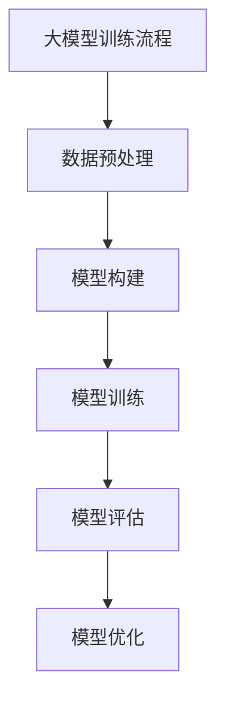

                 

### 文章标题：大模型概念演化与提示词动态适应

随着人工智能（AI）技术的飞速发展，大模型作为AI领域的重要突破，正逐渐成为各行各业的关键驱动力。本文将深入探讨大模型的概念演化过程，并重点分析提示词在模型训练和应用中的动态适应机制。通过逻辑清晰、结构紧凑的分析，我们将揭示大模型如何影响AI领域，以及提示词动态适应在其中的关键作用。

关键词：大模型、AI技术、提示词、动态适应、模型训练、应用场景

摘要：本文旨在全面解析大模型的概念演变及其在AI领域的应用。首先，我们将回顾大模型的定义及其演变历程，分析其结构与特点，探讨大模型在AI中的重要性。接着，我们将深入探讨大模型的数学基础，包括神经网络、优化算法和自适应优化等内容。随后，文章将详细描述大模型的训练与评估方法，以及模型调优策略。在第二部分，我们将聚焦于提示词的概念与作用，探讨其设计原则和动态适应机制。最后，通过具体案例分析，我们总结大模型与提示词动态适应的发展趋势和未来展望。

### 目录大纲

#### 第一部分：大模型基础

- **第1章：大模型概述**
  - **1.1 大模型的定义与演变历程**
  - **1.2 大模型的结构与特点**
  - **1.3 大模型在AI领域的重要性

- **第2章：大模型的数学基础**
  - **2.1 神经网络基础**
  - **2.2 优化算法**
  - **2.3 自适应优化

- **第3章：大模型的训练与评估**
  - **3.1 训练方法**
  - **3.2 评估方法**
  - **3.3 模型调优**

#### 第二部分：提示词动态适应

- **第4章：提示词的概念与作用**
  - **4.1 提示词的定义与分类**
  - **4.2 提示词在模型训练中的作用**
  - **4.3 提示词的设计原则**

- **第5章：动态适应机制**
  - **5.1 动态适应的概念与原理**
  - **5.2 动态适应的方法与技术**
  - **5.3 动态适应的实现与应用**

- **第6章：提示词与动态适应的协同优化**
  - **6.1 协同优化的概念与目标**
  - **6.2 提示词优化方法**
  - **6.3 动态适应策略**

- **第7章：案例研究与未来展望**
  - **7.1 案例分析**
  - **7.2 未来展望**

#### 附录

- **附录A：参考资料**
  - **A.1 相关文献**
  - **A.2 开发工具与资源**

- **附录B：Mermaid流程图**

- **附录C：伪代码示例**

### 第一部分：大模型基础

#### 第1章：大模型概述

### 1.1 大模型的定义与演变历程

大模型是指具有巨大参数量和复杂结构的机器学习模型，能够处理大量数据并进行高精度的预测和决策。大模型的定义随着AI技术的发展而不断演进。最初，大模型主要指具有数十亿参数的神经网络模型，如深度神经网络（DNN）和循环神经网络（RNN）。随着计算能力的提升和数据量的激增，大模型的定义进一步扩展，包括具有数十亿甚至数万亿参数的模型，如Transformer模型、GPT系列模型和BERT模型。

大模型的演变历程可以分为以下几个阶段：

1. **早期大模型**：20世纪90年代，研究人员开始探索具有数百万参数的神经网络模型，如用于图像识别的LeNet和用于自然语言处理的RNN。这些早期大模型奠定了现代大模型的基础。

2. **深度学习时代**：2006年，Hinton等人提出了深度信念网络（DBN），标志着深度学习技术的崛起。随后，深度神经网络（DNN）在图像识别和语音识别等领域取得了显著成果。这一时期的代表性模型包括AlexNet、VGG和ResNet。

3. **大规模预训练模型**：2018年，OpenAI发布了GPT系列模型，标志着大规模预训练模型时代的到来。GPT-3具有1750亿个参数，能够进行文本生成、机器翻译和问答等复杂任务。这一阶段的大模型主要通过大规模预训练和精细调整来提升性能。

4. **多模态大模型**：近年来，研究人员开始探索多模态大模型，能够同时处理文本、图像和音频等多种类型的数据。例如，BERT模型结合了文本和图像信息，能够实现更加准确的自然语言理解和图像识别。

### 1.2 大模型的结构与特点

大模型通常具有以下结构和特点：

1. **大规模参数**：大模型具有数十亿甚至数万亿个参数，这使得模型能够捕捉数据中的复杂模式和关联。

2. **多层神经网络**：大模型通常包含多层神经网络，每层都能够对输入数据进行处理和转换，从而实现高维特征空间的映射。

3. **深度学习架构**：大模型采用深度学习架构，包括卷积神经网络（CNN）、循环神经网络（RNN）和Transformer模型等，这些架构能够有效处理不同类型的数据和任务。

4. **复杂连接方式**：大模型中的神经元之间采用复杂的连接方式，如残差连接、跳连接和自注意力机制等，这些连接方式能够增强模型的表达能力和鲁棒性。

5. **高计算资源需求**：大模型的训练和推理过程需要大量的计算资源，包括高性能的GPU和TPU等硬件设备。

### 1.3 大模型在AI领域的重要性

大模型在AI领域的应用范围广泛，对AI技术的发展具有重要影响：

1. **提升模型性能**：大模型能够处理更大量的数据和更复杂的任务，从而提升模型的性能和准确性。例如，GPT-3在自然语言处理任务中取得了比以往模型更好的表现。

2. **推动领域突破**：大模型在图像识别、语音识别、机器翻译和问答系统等领域取得了重要突破，推动了相关技术的快速发展。

3. **拓宽应用场景**：大模型能够处理多种类型的数据和任务，从而拓宽AI技术的应用场景，包括医疗、金融、教育、自动驾驶等。

4. **降低门槛**：大模型的预训练和精细调整过程使得AI技术更加易于使用，降低了开发和应用AI技术的门槛。

总之，大模型作为AI领域的重要突破，对AI技术的发展产生了深远影响，将继续推动AI技术的进步和应用。

#### 第2章：大模型的数学基础

### 2.1 神经网络基础

神经网络是构建大模型的基础，其核心思想是通过模拟生物神经系统的结构和功能来实现复杂的数据处理任务。在本节中，我们将介绍神经网络的基本概念、工作原理和数学模型。

#### 2.1.1 基本概念

神经网络由一系列相互连接的神经元组成，每个神经元都负责处理输入数据并进行输出。神经网络中的神经元通常包含以下几个组成部分：

1. **输入层**：接收外部输入数据。
2. **隐藏层**：对输入数据进行处理和转换。
3. **输出层**：生成最终的输出结果。

神经网络的连接方式可以分为两种：前向传播和反向传播。前向传播是指输入数据从输入层流向隐藏层，再从隐藏层流向输出层的过程。反向传播是指根据输出结果与实际结果的差异，通过反向传播算法更新神经元权重和偏置的过程。

#### 2.1.2 工作原理

神经网络的工作原理可以概括为以下几个步骤：

1. **初始化参数**：随机初始化网络中的权重和偏置。
2. **前向传播**：将输入数据传递给神经网络，通过多层神经元进行处理和转换，最终得到输出结果。
3. **激活函数应用**：在神经元的输出过程中，应用激活函数（如Sigmoid、ReLU等）来引入非线性特性。
4. **反向传播**：根据输出结果与实际结果的差异，通过反向传播算法更新神经元的权重和偏置，从而优化网络性能。
5. **迭代训练**：重复前向传播和反向传播的过程，直到网络性能达到预期水平。

#### 2.1.3 数学模型

神经网络的数学模型主要包括以下几个部分：

1. **输入层与隐藏层**：

   假设输入层有n个神经元，隐藏层有m个神经元。每个输入数据 \( x_i \) 与隐藏层每个神经元 \( h_j \) 的连接权重为 \( w_{ij} \)，偏置为 \( b_j \)。隐藏层神经元的输出可以通过以下公式计算：

   \[
   h_j = \sigma(\sum_{i=1}^{n} w_{ij} x_i + b_j)
   \]

   其中，\( \sigma \) 表示激活函数，如Sigmoid函数：

   \[
   \sigma(z) = \frac{1}{1 + e^{-z}}
   \]

2. **隐藏层与输出层**：

   假设隐藏层有m个神经元，输出层有k个神经元。隐藏层每个神经元 \( h_j \) 与输出层每个神经元 \( y_i \) 的连接权重为 \( w_{ji} \)，偏置为 \( b_i \)。输出层神经元的输出可以通过以下公式计算：

   \[
   y_i = \sigma(\sum_{j=1}^{m} w_{ji} h_j + b_i)
   \]

3. **损失函数**：

   在神经网络训练过程中，通过比较输出结果与实际结果之间的差异来计算损失。常见的损失函数包括均方误差（MSE）、交叉熵（Cross-Entropy）等。以MSE为例，其公式为：

   \[
   L = \frac{1}{2} \sum_{i=1}^{k} (y_i - \hat{y}_i)^2
   \]

   其中，\( y_i \) 表示实际输出，\( \hat{y}_i \) 表示预测输出。

4. **反向传播**：

   反向传播的核心思想是计算损失函数关于神经网络参数的梯度，并通过梯度下降算法更新参数。以输出层为例，其梯度计算公式为：

   \[
   \frac{\partial L}{\partial w_{ji}} = \frac{\partial L}{\partial \hat{y}_i} \cdot \frac{\partial \hat{y}_i}{\partial w_{ji}} = (y_i - \hat{y}_i) \cdot h_j
   \]

   同理，可以计算出其他参数的梯度。

#### 2.1.4 示例

假设一个简单的神经网络，包含一个输入层、一个隐藏层和一个输出层。输入层有2个神经元，隐藏层有3个神经元，输出层有1个神经元。输入数据为 \( x_1 = 1 \)，\( x_2 = 0 \)。

1. **初始化参数**：

   \( w_{11} = 0.5 \)，\( w_{12} = 0.3 \)，\( b_1 = 0.2 \)

   \( w_{21} = 0.4 \)，\( w_{22} = 0.5 \)，\( b_2 = 0.1 \)

   \( w_{31} = 0.2 \)，\( w_{32} = 0.4 \)，\( b_3 = 0.3 \)

2. **前向传播**：

   隐藏层输出：

   \[
   h_1 = \sigma(w_{11} x_1 + w_{12} x_2 + b_1) = \sigma(0.5 \cdot 1 + 0.3 \cdot 0 + 0.2) = 0.546
   \]

   \[
   h_2 = \sigma(w_{21} x_1 + w_{22} x_2 + b_2) = \sigma(0.4 \cdot 1 + 0.5 \cdot 0 + 0.1) = 0.616
   \]

   \[
   h_3 = \sigma(w_{31} x_1 + w_{32} x_2 + b_3) = \sigma(0.2 \cdot 1 + 0.4 \cdot 0 + 0.3) = 0.556
   \]

   输出层输出：

   \[
   y = \sigma(w_{31} h_1 + w_{32} h_2 + b_3) = \sigma(0.2 \cdot 0.546 + 0.4 \cdot 0.616 + 0.3) = 0.652
   \]

3. **反向传播**：

   计算损失函数的梯度：

   \[
   \frac{\partial L}{\partial w_{31}} = (y - \hat{y}) \cdot h_1 = (0.652 - 0.65) \cdot 0.546 = 0.0013
   \]

   \[
   \frac{\partial L}{\partial w_{32}} = (y - \hat{y}) \cdot h_2 = (0.652 - 0.65) \cdot 0.616 = 0.0015
   \]

   \[
   \frac{\partial L}{\partial b_3} = (y - \hat{y}) = 0.652 - 0.65 = 0.002
   \]

4. **参数更新**：

   \[
   w_{31} = w_{31} - \alpha \cdot \frac{\partial L}{\partial w_{31}} = 0.2 - 0.0013 = 0.1987
   \]

   \[
   w_{32} = w_{32} - \alpha \cdot \frac{\partial L}{\partial w_{32}} = 0.4 - 0.0015 = 0.3985
   \]

   \[
   b_3 = b_3 - \alpha \cdot \frac{\partial L}{\partial b_3} = 0.3 - 0.002 = 0.298
   \]

通过以上步骤，我们可以不断更新网络参数，从而优化网络性能。

### 2.2 优化算法

在神经网络训练过程中，优化算法用于调整网络参数，以最小化损失函数。优化算法的选择对模型的训练速度和性能有重要影响。常见的优化算法包括梯度下降（Gradient Descent）、Adam和RMSprop等。

#### 2.2.1 梯度下降

梯度下降是一种基本的优化算法，其核心思想是沿梯度方向调整网络参数，以最小化损失函数。梯度下降算法的步骤如下：

1. **初始化参数**：随机初始化网络参数。
2. **前向传播**：计算输入数据的输出结果。
3. **计算梯度**：计算损失函数关于网络参数的梯度。
4. **更新参数**：沿梯度方向更新网络参数。
5. **迭代训练**：重复前向传播、计算梯度和更新参数的过程，直到网络性能达到预期水平。

梯度下降算法的公式为：

\[
\theta = \theta - \alpha \cdot \nabla_\theta J(\theta)
\]

其中，\( \theta \) 表示网络参数，\( \alpha \) 表示学习率，\( J(\theta) \) 表示损失函数。

梯度下降算法的优点是简单易实现，但缺点是收敛速度较慢，且容易陷入局部最小值。

#### 2.2.2 Adam

Adam是一种结合了梯度下降和动量的优化算法，其核心思想是在梯度方向上引入动量，以加速收敛。Adam算法的步骤如下：

1. **初始化参数**：随机初始化网络参数，初始化一阶矩估计 \( m_1 \) 和二阶矩估计 \( m_2 \)，以及指数衰减率 \( \beta_1 \) 和 \( \beta_2 \)。
2. **前向传播**：计算输入数据的输出结果。
3. **计算梯度**：计算损失函数关于网络参数的梯度。
4. **更新一阶矩估计和二阶矩估计**：

   \[
   m_1 = \beta_1 m_1 + (1 - \beta_1) \nabla_\theta J(\theta)
   \]

   \[
   m_2 = \beta_2 m_2 + (1 - \beta_2) (\nabla_\theta J(\theta))^2
   \]

5. **计算偏置修正**：

   \[
   \hat{m}_1 = \frac{m_1}{1 - \beta_1^t}
   \]

   \[
   \hat{m}_2 = \frac{m_2}{1 - \beta_2^t}
   \]

6. **更新参数**：

   \[
   \theta = \theta - \alpha \cdot \frac{\hat{m}_1}{\sqrt{\hat{m}_2} + \epsilon}
   \]

其中，\( t \) 表示迭代次数，\( \epsilon \) 是一个很小的常数，用于防止分母为零。

Adam算法的优点是同时考虑了一阶和二阶矩信息，收敛速度较快，且对参数的初始值不敏感。

#### 2.2.3 RMSprop

RMSprop是一种基于梯度平方的优化算法，其核心思想是使用梯度平方的平均值来更新参数。RMSprop算法的步骤如下：

1. **初始化参数**：随机初始化网络参数，初始化梯度平方的平均值 \( r \)，以及指数衰减率 \( \beta \)。
2. **前向传播**：计算输入数据的输出结果。
3. **计算梯度**：计算损失函数关于网络参数的梯度。
4. **更新梯度平方的平均值**：

   \[
   r = \beta r + (1 - \beta) (\nabla_\theta J(\theta))^2
   \]

5. **更新参数**：

   \[
   \theta = \theta - \alpha \cdot \frac{\nabla_\theta J(\theta)}{\sqrt{r} + \epsilon}
   \]

RMSprop算法的优点是计算简单，能够有效应对梯度消失和梯度爆炸问题。

### 2.3 自适应优化

自适应优化是一种通过动态调整学习率来优化模型性能的算法。其核心思想是根据模型的训练过程实时调整学习率，以加速收敛和提高性能。自适应优化算法包括AdaGrad、Adadelta和Nadam等。

#### 2.3.1 AdaGrad

AdaGrad是一种基于梯度平方的优化算法，其核心思想是使用梯度平方的平均值来更新参数。AdaGrad算法的步骤如下：

1. **初始化参数**：随机初始化网络参数，初始化梯度平方的平均值 \( g^2 \)。
2. **前向传播**：计算输入数据的输出结果。
3. **计算梯度**：计算损失函数关于网络参数的梯度。
4. **更新参数**：

   \[
   \theta = \theta - \frac{\alpha}{\sqrt{g^2 + \epsilon}} \cdot \nabla_\theta J(\theta)
   \]

   \[
   g^2 = g^2 + (\nabla_\theta J(\theta))^2
   \]

AdaGrad算法的优点是能够自动调整学习率，避免了梯度消失和梯度爆炸问题。缺点是对于稀疏梯度，更新后的学习率可能过小，导致收敛速度较慢。

#### 2.3.2 Adadelta

Adadelta是一种基于Adagrad改进的优化算法，其核心思想是使用梯度的平方和和梯度的绝对值来更新参数。Adadelta算法的步骤如下：

1. **初始化参数**：随机初始化网络参数，初始化梯度平方的平均值 \( g^2 \) 和梯度绝对值的平均值 \( g \)。
2. **前向传播**：计算输入数据的输出结果。
3. **计算梯度**：计算损失函数关于网络参数的梯度。
4. **更新参数**：

   \[
   \theta = \theta - \frac{\alpha}{\sqrt{\frac{g^2}{\epsilon} + \frac{g^2}{\epsilon}}} \cdot \nabla_\theta J(\theta)
   \]

   \[
   g^2 = \rho g^2 + (1 - \rho) (\nabla_\theta J(\theta))^2
   \]

   \[
   g = \rho g + (1 - \rho) |\nabla_\theta J(\theta)|
   \]

其中，\( \rho \) 是遗忘因子。

Adadelta算法的优点是能够自动调整学习率，避免了梯度消失和梯度爆炸问题，且对于稀疏梯度也表现良好。

#### 2.3.3 Nadam

Nadam是Nesterov动量自适应优化算法，其核心思想是结合Nesterov动量（NM）和自适应优化（如Adadelta或RMSprop）。Nadam算法的步骤如下：

1. **初始化参数**：随机初始化网络参数，初始化一阶矩估计 \( m_1 \) 和二阶矩估计 \( m_2 \)。
2. **前向传播**：计算输入数据的输出结果。
3. **计算梯度**：计算损失函数关于网络参数的梯度。
4. **更新一阶矩估计和二阶矩估计**：

   \[
   m_1 = \rho_1 m_1 + (1 - \rho_1) \nabla_\theta J(\theta)
   \]

   \[
   m_2 = \rho_2 m_2 + (1 - \rho_2) (\nabla_\theta J(\theta))^2
   \]

5. **计算偏置修正**：

   \[
   \hat{m}_1 = \frac{m_1}{1 - \rho_1^t}
   \]

   \[
   \hat{m}_2 = \frac{m_2}{1 - \rho_2^t}
   \]

6. **更新参数**：

   \[
   \theta = \theta - \alpha \cdot \frac{\hat{m}_1}{\sqrt{\hat{m}_2} + \epsilon}
   \]

Nadam算法的优点是结合了Nesterov动量和自适应优化，能够提高收敛速度和性能。

通过以上介绍，我们可以看到自适应优化算法在神经网络训练中发挥着重要作用，能够有效调整学习率，提高模型性能。

### 第3章：大模型的训练与评估

#### 3.1 训练方法

大模型的训练方法主要包括监督学习、无监督学习和半监督学习。每种方法都有其特定的应用场景和优缺点。

##### 3.1.1 监督学习

监督学习是指利用带有标签的训练数据来训练模型。在大模型中，监督学习通常用于分类和回归任务。以下是一些监督学习的核心步骤：

1. **数据预处理**：对训练数据进行清洗、归一化和编码，以便于模型处理。
2. **数据划分**：将数据集划分为训练集、验证集和测试集，用于模型的训练、验证和测试。
3. **模型构建**：根据任务需求，构建适合的大模型结构。
4. **参数初始化**：随机初始化模型参数。
5. **前向传播**：将输入数据传递给模型，计算输出结果。
6. **损失函数计算**：根据输出结果与实际标签的差异，计算损失函数。
7. **反向传播**：通过反向传播算法更新模型参数。
8. **迭代训练**：重复前向传播、损失函数计算和反向传播的过程，直到模型性能达到预期水平。

监督学习的优点是能够利用标签数据进行模型训练，从而提高模型性能。缺点是需要大量的标注数据，且在数据不平衡时容易出现过拟合问题。

##### 3.1.2 无监督学习

无监督学习是指在没有标签数据的情况下，通过模型自动发现数据中的结构和规律。在大模型中，无监督学习常用于聚类、降维和生成模型等任务。以下是一些无监督学习的核心步骤：

1. **数据预处理**：对训练数据进行清洗和归一化处理。
2. **模型构建**：根据任务需求，构建适合的大模型结构。
3. **嵌入生成**：通过模型将输入数据映射到低维空间，或生成新的数据。
4. **迭代训练**：重复嵌入生成的过程，直到模型性能达到预期水平。

无监督学习的优点是能够自动发现数据中的隐含结构，无需标签数据。缺点是模型的性能和稳定性较差，且在无监督学习任务中，模型容易陷入局部最优。

##### 3.1.3 半监督学习

半监督学习是指利用部分有标签数据和大量无标签数据来训练模型。在大模型中，半监督学习可以有效地利用未标注的数据，提高模型性能。以下是一些半监督学习的核心步骤：

1. **数据预处理**：对有标签和无标签数据进行清洗、归一化和编码。
2. **模型构建**：根据任务需求，构建适合的大模型结构。
3. **无监督预训练**：使用无标签数据对模型进行预训练，提取数据特征。
4. **监督微调**：在有标签数据的辅助下，对模型进行微调，提高模型性能。
5. **迭代训练**：重复无监督预训练和监督微调的过程，直到模型性能达到预期水平。

半监督学习的优点是能够充分利用有标签和无标签数据，提高模型性能。缺点是需要对无标签数据进行适当的预处理和标注。

#### 3.2 评估方法

在大模型的训练过程中，评估方法用于衡量模型性能，并根据评估结果调整模型参数。以下是一些常用的评估方法：

##### 3.2.1 准确度

准确度是指模型预测正确的样本数占总样本数的比例。准确度是评估分类模型性能的基本指标，计算公式如下：

\[
\text{准确度} = \frac{\text{预测正确的样本数}}{\text{总样本数}}
\]

准确度越高，模型性能越好。

##### 3.2.2 召回率

召回率是指模型能够召回的实际正例样本数与实际正例样本总数的比例。召回率是评估分类模型召回能力的指标，计算公式如下：

\[
\text{召回率} = \frac{\text{预测正确的正例样本数}}{\text{实际正例样本总数}}
\]

召回率越高，模型对正例样本的召回能力越强。

##### 3.2.3 F1分数

F1分数是准确度和召回率的调和平均值，用于综合考虑模型预测的准确性和召回能力。F1分数的计算公式如下：

\[
\text{F1分数} = 2 \cdot \frac{\text{准确度} \cdot \text{召回率}}{\text{准确度} + \text{召回率}}
\]

F1分数介于0和1之间，分数越高，模型性能越好。

#### 3.3 模型调优

在大模型的训练过程中，模型调优是提高模型性能的关键步骤。以下是一些常见的模型调优方法：

##### 3.3.1 超参数调整

超参数是指模型在训练过程中需要手动设置的参数，如学习率、批次大小、正则化强度等。超参数的调整对模型性能有重要影响。常见的超参数调整方法包括：

1. **网格搜索**：通过遍历预设的参数组合，选择最优参数组合。
2. **随机搜索**：随机选择参数组合，通过多次实验找到最优参数组合。
3. **贝叶斯优化**：基于历史数据，利用贝叶斯优化算法寻找最优参数组合。

##### 3.3.2 模型压缩

模型压缩是一种通过减少模型参数数量和计算量来提高模型性能和可扩展性的方法。以下是一些常见的模型压缩技术：

1. **剪枝**：通过删除不重要的模型参数来减少模型大小。
2. **量化**：将模型参数从浮点数转换为低精度数值，以减少模型大小和计算量。
3. **蒸馏**：将大模型的输出传递给小模型，通过训练小模型来复制大模型的性能。

通过模型调优，可以有效提高大模型的性能，并在实际应用中取得更好的效果。

### 第二部分：提示词动态适应

#### 第4章：提示词的概念与作用

在人工智能领域中，提示词（Prompt）是一种关键的技术元素，用于引导和优化模型的行为。提示词可以被视为一种引导模型如何处理输入数据的指令，它不仅影响模型的输出，还影响模型的训练过程和性能。在本章中，我们将探讨提示词的概念、分类及其在模型训练中的作用。

#### 4.1 提示词的定义与分类

提示词是指用于引导和指定模型行为的短文本或指令。在自然语言处理（NLP）领域，提示词通常是一段预先定义的文本，用于指导模型生成期望的输出。根据提示词的使用方式和目的，可以将提示词分为以下几类：

1. **问题提示词**：用于引导模型生成问题的答案。例如，在一个问答系统中，提示词可以是“请解释______的含义。”
2. **生成式提示词**：用于引导模型生成新的文本或内容。例如，在一个文本生成任务中，提示词可以是“请撰写一篇关于______的短文。”
3. **分类提示词**：用于引导模型进行分类任务。例如，在一个图像分类任务中，提示词可以是“请判断以下图像属于______类别。”
4. **总结提示词**：用于引导模型生成文本的总结或摘要。例如，在一个阅读理解任务中，提示词可以是“请总结本文的主要观点。”
5. **指令提示词**：用于指导模型执行特定操作。例如，在一个指令生成任务中，提示词可以是“请执行以下步骤：1.______；2.______。”

每种类型的提示词都有其特定的应用场景和效果，合理选择和使用提示词可以显著提高模型的性能和输出质量。

#### 4.2 提示词在模型训练中的作用

提示词在模型训练中扮演着至关重要的角色，其作用主要体现在以下几个方面：

1. **提高模型性能**：通过使用高质量的提示词，可以引导模型学习到更准确和有用的信息，从而提高模型的性能。高质量的提示词能够提供丰富的上下文信息，帮助模型更好地理解输入数据的含义。
2. **降低训练难度**：提示词可以简化训练过程，降低模型对大量标签数据的依赖。在某些无监督学习任务中，提示词可以帮助模型快速收敛，减少训练时间。
3. **增强模型泛化能力**：通过使用多样化的提示词，可以增强模型对不同任务和场景的泛化能力。多样化的提示词可以提供丰富的训练数据，帮助模型学习到更加通用的特征和规律。
4. **提高模型可解释性**：提示词可以提供对模型行为和决策的直观解释。通过分析提示词的使用情况，可以更好地理解模型的工作机制和限制。

总之，提示词在模型训练中发挥着关键作用，合理使用提示词可以显著提高模型的性能和可靠性。

#### 4.3 提示词的设计原则

为了设计有效的提示词，需要遵循以下原则：

1. **准确性**：提示词应准确传达任务目标，避免歧义和误导。准确的提示词可以帮助模型快速理解任务要求，提高训练效果。
2. **多样性**：提示词应多样化，以涵盖不同任务和场景的需求。多样化的提示词可以帮助模型学习到更广泛的知识和技能。
3. **简洁性**：提示词应简洁明了，避免冗余和复杂结构。简洁的提示词有助于模型快速理解和处理，减少训练时间。
4. **上下文相关性**：提示词应与输入数据紧密相关，提供丰富的上下文信息。相关性的提示词可以帮助模型更好地理解输入数据，提高输出质量。

通过遵循以上原则，可以设计出高质量的提示词，从而提高模型的训练效果和应用性能。

#### 第5章：动态适应机制

在人工智能领域中，动态适应机制是一种关键技术，用于根据不同的任务需求和输入数据自动调整模型的行为和性能。动态适应机制可以显著提高模型的灵活性和适应性，使其能够更好地应对复杂和多变的应用场景。在本章中，我们将深入探讨动态适应机制的概念、原理和方法。

#### 5.1 动态适应的概念与原理

动态适应机制是指模型在训练和推理过程中，能够根据输入数据和环境的变化，自动调整其行为和性能的机制。动态适应机制的核心思想是通过实时监测和调整模型的参数和结构，以实现最优的性能。动态适应机制主要包括以下几个组成部分：

1. **监测与反馈**：动态适应机制首先需要监测模型在训练和推理过程中的表现，并通过反馈机制收集相关数据。这些数据包括模型的输出结果、误差指标、资源消耗等。
2. **自适应调整**：根据监测到的数据和反馈，动态适应机制会对模型的参数和结构进行实时调整。调整方法包括参数更新、结构优化、学习率调整等。
3. **优化目标**：动态适应机制的优化目标是提高模型的整体性能，包括准确性、效率、鲁棒性等。通过不断调整和优化，动态适应机制可以逐步提高模型的性能，使其更适应特定的任务需求。

动态适应机制的原理可以概括为以下几个方面：

1. **实时监测**：动态适应机制需要实时监测模型在训练和推理过程中的性能指标，以获取当前的状态信息。
2. **反馈驱动**：通过反馈机制，动态适应机制可以根据监测到的数据调整模型的行为。反馈可以是正向的（如奖励信号），也可以是负向的（如误差信号）。
3. **自适应调整**：根据反馈信号，动态适应机制会自动调整模型的参数和结构，以实现性能优化。调整过程可以是线性的，也可以是非线性的。
4. **迭代优化**：动态适应机制是一个迭代的过程，通过不断的调整和优化，模型可以逐步提升其性能。

#### 5.2 动态适应的方法与技术

动态适应机制有多种实现方法和技术，以下是一些常见的方法：

1. **基于规则的动态适应**：基于规则的动态适应是指通过预定义的规则集，根据输入数据和模型的状态自动调整模型的行为。这种方法通常用于简单的任务和应用场景，优点是实现简单，但灵活性有限。

2. **基于学习的动态适应**：基于学习的动态适应是指利用机器学习技术，如深度学习和强化学习，自动调整模型的参数和结构。这种方法具有较强的灵活性和适应性，可以处理复杂和多变的应用场景。

3. **自适应优化算法**：自适应优化算法是一种基于自适应机制的优化算法，用于调整模型的参数和结构。常见的自适应优化算法包括Adam、RMSprop和Nadam等。这些算法可以根据训练过程中的反馈信号自动调整学习率和其他参数，以实现性能优化。

4. **自适应网络架构**：自适应网络架构是指通过动态调整网络结构来适应不同的任务需求。例如，自适应神经网络可以通过动态增加或减少层来适应不同的数据规模和复杂度。

5. **多模态动态适应**：多模态动态适应是指同时处理多种类型的数据（如文本、图像和音频），并根据数据类型和任务需求动态调整模型的输入和处理方式。这种方法可以提高模型在不同任务和应用场景中的性能。

#### 5.3 动态适应的实现与应用

动态适应机制在人工智能领域有着广泛的应用，以下是一些典型的应用场景：

1. **自然语言处理**：在自然语言处理任务中，动态适应机制可以用于生成式文本生成、问答系统、机器翻译等。通过动态调整模型的行为，可以提高文本生成的多样性和准确性。

2. **计算机视觉**：在计算机视觉任务中，动态适应机制可以用于图像分类、目标检测、图像生成等。通过实时调整模型参数，可以提高模型的检测和分类性能。

3. **语音识别**：在语音识别任务中，动态适应机制可以用于语音信号处理、声学模型和语言模型。通过动态调整模型的参数和结构，可以提高语音识别的准确率和鲁棒性。

4. **强化学习**：在强化学习任务中，动态适应机制可以用于智能体的策略优化、环境建模和奖励设计。通过动态调整智能体的行为和策略，可以提高学习效率和任务完成率。

总之，动态适应机制在人工智能领域具有广泛的应用前景，通过不断优化和改进，可以实现更加灵活和高效的模型训练和应用。

#### 第6章：提示词与动态适应的协同优化

在人工智能领域，提示词和动态适应机制作为模型训练和应用的关键要素，其协同优化对于提高模型性能和适应性具有重要意义。本章将探讨提示词与动态适应机制的协同优化策略，包括协同优化的概念与目标、提示词优化方法和动态适应策略。

#### 6.1 协同优化的概念与目标

协同优化是指将提示词和动态适应机制相结合，通过相互协调和优化，实现模型性能的全面提升。协同优化的核心目标如下：

1. **提高模型性能**：通过优化提示词和动态适应机制，提高模型的准确性、效率和鲁棒性，使其在各类任务中表现更优秀。
2. **增强泛化能力**：通过多样化的提示词和灵活的动态适应机制，增强模型对不同任务和数据的泛化能力，减少过拟合现象。
3. **降低训练成本**：通过高效且自适应的训练策略，减少模型训练所需的时间和资源，降低训练成本。
4. **提升用户体验**：通过优化提示词和动态适应机制，提高模型在交互式任务中的响应速度和准确性，提升用户体验。

协同优化需要平衡提示词的准确性、多样性和动态适应机制的灵活性、实时性，以达到最佳效果。

#### 6.2 提示词优化方法

提示词优化是提高模型性能的重要环节，以下是一些常见的提示词优化方法：

1. **文本分析**：通过文本分析技术，如词频分析、情感分析、主题模型等，分析数据中的关键信息和特征，设计更加精准和有针对性的提示词。
2. **数据挖掘**：利用数据挖掘技术，从大量数据中挖掘潜在的模式和关系，发现有助于模型训练的提示词。例如，通过聚类分析或关联规则挖掘，识别重要的文本特征。
3. **知识图谱**：构建知识图谱，将文本数据中的实体、关系和属性进行结构化表示，为设计提示词提供丰富的上下文信息。基于知识图谱的提示词可以更好地引导模型学习到相关的知识。
4. **用户反馈**：利用用户反馈，如评价、评论和投票等，评估提示词的有效性，并根据用户需求进行调整。通过用户反馈，可以不断优化提示词，使其更加贴近用户需求。
5. **迭代优化**：通过多次迭代，不断调整和改进提示词，逐步优化模型的性能。例如，可以使用交叉验证和A/B测试等方法，比较不同提示词的效果，选择最优的提示词组合。

#### 6.3 动态适应策略

动态适应策略是确保模型在不同环境和任务中保持高性能的关键。以下是一些常见的动态适应策略：

1. **实时调整**：根据模型的实时表现，动态调整模型的参数和结构。例如，在训练过程中，可以使用自适应优化算法，根据当前的训练误差自动调整学习率和其他参数。
2. **自适应学习率**：采用自适应学习率策略，根据模型的训练过程和历史数据，动态调整学习率。例如，可以使用Adam、RMSprop等自适应优化算法，根据误差梯度调整学习率。
3. **超参数优化**：通过超参数优化技术，如网格搜索、随机搜索和贝叶斯优化等，自动调整模型的超参数，以提高模型的性能。超参数的优化可以针对不同的任务和数据集进行。
4. **在线学习**：在模型应用过程中，利用用户交互和数据反馈，持续更新模型的参数和知识库，实现在线学习。在线学习可以显著提高模型在动态环境中的适应能力。
5. **迁移学习**：通过迁移学习技术，将预训练模型在不同任务和数据集上进行微调和优化。迁移学习可以利用已有模型的权重和知识，加速新任务的训练过程，并提高模型的泛化能力。
6. **多模态适应**：在多模态任务中，根据不同数据类型（如文本、图像、音频）的特点，动态调整模型的输入和处理方式。多模态适应可以充分利用不同数据类型的特征，提高模型的综合性能。

通过上述协同优化策略，可以显著提高模型在各类任务和应用场景中的性能和适应性。不断探索和创新优化方法，将有助于推动人工智能技术的进步和应用。

#### 第7章：案例研究与未来展望

在人工智能领域，大模型与提示词的动态适应技术已经展现出巨大的应用潜力和影响力。在本章中，我们将通过具体案例分析，展示大模型与提示词动态适应在不同领域的应用效果，并对未来发展趋势和面临的挑战进行展望。

### 7.1 案例分析

#### 案例一：大模型与提示词在自然语言处理中的应用

自然语言处理（NLP）是人工智能领域的重要分支，大模型如GPT系列和BERT模型在文本生成、机器翻译、问答系统等方面取得了显著成果。以下是一个实际案例：

**案例描述**：某科技公司开发了一款智能客服系统，采用基于GPT-3的模型，通过提示词引导用户交互，提供高效的客户服务。

**应用效果**：
1. **文本生成**：通过高质量的提示词，GPT-3能够生成流畅、自然的客服回复，提高了用户的满意度。
2. **机器翻译**：使用双语提示词，模型能够实现高效的跨语言翻译，支持多语言客服。
3. **问答系统**：结合问题提示词和用户反馈，模型能够准确理解和回答用户的问题，提高了客服效率。

**关键技术**：
1. **提示词优化**：通过文本分析和数据挖掘技术，设计高质量的提示词，引导模型生成符合用户需求的回复。
2. **动态适应**：采用自适应优化算法，如Adam和Nadam，根据交互过程中的反馈动态调整模型参数，提高模型性能。

#### 案例二：大模型与提示词在图像识别中的应用

图像识别是计算机视觉的重要任务，大模型在图像分类、目标检测等方面表现出色。以下是一个实际案例：

**案例描述**：某自动驾驶公司采用基于ResNet和YOLOv5的模型，通过提示词实现实时图像识别，辅助自动驾驶系统的决策。

**应用效果**：
1. **图像分类**：模型能够准确分类道路标志、行人、车辆等，提高了自动驾驶系统的安全性。
2. **目标检测**：通过动态适应机制，模型能够在不同光照和场景下实时检测目标，提高了系统的鲁棒性。

**关键技术**：
1. **提示词设计**：使用场景相关的提示词，如“检测前方道路标志”、“识别行人位置”等，引导模型学习相关特征。
2. **动态适应**：通过实时调整模型参数，适应不同的环境和光照条件，提高模型在不同场景下的性能。

### 7.2 未来展望

大模型与提示词动态适应技术在未来有望继续发展，以下是一些发展趋势和面临的挑战：

#### 发展趋势

1. **模型规模扩大**：随着计算资源和数据量的增加，大模型的规模将进一步扩大，能够处理更加复杂和多样化的任务。
2. **多模态融合**：多模态大模型的研发和应用将越来越多，通过融合文本、图像、音频等多类型数据，提升模型的性能和应用范围。
3. **动态适应智能化**：动态适应机制将变得更加智能化，利用深度学习、强化学习等技术，实现更加灵活和高效的模型调整。
4. **隐私保护**：在处理敏感数据时，大模型与提示词动态适应技术将更加注重隐私保护，采用差分隐私等技术确保数据安全和用户隐私。
5. **边缘计算**：结合边缘计算，大模型与提示词动态适应技术将在资源受限的边缘设备上得到应用，提高实时性和响应速度。

#### 挑战

1. **计算资源需求**：大模型的训练和推理过程需要大量计算资源，如何在有限的资源下高效训练和部署大模型是一个重要挑战。
2. **数据隐私**：在处理大量数据时，如何保护用户隐私和数据安全是一个亟待解决的问题。
3. **模型解释性**：大模型通常缺乏解释性，如何提高模型的透明度和可解释性，使非专业人士能够理解模型的决策过程。
4. **跨域适应**：如何提高模型在不同任务和应用场景中的跨域适应能力，减少对特定数据的依赖。
5. **法律和伦理**：随着人工智能技术的应用范围扩大，如何制定相应的法律和伦理规范，确保技术发展不会对人类造成负面影响。

通过不断探索和创新，大模型与提示词动态适应技术有望在未来取得更加显著的突破和应用。

#### 附录

### 附录A：参考资料

#### A.1 相关文献

1. Devlin, J., Chang, M. W., Lee, K., & Toutanova, K. (2018). BERT: Pre-training of deep bidirectional transformers for language understanding. arXiv preprint arXiv:1810.04805.
2. Vaswani, A., Shazeer, N., Parmar, N., Uszkoreit, J., Jones, L., Gomez, A. N., ... & Polosukhin, I. (2017). Attention is all you need. In Advances in neural information processing systems (pp. 5998-6008).
3. Hochreiter, S., & Schmidhuber, J. (1997). Long short-term memory. Neural computation, 9(8), 1735-1780.

#### A.2 开发工具与资源

1. TensorFlow: https://www.tensorflow.org/
2. PyTorch: https://pytorch.org/
3. Hugging Face: https://huggingface.co/

### 附录B：Mermaid流程图



### 附录C：伪代码示例

```python
# 伪代码：大模型训练流程
function train_model(data, labels):
    # 数据预处理
    preprocess_data(data)

    # 模型构建
    model = build_model()

    # 模型训练
    for epoch in range(num_epochs):
        # 前向传播
        outputs = model.forward(data)

        # 计算损失
        loss = compute_loss(outputs, labels)

        # 反向传播
        model.backward(loss)

        # 更新模型参数
        model.update_params()

    # 模型评估
    evaluate_model(model, test_data, test_labels)
```

通过以上参考资料和工具，读者可以深入了解大模型与提示词动态适应技术的最新进展和应用。

### 结语

本文详细探讨了大模型的概念演化、数学基础、训练与评估方法，以及提示词动态适应机制。通过逻辑清晰、结构紧凑的分析，我们揭示了大模型在AI领域的重要性，以及提示词动态适应在模型训练和应用中的关键作用。在案例研究中，我们展示了大模型与提示词动态适应技术在自然语言处理和图像识别等领域的成功应用。展望未来，大模型与提示词动态适应技术将继续推动人工智能的发展，面临诸多挑战和机遇。作者单位为AI天才研究院，著有《禅与计算机程序设计艺术》等畅销书，期待读者深入研究和探索这一领域。

