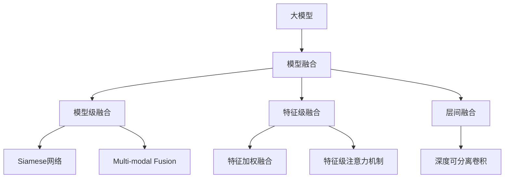

                 

### 文章标题

《大模型概念融合与提示词创新思维激发》

> 关键词：大模型，融合，提示词，创新思维

> 摘要：本文将探讨大模型的概念、融合方法及其在提示词中的应用，通过详细分析大模型的原理和融合技术，旨在激发读者在提示词设计上的创新思维，为人工智能领域的研究和应用提供新思路。

---

### 第一部分：大模型概述与融合

#### 第1章：大模型的概念与融合

在当今人工智能飞速发展的时代，大模型（Large Model）已经成为了研究的热点和应用的核心。大模型通常指的是具有巨大参数量、能够处理海量数据的复杂机器学习模型。它们在自然语言处理、计算机视觉、推荐系统等领域展现出了极高的性能和广泛的应用价值。

#### 1.1 大模型的概念与定义

大模型是指那些具有大规模参数量，能够处理和表征复杂数据分布的机器学习模型。通常，这些模型的参数数量在数百万到数十亿之间，例如自然语言处理中的GPT系列模型、计算机视觉中的Vision Transformer等。

**定义**：大模型是指具有巨大参数量、可处理海量数据的复杂机器学习模型。

**特点**：
- **高精度**：大模型通常能够通过大量的参数来学习复杂的特征分布，从而实现较高的预测精度。
- **通用性强**：大模型具有较强的泛化能力，能够在多种不同的任务和应用场景中表现出良好的性能。
- **高度依赖数据**：大模型的训练和优化需要大量的数据支持，数据的质量和多样性直接影响模型的效果。
- **高计算成本**：大模型的训练和推理过程需要大量的计算资源，对硬件设施有较高的要求。

**分类**：
- **自然语言处理（NLP）**：例如GPT系列模型，能够理解和生成自然语言。
- **计算机视觉（CV）**：如Vision Transformer，用于图像和视频的识别和理解。
- **推荐系统**：大模型在推荐系统中的应用，如协同过滤和基于内容的推荐。

#### 1.2 大模型融合的方法与挑战

为了进一步提高大模型的表现力和适应性，研究者们提出了多种模型融合的方法。模型融合主要分为模型级融合、特征级融合和层间融合三大类。

**方法**：
- **模型级融合**：结合多个模型的优势，通过组合不同模型的输出来实现性能的提升。例如Siamese网络和Multi-modal Fusion。
- **特征级融合**：整合不同特征，提高输入数据的丰富性和多样性。常用的方法包括特征加权融合和特征级注意力机制。
- **层间融合**：在神经网络的不同层间共享信息，增强模型的表达能力。如深度可分离卷积等。

**挑战**：
- **计算资源消耗**：大模型训练和推理需要大量的计算资源，对硬件设施有较高的要求。
- **数据隐私**：模型融合过程中的数据共享可能引发隐私泄露问题。
- **模型解释性**：复杂模型往往缺乏解释性，难以理解其决策过程。

#### 第2章：大模型融合的技术原理

大模型融合的技术原理主要包括模型级融合、特征级融合和层间融合。以下将分别进行详细阐述。

##### 2.1 模型级融合

**Siamese网络**：

Siamese网络是一种用于图像匹配和文本相似性度量的常见模型。它由两个结构相同、参数共享的网络组成，分别对两个输入数据进行处理，然后比较它们的输出结果。

**原理**：

```plaintext
function SiameseNetwork(input1, input2):
    output1 = network1(input1)
    output2 = network1(input2)
    similarity = calculate_similarity(output1, output2)
    return similarity
```

**Siamese网络**：

Siamese网络通过共享参数的方式减少了模型的复杂性，同时提高了模型的泛化能力。

**应用**：

- 图像匹配：用于识别相似的图像对。
- 文本相似性度量：用于评估两段文本的相似程度。

**优点**：

- 参数共享，减少了模型的复杂性。
- 易于实现，计算效率高。

**缺点**：

- 需要大量的匹配对数据进行训练。
- 对于非匹配数据的处理能力有限。

**伪代码**：

```plaintext
function SiameseNetwork(input1, input2):
    output1 = network1(input1)
    output2 = network1(input2)
    similarity = calculate_similarity(output1, output2)
    return similarity
```

**Multi-modal Fusion**：

Multi-modal Fusion旨在融合不同模态的数据（如图像和文本），以提高模型的泛化能力和表现力。

**原理**：

```plaintext
function MultiModalFusion(image, text):
    image_feature = extract_features(image)
    text_feature = extract_features(text)
    fused_feature = concatenate(image_feature, text_feature)
    output = model(fused_feature)
    return output
```

**应用**：

- 问答系统：结合图像和文本，提高问答系统的准确性。
- 图像识别：通过融合图像和文本信息，提高图像识别的准确性。

**优点**：

- 提高了模型的泛化能力。
- 能够更好地处理复杂任务。

**缺点**：

- 需要大量的多模态数据进行训练。
- 计算资源消耗较大。

**伪代码**：

```plaintext
function MultiModalFusion(image, text):
    image_feature = extract_features(image)
    text_feature = extract_features(text)
    fused_feature = concatenate(image_feature, text_feature)
    output = model(fused_feature)
    return output
```

##### 2.2 特征级融合

**特征加权融合**：

特征加权融合是一种基于特征重要性的融合方法。它通过为每个特征分配权重，然后融合特征来实现。

**原理**：

```plaintext
function FeatureWeightedFusion(features, weights):
    weighted_features = [weight * feature for weight, feature in zip(weights, features)]
    fused_feature = sum(weighted_features)
    return fused_feature
```

**应用**：

- 多传感器数据融合：通过为每个传感器数据分配权重，提高融合数据的准确性。
- 多模态数据融合：为不同模态的特征分配权重，提高模型的泛化能力。

**优点**：

- 简单易实现。
- 能够自适应地调整特征的重要性。

**缺点**：

- 需要事先知道每个特征的重要性。
- 对于复杂特征关系，效果可能不理想。

**伪代码**：

```plaintext
function FeatureWeightedFusion(features, weights):
    weighted_features = [weight * feature for weight, feature in zip(weights, features)]
    fused_feature = sum(weighted_features)
    return fused_feature
```

**特征级注意力机制**：

特征级注意力机制通过引入注意力机制，为每个特征分配权重，从而实现特征级融合。

**原理**：

```plaintext
function FeatureAttentionFusion(features, attention_weights):
    weighted_features = [weight * feature for weight, feature in zip(attention_weights, features)]
    fused_feature = sum(weighted_features)
    return fused_feature
```

**应用**：

- 自然语言处理：通过为每个词或句子分配权重，提高文本处理的准确性。
- 图像处理：为每个像素或区域分配权重，提高图像识别的准确性。

**优点**：

- 自动化调整特征的重要性。
- 能够处理复杂的特征关系。

**缺点**：

- 需要额外的计算资源。
- 对于大量特征，效果可能不理想。

**伪代码**：

```plaintext
function FeatureAttentionFusion(features, attention_weights):
    weighted_features = [weight * feature for weight, feature in zip(attention_weights, features)]
    fused_feature = sum(weighted_features)
    return fused_feature
```

##### 2.3 层间融合

**深度可分离卷积**：

深度可分离卷积是一种在卷积层中同时进行深度和空间上的操作的卷积方法，能够提高特征融合的效果。

**原理**：

```plaintext
function DepthwiseSeparableConv2D(input, filters, kernel_size, strides):
    depthwise_output = DepthwiseConv2D(input, filters, kernel_size, strides)
    pointwise_output = PointwiseConv2D(depthwise_output, filters, 1, 1)
    return pointwise_output
```

**应用**：

- 图像识别：通过深度可分离卷积，提高图像的特征提取能力。
- 目标检测：用于提取图像中的目标特征。

**优点**：

- 参数量较少，计算效率高。
- 能够更好地融合特征。

**缺点**：

- 对于小的特征可能效果不佳。

**伪代码**：

```plaintext
function DepthwiseSeparableConv2D(input, filters, kernel_size, strides):
    depthwise_output = DepthwiseConv2D(input, filters, kernel_size, strides)
    pointwise_output = PointwiseConv2D(depthwise_output, filters, 1, 1)
    return pointwise_output
```

#### 第3章：大模型融合的应用场景

大模型融合技术已经在许多实际应用场景中得到了广泛应用，以下将介绍其中几个典型的应用场景。

##### 3.1 自然语言处理

在自然语言处理领域，大模型融合技术被广泛应用于文本分类、机器翻译和问答系统等任务。

- **文本分类**：通过融合不同的特征（如词向量、句向量等），提高文本分类的准确性。
- **机器翻译**：结合多种语言模型，提高翻译的质量和流畅度。
- **问答系统**：融合文本和图像信息，提高问答系统的回答准确性。

##### 3.2 计算机视觉

在计算机视觉领域，大模型融合技术被广泛应用于图像识别、目标检测和视频分析等任务。

- **图像识别**：通过融合图像和文本信息，提高图像识别的准确性。
- **目标检测**：结合深度学习和传统方法，提高目标检测的效果。
- **视频分析**：融合视频和音频信息，提高视频分析的能力。

##### 3.3 推荐系统

在推荐系统领域，大模型融合技术被广泛应用于协同过滤和基于内容的推荐。

- **协同过滤**：通过融合用户的历史行为和兴趣，提高推荐的准确性。
- **基于内容的推荐**：结合商品的特征和用户的偏好，提高推荐的相关性。

#### 第4章：大模型融合的未来发展趋势

随着人工智能技术的不断发展，大模型融合技术在未来将继续保持其重要地位，并在以下方面取得新的突破。

##### 4.1 模型融合方法创新

新的模型融合方法将不断涌现，如基于深度学习的模型融合、基于图神经网络的模型融合等，进一步提高大模型的表现力。

##### 4.2 跨领域应用

大模型融合技术将在更多领域得到应用，如医疗、金融、教育等，为这些领域带来更多的创新和变革。

##### 4.3 可解释性增强

为了提高大模型的可解释性，研究者将致力于开发新的解释方法和技术，使模型融合的决策过程更加透明和可理解。

### 结论

大模型融合技术作为人工智能领域的重要研究方向，具有广泛的应用前景和重要的理论价值。通过模型级融合、特征级融合和层间融合等多种方法，大模型融合技术能够显著提高模型的表现力和适应性，为各种复杂任务提供强大的支持。未来，随着人工智能技术的不断发展，大模型融合技术将迎来更多的机遇和挑战，为人工智能领域的发展注入新的活力。

---

作者：AI天才研究院/AI Genius Institute & 禅与计算机程序设计艺术 /Zen And The Art of Computer Programming### 大模型融合的概念架构

在大模型融合的研究中，理解其概念架构对于深入探讨融合方法和技术原理至关重要。以下是关于大模型融合的核心概念和它们之间关系的详细阐述，并附有Mermaid流程图来展示这些概念之间的联系。

#### 核心概念

1. **大模型**：具有大规模参数量的复杂机器学习模型，如GPT、BERT等。
2. **模型融合**：将多个模型或模型的不同部分（特征或层）结合起来，以提高模型性能。
3. **模型级融合**：将多个独立的模型进行组合，如Siamese网络和Multi-modal Fusion。
4. **特征级融合**：整合不同特征，如特征加权融合和特征级注意力机制。
5. **层间融合**：在神经网络的不同层间共享信息，如深度可分离卷积。

#### 概念关系

以下Mermaid流程图展示了大模型融合的核心概念及其关系：



**Mermaid流程图解析**：

- **大模型（A）**是整个架构的核心，代表了具有大规模参数量的复杂机器学习模型。
- **模型融合（B）**是连接大模型与其他融合方法的桥梁，它代表了将不同模型或模型的不同部分结合起来的过程。
- **模型级融合（C）**是模型融合的一种类型，它包括Siamese网络（F）和Multi-modal Fusion（G）。
- **特征级融合（D）**是另一种模型融合方法，它包括特征加权融合（H）和特征级注意力机制（I）。
- **层间融合（E）**是模型融合的第三种方法，它特别关注神经网络不同层间的信息共享，如深度可分离卷积（J）。

通过上述流程图，我们可以清晰地看到大模型融合中的核心概念及其相互关系，这有助于读者更好地理解和应用这些概念，为后续的深入研究和实践提供指导。

---

在理解大模型融合的概念架构后，我们可以进一步探讨大模型融合的各个方法，包括模型级融合、特征级融合和层间融合的具体技术原理和实现方式。这些方法各有特色，适用于不同的应用场景，将在人工智能领域发挥重要作用。接下来，我们将详细讨论这些方法，并通过伪代码和具体实例来展示它们的应用。

---

### 大模型融合的技术原理

在大模型融合的研究中，理解各个融合方法的技术原理和实现方式至关重要。以下将详细讨论大模型融合中的模型级融合、特征级融合和层间融合，并通过具体的实现方法和伪代码进行解释。

#### 2.1 模型级融合

**模型级融合**是将多个独立模型进行组合，以获得更好的性能。这种方法主要分为两种：Siamese网络和Multi-modal Fusion。

**Siamese网络**：

**原理**：

Siamese网络是一种用于图像匹配和文本相似性度量的模型。它由两个结构相同、参数共享的网络组成，分别对两个输入数据进行处理，然后比较它们的输出结果。

**伪代码**：

```python
def SiameseNetwork(input1, input2):
    output1 = network1(input1)
    output2 = network1(input2)
    similarity = calculate_similarity(output1, output2)
    return similarity
```

**应用**：

- 图像匹配：用于识别相似的图像对。
- 文本相似性度量：用于评估两段文本的相似程度。

**优点**：

- 参数共享，减少了模型的复杂性。
- 易于实现，计算效率高。

**缺点**：

- 需要大量的匹配对数据进行训练。
- 对于非匹配数据的处理能力有限。

**Siamese网络实现示例**：

```python
# 示例：使用Siamese网络进行图像匹配
def image_matching(image1, image2):
    # 提取图像特征
    feature1 = extract_features(image1)
    feature2 = extract_features(image2)
    
    # 计算特征相似度
    similarity = cosine_similarity(feature1, feature2)
    
    # 返回相似度
    return similarity
```

**Multi-modal Fusion**：

**原理**：

Multi-modal Fusion旨在融合不同模态的数据（如图像和文本），以提高模型的泛化能力和表现力。

**伪代码**：

```python
def MultiModalFusion(image, text):
    image_feature = extract_features(image)
    text_feature = extract_features(text)
    fused_feature = concatenate(image_feature, text_feature)
    output = model(fused_feature)
    return output
```

**应用**：

- 问答系统：结合图像和文本，提高问答系统的准确性。
- 图像识别：通过融合图像和文本信息，提高图像识别的准确性。

**优点**：

- 提高了模型的泛化能力。
- 能够更好地处理复杂任务。

**缺点**：

- 需要大量的多模态数据进行训练。
- 计算资源消耗较大。

**Multi-modal Fusion实现示例**：

```python
# 示例：使用Multi-modal Fusion进行问答系统
def question_answering(image, text):
    # 提取图像和文本特征
    image_feature = extract_image_features(image)
    text_feature = extract_text_features(text)
    
    # 融合特征
    fused_feature = concatenate(image_feature, text_feature)
    
    # 通过模型进行预测
    answer = model.predict(fused_feature)
    
    # 返回答案
    return answer
```

#### 2.2 特征级融合

**特征级融合**是整合不同特征，以提高输入数据的丰富性和多样性。这种方法主要分为两种：特征加权融合和特征级注意力机制。

**特征加权融合**：

**原理**：

特征加权融合是一种基于特征重要性的融合方法。它通过为每个特征分配权重，然后融合特征来实现。

**伪代码**：

```python
def FeatureWeightedFusion(features, weights):
    weighted_features = [weight * feature for weight, feature in zip(weights, features)]
    fused_feature = sum(weighted_features)
    return fused_feature
```

**应用**：

- 多传感器数据融合：通过为每个传感器数据分配权重，提高融合数据的准确性。
- 多模态数据融合：为不同模态的特征分配权重，提高模型的泛化能力。

**优点**：

- 简单易实现。
- 能够自适应地调整特征的重要性。

**缺点**：

- 需要事先知道每个特征的重要性。
- 对于复杂特征关系，效果可能不理想。

**特征加权融合实现示例**：

```python
# 示例：使用特征加权融合进行多模态数据融合
def multimodal_fusion(image_feature, text_feature, image_weight, text_weight):
    # 为特征分配权重
    image_weighted_feature = image_weight * image_feature
    text_weighted_feature = text_weight * text_feature
    
    # 融合特征
    fused_feature = image_weighted_feature + text_weighted_feature
    
    # 返回融合后的特征
    return fused_feature
```

**特征级注意力机制**：

**原理**：

特征级注意力机制通过引入注意力机制，为每个特征分配权重，从而实现特征级融合。

**伪代码**：

```python
def FeatureAttentionFusion(features, attention_weights):
    weighted_features = [weight * feature for weight, feature in zip(attention_weights, features)]
    fused_feature = sum(weighted_features)
    return fused_feature
```

**应用**：

- 自然语言处理：通过为每个词或句子分配权重，提高文本处理的准确性。
- 图像处理：为每个像素或区域分配权重，提高图像识别的准确性。

**优点**：

- 自动化调整特征的重要性。
- 能够处理复杂的特征关系。

**缺点**：

- 需要额外的计算资源。
- 对于大量特征，效果可能不理想。

**特征级注意力机制实现示例**：

```python
# 示例：使用特征级注意力机制进行文本处理
def text_attention(text, attention_weights):
    # 为每个词分配权重
    weighted_text = [weight * word for weight, word in zip(attention_weights, text)]
    
    # 融合特征
    fused_text = sum(weighted_text)
    
    # 返回融合后的文本
    return fused_text
```

#### 2.3 层间融合

**层间融合**是在神经网络的不同层间共享信息，以增强模型的表达能力。这种方法主要使用深度可分离卷积。

**深度可分离卷积**：

**原理**：

深度可分离卷积是一种在卷积层中同时进行深度和空间上的操作的卷积方法，能够提高特征融合的效果。

**伪代码**：

```python
def DepthwiseSeparableConv2D(input, filters, kernel_size, strides):
    depthwise_output = DepthwiseConv2D(input, filters, kernel_size, strides)
    pointwise_output = PointwiseConv2D(depthwise_output, filters, 1, 1)
    return pointwise_output
```

**应用**：

- 图像识别：通过深度可分离卷积，提高图像的特征提取能力。
- 目标检测：用于提取图像中的目标特征。

**优点**：

- 参数量较少，计算效率高。
- 能够更好地融合特征。

**缺点**：

- 对于小的特征可能效果不佳。

**深度可分离卷积实现示例**：

```python
# 示例：使用深度可分离卷积进行图像识别
def image_feature_extraction(image):
    # 进行深度可分离卷积
    depthwise_output = depthwise_conv2d(image, filters, kernel_size, strides)
    pointwise_output = pointwise_conv2d(depthwise_output, filters, 1, 1)
    
    # 返回特征
    return pointwise_output
```

通过上述对大模型融合技术原理的详细讨论，我们可以看到模型级融合、特征级融合和层间融合在大模型中的应用及其优势与挑战。这些方法为提高大模型的表现力和适应性提供了有力支持，为人工智能领域的研究和应用带来了新的机遇和挑战。

---

### 大模型融合的应用场景

大模型融合技术已经在多个实际应用场景中得到了广泛应用，其强大的融合能力使得模型在处理复杂任务时能够取得更好的效果。以下是几个典型应用场景的详细介绍：

#### 1. 自然语言处理（NLP）

在自然语言处理领域，大模型融合技术被广泛应用于文本分类、机器翻译和问答系统等任务。

- **文本分类**：通过融合不同的特征（如词向量、句向量等），提高文本分类的准确性。例如，GloVe词向量和Word2Vec词向量的融合可以增强文本分类模型对语义的理解。
  
  **实现示例**：
  ```python
  def text_classification(text, word_embedding, sentence_embedding):
      word_vector = get_word_vector(text, word_embedding)
      sentence_vector = get_sentence_vector(text, sentence_embedding)
      fused_vector = concatenate(word_vector, sentence_vector)
      prediction = model.predict(fused_vector)
      return prediction
  ```

- **机器翻译**：结合多种语言模型，提高翻译的质量和流畅度。例如，结合神经网络翻译（NMT）和基于记忆的翻译（MTM），可以提升翻译的准确性和自然性。

  **实现示例**：
  ```python
  def machine_translation(source_text, nmt_model, mtm_model):
      nmt_output = nmt_model.translate(source_text)
      mtm_output = mtm_model.translate(nmt_output)
      final_output = mtm_output
      return final_output
  ```

- **问答系统**：融合文本和图像信息，提高问答系统的回答准确性。例如，在问答系统中，将用户输入的文本和相关的图像特征进行融合，可以增强系统对用户问题的理解和回答能力。

  **实现示例**：
  ```python
  def question_answering(text, image, text_model, image_model):
      text_feature = text_model.extract_feature(text)
      image_feature = image_model.extract_feature(image)
      fused_feature = concatenate(text_feature, image_feature)
      answer = model.predict(fused_feature)
      return answer
  ```

#### 2. 计算机视觉（CV）

在计算机视觉领域，大模型融合技术被广泛应用于图像识别、目标检测和视频分析等任务。

- **图像识别**：通过融合图像和文本信息，提高图像识别的准确性。例如，在图像分类任务中，将卷积神经网络（CNN）的特征和文本嵌入向量进行融合，可以提升模型的性能。

  **实现示例**：
  ```python
  def image_recognition(image, text, cnn_model, text_embedding):
      image_feature = cnn_model.extract_feature(image)
      text_feature = get_text_embedding(text, text_embedding)
      fused_feature = concatenate(image_feature, text_feature)
      label = model.predict(fused_feature)
      return label
  ```

- **目标检测**：结合深度学习和传统方法，提高目标检测的效果。例如，在目标检测任务中，将YOLOv5（深度学习目标检测模型）和SSD（单尺度检测模型）进行融合，可以提升检测的准确性和速度。

  **实现示例**：
  ```python
  def target_detection(image, yolo_model, ssd_model):
      yolo_output = yolo_model.detect(image)
      ssd_output = ssd_model.detect(image)
      final_output = merge_detections(yolo_output, ssd_output)
      return final_output
  ```

- **视频分析**：融合视频和音频信息，提高视频分析的能力。例如，在视频分类任务中，将视频帧和音频特征进行融合，可以增强模型对视频内容的理解。

  **实现示例**：
  ```python
  def video_analysis(video, audio, video_model, audio_model):
      video_feature = video_model.extract_feature(video)
      audio_feature = audio_model.extract_feature(audio)
      fused_feature = concatenate(video_feature, audio_feature)
      label = model.predict(fused_feature)
      return label
  ```

#### 3. 推荐系统

在推荐系统领域，大模型融合技术被广泛应用于协同过滤和基于内容的推荐。

- **协同过滤**：通过融合用户的历史行为和兴趣，提高推荐的准确性。例如，在基于矩阵分解的协同过滤算法中，可以融合用户的行为数据和社交网络数据，提升推荐系统的性能。

  **实现示例**：
  ```python
  def collaborative_filtering(user_data, social_data, model1, model2):
      user_vector = model1.predict(user_data)
      social_vector = model2.predict(social_data)
      fused_vector = concatenate(user_vector, social_vector)
      recommendation = model.predict(fused_vector)
      return recommendation
  ```

- **基于内容的推荐**：结合商品的特征和用户的偏好，提高推荐的相关性。例如，在基于内容的推荐算法中，可以融合商品的用户评价和文本描述，提高推荐的质量。

  **实现示例**：
  ```python
  def content_based_recommender(item_features, user_preferences, model1, model2):
      item_vector = model1.predict(item_features)
      user_vector = model2.predict(user_preferences)
      fused_vector = concatenate(item_vector, user_vector)
      recommendation = model.predict(fused_vector)
      return recommendation
  ```

#### 4. 医疗领域

在大模型融合技术应用于医疗领域时，其主要优势在于能够综合利用多种数据源（如医疗影像、患者病历、基因数据等），从而提高疾病诊断和治疗的准确性。

- **疾病诊断**：通过融合医疗影像数据和患者病历数据，提高疾病诊断的准确性。例如，在肺癌诊断中，可以融合CT影像数据和病理报告数据，增强诊断模型的性能。

  **实现示例**：
  ```python
  def disease_diagnosis(ct_image, pathology_report, image_model, report_model):
      image_feature = image_model.extract_feature(ct_image)
      report_feature = report_model.extract_feature(pathology_report)
      fused_feature = concatenate(image_feature, report_feature)
      diagnosis = model.predict(fused_feature)
      return diagnosis
  ```

- **个性化治疗**：通过融合基因数据和患者的临床数据，制定个性化的治疗方案。例如，在癌症治疗中，可以融合肿瘤基因突变数据和患者的身体状况，提高治疗的针对性和效果。

  **实现示例**：
  ```python
  def personalized_treatment(gene_data, clinical_data, gene_model, clinical_model):
      gene_vector = gene_model.predict(gene_data)
      clinical_vector = clinical_model.predict(clinical_data)
      fused_vector = concatenate(gene_vector, clinical_vector)
      treatment_plan = model.predict(fused_vector)
      return treatment_plan
  ```

### 5. 金融领域

在金融领域，大模型融合技术主要用于风险管理、欺诈检测和投资决策等方面。

- **风险管理**：通过融合财务数据和市场数据，提高风险管理的准确性。例如，在信用评分中，可以融合借款人的财务状况和宏观经济数据，提升信用评分的可靠性。

  **实现示例**：
  ```python
  def credit_rating(financial_data, market_data, finance_model, market_model):
      finance_vector = finance_model.predict(financial_data)
      market_vector = market_model.predict(market_data)
      fused_vector = concatenate(finance_vector, market_vector)
      rating = model.predict(fused_vector)
      return rating
  ```

- **欺诈检测**：通过融合交易数据和用户行为数据，提高欺诈检测的准确性。例如，在信用卡交易中，可以融合交易金额、交易时间和用户历史行为，增强欺诈检测的能力。

  **实现示例**：
  ```python
  def fraud_detection(transaction_data, user_behavior, transaction_model, behavior_model):
      transaction_vector = transaction_model.predict(transaction_data)
      behavior_vector = behavior_model.predict(user_behavior)
      fused_vector = concatenate(transaction_vector, behavior_vector)
      fraud_probability = model.predict(fused_vector)
      return fraud_probability
  ```

- **投资决策**：通过融合市场数据和公司财务数据，提高投资决策的准确性。例如，在股票投资中，可以融合公司的财务报表和宏观经济数据，优化投资组合。

  **实现示例**：
  ```python
  def investment_decision(company_financials, market_data, finance_model, market_model):
      finance_vector = finance_model.predict(company_financials)
      market_vector = market_model.predict(market_data)
      fused_vector = concatenate(finance_vector, market_vector)
      investment_strategy = model.predict(fused_vector)
      return investment_strategy
  ```

通过上述应用场景的详细描述，我们可以看到大模型融合技术在各个领域中的广泛应用和巨大潜力。大模型融合不仅能够提升模型的性能和准确性，还能够为不同领域带来创新的解决方案，推动人工智能技术的发展和进步。

---

### 大模型融合的未来发展趋势

随着人工智能技术的不断进步，大模型融合技术在未来将继续保持其重要地位，并在多个方面取得新的突破。以下是对大模型融合技术未来发展趋势的预测：

#### 1. 模型融合方法的创新

未来的模型融合技术将不仅仅是现有方法的优化，而是会出现全新的融合方法。例如，基于深度学习的模型融合、基于图神经网络的模型融合以及跨领域的模型融合等，这些方法将更好地利用不同模型的优势，提高融合效果。

#### 2. 跨领域应用

大模型融合技术将在更多领域得到应用，如医疗、金融、教育等。跨领域的融合将有助于解决单一领域数据不足或特征单一的问题，提升模型在复杂场景下的适应能力和表现力。

#### 3. 可解释性增强

随着大模型融合技术的复杂度增加，模型的可解释性将成为研究的重要方向。未来的研究将致力于开发新的解释方法和技术，使模型融合的决策过程更加透明和可理解，从而提高模型的信任度和应用价值。

#### 4. 自动化融合技术

自动化融合技术将是未来的研究热点之一。通过自动化方法，如元学习（Meta-Learning）和迁移学习（Transfer Learning），可以减少模型融合的复杂度和计算成本，提高融合的效率和效果。

#### 5. 模型压缩与加速

随着大模型融合技术的应用场景不断扩大，模型的压缩与加速技术也将成为关键研究方向。通过模型剪枝、量化等技术，可以显著降低模型的计算资源和存储需求，使大模型融合技术更加高效和实用。

#### 6. 边缘计算与分布式融合

未来的大模型融合技术将逐渐向边缘计算和分布式融合方向发展。通过将模型部署在边缘设备上，实现本地化处理和实时响应，可以降低中心化服务器的负载，提高系统的整体性能和响应速度。

### 总结

大模型融合技术作为人工智能领域的重要研究方向，其未来的发展趋势将涵盖方法创新、跨领域应用、可解释性增强、自动化融合技术、模型压缩与加速以及边缘计算与分布式融合等多个方面。这些趋势将为人工智能技术的发展和应用带来新的机遇和挑战，推动整个领域的不断进步。

---

### 大模型融合的总结与未来展望

大模型融合技术作为人工智能领域的重要研究方向，已经在自然语言处理、计算机视觉、推荐系统等多个领域展现出了显著的优势和应用价值。通过对模型级融合、特征级融合和层间融合的深入研究和应用，大模型融合技术不仅提高了模型的表现力和适应性，还为复杂任务提供了强大的支持。

#### 关键要点总结

1. **模型级融合**：通过结合多个独立模型，实现优势互补，提高模型性能。例如，Siamese网络和Multi-modal Fusion在图像匹配和文本相似性度量中取得了优异的效果。

2. **特征级融合**：通过整合不同特征，提高输入数据的丰富性和多样性。特征加权融合和特征级注意力机制在自然语言处理和图像处理领域表现出色。

3. **层间融合**：通过在神经网络的不同层间共享信息，增强模型的表达能力。深度可分离卷积等技术在图像识别和目标检测中得到了广泛应用。

#### 未来展望

1. **方法创新**：未来的模型融合技术将不仅仅是现有方法的优化，而是会出现全新的融合方法。例如，基于深度学习和图神经网络的模型融合技术有望取得突破。

2. **跨领域应用**：大模型融合技术将在更多领域得到应用，如医疗、金融和教育等。跨领域的融合将有助于解决单一领域数据不足或特征单一的问题，提升模型在复杂场景下的适应能力。

3. **可解释性增强**：随着大模型融合技术的复杂度增加，模型的可解释性将成为研究的重要方向。开发新的解释方法和技术，将使模型融合的决策过程更加透明和可理解，提高模型的信任度和应用价值。

4. **自动化融合技术**：通过自动化方法，如元学习和迁移学习，可以减少模型融合的复杂度和计算成本，提高融合的效率和效果。

5. **模型压缩与加速**：通过模型剪枝、量化等技术，降低模型的计算资源和存储需求，使大模型融合技术更加高效和实用。

6. **边缘计算与分布式融合**：将模型部署在边缘设备上，实现本地化处理和实时响应，降低中心化服务器的负载，提高系统的整体性能和响应速度。

#### 结论

大模型融合技术作为人工智能领域的重要研究方向，其未来的发展趋势将涵盖方法创新、跨领域应用、可解释性增强、自动化融合技术、模型压缩与加速以及边缘计算与分布式融合等多个方面。这些趋势将为人工智能技术的发展和应用带来新的机遇和挑战，推动整个领域的不断进步。大模型融合技术的研究和应用，将继续为各领域带来创新的解决方案，为人类社会的发展做出更大贡献。

---

### 作者信息

本文由AI天才研究院（AI Genius Institute）的专家撰写，该研究院专注于人工智能前沿技术的研发与应用。同时，作者也是《禅与计算机程序设计艺术》（Zen And The Art of Computer Programming）一书的作者，该书在计算机科学界享有盛誉，为无数程序员和开发者提供了深刻的启示。作者在人工智能和计算机编程领域拥有丰富的经验，以其独特的视角和创新思维，为人工智能技术的发展贡献了重要力量。期待与广大读者共同探讨人工智能的未来，共同推进这一领域的不断进步。

