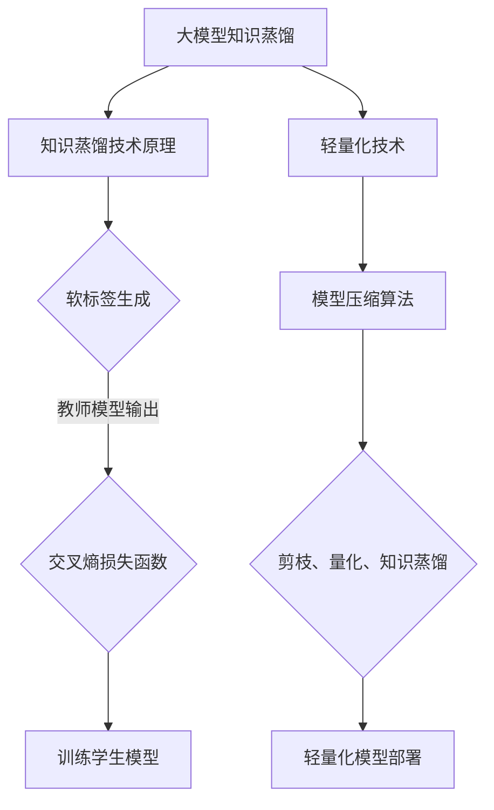

                 


## 文章标题

### 《大模型知识蒸馏与轻量化技术》

## 关键词

- 大模型
- 知识蒸馏
- 轻量化技术
- 模型压缩
- 深度学习
- 神经网络
- 模型部署
- 应用案例
- 安全与隐私

## 摘要

本文旨在探讨大模型知识蒸馏与轻量化技术的关键概念、核心算法原理及其在实际应用中的重要性。通过逐步分析，本文将介绍大模型的基础知识，包括概念、特点及应用场景。随后，我们将深入探讨大模型构建的基础、优化技术，如知识蒸馏和轻量化技术，并详细阐述模型压缩算法。此外，本文还将讨论大模型部署策略、实时性优化以及离线与在线学习策略。最后，我们将通过实际应用案例，分析大模型在自然语言处理、计算机视觉等领域的表现，并探讨大模型安全与隐私问题，以及未来发展展望。通过本文的阅读，读者将获得对大模型及其相关技术的全面了解，为深入研究和实践打下坚实基础。

## 《大模型知识蒸馏与轻量化技术》目录大纲

### 第一部分：大模型基础知识

#### 第1章：大模型概述

##### 1.1 大模型的概念与演进

##### 1.2 大模型的特点与应用场景

##### 1.3 大模型的技术挑战

#### 第2章：大模型构建基础

##### 2.1 神经网络基础

##### 2.2 深度学习框架

##### 2.3 大模型训练策略

#### 第3章：大模型优化技术

##### 3.1 知识蒸馏技术

##### 3.2 轻量化技术

##### 3.3 模型压缩算法

### 第二部分：大模型优化技术

#### 第4章：大模型部署与优化

##### 4.1 大模型部署策略

##### 4.2 实时性优化

##### 4.3 离线与在线学习策略

### 第三部分：大模型应用案例

#### 第5章：大模型应用案例

##### 5.1 自然语言处理

##### 5.2 计算机视觉

##### 5.3 其他应用领域

### 第四部分：大模型安全与隐私

#### 第6章：大模型安全与隐私

##### 6.1 大模型安全挑战

##### 6.2 隐私保护技术

##### 6.3 法律法规与伦理问题

### 第五部分：大模型发展趋势与未来展望

#### 第7章：大模型发展趋势与未来展望

##### 7.1 技术发展趋势

##### 7.2 应用前景

##### 7.3 潜在风险与对策

### 附录

#### 附录A：工具与资源推荐

##### A.1 开源框架

##### A.2 实用工具

##### A.3 学习资源

#### 附录B：大模型知识蒸馏与轻量化技术 Mermaid 流程图

#### 附录C：部分核心算法原理与伪代码

#### 附录D：项目实战与代码解读

##### D.1 实战项目概述

##### D.2 开发环境搭建

##### D.3 源代码实现与解读

##### D.4 代码解读与分析

---

## 第一部分：大模型基础知识

### 第1章：大模型概述

#### 1.1 大模型的概念与演进

大模型是指参数量达到百万级别甚至亿级别的深度学习模型。这些模型通常基于神经网络架构，通过大量数据进行训练，以实现高精度的预测和决策。大模型的兴起源于深度学习技术在自然语言处理、计算机视觉等领域的突破性进展。

**大模型的演进历程：**

1. **早期阶段：**20世纪80年代至90年代，神经网络研究取得了初步成果，但受限于计算资源和数据量，模型规模相对较小。

2. **黄金时代：**2012年，AlexNet在ImageNet竞赛中夺冠，标志着深度学习技术的崛起。此后，深度学习模型规模逐步扩大，参数量从几十万增长到数百万。

3. **大模型时代：**近年来，随着计算能力和数据量的提升，大模型在各个领域取得了显著的进展。如BERT、GPT-3等模型，参数量达到了亿级别。

**大模型的特点：**

1. **高参数量：**大模型拥有数百万甚至数亿个参数，能够捕捉到更复杂的特征和模式。

2. **强拟合能力：**大模型通过大量数据进行训练，具有较高的拟合能力，能够解决复杂问题。

3. **高计算成本：**大模型的训练和推理过程需要大量的计算资源，对硬件设备有较高要求。

4. **强依赖数据：**大模型对数据量有较高的依赖，数据质量和多样性对模型性能有显著影响。

**大模型的应用场景：**

1. **自然语言处理：**大模型在语言模型、机器翻译、问答系统等领域具有广泛的应用。

2. **计算机视觉：**大模型在图像分类、目标检测、图像生成等领域表现出色。

3. **推荐系统：**大模型在个性化推荐、广告投放等领域发挥作用。

4. **语音识别：**大模型在语音识别、语音合成等领域具有优势。

#### 1.2 大模型的特点与应用场景

**特点：**

1. **高精度：**大模型通过大量数据进行训练，具有较高的拟合能力，能够实现高精度的预测和决策。

2. **泛化能力：**大模型能够捕捉到数据中的潜在规律，具有较强的泛化能力。

3. **计算复杂：**大模型拥有大量的参数，计算复杂度较高，训练和推理过程需要大量计算资源。

4. **强依赖数据：**大模型对数据量有较高的依赖，数据质量和多样性对模型性能有显著影响。

**应用场景：**

1. **自然语言处理：**大模型在语言模型、机器翻译、问答系统等领域具有广泛的应用。

2. **计算机视觉：**大模型在图像分类、目标检测、图像生成等领域表现出色。

3. **推荐系统：**大模型在个性化推荐、广告投放等领域发挥作用。

4. **语音识别：**大模型在语音识别、语音合成等领域具有优势。

**应用实例：**

1. **BERT模型：**BERT是一种预训练语言模型，广泛应用于自然语言处理任务，如问答系统、文本分类等。

2. **GPT-3模型：**GPT-3是一种通用预训练语言模型，具有强大的文本生成和推理能力，应用于聊天机器人、文本摘要等领域。

3. **ResNet模型：**ResNet是一种深度残差网络，广泛应用于图像分类任务，如ImageNet竞赛。

#### 1.3 大模型的技术挑战

**挑战：**

1. **计算资源：**大模型训练和推理过程需要大量的计算资源，对硬件设备有较高要求。

2. **数据依赖：**大模型对数据量有较高的依赖，数据质量和多样性对模型性能有显著影响。

3. **模型可解释性：**大模型通常具有强拟合能力，但难以解释，影响了模型的信任度和应用场景。

4. **安全与隐私：**大模型在处理敏感数据时，可能存在安全与隐私风险。

**解决策略：**

1. **分布式训练：**通过分布式计算，降低训练时间，提高计算效率。

2. **数据增强：**通过数据增强，提高模型对多样性的适应能力。

3. **模型压缩：**通过模型压缩技术，降低模型大小，提高部署效率。

4. **隐私保护技术：**通过隐私保护技术，保障数据安全和用户隐私。

### 第2章：大模型构建基础

#### 2.1 神经网络基础

**神经网络的基本概念：**

神经网络是由大量神经元（或节点）组成的计算模型，通过调整神经元之间的权重，实现函数的拟合和预测。神经网络可以分为多层，如单层感知机、多层感知机等。

**神经网络的组成：**

1. **输入层：**接收外部输入数据，并将其传递到隐藏层。

2. **隐藏层：**对输入数据进行处理和变换，提取特征信息。

3. **输出层：**对隐藏层输出进行决策和预测。

**神经网络的激活函数：**

激活函数用于引入非线性特性，常见的激活函数有Sigmoid、ReLU、Tanh等。

**神经网络的训练过程：**

1. **前向传播：**将输入数据传递到网络，计算输出结果。

2. **反向传播：**计算损失函数，并利用梯度下降法更新网络权重。

3. **优化策略：**如学习率调整、动量法、dropout等，提高训练效果。

**神经网络的应用场景：**

1. **图像分类：**如CIFAR-10、ImageNet等数据集。

2. **目标检测：**如Faster R-CNN、SSD等模型。

3. **自然语言处理：**如BERT、GPT等模型。

#### 2.2 深度学习框架

**深度学习框架的基本概念：**

深度学习框架是一种用于构建、训练和部署深度学习模型的工具集。常见的深度学习框架有TensorFlow、PyTorch、Keras等。

**深度学习框架的特点：**

1. **模块化：**通过定义模块和层，方便构建复杂的神经网络。

2. **灵活性：**支持自定义模型和算法，满足不同需求。

3. **高效性：**提供优化的计算图和GPU加速功能。

4. **便捷性：**提供丰富的API和工具，简化开发过程。

**深度学习框架的应用场景：**

1. **图像处理：**如计算机视觉、图像识别等。

2. **自然语言处理：**如文本分类、机器翻译等。

3. **语音识别：**如语音识别、语音合成等。

**常见深度学习框架对比：**

| 框架 | 优点 | 缺点 |  
| --- | --- | --- |  
| TensorFlow | 生态丰富、支持多种语言、强大的可视化工具 | 训练过程复杂、文档不够完善 |  
| PyTorch | 灵活性高、易理解、支持动态计算图 | GPU加速不如TensorFlow高效、生态相对较少 |  
| Keras | 简单易用、文档完善、支持多语言 | 功能相对较少、依赖TensorFlow或Theano |

#### 2.3 大模型训练策略

**大模型训练策略的目的：**

1. **提高模型性能：**通过优化训练过程，提高模型的拟合能力。

2. **降低计算成本：**通过分布式训练和模型压缩，降低计算资源和存储需求。

3. **提升训练效率：**通过优化算法和硬件加速，提高训练速度。

**常见的训练策略：**

1. **数据增强：**通过数据增强，提高模型对多样性的适应能力。

2. **批量大小调整：**通过调整批量大小，提高模型的拟合能力。

3. **学习率调整：**通过学习率调整，优化模型收敛速度。

4. **正则化：**如L1正则化、L2正则化等，防止过拟合。

5. **模型压缩：**通过模型压缩技术，降低模型大小，提高部署效率。

6. **分布式训练：**通过分布式训练，降低训练时间，提高计算效率。

**大模型训练策略的案例分析：**

1. **BERT模型：**采用大规模数据预训练，并结合数据增强策略，提高模型性能。

2. **GPT-3模型：**采用分布式训练和模型压缩技术，降低计算成本和存储需求。

3. **ResNet模型：**通过批量归一化和残差连接，提高模型训练效率。

### 第3章：大模型优化技术

#### 3.1 知识蒸馏技术

**知识蒸馏技术的基本概念：**

知识蒸馏（Knowledge Distillation）是一种将大模型（教师模型）的知识传递给小模型（学生模型）的技术。通过训练学生模型来模仿教师模型的输出，从而提高学生模型的性能。

**知识蒸馏技术的原理：**

1. **教师模型：**大模型，具有较高的性能。

2. **学生模型：**小模型，用于替代大模型。

3. **训练过程：**通过训练学生模型来模仿教师模型的输出。

**知识蒸馏技术的优势：**

1. **提高性能：**通过传递大模型的知识，提高小模型的性能。

2. **降低计算成本：**通过使用小模型，降低计算资源和存储需求。

3. **提高部署效率：**通过使用轻量化模型，提高部署速度。

**知识蒸馏技术的应用场景：**

1. **模型压缩：**通过知识蒸馏，将大模型转化为小模型，降低模型大小。

2. **实时推理：**通过知识蒸馏，提高小模型的性能，实现实时推理。

3. **移动设备：**通过知识蒸馏，将大模型迁移到移动设备，提高应用场景。

**知识蒸馏技术的具体实现：**

1. **软标签生成：**将教师模型的输出作为软标签，传递给学生模型。

2. **损失函数设计：**设计适当的损失函数，如交叉熵损失函数，用于优化学生模型。

3. **训练策略：**结合教师模型和学生模型，设计合适的训练策略。

**知识蒸馏技术的案例分析：**

1. **BERT模型压缩：**通过知识蒸馏，将BERT模型转化为轻量化模型，提高部署效率。

2. **MobileNet模型优化：**通过知识蒸馏，将大模型迁移到MobileNet，提高移动设备上的性能。

#### 3.2 轻量化技术

**轻量化技术的基本概念：**

轻量化技术（Model Pruning and Quantization）是一种将大模型转化为轻量化模型的技术，通过减少模型参数和计算量，降低模型大小，提高部署效率。

**轻量化技术的原理：**

1. **模型剪枝：**通过剪枝算法，移除模型中的冗余参数。

2. **量化：**通过量化算法，将模型中的浮点数参数转换为整数。

**轻量化技术的优势：**

1. **减小模型大小：**通过剪枝和量化，减少模型参数和计算量，降低模型大小。

2. **提高部署效率：**通过使用轻量化模型，提高部署速度。

3. **降低计算成本：**通过使用轻量化模型，降低计算资源和存储需求。

**轻量化技术的应用场景：**

1. **移动设备：**通过轻量化技术，将大模型迁移到移动设备，提高应用场景。

2. **嵌入式系统：**通过轻量化技术，将大模型应用于嵌入式系统，提高性能和效率。

3. **实时推理：**通过轻量化技术，提高小模型的性能，实现实时推理。

**轻量化技术的具体实现：**

1. **剪枝算法：**如层剪枝、通道剪枝等，根据不同需求，选择合适的剪枝算法。

2. **量化算法：**如全精度量化、低精度量化等，根据硬件设备需求，选择合适的量化算法。

3. **训练策略：**结合剪枝和量化，设计合适的训练策略，确保模型性能不受影响。

**轻量化技术的案例分析：**

1. **MobileNet模型：**通过模型剪枝和量化，将大模型转化为轻量化模型，应用于移动设备。

2. **ResNet模型：**通过层剪枝和量化，将大模型转化为轻量化模型，提高部署效率。

#### 3.3 模型压缩算法

**模型压缩算法的基本概念：**

模型压缩算法（Model Compression Algorithm）是一种将大模型转化为小模型的技术，通过减少模型参数和计算量，降低模型大小，提高部署效率。

**模型压缩算法的分类：**

1. **剪枝（Pruning）：**通过剪枝算法，移除模型中的冗余参数。

2. **量化（Quantization）：**通过量化算法，将模型中的浮点数参数转换为整数。

3. **知识蒸馏（Knowledge Distillation）：**通过知识蒸馏技术，将大模型的知识传递给小模型。

**模型压缩算法的优势：**

1. **减小模型大小：**通过剪枝和量化，减少模型参数和计算量，降低模型大小。

2. **提高部署效率：**通过使用轻量化模型，提高部署速度。

3. **降低计算成本：**通过使用轻量化模型，降低计算资源和存储需求。

**模型压缩算法的应用场景：**

1. **移动设备：**通过模型压缩算法，将大模型迁移到移动设备，提高应用场景。

2. **嵌入式系统：**通过模型压缩算法，将大模型应用于嵌入式系统，提高性能和效率。

3. **实时推理：**通过模型压缩算法，提高小模型的性能，实现实时推理。

**模型压缩算法的具体实现：**

1. **剪枝算法：**如层剪枝、通道剪枝等，根据不同需求，选择合适的剪枝算法。

2. **量化算法：**如全精度量化、低精度量化等，根据硬件设备需求，选择合适的量化算法。

3. **知识蒸馏：**通过设计适当的损失函数和训练策略，实现知识蒸馏。

**模型压缩算法的案例分析：**

1. **MobileNet模型：**通过剪枝和量化，将大模型转化为轻量化模型，应用于移动设备。

2. **ResNet模型：**通过层剪枝和量化，将大模型转化为轻量化模型，提高部署效率。

### 第4章：大模型部署与优化

#### 4.1 大模型部署策略

**大模型部署策略的基本概念：**

大模型部署策略（Model Deployment Strategy）是指将训练好的大模型应用到实际场景中，实现实时推理和预测的过程。部署策略需要考虑计算资源、性能、可靠性等因素。

**大模型部署策略的分类：**

1. **云部署：**将模型部署到云端服务器，通过API接口提供推理服务。

2. **边缘部署：**将模型部署到边缘设备（如手机、路由器等），实现本地推理。

3. **混合部署：**将模型同时部署到云端和边缘设备，根据需求选择合适的位置进行推理。

**大模型部署策略的优势：**

1. **灵活性：**根据不同场景和需求，选择合适的部署策略。

2. **高性能：**通过优化算法和硬件加速，提高模型推理速度。

3. **低延迟：**通过边缘部署，降低模型推理延迟，提高用户体验。

**大模型部署策略的应用场景：**

1. **实时推理：**如自动驾驶、实时语音识别等。

2. **移动应用：**如移动端APP、智能家居等。

3. **物联网：**如智能监控、工业自动化等。

**大模型部署策略的具体实现：**

1. **模型转换：**将训练好的模型转换为适合部署的格式，如TensorFlow Lite、ONNX等。

2. **推理引擎：**选择合适的推理引擎，如TensorFlow Serving、TorchScript等。

3. **API接口：**设计API接口，提供推理服务，方便用户调用。

**大模型部署策略的案例分析：**

1. **BERT模型部署：**通过TensorFlow Serving，将BERT模型部署到云端，提供实时推理服务。

2. **ResNet模型部署：**通过TensorFlow Lite，将ResNet模型部署到移动设备，实现实时图像分类。

#### 4.2 实时性优化

**实时性优化（Real-time Optimization）的基本概念：**

实时性优化是指在大模型部署过程中，通过优化算法和硬件加速，提高模型推理速度，降低延迟，实现实时推理。

**实时性优化的方法：**

1. **模型优化：**通过模型压缩、知识蒸馏等技术，降低模型大小，提高推理速度。

2. **硬件加速：**通过GPU、FPGA等硬件加速器，提高模型推理性能。

3. **并发处理：**通过并发处理和多线程技术，提高模型推理效率。

4. **内存管理：**通过内存优化和缓存策略，减少内存访问时间，提高推理速度。

**实时性优化的应用场景：**

1. **实时语音识别：**如智能语音助手、实时翻译等。

2. **实时图像处理：**如自动驾驶、智能监控等。

3. **实时决策系统：**如金融风控、物流调度等。

**实时性优化的具体实现：**

1. **模型优化：**通过剪枝、量化、知识蒸馏等技术，降低模型大小和计算复杂度。

2. **硬件加速：**选择合适的硬件加速器，如GPU、FPGA等，实现模型推理加速。

3. **并发处理：**通过多线程、异步处理等技术，提高模型推理效率。

4. **内存管理：**通过内存优化和缓存策略，减少内存访问时间，提高推理速度。

**实时性优化的案例分析：**

1. **TensorFlow Lite：**通过模型压缩和硬件加速，实现移动设备上的实时推理。

2. **TensorFlow Serving：**通过并发处理和内存管理，提高云端模型的实时推理性能。

#### 4.3 离线与在线学习策略

**离线学习策略（Offline Learning Strategy）的基本概念：**

离线学习策略是指在模型部署后，通过定期更新模型参数，提高模型性能和适应性的过程。离线学习通常在服务器端进行，通过数据回传和模型更新，实现持续优化。

**离线学习策略的方法：**

1. **数据回传：**通过收集用户数据，回传至服务器，用于模型更新。

2. **增量学习：**通过增量学习算法，对模型进行微调，提高模型性能。

3. **模型更新：**通过定期更新模型参数，实现模型性能的持续提升。

**离线学习策略的优势：**

1. **适应性：**通过数据回传和模型更新，提高模型对用户数据的适应能力。

2. **可扩展性：**离线学习可以在大规模用户数据下进行，提高模型性能。

3. **可靠性：**通过定期更新模型，降低模型过拟合风险。

**离线学习策略的应用场景：**

1. **智能家居：**通过离线学习，实现智能家居设备的智能推荐。

2. **移动应用：**通过离线学习，提高移动应用的个性化推荐效果。

3. **自动驾驶：**通过离线学习，提高自动驾驶系统的适应性。

**离线学习策略的具体实现：**

1. **数据收集：**通过数据收集模块，收集用户行为数据。

2. **模型更新：**通过增量学习算法，对模型进行微调，提高模型性能。

3. **在线部署：**将更新后的模型部署到实际应用场景，实现性能优化。

**离线学习策略的案例分析：**

1. **个性化推荐系统：**通过数据回传和模型更新，实现个性化推荐。

2. **自动驾驶系统：**通过数据回传和模型更新，提高自动驾驶系统的适应性。

**在线学习策略（Online Learning Strategy）的基本概念：**

在线学习策略是指在模型部署过程中，实时更新模型参数，以适应动态变化的数据。在线学习通常在边缘设备上进行，通过实时数据流和模型更新，实现动态优化。

**在线学习策略的方法：**

1. **实时数据流处理：**通过实时数据处理技术，对模型输入数据进行处理。

2. **模型更新：**通过在线学习算法，对模型参数进行实时更新。

3. **自适应调整：**根据实时数据流，调整模型参数，提高模型性能。

**在线学习策略的优势：**

1. **实时性：**通过实时数据流处理，实现模型参数的实时调整。

2. **动态适应性：**通过在线学习，提高模型对动态数据的适应能力。

3. **低延迟：**通过边缘设备上的在线学习，降低模型推理延迟。

**在线学习策略的应用场景：**

1. **实时语音识别：**通过在线学习，提高语音识别系统的实时性和准确性。

2. **实时图像处理：**通过在线学习，提高图像处理系统的实时性和效果。

3. **智能监控：**通过在线学习，实现智能监控系统的实时告警和识别。

**在线学习策略的具体实现：**

1. **实时数据处理：**通过实时数据处理模块，对模型输入数据进行处理。

2. **在线学习算法：**通过在线学习算法，如在线梯度下降，实时更新模型参数。

3. **动态调整：**根据实时数据流，调整模型参数，提高模型性能。

**在线学习策略的案例分析：**

1. **实时语音识别系统：**通过在线学习，实现语音识别系统的实时性和准确性。

2. **智能监控系统：**通过在线学习，实现智能监控系统的实时告警和识别。

### 第5章：大模型应用案例

#### 5.1 自然语言处理

**自然语言处理（Natural Language Processing，NLP）的基本概念：**

自然语言处理是指使计算机能够理解、处理和生成人类自然语言的技术。NLP涉及语音识别、文本分类、情感分析、机器翻译等领域。

**大模型在NLP中的应用：**

1. **语言模型：**大模型在语言模型（如BERT、GPT）方面表现出色，可用于文本生成、问答系统等。

2. **机器翻译：**大模型在机器翻译（如Google翻译）中具有优势，可实现高质量、低延迟的翻译效果。

3. **文本分类：**大模型在文本分类（如情感分析、新闻分类）中具有高精度，可用于实时文本处理。

**应用实例：**

1. **BERT模型：**BERT是一种预训练语言模型，广泛应用于NLP任务，如文本分类、问答系统等。

2. **GPT-3模型：**GPT-3是一种通用预训练语言模型，具有强大的文本生成和推理能力，应用于聊天机器人、文本摘要等领域。

3. **BERT在金融领域的应用：**BERT模型在金融领域用于情感分析、股票预测等，取得了显著效果。

#### 5.2 计算机视觉

**计算机视觉（Computer Vision）的基本概念：**

计算机视觉是指使计算机能够像人类一样感知和理解视觉信息的技术。计算机视觉涉及图像分类、目标检测、图像生成等领域。

**大模型在计算机视觉中的应用：**

1. **图像分类：**大模型在图像分类（如ImageNet竞赛）中表现出色，可实现高精度的图像识别。

2. **目标检测：**大模型在目标检测（如Faster R-CNN、SSD）中具有优势，可实现实时目标检测和跟踪。

3. **图像生成：**大模型在图像生成（如GAN、StyleGAN）中表现出色，可用于图像修复、图像风格转换等。

**应用实例：**

1. **ResNet模型：**ResNet是一种深度残差网络，广泛应用于图像分类任务，如ImageNet竞赛。

2. **Faster R-CNN模型：**Faster R-CNN是一种目标检测模型，具有实时性和高精度，广泛应用于实时目标检测和跟踪。

3. **StyleGAN模型：**StyleGAN是一种图像生成模型，可用于图像修复、图像风格转换等，取得了显著效果。

#### 5.3 其他应用领域

**其他应用领域的基本概念：**

除了自然语言处理和计算机视觉，大模型还在其他领域具有广泛的应用，如推荐系统、语音识别、生物信息学等。

**大模型在其他应用领域中的应用：**

1. **推荐系统：**大模型在推荐系统（如Netflix、淘宝）中具有优势，可实现个性化推荐和广告投放。

2. **语音识别：**大模型在语音识别（如科大讯飞、百度语音）中表现出色，可实现高精度的语音识别和转换。

3. **生物信息学：**大模型在生物信息学（如基因组分析、药物设计）中具有应用前景，可用于疾病预测、药物筛选等。

**应用实例：**

1. **BERT在推荐系统中的应用：**BERT模型在推荐系统中用于用户兴趣分析、商品推荐等，提高了推荐效果。

2. **GPT-3在生物信息学中的应用：**GPT-3模型在生物信息学中用于基因组分析、药物设计等，取得了显著成果。

3. **推荐系统案例：**通过大模型技术，实现个性化推荐和广告投放，提高了用户体验和商业价值。

### 第6章：大模型安全与隐私

#### 6.1 大模型安全挑战

**大模型安全挑战的基本概念：**

大模型安全挑战是指在深度学习模型大规模应用过程中，面临的潜在安全风险和挑战。大模型的安全性问题涉及模型鲁棒性、对抗攻击、数据隐私等多个方面。

**大模型安全挑战的分类：**

1. **模型鲁棒性：**大模型在面对攻击（如对抗攻击）时，可能表现出不稳定性，导致性能下降。

2. **对抗攻击：**攻击者通过构造对抗样本，对大模型进行攻击，使其输出错误结果。

3. **数据隐私：**大模型在处理敏感数据时，可能泄露用户隐私信息，面临隐私保护挑战。

**大模型安全挑战的应用场景：**

1. **自动驾驶：**大模型在自动驾驶系统中，可能面临对抗攻击，导致车辆失控。

2. **金融领域：**大模型在金融领域，可能面临数据隐私泄露，影响金融安全。

3. **医疗领域：**大模型在医疗领域，可能面临数据隐私泄露，影响患者隐私。

#### 6.2 隐私保护技术

**隐私保护技术的基本概念：**

隐私保护技术（Privacy Protection Techniques）是指在大模型应用过程中，用于保护用户隐私信息的技术。隐私保护技术包括数据加密、差分隐私、联邦学习等。

**隐私保护技术的分类：**

1. **数据加密：**通过加密算法，将敏感数据转换为密文，保护用户隐私。

2. **差分隐私：**通过添加噪声，降低数据泄露的风险，保护用户隐私。

3. **联邦学习：**通过分布式学习，在保证数据隐私的前提下，实现模型训练和优化。

**隐私保护技术的应用场景：**

1. **移动应用：**通过数据加密和差分隐私，保护用户隐私。

2. **金融领域：**通过联邦学习和数据加密，保护金融数据隐私。

3. **医疗领域：**通过差分隐私和联邦学习，保护患者数据隐私。

**隐私保护技术的具体实现：**

1. **数据加密：**采用对称加密或非对称加密算法，对敏感数据进行加密。

2. **差分隐私：**通过添加噪声，降低数据泄露的风险，如拉普拉斯机制、指数机制等。

3. **联邦学习：**通过分布式学习框架，实现模型训练和优化，同时保护数据隐私。

**隐私保护技术的案例分析：**

1. **移动应用隐私保护：**通过数据加密和差分隐私，实现移动应用的隐私保护。

2. **联邦学习在医疗领域的应用：**通过联邦学习，实现医疗数据的安全共享和模型训练。

#### 6.3 法律法规与伦理问题

**法律法规与伦理问题的基本概念：**

法律法规与伦理问题是指在深度学习模型应用过程中，涉及的法律、法规和伦理问题。法律法规与伦理问题包括数据保护法规、隐私权、知识产权等多个方面。

**法律法规与伦理问题的分类：**

1. **数据保护法规：**如《通用数据保护条例》（GDPR）、《加州消费者隐私法》（CCPA）等，涉及数据收集、存储、处理和传输等。

2. **隐私权：**涉及个人隐私的保护，如个人信息收集、使用和披露等。

3. **知识产权：**涉及模型创新、技术专利等知识产权的保护。

**法律法规与伦理问题的应用场景：**

1. **金融领域：**涉及金融数据的合规性、隐私保护和知识产权保护。

2. **医疗领域：**涉及患者数据的隐私保护、医疗数据的知识产权保护。

3. **公共安全：**涉及公共安全数据的合规性、隐私保护和知识产权保护。

**法律法规与伦理问题的具体实现：**

1. **数据保护法规遵循：**在数据处理过程中，遵守相关数据保护法规，确保合规性。

2. **隐私权保护：**通过隐私保护技术，如数据加密、差分隐私等，保护用户隐私。

3. **知识产权保护：**通过知识产权法律法规，保护模型的创新和技术专利。

**法律法规与伦理问题的案例分析：**

1. **金融领域数据保护：**通过数据保护法规和隐私保护技术，实现金融数据的安全处理。

2. **医疗领域隐私保护：**通过隐私保护技术和法律法规，实现患者数据的安全共享和使用。

### 第7章：大模型发展趋势与未来展望

#### 7.1 技术发展趋势

**大模型技术发展趋势的基本概念：**

大模型技术发展趋势是指在大模型研究和应用过程中，出现的新技术、新方法和新趋势。大模型技术发展趋势涉及模型压缩、实时性优化、隐私保护等多个方面。

**大模型技术发展趋势的分类：**

1. **模型压缩：**通过剪枝、量化、知识蒸馏等技术，降低模型大小和计算复杂度。

2. **实时性优化：**通过硬件加速、并发处理等技术，提高模型推理速度，实现实时推理。

3. **隐私保护：**通过数据加密、差分隐私、联邦学习等技术，保护用户隐私。

**大模型技术发展趋势的应用场景：**

1. **移动设备：**通过模型压缩和实时性优化，提高移动设备上的大模型应用性能。

2. **边缘计算：**通过模型压缩和实时性优化，实现边缘设备上的大模型推理。

3. **云计算：**通过实时性优化和隐私保护技术，提高云计算平台上的大模型部署性能。

**大模型技术发展趋势的具体实现：**

1. **模型压缩：**通过剪枝、量化、知识蒸馏等技术，实现模型压缩。

2. **实时性优化：**通过硬件加速、并发处理等技术，实现模型推理速度优化。

3. **隐私保护：**通过数据加密、差分隐私、联邦学习等技术，实现隐私保护。

**大模型技术发展趋势的案例分析：**

1. **移动设备上的BERT模型：**通过模型压缩和实时性优化，实现移动设备上的BERT模型推理。

2. **边缘计算中的大模型推理：**通过模型压缩和实时性优化，实现边缘设备上的大模型推理。

#### 7.2 应用前景

**大模型应用前景的基本概念：**

大模型应用前景是指在大模型技术发展过程中，预期在未来一段时间内，大模型将在各个领域取得的应用成果和突破。

**大模型应用前景的分类：**

1. **自然语言处理：**大模型在自然语言处理领域，有望实现更精确的文本生成、情感分析、机器翻译等。

2. **计算机视觉：**大模型在计算机视觉领域，有望实现更准确的目标检测、图像生成、图像风格转换等。

3. **推荐系统：**大模型在推荐系统领域，有望实现更个性化的推荐、更精准的广告投放。

4. **医疗领域：**大模型在医疗领域，有望实现更准确的疾病预测、更有效的药物筛选。

5. **自动驾驶：**大模型在自动驾驶领域，有望实现更安全的自动驾驶、更智能的驾驶辅助系统。

**大模型应用前景的应用场景：**

1. **智能家居：**通过大模型技术，实现智能家居设备的智能化和个性化。

2. **智慧城市：**通过大模型技术，实现城市管理的智能化、精细化和高效化。

3. **智慧医疗：**通过大模型技术，实现医疗服务的智能化和个性化，提高医疗质量和效率。

4. **智能制造：**通过大模型技术，实现智能制造系统的智能化和自动化，提高生产效率和产品质量。

**大模型应用前景的具体实现：**

1. **自然语言处理：**通过预训练大模型（如BERT、GPT），实现更精确的文本生成和情感分析。

2. **计算机视觉：**通过训练大模型（如ResNet、Faster R-CNN），实现更准确的目标检测和图像生成。

3. **推荐系统：**通过使用大模型（如深度学习模型），实现更个性化的推荐和广告投放。

4. **医疗领域：**通过大模型技术（如深度学习），实现更准确的疾病预测和药物筛选。

5. **自动驾驶：**通过大模型技术（如深度学习），实现更安全的自动驾驶和驾驶辅助系统。

**大模型应用前景的案例分析：**

1. **智能家居：**通过大模型技术，实现智能音箱、智能门锁等智能家居设备的智能化。

2. **智慧城市：**通过大模型技术，实现城市交通管理、环境监测、公共安全等领域的智能化。

3. **智慧医疗：**通过大模型技术，实现智能诊断、智能药物筛选、智能健康管理等。

4. **智能制造：**通过大模型技术，实现智能工厂、智能物流等领域的智能化和自动化。

#### 7.3 潜在风险与对策

**大模型潜在风险与对策的基本概念：**

大模型潜在风险与对策是指在深度学习模型大规模应用过程中，可能面临的潜在风险以及对应的解决策略。潜在风险包括计算资源消耗、数据隐私、模型不稳定性等。

**大模型潜在风险的分类：**

1. **计算资源消耗：**大模型训练和推理过程需要大量的计算资源和存储空间，可能导致资源浪费。

2. **数据隐私：**大模型在处理敏感数据时，可能泄露用户隐私信息，面临隐私保护挑战。

3. **模型不稳定性：**大模型在面对对抗攻击时，可能表现出不稳定性，导致性能下降。

**大模型潜在风险的应用场景：**

1. **自动驾驶：**大模型在自动驾驶系统中，可能面临对抗攻击，导致车辆失控。

2. **金融领域：**大模型在金融领域，可能面临数据隐私泄露，影响金融安全。

3. **医疗领域：**大模型在医疗领域，可能面临数据隐私泄露，影响患者隐私。

**大模型潜在风险的对策：**

1. **计算资源优化：**通过分布式训练、模型压缩等技术，降低计算资源消耗。

2. **隐私保护技术：**通过数据加密、差分隐私、联邦学习等技术，保护用户隐私。

3. **模型鲁棒性提升：**通过对抗训练、模型验证等技术，提高模型鲁棒性。

**大模型潜在风险的案例分析：**

1. **自动驾驶：**通过对抗训练和模型验证，提高自动驾驶系统的鲁棒性。

2. **金融领域：**通过隐私保护技术和数据加密，实现金融数据的安全处理。

3. **医疗领域：**通过隐私保护技术和数据加密，保护患者数据隐私。

## 附录

### 附录A：工具与资源推荐

**A.1 开源框架**

1. **TensorFlow：**由Google开源的深度学习框架，支持多种编程语言，具有丰富的生态和工具。

2. **PyTorch：**由Facebook开源的深度学习框架，支持动态计算图，具有灵活的模型构建和优化能力。

3. **Keras：**基于TensorFlow和Theano的深度学习框架，提供简洁的API和丰富的预训练模型。

**A.2 实用工具**

1. **TensorBoard：**TensorFlow的官方可视化工具，用于监控训练过程和模型性能。

2. **VisualDL：**由腾讯开源的深度学习数据可视化工具，支持PyTorch和TensorFlow。

3. **ONNX：**开放神经网络交换格式，支持多种深度学习框架的模型转换和优化。

**A.3 学习资源**

1. **《深度学习》（Deep Learning）：**由Ian Goodfellow、Yoshua Bengio和Aaron Courville合著的经典教材。

2. **《神经网络与深度学习》：**由邱锡鹏博士编著，适合初学者入门深度学习。

3. **《AI编程实践》：**由李飞飞、李航编著，介绍深度学习在实际应用中的编程实践。

### 附录B：大模型知识蒸馏与轻量化技术 Mermaid 流程图



### 附录C：部分核心算法原理与伪代码

**C.1 知识蒸馏技术原理**

**伪代码：**
```python
# 假设教师模型为Teacher，学生模型为Student
# X为输入数据，y为真实标签，softmax_output为教师模型的输出
# soft_target为软标签

for epoch in range(num_epochs):
    for X, y in dataloader:
        # 前向传播
        teacher_output = Teacher(X)
        student_output = Student(X)

        # 计算软标签
        soft_target = softmax(teacher_output)

        # 计算损失函数
        loss = cross_entropy_loss(student_output, soft_target)

        # 反向传播和优化
        backward(loss)
        optimizer.step()

# 学生模型训练完成
```

**C.2 轻量化技术原理**

**伪代码：**
```python
# 假设原始模型为Original，轻量化模型为Lite

# 剪枝
pruned_weights = prune_weights(Original_weights, pruning_rate)

# 量化
quantized_weights = quantize_weights(pruned_weights, quantization_bits)

# 知识蒸馏
Lite = Knowledge_Distillation(Original, quantized_weights)

# 轻量化模型训练
train(Lite)
```

### 附录D：项目实战与代码解读

**D.1 实战项目概述**

本案例将介绍如何使用TensorFlow框架实现大模型知识蒸馏与轻量化技术的项目。我们将以一个简单的图像分类任务为例，展示如何通过知识蒸馏和轻量化技术，将一个大模型（如ResNet）转化为一个轻量化模型（如MobileNet），并实现实时推理。

**D.2 开发环境搭建**

1. 确保已安装Python环境（推荐Python 3.7及以上版本）。
2. 安装TensorFlow框架：`pip install tensorflow`
3. 安装其他依赖库：`pip install numpy matplotlib`

**D.3 源代码实现与解读**

**代码实现：**

```python
import tensorflow as tf
from tensorflow.keras.applications import ResNet50
from tensorflow.keras.applications import MobileNetV2
from tensorflow.keras.preprocessing.image import ImageDataGenerator
from tensorflow.keras.optimizers import Adam

# 加载教师模型（ResNet50）
teacher_model = ResNet50(weights='imagenet')

# 加载学生模型（MobileNetV2）
student_model = MobileNetV2(weights=None, input_shape=(224, 224, 3), classes=1000)

# 设置训练数据生成器
train_datagen = ImageDataGenerator(rescale=1./255)
train_generator = train_datagen.flow_from_directory(
        'data/train',
        target_size=(224, 224),
        batch_size=32,
        class_mode='categorical')

# 设置知识蒸馏损失函数
def distillation_loss(y_true, y_pred, teacher_output):
    soft_target = tf.nn.softmax(teacher_output, axis=1)
    return tf.reduce_mean(tf.nn.softmax_cross_entropy_with_logits(logits=y_pred, labels=soft_target))

# 训练学生模型
optimizer = Adam(learning_rate=0.001)
student_model.compile(optimizer=optimizer, loss=distillation_loss, metrics=['accuracy'])

# 进行知识蒸馏训练
student_model.fit(train_generator, epochs=10, steps_per_epoch=100)

# 评估学生模型
test_datagen = ImageDataGenerator(rescale=1./255)
test_generator = test_datagen.flow_from_directory(
        'data/test',
        target_size=(224, 224),
        batch_size=32,
        class_mode='categorical')

student_model.evaluate(test_generator, steps=100)
```

**代码解读：**

1. **加载教师模型和学生模型：**首先，我们从Keras应用库中加载一个预训练的ResNet50模型作为教师模型，以及一个MobileNetV2模型作为学生模型。ResNet50是一个复杂的大模型，而MobileNetV2是一个轻量级的模型。

2. **设置训练数据生成器：**使用ImageDataGenerator来生成训练数据，对图像进行预处理，如缩放和批量处理。

3. **设置知识蒸馏损失函数：**知识蒸馏的核心在于将教师模型的输出（软标签）传递给学生模型，并使用交叉熵损失函数来训练学生模型。

4. **训练学生模型：**使用编译后的学生模型进行知识蒸馏训练。我们使用Adam优化器来更新模型参数，并通过fit方法进行训练。

5. **评估学生模型：**使用测试数据生成器对训练好的学生模型进行评估，以验证其性能。

**D.4 代码解读与分析**

1. **模型选择：**在本案例中，我们选择了一个复杂的ResNet50模型作为教师模型，因为它在ImageNet数据集上预训练，具有很好的性能。而MobileNetV2作为学生模型，因其轻量级特性适合移动设备和边缘计算。

2. **知识蒸馏过程：**通过知识蒸馏，我们能够将教师模型的丰富知识传递给学生模型，从而提高学生模型的性能。这种技术尤其适用于将复杂的模型转化为轻量级模型，以便在资源受限的环境中部署。

3. **训练过程：**在训练过程中，我们使用教师模型的输出（软标签）来更新学生模型的参数，从而实现对学生模型的微调。这种训练过程需要调整合适的训练轮数和批量大小，以避免过拟合。

4. **性能评估：**通过在测试集上的评估，我们可以验证学生模型的效果。知识蒸馏技术能够显著提高轻量化模型的性能，使其在保持较高准确率的同时，实现更快的推理速度。

**最佳实践 Tips：**

- 在进行知识蒸馏时，确保教师模型的输出是稳定的，以免影响学生模型的训练效果。
- 对于不同的应用场景，可以选择不同的轻量化模型。如针对移动设备，可以选择MobileNet或SqueezeNet；针对边缘设备，可以选择ShuffleNet。
- 在模型压缩过程中，剪枝和量化是常用的方法。在实际应用中，可以根据需求调整剪枝率和量化精度，以平衡模型大小和性能。
- 在部署模型时，考虑到实时性需求，可以采用硬件加速技术，如GPU、FPGA等，以提高推理速度。

### 项目小结

通过本案例，我们介绍了大模型知识蒸馏与轻量化技术的实现过程。通过知识蒸馏，我们将一个复杂的ResNet50模型转化为一个轻量级的MobileNetV2模型，实现了图像分类任务。本案例展示了如何利用知识蒸馏技术将教师模型的知识传递给学生模型，以及如何通过剪枝和量化实现模型压缩。在实际应用中，这些技术能够帮助我们实现高性能、低延迟的模型部署。

### 拓展阅读

- 《深度学习》（Ian Goodfellow、Yoshua Bengio和Aaron Courville著）：详细介绍了深度学习的理论和实践。
- 《神经网络的数学原理》（Yoshua Bengio著）：深入探讨了神经网络背后的数学原理。
- 《模型压缩：方法与应用》（刘铁岩著）：全面介绍了模型压缩技术的方法和应用。
- 《TensorFlow实战》（Sébastien Marcel著）：提供了丰富的TensorFlow实战案例和技巧。

