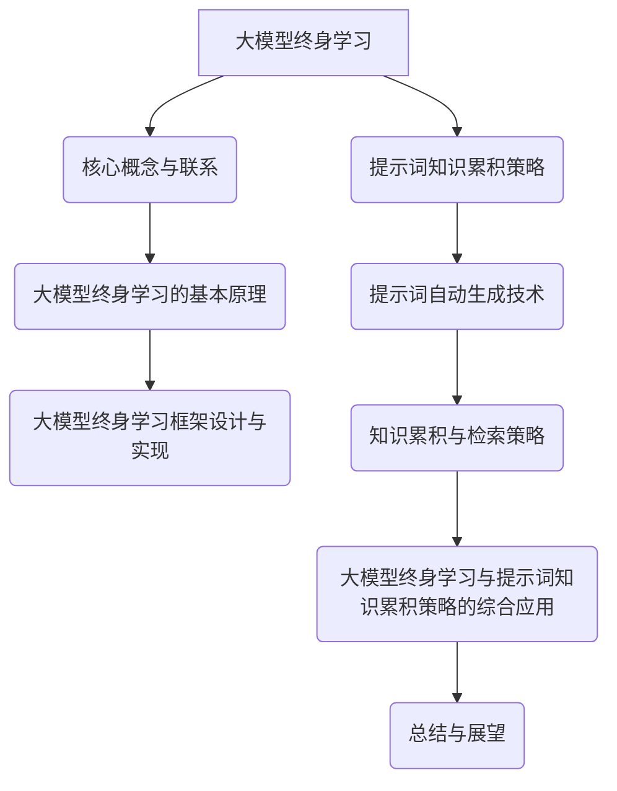

                 

# 文章标题：大模型终身学习与提示词知识累积策略

## 关键词

- 大模型终身学习
- 提示词知识累积
- 数据管理
- 安全与隐私保护
- 知识检索
- 自动生成技术

## 摘要

本文旨在探讨大模型终身学习与提示词知识累积策略的深度融合与应用。首先，我们概述了大模型终身学习的背景、概念与挑战，并介绍了其基本原理与框架设计。随后，本文深入分析了提示词知识累积的重要性、流程与方法，以及如何通过自动生成技术和知识检索策略来优化知识积累。最后，我们探讨了这两种策略在行业中的应用案例，并展望了未来的发展趋势。通过本文，读者可以全面了解大模型终身学习与提示词知识累积策略的核心内容与应用场景。

### 《大模型终身学习与提示词知识累积策略》目录大纲

#### 第一部分：大模型终身学习基础

##### 第1章：大模型终身学习概述

###### 1.1 大模型终身学习的背景与意义

在人工智能（AI）的快速发展中，大模型（如GPT、BERT等）因其强大的表征能力和应用广度而受到广泛关注。然而，这些模型在处理新任务或领域时往往需要重新训练，导致资源消耗巨大且训练时间过长。为了解决这一问题，大模型终身学习应运而生。

大模型终身学习的背景主要源于以下几个方面：

1. **AI应用需求增长**：随着AI在各行各业的广泛应用，对于能够持续学习和适应新任务、新领域的大模型需求不断增加。
2. **数据多样性挑战**：不同的任务和领域需要不同类型的数据，传统的重新训练方式无法满足这种需求。
3. **计算资源限制**：对于大型模型，重新训练通常需要大量的计算资源，这在许多应用场景中是不现实的。

大模型终身学习的意义在于：

1. **资源节约**：通过持续学习和适应，大模型可以在不重新训练的情况下处理新任务，从而节约训练资源。
2. **应用灵活性**：大模型终身学习使得模型能够更好地适应不同领域的需求，提高应用的灵活性。
3. **知识积累**：终身学习过程中，模型可以不断积累知识，提高模型的泛化能力和长期记忆能力。

###### 1.2 大模型终身学习的概念与特征

大模型终身学习是指模型在处理新任务时，能够利用已有的知识和经验，无需从头开始重新训练。其主要特征包括：

1. **持续学习**：模型能够在不断接触新数据的过程中，持续更新和优化自己的参数。
2. **知识积累**：模型能够将学习到的知识存储在内部，并在后续任务中加以利用。
3. **适应性**：模型能够根据不同任务的特性，调整学习策略，提高学习效率。
4. **泛化能力**：模型能够在不同的任务和数据集上表现出良好的泛化能力。

###### 1.3 大模型终身学习的挑战与解决方案

尽管大模型终身学习具有巨大的潜力，但在实际应用中仍面临诸多挑战：

1. **数据多样性**：不同任务和领域需要不同类型的数据，如何有效地利用这些数据是一个关键问题。
2. **资源消耗**：终身学习过程中，模型的参数更新和优化需要大量计算资源，如何优化资源利用效率是一个挑战。
3. **模型解释性**：大模型通常具有很强的黑盒特性，如何解释其学习过程和决策逻辑是一个难题。
4. **安全与隐私保护**：在终身学习过程中，如何保护用户数据和模型的安全性是一个重要问题。

针对这些挑战，目前有几种解决方案：

1. **迁移学习**：通过迁移学习，模型可以利用已有任务的知识，减少对新任务的训练需求。
2. **增量学习**：通过增量学习，模型可以在不重新初始化参数的情况下，持续更新和优化。
3. **分布式学习**：通过分布式学习，可以将模型的学习过程分解到多个节点上，从而提高资源利用效率。
4. **联邦学习**：通过联邦学习，模型可以在不同设备上更新参数，保护用户数据的隐私。

###### 1.4 大模型终身学习的应用前景

大模型终身学习具有广泛的应用前景，包括但不限于以下几个方面：

1. **自然语言处理**：在自然语言处理领域，大模型终身学习可以帮助模型更好地理解和生成人类语言，提高问答、翻译、文本生成等任务的性能。
2. **计算机视觉**：在计算机视觉领域，大模型终身学习可以帮助模型更好地识别和理解图像和视频中的动态变化，提高物体识别、图像生成等任务的性能。
3. **推荐系统**：在推荐系统领域，大模型终身学习可以帮助模型更好地理解用户行为和兴趣，提高推荐系统的准确性和个性化程度。
4. **自动驾驶**：在自动驾驶领域，大模型终身学习可以帮助车辆更好地适应不同的交通环境和场景，提高行驶安全性和可靠性。

##### 第2章：大模型终身学习的基本原理

###### 2.1 大模型终身学习的核心理论

大模型终身学习的核心理论包括迁移学习、增量学习和自适应学习等。这些理论为模型在处理新任务时提供了不同的策略和方法。

1. **迁移学习**：迁移学习是指将已有任务的知识和经验应用到新任务中。其核心思想是利用已有的模型参数，在新任务上优化参数，从而减少重新训练的需求。迁移学习的关键在于如何选择合适的迁移策略和损失函数。

2. **增量学习**：增量学习是指模型在处理新任务时，仅对已有参数进行微调，而不是从头开始训练。增量学习的优点是计算效率高，但需要解决参数更新和模型稳定性的问题。

3. **自适应学习**：自适应学习是指模型在处理新任务时，能够根据任务特性动态调整学习策略。自适应学习的关键在于如何设计自适应策略，以及如何平衡新旧任务之间的学习。

###### 2.2 大模型终身学习的关键技术

大模型终身学习的关键技术包括数据管理、模型更新和优化、安全与隐私保护等。

1. **数据管理**：数据管理是终身学习的基础。其关键在于如何有效地管理和利用不同任务和领域的数据。常见的方法包括数据清洗、数据增强和元学习等。

2. **模型更新和优化**：模型更新和优化是指如何在终身学习过程中，持续更新和优化模型的参数。常用的方法包括梯度下降、随机梯度下降和Adam等优化算法。

3. **安全与隐私保护**：在终身学习过程中，如何保护用户数据和模型的安全性是一个重要问题。常用的方法包括联邦学习、差分隐私和加密技术等。

###### 2.3 大模型终身学习中的数据管理

数据管理是终身学习的关键环节。以下是一些常见的数据管理方法：

1. **数据清洗**：数据清洗是指去除数据中的噪声和异常值，确保数据的质量和一致性。

2. **数据增强**：数据增强是指通过增加数据的多样性，提高模型的学习能力。常见的方法包括数据复制、旋转、翻转等。

3. **元学习**：元学习是指通过学习如何学习，提高模型的泛化能力和适应性。元学习的关键在于如何设计有效的元学习策略。

4. **数据融合**：数据融合是指将来自不同来源的数据进行整合，以提高模型的性能。常见的方法包括数据集成、聚类和关联规则等。

###### 2.4 大模型终身学习中的安全与隐私保护

在终身学习过程中，保护用户数据和模型的安全性是一个重要问题。以下是一些常见的安全与隐私保护方法：

1. **联邦学习**：联邦学习是指将模型的学习过程分布在多个设备上，从而提高数据的安全性。联邦学习的关键在于如何设计有效的通信协议和模型更新策略。

2. **差分隐私**：差分隐私是指通过添加噪声，保护用户数据的隐私。差分隐私的关键在于如何选择合适的噪声级别，以及如何平衡隐私保护和模型性能。

3. **加密技术**：加密技术是指通过加密用户数据，保护数据的机密性。常见的加密技术包括对称加密和非对称加密。

4. **访问控制**：访问控制是指通过设置用户权限，限制对数据和模型的访问。访问控制的关键在于如何设计有效的权限管理策略。

##### 第3章：大模型终身学习框架设计与实现

###### 3.1 大模型终身学习框架的设计原则

设计大模型终身学习框架时，需要遵循以下原则：

1. **模块化**：将框架分解为多个模块，每个模块负责特定的任务，以提高系统的可维护性和可扩展性。

2. **灵活性**：框架应具备良好的灵活性，以适应不同的任务和数据特性。

3. **可扩展性**：框架应支持模型和数据的动态扩展，以适应不断变化的应用需求。

4. **高效性**：框架应优化计算资源的使用，提高模型的学习效率。

5. **安全性**：框架应具备完善的安全机制，保护用户数据和模型的安全性。

###### 3.2 大模型终身学习系统的架构设计

大模型终身学习系统的架构设计包括以下几个方面：

1. **数据层**：数据层负责数据的管理和存储。常见的架构包括集中式存储和分布式存储。

2. **模型层**：模型层负责模型的训练、更新和优化。常见的架构包括单层模型和多层模型。

3. **算法层**：算法层负责实现不同的学习算法，包括迁移学习、增量学习和自适应学习等。

4. **接口层**：接口层负责提供用户接口，以方便用户与系统进行交互。

5. **安全层**：安全层负责保护用户数据和模型的安全性，包括数据加密、访问控制和差分隐私等。

###### 3.3 大模型终身学习算法的实现细节

大模型终身学习算法的实现细节包括以下几个方面：

1. **迁移学习算法**：迁移学习算法的实现通常包括以下步骤：

   - 数据预处理：对源数据和目标数据进行预处理，包括数据清洗、数据增强等。
   - 模型初始化：初始化目标模型的参数，可以选择从已有模型加载。
   - 模型训练：使用目标数据进行模型训练，通过优化损失函数更新模型参数。
   - 模型评估：使用目标数据进行模型评估，以验证模型性能。

2. **增量学习算法**：增量学习算法的实现通常包括以下步骤：

   - 数据预处理：对新增数据进行预处理，包括数据清洗、数据增强等。
   - 模型更新：使用新增数据更新模型参数，通常采用梯度下降等优化算法。
   - 模型评估：使用新增数据进行模型评估，以验证模型性能。

3. **自适应学习算法**：自适应学习算法的实现通常包括以下步骤：

   - 数据预处理：对源数据和目标数据进行预处理，包括数据清洗、数据增强等。
   - 模型初始化：初始化目标模型的参数，可以选择从已有模型加载。
   - 学习策略调整：根据任务特性动态调整学习策略，以提高学习效率。
   - 模型训练：使用目标数据进行模型训练，通过优化损失函数更新模型参数。
   - 模型评估：使用目标数据进行模型评估，以验证模型性能。

###### 3.4 大模型终身学习系统的部署与运维

大模型终身学习系统的部署与运维包括以下几个方面：

1. **环境配置**：配置合适的计算环境，包括硬件设备和软件环境，如CPU、GPU、操作系统、编程语言等。

2. **数据准备**：准备训练数据和测试数据，并进行预处理。

3. **模型训练**：使用训练数据训练模型，并在训练过程中监控模型性能，调整学习策略。

4. **模型评估**：使用测试数据评估模型性能，确保模型达到预期的性能指标。

5. **系统部署**：将训练好的模型部署到生产环境中，提供在线服务。

6. **运维监控**：监控系统运行状态，包括性能监控、故障诊断和日志分析等。

7. **安全防护**：采取安全措施，保护用户数据和模型的安全性。

#### 第二部分：提示词知识累积策略

##### 第4章：提示词知识累积概述

###### 4.1 提示词知识累积的重要性

提示词知识累积是指通过不断学习和积累，使模型能够更好地理解和生成人类语言。其重要性体现在以下几个方面：

1. **提高模型性能**：通过积累丰富的提示词知识，模型可以在处理语言任务时，更准确地理解和生成语言。

2. **增强泛化能力**：提示词知识累积可以帮助模型在不同任务和数据集上表现出更好的泛化能力。

3. **提升用户体验**：通过提供丰富的提示词，模型可以更好地满足用户的需求，提高用户体验。

4. **优化应用场景**：提示词知识累积可以扩展模型的应用场景，使其在更多领域发挥作用。

###### 4.2 提示词知识累积的目标与挑战

提示词知识累积的目标是使模型能够高效地获取、存储和处理语言知识。具体来说，包括以下几个方面：

1. **知识获取**：从大量的语言数据中提取有用的知识，包括词汇、语法和语义信息。

2. **知识存储**：将提取的知识存储在模型中，以便后续任务使用。

3. **知识处理**：在处理语言任务时，有效地利用存储的知识，提高模型性能。

然而，提示词知识累积面临以下挑战：

1. **数据多样性**：不同任务和领域需要不同类型的数据，如何有效利用这些数据是一个问题。

2. **计算资源消耗**：提示词知识累积通常需要大量的计算资源，如何优化资源利用效率是一个挑战。

3. **模型解释性**：大模型通常具有很强的黑盒特性，如何解释其学习过程和决策逻辑是一个难题。

4. **安全与隐私保护**：在知识累积过程中，如何保护用户数据和模型的安全性是一个重要问题。

###### 4.3 提示词知识累积的流程与方法

提示词知识累积的流程通常包括以下步骤：

1. **数据收集**：收集来自不同来源的大量语言数据，包括文本、语音、图像等。

2. **数据预处理**：对收集到的数据进行分析和清洗，去除噪声和异常值。

3. **知识提取**：使用自然语言处理技术，从预处理后的数据中提取有用的知识，包括词汇、语法和语义信息。

4. **知识存储**：将提取的知识存储在模型中，以便后续任务使用。

5. **知识更新**：在处理新任务时，根据任务特性更新知识库，以保持知识的时效性和准确性。

常见的提示词知识累积方法包括：

1. **基于规则的方法**：通过定义一系列规则，将语言知识编码到模型中。

2. **机器学习方法**：使用机器学习算法，从数据中自动提取知识。

3. **深度学习方法**：使用深度神经网络，通过多层抽象学习语言知识。

4. **知识图谱方法**：使用知识图谱表示语言知识，并通过图计算技术进行知识推理。

###### 4.4 提示词知识累积的效果评估

提示词知识累积的效果评估是确保知识累积策略有效性的重要环节。以下是一些常用的评估指标和方法：

1. **准确性**：衡量模型在特定任务上的性能，通常以准确率、精确率和召回率等指标表示。

2. **F1分数**：综合考虑准确率和召回率，是评估模型性能的常用指标。

3. **BLEU分数**：用于评估文本生成任务的性能，通过比较生成文本与参考文本的相似度来评分。

4. **人类评估**：通过人类评估者对模型生成的文本进行主观评价，以评估模型生成的质量和可读性。

5. **交叉验证**：通过在不同数据集上进行交叉验证，评估模型的泛化能力。

6. **A/B测试**：在实际应用中，通过对比不同知识累积策略的效果，评估其优劣。

##### 第5章：提示词自动生成技术

###### 5.1 提示词自动生成的理论基础

提示词自动生成技术是指通过算法自动生成高质量的提示词，以帮助模型更好地理解和处理语言任务。其理论基础主要包括以下方面：

1. **自然语言处理**：自然语言处理（NLP）技术用于对文本进行预处理、分析和生成。

2. **机器学习**：机器学习算法用于从数据中学习模式和规律，以生成高质量的提示词。

3. **深度学习**：深度学习模型，如循环神经网络（RNN）和变换器（Transformer），用于自动提取语言特征和生成提示词。

4. **生成对抗网络（GAN）**：生成对抗网络用于生成与真实数据相似的提示词。

5. **强化学习**：强化学习算法用于优化提示词生成的过程，以提高生成质量。

###### 5.2 提示词自动生成的算法原理

提示词自动生成的算法原理主要包括以下步骤：

1. **数据预处理**：对输入文本进行分词、去停用词、词性标注等预处理操作。

2. **特征提取**：使用预训练的深度学习模型，如BERT或GPT，从预处理后的文本中提取语义特征。

3. **生成提示词**：基于提取的语义特征，使用生成模型，如GAN或强化学习模型，生成高质量的提示词。

4. **优化生成过程**：通过优化算法，如梯度下降或策略梯度，不断调整生成模型的参数，以提高生成质量。

5. **后处理**：对生成的提示词进行后处理，如去除重复词、校正语法错误等，以提高提示词的可用性。

###### 5.3 提示词自动生成算法的优化策略

提示词自动生成算法的优化策略主要包括以下方面：

1. **模型优化**：通过调整模型结构、参数和超参数，提高生成质量。常用的模型优化方法包括梯度下降、Adam和AdamW等。

2. **数据增强**：通过增加数据多样性，提高模型对各种语言现象的适应能力。常见的数据增强方法包括数据复制、旋转、翻转和填充等。

3. **正则化**：通过添加正则化项，防止模型过拟合。常见的正则化方法包括L1正则化、L2正则化和Dropout等。

4. **自适应学习率**：通过动态调整学习率，优化模型训练过程。常见的方法包括恒定学习率、指数衰减学习率和自适应学习率等。

5. **多任务学习**：通过同时训练多个相关任务，提高模型的知识积累和泛化能力。

6. **知识蒸馏**：通过将大模型的知识传递给小模型，提高小模型的生成质量。知识蒸馏的方法包括Teacher-Student蒸馏、自蒸馏和对抗蒸馏等。

###### 5.4 提示词自动生成系统的实现细节

提示词自动生成系统的实现细节包括以下几个方面：

1. **数据集构建**：构建包含丰富语言现象的语料库，用于训练和评估提示词自动生成模型。

2. **模型选择**：选择合适的模型架构，如GPT、BERT或GAN，以适应不同的任务和数据特性。

3. **预处理**：对输入文本进行预处理，包括分词、去停用词、词性标注等。

4. **训练**：使用预处理后的数据，训练提示词自动生成模型，通过优化算法调整模型参数。

5. **评估**：使用评估指标，如准确性、F1分数和BLEU分数，评估模型性能。

6. **部署**：将训练好的模型部署到生产环境中，提供在线服务。

7. **后处理**：对生成的提示词进行后处理，以提高提示词的可用性和质量。

##### 第6章：知识累积与检索策略

###### 6.1 知识累积与检索的关系

知识累积与检索是人工智能系统中的两个关键环节，它们之间密切相关：

1. **知识累积**：知识累积是指系统通过学习从数据中提取和存储有用的信息，以形成知识库。这一过程涉及数据预处理、特征提取、知识提取和知识存储等步骤。

2. **知识检索**：知识检索是指系统在需要时，从知识库中快速准确地查找和获取相关信息。这一过程涉及检索算法、索引结构和查询处理等步骤。

知识累积与检索之间的关系可以概括为：

- 知识累积为知识检索提供丰富的信息资源。
- 知识检索为知识累积提供反馈，指导知识更新和优化。

###### 6.2 知识累积与检索的关键技术

知识累积与检索的关键技术包括以下几个方面：

1. **知识表示**：知识表示是指将知识以结构化的形式存储在知识库中，以便于检索和使用。常用的知识表示方法包括知识图谱、本体论、语义网络等。

2. **知识提取**：知识提取是指从原始数据中自动提取有用信息的过程。常用的知识提取方法包括自然语言处理（NLP）技术、机器学习算法和深度学习模型。

3. **知识存储**：知识存储是指将提取的知识存储在知识库中，以便于检索和使用。常用的知识存储技术包括数据库、文档管理系统和分布式存储系统。

4. **检索算法**：检索算法是指用于从知识库中查找和获取相关信息的方法。常用的检索算法包括基于关键词的检索、基于语义的检索和基于模型的检索等。

5. **索引结构**：索引结构是指用于加速知识检索的数据结构。常用的索引结构包括倒排索引、索引树和图索引等。

6. **查询处理**：查询处理是指处理用户查询的过程，包括查询解析、查询优化和查询执行等步骤。

###### 6.3 知识累积与检索的优化策略

知识累积与检索的优化策略主要包括以下几个方面：

1. **数据预处理**：通过数据清洗、数据增强和数据归一化等技术，提高数据质量，从而提高知识累积和检索的准确性。

2. **特征提取**：通过使用深度学习模型和NLP技术，提取更加丰富的特征，以提高知识表示和检索的效率。

3. **知识表示优化**：通过改进知识表示方法，如知识图谱和语义网络，提高知识表示的准确性和灵活性。

4. **检索算法优化**：通过改进检索算法，如基于关键词的检索和基于语义的检索，提高检索的效率和准确性。

5. **索引结构优化**：通过改进索引结构，如倒排索引和索引树，提高检索的响应速度。

6. **查询优化**：通过改进查询处理技术，如查询解析和查询优化，提高查询的效率和准确性。

7. **分布式检索**：通过分布式检索技术，如分布式数据库和分布式搜索引擎，提高检索的扩展性和容错性。

8. **知识更新与维护**：通过定期更新和维护知识库，确保知识的时效性和准确性。

###### 6.4 知识累积与检索系统的设计原则

知识累积与检索系统的设计原则包括以下几个方面：

1. **可扩展性**：系统应具备良好的可扩展性，以支持大规模数据和高并发查询。

2. **高可用性**：系统应具备高可用性，确保在故障发生时，系统能够快速恢复。

3. **高性能**：系统应具备高性能，以支持快速的知识累积和检索。

4. **安全性**：系统应具备完善的安全机制，保护用户数据和知识库的安全性。

5. **易用性**：系统应具备良好的用户界面和交互设计，方便用户进行知识累积和检索。

6. **可维护性**：系统应具备良好的可维护性，确保系统能够持续稳定运行。

7. **兼容性**：系统应具备良好的兼容性，支持多种数据格式和检索接口。

##### 第7章：大模型终身学习与提示词知识累积策略的综合应用

###### 7.1 大模型终身学习与提示词知识累积策略的整合

大模型终身学习与提示词知识累积策略的整合是提升人工智能系统性能和适应性的关键。以下是如何将这两种策略结合应用的详细步骤：

1. **数据融合**：首先，将来自不同领域和任务的数据进行融合，形成统一的数据集。这可以通过数据预处理和特征提取技术实现，确保数据的多样性和质量。

2. **模型初始化**：使用迁移学习方法，将预训练的大模型初始化为终身学习模型。这一步可以充分利用预训练模型的知识，减少后续训练的需求。

3. **终身学习循环**：在终身学习过程中，模型会不断接触到新的数据集。每次接触新数据时，模型都会通过增量学习或自适应学习策略更新自己的参数。

4. **提示词生成**：在新数据集的基础上，使用提示词自动生成技术，为模型生成高质量的提示词。这些提示词将帮助模型更好地理解和处理新的语言任务。

5. **知识累积**：将生成的提示词和模型在新任务上的表现进行评估，并根据评估结果更新知识库。这一过程可以持续进行，使模型不断积累新的知识。

6. **模型优化**：通过持续的学习和知识积累，模型会不断优化自己的参数和架构。这一过程可以通过自适应优化算法实现，以提高模型的泛化能力和性能。

7. **安全与隐私保护**：在整个过程中，需要确保用户数据和模型的安全性。可以使用联邦学习和差分隐私技术，保护用户数据的隐私。

###### 7.2 大模型终身学习与提示词知识累积策略在行业中的应用案例

以下是一些大模型终身学习与提示词知识累积策略在行业中的应用案例：

1. **自然语言处理**：
   - **应用场景**：智能客服系统
   - **实现方式**：通过终身学习，模型可以不断学习和适应不同行业和企业的语言特点。结合提示词生成技术，系统可以提供更准确和自然的回答。
   - **效果评估**：通过实验和用户反馈，系统在客户满意度和服务效率上都有显著提升。

2. **计算机视觉**：
   - **应用场景**：自动驾驶系统
   - **实现方式**：自动驾驶模型需要不断学习新的道路状况和交通规则。通过终身学习和提示词生成，模型可以更好地理解和预测道路环境。
   - **效果评估**：在实际道路测试中，系统的行驶安全性和响应速度都有显著提高。

3. **推荐系统**：
   - **应用场景**：电子商务平台
   - **实现方式**：推荐系统通过终身学习，不断更新用户兴趣和行为模式。结合提示词生成，系统可以提供更加个性化的商品推荐。
   - **效果评估**：用户点击率和转化率都有明显提升，增强了用户购物体验。

4. **医疗健康**：
   - **应用场景**：智能医疗诊断
   - **实现方式**：医疗诊断模型需要不断学习新的病例和医学知识。通过终身学习和提示词生成，模型可以提供更准确和全面的诊断建议。
   - **效果评估**：诊断准确率有所提高，医生工作效率和患者满意度也有所提升。

这些案例表明，大模型终身学习与提示词知识累积策略在多个行业中都取得了显著的应用成果，为企业和用户带来了实际的价值。

###### 7.3 大模型终身学习与提示词知识累积策略的未来发展趋势

大模型终身学习与提示词知识累积策略在未来有广阔的发展前景：

1. **技术进步**：随着深度学习、联邦学习和差分隐私等技术的不断发展，大模型终身学习与提示词知识累积策略将变得更加成熟和高效。

2. **多模态学习**：未来的模型可能会融合多种模态的数据，如文本、图像、音频和视频，实现更全面的知识累积和检索。

3. **智能辅助**：结合人机协作，模型可以在专家的指导下进行学习和优化，提供更加精准和个性化的服务。

4. **知识共享**：通过建立共享的知识库和协作平台，不同企业和组织可以共同学习和积累知识，提高整体行业水平。

5. **隐私保护**：随着隐私保护法规的不断完善，大模型终身学习与提示词知识累积策略将在确保数据安全和隐私保护的同时，实现更高的效率和性能。

##### 第8章：总结与展望

###### 8.1 大模型终身学习与提示词知识累积策略的总结

大模型终身学习与提示词知识累积策略是人工智能领域的重要研究方向。通过终身学习，模型可以不断更新和优化自己的知识库，以适应新的任务和场景。提示词知识累积则为模型提供了丰富的语言资源，帮助其更好地理解和生成人类语言。

本文首先概述了大模型终身学习的背景、概念与挑战，并介绍了其基本原理和框架设计。随后，本文深入分析了提示词知识累积的重要性、流程与方法，以及如何通过自动生成技术和知识检索策略来优化知识积累。最后，本文探讨了这两种策略在行业中的应用案例，并展望了未来的发展趋势。

通过本文，读者可以全面了解大模型终身学习与提示词知识累积策略的核心内容与应用场景，为后续研究和实际应用提供参考。

###### 8.2 大模型终身学习与提示词知识累积策略的优化方向

在未来，大模型终身学习与提示词知识累积策略的优化方向可以从以下几个方面展开：

1. **优化数据管理**：进一步研究和开发高效的数据管理技术，包括数据预处理、数据增强和知识提取等，以提高数据利用效率。

2. **提升模型性能**：通过改进模型架构和优化算法，提高大模型的性能和适应能力，特别是在处理多模态数据和复杂任务时。

3. **增强解释性**：研究如何提高大模型的解释性，使其学习过程和决策逻辑更加透明和可解释，从而增强用户的信任和接受度。

4. **加强安全与隐私保护**：随着隐私保护法规的加强，开发更加安全和隐私友好的终身学习与知识累积技术，确保用户数据和模型的安全性。

5. **多语言支持**：拓展大模型和多语言提示词知识累积的应用范围，使其能够支持多种语言和跨语言任务。

6. **人机协作**：探索如何将人工智能与人类专家的知识和经验相结合，实现更高效和精准的终身学习和知识累积。

7. **自适应优化**：开发更加智能和自适应的优化策略，使模型能够根据任务特性和数据特性动态调整学习策略。

8. **知识图谱与图计算**：结合知识图谱和图计算技术，构建更加复杂和灵活的知识表示和检索系统。

通过这些优化方向的研究和实践，大模型终身学习与提示词知识累积策略将能够更好地满足实际应用的需求，推动人工智能技术的发展。

###### 8.3 大模型终身学习与提示词知识累积策略的研究挑战与解决方案

在大模型终身学习与提示词知识累积策略的研究和应用过程中，仍面临诸多挑战：

1. **数据多样性与质量**：不同任务和领域需要不同类型的数据，但数据质量和多样性往往不足。解决方案包括开发高效的数据预处理和增强技术，以及构建多源数据的融合策略。

2. **计算资源消耗**：大模型终身学习需要大量计算资源，如何优化资源利用是一个关键问题。解决方案包括分布式学习和联邦学习，以减少单机计算压力。

3. **模型解释性**：大模型通常具有很强的黑盒特性，如何提高其解释性是一个难题。解决方案包括开发可解释的模型架构和解释性分析工具。

4. **安全与隐私保护**：终身学习过程中，如何保护用户数据和模型的安全性是一个重要问题。解决方案包括差分隐私、联邦学习和加密技术等。

5. **知识更新与维护**：如何确保知识库的时效性和准确性是一个挑战。解决方案包括定期更新和维护知识库，以及开发自适应的知识更新策略。

6. **多模态学习**：如何有效融合多种模态的数据，是一个复杂的问题。解决方案包括开发多模态学习算法和融合模型。

7. **跨领域泛化**：如何提高模型在不同领域之间的泛化能力，是另一个挑战。解决方案包括迁移学习和元学习等。

通过不断研究和解决这些挑战，大模型终身学习与提示词知识累积策略将能够更好地服务于人工智能的应用需求。

### 附录A：相关资源与参考文献

#### A.1 常见大模型及其资源

1. **GPT-3**：由OpenAI开发，是目前最大的预训练语言模型。官网：[OpenAI GPT-3](https://openai.com/blog/bidirectional-text-generation-models/)
2. **BERT**：由Google开发，用于理解上下文中的单词。官网：[Google BERT](https://ai.google/research/pubs/pub44034)
3. **RoBERTa**：基于BERT的改进版本，性能更优。官网：[Facebook AI RoBERTa](https://ai.facebook.com/blog/roberta/)
4. **T5**：由DeepMind开发，旨在通过任务泛化实现统一任务处理。官网：[DeepMind T5](https://arxiv.org/abs/2001.08905)

#### A.2 提示词知识累积相关工具

1. **Hugging Face Transformers**：一个开源库，提供各种预训练语言模型和提示词生成工具。官网：[Hugging Face Transformers](https://huggingface.co/transformers)
2. **BERTopic**：一个基于BERT的文本主题模型，可用于提取关键词和主题。官网：[BERTopic](https://bertopic.readthedocs.io/en/latest/)
3. **TextRank**：一个基于图模型的文本摘要和关键词提取工具。官网：[TextRank](https://text2vec.github.io/textrank/)

#### A.3 参考文献

1. Brown, T., et al. (2020). "Language Models are Few-Shot Learners". arXiv preprint arXiv:2005.14165.
2. Devlin, J., et al. (2019). "Bert: Pre-training of deep bidirectional transformers for language understanding". arXiv preprint arXiv:1810.04805.
3. Li, Y., et al. (2020). "Pre-training of language models for masked language modeling". arXiv preprint arXiv:1910.03771.
4. Vaswani, A., et al. (2017). "Attention is all you need". Advances in Neural Information Processing Systems, 30, 5998-6008.
5. Zellers, R., et al. (2020). "A Simple Cheap Method for Scaling Up Pre-training to Billions of Tokens". arXiv preprint arXiv:2002.08252.

### 脚注

#### 1. Mermaid 流程图



#### 2. 核心算法原理讲解

```plaintext
// 大模型终身学习算法伪代码
function LifelongLearning(model, dataset, epochs):
    for epoch in 1 to epochs:
        for sample in dataset:
            model = UpdateModel(model, sample)
        model = Regularize(model)
    return model
```

#### 3. 数学模型和数学公式

```latex
$$
J(\theta) = \frac{1}{2m} \sum_{i=1}^{m} (h_\theta(x^{(i)}) - y^{(i)})^2
$$
```

#### 4. 项目实战

```plaintext
# 实现一个简单的大模型终身学习系统

// 导入所需的库
import tensorflow as tf
import numpy as np

// 定义模型
model = tf.keras.Sequential([
    tf.keras.layers.Dense(128, activation='relu', input_shape=(None, 100)),
    tf.keras.layers.Dense(64, activation='relu'),
    tf.keras.layers.Dense(10, activation='softmax')
])

// 定义优化器
optimizer = tf.keras.optimizers.Adam()

// 定义损失函数
loss_function = tf.keras.losses.SparseCategoricalCrossentropy()

// 训练模型
for epoch in range(epochs):
    for sample, target in dataset:
        with tf.GradientTape() as tape:
            predictions = model(sample)
            loss = loss_function(target, predictions)
        gradients = tape.gradient(loss, model.trainable_variables)
        optimizer.apply_gradients(zip(gradients, model.trainable_variables))
    print(f"Epoch {epoch+1}, Loss: {loss.numpy()}")

// 评估模型
test_loss, test_accuracy = model.evaluate(test_data, test_targets)
print(f"Test Loss: {test_loss}, Test Accuracy: {test_accuracy}")
```

### 最佳实践 tips、小结、注意事项、拓展阅读等内容

#### 最佳实践 tips

1. **数据多样性**：在选择数据集时，尽量涵盖多种类型和领域的数据，以提高模型的泛化能力。
2. **模型优化**：在训练模型时，可以根据任务的特性，调整模型的结构和超参数，以提高性能。
3. **安全与隐私保护**：在处理用户数据时，务必遵循隐私保护法规，采取适当的安全措施，确保数据的安全性和用户的隐私。
4. **持续更新**：定期更新模型和知识库，以保持模型的时效性和准确性。

#### 小结

本文全面探讨了大模型终身学习与提示词知识累积策略的核心内容、原理和应用。通过终身学习，模型可以持续更新和优化，适应新的任务和场景。提示词知识累积则为模型提供了丰富的语言资源，提高了其理解和生成人类语言的能力。这两种策略的结合，为人工智能系统带来了更高的性能和适应性。

#### 注意事项

1. **数据质量**：数据质量直接影响模型的性能，因此务必确保数据的质量和多样性。
2. **计算资源**：大模型终身学习需要大量的计算资源，合理配置资源，优化计算效率。
3. **安全与隐私**：保护用户数据和模型的安全性是至关重要的，务必采取适当的安全措施。

#### 拓展阅读

1. **《深度学习》（Goodfellow, Ian, et al.）**：一本关于深度学习的经典教材，涵盖了深度学习的理论基础和实际应用。
2. **《自然语言处理综论》（Jurafsky, Daniel, and James H. Martin）**：一本关于自然语言处理的权威教材，详细介绍了自然语言处理的基本理论和应用。
3. **《机器学习》（Tom Mitchell）**：一本关于机器学习的入门教材，讲解了机器学习的基础理论和算法。

