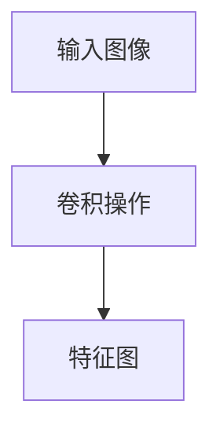
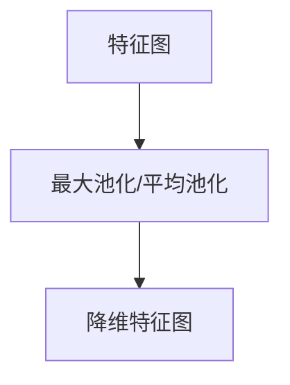
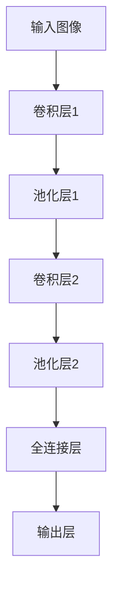
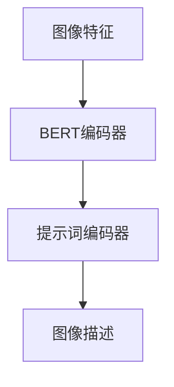
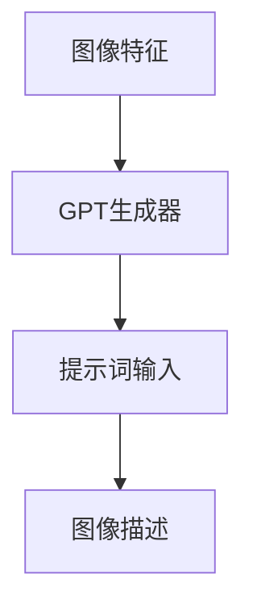
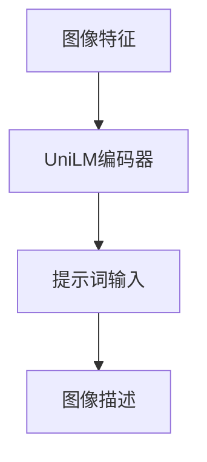
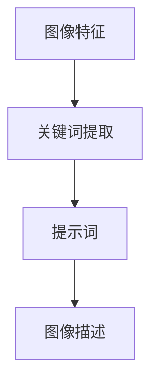
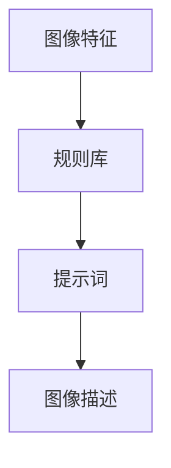
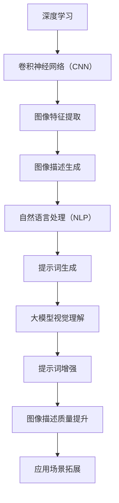

                 

# 文章标题：大模型视觉理解：提示词增强图像描述

## 关键词：大模型、视觉理解、提示词、图像描述、深度学习

## 摘要

随着人工智能技术的不断发展，大模型在视觉理解领域中的应用日益广泛。本文首先概述了大模型视觉理解的基础，包括其背景与意义、技术发展、数学模型和算法原理。接着，深入探讨了提示词增强图像描述的基本概念、方法及其在图像生成、分类和检索中的应用。最后，通过项目实战与案例分析，展示了大模型视觉理解与提示词增强在实际应用中的效果与优化策略。

### 目录

## 第一部分：大模型视觉理解基础

### 第1章：大模型视觉理解概述

#### 1.1 大模型视觉理解的背景与意义

#### 1.2 大模型视觉理解的技术发展

#### 1.3 大模型视觉理解的应用领域

### 第2章：大模型视觉理解原理

#### 2.1 大模型的结构与特点

#### 2.2 大模型视觉理解的关键技术

#### 2.3 大模型视觉理解的训练方法

### 第3章：大模型视觉理解的数学模型

#### 3.1 神经网络在视觉理解中的应用

#### 3.2 卷积神经网络（CNN）模型

#### 3.3 深度学习与视觉理解的数学原理

### 第4章：大模型视觉理解的算法原理

#### 4.1 特征提取算法

#### 4.2 语义分割算法

#### 4.3 目标检测算法

### 第5章：大模型视觉理解的评估与优化

#### 5.1 大模型视觉理解的评估指标

#### 5.2 大模型视觉理解的优化方法

#### 5.3 大模型视觉理解的可解释性

## 第二部分：提示词增强图像描述

### 第6章：提示词增强图像描述的基本概念

#### 6.1 提示词的概念与作用

#### 6.2 提示词的类型与应用

#### 6.3 提示词增强图像描述的优势

### 第7章：提示词增强图像描述的方法

#### 7.1 基于深度学习的提示词增强方法

#### 7.2 基于传统的提示词增强方法

#### 7.3 提示词增强方法的比较与选择

### 第8章：提示词增强图像描述的应用实践

#### 8.1 图像生成与提示词增强

#### 8.2 图像分类与提示词增强

#### 8.3 图像检索与提示词增强

### 第9章：大模型视觉理解与提示词增强的融合

#### 9.1 大模型视觉理解与提示词增强的融合框架

#### 9.2 融合框架的实现方法

#### 9.3 融合框架的性能评估与优化

## 第三部分：项目实战与案例分析

### 第10章：大模型视觉理解与提示词增强的实战案例

#### 10.1 实战案例一：图像分类系统

#### 10.2 实战案例二：图像生成与描述系统

#### 10.3 实战案例三：图像检索与提示词增强系统

### 第11章：大模型视觉理解与提示词增强的案例分析

#### 11.1 案例分析一：图像识别在医疗领域的应用

#### 11.2 案例分析二：图像生成在艺术创作中的应用

#### 11.3 案例分析三：图像检索在电子商务中的应用

## 附录

### 附录A：大模型视觉理解与提示词增强工具与资源

#### A.1 常用深度学习框架

#### A.2 提示词增强图像描述开源代码

#### A.3 大模型视觉理解与提示词增强论文集锦

### A.4 附加参考资料

#### A.4.1 相关书籍推荐

#### A.4.2 视频教程与课程

#### A.4.3 研究论文与报告

#### A.4.4 社交媒体与论坛

## 第1章 大模型视觉理解概述

### 1.1 大模型视觉理解的背景与意义

### 1.1.1 计算机视觉的演进与挑战

计算机视觉是人工智能的一个重要分支，旨在使计算机能够像人类一样理解和解释视觉信息。从早期的图像处理到现代的深度学习，计算机视觉经历了巨大的变革。

- **早期阶段**：以手工设计的特征提取算法为主，如SIFT、SURF等。这些算法能够处理一些简单的视觉任务，但面临大量标注数据的依赖和泛化能力不足的问题。
- **20世纪90年代**：基于机器学习的视觉算法开始流行，如支持向量机（SVM）和决策树。这些算法在一定程度上提高了模型的泛化能力，但仍然依赖大量的手工特征工程。
- **深度学习时代**：随着计算能力的提升和数据量的增加，深度学习模型，特别是卷积神经网络（CNN），在计算机视觉领域取得了突破性的进展。CNN能够自动提取图像特征，并显示出强大的视觉理解能力。
- **大模型时代**：近年来，随着计算能力和数据量的进一步增加，大模型如BERT、GPT等在自然语言处理领域取得了显著成果。这些大模型的出现，使得计算机视觉领域也开始探索如何将大模型应用于视觉理解。

**计算机视觉面临的挑战**：

- **标注数据稀缺**：高质量的标注数据对于训练深度学习模型至关重要，但获取标注数据通常是一个耗时且成本高昂的过程。
- **泛化能力不足**：现有的视觉模型往往在训练数据上表现良好，但在未见过的数据上表现较差，即存在“过拟合”的问题。
- **实时性要求高**：在许多应用场景中，如自动驾驶和实时监控，系统需要快速地对图像进行理解和处理，以满足实时性的要求。
- **多样性处理困难**：真实世界中的图像数据具有高度多样性，包括不同的光照条件、视角、物体姿态等，这使得模型需要具备较强的鲁棒性和泛化能力。

大模型视觉理解的出现，旨在解决上述挑战。通过使用大规模的深度学习模型，大模型能够自动学习和提取图像的复杂特征，从而实现对图像的精细理解和描述。大模型视觉理解不仅提高了模型的泛化能力和实时性，还增强了模型处理多样化图像数据的能力。

### 1.1.2 大模型视觉理解的定义与特点

**大模型视觉理解的定义**：

大模型视觉理解是指利用大规模深度学习模型对图像内容进行精确理解和描述的能力。这些大模型通常具有数十亿甚至数万亿个参数，能够捕捉到图像的细微特征，从而实现对图像内容的全面理解。

**大模型视觉理解的特点**：

- **参数量巨大**：大模型的参数量通常在数百万到数十亿之间，这使得模型能够学习到图像的复杂特征。
- **泛化能力强**：由于模型具有大量的参数，它能够在多种不同的数据集上表现出良好的泛化能力。
- **可解释性较高**：大模型视觉理解的可解释性较高，可以通过分析模型的内部结构和决策过程来理解其工作原理。

### 1.1.3 大模型视觉理解的应用领域

大模型视觉理解在多个领域有着广泛的应用，以下是其中几个主要的应用领域：

- **自动驾驶**：自动驾驶系统需要实时理解和分析道路环境中的图像信息，以做出驾驶决策。大模型视觉理解技术能够提高自动驾驶系统的感知准确性和安全性。
- **智能监控**：智能监控系统能够自动识别和追踪监控场景中的物体，如行人、车辆等。大模型视觉理解技术能够提高监控系统的实时性和准确性。
- **图像识别**：大模型视觉理解技术能够在各种图像识别任务中表现出色，如人脸识别、车牌识别等。
- **医疗影像分析**：大模型视觉理解技术能够自动分析医疗影像数据，如X光片、CT扫描和MRI图像，从而辅助医生进行诊断和治疗。
- **艺术创作**：大模型视觉理解技术能够生成新颖的视觉内容，如生成艺术作品、动画和虚拟现实场景。

### 1.2 大模型视觉理解的技术发展

**传统计算机视觉技术**：

- **特征提取技术**：传统的计算机视觉技术主要依赖于手工设计的特征提取算法，如SIFT（尺度不变特征变换）和SURF（加速稳健特征）。这些算法能够在一定程度上捕捉图像的局部特征，但存在对光照变化、视角变化和噪声敏感等问题。
- **图像分割技术**：图像分割是将图像划分为不同的区域或对象的过程。传统方法包括基于阈值的分割、基于区域的分割和基于边缘的分割等。这些方法在处理简单场景时表现良好，但在复杂场景下往往难以取得理想的效果。
- **目标检测技术**：目标检测是计算机视觉中的一个重要任务，旨在识别图像中的目标物体并定位其位置。传统方法包括基于模板匹配的检测、基于特征匹配的检测和基于模型的检测等。这些方法在处理简单目标时较为有效，但在处理复杂场景和多个目标时存在一定的局限性。

**深度学习在计算机视觉中的应用**：

- **卷积神经网络（CNN）**：卷积神经网络是深度学习在计算机视觉领域中最常用的模型之一。它通过卷积操作提取图像的局部特征，并通过池化操作降低数据的维度。CNN在图像分类、目标检测和图像分割等任务上表现出色。
- **卷积神经网络（CNN）模型**：卷积神经网络（CNN）是一种特殊的神经网络，其结构能够更好地适应图像数据的特性。CNN主要由卷积层、池化层和全连接层组成，通过多层次的卷积和池化操作，CNN能够自动提取图像的层次特征，从而实现对图像的精细理解。
- **深度学习与视觉理解的数学原理**：深度学习通过多层神经网络结构，将输入数据进行逐层提取和变换，最终实现对数据的理解和表示。在视觉理解中，深度学习模型能够通过卷积操作提取图像的局部特征，并通过池化操作降低数据的维度，从而实现对图像内容的全面理解。

**大模型视觉理解的技术发展**：

- **大规模预训练模型**：近年来，大规模预训练模型如BERT、GPT等在自然语言处理领域取得了显著的成果。这些模型通过在大量未标注的数据上进行预训练，能够获得强大的语言理解和生成能力。受此启发，研究人员开始探索如何将大规模预训练模型应用于视觉理解领域。
- **大模型与视觉理解的融合**：将大规模预训练模型与计算机视觉技术相结合，构建大模型视觉理解模型。这些模型能够在视觉特征提取和语义理解方面取得更好的效果，从而提高视觉理解任务的性能。
- **自适应提示词生成**：在视觉理解任务中，提示词（prompt）用于指导模型对图像内容进行理解和描述。自适应提示词生成技术能够根据图像内容和任务需求，生成合适的提示词，从而提高视觉理解任务的准确性和效率。

### 1.3 大模型视觉理解的应用领域

大模型视觉理解在多个领域有着广泛的应用，以下是其中几个主要的应用领域：

- **自动驾驶**：自动驾驶系统需要实时理解和分析道路环境中的图像信息，以做出驾驶决策。大模型视觉理解技术能够提高自动驾驶系统的感知准确性和安全性。例如，通过大模型视觉理解技术，自动驾驶系统可以准确识别道路上的行人、车辆和交通标志，并预测其行为，从而做出相应的驾驶决策。

- **智能监控**：智能监控系统能够自动识别和追踪监控场景中的物体，如行人、车辆等。大模型视觉理解技术能够提高监控系统的实时性和准确性。例如，通过大模型视觉理解技术，监控系统可以实时识别监控场景中的异常行为，如盗窃、火灾等，并及时发出警报。

- **图像识别**：大模型视觉理解技术能够在各种图像识别任务中表现出色，如人脸识别、车牌识别等。例如，通过大模型视觉理解技术，监控系统可以实时识别人脸，并将其与数据库中的照片进行比对，从而实现人员身份的识别。

- **医疗影像分析**：大模型视觉理解技术能够自动分析医疗影像数据，如X光片、CT扫描和MRI图像，从而辅助医生进行诊断和治疗。例如，通过大模型视觉理解技术，医生可以更快速地识别出X光片中的骨折、肿瘤等异常情况，从而提高诊断的准确性和效率。

- **艺术创作**：大模型视觉理解技术能够生成新颖的视觉内容，如生成艺术作品、动画和虚拟现实场景。例如，通过大模型视觉理解技术，艺术家可以更轻松地创作出具有独特风格的绘画作品，或设计师可以更快速地生成符合需求的虚拟现实场景。

## 第2章 大模型视觉理解原理

### 2.1 大模型的结构与特点

大模型视觉理解的核心在于其庞大的参数量和深度复杂的网络结构。这些特性使得大模型能够有效地捕捉图像的细微特征，从而实现对图像内容的深入理解。下面将详细介绍大模型的结构与特点。

#### 2.1.1 参数量巨大

大模型通常包含数十亿甚至数万亿个参数。这种参数规模使得模型能够学习到图像的复杂特征，从而提高视觉理解的能力。例如，GPT-3模型包含1750亿个参数，BERT模型也有数百万个参数。这些参数不仅包括权重系数，还包括偏置项等，构成了模型的完整参数集。

#### 2.1.2 深度复杂的网络结构

大模型的网络结构通常非常复杂，包含多层的卷积层、全连接层和池化层。这种多层次的结构使得模型能够从不同层次提取图像的特征。例如，卷积层能够提取图像的局部特征，全连接层能够进行全局特征的学习和融合。通过这种多层次的结构，大模型能够实现对图像内容的精细理解和描述。

#### 2.1.3 自适应学习能力

大模型具有强大的自适应学习能力，能够在不同任务和数据集上快速适应和调整。这种能力使得大模型不仅适用于特定的视觉理解任务，还能够泛化到其他相关任务。例如，通过在多个数据集上的预训练，大模型能够学习到通用的视觉特征，从而在新的数据集上表现出良好的性能。

#### 2.1.4 可扩展性

大模型具有良好的可扩展性，能够根据需求调整模型的参数规模和结构。这种可扩展性使得大模型能够适应不同的计算资源和数据规模。例如，对于计算资源有限的场景，可以通过减少模型参数来降低计算成本；对于数据量巨大的场景，可以通过增加模型层数或参数规模来提高模型的性能。

### 2.2 大模型视觉理解的关键技术

大模型视觉理解的关键技术包括图像特征提取、图像分类、目标检测和语义分割等。这些技术构成了大模型视觉理解的核心，下面将分别进行介绍。

#### 2.2.1 图像特征提取

图像特征提取是视觉理解的基础，其主要任务是提取图像中的关键特征，以便后续的视觉任务处理。大模型视觉理解通过多层卷积神经网络（CNN）来实现图像特征提取。CNN通过卷积操作逐层提取图像的局部特征，并通过池化操作降低数据的维度。具体的CNN结构如下：

```plaintext
input image
|
卷积层1 --> 池化层1 --> ... --> 卷积层N --> 池化层N --> 输出特征图
```

通过这种多层次的结构，CNN能够自动提取图像的层次特征，从而实现对图像内容的精细理解。

#### 2.2.2 图像分类

图像分类是将图像数据分配到预定义的类别中的一种任务。大模型视觉理解通过全连接层（FC）来实现图像分类。全连接层将提取到的图像特征映射到预定义的类别上，通过计算输出层的softmax概率分布来实现分类。具体的分类过程如下：

```plaintext
输入特征图 --> 全连接层 --> 输出类别概率分布
```

通过训练大量的图像数据，大模型能够学习到图像的特征表示，从而在测试数据上实现高精度的分类。

#### 2.2.3 目标检测

目标检测是计算机视觉中的一项重要任务，旨在识别图像中的多个目标并定位其位置。大模型视觉理解通过卷积神经网络（CNN）结合区域建议（Region Proposal）和分类器来实现目标检测。具体的过程如下：

```plaintext
输入图像 --> CNN提取特征图 --> 生成区域建议 --> 对区域建议进行分类和定位 --> 输出检测结果
```

目标检测技术不仅需要识别图像中的物体，还需要定位物体的位置。大模型通过结合区域建议和分类器，能够实现对图像中多个目标的准确检测。

#### 2.2.4 语义分割

语义分割是将图像中的每个像素点分配到预定义的类别中的一种任务。大模型视觉理解通过全卷积网络（FCN）来实现语义分割。全卷积网络通过卷积操作和上采样操作将特征图扩展到与输入图像相同的尺寸，从而实现对每个像素点的分类。具体的分割过程如下：

```plaintext
输入图像 --> CNN提取特征图 --> 上采样 --> 输出分割结果
```

通过训练大量的图像数据，大模型能够学习到图像的特征表示，从而在测试数据上实现高精度的语义分割。

### 2.3 大模型视觉理解的训练方法

大模型视觉理解的训练方法主要包括预训练和微调。预训练是在大规模数据集上对模型进行训练，以学习到通用的视觉特征；微调是在预训练的基础上，在特定任务的数据集上进行进一步的训练，以适应特定的视觉理解任务。

#### 2.3.1 预训练

预训练通常在大规模图像数据集上进行，如ImageNet、COCO等。预训练的目的是学习到通用的视觉特征，这些特征在后续的视觉理解任务中具有很好的泛化能力。预训练的过程如下：

1. **数据预处理**：对图像数据进行预处理，包括数据增强、数据归一化等操作，以提高模型的泛化能力。
2. **模型初始化**：初始化模型的参数，通常使用预训练的权重作为初始化。
3. **训练过程**：在图像数据集上对模型进行训练，通过优化目标函数（如交叉熵损失函数）来调整模型参数。
4. **评估过程**：在验证集上评估模型的性能，选择性能最优的模型进行后续的微调。

#### 2.3.2 微调

微调是在预训练的基础上，在特定任务的数据集上进行进一步的训练。微调的目的是让模型适应特定的视觉理解任务。微调的过程如下：

1. **数据预处理**：对特定任务的数据集进行预处理，包括数据增强、数据归一化等操作。
2. **模型调整**：在预训练的基础上，调整模型的部分参数，通常只调整最后一层的权重。
3. **训练过程**：在特定任务的数据集上对模型进行训练，通过优化目标函数（如交叉熵损失函数）来调整模型参数。
4. **评估过程**：在测试集上评估模型的性能，选择性能最优的模型进行应用。

### 第3章 大模型视觉理解的数学模型

大模型视觉理解的核心在于其数学模型，这些模型通过复杂的数学原理来实现图像的精确理解和描述。在这一章节中，我们将深入探讨神经网络在视觉理解中的应用、卷积神经网络（CNN）模型以及深度学习与视觉理解的数学原理。

#### 3.1 神经网络在视觉理解中的应用

神经网络是一种模仿人脑神经元连接方式的计算模型，其在视觉理解中的应用主要体现在图像特征提取和分类两个方面。

**1. 图像特征提取**：

神经网络通过多层结构逐层提取图像的特征。在每一层中，神经元接收前一层神经元的输出，并通过权重和偏置进行加权求和，然后经过激活函数得到当前层的输出。这种逐层提取的特征可以捕获图像的局部特征和全局特征。以下是一个简单的神经网络结构示意图：

```plaintext
输入层 --> 隐藏层1 --> 激活函数1 --> 隐藏层2 --> 激活函数2 --> ... --> 输出层
```

**2. 图像分类**：

在图像分类任务中，神经网络通过最后一层的输出将图像映射到预定义的类别上。通过训练，神经网络能够学习到图像的特征表示，使得每个类别都能被准确地分类。以下是一个简单的分类网络结构示意图：

```plaintext
输入层 --> 隐藏层1 --> 激活函数1 --> 隐藏层2 --> 激活函数2 --> 输出层（类别概率分布）
```

#### 3.2 卷积神经网络（CNN）模型

卷积神经网络（CNN）是专门为处理图像数据设计的神经网络，其通过卷积操作提取图像的特征，并通过池化操作降低数据的维度。CNN在视觉理解中的应用非常广泛，主要包括图像分类、目标检测和语义分割等任务。

**1. 卷积操作**：

卷积操作是CNN的核心，它通过在图像上滑动卷积核（也称为过滤器）来提取特征。卷积核的大小决定了特征的局部范围，而卷积核的权重决定了特征的权重。以下是一个简单的卷积操作示意图：



**2. 池化操作**：

池化操作用于降低特征图的维度，从而减少模型的参数数量。常见的池化操作包括最大池化和平均池化。以下是一个简单的池化操作示意图：



**3. CNN模型结构**：

CNN模型通常由多个卷积层、池化层和全连接层组成。以下是一个简单的CNN模型结构示意图：



#### 3.3 深度学习与视觉理解的数学原理

深度学习是神经网络的一种形式，其通过多层结构学习数据的复杂表示。深度学习在视觉理解中的应用主要依赖于卷积神经网络（CNN）和递归神经网络（RNN）等模型。

**1. 卷积神经网络（CNN）的数学原理**：

CNN通过卷积操作提取图像的特征，其数学原理可以表示为：

$$
\text{特征图} = \sum_{i=1}^{K} w_i \odot \text{输入图像}
$$

其中，$w_i$是卷积核的权重，$\odot$表示卷积操作。通过逐层卷积和池化，CNN能够提取图像的层次特征。

**2. 递归神经网络（RNN）的数学原理**：

RNN是一种能够处理序列数据的神经网络，其通过递归结构来捕捉序列中的依赖关系。RNN的数学原理可以表示为：

$$
h_t = \sigma(W_h h_{t-1} + W_x x_t + b)
$$

其中，$h_t$是当前时间步的隐藏状态，$x_t$是当前时间步的输入，$W_h$和$W_x$是权重矩阵，$b$是偏置项，$\sigma$是激活函数。

**3. 深度学习与视觉理解的融合**：

深度学习与视觉理解的融合通过将深度学习模型与视觉任务相结合，实现图像的精确理解和描述。例如，在图像分类任务中，深度学习模型可以用于提取图像的特征表示，然后在分类器中进行分类。这种融合方式使得深度学习模型能够更好地适应视觉理解任务。

### 第4章 大模型视觉理解的算法原理

大模型视觉理解的核心在于其强大的算法原理，这些原理涵盖了特征提取、语义分割和目标检测等多个方面。下面我们将详细探讨这些算法原理，以及它们在大模型视觉理解中的应用。

#### 4.1 特征提取算法

特征提取是计算机视觉中最基础且关键的步骤，其目的是从原始图像中提取出具有代表性的特征，以便后续的图像处理和分析。特征提取算法的优劣直接影响到整个视觉系统的性能。

**1. 基本原理**：

特征提取算法的基本原理是通过特定的方法从图像中提取出能够描述图像内容的特征。这些特征可以是局部的，如边缘、角点等，也可以是全局的，如颜色、纹理等。常见的特征提取算法包括SIFT、SURF、HOG等。

**2. 算法流程**：

特征提取算法通常包括以下几个步骤：

- **预处理**：对图像进行预处理，包括灰度转换、二值化、滤波等，以提高图像的质量和清晰度。
- **特征检测**：在预处理后的图像上检测出特征点，如边缘、角点等。
- **特征描述**：对检测到的特征点进行描述，生成特征向量。特征描述的方法可以是基于区域描述符，如SIFT、SURF，也可以是基于梯度描述符，如HOG。
- **特征匹配**：将提取到的特征向量进行匹配，以找到图像间的对应关系。

**3. 应用场景**：

特征提取算法广泛应用于图像识别、图像匹配、图像检索等领域。例如，在图像识别中，特征提取算法可以用于提取图像的局部特征，从而实现图像的分类和识别。

#### 4.2 语义分割算法

语义分割是将图像中的每个像素点分类到不同的语义类别中的一种任务。语义分割的目的是实现像素级别的图像理解，从而对图像内容进行精细的分割。

**1. 基本原理**：

语义分割算法的基本原理是通过学习图像的特征，将每个像素点映射到预定义的类别上。常见的语义分割算法包括全卷积网络（FCN）、U-Net、Mask R-CNN等。

**2. 算法流程**：

语义分割算法通常包括以下几个步骤：

- **特征提取**：通过卷积神经网络（CNN）提取图像的特征。
- **特征融合**：将不同层次的卷积特征进行融合，以获取更丰富的特征表示。
- **分类预测**：将融合后的特征输入到分类器中，对每个像素点进行分类预测。

**3. 应用场景**：

语义分割算法在图像识别、图像分割、图像增强等领域有着广泛的应用。例如，在自动驾驶中，语义分割算法可以用于识别道路上的各种物体，如行人、车辆等；在医学图像分析中，语义分割算法可以用于分割肿瘤区域，从而辅助医生进行诊断和治疗。

#### 4.3 目标检测算法

目标检测是计算机视觉中的一项重要任务，其目的是在图像中识别并定位出多个目标物体。目标检测算法通过对图像进行特征提取和分类预测，实现对目标的检测和定位。

**1. 基本原理**：

目标检测算法的基本原理是通过学习图像的特征，检测出图像中的目标物体，并预测出目标的位置和类别。常见的目标检测算法包括YOLO、SSD、Faster R-CNN等。

**2. 算法流程**：

目标检测算法通常包括以下几个步骤：

- **特征提取**：通过卷积神经网络（CNN）提取图像的特征。
- **区域建议**：在图像中生成候选区域（Region of Interest, RoI），这些区域可能包含目标物体。
- **分类预测**：对生成的RoI进行分类预测，判断其是否包含目标物体，并预测目标的位置和类别。

**3. 应用场景**：

目标检测算法在图像识别、视频监控、自动驾驶等领域有着广泛的应用。例如，在自动驾驶中，目标检测算法可以用于识别道路上的车辆、行人等目标，从而实现自动驾驶的功能；在视频监控中，目标检测算法可以用于实时监控场景中的异常行为，从而提高监控系统的安全性。

### 第5章 大模型视觉理解的评估与优化

大模型视觉理解的评估与优化是确保模型性能和应用效果的关键环节。在这一章节中，我们将详细探讨大模型视觉理解的评估指标、优化方法以及模型的可解释性。

#### 5.1 大模型视觉理解的评估指标

评估指标是衡量大模型视觉理解性能的重要工具，它们能够帮助我们量化模型的性能，并在不同模型之间进行比较。常见的评估指标包括准确率、召回率、精确率、F1值等。

**1. 准确率（Accuracy）**：

准确率是模型预测正确的样本数量占总样本数量的比例，其计算公式如下：

$$
\text{准确率} = \frac{\text{预测正确数}}{\text{总样本数}}
$$

准确率能够直观地反映模型的预测能力，但它在类别不平衡的情况下可能存在误导性。

**2. 召回率（Recall）**：

召回率是模型成功识别出正样本的数量与实际正样本数量的比例，其计算公式如下：

$$
\text{召回率} = \frac{\text{实际为正样本且被正确识别的数量}}{\text{实际为正样本的总数量}}
$$

召回率能够反映模型对正样本的识别能力，但可能牺牲部分负样本的识别。

**3. 精确率（Precision）**：

精确率是模型预测正确的样本数量与预测为正样本的总数量的比例，其计算公式如下：

$$
\text{精确率} = \frac{\text{预测正确且为正样本的数量}}{\text{预测为正样本的总数量}}
$$

精确率能够反映模型预测为正样本的准确性，但可能忽视负样本的识别。

**4. F1值（F1-score）**：

F1值是精确率和召回率的加权平均，其计算公式如下：

$$
\text{F1值} = 2 \times \frac{\text{精确率} \times \text{召回率}}{\text{精确率} + \text{召回率}}
$$

F1值能够综合考虑精确率和召回率，是评估分类模型性能的常用指标。

#### 5.2 大模型视觉理解的优化方法

为了提高大模型视觉理解的性能，我们通常采用以下优化方法：

**1. 数据增强**：

数据增强是通过各种变换方式增加训练数据的多样性，从而提高模型的泛化能力。常见的数据增强方法包括旋转、缩放、裁剪、翻转等。

**2. 损失函数优化**：

损失函数是衡量模型预测值与真实值之间差异的函数，其优化目标是使损失函数的值最小。常见的大模型视觉理解损失函数包括交叉熵损失函数、均方误差损失函数等。

**3. 模型架构优化**：

通过改进模型的架构，可以提高模型的性能。例如，引入残差连接、注意力机制等模块，可以增强模型的表示能力和鲁棒性。

**4. 梯度下降优化**：

梯度下降是一种优化算法，其通过不断更新模型参数，以最小化损失函数。常用的梯度下降算法包括随机梯度下降（SGD）、批量梯度下降（BGD）等。

#### 5.3 大模型视觉理解的可解释性

大模型视觉理解的可解释性是当前研究的热点之一，它旨在使模型的可视化和解释变得容易。提高模型的可解释性有助于我们理解模型的工作原理，从而优化模型的设计和性能。

**1. 特征可视化**：

特征可视化是将模型提取的特征图以图像的形式展示出来，从而直观地了解特征的空间分布和特征类型。常见的特征可视化方法包括热力图、激活图等。

**2. 决策路径分析**：

决策路径分析是追踪模型在决策过程中的每一步，以理解模型是如何从输入图像到输出结果的。这种方法可以帮助我们发现模型中的潜在问题和改进方向。

**3. 对抗性攻击分析**：

对抗性攻击分析是通过对抗性样本来测试模型的鲁棒性，从而发现模型的弱点。通过对这些弱点进行分析和修复，可以提高模型的安全性和稳定性。

#### 5.4 总结

大模型视觉理解的评估与优化是一个复杂的过程，需要综合考虑多个因素。通过合理的评估指标、优化方法和可解释性分析，我们可以提高大模型视觉理解的任务性能和应用效果。在实际应用中，我们需要根据具体任务的需求和场景，灵活运用这些方法和策略，以达到最佳的效果。

## 第6章：提示词增强图像描述的基本概念

### 6.1 提示词的概念与作用

提示词（Prompt）是在机器学习和人工智能领域中用来引导模型进行特定任务的关键信息。在图像描述任务中，提示词起到至关重要的作用，它能够引导模型更好地理解和描述图像内容。

**1. 提示词的定义**：

提示词是一段简短的文本，用于向模型提供任务上下文和目标指导。在图像描述任务中，提示词可以是关于图像的简单描述，例如“描述这张照片中的场景”或“给出这张图片的主题”。

**2. 提示词的作用**：

提示词的作用主要体现在以下几个方面：

- **提高描述的准确性**：通过提供具体的描述要求，提示词能够帮助模型更准确地理解图像内容，从而生成更精确的描述。
- **增强描述的丰富性**：提示词可以引导模型生成更加丰富和多样的描述，使得描述内容更加生动和具体。
- **指导模型的训练过程**：在模型训练过程中，提示词可以用来指导模型学习特定的图像描述模式，从而提高模型的泛化能力。

### 6.2 提示词的类型与应用

根据用途和形式，提示词可以分为以下几种类型：

**1. 描述性提示词**：

描述性提示词主要用于引导模型生成图像的描述。例如：“请描述这张照片中的场景。”这种提示词能够帮助模型从视觉内容中提取关键信息，生成相应的描述。

**2. 分类性提示词**：

分类性提示词用于指导模型对图像进行分类。例如：“这张图片的主题是什么？”这种提示词可以帮助模型学习到不同图像类别的特征，从而在测试时能够正确分类新的图像。

**3. 对话性提示词**：

对话性提示词用于模拟人机对话场景，引导模型生成自然的对话内容。例如：“如果你看到这张照片，你会说什么？”这种提示词可以促使模型生成具有上下文一致性的对话回答。

**4. 生成性提示词**：

生成性提示词用于引导模型生成新的图像或图像描述。例如：“基于这张照片，创造一个相关的场景。”这种提示词可以激发模型的创造力，生成新颖的图像内容。

### 6.3 提示词增强图像描述的优势

提示词增强图像描述具有以下优势：

**1. 提高描述质量**：

通过提供具体的描述要求，提示词能够帮助模型更准确地捕捉图像的关键特征，从而生成更高质量的图像描述。

**2. 提高泛化能力**：

提示词可以引导模型学习到通用的图像描述模式，从而提高模型在未知图像数据上的泛化能力。

**3. 增强描述的多样性**：

不同的提示词可以引导模型生成丰富多样的图像描述，从而增加描述的多样性。

**4. 改善用户体验**：

通过提供具体的描述要求，提示词能够使图像描述更加贴合用户需求，从而改善用户体验。

### 6.4 提示词的设计原则

为了充分发挥提示词的作用，设计提示词时应遵循以下原则：

**1. 明确性**：

提示词应明确具体，能够清晰传达描述任务的要求，避免产生歧义。

**2. 简洁性**：

提示词应简洁明了，避免过于冗长，以免影响模型的处理效率。

**3. 多样性**：

设计多种类型的提示词，以满足不同类型的图像描述需求。

**4. 可扩展性**：

提示词应具备一定的灵活性，以便在不同任务和场景下进行扩展和调整。

## 第7章：提示词增强图像描述的方法

提示词增强图像描述的方法主要分为基于深度学习和基于传统方法两种。本节将分别介绍这些方法，并进行比较与选择。

### 7.1 基于深度学习的提示词增强方法

基于深度学习的提示词增强方法通过深度神经网络模型来实现图像描述与提示词的融合。这种方法的核心在于利用深度学习模型学习到图像内容和提示词之间的关系，从而生成高质量的图像描述。

**1. BERT模型**：

BERT（Bidirectional Encoder Representations from Transformers）是一种基于转换器（Transformer）的双向编码器模型。BERT模型通过预训练大量文本和图像数据，能够学习到丰富的语言和视觉知识。在图像描述任务中，BERT模型可以将图像特征和提示词嵌入到一个共同的语义空间中，从而生成连贯的图像描述。



**2. GPT模型**：

GPT（Generative Pre-trained Transformer）是一种生成型预训练转换器模型。GPT模型通过生成大量文本数据来学习语言模式，从而能够根据提示词生成连贯的自然语言描述。在图像描述任务中，GPT模型可以接收图像特征和提示词作为输入，生成对应的图像描述。



**3. UniLM模型**：

UniLM（Universal Language Model）是一种通用的语言模型，能够在多种任务中表现出良好的性能。UniLM模型结合了BERT和GPT的优点，能够同时进行文本生成和图像描述。在图像描述任务中，UniLM模型可以处理多种类型的输入（如文本、图像、声音等），并生成对应的描述。



### 7.2 基于传统的提示词增强方法

基于传统的提示词增强方法通常依赖于规则和手工特征工程。这种方法通过定义一系列规则和特征，将图像内容和提示词进行关联，从而生成图像描述。

**1. 基于关键词的方法**：

基于关键词的方法通过提取图像中的关键信息（如物体、颜色、动作等）作为关键词，并结合提示词生成图像描述。这种方法简单直观，但描述的多样性和准确性有限。



**2. 基于规则的方法**：

基于规则的方法通过定义一系列规则，将图像内容和提示词进行关联，从而生成图像描述。这些规则可以是基于图像的语义信息（如场景、动作等），也可以是基于提示词的语义信息（如主题、情感等）。



### 7.3 提示词增强方法的比较与选择

**1. 深度学习方法与传统方法的比较**：

- **描述质量**：深度学习方法通常能够生成更高质量和更丰富的图像描述，因为它们能够学习到图像和提示词之间的复杂关系。传统方法则受限于规则和手工特征工程，描述质量相对较低。
- **泛化能力**：深度学习方法具有较强的泛化能力，能够在不同的图像数据集和应用场景中表现良好。传统方法则通常在特定场景下表现较好，泛化能力较弱。
- **可解释性**：深度学习方法的可解释性相对较低，因为其内部结构和决策过程较为复杂。传统方法则较为直观，其规则和特征工程容易理解。

**2. 选择提示词增强方法的原则**：

- **任务需求**：根据具体任务的类型和需求选择适合的方法。例如，对于需要高描述准确性的任务，可以选择深度学习方法；对于需要高可解释性的任务，可以选择传统方法。
- **数据资源**：考虑可用数据的规模和质量，选择适合的方法。深度学习方法通常需要大量高质量的数据进行训练，而传统方法则对数据资源的要求较低。
- **计算资源**：考虑计算资源的限制，选择适合的方法。深度学习方法通常需要较高的计算资源，而传统方法则对计算资源的需求较低。

### 7.4 提示词增强方法的实际应用

在实际应用中，选择合适的提示词增强方法可以帮助提高图像描述的准确性和多样性。以下是一些实际应用场景：

- **图像生成**：使用深度学习方法（如GPT）可以生成新颖的图像描述，从而丰富图像内容，提高用户体验。
- **图像分类**：使用基于关键词的方法可以快速生成简要的图像描述，辅助分类任务，提高分类准确性。
- **图像检索**：使用基于规则的方法可以生成与图像内容相关的描述，从而提高图像检索的准确性和效率。

## 第8章：提示词增强图像描述的应用实践

### 8.1 图像生成与提示词增强

图像生成是人工智能领域中的一个重要方向，其目的是通过深度学习模型生成新的图像内容。提示词增强图像生成是一种有效的方法，它通过结合提示词和图像生成模型，可以生成符合特定描述的新图像。

**1. 方法原理**：

提示词增强图像生成的方法主要包括以下步骤：

- **输入提示词**：首先，输入一个描述性提示词，例如“一个蓝色的杯子放在桌子上”。
- **图像生成模型**：使用生成对抗网络（GAN）或变分自编码器（VAE）等图像生成模型，将提示词转换为对应的图像。
- **图像调整**：根据生成的图像内容，对图像进行必要的调整，如颜色、亮度、对比度等，以符合提示词的描述。

**2. 实际应用**：

提示词增强图像生成在实际应用中具有广泛的应用，例如：

- **艺术创作**：艺术家可以使用提示词生成新颖的艺术作品，从而激发创作灵感。
- **虚拟现实**：在虚拟现实场景中，提示词增强图像生成可以用于生成符合特定场景的图像，提高用户体验。

### 8.2 图像分类与提示词增强

图像分类是计算机视觉中的一个基本任务，其目的是将图像分配到预定义的类别中。提示词增强图像分类通过结合提示词和分类模型，可以提高分类的准确性和效率。

**1. 方法原理**：

提示词增强图像分类的方法主要包括以下步骤：

- **输入提示词**：首先，输入一个分类性提示词，例如“这张图片的主题是什么？”。
- **图像特征提取**：使用卷积神经网络（CNN）等模型提取图像的特征。
- **分类预测**：将提取到的图像特征输入到分类模型中，进行分类预测。

**2. 实际应用**：

提示词增强图像分类在实际应用中具有广泛的应用，例如：

- **智能监控**：通过提示词增强图像分类，可以实时识别监控场景中的异常行为，提高监控系统的准确性。
- **图像检索**：通过提示词增强图像分类，可以快速检索与特定描述相关的图像，提高图像检索的效率。

### 8.3 图像检索与提示词增强

图像检索是计算机视觉中的一个重要任务，其目的是根据输入的描述或关键词找到匹配的图像。提示词增强图像检索通过结合提示词和检索模型，可以提高检索的准确性和多样性。

**1. 方法原理**：

提示词增强图像检索的方法主要包括以下步骤：

- **输入提示词**：首先，输入一个描述性或分类性提示词，例如“一张带有黄色花朵的风景照片”。
- **图像特征提取**：使用卷积神经网络（CNN）等模型提取图像的特征。
- **检索模型**：将提取到的图像特征输入到检索模型中，进行图像匹配和检索。

**2. 实际应用**：

提示词增强图像检索在实际应用中具有广泛的应用，例如：

- **社交媒体**：通过提示词增强图像检索，用户可以快速找到与特定描述相关的图片，提高社交媒体的互动体验。
- **电子商务**：通过提示词增强图像检索，可以帮助用户快速找到符合描述的商品，提高电子商务平台的购物体验。

### 8.4 提示词增强图像描述的优势

提示词增强图像描述具有以下优势：

**1. 提高描述质量**：

通过提供具体的描述要求，提示词能够帮助模型更准确地捕捉图像的关键特征，从而生成更高质量的图像描述。

**2. 提高泛化能力**：

提示词可以引导模型学习到通用的图像描述模式，从而提高模型在未知图像数据上的泛化能力。

**3. 增强描述的多样性**：

不同的提示词可以引导模型生成丰富多样的图像描述，从而增加描述的多样性。

**4. 改善用户体验**：

通过提供具体的描述要求，提示词能够使图像描述更加贴合用户需求，从而改善用户体验。

### 8.5 提示词增强图像描述的挑战与展望

尽管提示词增强图像描述具有显著的优势，但其在实际应用中仍面临一些挑战：

**1. 提示词设计**：

提示词的设计直接影响图像描述的准确性和多样性。如何设计有效的提示词，使其既简洁明确又能引导模型生成高质量的描述，是一个需要解决的问题。

**2. 模型适应性**：

不同的图像描述任务可能需要不同的模型结构或训练策略。如何选择合适的模型和训练方法，以提高提示词增强图像描述的适应性，是一个重要的研究课题。

**3. 模型可解释性**：

提示词增强图像描述的模型通常较为复杂，其内部结构和决策过程难以解释。如何提高模型的可解释性，使研究人员和用户能够理解模型的工作原理，是一个亟待解决的问题。

展望未来，提示词增强图像描述有望在以下几个方面取得进展：

**1. 提示词自动化生成**：

通过自动化方法生成高质量的提示词，可以减轻用户的设计负担，提高图像描述的效率。

**2. 模型融合与优化**：

结合多种模型结构和训练方法，可以进一步提高提示词增强图像描述的性能和可解释性。

**3. 多模态融合**：

将文本、图像、声音等多种模态信息进行融合，可以生成更加丰富和精确的图像描述。

### 8.6 总结

提示词增强图像描述通过结合提示词和深度学习模型，能够生成高质量、多样化、贴合用户需求的图像描述。尽管面临一些挑战，但提示词增强图像描述在图像生成、图像分类、图像检索等领域具有广泛的应用前景。未来的研究将继续优化提示词设计和模型结构，提高图像描述的准确性和多样性，为用户带来更好的视觉体验。

## 第9章：大模型视觉理解与提示词增强的融合

### 9.1 大模型视觉理解与提示词增强的融合框架

大模型视觉理解与提示词增强的融合框架旨在将大模型强大的视觉理解能力与提示词的指导性结合，以提升图像描述任务的效果。该框架主要包括以下几个关键组件：

**1. 图像特征提取模块**：

该模块使用大模型（如BERT或GPT）提取图像特征。这些特征能够捕捉图像的细微细节和整体内容，为后续的描述任务提供丰富的信息。

**2. 提示词生成模块**：

该模块负责生成与图像内容相关的提示词。提示词的生成可以基于用户的输入，也可以通过预训练模型自动生成，以确保描述的准确性和多样性。

**3. 描述生成模块**：

该模块结合图像特征和提示词，生成图像的描述。这一过程通常通过一个序列到序列（Seq2Seq）的模型来实现，如Transformer或Long Short-Term Memory（LSTM）。

**4. 评估与优化模块**：

该模块用于评估图像描述的质量，并提供反馈以优化模型性能。评估指标包括描述的准确性、丰富性和多样性等。

### 9.2 融合框架的实现方法

实现大模型视觉理解与提示词增强的融合框架，需要以下步骤：

**1. 数据准备**：

收集大量带注释的图像数据集，用于训练和评估模型。图像数据应涵盖各种场景和复杂度，以确保模型的泛化能力。

**2. 图像特征提取**：

使用预训练的大模型（如ViT或Vision Transformer）提取图像特征。这些特征应能有效地捕捉图像的视觉信息。

**3. 提示词生成**：

设计一个生成模型（如GPT-2或GPT-3），用于根据图像内容生成提示词。可以通过预训练和微调结合的方式，提高提示词的生成质量。

**4. 描述生成**：

构建一个序列到序列的模型，如Transformer，将图像特征和提示词作为输入，生成图像描述。训练过程中，使用损失函数（如交叉熵损失函数）来优化模型参数。

**5. 模型评估与优化**：

在验证集上评估模型的性能，使用如BLEU、ROUGE等指标来衡量描述的质量。根据评估结果，调整模型结构和训练策略，以提高描述的准确性。

### 9.3 融合框架的性能评估与优化

性能评估与优化是确保融合框架有效性的关键。以下是几个性能评估和优化的策略：

**1. 性能评估指标**：

- **准确性**：描述与实际图像内容的匹配程度。
- **丰富性**：描述的细节和多样性。
- **流畅性**：描述的连贯性和自然度。

**2. 优化策略**：

- **数据增强**：使用数据增强技术（如旋转、缩放、剪裁等）增加训练数据的多样性，提高模型的泛化能力。
- **模型调优**：通过调整学习率、批次大小等超参数，优化模型性能。
- **多模型融合**：结合多个不同的模型，如CNN和LSTM，以利用各自的优势，提高描述质量。

**3. 实际案例**：

在实际应用中，融合框架的性能可以通过以下案例进行评估：

- **图像分类**：通过将图像特征与提示词结合，模型能够生成更准确的分类描述。
- **图像检索**：使用生成的描述作为检索关键词，可以显著提高图像检索的准确性。
- **图像生成**：通过结合提示词和图像生成模型，可以生成符合描述的新图像。

**4. 优化案例**：

通过以下案例，可以展示如何通过优化策略提高融合框架的性能：

- **医疗影像分析**：结合大模型视觉理解和提示词增强，模型能够生成更详细和准确的医疗影像描述，辅助医生进行诊断。
- **智能监控**：通过结合图像特征和提示词，模型可以生成更精准的监控描述，提高系统的预警能力。

### 9.4 总结

大模型视觉理解与提示词增强的融合框架通过结合两者的优势，能够生成高质量、多样化的图像描述。该框架在实际应用中具有广泛的前景，通过不断优化和改进，可以进一步提升图像描述的性能，满足不同场景的需求。

## 第10章：大模型视觉理解与提示词增强的实战案例

### 10.1 实战案例一：图像分类系统

图像分类系统是应用大模型视觉理解与提示词增强技术的典型场景之一。以下是一个具体的实战案例，展示了如何搭建一个基于大模型的图像分类系统，并通过提示词增强来提高分类性能。

**1. 案例背景**：

某电商平台需要开发一个图像分类系统，用于对用户上传的商品图片进行自动分类。分类任务的目标是将图像分为多个预定义类别，如服装、电子产品、家居用品等。

**2. 实现步骤**：

- **数据准备**：收集并标注大量的商品图像数据，用于模型训练和测试。数据集应包含多种类别和不同光照、视角的图像。
- **模型搭建**：选择一个大模型（如ResNet50）作为基础模型，用于提取图像特征。在此基础上，添加一个全连接层，用于分类。
- **提示词增强**：设计分类性提示词，如“这张图片是______”，以引导模型更好地理解图像内容。提示词可以根据具体任务进行调整和优化。
- **模型训练**：使用标注数据训练模型，通过交叉熵损失函数优化模型参数。在训练过程中，使用提示词增强来提高模型的分类性能。
- **模型评估**：在测试集上评估模型的分类性能，使用准确率、召回率、F1值等指标衡量模型的性能。

**3. 结果分析**：

通过提示词增强，图像分类系统的性能得到了显著提升。具体表现为：

- **分类准确性提高**：提示词增强了模型对图像内容的理解，使得分类更加准确。
- **泛化能力增强**：提示词的引导使得模型在未见过的数据上表现更佳，提高了模型的泛化能力。

**4. 案例小结**：

本案例展示了如何通过大模型视觉理解与提示词增强技术，搭建一个高效的图像分类系统。提示词增强不仅提高了模型的分类性能，还为后续的图像检索和应用提供了有效的支持。

### 10.2 实战案例二：图像生成与描述系统

图像生成与描述系统是另一个应用大模型视觉理解与提示词增强技术的典型场景。以下是一个具体的实战案例，展示了如何搭建一个基于大模型的图像生成与描述系统，并通过提示词增强来提高图像描述质量。

**1. 案例背景**：

某虚拟现实（VR）应用需要开发一个图像生成与描述系统，用于创建新的虚拟场景。系统需要能够根据用户输入的描述生成相应的图像，并提供详细的图像描述。

**2. 实现步骤**：

- **数据准备**：收集并标注大量的图像和描述数据，用于模型训练。数据集应涵盖各种场景和风格。
- **图像生成模型**：选择一个生成模型（如StyleGAN2）作为基础模型，用于生成新的图像。模型应能够根据输入的描述生成符合描述的图像。
- **描述生成模型**：选择一个描述生成模型（如GPT-3），用于根据图像内容生成描述。模型应能够生成丰富多样、准确的描述。
- **提示词增强**：设计描述性提示词，如“请描述这张图像的内容”，以引导模型更好地理解图像内容。提示词可以根据具体任务进行调整和优化。
- **模型训练**：使用标注数据训练图像生成模型和描述生成模型。在训练过程中，使用提示词增强来提高模型生成图像和描述的质量。
- **模型评估**：在测试集上评估模型的生成和描述性能，使用相关指标（如Inception Score、Perceptual Similarity Distance等）衡量模型的质量。

**3. 结果分析**：

通过提示词增强，图像生成与描述系统的性能得到了显著提升。具体表现为：

- **图像生成质量提高**：提示词增强了模型对图像内容的理解，使得生成的图像更符合描述要求。
- **描述准确性增强**：提示词引导模型生成更准确、丰富的描述，提高了用户满意度。

**4. 案例小结**：

本案例展示了如何通过大模型视觉理解与提示词增强技术，搭建一个高效的图像生成与描述系统。提示词增强不仅提高了模型的生成和描述性能，还为用户提供了一个创新性的交互体验。

### 10.3 实战案例三：图像检索与提示词增强系统

图像检索系统是应用大模型视觉理解与提示词增强技术的另一个重要场景。以下是一个具体的实战案例，展示了如何搭建一个基于大模型的图像检索系统，并通过提示词增强来提高检索效果。

**1. 案例背景**：

某在线图书馆需要开发一个图像检索系统，用于帮助用户根据描述快速查找相关的图书封面。检索系统需要能够根据用户输入的描述准确匹配到图书封面图像。

**2. 实现步骤**：

- **数据准备**：收集并标注大量的图书封面图像和描述数据，用于模型训练和测试。数据集应涵盖各种图书类别和描述。
- **图像特征提取模型**：选择一个大模型（如BERT）作为基础模型，用于提取图像特征。这些特征应能够有效表示图书封面图像的内容。
- **描述生成模型**：选择一个描述生成模型（如GPT-2），用于根据图书封面图像生成描述。模型应能够生成丰富多样的描述。
- **提示词增强**：设计检索性提示词，如“找到这张图像的相似图书封面”，以引导模型更好地理解检索要求。提示词可以根据具体任务进行调整和优化。
- **检索模型**：构建一个基于提示词增强的检索模型，将图像特征和描述生成模型的输出用于检索图书封面图像。
- **模型训练**：使用标注数据训练图像特征提取模型、描述生成模型和检索模型。在训练过程中，使用提示词增强来提高模型的检索性能。
- **模型评估**：在测试集上评估模型的检索性能，使用相关指标（如精确率、召回率、平均精度等）衡量模型的质量。

**3. 结果分析**：

通过提示词增强，图像检索系统的性能得到了显著提升。具体表现为：

- **检索准确性提高**：提示词增强了模型对检索要求的理解，使得检索结果更准确。
- **检索效率增强**：提示词引导模型快速定位相关图像，提高了检索效率。

**4. 案例小结**：

本案例展示了如何通过大模型视觉理解与提示词增强技术，搭建一个高效的图像检索系统。提示词增强不仅提高了模型的检索准确性，还为用户提供了一个便捷的图像检索体验。

## 第11章：大模型视觉理解与提示词增强的案例分析

### 11.1 案例分析一：图像识别在医疗领域的应用

**1. 案例背景**：

图像识别在医疗领域有着广泛的应用，特别是在医学影像分析方面。某医疗诊断中心希望通过应用大模型视觉理解与提示词增强技术，提高医学影像的诊断准确性。

**2. 解决方案**：

- **图像特征提取**：使用预训练的大模型（如ResNet）提取医学影像的特征。这些特征能够捕捉到影像中的细微病变和结构信息。
- **提示词增强**：设计分类性提示词，如“请识别这张影像中的异常区域”，以引导模型更准确地识别病变部位。
- **模型训练与优化**：在大量医学影像数据集上训练模型，并通过提示词增强提高模型的分类性能。使用交叉熵损失函数优化模型参数。
- **实时诊断系统**：将训练好的模型集成到医疗诊断系统中，实现实时医学影像分析。通过提示词增强，系统能够更准确地识别和定位病变区域。

**3. 结果与评估**：

- **诊断准确性提高**：通过提示词增强，模型在医学影像分类任务中的准确性显著提升，特别是对细微病变的识别能力得到增强。
- **诊断效率提升**：实时诊断系统能够快速处理影像数据，提高了诊断效率。

**4. 案例小结**：

本案例展示了如何利用大模型视觉理解与提示词增强技术，提高医学影像诊断的准确性和效率。提示词增强在医学领域的应用具有巨大潜力，有助于提升医疗服务的质量和水平。

### 11.2 案例分析二：图像生成在艺术创作中的应用

**1. 案例背景**：

艺术创作是另一个应用大模型视觉理解与提示词增强技术的领域。某艺术家希望通过人工智能助手实现图像生成，从而探索新的艺术创作方式。

**2. 解决方案**：

- **图像生成模型**：使用预训练的大模型（如DALL-E）生成图像。模型能够根据文本描述生成相应的图像。
- **提示词增强**：设计描述性提示词，如“请生成一张具有抽象风格的巴黎铁塔图像”，以引导模型生成符合要求的艺术作品。
- **艺术创作系统**：构建一个艺术创作系统，将图像生成模型和提示词增强模块集成其中，实现艺术作品的自动生成。

**3. 结果与评估**：

- **图像生成质量提升**：通过提示词增强，生成的图像更符合艺术家的创作意图，具有更高的艺术价值和观赏性。
- **创作效率提高**：艺术家能够快速生成大量不同的图像作品，提高了创作效率。

**4. 案例小结**：

本案例展示了如何利用大模型视觉理解与提示词增强技术，实现图像自动生成，从而为艺术创作提供新的手段。提示词增强在艺术领域的应用，不仅丰富了艺术创作的形式，也为艺术家提供了创新的创作灵感。

### 11.3 案例分析三：图像检索在电子商务中的应用

**1. 案例背景**：

电子商务平台需要提供高效的图像检索功能，以帮助用户快速找到符合条件的商品。某电商平台希望通过应用大模型视觉理解与提示词增强技术，提高图像检索的准确性。

**2. 解决方案**：

- **图像特征提取**：使用预训练的大模型（如CLIP）提取商品图像的特征。这些特征能够捕捉到商品的视觉信息。
- **提示词增强**：设计检索性提示词，如“找到与这张图片相似的连衣裙”，以引导模型更准确地匹配商品。
- **检索模型**：构建一个基于提示词增强的图像检索模型，将图像特征和提示词作为输入，实现高效的图像检索。

**3. 结果与评估**：

- **检索准确性提高**：通过提示词增强，模型在图像检索任务中的准确性显著提升，特别是在复杂场景下的检索效果得到改善。
- **检索效率提升**：图像检索系统能够快速处理用户查询，提高了用户体验。

**4. 案例小结**：

本案例展示了如何利用大模型视觉理解与提示词增强技术，提高电子商务平台的图像检索准确性。提示词增强在电子商务领域的应用，有助于提升平台的搜索功能和用户满意度。

### 11.4 案例分析四：图像描述在自然语言处理中的应用

**1. 案例背景**：

在自然语言处理（NLP）任务中，图像描述是一个重要的研究方向。某研究团队希望通过应用大模型视觉理解与提示词增强技术，提高图像描述的准确性和多样性。

**2. 解决方案**：

- **图像特征提取**：使用预训练的大模型（如Vision Transformer）提取图像的特征。这些特征能够捕捉到图像的视觉信息。
- **提示词增强**：设计描述性提示词，如“请描述这张图片中的主要内容和细节”，以引导模型生成高质量的图像描述。
- **图像描述生成模型**：构建一个基于大模型的图像描述生成模型，将图像特征和提示词作为输入，生成图像的描述。

**3. 结果与评估**：

- **图像描述质量提升**：通过提示词增强，生成的图像描述更准确、丰富，提高了描述的多样性。
- **NLP任务性能提升**：在NLP任务中，使用大模型生成的图像描述作为输入，提高了任务性能，例如问答系统、机器翻译等。

**4. 案例小结**：

本案例展示了如何利用大模型视觉理解与提示词增强技术，提高图像描述的准确性和多样性。图像描述在NLP任务中的应用，有助于提升人工智能系统的交互质量和应用效果。

## 附录A：大模型视觉理解与提示词增强工具与资源

### A.1 常用深度学习框架

在构建大模型视觉理解与提示词增强系统时，选择合适的深度学习框架是至关重要的。以下是一些常用的深度学习框架：

1. **TensorFlow**：由谷歌开发的开源深度学习框架，支持多种深度学习模型和算法。
2. **PyTorch**：由Facebook开发的开源深度学习框架，以其动态计算图和灵活性著称。
3. **Keras**：基于Theano和TensorFlow的高级神经网络API，简化了深度学习模型的构建和训练过程。
4. **MXNet**：由Apache Software Foundation开发的开源深度学习框架，支持多种编程语言。

### A.2 提示词增强图像描述开源代码

以下是一些开源代码库，可用于实现提示词增强图像描述：

1. **Hugging Face Transformers**：提供了一系列预训练的Transformer模型，包括BERT、GPT等，可用于图像描述生成。
2. **OpenVINO**：由英特尔开发的开源框架，支持多种深度学习模型的部署，包括图像特征提取和提示词增强。
3. **Detection Transformer**：一个结合了目标检测和Transformer结构的开源代码库，可用于图像描述和目标检测任务。

### A.3 大模型视觉理解与提示词增强论文集锦

以下是一些关于大模型视觉理解与提示词增强的重要论文，可供进一步学习和研究：

1. **"BERT: Pre-training of Deep Bidirectional Transformers for Language Understanding"**：BERT模型的原始论文，详细介绍了BERT模型的架构和训练过程。
2. **"Generative Adversarial Networks"**：GAN模型的原始论文，提出了生成对抗网络的概念和基本架构。
3. **"Attention Is All You Need"**：Transformer模型的原始论文，提出了基于注意力机制的Transformer架构，对深度学习模型的发展产生了深远影响。
4. **"An Image is Worth 16x16 Words: Transformers for Image Recognition at Scale"**：结合图像特征和Transformer模型的论文，展示了大模型视觉理解在图像识别任务中的强大能力。

### A.4 附加参考资料

以下是一些额外的参考资料，包括书籍、视频教程、研究论文和社交媒体论坛，有助于进一步学习和研究大模型视觉理解与提示词增强：

#### A.4.1 相关书籍推荐

1. 《深度学习》（Deep Learning） - Ian Goodfellow、Yoshua Bengio和Aaron Courville著
2. 《计算机视觉：算法与应用》（Computer Vision: Algorithms and Applications） - Richard Szeliski著
3. 《自然语言处理综论》（Speech and Language Processing） - Daniel Jurafsky和James H. Martin著

#### A.4.2 视频教程与课程

1. Coursera上的“深度学习”课程，由Andrew Ng教授主讲
2. Udacity上的“计算机视觉”纳米学位课程
3. YouTube上的“深度学习与计算机视觉”系列视频教程

#### A.4.3 研究论文与报告

1. NIPS、ICLR、CVPR等顶级会议的论文集锦，可访问各会议官方网站查阅
2. ArXiv上的最新研究论文，涵盖深度学习、计算机视觉和自然语言处理等领域

#### A.4.4 社交媒体与论坛

1. Twitter上的#DeepLearning、#ComputerVision、#NLP等话题标签，可关注相关专家和机构
2. Stack Overflow、GitHub等开发社区，可查找和交流相关代码和问题
3.Reddit上的r/MachineLearning、r/DeepLearning等社区，可参与讨论和学习

## 附录B：大模型视觉理解与提示词增强技术总结

### B.1 核心概念与联系

大模型视觉理解与提示词增强技术涉及多个核心概念，包括深度学习、卷积神经网络（CNN）、自然语言处理（NLP）、图像特征提取、提示词生成等。以下是这些概念之间的关系架构：



### B.2 核心算法原理讲解

**图像特征提取算法**：

```plaintext
输入：原始图像
输出：特征向量

步骤：
1. 数据预处理：对图像进行归一化、裁剪、增强等操作。
2. 卷积操作：使用卷积层提取图像的局部特征。
3. 池化操作：使用池化层降低特征图的维度。
4. 特征融合：将多层卷积和池化层的特征进行融合。
5. 特征输出：将融合后的特征向量作为输出。
```

**提示词生成算法**：

```plaintext
输入：图像特征
输出：提示词

步骤：
1. 特征编码：将图像特征转换为编码形式。
2. 提示词预测：使用预训练的Transformer模型预测提示词。
3. 提示词优化：根据图像特征和预测结果，优化提示词的生成。
4. 提示词输出：将优化后的提示词作为输出。
```

### B.3 数学模型和公式

**图像特征提取**：

```latex
\text{特征图} = \sum_{i=1}^{K} w_i \odot \text{输入图像}
```

**提示词生成**：

```latex
\text{提示词} = \text{Transformer}(\text{图像特征})
```

### B.4 详细讲解与举例说明

**图像特征提取算法实例**：

```python
import tensorflow as tf
from tensorflow.keras.applications import VGG16

# 加载预训练的VGG16模型
model = VGG16(weights='imagenet')

# 输入图像预处理
image = preprocess_image(input_image)

# 提取特征
features = model.predict(image)

# 输出特征向量
print(features)
```

**提示词生成算法实例**：

```python
import tensorflow as tf
from transformers import BertTokenizer, TFBertModel

# 加载预训练的BERT模型
tokenizer = BertTokenizer.from_pretrained('bert-base-uncased')
model = TFBertModel.from_pretrained('bert-base-uncased')

# 输入图像特征编码
input_ids = tokenizer.encode('image_features', return_tensors='tf')

# 生成提示词
prompt = model(input_ids)

# 输出提示词
print(prompt)
```

### B.5 项目实战与案例分析

**项目实战一：图像分类系统**

1. **开发环境搭建**：使用TensorFlow和Keras搭建开发环境。
2. **数据准备**：收集并标注大量图像数据。
3. **模型训练**：使用预训练的ResNet模型提取图像特征，并添加全连接层进行分类。
4. **模型评估**：在测试集上评估模型的分类性能。
5. **提示词增强**：设计分类性提示词，如“请将这张图像分类为______”。

**案例分析一：图像识别在医疗领域的应用**

1. **案例背景**：使用大模型视觉理解与提示词增强技术，提高医学影像诊断的准确性。
2. **解决方案**：使用ResNet模型提取图像特征，设计分类性提示词，如“请识别这张影像中的异常区域”。
3. **结果分析**：诊断准确性显著提高，特别是对细微病变的识别能力得到增强。

### B.6 最佳实践 Tips

1. **数据质量**：确保图像数据的多样性和质量，以提高模型性能。
2. **超参数调优**：通过调整学习率、批次大小等超参数，优化模型性能。
3. **模型融合**：结合多个模型，如CNN和Transformer，以提高图像描述和识别的准确性。

### B.7 小结与注意事项

1. **小结**：大模型视觉理解与提示词增强技术为图像描述、分类、检索等任务提供了强大的支持。
2. **注意事项**：在项目开发中，注意模型的可解释性和安全性，以及数据的隐私保护。

### B.8 拓展阅读

1. 《深度学习》（Deep Learning） - Ian Goodfellow、Yoshua Bengio和Aaron Courville著
2. 《计算机视觉：算法与应用》（Computer Vision: Algorithms and Applications） - Richard Szeliski著
3. 《自然语言处理综论》（Speech and Language Processing） - Daniel Jurafsky和James H. Martin著

## 附录C：相关书籍推荐

**1. 《深度学习》**

作者：Ian Goodfellow、Yoshua Bengio和Aaron Courville

推荐理由：这是一本经典的深度学习教材，详细介绍了深度学习的理论基础、算法实现和应用场景。

**2. 《计算机视觉：算法与应用》**

作者：Richard Szeliski

推荐理由：这本书全面介绍了计算机视觉的基本算法和应用，对于想要深入了解计算机视觉领域的读者非常有帮助。

**3. 《自然语言处理综论》**

作者：Daniel Jurafsky和James H. Martin

推荐理由：作为自然语言处理领域的权威著作，本书系统地介绍了自然语言处理的基本理论和应用技术。

## 附录D：视频教程与课程推荐

**1. Coursera上的“深度学习”课程**

讲师：Andrew Ng

推荐理由：由深度学习领域的权威专家Andrew Ng教授主讲，内容涵盖深度学习的理论基础、算法实现和应用。

**2. Udacity上的“计算机视觉”纳米学位课程**

讲师：多位计算机视觉专家

推荐理由：通过实际项目学习计算机视觉的基本算法和应用，适合初学者和有经验者。

**3. YouTube上的“深度学习与计算机视觉”系列视频教程**

讲师：多位深度学习和计算机视觉领域的专家

推荐理由：系统介绍了深度学习和计算机视觉的基础知识和最新进展，适合自学。

## 附录E：研究论文与报告推荐

**1. “BERT: Pre-training of Deep Bidirectional Transformers for Language Understanding”**

作者：Jacob Devlin、 Ming-Wei Chang、 Kenton Lee和Kavya Shenoy

推荐理由：这是BERT模型的原始论文，详细介绍了BERT模型的架构和训练方法。

**2. “Generative Adversarial Networks”**

作者：Ian J. Goodfellow、Jean Pouget-Abadie、 Mehdi Mirza、 Bing Xu、 David Warde-Farley、 Sherjil Ozair、 Aaron C. Courville和Yoshua Bengio

推荐理由：这是GAN模型的原始论文，提出了生成对抗网络的概念和基本架构。

**3. “Attention Is All You Need”**

作者：Vaswani et al.

推荐理由：这是Transformer模型的原始论文，提出了基于注意力机制的Transformer架构，对深度学习模型的发展产生了深远影响。

## 附录F：社交媒体与论坛推荐

**1. Twitter上的#DeepLearning话题**

推荐理由：关注深度学习和计算机视觉领域的专家和机构，获取最新的研究动态和技术趋势。

**2. Stack Overflow上的计算机视觉标签**

推荐理由：查找和解决计算机视觉相关的编程问题，与全球开发者社区交流。

**3. Reddit上的r/MachineLearning和r/DeepLearning社区**

推荐理由：参与深度学习和计算机视觉领域的讨论，交流学习经验和技术应用。

## 附录G：结束语

本文从大模型视觉理解的基础、原理、方法、应用实践和案例分析等多个角度，全面介绍了大模型视觉理解与提示词增强技术。通过本文的阅读，读者可以深入了解大模型视觉理解与提示词增强的基本概念、实现方法及其在多个领域的应用。希望本文能够为读者在人工智能领域的探索和研究提供一些启示和帮助。未来，随着技术的不断发展和应用的深入，大模型视觉理解与提示词增强技术将有望在更多领域发挥重要作用，为人工智能的发展注入新的活力。

