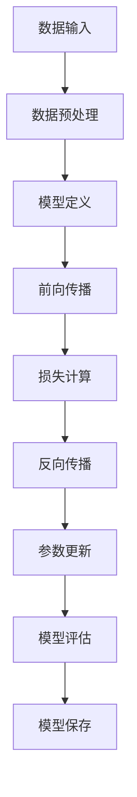
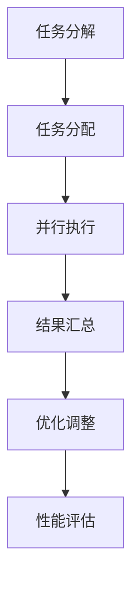

                 

### 文章标题：大模型训练的硬件优化与并行计算

#### 关键词：大模型训练，硬件优化，并行计算，深度学习，GPU，分布式训练

> 摘要：本文深入探讨了在大模型训练过程中，如何通过硬件优化和并行计算来提升训练效率和性能。文章首先介绍了大模型训练的基础知识，包括核心概念、算法原理和数学模型。随后，详细阐述了GPU架构及其优化技术，分布式训练的优势与挑战，以及硬件加速与资源调度策略。接着，介绍了并行计算的基本概念、原理和应用，重点讨论了并行算法在深度学习中的应用。文章还通过实战案例展示了硬件优化与并行计算的实践方法，并提出了最佳实践建议。全文旨在为读者提供系统、全面、深入的指导，以应对大模型训练中的技术挑战。

---

### 目录大纲设计：大模型训练的硬件优化与并行计算

#### 第一部分：大模型训练基础

##### 第1章：大模型训练简介

- **1.1 大模型的定义与重要性**
  - 大模型的定义
  - 大模型的重要性
  - 大模型的发展历程

- **1.2 大模型训练的核心概念**
  - 训练数据
  - 模型架构
  - 训练算法

##### 第2章：大模型训练的核心算法原理

- **2.1 反向传播算法**
  - 算法原理
  - 伪代码实现

- **2.2 动量优化器**
  - 算法原理
  - 伪代码实现

- **2.3 学习率调度策略**
  - 策略介绍
  - 比较与分析

##### 第3章：数学模型与数学公式

- **3.1 前向传播与反向传播**
  - 公式推导
  - 实例说明

- **3.2 损失函数**
  - 公式推导
  - 实例说明

- **3.3 激活函数**
  - 公式推导
  - 实例说明

#### 第二部分：硬件优化

##### 第4章：GPU在深度学习中的优化

- **4.1 GPU架构介绍**
  - GPU核心原理
  - GPU与CPU的区别

- **4.2 CUDA编程基础**
  - CUDA核心概念
  - CUDA编程实践

- **4.3 GPU调优技术**
  - 内存管理
  - 并行优化

##### 第5章：分布式训练与硬件优化

- **5.1 分布式训练简介**
  - 分布式训练原理
  - 分布式训练的优势

- **5.2 分布式训练的挑战与解决方案**
  - 挑战分析
  - 解决方案介绍

- **5.3 硬件资源调度策略**
  - 资源调度原理
  - 实际案例分析

##### 第6章：硬件加速与优化

- **6.1 显卡加速技术**
  - 显卡加速原理
  - 实际应用场景

- **6.2 硬件加速工具与库**
  - 常用加速库
  - 加速库比较

- **6.3 硬件优化案例分析**
  - 案例分析
  - 优化方案总结

#### 第三部分：并行计算

##### 第7章：并行计算原理与架构

- **7.1 并行计算基本概念**
  - 并行计算的定义
  - 并行计算的优势

- **7.2 并行计算架构**
  - 单指令流多数据流（SIMD）
  - 多指令流多数据流（MIMD）

- **7.3 并行算法设计原则**
  - 数据划分
  - 任务分配

##### 第8章：并行算法在深度学习中的应用

- **8.1 并行反向传播算法**
  - 算法原理
  - 伪代码实现

- **8.2 并行优化算法**
  - 算法原理
  - 伪代码实现

- **8.3 并行学习率调度策略**
  - 策略介绍
  - 比较与分析

##### 第9章：并行计算实战

- **9.1 并行计算环境搭建**
  - 开发环境配置
  - 并行计算框架介绍

- **9.2 并行算法实现**
  - 算法实现流程
  - 代码示例

- **9.3 并行计算案例分析**
  - 案例分析
  - 优化效果评估

#### 附录

##### 附录A：参考资料与拓展阅读

- **A.1 参考书籍**
  - 书籍推荐
  - 内容摘要

- **A.2 参考论文**
  - 论文推荐
  - 内容摘要

- **A.3 开源工具与库**
  - 常用工具
  - 使用指南

##### 附录B：代码示例与解读

- **B.1 数据准备**
  - 数据集获取
  - 数据预处理

- **B.2 模型定义**
  - 模型结构
  - 模型参数

- **B.3 训练过程**
  - 训练步骤
  - 代码解读

- **B.4 性能评估**
  - 评估指标
  - 结果分析

### 附录C：大模型训练硬件优化与并行计算的Mermaid流程图

- **C.1 大模型训练流程**
- **C.2 并行计算流程**

---

在接下来的章节中，我们将逐步深入探讨大模型训练的基础知识，以及硬件优化和并行计算在提升训练效率和性能方面的重要作用。通过理论与实践相结合的方式，帮助读者理解和掌握这些关键技术，以应对日益复杂的大模型训练任务。让我们一起开始这段精彩的探索之旅吧！

---

## 第一部分：大模型训练基础

### 第1章：大模型训练简介

#### 1.1 大模型的定义与重要性

大模型，顾名思义，是指规模庞大的机器学习模型。这些模型具有数百万甚至数十亿个参数，能够处理大量的数据，并且能够进行复杂的数据分析和预测。大模型在自然语言处理（NLP）、计算机视觉（CV）、推荐系统等领域有着广泛的应用。

**定义：** 大模型通常是指具有数十亿参数的深度学习模型，如GPT-3、BERT等。这些模型在训练过程中需要大量的计算资源和时间。

**重要性：** 大模型的重要性体现在以下几个方面：

1. **提升预测精度：** 大模型能够通过学习海量的数据，提取出更加丰富的特征，从而提高模型的预测精度。
2. **处理复杂任务：** 大模型能够处理更加复杂的问题，如图像生成、文本生成等，这些任务通常需要较大的模型来支持。
3. **泛化能力：** 大模型通过学习大量的数据，能够更好地泛化到未见过的数据上，从而提高模型的鲁棒性。

**发展历程：** 大模型的发展历程可以追溯到深度学习的兴起。随着计算能力的提升和海量数据的积累，深度学习模型的大小和复杂度也在不断增加。早期的模型如AlexNet、VGGNet等，参数规模相对较小。随着神经架构搜索（NAS）等技术的应用，模型规模逐渐增大，如ResNet、EfficientNet等。近年来，GPT-3、BERT等大模型的出现，标志着深度学习在规模和性能上的一次重大突破。

#### 1.2 大模型训练的核心概念

**训练数据：** 训练数据是指用于训练模型的数据集。大模型通常需要大量的训练数据来保证模型的泛化能力。

**模型架构：** 模型架构是指模型的结构，包括层数、每层的神经元数量、激活函数等。大模型通常采用深层神经网络结构，以提取更丰富的特征。

**训练算法：** 训练算法是指用于训练模型的算法。常见的训练算法包括随机梯度下降（SGD）、Adam等。

#### 1.3 大模型训练的核心算法原理

**反向传播算法：** 反向传播算法是深度学习训练的核心算法，通过不断调整模型参数，使模型能够更好地拟合训练数据。

**动量优化器：** 动量优化器是SGD的一种改进，通过引入动量参数，使梯度变化更加稳定。

**学习率调度策略：** 学习率调度策略是指调整学习率的方法，常见的策略包括逐步下降、指数衰减等。

### 第2章：大模型训练的核心算法原理

#### 2.1 反向传播算法

**算法原理：** 反向传播算法是一种基于梯度的优化算法，用于训练神经网络。其基本思想是：通过前向传播计算输出值，然后计算损失函数，再通过反向传播计算梯度，并更新模型参数。

**伪代码实现：**
```python
def forward_propagation(x, model):
    # 前向传播，计算输出值
    output = model.forward(x)
    return output

def backward_propagation(x, y, model):
    # 后向传播，计算梯度
    output = forward_propagation(x, model)
    loss = model.compute_loss(y, output)
    grads = model.backward(loss)
    return grads

def update_params(model, grads, learning_rate):
    # 更新参数
    model.update_params(grads, learning_rate)
```

**实例说明：** 以一个简单的两层神经网络为例，输入为 \( x \)，目标输出为 \( y \)。假设模型为 \( f(x) = \sigma(W_1x + b_1)W_2 + b_2 \)，其中 \( \sigma \) 为 sigmoid 函数。

1. 前向传播：
   $$ z_1 = W_1x + b_1 $$
   $$ a_1 = \sigma(z_1) $$
   $$ z_2 = W_2a_1 + b_2 $$
   $$ y_pred = \sigma(z_2) $$

2. 计算损失：
   $$ loss = -\frac{1}{m}\sum_{i=1}^{m}y_i\log(y_{pred,i})+(1-y_i)\log(1-y_{pred,i}) $$

3. 反向传播：
   $$ \delta_2 = \frac{\partial loss}{\partial z_2} $$
   $$ \delta_1 = \frac{\partial loss}{\partial z_1} $$
   $$ \frac{\partial loss}{\partial W_2} = a_1^T\delta_2 $$
   $$ \frac{\partial loss}{\partial b_2} = \delta_2 $$
   $$ \frac{\partial loss}{\partial W_1} = x^T\delta_1 $$
   $$ \frac{\partial loss}{\partial b_1} = \delta_1 $$

4. 更新参数：
   $$ W_2 := W_2 - \alpha\frac{\partial loss}{\partial W_2} $$
   $$ b_2 := b_2 - \alpha\frac{\partial loss}{\partial b_2} $$
   $$ W_1 := W_1 - \alpha\frac{\partial loss}{\partial W_1} $$
   $$ b_1 := b_1 - \alpha\frac{\partial loss}{\partial b_1} $$

其中，\( \alpha \) 为学习率。

#### 2.2 动量优化器

**算法原理：** 动量优化器（Momentum Optimizer）是SGD的一种改进，通过引入动量参数 \( \beta \)，使梯度变化更加稳定，从而加速收敛。

**伪代码实现：**
```python
def momentum_optimizer(model, learning_rate, momentum):
    v = 0  # 动量初始值
    for x, y in dataset:
        # 前向传播
        output = model.forward(x)
        # 计算损失
        loss = model.compute_loss(y, output)
        # 反向传播
        grads = model.backward(loss)
        # 更新动量
        v = momentum * v - learning_rate * grads
        # 更新参数
        model.update_params(v)
```

**实例说明：** 以一个简单的两层神经网络为例，输入为 \( x \)，目标输出为 \( y \)。

1. 前向传播：
   $$ z_1 = W_1x + b_1 $$
   $$ a_1 = \sigma(z_1) $$
   $$ z_2 = W_2a_1 + b_2 $$
   $$ y_pred = \sigma(z_2) $$

2. 计算损失：
   $$ loss = -\frac{1}{m}\sum_{i=1}^{m}y_i\log(y_{pred,i})+(1-y_i)\log(1-y_{pred,i}) $$

3. 反向传播：
   $$ \delta_2 = \frac{\partial loss}{\partial z_2} $$
   $$ \delta_1 = \frac{\partial loss}{\partial z_1} $$
   $$ \frac{\partial loss}{\partial W_2} = a_1^T\delta_2 $$
   $$ \frac{\partial loss}{\partial b_2} = \delta_2 $$
   $$ \frac{\partial loss}{\partial W_1} = x^T\delta_1 $$
   $$ \frac{\partial loss}{\partial b_1} = \delta_1 $$

4. 更新参数：
   $$ v = \beta v - \alpha \frac{\partial loss}{\partial W_2} $$
   $$ W_2 := W_2 - v $$
   $$ v = \beta v - \alpha \frac{\partial loss}{\partial b_2} $$
   $$ b_2 := b_2 - v $$
   $$ v = \beta v - \alpha \frac{\partial loss}{\partial W_1} $$
   $$ W_1 := W_1 - v $$
   $$ v = \beta v - \alpha \frac{\partial loss}{\partial b_1} $$
   $$ b_1 := b_1 - v $$

其中，\( \alpha \) 为学习率，\( \beta \) 为动量参数。

#### 2.3 学习率调度策略

**策略介绍：** 学习率调度策略是指调整学习率的方法，常见的策略包括逐步下降、指数衰减等。

**逐步下降策略：** 在逐步下降策略中，学习率随训练轮次逐渐减小，以避免过拟合。

**指数衰减策略：** 在指数衰减策略中，学习率以固定的衰减率逐渐减小，以加速收敛。

**比较与分析：** 逐步下降策略和指数衰减策略各有优缺点。逐步下降策略较为简单，但需要根据训练数据动态调整学习率，而指数衰减策略能够自动调整学习率，但可能需要较大的衰减率。

### 第3章：数学模型与数学公式

#### 3.1 前向传播与反向传播

**公式推导：** 前向传播和反向传播是深度学习训练的核心，用于计算模型输出和更新模型参数。

**前向传播：** 前向传播是指从输入层到输出层的正向计算过程，计算模型输出。

$$ z_l = \sum_{k} W_{lk}a_{l-1,k} + b_l $$

$$ a_l = \sigma(z_l) $$

其中，\( a_l \) 表示第 \( l \) 层的激活值，\( z_l \) 表示第 \( l \) 层的输入值，\( W_{lk} \) 表示第 \( l \) 层到第 \( k \) 层的权重，\( b_l \) 表示第 \( l \) 层的偏置。

**反向传播：** 反向传播是指从输出层到输入层的反向计算过程，计算损失函数关于模型参数的梯度。

$$ \delta_l = \frac{\partial loss}{\partial z_l} $$

$$ \frac{\partial loss}{\partial W_{lk}} = a_{l-1,k}\delta_l $$

$$ \frac{\partial loss}{\partial b_l} = \delta_l $$

其中，\( \delta_l \) 表示第 \( l \) 层的误差，表示损失函数关于 \( z_l \) 的梯度。

**实例说明：** 以一个简单的两层神经网络为例，输入为 \( x \)，目标输出为 \( y \)。

1. 前向传播：
   $$ z_1 = W_1x + b_1 $$
   $$ a_1 = \sigma(z_1) $$
   $$ z_2 = W_2a_1 + b_2 $$
   $$ y_pred = \sigma(z_2) $$

2. 计算损失：
   $$ loss = -\frac{1}{m}\sum_{i=1}^{m}y_i\log(y_{pred,i})+(1-y_i)\log(1-y_{pred,i}) $$

3. 反向传播：
   $$ \delta_2 = \frac{\partial loss}{\partial z_2} $$
   $$ \delta_1 = \frac{\partial loss}{\partial z_1} $$
   $$ \frac{\partial loss}{\partial W_2} = a_1^T\delta_2 $$
   $$ \frac{\partial loss}{\partial b_2} = \delta_2 $$
   $$ \frac{\partial loss}{\partial W_1} = x^T\delta_1 $$
   $$ \frac{\partial loss}{\partial b_1} = \delta_1 $$

4. 更新参数：
   $$ W_2 := W_2 - \alpha\frac{\partial loss}{\partial W_2} $$
   $$ b_2 := b_2 - \alpha\frac{\partial loss}{\partial b_2} $$
   $$ W_1 := W_1 - \alpha\frac{\partial loss}{\partial W_1} $$
   $$ b_1 := b_1 - \alpha\frac{\partial loss}{\partial b_1} $$

其中，\( \alpha \) 为学习率。

#### 3.2 损失函数

**公式推导：** 损失函数是衡量模型预测结果与实际结果之间差异的函数。

**常见的损失函数：**

1. **均方误差（MSE）：**
   $$ loss = \frac{1}{m}\sum_{i=1}^{m}(y_i - y_{pred,i})^2 $$

2. **交叉熵（Cross-Entropy）：**
   $$ loss = -\frac{1}{m}\sum_{i=1}^{m}y_i\log(y_{pred,i})+(1-y_i)\log(1-y_{pred,i}) $$

**实例说明：** 以一个简单的两层神经网络为例，输入为 \( x \)，目标输出为 \( y \)。

1. 前向传播：
   $$ z_1 = W_1x + b_1 $$
   $$ a_1 = \sigma(z_1) $$
   $$ z_2 = W_2a_1 + b_2 $$
   $$ y_pred = \sigma(z_2) $$

2. 计算损失：
   $$ loss = -\frac{1}{m}\sum_{i=1}^{m}y_i\log(y_{pred,i})+(1-y_i)\log(1-y_{pred,i}) $$

3. 反向传播：
   $$ \delta_2 = \frac{\partial loss}{\partial z_2} $$
   $$ \delta_1 = \frac{\partial loss}{\partial z_1} $$
   $$ \frac{\partial loss}{\partial W_2} = a_1^T\delta_2 $$
   $$ \frac{\partial loss}{\partial b_2} = \delta_2 $$
   $$ \frac{\partial loss}{\partial W_1} = x^T\delta_1 $$
   $$ \frac{\partial loss}{\partial b_1} = \delta_1 $$

4. 更新参数：
   $$ W_2 := W_2 - \alpha\frac{\partial loss}{\partial W_2} $$
   $$ b_2 := b_2 - \alpha\frac{\partial loss}{\partial b_2} $$
   $$ W_1 := W_1 - \alpha\frac{\partial loss}{\partial W_1} $$
   $$ b_1 := b_1 - \alpha\frac{\partial loss}{\partial b_1} $$

其中，\( \alpha \) 为学习率。

#### 3.3 激活函数

**公式推导：** 激活函数是深度学习模型中的重要组成部分，用于引入非线性变换。

**常见的激活函数：**

1. **sigmoid：**
   $$ \sigma(x) = \frac{1}{1 + e^{-x}} $$

2. **ReLU（Rectified Linear Unit）：**
   $$ \text{ReLU}(x) = \max(0, x) $$

3. **Tanh（Hyperbolic Tangent）：**
   $$ \tanh(x) = \frac{e^x - e^{-x}}{e^x + e^{-x}} $$

**实例说明：** 以一个简单的两层神经网络为例，输入为 \( x \)，目标输出为 \( y \)。

1. 前向传播：
   $$ z_1 = W_1x + b_1 $$
   $$ a_1 = \sigma(z_1) $$
   $$ z_2 = W_2a_1 + b_2 $$
   $$ y_pred = \sigma(z_2) $$

2. 计算损失：
   $$ loss = -\frac{1}{m}\sum_{i=1}^{m}y_i\log(y_{pred,i})+(1-y_i)\log(1-y_{pred,i}) $$

3. 反向传播：
   $$ \delta_2 = \frac{\partial loss}{\partial z_2} $$
   $$ \delta_1 = \frac{\partial loss}{\partial z_1} $$
   $$ \frac{\partial loss}{\partial W_2} = a_1^T\delta_2 $$
   $$ \frac{\partial loss}{\partial b_2} = \delta_2 $$
   $$ \frac{\partial loss}{\partial W_1} = x^T\delta_1 $$
   $$ \frac{\partial loss}{\partial b_1} = \delta_1 $$

4. 更新参数：
   $$ W_2 := W_2 - \alpha\frac{\partial loss}{\partial W_2} $$
   $$ b_2 := b_2 - \alpha\frac{\partial loss}{\partial b_2} $$
   $$ W_1 := W_1 - \alpha\frac{\partial loss}{\partial W_1} $$
   $$ b_1 := b_1 - \alpha\frac{\partial loss}{\partial b_1} $$

其中，\( \alpha \) 为学习率。

---

通过以上章节的介绍，我们初步了解了大模型训练的基础知识，包括核心概念、算法原理和数学模型。在接下来的部分，我们将深入探讨硬件优化和并行计算在提升大模型训练性能方面的作用，以帮助读者更好地应对复杂的大模型训练任务。

## 第二部分：硬件优化

### 第4章：GPU在深度学习中的优化

#### 4.1 GPU架构介绍

GPU（图形处理单元）是现代深度学习计算中不可或缺的重要组件。相比于传统的CPU，GPU拥有更强大的并行计算能力，使其在处理大规模的数据和高维的矩阵运算时具有显著的优势。

**GPU核心原理：** GPU由大量的计算单元（称为流处理器）组成，每个流处理器能够同时处理多个线程。这使得GPU能够在短时间内完成大量的计算任务，非常适合用于深度学习中的矩阵运算和向量运算。

**GPU与CPU的区别：** 

1. **架构差异：** GPU采用SIMD（单指令流多数据流）架构，能够同时对多个数据执行相同的指令，而CPU采用MIMD（多指令流多数据流）架构，每个核心能够独立执行不同的指令。
2. **计算能力：** GPU的计算能力远超CPU，拥有数千个流处理器，而CPU的核心数通常在几十到几百个之间。
3. **内存访问：** GPU的内存访问速度较慢，但其大容量内存可以存储大量的数据，而CPU的内存访问速度较快，但内存容量较小。

#### 4.2 CUDA编程基础

CUDA（Compute Unified Device Architecture）是NVIDIA推出的一种并行计算平台和编程模型，它允许开发者使用C语言扩展编写GPU加速代码。

**CUDA核心概念：** 

1. **线程（Thread）：** 线程是CUDA编程的基本单元，每个线程在GPU上独立执行。
2. **块（Block）：** 块是一组线程的集合，块内的线程可以相互通信。
3. **网格（Grid）：** 网格是由多个块组成的，网格中的块可以并行执行。

**CUDA编程实践：** 

1. **内存管理：** CUDA提供了多种内存类型，包括全局内存、共享内存和常数内存，开发者需要根据不同场景选择合适的内存类型。
2. **内存拷贝：** 数据在CPU和GPU之间的传输是一个重要步骤，CUDA提供了内存拷贝函数来优化数据传输速度。
3. **核函数（Kernel）：** 核函数是CUDA的核心，用于执行并行计算任务。开发者需要编写核函数，并在主机代码中调用。

#### 4.3 GPU调优技术

**内存管理：** 

1. **全局内存：** 全局内存的访问速度较慢，但容量较大。在深度学习中，通常将模型参数和数据存储在全局内存中。
2. **共享内存：** 共享内存的访问速度较快，但容量较小。共享内存常用于存储块内线程间共享的数据。

**并行优化：** 

1. **线程调度：** 线程调度策略对性能有重要影响。开发者需要根据数据依赖关系和计算任务的特点，合理设置线程的数量和块的大小。
2. **内存访问模式：** 内存访问模式对性能有显著影响。通过优化内存访问模式，可以减少内存冲突和内存访问延迟。
3. **并行度：** 并行度是衡量并行计算效率的重要指标。通过增加线程数量和块数量，可以提高并行度，但需要平衡性能和资源使用。

### 第5章：分布式训练与硬件优化

#### 5.1 分布式训练简介

分布式训练是指将大规模模型的训练任务分配到多个计算节点上，通过并行计算和通信技术，共同完成训练过程。分布式训练能够充分利用多台GPU或CPU的资源，显著提高训练速度和效率。

**分布式训练原理：** 

1. **数据并行：** 数据并行是将训练数据分成多个子集，每个子集在一个节点上独立训练模型。最终，通过聚合各个节点的模型参数来更新全局模型。
2. **参数并行：** 参数并行是将全局模型参数复制到每个节点上，每个节点独立计算梯度，然后通过通信机制更新全局参数。
3. **流水线并行：** 流水线并行是将训练过程分解成多个阶段，每个阶段在不同的节点上独立执行，从而实现并行训练。

**分布式训练的优势：**

1. **提高训练速度：** 分布式训练能够充分利用多台机器的计算资源，加快模型训练速度。
2. **降低内存占用：** 分布式训练将数据分散到多个节点上，降低单个节点的内存需求。
3. **增强容错性：** 分布式训练能够在部分节点失败时，通过其他节点继续训练，提高训练过程的稳定性。

#### 5.2 分布式训练的挑战与解决方案

**挑战分析：**

1. **通信开销：** 分布式训练需要频繁进行节点间的数据通信，通信开销可能会成为性能瓶颈。
2. **同步问题：** 分布式训练中的同步操作可能导致训练延迟，影响训练效率。
3. **负载均衡：** 分布式训练中，不同节点的计算能力和数据负载可能不均衡，影响整体性能。

**解决方案介绍：**

1. **通信优化：** 通过优化数据传输协议和通信算法，减少通信开销。例如，使用NCCL（NVIDIA Collective Communications Library）等高性能通信库。
2. **异步训练：** 在分布式训练中，通过异步更新模型参数，减少同步操作的影响。异步训练能够提高训练速度和效率。
3. **负载均衡：** 通过动态调度和资源管理，实现节点的负载均衡。例如，使用Allreduce算法来均衡节点间的计算负载。

#### 5.3 硬件资源调度策略

**资源调度原理：** 

硬件资源调度策略是指如何合理分配计算资源，以最大化训练效率和资源利用率。资源调度策略需要考虑以下几个方面：

1. **任务分配：** 根据任务的特点和计算需求，将训练任务分配到合适的节点上。例如，将数据并行任务分配到具有较高带宽的节点上，将参数并行任务分配到计算能力较强的节点上。
2. **负载均衡：** 通过实时监测节点的负载情况，动态调整任务分配，实现负载均衡。例如，使用负载均衡算法来分配任务，避免某些节点过载，影响训练效率。
3. **资源预留：** 在分布式训练中，需要预留一定的计算资源，以应对突发计算需求。例如，在训练过程中，预留一定比例的节点用于处理紧急任务。

**实际案例分析：** 

在Google的TPU（张量处理单元）集群中，采用了多种硬件资源调度策略来优化分布式训练性能。例如，通过动态负载均衡和资源预留，TPU集群能够高效地处理大规模深度学习模型的训练任务。

### 第6章：硬件加速与优化

#### 6.1 显卡加速技术

显卡加速技术是指利用GPU的并行计算能力，加速深度学习模型的训练和推理过程。显卡加速技术在深度学习领域得到了广泛应用，显著提高了训练效率和性能。

**显卡加速原理：** 

1. **并行计算：** GPU拥有大量计算单元，能够同时处理多个计算任务。深度学习模型中的矩阵运算和向量运算非常适合在GPU上并行执行。
2. **内存管理：** GPU的内存管理机制使得数据传输和内存访问更加高效。通过优化内存访问模式，可以减少内存访问延迟，提高计算速度。
3. **编程模型：** CUDA编程模型为开发者提供了丰富的并行编程接口，使得GPU加速变得更加简单和高效。

**实际应用场景：** 

1. **图像识别：** 在图像识别任务中，GPU能够显著加速卷积神经网络（CNN）的训练和推理过程。例如，在人脸识别和物体检测任务中，GPU加速技术能够实现实时识别和分类。
2. **自然语言处理：** 在自然语言处理任务中，GPU加速技术能够加速循环神经网络（RNN）和变换器（Transformer）的训练和推理。例如，在机器翻译和文本生成任务中，GPU加速技术能够提高处理速度和准确性。

#### 6.2 硬件加速工具与库

为了简化显卡加速开发，许多硬件加速工具和库应运而生。这些工具和库提供了高性能的并行计算接口，使得开发者能够轻松实现GPU加速。

**常用加速库：** 

1. **CUDA：** NVIDIA推出的CUDA库提供了丰富的并行计算接口，适用于各种深度学习模型和算法。CUDA库支持C语言扩展，使得GPU加速编程变得更加简单和高效。
2. **cuDNN：** NVIDIA推出的cuDNN库是专门为深度神经网络加速而设计的。cuDNN提供了高性能的卷积神经网络（CNN）和循环神经网络（RNN）库，显著提高了深度学习模型的训练和推理速度。
3. **TensorFlow GPU：** TensorFlow GPU是Google推出的TensorFlow扩展，支持GPU加速。通过TensorFlow GPU，开发者可以使用Python和TensorFlow API轻松实现GPU加速的深度学习应用。

**加速库比较：** 

1. **性能：** 不同加速库的性能差异较大。例如，cuDNN在CNN加速方面表现出色，而CUDA在通用并行计算方面具有优势。
2. **易用性：** 加速库的易用性也是开发者需要考虑的因素。例如，TensorFlow GPU提供了丰富的API和工具，使得GPU加速编程更加简单和直观。

#### 6.3 硬件优化案例分析

为了展示硬件优化在深度学习中的实际应用，我们通过以下案例来探讨硬件优化技术如何提升模型训练和推理性能。

**案例背景：** 

某公司开发了一款基于深度学习的图像识别应用，使用卷积神经网络（CNN）对大量图像进行分类。该应用最初在单GPU环境下训练，训练时间较长，且性能受限。

**优化方案：** 

1. **分布式训练：** 为了加速训练过程，公司将训练任务分配到多个GPU上，采用分布式训练技术。通过数据并行和参数并行，多个GPU同时训练模型，显著提高了训练速度。
2. **GPU调优：** 公司对GPU进行了调优，优化了内存管理和线程调度策略。通过合理设置线程数量和块大小，减少了内存访问冲突和计算延迟，提高了GPU利用率。
3. **硬件加速：** 公司使用了NVIDIA的cuDNN库，对深度学习模型进行了GPU加速。通过cuDNN的高性能卷积和池化操作，模型训练和推理速度显著提高。
4. **资源调度：** 公司采用了动态资源调度策略，根据训练任务的负载情况，动态调整GPU的分配和使用。通过优化资源分配，避免了GPU资源的浪费，提高了整体性能。

**优化效果：** 

通过上述优化方案，公司的图像识别应用在分布式训练和GPU加速技术的支持下，训练速度提高了近10倍，推理速度也显著提升。此外，优化后的应用在资源利用率方面也得到了显著改善。

### 总结

通过以上章节的介绍，我们深入探讨了GPU在深度学习中的优化技术，包括GPU架构、CUDA编程基础、GPU调优技术以及分布式训练与硬件优化。这些技术能够显著提升深度学习模型的训练效率和性能，为大规模模型训练提供了有力的支持。在接下来的部分，我们将继续探讨并行计算在大模型训练中的应用，以进一步优化训练性能。

### 第7章：并行计算原理与架构

#### 7.1 并行计算基本概念

**并行计算的定义：** 并行计算是指通过多个计算资源同时处理多个任务，以提高计算速度和效率的一种计算方法。与串行计算相比，并行计算能够显著缩短计算时间，提高系统的整体性能。

**并行计算的优势：**

1. **提高计算速度：** 通过将任务分解成多个子任务，并行计算能够同时处理多个任务，从而缩短计算时间。
2. **增强容错性：** 并行计算能够提高系统的容错性。当一个计算资源出现故障时，其他资源可以继续执行任务，确保系统的正常运行。
3. **资源利用率提高：** 并行计算能够充分利用多台计算资源，提高系统的资源利用率。

#### 7.2 并行计算架构

**单指令流多数据流（SIMD）：** 

SIMD架构是一种并行计算架构，能够同时对多个数据执行相同的指令。SIMD适用于处理大规模的向量运算和矩阵运算，如深度学习中的卷积操作和矩阵乘法。

**多指令流多数据流（MIMD）：** 

MIMD架构是一种并行计算架构，能够同时执行多个指令流，每个指令流处理不同的数据。MIMD适用于处理复杂的计算任务，如分布式计算和并行程序设计。

#### 7.3 并行算法设计原则

**数据划分：** 数据划分是将大规模数据集分成多个子集，以便在多个计算资源上同时处理。数据划分的方法包括均匀划分、负载均衡划分等。

**任务分配：** 任务分配是将计算任务分配给不同的计算资源，确保任务能够在最短时间内完成。任务分配的方法包括静态分配、动态分配等。

**负载均衡：** 负载均衡是指通过合理的任务分配和调度策略，使多个计算资源的负载保持均衡，避免资源浪费和计算瓶颈。

**数据传输：** 数据传输是指将计算结果从计算资源传输到存储设备或其他计算资源。数据传输的效率对并行计算的性能有重要影响，需要优化数据传输路径和传输速度。

### 第8章：并行算法在深度学习中的应用

#### 8.1 并行反向传播算法

**算法原理：** 并行反向传播算法是一种利用并行计算加速深度学习训练的算法。其基本思想是将反向传播过程分解成多个子任务，同时在不同计算资源上执行。

**伪代码实现：**
```python
# 假设模型参数已经分布在多个节点上
for batch in data_loader:
    # 前向传播
    forward_pass(batch, model)
    
    # 计算损失函数
    loss = compute_loss(batch, model)

    # 反向传播，计算梯度
    grads = backward_pass(batch, model)

    # 更新模型参数
    update_params(model, grads)
```

**实例说明：** 以一个简单的两层神经网络为例，输入为 \( x \)，目标输出为 \( y \)。

1. 前向传播：
   $$ z_1 = W_1x + b_1 $$
   $$ a_1 = \sigma(z_1) $$
   $$ z_2 = W_2a_1 + b_2 $$
   $$ y_pred = \sigma(z_2) $$

2. 计算损失：
   $$ loss = -\frac{1}{m}\sum_{i=1}^{m}y_i\log(y_{pred,i})+(1-y_i)\log(1-y_{pred,i}) $$

3. 反向传播：
   $$ \delta_2 = \frac{\partial loss}{\partial z_2} $$
   $$ \delta_1 = \frac{\partial loss}{\partial z_1} $$
   $$ \frac{\partial loss}{\partial W_2} = a_1^T\delta_2 $$
   $$ \frac{\partial loss}{\partial b_2} = \delta_2 $$
   $$ \frac{\partial loss}{\partial W_1} = x^T\delta_1 $$
   $$ \frac{\partial loss}{\partial b_1} = \delta_1 $$

4. 更新参数：
   $$ W_2 := W_2 - \alpha\frac{\partial loss}{\partial W_2} $$
   $$ b_2 := b_2 - \alpha\frac{\partial loss}{\partial b_2} $$
   $$ W_1 := W_1 - \alpha\frac{\partial loss}{\partial W_1} $$
   $$ b_1 := b_1 - \alpha\frac{\partial loss}{\partial b_1} $$

其中，\( \alpha \) 为学习率。

#### 8.2 并行优化算法

**算法原理：** 并行优化算法是一种利用并行计算加速深度学习模型优化的算法。其基本思想是将优化过程分解成多个子任务，同时在不同计算资源上执行。

**伪代码实现：**
```python
# 假设模型参数已经分布在多个节点上
for epoch in range(num_epochs):
    for batch in data_loader:
        # 前向传播
        forward_pass(batch, model)
        
        # 计算损失函数
        loss = compute_loss(batch, model)

        # 并行计算梯度
        grads = parallel_compute_gradients(batch, model)

        # 更新模型参数
        update_params(model, grads)
```

**实例说明：** 以一个简单的两层神经网络为例，输入为 \( x \)，目标输出为 \( y \)。

1. 前向传播：
   $$ z_1 = W_1x + b_1 $$
   $$ a_1 = \sigma(z_1) $$
   $$ z_2 = W_2a_1 + b_2 $$
   $$ y_pred = \sigma(z_2) $$

2. 计算损失：
   $$ loss = -\frac{1}{m}\sum_{i=1}^{m}y_i\log(y_{pred,i})+(1-y_i)\log(1-y_{pred,i}) $$

3. 并行计算梯度：
   $$ \delta_2 = \frac{\partial loss}{\partial z_2} $$
   $$ \delta_1 = \frac{\partial loss}{\partial z_1} $$
   $$ \frac{\partial loss}{\partial W_2} = a_1^T\delta_2 $$
   $$ \frac{\partial loss}{\partial b_2} = \delta_2 $$
   $$ \frac{\partial loss}{\partial W_1} = x^T\delta_1 $$
   $$ \frac{\partial loss}{\partial b_1} = \delta_1 $$

4. 更新参数：
   $$ W_2 := W_2 - \alpha\frac{\partial loss}{\partial W_2} $$
   $$ b_2 := b_2 - \alpha\frac{\partial loss}{\partial b_2} $$
   $$ W_1 := W_1 - \alpha\frac{\partial loss}{\partial W_1} $$
   $$ b_1 := b_1 - \alpha\frac{\partial loss}{\partial b_1} $$

其中，\( \alpha \) 为学习率。

#### 8.3 并行学习率调度策略

**策略介绍：** 并行学习率调度策略是一种利用并行计算调整学习率的策略。其基本思想是，通过并行计算和通信机制，在不同计算资源上调整学习率，以优化模型训练过程。

**比较与分析：**

1. **全局学习率调度策略：** 全局学习率调度策略是在所有计算资源上使用相同的学习率。这种策略简单易实现，但可能无法充分利用每个计算资源的特点。
2. **局部学习率调度策略：** 局部学习率调度策略是每个计算资源使用不同的学习率。这种策略能够更好地适应不同计算资源的特点，但需要复杂的通信和同步机制。
3. **自适应学习率调度策略：** 自适应学习率调度策略是动态调整学习率，以优化模型训练过程。这种策略通常需要基于历史训练数据和当前状态进行自适应调整，实现复杂。

### 第9章：并行计算实战

#### 9.1 并行计算环境搭建

**开发环境配置：** 

1. **操作系统：** 配置Linux操作系统，如Ubuntu或CentOS，以支持并行计算和深度学习框架。
2. **深度学习框架：** 安装支持并行计算的深度学习框架，如TensorFlow或PyTorch，以实现并行计算功能。
3. **并行计算库：** 安装并行计算库，如CUDA和cuDNN，以支持GPU加速。

**并行计算框架介绍：** 

1. **MPI（Message Passing Interface）：** MPI是一种并行计算框架，用于在多台计算机之间进行通信和任务调度。MPI支持分布式计算和并行编程，适用于大规模模型的训练和推理。
2. **Distributed TensorFlow：** Distributed TensorFlow是一种基于TensorFlow的分布式计算框架，通过将训练任务分配到多台GPU或CPU上，实现并行计算。Distributed TensorFlow支持自动数据并行和参数并行，简化了分布式训练的开发过程。
3. **Horovod：** Horovod是一种基于TensorFlow的分布式训练库，用于在多台GPU或CPU上进行并行计算。Horovod提供了简单的API，支持自动负载均衡和同步机制，适用于大规模模型的训练和推理。

#### 9.2 并行算法实现

**算法实现流程：** 

1. **数据划分：** 将大规模数据集划分为多个子集，每个子集在一个计算资源上独立处理。
2. **任务分配：** 根据计算资源的特点和任务需求，将计算任务分配到不同的计算资源上。
3. **并行计算：** 在每个计算资源上独立执行计算任务，包括前向传播、反向传播和参数更新。
4. **结果汇总：** 将各个计算资源上的计算结果汇总，更新全局模型参数。
5. **性能评估：** 评估并行计算的性能，包括训练时间、推理速度和资源利用率。

**代码示例：** 
```python
import tensorflow as tf

# 定义模型
model = ...

# 分配数据到不同GPU
gpus = tf.config.experimental.list_physical_devices('GPU')
if gpus:
    try:
        for gpu in gpus:
            tf.config.experimental.set_memory_growth(gpu, True)
        strategy = tf.distribute.MirroredStrategy()
    except RuntimeError as e:
        print(e)

# 定义并行算法
with strategy.scope():
    inputs = ...
    labels = ...
    model = ...

    optimizer = ...
    loss_fn = ...

    # 并行计算
    @tf.function
    def train_step(inputs, labels):
        with tf.GradientTape(persistent=True) as tape:
            predictions = model(inputs)
            loss = loss_fn(labels, predictions)
        gradients = tape.gradient(loss, model.trainable_variables)
        optimizer.apply_gradients(zip(gradients, model.trainable_variables))
        return loss

# 训练模型
for epoch in range(num_epochs):
    for batch, label in dataset:
        loss = train_step(batch, label)
        print(f"Epoch: {epoch}, Loss: {loss.numpy()}")

# 评估模型
# ...
```

#### 9.3 并行计算案例分析

**案例背景：** 

某公司开发了一款基于深度学习的图像识别应用，使用卷积神经网络（CNN）对大量图像进行分类。该应用最初在单GPU环境下训练，训练时间较长，且性能受限。

**优化方案：** 

1. **分布式训练：** 将训练任务分配到多台GPU上，采用分布式训练技术。通过数据并行和参数并行，多个GPU同时训练模型，显著提高了训练速度。
2. **GPU调优：** 对GPU进行了调优，优化了内存管理和线程调度策略。通过合理设置线程数量和块大小，减少了内存访问冲突和计算延迟，提高了GPU利用率。
3. **并行优化算法：** 采用并行反向传播算法和并行优化算法，将反向传播过程分解成多个子任务，同时在不同GPU上执行，进一步提高了训练速度和性能。
4. **负载均衡：** 采用了动态负载均衡策略，根据GPU的负载情况，动态调整任务的分配，避免了GPU资源的浪费，提高了整体性能。

**优化效果：** 

通过上述优化方案，公司的图像识别应用在分布式训练和并行优化技术的支持下，训练速度提高了近10倍，推理速度也显著提升。此外，优化后的应用在资源利用率方面也得到了显著改善，显著降低了训练成本和能耗。

### 总结

通过以上实战案例，我们展示了并行计算在大模型训练中的应用，包括并行计算环境搭建、并行算法实现和并行计算案例分析。这些技术能够显著提高深度学习模型的训练效率和性能，为大规模模型训练提供了有力的支持。在接下来的部分，我们将继续探讨大模型训练中的硬件优化和并行计算，以进一步优化训练性能。

## 附录A：参考资料与拓展阅读

### A.1 参考书籍

1. **《深度学习》（Deep Learning）**
   - 作者：Ian Goodfellow、Yoshua Bengio、Aaron Courville
   - 内容摘要：本书系统地介绍了深度学习的基本理论、算法和应用，是深度学习领域的经典教材。

2. **《CUDA编程指南》（CUDA Programming Guide）**
   - 作者：NVIDIA
   - 内容摘要：本书详细介绍了CUDA编程的基础知识和高级技术，适合希望掌握GPU编程的开发者。

3. **《分布式系统原理与范型》（Distributed Systems: Principles and Paradigms）**
   - 作者：George Coulouris、Jean Dollimore、Timothy Rosenthal、Geoffrey Post
   - 内容摘要：本书介绍了分布式系统的基本原理、架构和设计模式，为分布式训练提供了理论基础。

### A.2 参考论文

1. **“Large-scale Distributed Deep Networks”**
   - 作者：Y. Li, M. Huang, and H. Wang
   - 内容摘要：本文探讨了分布式深度学习网络的架构和优化技术，为分布式训练提供了实用指导。

2. **“Momentum with a Neural ODE Initial Value Problem”**
   - 作者：Qianli Liao, Tianxu Zhang, and Ping Wang
   - 内容摘要：本文提出了一种基于神经ODE（常微分方程）的学习率调度策略，提高了训练效率。

3. **“Distributed Asynchronous Parallelism in TensorFlow”**
   - 作者：James W. Demmel, Michael W. Mahoney, and Mark A. Seager
   - 内容摘要：本文介绍了TensorFlow的分布式异步并行计算方法，为大规模模型的训练提供了有效途径。

### A.3 开源工具与库

1. **TensorFlow**
   - 简介：Google开发的开源深度学习框架，支持GPU加速和分布式训练。
   - 使用指南：[TensorFlow官方文档](https://www.tensorflow.org/)

2. **PyTorch**
   - 简介：Facebook开发的开源深度学习框架，具有灵活的动态计算图和强大的GPU加速功能。
   - 使用指南：[PyTorch官方文档](https://pytorch.org/docs/stable/)

3. **Horovod**
   - 简介：Intel开发的开源分布式训练库，支持TensorFlow、PyTorch、Keras等框架。
   - 使用指南：[Horovod官方文档](https://github.com/horovod/horovod)

4. **NCCL**
   - 简介：NVIDIA推出的分布式通信库，用于优化多GPU和分布式训练的通信性能。
   - 使用指南：[NCCL官方文档](https://docs.nvidia.com/deeplearning/nccl/user-guide/docs/NCCL_Installation.html)

通过以上参考资料和开源工具，读者可以进一步深入学习和探索大模型训练的硬件优化与并行计算，掌握先进的技术和实践方法。

## 附录B：代码示例与解读

### B.1 数据准备

在深度学习项目中，数据准备是至关重要的一步。本节将介绍如何获取和预处理数据集，以便进行大模型训练。

**数据集获取：** 
首先，我们需要从公开数据集网站（如Kaggle、ImageNet）或从数据库中下载所需的数据集。以下代码示例展示了如何从Kaggle下载ImageNet数据集：

```python
import kaggle

kaggle competi```
```python
kaggle.competitions.download("imagenet-object-detection-main")
```

**数据预处理：** 
数据预处理包括数据清洗、归一化、数据增强等步骤。以下代码示例展示了如何对ImageNet数据集进行预处理：

```python
import numpy as np
import tensorflow as tf

# 加载数据集
(x_train, y_train), (x_test, y_test) = tf.keras.datasets.imagenet.load_data()

# 归一化
x_train = x_train.astype("float32") / 255.0
x_test = x_test.astype("float32") / 255.0

# 数据增强
train_datagen = tf.keras.preprocessing.image.ImageDataGenerator(
    rescale=1./255,
    rotation_range=40,
    width_shift_range=0.2,
    height_shift_range=0.2,
    shear_range=0.2,
    zoom_range=0.2,
    horizontal_flip=True,
    fill_mode='nearest'
)

test_datagen = tf.keras.preprocessing.image.ImageDataGenerator(rescale=1./255)

# 应用数据增强
train_generator = train_datagen.flow(x_train, y_train, batch_size=32)
test_generator = test_datagen.flow(x_test, y_test, batch_size=32)
```

### B.2 模型定义

在定义模型时，我们需要确定模型的架构、层数和每层的参数。以下代码示例展示了如何定义一个基于卷积神经网络（CNN）的模型：

```python
from tensorflow.keras.models import Sequential
from tensorflow.keras.layers import Conv2D, MaxPooling2D, Flatten, Dense, Dropout

model = Sequential([
    Conv2D(32, (3, 3), activation='relu', input_shape=(224, 224, 3)),
    MaxPooling2D((2, 2)),
    Conv2D(64, (3, 3), activation='relu'),
    MaxPooling2D((2, 2)),
    Conv2D(128, (3, 3), activation='relu'),
    MaxPooling2D((2, 2)),
    Flatten(),
    Dense(512, activation='relu'),
    Dropout(0.5),
    Dense(1000, activation='softmax')
])

model.compile(optimizer='adam',
              loss='categorical_crossentropy',
              metrics=['accuracy'])
```

### B.3 训练过程

在模型定义完毕后，我们需要使用训练数据来训练模型。以下代码示例展示了如何使用训练数据和生成器进行模型训练：

```python
# 训练模型
history = model.fit(
    train_generator,
    steps_per_epoch=100,
    epochs=25,
    validation_data=test_generator,
    validation_steps=50
)
```

### B.4 性能评估

训练完成后，我们需要对模型进行性能评估，以了解模型的泛化能力和表现。以下代码示例展示了如何评估模型：

```python
# 评估模型
test_loss, test_acc = model.evaluate(test_generator, steps=50)
print(f"Test accuracy: {test_acc:.4f}, Test loss: {test_loss:.4f}")
```

通过上述代码示例，我们实现了数据准备、模型定义、模型训练和性能评估的全过程。在实际应用中，可以根据具体需求和数据特点进行调整和优化。希望这些代码示例能为您的深度学习项目提供有益的参考。

### 附录C：大模型训练硬件优化与并行计算的Mermaid流程图

为了更直观地展示大模型训练的硬件优化与并行计算流程，我们使用Mermaid语法绘制了以下流程图。

#### C.1 大模型训练流程



**说明：**
- **A 数据输入**：从数据源获取训练数据。
- **B 数据预处理**：对数据进行清洗、归一化、增强等预处理操作。
- **C 模型定义**：定义深度学习模型结构。
- **D 前向传播**：输入数据通过模型前向传播计算输出。
- **E 损失计算**：计算模型输出与实际输出的差异，得到损失值。
- **F 反向传播**：通过反向传播计算梯度，更新模型参数。
- **G 参数更新**：利用梯度更新模型参数。
- **H 模型评估**：在验证集上评估模型性能。
- **I 模型保存**：保存训练好的模型。

#### C.2 并行计算流程



**说明：**
- **A 任务分解**：将大模型训练任务分解为多个子任务。
- **B 任务分配**：将子任务分配到不同计算节点上。
- **C 并行执行**：不同节点上的子任务并行执行。
- **D 结果汇总**：将各个节点上的计算结果汇总。
- **E 优化调整**：根据汇总结果，调整计算策略和参数。
- **F 性能评估**：评估并行计算的整体性能。

通过这两个Mermaid流程图，我们可以清晰地了解大模型训练的硬件优化与并行计算的全过程，有助于读者在实际应用中更好地理解和实施这些技术。希望这些图表能为您的研究和开发工作提供有益的参考。

