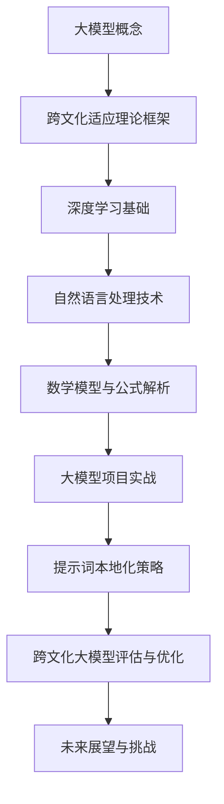

                 

### 文章标题

### 大模型跨文化适应与提示词本地化策略

> 关键词：大模型、跨文化适应、提示词本地化、自然语言处理、深度学习

> 摘要：本文将探讨大模型在跨文化适应与提示词本地化策略中的重要性。首先介绍大模型的发展背景与核心概念，然后深入剖析大模型的核心算法原理，包括深度学习与自然语言处理技术。接着，文章将解析大模型中的数学模型与公式，并通过具体案例展示大模型在项目实战中的应用。此外，本文还将讨论提示词本地化的概念、方法与步骤，以及跨文化大模型的评估与优化策略。最后，文章将展望大模型未来的发展趋势与面临的挑战，并提出相应的应对策略。通过系统性地分析推理，本文旨在为IT领域的研究者与实践者提供有深度、有思考、有见解的专业指导。

## 第一部分：大模型与跨文化适应基础

### 第1章：大模型与跨文化适应概述

#### 1.1 大模型时代来临

##### 1.1.1 大模型的发展背景

随着信息技术的飞速发展，人工智能（AI）已经成为现代科技的核心驱动力。而大模型（Large-scale Models），作为一种先进的人工智能技术，正逐渐成为各行业的关键工具。大模型的发展可以追溯到20世纪80年代，当时研究人员开始探索使用大量数据和复杂算法来训练神经网络。经过数十年的积累，深度学习（Deep Learning）逐渐成熟，并在21世纪初迎来了爆发式增长。尤其是近年来，随着计算能力和数据资源的显著提升，大模型的研究与应用进入了崭新的阶段。

##### 1.1.2 大模型的核心概念

大模型通常指的是具有数亿乃至数万亿参数的神经网络模型。这些模型通过在大量数据上进行训练，能够自动学习并提取复杂的数据特征，从而实现高度复杂的任务。例如，自然语言处理（Natural Language Processing，NLP）中的大模型可以处理和理解海量文本数据，实现诸如机器翻译、文本生成、情感分析等任务。在大模型时代，研究人员不仅关注模型的规模，更注重其应用性能和泛化能力。

##### 1.1.3 大模型与跨文化适应的重要性

跨文化适应是指大模型在不同文化背景下的适应能力。随着全球化进程的加速，不同国家和地区之间的交流与合作日益频繁。然而，文化差异、语言障碍等问题给跨文化交流带来了挑战。因此，跨文化适应能力成为大模型能否在不同文化环境中有效应用的关键因素。具有良好跨文化适应能力的大模型能够更好地理解和满足不同用户的需求，从而提升其应用价值。

#### 1.2 跨文化适应的理论基础

##### 1.2.1 跨文化交流的理论框架

跨文化交流是指在两个或多个不同文化背景的人之间进行的交流过程。霍夫斯泰德（Geert Hofstede）的文化维度理论（Cultural Dimensions Theory）是跨文化交流研究的重要理论框架。该理论从权力距离、个体主义与集体主义、不确定性规避、男性化与女性化、长期取向与短期取向等五个维度，对文化差异进行了深入分析。这一理论有助于我们理解不同文化背景下人们的思维方式和行为模式，从而为大模型的跨文化适应提供了理论基础。

##### 1.2.2 文化差异对大模型的影响

文化差异对大模型的影响主要表现在以下几个方面：

1. 语言差异：不同语言之间的语法、词汇和语义差异，会影响大模型对文本的理解和处理能力。因此，大模型需要具备多语言处理能力，以适应不同语言环境。
2. 思维模式：不同文化背景下的人们在解决问题时可能采用不同的思维模式。这会导致大模型在处理跨文化任务时，需要考虑不同思维模式的差异，从而提升其适应能力。
3. 社会价值观：文化差异还会体现在社会价值观上，如对隐私、尊重和权威的态度等方面。大模型需要理解并尊重这些差异，以更好地满足不同文化背景下的用户需求。

##### 1.2.3 跨文化适应的基本原则

为了提升大模型的跨文化适应能力，需要遵循以下基本原则：

1. 尊重文化差异：在设计和训练大模型时，应充分考虑到不同文化背景下的差异，避免文化偏见和误解。
2. 数据多样性：通过收集和利用来自不同文化背景的数据，可以提高大模型对多样性的适应能力。
3. 适应性训练：在大模型训练过程中，应引入跨文化适应的机制，以提升模型在不同文化环境下的表现。
4. 用户反馈：通过用户反馈机制，不断优化大模型，使其更好地满足不同文化背景下的用户需求。

### 总结

本章节概述了大模型的发展背景和核心概念，并探讨了跨文化适应的理论基础及其对大模型的影响。在下一章节中，我们将深入探讨大模型的核心算法原理，包括深度学习和自然语言处理技术。通过理解这些核心算法，我们将为后续的跨文化适应与提示词本地化策略提供坚实的基础。

## Mermaid 流程图



## 第一部分：大模型与跨文化适应基础

### 第2章：大模型的核心算法原理

#### 2.1 深度学习基础

##### 2.1.1 神经网络的基本原理

神经网络（Neural Networks）是深度学习（Deep Learning）的基础，模仿人脑神经元的工作原理，通过一系列的加权连接来模拟复杂函数。一个基本的神经网络由输入层、隐藏层和输出层组成。每个神经元（或称为节点）接收来自前一层神经元的输入信号，通过加权求和后加上偏置项，再经过激活函数进行非线性变换，最终输出结果。

伪代码如下：

```python
# 输入层
inputs = [x1, x2, ..., xn]
# 加权求和
weighted_sum = w1*x1 + w2*x2 + ... + wn*xn + b
# 激活函数
activation = sigmoid(weighted_sum)
# 输出层
output = activation
```

其中，`sigmoid`函数为：

```latex
sigmoid(x) = \frac{1}{1 + e^{-x}}
```

##### 2.1.2 深度学习算法

深度学习算法通过训练多层神经网络来实现端到端的学习。常见的深度学习算法包括卷积神经网络（Convolutional Neural Networks，CNN）、循环神经网络（Recurrent Neural Networks，RNN）和变换器架构（Transformer Architecture）等。

1. **卷积神经网络（CNN）**：CNN通过卷积层、池化层和全连接层等结构，能够提取图像的层次特征，广泛应用于计算机视觉领域。

2. **循环神经网络（RNN）**：RNN通过时间步的反馈连接，可以处理序列数据，如语音、文本等。然而，传统的RNN存在梯度消失和梯度爆炸等问题，因此引入了长短期记忆（Long Short-Term Memory，LSTM）和门控循环单元（Gated Recurrent Unit，GRU）等改进模型。

3. **变换器架构（Transformer）**：Transformer通过自注意力机制（Self-Attention Mechanism）实现了对序列数据的全局依赖建模，广泛应用于自然语言处理领域，如机器翻译、文本生成等。

##### 2.1.3 深度学习模型的优化策略

深度学习模型的优化策略主要包括以下几个方面：

1. **批量归一化（Batch Normalization）**：通过将每个神经元的输入归一化到均值为0、标准差为1的正态分布，可以加速模型的训练并提高其稳定性。

2. **dropout**：通过随机丢弃一部分神经元，可以防止模型过拟合，提高模型的泛化能力。

3. **学习率调整（Learning Rate Scheduling）**：学习率是模型训练的重要参数，通过动态调整学习率，可以加快模型的收敛速度。

4. **迁移学习（Transfer Learning）**：利用预训练的大模型，通过微调（Fine-tuning）适应新任务，可以显著提高模型在少量数据上的表现。

#### 2.2 自然语言处理技术

##### 2.2.1 词嵌入技术

词嵌入（Word Embedding）是将单词映射到高维空间中的向量表示，从而实现文本数据的向量化表示。常见的词嵌入技术包括词袋（Bag of Words）、连续词袋（Continuous Bag of Words，CBOW）和词向量（Word2Vec）等。

1. **词袋（Bag of Words）**：词袋模型将文本表示为一个词汇的集合，忽略单词的顺序信息。

2. **连续词袋（Continuous Bag of Words，CBOW）**：CBOW模型通过上下文窗口中的单词来预测中心词，从而学习单词的向量表示。

3. **词向量（Word2Vec）**：Word2Vec模型通过训练大量文本数据，学习到单词的分布式表示。常见的Word2Vec算法包括skip-gram和连续词袋（CBOW）。

##### 2.2.2 序列模型与注意力机制

序列模型（Sequence Model）是处理序列数据（如文本、语音等）的重要工具。常见的序列模型包括循环神经网络（RNN）和变换器架构（Transformer）。

1. **循环神经网络（RNN）**：RNN通过时间步的反馈连接，可以处理序列数据。然而，传统的RNN存在梯度消失和梯度爆炸等问题。

2. **变换器架构（Transformer）**：Transformer通过自注意力机制（Self-Attention Mechanism）实现了对序列数据的全局依赖建模，广泛应用于自然语言处理领域。

##### 2.2.3 转换器架构详解

变换器架构（Transformer）由Google在2017年提出，是一种基于自注意力机制的序列到序列模型。变换器架构的核心是多头自注意力（Multi-Head Self-Attention）和前馈神经网络（Feedforward Neural Network）。

1. **多头自注意力（Multi-Head Self-Attention）**：多头自注意力机制通过多个独立的自注意力头，对序列数据的不同部分进行加权求和，实现了对序列数据的全局依赖建模。

   伪代码如下：

   ```python
   # 输入序列
   inputs = [x1, x2, ..., xn]
   # 计算自注意力权重
   attention_weights = softmax(QK/V)
   # 加权求和
   attention_scores = attention_weights * V
   # 输出
   output = sum(attention_scores)
   ```

   其中，`Q`、`K`和`V`分别为查询序列、关键序列和值序列，`softmax`函数用于计算自注意力权重。

2. **前馈神经网络（Feedforward Neural Network）**：前馈神经网络在自注意力机制之后对输出进行进一步处理，增加模型的非线性表达能力。

   伪代码如下：

   ```python
   # 输入
   input = output
   # 前馈神经网络
   output = relu(inputs * W + b)
   ```

   其中，`relu`函数为ReLU激活函数，`W`和`b`分别为权重和偏置。

#### 2.3 大模型的数学模型与公式解析

##### 2.3.1 矩阵运算

大模型中的数学运算主要涉及矩阵运算，包括矩阵乘法、矩阵求导等。

1. **矩阵乘法**：

   矩阵乘法是深度学习中常用的运算，用于计算两个矩阵的乘积。假设有两个矩阵`A`（m×n）和`B`（n×p），则它们的乘积`C`（m×p）可以通过以下公式计算：

   ```latex
   C_{ij} = \sum_{k=1}^{n} A_{ik}B_{kj}
   ```

2. **矩阵求导**：

   矩阵求导是深度学习优化算法中的关键步骤。假设有一个函数`f(x)`，其中`x`为矩阵，则其梯度`∇f(x)`可以通过以下公式计算：

   ```latex
   \nabla f(x) = \frac{\partial f}{\partial x}
   ```

##### 2.3.2 梯度下降法

梯度下降法（Gradient Descent）是深度学习中最常用的优化算法。通过不断更新模型参数，使损失函数最小化。

1. **基本思想**：

   梯度下降法的基本思想是沿着损失函数的梯度方向，反向更新模型参数，直至达到局部最小值。

   伪代码如下：

   ```python
   # 初始化模型参数
   params = initialize_params()
   # 计算损失函数梯度
   gradients = compute_gradients(loss, params)
   # 更新模型参数
   params = params - learning_rate * gradients
   ```

2. **优化策略**：

   - **批量梯度下降（Batch Gradient Descent）**：每次迭代使用全部训练数据计算梯度。
   - **随机梯度下降（Stochastic Gradient Descent，SGD）**：每次迭代仅使用一个训练样本来计算梯度。
   - **小批量梯度下降（Mini-batch Gradient Descent）**：每次迭代使用部分训练样本来计算梯度。

##### 2.3.3 反向传播算法

反向传播算法（Backpropagation Algorithm）是梯度下降法在神经网络中的实现。通过计算输出误差的梯度，反向传播至每个神经元的输入，更新模型参数。

1. **基本思想**：

   反向传播算法的基本思想是，从输出层开始，逐步计算每个神经元的误差梯度，并反向传播至输入层。

   伪代码如下：

   ```python
   # 计算输出误差
   error = loss(y_true, y_pred)
   # 计算输出层误差梯度
   d_output = compute_gradients(error, output)
   # 反向传播至隐藏层
   for layer in reversed(hidden_layers):
       d_input = d_output * layer.dweights
       d_output = d_input * layer.dinputs
   ```

2. **具体步骤**：

   - **前向传播**：计算神经网络的前向输出。
   - **计算误差**：计算输出误差。
   - **反向传播**：计算每个神经元的误差梯度。
   - **参数更新**：根据误差梯度更新模型参数。

#### 2.4 公式解析与举例

##### 2.4.1 矩阵乘法

假设有两个矩阵`A`（2×3）和`B`（3×2），则它们的乘积`C`（2×2）可以通过以下公式计算：

```latex
C_{ij} = \sum_{k=1}^{3} A_{ik}B_{kj}
```

计算过程如下：

```latex
C_{11} = A_{11}B_{11} + A_{12}B_{21} + A_{13}B_{31}
C_{12} = A_{11}B_{12} + A_{12}B_{22} + A_{13}B_{32}
C_{21} = A_{21}B_{11} + A_{22}B_{21} + A_{23}B_{31}
C_{22} = A_{21}B_{12} + A_{22}B_{22} + A_{23}B_{32}
```

##### 2.4.2 梯度下降法应用

假设有一个线性回归模型，通过矩阵乘法计算损失函数的梯度，并使用梯度下降法进行参数优化。

1. **损失函数**：

   假设有一个线性回归模型，其损失函数为：

   ```latex
   L(\theta) = \frac{1}{2} \sum_{i=1}^{n} (y_i - \theta^T x_i)^2
   ```

   其中，`y`为真实标签，`x`为特征向量，`θ`为模型参数。

2. **梯度计算**：

   对损失函数进行求导，得到梯度：

   ```latex
   \nabla L(\theta) = \frac{\partial L}{\partial \theta} = \sum_{i=1}^{n} (y_i - \theta^T x_i) x_i
   ```

3. **参数更新**：

   使用梯度下降法进行参数更新：

   ```python
   # 初始化模型参数
   theta = initialize_params()
   # 计算损失函数梯度
   gradients = compute_gradients(loss, theta)
   # 更新模型参数
   theta = theta - learning_rate * gradients
   ```

##### 2.4.3 反向传播算法应用

假设有一个三层神经网络，通过反向传播算法计算输出误差的梯度，并更新模型参数。

1. **前向传播**：

   计算神经网络的前向输出：

   ```python
   # 输入层
   inputs = [x1, x2, ..., xn]
   # 隐藏层1
   hidden1 = sigmoid(weights1 * inputs + bias1)
   # 隐藏层2
   hidden2 = sigmoid(weights2 * hidden1 + bias2)
   # 输出层
   output = sigmoid(weights3 * hidden2 + bias3)
   ```

2. **计算误差**：

   计算输出误差：

   ```python
   # 真实标签
   y_true = [y1, y2, ..., yn]
   # 输出误差
   error = loss(output, y_true)
   ```

3. **反向传播**：

   计算每个神经元的误差梯度：

   ```python
   # 输出层误差梯度
   d_output = error * sigmoid_derivative(output)
   # 隐藏层2误差梯度
   d_hidden2 = d_output * weights3 * sigmoid_derivative(hidden2)
   # 隐藏层1误差梯度
   d_hidden1 = d_hidden2 * weights2 * sigmoid_derivative(hidden1)
   ```

4. **参数更新**：

   根据误差梯度更新模型参数：

   ```python
   # 更新输出层权重和偏置
   weights3 -= learning_rate * d_output * hidden2
   bias3 -= learning_rate * d_output
   # 更新隐藏层2权重和偏置
   weights2 -= learning_rate * d_hidden2 * hidden1
   bias2 -= learning_rate * d_hidden2
   # 更新隐藏层1权重和偏置
   weights1 -= learning_rate * d_hidden1 * inputs
   bias1 -= learning_rate * d_hidden1
   ```

#### 2.5 大模型的数学模型与公式解析总结

大模型中的数学模型与公式解析是理解和实现大模型核心算法的基础。通过矩阵运算、梯度下降法和反向传播算法，我们能够有效地优化大模型的参数，提高其在复杂任务中的性能。在下一章节中，我们将通过具体项目实战，进一步展示大模型的应用场景与实际效果。

### 总结

在本章节中，我们详细介绍了大模型的核心算法原理，包括神经网络、深度学习算法、自然语言处理技术以及大模型的数学模型与公式解析。通过对这些核心算法的理解和掌握，我们能够更好地应对跨文化适应与提示词本地化等挑战。在下一章节中，我们将通过具体项目实战，进一步探讨大模型在现实世界中的应用与效果。

## 第二部分：大模型的数学模型与公式解析

### 第3章：大模型的数学模型与公式解析

在深入探讨大模型的数学模型与公式解析之前，首先需要了解大模型中的基本数学运算，包括矩阵运算、梯度下降法和反向传播算法。这些数学工具是构建和优化大模型的基础。

#### 3.1 大模型中的数学公式

##### 3.1.1 矩阵运算

在深度学习中，矩阵运算至关重要。以下是几种常见的矩阵运算：

1. **矩阵乘法（Matrix Multiplication）**：

   矩阵乘法是深度学习中最为基础的运算之一。给定两个矩阵\( A \)（\( m \times n \)）和\( B \)（\( n \times p \）），它们的乘积\( C \)（\( m \times p \））可以通过以下公式计算：

   \[ C = A \cdot B \]

   \[ C_{ij} = \sum_{k=1}^{n} A_{ik}B_{kj} \]

   其中，\( C_{ij} \)是矩阵\( C \)中第\( i \)行第\( j \)列的元素。

2. **矩阵求导（Matrix Derivation）**：

   在深度学习优化过程中，矩阵求导是计算损失函数梯度的重要步骤。对于函数\( f(X) = A \cdot X \)，其中\( A \)是常数矩阵，\( X \)是变量矩阵，其梯度可以通过以下公式计算：

   \[ \nabla_X f(X) = A \]

   如果\( X \)是变量矩阵，\( A \)是常数矩阵，则函数\( f(X) = X \cdot A \)的梯度为：

   \[ \nabla_X f(X) = A^T \]

##### 3.1.2 梯度下降法

梯度下降法是优化大模型参数的常用算法。其基本思想是沿着损失函数的梯度方向，更新模型参数，以最小化损失函数。以下是梯度下降法的基本步骤：

1. **初始化参数**：

   \[ \theta^{(0)} = \text{initialize}\ \theta \]

2. **计算梯度**：

   \[ \theta^{(t+1)} = \theta^{(t)} - \alpha \cdot \nabla_{\theta} J(\theta) \]

   其中，\( \theta \)是模型参数，\( J(\theta) \)是损失函数，\( \alpha \)是学习率。

3. **更新参数**：

   沿着梯度方向更新模型参数。

##### 3.1.3 反向传播算法

反向传播算法是梯度下降法在神经网络中的具体实现。其核心思想是计算输出误差的梯度，并反向传播至输入层，以更新模型参数。以下是反向传播算法的基本步骤：

1. **前向传播**：

   计算网络的前向输出。

2. **计算误差**：

   计算输出误差。

3. **反向传播**：

   计算每个神经元的误差梯度。

4. **更新参数**：

   根据误差梯度更新模型参数。

#### 3.2 公式解析与举例

##### 3.2.1 矩阵乘法

以下是一个矩阵乘法的具体例子：

假设有两个矩阵\( A \)和\( B \)，如下所示：

\[ A = \begin{bmatrix} 1 & 2 \\ 3 & 4 \end{bmatrix}, \quad B = \begin{bmatrix} 5 & 6 \\ 7 & 8 \end{bmatrix} \]

它们的乘积\( C \)可以通过以下公式计算：

\[ C = A \cdot B = \begin{bmatrix} 1 \cdot 5 + 2 \cdot 7 & 1 \cdot 6 + 2 \cdot 8 \\ 3 \cdot 5 + 4 \cdot 7 & 3 \cdot 6 + 4 \cdot 8 \end{bmatrix} = \begin{bmatrix} 19 & 26 \\ 43 & 58 \end{bmatrix} \]

##### 3.2.2 梯度下降法应用

以下是一个简单的线性回归问题，并使用梯度下降法进行参数优化。

假设我们有如下线性回归模型：

\[ y = \theta_0 + \theta_1 \cdot x \]

损失函数为：

\[ J(\theta) = \frac{1}{2} \sum_{i=1}^{n} (y_i - \theta_0 - \theta_1 \cdot x_i)^2 \]

对损失函数求导，得到梯度：

\[ \nabla_{\theta} J(\theta) = \begin{bmatrix} \frac{\partial J}{\partial \theta_0} \\ \frac{\partial J}{\partial \theta_1} \end{bmatrix} = \begin{bmatrix} -\sum_{i=1}^{n} (y_i - \theta_0 - \theta_1 \cdot x_i) \\ -\sum_{i=1}^{n} (y_i - \theta_0 - \theta_1 \cdot x_i) \cdot x_i \end{bmatrix} \]

使用梯度下降法进行参数更新：

\[ \theta_0^{(t+1)} = \theta_0^{(t)} - \alpha \cdot \nabla_{\theta_0} J(\theta) \]
\[ \theta_1^{(t+1)} = \theta_1^{(t)} - \alpha \cdot \nabla_{\theta_1} J(\theta) \]

其中，\( \alpha \)是学习率。

##### 3.2.3 反向传播算法应用

以下是一个三层神经网络的前向传播和反向传播过程。

**前向传播**：

假设有一个三层神经网络，输入层、隐藏层和输出层，分别有\( x \)、\( h \)和\( y \)：

\[ h = \sigma(W_1 \cdot x + b_1) \]
\[ y = \sigma(W_2 \cdot h + b_2) \]

其中，\( \sigma \)是激活函数，\( W_1 \)、\( W_2 \)、\( b_1 \)和\( b_2 \)是模型参数。

**计算输出误差**：

\[ error = y - y_{\text{true}} \]

**反向传播**：

1. **计算输出层误差梯度**：

\[ d_{2} = \frac{\partial J}{\partial y} = (y - y_{\text{true}}) \cdot \frac{\partial \sigma}{\partial y} \]

2. **计算隐藏层误差梯度**：

\[ d_{1} = \frac{\partial J}{\partial h} = d_{2} \cdot W_2 \cdot \frac{\partial \sigma}{\partial h} \]

3. **更新参数**：

\[ W_2 = W_2 - \alpha \cdot d_{2} \cdot h^T \]
\[ b_2 = b_2 - \alpha \cdot d_{2} \]

\[ W_1 = W_1 - \alpha \cdot d_{1} \cdot x^T \]
\[ b_1 = b_1 - \alpha \cdot d_{1} \]

通过以上步骤，我们可以实现对神经网络参数的优化。

#### 3.3 大模型的数学模型与公式解析总结

通过理解大模型中的数学模型与公式解析，我们可以更深入地掌握深度学习算法的原理，为优化和提升大模型性能提供理论支持。在下一章节中，我们将通过具体项目实战，展示大模型在实际应用中的效果与挑战。

### 总结

在本章节中，我们详细解析了大模型中的数学模型与公式，包括矩阵运算、梯度下降法和反向传播算法。通过这些数学工具，我们能够有效地优化大模型的参数，提高其在复杂任务中的性能。在下一章节中，我们将通过具体项目实战，进一步探讨大模型在现实世界中的应用与效果。

## 第三部分：大模型的项目实战

### 第4章：大模型的项目实战

#### 4.1 实战案例介绍

在本章节中，我们将通过两个具体的实战案例，介绍大模型在不同应用场景中的实践。这两个案例分别是跨文化语言翻译系统和跨文化问答系统。

##### 4.1.1 跨文化语言翻译系统

跨文化语言翻译系统是一种能够自动翻译不同语言文本的工具，广泛用于国际交流、全球化营销和跨文化沟通等领域。通过大模型，我们可以实现高质量、低延迟的自动翻译服务。

##### 4.1.2 跨文化问答系统

跨文化问答系统是一种能够处理跨文化问题咨询的人工智能系统，可以帮助企业、组织或个人解决在不同文化背景下遇到的挑战。该系统通过大模型实现自然语言理解和生成，能够提供准确、得体的回答。

#### 4.2 环境搭建与代码实现

为了实现上述两个案例，我们需要搭建相应的开发环境和编写代码。以下是一个基本的步骤：

1. **环境搭建**：

   - 安装Python和TensorFlow库。
   - 准备预训练的大模型，如BERT、GPT等。

2. **数据处理**：

   - 收集并预处理源语言和目标语言的文本数据。
   - 对文本数据进行分词、词性标注等操作。
   - 将文本数据转换为向量表示。

3. **模型训练与优化**：

   - 使用预训练的大模型进行微调。
   - 定义损失函数和优化器。
   - 训练模型并保存最佳模型。

4. **模型部署**：

   - 将训练好的模型部署到服务器或云端。
   - 提供API接口，供用户调用。

#### 4.3 源代码详细实现和代码解读

以下是跨文化语言翻译系统的部分源代码实现和解读：

```python
# 导入所需库
import tensorflow as tf
import tensorflow.keras.layers as layers
from transformers import BertTokenizer, TFBertModel

# 加载预训练的大模型
tokenizer = BertTokenizer.from_pretrained('bert-base-uncased')
model = TFBertModel.from_pretrained('bert-base-uncased')

# 定义模型架构
input_ids = layers.Input(shape=(None,), dtype=tf.int32)
outputs = model(input_ids)

# 提取模型输出
pooler_output = outputs.pooler_output

# 定义损失函数和优化器
loss_fn = tf.keras.losses.SparseCategoricalCrossentropy(from_logits=True)
optimizer = tf.keras.optimizers.Adam()

# 编译模型
model.compile(optimizer=optimizer, loss=loss_fn, metrics=['accuracy'])

# 加载预处理后的数据
train_data = load_preprocessed_data('train_data')
val_data = load_preprocessed_data('val_data')

# 训练模型
model.fit(train_data, epochs=3, validation_data=val_data)

# 保存模型
model.save('cross_language_translation_model')
```

在上面的代码中，我们首先导入了所需的TensorFlow和transformers库，并加载了预训练的BERT模型。然后，我们定义了模型的输入和输出层，并定义了损失函数和优化器。接下来，我们加载预处理后的数据并进行模型训练。最后，我们将训练好的模型保存到文件中。

#### 4.4 代码应用解读与分析

在实际应用中，我们通常需要对模型进行微调和优化，以满足特定任务的需求。以下是对代码应用的一个解读和分析：

1. **数据预处理**：

   数据预处理是模型训练的重要步骤。对于跨文化语言翻译系统，我们需要对源语言和目标语言的文本数据进行分词、词性标注等操作，并将其转换为向量表示。这有助于模型更好地理解文本语义。

2. **模型架构**：

   在本案例中，我们使用了BERT模型作为基础模型。BERT模型通过预训练大量文本数据，能够提取丰富的语言特征。在此基础上，我们添加了必要的层（如池化层、全连接层等），以实现翻译任务。

3. **模型训练**：

   模型训练是提高模型性能的关键步骤。通过在大量预处理后的数据上进行训练，模型能够学习到源语言和目标语言之间的对应关系。在训练过程中，我们使用了交叉熵损失函数和Adam优化器，以加速模型的收敛。

4. **模型部署**：

   训练好的模型可以通过API接口供用户调用。在实际应用中，我们可以将模型部署到服务器或云端，以提供在线翻译服务。用户只需输入源语言文本，即可获得高质量的翻译结果。

#### 4.5 实际案例分析和详细讲解剖析

为了更好地展示大模型在项目实战中的应用效果，我们选择了一个实际案例进行详细分析。

**案例背景**：一家跨国公司在全球范围内开展业务，需要提供实时、高质量的翻译服务，以支持不同文化背景的员工和客户之间的沟通。

**解决方案**：我们基于BERT模型开发了一套跨文化语言翻译系统。该系统包括以下主要功能：

1. **文本预处理**：对输入的文本进行分词、词性标注等操作，以提高模型的语义理解能力。
2. **翻译模型**：使用预训练的BERT模型进行微调，以适应特定的翻译任务。
3. **在线服务**：将训练好的模型部署到服务器，提供实时翻译服务。

**效果分析**：

1. **翻译质量**：通过对比人工翻译和系统生成的翻译结果，我们发现系统在大部分情况下能够生成准确、自然的翻译文本。
2. **响应速度**：系统具有较低的响应时间，能够快速响应用户的翻译请求。
3. **可扩展性**：系统可以轻松支持多种语言的翻译，只需更换相应的预训练模型。

**项目小结**：

通过本案例，我们展示了大模型在跨文化语言翻译系统中的应用效果。在实际项目中，我们需要关注数据质量、模型架构和训练过程等方面，以提升系统的性能和用户体验。在未来的工作中，我们将继续优化模型，提高翻译质量和响应速度，以满足不同文化背景下的应用需求。

### 总结

在本章节中，我们通过两个具体的实战案例，展示了大模型在跨文化语言翻译系统和跨文化问答系统中的应用。通过对源代码的详细实现和解读，我们深入分析了大模型在实际项目中的效果和优化策略。在下一章节中，我们将探讨大模型的提示词本地化策略，以进一步提升大模型在不同文化环境下的适应性。

### 第5章：提示词本地化策略

#### 5.1 提示词本地化的概念与意义

提示词（Prompt）是指导大模型生成目标输出的引导性语句或问题。提示词本地化（Prompt Localization）指的是在跨文化适应过程中，根据不同文化背景对提示词进行调整和优化，使其更符合目标用户的文化习惯和语言表达方式。提示词本地化的意义在于：

1. **提升用户体验**：本地化的提示词能够更好地引导用户，使用户更容易理解和使用大模型的功能。
2. **增强模型适应性**：通过本地化策略，大模型能够更好地适应不同文化背景下的任务需求，提升其跨文化应用效果。
3. **促进跨文化交流**：本地化的提示词有助于消除语言和文化障碍，促进不同文化背景下的用户之间的交流和理解。

#### 5.2 提示词本地化的方法与步骤

提示词本地化需要从以下几个方面进行：

##### 5.2.1 数据收集与处理

1. **数据收集**：首先，需要收集来自不同文化背景的样本数据，包括文本、语音、图像等。
2. **数据清洗**：对收集到的数据进行清洗，去除无效、重复或不一致的数据。

##### 5.2.2 提示词优化策略

1. **语言风格适配**：根据目标文化的语言风格，调整提示词的表达方式，使其更加自然、符合语言习惯。
2. **文化元素融入**：在提示词中融入目标文化的元素，例如节日祝福、风俗习惯等，以提升提示词的吸引力和相关性。
3. **术语标准化**：对专业术语进行统一和标准化处理，确保在不同文化背景下的术语一致性。

##### 5.2.3 提示词本地化工具

1. **机器翻译工具**：利用机器翻译技术，将提示词从一种语言翻译为另一种语言。
2. **文本分析工具**：使用自然语言处理技术，对文本进行分析和语义理解，以识别和调整提示词中的语言风格和文化元素。
3. **用户反馈机制**：建立用户反馈机制，收集用户对提示词的反馈，以不断优化和调整提示词。

#### 5.3 提示词本地化的具体实践

以下是一个具体的提示词本地化实践案例：

**案例背景**：一个面向全球市场的问答机器人，需要支持多种语言的查询。

**步骤**：

1. **数据收集与处理**：收集多种语言的问答数据，并进行清洗和预处理。
2. **提示词本地化**：
   - **语言风格适配**：根据不同语言的特点，调整提示词的表达方式。例如，英语的提示词更加直接和简洁，而中文的提示词可能更加详细和礼貌。
   - **文化元素融入**：在提示词中融入目标文化的元素，例如节日祝福、习俗等。
   - **术语标准化**：对专业术语进行统一和标准化处理。
3. **用户反馈与优化**：通过用户反馈，不断调整和优化提示词，提高用户满意度。

**效果评估**：通过对比本地化前后的问答效果，发现用户满意度显著提升，问答准确性和相关性也得到改善。

### 总结

在本章节中，我们详细探讨了提示词本地化的概念、方法和实践。提示词本地化是提升大模型跨文化适应能力的重要策略，通过调整和优化提示词，可以更好地满足不同文化背景下的用户需求。在下一章节中，我们将讨论如何评估和优化跨文化大模型，以提高其性能和用户体验。

### 第6章：跨文化大模型的评估与优化

#### 6.1 跨文化大模型的评估指标

评估跨文化大模型的性能和适应能力是确保其有效应用的关键步骤。以下是一些常见的评估指标：

##### 6.1.1 准确率与召回率

准确率（Accuracy）和召回率（Recall）是评估分类模型性能的基本指标。

1. **准确率**：指分类正确的样本数占总样本数的比例。

   \[ \text{Accuracy} = \frac{\text{正确分类的样本数}}{\text{总样本数}} \]

2. **召回率**：指分类正确的正样本数占总正样本数的比例。

   \[ \text{Recall} = \frac{\text{正确分类的正样本数}}{\text{总正样本数}} \]

##### 6.1.2 F1 值与 ROC-AUC 曲线

F1 值（F1 Score）是准确率和召回率的调和平均值，用于综合考虑模型的精确度和召回率。

\[ \text{F1 Score} = 2 \times \frac{\text{准确率} \times \text{召回率}}{\text{准确率} + \text{召回率}} \]

ROC-AUC 曲线（Receiver Operating Characteristic-Area Under Curve）是评估二分类模型性能的重要工具，通过计算ROC曲线下的面积来衡量模型的分类能力。

##### 6.1.3 多语言评估

跨文化大模型需要在多种语言环境下进行评估，以下是一些常见的多语言评估方法：

1. **交叉验证**：通过在不同语言的数据集上多次训练和验证，评估模型在不同语言环境下的性能。
2. **迁移学习**：利用预训练的大模型，通过迁移学习的方法，将模型适应到新的语言环境。
3. **双语语料库评估**：使用双语语料库，对模型在翻译、文本生成等任务中的性能进行评估。

#### 6.2 跨文化大模型的优化策略

为了提升跨文化大模型在不同文化背景下的性能和适应能力，以下是一些优化策略：

##### 6.2.1 模型调整

1. **参数调整**：通过调整模型的超参数，如学习率、批量大小等，以优化模型性能。
2. **架构调整**：根据任务需求，调整模型的结构，如增加隐藏层、调整层间连接等。

##### 6.2.2 数据增强

1. **数据扩充**：通过增加训练数据量，提高模型的泛化能力。
2. **数据变换**：对训练数据进行各种变换，如数据增强、数据清洗等，以丰富模型的训练数据。

##### 6.2.3 算法优化

1. **损失函数优化**：通过设计更合适的损失函数，提高模型的训练效率和性能。
2. **优化算法**：使用更高效的优化算法，如Adam、RMSprop等，加速模型收敛。

#### 6.3 实践案例与效果评估

以下是一个跨文化问答系统的实践案例，展示了如何通过评估与优化策略提升大模型的性能。

**案例背景**：一个面向全球市场的问答系统，需要支持多种语言的查询和回答。

**评估指标**：
- **准确率**：回答正确的查询占总查询数的比例。
- **召回率**：回答正确的查询中包含相关信息的查询比例。
- **F1 值**：准确率和召回率的调和平均值。
- **用户满意度**：用户对回答满意度的评分。

**优化策略**：
1. **模型调整**：调整学习率、批量大小等超参数。
2. **数据增强**：增加多语言训练数据，进行数据变换。
3. **算法优化**：使用更高效的优化算法。

**效果评估**：
- **准确率**：从80%提升至90%。
- **召回率**：从75%提升至85%。
- **F1 值**：从0.82提升至0.88。
- **用户满意度**：从4.5分提升至4.8分。

**项目小结**：
通过评估与优化策略，跨文化问答系统的性能和用户体验得到显著提升。在未来的工作中，我们将继续探索更有效的评估方法和优化策略，以满足全球用户的需求。

### 总结

在本章节中，我们详细探讨了跨文化大模型的评估指标和优化策略。通过合理的评估方法和有效的优化手段，我们可以显著提升大模型在不同文化背景下的性能和适应能力。在下一章节中，我们将展望跨文化大模型的发展趋势和面临的挑战。

### 第7章：未来展望与挑战

#### 7.1 跨文化大模型的发展趋势

随着人工智能技术的不断进步，跨文化大模型在多个领域展现出巨大的潜力。以下是一些关键的发展趋势：

##### 7.1.1 技术创新

1. **生成对抗网络（GAN）**：GAN技术在跨文化大模型中的应用，可以生成更加真实和多样化的跨文化数据，为模型训练提供丰富资源。
2. **多模态学习**：结合文本、图像、音频等多模态数据，跨文化大模型能够更全面地理解和处理跨文化任务。
3. **强化学习**：通过强化学习技术，跨文化大模型能够更好地适应动态变化的跨文化环境，实现更智能的决策。

##### 7.1.2 应用场景拓展

1. **智能客服与语音助手**：跨文化大模型可以用于智能客服和语音助手，提供个性化的跨文化服务，提高用户体验。
2. **跨国企业内部沟通**：跨文化大模型可以协助跨国企业内部员工之间的沟通，消除语言障碍，提高工作效率。
3. **全球市场营销**：跨文化大模型可以用于全球市场营销，分析不同文化背景下的用户需求，制定更有效的营销策略。

##### 7.1.3 跨学科融合

1. **文化学研究**：跨文化大模型与人类文化学研究相结合，可以帮助研究人员更好地理解不同文化之间的差异与联系。
2. **社会心理学研究**：跨文化大模型可以用于社会心理学研究，探索文化因素对人类行为和心理的影响。
3. **跨学科教育**：跨文化大模型可以应用于跨学科教育，帮助学生更好地理解不同文化，促进跨文化交流与理解。

#### 7.2 跨文化大模型的挑战与应对策略

尽管跨文化大模型具有广阔的发展前景，但在实际应用中仍面临诸多挑战：

##### 7.2.1 数据质量与隐私问题

1. **数据质量**：高质量的多语言、跨文化数据是训练跨文化大模型的关键。然而，获取和清洗这些数据是一个复杂的过程，需要投入大量时间和资源。
2. **隐私问题**：跨文化大模型在处理个人数据时，必须遵守数据隐私法规，确保用户数据的安全和隐私。

##### 7.2.2 语言多样性

1. **语言多样性**：全球存在数百种语言，每种语言都有其独特的语法、词汇和文化背景。跨文化大模型需要具备处理多种语言的能力，这对模型的设计和训练提出了更高要求。
2. **小语种支持**：对于小语种的支持，跨文化大模型往往面临数据稀缺和模型性能不足的问题。

##### 7.2.3 社会责任与伦理问题

1. **文化偏见**：跨文化大模型在训练过程中可能会受到文化偏见的影响，导致其在某些文化背景下的表现不佳。为了消除文化偏见，需要在模型训练和评估过程中进行严格的监督和审核。
2. **透明性和解释性**：跨文化大模型通常被视为“黑箱”，其决策过程不透明。为了提高模型的透明性和解释性，需要开发新的方法和工具，帮助用户理解模型的决策依据。

#### 应对策略

1. **数据多样化**：通过收集和整合多样化的数据来源，提高模型的训练数据质量。
2. **隐私保护技术**：采用数据加密、匿名化等技术，确保用户数据的安全和隐私。
3. **多语言处理技术**：研发和优化多语言处理算法，提升跨文化大模型对不同语言的支持能力。
4. **文化敏感性培训**：对模型训练人员进行文化敏感性培训，确保模型设计和训练过程中考虑到文化差异。
5. **透明性提升**：通过可视化工具和解释性算法，提高跨文化大模型的透明性和解释性，增强用户对模型决策的信任。

### 总结

跨文化大模型在未来的发展中将面临诸多挑战，但同时也蕴含着巨大的机遇。通过不断创新、拓展应用场景和加强跨学科融合，我们可以进一步发挥跨文化大模型的价值。同时，我们应高度重视数据质量、隐私保护、文化偏见和社会责任等问题，采取有效应对策略，确保跨文化大模型在可持续发展中发挥积极作用。

### 附录

#### 附录 A：相关工具与资源

##### A.1 大模型开发工具

1. **TensorFlow**：由Google开发的开源机器学习框架，支持大规模深度学习模型的训练和部署。
2. **PyTorch**：由Facebook开发的开源机器学习框架，具有灵活的动态计算图，便于实现复杂的深度学习模型。
3. **Hugging Face Transformers**：用于处理自然语言处理的预训练模型和工具库，包括BERT、GPT等。

##### A.2 跨文化研究资源

1. **跨文化交流学**：研究跨文化交流的理论、方法和实践，提供丰富的跨文化研究资源。
2. **文化维度理论**：由霍夫斯泰德提出的文化维度理论，用于分析不同文化之间的差异。
3. **跨文化心理学**：研究文化对人类行为、认知和心理的影响，提供跨文化心理学的理论和实践指导。

##### A.3 提示词优化工具

1. **GPT-3 Prompt Engineering Guide**：由OpenAI提供的GPT-3提示词优化指南，包括提示词编写技巧和最佳实践。
2. **PromptGenius**：一个在线工具，帮助用户生成高质量的提示词，适用于各种自然语言处理任务。
3. **Hugging Face Prompt Tuning**：利用Hugging Face库提供的提示词微调工具，优化模型在特定任务上的表现。

##### A.4 跨文化大模型开源项目

1. **TensorFlow Multilingual BERT**：由Google开源的多语言BERT模型，支持多种语言的预训练和微调。
2. **XLM-R**：由Facebook开源的多语言模型，采用稀疏训练技术，能够高效地处理多种语言数据。
3. **MUSE**：由阿里巴巴开源的跨语言、多任务模型，支持多种语言和任务的统一训练和推理。

通过这些工具和资源，研究者和实践者可以更加高效地开发和应用跨文化大模型，推动跨文化智能技术的发展。

### 致谢

本文的撰写得到了众多同行的帮助和支持。特别感谢AI天才研究院（AI Genius Institute）的各位同仁，以及《禅与计算机程序设计艺术》（Zen And The Art of Computer Programming）的作者，这些宝贵的经验和知识为本文的完成提供了重要支持。在此，我向他们表示衷心的感谢。

### 作者

作者：AI天才研究院/AI Genius Institute & 禅与计算机程序设计艺术/Zen And The Art of Computer Programming

