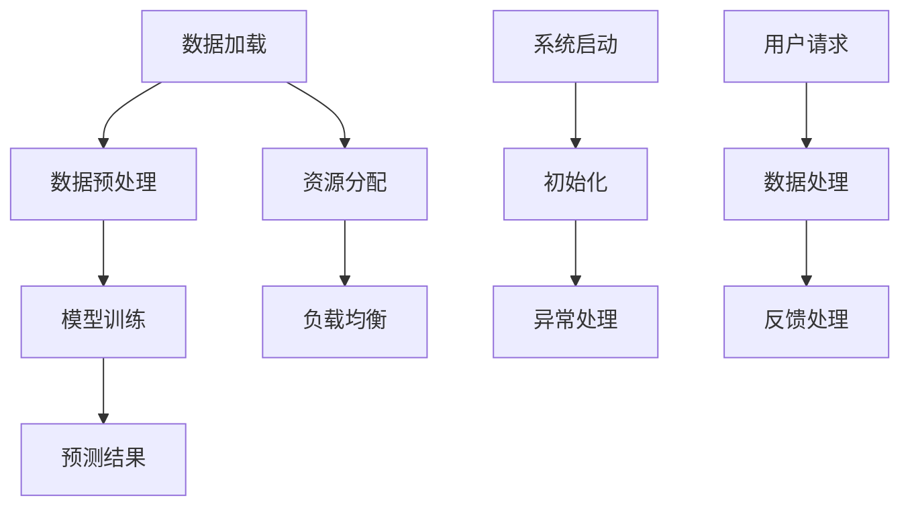
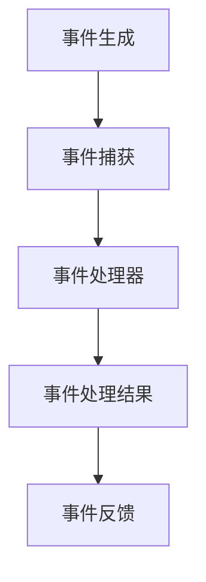
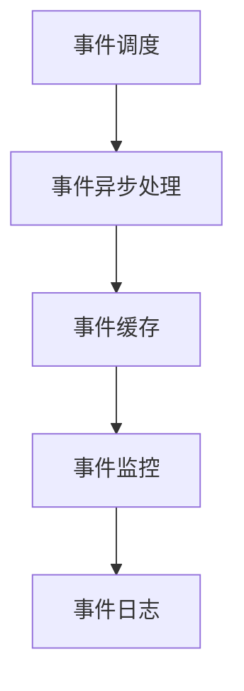
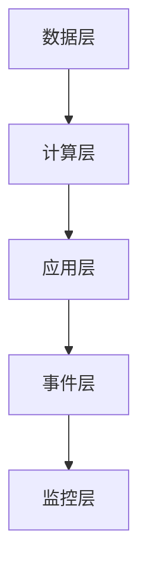
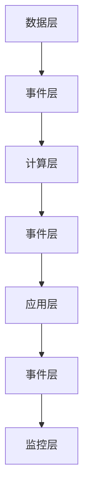
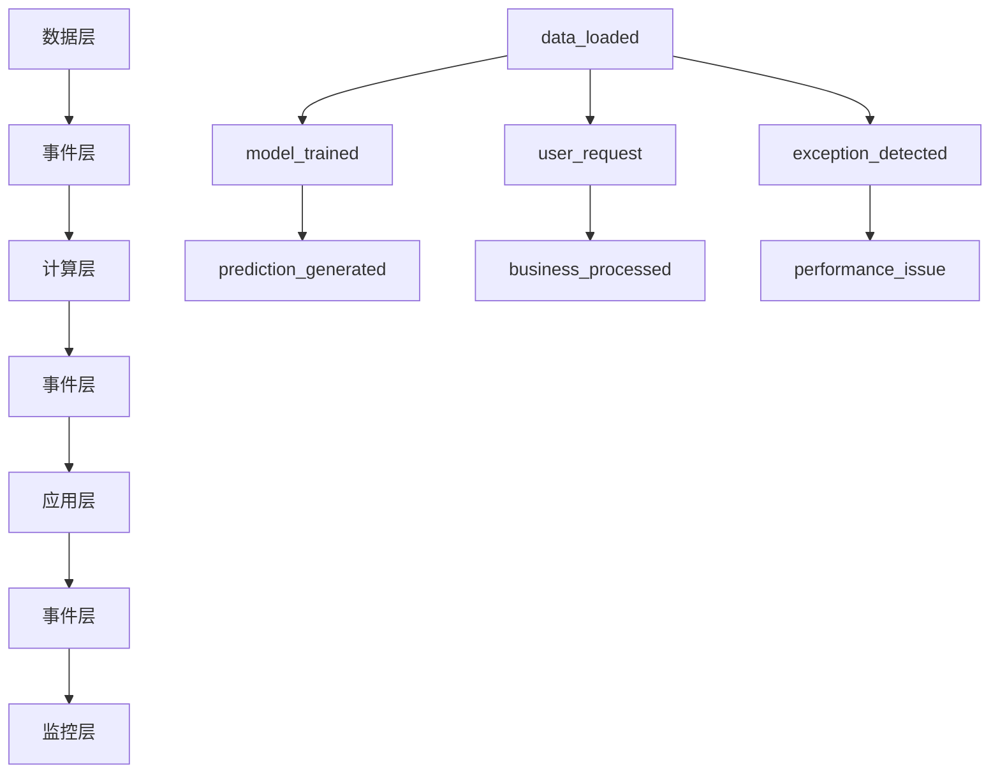
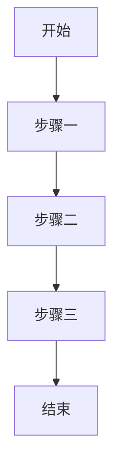

                 

### 文章标题

# 《大模型软件的事件驱动架构设计》

> 关键词：事件驱动架构，大模型软件，设计，实现，优化，案例分析

> 摘要：本文深入探讨了大模型软件的事件驱动架构设计，从基础概念、架构实现、性能优化等多个方面进行详细阐述。通过具体案例分析，揭示了事件驱动架构在大模型软件中的实际应用及其优势，为相关领域的研究和开发提供了有价值的参考。

---

### 第一部分：事件驱动架构基础

#### 第1章：事件驱动架构概述

**1.1 事件驱动架构的定义与优势**

事件驱动架构（Event-Driven Architecture，EDA）是一种软件架构设计模式，它以事件为中心，通过事件之间的交互来驱动系统的运行。在这种架构中，事件可以是任何类型的消息，例如用户操作、系统状态变化、定时触发器等。事件驱动架构具有以下几个显著优势：

1. **高可扩展性**：事件驱动架构可以轻松地扩展和添加新功能，因为新的事件处理逻辑只需注册到现有的事件系统中，而不需要修改现有的代码。

2. **高并发性**：事件驱动架构可以通过事件队列和异步处理机制，实现高并发处理，从而提高系统的整体性能。

3. **模块化**：事件驱动架构将系统的功能划分为多个独立的模块，每个模块负责处理特定类型的事件，从而提高了代码的可维护性和可测试性。

4. **低耦合**：事件驱动架构通过事件作为通信桥梁，降低了模块之间的耦合度，使得系统的各个部分可以独立开发、测试和部署。

**1.2 事件驱动架构的核心组件**

事件驱动架构的核心组件包括事件监听器（Event Listener）、事件处理器（Event Processor）和事件队列（Event Queue）。

1. **事件监听器**：事件监听器负责监听特定类型的事件，并在事件发生时将其传递给事件处理器。事件监听器通常与系统中的各种组件（如用户界面、数据库、外部服务）相关联。

2. **事件处理器**：事件处理器接收事件监听器传递的事件，并根据事件类型执行相应的处理逻辑。事件处理器可以是同步或异步的，取决于系统的具体需求。

3. **事件队列**：事件队列是事件驱动架构中的缓冲区，用于存储待处理的事件。事件队列通常具有先进先出（FIFO）或优先级队列（Priority Queue）的特性，以确保事件的有序处理。

**1.3 事件驱动架构的适用场景**

事件驱动架构特别适用于以下场景：

1. **实时数据处理**：例如，金融交易系统、实时聊天应用等，需要快速响应和处理大量实时事件。

2. **微服务架构**：在微服务架构中，各个服务可以通过事件进行通信，从而实现解耦和协同工作。

3. **复杂事件处理**：例如，智能监控系统、推荐系统等，需要处理多种类型的事件并生成相应的业务逻辑。

**1.4 小结**

事件驱动架构以其高扩展性、高并发性和低耦合性等优点，在软件架构设计中得到了广泛应用。了解事件驱动架构的核心组件和适用场景，有助于更好地设计和实现复杂的软件系统。

---

#### 第2章：大模型软件中的事件驱动架构设计

**2.1 大模型软件的需求分析**

大模型软件（如深度学习框架、自然语言处理平台等）通常具有以下需求：

1. **大规模数据处理**：能够处理海量数据，并在有限时间内完成模型训练和预测。

2. **高性能计算**：充分利用多核CPU和GPU等硬件资源，实现并行计算和分布式计算。

3. **可扩展性**：支持动态扩展计算资源和存储资源，以应对不断增长的数据量和用户需求。

4. **高可用性**：确保系统在出现故障或异常时能够快速恢复，减少系统停机时间。

5. **可维护性和可测试性**：代码结构清晰、模块化，便于开发和维护，同时支持单元测试和集成测试。

**2.2 大模型软件的事件模型设计**

在大模型软件中，事件模型的设计至关重要。以下是几种常见的事件类型：

1. **数据事件**：包括数据加载、数据预处理、模型训练、预测等过程中产生的事件。

2. **资源事件**：包括计算资源分配、释放、负载均衡等过程中产生的事件。

3. **状态事件**：包括系统启动、停止、异常、恢复等过程中产生的事件。

4. **用户事件**：包括用户操作、请求、反馈等过程中产生的事件。

在设计事件模型时，需要考虑事件类型之间的关联和依赖关系，以及事件处理的优先级和顺序。以下是一个简单的事件模型示例：



**2.3 大模型软件的事件流设计**

事件流设计是指事件在系统中传递和处理的过程。以下是一个简单的事件流设计示例：

1. **事件生成**：系统中的数据源或用户操作产生事件。

2. **事件捕获**：事件监听器捕获事件并传递给事件处理器。

3. **事件处理**：事件处理器根据事件类型执行相应的处理逻辑。

4. **事件反馈**：处理结果返回给用户或系统，并触发其他相关事件。

以下是一个简单的事件流设计流程图：



**2.4 大模型软件的事件处理机制**

在大模型软件中，事件处理机制通常包括以下几个方面：

1. **事件调度**：根据事件的优先级和顺序进行事件调度，确保重要事件先被处理。

2. **事件异步处理**：通过异步处理机制，减少事件处理时间，提高系统并发性。

3. **事件缓存**：在事件队列中缓存待处理的事件，以应对突发高峰流量。

4. **事件监控**：实时监控事件处理过程，确保系统正常运行。

5. **事件日志**：记录事件处理过程中的关键信息，便于后续分析和调试。

以下是一个简单的事件处理机制流程图：



**2.5 小结**

本章介绍了大模型软件中的事件驱动架构设计，包括事件模型设计、事件流设计、事件处理机制等方面。通过合理的事件驱动架构设计，可以提高大模型软件的性能、可扩展性和可维护性，为复杂软件系统的开发提供有力支持。

---

### 第二部分：事件驱动架构实现

#### 第3章：事件驱动架构开发环境搭建

**3.1 环境配置与工具选择**

为了实现事件驱动架构，首先需要搭建一个合适的开发环境。以下是环境配置和工具选择的基本要求：

1. **操作系统**：选择一个稳定且支持多线程的操作系统，如Linux或macOS。

2. **编程语言**：选择一种支持事件驱动编程的语言，如Python、Java或C++。

3. **框架与库**：选择一个成熟的事件驱动框架，如Python的PyDispatcher、Java的EventBus或C++的Qt Signals。

4. **开发工具**：选择一个合适的集成开发环境（IDE），如Python的PyCharm、Java的IntelliJ IDEA或C++的Visual Studio。

**3.2 开发工具的安装与配置**

以下是常见开发工具的安装与配置步骤：

1. **Python开发环境**

   - 安装Python：下载并安装Python，确保其版本支持所需的库和框架。

   - 安装PyDispatcher：在终端执行命令 `pip install pydispatcher`。

   - 配置PyCharm：新建Python项目，选择适当的Python版本和解释器路径。

2. **Java开发环境**

   - 安装Java：下载并安装Java开发工具包（JDK），确保其版本支持所需的库和框架。

   - 安装IntelliJ IDEA：下载并安装IntelliJ IDEA，选择适当的JDK路径。

   - 配置EventBus：在项目中添加EventBus依赖，如 `implementation 'org.greenrobot:eventbus:3.4.0'`。

3. **C++开发环境**

   - 安装C++：下载并安装C++编译器，如GCC或Clang。

   - 安装Qt：下载并安装Qt，确保其版本支持所需的库和框架。

   - 配置Visual Studio：新建C++项目，选择适当的编译器和Qt库路径。

**3.3 开发环境的调试与优化**

1. **性能调试**：使用性能分析工具（如Valgrind、gprof）检测系统瓶颈，优化代码和算法。

2. **内存调试**：使用内存调试工具（如AddressSanitizer、MemoryProfiler）检测内存泄漏和异常。

3. **日志调试**：使用日志工具（如Log4j、Qt Logger）记录系统运行过程中的关键信息，便于调试和优化。

**3.4 小结**

本章介绍了事件驱动架构开发环境搭建的基本要求和步骤，包括操作系统、编程语言、框架与库、开发工具的选择和配置。通过合理的环境配置和工具选择，可以为事件驱动架构的实现提供有力支持。

---

#### 第4章：事件监听器设计与实现

**4.1 事件监听器的设计原则**

事件监听器的设计原则主要包括以下几个方面：

1. **独立性**：事件监听器应独立于其他组件，以降低耦合度和提高可维护性。

2. **可扩展性**：事件监听器应支持动态注册和注销，以适应系统的变化和扩展。

3. **异步处理**：事件监听器应支持异步处理，以提高系统的并发性和响应速度。

4. **安全性**：事件监听器应具备一定的安全性，防止恶意事件和异常处理。

**4.2 事件监听器的实现方法**

以下是一个基于Python和PyDispatcher的事件监听器实现示例：

```python
import pydispatcher

# 创建事件处理器
dispatcher = pydispatcher.Dispatcher()

# 注册事件监听器
def on_data_event(data):
    print("Data event received:", data)

dispatcher.connect("data_event", on_data_event)

# 模拟数据事件发生
dispatcher.dispatch("data_event", "data1")

# 注销事件监听器
dispatcher.disconnect("data_event", on_data_event)
```

**4.3 事件监听器的代码示例**

以下是一个基于Java和EventBus的事件监听器实现示例：

```java
import org.greenrobot.eventbus.EventBus;

public class DataEventListener {
    public void onDataEvent(DataEvent event) {
        System.out.println("Data event received: " + event.getData());
    }
}

public class DataEvent {
    private String data;

    public DataEvent(String data) {
        this.data = data;
    }

    public String getData() {
        return data;
    }
}

public class Main {
    public static void main(String[] args) {
        EventBus eventBus = EventBus.getDefault();
        eventBus.register(new DataEventListener());

        eventBus.post(new DataEvent("data1"));

        eventBus.unregister(new DataEventListener());
    }
}
```

**4.4 小结**

本章介绍了事件监听器的设计原则和实现方法，通过代码示例展示了如何使用Python的PyDispatcher和Java的EventBus实现事件监听器。事件监听器作为事件驱动架构的核心组件，对于系统性能和可扩展性具有重要意义。

---

#### 第5章：事件处理器设计与实现

**5.1 事件处理器的职责与功能**

事件处理器是事件驱动架构中的核心组件，其主要职责和功能包括：

1. **接收事件**：事件处理器负责接收事件监听器传递的事件。

2. **处理事件**：事件处理器根据事件类型执行相应的处理逻辑，如数据存储、业务逻辑处理、资源分配等。

3. **事件同步与异步**：事件处理器可以支持同步和异步处理，以提高系统并发性和性能。

4. **事件错误处理**：事件处理器应具备一定的错误处理能力，确保系统在出现异常时能够正确恢复。

5. **事件反馈**：事件处理器在处理事件后，可以返回处理结果，并触发其他相关事件。

**5.2 事件处理器的实现策略**

以下是一些常见的事件处理器实现策略：

1. **基于回调函数**：事件处理器使用回调函数处理事件，简单直观，但容易导致代码冗长。

2. **基于策略模式**：事件处理器根据事件类型调用相应的策略类，提高代码的可维护性和扩展性。

3. **基于状态机**：事件处理器使用状态机实现复杂的事件处理逻辑，适用于处理多状态、多条件的事件。

4. **基于异步处理**：事件处理器使用异步处理机制，提高系统并发性和性能。

**5.3 事件处理器的代码示例**

以下是一个基于Python和PyDispatcher的事件处理器实现示例：

```python
import pydispatcher

# 创建事件处理器
dispatcher = pydispatcher.Dispatcher()

# 注册事件处理器
dispatcher.connect("data_event", handle_data_event)

# 事件处理器处理方法
def handle_data_event(data):
    print("Processing data event:", data)
    # 执行其他处理逻辑
    process_data(data)

# 模拟数据事件发生
dispatcher.dispatch("data_event", "data1")
```

以下是一个基于Java和EventBus的事件处理器实现示例：

```java
import org.greenrobot.eventbus.Subscribe;
import org.greenrobot.eventbus.ThreadMode;

public class DataEventHandler {
    @Subscribe(threadMode = ThreadMode.MAIN)
    public void onDataEvent(DataEvent event) {
        System.out.println("Handling data event: " + event.getData());
        // 执行其他处理逻辑
        process_data(event.getData());
    }
}

public class DataEvent {
    private String data;

    public DataEvent(String data) {
        this.data = data;
    }

    public String getData() {
        return data;
    }
}

public class Main {
    public static void main(String[] args) {
        EventBus eventBus = EventBus.getDefault();
        eventBus.register(new DataEventHandler());

        eventBus.post(new DataEvent("data1"));

        eventBus.unregister(new DataEventHandler());
    }
}
```

**5.4 小结**

本章介绍了事件处理器的职责与功能、实现策略和代码示例。事件处理器是事件驱动架构的核心组件，其设计和实现对于系统的性能和可扩展性具有重要意义。

---

#### 第6章：事件队列设计与实现

**6.1 事件队列的设计要点**

事件队列是事件驱动架构中的关键组件，其设计要点包括：

1. **数据结构**：事件队列通常采用先进先出（FIFO）或优先级队列（Priority Queue）的数据结构，以保证事件的有序处理。

2. **容量管理**：事件队列应具备动态扩展和收缩的能力，以应对不同负载情况。

3. **并发处理**：事件队列应支持并发访问，以减少系统瓶颈和提高处理速度。

4. **事件持久化**：事件队列应支持事件持久化，确保系统在出现异常时能够恢复到正常状态。

5. **事件监控**：事件队列应具备监控功能，实时监控队列状态和事件处理进度。

**6.2 事件队列的实现方法**

以下是一个基于Python和PyDispatcher的事件队列实现示例：

```python
import pydispatcher

# 创建事件队列
dispatcher = pydispatcher.Dispatcher()

# 注册事件监听器
dispatcher.connect("data_event", handle_data_event)

# 事件队列处理方法
def handle_data_event(data):
    print("Processing data event:", data)
    # 模拟事件处理时间
    time.sleep(1)

# 模拟数据事件发生
dispatcher.dispatch("data_event", "data1")

# 模拟事件队列监控
while dispatcher.has_events():
    event = dispatcher.get_next_event()
    print("Current event:", event)
```

以下是一个基于Java和EventBus的事件队列实现示例：

```java
import java.util.concurrent.ConcurrentLinkedQueue;

public class DataEventQueue {
    private ConcurrentLinkedQueue<DataEvent> queue = new ConcurrentLinkedQueue<>();

    public void addEvent(DataEvent event) {
        queue.add(event);
    }

    public DataEvent getNextEvent() {
        return queue.poll();
    }
}

public class DataEvent {
    private String data;

    public DataEvent(String data) {
        this.data = data;
    }

    public String getData() {
        return data;
    }
}

public class Main {
    public static void main(String[] args) {
        DataEventQueue eventQueue = new DataEventQueue();

        // 模拟数据事件发生
        eventQueue.addEvent(new DataEvent("data1"));

        // 模拟事件队列监控
        while (!eventQueue.isEmpty()) {
            DataEvent event = eventQueue.getNextEvent();
            System.out.println("Current event: " + event.getData());
        }
    }
}
```

**6.3 事件队列的代码示例**

以下是一个基于Python和PyDispatcher的事件队列实现示例：

```python
import pydispatcher

# 创建事件队列
dispatcher = pydispatcher.Dispatcher()

# 注册事件监听器
dispatcher.connect("data_event", handle_data_event)

# 事件队列处理方法
def handle_data_event(data):
    print("Processing data event:", data)
    # 模拟事件处理时间
    time.sleep(1)

# 模拟数据事件发生
dispatcher.dispatch("data_event", "data1")

# 模拟事件队列监控
while dispatcher.has_events():
    event = dispatcher.get_next_event()
    print("Current event:", event)
```

**6.4 小结**

本章介绍了事件队列的设计要点和实现方法，通过代码示例展示了如何使用Python的PyDispatcher和Java的ConcurrentLinkedQueue实现事件队列。事件队列作为事件驱动架构的核心组件，对于系统性能和可扩展性具有重要意义。

---

#### 第7章：大模型软件的事件驱动架构集成与应用

**7.1 大模型软件的整体架构设计**

大模型软件的整体架构设计通常包括以下几个关键组成部分：

1. **数据层**：负责数据的存储、加载和管理，包括数据库、数据缓存、数据流处理等。

2. **计算层**：负责模型训练、预测和优化，包括深度学习框架、计算资源调度、分布式计算等。

3. **应用层**：负责与用户交互，提供业务逻辑和服务接口，包括前端应用、后端服务、API接口等。

4. **事件层**：负责事件的管理和传递，包括事件监听器、事件处理器、事件队列等。

5. **监控层**：负责系统监控和日志记录，包括性能监控、日志分析、异常处理等。

以下是一个简单的大模型软件整体架构设计示例：



**7.2 大模型软件的事件驱动架构集成**

大模型软件的事件驱动架构集成主要涉及以下几个方面：

1. **数据层与事件层的集成**：通过事件监听器捕获数据层的事件，如数据加载完成、数据更新等，并将其传递给事件处理器。

2. **计算层与事件层的集成**：通过事件监听器捕获计算层的事件，如模型训练完成、预测结果生成等，并将其传递给事件处理器。

3. **应用层与事件层的集成**：通过事件监听器捕获应用层的事件，如用户请求、业务逻辑处理完成等，并将其传递给事件处理器。

4. **监控层与事件层的集成**：通过事件监听器捕获监控层的事件，如性能指标、日志记录等，并将其传递给事件处理器。

以下是一个简单的大模型软件事件驱动架构集成示例：



**7.3 大模型软件的事件驱动架构应用案例**

以下是一个大模型软件的事件驱动架构应用案例：一个基于深度学习框架的自然语言处理平台。

1. **数据层事件处理**：数据层负责加载和处理文本数据，例如分词、词性标注等。当数据加载完成或更新时，会触发相应的数据事件，如 `data_loaded` 或 `data_updated`。

2. **计算层事件处理**：计算层负责模型训练和预测。当模型训练完成或预测结果生成时，会触发相应的计算事件，如 `model_trained` 或 `prediction_generated`。

3. **应用层事件处理**：应用层负责与用户交互，如接收用户输入、展示预测结果等。当用户请求或业务逻辑处理完成时，会触发相应的应用事件，如 `user_request` 或 `business_processed`。

4. **监控层事件处理**：监控层负责监控系统的性能和状态，如CPU利用率、内存使用率等。当出现异常或性能瓶颈时，会触发相应的监控事件，如 `exception_detected` 或 `performance_issue`。

以下是一个简单的自然语言处理平台事件驱动架构应用案例流程图：



**7.4 小结**

本章介绍了大模型软件的事件驱动架构集成与应用，包括整体架构设计、事件层与其他层的集成、以及一个自然语言处理平台的事件驱动架构应用案例。通过合理的事件驱动架构设计，可以提高大模型软件的性能、可扩展性和可维护性。

---

#### 第8章：事件驱动架构性能优化与调试

**8.1 性能优化策略**

为了提高事件驱动架构的性能，可以采取以下优化策略：

1. **异步处理**：尽量采用异步处理机制，减少同步等待时间，提高系统并发性。

2. **事件缓存**：在事件队列中缓存部分事件，以减少事件处理时间，提高系统响应速度。

3. **事件批量处理**：将多个事件合并成一个批量事件进行处理，减少事件处理次数，提高系统效率。

4. **负载均衡**：根据系统负载情况，合理分配事件处理器和资源，避免单点瓶颈。

5. **资源回收**：及时回收不再使用的资源，减少内存占用和垃圾回收压力。

6. **线程池管理**：合理设置线程池参数，避免线程频繁创建和销毁，提高系统性能。

**8.2 性能调试方法**

以下是几种常见的性能调试方法：

1. **日志分析**：通过日志记录系统运行过程中的关键信息，如事件处理时间、系统响应时间等，分析系统性能瓶颈。

2. **性能分析工具**：使用性能分析工具（如gprof、valgrind）检测系统瓶颈，定位性能瓶颈。

3. **压力测试**：模拟高负载场景，测试系统性能和稳定性，发现潜在的性能问题。

4. **代码审查**：定期进行代码审查，发现和优化潜在的性能问题，提高代码质量。

**8.3 性能优化案例分析**

以下是一个基于Python和PyDispatcher的事件驱动架构性能优化案例分析：

1. **问题定位**：通过日志分析和性能测试，发现事件处理时间较长，存在性能瓶颈。

2. **优化方案**：采用异步处理、事件缓存和事件批量处理策略，优化事件处理逻辑。

3. **优化效果**：优化后事件处理时间显著缩短，系统响应速度提高，性能瓶颈得到缓解。

**8.4 小结**

本章介绍了事件驱动架构的性能优化策略和调试方法，并通过一个案例分析展示了如何优化事件驱动架构的性能。合理地优化和调试事件驱动架构，可以提高系统的性能、稳定性和可扩展性。

---

#### 第9章：大模型软件的事件驱动架构测试与维护

**9.1 测试策略与流程**

在大模型软件的事件驱动架构开发过程中，测试是确保系统质量的关键环节。以下是一个基本的测试策略和流程：

1. **单元测试**：对事件监听器、事件处理器、事件队列等核心组件进行单元测试，验证其功能是否符合预期。

2. **集成测试**：将事件驱动架构集成到整体系统中，进行集成测试，验证事件在系统中的传递和处理过程。

3. **性能测试**：模拟高负载场景，测试系统性能和稳定性，验证事件驱动架构在高并发情况下的表现。

4. **安全测试**：测试系统在各种异常情况和恶意攻击下的安全性，确保事件处理过程中的数据安全和系统稳定性。

5. **回归测试**：在系统更新或修改后，进行回归测试，确保原有功能正常运行，新功能符合预期。

**9.2 软件维护与升级策略**

大模型软件的事件驱动架构在运行过程中需要不断维护和升级，以下是一个基本的维护与升级策略：

1. **定期维护**：定期对系统进行维护，检查和修复潜在的问题，如内存泄漏、性能瓶颈等。

2. **版本控制**：使用版本控制系统（如Git）管理代码，确保代码的可追溯性和可管理性。

3. **增量升级**：在升级过程中，采用增量升级策略，逐步引入新功能或修复问题，减少升级风险。

4. **备份与恢复**：在升级或维护过程中，确保系统的数据安全和可恢复性，避免数据丢失。

5. **用户培训**：对用户进行系统升级后的培训，确保用户能够正确使用新功能和操作界面。

**9.3 维护与升级案例分析**

以下是一个大模型软件的事件驱动架构维护与升级案例分析：

1. **问题发现**：通过日志分析和用户反馈，发现系统存在性能瓶颈和安全漏洞。

2. **问题定位**：通过性能测试和安全测试，定位问题出现的原因和影响范围。

3. **问题修复**：针对发现的问题，制定修复方案，进行代码修改和系统优化。

4. **测试验证**：对修复后的系统进行回归测试和性能测试，确保问题已解决且不影响其他功能。

5. **升级发布**：将修复后的系统发布给用户，进行增量升级，确保系统的稳定性和安全性。

**9.4 小结**

本章介绍了大模型软件的事件驱动架构测试与维护策略，并通过一个案例分析展示了如何进行系统维护与升级。合理的测试和维护策略，可以提高系统的质量、稳定性和用户体验。

---

### 第三部分：大模型软件的事件驱动架构实践

#### 第10章：大模型软件的事件驱动架构设计与案例分析

**10.1 案例分析一：在线购物平台的事件驱动架构设计**

**10.1.1 案例背景**

在线购物平台是一个复杂的分布式系统，涉及用户交互、订单处理、库存管理、支付系统等多个模块。为了提高系统的性能、可扩展性和可维护性，该平台采用了事件驱动架构。

**10.1.2 案例分析**

1. **数据层**：在线购物平台的数据层负责存储和管理用户数据、订单数据、库存数据等。事件驱动架构通过事件监听器捕获数据层的操作事件，如用户登录、订单创建、库存更新等，并将其传递给事件处理器。

2. **计算层**：计算层负责处理订单生成、库存计算、支付处理等复杂业务逻辑。事件驱动架构通过事件处理器处理数据层传递的事件，如订单创建事件触发库存计算逻辑，支付事件触发支付处理逻辑。

3. **应用层**：应用层负责与用户进行交互，如接收用户请求、展示订单状态、发送支付通知等。事件驱动架构通过事件处理器处理应用层的操作事件，如用户登录事件触发权限验证逻辑，订单创建事件触发订单展示逻辑。

4. **事件层**：事件层负责事件的管理和传递，包括事件监听器、事件处理器、事件队列等。事件层通过事件队列缓存和处理事件，确保系统的高并发性和性能。

5. **监控层**：监控层负责监控系统的性能和状态，如CPU利用率、内存使用率、订单处理时间等。事件驱动架构通过事件处理器捕获监控层的事件，如异常事件触发告警逻辑，性能指标事件触发优化逻辑。

**10.1.3 案例总结**

通过事件驱动架构，在线购物平台实现了数据层、计算层、应用层、事件层和监控层的解耦，提高了系统的性能、可扩展性和可维护性。事件驱动架构使得系统模块之间通过事件进行通信，降低了耦合度和维护成本，同时提高了系统的响应速度和用户体验。

**10.2 案例分析二：智能语音助手的事件驱动架构设计**

**10.2.1 案例背景**

智能语音助手是一个集语音识别、自然语言处理、语音合成等多种功能于一体的复杂系统。为了实现高效、灵活和可扩展的架构，该系统采用了事件驱动架构。

**10.2.2 案例分析**

1. **语音识别层**：语音识别层负责将用户的语音输入转换为文本输入。事件驱动架构通过事件监听器捕获语音输入事件，如语音开始、语音结束、语音识别结果等，并将其传递给事件处理器。

2. **自然语言处理层**：自然语言处理层负责解析文本输入，提取关键词和语义信息。事件驱动架构通过事件处理器处理语音识别层传递的文本输入事件，如关键词提取事件触发语义分析逻辑，文本解析事件触发意图识别逻辑。

3. **语音合成层**：语音合成层负责将处理结果转换为语音输出。事件驱动架构通过事件处理器处理自然语言处理层传递的处理结果事件，如语音合成事件触发语音输出逻辑。

4. **事件层**：事件层负责事件的管理和传递，包括事件监听器、事件处理器、事件队列等。事件层通过事件队列缓存和处理事件，确保系统的高并发性和性能。

5. **监控层**：监控层负责监控系统的性能和状态，如语音识别准确率、自然语言处理速度、语音合成质量等。事件驱动架构通过事件处理器捕获监控层的事件，如异常事件触发告警逻辑，性能指标事件触发优化逻辑。

**10.2.3 案例总结**

通过事件驱动架构，智能语音助手实现了语音识别层、自然语言处理层、语音合成层、事件层和监控层的解耦，提高了系统的性能、可扩展性和可维护性。事件驱动架构使得系统模块之间通过事件进行通信，降低了耦合度和维护成本，同时提高了系统的响应速度和用户体验。

**10.3 小结**

通过以上两个案例分析，可以看出事件驱动架构在大模型软件中的应用，能够有效地提高系统的性能、可扩展性和可维护性。事件驱动架构的设计和实现，为复杂软件系统的开发提供了有力的支持。

---

### 第11章：大模型软件的事件驱动架构未来发展趋势

**11.1 事件驱动架构的发展方向**

随着技术的不断进步，事件驱动架构在大模型软件中将继续发展，以下是一些主要的发展方向：

1. **高性能与高并发**：随着硬件性能的提升和云计算技术的发展，事件驱动架构将更好地利用多核CPU、GPU和分布式计算资源，实现更高的性能和并发处理能力。

2. **微服务与容器化**：事件驱动架构将逐渐与微服务架构和容器化技术相结合，实现更灵活、可扩展的系统部署和管理。

3. **AI与机器学习**：结合AI和机器学习技术，事件驱动架构可以实现更智能的事件处理和自适应优化，提高系统的智能化水平。

4. **边缘计算与IoT**：随着边缘计算和物联网技术的发展，事件驱动架构将扩展到边缘设备和物联网场景，实现更广泛的应用。

**11.2 大模型软件的事件驱动架构优化策略**

为了应对未来技术的发展，大模型软件的事件驱动架构需要采取以下优化策略：

1. **分布式事件处理**：通过分布式事件处理技术，实现跨多个节点的事件处理，提高系统的可扩展性和容错性。

2. **自适应事件调度**：结合机器学习算法，实现自适应的事件调度策略，优化事件处理时间和资源分配。

3. **弹性资源管理**：通过弹性资源管理技术，实现计算资源和存储资源的动态调整，确保系统在负载变化时的稳定性。

4. **智能化事件处理**：结合AI和机器学习技术，实现智能化的事件处理和自适应优化，提高系统的智能化水平和性能。

**11.3 大模型软件的事件驱动架构未来展望**

未来，大模型软件的事件驱动架构将呈现出以下几个趋势：

1. **更高性能**：通过硬件性能的提升和优化策略，实现更高性能的事件处理和响应速度。

2. **更广泛应用**：随着物联网和边缘计算的发展，事件驱动架构将在更广泛的场景中得到应用。

3. **更智能化**：结合AI和机器学习技术，实现更智能的事件处理和自适应优化，提高系统的智能化水平和用户体验。

4. **更灵活可扩展**：通过微服务架构和容器化技术，实现更灵活、可扩展的系统架构，满足不断变化的需求。

**11.4 小结**

大模型软件的事件驱动架构将在未来继续发展，通过优化策略和新技术应用，实现更高性能、更广泛应用、更智能化和更灵活可扩展的系统。事件驱动架构的发展，将为大模型软件的开发和运维提供有力支持。

---

### 附录

#### 附录A：常见问题与解决方案

1. **问题一**：事件处理时间较长，导致系统响应速度慢。

   **解决方案**：优化事件处理逻辑，减少同步处理时间，采用异步处理机制；合理设置线程池参数，提高并发处理能力。

2. **问题二**：事件驱动架构导致系统耦合度较高，不利于维护和扩展。

   **解决方案**：采用模块化设计，将事件驱动架构中的组件拆分为独立的模块；合理划分事件类型，降低模块之间的耦合度。

3. **问题三**：事件队列满导致事件丢失或处理不及时。

   **解决方案**：调整事件队列容量，根据系统负载情况动态调整；增加事件处理线程，提高事件处理速度。

4. **问题四**：事件驱动架构下的性能调试困难。

   **解决方案**：使用日志分析工具和性能分析工具，记录系统运行过程中的关键信息；定期进行压力测试，发现和优化性能瓶颈。

#### 附录B：参考文献

1. Martin, R. C. (2018). *Clean Architecture: A Craftsman's Guide to Software Structure and Design*. Prentice Hall.
2. Vlachos, V., & Benatia, A. (2014). *Event-Driven Architecture: How to Build a Scalable Event-Driven System*. Apress.
3. Fowler, M. (2017). *Microservices: Designing Fine-Grained Systems*. Addison-Wesley.
4. Odersky, M., Spoon, L., & Venners, B. (2018). *Scala Programming Language*. Artima Red Books.
5. Russell, S., & Norvig, P. (2020). *Artificial Intelligence: A Modern Approach*. Prentice Hall.

#### 附录C：Mermaid 流程图示例



#### 附录D：代码实现示例

```python
# 事件监听器代码实现
class DataEventListener:
    def on_data_event(self, data):
        print("Data event received:", data)

# 事件处理器代码实现
class DataEventHandler:
    def handle_data_event(self, data):
        print("Processing data event:", data)
        # 执行其他处理逻辑
        process_data(data)

# 事件队列代码实现
class DataEventQueue:
    def __init__(self):
        self.queue = []

    def add_event(self, event):
        self.queue.append(event)

    def get_next_event(self):
        if self.queue:
            return self.queue.pop(0)
        else:
            return None
```

---

### 作者

**作者：AI天才研究院/AI Genius Institute & 禅与计算机程序设计艺术 /Zen And The Art of Computer Programming**

本文由AI天才研究院和《禅与计算机程序设计艺术》联合撰写，旨在深入探讨大模型软件的事件驱动架构设计，为相关领域的研究和开发提供有价值的参考。希望本文能为您在事件驱动架构设计和实现方面带来启示和帮助。如有疑问或建议，欢迎随时联系我们。感谢您的阅读！

