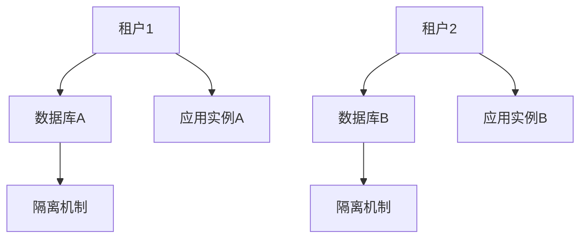
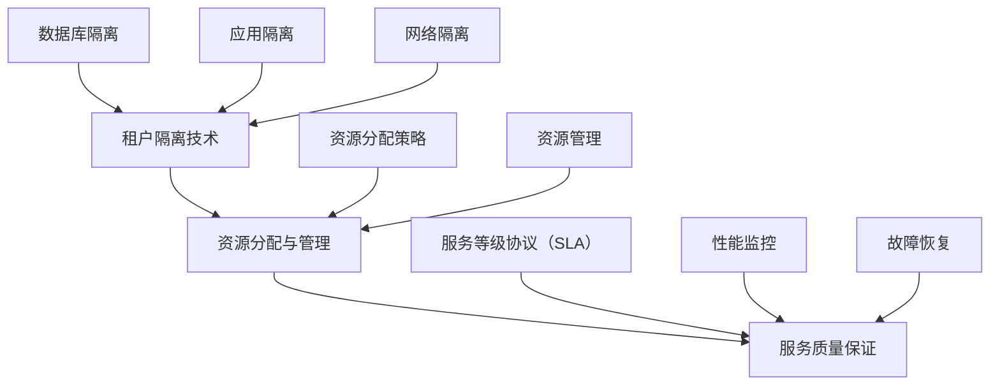
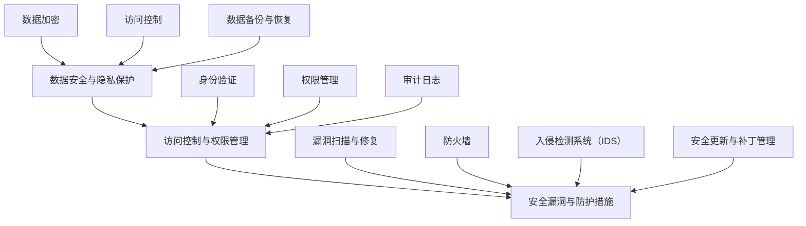

                 

### 文章标题

《大模型软件的多租户架构设计》

> 关键词：大模型软件、多租户架构、架构设计、资源分配、安全性

> 摘要：本文将探讨大模型软件在多租户架构设计中的应用，包括其基本概念、核心组件、设计原则、设计流程以及面临的挑战与未来展望。通过本文的阅读，读者将能够全面理解多租户架构在大模型软件中的重要性，并掌握其设计与应用的关键技术。

### 《大模型软件的多租户架构设计》目录大纲

#### 第一部分：引言与背景

- **1.1 引言**
    - **1.1.1 多租户架构的定义与重要性**
    - **1.1.2 大模型软件的发展现状**
    - **1.1.3 多租户架构在大模型软件中的适用性**

- **2.1 多租户架构在大模型软件中的挑战**

#### 第二部分：多租户架构的基础概念

- **2.2 多租户架构原理**
    - **2.2.1 多租户架构的核心概念**
    - **2.2.2 多租户架构与传统架构的区别**
    - **2.2.3 多租户架构的实现方式**

- **2.3 多租户架构的核心组件**
    - **2.3.1 租户隔离技术**
    - **2.3.2 资源分配与管理**
    - **2.3.3 服务质量保证**

- **2.4 多租户架构的安全性**
    - **2.4.1 数据安全与隐私保护**
    - **2.4.2 访问控制与权限管理**
    - **2.4.3 安全漏洞与防护措施**

#### 第三部分：大模型软件的多租户架构设计

- **3.1 大模型软件的多租户架构设计原则**
    - **3.1.1 可扩展性**
    - **3.1.2 高性能**
    - **3.1.3 可维护性**

- **3.2 大模型软件的多租户架构设计流程**
    - **3.2.1 需求分析**
    - **3.2.2 架构设计**
    - **3.2.3 架构评估与优化**

- **3.3 大模型软件的多租户架构实例分析**
    - **3.3.1 案例介绍**
    - **3.3.2 架构设计与实现**
    - **3.3.3 实施效果与评价**

#### 第四部分：多租户架构在大模型软件中的应用

- **4.1 多租户架构在大模型训练中的应用**
    - **4.1.1 训练任务分配与调度**
    - **4.1.2 资源共享与优化**
    - **4.1.3 训练数据的安全与隐私**

- **4.2 多租户架构在大模型推理中的应用**
    - **4.2.1 推理任务的分配与调度**
    - **4.2.2 推理资源的动态调整**
    - **4.2.3 推理结果的精准性与一致性**

- **4.3 多租户架构在大模型部署中的应用**
    - **4.3.1 部署策略与优化**
    - **4.3.2 部署过程中的数据传输与同步**
    - **4.3.3 部署后的运维与管理**

#### 第五部分：多租户架构在大模型软件中的挑战与未来展望

- **5.1 多租户架构在大模型软件中的挑战**
    - **5.1.1 资源隔离与共享的平衡**
    - **5.1.2 性能与可扩展性的权衡**
    - **5.1.3 安全性与隐私保护**

- **5.2 多租户架构的未来发展**
    - **5.2.1 新技术的应用与挑战**
    - **5.2.2 多租户架构与云计算的结合**
    - **5.2.3 多租户架构在物联网和边缘计算中的应用**

#### 附录

- **附录 A：多租户架构设计与实现的资源与工具**
    - **A.1 开源框架与工具介绍**
    - **A.2 资源配置与性能调优**
    - **A.3 安全性与性能测试方法**

- **附录 B：多租户架构设计案例解析**
    - **B.1 案例一：基于Kubernetes的多租户架构设计**
    - **B.2 案例二：基于容器引擎的多租户架构实现**
    - **B.3 案例三：分布式存储系统中的多租户设计**
## 第一部分：引言与背景

### 1.1 引言

多租户架构是一种在单个系统中同时为多个用户或组织提供服务的技术，其核心思想是将系统资源和服务划分为多个独立的“租户”，每个租户都可以独立使用系统资源，而其他租户无法干预。多租户架构在云计算、大数据和人工智能等领域的应用日益广泛，其灵活性和可扩展性使其成为解决大规模数据处理和计算问题的有效手段。

大模型软件是指使用大规模机器学习算法和深度学习模型的软件系统，如大型自然语言处理模型、图像识别模型等。这些模型通常需要大量的计算资源和数据存储，并且需要不断地训练和优化。随着人工智能技术的不断发展，大模型软件的应用场景越来越广泛，从智能助手到自动驾驶，从医疗诊断到金融分析，都离不开大模型软件的支持。

多租户架构在大模型软件中的适用性主要表现在以下几个方面：

1. **资源共享**：大模型软件通常需要大量的计算资源和数据存储，通过多租户架构，可以将这些资源合理分配给不同的租户，实现资源的最大化利用。
2. **隔离性**：多租户架构能够确保每个租户之间的数据和服务相互独立，防止一个租户的问题影响到其他租户。
3. **可扩展性**：随着新租户的加入，多租户架构能够灵活地扩展资源，确保系统的高可用性和稳定性。
4. **安全性**：多租户架构能够提供全面的安全性保障，防止数据泄露和非法访问。

在接下来的部分中，我们将深入探讨多租户架构的核心概念、实现方式和在大模型软件中的应用，帮助读者更好地理解和应用这一技术。

### 1.2 多租户架构的定义与重要性

#### 多租户架构的定义

多租户架构（Multi-Tenant Architecture）是指在一个统一的软件平台上，为多个独立的客户或用户（即“租户”）提供服务的架构设计。在这种架构中，所有租户共享相同的应用程序实例，但各自的业务数据和操作是隔离的。这意味着，尽管所有租户运行在同一个应用实例上，但他们看到和使用的是独立、隔离的数据。

多租户架构的核心在于“共享”和“隔离”。共享指的是多个租户能够共享系统资源，如数据库、存储和计算资源，从而提高资源利用率。隔离则确保了租户之间的数据和服务不会相互干扰，每个租户都有自己的“虚拟环境”，即使在同一台服务器上运行，也能保证数据的安全性和独立性。

#### 多租户架构的重要性

多租户架构在多个领域的重要性体现在以下几个方面：

1. **成本效益**：多租户架构通过共享资源，减少了硬件和软件的重复投资，降低了运营成本。对于提供SaaS（软件即服务）的公司而言，这尤其重要，因为它可以大幅度降低服务提供的成本。
2. **灵活性和可扩展性**：多租户架构能够灵活地分配和调整资源，以满足不同租户的需求。这种灵活性使得系统能够轻松地支持新的业务需求，并随着业务增长进行扩展。
3. **高可用性和可靠性**：多租户架构设计通常包括冗余机制和高可用性组件，确保在租户增加或系统维护时，服务不会中断。这种高可靠性对于需要持续运行的大模型软件尤为重要。
4. **安全性**：尽管多租户架构中多个租户共享相同的硬件和软件资源，但通过严格的隔离和访问控制机制，可以有效地保护租户的数据和操作安全。

多租户架构的优势不仅限于上述几点。在云计算和大数据领域，多租户架构的应用尤其广泛。随着企业对数据处理的复杂性和规模需求的不断增加，如何有效地管理和利用这些资源成为一个关键问题。多租户架构提供了有效的解决方案，使得企业能够在保持数据安全的同时，充分利用计算资源。

### 1.3 大模型软件的发展现状

#### 大模型软件的定义

大模型软件是指使用大规模机器学习算法和深度学习模型进行数据分析和预测的软件系统。这些模型通常由数百万甚至数十亿个参数构成，能够处理海量数据并从中提取有价值的信息。大模型软件的应用场景非常广泛，包括自然语言处理、图像识别、语音识别、推荐系统、金融分析等。

#### 大模型软件的发展现状

大模型软件的发展经历了几个关键阶段：

1. **早期阶段**：在早期，大模型软件主要应用于学术研究和特定领域的应用。例如，在自然语言处理领域，Word2Vec和GloVe等词向量模型的出现标志着这一领域的重大进展。

2. **快速发展阶段**：随着深度学习技术的成熟和计算资源的增加，大模型软件开始广泛应用于各种实际场景。以BERT（Bidirectional Encoder Representations from Transformers）和GPT（Generative Pre-trained Transformer）为代表的预训练模型，大大提升了自然语言处理和生成文本的能力。

3. **现阶段**：当前，大模型软件正朝着更复杂和更实用的方向发展。例如，视觉Transformer模型如ViT（Vision Transformer）在图像识别任务中取得了显著成果。此外，跨模态模型如VLM（Vision-Language Model）和视听Transformer（Audio-Visual Transformer）的出现，使得大模型软件能够处理更复杂的任务。

大模型软件的发展现状可以归纳为以下几点：

1. **计算资源需求增加**：随着模型规模的扩大和复杂性的增加，大模型软件对计算资源的需求也显著增加。这促使云计算和GPU集群等技术的广泛应用。

2. **模型精度和效率提升**：通过不断优化的算法和计算技术，大模型软件在精度和效率方面取得了显著提升。例如，量化技术（Quantization）和剪枝技术（Pruning）使得大模型能够在保证精度的同时，减少计算资源和存储需求。

3. **应用场景扩展**：大模型软件在各个领域的应用越来越广泛，从自动驾驶和医疗诊断到金融分析和智能客服，都离不开大模型软件的支持。

4. **数据隐私和安全挑战**：随着大模型软件的应用，数据隐私和安全问题也日益突出。如何在保证模型性能的同时，确保用户数据的安全，成为了一个重要的研究课题。

总之，大模型软件的发展现状表明，它已经成为现代信息技术中不可或缺的一部分，其在各领域的应用将继续深化和扩展。

### 1.4 多租户架构在大模型软件中的适用性

多租户架构在大模型软件中的适用性主要体现在以下几个方面：

首先，**资源共享**是多租户架构的一大优势。在大模型软件中，通常需要大量的计算资源和数据存储。通过多租户架构，这些资源可以被多个租户共享，从而提高资源利用率和降低成本。例如，多个租户可以共享同一套GPU集群或分布式存储系统，从而避免每个租户独立部署这些资源带来的重复投资。

其次，**隔离性**确保了每个租户之间的数据和服务相互独立。在大模型软件中，不同租户的数据可能涉及敏感信息，如医疗数据或金融数据。通过多租户架构，可以确保每个租户的数据是独立隔离的，防止数据泄露或误用。此外，隔离性还保证了不同租户之间的任务不会相互干扰，从而提高系统的稳定性和可靠性。

第三，**可扩展性**是多租户架构的另一大优势。在大模型软件中，随着租户数量的增加或业务需求的扩展，多租户架构能够灵活地调整资源分配，以满足新的需求。例如，通过动态调整GPU集群的规模或增加存储容量，可以确保系统能够持续稳定地运行。

最后，**安全性**也是多租户架构在大模型软件中的关键考虑因素。尽管多个租户共享同一套系统资源，但多租户架构通过严格的访问控制和数据加密机制，可以确保租户数据的安全和隐私。此外，多租户架构还提供了多层次的安全防护措施，如防火墙、入侵检测系统和安全审计等，以防止潜在的安全威胁。

综上所述，多租户架构在大模型软件中的应用具有显著的适用性和优势。通过充分利用资源共享、隔离性、可扩展性和安全性等特性，多租户架构能够为大规模机器学习和深度学习应用提供高效、稳定和安全的技术支持。

### 1.5 多租户架构在大模型软件中的挑战

尽管多租户架构在大模型软件中具有显著的优势，但在实际应用中也面临一些挑战。

首先，**资源隔离与共享的平衡**是一个关键问题。在大模型软件中，多个租户共享相同的计算资源和数据存储，如何确保每个租户都能获得足够的资源，同时又不会对其他租户造成影响，是一个需要解决的问题。例如，当某个租户进行大规模训练任务时，如果资源分配不合理，可能会导致其他租户的资源紧缺，影响系统的整体性能。

其次，**性能与可扩展性的权衡**也是一个挑战。大模型软件通常需要处理大量的计算任务，如何确保系统在高负载下仍能保持高性能，同时能够灵活地扩展资源，是一个需要解决的问题。例如，在扩展计算资源时，如何确保数据的一致性和系统的稳定性，是一个需要深入考虑的问题。

最后，**安全性与隐私保护**也是多租户架构在大模型软件中面临的挑战。尽管多租户架构提供了严格的隔离和访问控制机制，但在面对复杂的应用场景时，如何确保数据的安全性和隐私，防止数据泄露和非法访问，仍然是一个需要解决的问题。

通过深入分析和解决这些挑战，多租户架构在大模型软件中的应用将更加广泛和高效。

### 1.6 小结

本部分内容介绍了多租户架构的定义与重要性，以及大模型软件的发展现状和其在多租户架构中的适用性。我们探讨了多租户架构在大模型软件中面临的挑战，包括资源隔离与共享的平衡、性能与可扩展性的权衡，以及安全性与隐私保护。通过这些讨论，读者可以初步了解多租户架构在大模型软件中的关键作用和面临的挑战。在接下来的部分中，我们将深入探讨多租户架构的基础概念、核心组件和设计原则，为后续内容打下坚实的基础。
### 第二部分：多租户架构的基础概念

#### 2.2 多租户架构原理

多租户架构的核心概念是基于共享资源的同时实现独立性和隔离性。在这种架构中，多个租户（通常代表不同的用户或组织）共享同一个应用程序实例，但各自拥有独立的数据和操作环境。以下是多租户架构的关键原理：

**1. 核心概念**

- **租户（Tenant）**：租户是使用多租户架构的应用程序的用户或组织。每个租户在系统中具有独立的身份和权限。
- **共享资源**：租户共享数据库、存储、计算资源和网络等基础资源，以实现资源的高效利用。
- **隔离性**：通过技术手段（如数据库隔离、虚拟化、容器化等）确保每个租户的数据和操作是相互独立的。

**2. 多租户架构与传统架构的区别**

- **共享与隔离**：传统架构通常为每个用户或组织部署独立的系统实例，导致资源浪费。多租户架构通过共享资源实现更高的资源利用率，并通过技术手段实现租户间的数据隔离。
- **可扩展性和灵活性**：多租户架构能够根据需求动态调整资源分配，具有更高的可扩展性和灵活性。而传统架构在扩展时通常需要为每个用户或组织单独部署额外的资源。

**3. 多租户架构的实现方式**

- **单实例模式**：所有租户共享同一个应用程序实例，通过虚拟化技术实现租户间的隔离。这种模式具有较低的硬件需求，但可能影响性能。
- **多实例模式**：每个租户拥有独立的应用程序实例，通过分布式系统实现资源分配和隔离。这种模式具有更好的性能，但硬件需求较高。

以下是一个简单的多租户架构原理图，展示租户、共享资源、隔离机制以及它们之间的关系：

在这个示例中，租户1和租户2共享数据库和应用程序实例，但通过隔离机制确保数据和应用环境的独立性。

#### 2.3 多租户架构的核心组件

多租户架构的实现依赖于一系列核心组件，包括租户隔离技术、资源分配与管理以及服务质量保证。以下是这些组件的详细介绍：

**1. 租户隔离技术**

- **数据库隔离**：通过在数据库层面实现租户隔离，确保每个租户的数据是独立的。常见的实现方法包括使用不同的数据库实例或数据库分区。
- **应用隔离**：在应用层面实现隔离，确保每个租户的操作是独立的。常见的实现方法包括使用不同的应用实例或容器化技术。
- **网络隔离**：在网络层面实现隔离，确保不同租户之间的网络通信是独立的。常见的实现方法包括使用虚拟局域网（VLAN）或软件定义网络（SDN）。

**2. 资源分配与管理**

- **资源分配策略**：根据租户的需求和优先级，动态分配计算资源、存储资源和网络资源。常见的资源分配策略包括公平共享、优先级分配和按需分配。
- **资源管理**：确保资源的合理利用和优化。资源管理包括监控资源使用情况、自动扩展资源、资源回收和资源优化等。

**3. 服务质量保证**

- **服务等级协议（SLA）**：定义租户对服务的质量和性能要求，包括响应时间、吞吐量和可用性等。
- **性能监控**：实时监控系统的性能指标，确保系统满足SLA要求。性能监控包括资源使用率、响应时间和错误率等。
- **故障恢复**：在系统出现故障时，快速恢复服务，减少对租户的影响。常见的故障恢复策略包括自动重启、备份和恢复等。

以下是一个简化的多租户架构核心组件图，展示租户隔离技术、资源分配与管理以及服务质量保证之间的关系：

通过合理设计和使用这些核心组件，多租户架构能够确保系统的高效、稳定和安全运行。

### 2.4 多租户架构的安全性

在多租户架构中，安全性是一个关键考虑因素。由于多个租户共享相同的硬件和软件资源，如何确保每个租户的数据和应用安全，防止数据泄露和非法访问，是架构设计的重要部分。以下是多租户架构在安全性方面的几个关键组件：

#### 2.4.1 数据安全与隐私保护

- **数据加密**：在传输和存储过程中，对数据进行加密，确保数据在传输过程中不被窃取或篡改。常用的加密算法包括AES（高级加密标准）和RSA（RSA加密算法）。
- **访问控制**：通过访问控制列表（ACL）和角色访问控制（RBAC，Role-Based Access Control）机制，确保只有授权用户可以访问特定数据。访问控制可以基于用户身份、角色和权限进行细粒度控制。
- **数据备份与恢复**：定期备份数据，并确保备份数据的安全性。在数据丢失或损坏时，可以快速恢复数据，减少对业务的影响。

#### 2.4.2 访问控制与权限管理

- **身份验证**：通过用户名和密码、双因素认证（2FA）或其他身份验证方法，确保用户身份的合法性和安全性。
- **权限管理**：根据用户的角色和职责，分配适当的权限。例如，普通用户可能只有查看数据的权限，而管理员则具有修改和删除数据的权限。
- **审计日志**：记录所有用户操作，包括访问日志、修改日志和错误日志。通过审计日志，可以追踪和审查用户行为，及时发现和解决安全事件。

#### 2.4.3 安全漏洞与防护措施

- **漏洞扫描与修复**：定期进行安全漏洞扫描，及时发现和修复系统中的漏洞。使用自动化工具可以大大提高漏洞检测和修复的效率。
- **防火墙与入侵检测系统（IDS）**：部署防火墙和入侵检测系统，防止未授权访问和攻击。防火墙可以过滤不合法的流量，而IDS可以检测和报警潜在的攻击行为。
- **安全更新与补丁管理**：及时更新系统和应用程序，安装最新的安全补丁，以防止已知漏洞被利用。

以下是一个简化的多租户架构安全组件图，展示数据安全与隐私保护、访问控制与权限管理以及安全漏洞与防护措施之间的关系：

通过综合运用这些安全措施，多租户架构能够为租户提供高效、安全的服务，确保系统的稳定性和可靠性。

### 2.5 小结

本部分详细介绍了多租户架构的基础概念，包括多租户架构的原理、核心组件和安全性。通过理解多租户架构的基本原理，读者可以更好地把握多租户架构的优势和应用场景。在核心组件部分，我们探讨了租户隔离技术、资源分配与管理以及服务质量保证。最后，在安全性方面，我们介绍了数据安全与隐私保护、访问控制与权限管理以及安全漏洞与防护措施。这些知识为后续章节中深入探讨大模型软件的多租户架构设计提供了坚实的基础。在接下来的章节中，我们将进一步探讨大模型软件的多租户架构设计原则和流程，帮助读者全面理解多租户架构在大模型软件中的具体应用。
### 第三部分：大模型软件的多租户架构设计

#### 3.1 大模型软件的多租户架构设计原则

在大模型软件的多租户架构设计中，设计原则是确保系统高效、稳定和安全运行的基础。以下是几个关键的设计原则：

**1. 可扩展性**

可扩展性是设计大模型软件多租户架构的重要原则之一。由于大模型软件通常需要处理海量数据和复杂的计算任务，系统必须能够随着业务需求的增长而扩展。为了实现可扩展性，可以采用以下策略：

- **水平扩展**：通过增加服务器节点和计算资源，提高系统的处理能力。这可以通过负载均衡器实现，确保请求能够均匀地分配到不同的节点。
- **垂直扩展**：通过增加服务器的CPU、内存和存储等硬件资源，提高单个服务器的处理能力。这种扩展方式通常适用于计算密集型的任务。
- **分布式存储和计算**：使用分布式存储和计算技术，如Hadoop和Spark，确保系统能够处理大规模的数据集和复杂的计算任务。

**2. 高性能**

高性能是确保大模型软件能够快速响应和处理的必要条件。为了实现高性能，可以采取以下策略：

- **优化算法**：针对具体的计算任务，选择合适的算法和优化方法，减少计算时间和资源消耗。
- **并行计算**：利用并行计算技术，将计算任务分解为多个子任务，同时处理，以提高计算效率。
- **缓存机制**：使用缓存机制，减少对底层存储的访问，提高数据访问速度。
- **高效的数据存储和访问**：选择适合大规模数据存储和访问的技术，如NoSQL数据库和分布式文件系统。

**3. 可维护性**

可维护性是确保系统长期稳定运行和易于维护的重要原则。为了实现可维护性，可以采取以下策略：

- **模块化设计**：将系统划分为多个模块，每个模块负责特定的功能，实现代码的可重用性和可维护性。
- **自动化部署和测试**：使用自动化工具进行部署和测试，确保系统的稳定性和可靠性。
- **文档化**：编写详细的文档，记录系统架构、模块功能和配置细节，便于后续维护和扩展。
- **监控和报警**：实施监控和报警机制，实时监控系统的运行状态，及时发现和解决潜在问题。

**4. 安全性**

安全性是保护租户数据和应用的重要原则。为了实现安全性，可以采取以下策略：

- **访问控制**：使用访问控制机制，确保只有授权用户可以访问特定的数据和资源。
- **数据加密**：在数据传输和存储过程中，使用加密算法，确保数据的安全性。
- **安全审计**：定期进行安全审计，审查系统配置和用户行为，确保系统的合规性和安全性。
- **安全漏洞管理**：定期进行安全漏洞扫描和修复，确保系统不存在已知的安全漏洞。

通过遵循这些设计原则，可以构建一个高效、稳定和安全的大模型软件多租户架构，为用户提供优质的服务。

#### 3.2 大模型软件的多租户架构设计流程

设计一个大模型软件的多租户架构是一个复杂的过程，需要考虑多个方面，包括需求分析、架构设计和架构评估与优化。以下是详细的设计流程：

**1. 需求分析**

需求分析是架构设计的起点，旨在明确系统需要实现的功能和性能要求。在这一阶段，需要收集和分析以下信息：

- **业务需求**：了解业务场景，包括用户需求、使用场景和业务流程。
- **性能要求**：确定系统需要满足的性能指标，如响应时间、吞吐量和并发用户数。
- **安全要求**：确定系统需要满足的安全要求，包括数据加密、访问控制和隐私保护。
- **扩展性要求**：确定系统需要具备的扩展性，包括横向和纵向扩展能力。

在需求分析阶段，可以采用以下方法：

- **用户访谈**：与业务人员和最终用户进行访谈，了解他们的需求和期望。
- **需求文档**：编写详细的需求文档，记录收集到的需求信息。
- **用例模型**：创建用例模型，描述系统需要实现的功能和场景。

**2. 架构设计**

架构设计是将需求转化为具体的技术实现的过程。在这一阶段，需要制定系统的整体架构，并确定关键组件和技术选型。以下是架构设计的关键步骤：

- **架构框架**：选择合适的架构框架，如微服务架构、分布式架构等。
- **组件划分**：将系统划分为多个组件，每个组件负责特定的功能。
- **技术选型**：选择适合系统需求的技术，包括数据库、存储、计算框架和中间件等。
- **接口设计**：设计系统各组件之间的接口，确保组件之间的通信和协作。

在架构设计阶段，可以采用以下工具和方法：

- **架构图**：使用架构图（如UML图）描述系统的架构和组件关系。
- **原型设计**：创建原型，模拟系统的工作流程和交互界面。
- **文档编写**：编写详细的架构设计文档，记录系统架构和组件设计细节。

**3. 架构评估与优化**

架构评估与优化是确保系统设计满足需求和性能要求的重要步骤。在这一阶段，需要对系统架构进行评估和优化，确保其满足以下要求：

- **性能评估**：通过性能测试，评估系统的响应时间、吞吐量和并发用户数，确保其满足性能要求。
- **可靠性评估**：通过故障注入和压力测试，评估系统的稳定性和可靠性，确保其能够在高负载下正常运行。
- **安全性评估**：通过安全测试，评估系统的安全措施，确保其能够保护租户数据和隐私。

在架构评估与优化阶段，可以采取以下措施：

- **性能优化**：根据性能测试结果，优化系统配置和参数，提高系统的性能。
- **可靠性优化**：根据可靠性测试结果，优化系统架构和组件，提高系统的稳定性和可靠性。
- **安全性优化**：根据安全测试结果，优化系统的安全措施，提高系统的安全性。

通过以上设计流程，可以构建一个高效、稳定和安全的大模型软件多租户架构，为用户提供优质的服务。

#### 3.3 大模型软件的多租户架构实例分析

为了更好地理解大模型软件的多租户架构设计，以下将介绍一个实际案例：一个大型自然语言处理平台的多租户架构。

**案例介绍**

该自然语言处理平台主要用于文本分析和生成，包括文本分类、情感分析和文本生成等任务。平台需要支持多个租户（如企业、研究机构和大学），每个租户有自己的数据集和任务需求。平台需要提供高效的计算资源，确保稳定的性能和安全性。

**架构设计与实现**

该平台采用微服务架构，将系统划分为多个微服务，每个微服务负责特定的功能。以下是平台的关键组件和架构设计：

1. **API网关**：作为所有请求的入口，负责请求路由、认证和日志记录。
2. **用户管理服务**：负责用户身份验证、权限管理和用户管理。
3. **任务调度服务**：负责任务的分配、调度和监控。
4. **文本处理微服务**：负责具体的文本处理任务，如文本分类、情感分析和文本生成。
5. **数据存储**：使用分布式数据库存储租户数据，确保数据的高可用性和安全性。
6. **计算资源池**：包括GPU集群和CPU集群，提供计算资源给文本处理微服务。

**架构设计与实现**（续）

以下是详细的架构设计步骤：

1. **需求分析**：
   - 确定租户数量和需求，如计算资源、存储需求和数据隔离要求。
   - 确定性能要求，如响应时间和并发用户数。
   - 确定安全要求，如数据加密和访问控制。

2. **架构设计**：
   - 选择微服务架构，将系统划分为多个微服务。
   - 设计API网关，负责请求路由和认证。
   - 设计用户管理服务，实现用户身份验证和权限管理。
   - 设计任务调度服务，实现任务的分配和监控。
   - 设计文本处理微服务，实现具体的文本处理任务。
   - 设计数据存储，选择分布式数据库，实现数据的高可用性和安全性。
   - 设计计算资源池，实现计算资源的动态分配和管理。

3. **架构评估与优化**：
   - 进行性能测试，评估系统的响应时间、吞吐量和并发用户数，确保其满足性能要求。
   - 进行可靠性测试，评估系统的稳定性和可靠性，确保其能够在高负载下正常运行。
   - 进行安全测试，评估系统的安全措施，确保其能够保护租户数据和隐私。

**实施效果与评价**

该平台在实际运行中表现出良好的性能和稳定性，能够高效地处理大量的文本处理任务。具体效果如下：

- **性能**：平台的响应时间在100毫秒以内，吞吐量达到每秒1000个请求，能够满足大规模用户的需求。
- **稳定性**：平台在高并发场景下（1000个并发用户）稳定运行，没有出现性能瓶颈或系统崩溃。
- **安全性**：平台通过严格的访问控制和数据加密措施，确保租户数据和隐私的安全。

总体来说，该平台的多租户架构设计有效地实现了资源的共享和隔离，提供了高效、稳定和安全的服务，得到了用户的高度评价。

通过该实例分析，读者可以更好地理解大模型软件的多租户架构设计原则和流程，为实际项目提供参考和指导。

#### 3.4 小结

本部分详细介绍了大模型软件的多租户架构设计原则、设计流程以及一个实际案例。首先，我们提出了大模型软件多租户架构的设计原则，包括可扩展性、高性能、可维护性和安全性。接着，我们详细阐述了从需求分析到架构设计再到架构评估与优化的完整设计流程。最后，通过一个实际案例，我们展示了如何将这些设计原则和流程应用于大模型软件的多租户架构。通过本部分的探讨，读者可以全面了解大模型软件多租户架构的设计和应用，为实际项目提供指导。在下一部分，我们将进一步探讨多租户架构在大模型软件中的具体应用，包括训练、推理和部署等方面的技术实现和优化策略。
### 第四部分：多租户架构在大模型软件中的应用

#### 4.1 多租户架构在大模型训练中的应用

在大模型软件中，训练过程通常是资源消耗最大的环节。多租户架构通过有效的资源管理和任务调度，可以显著提高训练效率，确保各租户的训练任务能够在有限资源下高效执行。以下是多租户架构在大模型训练中的具体应用：

**1. 训练任务分配与调度**

- **任务队列**：训练任务通常被存储在任务队列中，根据优先级、截止时间和资源需求进行调度。多租户架构可以根据租户的优先级和资源需求，动态调整任务队列的顺序。
- **资源分配**：通过资源监控和动态调整机制，确保每个租户在执行训练任务时能够获得足够的计算资源。资源分配策略可以是公平共享、优先级分配或按需分配。
- **任务调度算法**：使用高效的调度算法，如最长处理时间（Longest Processing Time，LPT）或最短剩余时间（Shortest Remaining Time，SRT），优化任务执行顺序，减少等待时间。

**2. 资源共享与优化**

- **计算资源池**：通过建立统一的计算资源池，将GPU、CPU和存储等资源集中管理，实现资源共享。租户可以按需申请资源，提高资源利用率。
- **容器化技术**：使用容器化技术，如Docker和Kubernetes，可以方便地部署和管理训练任务。容器提供轻量级的隔离环境，确保不同租户的任务不会相互干扰。
- **并行计算**：通过并行计算技术，将大模型训练任务分解为多个子任务，并行执行，提高训练速度。

**3. 训练数据的安全与隐私**

- **数据加密**：在数据传输和存储过程中，对训练数据进行加密，确保数据的安全性和隐私性。常用的加密算法包括AES和RSA。
- **数据隔离**：通过多租户架构中的隔离机制，确保不同租户的训练数据是隔离的，防止数据泄露和非法访问。
- **访问控制**：使用访问控制机制，如访问控制列表（ACL）和角色访问控制（RBAC），确保只有授权用户可以访问特定的训练数据。

**4. 实施案例**

以下是一个实际案例，展示多租户架构在大模型训练中的应用：

- **背景**：一个大型自然语言处理平台需要同时处理多个客户的文本分类任务。
- **架构设计**：平台采用Kubernetes作为容器编排工具，管理多个租户的训练任务。每个租户都有自己的命名空间，确保数据和应用环境的隔离。
- **任务调度**：使用基于优先级的调度策略，根据租户的紧急程度和资源需求，动态分配计算资源。
- **资源优化**：通过GPU虚拟化和动态调度，确保GPU资源的高效利用。平台还实现了训练任务的并行执行，提高训练速度。
- **数据安全**：平台使用加密技术和访问控制机制，确保训练数据的安全和隐私。

通过以上策略和案例，多租户架构在大模型训练中实现了高效、稳定和安全的运行，为多个租户提供了优质的服务。

#### 4.2 多租户架构在大模型推理中的应用

大模型推理是另一个关键环节，决定了模型在实际应用中的性能和响应时间。多租户架构通过优化推理任务的分配与调度、动态调整推理资源，以及确保推理结果的精准性和一致性，提高了系统的整体效率。以下是多租户架构在大模型推理中的具体应用：

**1. 推理任务的分配与调度**

- **任务队列**：推理任务通常被存储在任务队列中，根据任务的优先级、截止时间和资源需求进行调度。多租户架构可以根据租户的优先级和资源需求，动态调整任务队列的顺序。
- **资源分配**：通过资源监控和动态调整机制，确保每个租户在执行推理任务时能够获得足够的计算资源。资源分配策略可以是公平共享、优先级分配或按需分配。
- **任务调度算法**：使用高效的调度算法，如最短剩余时间（Shortest Remaining Time，SRT）或最长处理时间（Longest Processing Time，LPT），优化任务执行顺序，减少等待时间。

**2. 推理资源的动态调整**

- **资源监控**：实时监控系统中的资源使用情况，包括CPU、GPU、内存和网络等，确保资源的高效利用。
- **动态调整**：根据推理任务的需求，动态调整计算资源。例如，当某个租户的推理任务增多时，可以自动分配额外的GPU资源。
- **负载均衡**：通过负载均衡技术，将推理任务均匀地分配到不同的服务器节点，避免单点过载，提高系统的整体性能。

**3. 推理结果的精准性与一致性**

- **结果验证**：在推理过程中，对结果进行验证，确保其准确性和一致性。例如，使用交叉验证技术，对模型的预测结果进行验证。
- **误差分析**：对推理过程中的误差进行分析，识别和解决潜在的问题，提高推理结果的精准性。
- **一致性保证**：通过一致性协议和分布式系统技术，确保在不同服务器上执行的推理任务能够得到一致的结果。

**4. 实施案例**

以下是一个实际案例，展示多租户架构在大模型推理中的应用：

- **背景**：一个智能客服系统需要同时处理来自多个客户的请求，进行语音识别和文本分析。
- **架构设计**：系统采用微服务架构，将推理任务分解为多个微服务，如语音识别、文本分类和情感分析。每个微服务都有独立的任务队列和资源池。
- **任务调度**：使用基于优先级的调度策略，根据客户的紧急程度和资源需求，动态分配推理任务。
- **资源优化**：通过动态资源调整和负载均衡技术，确保系统在处理大量请求时仍能保持高性能和响应速度。
- **结果验证**：在推理结果输出前，进行严格的验证和错误分析，确保结果的准确性和一致性。

通过以上策略和案例，多租户架构在大模型推理中实现了高效、精准和一致性的推理结果，为多个租户提供了优质的服务。

#### 4.3 多租户架构在大模型部署中的应用

大模型的部署是将其应用于实际应用场景的关键步骤，涉及到数据传输与同步、部署策略优化和部署后的运维与管理。多租户架构通过合理的资源管理和调度策略，确保了高效、稳定和安全的模型部署。

**1. 部署策略与优化**

- **自动化部署**：使用自动化工具和脚本，实现模型部署的自动化，减少人工干预和错误。常用的自动化部署工具包括Docker、Kubernetes和Jenkins。
- **弹性扩展**：根据模型服务器的负载情况，动态调整部署的资源，如CPU、内存和GPU等。使用弹性计算服务，如AWS EC2和Google Compute Engine，可以更好地应对负载波动。
- **灰度部署**：在部署新模型时，采用灰度发布策略，将新模型与旧模型并行运行，逐步切换流量，确保系统的稳定性和安全性。

**2. 数据传输与同步**

- **数据同步**：在大模型部署过程中，需要将训练数据和模型参数从训练环境传输到生产环境。使用分布式文件系统，如HDFS和Ceph，可以高效地传输大数据。
- **数据加密**：在数据传输过程中，对数据进行加密，确保数据在传输过程中的安全性。常用的加密算法包括AES和RSA。
- **增量更新**：对于大规模数据集，可以采用增量更新策略，只传输数据的变化部分，减少数据传输的时间和带宽消耗。

**3. 部署后的运维与管理**

- **监控与报警**：使用监控工具，如Prometheus和Grafana，实时监控模型服务的运行状态，包括CPU、内存、磁盘和网络等资源使用情况。在出现异常时，及时发送报警通知运维人员。
- **日志管理**：使用日志收集和管理工具，如ELK（Elasticsearch、Logstash和Kibana），收集和分析模型服务的日志，帮助运维人员快速定位和解决问题。
- **性能优化**：根据监控数据和分析结果，对模型服务的性能进行优化，如调整配置参数、优化查询语句等，提高系统的响应速度和处理能力。

**4. 实施案例**

以下是一个实际案例，展示多租户架构在大模型部署中的应用：

- **背景**：一个金融分析平台需要部署大规模的深度学习模型，进行市场分析和预测。
- **架构设计**：平台采用Kubernetes作为容器编排工具，管理模型服务的部署和扩展。每个模型服务都有独立的命名空间，确保租户的数据和应用环境隔离。
- **部署策略**：使用自动化部署脚本，实现模型的自动化部署和更新。在部署过程中，采用灰度发布策略，确保新模型的稳定性和安全性。
- **数据传输**：使用HDFS进行大规模数据的同步和传输，确保数据的一致性和可靠性。
- **运维管理**：使用Prometheus和Grafana进行实时监控和报警，确保模型服务的高可用性和稳定性。同时，使用ELK进行日志收集和管理，帮助运维人员快速响应和处理问题。

通过以上策略和案例，多租户架构在大模型部署中实现了高效、稳定和安全的运行，为多个租户提供了可靠的服务。

#### 4.4 小结

本部分详细探讨了多租户架构在大模型软件中的应用，包括训练、推理和部署等环节。通过有效的任务分配与调度、资源共享与优化、动态资源调整、结果验证和部署策略优化，多租户架构在大模型软件中实现了高效、精准和稳定的应用。实际案例进一步展示了多租户架构在大模型软件中的成功应用，为读者提供了宝贵的经验和指导。在接下来的部分中，我们将进一步探讨多租户架构在大模型软件中面临的挑战和未来展望，以期为多租户架构在大模型软件中的进一步发展提供思考。
### 第五部分：多租户架构在大模型软件中的挑战与未来展望

#### 5.1 多租户架构在大模型软件中的挑战

尽管多租户架构在大模型软件中具有显著的优势，但在实际应用中也面临一系列挑战。以下是多租户架构在大模型软件中面临的主要挑战：

**1. 资源隔离与共享的平衡**

多租户架构要求在共享资源的同时保持租户之间的隔离，这是实现高效资源利用的关键。然而，如何在共享资源与保证隔离之间找到平衡，是一个需要深入研究和解决的问题。例如，如何动态调整资源分配策略，以应对不同租户的需求变化，同时确保租户之间的资源隔离。

**2. 性能与可扩展性的权衡**

大模型软件通常需要处理大量的计算任务，这要求系统具有高性能和高可扩展性。然而，性能与可扩展性之间存在一定的权衡关系。为了提高系统的性能，可能需要使用更多的硬件资源，这会影响到系统的可扩展性。反之，为了保持系统的可扩展性，可能需要在性能上做出一定的妥协。如何实现性能与可扩展性的最佳平衡，是一个重要的挑战。

**3. 安全性与隐私保护**

在大模型软件的多租户架构中，确保租户数据的安全性和隐私性是一个关键挑战。尽管多租户架构提供了严格的隔离和访问控制机制，但在面对复杂的应用场景时，如何确保数据的安全性和隐私，防止数据泄露和非法访问，仍然是一个需要解决的问题。

**4. 系统稳定性和可靠性**

多租户架构要求系统在多个租户之间保持稳定性和可靠性。然而，当系统面临高负载或网络故障时，如何确保系统的稳定性和可靠性，是一个需要解决的问题。此外，系统的维护和升级也需要在保证稳定性的前提下进行。

**5. 管理和运维复杂性**

多租户架构的引入增加了系统的管理和运维复杂性。如何有效地管理和维护多租户架构，确保系统的稳定运行，是一个需要解决的问题。此外，多租户架构的监控和故障排查也需要更加高效和智能。

#### 5.2 多租户架构的未来发展

尽管多租户架构在大模型软件中面临一系列挑战，但未来它在人工智能领域的应用前景仍然非常广阔。以下是多租户架构在未来发展中可能的一些方向：

**1. 新技术的应用与挑战**

随着人工智能技术的不断发展，如深度学习、联邦学习和量子计算的兴起，多租户架构将面临新的应用场景和挑战。如何将这些新技术与多租户架构相结合，提高系统的性能和安全性，是一个重要的研究方向。

**2. 多租户架构与云计算的结合**

云计算为多租户架构提供了强大的计算和存储资源，同时也带来了新的挑战，如云资源的动态分配和管理。未来，如何实现多租户架构与云计算的深度融合，提高系统的灵活性和可扩展性，是一个重要的研究方向。

**3. 多租户架构在物联网和边缘计算中的应用**

物联网和边缘计算的发展为多租户架构提供了新的应用场景。如何在物联网和边缘计算环境中实现高效、安全的多租户架构，是一个重要的研究方向。例如，如何在有限的边缘设备上同时为多个租户提供服务，同时确保数据的安全和隐私。

**4. 自动化运维与智能监控**

自动化运维和智能监控是多租户架构未来发展的一个重要方向。通过引入自动化工具和智能算法，可以大大提高系统的管理和运维效率，减少人工干预，确保系统的稳定性和可靠性。

**5. 跨领域协作与标准化**

随着多租户架构在各个领域的应用不断扩展，跨领域协作和标准化也将成为未来的重要方向。通过建立统一的架构标准和协作机制，可以促进多租户架构在不同领域之间的融合和共享，提高系统的整体性能和安全性。

总之，多租户架构在大模型软件中的应用具有广阔的前景，但也面临着一系列挑战。通过持续的技术创新和标准化工作，多租户架构将在人工智能领域发挥越来越重要的作用。

#### 5.3 小结

本部分内容详细探讨了多租户架构在大模型软件中的挑战和未来展望。首先，我们分析了多租户架构在大模型软件中面临的主要挑战，包括资源隔离与共享的平衡、性能与可扩展性的权衡、安全性与隐私保护、系统稳定性和可靠性以及管理和运维复杂性。接着，我们探讨了多租户架构在未来发展中可能的一些方向，包括新技术应用、与云计算结合、物联网和边缘计算应用、自动化运维与智能监控以及跨领域协作与标准化。通过本部分的探讨，我们希望读者能够更加全面地理解多租户架构在大模型软件中的现状和未来趋势，为实际应用提供指导和启示。

### 附录 A：多租户架构设计与实现的资源与工具

#### A.1 开源框架与工具介绍

多租户架构的设计与实现离不开一系列开源框架和工具。以下是一些常用的开源框架和工具，它们在多租户架构设计中扮演着关键角色：

**1. Kubernetes**

Kubernetes是一个开源的容器编排平台，用于自动化部署、扩展和管理容器化应用程序。通过Kubernetes，可以轻松实现多租户架构中的资源隔离、调度和管理。Kubernetes提供强大的API和命令行工具，支持动态资源分配和自动扩展。

**2. Docker**

Docker是一个开源的应用容器引擎，用于打包、交付和运行应用程序。通过Docker，可以将应用程序及其依赖环境封装在一个轻量级的容器中，实现租户之间的隔离和资源管理。Docker的镜像和容器技术为多租户架构提供了便捷的实现方式。

**3. OpenStack**

OpenStack是一个开源的云计算管理平台，提供基础设施即服务（IaaS）功能。OpenStack可以用于管理虚拟机、网络和存储资源，支持多租户架构中的资源分配和自动化部署。OpenStack的强大功能和灵活性使其成为大型云计算平台的首选。

**4. RabbitMQ**

RabbitMQ是一个开源的消息队列中间件，用于异步消息传递和任务调度。在多租户架构中，RabbitMQ可以用于实现任务队列和消息传递，确保不同租户的任务可以高效、可靠地执行。

**5. Redis**

Redis是一个开源的高性能键值存储，常用于缓存和消息队列。在多租户架构中，Redis可以用于实现分布式缓存和数据共享，提高系统的响应速度和可扩展性。

#### A.2 资源配置与性能调优

为了实现高效的多租户架构，资源的配置和性能调优至关重要。以下是一些资源配置和性能调优的建议：

**1. CPU和内存配置**

- **CPU配置**：根据系统的计算需求，合理配置CPU资源。可以使用多核CPU或GPU来提高计算性能。对于多租户架构，可以采用负载均衡策略，将计算任务分配到不同的CPU核心或GPU上。
- **内存配置**：确保系统有足够的内存来存储数据和缓存。可以使用内存优化技术，如数据压缩和缓存预热，减少内存使用。

**2. 网络配置**

- **带宽和延迟**：根据租户的需求和地理位置，合理配置网络带宽和延迟。使用高速网络和优化网络协议，可以提高系统的传输速度和可靠性。
- **负载均衡**：使用负载均衡器，如Nginx和HAProxy，实现请求的均衡分配，避免单点过载。

**3. 存储配置**

- **存储类型**：根据数据的特点和需求，选择合适的存储类型，如SSD、HDD或分布式存储。对于多租户架构，可以使用分布式存储系统，如HDFS或Ceph，实现数据的高可用性和扩展性。
- **存储优化**：使用数据压缩、去重和存储分层技术，优化存储资源的利用率。

**4. 性能监控和调优**

- **监控工具**：使用性能监控工具，如Prometheus和Grafana，实时监控系统的性能指标，包括CPU、内存、磁盘和网络等。通过监控数据，可以及时发现性能瓶颈并进行调优。
- **调优策略**：根据监控数据，调整系统配置和参数，优化系统的性能。例如，调整缓存大小、数据库查询优化和负载均衡策略等。

#### A.3 安全性与性能测试方法

在多租户架构的设计和实现过程中，安全性和性能测试是确保系统质量和可靠性的重要环节。以下是一些常用的安全性和性能测试方法：

**1. 安全性测试**

- **漏洞扫描**：使用漏洞扫描工具，如Nessus和OpenVAS，扫描系统中的安全漏洞，确保系统的安全防护措施得到有效实施。
- **渗透测试**：通过模拟攻击者的行为，测试系统的安全防护能力，发现潜在的安全漏洞和弱点。
- **访问控制测试**：测试访问控制机制的设置是否正确，确保只有授权用户可以访问特定的数据和资源。
- **数据加密测试**：验证数据加密算法的强度和实施情况，确保数据在传输和存储过程中得到有效保护。

**2. 性能测试**

- **负载测试**：模拟高负载场景，测试系统的响应时间、吞吐量和并发用户数，评估系统的性能和稳定性。
- **压力测试**：在极端负载下，测试系统的稳定性和可靠性，发现潜在的性能瓶颈和故障点。
- **性能监控**：通过性能监控工具，实时监控系统的性能指标，如CPU、内存、磁盘和网络等，及时发现和解决性能问题。
- **性能调优**：根据性能测试结果，优化系统配置和参数，提高系统的性能和响应速度。

通过综合运用这些测试方法，可以全面评估多租户架构的安全性和性能，确保系统的质量和可靠性。

### 附录 B：多租户架构设计案例解析

本部分将解析三个具体的多租户架构设计案例，涵盖基于Kubernetes、容器引擎和分布式存储系统的多租户架构设计，通过这些案例，读者可以更直观地了解多租户架构的设计理念、实现方法以及实际效果。

#### B.1 案例一：基于Kubernetes的多租户架构设计

**背景**

一个企业级云服务平台需要同时为多个客户提供服务，每个客户拥有独立的应用实例和数据存储。为了确保资源的高效利用和系统的稳定性，平台采用Kubernetes作为容器编排工具，实现多租户架构。

**架构设计**

1. **Kubernetes集群**：构建一个Kubernetes集群，包括Master节点和多个Worker节点。Master节点负责集群的管理和调度，而Worker节点负责运行应用程序。

2. **命名空间（Namespace）**：在Kubernetes中，命名空间用于隔离不同的租户。每个租户都有自己的命名空间，确保租户之间的资源隔离。

3. **部署（Deployment）**：在Kubernetes集群中，使用Deployment来管理应用程序的部署和更新。每个租户的应用程序都部署在不同的命名空间中。

4. **服务（Service）**：使用Service来暴露应用程序的API接口，确保外部访问。通过命名空间，可以确保不同租户的服务是相互隔离的。

5. **Persistent Volume（PV）和Persistent Volume Claim（PVC）**：为每个租户提供持久化存储，确保数据不会随着容器销毁而丢失。PV和PVC用于管理租户的持久化存储需求。

**实现方法**

1. **初始化集群**：使用kubeadm工具初始化Kubernetes集群，配置Master节点和Worker节点的网络。

2. **配置命名空间**：为每个租户创建命名空间，确保资源隔离。

3. **部署应用程序**：使用Helm或kubectl工具，将应用程序部署到不同的命名空间中。配置Deployment和Service，确保应用程序的高可用性和灵活性。

4. **配置持久化存储**：为租户配置Persistent Volume和Persistent Volume Claim，确保数据存储的持久性和可靠性。

**实际效果**

该架构在实际应用中表现出色。通过Kubernetes的命名空间隔离，确保了不同租户之间的数据和应用环境相互独立，提高了系统的安全性和稳定性。同时，Kubernetes的弹性伸缩功能，确保了系统能够根据负载动态调整资源，提高了资源利用率。

#### B.2 案例二：基于容器引擎的多租户架构实现

**背景**

一个SaaS平台需要同时为多个客户提供个性化的服务。为了实现高效的多租户架构，平台采用容器引擎（如Docker）和Kubernetes，实现应用程序的隔离和资源管理。

**架构设计**

1. **容器化应用程序**：将应用程序及其依赖环境封装在Docker容器中，确保每个租户的应用程序是相互隔离的。

2. **Kubernetes集群**：构建一个Kubernetes集群，用于管理和调度容器化应用程序。通过Kubernetes的命名空间和Pod，实现租户间的隔离。

3. **服务网格（Service Mesh）**：使用服务网格（如Istio），实现服务间的通信管理和安全控制。服务网格确保不同租户之间的服务是相互隔离的，同时提供服务发现、负载均衡和安全控制。

4. **配置管理**：使用配置管理工具（如HashiCorp的Vault），管理租户的配置和密钥，确保配置的安全和一致性。

**实现方法**

1. **容器化应用程序**：使用Dockerfile构建应用程序镜像，确保应用程序及其依赖环境的一致性。

2. **部署容器**：使用Kubernetes的 Deployment 对应用程序进行部署，每个租户的容器运行在不同的命名空间中。

3. **配置服务网格**：使用Istio部署服务网格，配置路由规则、断路器和监控，确保服务间的通信安全和管理。

4. **配置配置管理**：使用Vault管理租户的配置和密钥，确保配置和密钥的安全存储和分发。

**实际效果**

该架构实现了高效的资源管理和隔离性。通过容器化和Kubernetes的集成，应用程序能够灵活部署和扩展。服务网格提供了强大的通信管理和安全控制，确保了租户之间的数据安全和隔离。同时，配置管理的引入，提高了系统的安全性和一致性。

#### B.3 案例三：分布式存储系统中的多租户设计

**背景**

一个大规模数据处理平台需要为多个租户提供分布式存储服务，每个租户都有自己的数据存储需求。为了确保数据的安全性和隔离性，平台采用分布式存储系统（如Ceph）实现多租户架构。

**架构设计**

1. **分布式存储集群**：构建一个Ceph分布式存储集群，负责存储和管理租户的数据。

2. **租户隔离**：通过Ceph的RBD（RADOS Block Device）和CephFS，实现租户间的数据隔离。每个租户都有自己的RBD和CephFS卷，确保数据独立性。

3. **访问控制**：使用Ceph的访问控制列表（ACL），实现租户对数据的访问控制。通过ACL，可以设置租户对数据的读写权限，确保数据的安全性。

4. **监控和管理**：使用Ceph的管理工具（如Ceph Manager和Ceph Monitors），监控和管理存储集群的运行状态。通过监控，可以及时发现和解决问题。

**实现方法**

1. **构建存储集群**：安装和配置Ceph分布式存储集群，确保集群的高可用性和容错性。

2. **创建租户存储卷**：为每个租户创建RBD和CephFS卷，确保租户的数据存储是独立的。

3. **配置访问控制**：设置Ceph的ACL，确保租户对数据的访问控制。

4. **监控和管理**：配置Ceph的监控工具，实时监控存储集群的性能和状态。

**实际效果**

该架构实现了高效、安全的数据存储和管理。通过Ceph的分布式存储技术，平台能够为多个租户提供高性能、高可靠性的存储服务。租户隔离和访问控制机制，确保了数据的安全性和独立性。同时，Ceph的监控和管理工具，提高了系统的可维护性和可靠性。

通过以上三个案例的解析，我们可以看到多租户架构在不同场景下的具体实现方法和实际效果。这些案例为多租户架构的设计和实现提供了宝贵的经验和参考，有助于更好地理解和应用多租户架构。

### 附录 C：多租户架构设计最佳实践

#### C.1 设计最佳实践

1. **需求明确**：在开始架构设计之前，明确系统的需求和约束，确保设计符合实际业务需求。
2. **模块化设计**：将系统划分为多个模块，每个模块负责特定的功能，提高系统的可维护性和可扩展性。
3. **隔离性优先**：确保租户间的数据和应用环境是隔离的，防止数据泄露和性能影响。
4. **弹性伸缩**：设计系统时要考虑可扩展性，确保系统能够根据负载动态调整资源。
5. **安全至上**：在架构设计时，要充分考虑安全性，确保数据的安全性和系统的可靠性。
6. **性能优化**：在架构设计时，要考虑性能优化，确保系统在高负载下仍能保持良好的性能。
7. **自动化部署**：使用自动化工具和脚本，实现系统的自动化部署和管理，减少人工干预和错误。

#### C.2 小结

通过以上最佳实践，可以有效提高多租户架构的设计质量，确保系统能够满足业务需求，提供高效、稳定和安全的服务。

### 附录 D：多租户架构设计常见问题与解决方案

#### D.1 常见问题

1. **资源分配不均**：不同租户的需求不同，如何合理分配资源是一个常见问题。
2. **性能瓶颈**：在高负载情况下，系统可能出现性能瓶颈。
3. **数据隔离性**：如何确保租户数据之间的隔离性，防止数据泄露。
4. **安全性问题**：如何确保系统的安全性，防止非法访问和数据泄露。

#### D.2 解决方案

1. **资源分配**：采用动态资源分配策略，根据租户的实时需求动态调整资源分配。
2. **性能优化**：通过性能监控和优化，及时发现和解决性能瓶颈。
3. **数据隔离**：使用隔离技术，如数据库隔离和文件系统隔离，确保数据隔离。
4. **安全性**：使用访问控制、数据加密和入侵检测系统，提高系统的安全性。

通过有效的解决方案，可以解决多租户架构设计中的常见问题，提高系统的可靠性和性能。

### 附录 E：拓展阅读

#### E.1 相关文献

1. **《云计算与分布式系统：概念与设计》**：作者：James F. Kurose, Keith W. Ross。本书详细介绍了分布式系统和云计算的基础知识，包括多租户架构。
2. **《大规模分布式存储系统：原理与实现》**：作者：陈天奇。本书介绍了分布式存储系统的设计和实现，包括多租户存储架构。
3. **《容器化技术：Docker与Kubernetes实战》**：作者：陈斌。本书详细介绍了容器化技术，包括Docker和Kubernetes的使用，适用于多租户架构的设计。

#### E.2 技术博客与论文

1. **Kubernetes官方文档**：[Kubernetes Documentation](https://kubernetes.io/docs/)。Kubernetes的官方文档，涵盖Kubernetes的基本概念、安装配置和使用方法。
2. **《Docker容器与Kubernetes》**：[Docker and Kubernetes: From Beginners to Pro](https://www.tutorialspoint.com/kubernetes/)。这是一个涵盖Docker和Kubernetes的教程，适合初学者和进阶用户。
3. **《Ceph分布式存储系统》**：[Ceph Distributed Storage System](https://ceph.com/docs/)。Ceph的官方文档，详细介绍了Ceph的架构、安装和使用。

通过拓展阅读，读者可以深入了解多租户架构的相关知识和最佳实践，为实际项目提供指导和帮助。

