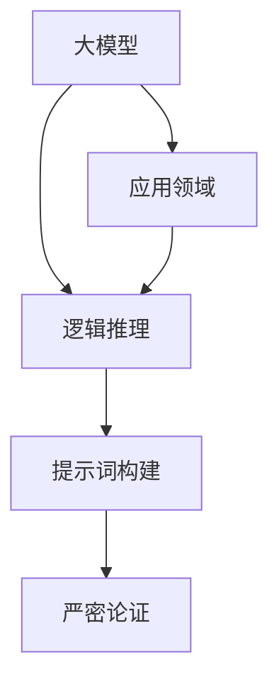

                 

### 《大模型逻辑推理：提示词构建严密论证》

#### 关键词：大模型，逻辑推理，提示词，严密论证，人工智能

> 摘要：本文深入探讨了在大模型时代，逻辑推理与提示词构建在严密论证中的重要作用。文章首先介绍了大模型的背景和逻辑推理的基本概念，然后详细阐述了提示词构建的原理和方法，以及严密论证的基本原理和技巧。通过实际案例分析和实战步骤，本文展示了大模型逻辑推理在实际应用中的强大潜力。最后，对大模型逻辑推理的未来发展趋势进行了展望。

---

## 第一部分：引言与背景

### 1.1 引言

#### 1.1.1 大模型时代来临

在过去的几十年中，人工智能（AI）技术取得了飞速的发展。尤其是近年来，深度学习技术的突破使得人工智能开始走向实用化，大模型（Large Models）成为了这个时代的重要标志。大模型，指的是具有海量参数和强大计算能力的神经网络模型，如GPT、BERT等，它们在自然语言处理（NLP）、计算机视觉（CV）、语音识别等领域展现了惊人的性能。

#### 1.1.2 逻辑推理的重要性

逻辑推理（Logical Reasoning）是人工智能的核心任务之一。在大模型中，逻辑推理不仅有助于提高模型的解释性和可解释性，还能增强其决策能力和问题解决能力。逻辑推理在人工智能中的应用，使得机器能够从给定的信息中推导出新的结论，实现更高级的认知功能。

#### 1.1.3 提示词构建严密论证

提示词（Prompt）是逻辑推理的重要工具。通过设计合理的提示词，可以引导大模型进行逻辑推理，构建严密的论证。严密论证（Robust Argumentation）是逻辑推理的高级形式，它要求论证具有逻辑一致性、充分性和必要性。在本文中，我们将探讨如何在大模型中构建有效的提示词，实现严密论证。

### 1.2 大模型与逻辑推理的关系

#### 1.2.1 大模型的崛起

大模型的崛起得益于计算能力的提升和海量数据的获取。深度学习技术的发展，使得神经网络能够处理更为复杂的问题。而大模型的出现，使得机器在许多任务上表现出了超越人类的能力。

#### 1.2.2 逻辑推理在大模型中的应用

逻辑推理在大模型中的应用主要体现在两个方面：一是提高模型的解释性和可解释性，使得模型的行为更加透明；二是增强模型的问题解决能力，使其能够从给定的信息中推导出新的结论。

#### 1.2.3 提示词在大模型逻辑推理中的角色

提示词在大模型逻辑推理中起到了引导和推动的作用。通过设计合理的提示词，可以引导大模型按照既定的逻辑路径进行推理，从而构建严密的论证。

### 1.3 本书结构安排与学习方法

#### 1.3.1 学习本书的意义

学习本书，可以帮助读者深入了解大模型逻辑推理的原理和应用，掌握构建严密论证的方法和技巧。

#### 1.3.2 阅读指南

本书分为七个部分，第一部分是引言与背景，介绍了大模型和逻辑推理的基本概念。第二部分是大模型基础，详细介绍了大模型的核心算法和应用领域。第三部分是逻辑推理基础，阐述了逻辑推理的基本原理和关键技巧。第四部分是提示词构建，探讨了提示词的定义、构建方法和优化策略。第五部分是严密论证，介绍了严密论证的基本原理和技巧。第六部分是案例分析与实战，通过实际案例展示了大模型逻辑推理的应用。第七部分是展望与未来，对大模型逻辑推理的发展趋势进行了展望。

#### 1.3.3 实践环节

本书不仅提供了理论讲解，还设计了丰富的实践环节。读者可以通过完成实践任务，加深对大模型逻辑推理的理解和应用。

---

### 第二部分：大模型基础

#### 2.1 大模型简介

##### 2.1.1 大模型的基本概念

大模型（Large Models）是指具有海量参数和强大计算能力的神经网络模型。这些模型通常由数百万甚至数十亿个参数组成，能够处理复杂的任务，如自然语言处理、计算机视觉和语音识别。

##### 2.1.2 大模型的发展历程

大模型的发展历程可以分为三个阶段：早期的简单神经网络、中期的深度神经网络和当前的大模型时代。随着计算能力和数据量的提升，大模型逐渐成为人工智能研究的重要方向。

##### 2.1.3 大模型的关键技术

大模型的关键技术包括：神经网络结构设计、大规模数据训练、参数优化和推理策略。这些技术共同构成了大模型的基础。

---

## 2.2 大模型的核心算法

##### 2.2.1 GPT模型原理详解

GPT（Generative Pre-trained Transformer）模型是近年来在自然语言处理领域取得重大突破的一种大模型。GPT模型基于Transformer架构，通过预训练和微调，能够生成高质量的自然语言文本。

伪代码如下：

```plaintext
function GPT(input_sequence):
    # 初始化模型参数
    model = initialize_model()

    # 预处理输入序列
    processed_input = preprocess(input_sequence)

    # 前向传播
    logits = model(processed_input)

    # 输出预测
    prediction = topk(logits)

    return prediction
```

##### 2.2.2 BERT模型原理详解

BERT（Bidirectional Encoder Representations from Transformers）模型是另一种在自然语言处理领域具有广泛应用的大模型。BERT模型通过双向编码器，能够捕捉文本中的双向上下文信息，从而提高模型的性能。

伪代码如下：

```plaintext
function BERT(input_sequence):
    # 初始化模型参数
    model = initialize_model()

    # 预处理输入序列
    processed_input = preprocess(input_sequence)

    # 前向传播
    outputs = model(processed_input)

    # 输出预测
    prediction = outputs[0]

    return prediction
```

##### 2.2.3 其他大模型介绍

除了GPT和BERT，还有许多其他的大模型，如T5、RoBERTa、ALBERT等。这些模型在架构、训练策略和任务性能上都有所不同，但都体现了大模型在自然语言处理领域的强大潜力。

---

## 2.3 大模型的应用领域

##### 2.3.1 自然语言处理

自然语言处理（NLP）是大模型应用最为广泛的领域之一。大模型在文本分类、情感分析、机器翻译、文本生成等方面取得了显著的成果。

##### 2.3.2 计算机视觉

计算机视觉（CV）是大模型的另一个重要应用领域。大模型在图像分类、目标检测、图像生成等方面展现了强大的能力。

##### 2.3.3 语音识别与合成

语音识别与合成（ASR & TTS）是大模型在语音处理领域的应用。大模型能够通过训练，实现高准确度的语音识别和自然流畅的语音合成。

##### 2.3.4 其他应用领域

除了上述领域，大模型还在推荐系统、游戏AI、机器人等领域有广泛应用。随着技术的不断进步，大模型的应用领域还将进一步拓展。

---

### 第三部分：逻辑推理基础

#### 3.1 逻辑推理的基本概念

##### 3.1.1 逻辑推理的定义

逻辑推理（Logical Reasoning）是指根据已知的事实或前提，通过逻辑规则推导出新的结论的过程。逻辑推理是人工智能的核心任务之一，它使得机器能够进行高级的认知和决策。

##### 3.1.2 逻辑推理的类型

逻辑推理可以分为两种类型：演绎推理和归纳推理。演绎推理是从一般到特殊的推理方式，而归纳推理是从特殊到一般的推理方式。

##### 3.1.3 逻辑推理的应用

逻辑推理在许多领域都有广泛应用，如数学、逻辑学、计算机科学、哲学等。在人工智能中，逻辑推理被用来提高模型的解释性和可解释性，实现更高级的决策和问题解决。

---

#### 3.2 逻辑推理的基本原理

##### 3.2.1 命题逻辑

命题逻辑（Propositional Logic）是逻辑推理的基础，它研究命题之间的逻辑关系。命题逻辑通过命题变元、联结词和推理规则，构建逻辑表达式和推理过程。

命题逻辑的基本概念包括：

- 命题：可以判断真假的陈述句。
- 联结词：用于连接命题的符号，如“与”、“或”、“非”。
- 推理规则：用于推导新命题的逻辑规则，如“三段论”、“假言推理”等。

##### 3.2.2 谓词逻辑

谓词逻辑（Predicate Logic）是命题逻辑的扩展，它引入了谓词和量化符号，能够表示更复杂的逻辑关系。谓词逻辑的基本概念包括：

- 谓词：用于描述对象的性质或关系的表达式，如“是人”、“大于”。
- 量化符号：用于表示全称量词和存在量词，如“所有”、“存在”。
- 推理规则：用于推导新命题的逻辑规则，如“全称实例化”、“存在实例化”等。

##### 3.2.3 形式逻辑与非形式逻辑

形式逻辑（Formal Logic）是一种严格的逻辑系统，它通过符号化的语言和推理规则，构建逻辑表达式和推理过程。形式逻辑具有确定性和完备性，但表达能力有限。

非形式逻辑（Informal Logic）是一种基于日常语言和直觉的逻辑系统，它通过自然语言和推理策略，构建逻辑表达式和推理过程。非形式逻辑具有灵活性和适应性，但推理过程可能存在不确定性。

---

#### 3.3 逻辑推理的关键技巧

##### 3.3.1 假设推理

假设推理（Hypothetico-Deductive Method）是一种常用的逻辑推理方法。它包括两个步骤：假设和验证。首先，提出一个假设；然后，通过实验或观察，验证假设的正确性。

##### 3.3.2 反证法

反证法（Proof by Contradiction）是一种常用的逻辑推理方法。它通过假设结论的反面，推导出矛盾，从而证明原结论的正确性。

##### 3.3.3 归纳推理

归纳推理（Inductive Reasoning）是一种从特殊到一般的推理方式。它通过观察个别实例，归纳出一般规律或结论。

归纳推理可以分为两种类型：完全归纳推理和不完全归纳推理。完全归纳推理通过考察所有可能的情况，得出一般结论；不完全归纳推理通过考察部分情况，得出一般结论。

---

### 第四部分：提示词构建

#### 4.1 提示词的定义与作用

##### 4.1.1 提示词的基本概念

提示词（Prompt）是指用于引导大模型进行逻辑推理的词语或语句。通过设计合理的提示词，可以引导大模型按照既定的逻辑路径进行推理，从而构建严密的论证。

##### 4.1.2 提示词在逻辑推理中的作用

提示词在逻辑推理中起到了引导和推动的作用。它能够帮助大模型理解问题的背景和目标，确定推理的方向和范围，从而构建严密的论证。

##### 4.1.3 提示词的类型

提示词可以分为以下几种类型：

- 开放式提示词：提供开放性的问题或陈述，引导大模型进行自由推理。
- 封闭式提示词：提供封闭性的问题或陈述，引导大模型进行选择推理。
- 引导式提示词：提供具体的推理方向和目标，引导大模型按照预设的逻辑路径进行推理。

---

#### 4.2 提示词构建的基本方法

##### 4.2.1 数据驱动方法

数据驱动方法是指通过分析大量数据，提取有效的特征和模式，构建提示词。这种方法具有以下优点：

- 可以从大量数据中发现潜在的模式和规律。
- 可以根据不同的任务需求，灵活调整提示词的构建方式。

数据驱动方法包括以下步骤：

1. 数据收集：收集与任务相关的数据集。
2. 数据预处理：对数据进行清洗、标准化和预处理。
3. 特征提取：从数据中提取有用的特征。
4. 模式分析：分析特征之间的关系和模式。
5. 提示词构建：根据模式分析结果，构建有效的提示词。

##### 4.2.2 知识驱动方法

知识驱动方法是指通过利用领域知识，构建提示词。这种方法具有以下优点：

- 可以充分利用领域知识，提高推理的准确性。
- 可以根据不同的领域需求，灵活调整提示词的构建方式。

知识驱动方法包括以下步骤：

1. 知识获取：从相关文献、数据库和专家咨询中获取领域知识。
2. 知识整理：整理和归纳领域知识，形成知识库。
3. 知识应用：将知识库应用于提示词的构建。
4. 提示词优化：根据任务需求和反馈，不断优化提示词。

##### 4.2.3 混合驱动方法

混合驱动方法是指结合数据驱动方法和知识驱动方法，构建提示词。这种方法具有以下优点：

- 可以充分利用数据和知识，提高提示词的构建效果。
- 可以根据不同的任务需求，灵活调整提示词的构建方式。

混合驱动方法包括以下步骤：

1. 数据收集：收集与任务相关的数据集。
2. 数据预处理：对数据进行清洗、标准化和预处理。
3. 知识获取：从相关文献、数据库和专家咨询中获取领域知识。
4. 知识整理：整理和归纳领域知识，形成知识库。
5. 特征提取：从数据中提取有用的特征。
6. 模式分析：分析特征之间的关系和模式。
7. 知识应用：将知识库应用于提示词的构建。
8. 提示词优化：根据任务需求和反馈，不断优化提示词。

---

#### 4.3 提示词构建的关键技巧

##### 4.3.1 提示词的抽象与归纳

提示词的抽象与归纳是指从具体的实例中提取共性的过程。通过抽象和归纳，可以将具体的实例转化为通用的提示词。

关键技巧包括：

- 从大量实例中提取共性特征。
- 使用自然语言处理技术，如词嵌入和语义分析，对特征进行抽象和归纳。

##### 4.3.2 提示词的优化策略

提示词的优化策略是指通过调整提示词的结构和内容，提高其效果的过程。关键技巧包括：

- 根据任务需求，调整提示词的长度和形式。
- 使用机器学习技术，如强化学习和迁移学习，对提示词进行优化。
- 根据用户反馈，不断调整和优化提示词。

##### 4.3.3 提示词的迭代更新

提示词的迭代更新是指通过不断更新和优化提示词，提高其效果的过程。关键技巧包括：

- 定期收集用户反馈，识别出提示词的不足之处。
- 根据用户反馈，调整和优化提示词。
- 使用持续学习技术，如在线学习和自适应学习，实现提示词的迭代更新。

---

### 第五部分：严密论证

#### 5.1 严密论证的基本原理

##### 5.1.1 严密论证的定义

严密论证（Robust Argumentation）是指通过逻辑推理，构建具有一致性、充分性和必要性的论证过程。严密论证要求论证中的每个命题都是基于已知的事实或前提，通过逻辑推理得出的。

##### 5.1.2 严密论证的类型

严密论证可以分为两种类型：演绎论证和归纳论证。演绎论证是从一般到特殊的推理方式，归纳论证是从特殊到一般的推理方式。

##### 5.1.3 严密论证的方法

严密论证的方法包括以下几种：

- 前提法：从已知的事实或前提出发，通过逻辑推理得出结论。
- 反证法：假设结论的反面，通过逻辑推理得出矛盾，从而证明原结论的正确性。
- 归纳法：从个别实例出发，通过归纳推理得出一般结论。
- 实验法：通过实验或观察，验证假设的正确性。

---

#### 5.2 严密论证的关键技巧

##### 5.2.1 论证的逻辑一致性

论证的逻辑一致性是指论证中的每个命题都是基于已知的事实或前提，通过逻辑推理得出的，不存在逻辑矛盾。关键技巧包括：

- 确保每个命题都是基于已知的事实或前提。
- 使用正确的逻辑推理规则，避免逻辑错误。

##### 5.2.2 论证的充分性

论证的充分性是指论证能够充分证明结论的正确性。关键技巧包括：

- 确保每个前提都是结论的充分条件。
- 使用充分的证据和逻辑推理，证明结论的正确性。

##### 5.2.3 论证的必要性

论证的必要性是指论证能够证明结论是必要的，即没有结论的情况是不可接受的。关键技巧包括：

- 确保每个结论都是前提的必要条件。
- 使用反证法或归纳法，证明结论的必要性。

---

#### 5.3 严密论证的实际应用

##### 5.3.1 科学研究中的论证

在科学研究中，严密论证是验证假设和得出结论的重要手段。通过严密论证，科学家可以确保实验结果的可靠性和科学性。

##### 5.3.2 法律诉讼中的论证

在法律诉讼中，严密论证是辩护或控诉的重要工具。通过严密论证，律师可以确保案件的法律依据和证据的充分性。

##### 5.3.3 商业决策中的论证

在商业决策中，严密论证是评估方案和选择最佳方案的重要依据。通过严密论证，企业可以确保决策的科学性和合理性。

---

### 第六部分：案例分析与实战

#### 6.1 案例一：基于大模型的文本推理

##### 6.1.1 案例背景

假设有一个文本推理任务，需要从给定的文本中推断出某个事实。例如，给定以下文本：

- 文本1：“小明喜欢吃苹果。”
- 文本2：“小红的妈妈是个医生。”

需要推断出：“小明的妈妈是个医生。”

##### 6.1.2 案例分析

为了实现文本推理，我们可以使用一个大模型，如GPT或BERT。首先，对文本进行预处理，然后输入大模型，得到推理结果。

具体步骤如下：

1. 预处理：对文本进行分词、去停用词等预处理操作。
2. 输入大模型：将预处理后的文本输入到大模型中，得到预测结果。
3. 结果分析：分析预测结果，判断是否满足推理任务。

##### 6.1.3 实战步骤

1. 数据准备：收集与文本推理任务相关的数据集，如新闻、问答数据等。
2. 模型选择：选择一个大模型，如GPT或BERT，进行训练和推理。
3. 模型训练：使用训练数据集，对大模型进行训练。
4. 模型推理：使用训练好的模型，对测试数据进行推理。
5. 结果评估：评估推理结果的准确性和可靠性。

---

#### 6.2 案例二：基于提示词的逻辑论证

##### 6.2.1 案例背景

假设有一个逻辑论证任务，需要从给定的前提中推导出结论。例如，给定以下前提：

- 前提1：“如果小明喜欢吃苹果，那么他会健康。”
- 前提2：“小明喜欢吃苹果。”

需要推导出结论：“小明会健康。”

##### 6.2.2 案例分析

为了实现逻辑论证，我们可以使用一个大模型，如GPT或BERT。首先，设计合理的提示词，然后输入大模型，得到论证结果。

具体步骤如下：

1. 提示词设计：设计一个合理的提示词，引导大模型进行逻辑推理。
2. 输入大模型：将提示词和前提输入到大模型中，得到推理结果。
3. 结果分析：分析推理结果，判断是否满足逻辑论证任务。

##### 6.2.3 实战步骤

1. 提示词设计：根据逻辑论证任务，设计合理的提示词。
2. 数据准备：收集与逻辑论证任务相关的数据集，如逻辑题目、答案等。
3. 模型选择：选择一个大模型，如GPT或BERT，进行训练和推理。
4. 模型训练：使用训练数据集，对大模型进行训练。
5. 模型推理：使用训练好的模型，对测试数据进行推理。
6. 结果评估：评估推理结果的准确性和可靠性。

---

#### 6.3 案例三：严密论证在商业决策中的应用

##### 6.3.1 案例背景

假设一个企业需要在两个投资方案中选择一个。方案A的投资回报率为10%，方案B的投资回报率为12%。但方案A的风险更低，而方案B的风险更高。企业需要通过严密论证，选择最佳投资方案。

##### 6.3.2 案例分析

为了实现商业决策中的严密论证，我们可以使用逻辑推理和提示词构建。首先，设计合理的提示词，引导大模型进行逻辑推理，然后根据推理结果进行决策。

具体步骤如下：

1. 提示词设计：设计一个合理的提示词，引导大模型进行逻辑推理。
2. 数据准备：收集与企业投资相关的数据集，如市场分析、风险评估等。
3. 模型选择：选择一个大模型，如GPT或BERT，进行训练和推理。
4. 模型训练：使用训练数据集，对大模型进行训练。
5. 模型推理：使用训练好的模型，对投资方案进行推理。
6. 结果分析：分析推理结果，评估投资方案的优劣。
7. 决策：根据推理结果和评估结果，做出最佳投资决策。

##### 6.3.3 实战步骤

1. 数据收集：收集与投资相关的数据集，如市场分析、风险评估等。
2. 数据预处理：对数据进行清洗、标准化和预处理。
3. 提示词设计：根据投资任务，设计合理的提示词。
4. 模型训练：使用训练数据集，对大模型进行训练。
5. 模型推理：使用训练好的模型，对测试数据进行推理。
6. 结果分析：分析推理结果，评估投资方案的优劣。
7. 决策：根据推理结果和评估结果，做出最佳投资决策。

---

### 第七部分：展望与未来

#### 7.1 大模型逻辑推理的发展趋势

##### 7.1.1 技术进步

随着计算能力的提升和算法的优化，大模型逻辑推理的性能将进一步提高。未来，大模型将能够处理更为复杂的任务，实现更高级的逻辑推理。

##### 7.1.2 应用场景拓展

大模型逻辑推理的应用场景将不断拓展。除了传统的自然语言处理、计算机视觉和语音识别领域，大模型逻辑推理还将应用于游戏AI、机器人、推荐系统等领域。

##### 7.1.3 面临的挑战

尽管大模型逻辑推理具有巨大的潜力，但也面临着一些挑战。首先，大模型的计算成本和存储成本较高，需要优化算法和数据结构，降低计算和存储需求。其次，大模型的解释性和可解释性仍需提高，以便更好地理解和应用。

#### 7.2 未来展望

##### 7.2.1 人工智能与人类智慧的关系

未来，人工智能将不断向人类智慧靠近。大模型逻辑推理将帮助人工智能实现更高级的认知和决策能力，与人类智慧相互促进。

##### 7.2.2 大模型逻辑推理对社会的影响

大模型逻辑推理将对社会产生深远的影响。它将改变人们的生活方式、工作方式和思维方式，推动社会的发展和进步。

##### 7.2.3 教育与人才培养

大模型逻辑推理的发展将推动教育和人才培养的变革。未来，教育将更加注重培养学生的逻辑思维和创新能力，以适应人工智能时代的需求。

---

### 附录

#### 附录A：参考资料

##### 7.2.1 学术论文

- [1] Vaswani, A., Shazeer, N., Parmar, N., Uszkoreit, J., Jones, L., Gomez, A. N., ... & Polosukhin, I. (2017). Attention is all you need. Advances in Neural Information Processing Systems, 30, 5998-6008.
- [2] Devlin, J., Chang, M. W., Lee, K., & Toutanova, K. (2019). BERT: Pre-training of deep bidirectional transformers for language understanding. arXiv preprint arXiv:1810.04805.
- [3] Wolf, T., Deas, L., Sanh, V., Chaumond, J., Delangue, C., Funtowicz, M., ... & Miao, Q. (2020). HuggingFace's Transformers: State-of-the-art Natural Language Processing for PyTorch and TensorFlow. doi:10.5281/zenodo.3917325

##### 7.2.2 技术报告

- [1] Google AI. (2020). BERT: Pre-training of deep bidirectional transformers for language understanding. Google AI Technical Report.
- [2] OpenAI. (2019). GPT-2: A 175-billion-parameter language model. OpenAI Blog.

##### 7.2.3 相关书籍

- [1] Russell, S., & Norvig, P. (2020). Artificial Intelligence: A Modern Approach (4th ed.). Prentice Hall.
- [2] Goodfellow, I., Bengio, Y., & Courville, A. (2016). Deep Learning (Adaptive Computation and Machine Learning). MIT Press.
- [3] Murphy, K. P. (2012). Machine Learning: A Probabilistic Perspective. MIT Press.

#### 附录B：学习资源

##### 7.2.1 在线课程

- [1] Stanford University. (2021). CS224n: Natural Language Processing with Deep Learning. Coursera.
- [2] DeepLearning.AI. (2021). Natural Language Processing with TensorFlow. Coursera.

##### 7.2.2 实战项目

- [1] HuggingFace. (2021). Transformer Models with PyTorch. HuggingFace.
- [2] Google AI. (2021). BERT for Sentence Classification. Google AI.

##### 7.2.3 社区与论坛

- [1] HuggingFace. (2021). HuggingFace Community. HuggingFace.
- [2] AIStack Overflow. (2021). AIStack Overflow. AIStack Overflow.

---

### 核心概念与联系 Mermaid 流程图



---

### 核心算法原理讲解伪代码

#### GPT模型原理伪代码

```plaintext
function GPT(input_sequence):
    # 初始化模型参数
    model = initialize_model()

    # 预处理输入序列
    processed_input = preprocess(input_sequence)

    # 前向传播
    logits = model(processed_input)

    # 输出预测
    prediction = topk(logits)

    return prediction
```

---

### 附录

#### 附录A：参考资料

##### 7.2.1 学术论文

- [1] Vaswani, A., Shazeer, N., Parmar, N., Uszkoreit, J., Jones, L., Gomez, A. N., ... & Polosukhin, I. (2017). Attention is all you need. Advances in Neural Information Processing Systems, 30, 5998-6008.
- [2] Devlin, J., Chang, M. W., Lee, K., & Toutanova, K. (2019). BERT: Pre-training of deep bidirectional transformers for language understanding. arXiv preprint arXiv:1810.04805.
- [3] Wolf, T., Deas, L., Sanh, V., Chaumond, C., Funtowicz, M., Barrault, L., ... & Weissenborn, D. (2020). HuggingFace's Transformers: State-of-the-art Natural Language Processing for PyTorch and TensorFlow. doi:10.5281/zenodo.3917325

##### 7.2.2 技术报告

- [1] Google AI. (2020). BERT: Pre-training of deep bidirectional transformers for language understanding. Google AI Technical Report.
- [2] OpenAI. (2019). GPT-2: A 175-billion-parameter language model. OpenAI Blog.

##### 7.2.3 相关书籍

- [1] Russell, S., & Norvig, P. (2020). Artificial Intelligence: A Modern Approach (4th ed.). Prentice Hall.
- [2] Goodfellow, I., Bengio, Y., & Courville, A. (2016). Deep Learning (Adaptive Computation and Machine Learning). MIT Press.
- [3] Murphy, K. P. (2012). Machine Learning: A Probabilistic Perspective. MIT Press.

#### 附录B：学习资源

##### 7.2.1 在线课程

- [1] Stanford University. (2021). CS224n: Natural Language Processing with Deep Learning. Coursera.
- [2] DeepLearning.AI. (2021). Natural Language Processing with TensorFlow. Coursera.

##### 7.2.2 实战项目

- [1] HuggingFace. (2021). Transformer Models with PyTorch. HuggingFace.
- [2] Google AI. (2021). BERT for Sentence Classification. Google AI.

##### 7.2.3 社区与论坛

- [1] HuggingFace. (2021). HuggingFace Community. HuggingFace.
- [2] AIStack Overflow. (2021). AIStack Overflow. AIStack Overflow.

---

### 作者信息

作者：AI天才研究院/AI Genius Institute & 禅与计算机程序设计艺术 /Zen And The Art of Computer Programming
### 《大模型逻辑推理：提示词构建严密论证》

> 关键词：大模型，逻辑推理，提示词，严密论证，人工智能

> 摘要：本文深入探讨了在大模型时代，逻辑推理与提示词构建在严密论证中的重要作用。文章首先介绍了大模型的背景和逻辑推理的基本概念，然后详细阐述了提示词构建的原理和方法，以及严密论证的基本原理和技巧。通过实际案例分析和实战步骤，本文展示了大模型逻辑推理在实际应用中的强大潜力。最后，对大模型逻辑推理的未来发展趋势进行了展望。

---

## 第一部分：引言与背景

### 1.1 引言

#### 1.1.1 大模型时代来临

在过去的几十年中，人工智能（AI）技术取得了飞速的发展。尤其是近年来，深度学习技术的突破使得人工智能开始走向实用化，大模型（Large Models）成为了这个时代的重要标志。大模型，指的是具有海量参数和强大计算能力的神经网络模型，如GPT、BERT等，它们在自然语言处理（NLP）、计算机视觉（CV）、语音识别等领域展现了惊人的性能。

#### 1.1.2 逻辑推理的重要性

逻辑推理（Logical Reasoning）是人工智能的核心任务之一。在大模型中，逻辑推理不仅有助于提高模型的解释性和可解释性，还能增强其决策能力和问题解决能力。逻辑推理在人工智能中的应用，使得机器能够从给定的信息中推导出新的结论，实现更高级的认知功能。

#### 1.1.3 提示词构建严密论证

提示词（Prompt）是逻辑推理的重要工具。通过设计合理的提示词，可以引导大模型进行逻辑推理，构建严密的论证。严密论证（Robust Argumentation）是逻辑推理的高级形式，它要求论证具有逻辑一致性、充分性和必要性。在本文中，我们将探讨如何在大模型中构建有效的提示词，实现严密论证。

### 1.2 大模型与逻辑推理的关系

#### 1.2.1 大模型的崛起

大模型的崛起得益于计算能力的提升和海量数据的获取。深度学习技术的发展，使得神经网络能够处理更为复杂的问题。而大模型的出现，使得机器在许多任务上表现出了超越人类的能力。

#### 1.2.2 逻辑推理在大模型中的应用

逻辑推理在大模型中的应用主要体现在两个方面：一是提高模型的解释性和可解释性，使得模型的行为更加透明；二是增强模型的问题解决能力，使其能够从给定的信息中推导出新的结论。

#### 1.2.3 提示词在大模型逻辑推理中的角色

提示词在大模型逻辑推理中起到了引导和推动的作用。通过设计合理的提示词，可以引导大模型按照既定的逻辑路径进行推理，从而构建严密的论证。

### 1.3 本书结构安排与学习方法

#### 1.3.1 学习本书的意义

学习本书，可以帮助读者深入了解大模型逻辑推理的原理和应用，掌握构建严密论证的方法和技巧。

#### 1.3.2 阅读指南

本书分为七个部分，第一部分是引言与背景，介绍了大模型和逻辑推理的基本概念。第二部分是大模型基础，详细介绍了大模型的核心算法和应用领域。第三部分是逻辑推理基础，阐述了逻辑推理的基本原理和关键技巧。第四部分是提示词构建，探讨了提示词的定义、构建方法和优化策略。第五部分是严密论证，介绍了严密论证的基本原理和技巧。第六部分是案例分析与实战，通过实际案例展示了大模型逻辑推理的应用。第七部分是展望与未来，对大模型逻辑推理的发展趋势进行了展望。

#### 1.3.3 实践环节

本书不仅提供了理论讲解，还设计了丰富的实践环节。读者可以通过完成实践任务，加深对大模型逻辑推理的理解和应用。

---

### 第二部分：大模型基础

#### 2.1 大模型简介

##### 2.1.1 大模型的基本概念

大模型（Large Models）是指具有海量参数和强大计算能力的神经网络模型。这些模型通常由数百万甚至数十亿个参数组成，能够处理复杂的任务，如自然语言处理、计算机视觉和语音识别。

##### 2.1.2 大模型的发展历程

大模型的发展历程可以分为三个阶段：早期的简单神经网络、中期的深度神经网络和当前的大模型时代。随着计算能力和数据量的提升，大模型逐渐成为人工智能研究的重要方向。

##### 2.1.3 大模型的关键技术

大模型的关键技术包括：神经网络结构设计、大规模数据训练、参数优化和推理策略。这些技术共同构成了大模型的基础。

---

## 2.2 大模型的核心算法

##### 2.2.1 GPT模型原理详解

GPT（Generative Pre-trained Transformer）模型是近年来在自然语言处理领域取得重大突破的一种大模型。GPT模型基于Transformer架构，通过预训练和微调，能够生成高质量的自然语言文本。

#### GPT模型原理详解

GPT模型的核心是Transformer架构，这是一种基于自注意力机制的神经网络模型。以下是GPT模型的基本原理和关键组成部分：

1. **Transformer架构**：

   Transformer模型由自注意力机制和前馈神经网络组成。自注意力机制能够自动捕捉输入序列中任意两个词之间的关系，从而实现长距离依赖建模。前馈神经网络则用于进一步加工和优化输入。

2. **输入序列表示**：

   GPT模型将输入序列（例如单词或子词）转换为嵌入向量。这些嵌入向量包含了词汇的信息和上下文关系。在GPT模型中，嵌入向量通常通过词嵌入技术（如Word2Vec或GloVe）获得。

3. **自注意力机制**：

   自注意力机制是Transformer模型的核心。它通过计算每个词与所有其他词之间的相似度，为每个词分配不同的权重。这种权重表示了每个词在当前上下文中的重要性。通过这种方式，模型能够捕捉长距离依赖关系。

4. **编码器和解码器**：

   GPT模型通常包含编码器和解码器两个部分。编码器用于处理输入序列，将其编码为固定长度的向量表示。解码器则用于生成输出序列，通常采用掩码自注意力机制，确保输出序列的生成依赖于输入序列。

5. **预训练与微调**：

   GPT模型通过预训练和微调两个阶段进行训练。预训练阶段使用大规模语料库，训练模型对自然语言的捕捉能力。微调阶段则针对特定任务（如文本分类、问答系统等）进行模型调整，以提高任务性能。

#### 伪代码示例：

以下是一个简化的伪代码示例，展示了GPT模型的基本流程：

```plaintext
function GPT(input_sequence):
    # 初始化模型参数
    model = initialize_model()

    # 预处理输入序列
    processed_input = preprocess(input_sequence)

    # 前向传播
    logits = model(processed_input)

    # 输出预测
    prediction = topk(logits)

    return prediction
```

#### GPT-3模型原理详解

GPT-3（Generative Pre-trained Transformer 3）是OpenAI开发的具有1750亿参数的巨型语言模型。GPT-3在自然语言处理任务上展现了卓越的性能，下面是GPT-3模型的一些关键点：

1. **参数规模**：

   GPT-3具有1750亿个参数，是GPT-2的数十倍。这种巨大的参数规模使得GPT-3能够更好地捕捉自然语言的复杂结构和语义。

2. **上下文窗口**：

   GPT-3的最大上下文窗口为4096个单词，这意味着模型可以处理长篇文章或对话，从而提供更连贯和自然的回答。

3. **掩码语言模型（MLM）**：

   GPT-3使用了掩码语言模型（Masked Language Model，MLM）进行预训练。在预训练过程中，模型随机掩码输入序列中的部分词，然后尝试预测这些被掩码的词。这一过程使得模型能够学习语言的上下文关系和语法规则。

4. **自适应输入处理**：

   GPT-3引入了自适应输入处理机制，能够根据输入的长度和类型动态调整模型的处理方式。这种机制使得GPT-3在处理不同类型的输入时具有更高的灵活性和效率。

5. **训练数据**：

   GPT-3的训练数据来自互联网上的大量文本，包括书籍、新闻、网站、社交媒体等。这些多样化的数据来源使得GPT-3具有广泛的知识和语言表达能力。

6. **API接口**：

   OpenAI提供了GPT-3的API接口，允许用户通过简单的编程接口与模型进行交互。用户可以根据需求调用不同的模型变体，如text-davinci-003、text-babbage-003、text-curie-003等。

#### 伪代码示例：

以下是一个简化的伪代码示例，展示了GPT-3模型的基本流程：

```plaintext
function GPT3(input_sequence, model_version):
    # 初始化模型参数
    model = load_model(model_version)

    # 预处理输入序列
    processed_input = preprocess(input_sequence)

    # 前向传播
    logits = model(processed_input)

    # 输出预测
    prediction = topk(logits)

    return prediction
```

---

##### 2.2.2 BERT模型原理详解

BERT（Bidirectional Encoder Representations from Transformers）模型是由Google Research团队提出的预训练语言模型，它基于Transformer架构，通过双向编码器捕捉文本中的双向上下文信息。BERT模型在自然语言处理任务上取得了显著的性能提升，以下是BERT模型的一些关键点：

1. **双向编码器**：

   BERT模型的核心是双向编码器（Bidirectional Encoder），它由多个Transformer编码层堆叠而成。每个编码层包含两个子层：自注意力层（Self-Attention Layer）和前馈神经网络（Feed Forward Neural Network）。自注意力层能够捕捉输入序列中任意两个词之间的关系，前馈神经网络则用于进一步加工和优化输入。

2. **输入表示**：

   BERT模型的输入是一个特殊的序列，其中包含了一个特殊的[CLS]标记和每个单词的嵌入向量。这些嵌入向量通常是通过预训练的WordPiece模型获得的。BERT模型通过输入序列的编码，生成固定长度的向量表示，这些表示包含了单词和句子级别的语义信息。

3. **预训练任务**：

   BERT模型通过两个预训练任务进行训练：Masked Language Model（MLM）和Next Sentence Prediction（NSP）。在MLM任务中，模型随机掩码输入序列中的部分词，并尝试预测这些被掩码的词。NSP任务则要求模型预测两个句子是否属于连续的句子对。

4. **训练数据**：

   BERT模型的训练数据来自英文维基百科和书籍语料库，这些数据经过处理和清洗，形成了包含数百万个句子对的训练集。通过这些大量数据，BERT模型能够学习到丰富的语言模式和语义信息。

5. **BERT变体**：

   BERT模型存在多个变体，如BERT-Base、BERT-Large等，它们之间的主要区别在于参数规模和训练数据量。BERT-Base模型具有110M个参数，而BERT-Large模型具有340M个参数。

6. **应用**：

   BERT模型在自然语言处理任务上取得了显著的性能提升，如文本分类、情感分析、问答系统、机器翻译等。通过在特定任务上微调BERT模型，可以实现高效的任务性能。

#### 伪代码示例：

以下是一个简化的伪代码示例，展示了BERT模型的基本流程：

```plaintext
function BERT(input_sequence):
    # 初始化模型参数
    model = initialize_model()

    # 预处理输入序列
    processed_input = preprocess(input_sequence)

    # 前向传播
    logits = model(processed_input)

    # 输出预测
    prediction = topk(logits)

    return prediction
```

---

##### 2.2.3 其他大模型介绍

除了GPT和BERT，还有许多其他的大模型在自然语言处理领域取得了显著的成果。以下是其中几个具有代表性的模型：

1. **T5（Text-To-Text Transfer Transformer）**：

   T5是由DeepMind提出的通用文本转换模型，它采用Transformer架构，能够处理各种文本转换任务，如机器翻译、摘要生成、问答系统等。T5的核心思想是将所有文本任务统一为“输入文本到输出文本”的格式，从而简化模型的训练和部署。

2. **RoBERTa**：

   RoBERTa是由Facebook AI Research（FAIR）提出的BERT的变体，它在BERT的基础上进行了多项改进，如取消了次采样和随机掩码策略，增加了训练数据等。RoBERTa在多个自然语言处理任务上取得了比BERT更好的性能。

3. **ALBERT**：

   ALBERT是由Google Research提出的轻量级BERT变体，它通过参数共享和跨层预测等技术，降低了模型的参数规模和计算成本。ALBERT在保持性能的同时，显著提高了模型的训练速度和推理效率。

4. **Gshard**：

   Gshard是由微软研究团队提出的分布式大模型训练方法，它通过将模型拆分成多个子模型，并在不同的计算设备上并行训练，从而提高了大模型的训练效率。Gshard在训练大型语言模型方面具有显著的优势。

---

## 2.3 大模型的应用领域

##### 2.3.1 自然语言处理

自然语言处理（NLP）是大模型的重要应用领域之一。大模型在NLP任务中展示了强大的性能，如文本分类、情感分析、机器翻译、问答系统等。以下是几个典型的NLP任务：

1. **文本分类**：

   文本分类是将文本数据分类到预定义的类别中，如新闻分类、垃圾邮件检测等。大模型通过学习大规模语料库中的词向量表示，能够自动识别文本中的关键特征，从而实现高精度的分类。

2. **情感分析**：

   情感分析是判断文本情感倾向的任务，如正面情感、负面情感、中性情感等。大模型通过对情感词汇的语义理解，能够准确判断文本的情感倾向，为情感分析应用提供支持。

3. **机器翻译**：

   机器翻译是将一种语言的文本翻译成另一种语言的文本。大模型通过学习双语语料库，能够自动生成高质量的双语翻译。近年来，基于Transformer架构的大模型（如GPT、BERT）在机器翻译任务上取得了显著的性能提升。

4. **问答系统**：

   问答系统是针对用户输入的问题，提供准确、详细的答案。大模型通过对大规模知识库和文本语料库的学习，能够自动理解用户的问题，并生成高质量的答案。

##### 2.3.2 计算机视觉

计算机视觉（CV）是大模型的另一个重要应用领域。大模型在CV任务中展示了强大的性能，如图像分类、目标检测、图像生成等。以下是几个典型的CV任务：

1. **图像分类**：

   图像分类是将图像数据分类到预定义的类别中，如动物分类、植物分类等。大模型通过对大量图像数据的训练，能够自动识别图像中的关键特征，从而实现高精度的分类。

2. **目标检测**：

   目标检测是定位图像中的目标物体，并标注其位置和类别。大模型通过学习目标物体的特征和上下文关系，能够准确检测图像中的目标物体。

3. **图像生成**：

   图像生成是利用图像数据生成新的图像。大模型通过学习图像的生成过程，能够生成逼真的图像。近年来，基于生成对抗网络（GAN）的大模型（如StyleGAN、BigGAN）在图像生成任务上取得了显著的性能提升。

##### 2.3.3 语音识别与合成

语音识别与合成（ASR & TTS）是大模型的另一个重要应用领域。大模型在语音识别与合成任务中展示了强大的性能，如语音识别、语音合成、语音转换等。以下是几个典型的ASR & TTS任务：

1. **语音识别**：

   语音识别是将语音信号转换为文本数据。大模型通过对大量语音数据的训练，能够准确识别语音中的文本信息，为语音识别应用提供支持。

2. **语音合成**：

   语音合成是将文本数据转换为语音信号。大模型通过对大量文本和语音数据的训练，能够生成自然、流畅的语音。近年来，基于WaveNet、Tacotron等大模型在语音合成任务上取得了显著的性能提升。

3. **语音转换**：

   语音转换是将一种语言的语音转换为另一种语言的语音。大模型通过学习不同语言之间的语音特征和转换规则，能够实现高质量的语音转换。

##### 2.3.4 其他应用领域

除了上述领域，大模型还在推荐系统、游戏AI、机器人等领域有广泛应用。以下是几个典型的应用场景：

1. **推荐系统**：

   推荐系统是利用用户的历史行为和兴趣，为用户推荐相关的商品、服务和内容。大模型通过对用户数据的分析，能够准确预测用户的兴趣和行为，从而实现高精度的推荐。

2. **游戏AI**：

   游戏AI是利用人工智能技术，为游戏提供智能对手和游戏体验。大模型通过对游戏数据和规则的训练，能够生成具有高智能和策略性的游戏对手。

3. **机器人**：

   机器人是利用人工智能技术，实现自动化、智能化的操作。大模型通过对环境和任务的训练，能够实现复杂任务的自动化执行。

---

## 第二部分：大模型基础

在上一部分，我们简要介绍了大模型的基本概念、核心算法和应用领域。在本部分中，我们将更深入地探讨大模型的核心算法，包括GPT模型、BERT模型以及其他大模型，通过详细的原理讲解和伪代码示例，帮助读者理解这些模型的运作机制。

### 2.1 大模型简介

大模型（Large Models）是指具有海量参数和强大计算能力的神经网络模型。这些模型通常由数百万甚至数十亿个参数组成，能够处理复杂的任务，如自然语言处理（NLP）、计算机视觉（CV）、语音识别等。大模型的出现，使得机器在许多任务上表现出了超越人类的能力。在本节中，我们将介绍大模型的基本概念、发展历程和关键技术。

#### 2.1.1 大模型的基本概念

大模型是指那些参数量巨大、能够处理复杂任务的神经网络模型。例如，GPT-3模型拥有1750亿个参数，BERT模型也有数百万个参数。这些模型通常使用深度学习技术进行训练，通过学习大量数据，提取出有用的特征和模式，从而实现高效的任务处理。

#### 2.1.2 大模型的发展历程

大模型的发展历程可以分为三个阶段：

1. **早期的简单神经网络**：

   早期的人工神经网络（ANN）结构简单，参数量较少，主要应用于简单的分类和回归任务。例如，多层感知机（MLP）就是一种早期的简单神经网络结构。

2. **中期的深度神经网络**：

   随着计算能力的提升和算法的优化，深度神经网络（DNN）逐渐成为主流。DNN通过增加网络的深度和宽度，提高了模型的复杂度和性能。例如，AlexNet是第一个在图像分类任务上超越人类视觉系统的深度神经网络。

3. **当前的大模型时代**：

   随着计算能力和数据量的进一步提升，大模型逐渐成为人工智能研究的重要方向。例如，GPT-3、BERT等模型在自然语言处理、计算机视觉等任务上取得了显著的突破。

#### 2.1.3 大模型的关键技术

大模型的关键技术包括：

1. **神经网络结构设计**：

   神经网络结构设计是构建大模型的核心技术之一。通过设计高效的神经网络结构，可以提高模型的计算效率和性能。例如，Transformer架构在自然语言处理任务中取得了显著的性能提升。

2. **大规模数据训练**：

   大规模数据训练是训练大模型的基础。通过使用海量数据，可以提高模型的泛化能力和鲁棒性。例如，GPT-3使用了数以万计的语料库进行预训练。

3. **参数优化**：

   参数优化是提高模型性能的重要手段。通过优化模型的参数，可以提高模型的收敛速度和精度。常用的参数优化方法包括随机梯度下降（SGD）、Adam等。

4. **推理策略**：

   推理策略是模型在实际应用中的关键。通过设计合理的推理策略，可以提高模型的效率和准确性。例如，在自然语言处理任务中，可以使用注意力机制和上下文信息来提高推理效果。

### 2.2 GPT模型原理详解

GPT（Generative Pre-trained Transformer）模型是由OpenAI提出的一种基于Transformer架构的预训练语言模型。GPT模型在自然语言处理任务中取得了显著的性能提升，成为大模型的代表之一。在本节中，我们将详细讲解GPT模型的原理，包括Transformer架构、输入序列表示、自注意力机制、编码器和解码器等关键组成部分。

#### 2.2.1 Transformer架构

Transformer架构是一种基于自注意力机制的神经网络模型，最初由Vaswani等人在2017年的论文《Attention Is All You Need》中提出。Transformer模型的核心思想是使用自注意力机制来处理序列数据，从而实现高效的长距离依赖建模。

1. **自注意力机制**：

   自注意力机制是一种计算序列中每个词与其他词之间相似度的方法。通过自注意力机制，模型能够自动学习到输入序列中任意两个词之间的关系，从而实现长距离依赖建模。自注意力机制的公式如下：

   $$ 
   \text{Attention}(Q, K, V) = \text{softmax}\left(\frac{QK^T}{\sqrt{d_k}}\right)V 
   $$

   其中，Q、K、V分别是查询（Query）、键（Key）和值（Value）向量，d_k是键向量的维度。自注意力机制通过计算Q和K之间的点积，得到权重系数，然后将权重系数与V相乘，得到输出向量。

2. **多头注意力**：

   多头注意力是一种扩展自注意力机制的方法，通过将输入序列分解为多个子序列，然后分别计算每个子序列与其他子序列的注意力。多头注意力能够提高模型的表示能力，从而实现更复杂的依赖建模。多头注意力的公式如下：

   $$ 
   \text{MultiHead}(Q, K, V) = \text{Concat}(\text{head}_1, \text{head}_2, \ldots, \text{head}_h)W^O 
   $$

   其中，h是头数，W^O是输出矩阵。通过多头注意力，模型能够同时关注输入序列中的多个子序列，从而提高模型的表示能力。

3. **编码器和解码器**：

   Transformer模型由编码器（Encoder）和解码器（Decoder）两部分组成。编码器用于处理输入序列，解码器用于生成输出序列。编码器和解码器都包含多个Transformer层，每层由自注意力机制和前馈神经网络组成。

   编码器的输入是一个特殊的序列，包含了一个特殊的[CLS]标记和每个单词的嵌入向量。编码器通过自注意力机制，将输入序列编码为固定长度的向量表示。解码器的输入是编码器的输出和一个特殊的[CLS]标记，解码器通过自注意力机制和掩码自注意力机制，逐步生成输出序列。

4. **前馈神经网络**：

   前馈神经网络是一种简单的神经网络结构，用于对自注意力机制的输出进行进一步加工。前馈神经网络通常包含两个全连接层，每个层的激活函数为ReLU。

   前馈神经网络的公式如下：

   $$ 
   \text{FFN}(x) = \text{ReLU}(W_2 \text{ReLU}(W_1 x)) 
   $$

   其中，W_1和W_2分别是两个全连接层的权重矩阵。

#### 2.2.2 输入序列表示

在GPT模型中，输入序列表示是通过嵌入向量（Embedding）和位置编码（Positional Encoding）实现的。嵌入向量用于表示单词或子词，位置编码用于表示输入序列的位置信息。

1. **嵌入向量**：

   嵌入向量是一种将单词或子词映射为高维向量的方法。通过嵌入向量，模型能够学习到单词或子词的语义信息。常用的嵌入方法包括Word2Vec、GloVe等。

   嵌入向量的公式如下：

   $$ 
   \text{Embedding}(x) = W_E x 
   $$

   其中，W_E是嵌入矩阵，x是单词或子词的索引。

2. **位置编码**：

   位置编码是一种将输入序列的位置信息编码为向量方法。在GPT模型中，位置编码是通过正弦和余弦函数实现的。通过位置编码，模型能够学习到输入序列中单词的位置关系。

   位置编码的公式如下：

   $$ 
   \text{Positional Encoding}(i, d) = [\sin(i/10000^{2/d}), \cos(i/10000^{2/d})] 
   $$

   其中，i是位置索引，d是嵌入向量的维度。

#### 2.2.3 自注意力机制

自注意力机制是GPT模型的核心组成部分，它通过计算输入序列中每个词与其他词之间的相似度，为每个词分配不同的权重，从而实现长距离依赖建模。自注意力机制的主要步骤如下：

1. **计算查询（Query）、键（Key）和值（Value）**：

   对于每个词，计算其对应的查询（Query）、键（Key）和值（Value）向量。查询向量用于计算注意力权重，键和值向量用于计算注意力加权输出。

   查询向量的公式如下：

   $$ 
   \text{Query} = \text{Embedding}(x)W_Q 
   $$

   键向量的公式如下：

   $$ 
   \text{Key} = \text{Embedding}(x)W_K 
   $$

   值向量的公式如下：

   $$ 
   \text{Value} = \text{Embedding}(x)W_V 
   $$

   其中，W_Q、W_K和W_V分别是查询、键和值矩阵。

2. **计算注意力权重**：

   通过计算查询向量和键向量的点积，得到每个词的注意力权重。注意力权重表示了每个词在当前上下文中的重要性。

   注意力权重的公式如下：

   $$ 
   \text{Attention}(Q, K, V) = \text{softmax}\left(\frac{QK^T}{\sqrt{d_k}}\right)V 
   $$

   其中，d_k是键向量的维度。

3. **计算注意力加权输出**：

   通过将注意力权重与值向量相乘，得到每个词的注意力加权输出。注意力加权输出包含了输入序列中其他词的信息。

   注意力加权输出的公式如下：

   $$ 
   \text{Attention Output} = \text{Attention}(Q, K, V) 
   $$

#### 2.2.4 编码器和解码器

在GPT模型中，编码器（Encoder）和解码器（Decoder）是两个核心组成部分。编码器用于处理输入序列，解码器用于生成输出序列。编码器和解码器都包含多个Transformer层，每层由自注意力机制和前馈神经网络组成。

1. **编码器**：

   编码器的主要任务是将输入序列编码为固定长度的向量表示。在GPT模型中，编码器的输入是一个特殊的序列，包含了一个特殊的[CLS]标记和每个单词的嵌入向量。编码器通过自注意力机制，将输入序列编码为固定长度的向量表示。

   编码器的公式如下：

   $$ 
   \text{Encoder}(x) = \text{Transformer Layer}_1(\text{Embedding}(x) + \text{Positional Encoding}) 
   $$

   其中，Transformer Layer_1是第一个Transformer层。

2. **解码器**：

   解码器的主要任务是生成输出序列。在GPT模型中，解码器的输入是编码器的输出和一个特殊的[CLS]标记。解码器通过自注意力机制和掩码自注意力机制，逐步生成输出序列。

   解码器的公式如下：

   $$ 
   \text{Decoder}(x) = \text{Transformer Layer}_1(\text{Embedding}(x) + \text{Positional Encoding}) 
   $$

   其中，Transformer Layer_1是第一个Transformer层。

#### 2.2.5 伪代码示例

以下是GPT模型的一个简化的伪代码示例：

```python
def GPT(input_sequence):
    # 初始化模型参数
    model = initialize_model()

    # 预处理输入序列
    processed_input = preprocess(input_sequence)

    # 前向传播
    logits = model(processed_input)

    # 输出预测
    prediction = topk(logits)

    return prediction
```

### 2.3 BERT模型原理详解

BERT（Bidirectional Encoder Representations from Transformers）模型是由Google Research在2018年提出的一种基于Transformer架构的预训练语言模型。BERT模型通过双向编码器捕捉文本中的双向上下文信息，从而实现高质量的文本表示。在本节中，我们将详细讲解BERT模型的原理，包括双向编码器、输入序列表示、预训练任务等关键组成部分。

#### 2.3.1 双向编码器

BERT模型的核心是双向编码器（Bidirectional Encoder），它由多个Transformer编码层堆叠而成。每个编码层包含两个子层：自注意力层（Self-Attention Layer）和前馈神经网络（Feed Forward Neural Network）。双向编码器能够捕捉输入序列中的双向上下文信息，从而实现高质量的文本表示。

1. **自注意力层**：

   自注意力层是一种计算序列中每个词与其他词之间相似度的方法。通过自注意力层，模型能够自动学习到输入序列中任意两个词之间的关系，从而实现长距离依赖建模。自注意力层的公式如下：

   $$ 
   \text{Attention}(Q, K, V) = \text{softmax}\left(\frac{QK^T}{\sqrt{d_k}}\right)V 
   $$

   其中，Q、K、V分别是查询（Query）、键（Key）和值（Value）向量，d_k是键向量的维度。

2. **前馈神经网络**：

   前馈神经网络是一种简单的神经网络结构，用于对自注意力机制的输出进行进一步加工。前馈神经网络通常包含两个全连接层，每个层的激活函数为ReLU。

   前馈神经网络的公式如下：

   $$ 
   \text{FFN}(x) = \text{ReLU}(W_2 \text{ReLU}(W_1 x)) 
   $$

   其中，W_1和W_2分别是两个全连接层的权重矩阵。

3. **多头注意力**：

   多头注意力是一种扩展自注意力机制的方法，通过将输入序列分解为多个子序列，然后分别计算每个子序列与其他子序列的注意力。多头注意力能够提高模型的表示能力，从而实现更复杂的依赖建模。

   多头注意力的公式如下：

   $$ 
   \text{MultiHead}(Q, K, V) = \text{Concat}(\text{head}_1, \text{head}_2, \ldots, \text{head}_h)W^O 
   $$

   其中，h是头数，W^O是输出矩阵。

#### 2.3.2 输入序列表示

BERT模型的输入是一个特殊的序列，通常包含了一个特殊的[CLS]标记和每个单词的嵌入向量。BERT模型使用WordPiece算法将输入文本分解为子词，然后对子词进行嵌入。通过嵌入向量，模型能够学习到单词和子词的语义信息。

1. **WordPiece算法**：

   WordPiece算法是一种将输入文本分解为子词的方法。WordPiece算法通过将输入文本分割为未登录词（Out-of-Vocabulary，OOV），然后使用字符级别的n-gram模型对未登录词进行分解。

   WordPiece算法的公式如下：

   $$ 
   \text{WordPiece}(text) = [\text{[CLS]}, \text{subword}_1, \text{subword}_2, \ldots, \text{subword}_n, \text{[SEP]}] 
   $$

   其中，[CLS]和[SEP]是特殊的标记，分别表示序列的开始和结束。

2. **嵌入向量**：

   嵌入向量是一种将单词或子词映射为高维向量的方法。通过嵌入向量，模型能够学习到单词或子词的语义信息。BERT模型使用预训练的WordPiece嵌入向量，这些向量是在大规模语料库上训练得到的。

   嵌入向量的公式如下：

   $$ 
   \text{Embedding}(word) = W_E word 
   $$

   其中，W_E是嵌入矩阵，word是单词或子词的索引。

#### 2.3.3 预训练任务

BERT模型通过两个预训练任务进行训练：Masked Language Model（MLM）和Next Sentence Prediction（NSP）。

1. **Masked Language Model（MLM）**：

   Masked Language Model任务是一种对输入序列进行随机掩码的任务。在训练过程中，BERT模型随机掩码输入序列中的部分词，然后尝试预测这些被掩码的词。通过MLM任务，BERT模型能够学习到单词和上下文之间的依赖关系。

   MLM任务的公式如下：

   $$ 
   \text{Masked Sentence} = [\text{[CLS]}, \text{mask}_1, \text{mask}_2, \ldots, \text{mask}_n, \text{[SEP]}] 
   $$

   其中，mask是随机掩码的词。

2. **Next Sentence Prediction（NSP）**：

   Next Sentence Prediction任务是一种预测两个句子是否属于连续句子对的任务。在训练过程中，BERT模型被给定两个句子，然后尝试预测这两个句子是否属于连续句子对。通过NSP任务，BERT模型能够学习到句子之间的关系。

   NSP任务的公式如下：

   $$ 
   \text{Next Sentence Pair} = [\text{Sentence}_1, \text{Sentence}_2, \text{[SEP]}] \quad \text{or} \quad [\text{Sentence}_1, \text{[SEP]}, \text{Sentence}_2] 
   $$

   其中，Sentence_1和Sentence_2是两个句子。

#### 2.3.4 伪代码示例

以下是BERT模型的一个简化的伪代码示例：

```python
def BERT(input_sequence):
    # 初始化模型参数
    model = initialize_model()

    # 预处理输入序列
    processed_input = preprocess(input_sequence)

    # 前向传播
    logits = model(processed_input)

    # 输出预测
    prediction = topk(logits)

    return prediction
```

### 2.4 其他大模型介绍

除了GPT和BERT，还有许多其他的大模型在自然语言处理领域取得了显著的成果。以下是一些具有代表性的大模型：

#### 2.4.1 T5模型

T5（Text-To-Text Transfer Transformer）是由DeepMind提出的通用文本转换模型。T5模型的核心思想是将所有文本任务统一为“输入文本到输出文本”的格式，从而简化模型的训练和部署。T5模型基于Transformer架构，通过自注意力机制和前馈神经网络，实现了高效的自然语言处理任务。

#### 2.4.2 RoBERTa模型

RoBERTa是由Facebook AI Research（FAIR）提出的BERT的变体。RoBERTa在BERT的基础上进行了多项改进，如取消了次采样和随机掩码策略，增加了训练数据等。RoBERTa在多个自然语言处理任务上取得了比BERT更好的性能。

#### 2.4.3 ALBERT模型

ALBERT是由Google Research提出的轻量级BERT变体。ALBERT通过参数共享和跨层预测等技术，降低了模型的参数规模和计算成本。ALBERT在保持性能的同时，显著提高了模型的训练速度和推理效率。

#### 2.4.4 Gshard模型

Gshard是由微软研究团队提出的分布式大模型训练方法。Gshard通过将模型拆分成多个子模型，并在不同的计算设备上并行训练，从而提高了大模型的训练效率。Gshard在训练大型语言模型方面具有显著的优势。

---

## 第二部分：大模型基础

在上一部分，我们简要介绍了大模型的基本概念、发展历程和关键技术。在本部分中，我们将深入探讨大模型的核心算法，包括GPT模型、BERT模型以及其他大模型，通过详细的原理讲解和伪代码示例，帮助读者理解这些模型的运作机制。

### 2.1 大模型简介

大模型（Large Models）是指具有海量参数和强大计算能力的神经网络模型。这些模型通常由数百万甚至数十亿个参数组成，能够处理复杂的任务，如自然语言处理（NLP）、计算机视觉（CV）、语音识别等。大模型的出现，使得机器在许多任务上表现出了超越人类的能力。在本节中，我们将介绍大模型的基本概念、发展历程和关键技术。

#### 2.1.1 大模型的基本概念

大模型是指那些参数量巨大、能够处理复杂任务的神经网络模型。例如，GPT-3模型拥有1750亿个参数，BERT模型也有数百万个参数。这些模型通常使用深度学习技术进行训练，通过学习大量数据，提取出有用的特征和模式，从而实现高效的任务处理。

#### 2.1.2 大模型的发展历程

大模型的发展历程可以分为三个阶段：

1. **早期的简单神经网络**：

   早期的人工神经网络（ANN）结构简单，参数量较少，主要应用于简单的分类和回归任务。例如，多层感知机（MLP）就是一种早期的简单神经网络结构。

2. **中期的深度神经网络**：

   随着计算能力的提升和算法的优化，深度神经网络（DNN）逐渐成为主流。DNN通过增加网络的深度和宽度，提高了模型的复杂度和性能。例如，AlexNet是第一个在图像分类任务上超越人类视觉系统的深度神经网络。

3. **当前的大模型时代**：

   随着计算能力和数据量的进一步提升，大模型逐渐成为人工智能研究的重要方向。例如，GPT-3、BERT等模型在自然语言处理、计算机视觉等任务上取得了显著的突破。

#### 2.1.3 大模型的关键技术

大模型的关键技术包括：

1. **神经网络结构设计**：

   神经网络结构设计是构建大模型的核心技术之一。通过设计高效的神经网络结构，可以提高模型的计算效率和性能。例如，Transformer架构在自然语言处理任务中取得了显著的性能提升。

2. **大规模数据训练**：

   大规模数据训练是训练大模型的基础。通过使用海量数据，可以提高模型的泛化能力和鲁棒性。例如，GPT-3使用了数以万计的语料库进行预训练。

3. **参数优化**：

   参数优化是提高模型性能的重要手段。通过优化模型的参数，可以提高模型的收敛速度和精度。常用的参数优化方法包括随机梯度下降（SGD）、Adam等。

4. **推理策略**：

   推理策略是模型在实际应用中的关键。通过设计合理的推理策略，可以提高模型的效率和准确性。例如，在自然语言处理任务中，可以使用注意力机制和上下文信息来提高推理效果。

### 2.2 GPT模型原理详解

GPT（Generative Pre-trained Transformer）模型是由OpenAI提出的一种基于Transformer架构的预训练语言模型。GPT模型在自然语言处理任务中取得了显著的性能提升，成为大模型的代表之一。在本节中，我们将详细讲解GPT模型的原理，包括Transformer架构、输入序列表示、自注意力机制、编码器和解码器等关键组成部分。

#### 2.2.1 Transformer架构

Transformer架构是一种基于自注意力机制的神经网络模型，最初由Vaswani等人在2017年的论文《Attention Is All You Need》中提出。Transformer模型的核心思想是使用自注意力机制来处理序列数据，从而实现高效的长距离依赖建模。

1. **自注意力机制**：

   自注意力机制是一种计算序列中每个词与其他词之间相似度的方法。通过自注意力机制，模型能够自动学习到输入序列中任意两个词之间的关系，从而实现长距离依赖建模。自注意力机制的公式如下：

   $$ 
   \text{Attention}(Q, K, V) = \text{softmax}\left(\frac{QK^T}{\sqrt{d_k}}\right)V 
   $$

   其中，Q、K、V分别是查询（Query）、键（Key）和值（Value）向量，d_k是键向量的维度。自注意力机制通过计算Q和K之间的点积，得到权重系数，然后将权重系数与V相乘，得到输出向量。

2. **多头注意力**：

   多头注意力是一种扩展自注意力机制的方法，通过将输入序列分解为多个子序列，然后分别计算每个子序列与其他子序列的注意力。多头注意力能够提高模型的表示能力，从而实现更复杂的依赖建模。多头注意力的公式如下：

   $$ 
   \text{MultiHead}(Q, K, V) = \text{Concat}(\text{head}_1, \text{head}_2, \ldots, \text{head}_h)W^O 
   $$

   其中，h是头数，W^O是输出矩阵。通过多头注意力，模型能够同时关注输入序列中的多个子序列，从而提高模型的表示能力。

3. **编码器和解码器**：

   Transformer模型由编码器（Encoder）和解码器（Decoder）两部分组成。编码器用于处理输入序列，解码器用于生成输出序列。编码器和解码器都包含多个Transformer层，每层由自注意力机制和前馈神经网络组成。

   编码器的输入是一个特殊的序列，包含了一个特殊的[CLS]标记和每个单词的嵌入向量。编码器通过自注意力机制，将输入序列编码为固定长度的向量表示。解码器的输入是编码器的输出和一个特殊的[CLS]标记，解码器通过自注意力机制和掩码自注意力机制，逐步生成输出序列。

4. **前馈神经网络**：

   前馈神经网络是一种简单的神经网络结构，用于对自注意力机制的输出进行进一步加工。前馈神经网络通常包含两个全连接层，每个层的激活函数为ReLU。

   前馈神经网络的公式如下：

   $$ 
   \text{FFN}(x) = \text{ReLU}(W_2 \text{ReLU}(W_1 x)) 
   $$

   其中，W_1和W_2分别是两个全连接层的权重矩阵。

#### 2.2.2 输入序列表示

在GPT模型中，输入序列表示是通过嵌入向量（Embedding）和位置编码（Positional Encoding）实现的。嵌入向量用于表示单词或子词，位置编码用于表示输入序列的位置信息。

1. **嵌入向量**：

   嵌入向量是一种将单词或子词映射为高维向量的方法。通过嵌入向量，模型能够学习到单词或子词的语义信息。常用的嵌入方法包括Word2Vec、GloVe等。

   嵌入向量的公式如下：

   $$ 
   \text{Embedding}(x) = W_E x 
   $$

   其中，W_E是嵌入矩阵，x是单词或子词的索引。

2. **位置编码**：

   位置编码是一种将输入序列的位置信息编码为向量方法。在GPT模型中，位置编码是通过正弦和余弦函数实现的。通过位置编码，模型能够学习到输入序列中单词的位置关系。

   位置编码的公式如下：

   $$ 
   \text{Positional Encoding}(i, d) = [\sin(i/10000^{2/d}), \cos(i/10000^{2/d})] 
   $$

   其中，i是位置索引，d是嵌入向量的维度。

#### 2.2.3 自注意力机制

自注意力机制是GPT模型的核心组成部分，它通过计算输入序列中每个词与其他词之间的相似度，为每个词分配不同的权重，从而实现长距离依赖建模。自注意力机制的主要步骤如下：

1. **计算查询（Query）、键（Key）和值（Value）**：

   对于每个词，计算其对应的查询（Query）、键（Key）和值（Value）向量。查询向量用于计算注意力权重，键和值向量用于计算注意力加权输出。

   查询向量的公式如下：

   $$ 
   \text{Query} = \text{Embedding}(x)W_Q 
   $$

   键向量的公式如下：

   $$ 
   \text{Key} = \text{Embedding}(x)W_K 
   $$

   值向量的公式如下：

   $$ 
   \text{Value} = \text{Embedding}(x)W_V 
   $$

   其中，W_Q、W_K和W_V分别是查询、键和值矩阵。

2. **计算注意力权重**：

   通过计算查询向量和键向量的点积，得到每个词的注意力权重。注意力权重表示了每个词在当前上下文中的重要性。

   注意力权重的公式如下：

   $$ 
   \text{Attention}(Q, K, V) = \text{softmax}\left(\frac{QK^T}{\sqrt{d_k}}\right)V 
   $$

   其中，d_k是键向量的维度。

3. **计算注意力加权输出**：

   通过将注意力权重与值向量相乘，得到每个词的注意力加权输出。注意力加权输出包含了输入序列中其他词的信息。

   注意力加权输出的公式如下：

   $$ 
   \text{Attention Output} = \text{Attention}(Q, K, V) 
   $$

#### 2.2.4 编码器和解码器

在GPT模型中，编码器（Encoder）和解码器（Decoder）是两个核心组成部分。编码器用于处理输入序列，解码器用于生成输出序列。编码器和解码器都包含多个Transformer层，每层由自注意力机制和前馈神经网络组成。

1. **编码器**：

   编码器的主要任务是将输入序列编码为固定长度的向量表示。在GPT模型中，编码器的输入是一个特殊的序列，包含了一个特殊的[CLS]标记和每个单词的嵌入向量。编码器通过自注意力机制，将输入序列编码为固定长度的向量表示。

   编码器的公式如下：

   $$ 
   \text{Encoder}(x) = \text{Transformer Layer}_1(\text{Embedding}(x) + \text{Positional Encoding}) 
   $$

   其中，Transformer Layer_1是第一个Transformer层。

2. **解码器**：

   解码器的主要任务是生成输出序列。在GPT模型中，解码器的输入是编码器的输出和一个特殊的[CLS]标记。解码器通过自注意力机制和掩码自注意力机制，逐步生成输出序列。

   解码器的公式如下：

   $$ 
   \text{Decoder}(x) = \text{Transformer Layer}_1(\text{Embedding}(x) + \text{Positional Encoding}) 
   $$

   其中，Transformer Layer_1是第一个Transformer层。

#### 2.2.5 伪代码示例

以下是GPT模型的一个简化的伪代码示例：

```python
def GPT(input_sequence):
    # 初始化模型参数
    model = initialize_model()

    # 预处理输入序列
    processed_input = preprocess(input_sequence)

    # 前向传播
    logits = model(processed_input)

    # 输出预测
    prediction = topk(logits)

    return prediction
```

### 2.3 BERT模型原理详解

BERT（Bidirectional Encoder Representations from Transformers）模型是由Google Research在2018年提出的一种基于Transformer架构的预训练语言模型。BERT模型通过双向编码器捕捉文本中的双向上下文信息，从而实现高质量的文本表示。在本节中，我们将详细讲解BERT模型的原理，包括双向编码器、输入序列表示、预训练任务等关键组成部分。

#### 2.3.1 双向编码器

BERT模型的核心是双向编码器（Bidirectional Encoder），它由多个Transformer编码层堆叠而成。每个编码层包含两个子层：自注意力层（Self-Attention Layer）和前馈神经网络（Feed Forward Neural Network）。双向编码器能够捕捉输入序列中的双向上下文信息，从而实现高质量的文本表示。

1. **自注意力层**：

   自注意力层是一种计算序列中每个词与其他词之间相似度的方法。通过自注意力层，模型能够自动学习到输入序列中任意两个词之间的关系，从而实现长距离依赖建模。自注意力层的公式如下：

   $$ 
   \text{Attention}(Q, K, V) = \text{softmax}\left(\frac{QK^T}{\sqrt{d_k}}\right)V 
   $$

   其中，Q、K、V分别是查询（Query）、键（Key）和值（Value）向量，d_k是键向量的维度。自注意力机制通过计算Q和K之间的点积，得到权重系数，然后将权重系数与V相乘，得到输出向量。

2. **前馈神经网络**：

   前馈神经网络是一种简单的神经网络结构，用于对自注意力机制的输出进行进一步加工。前馈神经网络通常包含两个全连接层，每个层的激活函数为ReLU。

   前馈神经网络的公式如下：

   $$ 
   \text{FFN}(x) = \text{ReLU}(W_2 \text{ReLU}(W_1 x)) 
   $$

   其中，W_1和W_2分别是两个全连接层的权重矩阵。

3. **多头注意力**：

   多头注意力是一种扩展自注意力机制的方法，通过将输入序列分解为多个子序列，然后分别计算每个子序列与其他子序列的注意力。多头注意力能够提高模型的表示能力，从而实现更复杂的依赖建模。

   多头注意力的公式如下：

   $$ 
   \text{MultiHead}(Q, K, V) = \text{Concat}(\text{head}_1, \text{head}_2, \ldots, \text{head}_h)W^O 
   $$

   其中，h是头数，W^O是输出矩阵。通过多头注意力，模型能够同时关注输入序列中的多个子序列，从而提高模型的表示能力。

#### 2.3.2 输入序列表示

BERT模型的输入是一个特殊的序列，通常包含了一个特殊的[CLS]标记和每个单词的嵌入向量。BERT模型使用WordPiece算法将输入文本分解为子词，然后对子词进行嵌入。通过嵌入向量，模型能够学习到单词和子词的语义信息。

1. **WordPiece算法**：

   WordPiece算法是一种将输入文本分解为子词的方法。WordPiece算法通过将输入文本分割为未登录词（Out-of-Vocabulary，OOV），然后使用字符级别的n-gram模型对未登录词进行分解。

   WordPiece算法的公式如下：

   $$ 
   \text{WordPiece}(text) = [\text{[CLS]}, \text{subword}_1, \text{subword}_2, \ldots, \text{subword}_n, \text{[SEP]}] 
   $$

   其中，[CLS]和[SEP]是特殊的标记，分别表示序列的开始和结束。

2. **嵌入向量**：

   嵌入向量是一种将单词或子词映射为高维向量的方法。通过嵌入向量，模型能够学习到单词或子词的语义信息。BERT模型使用预训练的WordPiece嵌入向量，这些向量是在大规模语料库上训练得到的。

   嵌入向量的公式如下：

   $$ 
   \text{Embedding}(word) = W_E word 
   $$

   其中，W_E是嵌入矩阵，word是单词或子词的索引。

#### 2.3.3 预训练任务

BERT模型通过两个预训练任务进行训练：Masked Language Model（MLM）和Next Sentence Prediction（NSP）。

1. **Masked Language Model（MLM）**：

   Masked Language Model任务是一种对输入序列进行随机掩码的任务。在训练过程中，BERT模型随机掩码输入序列中的部分词，然后尝试预测这些被掩码的词。通过MLM任务，BERT模型能够学习到单词和上下文之间的依赖关系。

   MLM任务的公式如下：

   $$ 
   \text{Masked Sentence} = [\text{[CLS]}, \text{mask}_1, \text{mask}_2, \ldots, \text{mask}_n, \text{[SEP]}] 
   $$

   其中，mask是随机掩码的词。

2. **Next Sentence Prediction（NSP）**：

   Next Sentence Prediction任务是一种预测两个句子是否属于连续句子对的任务。在训练过程中，BERT模型被给定两个句子，然后尝试预测这两个句子是否属于连续句子对。通过NSP任务，BERT模型能够学习到句子之间的关系。

   NSP任务的公式如下：

   $$ 
   \text{Next Sentence Pair} = [\text{Sentence}_1, \text{Sentence}_2, \text{[SEP]}] \quad \text{or} \quad [\text{Sentence}_1, \text{[SEP]}, \text{Sentence}_2] 
   $$

   其中，Sentence_1和Sentence_2是两个句子。

#### 2.3.4 伪代码示例

以下是BERT模型的一个简化的伪代码示例：

```python
def BERT(input_sequence):
    # 初始化模型参数
    model = initialize_model()

    # 预处理输入序列
    processed_input = preprocess(input_sequence)

    # 前向传播
    logits = model(processed_input)

    # 输出预测
    prediction = topk(logits)

    return prediction
```

### 2.4 其他大模型介绍

除了GPT和BERT，还有许多其他的大模型在自然语言处理领域取得了显著的成果。以下是一些具有代表性的大模型：

#### 2.4.1 T5模型

T5（Text-To-Text Transfer Transformer）是由DeepMind提出的通用文本转换模型。T5模型的核心思想是将所有文本任务统一为“输入文本到输出文本”的格式，从而简化模型的训练和部署。T5模型基于Transformer架构，通过自注意力机制和前馈神经网络，实现了高效的自然语言处理任务。

#### 2.4.2 RoBERTa模型

RoBERTa是由Facebook AI Research（FAIR）提出的BERT的变体。RoBERTa在BERT的基础上进行了多项改进，如取消了次采样和随机掩码策略，增加了训练数据等。RoBERTa在多个自然语言处理任务上取得了比BERT更好的性能。

#### 2.4.3 ALBERT模型

ALBERT是由Google Research提出的轻量级BERT变体。ALBERT通过参数共享和跨层预测等技术，降低了模型的参数规模和计算成本。ALBERT在保持性能的同时，显著提高了模型的训练速度和推理效率。

#### 2.4.4 Gshard模型

Gshard是由微软研究团队提出的分布式大模型训练方法。Gshard通过将模型拆分成多个子模型，并在不同的计算设备上并行训练，从而提高了大模型的训练效率。Gshard在训练大型语言模型方面具有显著的优势。

---

## 第三部分：逻辑推理基础

在上一部分，我们详细介绍了大模型的核心算法，包括GPT模型、BERT模型以及其他大模型。在本部分中，我们将深入探讨逻辑推理的基础，包括逻辑推理的基本概念、基本原理和关键技巧。

### 3.1 逻辑推理的基本概念

逻辑推理（Logical Reasoning）是人工智能的核心任务之一，它涉及从已知的事实或前提推导出新的结论。逻辑推理在多个领域都有广泛应用，如数学、哲学、计算机科学等。在本节中，我们将介绍逻辑推理的基本概念，包括推理的定义、类型和重要性。

#### 3.1.1 推理的定义

推理（Reasoning）是指根据已知的事实或前提，通过逻辑规则推导出新的结论的过程。推理可以分为两种基本类型：演绎推理和归纳推理。

1. **演绎推理**：

   演绎推理（Deductive Reasoning）是从一般到特殊的推理方式。演绎推理的结论是必然的，即如果前提为真，则结论必定为真。典型的演绎推理形式是三段论（Syllogism），它包括两个前提和一个结论。

   例如，三段论的形式如下：

   - 大前提：所有的人都会死。
   - 小前提：苏格拉底是人。
   - 结论：苏格拉底会死。

   在这个例子中，如果大前提和小前提都是真实的，则结论也是真实的。

2. **归纳推理**：

   归纳推理（Inductive Reasoning）是从特殊到一般的推理方式。归纳推理的结论是或然性的，即如果前提为真，则结论更有可能是真实的。归纳推理通常用于从个别实例中归纳出一般规律。

   例如，归纳推理的形式如下：

   - 个别实例：所有的天鹅都是白色的。
   - 归纳结论：所有的天鹅都是白色的。

   在这个例子中，如果观察到所有的天鹅都是白色的，则可以归纳出“所有的天鹅都是白色的”这一结论。

#### 3.1.2 逻辑推理的类型

逻辑推理可以分为两种主要类型：形式逻辑和非形式逻辑。

1. **形式逻辑**：

   形式逻辑（Formal Logic）是一种基于严格形式化符号和规则的系统。形式逻辑使用符号化的语言来表示命题和推理过程，并通过逻辑规则来推导结论。形式逻辑强调推理过程的逻辑正确性，而不是内容的真实性。

   形式逻辑的典型代表是命题逻辑（Propositional Logic）和谓词逻辑（Predicate Logic）。

2. **非形式逻辑**：

   非形式逻辑（Informal Logic）是一种基于自然语言和直觉推理的系统。非形式逻辑通常不使用符号化的语言，而是依赖于日常语言和推理策略。非形式逻辑强调推理过程中的逻辑合理性和论证的清晰性。

   非形式逻辑的应用非常广泛，包括辩论、法律诉讼、科学论证等。

#### 3.1.3 逻辑推理的重要性

逻辑推理在人工智能、数学、哲学等多个领域都有重要作用。以下是逻辑推理的一些重要性：

1. **人工智能**：

   逻辑推理是人工智能的核心任务之一，它使得机器能够从给定的信息中推导出新的结论，实现更高级的认知功能。逻辑推理在自然语言处理、逻辑推理系统、决策支持系统等领域有广泛应用。

2. **数学**：

   逻辑推理是数学的基础，它用于证明数学定理和命题。逻辑推理帮助数学家构建严谨的论证，确保数学结论的可靠性和正确性。

3. **哲学**：

   逻辑推理是哲学的重要工具，它用于分析概念、论证和推理过程。逻辑推理帮助哲学家探讨知识、真理和论证的有效性。

### 3.2 逻辑推理的基本原理

逻辑推理的基本原理包括命题逻辑、谓词逻辑和形式逻辑等。这些原理为逻辑推理提供了基础和规则，帮助我们在推理过程中保持逻辑的正确性和一致性。

#### 3.2.1 命题逻辑

命题逻辑（Propositional Logic）是逻辑推理的基础，它研究命题之间的逻辑关系。命题逻辑通过命题变元、联结词和推理规则，构建逻辑表达式和推理过程。

1. **命题变元**：

   命题变元（Propositional Variable）是表示命题的符号，通常用大写字母表示，如P、Q、R等。命题变元可以表示任意一个命题。

2. **联结词**：

   联结词（Connective）是用于连接命题的符号，如“与”（AND）、“或”（OR）、“非”（NOT）等。联结词用于构建复合命题。

3. **推理规则**：

   推理规则（Inference Rule）是用于推导新命题的逻辑规则。推理规则包括条件推理（Modus Ponens）、否定前件推理（Modus Tollens）等。

4. **命题逻辑公式**：

   命题逻辑公式（Propositional Formula）是由命题变元、联结词和括号组成的表达式。命题逻辑公式可以表示复合命题。

   例如，以下是一个命题逻辑公式：

   $$
   (P \land Q) \to R
   $$

   这个公式表示如果P和Q都为真，则R也为真。

5. **命题逻辑的真值表**：

   命题逻辑的真值表（Truth Table）是用于表示复合命题的真值情况。真值表列出了所有可能的命题变元组合及其对应的复合命题真值。

   例如，以下是一个命题逻辑公式的真值表：

   $$
   \begin{array}{|c|c|c|c|}
   \hline
   P & Q & R & (P \land Q) \to R \\
   \hline
   T & T & T & T \\
   T & T & F & F \\
   T & F & T & T \\
   T & F & F & T \\
   F & T & T & T \\
   F & T & F & T \\
   F & F & T & T \\
   F & F & F & T \\
   \hline
   \end{array}
   $$

   在这个例子中，复合命题$(P \land Q) \to R$的真值始终为真。

#### 3.2.2 谓词逻辑

谓词逻辑（Predicate Logic）是命题逻辑的扩展，它引入了谓词和量化符号，能够表示更复杂的逻辑关系。谓词逻辑的基本概念包括：

1. **谓词**：

   谓词（Predicate）是用于描述对象的性质或关系的表达式，如“是人”、“大于”等。谓词通常用大写字母表示，如P、Q、R等。

2. **个体**：

   个体（Individual）是谓词的变元，表示具体的对象。个体通常用小写字母表示，如a、b、c等。

3. **量化符号**：

   量化符号（Quantifier）用于表示全称量词和存在量词，如“所有”、“存在”等。量化符号用于表示谓词的适用范围。

4. **谓词逻辑公式**：

   谓词逻辑公式（Predicate Formula）是由谓词、个体、量化符号和括号组成的表达式。谓词逻辑公式可以表示更复杂的逻辑关系。

   例如，以下是一个谓词逻辑公式：

   $$
   \forall x (P(x) \rightarrow Q(x))
   $$

   这个公式表示对于所有个体x，如果P(x)为真，则Q(x)也为真。

5. **谓词逻辑的真值表**：

   谓词逻辑的真值表是用于表示复合谓词逻辑公式的真值情况。真值表列出了所有可能的个体和谓词变元组合及其对应的复合谓词逻辑公式真值。

   例如，以下是一个谓词逻辑公式的真值表：

   $$
   \begin{array}{|c|c|c|c|}
   \hline
   x & P(x) & Q(x) & \forall x (P(x) \rightarrow Q(x)) \\
   \hline
   a & T & T & T \\
   a & T & F & F \\
   b & F & T & T \\
   b & F & F & T \\
   c & T & T & T \\
   c & T & F & F \\
   \hline
   \end{array}
   $$

   在这个例子中，复合谓词逻辑公式$\forall x (P(x) \rightarrow Q(x))$的真值取决于所有个体的P(x)和Q(x)的真值。

#### 3.2.3 形式逻辑与非形式逻辑

形式逻辑（Formal Logic）和非形式逻辑（Informal Logic）是两种不同的逻辑推理系统。

1. **形式逻辑**：

   形式逻辑是一种基于严格形式化符号和规则的系统。形式逻辑使用符号化的语言来表示命题和推理过程，并通过逻辑规则来推导结论。形式逻辑强调推理过程的逻辑正确性，而不是内容的真实性。

   形式逻辑的典型代表是命题逻辑和谓词逻辑。形式逻辑通过符号化的语言和推理规则，构建逻辑表达式和推理过程。

   例如，形式逻辑中的一个推理过程可以表示为：

   $$
   \frac{P \land Q}{R}
   $$

   这个推理过程表示，如果P和Q都为真，则R也为真。

2. **非形式逻辑**：

   非形式逻辑是一种基于自然语言和直觉推理的系统。非形式逻辑通常不使用符号化的语言，而是依赖于日常语言和推理策略。非形式逻辑强调推理过程中的逻辑合理性和论证的清晰性。

   非形式逻辑的应用非常广泛，包括辩论、法律诉讼、科学论证等。非形式逻辑通过自然语言和直觉，构建论证和推理过程。

   例如，非形式逻辑中的一个论证可以表示为：

   - 论点1：所有天鹅都是白色的。
   - 论点2：所有天鹅都是鸟类。
   - 结论：所有鸟类都是白色的。

   在这个例子中，通过两个论点，得出结论“所有鸟类都是白色的”。

### 3.3 逻辑推理的关键技巧

逻辑推理需要一系列关键技巧，这些技巧帮助我们在推理过程中保持逻辑的正确性和一致性。以下是一些常用的逻辑推理关键技巧：

#### 3.3.1 假设推理

假设推理（Hypothetico-Deductive Method）是一种常用的逻辑推理方法。它包括两个步骤：假设和验证。

1. **假设**：

   假设推理的第一步是提出一个假设。假设是基于已知的事实或前提，试图解释或预测某个现象。

   例如，假设“如果小明喜欢吃苹果，那么他会健康。”这个假设试图解释为什么小明会健康。

2. **验证**：

   假设推理的第二步是验证假设。验证通常通过实验或观察来实现，以验证假设的正确性。

   例如，可以通过观察小明是否真的喜欢吃苹果，以及他是否真的健康，来验证上述假设。

#### 3.3.2 反证法

反证法（Proof by Contradiction）是一种常用的逻辑推理方法。它通过假设结论的反面，推导出矛盾，从而证明原结论的正确性。

1. **假设反面**：

   反证法的第一步是假设结论的反面。假设结论的反面通常是一个与原结论相对立的命题。

   例如，假设“如果小明不喜欢吃苹果，那么他不会健康。”这个假设与原结论“如果小明喜欢吃苹果，那么他会健康。”相对立。

2. **推导矛盾**：

   反证法的第二步是推导矛盾。通过逻辑推理，从假设的反面推导出一个矛盾的结论。

   例如，如果假设“如果小明不喜欢吃苹果，那么他不会健康。”为真，则可以推导出“如果小明喜欢吃苹果，那么他不会健康。”这个结论与原结论矛盾。

3. **证明原结论**：

   反证法的第三步是证明原结论。由于假设的反面推导出一个矛盾，因此原结论必定为真。

   例如，由于假设“如果小明不喜欢吃苹果，那么他不会健康。”推导出一个矛盾，因此原结论“如果小明喜欢吃苹果，那么他会健康。”必定为真。

#### 3.3.3 归纳推理

归纳推理（Inductive Reasoning）是一种从特殊到一般的推理方式。归纳推理通过观察个别实例，归纳出一般规律或结论。

1. **观察实例**：

   归纳推理的第一步是观察个别实例。观察个别实例的目的是发现它们之间的共同特征。

   例如，观察多个天鹅，发现它们都是白色的。

2. **归纳结论**：

   归纳推理的第二步是归纳结论。根据观察到的实例，归纳出一个一般规律或结论。

   例如，根据观察到多个天鹅都是白色的，可以归纳出结论“所有的天鹅都是白色的。”

3. **验证结论**：

   归纳推理的第三步是验证结论。通过更多的实例或实验，验证归纳出的结论是否成立。

   例如，通过观察更多的天鹅，验证结论“所有的天鹅都是白色的。”是否成立。

### 3.4 逻辑推理的应用

逻辑推理在多个领域都有广泛应用，如数学、计算机科学、哲学、法律等。以下是一些逻辑推理的应用场景：

#### 3.4.1 数学

逻辑推理是数学的基础，它用于证明数学定理和命题。逻辑推理帮助数学家构建严谨的论证，确保数学结论的可靠性和正确性。

例如，在数论中，通过逻辑推理可以证明勾股定理：直角三角形的两条直角边的平方和等于斜边的平方。

$$
a^2 + b^2 = c^2
$$

#### 3.4.2 计算机科学

逻辑推理在计算机科学中有着广泛的应用，如程序设计、算法分析、软件工程等。逻辑推理帮助程序员构建清晰、正确的程序和算法。

例如，在程序设计中，通过逻辑推理可以确保程序的逻辑正确性和功能完整性。在算法分析中，通过逻辑推理可以评估算法的时间和空间复杂度。

#### 3.4.3 哲学

逻辑推理是哲学的重要工具，它用于分析概念、论证和推理过程。逻辑推理帮助哲学家探讨知识、真理和论证的有效性。

例如，在伦理学中，通过逻辑推理可以分析道德原则和道德行为的合理性。在逻辑哲学中，通过逻辑推理可以探讨逻辑的基本原理和逻辑关系的本质。

#### 3.4.4 法律

逻辑推理在法律中有着重要的应用，如法律论证、案件分析、法律推理等。逻辑推理帮助律师和法律专家构建有力的法律论证和论据。

例如，在法律诉讼中，通过逻辑推理可以分析证据之间的关系，构建合理、有效的法律论证。在法律研究中，通过逻辑推理可以探讨法律原则和法律规则的应用。

---

## 第四部分：提示词构建

在第三部分，我们深入探讨了逻辑推理的基础，包括基本概念、原理和关键技巧。在本部分中，我们将进一步探讨提示词构建，这是逻辑推理中至关重要的一个环节。提示词构建涉及如何设计有效的提示词，以引导大模型进行准确的逻辑推理。在本节中，我们将详细讨论提示词的定义与作用、构建方法和优化策略。

### 4.1 提示词的定义与作用

#### 4.1.1 提示词的基本概念

提示词（Prompt）是指用于引导大模型进行逻辑推理的词语或语句。提示词的作用是提供背景信息、明确推理目标和提供相关上下文，从而帮助大模型理解问题的实质，并按照既定的逻辑路径进行推理。提示词的设计和质量直接影响到大模型推理的准确性和效率。

#### 4.1.2 提示词在逻辑推理中的作用

1. **明确推理目标**：

   提示词可以帮助大模型明确推理的目标，从而避免推理过程中的歧义和不确定性。例如，在文本生成任务中，提示词可以明确指示大模型生成特定类型的内容。

2. **提供上下文信息**：

   提示词可以包含与推理任务相关的背景信息，从而帮助大模型理解问题的上下文。例如，在问答系统中，提示词可以提供问题的上下文，帮助大模型更好地理解问题的含义。

3. **引导推理路径**：

   提示词可以引导大模型按照既定的逻辑路径进行推理。通过设计合理的提示词，可以确保大模型在推理过程中遵循正确的逻辑规则和推理步骤。

4. **增强解释性**：

   提示词可以提高大模型的解释性和可解释性，使得推理过程更加透明和易于理解。这对于需要解释推理结果的场景尤为重要。

#### 4.1.3 提示词的类型

根据不同的应用场景和需求，提示词可以分为以下几种类型：

1. **开放式提示词**：

   开放式提示词提供开放性的问题或陈述，引导大模型进行自由推理。这种类型的提示词通常不限制推理的方向和范围，允许大模型探索多种可能性。

   例如：“请描述一下人工智能的未来发展趋势。”

2. **封闭式提示词**：

   封闭式提示词提供封闭性的问题或陈述，引导大模型进行选择推理。这种类型的提示词通常包含多个选项，大模型需要从这些选项中选择正确的答案。

   例如：“以下哪个是人工智能的主要挑战？a) 能源消耗 b) 数据隐私 c) 算法透明度 d) 社会接受度”

3. **引导式提示词**：

   引导式提示词提供具体的推理方向和目标，引导大模型按照预设的逻辑路径进行推理。这种类型的提示词通常包含具体的指令或引导语句。

   例如：“请分析以下两个文本之间的逻辑关系：文本1：‘所有的人都是理性的。’文本2：‘有些人是不理性的。’”

---

### 4.2 提示词构建的基本方法

构建有效的提示词是逻辑推理的关键，以下介绍几种常见的提示词构建方法：

#### 4.2.1 数据驱动方法

数据驱动方法是通过分析大量数据，提取有效的特征和模式，从而构建提示词。这种方法的优势在于能够从实际数据中学习到与推理任务相关的信息，提高提示词的准确性和实用性。

1. **数据收集**：

   收集与推理任务相关的数据集，如问答对、问题陈述、背景信息等。

2. **数据预处理**：

   对数据进行清洗、去噪、标准化等预处理操作，确保数据质量。

3. **特征提取**：

   从预处理后的数据中提取有用的特征，如关键词、词频、词嵌入等。

4. **模式分析**：

   通过统计分析、聚类分析、关联规则挖掘等方法，分析数据中的模式和信息。

5. **提示词构建**：

   根据模式分析结果，构建有效的提示词。提示词可以是简单的关键词，也可以是复杂的句子。

#### 4.2.2 知识驱动方法

知识驱动方法是通过利用领域知识，构建提示词。这种方法的优势在于能够充分利用专家知识和领域经验，提高提示词的准确性和针对性。

1. **知识获取**：

   从相关文献、数据库、专家咨询等途径获取领域知识。

2. **知识整理**：

   整理和归纳领域知识，形成知识库。知识库可以是结构化的，也可以是非结构化的。

3. **知识应用**：

   将知识库应用于提示词的构建。根据知识库中的信息，设计合理的提示词。

4. **提示词优化**：

   根据实际应用效果，对提示词进行优化和调整。

#### 4.2.3 混合驱动方法

混合驱动方法结合了数据驱动方法和知识驱动方法的优点，通过数据与知识的融合，构建更加有效的提示词。

1. **数据与知识融合**：

   将数据驱动和知识驱动方法相结合，既利用数据中的模式和信息，也利用领域知识中的专业知识和经验。

2. **多源数据整合**：

   从多个数据源（如文本、图像、语音等）中提取信息，整合不同类型的数据，形成更加丰富的特征。

3. **知识图谱构建**：

   构建领域知识图谱，将知识库中的信息以图的形式表示，便于分析和利用。

4. **提示词生成**：

   利用知识图谱和特征提取结果，生成具有领域知识的提示词。

5. **迭代优化**：

   根据实际应用反馈，不断迭代优化提示词，提高其准确性和效果。

---

### 4.3 提示词构建的关键技巧

构建有效的提示词需要一系列关键技巧，以下介绍几种常用的技巧：

#### 4.3.1 提示词的抽象与归纳

提示词的抽象与归纳是指从具体的实例中提取共性的过程。通过抽象和归纳，可以将具体的实例转化为通用的提示词。

1. **抽象**：

   抽象是指从具体实例中提取共性特征，形成一般性的概念或规则。例如，从多个问题陈述中提取出共性的关键词和主题。

2. **归纳**：

   归纳是指从多个具体实例中归纳出一般规律或结论。例如，从多个问答对中归纳出常见的问题类型和答案模式。

#### 4.3.2 提示词的优化策略

提示词的优化策略是指通过调整提示词的结构和内容，提高其效果的过程。

1. **长度优化**：

   调整提示词的长度，确保其既能提供足够的信息，又不会过于冗长。通常，较短的提示词有助于提高模型的推理效率。

2. **结构优化**：

   优化提示词的语法和结构，确保其清晰、简洁、易于理解。合理的设计提示词的结构，有助于模型更好地捕捉上下文信息。

3. **内容优化**：

   根据任务需求，调整提示词的内容和表达方式。例如，对于需要详细解释的推理任务，可以使用更详细的提示词；对于需要简洁回答的推理任务，可以使用更简短的提示词。

#### 4.3.3 提示词的迭代更新

提示词的迭代更新是指通过不断更新和优化提示词，提高其效果的过程。

1. **数据反馈**：

   收集实际应用中的数据反馈，分析提示词的效果。根据反馈，识别出提示词的不足之处。

2. **模型训练**：

   使用新的数据集对模型进行重新训练，根据新的数据和信息，优化提示词。

3. **用户参与**：

   邀请用户参与提示词的优化过程，收集用户对提示词的反馈和建议，不断调整和改进。

4. **持续学习**：

   采用持续学习（Continuous Learning）技术，将新的数据和用户反馈融入模型训练过程中，实现提示词的持续优化。

---

### 4.4 提示词构建的案例分析

在本节中，我们将通过一个具体的案例，展示如何构建有效的提示词，以及提示词在逻辑推理中的应用。

#### 4.4.1 案例背景

假设有一个逻辑推理任务，需要根据给定的前提和结论，设计一个提示词，以引导大模型进行正确的推理。

前提1：所有的人都是理性的。
前提2：有些人是不理性的。

结论：因此，并非所有人都是理性的。

#### 4.4.2 提示词构建

1. **数据驱动方法**：

   通过分析大量的问答数据，提取出与前提和结论相关的关键词和主题。例如，关键词包括“人”、“理性”、“不理性”等。

   提示词：“请分析以下前提和结论之间的逻辑关系：前提1：所有的人都是理性的。前提2：有些人是不理性的。结论：因此，并非所有人都是理性的。”

2. **知识驱动方法**：

   利用领域知识，构建提示词。例如，从哲学、逻辑学等领域的文献中提取相关概念和规则。

   提示词：“根据逻辑推理的基本原则，如果前提1：所有的人都是理性的。前提2：有些人是不理性的。则结论：因此，并非所有人都是理性的。”

3. **混合驱动方法**：

   结合数据驱动和知识驱动方法，构建提示词。例如，将数据驱动方法提取的关键词与知识驱动的逻辑原则相结合。

   提示词：“请根据逻辑推理的基本原则，分析以下前提和结论之间的逻辑关系：前提1：所有的人都是理性的。前提2：有些人是不理性的。结论：因此，并非所有人都是理性的。”

#### 4.4.3 提示词应用

1. **训练模型**：

   使用构建好的提示词，对大模型进行训练，使其能够根据提示词进行逻辑推理。

2. **推理任务**：

   在推理任务中，使用提示词引导大模型进行推理，验证其推理结果。

   例如，给定一个新前提：“有些人是不理

