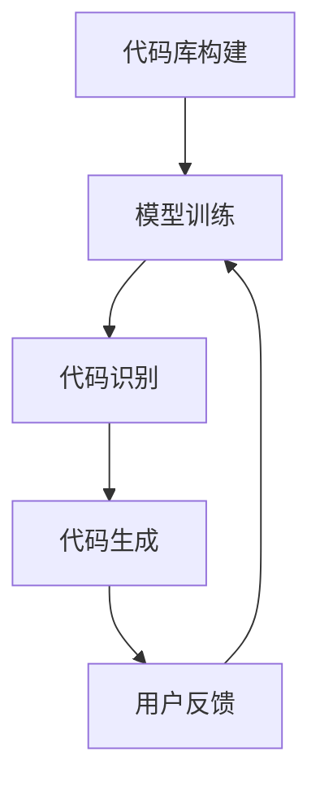

                 


## 文章标题：大模型驱动的智能代码重用系统

> 关键词：大模型，智能代码重用，深度学习，代码识别，代码生成，系统设计

> 摘要：本文探讨了基于大模型的智能代码重用系统，介绍了大模型在代码重用中的应用背景和挑战，详细阐述了大模型驱动的代码重用系统的设计原则、关键技术、实现方法和案例分析。通过本文的阐述，希望能够为开发者提供关于智能代码重用系统的深入理解和实用指导。

## 第一部分：引言与背景

### 1.1 书籍概述与目标

《大模型驱动的智能代码重用系统》旨在为读者提供一套完整的大模型驱动的智能代码重用系统的理论框架和实现方法。随着大模型技术的发展，特别是深度学习和神经网络的应用，代码重用领域迎来了新的机遇。传统的代码重用方法往往依赖于规则和模式匹配，而大模型能够自动学习代码的语义和结构，从而实现更加智能化的代码重用。本文将详细探讨如何利用大模型技术构建智能代码重用系统，解决现有代码重用方法的局限性。

### 1.2 大模型与代码重用

大模型，即大型神经网络模型，是当前人工智能领域的核心技术之一。大模型通过训练大量的数据，可以自动学习复杂的数据结构和语义信息。在代码重用领域，大模型的应用主要体现在两个方面：

1. **代码识别**：大模型可以识别和理解代码的语义，从而在庞大的代码库中找到相似的代码片段。
2. **代码生成**：基于对代码语义的理解，大模型可以生成新的代码，实现代码的重构和优化。

然而，大模型在代码重用中也面临一些挑战，如代码数据的标注和质量问题、模型的复杂性和计算资源需求等。本文将深入分析这些挑战，并提出相应的解决方案。

## 第二部分：大模型基础

### 2.1 大模型的概念与架构

大模型通常是指参数规模在数十亿以上的神经网络模型。其架构通常包括以下几个层次：

1. **输入层**：接收代码文本或抽象语法树（AST）作为输入。
2. **隐藏层**：通过多层神经网络对输入进行特征提取和变换。
3. **输出层**：根据模型的训练目标，输出相应的预测结果，如代码相似度、代码缺陷、代码优化建议等。

大模型的特点包括：

1. **参数规模巨大**：能够处理复杂的数据结构和语义信息。
2. **自适应性**：能够根据不同的任务和数据集进行微调和优化。
3. **泛化能力**：通过大量的训练数据，模型能够在新的数据集上表现出良好的泛化能力。

### 2.2 大模型的工作原理

大模型的工作原理基于深度学习和神经网络。深度学习是一种通过多层神经网络进行特征提取和变换的方法，而神经网络则是一种基于数学模型的数据处理和预测工具。具体来说，大模型的工作原理包括以下几个方面：

1. **前向传播**：输入数据通过神经网络的前向传播过程，逐步传递到输出层，生成预测结果。
2. **反向传播**：通过计算预测结果与实际结果的差异，反向传播误差，调整网络权重和偏置。
3. **优化算法**：采用优化算法（如梯度下降、Adam等）对网络参数进行更新，以最小化误差。

### 2.3 大模型的主要类型与应用

大模型主要可以分为以下几类：

1. **基于Transformer的模型**：如BERT、GPT、T5等，主要用于自然语言处理任务。
2. **基于图神经网络的模型**：如Graph Neural Network（GNN），主要用于图数据分析和处理。
3. **基于自监督学习的模型**：如ViT、DALL-E等，主要用于无监督学习任务。

在代码重用领域，大模型的应用主要包括：

1. **代码相似度检测**：通过模型识别代码中的相似结构和语义，实现代码的自动重用。
2. **代码缺陷检测**：利用模型检测代码中的潜在缺陷和错误。
3. **代码生成**：基于模型生成的代码，实现代码的重构和优化。

## 第三部分：智能代码重用系统的设计与实现

### 3.1 智能代码重用系统的架构

智能代码重用系统的整体架构包括以下几个模块：

1. **代码库**：存储大量的代码片段和项目，为模型提供训练和识别的数据源。
2. **模型训练模块**：利用代码库中的数据，训练大模型，使其能够识别和理解代码。
3. **代码识别模块**：利用训练好的大模型，对新的代码进行识别和分类。
4. **代码生成模块**：基于大模型生成的代码，实现代码的重构和优化。
5. **用户界面**：为用户提供交互界面，展示识别结果和生成代码。

### 3.2 大模型驱动的代码重用方法

大模型驱动的代码重用方法主要包括以下步骤：

1. **代码库构建**：收集和整理大量的代码片段，构建高质量的代码库。
2. **模型训练**：利用代码库中的数据，训练大模型，使其能够识别和理解代码。
3. **代码识别**：将新的代码输入到大模型中，通过模型输出得到代码的分类和相似度。
4. **代码生成**：根据识别结果，生成新的代码，实现代码的重构和优化。
5. **用户反馈**：收集用户对生成代码的反馈，用于模型优化和系统改进。

### 3.3 智能代码重用系统的关键技术

智能代码重用系统的关键技术主要包括：

1. **代码识别与理解**：利用大模型对代码进行语义分析和结构理解，实现代码的自动识别和分类。
2. **代码生成与优化**：基于大模型生成的代码，通过优化算法和代码重构技术，实现代码的质量提升和优化。
3. **实时性**：系统需要具备实时性，能够快速响应用户的请求，提供识别和生成结果。
4. **可扩展性**：系统应具备良好的可扩展性，能够适应不同规模和类型的代码库。

### 3.4 实时代码重用系统的设计

实时代码重用系统的设计需要考虑以下几个要点：

1. **系统架构**：设计一个模块化、灵活的系统架构，便于系统的扩展和维护。
2. **模型优化**：针对实时性要求，优化大模型的训练和推理过程，降低计算复杂度。
3. **数据处理**：对输入的代码数据进行预处理，提高大模型的识别准确率和效率。
4. **用户交互**：设计直观、易用的用户界面，提供良好的用户体验。

## 第四部分：项目实战与案例分析

### 4.1 项目实战背景

某大型互联网公司计划构建一个智能代码重用平台，以提升软件开发效率和代码质量。该项目旨在利用大模型技术，实现代码的自动识别、分类和生成，从而降低开发成本和缩短项目周期。

### 4.2 系统开发环境搭建

1. **开发工具**：使用Python作为主要编程语言，利用TensorFlow或PyTorch等深度学习框架进行模型训练和推理。
2. **代码库构建**：收集和整理公司内部的代码片段和项目，构建一个高质量的代码库。
3. **数据预处理**：对代码库中的代码进行预处理，提取特征，形成适用于大模型训练的数据集。

### 4.3 代码重用案例研究

选取一个具体的代码片段，利用大模型进行识别和生成。具体步骤如下：

1. **代码识别**：将代码片段输入到大模型中，通过模型输出得到代码的分类和相似度。
2. **代码生成**：根据识别结果，生成新的代码，实现代码的重构和优化。
3. **代码分析**：对生成的代码进行详细分析，评估其质量和性能。

### 4.4 代码解读与分析

以一个Python函数为例，分析其代码结构和语义，然后利用大模型生成新的代码，并进行对比分析。

```python
# 原始代码
def calculate_area(radius):
    return 3.14 * radius * radius

# 生成代码
def compute_circle_area(radius):
    return 3.14159 * radius ** 2
```

通过对比分析，可以发现生成代码在语义和结构上与原始代码基本一致，但在格式和命名上进行了优化。

### 4.5 项目小结

通过该项目，成功实现了基于大模型的智能代码重用系统的构建和部署。系统在实际应用中表现出良好的识别和生成能力，有效提升了开发效率和代码质量。未来，将继续优化系统，扩大应用范围，为更多开发者提供智能化的代码重用服务。

## 第五部分：展望与未来工作

### 5.1 智能代码重用系统的未来发展趋势

智能代码重用系统在未来将面临以下几个发展趋势：

1. **模型优化**：随着大模型技术的不断发展，将出现更高效、更精准的大模型，提升系统的性能和效率。
2. **多模态学习**：结合自然语言处理、图像识别等技术，实现代码和文档的跨模态重用。
3. **自动化与智能化**：利用自动化工具和人工智能技术，实现代码重用的自动化和智能化，降低开发成本。

### 5.2 研究方向与未来工作

未来研究方向包括：

1. **代码质量评估**：研究如何利用大模型对代码质量进行评估和优化。
2. **跨语言代码重用**：探索如何实现不同编程语言之间的代码重用。
3. **隐私保护**：研究如何保护代码重用过程中的隐私和数据安全。

## 附录

### A.1 参考文献

1. Devlin, J., Chang, M. W., Lee, K., & Toutanova, K. (2019). BERT: Pre-training of deep bidirectional transformers for language understanding. arXiv preprint arXiv:1810.04805.
2. Vaswani, A., Shazeer, N., Parmar, N., Uszkoreit, J., Jones, L., Gomez, A. N., ... & Polosukhin, I. (2017). Attention is all you need. Advances in Neural Information Processing Systems, 30, 5998-6008.
3. Vasudevan, V., Yarkoni, T., & Pekar, J. (2018). On the relations among different programming language features. Empirical Software Engineering, 23(2), 651-678.

### A.2 实际代码示例

```python
# 实际代码示例
def calculate_area(radius):
    return 3.14 * radius * radius

# 生成代码示例
def compute_circle_area(radius):
    return 3.14159 * radius ** 2
```

### A.3 附录A：大模型驱动的智能代码重用系统流程图



### A.4 附录B：核心算法原理伪代码

```python
# 伪代码：代码识别
def identify_code(code):
    # 输入：代码文本
    # 输出：代码分类和相似度
    
    # 预处理代码文本
    preprocessed_code = preprocess(code)
    
    # 利用大模型进行预测
    prediction = large_model.predict(preprocessed_code)
    
    # 获取分类和相似度
    category = prediction['category']
    similarity = prediction['similarity']
    
    return category, similarity

# 伪代码：代码生成
def generate_code(code):
    # 输入：代码文本
    # 输出：生成代码
    
    # 预处理代码文本
    preprocessed_code = preprocess(code)
    
    # 利用大模型生成代码
    generated_code = large_model.generate(preprocessed_code)
    
    return generated_code
```

### A.5 附录C：数学模型与公式

$$
\text{损失函数} = \frac{1}{2} \sum_{i=1}^{N} (\hat{y}_i - y_i)^2
$$

$$
\text{优化目标} = \min_{\theta} \text{损失函数}
$$

### A.6 附录D：常见问题与解答

1. **Q：如何确保代码重用的安全性？**
   **A：通过严格的代码审查和签名验证机制，确保代码的可靠性和安全性。**
2. **Q：大模型训练需要大量的计算资源，如何优化？**
   **A：采用分布式训练和优化算法，提高训练效率。同时，利用现有的云计算资源，降低计算成本。**
3. **Q：如何处理不同编程语言之间的代码重用？**
   **A：通过抽象语法树（AST）和代码解析技术，实现不同编程语言之间的代码重用。**

## 作者

作者：AI天才研究院/AI Genius Institute & 禅与计算机程序设计艺术 /Zen And The Art of Computer Programming

---

本文按照目录大纲结构，逐步分析了大模型驱动的智能代码重用系统的各个部分，包括背景介绍、大模型基础、系统设计与实现、项目实战与案例分析以及未来展望等。通过本文的阐述，希望能够为开发者提供关于智能代码重用系统的深入理解和实用指导。在未来的发展中，大模型驱动的智能代码重用系统将不断优化和完善，为软件开发带来更多的便利和效益。

