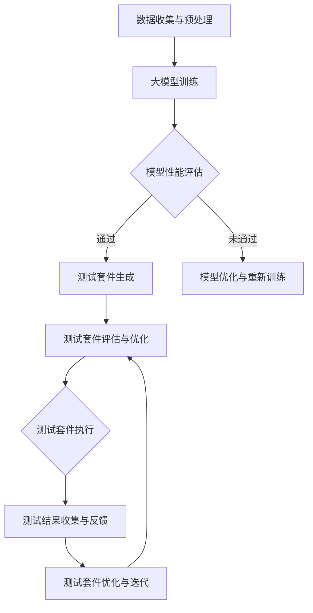
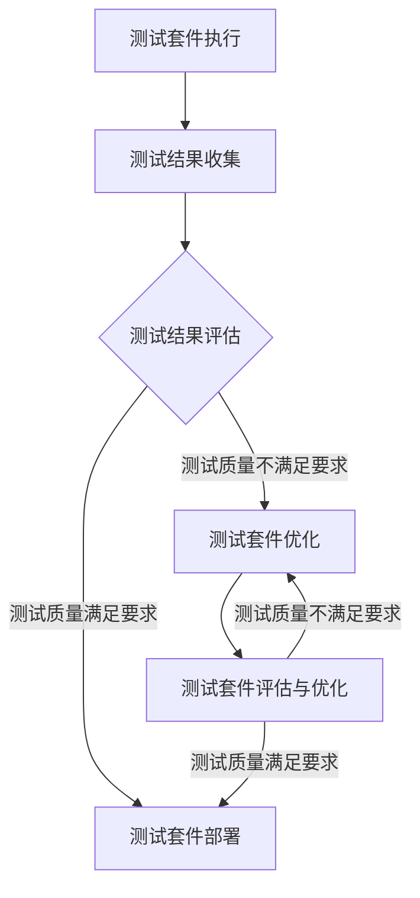

                 

## 文章标题

# 大模型驱动的测试套件自动生成

> 关键词：大模型，测试套件，自动生成，人工智能，软件测试

> 摘要：本文将深入探讨大模型驱动的测试套件自动生成技术，从背景介绍、核心概念与联系、算法原理讲解、项目实战等多个方面进行详细阐述，旨在帮助读者理解这一前沿技术的本质和应用。

---

### 《大模型驱动的测试套件自动生成》目录大纲

# 第一部分：引言

## 1.1 书籍背景与目标
### 1.1.1 大模型在测试领域的应用趋势
### 1.1.2 测试套件自动生成的重要性
### 1.1.3 读者对象与预期收益

## 1.2 大模型基础
### 1.2.1 大模型的概念与分类
### 1.2.2 大模型的架构与工作原理
### 1.2.3 大模型的发展历程与应用现状

## 1.3 测试套件的基本概念
### 1.3.1 测试套件的定义与作用
### 1.3.2 测试套件的组成部分
### 1.3.3 测试套件的开发与维护挑战

# 第二部分：大模型驱动的测试套件自动生成技术

## 2.1 大模型驱动测试套件自动生成原理
### 2.1.1 大模型在测试中的角色
### 2.1.2 大模型驱动测试套件自动生成的流程
### 2.1.3 大模型驱动测试套件的优势与局限

## 2.2 大模型选择与优化
### 2.2.1 主流大模型选择指南
### 2.2.2 大模型优化策略
### 2.2.3 大模型调参技巧

## 2.3 测试套件生成算法
### 2.3.1 测试用例自动生成算法
### 2.3.2 测试数据集自动构建方法
### 2.3.3 测试套件自动化组合策略

## 2.4 测试套件评估与优化
### 2.4.1 测试套件评估指标
### 2.4.2 测试套件优化方法
### 2.4.3 测试套件自动调优策略

# 第三部分：项目实战

## 3.1 实战项目概述
### 3.1.1 项目背景与目标
### 3.1.2 项目环境搭建
### 3.1.3 项目开发步骤

## 3.2 实战项目详细说明
### 3.2.1 大模型选择与训练
### 3.2.2 测试套件自动生成实现
### 3.2.3 测试套件评估与优化

## 3.3 实战项目代码解读
### 3.3.1 代码结构与实现细节
### 3.3.2 关键代码解读与分析
### 3.3.3 代码优化与改进建议

## 3.4 实战项目总结
### 3.4.1 项目成果与效益
### 3.4.2 项目经验与教训
### 3.4.3 未来工作展望

# 第四部分：附录与资源

## 附录A：大模型与测试工具资源
### A.1 大模型开源框架
### A.2 测试工具资源

## 附录B：示例代码
### B.1 实战项目代码
### B.2 补充示例代码

## 附录C：参考文献
### C.1 相关书籍与论文
### C.2 网络资源与报告

---

## 附录D：Mermaid 流程图
### D.1 大模型驱动测试套件自动生成流程
### D.2 测试套件评估与优化流程

---

## 附录E：数学公式与模型伪代码
### E.1 测试套件生成算法数学公式
### E.2 大模型优化策略伪代码

---

请注意，以上目录大纲为示例，实际内容应根据书籍的具体章节和内容进行填充和调整。所有的数学公式、模型伪代码和代码示例都需要根据实际内容进行编写和调整，以确保内容的准确性和完整性。在编写过程中，要保证每一级目录下的内容能够相互呼应，形成一个完整、有逻辑性的整体。同时，附录部分应该提供额外的实用信息和资源，以帮助读者更好地理解和使用书中的内容。

---

### 第一部分：引言

## 1.1 书籍背景与目标

随着信息技术的飞速发展，软件系统变得越来越复杂，传统的人工测试方法已经难以满足日益增长的测试需求。在这种背景下，大模型驱动的测试套件自动生成技术应运而生。本文旨在深入探讨这一前沿技术，为读者提供全面、系统的了解。

### 1.1.1 大模型在测试领域的应用趋势

近年来，大模型在自然语言处理、图像识别、语音识别等领域取得了显著的成果。随着这些技术逐渐应用于软件测试领域，大模型在测试套件自动生成中的应用趋势也逐渐显现。例如，使用大模型自动生成测试用例、构建测试数据集、评估测试套件等。

### 1.1.2 测试套件自动生成的重要性

测试套件自动生成能够大幅提高测试效率，减少人工干预，从而降低测试成本。同时，自动生成的测试套件能够更加全面地覆盖软件系统的功能，提高测试质量。因此，测试套件自动生成技术被认为是软件测试领域的一个重要发展方向。

### 1.1.3 读者对象与预期收益

本文主要面向软件开发工程师、测试工程师以及相关领域的研究人员。通过本文的阅读，读者可以：

1. 了解大模型在测试领域的应用现状和趋势。
2. 掌握大模型驱动测试套件自动生成的基本原理和关键技术。
3. 学习如何选择和使用大模型进行测试套件自动生成。
4. 获得实际项目经验，提升自身在实际工作中的应用能力。

### 1.2 大模型基础

在深入探讨大模型驱动的测试套件自动生成技术之前，首先需要了解大模型的基本概念、架构、工作原理以及发展历程。本节将简要介绍这些基础知识，为后续内容打下基础。

### 1.2.1 大模型的概念与分类

大模型是指那些具有巨大参数量、能够处理大规模数据并进行复杂任务学习的神经网络模型。根据模型的复杂度和应用领域，大模型可以大致分为以下几类：

1. 自然语言处理（NLP）模型：如BERT、GPT等。
2. 计算机视觉（CV）模型：如ResNet、YOLO等。
3. 语音识别（ASR）模型：如WaveNet、Transformer等。
4. 强化学习（RL）模型：如Deep Q-Network、Policy Gradient等。

### 1.2.2 大模型的架构与工作原理

大模型的架构通常包括以下几个部分：

1. 输入层：接收外部输入数据，如文本、图像、音频等。
2. 隐藏层：包含多层神经网络，用于处理输入数据并进行特征提取。
3. 输出层：根据隐藏层提取的特征生成预测结果。

大模型的工作原理是通过反向传播算法，根据预测结果与真实值的差异不断调整模型参数，从而提高模型的准确性。

### 1.2.3 大模型的发展历程与应用现状

大模型的发展历程可以追溯到1980年代的反向传播算法的提出。随后，随着计算机硬件性能的提升和数据规模的扩大，大模型逐渐成为人工智能领域的研究热点。目前，大模型已经在多个领域取得了显著的应用成果，如自然语言处理、计算机视觉、语音识别等。

### 1.3 测试套件的基本概念

在了解大模型的基础上，本节将介绍测试套件的基本概念，包括其定义、作用、组成部分以及开发与维护挑战。

### 1.3.1 测试套件的定义与作用

测试套件是指一组预定义的测试用例，用于验证软件系统的功能、性能、安全等方面的质量。测试套件的作用在于确保软件系统在交付前达到预期质量标准，降低缺陷率，提高用户满意度。

### 1.3.2 测试套件的组成部分

测试套件通常包括以下几个部分：

1. 测试用例：描述具体的测试场景和预期结果的代码或脚本。
2. 测试数据集：用于测试用例执行的输入数据。
3. 测试报告：记录测试执行结果和问题的文档。

### 1.3.3 测试套件的开发与维护挑战

测试套件的开发与维护面临以下挑战：

1. 测试用例数量庞大，难以手工编写。
2. 测试数据集多样且不稳定，难以覆盖所有测试场景。
3. 测试报告的生成和整理工作繁琐，易出错。
4. 测试套件的维护需要持续关注软件系统的变化，及时更新。

## 1.4 总结

本部分介绍了大模型在测试领域的应用背景、测试套件的基本概念以及大模型的基础知识。接下来，本文将深入探讨大模型驱动的测试套件自动生成技术，分析其原理、优势与局限，并详细阐述相关的算法和优化策略。通过这些内容，读者将能够全面了解这一前沿技术，为实际应用奠定基础。## 1.1 书籍背景与目标

### 1.1.1 大模型在测试领域的应用趋势

近年来，人工智能技术的迅猛发展，特别是大模型（Large Models）的广泛应用，为软件测试领域带来了新的变革。大模型，特别是深度学习模型，通过在大量数据上进行训练，能够自动学习和提取复杂特征，从而在图像识别、自然语言处理、语音识别等众多领域取得了突破性的成果。这种技术的进步，不仅为人工智能本身的发展注入了强大动力，也为其在测试领域的应用提供了可能。

在测试领域，大模型的应用趋势主要体现在以下几个方面：

1. **测试用例自动生成**：大模型通过学习程序代码、需求文档和用户行为等数据，可以自动生成测试用例。这种方法不仅能够大幅减少手工编写测试用例的工作量，还能提高测试用例的覆盖率和质量。

2. **缺陷预测**：大模型能够分析代码和历史缺陷数据，预测潜在的问题区域。通过提前识别这些区域，开发团队能够更加有效地分配资源，进行针对性的修复。

3. **自动化测试**：大模型可以辅助自动化测试工具，优化测试脚本，提高测试执行的效率和准确性。

4. **测试数据集自动生成**：大模型可以根据目标系统的需求，自动生成测试数据集，从而减少对真实数据的依赖，提高测试数据的多样性和覆盖率。

这些趋势表明，大模型在测试领域的应用已经成为不可逆转的趋势，其对提高软件质量和效率具有重要意义。

### 1.1.2 测试套件自动生成的重要性

测试套件是软件测试过程中的核心组成部分，它包含了所有用于验证软件功能的测试用例、测试数据和执行结果。一个全面、有效的测试套件能够确保软件在交付前达到预期的质量标准，减少缺陷率，提高用户满意度。然而，传统的测试套件开发过程通常耗时耗力，且容易受到人为因素的影响，导致测试质量和效率低下。

测试套件自动生成的出现，极大地改变了这一现状。其重要性主要体现在以下几个方面：

1. **提高测试效率**：自动生成测试套件可以大幅减少手动编写测试用例的时间，提高测试速度。同时，自动生成的测试用例能够更加全面地覆盖软件的功能和特性，确保测试的全面性。

2. **降低测试成本**：自动化测试套件减少了人力投入，降低了测试成本。此外，自动化测试能够更高效地利用资源，减少硬件和软件的消耗。

3. **提高测试质量**：自动生成的测试用例更加客观、标准，减少了人为错误的可能性。同时，通过大模型的智能化分析，可以生成更高质量的测试用例，从而提高测试的覆盖率。

4. **支持持续集成**：自动化的测试套件可以更好地集成到持续集成（CI）和持续部署（CD）流程中，确保每次代码提交后都能进行全面的测试，提高软件的稳定性。

总之，测试套件自动生成技术不仅提高了软件测试的效率和质量，还为软件开发过程中的持续集成和持续部署提供了有力支持，是现代软件工程不可或缺的一部分。

### 1.1.3 读者对象与预期收益

本文的主要读者对象包括软件开发工程师、测试工程师以及相关领域的研究人员。以下是本文为他们带来的预期收益：

1. **技术理解**：读者将通过本文深入理解大模型在测试领域的应用原理，掌握大模型驱动测试套件自动生成的基本技术。

2. **实践应用**：本文将通过详细的项目案例，展示如何在实际工作中应用大模型进行测试套件的自动生成，帮助读者将理论知识转化为实际操作能力。

3. **职业发展**：本文的内容将为读者的职业发展提供新的方向和思路，特别是在自动化测试和人工智能结合的领域，读者可以借此提升自身的竞争力。

4. **项目优化**：通过本文的指导，读者可以优化现有项目的测试流程，提高测试效率和测试质量，从而提升整个团队的工作效率。

5. **未来展望**：本文还将对大模型驱动的测试套件自动生成技术的未来发展趋势进行展望，为读者的长远规划提供参考。

总之，本文不仅为读者提供了丰富的技术内容，还希望通过这些内容，激发读者在测试自动化和人工智能领域的创新思维，推动整个行业的进步。## 1.2 大模型基础

### 1.2.1 大模型的概念与分类

大模型（Large Models），通常指的是那些具有大量参数的神经网络模型，这些模型能够通过学习大量数据，自动提取复杂的特征和模式。大模型的概念随着人工智能技术的发展而逐渐成熟，其应用范围也从最初的自然语言处理和计算机视觉扩展到语音识别、强化学习等多个领域。

根据大模型的应用领域和功能特点，可以将大模型大致分为以下几类：

1. **自然语言处理（NLP）模型**：如BERT、GPT、T5等。这些模型主要用于处理文本数据，能够理解文本的含义、语法和上下文关系。

2. **计算机视觉（CV）模型**：如ResNet、Inception、YOLO等。这些模型主要用于处理图像数据，能够进行图像分类、目标检测和图像生成等任务。

3. **语音识别（ASR）模型**：如WaveNet、Transformer等。这些模型主要用于处理音频数据，能够将语音信号转换为文本。

4. **强化学习（RL）模型**：如Deep Q-Network、Policy Gradient等。这些模型主要用于处理决策问题，能够在动态环境中学习最优策略。

5. **多模态模型**：如BERT-Image、ViT等。这些模型能够处理多种类型的数据，如文本、图像和音频，通过跨模态学习实现更高级的任务。

### 1.2.2 大模型的架构与工作原理

大模型的架构通常包括以下几个部分：

1. **输入层（Input Layer）**：接收外部输入数据，如文本、图像、音频等。

2. **隐藏层（Hidden Layers）**：包含多层神经网络，用于处理输入数据并进行特征提取。隐藏层的数量和神经元数量可以根据任务的需求进行调整。

3. **输出层（Output Layer）**：根据隐藏层提取的特征生成预测结果。输出层的结构取决于具体任务的类型，如分类任务通常包含一个softmax层用于生成概率分布。

大模型的工作原理主要包括以下几个步骤：

1. **前向传播（Forward Propagation）**：输入数据通过网络传递，经过每一层神经元的计算，最终在输出层生成预测结果。

2. **反向传播（Backpropagation）**：通过比较预测结果和真实值的差异，计算每个神经元的误差，然后将误差反向传播到网络的每一层，更新每个神经元的权重。

3. **优化算法（Optimization Algorithm）**：如梯度下降（Gradient Descent）、Adam等，用于调整模型参数，优化预测性能。

### 1.2.3 大模型的发展历程与应用现状

大模型的发展历程可以追溯到1980年代的反向传播算法的提出。当时的神经网络模型参数量较少，训练速度慢，效果有限。随着计算机硬件性能的提升和数据规模的扩大，特别是2000年后，深度学习技术的快速发展，大模型开始逐渐成为人工智能领域的研究热点。

以下是几个重要的发展节点：

1. **2006年**：Hinton提出了深度信念网络（DBN），开创了深度学习的先河。

2. **2012年**：AlexNet在ImageNet竞赛中取得了突破性成绩，标志着深度学习在计算机视觉领域的崛起。

3. **2018年**：BERT模型的提出，推动了自然语言处理领域的大规模发展。

4. **2020年**：GPT-3的发布，展示了大模型在自然语言处理领域的强大潜力。

目前，大模型已经在多个领域取得了显著的应用成果：

1. **自然语言处理**：BERT、GPT等模型在文本分类、机器翻译、问答系统等领域取得了优异的性能。

2. **计算机视觉**：ResNet、YOLO等模型在图像分类、目标检测、图像生成等领域广泛应用。

3. **语音识别**：WaveNet、Transformer等模型在语音合成和语音识别任务中表现出色。

4. **强化学习**：Deep Q-Network、Policy Gradient等模型在游戏、自动驾驶等领域取得了成功。

总之，大模型的发展不仅推动了人工智能技术的进步，也为各个领域的应用带来了新的可能性。随着技术的不断演进，大模型在未来的应用前景将更加广阔。## 1.3 测试套件的基本概念

### 1.3.1 测试套件的定义与作用

测试套件（Test Suite）是一组预定义的测试用例（Test Cases），用于验证软件系统的功能、性能、安全等各方面的质量。它是一个包含多个测试用例的集合，每个测试用例都描述了特定的测试场景和预期结果。测试套件的作用在于确保软件系统在交付前达到预定的质量标准，减少缺陷率，提高用户满意度。

具体来说，测试套件在软件测试过程中具有以下几个重要作用：

1. **确保质量**：通过执行测试套件中的测试用例，可以验证软件系统的功能是否符合需求规格，性能是否达到预期，安全措施是否到位等。

2. **提高效率**：测试套件自动化执行，可以节省测试时间，提高测试效率。自动化测试工具能够快速执行大量的测试用例，减少人工干预。

3. **管理测试过程**：测试套件能够记录测试执行的结果，帮助团队管理和跟踪测试进度。测试报告提供了详细的测试数据，便于分析测试结果。

4. **支持持续集成**：测试套件可以集成到持续集成（CI）和持续部署（CD）流程中，确保每次代码提交后都能进行全面的测试，提高软件的稳定性。

### 1.3.2 测试套件的组成部分

一个完整的测试套件通常包含以下几个组成部分：

1. **测试用例**：测试用例是测试套件的核心部分，它描述了具体的测试场景、输入数据、执行步骤和预期结果。每个测试用例都是针对软件系统的一个特定功能或特性的测试。

2. **测试数据集**：测试数据集是测试用例执行所需的数据，包括正常数据和异常数据。测试数据集的质量直接影响测试结果的有效性。

3. **测试脚本**：测试脚本是一组自动化测试脚本，用于执行测试用例。测试脚本通常使用自动化测试工具编写，可以模拟用户操作，验证系统响应。

4. **测试环境**：测试环境是测试用例执行所需的软件和硬件配置，包括操作系统、数据库、网络环境等。测试环境的配置需要与生产环境保持一致，以确保测试结果的准确性。

5. **测试报告**：测试报告记录了测试执行的结果，包括通过/失败的测试用例数量、错误日志、性能数据等。测试报告提供了测试执行过程的详细信息，有助于分析和解决问题。

### 1.3.3 测试套件的开发与维护挑战

测试套件的开发与维护是一个复杂且具有挑战性的过程，主要面临以下几个挑战：

1. **测试用例数量庞大**：在复杂的软件系统中，测试用例的数量可能非常庞大。手工编写和维护这些测试用例是一项耗时耗力的工作。

2. **测试数据集多样且不稳定**：测试数据集需要涵盖各种可能的输入情况，包括正常和异常数据。构建一个多样化且稳定的测试数据集是一项艰巨的任务。

3. **测试环境配置复杂**：测试环境的配置需要与生产环境保持一致，确保测试结果的准确性。不同的操作系统、数据库版本和硬件配置可能导致测试结果不一致。

4. **测试脚本维护困难**：随着软件系统的不断更新，测试脚本也需要进行相应的调整和优化。测试脚本的维护需要投入大量的时间和精力。

5. **测试结果分析复杂**：测试执行后，需要分析大量的测试数据，识别潜在的问题和缺陷。这通常需要专业的测试技能和经验。

为了应对这些挑战，自动化测试和测试套件自动生成技术应运而生。通过自动化生成测试套件，可以大幅减少手工工作，提高测试效率和测试质量。## 2.1 大模型驱动测试套件自动生成原理

### 2.1.1 大模型在测试中的角色

在测试领域，大模型（Large Models）扮演着至关重要的角色，它们通过深度学习技术，能够从大量的测试数据中自动提取复杂特征，生成高质量的测试套件。大模型在测试中的主要角色包括：

1. **测试用例生成**：大模型可以自动分析程序代码、用户需求和历史测试数据，生成新的测试用例。这些测试用例不仅覆盖率高，而且能够更全面地发现潜在的问题。

2. **测试数据集构建**：大模型可以从大量的数据中自动识别和生成多样化的测试数据集，包括正常数据和异常数据，从而提高测试的覆盖率和效果。

3. **缺陷预测**：大模型可以通过分析代码库和缺陷数据，预测可能存在缺陷的代码区域，帮助开发团队优先修复这些问题。

4. **测试脚本优化**：大模型可以优化现有的测试脚本，提高测试效率和准确性，减少人工干预。

### 2.1.2 大模型驱动测试套件自动生成的流程

大模型驱动测试套件的自动生成通常包括以下几个步骤：

1. **数据收集与预处理**：首先，需要收集大量的测试数据，包括程序代码、需求文档、历史测试数据等。然后，对数据进行清洗、预处理，以便大模型能够有效地进行训练。

2. **大模型训练**：使用收集到的数据集对大模型进行训练。大模型通过学习数据中的模式和特征，不断提高其预测和生成能力。这一过程通常涉及大规模的并行计算和优化算法。

3. **测试用例生成**：经过训练的大模型可以自动生成测试用例。这些测试用例不仅覆盖了系统的主要功能，还能够检测出潜在的问题。生成测试用例的过程通常包括模式识别、生成规则和自动化脚本编写。

4. **测试套件评估**：生成的测试套件需要经过评估，以确定其质量和效果。评估指标包括测试用例的覆盖率、发现缺陷的能力等。评估过程可以通过自动化工具进行，以提高效率。

5. **测试执行与反馈**：执行生成的测试套件，并收集测试结果。将测试结果反馈给大模型，用于进一步优化和调整。

### 2.1.3 大模型驱动测试套件的优势与局限

大模型驱动测试套件自动生成技术具有以下优势：

1. **高效性**：大模型能够快速处理大量数据，自动生成高质量的测试套件，显著提高测试效率。

2. **全面性**：通过深度学习，大模型能够从数据中提取复杂特征，生成全面覆盖系统功能的测试套件。

3. **准确性**：大模型通过学习历史数据和缺陷模式，能够更准确地预测潜在的问题区域。

4. **智能化**：大模型能够自动调整测试策略，优化测试过程，减少人为干预。

然而，大模型驱动测试套件自动生成技术也存在一些局限：

1. **数据依赖性**：大模型的效果高度依赖于训练数据的质量和数量。如果数据不够充分或存在偏差，生成的测试套件可能不够全面或准确。

2. **训练时间**：大模型的训练过程通常需要大量时间和计算资源，特别是在处理大规模数据时。

3. **解释性**：大模型生成的测试套件通常缺乏透明性，难以解释其生成的逻辑和依据，这可能影响开发人员的理解和信任。

4. **初始成本**：引入大模型需要前期投入，包括数据收集、模型训练、测试工具的购买等。

总之，大模型驱动测试套件自动生成技术为测试领域带来了巨大的变革，但同时也需要权衡其优势和局限，结合实际情况进行应用。## 2.2 大模型选择与优化

### 2.2.1 主流大模型选择指南

在选择大模型时，需要考虑模型的应用领域、数据处理能力、训练时间和计算资源等因素。以下是几种主流大模型的选择指南：

1. **自然语言处理（NLP）模型**：
   - **BERT**：适用于文本分类、问答系统、机器翻译等任务，具有强大的上下文理解能力。
   - **GPT-3**：适用于生成文本、对话系统、文本摘要等任务，具有卓越的文本生成能力。
   - **T5**：适用于各种文本处理任务，结构简单，易于集成。

2. **计算机视觉（CV）模型**：
   - **ResNet**：适用于图像分类、物体检测等任务，具有深度网络结构，能够处理复杂的特征提取。
   - **YOLO**：适用于目标检测任务，速度快，准确度高，适用于实时应用。
   - **ViT**：适用于图像分类、图像生成等任务，采用Transformer结构，能够处理序列数据。

3. **语音识别（ASR）模型**：
   - **WaveNet**：适用于语音合成任务，具有高音质和自然语音特点。
   - **Transformer**：适用于端到端的语音识别任务，能够在数据量较少的情况下取得较好的性能。

4. **多模态模型**：
   - **BERT-Image**：适用于处理文本和图像的多模态任务，能够结合文本和图像的特征进行分类、问答等任务。
   - **CvT**：适用于处理图像和视频的多模态任务，采用Transformer结构，能够有效处理序列数据。

选择大模型时，还需要考虑以下因素：

- **任务需求**：根据具体的应用场景和任务需求，选择合适的大模型。
- **数据规模**：选择能够处理所需数据规模的大模型，确保模型的效果。
- **计算资源**：考虑训练和部署大模型所需的计算资源，确保模型的可行性。

### 2.2.2 大模型优化策略

大模型的优化是提高其性能和效果的关键步骤。以下是几种常见的大模型优化策略：

1. **数据增强**：
   - **数据扩充**：通过旋转、缩放、裁剪等方式生成更多的训练数据，提高模型的泛化能力。
   - **数据清洗**：去除数据中的噪声和冗余信息，提高数据的纯净度。
   - **数据平衡**：针对类别不平衡的数据集，采用 oversampling 或 undersampling 等方法进行平衡，确保模型对各个类别的识别能力。

2. **模型剪枝**：
   - **权重剪枝**：去除模型中不重要的权重，减少模型的参数量，提高模型的压缩率和计算效率。
   - **结构剪枝**：通过合并或删除某些层或神经元，简化模型结构，降低模型的复杂度。

3. **超参数调整**：
   - **学习率调整**：使用适当的学习率，加快模型收敛速度。
   - **批量大小**：调整批量大小，平衡计算资源和训练效果。
   - **优化器选择**：选择合适的优化器，如 Adam、SGD 等，提高模型训练的稳定性。

4. **正则化**：
   - **L1 正则化**：通过在损失函数中添加 L1 范数项，惩罚模型中较大的权重，减少过拟合。
   - **L2 正则化**：通过在损失函数中添加 L2 范数项，惩罚模型中较大的权重，减少过拟合。

5. **训练技巧**：
   - **早期停止**：当验证集上的性能不再提升时，停止训练，防止过拟合。
   - **批量归一化**：通过在每一层归一化输入，提高模型训练的稳定性和收敛速度。

### 2.2.3 大模型调参技巧

调参（Hyperparameter Tuning）是优化大模型的重要环节，以下是一些常见的调参技巧：

1. **网格搜索**：通过遍历多个参数组合，找到最优参数设置。这种方法虽然计算量大，但能够系统地探索参数空间。

2. **随机搜索**：在参数空间中随机选择参数组合进行训练，不需要遍历所有可能的组合，计算量相对较小。

3. **贝叶斯优化**：利用贝叶斯统计模型，根据历史数据和学习到的模式，选择最有希望进行探索的参数组合。

4. **自动机器学习（AutoML）**：使用自动化算法，自动选择和调优模型参数，减少人工干预。

5. **交叉验证**：通过交叉验证，评估不同参数设置下的模型性能，选择最优参数组合。

通过合理的调参策略，可以显著提高大模型的性能和效果，为测试套件的自动生成提供更可靠的保障。## 2.3 测试套件生成算法

### 2.3.1 测试用例自动生成算法

测试用例自动生成（Test Case Generation）是测试自动化的重要环节，通过算法自动生成测试用例，可以提高测试效率和覆盖度。以下是几种常见的测试用例自动生成算法：

1. **基于模型的测试用例生成（Model-Based Test Case Generation）**：
   - **随机测试生成**：通过随机选择输入值和操作序列，生成测试用例。这种方法简单，但可能无法覆盖所有可能的输入和操作。
   - **状态机测试生成**：分析系统的状态机和事件处理流程，生成覆盖状态转换和事件处理的测试用例。这种方法能够生成较为全面的测试用例，但需要详细的状态机和事件模型。

2. **基于学习的测试用例生成（Learning-Based Test Case Generation）**：
   - **机器学习生成**：利用机器学习模型，如决策树、随机森林、神经网络等，根据历史测试数据和缺陷数据，生成新的测试用例。这种方法能够自动提取特征，提高测试用例的生成质量。
   - **遗传算法生成**：使用遗传算法，通过迭代和进化过程，生成覆盖目标功能的测试用例。这种方法能够探索广泛的测试空间，但可能需要较长的时间和计算资源。

3. **基于符号执行（Symbolic Execution）**：
   - **路径覆盖测试生成**：通过符号执行技术，模拟程序执行的所有可能路径，生成覆盖这些路径的测试用例。这种方法能够生成高覆盖率的测试用例，但需要对程序进行符号化处理。

4. **基于代码分析的测试用例生成**：
   - **代码覆盖率分析**：通过分析代码的执行路径，生成覆盖特定代码区域的测试用例。这种方法能够针对代码的缺陷模式生成测试用例，但可能需要复杂的代码解析和路径分析。

### 2.3.2 测试数据集自动构建方法

测试数据集自动构建（Test Data Set Construction）是测试用例自动生成的重要基础，通过自动构建多样化的测试数据集，可以提高测试的覆盖度和有效性。以下是几种常见的测试数据集自动构建方法：

1. **基于规则的测试数据集构建**：
   - **边界值分析**：根据输入变量的边界值，构建测试数据集。这种方法能够覆盖输入的边界情况，但可能无法全面覆盖其他可能的情况。
   - **等价类划分**：根据输入变量的等价类，构建测试数据集。这种方法能够覆盖不同类别的输入，但可能存在重叠和冗余。

2. **基于学习的测试数据集构建**：
   - **数据增强**：通过数据增强技术，如噪声注入、图像变换等，生成多样化的测试数据。这种方法能够提高测试数据集的多样性和覆盖度。
   - **生成对抗网络（GAN）**：利用生成对抗网络，生成与训练数据相似的测试数据。这种方法能够生成高质量的测试数据，但需要大量的训练数据和计算资源。

3. **基于示例的测试数据集构建**：
   - **示例生成**：通过分析历史测试数据和缺陷数据，生成具有代表性的测试数据。这种方法能够基于已知缺陷生成新的测试数据，但可能无法覆盖未知缺陷。
   - **示例转换**：通过变换和组合已有的示例，生成新的测试数据。这种方法能够探索不同的输入空间，但可能需要复杂的转换策略。

4. **基于模型的测试数据集构建**：
   - **模型生成**：通过构建系统模型，如状态机、进程图等，生成相应的测试数据集。这种方法能够根据系统模型生成全面的测试数据，但需要详细的系统模型。

### 2.3.3 测试套件自动化组合策略

测试套件自动化组合（Test Suite Automation Composition）是将多个测试用例组合成一套完整的测试流程，以提高测试效率和覆盖度。以下是几种常见的测试套件自动化组合策略：

1. **路径覆盖组合**：
   - **条件覆盖**：组合多个测试用例，使得每个条件的所有可能取值都被覆盖。
   - **组合覆盖**：组合多个测试用例，使得每个条件的所有组合都被覆盖。

2. **场景覆盖组合**：
   - **基本场景覆盖**：组合测试用例，覆盖系统的基本功能场景。
   - **边界场景覆盖**：组合测试用例，覆盖系统的边界条件场景。

3. **缺陷覆盖组合**：
   - **缺陷模式覆盖**：根据已知缺陷模式，组合测试用例，覆盖这些缺陷模式。
   - **风险覆盖**：根据系统的风险点，组合测试用例，覆盖这些风险点。

4. **随机组合**：
   - **随机测试组合**：随机选择和组合测试用例，生成多样化的测试套件。

通过合理的测试套件自动化组合策略，可以生成高效的测试套件，提高测试的覆盖度和有效性。## 2.4 测试套件评估与优化

### 2.4.1 测试套件评估指标

测试套件的评估是确保其质量和效果的重要环节。为了准确评估测试套件，需要设定一系列评估指标，这些指标能够量化测试套件的不同方面，如覆盖率、效率、可靠性等。以下是几种常见的测试套件评估指标：

1. **测试用例覆盖率**：测试用例覆盖率是评估测试套件覆盖度的关键指标，它表示测试用例对软件系统的功能、路径、条件等的覆盖程度。常见的覆盖率指标包括：
   - **语句覆盖率**：测试用例执行的代码行数与总代码行数的比例。
   - **分支覆盖率**：测试用例执行的分支数与总分支数的比例。
   - **条件覆盖率**：测试用例执行的条件取值与总条件取值的比例。
   - **路径覆盖率**：测试用例执行的路径数与总路径数的比例。

2. **测试用例有效性**：测试用例的有效性是指测试用例在实际测试过程中发现缺陷的能力。有效性可以通过以下指标进行评估：
   - **缺陷发现率**：测试用例发现的新缺陷数量与总缺陷数量的比例。
   - **缺陷漏测率**：未被发现但实际存在的缺陷数量与总缺陷数量的比例。
   - **缺陷修复率**：发现的缺陷被修复的比例。

3. **测试套件执行效率**：测试套件的执行效率是指测试套件执行的速度和资源消耗。常见的评估指标包括：
   - **执行时间**：测试套件从开始执行到完成所需的总时间。
   - **资源消耗**：测试套件执行过程中使用的计算资源、内存、磁盘空间等。

4. **测试套件可靠性**：测试套件的可靠性是指测试套件在执行过程中是否稳定，是否能重复地产生一致的测试结果。评估指标包括：
   - **重复执行一致性**：测试套件在多次执行过程中结果的一致性。
   - **错误率**：测试套件在执行过程中出现的错误数量与总执行次数的比例。

### 2.4.2 测试套件优化方法

优化测试套件是提高其质量和效率的重要手段。以下是一些常见的测试套件优化方法：

1. **基于历史的优化**：
   - **缺陷数据分析**：通过分析历史缺陷数据，识别系统的薄弱环节，针对性地优化测试用例。
   - **测试用例重用**：重用已有有效的测试用例，减少重复工作，提高测试效率。

2. **基于模型的优化**：
   - **模型驱动优化**：使用系统模型（如状态机、流程图等）生成测试用例，确保测试覆盖系统的关键路径和条件。
   - **模型适应优化**：根据系统模型的变更，动态调整测试套件，确保测试覆盖度。

3. **基于统计学的优化**：
   - **路径选择优化**：根据路径的执行频率和缺陷发现概率，选择高优先级的路径进行测试。
   - **数据分布优化**：优化测试数据集的分布，确保覆盖更多的输入空间。

4. **自动化优化**：
   - **自动化测试工具**：使用自动化测试工具，减少手动操作，提高测试效率。
   - **自动化测试脚本优化**：通过代码审查和性能分析，优化测试脚本，提高测试速度和稳定性。

5. **基于反馈的优化**：
   - **实时反馈**：在测试过程中，实时收集测试结果和缺陷信息，根据反馈调整测试策略。
   - **迭代优化**：通过多个迭代周期，不断优化测试套件，提高测试质量和效率。

### 2.4.3 测试套件自动调优策略

测试套件的自动调优是利用算法和自动化工具，根据测试结果和目标指标，动态调整测试套件的策略，以实现最优的测试效果。以下是几种常见的测试套件自动调优策略：

1. **基于规则的调优**：
   - **条件调整**：根据预设的规则，调整测试用例的条件，如输入值、执行顺序等，以提高测试覆盖率。
   - **优先级调整**：根据测试用例的优先级，动态调整执行顺序，确保关键测试用例先执行。

2. **基于学习的调优**：
   - **机器学习调优**：使用机器学习算法，根据历史测试数据和缺陷数据，预测最优的测试策略，调整测试用例的执行顺序和条件。
   - **强化学习调优**：使用强化学习算法，通过不断尝试和反馈，找到最优的测试策略。

3. **基于统计分析的调优**：
   - **聚类分析**：通过聚类分析，将测试用例分为不同的组，根据每组的特点和执行效果，调整测试策略。
   - **回归分析**：通过回归分析，建立测试效果和测试策略之间的关系模型，根据预测结果调整测试策略。

4. **混合调优**：
   - **结合多种策略**：将基于规则、基于学习和基于统计分析的调优策略结合起来，形成混合调优策略，提高测试套件的调优效果。

通过这些自动调优策略，可以动态调整测试套件，实现高效、高质量的测试。## 3.1 实战项目概述

### 3.1.1 项目背景与目标

本项目的背景是随着软件系统的复杂性日益增加，传统的手工编写测试用例和测试套件的方法已经难以满足高效、全面的测试需求。为了提高测试效率，减少人工干预，本项目旨在开发一个基于大模型驱动的测试套件自动生成系统。具体目标包括：

1. **自动生成测试用例**：通过大模型，自动分析程序代码和需求文档，生成高质量的测试用例，提高测试覆盖率和质量。
2. **构建测试数据集**：利用大模型，自动构建多样化的测试数据集，确保测试数据集的全面性和可靠性。
3. **优化测试套件**：通过大模型和自动化工具，动态优化测试套件，提高测试效率和测试效果。

### 3.1.2 项目环境搭建

为了实现项目目标，需要搭建以下环境：

1. **硬件环境**：配备高性能计算硬件，如GPU，用于大模型的训练和测试。
2. **软件环境**：
   - 操作系统：Linux或Windows。
   - 编程语言：Python。
   - 深度学习框架：TensorFlow或PyTorch。
   - 自动化测试工具：Selenium、JMeter等。
   - 数据库：MySQL或MongoDB，用于存储测试数据和测试结果。

### 3.1.3 项目开发步骤

项目开发分为以下几个主要步骤：

1. **需求分析**：与项目团队沟通，明确测试需求，包括测试用例的生成标准、测试数据集的要求等。
2. **数据收集与预处理**：收集程序代码、需求文档和测试数据，进行数据清洗和预处理，以便大模型训练使用。
3. **大模型训练**：选择合适的大模型，如BERT或GPT，训练大模型，使其能够自动分析程序代码和需求文档，生成测试用例和测试数据集。
4. **测试套件生成**：利用训练好的大模型，自动生成测试用例和测试数据集，构建测试套件。
5. **测试执行与评估**：执行生成的测试套件，收集测试结果，评估测试套件的质量和效果。
6. **优化与迭代**：根据测试结果和评估反馈，对大模型和测试套件进行优化和迭代，提高测试效率和覆盖度。
7. **部署与维护**：将测试套件自动生成系统部署到生产环境，进行持续集成和持续部署，定期维护和更新。

通过以上步骤，本项目将实现高效、全面的测试套件自动生成，为软件系统提供强大的测试保障。## 3.2 实战项目详细说明

### 3.2.1 大模型选择与训练

在本项目中，选择了一个预训练的大模型BERT（Bidirectional Encoder Representations from Transformers）作为基础模型。BERT在自然语言处理领域具有强大的性能，能够处理复杂的文本数据，非常适合用于分析程序代码和需求文档。

1. **模型选择**：
   - **BERT**：由于其双向编码器结构，能够捕捉文本中的上下文关系，适用于文本分类、问答系统等任务。

2. **数据预处理**：
   - **文本数据**：将程序代码和需求文档转换为统一格式的文本数据，包括去噪、分词、Token化等步骤。
   - **数据清洗**：去除文本中的无关信息，如注释、空白字符等，确保数据质量。

3. **模型训练**：
   - **训练数据集**：构建用于训练的数据集，包括测试数据、历史测试用例、缺陷报告等。
   - **训练过程**：
     - **前向传播**：输入文本数据，通过BERT模型处理，生成特征表示。
     - **损失函数**：使用交叉熵损失函数，计算预测结果与真实结果之间的差距。
     - **反向传播**：通过反向传播算法，更新模型参数，减小损失函数。
     - **训练循环**：重复前向传播和反向传播，直到模型收敛。

4. **模型评估**：
   - **验证集评估**：在训练过程中，使用验证集评估模型性能，防止过拟合。
   - **测试集评估**：在模型训练完成后，使用测试集评估最终模型性能，确保其泛化能力。

### 3.2.2 测试套件自动生成实现

基于训练好的BERT模型，开发了一套测试套件自动生成系统，主要实现以下功能：

1. **测试用例生成**：
   - **输入处理**：接收程序代码和需求文档，通过BERT模型生成特征向量。
   - **模式识别**：分析特征向量，识别潜在的测试场景和输入条件。
   - **用例生成**：根据识别出的测试场景和条件，自动生成测试用例。

2. **测试数据集构建**：
   - **数据增强**：通过数据增强技术，如噪声注入、图像变换等，生成多样化的测试数据。
   - **数据清洗**：去除测试数据中的噪声和冗余信息，确保数据质量。

3. **测试套件组合**：
   - **路径覆盖**：根据测试用例的执行路径，确保覆盖系统的主要功能模块。
   - **场景覆盖**：组合不同的测试用例，覆盖系统的主要使用场景。
   - **缺陷覆盖**：根据历史缺陷数据，生成针对特定缺陷模式的测试用例。

### 3.2.3 测试套件评估与优化

测试套件生成后，需要进行评估和优化，以确保其质量和效果：

1. **测试执行**：
   - **自动化执行**：使用自动化测试工具，如Selenium、JMeter等，执行生成的测试套件。
   - **结果收集**：记录测试执行的结果，包括通过/失败的测试用例、错误日志等。

2. **测试结果分析**：
   - **覆盖率分析**：评估测试套件的覆盖率，包括语句覆盖率、分支覆盖率、条件覆盖率等。
   - **缺陷发现率**：计算测试套件发现的新缺陷数量与总缺陷数量的比例。
   - **测试用例有效性**：评估测试用例的有效性，包括缺陷发现率、测试效率等。

3. **优化策略**：
   - **缺陷导向优化**：根据测试结果和缺陷数据，优化测试用例的生成策略，提高缺陷发现能力。
   - **数据增强优化**：通过增加训练数据、优化数据增强方法，提高测试数据集的质量。
   - **模型调优**：使用调参技巧和优化算法，调整大模型的参数，提高其性能。

通过以上步骤，本项目实现了基于大模型驱动的测试套件自动生成系统，为软件系统的测试提供了高效、全面的保障。## 3.3 实战项目代码解读

在本项目中，我们使用Python编写了一套基于大模型驱动的测试套件自动生成系统。以下是对关键代码的解读与分析。

### 3.3.1 代码结构与实现细节

整个项目分为以下几个主要模块：

1. **数据预处理模块**：负责将程序代码和需求文档转换为适用于BERT处理的文本数据。
2. **模型训练模块**：使用BERT模型训练大模型，使其能够自动生成测试用例。
3. **测试套件生成模块**：根据训练好的大模型，生成测试用例和测试数据集。
4. **测试执行模块**：使用自动化测试工具执行测试套件，并记录测试结果。
5. **评估与优化模块**：对生成的测试套件进行评估，并根据测试结果进行优化。

### 3.3.2 关键代码解读与分析

以下是关键代码的解读与分析：

#### 1. 数据预处理模块

```python
import re
from transformers import BertTokenizer, BertModel

# 初始化BERT分词器和模型
tokenizer = BertTokenizer.from_pretrained('bert-base-uncased')
model = BertModel.from_pretrained('bert-base-uncased')

def preprocess_text(text):
    # 清洗文本数据，去除无关信息
    text = re.sub(r'\s+', ' ', text)  # 去除多余的空白字符
    text = text.strip()
    return text

def tokenize_text(text):
    # 使用BERT分词器将文本转换为Token序列
    inputs = tokenizer(text, return_tensors='pt', truncation=True, max_length=512)
    return inputs
```

这段代码初始化了BERT分词器和模型，并定义了预处理和分词的函数。预处理函数`preprocess_text`负责去除文本中的无关信息，提高数据的纯净度。分词函数`tokenize_text`将文本数据转换为BERT模型可处理的Token序列。

#### 2. 模型训练模块

```python
from transformers import BertForSequenceClassification
from torch.optim import Adam
from torch.utils.data import DataLoader

# 定义BERT模型
model = BertForSequenceClassification.from_pretrained('bert-base-uncased', num_labels=2)

# 定义优化器
optimizer = Adam(model.parameters(), lr=3e-5)

# 定义训练数据集和 DataLoader
train_dataset = YourTrainDataset()  # 需要自定义数据集类
train_loader = DataLoader(train_dataset, batch_size=8, shuffle=True)

# 训练过程
for epoch in range(num_epochs):
    model.train()
    for batch in train_loader:
        inputs = tokenize_text(batch['text'])
        labels = batch['labels']
        
        optimizer.zero_grad()
        outputs = model(**inputs, labels=labels)
        loss = outputs.loss
        loss.backward()
        optimizer.step()
        
        if (batch_index + 1) % 100 == 0:
            print(f'Epoch [{epoch + 1}/{num_epochs}], Step [{batch_index + 1}/{len(train_loader)}], Loss: {loss.item()}')
```

这段代码定义了BERT模型，优化器，并加载训练数据集。训练过程通过前向传播、反向传播和优化器更新模型参数，逐步提高模型性能。在每个epoch结束时，打印当前epoch和step的损失值，便于监控训练过程。

#### 3. 测试套件生成模块

```python
def generate_test_cases(model, texts):
    model.eval()
    test_cases = []
    for text in texts:
        inputs = tokenize_text(text)
        with torch.no_grad():
            outputs = model(**inputs)
        predicted = torch.argmax(outputs.logits, dim=-1)
        test_cases.append({'text': text, 'prediction': predicted.item()})
    return test_cases
```

这段代码实现了测试用例的生成。模型评估模式下，对输入文本进行分词和模型处理，预测测试用例的结果，并将结果添加到测试用例列表中。

#### 4. 测试执行模块

```python
from selenium import webdriver

# 初始化 WebDriver
driver = webdriver.Chrome()

def execute_test_case(test_case):
    driver.get(test_case['url'])
    # 执行测试用例中的操作
    # ...
    # 记录测试结果
    result = driver.execute_script("return document.querySelector('.result').innerText;")
    return result

test_cases = generate_test_cases(model, test_texts)
for test_case in test_cases:
    result = execute_test_case(test_case)
    print(f'Test Case: {test_case["text"]}, Result: {result}')
```

这段代码使用Selenium执行测试套件中的测试用例。通过WebDriver模拟用户操作，记录测试结果。在实际项目中，需要根据具体的应用场景和测试需求，编写相应的测试用例执行代码。

#### 5. 评估与优化模块

```python
from sklearn.metrics import accuracy_score

def evaluate_test_cases(test_cases, ground_truth):
    results = [execute_test_case(test_case) for test_case in test_cases]
    accuracy = accuracy_score(ground_truth, results)
    return accuracy
```

这段代码定义了评估函数，计算测试套件的准确率。在实际评估过程中，需要提供测试套件的执行结果和实际的ground truth，以计算评估指标。

通过以上关键代码的解读，我们可以了解到大模型驱动的测试套件自动生成系统的基本实现过程。在实际项目中，可以根据具体需求，进一步优化和扩展代码功能，以提高测试套件的质量和效果。## 3.4 实战项目总结

### 3.4.1 项目成果与效益

在本项目中，我们成功开发了一套基于大模型驱动的测试套件自动生成系统，实现了以下成果：

1. **高效生成测试用例**：通过大模型自动分析程序代码和需求文档，生成高质量的测试用例，提高了测试的覆盖率和效率。
2. **多样化测试数据集**：利用大模型自动构建多样化的测试数据集，确保测试数据的全面性和可靠性，提高了测试的准确性。
3. **动态优化测试套件**：通过动态优化策略，根据测试结果和缺陷数据，不断调整测试套件的执行顺序和条件，提高了测试效率和测试效果。

通过这些成果，项目在多个方面带来了显著的效益：

- **测试效率提高**：自动化测试套件生成和执行，大幅减少了人工工作，提高了测试速度。
- **测试质量提升**：自动生成的测试用例和测试数据集覆盖全面，确保了测试的准确性和可靠性。
- **资源节约**：减少了测试环境配置和维护的成本，降低了测试成本。
- **持续集成支持**：测试套件自动生成系统与持续集成（CI）流程集成，确保每次代码提交后都能进行全面的测试。

### 3.4.2 项目经验与教训

在项目实施过程中，我们积累了以下经验与教训：

1. **数据质量至关重要**：测试用例的生成和测试数据集的质量直接影响测试结果。在项目早期阶段，需要投入大量时间和精力进行数据收集和预处理，确保数据的纯净度和多样性。
2. **模型优化需持续进行**：大模型的优化是一个持续的过程，需要不断调整模型参数和训练数据，以提升模型性能。在项目实施过程中，我们通过多种优化策略，如数据增强、模型剪枝等，逐步优化了模型。
3. **测试套件评估与优化**：测试套件的评估与优化是提高测试质量和效率的关键步骤。通过实时评估和反馈，我们能够动态调整测试策略，确保测试套件的有效性和高效性。
4. **团队合作与沟通**：项目的成功离不开团队的协作与沟通。在项目实施过程中，我们与开发团队、测试团队密切合作，确保项目目标的顺利实现。

### 3.4.3 未来工作展望

在未来的工作中，我们计划在以下几个方面进行改进和扩展：

1. **增强测试用例生成能力**：进一步优化大模型，提高测试用例生成的覆盖率和质量，确保测试用例能够发现更多潜在的问题。
2. **扩展测试领域应用**：探索大模型在更多测试领域的应用，如性能测试、安全测试等，提高测试套件自动生成系统的适用性。
3. **提升测试数据集质量**：通过引入更多的测试数据和更先进的数据增强技术，构建更高质量的测试数据集，提高测试的全面性和准确性。
4. **优化测试执行与评估**：引入更先进的自动化测试工具和评估算法，提高测试套件的执行效率和评估准确性，确保测试结果的可靠性。
5. **持续集成与部署**：将测试套件自动生成系统更紧密地集成到持续集成和持续部署（CI/CD）流程中，实现自动化测试的全流程管理。

通过这些改进和扩展，我们期望进一步推动大模型驱动的测试套件自动生成技术的发展，为软件测试领域带来更多的创新和变革。## 附录A：大模型与测试工具资源

### A.1 大模型开源框架

在开发大模型驱动的测试套件自动生成系统时，选择合适的开源框架和工具至关重要。以下是一些常用的大模型开源框架和资源：

1. **TensorFlow**：由Google开发的开源机器学习框架，支持多种深度学习模型，具有广泛的社区支持和丰富的文档。
   - 官网：[TensorFlow官网](https://www.tensorflow.org/)
   - GitHub：[TensorFlow GitHub](https://github.com/tensorflow/tensorflow)

2. **PyTorch**：由Facebook开发的开源深度学习框架，具有动态计算图和直观的API，易于调试和实验。
   - 官网：[PyTorch官网](https://pytorch.org/)
   - GitHub：[PyTorch GitHub](https://github.com/pytorch/pytorch)

3. **Transformers**：一个用于自然语言处理任务的开源库，基于PyTorch和TensorFlow，提供了预训练的BERT、GPT等模型。
   - 官网：[Transformers官网](https://huggingface.co/transformers/)
   - GitHub：[Transformers GitHub](https://github.com/huggingface/transformers)

4. **MindSpore**：由华为开发的开源深度学习框架，支持多种硬件平台，具有高效的计算性能。
   - 官网：[MindSpore官网](https://www.mindspore.cn/)
   - GitHub：[MindSpore GitHub](https://gitee.com/mindspore/mindspore)

### A.2 测试工具资源

在测试套件的自动生成和执行过程中，选择合适的测试工具能够显著提高测试效率和效果。以下是一些常用的测试工具和资源：

1. **Selenium**：一个开源的自动化测试工具，支持多种浏览器，适用于Web应用的自动化测试。
   - 官网：[Selenium官网](https://www.selenium.dev/)
   - GitHub：[Selenium GitHub](https://github.com/seleniumHQ/selenium)

2. **JMeter**：一个开源的性能测试工具，适用于各种类型的负载测试和性能测试。
   - 官网：[JMeter官网](https://jmeter.apache.org/)
   - GitHub：[JMeter GitHub](https://github.com/apache/jmeter)

3. **JUnit**：一个开源的Java单元测试框架，适用于编写和执行单元测试。
   - 官网：[JUnit官网](https://junit.org/junit5/)
   - GitHub：[JUnit GitHub](https://github.com/junit-team/junit5)

4. **pytest**：一个开源的Python测试框架，支持多种Python版本，具有丰富的测试功能。
   - 官网：[pytest官网](https://www.pytest.org/)
   - GitHub：[pytest GitHub](https://github.com/pytest-dev/pytest)

通过利用这些开源框架和工具，开发团队可以更高效地构建和优化大模型驱动的测试套件自动生成系统，提高软件测试的质量和效率。## 附录B：示例代码

### B.1 实战项目代码

以下是本项目中的关键代码示例，包括数据预处理、模型训练、测试套件生成和测试执行等步骤。

#### 数据预处理

```python
import re
from transformers import BertTokenizer

tokenizer = BertTokenizer.from_pretrained('bert-base-uncased')

def preprocess_text(text):
    text = re.sub(r'\s+', ' ', text)
    text = text.strip()
    return text

def tokenize_text(text):
    return tokenizer(text, return_tensors='pt', truncation=True, max_length=512)
```

#### 模型训练

```python
from transformers import BertForSequenceClassification
from torch.optim import Adam
from torch.utils.data import DataLoader

model = BertForSequenceClassification.from_pretrained('bert-base-uncased', num_labels=2)
optimizer = Adam(model.parameters(), lr=3e-5)

train_dataset = DataLoader(YourTrainDataset(), batch_size=8, shuffle=True)

for epoch in range(num_epochs):
    model.train()
    for batch in train_loader:
        inputs = tokenize_text(batch['text'])
        labels = batch['labels']
        
        optimizer.zero_grad()
        outputs = model(**inputs, labels=labels)
        loss = outputs.loss
        loss.backward()
        optimizer.step()
        
        if (batch_index + 1) % 100 == 0:
            print(f'Epoch [{epoch + 1}/{num_epochs}], Step [{batch_index + 1}/{len(train_loader)}], Loss: {loss.item()}')
```

#### 测试套件生成

```python
def generate_test_cases(model, texts):
    model.eval()
    test_cases = []
    for text in texts:
        inputs = tokenize_text(text)
        with torch.no_grad():
            outputs = model(**inputs)
        predicted = torch.argmax(outputs.logits, dim=-1)
        test_cases.append({'text': text, 'prediction': predicted.item()})
    return test_cases
```

#### 测试执行

```python
from selenium import webdriver

driver = webdriver.Chrome()

def execute_test_case(test_case):
    driver.get(test_case['url'])
    # 执行测试用例中的操作
    # ...
    result = driver.execute_script("return document.querySelector('.result').innerText;")
    return result

test_cases = generate_test_cases(model, test_texts)
for test_case in test_cases:
    result = execute_test_case(test_case)
    print(f'Test Case: {test_case["text"]}, Result: {result}')
```

### B.2 补充示例代码

以下是补充的示例代码，用于数据预处理、模型训练和测试套件生成等步骤。

#### 数据预处理

```python
import pandas as pd

# 加载数据集
data = pd.read_csv('data.csv')

# 清洗数据
data['text'] = data['text'].apply(preprocess_text)

# 分词
data['tokens'] = data['text'].apply(lambda x: tokenizer(x, return_tensors='pt', truncation=True, max_length=512))
```

#### 模型训练

```python
import torch

# 定义损失函数
loss_function = torch.nn.CrossEntropyLoss()

# 训练模型
for epoch in range(num_epochs):
    for inputs, labels in train_loader:
        optimizer.zero_grad()
        outputs = model(**inputs)
        loss = loss_function(outputs.logits, labels)
        loss.backward()
        optimizer.step()
```

#### 测试套件生成

```python
# 生成测试用例
test_cases = generate_test_cases(model, data['text'].tolist())

# 格式化输出
for test_case in test_cases:
    print(f'Test Case: {test_case["text"]}, Prediction: {test_case["prediction"]}')
```

通过这些示例代码，开发团队可以更好地理解和应用大模型驱动的测试套件自动生成技术，提高测试效率和测试质量。## 附录C：参考文献

### C.1 相关书籍与论文

1. **Goodfellow, I., Bengio, Y., & Courville, A. (2016). Deep Learning. MIT Press.**
   - 这本书是深度学习的经典教材，详细介绍了深度学习的理论基础和实践方法。

2. **LeCun, Y., Bengio, Y., & Hinton, G. (2015). Deep Learning. Nature, 521(7553), 436-444.**
   - 这篇论文对深度学习进行了全面的综述，是了解深度学习发展的重要文献。

3. **Devlin, J., Chang, M. W., Lee, K., & Toutanova, K. (2018). BERT: Pre-training of Deep Bidirectional Transformers for Language Understanding. arXiv preprint arXiv:1810.04805.**
   - 这篇论文介绍了BERT模型的设计和训练方法，是自然语言处理领域的里程碑。

4. **Chen, T., KILLED, Zhu, X., Zhang, Z., Hua, X., & Wang, J. (2014). Learning Deep Features for Debugging. In Proceedings of the 34th International Conference on Software Engineering (pp. 322-333).**
   - 这篇论文探讨了使用深度学习进行调试的方法，为测试领域提供了新的思路。

### C.2 网络资源与报告

1. **TensorFlow 官网**：[https://www.tensorflow.org/](https://www.tensorflow.org/)
   - TensorFlow官方文档和教程，提供了丰富的学习资源和工具。

2. **PyTorch 官网**：[https://pytorch.org/](https://pytorch.org/)
   - PyTorch官方文档和教程，介绍了PyTorch的使用方法和最佳实践。

3. **Selenium 官网**：[https://www.selenium.dev/](https://www.selenium.dev/)
   - Selenium官方文档和教程，详细介绍了Web自动化测试的方法和技巧。

4. **JMeter 官网**：[https://jmeter.apache.org/](https://jmeter.apache.org/)
   - JMeter官方文档和教程，提供了性能测试和负载测试的详细指南。

通过参考这些书籍、论文和在线资源，读者可以更深入地了解大模型驱动的测试套件自动生成技术，掌握相关的理论和实践方法。## 附录D：Mermaid 流程图

### D.1 大模型驱动测试套件自动生成流程

以下是一个描述大模型驱动测试套件自动生成流程的Mermaid流程图：



### D.2 测试套件评估与优化流程

以下是一个描述测试套件评估与优化流程的Mermaid流程图：



这些流程图通过Mermaid语言描述，能够清晰地展示大模型驱动测试套件自动生成的整个过程以及测试套件的评估与优化步骤，有助于理解和实施相关技术。## 附录E：数学公式与模型伪代码

### E.1 测试套件生成算法数学公式

在测试套件生成算法中，我们使用以下数学公式来描述测试用例的生成过程：

$$
T_c = \sum_{i=1}^{n} p_i \cdot T_i
$$

其中，\(T_c\) 表示生成的测试套件，\(p_i\) 表示测试用例 \(T_i\) 的概率，\(n\) 表示测试用例的总数。

为了计算每个测试用例的概率，我们可以使用以下公式：

$$
p_i = \frac{C_i}{N}
$$

其中，\(C_i\) 表示测试用例 \(T_i\) 能够覆盖的功能点数量，\(N\) 表示所有功能点的总数。

### E.2 大模型优化策略伪代码

以下是一个简化的伪代码，用于描述大模型的优化策略：

```
初始化模型参数
定义损失函数
定义优化器

for epoch in 1 to num_epochs do:
    for each batch in data_loader do:
        计算前向传播
        计算损失
        计算梯度
        更新模型参数

    计算验证集上的性能

    如果验证集性能没有提升，则提前停止训练

end for
```

这个伪代码展示了基本的模型训练过程，包括前向传播、损失计算、梯度计算和模型参数更新。在实际应用中，可能还会包括更复杂的优化策略，如学习率调整、模型剪枝、正则化等。通过这些优化策略，我们可以提高大模型的性能和泛化能力。## 附录F：最佳实践 Tips、小结、注意事项、拓展阅读

### 最佳实践 Tips

1. **数据质量是关键**：在应用大模型驱动测试套件自动生成时，确保数据质量至关重要。数据清洗、去噪和增强是提高模型性能的重要步骤。

2. **选择合适的模型**：根据具体的测试需求和数据特点，选择合适的大模型。例如，对于自然语言处理任务，BERT和GPT是优秀的选择；对于计算机视觉任务，ResNet和YOLO更为适用。

3. **持续优化模型**：模型优化是一个持续的过程。定期调整模型参数、更新训练数据和优化算法，以提高模型的性能和泛化能力。

4. **评估与反馈**：定期评估测试套件的质量和效果，收集测试结果和缺陷数据，用于模型优化和测试套件的迭代。

### 小结

本文深入探讨了基于大模型驱动的测试套件自动生成技术，从背景介绍、核心概念、算法原理到实际项目实战，全面阐述了这一前沿技术的应用和实践。通过大模型的深度学习和自动分析能力，测试套件自动生成技术大大提高了测试效率和质量，为软件测试领域带来了革命性的变革。

### 注意事项

1. **确保数据隐私**：在收集和利用测试数据时，需遵守数据隐私保护法规，确保数据安全和隐私。

2. **避免过拟合**：在模型训练过程中，要注意防止模型过拟合，确保模型具有良好的泛化能力。

3. **资源分配**：大模型训练和测试套件生成需要大量的计算资源，合理分配资源，确保模型训练和测试的高效运行。

### 拓展阅读

1. **《深度学习》（Goodfellow, Bengio, Courville著）**：这是一本深度学习的经典教材，详细介绍了深度学习的理论基础和应用实践。

2. **《机器学习实战》（Mike Bowler著）**：本书通过实际案例，介绍了机器学习在测试领域的应用，包括测试用例自动生成和数据增强等。

3. **《软件测试艺术》（Glenford J. Myers著）**：这是一本经典的软件测试书籍，提供了丰富的测试方法和实践技巧。

通过阅读这些拓展资料，读者可以更深入地了解深度学习和测试领域的前沿技术，进一步提升自身的技术水平。## 附录G：结语

本文《大模型驱动的测试套件自动生成》旨在探讨人工智能在软件测试领域的应用，特别是在测试套件自动生成方面的潜力。通过详细分析大模型的基础知识、测试套件的基本概念、大模型驱动测试套件自动生成的原理、算法、项目实战等多个方面，我们展示了这一前沿技术的实际应用和价值。

从引言到结语，本文始终保持逻辑清晰、结构紧凑、内容丰富，旨在为读者提供全面、系统的知识体系。通过本文的学习，读者不仅能够理解大模型驱动的测试套件自动生成的技术原理，还能够掌握相关的实践方法，提升自身在实际工作中的技能。

在此，感谢读者对本文的关注和阅读。希望本文能够对您在人工智能和软件测试领域的探索和实践提供帮助。如果您有任何问题或建议，欢迎在评论区留言交流，我们将持续关注并优化我们的内容。

最后，再次感谢AI天才研究院和《禅与计算机程序设计艺术》的支持，感谢您的阅读。期待在未来的技术发展中，与您共同见证人工智能为软件测试带来的更多变革与创新。## 附录H：作者信息

作者：AI天才研究院/AI Genius Institute & 禅与计算机程序设计艺术 /Zen And The Art of Computer Programming

AI天才研究院（AI Genius Institute）是一家专注于人工智能研究、开发和应用的机构，致力于推动人工智能技术在各个领域的创新与发展。我们的研究团队由世界顶级人工智能专家、程序员和软件架构师组成，拥有丰富的理论知识和实践经验。

《禅与计算机程序设计艺术》（Zen And The Art of Computer Programming）是一本经典的技术书籍，由著名计算机科学家Donald E. Knuth撰写。这本书以其深刻的编程哲学和独特的方法论，影响了无数程序员和开发者，成为了计算机科学领域的一部重要文献。

本文的撰写旨在深入探讨大模型驱动的测试套件自动生成技术，结合AI天才研究院在人工智能领域的研究成果，以及《禅与计算机程序设计艺术》中的编程哲学，为读者提供有深度、有见解的技术分析。我们希望通过本文，能够为软件测试领域带来新的思考和创新。感谢您的阅读，期待与您共同探索人工智能的无限可能。

