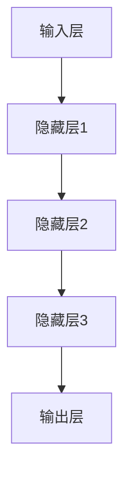
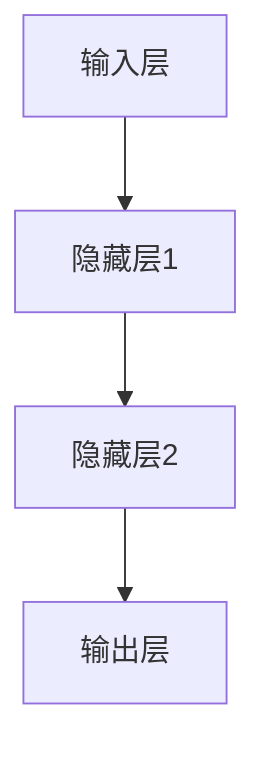

                 

# 大模型驱动的软件开发方法论

> 关键词：大模型、深度学习、软件开发、自动化、算法优化

> 摘要：本文深入探讨了大模型驱动的软件开发方法论，分析了大模型时代的来临、大模型的基础知识、核心算法与数学模型、大模型在软件开发中的应用，以及开发工具与资源。通过逐步分析，揭示了如何利用大模型提升软件开发的效率和质量，为未来的软件开发提供新的思路。

## 目录大纲

1. **大模型驱动的软件开发方法论**
2. **关键词与摘要**
3. **第一部分：大模型基础**
    1. **第1章：大模型概述**
        1. 1.1 大模型时代的来临
        2. 1.2 大模型定义与特点
        3. 1.3 大模型与传统模型的对比
        4. 1.4 大模型架构与原理
        5. 1.5 大模型应用场景
    2. **第2章：深度学习基础**
        1. 2.1 深度学习原理
        2. 2.2 自然语言处理
        3. 2.3 大规模预训练模型
    3. **第3章：大模型在软件开发中的应用**
        1. 3.1 大模型驱动开发方法论
        2. 3.2 大模型应用实例
        3. 3.3 大模型开发实战
    4. **第四部分：大模型开发工具与资源**
        1. **第4章：大模型开发工具**
        2. **第4章：大模型训练与部署**
        3. **第4章：大模型应用资源**
5. **附录**
    1. **附录 A：大模型开发资源汇总**
    2. **附录 B：进阶阅读推荐**
    3. **附录 C：大模型开发社区与论坛**

## 第一部分：大模型基础

### 第1章：大模型概述

#### 1.1 大模型时代的来临

在过去的几十年里，计算机科学经历了多次重大变革，从简单的逻辑门电路到复杂的处理器芯片，从简单的编程语言到复杂的高级编程框架。然而，随着互联网的普及和大数据技术的兴起，我们正进入一个全新的时代——大模型时代。

大模型时代的来临，源于以下几个方面：

1. **计算能力的提升**：随着计算能力的不断提升，我们能够处理更大规模的数据，训练更复杂的模型。
2. **数据规模的扩大**：互联网和物联网的普及，使得我们能够收集到海量的数据，为模型的训练提供了丰富的素材。
3. **算法的创新**：深度学习等算法的创新，使得我们能够从海量数据中提取有价值的信息。

#### 1.2 大模型定义与特点

大模型（Large Model），通常指的是具有巨大参数量的深度学习模型。它们通常由数百万至数十亿个参数组成，能够处理复杂数据并产生出色的性能。

大模型的特点包括：

1. **高参数量**：大模型拥有巨大的参数量，这使得它们能够捕捉数据中的复杂模式和规律。
2. **强大的泛化能力**：由于参数量的增加，大模型能够更好地泛化到未见过的数据上，提高了模型的鲁棒性。
3. **对数据的需求量大**：大模型的训练通常需要大量的数据，这使得它们能够从数据中学习到更多的信息。

#### 1.3 大模型与传统模型的对比

传统模型（如逻辑回归、SVM等）通常参数量较小，而大模型（如深度神经网络、Transformer等）则具有巨大的参数量。这使得大模型在处理复杂数据时具有明显的优势。

1. **性能**：大模型通常能够取得更好的性能，特别是在图像识别、自然语言处理等领域。
2. **计算复杂度**：由于参数量的增加，大模型的训练和推理过程通常更加复杂，需要更多的计算资源和时间。
3. **数据需求**：大模型通常需要更多的数据进行训练，以保证模型的泛化能力和鲁棒性。

### 1.4 大模型架构与原理

大模型的架构通常包括以下几个部分：

1. **输入层**：接收输入数据，如图片、文本等。
2. **隐藏层**：包含多个隐藏层，每个隐藏层都有大量的神经元，用于处理输入数据并提取特征。
3. **输出层**：根据隐藏层提取的特征，生成输出结果。

大模型的工作原理如下：

1. **前向传播**：将输入数据通过隐藏层，逐层计算并传递到输出层，得到预测结果。
2. **反向传播**：根据预测结果和实际结果，计算损失函数，并通过反向传播算法更新模型参数。

#### 1.5 大模型应用场景

大模型的应用场景非常广泛，包括：

1. **人工智能应用**：如图像识别、语音识别、自然语言处理等。
2. **企业应用场景**：如客户行为预测、风险控制、智能推荐等。
3. **未来发展趋势**：随着大模型技术的不断发展，未来将有更多的领域受益于大模型的应用。

## 第二部分：核心算法与数学模型

### 第2章：深度学习基础

#### 2.1 深度学习原理

深度学习（Deep Learning）是机器学习（Machine Learning）的一个重要分支，它通过构建深层神经网络（Deep Neural Network）来模拟人脑的学习过程，从而实现自动特征学习和复杂任务处理。

深度学习的原理主要包括以下几个方面：

1. **神经网络基础**：神经网络是深度学习的基础，它由大量的神经元组成，通过前向传播和反向传播算法进行训练和预测。
2. **深度学习算法**：深度学习算法主要包括卷积神经网络（CNN）、循环神经网络（RNN）、变换器架构（Transformer）等。
3. **深度学习优化**：深度学习优化主要包括梯度下降、动量优化、自适应优化等，用于加速模型的训练过程。

#### 2.2 自然语言处理

自然语言处理（Natural Language Processing，NLP）是深度学习的一个重要应用领域，它旨在让计算机理解和处理人类语言。

NLP的关键技术包括：

1. **词嵌入技术**：将词汇映射到高维向量空间，以便进行计算和处理。
2. **序列模型与注意力机制**：用于处理序列数据，如文本、语音等。
3. **转换器架构**：是一种基于自注意力机制的深度学习模型，广泛应用于NLP任务。

#### 2.3 大规模预训练模型

大规模预训练模型（Large-scale Pre-trained Model）是深度学习发展的一个重要趋势，它通过在大量数据上进行预训练，然后进行微调，从而实现各种任务。

大规模预训练模型的关键技术包括：

1. **预训练概念**：在大量无标签数据上进行预训练，提取通用特征。
2. **自监督学习方法**：利用无标签数据进行自监督学习，提高模型的泛化能力。
3. **迁移学习与微调**：将预训练模型应用于特定任务，通过微调来优化模型性能。

## 第三部分：大模型驱动开发实践

### 第3章：大模型在软件开发中的应用

#### 3.1 大模型驱动开发方法论

大模型驱动开发方法论是一种全新的软件开发方法，它通过利用大模型来提升软件开发的效率和质量。

大模型驱动开发方法论的主要内容包括：

1. **开发流程**：包括需求分析、设计、实现、测试等环节，每个环节都利用大模型进行辅助和优化。
2. **项目规划**：通过大模型进行项目预测、风险评估和资源分配等。
3. **风险管理**：利用大模型进行风险识别、评估和应对策略制定。

#### 3.2 大模型应用实例

大模型在软件开发中有着广泛的应用实例，如：

1. **代码自动生成**：利用大模型自动生成代码，提高开发效率。
2. **软件缺陷预测**：利用大模型预测软件缺陷，提前进行修复。
3. **软件性能优化**：利用大模型优化软件性能，提高用户体验。

#### 3.3 大模型开发实战

大模型开发实战包括：

1. **环境搭建**：搭建大模型开发环境，包括硬件配置、软件工具等。
2. **实践案例**：通过实际案例展示大模型在软件开发中的应用。
3. **源代码解读**：对大模型的源代码进行解读，分析其工作原理和实现细节。

## 第四部分：大模型开发工具与资源

### 第4章：大模型开发工具

#### 4.1 主流深度学习框架

主流深度学习框架包括：

1. **TensorFlow**：由Google开发，是深度学习领域最流行的框架之一。
2. **PyTorch**：由Facebook开发，以其灵活性和动态计算图而著称。
3. **其他深度学习框架**：如Keras、Theano等。

#### 4.2 大模型训练与部署

大模型训练与部署的关键内容包括：

1. **训练过程**：包括数据预处理、模型训练、性能评估等。
2. **部署方案**：包括模型导出、模型部署、服务运行等。
3. **性能优化**：通过优化算法、硬件加速等技术来提高模型性能。

#### 4.3 大模型应用资源

大模型应用资源包括：

1. **数据集资源**：如ImageNet、Text8等。
2. **开源代码**：如TensorFlow的开源代码库。
3. **学术论文**：如关于大模型的最新研究成果。

## 附录

### 附录 A：大模型开发资源汇总

附录 A 汇总了大模型开发的各类资源，包括开发工具、开源代码、学术论文等。

### 附录 B：进阶阅读推荐

附录 B 推荐了关于大模型的进阶阅读材料，包括经典书籍、学术论文等。

### 附录 C：大模型开发社区与论坛

附录 C 列出了大模型开发的社区与论坛，包括技术论坛、社交媒体群组等。

作者：AI天才研究院/AI Genius Institute & 禅与计算机程序设计艺术 /Zen And The Art of Computer Programming### 大模型基础

大模型（Large Model）的概念源于深度学习领域，指的是那些拥有数百万到数十亿个参数的神经网络模型。这类模型具有强大的数据拟合能力和广泛的适应性，可以应用于各种复杂任务，如自然语言处理、计算机视觉和预测分析等。大模型的崛起是计算能力、数据资源和算法创新共同作用的结果。

#### 1.1 大模型时代的来临

大模型时代的来临标志着软件开发范式的变革。这一变革主要体现在以下几个方面：

1. **计算能力的提升**：随着硬件技术的发展，尤其是图形处理单元（GPU）和现场可编程门阵列（FPGA）的普及，计算能力得到了极大的提升。这使得大模型训练和推理成为可能。

2. **数据规模的扩大**：互联网的普及和物联网的兴起使得数据收集变得更加容易。海量数据为训练大模型提供了丰富的素材，从而提高了模型的性能和泛化能力。

3. **算法的创新**：深度学习算法的不断发展，特别是神经网络结构的变化和优化算法的改进，使得大模型的训练更加高效。例如，迁移学习、自监督学习和多任务学习等技术，使得大模型可以在较少数据上实现良好的性能。

4. **开源生态的完善**：以TensorFlow、PyTorch等为代表的深度学习框架，提供了丰富的API和工具，降低了大模型开发的门槛，使得更多开发者可以参与到这一领域。

#### 1.2 大模型定义与特点

大模型，顾名思义，是指那些拥有巨大参数量的神经网络模型。具体来说，大模型通常指的是拥有数百万到数十亿个参数的模型。这些模型的特点包括：

1. **高参数量**：大模型拥有大量参数，这使得它们能够捕捉数据中的复杂模式和规律，从而在许多任务中表现出色。

2. **强大的泛化能力**：由于参数量的增加，大模型能够更好地泛化到未见过的数据上，提高了模型的鲁棒性。

3. **对数据的需求量大**：大模型的训练通常需要大量的数据，这使得它们能够从数据中学习到更多的信息，从而提高模型的性能。

4. **计算资源消耗大**：大模型训练和推理过程需要大量的计算资源，尤其是训练过程中可能会涉及大量的矩阵运算，这对计算能力提出了较高的要求。

5. **训练时间长**：由于参数量巨大，大模型的训练时间通常较长，需要大量的时间和计算资源。

#### 1.3 大模型与传统模型的对比

传统模型，如线性回归、支持向量机（SVM）等，通常参数量较小，适用于一些简单的任务。相比之下，大模型具有以下几个显著优势：

1. **性能**：大模型通常能够取得更好的性能，特别是在图像识别、自然语言处理和语音识别等领域。

2. **计算复杂度**：传统模型的计算复杂度较低，适合处理小规模数据。而大模型虽然计算复杂度较高，但由于其强大的拟合能力，可以处理更大规模的数据。

3. **数据需求**：传统模型对数据量的要求较低，而大模型通常需要大量的数据进行训练，以保证模型的泛化能力和鲁棒性。

4. **可解释性**：传统模型通常具有较好的可解释性，而大模型由于参数量巨大，其内部机制往往较为复杂，难以直接解释。

#### 1.4 大模型架构与原理

大模型的架构通常包括以下几个部分：

1. **输入层**：接收输入数据，如图片、文本等。
2. **隐藏层**：包含多个隐藏层，每个隐藏层都有大量的神经元，用于处理输入数据并提取特征。
3. **输出层**：根据隐藏层提取的特征，生成输出结果。

大模型的工作原理主要涉及以下几个步骤：

1. **前向传播**：将输入数据通过隐藏层，逐层计算并传递到输出层，得到预测结果。
2. **反向传播**：根据预测结果和实际结果，计算损失函数，并通过反向传播算法更新模型参数。

#### 1.5 大模型应用场景

大模型的应用场景非常广泛，涵盖了人工智能的多个领域：

1. **人工智能应用**：如图像识别、语音识别、自然语言处理、机器翻译等。

2. **企业应用场景**：如客户行为分析、风险控制、供应链优化、智能推荐系统等。

3. **未来发展趋势**：随着大模型技术的不断发展，预计大模型将在更多领域得到应用，如自动驾驶、生物信息学、金融科技等。

### 1.2.1 大模型的基本架构

大模型的基本架构主要包括输入层、隐藏层和输出层。每个部分在模型训练和预测过程中扮演着不同的角色。

1. **输入层（Input Layer）**：输入层是模型接收数据的第一个层级。在大模型中，输入层通常负责处理各种类型的数据，如图像、文本、声音等。对于图像数据，输入层可能包括像素值；对于文本数据，输入层可能包括单词的词嵌入向量。

2. **隐藏层（Hidden Layers）**：隐藏层是模型的核心部分，负责处理输入数据并提取有用的特征。大模型通常包含多个隐藏层，每个隐藏层都能够对数据进行一次非线性变换。通过层层递进，隐藏层能够逐渐提取出更高级别的特征。例如，在计算机视觉任务中，早期的隐藏层可能提取边缘、纹理等低级特征，而较深的隐藏层可能提取到物体、场景等高级特征。

3. **输出层（Output Layer）**：输出层是模型生成预测的最后一个层级。输出层的结构取决于具体的任务。例如，在分类任务中，输出层可能包含多个神经元，每个神经元对应一个类别；在回归任务中，输出层可能只有一个神经元，用于预测数值。

#### Mermaid 流程图

以下是一个简化的 Mermaid 流程图，展示了大模型的基本架构：



### 1.2.2 大模型核心原理

大模型的核心原理基于深度学习的理论基础，主要包括神经网络、前向传播、反向传播和优化算法等。

1. **神经网络（Neural Network）**：神经网络是深度学习的基础。它由大量的神经元（或节点）组成，每个神经元都与相邻的神经元相连。这些连接称为边，并赋予一定的权重。神经元通过激活函数将输入值转换为输出值，从而实现数据的处理和转换。

2. **前向传播（Forward Propagation）**：前向传播是神经网络工作过程中的第一个步骤。输入数据通过输入层传递到隐藏层，并在每个隐藏层中进行计算。在隐藏层中，每个神经元接收前一层神经元的输出，通过加权求和并应用激活函数，得到当前层的输出。这个过程在隐藏层之间重复进行，直到最终输出层得到预测结果。

3. **反向传播（Back Propagation）**：反向传播是神经网络学习过程中的关键步骤。在预测阶段，模型会产生预测结果，并与实际结果进行比较，计算损失（Error）。损失值通过反向传播算法反向传播到网络的每个层次，并用于更新每个神经元的权重。这个过程使得模型能够逐步调整参数，以减少损失值，提高预测准确性。

4. **优化算法（Optimization Algorithm）**：优化算法用于调整神经网络的参数，以最小化损失函数。最常用的优化算法包括梯度下降（Gradient Descent）及其变体，如随机梯度下降（Stochastic Gradient Descent，SGD）和批量梯度下降（Batch Gradient Descent）。优化算法通过迭代更新模型参数，使得模型逐渐逼近最优解。

#### 伪代码

以下是一个简化的伪代码，描述了神经网络的前向传播和反向传播过程：

```python
# 前向传播
def forward propagation(inputs, weights, biases, activation_function):
    # 初始化输出
    outputs = []
    
    # 遍历每个隐藏层
    for layer in range(num_hidden_layers):
        # 计算当前层的输入
        layer_input = activation_function(np.dot(inputs, weights[layer]) + biases[layer])
        
        # 保存输出
        outputs.append(layer_input)
        
        # 更新输入
        inputs = layer_input
    
    # 最终输出
    return outputs

# 反向传播
def backward propagation(inputs, outputs, expected_outputs, weights, biases, learning_rate, activation_derivative_function):
    # 初始化损失和梯度
    loss = 0
    gradients = []
    
    # 遍历每个隐藏层
    for layer in range(num_hidden_layers, 0, -1):
        # 计算当前层的损失
        loss += (outputs[layer-1] - expected_outputs) ** 2
        
        # 计算当前层的梯度
        gradient = activation_derivative_function(outputs[layer-1]) * (outputs[layer-1] - expected_outputs)
        
        # 更新权重和偏置
        biases[layer-1] -= learning_rate * gradient
        weights[layer-1] -= learning_rate * np.dot(inputs[layer-1].T, gradient)
        
        # 更新输入
        inputs = np.dot(gradient, weights[layer-1].T)
    
    # 最终损失
    return loss
```

### 1.2.3 大模型学习过程

大模型的学习过程是通过训练数据集来不断调整模型参数，以达到最小化损失函数的目的。这个过程可以分为以下几个步骤：

1. **数据预处理（Data Preprocessing）**：在训练之前，通常需要对数据进行预处理，包括数据清洗、归一化、缩放等操作。这些预处理步骤有助于提高模型的训练效率和性能。

2. **模型初始化（Model Initialization）**：在训练开始之前，需要初始化模型参数。常见的初始化方法包括随机初始化、零初始化和预训练模型初始化等。

3. **前向传播（Forward Propagation）**：输入数据通过模型的前向传播过程，逐层计算并生成预测结果。这个过程包括多层神经网络的前向传播，每个隐藏层都通过加权求和并应用激活函数来计算输出。

4. **损失计算（Loss Calculation）**：预测结果与实际结果进行比较，计算损失函数。常见的损失函数包括均方误差（Mean Squared Error，MSE）、交叉熵（Cross Entropy）等。

5. **反向传播（Back Propagation）**：利用反向传播算法，将损失函数反向传播到每个层次，计算每个参数的梯度。

6. **参数更新（Parameter Update）**：通过优化算法，如梯度下降，根据计算出的梯度更新模型参数。

7. **迭代训练（Iterative Training）**：重复上述步骤，不断调整模型参数，以达到最小化损失函数的目的。

8. **模型评估（Model Evaluation）**：在训练完成后，使用验证数据集或测试数据集对模型进行评估，以确定模型的性能。

9. **模型优化（Model Optimization）**：根据评估结果，对模型进行进一步优化，如调整学习率、正则化参数等。

### 1.3.1 人工智能应用

人工智能（Artificial Intelligence，AI）是大模型技术的核心应用领域之一。随着大模型技术的发展，AI 在各个行业和领域中得到了广泛应用，显著提升了生产力和服务质量。以下是几个典型的人工智能应用场景：

1. **图像识别（Image Recognition）**：大模型在图像识别领域表现出色。例如，卷积神经网络（CNN）通过多层卷积和池化操作，可以提取图像中的复杂特征，从而实现高效的图像分类和目标检测。在医疗诊断、自动驾驶、安全监控等领域，图像识别技术都发挥着重要作用。

2. **自然语言处理（Natural Language Processing，NLP）**：大模型在自然语言处理领域取得了显著的进展。基于转换器架构（Transformer）的模型，如BERT（Bidirectional Encoder Representations from Transformers）、GPT（Generative Pre-trained Transformer），可以处理各种语言任务，如文本分类、情感分析、机器翻译和文本生成。这些模型通过大规模预训练和精细调整，能够理解和生成人类语言，为智能客服、内容审核和智能写作等应用提供了强大的支持。

3. **语音识别（Speech Recognition）**：语音识别技术利用大模型进行音频信号处理和语言理解。基于深度神经网络和循环神经网络（RNN）的模型，可以准确地将语音信号转换为文本。这项技术广泛应用于智能助手、语音搜索和实时语音翻译等领域。

4. **推荐系统（Recommender Systems）**：大模型在推荐系统中的应用也非常广泛。通过分析用户的历史行为和兴趣，推荐系统可以利用大模型预测用户可能感兴趣的内容，从而提供个性化的推荐。这包括电子商务平台、社交媒体和视频流媒体平台等。

5. **游戏与虚拟现实（Games and Virtual Reality）**：大模型在游戏和虚拟现实领域也有着重要的应用。通过训练深度强化学习模型，游戏AI可以模拟真实玩家的行为，提供更加逼真的游戏体验。虚拟现实技术则利用大模型生成逼真的三维场景和人物动作，提升用户的沉浸感。

6. **机器人与自动驾驶（Robots and Autonomous Driving）**：大模型在机器人控制和自动驾驶领域发挥着关键作用。通过感知环境、决策规划和执行动作，机器人可以实现自主导航、路径规划和任务执行。自动驾驶汽车则利用大模型进行环境感知、目标检测和路径规划，确保行驶安全。

总之，人工智能应用是大模型技术的重要应用领域，通过不断的技术创新和应用拓展，大模型正在改变着我们的生活方式和社会运行模式。

### 1.3.2 企业应用场景

大模型在各个企业中的应用场景日益广泛，为企业带来了巨大的业务价值和效率提升。以下是一些具体的企业应用场景：

1. **客户行为分析（Customer Behavior Analysis）**：企业可以利用大模型对客户的消费行为、点击行为、搜索历史等数据进行深度分析，从而预测客户的需求和偏好。这有助于企业优化营销策略、提高客户满意度和转化率。例如，电子商务平台可以使用大模型推荐个性化商品，提高销售转化率。

2. **风险管理（Risk Management）**：大模型在金融、保险等行业中的风险管理应用具有重要意义。通过分析历史数据，大模型可以预测潜在的信用风险、市场波动和违约概率，帮助金融机构制定有效的风险控制和投资策略。此外，大模型还可以识别欺诈行为，提高交易的安全性。

3. **供应链优化（Supply Chain Optimization）**：企业可以利用大模型优化供应链管理，提高供应链的灵活性和响应速度。通过预测需求变化、库存水平和运输成本，大模型可以帮助企业优化生产计划、库存策略和运输路线，降低运营成本，提高供应链的整体效率。

4. **智能客服（Intelligent Customer Service）**：大模型在智能客服领域的应用大大提升了企业的服务质量和效率。企业可以部署基于大模型的聊天机器人，提供24/7全天候的客户支持。这些机器人可以理解客户的查询、提供个性化的解决方案，并将复杂问题自动转交给人工客服，从而提高客户满意度和处理速度。

5. **产品推荐（Product Recommendation）**：大模型在推荐系统中的应用帮助企业实现精准营销。通过分析用户的行为数据，大模型可以预测用户可能感兴趣的产品，并提供个性化的推荐。这有助于提高用户的购物体验，增加销售额。

6. **自然语言处理（Natural Language Processing，NLP）**：大模型在自然语言处理领域为企业提供了强大的文本分析能力。企业可以利用大模型进行文本分类、情感分析、文本生成等任务，从而提升企业的数据分析能力和决策水平。例如，企业可以通过分析社交媒体上的用户评论，了解产品的市场反响和用户需求，为产品改进提供依据。

7. **故障预测与维护（Fault Prediction and Maintenance）**：在大规模生产和运维中，大模型可以帮助企业预测设备的故障和故障原因，从而实现预防性维护。通过分析设备的历史数据，大模型可以提前识别潜在的故障风险，帮助企业优化维护策略，减少停机时间和维修成本。

总之，大模型在企业的各个应用场景中展现了其强大的数据分析和预测能力，为企业带来了显著的业务价值和效率提升。随着大模型技术的不断发展，未来将有更多的企业受益于这一技术。

### 1.3.3 未来发展趋势

随着大模型技术的不断发展，我们可以预见其在多个领域将迎来新的突破和应用。以下是未来大模型发展的一些趋势：

1. **模型压缩与效率提升**：为了应对大模型在计算资源和存储空间上的需求，模型压缩和效率提升将成为研究重点。通过技术如知识蒸馏（Knowledge Distillation）和量化（Quantization），可以显著降低模型的参数量和计算复杂度，使其在资源受限的环境下仍能保持良好的性能。

2. **跨模态学习（Cross-Modal Learning）**：跨模态学习旨在使大模型能够处理多种类型的数据，如文本、图像、音频和视频。这一技术的突破将使大模型在更广泛的应用场景中发挥作用，例如多媒体内容分析、增强现实（AR）和虚拟现实（VR）等领域。

3. **可解释性和透明度**：尽管大模型在许多任务中表现出色，但其内部工作机制往往复杂且难以解释。未来，提高大模型的可解释性和透明度将成为重要研究方向，以便开发者和用户能够更好地理解模型的决策过程，从而提升信任度和应用价值。

4. **隐私保护与安全**：在大数据时代，数据隐私和安全问题日益凸显。未来，大模型将需要更加注重隐私保护和安全措施，如差分隐私（Differential Privacy）和联邦学习（Federated Learning），以确保在数据处理过程中保护用户的隐私和安全。

5. **人工智能与人类的协同**：随着大模型技术的不断进步，人工智能将更加深入地融入人类的工作和生活中。未来，大模型将不仅仅是执行任务的工具，而是与人类协作的伙伴，共同解决复杂问题，提高生产力和生活质量。

6. **应用领域的扩展**：大模型将在医疗、生物信息学、金融科技、能源等领域得到更广泛的应用。通过结合这些领域的专业知识，大模型将能够提供更精准的预测和决策支持，推动行业创新和发展。

总之，未来大模型的发展将不仅限于提升性能，还将涉及模型压缩、跨模态学习、可解释性、隐私保护等多个方面。这些发展趋势将共同推动大模型技术在各个领域的深入应用，为社会带来更多的价值和创新。

## 第二部分：核心算法与数学模型

### 第2章：深度学习基础

深度学习是人工智能的一个重要分支，其核心在于构建多层神经网络，通过学习大量数据来提取特征和进行预测。本章将介绍深度学习的核心算法和数学模型，包括神经网络基础、深度学习算法和深度学习优化。

### 2.1 深度学习原理

#### 2.1.1 神经网络基础

神经网络（Neural Network，NN）是深度学习的基础。它由大量的神经元（或节点）组成，每个神经元都与相邻的神经元相连，并通过加权连接传递信息。

一个简单的神经网络包括以下几个部分：

1. **输入层（Input Layer）**：接收外部输入数据。
2. **隐藏层（Hidden Layers）**：对输入数据进行处理和特征提取。
3. **输出层（Output Layer）**：生成最终的输出结果。

每个神经元通过以下步骤进行计算：

1. **加权求和**：将输入数据与相应权重的乘积求和。
2. **激活函数**：对加权求和的结果应用一个非线性函数，如Sigmoid、ReLU或Tanh。

以下是一个简化的神经网络模型：



#### 2.1.2 深度学习算法

深度学习算法主要包括卷积神经网络（CNN）、循环神经网络（RNN）和变换器架构（Transformer）等。

1. **卷积神经网络（CNN）**：CNN 是用于图像处理和计算机视觉的深度学习模型。它通过卷积操作和池化操作提取图像中的特征。

2. **循环神经网络（RNN）**：RNN 是用于序列数据处理的深度学习模型。它通过循环结构处理输入序列，并保持历史状态。

3. **变换器架构（Transformer）**：Transformer 是一种基于自注意力机制的深度学习模型，广泛应用于自然语言处理和机器翻译等领域。

#### 2.1.3 深度学习优化

深度学习优化包括损失函数、优化算法和正则化技术等。

1. **损失函数（Loss Function）**：损失函数用于衡量模型预测结果与实际结果之间的差异。常见的损失函数包括均方误差（MSE）、交叉熵（Cross Entropy）等。

2. **优化算法（Optimization Algorithm）**：优化算法用于调整模型参数，以最小化损失函数。常见的优化算法包括梯度下降（Gradient Descent）、随机梯度下降（SGD）和Adam优化器等。

3. **正则化技术（Regularization Techniques）**：正则化技术用于防止模型过拟合，提高模型的泛化能力。常见的正则化技术包括权重衰减（Weight Decay）和L1/L2正则化等。

### 2.2 自然语言处理

自然语言处理（Natural Language Processing，NLP）是深度学习的一个重要应用领域，其目标是将自然语言转换为计算机可以理解和处理的形式。

#### 2.2.1 词嵌入技术

词嵌入（Word Embedding）是将词汇映射到高维向量空间的技术。词嵌入能够捕捉词汇的语义关系，是NLP任务的基础。

1. **基于统计的方法**：如word2vec，通过统计词汇在语料库中的共现关系进行训练。
2. **基于神经网络的模型**：如GloVe（Global Vectors for Word Representation），通过神经网络模型学习词汇的嵌入向量。

#### 2.2.2 序列模型与注意力机制

序列模型（Sequence Model）是用于处理序列数据的深度学习模型，如RNN和LSTM（Long Short-Term Memory）。注意力机制（Attention Mechanism）用于在序列处理过程中动态地关注重要的信息。

1. **RNN**：通过循环结构处理序列数据，但存在梯度消失和梯度爆炸问题。
2. **LSTM**：通过门控机制解决RNN的梯度消失问题。
3. **变换器（Transformer）**：基于自注意力机制，能够高效地处理长序列数据。

#### 2.2.3 转换器架构

变换器架构（Transformer）是一种基于自注意力机制的深度学习模型，广泛应用于NLP任务。其主要组成部分包括：

1. **编码器（Encoder）**：用于处理输入序列。
2. **解码器（Decoder）**：用于生成输出序列。
3. **多头注意力（Multi-Head Attention）**：通过多个注意力头捕获不同类型的特征。
4. **位置编码（Positional Encoding）**：为序列中的每个位置赋予独特的编码，以保持序列信息。

### 2.3 大规模预训练模型

大规模预训练模型（Large-scale Pre-trained Model）是深度学习发展的一个重要方向，通过在大量数据上进行预训练，然后进行微调，从而在各个任务中表现出色。

#### 2.3.1 预训练概念

预训练（Pre-training）是指在大量未标注数据上训练模型，提取通用的特征表示。预训练模型通常分为两个阶段：

1. **大规模预训练**：在未标注数据上训练模型，如GPT、BERT等。
2. **精细调整（Fine-tuning）**：在特定任务上对预训练模型进行调整，提高任务性能。

#### 2.3.2 自监督学习方法

自监督学习（Self-supervised Learning）是一种利用未标注数据进行训练的方法。在自监督学习中，模型通过预测数据中的某些部分来学习，而不需要明确的标注。

1. ** masked Language Model（MLM）**：在文本序列中随机屏蔽一些词或子词，然后训练模型预测这些屏蔽的部分。
2. ** masked Pixel Model（MPM）**：在图像中随机屏蔽一些像素，然后训练模型预测这些像素的值。

#### 2.3.3 迁移学习与微调

迁移学习（Transfer Learning）是一种利用预训练模型在特定任务上表现良好，然后在新任务上进行微调的方法。

1. **预训练模型的选择**：选择适合任务和数据规模的预训练模型，如BERT、GPT等。
2. **微调策略**：通过调整模型参数，提高模型在新任务上的性能。
3. **数据预处理**：对数据进行适当的预处理，如数据增强、标准化等。

### 2.3.1 预训练概念

预训练（Pre-training）是指在大规模数据集上预先训练模型，使其能够学习到通用的特征表示，从而在特定任务上实现更好的性能。预训练是大规模预训练模型的核心步骤，通过在未标注数据上进行训练，模型可以自动发现数据中的结构性和规律性，这些知识在后续的任务中非常有用。

预训练的优势在于：

1. **知识迁移**：预训练模型在大量数据上学习到的通用特征可以迁移到其他任务上，从而提高新任务的学习效率。
2. **减少数据需求**：预训练模型可以在较少的数据上实现较好的性能，减少了新任务对大量标注数据的依赖。
3. **提高泛化能力**：预训练模型通过学习大量数据中的通用特征，可以更好地泛化到未见过的数据上，提高模型的鲁棒性。

预训练的主要步骤包括：

1. **数据集选择**：选择合适的大规模数据集，如文本语料库、图像数据集等。
2. **模型架构**：选择适合预训练任务（如文本生成、图像分类等）的模型架构，如GPT、BERT、ViT等。
3. **训练过程**：在未标注数据上训练模型，通过优化算法（如Adam、Adafactor等）调整模型参数，以最小化预定的损失函数（如交叉熵损失、掩码语言模型损失等）。
4. **评估与调整**：在预训练过程中，定期评估模型性能，根据评估结果调整训练策略，如学习率、正则化参数等。

#### 2.3.2 自监督学习方法

自监督学习（Self-supervised Learning）是一种利用未标注数据来进行训练的方法，其核心思想是从数据中自动提取有用的信息作为监督信号。自监督学习在大规模预训练模型中扮演着重要角色，因为它可以在没有大量标注数据的情况下，通过利用数据内在的结构来训练模型。

自监督学习方法的主要步骤如下：

1. **数据预处理**：首先对原始数据进行预处理，以便从中提取有用的信息。例如，对于文本数据，可以将其划分为单词或子词，并进行分词处理；对于图像数据，可以将其划分为像素或块。
2. **创建监督信号**：通过在数据中创建监督信号，使模型能够学习。例如，在文本数据中，可以随机屏蔽一些词或子词，然后让模型预测这些屏蔽的部分；在图像数据中，可以随机屏蔽一些像素，然后让模型预测这些像素的值。
3. **损失函数设计**：设计一个损失函数来衡量模型预测和真实值之间的差距，并使用这个损失函数来优化模型参数。例如，对于文本数据，可以使用掩码语言模型（Masked Language Model，MLM）的交叉熵损失；对于图像数据，可以使用掩码像素模型（Masked Pixel Model，MPM）的均方误差（Mean Squared Error，MSE）损失。
4. **训练过程**：在训练过程中，模型通过不断调整参数来最小化损失函数。由于监督信号是由数据本身自动生成的，因此自监督学习不需要额外的标注数据。

自监督学习的优势在于：

1. **减少标注需求**：自监督学习可以在没有大量标注数据的情况下训练模型，从而显著减少标注的工作量和成本。
2. **提高泛化能力**：自监督学习通过学习数据中的内在结构，可以增强模型的泛化能力，使其在新的、未见过的数据上表现更好。
3. **利用未利用数据**：自监督学习可以充分利用未标注的数据，从而提高模型的学习效率。

自监督学习的挑战包括：

1. **噪声敏感性**：自监督学习依赖于数据中的内在结构，因此对噪声和异常数据较为敏感，可能导致模型性能下降。
2. **训练效率**：由于需要生成监督信号，自监督学习的训练过程可能比传统的监督学习更复杂和耗时。

#### 2.3.3 迁移学习与微调

迁移学习（Transfer Learning）是一种利用预训练模型在新任务上实现快速和高效学习的方法。通过在大规模数据集上预训练，模型可以学习到一些通用的特征表示，这些特征在新任务中仍然具有很高的价值。迁移学习的关键在于如何有效地利用预训练模型的知识，并将其迁移到新的任务中。

迁移学习的主要步骤包括：

1. **选择预训练模型**：根据任务需求选择合适的预训练模型。预训练模型可以是通用的，如BERT、GPT等，也可以是针对特定领域的模型。
2. **微调策略**：在新的任务上对预训练模型进行调整，以适应特定的任务需求。微调可以通过两种方式进行：全连接层微调和迁移特征提取。
3. **数据预处理**：对新任务的数据进行预处理，以便与预训练模型相匹配。这可能包括数据清洗、归一化、缩放等步骤。
4. **训练与评估**：在新的任务上进行模型训练，并使用验证集或测试集评估模型性能。根据评估结果调整模型参数，以优化性能。

迁移学习的优势在于：

1. **提高学习效率**：迁移学习可以在较短的时间内在新任务上实现较好的性能，因为它利用了预训练模型中已经学习到的通用特征。
2. **减少数据需求**：由于预训练模型已经在大量数据上学习到了通用特征，因此在新任务上可能不需要大量的标注数据。
3. **提高泛化能力**：迁移学习可以提高模型的泛化能力，使其在新任务上表现出更好的适应性。

迁移学习的挑战包括：

1. **模型适应性**：预训练模型可能无法完全适应新任务，需要通过微调来调整模型参数。
2. **训练稳定性**：迁移学习训练过程中可能存在不稳定的现象，如过拟合或欠拟合。
3. **模型复杂性**：迁移学习通常涉及到复杂的模型架构，需要较高的计算资源。

通过结合预训练、自监督学习和迁移学习，我们可以构建出强大且高效的大规模预训练模型，从而在各个领域中实现出色的性能。

### 第3章：大模型在软件开发中的应用

大模型在软件开发中的应用正逐步改变传统的软件开发流程和模式。通过引入大模型，开发者可以自动化许多繁琐的任务，提高开发效率和质量。以下是几个大模型在软件开发中的应用实例：

#### 3.1 大模型驱动开发方法论

大模型驱动开发方法论是一种新兴的软件开发方法，它利用大模型的能力来提高软件开发的效率。这种方法论主要包括以下几个关键步骤：

1. **需求分析**：通过大模型分析用户需求，快速生成软件需求文档，并识别潜在的风险和挑战。
2. **设计阶段**：利用大模型生成软件架构和设计方案，从而减少设计错误和优化设计过程。
3. **实现阶段**：使用大模型自动化代码生成和调试，加快开发进度并减少代码缺陷。
4. **测试阶段**：利用大模型进行自动化测试和性能评估，确保软件质量。
5. **部署与维护**：大模型可以帮助优化软件部署流程，并提供实时维护和故障预测。

#### 3.2 大模型应用实例

1. **代码自动生成**：大模型如GPT-3可以自动生成高质量的代码。通过输入简单的描述或功能要求，GPT-3能够生成相应的代码片段，从而大大加快开发速度。例如，一个开发者可以输入“编写一个Python函数，用于计算两个数的和”，GPT-3就能生成相应的代码。

2. **软件缺陷预测**：大模型可以通过分析代码库和历史缺陷数据，预测未来的缺陷位置和类型。这种方法可以帮助开发者提前识别和修复潜在的问题，从而提高软件的质量和稳定性。

3. **软件性能优化**：大模型可以分析软件的运行数据，识别性能瓶颈并提供优化建议。例如，通过分析应用程序的日志和性能监控数据，大模型可以识别出内存泄漏、CPU利用率高等问题，并给出具体的优化方案。

4. **智能代码补全**：大模型可以集成到集成开发环境（IDE）中，提供智能代码补全功能。当开发者编写代码时，大模型可以预测接下来可能要编写的代码片段，从而减少编码错误和提高开发效率。

5. **自然语言交互**：大模型如BERT和GPT可以理解自然语言，与开发者进行对话，提供技术支持、问题解答和文档生成等。这种交互方式可以提高开发者的工作效率，减少文档编写的时间。

#### 3.3 大模型开发实战

以下是一个大模型在软件开发中的实际应用案例：

**案例：利用GPT-3自动生成代码**

**背景**：一个开发团队正在开发一个复杂的后端系统，其中涉及大量的数据处理和业务逻辑。由于任务复杂，开发周期较长，团队希望通过引入大模型来提高开发效率。

**步骤**：

1. **需求分析**：开发团队将项目的需求文档输入到GPT-3中，让GPT-3生成初步的代码框架和业务逻辑描述。

2. **代码生成**：GPT-3根据需求分析结果生成相应的Python代码。这些代码包括数据处理函数、业务逻辑函数和数据库交互代码。

3. **代码审查**：开发团队对生成的代码进行审查和优化，确保代码的质量和功能符合要求。在这一过程中，大模型可以辅助开发者进行代码补全和优化。

4. **集成与测试**：将生成的代码集成到现有的系统中，并使用自动化测试工具进行功能测试和性能测试。大模型可以辅助进行测试用例的生成和优化。

5. **部署与维护**：将经过测试的代码部署到生产环境中，并利用大模型进行实时监控和故障预测，确保系统的稳定运行。

**总结**：通过引入GPT-3，开发团队显著提高了开发效率，缩短了开发周期。大模型不仅生成了高质量的代码，还提供了代码审查和测试支持，从而减少了开发过程中的错误和缺陷。

### 第4章：大模型开发工具

在大模型开发中，选择合适的工具和框架至关重要，因为它们可以显著提高开发效率、优化训练过程，并确保模型的性能和可扩展性。以下将介绍几种主流的大模型开发工具，包括深度学习框架、模型训练与部署工具，以及常用的数据集和资源。

#### 4.1 主流深度学习框架

深度学习框架是构建和训练大模型的核心工具。以下是几种主流的深度学习框架：

1. **TensorFlow**：由Google开发，是一个开源的端到端深度学习平台。TensorFlow提供了丰富的API和工具，支持多种类型的模型和任务。它具有高度的可扩展性和灵活性，适合用于大规模模型的开发和部署。

   ```python
   import tensorflow as tf
   model = tf.keras.Sequential([
       tf.keras.layers.Dense(128, activation='relu', input_shape=(784,)),
       tf.keras.layers.Dropout(0.2),
       tf.keras.layers.Dense(10)
   ])
   ```

2. **PyTorch**：由Facebook开发，是一个开源的深度学习框架，以其动态计算图和灵活的API而闻名。PyTorch提供了直观的编程模型，使开发者可以轻松地进行实验和原型设计。

   ```python
   import torch
   import torch.nn as nn
   model = nn.Sequential(nn.Linear(784, 128), nn.ReLU(), nn.Linear(128, 10))
   ```

3. **Keras**：是一个高层次的神经网络API，兼容TensorFlow和PyTorch。Keras以其简洁和易用性而受到广泛欢迎，适合快速构建和实验模型。

   ```python
   from keras.models import Sequential
   from keras.layers import Dense, Dropout
   model = Sequential([
       Dense(128, activation='relu', input_shape=(784,)),
       Dropout(0.2),
       Dense(10)
   ])
   ```

4. **Theano**：是一个基于Python的数学库，提供了强大的计算能力和优化的编译器。虽然Theano的使用不如TensorFlow和PyTorch广泛，但它仍然是一个强大的工具，特别是对于复杂的数学运算。

   ```python
   import theano
   from theano import tensor as T
   x = T.matrix('x')
   y = T.vector('y')
   f = T.mean((x - y)**2)
   ```

#### 4.2 大模型训练与部署

大模型的训练和部署是一个复杂的过程，需要高效的工具和技术。以下是几个关键方面：

1. **训练过程**：大模型的训练通常需要大量的数据和计算资源。为了提高训练效率，可以使用分布式训练和并行计算技术。TensorFlow和PyTorch都支持这些技术，允许开发者将训练任务分配到多个GPU或TPU上。

2. **部署方案**：一旦模型训练完成，需要将其部署到生产环境中。常见的部署方案包括使用云计算平台（如Google Cloud、AWS等），或者在自己的服务器上部署。TensorFlow Serving和PyTorch Serving是用于模型部署的常用工具。

3. **性能优化**：为了提高模型的性能，可以使用各种优化技术，如模型剪枝（Model Pruning）、量化（Quantization）和知识蒸馏（Knowledge Distillation）。这些技术可以减少模型的参数量，提高推理速度。

4. **自动化与监控**：自动化和监控工具可以帮助开发者简化模型训练和部署过程，并确保模型在生产环境中的稳定运行。TensorFlow Extended（TFX）是一个用于端到端机器学习流程的自动化平台，提供了从数据收集到模型部署的完整解决方案。

#### 4.3 大模型应用资源

为了更有效地开发和应用大模型，开发者可以利用以下资源：

1. **数据集资源**：有许多开源的数据集可以用于大模型的训练和测试，如ImageNet、CIFAR-10、CoLA等。这些数据集涵盖了多个领域，包括计算机视觉、自然语言处理等。

2. **开源代码**：GitHub和其他代码托管平台上有大量开源的大模型代码和项目，开发者可以从中学习和借鉴。例如，Hugging Face的Transformers库提供了大量的预训练模型和工具，方便开发者进行研究和应用。

3. **学术论文**：最新的学术论文是了解大模型领域最新进展的重要来源。通过阅读学术论文，开发者可以了解新的模型架构、算法和优化技术。

4. **网络课程与培训**：许多在线平台提供了关于深度学习和大模型的课程和培训，如Coursera、Udacity和edX。这些课程可以帮助开发者快速掌握相关知识和技能。

5. **社区与论坛**：深度学习和大模型领域有许多活跃的社区和论坛，如Reddit的深度学习板块、Stack Overflow和Kaggle。在这些社区中，开发者可以交流问题、分享经验和获取最新的行业动态。

### 附录 A：大模型开发资源汇总

#### A.1 开发工具推荐

1. **深度学习框架**：
   - TensorFlow
   - PyTorch
   - Keras
   - Theano

2. **训练与部署工具**：
   - TensorFlow Serving
   - PyTorch Serving
   - TFX

3. **优化技术**：
   - 模型剪枝
   - 量化
   - 知识蒸馏

4. **自动化与监控工具**：
   - TFX
   - Kubernetes

#### A.2 开源代码与数据集

1. **开源代码**：
   - GitHub
   - Hugging Face Transformers

2. **数据集**：
   - ImageNet
   - CIFAR-10
   - CoLA

#### A.3 学术论文与报告

1. **顶级会议**：
   - NeurIPS
   - ICML
   - CVPR
   - AAAI

2. **报告与综述**：
   - OpenAI的“AI Progress Update”
   - Google Research的“Google AI Year in Review”

#### A.4 进阶阅读推荐

1. **书籍**：
   - 《深度学习》（Goodfellow, Bengio, Courville）
   - 《强化学习》（Sutton, Barto）

2. **在线课程**：
   - Coursera的“Deep Learning Specialization”
   - edX的“Machine Learning”

#### A.5 大模型开发社区与论坛

1. **Reddit**：
   - r/deeplearning
   - r/MachineLearning

2. **Stack Overflow**：针对技术问题的讨论和解答。

3. **Kaggle**：数据科学竞赛平台，提供丰富的案例和实践机会。

通过上述资源，开发者可以全面了解大模型开发的技术和工具，提升自身的能力，并在实际项目中取得更好的成果。希望这份资源汇总能为读者提供有用的参考和指导。作者：AI天才研究院/AI Genius Institute & 禅与计算机程序设计艺术 /Zen And The Art of Computer Programming。

