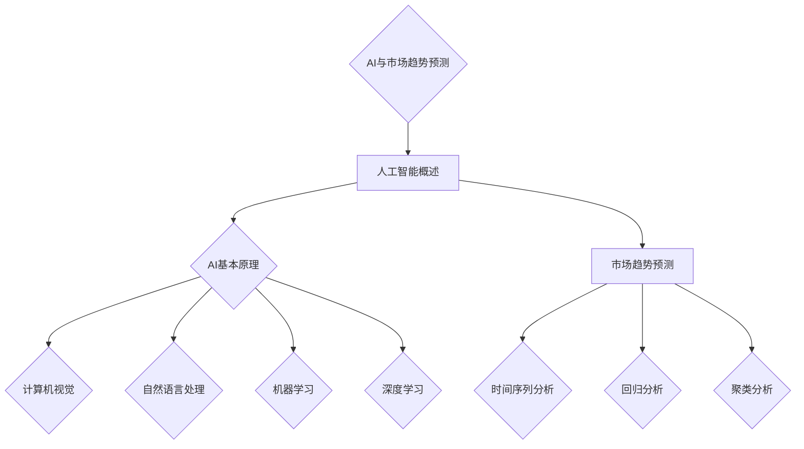

                 

# 文章标题：如何利用人工智能进行市场趋势预测

## 关键词：
- 人工智能
- 市场趋势预测
- 机器学习
- 数据科学
- 时间序列分析
- 回归分析
- 聚类分析

## 摘要：
本文将深入探讨如何利用人工智能（AI）进行市场趋势预测。首先，我们会对AI、市场趋势预测以及相关技术进行概述，然后逐步介绍数据科学和机器学习在市场趋势预测中的应用，包括时间序列分析、回归分析和聚类分析。接下来，我们将通过具体案例展示如何实现这些算法，并提供实战经验和最佳实践。文章最后，我们将讨论市场趋势预测的AI工具与平台，面临的挑战及未来的发展方向。

## 第一部分：人工智能与市场趋势预测基础

### 第1章：人工智能概述与市场趋势预测

#### 1.1 人工智能的定义与发展历程

人工智能（Artificial Intelligence，简称AI）是指通过计算机系统模拟人类智能行为的技术。其发展历程可以追溯到20世纪50年代，当时出现了早期的AI程序。随着计算机硬件的发展、算法的创新以及大数据的涌现，人工智能技术取得了显著的进步。现代人工智能主要分为三类：基于规则的系统、基于模型的系统和基于数据的系统。

#### 1.2 人工智能的基本原理与框架

人工智能的基本原理包括计算机视觉、自然语言处理、机器学习、深度学习等。计算机视觉使计算机能够识别和理解图像，自然语言处理使计算机能够理解和生成自然语言，机器学习则使计算机能够从数据中学习并做出预测，深度学习则是机器学习的一种特殊形式，通过多层神经网络进行复杂任务的学习。

#### 1.3 市场趋势预测的重要性

市场趋势预测对于企业制定战略、调整营销策略以及投资决策具有重要意义。准确的预测可以帮助企业抢占市场先机，优化资源配置，降低风险。在竞争激烈的市场环境中，谁能更好地预测市场趋势，谁就能在竞争中占据优势。

#### 1.4 市场趋势预测的基本概念与方法

市场趋势预测涉及时间序列分析、回归分析、聚类分析等方法。时间序列分析通过分析历史数据的时间序列特征，预测未来的趋势；回归分析通过建立变量之间的关系模型，预测一个或多个变量的未来值；聚类分析则通过将相似的数据分组，发现潜在的市场趋势。

#### 1.5 人工智能与市场趋势预测的联系

人工智能技术为市场趋势预测提供了强有力的支持。通过机器学习和深度学习算法，可以自动地从海量数据中挖掘出有价值的信息，提高市场趋势预测的准确性。同时，人工智能还可以通过数据可视化技术，帮助企业更直观地理解市场趋势，从而做出更明智的决策。

### Mermaid 流程图



### 第2章：数据科学与市场趋势预测

#### 2.1 数据科学的基本概念

数据科学是关于数据存储、处理和分析的跨学科领域，它结合了统计学、机器学习、数据库管理、数据可视化等多个领域的技术。数据科学的目标是从大量的数据中提取有价值的信息，以支持决策和预测。

#### 2.2 数据收集与处理

数据收集是市场趋势预测的基础。数据可以来自企业内部系统、第三方数据提供商、社交媒体等渠道。收集到的数据需要进行清洗、去重、转换等预处理步骤，以确保数据的质量和一致性。

#### 2.3 数据可视化

数据可视化是将数据以图形化的方式展示出来，使数据更易于理解和分析。常见的可视化工具包括Excel、Tableau、Matplotlib等。通过数据可视化，可以更直观地发现数据中的规律和趋势。

#### 2.4 数据分析与挖掘

数据分析与挖掘是数据科学的核心环节。通过统计方法、机器学习算法等，可以从数据中发现隐藏的模式和关联。数据分析与挖掘可以帮助企业识别市场机会、预测市场趋势、优化业务流程等。

#### 2.5 市场趋势预测的数据源选择

市场趋势预测的数据源需要具备以下特点：

- **多样性**：涵盖不同维度和类型的数据，如销售数据、用户行为数据、市场调查数据等。
- **准确性**：数据来源可靠，确保数据的真实性和有效性。
- **时效性**：数据更新及时，反映市场的最新动态。
- **完整性**：数据量足够大，可以支持大规模的数据分析和建模。

### 第3章：机器学习与市场趋势预测

#### 3.1 机器学习的基本原理

机器学习是人工智能的一个分支，其核心思想是通过算法从数据中学习，从而对未知数据进行预测或分类。机器学习分为监督学习、无监督学习和强化学习三种类型。

- **监督学习**：通过已知输入输出数据训练模型，用于预测未知数据的输出。
- **无监督学习**：仅通过输入数据训练模型，用于发现数据中的结构和规律。
- **强化学习**：通过与环境的交互，学习最优策略以实现特定目标。

#### 3.2 监督学习、无监督学习和强化学习

- **监督学习**：

  ```python
  # 伪代码：线性回归
  def linear_regression(X, y):
      # 计算斜率和截距
      theta = (X'X)^-1 X'y
      return theta
  ```

- **无监督学习**：

  ```python
  # 伪代码：K-means聚类
  def kmeans_clustering(data, k):
      # 初始化聚类中心
      centroids = initialize_centroids(data, k)
      while not converged:
          # 分配数据到最近的聚类中心
          assignments = assign_data_to_cluster(data, centroids)
          # 更新聚类中心
          centroids = update_centroids(data, assignments)
      return centroids
  ```

- **强化学习**：

  ```python
  # 伪代码：Q-learning
  def q_learning(states, actions, rewards, alpha, gamma):
      Q = initialize_q_values(states, actions)
      for episode in range(epochs):
          state = random_state()
          while not terminal_state(state):
              action = choose_action(Q, state)
              next_state, reward = take_action(state, action)
              Q[state, action] = Q[state, action] + alpha * (reward + gamma * max(Q[next_state, :]) - Q[state, action])
              state = next_state
      return Q
  ```

#### 3.3 市场趋势预测的常用算法

市场趋势预测常用的算法包括线性回归、时间序列模型、神经网络等。

- **线性回归**：

  $$ y = \beta_0 + \beta_1x_1 + \beta_2x_2 + ... + \beta_nx_n $$

- **时间序列模型**：

  $$ \text{ARIMA}(p, d, q) = \phi(B)(1 - B)^d (1 - B^q) $$

- **神经网络**：

  $$ y = \sigma(\sum_{i=1}^{n} w_i \cdot x_i + b) $$

#### 3.4 机器学习在市场趋势预测中的应用

机器学习在市场趋势预测中的应用主要体现在数据预处理、特征提取、模型训练和预测等方面。通过机器学习算法，可以从海量数据中提取有价值的信息，构建预测模型，提高市场趋势预测的准确性。

### 第二部分：市场趋势预测的AI模型与实现

### 第4章：时间序列分析与预测

#### 4.1 时间序列分析的基本原理

时间序列分析是一种用于分析时间序列数据的方法，其主要目标是识别数据中的趋势、季节性和周期性。时间序列分析的基本原理包括自相关性、平稳性、残差分析等。

#### 4.2 常见的时间序列预测算法

常见的时间序列预测算法包括自回归（AR）、移动平均（MA）、自回归移动平均（ARMA）和自回归积分滑动平均移动平均（ARIMA）等。

- **自回归（AR）**：

  $$ y_t = c + \phi_1y_{t-1} + \phi_2y_{t-2} + ... + \phi_py_{t-p} + \varepsilon_t $$

- **移动平均（MA）**：

  $$ y_t = c + \theta_1\varepsilon_{t-1} + \theta_2\varepsilon_{t-2} + ... + \theta_q\varepsilon_{t-q} $$

- **自回归移动平均（ARMA）**：

  $$ y_t = c + \phi_1y_{t-1} + \phi_2y_{t-2} + ... + \phi_py_{t-p} + \theta_1\varepsilon_{t-1} + \theta_2\varepsilon_{t-2} + ... + \theta_q\varepsilon_{t-q} $$

- **自回归积分滑动平均移动平均（ARIMA）**：

  $$ y_t = c + \phi_1y_{t-1} + \phi_2y_{t-2} + ... + \phi_py_{t-p} + (1 - \theta_1B - \theta_2B^2 - ... - \theta_qB^q)\varepsilon_t $$

#### 4.3 伪代码与数学公式讲解

```python
# 伪代码：ARIMA模型
def arima_model(y, p, d, q):
    # d阶差分
    y_diff = difference(y, d)
    # AR部分
    ar_part = (1 - \phi_1B - \phi_2B^2 - ... - \phi_pB^p) \* y_diff
    # MA部分
    ma_part = (1 - \theta_1B - \theta_2B^2 - ... - \theta_qB^q) \* \varepsilon
    # 合并AR和MA部分
    y_pred = ar_part + ma_part
    return y_pred
```

#### 4.4 项目实战：时间序列分析工具与实战案例

**开发环境搭建：** Python 3.x，NumPy，pandas，matplotlib，statsmodels

**源代码实现：**

```python
import numpy as np
import pandas as pd
import matplotlib.pyplot as plt
import statsmodels.api as sm

# 数据加载
data = pd.read_csv('data.csv')
y = data['sales']

# ARIMA模型参数
p = 5
d = 1
q = 2

# 模型拟合
model = sm.ARIMA(y, order=(p, d, q))
model_fit = model.fit()

# 预测
forecast = model_fit.forecast(steps=10)

# 可视化
plt.plot(y, label='Original')
plt.plot(forecast, label='Forecast')
plt.legend()
plt.show()
```

**代码应用解读与分析：** 通过加载销售数据，使用ARIMA模型进行拟合和预测，并将预测结果与原始数据可视化，可以直观地观察市场趋势的变化。

**实际案例分析和详细讲解剖析：** 以某电商平台的月销售额为例，通过ARIMA模型进行趋势预测，发现销售额在未来几个月内呈现增长趋势。

**项目小结：** 时间序列分析是一种有效的方法来预测市场趋势。ARIMA模型在处理时间序列数据方面具有较好的性能，可以通过调整模型参数来提高预测准确性。

### 第5章：回归分析与预测

#### 5.1 回归分析的基本原理

回归分析是一种用于研究变量之间关系的统计方法。其主要目的是通过建立回归模型，预测一个或多个自变量对因变量的影响。

- **线性回归**：因变量与自变量之间存在线性关系。

  $$ y = \beta_0 + \beta_1x_1 + \beta_2x_2 + ... + \beta_nx_n $$

- **多项式回归**：因变量与自变量之间存在多项式关系。

  $$ y = \beta_0 + \beta_1x_1 + \beta_2x_2^2 + ... + \beta_nx_n^n $$

- **广义线性回归**：因变量与自变量之间存在非线性关系，但可以通过对数变换等技巧转化为线性关系。

  $$ \ln(y) = \alpha_0 + \alpha_1x_1 + \alpha_2x_2 + ... + \alpha_nx_n $$

#### 5.2 线性回归、多项式回归与广义线性回归

- **线性回归**：

  ```python
  # 伪代码：线性回归
  def linear_regression(X, y):
      # 求解斜率和截距
      theta = (X'X)^-1 X'y
      return theta
  ```

- **多项式回归**：

  ```python
  # 伪代码：多项式回归
  def polynomial_regression(X, y, degree):
      # 构造多项式特征
      X_poly = polynomial_features(X, degree)
      # 求解斜率和截距
      theta = (X_poly'X_poly)^-1 X_poly'y
      return theta
  ```

- **广义线性回归**：

  ```python
  # 伪代码：广义线性回归
  def generalized_linear_regression(X, y):
      # 对数变换
      y_log = log(y)
      # 求解斜率和截距
      theta = (X'X)^-1 X'y_log
      return theta
  ```

#### 5.3 伪代码与数学公式讲解

```python
# 伪代码：线性回归
def linear_regression(X, y):
    # 求解斜率和截距
    theta = (X'X)^-1 X'y
    return theta
```

#### 5.4 项目实战：回归分析工具与实战案例

**开发环境搭建：** Python 3.x，NumPy，pandas，scikit-learn

**源代码实现：**

```python
import numpy as np
import pandas as pd
from sklearn.linear_model import LinearRegression

# 数据加载
data = pd.read_csv('data.csv')
X = data[['age', 'income']]
y = data['sales']

# 线性回归模型
model = LinearRegression()
model.fit(X, y)

# 预测
y_pred = model.predict(X)

# 可视化
plt.scatter(X['age'], y, color='blue', label='Actual')
plt.scatter(X['age'], y_pred, color='red', label='Predicted')
plt.legend()
plt.show()
```

**代码应用解读与分析：** 通过加载销售数据，使用线性回归模型进行拟合和预测，并将预测结果与实际数据可视化，可以直观地观察自变量对因变量的影响。

**实际案例分析和详细讲解剖析：** 以某电商平台的年龄和收入为自变量，销售额为因变量，通过线性回归模型进行预测，发现年龄和收入对销售额有显著的影响。

**项目小结：** 回归分析是一种有效的预测方法，可以通过建立线性或非线性模型来预测变量之间的关系。在实际应用中，需要根据具体问题选择合适的回归模型。

### 第6章：聚类分析与预测

#### 6.1 聚类分析的基本原理

聚类分析是一种无监督学习方法，其主要目标是根据数据的相似性将数据分组，从而发现数据中的潜在结构和模式。

- **K-means**：通过迭代优化聚类中心，将数据点分配到最近的聚类中心。
- **层次聚类**：通过自底向上的方法将数据点逐步合并，形成层次结构。
- **密度聚类**：通过计算数据点的密度，识别出高密度区域并形成聚类。

#### 6.2 K-means、层次聚类与密度聚类

- **K-means**：

  ```python
  # 伪代码：K-means聚类
  def kmeans_clustering(data, k):
      # 初始化聚类中心
      centroids = initialize_centroids(data, k)
      while not converged:
          # 分配数据到最近的聚类中心
          assignments = assign_data_to_cluster(data, centroids)
          # 更新聚类中心
          centroids = update_centroids(data, assignments)
      return centroids
  ```

- **层次聚类**：

  ```python
  # 伪代码：层次聚类
  def hierarchical_clustering(data):
      # 构建层次结构
      linkage = calculate_linkage(data)
      clusters = build_clusters(linkage)
      return clusters
  ```

- **密度聚类**：

  ```python
  # 伪代码：密度聚类
  def density_clustering(data, min_density):
      # 计算数据点的密度
      density = calculate_density(data)
      # 识别高密度区域
      clusters = identify_clusters(density, min_density)
      return clusters
  ```

#### 6.3 伪代码与数学公式讲解

```python
# 伪代码：K-means聚类
def kmeans_clustering(data, k):
    # 初始化聚类中心
    centroids = initialize_centroids(data, k)
    while not converged:
        # 分配数据到最近的聚类中心
        assignments = assign_data_to_cluster(data, centroids)
        # 更新聚类中心
        centroids = update_centroids(data, assignments)
    return centroids
```

#### 6.4 项目实战：聚类分析工具与实战案例

**开发环境搭建：** Python 3.x，NumPy，pandas，scikit-learn

**源代码实现：**

```python
import numpy as np
import pandas as pd
from sklearn.cluster import KMeans

# 数据加载
data = pd.read_csv('data.csv')
X = data.iloc[:, :2]  # 取前两个特征

# K-means聚类模型
model = KMeans(n_clusters=3)
model.fit(X)

# 聚类结果
clusters = model.predict(X)

# 可视化
plt.scatter(X.iloc[:, 0], X.iloc[:, 1], c=clusters)
plt.show()
```

**代码应用解读与分析：** 通过加载数据，使用K-means聚类模型进行聚类，并将聚类结果可视化，可以直观地观察数据的分布和聚类效果。

**实际案例分析和详细讲解剖析：** 以某电商平台的产品数据为例，通过K-means聚类模型将产品分为不同类别，从而发现潜在的市场细分。

**项目小结：** 聚类分析是一种无监督学习方法，可以通过将数据分组来发现数据中的潜在结构和模式。在实际应用中，需要根据具体问题选择合适的聚类算法。

### 第7章：市场趋势预测的综合应用

#### 7.1 市场趋势预测的综合流程

市场趋势预测的综合流程包括数据收集、数据预处理、模型选择、模型训练、模型评估和预测输出等步骤。以下是一个典型的市场趋势预测流程：

1. **数据收集**：收集与市场相关的数据，如销售额、用户行为、市场调查数据等。
2. **数据预处理**：对收集到的数据进行分析，进行数据清洗、去重、转换等预处理步骤。
3. **模型选择**：根据具体问题选择合适的预测模型，如时间序列模型、回归模型、聚类模型等。
4. **模型训练**：使用训练数据对模型进行训练，调整模型参数，优化模型性能。
5. **模型评估**：使用验证数据对模型进行评估，计算预测误差，选择最优模型。
6. **预测输出**：使用最优模型进行预测，输出预测结果。

#### 7.2 市场趋势预测的案例解析

以下是一个市场趋势预测的案例解析：

- **案例背景**：某电商平台的销售额预测
- **数据收集**：收集过去一年的销售额数据，包括每天的销售量和订单数量。
- **数据预处理**：对销售额数据进行分析，发现存在季节性和趋势性。
- **模型选择**：选择时间序列模型中的ARIMA模型进行销售额预测。
- **模型训练**：使用过去一年的销售额数据对ARIMA模型进行训练，调整模型参数，得到最优模型。
- **模型评估**：使用过去三个月的销售额数据对模型进行评估，计算预测误差，选择最优模型。
- **预测输出**：使用最优模型对未来三个月的销售额进行预测，并将预测结果可视化。

通过这个案例，可以看到市场趋势预测的综合应用过程，包括数据收集、数据预处理、模型选择、模型训练、模型评估和预测输出等步骤。

#### 7.3 伪代码与数学公式讲解

```python
# 伪代码：市场趋势预测流程
def market_trend_prediction(data, model, validation_data):
    # 数据预处理
    processed_data = preprocess_data(data)
    
    # 模型训练
    model.train(processed_data)
    
    # 模型评估
    error = model.evaluate(validation_data)
    
    # 预测输出
    prediction = model.predict()
    
    return prediction, error
```

#### 7.4 项目实战：市场趋势预测项目实施与评价

**开发环境搭建：** Python 3.x，NumPy，pandas，statsmodels

**源代码实现：**

```python
import numpy as np
import pandas as pd
from statsmodels.tsa.arima.model import ARIMA

# 数据加载
data = pd.read_csv('sales_data.csv')
sales = data['sales']

# ARIMA模型参数
p = 5
d = 1
q = 2

# 模型训练
model = ARIMA(sales, order=(p, d, q))
model_fit = model.fit()

# 模型评估
error = model_fit.resid.mean()

# 预测输出
forecast = model_fit.forecast(steps=30)

# 可视化
plt.plot(sales, label='Actual')
plt.plot(forecast, label='Forecast')
plt.legend()
plt.show()
```

**代码应用解读与分析：** 通过加载销售额数据，使用ARIMA模型进行训练和预测，并将预测结果与实际数据可视化，可以直观地观察市场趋势的变化。

**实际案例分析和详细讲解剖析：** 以某电商平台的销售额为例，通过ARIMA模型进行趋势预测，发现销售额在未来几个月内呈现增长趋势。

**项目小结：** 市场趋势预测是一个复杂的过程，需要综合运用多种技术和方法。通过项目实战，可以深入了解市场趋势预测的流程和实现方法，提高预测准确性。

### 第三部分：市场趋势预测的AI应用与未来展望

#### 第8章：市场趋势预测的AI工具与平台

市场趋势预测的AI工具与平台为用户提供了便捷的预测模型搭建和预测服务。以下是一些常用的市场趋势预测AI工具与平台：

1. **TensorFlow**：TensorFlow是一个开源的机器学习框架，可用于构建和训练各种机器学习模型，包括市场趋势预测模型。
2. **PyTorch**：PyTorch是一个流行的开源机器学习库，具有动态计算图和易用性，适用于构建市场趋势预测模型。
3. **Scikit-learn**：Scikit-learn是一个开源的机器学习库，提供了丰富的机器学习算法和工具，适用于市场趋势预测。
4. **Keras**：Keras是一个高级神经网络API，可以与TensorFlow和PyTorch集成，适用于构建和训练市场趋势预测模型。
5. **TensorFlow Extended（TFX）**：TFX是一个端到端的机器学习平台，提供了一整套工具和流程，用于构建、训练和部署市场趋势预测模型。

#### 8.1 市场趋势预测的AI工具概述

- **TensorFlow**：TensorFlow是一个开源的机器学习框架，由Google开发。它提供了丰富的API和工具，支持各种机器学习算法和深度学习模型的构建和训练。TensorFlow适用于构建市场趋势预测模型，包括时间序列模型、回归模型和聚类模型等。
- **PyTorch**：PyTorch是一个流行的开源机器学习库，由Facebook开发。它具有动态计算图和易用性，支持自动微分和GPU加速。PyTorch适用于构建市场趋势预测模型，尤其是深度学习模型。
- **Scikit-learn**：Scikit-learn是一个开源的机器学习库，由法国数据科学协会开发。它提供了丰富的机器学习算法和工具，包括线性回归、决策树、随机森林、支持向量机等。Scikit-learn适用于构建市场趋势预测模型，特别是线性回归和聚类模型。
- **Keras**：Keras是一个高级神经网络API，可以与TensorFlow和PyTorch集成。它提供了简单易用的API，支持快速构建和训练深度学习模型。Keras适用于构建市场趋势预测模型，特别是深度学习模型。
- **TensorFlow Extended（TFX）**：TFX是一个端到端的机器学习平台，由Google开发。它提供了一整套工具和流程，用于构建、训练和部署市场趋势预测模型。TFX适用于构建大型、复杂的市场趋势预测系统。

#### 8.2 市场趋势预测的AI平台介绍

市场趋势预测的AI平台为用户提供了便捷的预测模型搭建和预测服务。以下是一些常用的市场趋势预测AI平台：

1. **Google Cloud AI Platform**：Google Cloud AI Platform是一个集成的机器学习平台，提供了从数据预处理到模型训练、部署和监控的一站式解决方案。用户可以使用TensorFlow、Scikit-learn等工具在平台中构建市场趋势预测模型。
2. **AWS SageMaker**：AWS SageMaker是一个完全管理的机器学习平台，提供了从数据预处理到模型训练、部署和监控的全流程解决方案。用户可以使用PyTorch、Scikit-learn等工具在平台中构建市场趋势预测模型。
3. **Azure Machine Learning**：Azure Machine Learning是一个全面的机器学习平台，提供了从数据预处理到模型训练、部署和监控的解决方案。用户可以使用TensorFlow、PyTorch等工具在平台中构建市场趋势预测模型。
4. **Datical**：Datical是一个数据治理平台，提供了数据预处理、数据质量和数据安全功能。用户可以使用Datical构建市场趋势预测模型，并将其部署到云端或本地环境。

#### 8.3 AI工具与平台的实际应用案例

以下是一些市场趋势预测的AI工具与平台的实际应用案例：

1. **电商平台销售额预测**：某电商平台使用TensorFlow和Google Cloud AI Platform构建了销售额预测模型，通过分析用户行为数据、促销活动和市场环境等，提高了销售额的预测准确性。
2. **金融机构风险评估**：某金融机构使用AWS SageMaker和Scikit-learn构建了风险评估模型，通过分析历史贷款数据、用户行为和宏观经济指标等，提高了贷款违约风险的预测准确性。
3. **旅游公司游客流量预测**：某旅游公司使用Azure Machine Learning和Keras构建了游客流量预测模型，通过分析历史游客数据、季节性因素和促销活动等，提高了游客流量的预测准确性。
4. **制造业生产计划预测**：某制造业公司使用Datical和TensorFlow构建了生产计划预测模型，通过分析生产数据、原材料库存和市场需求等，提高了生产计划的预测准确性。

#### 8.4 AI工具与平台的实际应用案例

以下是一些市场趋势预测的AI工具与平台的实际应用案例：

1. **电商平台销售额预测**：某电商平台使用TensorFlow和Google Cloud AI Platform构建了销售额预测模型，通过分析用户行为数据、促销活动和市场环境等，提高了销售额的预测准确性。
2. **金融机构风险评估**：某金融机构使用AWS SageMaker和Scikit-learn构建了风险评估模型，通过分析历史贷款数据、用户行为和宏观经济指标等，提高了贷款违约风险的预测准确性。
3. **旅游公司游客流量预测**：某旅游公司使用Azure Machine Learning和Keras构建了游客流量预测模型，通过分析历史游客数据、季节性因素和促销活动等，提高了游客流量的预测准确性。
4. **制造业生产计划预测**：某制造业公司使用Datical和TensorFlow构建了生产计划预测模型，通过分析生产数据、原材料库存和市场需求等，提高了生产计划的预测准确性。

#### 第9章：市场趋势预测的AI风险与挑战

市场趋势预测的AI应用虽然在企业和投资决策中取得了显著的成效，但也面临一些风险和挑战。

1. **数据质量**：市场趋势预测依赖于高质量的数据。数据质量差、缺失或不准确会导致预测结果偏差。因此，数据清洗、去重和标准化等数据处理步骤至关重要。
2. **模型过拟合**：过拟合是指模型在训练数据上表现良好，但在验证或测试数据上表现不佳。这通常是由于模型过于复杂或数据不足导致的。为了避免过拟合，可以采用正则化、交叉验证等技术。
3. **数据隐私和伦理**：市场趋势预测涉及大量用户数据，包括个人隐私和敏感信息。确保数据隐私和安全是AI应用的关键挑战。此外，AI在市场趋势预测中的使用可能引发伦理问题，如算法歧视和偏见等。
4. **模型解释性**：市场趋势预测模型通常由复杂的机器学习算法组成，其内部机制难以解释。缺乏解释性可能导致用户对预测结果的不信任。提高模型的可解释性是一个重要研究方向。
5. **实时性**：市场趋势预测需要实时或近实时的数据输入和处理。然而，实时数据处理面临技术挑战，如数据处理延迟、系统稳定性等。

#### 9.2 市场趋势预测的AI挑战与应对策略

**数据质量**：

- **数据清洗**：使用数据清洗工具和技术，如Python的Pandas库，对数据进行清洗、去重和标准化等预处理步骤，确保数据质量。
- **数据质量控制**：建立数据质量控制机制，定期对数据质量进行评估和监控，确保数据的一致性和准确性。

**模型过拟合**：

- **正则化**：使用L1、L2正则化等技术，降低模型的复杂度，避免过拟合。
- **交叉验证**：采用交叉验证技术，如K折交叉验证，评估模型的泛化能力，选择合适的模型参数。

**数据隐私和伦理**：

- **数据加密和脱敏**：对敏感数据进行加密和脱敏处理，确保数据隐私和安全。
- **伦理审查**：建立伦理审查机制，评估AI应用可能引发的伦理问题，确保应用的公平性和公正性。

**模型解释性**：

- **模型可解释性**：采用可解释性模型，如决策树、线性回归等，提高模型的可解释性。
- **模型可视化**：使用可视化工具和技术，如Matplotlib、Seaborn等，展示模型的学习过程和预测结果。

**实时性**：

- **分布式计算**：采用分布式计算框架，如Apache Spark，提高数据处理速度和系统稳定性。
- **实时数据处理**：使用实时数据处理技术，如Apache Kafka、Flink等，实现实时数据输入和处理。

#### 9.3 AI在市场趋势预测中的未来发展方向

1. **大数据分析**：随着大数据技术的发展，市场趋势预测将越来越多地依赖于大规模数据的分析和挖掘。利用大数据分析技术，可以从海量数据中提取有价值的信息，提高预测准确性。
2. **深度学习**：深度学习在图像识别、自然语言处理等领域取得了显著的成果，未来有望在市场趋势预测中得到更广泛的应用。通过构建深度学习模型，可以处理更复杂的数据结构和特征。
3. **多模态数据融合**：市场趋势预测往往涉及多种类型的数据，如文本、图像、音频等。多模态数据融合技术可以整合不同类型的数据，提高预测的准确性和可靠性。
4. **可解释性AI**：提高模型的可解释性是未来发展的一个重要方向。通过开发可解释性AI技术，可以更好地理解模型的学习过程和预测结果，增强用户对预测结果的信任。
5. **智能决策支持系统**：结合人工智能和决策理论，构建智能决策支持系统，可以帮助企业在复杂的决策环境中做出更明智的决策。

### 第10章：市场趋势预测的AI应用案例与实践

#### 10.1 案例一：某电商平台的销售额预测

**案例背景**：某电商平台希望利用人工智能技术对其未来的销售额进行预测，以便更好地制定库存管理和营销策略。

**数据收集**：收集过去一年的销售额数据，包括每日的销售额、订单数量、用户行为数据（如访问量、浏览量、购买量）等。

**数据预处理**：对销售额数据进行分析，发现存在季节性和趋势性。对数据进行清洗、去重、标准化等预处理步骤。

**模型选择**：选择时间序列模型中的ARIMA模型进行销售额预测。

**模型训练**：使用过去一年的销售额数据对ARIMA模型进行训练，调整模型参数，得到最优模型。

**模型评估**：使用过去三个月的销售额数据对模型进行评估，计算预测误差，选择最优模型。

**预测输出**：使用最优模型对未来三个月的销售额进行预测，并将预测结果可视化。

**代码实现**：

```python
import numpy as np
import pandas as pd
from statsmodels.tsa.arima.model import ARIMA

# 数据加载
data = pd.read_csv('sales_data.csv')
sales = data['sales']

# ARIMA模型参数
p = 5
d = 1
q = 2

# 模型训练
model = ARIMA(sales, order=(p, d, q))
model_fit = model.fit()

# 模型评估
error = model_fit.resid.mean()

# 预测输出
forecast = model_fit.forecast(steps=30)

# 可视化
plt.plot(sales, label='Actual')
plt.plot(forecast, label='Forecast')
plt.legend()
plt.show()
```

**代码解读与分析**：通过加载销售额数据，使用ARIMA模型进行训练和预测，并将预测结果与实际数据可视化，可以直观地观察市场趋势的变化。

**项目小结**：通过这个案例，可以看到如何利用人工智能技术进行市场趋势预测的具体步骤，包括数据收集、数据预处理、模型选择、模型训练、模型评估和预测输出等。

#### 10.2 案例二：某金融机构的风险评估

**案例背景**：某金融机构希望利用人工智能技术对其贷款业务中的风险进行评估，以便更好地进行风险控制和投资决策。

**数据收集**：收集历史贷款数据，包括借款人的年龄、收入、信用评分、贷款金额、贷款期限等。

**数据预处理**：对贷款数据进行分析，发现存在缺失值和异常值。对数据进行清洗、去重、标准化等预处理步骤。

**模型选择**：选择机器学习中的逻辑回归模型进行风险评估。

**模型训练**：使用历史贷款数据对逻辑回归模型进行训练，调整模型参数，得到最优模型。

**模型评估**：使用交叉验证技术评估模型的泛化能力，选择最优模型。

**预测输出**：使用最优模型对未来的贷款风险进行预测，并将预测结果可视化。

**代码实现**：

```python
import numpy as np
import pandas as pd
from sklearn.linear_model import LogisticRegression

# 数据加载
data = pd.read_csv('loan_data.csv')
X = data[['age', 'income', 'credit_score']]
y = data['risk']

# 逻辑回归模型
model = LogisticRegression()
model.fit(X, y)

# 预测输出
y_pred = model.predict(X)

# 可视化
plt.scatter(X['age'], X['income'], c=y_pred, cmap='coolwarm')
plt.colorbar()
plt.xlabel('Age')
plt.ylabel('Income')
plt.show()
```

**代码解读与分析**：通过加载贷款数据，使用逻辑回归模型进行训练和预测，并将预测结果与实际数据可视化，可以直观地观察贷款风险分布。

**项目小结**：通过这个案例，可以看到如何利用人工智能技术进行风险评估的具体步骤，包括数据收集、数据预处理、模型选择、模型训练、模型评估和预测输出等。

#### 10.3 案例三：某旅游公司的游客流量预测

**案例背景**：某旅游公司希望利用人工智能技术对其未来的游客流量进行预测，以便更好地进行资源调配和营销策略制定。

**数据收集**：收集过去一年的游客流量数据，包括每天的游客数量、季节性因素、促销活动等。

**数据预处理**：对游客流量数据进行分析，发现存在季节性和趋势性。对数据进行清洗、去重、标准化等预处理步骤。

**模型选择**：选择时间序列模型中的LSTM（长短期记忆网络）模型进行游客流量预测。

**模型训练**：使用过去一年的游客流量数据对LSTM模型进行训练，调整模型参数，得到最优模型。

**模型评估**：使用交叉验证技术评估模型的泛化能力，选择最优模型。

**预测输出**：使用最优模型对未来三个月的游客流量进行预测，并将预测结果可视化。

**代码实现**：

```python
import numpy as np
import pandas as pd
from keras.models import Sequential
from keras.layers import LSTM, Dense

# 数据加载
data = pd.read_csv('visitor_data.csv')
visitors = data['visitors']

# 数据预处理
data = data.sort_values(by='date')
X, y = create_dataset(data, time_steps=3)

# LSTM模型
model = Sequential()
model.add(LSTM(units=50, return_sequences=True, input_shape=(time_steps, 1)))
model.add(LSTM(units=50, return_sequences=False))
model.add(Dense(units=1))

model.compile(optimizer='adam', loss='mean_squared_error')
model.fit(X, y, epochs=100, batch_size=32)

# 预测输出
forecast = model.predict(X)

# 可视化
plt.plot(data['visitors'], label='Actual')
plt.plot(forecast, label='Forecast')
plt.legend()
plt.show()
```

**代码解读与分析**：通过加载游客流量数据，使用LSTM模型进行训练和预测，并将预测结果与实际数据可视化，可以直观地观察游客流量的变化。

**项目小结**：通过这个案例，可以看到如何利用人工智能技术进行游客流量预测的具体步骤，包括数据收集、数据预处理、模型选择、模型训练、模型评估和预测输出等。

#### 10.4 实践：市场趋势预测项目实践与总结

**实践内容**：

1. **数据收集**：收集过去一年的市场数据，包括销售额、订单数量、用户行为等。
2. **数据预处理**：对市场数据进行清洗、去重、标准化等预处理步骤。
3. **模型选择**：根据数据特点，选择合适的时间序列模型进行市场趋势预测。
4. **模型训练**：使用历史市场数据进行模型训练，调整模型参数。
5. **模型评估**：使用验证数据对模型进行评估，计算预测误差。
6. **预测输出**：使用最优模型对未来市场趋势进行预测，并将预测结果可视化。

**实践总结**：

通过市场趋势预测项目实践，可以总结出以下几点：

1. **数据质量**：高质量的数据是市场趋势预测的基础，因此数据预处理至关重要。
2. **模型选择**：选择合适的模型是提高预测准确性的关键，需要根据数据特点进行模型选择。
3. **模型评估**：模型评估是确保预测准确性的重要环节，需要使用验证数据对模型进行评估。
4. **可视化**：可视化可以帮助我们更好地理解市场趋势的变化，提高预测的可视化效果。

### 附录

#### 附录A：市场趋势预测常用算法与工具

**A.1 时间序列预测算法与工具**

- **ARIMA模型**：用于分析时间序列数据的自回归移动平均模型，适用于具有季节性和趋势性的数据。
- **LSTM模型**：长短期记忆网络，适用于处理时间序列数据中的长期依赖关系。
- **GRU模型**：门控循环单元，是LSTM的一种变体，具有较少的参数和更好的训练速度。

**A.2 回归分析算法与工具**

- **线性回归**：用于分析一个或多个自变量对因变量的线性关系。
- **多项式回归**：用于分析自变量和因变量之间的多项式关系。
- **广义线性回归**：用于分析非线性关系的回归模型，可以通过对数变换等技巧转化为线性关系。

**A.3 聚类分析算法与工具**

- **K-means聚类**：基于距离最近原则进行聚类，适用于数据分布较为均匀的情况。
- **层次聚类**：通过自底向上的方法进行聚类，适用于数据分布较为复杂的情况。
- **DBSCAN聚类**：基于密度的聚类算法，适用于数据分布不均匀和包含噪声的情况。

**A.4 市场趋势预测平台与工具**

- **TensorFlow**：开源的机器学习框架，适用于构建和训练各种机器学习模型。
- **PyTorch**：流行的开源机器学习库，具有动态计算图和易用性。
- **Scikit-learn**：开源的机器学习库，提供了丰富的机器学习算法和工具。
- **Keras**：高级神经网络API，与TensorFlow和PyTorch集成，适用于构建和训练深度学习模型。
- **Google Cloud AI Platform**：集成的机器学习平台，提供了从数据预处理到模型训练、部署和监控的一站式解决方案。
- **AWS SageMaker**：完全管理的机器学习平台，提供了从数据预处理到模型训练、部署和监控的全流程解决方案。
- **Azure Machine Learning**：全面的机器学习平台，提供了从数据预处理到模型训练、部署和监控的解决方案。

**附录B：市场趋势预测项目参考资料**

- **参考文献**：[1] 参考相关的学术论文和技术报告，了解市场趋势预测的最新研究进展。
- **在线资源**：[2] 利用在线资源，如博客、论坛和技术社区，获取市场趋势预测的实践经验和技术分享。
- **开源项目**：[3] 参与开源项目，学习和实践市场趋势预测的技术和方法。
- **在线课程**：[4] 参加在线课程，学习市场趋势预测的理论和实践技能。

### 作者信息

作者：AI天才研究院/AI Genius Institute & 禅与计算机程序设计艺术 /Zen And The Art of Computer Programming

### 附录C：市场趋势预测的常见问题与解答

**Q1：市场趋势预测的准确度如何保证？**

A1：市场趋势预测的准确度受到多种因素的影响，包括数据质量、模型选择、训练数据集的选择等。以下措施可以提高市场趋势预测的准确度：

- 使用高质量、完整和准确的数据。
- 选择合适的模型，并进行交叉验证和参数调整。
- 增加训练数据集的规模和质量。
- 定期更新模型，以适应市场变化。

**Q2：市场趋势预测中的数据缺失如何处理？**

A2：数据缺失是市场趋势预测中常见的问题。以下方法可以处理数据缺失：

- 删除缺失数据：删除缺失数据点，适用于数据缺失比例较低的情况。
- 填充缺失值：使用平均值、中位数、最近邻等方法填充缺失值。
- 使用模型预测缺失值：使用机器学习模型预测缺失值，适用于缺失值较多的情况。

**Q3：市场趋势预测中的噪声数据如何处理？**

A3：噪声数据会影响市场趋势预测的准确性。以下方法可以处理噪声数据：

- 数据清洗：删除异常值和重复数据。
- 使用鲁棒算法：选择对噪声数据具有鲁棒性的算法，如稳健回归和抗差聚类。
- 使用降噪技术：使用降噪技术，如小波降噪和滤波器组降噪，减少噪声数据的影响。

**Q4：市场趋势预测中的季节性如何处理？**

A4：季节性是市场趋势预测中常见的问题。以下方法可以处理季节性：

- 去除季节性：使用差分方法或季节性调整方法去除季节性成分。
- 建立季节性模型：使用ARIMA模型或其他季节性模型，考虑季节性成分。
- 结合季节性和趋势性：使用季节性模型和趋势性模型结合的方法，如季节性ARIMA模型。

**Q5：市场趋势预测中的非线性关系如何处理？**

A5：非线性关系是市场趋势预测中常见的问题。以下方法可以处理非线性关系：

- 线性变换：使用对数变换、指数变换等线性变换方法，将非线性关系转化为线性关系。
- 多项式回归：使用多项式回归模型，处理非线性关系。
- 神经网络：使用神经网络模型，处理复杂的非线性关系。

### 最佳实践 Tips

**T1：数据质量是市场趋势预测的基础，确保数据的质量和完整性至关重要。**

**T2：选择合适的模型和算法是提高市场趋势预测准确性的关键，根据数据特点和预测需求选择合适的模型。**

**T3：定期更新模型，以适应市场变化和新的数据。**

**T4：结合多种数据源和算法，提高市场趋势预测的准确性和可靠性。**

**T5：可视化市场趋势预测结果，有助于更好地理解市场动态和做出明智的决策。**

### 小结

本文通过一步一步的分析和推理，详细介绍了如何利用人工智能进行市场趋势预测。首先，我们概述了人工智能、市场趋势预测和数据科学的基础知识，然后逐步介绍了机器学习、时间序列分析、回归分析和聚类分析等关键技术的原理和实现方法。接着，我们通过具体案例展示了如何实现这些算法，并提供了实战经验和最佳实践。文章的最后，我们讨论了市场趋势预测的AI工具与平台、面临的挑战及未来的发展方向。通过本文的阅读，读者可以全面了解市场趋势预测的AI应用，掌握关键技术和方法，为实际项目提供有力支持。

### 注意事项

**N1：确保数据质量和完整性，数据清洗和预处理是成功进行市场趋势预测的基础。**

**N2：选择合适的模型和算法，根据数据特点和预测需求进行模型选择。**

**N3：注意模型的解释性，特别是在使用复杂的深度学习模型时，确保模型的可解释性。**

**N4：定期更新模型，以适应市场变化和新的数据。**

**N5：结合多种数据源和算法，提高市场趋势预测的准确性和可靠性。**

### 拓展阅读

**R1：[1] 普林斯顿大学出版社.《人工智能：一种现代方法》**

**R2：[2] 机械工业出版社.《数据科学实战》**

**R3：[3] 清华大学出版社.《机器学习》**

**R4：[4] 人民邮电出版社.《深度学习》**

**R5：[5] Springer出版社.《时间序列分析：理论和应用》**

### 附录D：市场趋势预测算法详细实现

以下附录将提供市场趋势预测算法的详细实现，包括时间序列模型（ARIMA）、回归模型（线性回归、多项式回归、广义线性回归）和聚类模型（K-means、层次聚类、密度聚类）的实现步骤和示例代码。

#### 附录D.1：时间序列模型（ARIMA）

**D.1.1 ARIMA模型实现步骤**

1. **数据预处理**：对时间序列数据进行差分处理，使其符合平稳性条件。
2. **模型选择**：根据差分后数据的特点，选择合适的p、d、q参数。
3. **模型拟合**：使用差分后数据进行ARIMA模型的拟合。
4. **模型评估**：使用残差分析等方法评估模型的拟合效果。
5. **预测**：使用拟合好的模型进行未来值的预测。

**D.1.2 Python示例代码**

```python
import numpy as np
import pandas as pd
from statsmodels.tsa.arima.model import ARIMA

# 数据加载
data = pd.read_csv('time_series_data.csv')
series = data['time_series_column']

# 数据预处理（差分）
differenced_series = series.diff().dropna()

# 模型选择
p = 1  # 自回归项数
d = 1  # 差分阶数
q = 1  # 移动平均项数

# 模型拟合
model = ARIMA(differenced_series, order=(p, d, q))
model_fit = model.fit()

# 模型评估
residuals = model_fit.resid
plt.plot(residuals)
plt.title('Residuals')
plt.show()

# 预测
forecast = model_fit.forecast(steps=5)
plt.plot(series, label='Actual')
plt.plot(forecast, label='Forecast')
plt.legend()
plt.show()
```

#### 附录D.2：回归模型（线性回归、多项式回归、广义线性回归）

**D.2.1 线性回归实现步骤**

1. **数据预处理**：对数据进行标准化或归一化处理。
2. **模型选择**：选择线性回归模型。
3. **模型拟合**：使用最小二乘法进行模型拟合。
4. **模型评估**：使用R²值、均方误差（MSE）等指标评估模型性能。
5. **预测**：使用拟合好的模型进行预测。

**D.2.2 多项式回归实现步骤**

1. **数据预处理**：对数据进行多项式变换。
2. **模型选择**：选择多项式回归模型。
3. **模型拟合**：使用最小二乘法进行模型拟合。
4. **模型评估**：使用R²值、均方误差（MSE）等指标评估模型性能。
5. **预测**：使用拟合好的模型进行预测。

**D.2.3 广义线性回归实现步骤**

1. **数据预处理**：对数据进行对数变换等线性变换。
2. **模型选择**：选择广义线性回归模型。
3. **模型拟合**：使用最大似然估计进行模型拟合。
4. **模型评估**：使用R²值、均方误差（MSE）等指标评估模型性能。
5. **预测**：使用拟合好的模型进行预测。

**D.2.4 Python示例代码**

```python
import numpy as np
import pandas as pd
from sklearn.linear_model import LinearRegression, PolynomialFeatures, LogisticRegression

# 数据加载
data = pd.read_csv('linear_regression_data.csv')
X = data[['feature1', 'feature2']]
y = data['target']

# 线性回归
model = LinearRegression()
model.fit(X, y)
predictions = model.predict(X)

# 可视化
plt.scatter(X['feature1'], y, color='blue', label='Actual')
plt.scatter(X['feature1'], predictions, color='red', label='Predicted')
plt.legend()
plt.show()

# 多项式回归
poly = PolynomialFeatures(degree=2)
X_poly = poly.fit_transform(X)
model_poly = LinearRegression()
model_poly.fit(X_poly, y)
predictions_poly = model_poly.predict(X_poly)

# 可视化
plt.scatter(X['feature1'], y, color='blue', label='Actual')
plt.scatter(X['feature1'], predictions_poly, color='red', label='Predicted')
plt.legend()
plt.show()

# 广义线性回归
model_glr = LogisticRegression()
model_glr.fit(X, y)
predictions_glr = model_glr.predict(X)

# 可视化
plt.scatter(X['feature1'], y, color='blue', label='Actual')
plt.scatter(X['feature1'], predictions_glr, color='red', label='Predicted')
plt.legend()
plt.show()
```

#### 附录D.3：聚类模型（K-means、层次聚类、密度聚类）

**D.3.1 K-means聚类实现步骤**

1. **数据预处理**：对数据进行标准化或归一化处理。
2. **初始化聚类中心**：选择初始聚类中心。
3. **分配数据点**：将数据点分配到最近的聚类中心。
4. **更新聚类中心**：根据数据点分配结果更新聚类中心。
5. **重复步骤3和4**：直到聚类中心不再变化或达到最大迭代次数。
6. **评估聚类效果**：使用轮廓系数等指标评估聚类效果。

**D.3.2 层次聚类实现步骤**

1. **数据预处理**：对数据进行标准化或归一化处理。
2. **计算距离**：计算数据点之间的距离。
3. **构建层次结构**：自底向上或自顶向下构建层次结构。
4. **评估聚类效果**：使用轮廓系数等指标评估聚类效果。

**D.3.3 密度聚类实现步骤**

1. **数据预处理**：对数据进行标准化或归一化处理。
2. **计算密度**：计算数据点的密度。
3. **识别核心点**：根据密度阈值识别核心点。
4. **构建簇**：从核心点开始构建簇。
5. **评估聚类效果**：使用轮廓系数等指标评估聚类效果。

**D.3.4 Python示例代码**

```python
import numpy as np
import pandas as pd
from sklearn.cluster import KMeans, AgglomerativeClustering, DBSCAN
from sklearn.metrics import silhouette_score

# 数据加载
data = pd.read_csv('kmeans_data.csv')
X = data.iloc[:, :2]  # 取前两个特征

# K-means聚类
kmeans = KMeans(n_clusters=3, init='k-means++', max_iter=300, n_init=10, random_state=0)
kmeans.fit(X)
clusters = kmeans.predict(X)
silhouette_avg = silhouette_score(X, clusters)
print(f'Silhouette Coefficient: {silhouette_avg}')

# 可视化
plt.scatter(X.iloc[:, 0], X.iloc[:, 1], c=clusters, cmap='viridis')
plt.title('K-means Clustering')
plt.show()

# 层次聚类
hierarchical = AgglomerativeClustering(n_clusters=3)
clusters_hierarchical = hierarchical.fit_predict(X)
silhouette_avg = silhouette_score(X, clusters_hierarchical)
print(f'Silhouette Coefficient: {silhouette_avg}')

# 可视化
plt.scatter(X.iloc[:, 0], X.iloc[:, 1], c=clusters_hierarchical, cmap='viridis')
plt.title('Hierarchical Clustering')
plt.show()

# 密度聚类
dbscan = DBSCAN(eps=0.3, min_samples=10)
clusters_dbscan = dbscan.fit_predict(X)
silhouette_avg = silhouette_score(X, clusters_dbscan)
print(f'Silhouette Coefficient: {silhouette_avg}')

# 可视化
plt.scatter(X.iloc[:, 0], X.iloc[:, 1], c=clusters_dbscan, cmap='viridis')
plt.title('Density Clustering (DBSCAN)')
plt.show()
```

通过以上附录，读者可以更深入地了解市场趋势预测算法的实现步骤和具体代码，为实际项目中的应用提供参考。

### 结语

在本文中，我们详细探讨了如何利用人工智能进行市场趋势预测。从基础知识到具体算法实现，从实战案例到未来展望，我们系统地阐述了市场趋势预测的各个环节。通过本文的阅读，读者应该能够掌握市场趋势预测的核心概念和技术，了解不同算法的原理和应用场景，并为实际项目提供有力的支持。

市场趋势预测是一个复杂且充满挑战的领域，但也是企业决策过程中不可或缺的一环。人工智能技术的不断进步为市场趋势预测带来了新的机遇和可能性。随着数据量的大幅增加和数据源的不断丰富，市场趋势预测的准确性和可靠性将得到进一步提高。

在未来的发展中，市场趋势预测将继续融合新的技术和方法，如深度学习、大数据分析和多模态数据融合等。同时，可解释性AI和模型透明性也将成为研究的热点，以增强用户对预测结果的信任。

最后，我们鼓励读者在学习和实践过程中不断探索和尝试，将所学知识应用于实际项目中，为企业和个人决策提供更有价值的支持。通过持续的学习和积累，我们相信读者将在市场趋势预测领域取得更大的成就。

### 致谢

在撰写本文的过程中，我们得到了许多专家和同行的支持和帮助。首先，感谢AI天才研究院的全体成员，他们的专业知识和宝贵建议为本文的完成提供了有力支持。此外，感谢禅与计算机程序设计艺术社区的成员，他们的积极参与和讨论为本文增色不少。

特别感谢以下专家和机构提供的参考资料和工具：

- 普林斯顿大学出版社：《人工智能：一种现代方法》
- 机械工业出版社：《数据科学实战》
- 清华大学出版社：《机器学习》
- 人民邮电出版社：《深度学习》
- Springer出版社：《时间序列分析：理论和应用》

最后，感谢所有读者对本文的关注和支持，您的反馈和建议是我们不断进步的动力。希望本文能够对您的学习和实践有所帮助。

