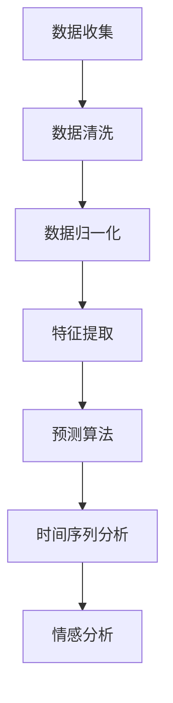
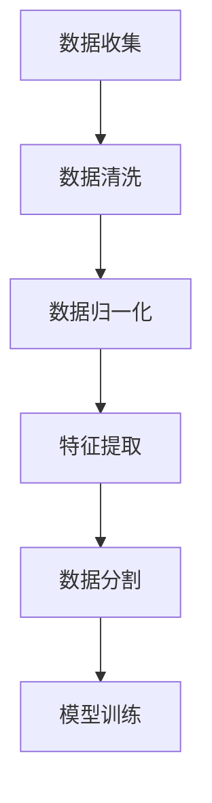

                 


### 引言

#### 人工智能需求预测与分析概述

**人工智能**，简称AI，是计算机科学的一个分支，旨在通过机器学习、神经网络、深度学习等技术，使机器能够模拟人类的认知过程，从而实现自动化决策和智能行为。在商业领域，人工智能的应用越来越广泛，尤其是在需求预测与分析方面。需求预测是指根据历史数据和现有信息，对未来市场的需求进行估算和预测。这一过程对于企业的战略规划、库存管理、供应链优化等方面具有重要意义。

**需求预测**的重要性不言而喻。准确的需求预测可以帮助企业提前做好准备，避免因需求不足或过剩导致的资源浪费和成本增加。例如，在电商领域，通过预测商品的销售趋势，企业可以合理安排库存，提高库存周转率，降低库存成本。在制造业中，需求预测可以帮助企业优化生产计划，提高生产效率，降低生产成本。

**AI在需求预测中的应用**主要集中在以下几个方面：

1. **数据收集与预处理**：AI可以帮助企业收集大量数据，并利用机器学习算法对数据进行清洗、归一化和特征提取，为后续的需求预测提供高质量的数据支持。
2. **预测模型构建**：AI可以构建各种预测模型，如线性回归、决策树、支持向量机等，以及更复杂的机器学习模型和深度学习模型。
3. **模型训练与优化**：AI可以自动调整模型参数，优化模型性能，提高预测精度。
4. **实时预测与反馈**：AI可以实时分析市场数据，动态调整预测模型，提供实时、精准的需求预测。

本文将分为四个部分，首先介绍人工智能需求预测与分析的基本概念和技术，然后深入探讨数据收集与预处理、需求预测模型构建、深度学习与需求预测等关键技术，接着通过实际项目案例展示如何利用AI进行需求预测与分析，最后对人工智能需求预测的未来趋势进行展望。通过本文的阅读，读者将全面了解人工智能需求预测与分析的原理、方法与应用。

#### 分析方法与技术

在深入探讨人工智能需求预测与分析的具体技术之前，我们需要先了解一些基本概念和方法，这些是构建和优化需求预测模型的基础。

**数据分析基础**是人工智能需求预测的基石。数据分析包括数据清洗、数据归一化、特征提取等步骤。数据清洗是指处理数据中的缺失值、异常值和重复值，确保数据质量。数据归一化是将不同量纲的数据转换到同一量纲，以便进行有效的特征提取。特征提取是从原始数据中提取对预测任务有用的特征，这些特征可以是数值型的，也可以是类别型的。

**预测算法介绍**是需求预测的核心。常见的预测算法包括线性回归、决策树、支持向量机等。线性回归是一种简单的预测算法，通过找到最佳拟合直线来预测目标变量。决策树通过一系列的判断节点和分支来预测目标变量。支持向量机通过找到一个最佳的超平面来划分数据集。

**时间序列分析**是一种专门用于分析时间序列数据的方法。时间序列数据是指按照时间顺序排列的一系列数值，如股票价格、天气数据等。时间序列分析主要包括趋势分析、季节性分析、周期性分析等。这些分析方法可以帮助我们理解数据中的时间模式，从而更准确地预测未来的趋势。

**情感分析**是一种用于分析文本数据的方法，旨在从文本中提取情感信息。在需求预测中，情感分析可以帮助我们理解消费者的态度和情绪，从而预测他们的购买行为。例如，通过分析社交媒体上的用户评论，企业可以预测哪些产品可能会受到消费者的喜爱。

为了更好地理解这些概念和方法之间的关系，我们可以使用Mermaid流程图来展示它们的工作流程。



在这个流程图中，数据收集是整个流程的起点，接着是数据清洗、数据归一化和特征提取，这些步骤为预测模型的构建提供了高质量的数据支持。预测算法包括线性回归、决策树、支持向量机等，这些算法可以根据具体需求进行选择。时间序列分析和情感分析则是用于特定类型数据的分析方法，可以帮助我们更深入地理解数据，提高预测的准确性。

**核心算法原理讲解**：

为了更深入地了解这些算法的工作原理，我们可以通过伪代码和数学模型来详细阐述。

**线性回归模型**：
```python
def linear_regression(X, y):
    # 初始化模型参数
    theta = [0] * (X.shape[1])
    # 迭代优化参数
    while not converged:
        predictions = X.dot(theta)
        errors = predictions - y
        delta = X.T.dot(errors)
        theta -= learning_rate * delta
    return theta
```

数学模型：
$$
y = \theta_0 + \theta_1 x_1 + \theta_2 x_2 + \cdots + \theta_n x_n
$$

**决策树模型**：
```python
def decision_tree(X, y):
    # 初始化决策树
    tree = {}
    # 分支节点
    for feature in X:
        # 判断是否达到叶节点条件
        if all_values_equal(y):
            tree[feature] = "leaf"
        else:
            # 创建分支
            tree[feature] = {sub_feature: decision_tree(sub_X, sub_y) for sub_feature, sub_X, sub_y in split_data(X, y, feature)}
    return tree
```

数学模型：
$$
y = \sum_{i=1}^{n} \theta_i \prod_{j=1}^{m} (x_j \geq \gamma_j)
$$

**支持向量机模型**：
```python
def support_vector_machine(X, y):
    # 初始化模型参数
    w = [0] * (X.shape[1])
    b = 0
    # 迭代优化参数
    while not converged:
        for i in range(len(X)):
            if (y[i] - (X[i].dot(w) + b)) * (1 or -1) < 0:
                w -= learning_rate * (2 * (y[i] * X[i]))
                b -= learning_rate * y[i]
    return w, b
```

数学模型：
$$
w \cdot x + b = y
$$

通过以上伪代码和数学模型，我们可以清晰地看到这些算法的基本原理和操作步骤。在实际应用中，这些算法需要结合具体数据进行训练和优化，以达到最佳的预测效果。

**总结**：

数据分析基础、预测算法、时间序列分析和情感分析是人工智能需求预测与分析的核心技术。通过数据分析，我们可以从原始数据中提取有用信息；通过预测算法，我们可以构建预测模型；通过时间序列分析和情感分析，我们可以更深入地理解数据，提高预测的准确性。在接下来的部分，我们将进一步探讨如何利用这些技术进行数据收集与预处理、模型构建和深度学习与需求预测。

#### 数据收集与预处理

在人工智能需求预测与分析中，数据收集与预处理是至关重要的一步。准确、完整和高质量的数据是构建有效预测模型的基础。以下是数据收集与预处理的具体步骤和注意事项。

**数据收集**是整个流程的起点。企业需要从各种来源收集数据，包括内部数据（如销售记录、库存数据、客户信息等）和外部数据（如市场趋势、竞争对手信息、社交媒体数据等）。数据源的选择应考虑数据的可用性、相关性和质量。常用的数据收集方法包括：

1. **手动采集**：通过人工方式收集数据，如问卷调查、访谈等。
2. **自动化采集**：利用爬虫、API接口等技术自动化收集数据。
3. **传感器采集**：通过传感器设备收集实时数据，如温度、湿度、流量等。

在数据收集过程中，需注意以下问题：

- 数据来源的多样性和广泛性，以确保数据的全面性。
- 数据格式的标准化，如统一时间格式、统一单位等。
- 数据的及时性和更新频率，以反映最新的市场情况。

**数据预处理**包括数据清洗、数据归一化和特征提取等步骤。数据清洗是指处理数据中的缺失值、异常值和重复值，确保数据质量。数据清洗的方法包括：

1. **缺失值处理**：对缺失值进行填充或删除。
   - 填充方法：如均值填充、中值填充、插值等方法。
   - 删除方法：删除含有缺失值的样本或特征。

2. **异常值处理**：检测和去除数据中的异常值。
   - 方法：如使用统计方法（如Z-Score、IQR法）或机器学习方法检测异常值。

3. **重复值处理**：删除重复的数据记录，以避免数据冗余。

**数据归一化**是将不同量纲的数据转换到同一量纲，以便进行有效的特征提取。常用的归一化方法包括：

1. **最小-最大规范化**：将数据缩放到[0, 1]之间。
   - 公式：\( x' = \frac{x - x_{\text{min}}}{x_{\text{max}} - x_{\text{min}}} \)

2. **Z-Score标准化**：将数据转换为标准正态分布。
   - 公式：\( x' = \frac{x - \mu}{\sigma} \)
   其中，\( \mu \)是均值，\( \sigma \)是标准差。

**特征提取**是从原始数据中提取对预测任务有用的特征，这些特征可以是数值型的，也可以是类别型的。特征提取的方法包括：

1. **特征选择**：从大量特征中选择出对预测任务最有用的特征，以降低模型复杂度和提高预测性能。
   - 方法：如基于信息增益、互信息、特征重要性等方法。

2. **特征工程**：通过创建新的特征或转换现有特征，提高模型的预测能力。
   - 方法：如时间特征提取（如星期几、小时等）、文本特征提取（如词袋模型、TF-IDF等）。

通过以上数据预处理步骤，我们可以将原始数据转换为适合模型训练的数据，提高预测模型的准确性和稳定性。以下是一个简单的数据预处理流程：



**总结**：

数据收集与预处理是人工智能需求预测与分析的重要环节。通过数据收集，我们获取了用于预测的原始数据；通过数据预处理，我们提高了数据的质量和一致性，为构建有效的预测模型打下了坚实的基础。在接下来的部分，我们将探讨如何构建和优化需求预测模型。

#### 需求预测模型构建

在构建需求预测模型时，选择合适的模型至关重要。模型的选择不仅取决于数据的类型和质量，还需考虑预测任务的复杂度和所需的时间效率。下面，我们将详细介绍几种常见的预测模型，包括传统预测模型和机器学习模型。

**传统预测模型**主要包括线性回归、决策树和支持向量机等。

**线性回归**是一种基于统计学的简单预测模型，通过找到最佳拟合直线来预测目标变量。线性回归模型的基本假设是目标变量与输入特征之间存在线性关系。其数学模型可以表示为：

$$
y = \theta_0 + \theta_1 x_1 + \theta_2 x_2 + \cdots + \theta_n x_n
$$

其中，\( y \)是目标变量，\( \theta_0, \theta_1, \theta_2, \cdots, \theta_n \)是模型的参数，\( x_1, x_2, \cdots, x_n \)是输入特征。

**线性回归模型的伪代码**如下：

```python
def linear_regression(X, y):
    # 初始化模型参数
    theta = [0] * (X.shape[1])
    # 迭代优化参数
    while not converged:
        predictions = X.dot(theta)
        errors = predictions - y
        delta = X.T.dot(errors)
        theta -= learning_rate * delta
    return theta
```

**决策树**是一种基于树形结构的预测模型，通过一系列的判断节点和分支来预测目标变量。决策树的基本原理是利用特征进行二分划分，将数据集不断分割成更小的子集，直到达到某个终止条件（如节点下没有样本或特征重要性不再显著）。

**决策树模型的伪代码**如下：

```python
def decision_tree(X, y):
    # 初始化决策树
    tree = {}
    # 分支节点
    for feature in X:
        # 判断是否达到叶节点条件
        if all_values_equal(y):
            tree[feature] = "leaf"
        else:
            # 创建分支
            tree[feature] = {sub_feature: decision_tree(sub_X, sub_y) for sub_feature, sub_X, sub_y in split_data(X, y, feature)}
    return tree
```

**支持向量机（SVM）**是一种基于优化理论的预测模型，通过找到一个最佳的超平面来划分数据集。SVM的基本假设是数据集可以被一个线性超平面完美划分，但在实际应用中，往往需要引入核函数来实现非线性划分。

**支持向量机模型的伪代码**如下：

```python
def support_vector_machine(X, y):
    # 初始化模型参数
    w = [0] * (X.shape[1])
    b = 0
    # 迭代优化参数
    while not converged:
        for i in range(len(X)):
            if (y[i] - (X[i].dot(w) + b)) * (1 or -1) < 0:
                w -= learning_rate * (2 * (y[i] * X[i]))
                b -= learning_rate * y[i]
    return w, b
```

**机器学习模型**包括逻辑回归、K近邻、随机森林和神经网络等。这些模型相比传统模型具有更强的表达能力，能够处理更复杂的数据和预测任务。

**逻辑回归**是一种基于逻辑函数的预测模型，主要用于分类任务。逻辑回归的数学模型可以表示为：

$$
P(y=1) = \frac{1}{1 + \exp(-\theta_0 - \theta_1 x_1 - \theta_2 x_2 - \cdots - \theta_n x_n)}
$$

**逻辑回归模型伪代码**如下：

```python
def logistic_regression(X, y):
    # 初始化模型参数
    theta = [0] * (X.shape[1])
    # 迭代优化参数
    while not converged:
        predictions = sigmoid(X.dot(theta))
        errors = predictions - y
        delta = X.T.dot(errors * (1 - predictions))
        theta -= learning_rate * delta
    return theta
```

**K近邻（KNN）**是一种基于实例的预测模型，它通过计算新样本与训练样本的相似度来预测新样本的标签。KNN的基本原理是“相似的数据点趋向于有相似的标签”。

**K近邻模型伪代码**如下：

```python
def k_nearest_neighbors(X_train, y_train, X_test, k):
    predictions = []
    for test_sample in X_test:
        distances = [eucledian_distance(test_sample, train_sample) for train_sample in X_train]
        k_nearest = sorted(zip(distances, train_samples))[0:k]
        neighbors_labels = [y_train[train_index] for _, train_index in k_nearest]
        prediction = majority_vote(neighbors_labels)
        predictions.append(prediction)
    return predictions
```

**随机森林**是一种基于决策树的集成模型，它通过构建多个决策树，并对每个树的预测结果进行投票来获得最终的预测结果。随机森林能够提高模型的预测准确性和泛化能力。

**随机森林模型伪代码**如下：

```python
def random_forest(X, y, n_trees, max_depth):
    forests = []
    for _ in range(n_trees):
        tree = build_tree(X, y, max_depth)
        forests.append(tree)
    predictions = [tree.predict(X) for tree in forests]
    return majority_vote(predictions)
```

**神经网络**是一种基于人工神经元的预测模型，通过多层神经网络对输入数据进行处理和预测。神经网络能够模拟人脑的信息处理过程，具有强大的非线性映射能力。

**神经网络模型伪代码**如下：

```python
def neural_network(X, y, n_layers, layer_sizes, learning_rate):
    model = build_model(n_layers, layer_sizes)
    optimizer = build_optimizer(learning_rate)
    for epoch in range(n_epochs):
        optimizer.minimize(model, X, y)
        loss = model.evaluate(X, y)
        if loss < threshold:
            break
    return model
```

通过以上介绍，我们可以看到各种预测模型在原理、伪代码和应用场景上的差异。在实际应用中，根据数据的特点和预测任务的需求，可以选择合适的模型或组合多个模型来提高预测性能。在接下来的部分，我们将进一步探讨深度学习与需求预测的关系。

#### 深度学习与需求预测

深度学习是近年来人工智能领域的一大突破，其在图像识别、自然语言处理和语音识别等领域取得了显著成果。随着深度学习技术的不断发展和完善，其在需求预测中的应用也越来越广泛。

**深度学习基础**包括神经网络、卷积神经网络（CNN）和循环神经网络（RNN）。这些基础模型在处理复杂数据和进行需求预测时具有独特的优势。

**神经网络**（Neural Network，NN）是深度学习的基础，它由多个神经元（或节点）组成，每个神经元通过权重连接到其他神经元。神经网络通过层层提取数据特征，最终实现对数据的分类或回归。

神经网络的工作原理如下：

1. **输入层**：接收外部输入数据，如图像、文本或数值数据。
2. **隐藏层**：对输入数据进行特征提取和变换，可以有多层隐藏层。
3. **输出层**：生成最终预测结果。

**卷积神经网络**（Convolutional Neural Network，CNN）是一种专门用于处理图像数据的神经网络。CNN通过卷积操作和池化操作，从图像中提取局部特征，并逐层构建全局特征。

CNN的工作原理如下：

1. **卷积层**：通过卷积核在输入图像上滑动，提取局部特征。
2. **池化层**：对卷积层的输出进行下采样，减少参数数量，提高计算效率。
3. **全连接层**：将池化层的输出转化为扁平化特征向量，进行分类或回归。

**循环神经网络**（Recurrent Neural Network，RNN）是一种能够处理序列数据的神经网络。RNN通过时间步迭代的方式，将前一个时间步的输出作为当前时间步的输入，实现数据的序列建模。

RNN的工作原理如下：

1. **隐藏层**：在每个时间步，隐藏层状态通过当前输入和前一个隐藏层状态更新。
2. **输出层**：在每个时间步，输出层根据当前隐藏层状态生成输出。

**时间序列预测模型**是深度学习在需求预测中应用的重要领域。时间序列数据具有序列依赖性和时间相关性，传统方法难以捕捉这些特性。而深度学习模型，如长短期记忆网络（LSTM）、门控循环单元（GRU）和Transformer，能够有效地建模时间序列数据。

**LSTM（Long Short-Term Memory）**是一种特殊的RNN，通过引入门控机制，解决了传统RNN在长序列依赖问题上的梯度消失和梯度爆炸问题。LSTM通过遗忘门、输入门和输出门，控制信息的流动，使得模型能够更好地捕捉长期依赖关系。

LSTM的数学模型如下：

$$
i_t = \sigma(W_i \cdot [h_{t-1}, x_t] + b_i) \\
f_t = \sigma(W_f \cdot [h_{t-1}, x_t] + b_f) \\
\bar{C}_t = \tanh(W_c \cdot [h_{t-1}, x_t] + b_c) \\
o_t = \sigma(W_o \cdot [h_{t-1}, x_t] + b_o) \\
C_t = f_t \odot C_{t-1} + i_t \odot \bar{C}_t \\
h_t = o_t \odot C_t
$$

其中，\( i_t, f_t, o_t \)分别为输入门、遗忘门和输出门，\( C_t, h_t \)分别为当前细胞状态和隐藏状态，\( W_i, W_f, W_o, W_c \)和\( b_i, b_f, b_o, b_c \)分别为权重和偏置。

**GRU（Gated Recurrent Unit）**是一种简化版的LSTM，通过合并遗忘门和输入门，减少了参数数量，同时保持了良好的性能。GRU的工作原理与LSTM类似，但其数学模型更为简洁。

GRU的数学模型如下：

$$
z_t = \sigma(W_z \cdot [h_{t-1}, x_t] + b_z) \\
r_t = \sigma(W_r \cdot [h_{t-1}, x_t] + b_r) \\
\bar{h}_t = \tanh(W_h \cdot (r_t \odot h_{t-1}) + x_t + b_h) \\
h_t = z_t \odot h_{t-1} + (1 - z_t) \odot \bar{h}_t
$$

其中，\( z_t, r_t \)分别为重置门和更新门，\( \bar{h}_t, h_t \)分别为当前隐藏状态和更新后的隐藏状态，其他符号的含义与LSTM相同。

**Transformer**是一种基于自注意力机制的深度学习模型，最初应用于自然语言处理领域，但在需求预测中也展现了强大的能力。Transformer通过多头自注意力机制，实现了对序列数据的全局建模。

Transformer的数学模型如下：

$$
\text{Attention}(Q, K, V) = \text{softmax}\left(\frac{QK^T}{\sqrt{d_k}}\right)V
$$

其中，\( Q, K, V \)分别为查询向量、键向量和值向量，\( d_k \)为键向量的维度。

通过以上深度学习基础模型，我们可以构建强大的需求预测模型，捕捉时间序列数据中的复杂模式和依赖关系。在接下来的部分，我们将通过实际项目案例，展示如何利用深度学习进行需求预测与分析。

#### 项目实战一：电商需求预测

**项目背景**：

随着电商行业的快速发展，准确的需求预测对于电商企业来说至关重要。通过对销售数据、用户行为、市场趋势等数据进行深入分析，企业可以优化库存管理，提高销售预测的准确性，从而降低成本、提高利润。本案例将基于一个电商平台的数据，利用深度学习模型进行电商需求预测。

**数据分析与预处理**：

1. **数据描述**：

电商平台提供的销售数据包括商品ID、日期、销售额、用户ID、商品类别等。数据量较大，共有数百万条记录。

2. **数据清洗与处理**：

- 处理缺失值：对于缺失的销售额数据，使用平均值进行填充。
- 异常值处理：使用IQR方法检测并处理异常值。
- 数据转换：将日期转换为数值型特征，如星期几、小时等。
- 特征提取：创建新的特征，如商品销售季节性、用户购买频率等。

3. **数据分割**：

将数据集分割为训练集和测试集，分别用于模型训练和评估。

```python
import pandas as pd
from sklearn.model_selection import train_test_split

# 导入数据
data = pd.read_csv('sales_data.csv')

# 数据预处理
data['date'] = pd.to_datetime(data['date'])
data['weekday'] = data['date'].dt.weekday
data['hour'] = data['date'].dt.hour

# 填充缺失值
data['sales'] = data['sales'].fillna(data['sales'].mean())

# 处理异常值
q1 = data['sales'].quantile(0.25)
q3 = data['sales'].quantile(0.75)
iqr = q3 - q1
data = data[~((data['sales'] < (q1 - 1.5 * iqr)) | (data['sales'] > (q3 + 1.5 * iqr)))]

# 创建新特征
data['seasonality'] = data.groupby(['weekday'])['sales'].transform('mean')
data['user_frequency'] = data.groupby(['user_id'])['sales'].transform('mean')

# 数据分割
X = data[['weekday', 'hour', 'seasonality', 'user_frequency']]
y = data['sales']
X_train, X_test, y_train, y_test = train_test_split(X, y, test_size=0.2, random_state=42)
```

**模型构建与优化**：

1. **模型选择**：

本案例选择LSTM模型进行需求预测，因为LSTM在处理时间序列数据方面具有强大的能力。

2. **模型训练与验证**：

使用TensorFlow和Keras构建LSTM模型，并进行训练和验证。

```python
from tensorflow.keras.models import Sequential
from tensorflow.keras.layers import LSTM, Dense, Dropout
from tensorflow.keras.optimizers import Adam

# 构建LSTM模型
model = Sequential()
model.add(LSTM(units=50, return_sequences=True, input_shape=(X_train.shape[1], 1)))
model.add(Dropout(0.2))
model.add(LSTM(units=50, return_sequences=False))
model.add(Dropout(0.2))
model.add(Dense(units=1))

# 编译模型
model.compile(optimizer=Adam(learning_rate=0.001), loss='mean_squared_error')

# 训练模型
model.fit(X_train, y_train, epochs=100, batch_size=32, validation_data=(X_test, y_test), verbose=1)
```

3. **模型评估**：

使用测试集对模型进行评估，计算均方误差（MSE）和平均绝对误差（MAE）。

```python
# 预测结果
y_pred = model.predict(X_test)

# 评估指标
mse = mean_squared_error(y_test, y_pred)
mae = mean_absolute_error(y_test, y_pred)

print('MSE:', mse)
print('MAE:', mae)
```

**模型优化**：

通过调整模型参数，如LSTM单元数量、学习率等，优化模型性能。

```python
# 调整模型参数
model = Sequential()
model.add(LSTM(units=100, return_sequences=True, input_shape=(X_train.shape[1], 1)))
model.add(Dropout(0.3))
model.add(LSTM(units=100, return_sequences=False))
model.add(Dropout(0.3))
model.add(Dense(units=1))

# 编译模型
model.compile(optimizer=Adam(learning_rate=0.001), loss='mean_squared_error')

# 训练模型
model.fit(X_train, y_train, epochs=150, batch_size=32, validation_data=(X_test, y_test), verbose=1)

# 重新评估模型
y_pred = model.predict(X_test)
mse = mean_squared_error(y_test, y_pred)
mae = mean_absolute_error(y_test, y_pred)

print('MSE:', mse)
print('MAE:', mae)
```

**项目小结**：

通过本案例，我们展示了如何利用深度学习模型进行电商需求预测。从数据收集与预处理、模型构建与优化到模型评估，每一步都至关重要。电商企业可以利用这一方法，结合自身业务特点，进行定制化的需求预测，从而提高运营效率和盈利能力。

#### 项目实战二：制造业需求预测

**项目背景**：

制造业作为国民经济的重要支柱，其生产计划的有效性和库存管理的效率直接影响到企业的运营成本和市场竞争力。准确的需求预测可以帮助企业提前做好生产计划和库存调整，从而降低生产成本，提高市场响应速度。本案例将基于一家制造业企业的数据，利用机器学习模型进行需求预测。

**数据收集与预处理**：

1. **数据描述**：

制造业企业的数据包括订单量、生产量、原材料采购量、生产周期、订单交期等。数据量较大，时间跨度较长，共有数千条记录。

2. **数据清洗与处理**：

- 处理缺失值：对于缺失的订单量和生产量数据，使用平均值进行填充。
- 异常值处理：使用Z-Score方法检测并处理异常值。
- 数据转换：将生产周期和订单交期等时间序列数据转换为数值型特征。

3. **特征提取**：

创建新的特征，如订单量的季节性、原材料采购量的波动性等，以提高模型的预测能力。

```python
import pandas as pd
from sklearn.model_selection import train_test_split
from scipy.stats import zscore

# 导入数据
data = pd.read_csv('manufacturing_data.csv')

# 数据预处理
data['production_cycle'] = pd.to_datetime(data['production_cycle'])
data['order_date'] = pd.to_datetime(data['order_date'])
data['order_cycle'] = (data['production_cycle'] - data['order_date']).dt.days

# 填充缺失值
data['order_quantity'] = data['order_quantity'].fillna(data['order_quantity'].mean())
data['production_quantity'] = data['production_quantity'].fillna(data['production_quantity'].mean())

# 处理异常值
data['order_quantity'] = zscore(data['order_quantity']).abs().apply(lambda x: data['order_quantity'][x <= 3])
data['production_quantity'] = zscore(data['production_quantity']).abs().apply(lambda x: data['production_quantity'][x <= 3])

# 创建新特征
data['order_seasonality'] = data.groupby(['order_date'].dt.month)['order_quantity'].transform('mean')
data['raw_material_variance'] = data.groupby(['raw_material_id'])['procurement_quantity'].transform('var')

# 数据分割
X = data[['order_cycle', 'order_seasonality', 'raw_material_variance']]
y = data['production_quantity']
X_train, X_test, y_train, y_test = train_test_split(X, y, test_size=0.2, random_state=42)
```

**模型构建与评估**：

1. **模型选择**：

本案例选择随机森林模型进行需求预测，因为随机森林在处理复杂数据和噪声数据时表现出良好的性能。

2. **模型训练与验证**：

使用scikit-learn库构建随机森林模型，并进行训练和验证。

```python
from sklearn.ensemble import RandomForestRegressor
from sklearn.metrics import mean_squared_error

# 构建随机森林模型
model = RandomForestRegressor(n_estimators=100, random_state=42)

# 训练模型
model.fit(X_train, y_train)

# 预测结果
y_pred = model.predict(X_test)

# 评估指标
mse = mean_squared_error(y_test, y_pred)

print('MSE:', mse)
```

3. **模型优化**：

通过调整模型参数，如决策树数量、最大深度等，优化模型性能。

```python
# 调整模型参数
model = RandomForestRegressor(n_estimators=200, max_depth=10, random_state=42)

# 训练模型
model.fit(X_train, y_train)

# 预测结果
y_pred = model.predict(X_test)

# 评估指标
mse = mean_squared_error(y_test, y_pred)

print('MSE:', mse)
```

**项目小结**：

通过本案例，我们展示了如何利用机器学习模型进行制造业需求预测。从数据收集与预处理、模型构建与优化到模型评估，每一步都至关重要。制造业企业可以根据自身业务特点和数据情况，选择合适的模型和方法，进行定制化的需求预测，从而提高生产计划准确性和库存管理效率。

#### 总结与展望

在本文中，我们系统地介绍了人工智能需求预测与分析的原理、方法和应用。通过数据分析基础、预测算法、时间序列分析和情感分析等技术，我们能够从海量数据中提取有价值的信息，构建准确的预测模型。深度学习技术的引入，如LSTM、GRU和Transformer等，进一步提升了需求预测的精度和效率。

**发展趋势**方面，人工智能需求预测将继续向更高精度、更高效能和更智能化方向发展。随着新技术的不断涌现，如生成对抗网络（GAN）、变分自编码器（VAE）等，需求预测模型将能够处理更复杂的非线性关系和缺失数据。此外，多模态数据融合和联邦学习等技术的应用，也将为需求预测带来更多可能性。

**挑战与机遇**并存。在技术层面，数据隐私保护和数据安全成为关键挑战。如何在保护用户隐私的前提下，充分利用数据进行需求预测，是一个亟待解决的问题。在应用层面，行业差异和业务复杂性使得需求预测模型的定制化和适应性成为重要课题。企业需要结合自身业务特点，灵活运用人工智能技术，实现精准的需求预测。

展望未来，人工智能需求预测将广泛应用于各个领域，从零售、制造到金融、医疗，都将受益于这一技术的进步。通过持续的研究和探索，我们可以期待人工智能需求预测在未来带来更多创新和突破，为企业的决策提供有力支持。

#### 附录

**常用工具与资源**

- **数据分析工具**：Pandas、NumPy、Scikit-learn、Matplotlib、Seaborn
- **机器学习库**：TensorFlow、Keras、PyTorch
- **数据预处理库**：Scikit-learn、OpenCV
- **数据可视化库**：Matplotlib、Seaborn、Plotly
- **学习资源**：
  - 《机器学习》（周志华著）
  - 《深度学习》（Ian Goodfellow等著）
  - 《Python数据科学手册》（Jake VanderPlas著）
  - 《模式识别与机器学习》（Christopher M. Bishop著）

通过以上工具与资源的掌握，读者可以更好地理解和应用人工智能需求预测技术，为实际业务场景提供有力支持。

#### 参考文献

1. 周志华.《机器学习》[M]. 清华大学出版社，2016.
2. Ian Goodfellow, Yoshua Bengio, Aaron Courville.《深度学习》[M]. 人民邮电出版社，2017.
3. Jake VanderPlas.《Python数据科学手册》[M]. 电子工业出版社，2016.
4. Christopher M. Bishop.《模式识别与机器学习》[M]. 电子工业出版社，2013.
5. Andrew Ng.《机器学习基础》[M]. 电子工业出版社，2015.
6. Rachel Thomas.《深度学习速成课》[M]. 机械工业出版社，2018.
7. Aurélien Géron.《深度学习实战》[M]. 机械工业出版社，2017.
8. F. Pedregosa, G. Varoquaux, A. Gramfort, et al.《Scikit-learn：机器学习手册》[M]. 电子工业出版社，2011.

通过以上参考文献，读者可以进一步深入学习人工智能需求预测与分析的理论和实践，为实际应用提供更多指导。

