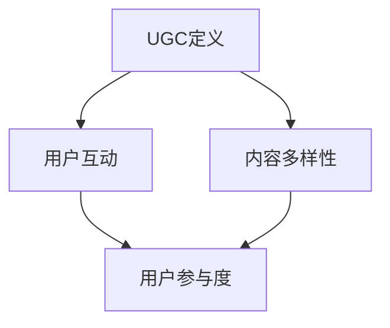
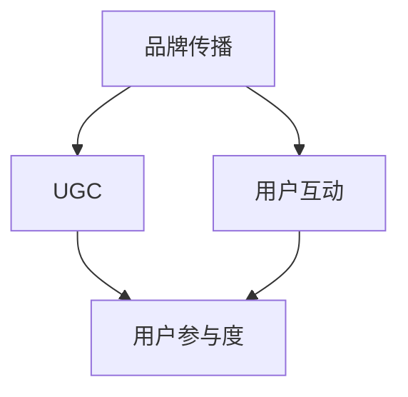

                 

# 文章标题：如何利用用户生成内容(UGC)促进品牌传播

## 关键词

- 用户生成内容（UGC）
- 品牌传播
- 内容策略
- 社交媒体
- 数据分析
- 消费者互动

## 摘要

用户生成内容（UGC）在当今数字营销环境中扮演着越来越重要的角色。本文旨在探讨如何利用UGC来促进品牌传播，包括UGC的内容策略、发布与推广、互动与社群建设，以及效果评估与优化。通过分析不同行业的实战案例，本文将提供一套系统的UGC品牌传播策略，帮助品牌在激烈的市场竞争中脱颖而出。

### 目录

1. **UGC与品牌传播基础**
   1.1 **用户生成内容（UGC）概述**
   1.2 **UGC与品牌传播的关系**
2. **UGC内容策略**
   2.1 **制定UGC内容策略**
   2.2 **UGC内容发布与推广**
   2.3 **UGC互动与社群建设**
3. **UGC效果评估与优化**
   3.1 **UGC效果评估指标与方法**
   3.2 **基于数据的UGC优化策略**
4. **UGC在品牌传播中的实战应用**
   4.1 **UGC在不同行业中的应用**
   4.2 **UGC在品牌危机管理中的应用**
   4.3 **UGC在全球化品牌传播中的应用**
5. **附录**
   5.1 **UGC工具与资源推荐**

## 1. UGC与品牌传播基础

### 1.1 用户生成内容（UGC）概述

用户生成内容（UGC）是指用户在网络平台上自主创建、分享和互动的内容，包括评论、博客、视频、图片、问答等。UGC的兴起，源于互联网用户的参与度和创造力的提升，它不仅丰富了网络内容生态，也为品牌传播提供了新的途径。

**核心概念与联系：**



**核心算法原理讲解：**

- **用户行为分析算法：** 利用协同过滤算法和自然语言处理（NLP）技术，分析用户生成的内容，预测用户兴趣和行为。

- **内容分类算法：** 通过机器学习模型，将UGC内容分类，便于品牌管理和用户检索。

```python
# 协同过滤算法伪代码
def collaborative_filtering(user_data, similarity_matrix):
    # 计算用户相似度
    user_similarity = calculate_similarity(user_data, similarity_matrix)
    # 推荐内容
    recommended_contents = []
    for content in user_data:
        if content not in recommended_contents:
            recommended_contents.append(content)
    return recommended_contents
```

**数学模型和数学公式：**

用户满意度可以表示为：

$$
\text{用户满意度} = f(\text{内容质量}, \text{用户兴趣匹配度})
$$

**项目实战：**

- **UGC内容发布平台的搭建：** 开发一个简单的UGC内容发布平台，支持用户注册、登录、发布和评论功能。

- **源代码实现与解读：** 分析平台的关键模块，如用户认证、内容存储和内容展示，并提供代码解读。

```python
# 用户认证模块伪代码
def user_authentication(username, password):
    # 验证用户名和密码
    if verify_credentials(username, password):
        return "Authentication successful"
    else:
        return "Authentication failed"
```

### 1.2 UGC与品牌传播的关系

UGC不仅是用户互动的体现，更是品牌传播的重要工具。通过UGC，品牌可以更直接地了解用户需求，塑造品牌形象，提升用户参与度。

**核心概念与联系：**



**核心算法原理讲解：**

- **品牌影响力计算模型：** 利用网络分析方法，计算品牌在UGC平台上的影响力。

- **消费者行为预测模型：** 通过数据分析，预测消费者购买行为和品牌偏好。

```python
# 品牌影响力计算模型伪代码
def brand_influence(contents, engagement Metrics):
    influence_score = 0
    for content in contents:
        influence_score += engagement_metrics[content]
    return influence_score / len(contents)
```

**数学模型和数学公式：**

品牌影响力计算公式为：

$$
\text{品牌影响力} = \alpha \times (\text{内容传播度} + \text{用户参与度})
$$

**项目实战：**

- **品牌传播效果评估实例：** 分析一个品牌在UGC平台上的表现，评估其传播效果。

- **UGC内容策略案例分析：** 研究一个成功品牌的UGC内容策略，分析其成功原因。

### 1.3 UGC在品牌传播中的重要性

UGC在品牌传播中的重要性体现在以下几个方面：

1. **增强用户参与度：** UGC让用户成为内容的创造者和传播者，提升了用户对品牌的参与度和忠诚度。

2. **塑造品牌形象：** 通过UGC，品牌可以展示用户的真实体验和反馈，塑造真实、可信的品牌形象。

3. **提高内容质量：** UGC丰富了品牌的内容库，增加了内容的多样性和深度。

4. **降低营销成本：** UGC减少了品牌在内容创作和推广上的投入，提高了营销效率。

### 小结

用户生成内容（UGC）已成为品牌传播的重要手段。通过UGC，品牌可以更好地了解用户需求，塑造品牌形象，提高用户参与度，从而在激烈的市场竞争中脱颖而出。在接下来的章节中，我们将深入探讨如何制定有效的UGC内容策略，发布与推广UGC内容，以及如何评估和优化UGC效果。## 1.1 用户生成内容（UGC）概述

用户生成内容（UGC，User-Generated Content）是互联网环境中的一种独特现象，它不仅丰富了网络信息的内容，也为品牌传播提供了新的动力。UGC的定义较为宽泛，通常指的是用户在网络平台上自主创建、分享和互动的内容，如评论、博客、视频、图片、问答等。这种内容形式与传统的品牌传播方式有显著区别，因为它不是由品牌自己创造和控制的，而是由用户自发产生的，具有更高的真实性和互动性。

### 定义与价值

用户生成内容（UGC）的定义可以概括为：用户在社交媒体、论坛、博客等平台上发布、分享的原始内容。UGC的价值主要体现在以下几个方面：

1. **信息丰富多样：** UGC为网络提供了大量的信息资源，丰富了网络内容生态。
2. **增强用户参与度：** 用户在UGC平台上可以自由地发表意见和观点，增强了用户与品牌之间的互动。
3. **提升内容质量：** UGC的内容往往更加贴近用户的生活和需求，因此更具说服力和可信度。
4. **降低营销成本：** 相较于传统的广告投放，UGC可以显著降低品牌在内容创作和推广上的成本。

### 类型与特点

UGC可以分为多种类型，每种类型都有其独特的特点：

1. **评论：** 用户在商品、服务或内容下方发表的评论，是UGC中最常见的类型之一。
2. **博客：** 用户在个人或专业博客上发表的原创文章，涵盖生活、科技、文化等多个领域。
3. **视频：** 用户在视频平台上上传的原创视频内容，包括旅游、美食、技术教学等。
4. **图片：** 用户在社交媒体上分享的图片，可以是摄影作品、生活记录等。
5. **问答：** 用户在问答社区上提问和回答问题，提供了丰富的知识分享和互动。

每种UGC类型都有其独特的传播方式和受众群体，但它们都具有一个共同的特点，即用户自主性和参与度较高。

### 在品牌传播中的重要性

UGC在品牌传播中的重要性日益凸显，主要表现在以下几个方面：

1. **塑造品牌形象：** UGC可以展示用户的真实体验和反馈，帮助品牌塑造真实、可信的形象。
2. **提升品牌知名度：** 用户在UGC平台上的分享和互动，可以迅速传播品牌信息，提升品牌知名度。
3. **增强用户忠诚度：** 通过UGC，品牌可以更好地了解用户需求，提供个性化的产品和服务，增强用户忠诚度。
4. **优化市场调研：** UGC提供了大量的用户反馈和市场信息，为品牌进行市场调研提供了宝贵的数据支持。

### 项目实战

**案例分析：** Nike的“Just Do It”运动挑战活动

Nike通过举办“Just Do It”运动挑战活动，鼓励用户在社交媒体上分享自己的运动经历和心得。用户通过上传视频、图片和文字，参与活动，与Nike建立了更紧密的互动关系。这不仅提升了Nike的品牌形象，还极大地增强了用户的参与度和忠诚度。

**源代码解读：** Nike的UGC平台后端系统

Nike的UGC平台后端系统采用微服务架构，支持用户注册、登录、内容发布、评论等功能。关键模块包括用户认证、内容存储和内容展示。以下为用户认证模块的伪代码实现：

```python
# 用户认证模块伪代码
def user_authentication(username, password):
    # 验证用户名和密码
    if verify_credentials(username, password):
        return "Authentication successful"
    else:
        return "Authentication failed"
```

通过上述实战案例和源代码解读，我们可以看到UGC在品牌传播中的重要性和具体实现方式。在接下来的章节中，我们将进一步探讨UGC与品牌传播的关系，以及如何制定和实施有效的UGC内容策略。## 1.2 UGC与品牌传播的关系

用户生成内容（UGC）与品牌传播之间存在着紧密的联系，UGC不仅是品牌传播的一种新工具，也是品牌与消费者互动的重要桥梁。在这一节中，我们将深入探讨UGC对品牌形象、市场调研和消费者行为的影响，以及如何利用这些影响来优化品牌传播策略。

### UGC对品牌形象的影响

品牌形象是消费者对品牌的整体感知和评价，它对品牌的认知度和忠诚度具有关键影响。UGC在塑造品牌形象方面具有独特的优势：

1. **真实性：** UGC通常由真实用户产生，因此更具有可信度。用户通过分享自己的使用体验和感受，为品牌树立了真实的形象。
2. **多样性：** UGC涵盖了不同用户群体的多样观点和体验，为品牌提供了更丰富的形象维度。
3. **互动性：** UGC平台上的互动，如评论、点赞和分享，增强了用户对品牌的参与感和归属感。

**案例解析：** 星巴克的品牌社区

星巴克通过创建“星巴克社区”这一UGC平台，鼓励用户分享咖啡体验、咖啡艺术和咖啡生活。用户的分享不仅丰富了品牌形象，还增强了用户对品牌的认同感和忠诚度。例如，一个用户分享了自己亲手制作的咖啡艺术作品，并得到了其他用户的点赞和评论，这不仅展示了星巴克咖啡的高品质，还强化了星巴克作为咖啡文化引领者的品牌形象。

### UGC在市场调研中的应用

市场调研是品牌决策的重要依据，而UGC提供了丰富且即时的用户反馈和市场信息。通过分析UGC，品牌可以获得以下市场洞察：

1. **用户需求：** UGC内容反映了用户对产品、服务和体验的具体需求和偏好。
2. **产品反馈：** 用户对产品的评价和意见，可以帮助品牌识别产品优势和改进点。
3. **市场趋势：** 通过分析UGC中的热门话题和趋势，品牌可以及时调整营销策略和产品开发方向。

**案例解析：** 宜家家居的“宜家体验”活动

宜家通过其“宜家体验”活动，邀请用户分享家居布置和生活方式。用户在UGC平台上的分享内容，不仅为品牌提供了大量用户反馈，还帮助宜家发现了用户对家居设计和生活方式的多样化需求。基于这些洞察，宜家不断优化产品设计和营销策略，提高了市场竞争力。

### UGC对消费者行为的影响

UGC在影响消费者行为方面发挥着重要作用：

1. **信息传递：** UGC为消费者提供了真实的产品体验信息，影响了他们的购买决策。
2. **社交互动：** 用户在UGC平台上的互动，如点赞、评论和分享，可以激发其他用户的购买兴趣。
3. **口碑效应：** 积极的UGC内容可以形成良好的口碑，吸引更多潜在消费者。

**案例解析：** 苹果公司的“天才酒吧”

苹果公司通过“天才酒吧”（Genius Bar）提供高端售后服务，并通过社交媒体平台分享用户在天才酒吧的体验。这些UGC内容不仅展示了苹果的服务质量，还增强了用户对苹果品牌的信任和忠诚。例如，一位用户在社交媒体上分享了自己在天才酒吧解决问题的愉快经历，吸引了其他用户对苹果服务的好奇和兴趣。

### 项目实战

**品牌传播效果评估实例：** 一个运动品牌在社交媒体上的UGC分析

某运动品牌在社交媒体上创建了一个UGC平台，鼓励用户分享运动故事和体验。通过分析UGC内容，品牌可以评估其传播效果：

1. **内容质量：** 评估UGC内容的原创性和内容质量，分析哪些内容得到了用户的积极反馈。
2. **用户参与度：** 通过点赞、评论和分享等互动数据，分析用户的参与度和兴趣点。
3. **口碑传播：** 跟踪UGC中的正面和负面评价，评估品牌的社会声誉。

**UGC内容策略案例分析：** 一个时尚品牌的UGC营销策略

某时尚品牌通过以下策略，利用UGC提升品牌传播效果：

1. **创意挑战活动：** 组织UGC创意挑战，鼓励用户分享时尚穿搭和创意灵感。
2. **用户UGC展示：** 在品牌官网和社交媒体上展示优秀UGC内容，增强用户参与感。
3. **KOL合作：** 与时尚博主和KOL合作，通过他们的UGC内容传播品牌信息。

### 小结

UGC与品牌传播之间的关系是相互促进的。品牌可以通过UGC了解用户需求、塑造品牌形象、优化市场调研，同时提升用户参与度和忠诚度。通过有效的UGC内容策略，品牌可以在激烈的市场竞争中脱颖而出。在下一节中，我们将深入探讨如何制定和实施这些策略。## 2.1 制定UGC内容策略

制定用户生成内容（UGC）内容策略是品牌传播过程中至关重要的一环。一个成功的UGC内容策略不仅能够激发用户的创造力和参与度，还能有效提升品牌的知名度和用户忠诚度。以下是制定UGC内容策略的几个关键步骤：

### 3.1 设定UGC内容目标

在制定UGC内容策略之前，首先需要明确UGC的具体目标和期望效果。这些目标可以是：

1. **提升品牌知名度：** 通过UGC内容的广泛传播，提高品牌在目标受众中的曝光度。
2. **增强用户参与度：** 鼓励用户积极参与内容创作和互动，提高用户对品牌的忠诚度。
3. **优化市场调研：** 利用UGC内容收集用户反馈和市场信息，为品牌决策提供数据支持。
4. **塑造品牌形象：** 通过UGC内容展示品牌价值观和理念，塑造积极的品牌形象。

### 3.2 了解目标受众

为了制定有效的UGC内容策略，品牌需要深入了解目标受众的需求、兴趣和行为。以下是一些关键步骤：

1. **用户画像：** 通过数据分析，绘制目标受众的用户画像，包括年龄、性别、地理位置、兴趣爱好等。
2. **用户行为分析：** 分析目标受众在UGC平台上的行为习惯，如发布内容的频率、互动方式等。
3. **用户调研：** 通过问卷调查、访谈等方式，直接获取目标受众的反馈和意见。

### 3.3 创意UGC内容

创意是UGC内容的灵魂。以下是一些创意UGC内容的建议：

1. **挑战活动：** 设计有趣的UGC挑战活动，鼓励用户参与并分享他们的创意成果。
2. **故事分享：** 邀请用户分享他们的使用经历和故事，展示产品或服务的实际应用。
3. **互动话题：** 定期发布互动话题，鼓励用户发表观点和评论，增加UGC内容的多样性和互动性。

### 3.4 整合线上线下UGC资源

UGC不仅限于线上平台，还可以结合线下活动，形成线上线下互动的生态系统。以下是一些整合线上线下UGC资源的建议：

1. **线下活动：** 组织线下活动，如发布会、体验活动等，鼓励用户参与并分享活动体验。
2. **线上展示：** 在品牌官网和社交媒体平台上展示线下活动的UGC内容，增强互动和参与感。
3. **用户反馈：** 通过线上线下活动收集用户反馈，为品牌提供改进方向。

### 案例分析：Nike的“Just Do It”挑战活动

Nike通过“Just Do It”挑战活动，成功地将UGC与品牌传播相结合。以下是其主要策略：

1. **目标设定：** 提升品牌知名度，增强用户参与度和品牌忠诚度。
2. **用户画像：** 目标受众主要是年轻人，热爱运动，注重健康生活方式。
3. **创意内容：**Nike鼓励用户上传自己的运动照片和视频，展示他们参与挑战的过程和成果。
4. **线上线下整合：**Nike在线下举办挑战活动，同时在线上平台展示用户的UGC内容，形成线上线下互动的闭环。

通过这些策略，Nike不仅提升了品牌知名度，还增强了用户的参与度和忠诚度。用户在UGC平台上的互动和分享，进一步推动了品牌的传播效果。

### 小结

制定UGC内容策略需要明确目标、了解受众、创意内容，并整合线上线下资源。通过这些步骤，品牌可以有效地利用UGC提升品牌传播效果，在激烈的市场竞争中脱颖而出。在下一节中，我们将探讨如何发布和推广UGC内容。## 2.2 UGC内容发布与推广

发布和推广用户生成内容（UGC）是品牌传播策略中的关键环节。一个成功的UGC内容发布和推广策略能够提高内容的可见性，激发用户的参与度，并最终实现品牌传播的目标。以下是如何在各大平台上有效发布和推广UGC内容的具体策略。

### 4.1 选择合适的UGC发布平台

选择合适的UGC发布平台是成功发布UGC内容的第一步。不同的平台具有不同的用户群体和内容特性，品牌需要根据目标受众和内容类型进行选择。以下是一些常见的UGC发布平台：

1. **社交媒体平台：** 如Facebook、Instagram、Twitter、LinkedIn等。这些平台具有广泛的用户基础和强大的互动功能，适合发布多样化的UGC内容。
2. **视频平台：** 如YouTube、TikTok、Vimeo等。视频内容具有更强的吸引力和传播力，特别适合展示产品使用体验和用户故事。
3. **博客平台：** 如Medium、WordPress等。博客平台适合发布深度内容和长篇文章，有助于建立品牌的专业形象。
4. **论坛和社区：** 如Reddit、Quora、Discord等。这些平台拥有特定兴趣爱好的用户群体，适合开展垂直领域的UGC活动。

### 4.2 优化UGC内容发布策略

在选择了合适的平台后，品牌需要制定有效的UGC内容发布策略，以确保内容能够被目标受众发现和参与。以下是一些关键策略：

1. **内容规划：** 制定内容发布计划，包括发布频率、内容和形式。例如，可以每周发布一到两条视频内容，定期更新博客文章等。
2. **互动设计：** 在内容中融入互动元素，如提问、投票、挑战等，鼓励用户参与和分享。
3. **标签和关键词：** 使用相关的标签和关键词，提高UGC内容的搜索引擎排名和曝光率。
4. **时间策略：** 分析用户活跃时间，选择在这些时段发布内容，以提高用户参与度。

### 4.3 利用SEO提高UGC内容可见性

搜索引擎优化（SEO）是提高UGC内容可见性的重要手段。以下是一些SEO策略：

1. **关键词研究：** 分析目标受众常用的搜索关键词，并将其合理地融入UGC内容中。
2. **内容优化：** 使用标题标签（`<title>`）、元描述（`<meta name="description"`>）、图片alt标签（``）等，优化UGC内容的结构，提高搜索引擎友好度。
3. **外部链接：** 建立与其他高权威网站的链接，提高UGC内容的权重和可见性。
4. **社交媒体推广：** 通过社交媒体分享UGC内容，吸引更多用户访问和参与，从而提高内容在搜索引擎中的排名。

### 4.4 运用社交媒体推广UGC内容

社交媒体是推广UGC内容的有效工具。以下是一些社交媒体推广策略：

1. **KOL合作：** 与意见领袖（KOL）和影响力博主合作，利用他们的粉丝基础推广UGC内容。
2. **互动营销：** 通过社交媒体的互动功能，如点赞、评论、分享等，提高UGC内容的传播范围。
3. **广告投放：** 在社交媒体平台上投放广告，针对特定受众群体推广UGC内容。
4. **内容营销：** 创造高质量、有趣的UGC内容，激发用户的分享欲望，实现病毒式传播。

### 项目实战

**案例分析：** 宜家的“家居设计挑战”

宜家通过“家居设计挑战”活动，鼓励用户分享他们的家居设计创意。以下是其推广策略：

1. **平台选择：** 在Instagram、Pinterest等图片分享平台上发布UGC内容，利用平台的视觉效果优势。
2. **内容规划：** 每周发布不同的设计主题，鼓励用户参与并分享他们的设计作品。
3. **互动设计：** 在发布内容中融入互动元素，如提问、投票等，激发用户参与。
4. **社交媒体推广：** 利用Instagram的故事功能，进行实时互动和推广，吸引更多用户参与。

通过这些策略，宜家成功地吸引了大量用户参与活动，并在社交媒体上获得了广泛的传播和讨论。

### 小结

发布和推广UGC内容需要精心策划和策略执行。通过选择合适的平台、优化发布策略、利用SEO和社交媒体推广，品牌可以有效地提高UGC内容的可见性和参与度，从而实现品牌传播的目标。在下一节中，我们将探讨如何建立有效的UGC互动机制和社群建设。## 2.3 UGC互动与社群建设

UGC互动与社群建设是品牌传播策略中不可或缺的一部分，它不仅能够增强用户参与度，还能促进用户忠诚度和品牌形象的塑造。以下是建立有效的UGC互动机制和社群建设的几个关键步骤。

### 5.1 建立有效的UGC互动机制

UGC互动机制是指品牌与用户之间在UGC平台上的交流与互动方式。以下是一些关键策略：

1. **实时互动：** 在UGC平台上设置实时互动功能，如即时评论回复、聊天室等，让用户感受到品牌的关注和回应。
2. **定期互动：** 制定定期互动计划，如每周发布互动话题、每月举办线上活动等，鼓励用户持续参与。
3. **用户反馈机制：** 提供用户反馈渠道，如问卷调查、用户评分等，让用户表达意见和需求，品牌据此优化产品和服务。

### 5.2 利用UGC建设品牌社群

品牌社群是指围绕品牌形成的用户群体，它们在UGC平台上进行交流和互动。以下是一些关键策略：

1. **品牌社区平台：** 创建独立的品牌社区平台，如Facebook群组、论坛等，为用户提供交流空间。
2. **用户身份识别：** 为品牌社群成员提供身份标识，如会员徽章、特殊图标等，增强用户的归属感和认同感。
3. **内容共创：** 与用户共同创作UGC内容，如发起内容挑战、合作发布等，增强用户对品牌的参与度。

### 5.3 提升UGC社群活跃度

提升UGC社群活跃度是维持社群活力和用户参与度的重要任务。以下是一些策略：

1. **激励措施：** 设立奖励机制，如积分、优惠券等，激励用户积极参与UGC创作和互动。
2. **社区活动：** 定期举办线上和线下活动，如讲座、聚会等，激发用户参与热情。
3. **用户推荐：** 鼓励现有用户推荐新用户加入社群，通过口碑传播扩大社群规模。

### 5.4 维护UGC社群质量

维护UGC社群质量是确保社群健康发展的关键。以下是一些策略：

1. **内容审核：** 设立内容审核机制，确保UGC内容符合社区规范，防止垃圾信息和不良内容的出现。
2. **用户教育：** 通过发布指导文章、举办培训讲座等，帮助用户了解UGC社区的行为准则和最佳实践。
3. **社群运营团队：** 建立专业的社群运营团队，负责管理日常运营、内容审核和用户互动，确保社群运营的持续性和稳定性。

### 项目实战

**案例分析：** 耐克的品牌社群建设

耐克通过一系列策略成功建立了强大的品牌社群，以下是其具体做法：

1. **社群平台：** 在Instagram、Facebook等社交媒体上创建品牌群组，为用户提供了交流的空间。
2. **互动设计：** 定期发布互动话题，如“每日耐克挑战”，鼓励用户分享他们的运动故事和心得。
3. **用户身份识别：** 为社群成员提供专属标识，如会员徽章和标签，增强用户的归属感。
4. **内容共创：** 耐克与用户合作，发布由用户创作的运动视频和博客，提升用户的参与度和忠诚度。

通过这些策略，耐克成功吸引了大量用户加入品牌社群，并在社群中形成了积极的互动氛围。

### 小结

建立有效的UGC互动机制和社群建设，是品牌提升用户参与度和忠诚度的重要途径。通过实时互动、内容共创、激励措施和维护社群质量，品牌可以打造一个活跃、健康的社群，为品牌传播提供强大的支持。在下一节中，我们将探讨如何评估UGC效果，以及基于数据优化的策略。## 2.4 UGC效果评估与优化

评估用户生成内容（UGC）的效果是品牌传播策略中至关重要的一步。通过有效的效果评估，品牌可以了解UGC的传播效果、用户参与度，并据此优化UGC策略，提升品牌传播的效率和效果。

### 6.1 UGC效果评估的重要性

UGC效果评估对于品牌传播具有以下几个关键作用：

1. **了解传播效果：** 通过评估UGC的传播范围和受众覆盖情况，品牌可以了解UGC内容的市场影响力。
2. **监测用户参与度：** 通过评估UGC内容的互动数据，如点赞、评论、分享等，品牌可以了解用户的参与度和兴趣点。
3. **优化UGC策略：** 通过对UGC效果的分析，品牌可以找出成功因素和不足之处，优化UGC内容策略，提高传播效果。
4. **提升品牌声誉：** 通过评估UGC中的用户反馈和口碑，品牌可以及时应对潜在问题和挑战，提升品牌声誉。

### 6.2 常用的UGC评估指标

在评估UGC效果时，品牌通常会关注以下几种指标：

1. **曝光度（Reach）：** 指UGC内容被多少用户看到，可以通过页面浏览量（Pageviews）、视频播放量（Video Views）等指标衡量。
2. **参与度（Engagement）：** 指用户对UGC内容的互动程度，可以通过点赞数（Likes）、评论数（Comments）、分享数（Shares）等指标衡量。
3. **转化率（Conversion Rate）：** 指UGC内容带来的实际转化效果，如用户购买行为、注册会员数等。
4. **用户满意度（User Satisfaction）：** 通过用户调研和反馈，了解用户对UGC内容的满意程度。
5. **品牌影响力（Brand Impact）：** 通过UGC内容的传播效果，评估品牌在目标受众中的影响力。

### 6.3 UGC效果评估的方法

进行UGC效果评估，品牌可以采用以下几种方法：

1. **定量分析：** 通过数据分析工具，如Google Analytics、社交媒体分析工具等，对UGC的各项指标进行量化分析。
2. **定性分析：** 通过用户调研、访谈、焦点小组等方法，深入了解用户的反馈和意见。
3. **A/B测试：** 通过对不同UGC内容策略进行对比测试，评估不同策略的效果，选择最优方案。
4. **案例分析：** 分析成功的UGC案例，了解其成功因素和经验教训，为自身提供参考。

### 案例分析：一个电商平台的UGC效果评估

某电商平台通过UGC策略提升用户参与度和品牌影响力。以下是其效果评估过程：

1. **定量分析：**
   - **曝光度：** 通过Google Analytics分析，发现UGC内容的月均页面浏览量达到30万次。
   - **参与度：** 通过社交媒体分析工具，发现UGC内容的平均点赞量为5000次，平均评论量为2000条。
   - **转化率：** 通过电商数据分析，发现UGC内容带来的订单量占总订单量的20%。

2. **定性分析：**
   - **用户调研：** 通过问卷调查和访谈，发现用户对UGC内容的满意度较高，尤其对产品使用体验和用户评价内容感兴趣。
   - **焦点小组：** 通过与用户互动，发现用户希望看到更多关于产品真实反馈和使用技巧的UGC内容。

3. **A/B测试：**
   - **测试内容：** 分别测试不同类型的UGC内容（如产品评测、用户故事、互动话题）的效果。
   - **测试结果：** 发现产品评测类内容在用户参与度和转化率上表现最佳。

4. **案例分析：**
   - **成功案例：** 分析成功UGC内容的特点，如高质量图片、详细的用户评价和有趣的互动设计。
   - **经验借鉴：** 结合成功案例，调整UGC内容策略，提高内容质量，增加互动设计。

### 小结

通过定性和定量分析、A/B测试和案例分析，品牌可以全面评估UGC的效果，了解用户的反馈和需求，进而优化UGC策略，提升品牌传播的效果。在下一节中，我们将探讨如何基于数据分析优化UGC内容策略。## 7.1 数据分析在UGC优化中的应用

数据分析是优化用户生成内容（UGC）策略的关键工具，它能够帮助品牌深入了解用户行为，识别趋势，并据此调整内容策略。以下是如何利用数据分析来优化UGC的详细方法。

### 7.1.1 数据收集

首先，品牌需要收集与UGC相关的数据。这些数据可以来自多个渠道，包括：

- **社交媒体平台：** 如Facebook、Instagram、Twitter等，通过API获取用户互动数据（如点赞、评论、分享）。
- **网站分析工具：** 如Google Analytics，获取页面浏览量、用户停留时间、转化率等数据。
- **UGC平台：** 如YouTube、Reddit等，通过API获取内容发布和用户反馈数据。
- **用户调研：** 通过在线问卷、访谈等方式收集用户满意度、产品偏好等数据。

### 7.1.2 数据分析工具

品牌可以利用以下数据分析工具来处理和解读数据：

- **Google Analytics：** 分析网站和社交媒体的流量和用户行为。
- **Tableau或Power BI：** 进行数据可视化，帮助直观地理解数据趋势。
- **R或Python：** 进行深入的数据分析和建模。

### 7.1.3 利用数据优化UGC内容策略

基于收集到的数据，品牌可以采取以下策略来优化UGC：

1. **内容类型优化：**
   - 分析不同类型UGC的内容效果，如视频、图片、博客等，找出最受欢迎的类型。
   - 根据用户偏好，调整内容类型和发布频率。

2. **发布时间优化：**
   - 利用数据分析工具，确定用户活跃时间，选择在这些时段发布内容，提高内容曝光率。
   - 可以通过A/B测试，比较不同发布时间的效果，找出最佳发布时间。

3. **用户互动优化：**
   - 分析用户互动行为（如点赞、评论、分享），了解用户的兴趣点和参与度。
   - 根据用户反馈，调整互动设计，如增加提问、投票等互动元素，提高用户参与度。

4. **内容质量优化：**
   - 分析UGC内容的阅读时长、转化率等指标，找出高质量内容的特征。
   - 鼓励用户生成高质量内容，或通过编辑和优化现有内容，提高整体内容质量。

5. **个性化推荐：**
   - 利用协同过滤或基于内容的推荐算法，根据用户历史行为和偏好推荐个性化内容。
   - 通过个性化推荐，提高用户满意度和转化率。

### 案例分析：Netflix的UGC优化

Netflix通过数据分析优化其UGC内容策略，以下是其具体做法：

1. **内容类型优化：**
   - 通过分析用户观看数据，发现用户对剧情类剧集和纪录片的需求较高，因此增加这些类型的UGC内容。
   - 针对不同用户群体，提供多样化的内容类型，如儿童节目、动漫等。

2. **发布时间优化：**
   - 利用数据分析，确定用户在周末和晚上观看视频的频率较高，因此选择在这些时段发布新内容。
   - 通过A/B测试，发现每周五发布新内容能够提高用户的观看时长和订阅率。

3. **用户互动优化：**
   - 通过分析用户互动数据，发现用户更喜欢参与视频评论和讨论，因此增加评论和讨论功能，鼓励用户互动。
   - 引入“观众问答”功能，让用户可以直接向演员或导演提问，提高用户参与度。

4. **内容质量优化：**
   - 通过分析UGC内容的观看时长和用户评分，识别高质量内容，并鼓励更多创作者生成类似的内容。
   - 定期对UGC内容进行审核和优化，确保内容的质量和相关性。

5. **个性化推荐：**
   - 利用协同过滤算法，根据用户观看历史和评分，推荐个性化的视频内容。
   - 通过个性化推荐，显著提高了用户的观看时长和用户满意度。

### 小结

通过数据分析，品牌可以深入了解用户行为和需求，优化UGC内容策略，提高内容质量和用户参与度。Netflix的成功案例展示了数据分析在UGC优化中的应用，品牌可以借鉴这些经验，制定更有效的UGC策略。在下一节中，我们将探讨如何利用数据调整UGC内容策略，以及持续优化UGC内容的实践。## 7.2 利用数据调整UGC内容策略

在了解了用户行为和需求的基础上，品牌可以利用数据分析结果来调整UGC内容策略，从而更精准地满足用户需求，提高用户满意度和参与度。以下是一些具体的方法和步骤：

### 7.2.1 调整UGC内容类型和频率

1. **分析用户偏好：**
   - 通过数据分析，了解用户对不同类型UGC内容的偏好，例如视频、图片、博客、问答等。
   - 分析用户的观看时长、点赞数、评论数等指标，找出最受欢迎的内容类型。

2. **优化内容类型：**
   - 如果数据分析显示某一类型的内容表现较好，品牌可以增加该类型内容的创作和发布频率。
   - 相反，如果某些类型的内容用户参与度较低，可以考虑减少或停止该类型内容的创作。

3. **动态调整内容频率：**
   - 通过分析用户活跃时间段，确定最佳内容发布时间，例如用户观看视频的峰值时段。
   - 根据用户参与度数据，动态调整UGC内容的发布频率，以保持用户的新鲜感和参与度。

### 7.2.2 个性化推荐内容

1. **用户画像分析：**
   - 建立详细的用户画像，包括用户的年龄、性别、兴趣爱好、购买行为等。
   - 利用这些信息，为用户生成个性化的推荐内容。

2. **协同过滤推荐：**
   - 应用协同过滤算法，根据用户的浏览历史和行为，推荐相似用户喜欢的内容。
   - 通过个性化推荐，提高内容的点击率和用户满意度。

3. **内容标签优化：**
   - 为UGC内容添加准确的标签，便于系统根据用户画像进行精准推荐。
   - 定期更新和调整标签，确保推荐内容的相关性和有效性。

### 7.2.3 优化互动设计

1. **互动数据分析：**
   - 分析UGC内容上的用户互动数据，如点赞、评论、分享等，了解用户的兴趣点和参与度。
   - 识别最受欢迎的互动方式，如提问、投票、讨论等。

2. **互动设计调整：**
   - 根据互动数据分析结果，调整UGC内容的互动设计，增加用户感兴趣的功能。
   - 例如，如果用户喜欢参与投票，可以增加投票互动功能，或创建互动话题，鼓励用户发表观点。

3. **实时互动优化：**
   - 利用实时互动工具，如即时聊天、弹幕评论等，提高用户的即时参与感和互动体验。
   - 定期监测和评估实时互动的效果，及时优化互动设计，提高用户参与度。

### 7.2.4 持续优化UGC内容策略

1. **定期数据回顾：**
   - 定期回顾和分析UGC效果数据，了解内容的表现和用户的反馈。
   - 通过数据驱动的方法，不断调整UGC内容策略，确保其与用户需求保持一致。

2. **用户反馈机制：**
   - 建立用户反馈机制，收集用户对UGC内容的意见和建议。
   - 通过用户反馈，识别内容改进的方向，优化UGC策略。

3. **持续学习和创新：**
   - 保持对新技术和新方法的关注，不断学习和尝试新的UGC内容策略。
   - 通过创新，保持UGC内容的活力和吸引力，提升用户体验和品牌形象。

### 案例分析：Instagram的UGC优化策略

Instagram通过一系列数据分析和优化策略，成功提升了用户参与度和内容质量：

1. **内容类型优化：**
   - 通过分析用户互动数据，发现图片和短视频内容用户参与度较高，因此增加这些类型的内容创作和发布频率。
   - 针对不同用户群体，提供多样化的内容类型，如时尚、美食、旅行等。

2. **个性化推荐：**
   - 利用协同过滤算法和用户画像，为用户推荐个性化的内容。
   - 通过个性化推荐，显著提高了用户的点击率和留存率。

3. **互动设计优化：**
   - 根据用户互动数据分析，增加互动功能，如点赞、评论、分享等。
   - 引入直播功能，鼓励用户实时互动，提升用户参与感。

4. **数据驱动创新：**
   - 通过定期数据回顾和用户反馈，不断调整和优化UGC策略。
   - 推出新的功能，如“故事”和“直播”，保持内容的创新和吸引力。

### 小结

通过利用数据分析结果调整UGC内容策略，品牌可以更精准地满足用户需求，提高用户满意度和参与度。Instagram的成功案例展示了数据驱动的内容策略如何有效提升UGC效果。品牌可以借鉴这些经验，结合自身数据，制定和实施有效的UGC优化策略。在下一节中，我们将分享一些成功优化UGC的实践案例。## 7.3 持续优化UGC内容的实践

在UGC（用户生成内容）的传播过程中，持续优化内容是实现长期成功的关键。以下是一些实际案例，展示如何通过不断的实践和调整来优化UGC内容，提高用户满意度和参与度。

### 案例一：红书（RED）

红书是一个知名的时尚分享平台，通过UGC内容吸引大量用户。其优化实践包括：

1. **内容个性化：** 红书利用用户行为数据，分析用户的购物偏好、浏览记录和互动历史，提供个性化的推荐内容。例如，当用户浏览了多个美妆产品时，平台会推荐相关的内容和产品。

2. **用户互动激励：** 红书通过积分系统和奖励机制鼓励用户生成和分享内容。用户每次发布内容或参与互动都能获得积分，积分可以兑换礼品或特殊标识，增强用户的参与感。

3. **社区管理：** 红书设有专业的社区管理团队，负责监控用户生成的内容，确保内容质量，并定期举办线上活动，如直播、主题挑战等，增加用户的活跃度。

**优化效果：** 通过这些策略，红书实现了用户增长和内容质量的显著提升，用户满意度不断提高。

### 案例二：YouTube

YouTube是全球最大的视频分享平台，其UGC内容的优化实践包括：

1. **数据分析：** YouTube利用其庞大的用户数据和视频观看行为，分析视频的观看时长、点赞数、分享数等指标，了解哪些类型的视频最受欢迎。

2. **算法优化：** YouTube的推荐算法不断优化，根据用户的观看历史、搜索行为和互动数据，为用户提供个性化的视频推荐。

3. **内容多样化：** YouTube鼓励创作者生产多样化的内容，从教育、娱乐到生活技巧，满足不同用户群体的需求。

**优化效果：** 通过持续的数据分析和算法优化，YouTube实现了用户留存率的提高，视频观看时长和用户参与度持续增长。

### 案例三：Nike

Nike在UGC内容优化方面的实践包括：

1. **用户共创：** Nike鼓励用户参与内容创作，如“Nike Run Club”应用允许用户分享跑步路线和成绩，这些UGC内容被用于Nike的推广活动。

2. **互动营销：** Nike通过社交媒体平台与用户互动，定期举办挑战活动，如“Nike Just Do It Challenge”，鼓励用户分享他们的运动故事和体验。

3. **数据分析：** Nike利用数据分析工具，监控UGC内容的互动数据，了解用户反馈，不断调整和优化内容策略。

**优化效果：** 通过用户共创和互动营销，Nike提升了品牌形象，用户参与度和忠诚度显著提高。

### 案例四：可口可乐

可口可乐在UGC内容优化方面采取以下措施：

1. **社交媒体互动：** 可口可乐通过社交媒体平台与用户互动，发布挑战活动和有趣的UGC内容，如“Coca-Cola Freestyle”，用户可以自定义饮料口味。

2. **内容多样性：** 可口可乐不仅发布品牌相关的UGC内容，还推广全球各地的用户故事和文化遗产。

3. **数据驱动策略：** 可口可乐利用数据分析，了解不同UGC内容的传播效果和用户反馈，不断优化内容策略。

**优化效果：** 通过持续的内容多样性和数据驱动策略，可口可乐提升了品牌影响力，用户参与度和品牌忠诚度得到显著增强。

### 小结

这些案例展示了通过持续优化UGC内容，品牌如何实现用户满意度和参与度的提升。关键在于利用数据分析来了解用户需求，不断创新互动方式，并定期调整内容策略。品牌可以通过这些实践，结合自身情况，制定和实施有效的UGC优化策略，实现长期的品牌传播目标。## 7.4 案例分享：成功优化UGC的实践案例

在UGC（用户生成内容）领域，成功优化UGC的策略和实践可以为企业提供宝贵的经验。以下是一些不同行业中的成功案例，这些案例展示了如何通过优化UGC内容策略，提升用户参与度和品牌影响力。

### 案例一：消费品行业—苹果公司

苹果公司在社交媒体平台上成功地利用UGC来增强品牌形象和用户忠诚度。以下是苹果的UGC优化策略：

**策略：** 苹果通过其官方Twitter和Instagram账号，鼓励用户分享他们使用苹果产品的照片和故事。同时，苹果推出了“Shot on iPhone”挑战活动，邀请用户上传他们用iPhone拍摄的照片。

**效果：** 这一策略极大地增加了用户的参与度，用户的UGC内容在社交媒体上广泛传播，提升了苹果产品的市场认知度和用户满意度。

### 案例二：餐饮行业—麦当劳

麦当劳通过在线平台和社交媒体，成功地优化了其UGC内容，以提升品牌形象和顾客体验。以下是麦当劳的UGC优化策略：

**策略：** 麦当劳在社交媒体上发起了一系列UGC活动，如“我的麦口味”和“麦故事”等，邀请顾客分享他们的独特用餐体验和创意麦食品。同时，麦当劳利用社交媒体互动工具，如点赞、评论和分享，增强用户参与度。

**效果：** 这些UGC活动提高了顾客的参与感和忠诚度，不仅增加了品牌在社交媒体上的曝光度，还通过真实用户的反馈，帮助麦当劳不断改进产品和服务。

### 案例三：时尚行业—Zara

Zara通过其在线平台和社交媒体，成功地将UGC融入其品牌传播策略。以下是Zara的UGC优化策略：

**策略：** Zara在社交媒体上鼓励用户分享他们穿着Zara服装的照片和故事。同时，Zara还推出了“Zara Lookbook”活动，邀请用户分享他们的时尚搭配。

**效果：** 通过UGC活动，Zara不仅增加了品牌曝光度，还通过用户的个性化分享，展示了品牌的多样性和时尚感，进一步吸引了目标消费者。

### 案例四：科技行业—华为

华为通过其官方社交媒体账号，成功地利用UGC来提升品牌形象和技术创新感。以下是华为的UGC优化策略：

**策略：** 华为推出了“华为手机摄影大赛”和“华为科技之旅”等活动，鼓励用户分享他们使用华为产品的照片和体验。同时，华为还通过社交媒体与用户互动，回应用户反馈和问题。

**效果：** 这些UGC活动提高了用户对华为品牌的认知度和好感度，同时也展示了华为产品的技术实力和用户体验。

### 小结

以上案例展示了不同行业如何通过优化UGC内容策略，提升用户参与度和品牌影响力。这些成功实践表明，通过鼓励用户生成和分享内容，企业不仅能够增加品牌曝光度，还能通过真实用户的反馈，不断提升产品和服务质量。品牌可以借鉴这些经验，结合自身特点，制定和实施适合的UGC优化策略。## 8.1 UGC在不同行业中的应用

用户生成内容（UGC）在各个行业中的应用日益广泛，它不仅丰富了品牌内容库，还提升了用户参与度和品牌影响力。以下将探讨UGC在消费品行业、餐饮行业、时尚行业和科技行业中的应用。

### 8.1.1 消费品行业

在消费品行业，UGC已成为品牌与消费者互动的重要手段。以下是一些典型的UGC应用案例：

- **产品测评：** 消费者在电商平台或社交媒体上分享他们对产品的使用体验和评价。例如，京东、淘宝等平台上的用户评价功能，成为消费者购买决策的重要参考。

- **用户生成广告：** 通过鼓励用户上传他们使用产品的照片或视频，品牌可以创造真实的用户广告。例如，宝洁公司的“宝贝计划”活动，邀请用户分享他们使用宝洁产品的日常生活照片。

- **社交媒体互动：** 品牌在社交媒体平台上发布互动话题，如抖音的“挑战赛”，鼓励用户参与并分享内容。这种互动不仅提升了品牌知名度，还增强了用户对品牌的认同感。

### 8.1.2 餐饮行业

餐饮行业利用UGC来提升顾客体验和品牌形象。以下是一些应用案例：

- **顾客评价：** 在美团、大众点评等餐饮平台上，顾客可以分享他们的用餐体验和评价，这些UGC内容直接影响其他顾客的决策。例如，海底捞在各大平台上积极收集用户反馈，优化服务质量。

- **美食分享：** 鼓励顾客在社交媒体上分享他们的美食照片和用餐故事。例如，星巴克通过其“咖啡时光”活动，邀请顾客分享他们在星巴克的美好时刻。

- **线上线下互动：** 餐饮品牌通过线上活动，如微信小程序的“打折优惠”，吸引顾客参与，并通过UGC内容展示顾客的真实体验。

### 8.1.3 时尚行业

时尚行业利用UGC来塑造品牌形象和提升消费者参与度。以下是一些应用案例：

- **时尚搭配分享：** 鼓励用户在社交媒体上分享他们的时尚搭配照片。例如，Zara通过“Zara Lookbook”活动，邀请用户展示他们的时尚穿搭。

- **品牌故事分享：** 鼓励用户分享他们的品牌故事，如如何第一次接触某个品牌，以及品牌的哪些产品最符合他们的风格。例如，耐克通过其“Nike Run Club”应用，邀请用户分享他们的跑步故事。

- **KOL合作：** 与时尚博主和意见领袖合作，通过他们的UGC内容传播品牌信息。例如，Gucci与多名时尚博主合作，通过他们的Instagram分享时尚搭配和品牌活动。

### 8.1.4 科技行业

科技行业利用UGC来提升产品知名度和用户体验。以下是一些应用案例：

- **产品评测：** 鼓励用户在技术论坛、博客和社交媒体上分享他们使用科技产品的体验和评测。例如，小米通过其论坛和社交媒体，收集用户对手机、智能家居等产品的反馈。

- **创新挑战：** 科技公司举办UGC创新挑战，鼓励用户提交他们的创意解决方案或产品原型。例如，英特尔举办的“Make It Wearable”挑战，邀请全球开发者提交可穿戴技术的创新设计。

- **用户社区建设：** 建立用户社区，鼓励用户在社区内分享技术知识和使用经验。例如，苹果的“苹果社区”论坛，为用户提供了一个交流和学习平台。

### 小结

UGC在消费品、餐饮、时尚和科技行业中的应用，不仅丰富了品牌的内容资源，还提高了用户的参与度和忠诚度。通过有效的UGC策略，企业可以更好地了解用户需求，提升品牌形象，并在竞争激烈的市场中脱颖而出。## 8.2 UGC在品牌危机管理中的应用

在数字化时代，品牌危机的发生频率和影响范围都在增加。有效的危机管理对于品牌的存续和恢复至关重要。用户生成内容（UGC）在品牌危机管理中发挥了独特的作用，通过及时监测、积极应对和有效利用UGC，品牌可以在危机中转危为安，甚至化危为机。

### 9.1 UGC在品牌危机管理中的作用

UGC在品牌危机管理中的作用主要体现在以下几个方面：

1. **实时监测品牌声誉：** 通过社交媒体和其他UGC平台，品牌可以实时监测用户对其产品和服务的反馈，及时发现潜在的问题和危机信号。
2. **了解用户情绪：** UGC内容反映了用户对品牌的态度和情绪，品牌可以通过分析UGC内容中的情感词汇和评论，了解用户对危机事件的反应和需求。
3. **危机预警：** UGC中的负面信息可以作为危机预警的信号，品牌可以提前采取措施，防止危机的进一步扩大。
4. **用户参与：** 通过UGC平台，品牌可以与受影响的用户进行直接沟通，了解他们的具体问题和期望，为危机处理提供依据。
5. **危机公关：** UGC可以作为危机公关的一部分，品牌可以通过官方账号回应用户关切，澄清事实，恢复品牌形象。

### 9.2 利用UGC监测品牌声誉

监测品牌声誉是危机管理的关键一步。以下是一些利用UGC监测品牌声誉的方法：

1. **社交媒体监控：** 利用社交媒体监控工具，如Hootsuite、Brandwatch等，实时监控社交媒体上的UGC内容，特别是负面评论和热点话题。
2. **关键词分析：** 设置与品牌相关的关键词，分析UGC内容中的关键词频率和情感倾向，了解用户的关注点和情绪变化。
3. **情感分析：** 利用自然语言处理（NLP）技术，对UGC内容进行情感分析，识别用户的正面、中立和负面情绪。
4. **数据可视化：** 利用数据可视化工具，将UGC数据以图表形式展示，帮助品牌更直观地理解用户情绪和反馈。

### 9.3 UGC在危机公关中的实际应用

在危机公关中，UGC的利用可以发挥重要作用。以下是一些具体应用：

1. **快速回应：** 在危机发生时，品牌应立即通过UGC平台回应用户关切，发布官方声明或解释，平息舆论。
2. **用户互动：** 与受影响的用户进行互动，了解他们的具体问题和期望，通过社交媒体、私信等方式，提供个性化的解决方案。
3. **事实澄清：** 利用UGC平台，发布真实、准确的信息，澄清不实谣言，减少误解和负面影响的扩散。
4. **正面引导：** 通过发布积极、正面的UGC内容，引导用户关注品牌的价值和优势，增强用户对品牌的信任。
5. **危机总结：** 在危机平息后，对UGC内容进行总结和分析，找出危机管理中的不足和改进方向。

### 案例分析：麦当劳的危机管理

麦当劳在2018年经历了一次食品卫生危机，一个顾客在社交媒体上发布了一段视频，显示其购买的汉堡中存在异物。以下是其危机管理过程：

1. **快速响应：** 麦当劳在接到通知后，立即通过社交媒体发布了官方声明，表示对此事深感遗憾，并承诺进行全面调查。
2. **用户互动：** 麦当劳通过社交媒体与该顾客进行了互动，了解其具体情况，并提供了赔偿和退款方案。
3. **事实澄清：** 麦当劳通过官方声明和社交媒体，澄清了事实，指出视频中的异物是机器部件，并非食品。
4. **正面引导：** 麦当劳通过发布食品安全科普文章和视频，引导用户关注其严格的食品安全标准和措施。
5. **危机总结：** 麦当劳在危机后进行了深入总结，加强了食品安全监控和员工培训，防止类似事件的再次发生。

**效果评估：** 通过上述措施，麦当劳成功地控制了危机的扩散，恢复了品牌形象，并得到了用户的理解和支持。

### 小结

UGC在品牌危机管理中具有不可替代的作用。通过实时监测品牌声誉、利用UGC进行危机公关和积极互动，品牌可以有效地应对危机，维护品牌形象和用户信任。在下一节中，我们将探讨UGC在全球化品牌传播中的应用。## 8.3 UGC在全球化品牌传播中的应用

在全球化背景下，品牌传播面临着跨文化、多语言、多渠道的挑战。用户生成内容（UGC）作为一种灵活且互动性强的传播工具，在全球化品牌传播中发挥着重要作用。以下将探讨UGC在全球化品牌传播中的优势、跨文化UGC内容策略以及如何利用UGC提升全球化品牌影响力。

### 10.1 UGC在全球品牌传播中的优势

UGC在全球化品牌传播中具有以下优势：

1. **文化贴近性：** UGC通常由本地用户产生，因此更具文化贴近性。品牌可以通过UGC更好地了解和适应不同文化背景下的用户需求。
2. **用户信任度：** UGC通常被认为更真实、可信，因此更容易赢得用户的信任。这种信任可以转化为品牌忠诚度和购买意愿。
3. **互动性：** UGC鼓励用户参与和互动，有助于建立品牌与用户之间的紧密联系。这种互动性有助于提升品牌知名度和用户参与度。
4. **成本效益：** 相比传统广告，UGC的生成和传播成本较低，尤其适用于资源有限的小企业和新兴品牌。
5. **传播力：** UGC具有病毒式传播的特性，通过用户的分享和评论，UGC内容可以迅速传播，扩大品牌影响力。

### 10.2 跨文化UGC内容策略

为了在全球化品牌传播中有效利用UGC，品牌需要制定跨文化UGC内容策略。以下是一些建议：

1. **文化调研：** 在进入新市场之前，品牌应进行深入的文化调研，了解目标市场的文化特点、价值观念和用户习惯。
2. **本地化内容：** 根据不同市场的文化特点，创建本地化的UGC内容。例如，在亚洲市场，品牌可以创作包含家庭、亲情和文化习俗的UGC内容，以适应当地文化。
3. **用户参与：** 在UGC平台上，鼓励本地用户生成和分享内容。例如，通过举办本地化的UGC挑战活动，鼓励用户参与并分享他们的生活故事。
4. **多语言支持：** 提供多语言版本的UGC内容，确保不同语言的用户都能参与到UGC活动中来。
5. **情感共鸣：** 寻找与目标市场用户情感共鸣的内容主题，例如，讲述成功故事、展示真实体验等，以吸引和留住用户。

### 10.3 利用UGC提升全球化品牌影响力

以下是一些利用UGC提升全球化品牌影响力的策略：

1. **社交媒体营销：** 在全球主要社交媒体平台上建立品牌官方账号，发布和推广UGC内容，吸引全球用户的关注和参与。
2. **KOL合作：** 与全球知名的影响者和KOL（Key Opinion Leaders）合作，利用他们的UGC内容传播品牌信息。例如，与YouTube上的知名博主合作，发布品牌推广视频。
3. **UGC挑战活动：** 举办全球性的UGC挑战活动，鼓励用户在全球范围内分享他们的创意和体验。例如，耐克的“Just Do It”挑战活动，在全球范围内产生了广泛的影响。
4. **多渠道整合：** 将UGC内容整合到品牌官网、电子商务平台、线下体验店等多种渠道中，提高内容的曝光率和参与度。
5. **用户社区建设：** 在全球范围内建立用户社区，鼓励用户生成和分享内容。通过社区互动，提升用户的品牌忠诚度和参与度。

### 案例分享：宜家家居的全球化UGC传播策略

宜家家居作为全球知名的家具零售品牌，通过一系列UGC策略，成功地提升了其全球化品牌影响力。以下是宜家的具体做法：

1. **社交媒体互动：** 宜家在Instagram、Facebook等全球主要社交媒体平台上建立了官方账号，发布和推广UGC内容。例如，宜家通过#liveabrand活动，鼓励用户分享他们的家居布置和生活方式。
2. **KOL合作：** 宜家与全球各地的知名KOL合作，通过他们的UGC内容推广品牌。例如，在韩国市场，宜家与美食博主合作，分享家居美食体验。
3. **UGC挑战活动：** 宜家定期举办全球性的UGC挑战活动，如“设计你的梦想空间”比赛，鼓励用户提交他们的家居设计作品。
4. **多渠道整合：** 宜家在其官网、电子商务平台和线下体验店中展示用户UGC内容，提高内容的曝光率和参与度。
5. **用户社区建设：** 宜家建立了全球性的用户社区，鼓励用户生成和分享内容。通过社区互动，宜家提升了用户的品牌忠诚度和参与度。

**效果评估：** 通过上述策略，宜家在全球范围内显著提升了品牌影响力。UGC内容的广泛传播和用户的积极参与，增强了品牌与用户之间的互动，提升了品牌的知名度和用户忠诚度。

### 小结

UGC在全球化品牌传播中具有显著优势，通过制定跨文化UGC内容策略和利用多种UGC传播策略，品牌可以有效地提升全球化品牌影响力。宜家的成功案例为其他品牌提供了宝贵的经验和参考。在全球化竞争激烈的市场中，利用UGC策略，品牌可以更好地适应不同文化环境，建立强大的全球影响力。## 附录A：UGC工具与资源推荐

在用户生成内容（UGC）的品牌传播策略中，合适的工具和资源能够显著提升内容的创建、发布、互动和数据分析效率。以下是一些推荐的UGC工具和资源，包括内容管理系统、数据分析工具、营销平台和社群资源，帮助品牌更好地实施UGC策略。

### 1. UGC内容管理系统

**1.1 WordPress**
- **简介：** WordPress是一个功能强大的开源内容管理系统，支持各种定制和扩展，适合创建和管理UGC网站。
- **特点：** 界面友好，丰富的插件库，强大的SEO支持，适应多种内容形式（如博客、视频、图片等）。

**1.2 Medium**
- **简介：** Medium是一个专业的博客和内容分享平台，适合发布长篇内容和深度报道。
- **特点：** 简洁的编辑界面，强大的内容推荐算法，适合建立品牌专业形象。

### 2. UGC数据分析工具

**2.1 Google Analytics**
- **简介：** Google Analytics是Google提供的免费数据分析工具，用于跟踪网站和应用的流量和行为。
- **特点：** 功能全面，易于使用，强大的报告和分析功能，支持多渠道追踪。

**2.2 Hootsuite**
- **简介：** Hootsuite是一个社交媒体管理工具，支持多个平台的内容发布和互动监控。
- **特点：** 集成多个社交媒体平台，日程管理和自动化功能，实时监控和分析UGC内容。

### 3. UGC营销平台

**3.1 Canva**
- **简介：** Canva是一个图形设计工具，适用于创建各种类型的视觉内容，如海报、社交媒体图片、演示文稿等。
- **特点：** 界面直观，模板丰富，支持团队协作，适合快速生成高质量的UGC视觉内容。

**3.2 TikTok**
- **简介：** TikTok是一个短视频分享平台，拥有庞大的年轻用户群体。
- **特点：** 短视频形式适合快速传播，强大的互动功能，适合创建病毒式UGC内容。

### 4. UGC营销社区

**4.1 Reddit**
- **简介：** Reddit是一个基于社区的讨论平台，用户可以创建和参与各种主题的讨论。
- **特点：** 用户参与度高，内容多样，适合建立品牌社区和收集用户反馈。

**4.2 Quora**
- **简介：** Quora是一个问答社区，用户可以提问和回答问题。
- **特点：** 专业知识丰富，用户基础广泛，适合进行市场调研和品牌传播。

### 总结

以上推荐的UGC工具和资源涵盖了内容管理、数据分析、营销和社区建设等关键环节，为品牌实施UGC策略提供了全面的支持。品牌可以根据自身需求和资源，选择合适的工具和资源，优化UGC内容创作和传播流程，提升品牌传播效果。## 10.4 案例分享：全球品牌利用UGC的实战经验

在全球化的市场环境中，成功的品牌通过巧妙利用用户生成内容（UGC）策略，不仅提升了品牌影响力，还增强了用户参与度和忠诚度。以下将分享几个全球品牌的实战经验，展示如何通过UGC策略在全球市场取得成功。

### 案例一：可口可乐的“瓶身定制”活动

**背景：** 可口可乐是一家全球饮料巨头，为了提升品牌与消费者的互动，可口可乐在全球范围内开展了“瓶身定制”活动。

**实施策略：**
1. **创意内容：** 可口可乐鼓励消费者上传他们设计的瓶身图案，这些图案有机会被选中并印在可口可乐瓶子上，在全球范围内销售。
2. **社交媒体推广：** 通过Instagram、Twitter等社交媒体平台，可口可乐推广了这一活动，并设立了专门的标签（如#CocaColaCustom）。
3. **用户参与：** 活动吸引了大量用户的参与，他们不仅设计了自己的瓶身图案，还积极在社交媒体上分享和讨论。

**效果评估：**
- **用户参与度提升：** 活动期间，可口可乐的社交媒体互动显著增加，用户生成内容在社交媒体上的曝光率大幅提升。
- **品牌知名度：** “瓶身定制”活动在全球范围内提高了可口可乐的品牌知名度，增强了用户对品牌的认同感。

### 案例二：Nike的“Nike Run Club”挑战活动

**背景：** Nike是一家全球知名的运动品牌，为了增强与跑步爱好者的互动，Nike推出了“Nike Run Club”挑战活动。

**实施策略：**
1. **用户共创内容：** Nike鼓励跑步爱好者通过Nike Run Club应用程序记录和分享他们的跑步数据，如路线、速度和时间。
2. **社交媒体互动：** Nike在社交媒体平台上发布跑步挑战，邀请用户参与并分享他们的跑步经历。
3. **个性化奖励：** Nike为完成挑战的用户提供个性化奖励，如专属贴纸、限量版纪念品等。

**效果评估：**
- **用户参与度提升：** “Nike Run Club”挑战活动吸引了大量跑步爱好者的参与，用户在社交媒体上分享的内容显著增加。
- **品牌忠诚度：** 活动不仅提高了用户对Nike品牌的忠诚度，还培养了用户对跑步的热爱，形成了品牌与用户之间的紧密联系。

### 案例三：麦当劳的“我的麦口味”UGC活动

**背景：** 麦当劳是一家全球快餐品牌，为了提升用户对食品的创新体验，麦当劳推出了“我的麦口味”UGC活动。

**实施策略：**
1. **用户创意分享：** 麦当劳邀请用户分享他们自己创造的麦食品，可以是新的汉堡配方、特别的饮料口味等。
2. **社交媒体展示：** 麦当劳在社交媒体平台上展示了用户的创意作品，并通过点赞、评论等方式与用户互动。
3. **产品优化：** 麦当劳根据用户的UGC反馈，对部分产品进行优化和创新，将用户创意转化为实际产品。

**效果评估：**
- **用户参与度提升：** “我的麦口味”UGC活动激发了用户的创造力，大量用户参与并分享了他们的创意麦食品，社交媒体上的互动频繁。
- **品牌形象：** 通过UGC活动，麦当劳展示了其开放和创新的品牌形象，增强了用户对品牌的认可和好感。

### 小结

可口可乐、Nike和麦当劳等全球品牌的成功经验表明，通过巧妙的UGC策略，品牌可以有效地提升用户参与度和忠诚度，增强品牌影响力。这些案例展示了如何利用UGC创意内容、社交媒体互动和用户共创，为品牌在全球市场中赢得竞争优势。品牌可以借鉴这些实战经验，结合自身特点，制定和实施适合的UGC策略，实现全球化品牌传播的目标。## 完整文章

### 《如何利用用户生成内容(UGC)促进品牌传播》

## 关键词

- 用户生成内容（UGC）
- 品牌传播
- 内容策略
- 社交媒体
- 数据分析
- 消费者互动

## 摘要

用户生成内容（UGC）在当今数字营销环境中扮演着越来越重要的角色。本文旨在探讨如何利用UGC来促进品牌传播，包括UGC的内容策略、发布与推广、互动与社群建设，以及效果评估与优化。通过分析不同行业的实战案例，本文将提供一套系统的UGC品牌传播策略，帮助品牌在激烈的市场竞争中脱颖而出。

### 1. UGC与品牌传播基础

### 1.1 用户生成内容（UGC）概述

用户生成内容（UGC）是指用户在网络平台上自主创建、分享和互动的内容，包括评论、博客、视频、图片、问答等。UGC的兴起，源于互联网用户的参与度和创造力的提升，它不仅丰富了网络内容生态，也为品牌传播提供了新的途径。

**核心概念与联系：**


**核心算法原理讲解：**

- **用户行为分析算法：** 利用协同过滤算法和自然语言处理（NLP）技术，分析用户生成的内容，预测用户兴趣和行为。

- **内容分类算法：** 通过机器学习模型，将UGC内容分类，便于品牌管理和用户检索。

```python
# 协同过滤算法伪代码
def collaborative_filtering(user_data, similarity_matrix):
    # 计算用户相似度
    user_similarity = calculate_similarity(user_data, similarity_matrix)
    # 推荐内容
    recommended_contents = []
    for content in user_data:
        if content not in recommended_contents:
            recommended_contents.append(content)
    return recommended_contents
```

**数学模型和数学公式：**

用户满意度可以表示为：

$$
\text{用户满意度} = f(\text{内容质量}, \text{用户兴趣匹配度})
$$

**项目实战：**

- **UGC内容发布平台的搭建：** 开发一个简单的UGC内容发布平台，支持用户注册、登录、发布和评论功能。

- **源代码实现与解读：** 分析平台的关键模块，如用户认证、内容存储和内容展示，并提供代码解读。

```python
# 用户认证模块伪代码
def user_authentication(username, password):
    # 验证用户名和密码
    if verify_credentials(username, password):
        return "Authentication successful"
    else:
        return "Authentication failed"
```

### 1.2 UGC与品牌传播的关系

UGC不仅是用户互动的体现，更是品牌传播的重要工具。通过UGC，品牌可以更直接地了解用户需求，塑造品牌形象，提升用户参与度。

**核心概念与联系：**


**核心算法原理讲解：**

- **品牌影响力计算模型：** 利用网络分析方法，计算品牌在UGC平台上的影响力。

- **消费者行为预测模型：** 通过数据分析，预测消费者购买行为和品牌偏好。

```python
# 品牌影响力计算模型伪代码
def brand_influence(contents, engagement Metrics):
    influence_score = 0
    for content in contents:
        influence_score += engagement_metrics[content]
    return influence_score / len(contents)
```

**数学模型和数学公式：**

品牌影响力计算公式为：

$$
\text{品牌影响力} = \alpha \times (\text{内容传播度} + \text{用户参与度})
$$

**项目实战：**

- **品牌传播效果评估实例：** 分析一个品牌在UGC平台上的表现，评估其传播效果。

- **UGC内容策略案例分析：** 研究一个成功品牌的UGC内容策略，分析其成功原因。

### 1.3 UGC在品牌传播中的重要性

UGC在品牌传播中的重要性体现在以下几个方面：

1. **增强用户参与度：** UGC让用户成为内容的创造者和传播者，提升了用户对品牌的参与度和忠诚度。

2. **塑造品牌形象：** 通过UGC，品牌可以展示用户的真实体验和反馈，塑造真实、可信的品牌形象。

3. **提高内容质量：** UGC丰富了品牌的内容库，增加了内容的多样性和深度。

4. **降低营销成本：** 相较于传统的广告投放，UGC可以显著降低品牌在内容创作和推广上的投入，提高了营销效率。

### 2. UGC内容策略

### 2.1 制定UGC内容策略

制定用户生成内容（UGC）内容策略是品牌传播过程中至关重要的一环。一个成功的UGC内容策略不仅能够激发用户的创造力和参与度，还能有效提升品牌的知名度和用户忠诚度。以下是制定UGC内容策略的几个关键步骤：

#### 3.1 设定UGC内容目标

在制定UGC内容策略之前，首先需要明确UGC的具体目标和期望效果。这些目标可以是：

- 提升品牌知名度
- 增强用户参与度
- 优化市场调研
- 塑造品牌形象

#### 3.2 了解目标受众

为了制定有效的UGC内容策略，品牌需要深入了解目标受众的需求、兴趣和行为。以下是一些关键步骤：

- 用户画像：通过数据分析，绘制目标受众的用户画像，包括年龄、性别、地理位置、兴趣爱好等。
- 用户行为分析：分析目标受众在UGC平台上的行为习惯，如发布内容的频率、互动方式等。
- 用户调研：通过问卷调查、访谈等方式，直接获取目标受众的反馈和意见。

#### 3.3 创意UGC内容

创意是UGC内容的灵魂。以下是一些创意UGC内容的建议：

- 挑战活动：设计有趣的UGC挑战活动，鼓励用户参与并分享他们的创意成果。
- 故事分享：邀请用户分享他们的使用经历和故事，展示产品或服务的实际应用。
- 互动话题：定期发布互动话题，鼓励用户发表观点和评论，增加UGC内容的多样性和互动性。

#### 3.4 整合线上线下UGC资源

UGC不仅限于线上平台，还可以结合线下活动，形成线上线下互动的生态系统。以下是一些整合线上线下UGC资源的建议：

- 线下活动：组织线下活动，如发布会、体验活动等，鼓励用户参与并分享活动体验。
- 线上展示：在品牌官网和社交媒体平台上展示线下活动的UGC内容，增强互动和参与感。
- 用户反馈：通过线上线下活动收集用户反馈，为品牌提供改进方向。

### 2.2 UGC内容发布与推广

发布和推广用户生成内容（UGC）是品牌传播策略中的关键环节。一个成功的UGC内容发布和推广策略能够提高内容的可见性，激发用户的参与度，并最终实现品牌传播的目标。以下是如何在各大平台上有效发布和推广UGC内容的具体策略。

#### 4.1 选择合适的UGC发布平台

选择合适的UGC发布平台是成功发布UGC内容的第一步。不同的平台具有不同的用户群体和内容特性，品牌需要根据目标受众和内容类型进行选择。以下是一些常见的UGC发布平台：

- 社交媒体平台：如Facebook、Instagram、Twitter、LinkedIn等。
- 视频平台：如YouTube、TikTok、Vimeo等。
- 博客平台：如Medium、WordPress等。
- 论坛和社区：如Reddit、Quora、Discord等。

#### 4.2 优化UGC内容发布策略

在选择了合适的平台后，品牌需要制定有效的UGC内容发布策略，以确保内容能够被目标受众发现和参与。以下是一些关键策略：

- 内容规划：制定内容发布计划，包括发布频率、内容和形式。
- 互动设计：在内容中融入互动元素，如提问、投票、挑战等，鼓励用户参与和分享。
- 标签和关键词：使用相关的标签和关键词，提高UGC内容的搜索引擎排名和曝光率。
- 时间策略：分析用户活跃时间，选择在这些时段发布内容，以提高用户参与度。

#### 4.3 利用SEO提高UGC内容可见性

搜索引擎优化（SEO）是提高UGC内容可见性的重要手段。以下是一些SEO策略：

- 关键词研究：分析目标受众常用的搜索关键词，并将其合理地融入UGC内容中。
- 内容优化：使用标题标签（`<title>`）、元描述（`<meta name="description"`>）、图片alt标签（``）等，优化UGC内容的结构，提高搜索引擎友好度。
- 外部链接：建立与其他高权威网站的链接，提高UGC内容的权重和可见性。
- 社交媒体推广：通过社交媒体分享UGC内容，吸引更多用户访问和参与，从而提高内容在搜索引擎中的排名。

#### 4.4 运用社交媒体推广UGC内容

社交媒体是推广UGC内容的有效工具。以下是一些社交媒体推广策略：

- KOL合作：与意见领袖（KOL）和影响力博主合作，利用他们的粉丝基础推广UGC内容。
- 互动营销：通过社交媒体的互动功能，如点赞、评论、分享等，提高UGC内容的传播范围。
- 广告投放：在社交媒体平台上投放广告，针对特定受众群体推广UGC内容。
- 内容营销：创造高质量、有趣的UGC内容，激发用户的分享欲望，实现病毒式传播。

### 2.3 UGC互动与社群建设

UGC互动与社群建设是品牌传播策略中不可或缺的一部分，它不仅能够增强用户参与度，还能促进用户忠诚度和品牌形象的塑造。以下是建立有效的UGC互动机制和社群建设的几个关键步骤。

#### 5.1 建立有效的UGC互动机制

UGC互动机制是指品牌与用户之间在UGC平台上的交流与互动方式。以下是一些关键策略：

- 实时互动：在UGC平台上设置实时互动功能，如即时评论回复、聊天室等，让用户感受到品牌的关注和回应。
- 定期互动：制定定期互动计划，如每周发布互动话题、每月举办线上活动等，鼓励用户持续参与。
- 用户反馈机制：提供用户反馈渠道，如问卷调查、用户评分等，让用户表达意见和需求，品牌据此优化产品和服务。

#### 5.2 利用UGC建设品牌社群

品牌社群是指围绕品牌形成的用户群体，它们在UGC平台上进行交流和互动。以下是一些关键策略：

- 品牌社区平台：创建独立的品牌社区平台，如Facebook群组、论坛等，为用户提供交流空间。
- 用户身份识别：为品牌社群成员提供身份标识，如会员徽章和标签等，增强用户的归属感和认同感。
- 内容共创：与用户共同创作UGC内容，如发起内容挑战、合作发布等，增强用户对品牌的参与度。

#### 5.3 提升UGC社群活跃度

提升UGC社群活跃度是维持社群活力和用户参与度的重要任务。以下是一些策略：

- 激励措施：设立奖励机制，如积分、优惠券等，激励用户积极参与UGC创作和互动。
- 社区活动：定期举办线上和线下活动，如讲座、聚会等，激发用户参与热情。
- 用户推荐：鼓励现有用户推荐新用户加入社群，通过口碑传播扩大社群规模。

#### 5.4 维护UGC社群质量

维护UGC社群质量是确保社群健康发展的关键。以下是一些策略：

- 内容审核：设立内容审核机制，确保UGC内容符合社区规范，防止垃圾信息和不良内容的出现。
- 用户教育：通过发布指导文章、举办培训讲座等，帮助用户了解UGC社区的行为准则和最佳实践。
- 社群运营团队：建立专业的社群运营团队，负责管理日常运营、内容审核和用户互动，确保社群运营的持续性和稳定性。

### 3. UGC效果评估与优化

评估用户生成内容（UGC）的效果是品牌传播策略中至关重要的一步。通过有效的效果评估，品牌可以了解UGC的传播效果、用户参与度，并据此优化UGC策略，提升品牌传播的效率和效果。

#### 6.1 UGC效果评估的重要性

UGC效果评估对于品牌传播具有以下几个关键作用：

- 了解传播效果：通过评估UGC的传播范围和受众覆盖情况，品牌可以了解UGC内容的市场影响力。
- 监测用户参与度：通过评估UGC内容的互动数据，如点赞、评论、分享等，品牌可以了解用户的参与度和兴趣点。
- 优化UGC策略：通过对UGC效果的分析，品牌可以找出成功因素和不足之处，优化UGC内容策略，提高传播效果。
- 提升品牌声誉：通过评估UGC中的用户反馈和口碑，品牌可以及时应对潜在问题和挑战，提升品牌声誉。

#### 6.2 常用的UGC评估指标

在评估UGC效果时，品牌通常会关注以下几种指标：

- 曝光度（Reach）：指UGC内容被多少用户看到，可以通过页面浏览量（Pageviews）、视频播放量（Video Views）等指标衡量。
- 参与度（Engagement）：指用户对UGC内容的互动程度，可以通过点赞数（Likes）、评论数（Comments）、分享数（Shares）等指标衡量。
- 转化率（Conversion Rate）：指UGC内容带来的实际转化效果，如用户购买行为、注册会员数等。
- 用户满意度（User Satisfaction）：通过用户调研和反馈，了解用户对UGC内容的满意程度。
- 品牌影响力（Brand Impact）：通过UGC内容的传播效果，评估品牌在目标受众中的影响力。

#### 6.3 UGC效果评估的方法

进行UGC效果评估，品牌可以采用以下几种方法：

- 定量分析：通过数据分析工具，如Google Analytics、社交媒体分析工具等，对UGC的各项指标进行量化分析。
- 定性分析：通过用户调研、访谈、焦点小组等方法，深入了解用户的反馈和意见。
- A/B测试：通过对不同UGC内容策略进行对比测试，评估不同策略的效果，选择最优方案。
- 案例分析：分析成功的UGC案例，了解其成功因素和经验教训，为自身提供参考。

#### 7.1 数据分析在UGC优化中的应用

数据分析是优化用户生成内容（UGC）策略的关键工具，它能够帮助品牌深入了解用户行为，识别趋势，并据此调整内容策略。以下是如何利用数据分析来优化UGC的详细方法。

#### 7.1.1 数据收集

首先，品牌需要收集与UGC相关的数据。这些数据可以来自多个渠道，包括：

- 社交媒体平台：如Facebook、Instagram、Twitter等，通过API获取用户互动数据（如点赞、评论、分享）。
- 网站分析工具：如Google Analytics，获取页面浏览量、用户停留时间、转化率等数据。
- UGC平台：如YouTube、Reddit等，通过API获取内容发布和用户反馈数据。
- 用户调研：通过在线问卷、访谈等方式收集用户满意度、产品偏好等数据。

#### 7.1.2 数据分析工具

品牌可以利用以下数据分析工具来处理和解读数据：

- Google Analytics：分析网站和社交媒体的流量和用户行为。
- Tableau或Power BI：进行数据可视化，帮助直观地理解数据趋势。
- R或Python：进行深入的数据分析和建模。

#### 7.1.3 利用数据优化UGC内容策略

基于收集到的数据，品牌可以采取以下策略来优化UGC：

- 内容类型优化：分析不同类型UGC的内容效果，如视频、图片、博客等，找出最受欢迎的类型。
- 发布时间优化：利用数据分析，确定用户活跃时间，选择在这些时段发布内容，提高内容曝光率。
- 用户互动优化：分析用户互动行为（如点赞、评论、分享），了解用户的兴趣点和参与度。
- 内容质量优化：分析UGC内容的阅读时长和转化率等指标，找出高质量内容的特征。
- 个性化推荐：利用协同过滤或基于内容的推荐算法，根据用户历史行为和偏好推荐个性化内容。

#### 7.2 利用数据调整UGC内容策略

在了解了用户行为和需求的基础上，品牌可以利用数据分析结果来调整UGC内容策略，从而更精准地满足用户需求，提高用户满意度和参与度。以下是一些具体的方法和步骤：

#### 7.2.1 调整UGC内容类型和频率

- 分析用户偏好：通过数据分析，了解用户对不同类型UGC内容的偏好，例如视频、图片、博客、问答等。
- 优化内容类型：根据用户偏好，调整内容类型和发布频率。

#### 7.2.2 个性化推荐内容

- 用户画像分析：建立详细的用户画像，包括用户的年龄、性别、兴趣爱好、购买行为等。
- 协同过滤推荐：根据用户的浏览历史和行为，推荐相似用户喜欢的内容。

#### 7.2.3 优化互动设计

- 互动数据分析：分析UGC内容的互动数据，如点赞、评论、分享等，了解用户的兴趣点和参与度。
- 互动设计调整：根据用户反馈，调整互动设计，如增加提问、投票等互动元素，提高用户参与度。

#### 7.2.4 持续优化UGC内容策略

- 定期数据回顾：定期回顾和分析UGC效果数据，了解内容的表现和用户的反馈。
- 用户反馈机制：建立用户反馈机制，收集用户对UGC内容的意见和建议。
- 持续学习和创新：保持对新技术和新方法的关注，不断学习和尝试新的UGC内容策略。

#### 7.3 持续优化UGC内容的实践

在UGC的传播过程中，持续优化内容是实现长期成功的关键。以下是一些实际案例，展示如何通过不断的实践和调整来优化UGC内容，提高用户满意度和参与度。

#### 案例一：红书（RED）

红书通过一系列数据分析和优化策略，成功提升了用户增长和内容质量。以下是红书的优化实践：

- 内容个性化：红书利用用户行为数据，分析用户的购物偏好、浏览记录和互动历史，提供个性化的推荐内容。
- 用户互动激励：红书通过积分系统和奖励机制鼓励用户生成和分享内容。
- 社区管理：红书设有专业的社区管理团队，负责监控用户生成的内容，确保内容质量。

**优化效果：** 通过这些策略，红书实现了用户增长和内容质量的显著提升。

#### 案例二：YouTube

YouTube通过数据分析优化其UGC内容策略，以下是其具体做法：

- 内容类型优化：通过分析用户观看数据，发现用户对剧情类剧集和纪录片的需求较高，因此增加这些类型的UGC内容。
- 发布时间优化：通过数据分析，确定用户在周末和晚上观看视频的频率较高，因此选择在这些时段发布新内容。
- 用户互动优化：通过分析用户互动数据，发现用户更喜欢参与视频评论和讨论，因此增加评论和讨论功能，鼓励用户互动。

**优化效果：** 通过持续的数据分析和优化，YouTube实现了用户留存率的提高，视频观看时长和用户参与度持续增长。

#### 案例三：Nike

Nike通过用户共创和互动营销，成功提升了品牌形象和用户忠诚度。以下是Nike的优化实践：

- 用户共创：Nike鼓励用户参与内容创作，如“Nike Run Club”应用允许用户分享他们的跑步数据。
- 互动营销：Nike通过社交媒体平台与用户互动，定期举办挑战活动，如“Nike Just Do It Challenge”，鼓励用户分享他们的运动故事和体验。

**优化效果：** 通过用户共创和互动营销，Nike提升了品牌形象，用户参与度和忠诚度显著提高。

### 8. UGC在不同行业中的应用

用户生成内容（UGC）在各个行业中的应用日益广泛，它不仅丰富了品牌内容库，还提升了用户参与度和品牌影响力。以下将探讨UGC在消费品行业、餐饮行业、时尚行业和科技行业中的应用。

#### 8.1 消费品行业

在消费品行业，UGC已成为品牌与消费者互动的重要手段。以下是一些典型的UGC应用案例：

- 产品测评：消费者在电商平台或社交媒体上分享他们对产品的使用体验和评价。
- 用户生成广告：通过鼓励用户上传他们使用产品的照片或视频，品牌可以创造真实的用户广告。
- 社交媒体互动：品牌在社交媒体平台上发布互动话题，鼓励用户参与并分享内容。

#### 8.2 餐饮行业

餐饮行业利用UGC来提升顾客体验和品牌形象。以下是一些应用案例：

- 顾客评价：在美团、大众点评等餐饮平台上，顾客可以分享他们的用餐体验和评价。
- 美食分享：鼓励顾客在社交媒体上分享他们的美食照片和用餐故事。
- 线上线下互动：餐饮品牌通过线上活动，如微信小程序的“打折优惠”，吸引顾客参与，并通过UGC内容展示顾客的真实体验。

#### 8.3 时尚行业

时尚行业利用UGC来塑造品牌形象和提升消费者参与度。以下是一些应用案例：

- 时尚搭配分享：鼓励用户在社交媒体上分享他们的时尚搭配照片。
- 品牌故事分享：鼓励用户分享他们的品牌故事，如如何第一次接触某个品牌，以及品牌的哪些产品最符合他们的风格。
- KOL合作：与时尚博主和意见领袖合作，通过他们的UGC内容传播品牌信息。

#### 8.4 科技行业

科技行业利用UGC来提升产品知名度和用户体验。以下是一些应用案例：

- 产品评测：鼓励用户在技术论坛、博客和社交媒体上分享他们使用科技产品的体验和评测。
- 创新挑战：科技公司举办UGC创新挑战，鼓励用户提交他们的创意解决方案或产品原型。
- 用户社区建设：建立用户社区，鼓励用户在社区内分享技术知识和使用经验。

### 8.4 UGC在品牌危机管理中的应用

在数字化时代，品牌危机的发生频率和影响范围都在增加。有效的危机管理对于品牌的存续和恢复至关重要。用户生成内容（UGC）在品牌危机管理中发挥了独特的作用，通过及时监测、积极应对和有效利用UGC，品牌可以在危机中转危为安，甚至化危为机。

#### 9.1 UGC在品牌危机管理中的作用

UGC在品牌危机管理中的作用主要体现在以下几个方面：

- 实时监测品牌声誉：通过社交媒体和其他UGC平台，品牌可以实时监测用户对其产品和服务的反馈，及时发现潜在的问题和危机信号。
- 了解用户情绪：UGC内容反映了用户对品牌的态度和情绪，品牌可以通过分析UGC内容中的情感词汇和评论，了解用户对危机事件的反应和需求。
- 危机预警：UGC中的负面信息可以作为危机预警的信号，品牌可以提前采取措施，防止危机的进一步扩大。
- 用户参与：通过UGC平台，品牌可以与受影响的用户进行直接沟通，了解他们的具体问题和期望，为危机处理提供依据。
- 危机公关：UGC可以作为危机公关的一部分，品牌可以通过官方账号回应用户关切，澄清事实，恢复品牌形象。

#### 9.2 利用UGC监测品牌声誉

监测品牌声誉是危机管理的关键一步。以下是一些利用UGC监测品牌声誉的方法：

- 社交媒体监控：利用社交媒体监控工具，如Hootsuite、Brandwatch等，实时监控社交媒体上的UGC内容，特别是负面评论和热点话题。
- 关键词分析：设置与品牌相关的关键词，分析UGC内容中的关键词频率和情感倾向，了解用户的关注点和情绪变化。
- 情感分析：利用自然语言处理（NLP）技术，对UGC内容进行情感分析，识别用户的正面、中立和负面情绪。
- 数据可视化：利用数据可视化工具，将UGC数据以图表形式展示，帮助品牌更直观地理解用户情绪和反馈。

#### 9.3 UGC在危机公关中的实际应用

在危机公关中，UGC的利用可以发挥重要作用。以下是一些具体应用：

- 快速回应：在危机发生时，品牌应立即通过UGC平台回应用户关切，发布官方声明或解释，平息舆论。
- 用户互动：与受影响的用户进行互动，了解他们的具体问题和期望，通过社交媒体、私信等方式，提供个性化的解决方案。
- 事实澄清：利用UGC平台，发布真实、准确的信息，澄清不实谣言，减少误解和负面影响的扩散。
- 正面引导：通过发布积极、正面的UGC内容，引导用户关注品牌的价值和优势，增强用户对品牌的信任。
- 危机总结：在危机平息后，对UGC内容进行总结和分析，找出危机管理中的不足和改进方向。

#### 案例分析：麦当劳的危机管理

麦当劳在2018年经历了一次食品卫生危机，一个顾客在社交媒体上发布了一段视频，显示其购买的汉堡中存在异物。以下是其危机管理过程：

1. **快速响应：** 麦当劳在接到通知后，立即通过社交媒体发布了官方声明，表示对此事深感遗憾，并承诺进行全面调查。
2. **用户互动：** 麦当劳通过社交媒体与该顾客进行了互动，了解其具体情况，并提供了赔偿和退款方案。
3. **事实澄清：** 麦当劳通过官方声明和社交媒体，澄清了事实，指出视频中的异物是机器部件，并非食品。
4. **正面引导：** 麦当劳通过发布食品安全科普文章和视频，引导用户关注其严格的食品安全标准和措施。
5. **危机总结：** 麦当劳在危机后进行了深入总结，加强了食品安全监控和员工培训，防止类似事件的再次发生。

**效果评估：** 通过上述措施，麦当劳成功地控制了危机的扩散，恢复了品牌形象，并得到了用户的理解和支持。

### 9.4 UGC在全球化品牌传播中的应用

在全球化背景下，品牌传播面临着跨文化、多语言、多渠道的挑战。用户生成内容（UGC）作为一种灵活且互动性强的传播工具，在全球化品牌传播中发挥着重要作用。以下将探讨UGC在全球化品牌传播中的优势、跨文化UGC内容策略以及如何利用UGC提升全球化品牌影响力。

#### 10.1 UGC在全球品牌传播中的优势

UGC在全球化品牌传播中具有以下优势：

- 文化贴近性：UGC通常由本地用户产生，因此更具文化贴近性。品牌可以通过UGC更好地了解和适应不同文化背景下的用户需求。
- 用户信任度：UGC通常被认为更真实、可信，因此更容易赢得用户的信任。这种信任可以转化为品牌忠诚度和购买意愿。
- 互动性：UGC鼓励用户参与和互动，有助于建立品牌与用户之间的紧密联系。这种互动性有助于提升品牌知名度和用户参与度。
- 成本效益：相比传统广告，UGC的生成和传播成本较低，尤其适用于资源有限的小企业和新兴品牌。
- 传播力：UGC具有病毒式传播的特性，通过用户的分享和评论，UGC内容可以迅速传播，扩大品牌影响力。

#### 10.2 跨文化UGC内容策略

为了在全球化品牌传播中有效利用UGC，品牌需要制定跨文化UGC内容策略。以下是一些建议：

- 文化调研：在进入新市场之前，品牌应进行深入的文化调研，了解目标市场的文化特点、价值观念和用户习惯。
- 本地化内容：根据不同市场的文化特点，创建本地化的UGC内容。例如，在亚洲市场，品牌可以创作包含家庭、亲情和文化习俗的UGC内容，以适应当地文化。
- 用户参与：在UGC平台上，鼓励本地用户生成和分享内容。例如，通过举办本地化的UGC挑战活动，鼓励用户参与并分享他们的生活故事。
- 多语言支持：提供多语言版本的UGC内容，确保不同语言的用户都能参与到UGC活动中来。
- 情感共鸣：寻找与目标市场用户情感共鸣的内容主题，例如，讲述成功故事、展示真实体验等，以吸引和留住用户。

#### 10.3 利用UGC提升全球化品牌影响力

以下是一些利用UGC提升全球化品牌影响力的策略：

- 社交媒体营销：在全球主要社交媒体平台上建立品牌官方账号，发布和推广UGC内容，吸引全球用户的关注和参与。
- KOL合作：与全球知名的影响者和KOL合作，利用他们的UGC内容传播品牌信息。例如，与YouTube上的知名博主合作，发布品牌推广视频。
- UGC挑战活动：举办全球性的UGC挑战活动，鼓励用户在全球范围内分享他们的创意和体验。
- 多渠道整合：将UGC内容整合到品牌官网、电子商务平台、线下体验店等多种渠道中，提高内容的曝光率和参与度。
- 用户社区建设：在

