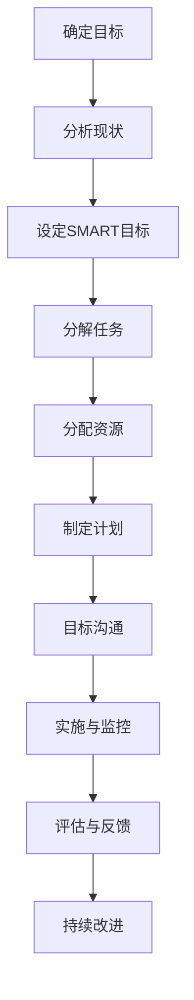
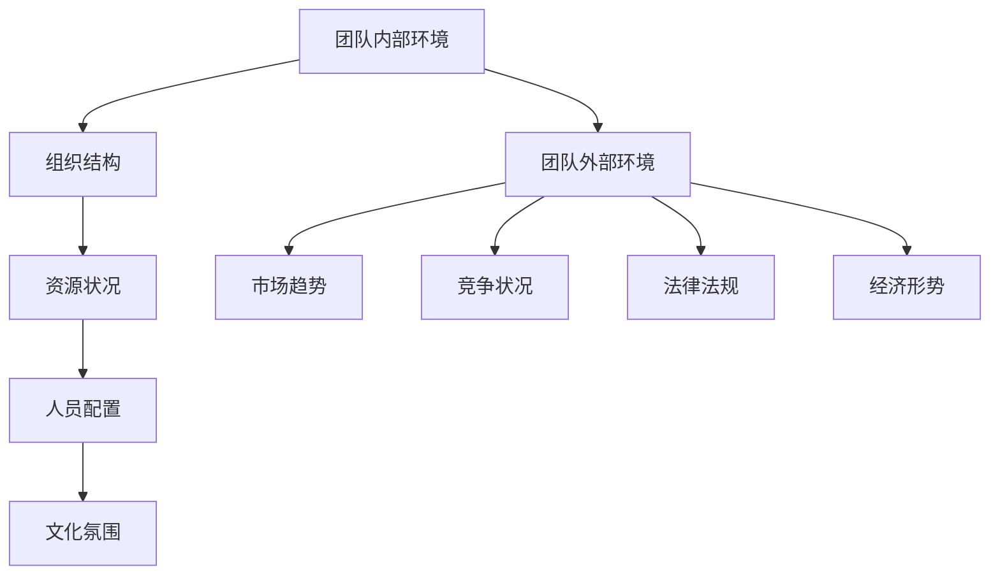
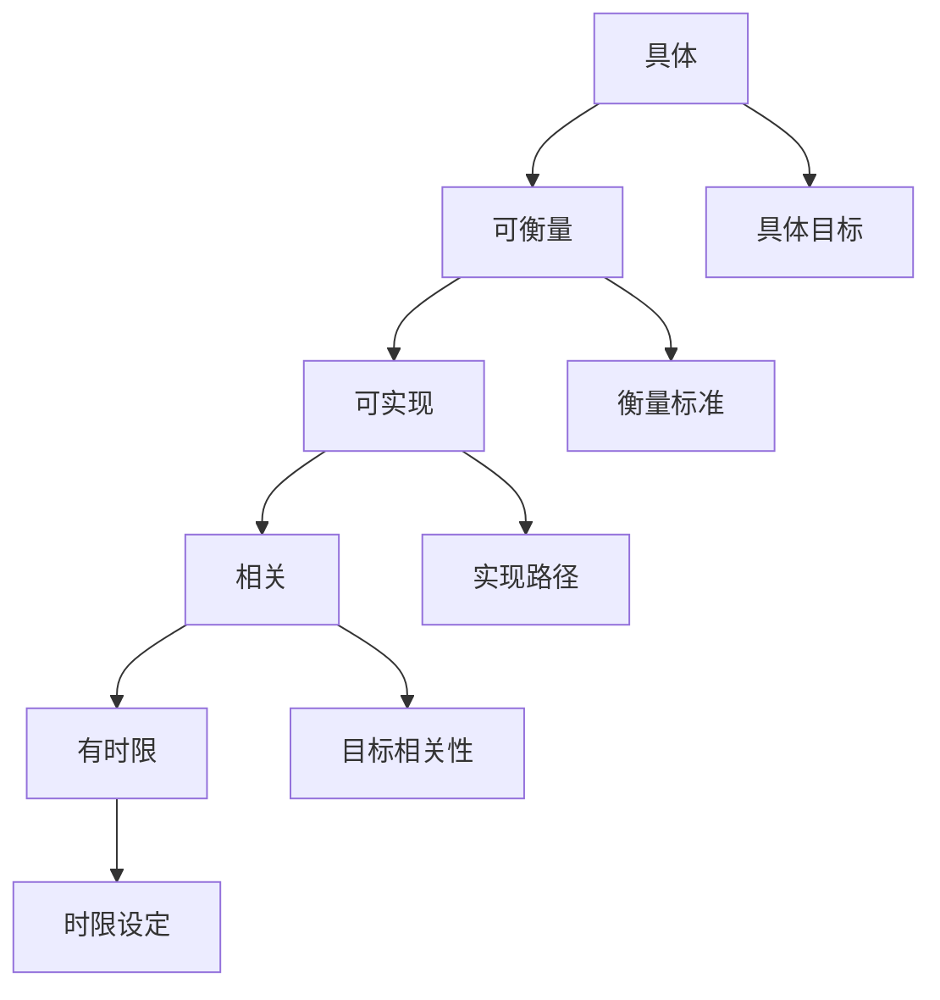
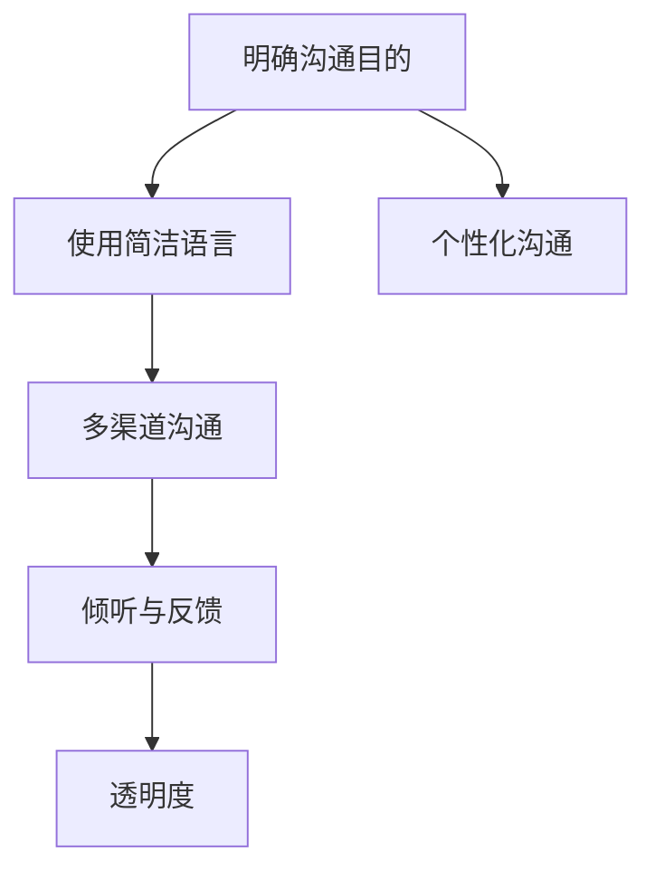
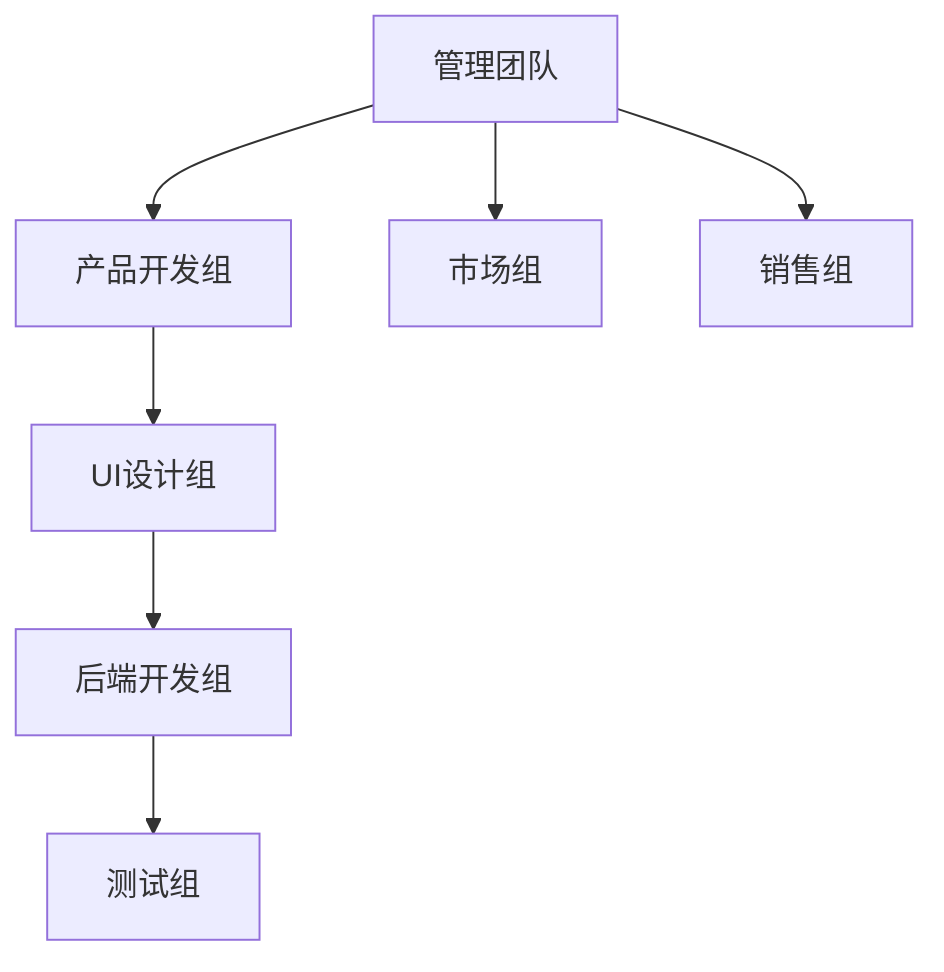
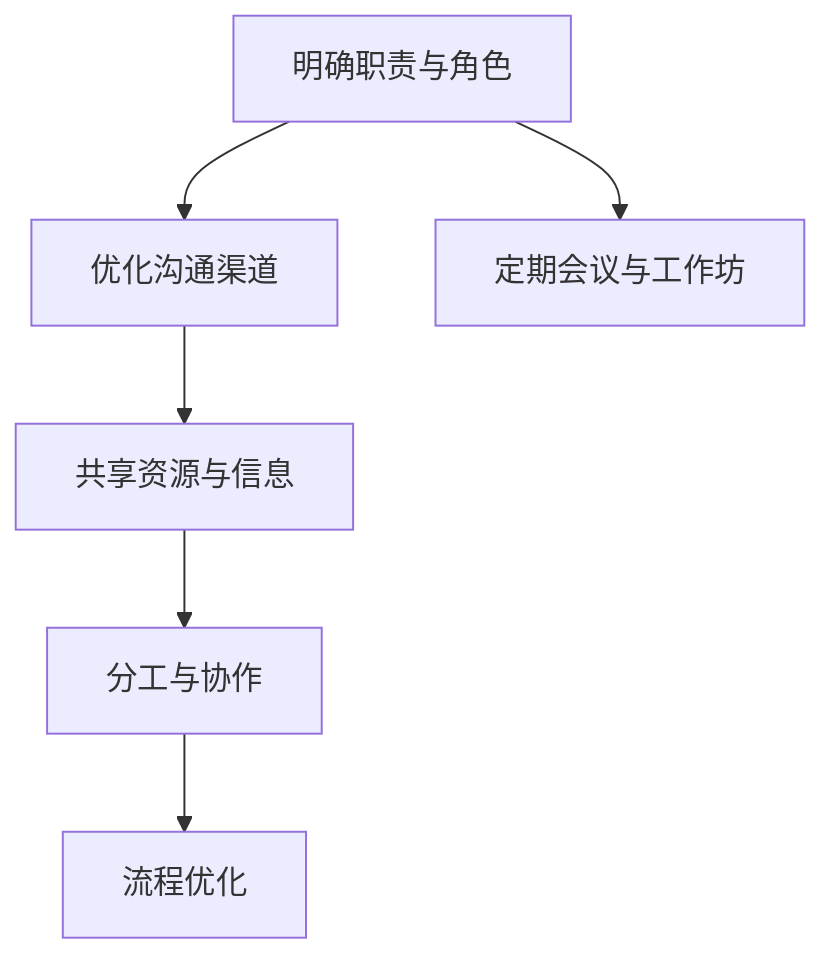
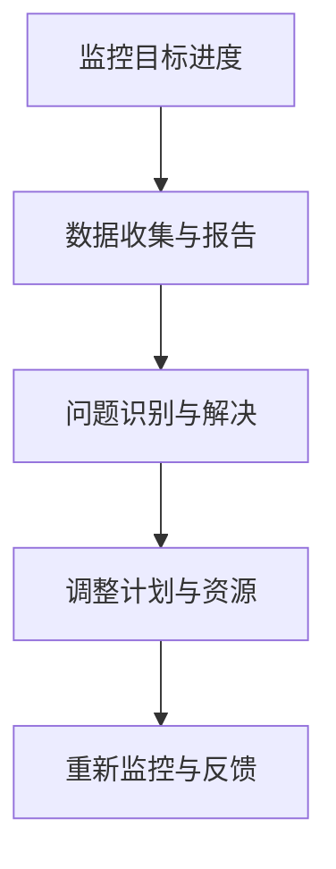

                 


### 引言

在信息技术快速发展的今天，团队在实现项目目标中的作用愈发重要。一个高效的团队不仅能够提升项目成功率，还能够培养成员的协作能力和创新能力，从而为组织的持续发展提供动力。然而，如何制定和实施团队目标，确保团队成员的积极参与和目标达成，仍然是许多团队面临的挑战。本文旨在通过系统的分析和逻辑推理，为IT领域团队的目标制定和实施提供实用的指导。

本文将以《如何制定和实施团队目标》为题，分为三个主要部分：

**第一部分：目标制定基础**，将探讨团队目标的重要性、团队现状的分析以及目标制定的核心原则。

**第二部分：目标实施与跟踪**，将深入讨论团队组织与职责划分、团队协作与激励、目标实施与监控等方面的策略。

**第三部分：案例研究**，将通过实际案例展示团队目标制定和实施的过程，以及可能遇到的挑战和解决策略。

在接下来的内容中，我们将逐步分析每一个章节，并通过伪代码、数学模型和流程图等形式，详细阐述每个环节的关键点。

**关键词**：团队目标、目标制定、目标实施、团队协作、目标跟踪、案例研究

**摘要**：本文系统地介绍了如何制定和实施团队目标的方法。首先，明确了团队目标的重要性及其核心原则。接着，通过分析团队现状，制定切实可行的SMART目标。随后，详细讨论了目标实施与监控的策略，并提供了实际案例进行分析和启示。通过本文的指导，IT领域的团队能够更好地制定和实施目标，提升团队整体效能。

### 第一部分：目标制定基础

#### 第1章：团队目标的重要性

在探讨如何制定和实施团队目标之前，理解团队目标的重要性是至关重要的。团队目标是团队奋斗的方向和指南，是确保团队工作有序进行、资源合理分配、成员共同努力的核心依据。以下是团队目标的重要性及其在团队运作中的具体作用。

**1.1 团队目标的定义与作用**

团队目标是指团队在特定时间内需要达到的具体成果或标准。它通常包括团队在财务、市场、运营等各方面的期望成果，以及团队的使命、愿景和核心价值观。团队目标的作用主要表现在以下几个方面：

1. **明确方向**：团队目标为团队提供了明确的方向，使团队成员了解他们需要做什么，如何做以及为什么这么做。这有助于减少工作中的迷茫和不确定性，提高团队的凝聚力。

2. **资源优化**：通过明确的目标，团队可以更有效地分配资源，确保资源的使用最大化地服务于目标实现。这不仅包括资金和物资，还包括团队成员的时间和精力。

3. **激励成员**：团队目标为团队成员提供了激励和动力，使他们感受到自己的工作对团队和组织的价值。这有助于提升团队成员的工作积极性和忠诚度。

4. **协调工作**：团队目标有助于协调团队成员之间的工作，确保每个人的努力都朝着共同的目标前进。这有助于减少冲突和误解，提升团队协作效率。

**1.2 明确团队目标的好处**

明确团队目标的好处主要体现在以下几个方面：

1. **提高执行力**：明确的目标使团队成员更加专注于实现目标，从而提高执行力。团队成员可以更好地理解任务的优先级，减少浪费时间和资源的无效工作。

2. **增强团队凝聚力**：共同的目标有助于增强团队成员之间的联系和信任，提高团队的凝聚力。团队成员在追求共同目标的过程中，可以建立深厚的合作关系。

3. **优化决策过程**：明确的团队目标可以优化决策过程，使团队成员在面对问题时能够快速做出决策。团队成员可以基于目标来评估各种选择的利弊，从而做出更明智的决策。

4. **提升团队效能**：通过明确的目标，团队可以更好地评估自己的工作成效，及时发现和解决问题，从而提升团队的整体效能。

**1.3 团队目标制定的核心原则**

为了确保团队目标的实现，制定目标时需要遵循以下核心原则：

1. **SMART原则**：SMART是具体（Specific）、可衡量（Measurable）、可实现（Achievable）、相关（Relevant）和有时限（Time-bound）的缩写。SMART原则确保了目标的明确性和可操作性，使团队成员更容易理解和执行。

2. **全员参与**：团队目标的制定应该是一个全员参与的过程。通过征求团队成员的意见和建议，可以提高他们的参与感和责任感，从而增加目标的实现可能性。

3. **动态调整**：团队目标在制定后不是一成不变的，应该根据实际情况进行动态调整。这有助于团队应对外部环境的变化，确保目标的持续相关性。

4. **明确责任**：每个团队目标都应明确具体的责任人。这有助于确保目标的实施和监控，提高责任落实的效率。

5. **持续沟通**：团队目标制定后，需要通过持续沟通来确保团队成员对目标的理解一致，并随时调整目标实施策略。

通过上述分析，我们可以看到，团队目标在团队运作中具有极其重要的作用。它不仅为团队提供了明确的方向和动力，还有助于提升团队的整体效能。在接下来的章节中，我们将深入探讨如何分析团队现状，制定切实可行的团队目标。

### 第2章：了解团队现状

制定有效的团队目标，首先需要深入了解团队当前的状态。这包括分析团队的外部环境和内部条件，识别团队的优势和劣势，并明确团队目标与现状之间的差距。通过这一步骤，团队可以更科学地设定目标，并制定出切实可行的实施方案。

**2.1 分析团队内外部环境**

团队的外部环境是指团队所处的外部条件，包括市场趋势、竞争状况、法律法规、经济形势等。内部环境则是指团队内部的组织结构、资源状况、人员配置、文化氛围等。分析团队内外部环境的目的在于识别那些可能影响团队目标实现的因素。

**外部环境分析**：

1. **市场趋势**：了解当前市场的发展趋势，包括新兴技术的出现、消费者需求的变化等，可以帮助团队制定符合市场发展方向的目标。

2. **竞争状况**：分析竞争对手的优劣势、市场占有率、产品特点等，有助于团队找到自身的定位和差异化优势。

3. **法律法规**：遵守相关法律法规，确保团队目标的合法性和合规性，是团队运营的基本要求。

4. **经济形势**：经济环境对团队目标的实现有着重要影响。了解宏观经济形势，可以更好地制定财务预算和成本控制策略。

**内部环境分析**：

1. **组织结构**：分析团队的层级结构、部门设置、职责分工等，确保组织结构合理，能够高效支撑团队目标的实现。

2. **资源状况**：评估团队的人力、资金、技术、信息等资源，确保资源能够满足目标实现的需要。

3. **人员配置**：了解团队成员的专业背景、技能水平、工作经验等，确保人员配置合理，能够发挥团队成员的潜力。

4. **文化氛围**：团队的文化氛围直接影响成员的工作态度和行为。通过分析团队文化，可以识别哪些方面有助于目标的实现，哪些方面需要改进。

**2.2 确定团队优势与劣势**

在分析团队内外部环境后，团队需要明确自身的优势与劣势。这有助于团队在制定目标时，充分利用优势，克服劣势。

**团队优势**：

1. **技术实力**：团队在某一技术领域具备较强的实力和经验，可以成为实现目标的重要支撑。

2. **创新能力**：团队在研发和创新方面表现出色，可以推动目标的快速实现。

3. **资源整合能力**：团队具备较强的资源整合能力，能够快速调配资源，应对目标实现中的各种挑战。

4. **执行力**：团队成员具有较强的执行力，能够在规定的时间内完成任务。

**团队劣势**：

1. **技术短板**：在某些技术领域，团队可能存在明显的短板，需要外部支持或内部培训来解决。

2. **人才短缺**：团队在关键岗位上可能缺乏合适的员工，影响目标的实现。

3. **管理不足**：团队在项目管理、资源配置等方面可能存在不足，需要改进管理方法。

4. **沟通不畅**：团队成员之间沟通不畅，可能导致误解和冲突，影响团队的协作效率。

**2.3 识别团队目标与现状的差距**

在明确团队的优势与劣势后，团队需要识别当前目标与现状之间的差距。这一步骤有助于团队制定出更加实际和可行的目标。

1. **差距识别**：

   - **资源差距**：分析实现目标所需的资源与实际资源之间的差距，确保资源的充分性。

   - **能力差距**：识别团队在实现目标过程中所需的能力与现有能力之间的差距，通过培训或外部支持来弥补。

   - **时间差距**：评估目标实现的时间要求与团队现有进度之间的差距，合理调整计划，确保目标按时完成。

   - **成本差距**：分析实现目标所需的成本与预算之间的差距，确保财务预算的合理性。

2. **差距分析**：

   - **资源分析**：通过优化资源配置、提高资源利用率等方式，缩小资源差距。

   - **能力提升**：通过内部培训、外部招聘、技术引进等方式，提高团队能力。

   - **时间调整**：通过调整任务优先级、优化工作流程等方式，确保目标的按时完成。

   - **成本控制**：通过成本预算管理、节约成本等措施，确保目标在预算范围内实现。

通过上述步骤，团队可以更全面地了解自身的现状，识别目标实现中的挑战，从而为后续的目标制定和实施奠定坚实的基础。

#### 3. 制定团队目标

在了解团队现状的基础上，制定明确的团队目标对于确保团队工作有序进行和目标的实现至关重要。这一节将介绍如何设定SMART目标，讨论团队目标制定的方法，并详细说明编制团队目标计划的过程。

**3.1 设定SMART目标**

SMART目标是具体（Specific）、可衡量（Measurable）、可实现（Achievable）、相关（Relevant）和有时限（Time-bound）的目标设定方法。这种方法确保目标既具有可操作性，又能够清晰地传达出期望的成果。以下是SMART目标的五个要素：

1. **具体（Specific）**：目标应当明确具体，描述出期望达到的具体成果和标准。例如，而不是“提高销售额”，可以设定为“在下一个季度内，将销售额提升到100万元”。

2. **可衡量（Measurable）**：目标应当具有明确的衡量标准，以便团队可以评估目标的实现程度。例如，可以使用销售额、客户满意度、项目进度等量化指标。

3. **可实现（Achievable）**：目标应当是可实现的，确保团队成员在现有资源和条件下能够完成。如果目标过于理想化或不切实际，可能会降低团队的信心和动力。

4. **相关（Relevant）**：目标应当与团队的整体目标和战略一致，确保每一个目标都对实现团队的整体目标有贡献。例如，如果团队的战略是扩大市场份额，那么目标可以是“在下一季度内，增加5个新客户”。

5. **有时限（Time-bound）**：目标应当设定一个明确的时限，以便团队可以按计划推进工作。时限有助于提高团队成员的紧迫感和执行力。例如，可以将时限设定为“在2023年12月31日前完成”。

**3.2 团队目标制定的方法**

制定团队目标需要采用系统的方法，以下是一些常用的方法：

1. **头脑风暴法**：通过集体讨论，收集团队成员的建议和意见，形成初步的目标清单。这种方法有助于激发团队的创造力和合作精神。

2. **SWOT分析法**：通过分析团队的优势（Strengths）、劣势（Weaknesses）、机会（Opportunities）和威胁（Threats），确定团队的目标和策略。SWOT分析可以帮助团队在复杂的环境中找到合适的定位。

3. **目标树法**：将团队的目标分解成具体的子目标和行动项，形成目标树。这种方法有助于团队清晰地了解每个目标之间的关系和实现路径。

4. **关键绩效指标法（KPI）**：根据团队的目标，确定关键绩效指标，这些指标将用于衡量团队的表现和目标的实现程度。

**3.3 编制团队目标计划**

在确定目标后，团队需要编制一个详细的目标计划，以确保目标的实现。以下是一个典型的目标计划编制过程：

1. **目标分解**：将整体目标分解为具体的子目标和行动项。例如，如果整体目标是“提升销售额”，可以分解为“增加客户数量”和“提高客户满意度”等子目标。

2. **任务分配**：根据团队成员的技能和职责，将子目标和行动项分配给相应的责任人。确保每个责任人都明确自己的任务和职责。

3. **时间安排**：为每个任务设定具体的时间节点，确保任务能够按时完成。可以使用甘特图等工具来可视化时间安排。

4. **资源分配**：确保每个任务所需的资源得到合理分配，包括人力、资金、物资等。

5. **风险评估**：评估每个任务可能遇到的风险，并制定相应的应对策略。这有助于提前预防和解决潜在问题。

6. **监控与反馈**：建立监控机制，定期检查任务进度和目标实现情况。通过反馈机制，及时调整计划，确保目标的实现。

7. **文档记录**：将目标计划和相关文档记录下来，以便团队成员随时查阅和更新。这有助于保持计划的连续性和透明度。

通过上述步骤，团队可以制定出详细、可行且具有操作性的目标计划，确保目标的实现。在接下来的章节中，我们将进一步探讨如何进行有效的目标沟通和共识达成。

### 第4章：目标沟通与共识

目标沟通与共识的达成是团队目标实现的关键环节。一个有效的沟通策略和共识达成过程，能够确保团队成员对目标的深刻理解，并激发他们的积极参与和共同努力。以下是关于目标沟通的重要性、沟通目标的技巧以及如何达成团队共识的详细探讨。

**4.1 沟通团队目标的重要性**

沟通是团队协作的基石，尤其在目标设定和实施过程中，其重要性更加凸显。有效的目标沟通可以带来以下几个方面的好处：

1. **确保理解一致**：通过明确的沟通，团队成员能够全面理解团队目标的含义和实现路径，从而减少误解和冲突。

2. **提高参与度**：团队成员在目标沟通过程中，能够更深入地了解自己的职责和贡献，从而增强参与感和责任感。

3. **增强凝聚力**：共同的目标和愿景可以加强团队成员之间的联系，提升团队的整体凝聚力。

4. **优化决策**：通过沟通，团队成员可以共同探讨和解决目标实现过程中遇到的挑战，优化决策过程，提高决策质量。

5. **提高执行力**：有效的沟通有助于确保团队成员对目标的清晰认知，从而提高执行力和工作效率。

**4.2 沟通目标的技巧**

为了实现有效的目标沟通，团队需要掌握一系列沟通技巧。以下是一些常用的技巧：

1. **明确沟通目的**：在每次沟通之前，明确沟通的目的和预期成果，确保沟通有针对性地进行。

2. **使用简洁明了的语言**：避免使用过于专业或复杂的术语，使用简洁明了的语言，确保所有成员都能理解。

3. **多渠道沟通**：结合不同的沟通渠道，如会议、邮件、即时通讯工具等，确保信息传递的及时性和全面性。

4. **倾听与反馈**：鼓励团队成员表达意见和反馈，倾听他们的声音，确保每个观点都得到充分的考虑。

5. **透明度**：保持沟通的透明度，确保团队成员能够了解目标的进展和挑战，从而更好地支持团队的工作。

6. **个性化沟通**：根据不同成员的特点和沟通偏好，采取个性化的沟通方式，提高沟通的效果。

**4.3 如何达成团队共识**

达成团队共识是确保目标顺利实施的关键。以下是一些达成共识的方法：

1. **共同制定目标**：鼓励团队成员参与目标的制定过程，通过讨论和协商，共同制定出符合团队共识的目标。

2. **定期会议**：定期召开团队会议，讨论目标的进展和遇到的挑战，确保团队成员对目标的共识和理解。

3. **共识文件**：制定共识文件，记录团队的共识和决策，确保所有成员对目标和决策有共同的理解。

4. **反馈机制**：建立反馈机制，鼓励团队成员提出意见和建议，通过持续的反馈和调整，达成更广泛的共识。

5. **团队建设活动**：通过团队建设活动，增强团队成员之间的信任和合作，促进共识的达成。

通过上述沟通技巧和方法，团队可以确保目标得到有效的沟通和共识达成，从而为目标的实现奠定坚实的基础。在接下来的章节中，我们将进一步探讨如何通过组织结构和职责划分，提升团队的执行力和协作效率。

### 第二部分：目标实施与跟踪

#### 第5章：团队组织与职责划分

在团队目标明确后，如何将目标具体化并落实到每个团队成员的工作中，是团队成功实施目标的关键。这需要通过合理的团队组织设计和职责划分来实现。本章将详细讨论团队组织结构的设计、职责的划分以及责任与权限的匹配。

**5.1 确定团队组织结构**

团队组织结构是指团队成员之间关系的框架，它决定了信息的流动、决策的层次以及工作任务的分配。设计一个合理的团队组织结构，可以有效地提高团队的工作效率和目标的实现率。以下是设计团队组织结构时需要考虑的几个关键因素：

1. **职能结构**：根据团队工作的需要，将团队成员按照职能进行划分，如开发团队、测试团队、产品管理团队等。这种结构有助于专业化和分工合作。

2. **项目结构**：在项目管理中，团队可以根据项目的特点，采用项目团队的形式。项目团队通常由跨职能人员组成，负责从项目启动到完成的整个周期。

3. **矩阵结构**：矩阵结构结合了职能结构和项目结构的优点，团队成员同时属于一个职能团队和一个项目团队，这种结构在资源紧张和任务交叉时尤为有效。

4. **网络结构**：网络结构是一种基于信任和协作的组织形式，团队成员之间没有明确的层级关系，而是通过网络进行协作。这种结构在创新和快速响应市场变化时表现优异。

**5.2 划分团队职责**

明确团队职责是确保目标有效实施的基础。划分职责时需要考虑以下几个方面：

1. **任务分配**：根据团队成员的技能和专长，将任务分配给最适合执行的人员。确保每个任务都有明确的责任人，避免任务重叠和责任不清。

2. **角色定义**：为每个角色设定明确的职责和权限，确保团队成员了解自己的工作内容和期望成果。例如，项目经理负责项目规划和协调，开发人员负责编码和测试。

3. **协作机制**：建立协作机制，确保团队成员之间能够顺畅地沟通和协作。例如，通过定期会议、工作坊等方式，促进团队成员之间的交流和合作。

**5.3 责任与权限的匹配**

为了确保团队目标的顺利实施，责任与权限的匹配至关重要。以下是几个关键点：

1. **授权**：为团队成员提供适当的权限，使其能够在职责范围内做出决策和采取行动。授权不仅能够提高团队的工作效率，还能增强成员的自主性和责任感。

2. **问责**：明确责任人的问责机制，确保每个团队成员对其职责范围内的任务负责。问责机制可以通过定期的绩效评估、目标检查等方式实施。

3. **沟通**：建立有效的沟通渠道，确保团队成员能够及时了解目标实施的情况，从而调整工作计划和策略。沟通不仅包括上级对下级的指导，还包括团队成员之间的协作和反馈。

4. **激励机制**：通过激励机制，鼓励团队成员为实现目标而努力。激励机制可以包括物质奖励、精神鼓励、职业发展机会等。

通过合理的团队组织结构和职责划分，以及责任与权限的匹配，团队可以确保目标得到有效实施。在接下来的章节中，我们将探讨如何通过团队协作和激励，提升团队的执行力和创新能力。

### 第6章：团队协作与激励

在目标实施过程中，团队协作和激励是确保目标达成的重要手段。有效的团队协作能够提升工作效率和解决问题的能力，而合理的激励机制则能够激发团队成员的积极性和创造力。本章将深入探讨如何提升团队协作效率和激励团队成员的动力，以及如何建立积极向上的团队文化。

**6.1 提升团队协作效率**

提升团队协作效率是团队目标实现的关键。以下是一些实用的策略：

1. **明确角色与职责**：确保每个团队成员都清楚自己的角色和职责，避免工作重叠和职责不清。通过明确的职责划分，可以减少团队内部的冲突和误解，提高工作效率。

2. **优化沟通渠道**：建立畅通的沟通渠道，确保团队成员能够及时、有效地交流信息。这包括定期召开团队会议、使用即时通讯工具、建立在线协作平台等。有效的沟通能够减少信息滞后和误传，提高团队协作的效率。

3. **共享资源与信息**：鼓励团队成员共享资源和信息，建立共享的知识库和文档管理系统。这有助于团队成员快速获取所需的信息和资源，提高工作的效率和准确性。

4. **分工与协作**：在任务分配时，充分考虑团队成员的技能和专长，将任务分配给最合适的人选。同时，鼓励团队成员在协作过程中互相支持，共同解决问题。通过合理的分工与协作，可以提高团队的整体效能。

5. **流程优化**：定期审视和优化工作流程，消除不必要的手动操作和冗余步骤。通过流程优化，可以减少浪费，提高工作效率。

**6.2 激励团队成员的动力**

团队成员的积极性和动力是团队目标实现的重要保障。以下是一些有效的激励策略：

1. **目标导向**：设定具有挑战性但可实现的目标，激发团队成员的内在动力。通过设定清晰的目标，可以让团队成员明确自己的努力方向，提高工作积极性。

2. **认可与奖励**：对团队成员的成就和努力给予认可和奖励。这可以通过表扬、奖金、晋升机会等方式实现。认可和奖励不仅能够激励团队成员，还能增强团队凝聚力。

3. **培训与发展**：为团队成员提供培训和发展机会，帮助他们提升技能和职业素养。通过培训和发展，可以提高团队成员的职业竞争力，增强他们的工作动力。

4. **参与决策**：让团队成员参与到团队决策过程中，让他们感受到自己的意见和贡献被重视。通过参与决策，可以提高团队成员的归属感和责任感，从而增强他们的工作动力。

5. **工作与生活平衡**：关注团队成员的工作与生活平衡，提供灵活的工作时间和远程工作机会。通过关注团队成员的生活，可以减轻他们的工作压力，提高工作效率和满意度。

**6.3 建立团队文化**

团队文化是团队的核心价值观和行为准则，对团队成员的行为和团队效能有着深远的影响。以下是一些建立积极团队文化的策略：

1. **明确价值观**：明确团队的核心价值观，并将其融入团队的工作和生活中。例如，诚信、创新、团队合作等价值观可以通过团队口号、团队活动等方式传播。

2. **倡导合作精神**：鼓励团队成员之间相互支持、相互学习，建立积极的团队氛围。通过团队合作，可以提高团队的整体效能，实现共同的目标。

3. **建立信任**：通过开放、透明的沟通和合作，建立团队成员之间的信任。信任是团队合作的基石，可以减少冲突和误解，提高团队的凝聚力。

4. **鼓励创新**：鼓励团队成员勇于创新，提出新的想法和解决方案。创新是团队持续发展的动力，可以帮助团队在竞争激烈的市场中脱颖而出。

5. **重视反馈**：建立反馈机制，鼓励团队成员提出意见和建议。通过积极的反馈，可以不断改进团队的工作方式，提高团队的效能。

通过提升团队协作效率、激励团队成员的动力以及建立积极向上的团队文化，团队可以更好地实现目标。在接下来的章节中，我们将进一步探讨如何通过目标实施与监控，确保目标的顺利实现。

### 第7章：目标实施与监控

在明确了团队目标并制定了详细的实施计划后，目标实施与监控是确保目标顺利实现的关键环节。有效的目标实施与监控能够及时发现并解决问题，调整实施策略，确保团队目标的达成。本章将详细讨论目标实施的关键环节、监控目标进度的方法以及及时调整与优化的策略。

**7.1 目标实施的关键环节**

1. **任务分解**：将整体目标分解为具体的子任务，并为每个子任务分配明确的责任人和时间节点。通过任务分解，可以确保目标的具体化和可操作性。

2. **资源调配**：根据任务需求和优先级，合理调配人力、资金、物资等资源，确保任务的顺利进行。资源调配需要考虑资源可用性和任务紧急程度，以最大化资源利用率。

3. **团队协作**：建立有效的团队协作机制，确保团队成员之间能够顺畅地沟通和协作。通过定期召开会议、使用协作工具等方式，促进团队成员之间的信息共享和工作协调。

4. **风险评估**：在目标实施过程中，对可能遇到的风险进行识别和评估，制定相应的应对策略。通过风险评估，可以提前预防和应对可能的问题，减少目标实现的障碍。

5. **执行监控**：对任务的执行情况进行实时监控，确保任务按照计划进行。执行监控可以通过设立监控指标、定期汇报进度等方式进行，及时发现和解决问题。

**7.2 监控目标进度的方法**

1. **进度报告**：定期收集和汇总任务进度报告，了解每个子任务的实际完成情况。进度报告可以包括任务完成情况、存在的问题和需要协调的事项等。

2. **数据可视化**：使用图表、仪表盘等工具，将任务进度数据可视化，便于团队成员直观地了解目标进展。数据可视化可以帮助团队快速识别进度偏差，及时采取调整措施。

3. **关键绩效指标（KPI）**：根据团队目标，设定关键绩效指标（KPI），用于衡量任务的完成情况。KPI可以包括任务完成率、资源利用率、问题解决率等指标。

4. **定期会议**：定期召开团队会议，讨论任务进展和存在的问题。通过会议，团队成员可以交流信息、分享经验，共同探讨解决方案。

5. **反馈机制**：建立反馈机制，鼓励团队成员提出意见和建议，及时发现和解决问题。反馈机制可以通过匿名调查、在线论坛等方式实现。

**7.3 及时调整与优化**

1. **进度调整**：根据监控结果，对任务进度进行调整。如果发现任务进度滞后，需要重新分配资源或调整任务优先级，以确保目标按时完成。

2. **策略优化**：在目标实施过程中，如果遇到重大问题或外部环境发生变化，需要及时调整实施策略。策略优化可以通过重新评估目标、调整任务分配、改进协作流程等方式实现。

3. **风险应对**：针对识别出的风险，制定相应的应对策略。在风险发生时，及时采取应对措施，减轻风险对目标实现的影响。

4. **经验总结**：在目标实施结束后，进行经验总结，分析目标实现过程中存在的问题和成功经验。通过经验总结，可以为未来的目标制定和实施提供借鉴和改进的方向。

通过有效的目标实施与监控，团队可以确保目标的顺利实现，及时发现并解决问题，优化实施策略。在接下来的章节中，我们将通过实际案例，展示如何进行目标评估和反馈，以及如何通过持续改进提升目标制定的效率。

### 第8章：目标评估与反馈

目标评估与反馈是确保团队目标有效实施和持续改进的重要环节。通过系统的评估和有效的反馈机制，团队可以及时发现目标实现中的问题和不足，从而优化目标的制定和实施过程。本章将详细讨论目标完成度的评估方法、反馈机制的重要性以及如何通过反馈提升目标制定的效率。

**8.1 目标完成度的评估**

1. **关键绩效指标（KPI）**：评估目标完成度常用的方法是设定关键绩效指标（KPI），这些指标可以量化地衡量目标的实现程度。例如，如果目标是增加市场份额，KPI可以包括市场份额增长率、新客户数量等。

2. **定性评估**：除了定量的KPI，定性评估也非常重要。通过问卷调查、员工访谈等方式，可以收集团队成员对目标完成度的主观评价，了解目标实现中的具体表现和存在的问题。

3. **对照基准**：将实际完成情况与设定目标进行对比，分析目标达成的情况。如果实际完成情况优于预期，可以总结成功经验；如果未达到预期，需要深入分析原因。

4. **数据分析**：通过数据分析工具，对目标实现过程中的关键数据进行分析，识别问题和瓶颈。数据分析可以帮助团队从数据角度理解目标实现的成效。

**8.2 反馈机制的重要性**

1. **问题发现**：反馈机制是发现目标实现过程中问题的有效途径。通过反馈，团队成员可以分享遇到的问题和挑战，从而及时识别并解决潜在问题。

2. **持续改进**：反馈机制有助于团队在目标实施过程中不断进行改进。通过定期收集反馈，团队可以识别出需要改进的方面，并采取相应的措施。

3. **提高执行力**：有效的反馈机制可以增强团队成员的执行力和责任感。团队成员在知道自己的表现会被评估和反馈时，会更加努力地完成任务。

4. **团队协作**：反馈机制可以促进团队协作，通过共享反馈信息，团队成员可以相互学习和借鉴，提高整体工作效能。

**8.3 提升目标制定的效率**

1. **基于数据的决策**：通过数据分析，团队可以更加科学地制定目标。数据分析可以帮助团队了解当前市场趋势、竞争状况和内部资源情况，从而设定更加合理和可实现的的目标。

2. **流程优化**：通过反馈机制，团队可以发现目标实施过程中的流程瓶颈，从而优化工作流程。优化后的流程可以减少不必要的工作步骤，提高工作效率。

3. **跨部门协作**：目标制定和实施是一个跨部门的过程，通过建立跨部门协作机制，可以确保目标制定的全面性和可操作性。跨部门协作可以充分利用各部门的专业知识和资源，提高目标实现的效率。

4. **持续学习与培训**：通过定期的反馈和评估，团队可以发现成员的技能短板，从而提供相应的培训和学习机会。持续学习和培训可以提高团队成员的专业能力和工作效率。

通过有效的目标评估和反馈机制，团队可以持续优化目标的制定和实施过程，提高目标达成的效率和效果。在下一章中，我们将通过具体案例研究，进一步展示如何制定和实施团队目标，以及可能遇到的挑战和解决策略。

### 第9章：成功案例分析与启示

在探讨如何制定和实施团队目标时，通过分析成功的案例可以提供宝贵的经验和启示。本章将介绍三个实际案例，展示团队如何通过明确的目标制定和实施，实现预期目标并取得成功。同时，我们将总结这些案例中的关键成功因素，为其他团队提供参考。

#### 9.1 案例一：目标制定与实施

**案例背景**：一家科技公司决定开发一款全新的智能家居应用，目标是提高用户的生活质量和使用便捷性。公司管理层意识到，为了实现这一目标，需要团队的紧密协作和明确的规划。

**目标设定**：团队首先制定了以下SMART目标：
- **具体（Specific）**：开发一款能够控制家居设备的智能手机应用。
- **可衡量（Measurable）**：应用发布后，用户下载量需达到10万次。
- **可实现（Achievable）**：通过现有的开发资源和市场调研，认为该目标可以实现。
- **相关（Relevant）**：智能家居应用与公司的长期战略目标相符。
- **有时限（Time-bound）**：项目周期为6个月。

**实施过程**：
1. **任务分解**：将项目分为多个子任务，如需求分析、UI设计、功能开发、测试等。
2. **资源调配**：根据任务需求，分配了合适的开发人员和测试人员，并确保他们具备相关的技能和经验。
3. **协作机制**：使用敏捷开发方法，每周召开一次团队会议，讨论项目进度和遇到的挑战。
4. **风险管理**：识别潜在的风险，如技术难题、市场需求变化等，并制定了应对策略。

**项目成果**：项目在预定时间内完成，智能家居应用在市场上获得了良好的反响，用户下载量超过15万次，实现了公司设定的目标。

**成功因素**：
- **明确的目标设定**：SMART目标确保了项目方向的明确性，使团队成员能够集中精力实现目标。
- **有效的资源调配**：合理分配资源，确保每个任务都有足够的人力和技术支持。
- **协作与沟通**：通过定期的会议和敏捷开发方法，确保团队成员之间的沟通和协作，提高工作效率。

#### 9.2 案例二：目标调整与优化

**案例背景**：一家电商公司在第一次促销活动后，虽然达到了销售目标，但用户反馈中提到购物流程不够顺畅，用户满意度不高。

**目标调整**：
1. **初始目标**：提高促销活动的销售额，目标为增加20%的销售额。
2. **问题识别**：通过用户反馈和数据分析，识别出购物流程中存在的问题，如支付页面加载慢、购物车功能不稳定等。
3. **调整目标**：将目标调整为提高用户满意度，并在促销期间解决购物流程中的关键问题，目标为将用户满意度提升到90%。

**实施过程**：
1. **问题修复**：团队加班加点，优化了支付页面的加载速度和购物车的稳定性。
2. **用户体验改进**：增加了购物车中的实时更新功能，提高了用户购物体验。
3. **反馈收集**：在促销活动结束后，通过用户调查和数据分析，评估用户体验的改善程度。

**项目成果**：通过目标调整和优化，用户满意度显著提升，达到了90%，同时销售额也实现了稳定增长。

**成功因素**：
- **及时反馈与调整**：通过用户反馈和数据监测，及时识别并解决存在的问题，使目标调整更加科学和有效。
- **用户体验优先**：将用户满意度作为首要目标，确保用户在购物过程中获得良好的体验。
- **持续优化**：在目标实现后，团队没有停止改进，而是继续优化用户体验，保持竞争优势。

#### 9.3 案例三：团队目标的持续改进

**案例背景**：一家互联网公司在其产品上线后，面临着激烈的市场竞争和用户需求的变化。

**目标设定**：团队设定了以下年度目标：
- **市场份额**：保持现有的市场份额。
- **用户增长**：每月新增用户数量达到5万。
- **产品优化**：每季度进行一次产品功能优化。

**实施过程**：
1. **市场分析**：定期分析市场趋势和竞争对手的表现，了解用户需求的变化。
2. **用户反馈**：通过用户调研和反馈，收集用户对产品的意见和建议。
3. **目标调整**：根据市场分析和用户反馈，每季度对目标进行调整，确保目标的持续相关性和可实现性。

**项目成果**：通过持续改进，公司在保持市场份额的同时，每月新增用户数量超过6万，产品功能不断优化，用户满意度持续提升。

**成功因素**：
- **持续市场监测**：通过定期监测市场趋势和用户需求，及时调整目标，确保目标与市场保持同步。
- **用户导向**：将用户需求和满意度作为制定和调整目标的重要依据，确保产品能够满足用户需求。
- **持续改进**：不断优化产品和服务，保持竞争优势，实现团队的长期发展。

通过以上成功案例的分析，我们可以看到，制定和实施有效的团队目标，需要明确的目标设定、科学的资源调配、良好的团队协作和及时的反馈调整。这些关键成功因素为其他团队提供了宝贵的经验和启示，帮助他们实现团队目标并取得成功。

### 第10章：常见问题与解决策略

在制定和实施团队目标的过程中，团队可能会遇到各种问题和挑战。了解这些问题，并采取有效的解决策略，对于确保目标的顺利实现至关重要。以下是一些常见问题及其解决策略：

**10.1 团队成员不合作**

**问题原因**：团队成员不合作可能源于多种原因，如沟通不畅、角色模糊、缺乏信任、目标不一致等。

**解决策略**：
- **加强沟通**：建立定期的沟通机制，确保团队成员之间的信息共享和反馈。
- **明确角色与责任**：明确每个团队成员的角色和责任，避免工作重叠和责任不清。
- **建立信任**：通过团队合作活动和信任建设活动，增强团队成员之间的信任。
- **共同制定目标**：让团队成员参与目标制定过程，提高他们的责任感和合作意愿。

**10.2 目标设定过于理想化**

**问题原因**：目标设定过于理想化可能是由于缺乏对现实情况的了解，或者对资源、时间限制的忽视。

**解决策略**：
- **现实评估**：在设定目标前，进行全面的现实评估，了解团队的资源、技能和外部环境。
- **合理期望**：设定符合实际情况的目标，避免过于理想化的期望。
- **分阶段实现**：将大目标分解为小目标，分阶段实现，逐步推进。

**10.3 目标跟踪与监控不足**

**问题原因**：目标跟踪与监控不足可能是由于缺乏有效的监控工具、流程不完善或者团队成员不重视。

**解决策略**：
- **建立监控机制**：制定详细的目标监控计划，使用合适的工具进行监控。
- **定期检查**：定期检查目标进度，及时发现和解决问题。
- **透明度**：确保目标进度对团队成员透明，提高他们的参与感和责任感。

**10.4 缺乏有效的激励机制**

**问题原因**：缺乏有效的激励机制可能导致团队成员缺乏动力和积极性。

**解决策略**：
- **奖励机制**：建立明确的奖励机制，对达成目标的团队成员给予奖励。
- **职业发展**：提供职业发展和培训机会，提高团队成员的职业素养和技能水平。
- **认可与反馈**：通过定期的认可和反馈，激励团队成员的努力和贡献。

**10.5 领导支持不足**

**问题原因**：如果领导对团队目标的支持不足，可能导致团队在目标实施过程中遇到阻碍。

**解决策略**：
- **明确领导责任**：确保领导明确团队目标的重要性，并支持团队的工作。
- **提供资源**：确保团队在实现目标过程中，获得所需的人力和资源。
- **沟通与协调**：领导应积极与团队成员沟通，协调团队内外部的资源，确保目标的顺利实施。

通过上述策略，团队可以更好地应对制定和实施目标过程中遇到的各种问题，确保目标的顺利实现。在接下来的章节中，我们将提供一系列实用的实践指南和工具方法，帮助团队更高效地制定和实施目标。

### 第11章：实践指南与工具方法

在制定和实施团队目标的过程中，运用一些实用的实践指南和工具方法，可以大大提升效率和效果。以下是一些具体的方法和工具，以及如何在团队目标管理中应用这些方法。

**11.1 实践指南**

1. **目标制定指南**：
   - **确定目标**：使用SMART原则，确保目标具体、可衡量、可实现、相关并有时限。
   - **全员参与**：鼓励团队成员参与目标的制定，提高他们的参与感和责任感。
   - **定期审查**：定期审查目标，确保它们仍然符合团队和组织的战略方向。

2. **目标实施指南**：
   - **任务分解**：将大目标分解为具体的子任务，明确每个任务的执行人和完成时间。
   - **资源分配**：合理调配团队资源和人力，确保每个任务都有足够的支持。
   - **监控进度**：建立监控机制，定期检查任务进度，及时调整计划和资源。

3. **目标评估指南**：
   - **数据收集**：收集关键绩效指标（KPI）数据，用于评估目标实现程度。
   - **定量与定性分析**：结合定量数据和定性评估，全面了解目标实现情况。
   - **反馈与改进**：根据评估结果，提供反馈，进行目标调整和优化。

**11.2 制定目标的方法**

1. **SWOT分析法**：
   - **优势（Strengths）**：识别团队的优势，利用它们为实现目标提供支持。
   - **劣势（Weaknesses）**：识别团队的劣势，制定策略来克服或减少它们的影响。
   - **机会（Opportunities）**：识别外部环境中的机会，利用它们来推动目标实现。
   - **威胁（Threats）**：识别外部环境中的威胁，制定策略来应对和减轻它们的影响。

2. **SMART目标法**：
   - **具体（Specific）**：明确目标的具体内容和期望成果。
   - **可衡量（Measurable）**：设定可量化的衡量标准，便于评估目标的实现程度。
   - **可实现（Achievable）**：确保目标在现有资源和条件下可以实现。
   - **相关（Relevant）**：确保目标与团队和组织的整体目标一致。
   - **有时限（Time-bound）**：设定明确的实现时限，提高执行力和紧迫感。

**11.3 实施目标的管理工具**

1. **项目管理软件**：
   - **Trello**：通过卡片和列表，直观地展示任务进度和责任分配。
   - **JIRA**：用于跟踪项目的开发过程，包括任务分配、进度监控和问题报告。
   - **Asana**：用于团队协作和任务管理，提供清晰的任务视图和报告功能。

2. **协作工具**：
   - **Slack**：即时通讯工具，用于团队成员之间的沟通和协作。
   - **Microsoft Teams**：集成通讯、会议和协作功能，提高团队协作效率。
   - **Zoom**：视频会议工具，用于远程团队之间的交流和会议。

3. **数据分析和报告工具**：
   - **Google Analytics**：用于网站和应用的访问数据分析和报告。
   - **Tableau**：数据可视化工具，用于生成直观的数据报告和图表。
   - **Power BI**：商业智能工具，用于数据分析、报告和仪表盘制作。

通过上述实践指南和方法，结合合适的工具，团队可以更加高效地制定和实施目标，确保目标的顺利实现。在接下来的章节中，我们将提供具体的团队目标制定模板和相关工具推荐，以帮助团队更好地开展目标管理。

### 附录 A：团队目标制定模板

以下是一个简单的团队目标制定模板，供团队在制定目标时参考。该模板包括目标概述、目标设定、目标实施和目标评估四个主要部分。

#### 团队目标制定模板

**一、目标概述**

1. **目标名称**：
   - 提高产品市场占有率
   - 提升客户满意度

2. **目标背景**：
   - 当前市场形势
   - 团队现有资源

3. **目标重要性**：
   - 对团队和组织的意义

**二、目标设定**

1. **SMART目标**：
   - 具体目标：提升产品市场占有率至15%
   - 可衡量：通过季度市场调研进行衡量
   - 可实现：通过现有资源和市场分析认为可实现
   - 相关：与公司的长期战略目标一致
   - 有时限：2023年年底

2. **目标分解**：
   - **子目标1**：
     - 提升产品知名度
     - 目标设定：通过SEO优化和社交媒体推广，增加网站流量20%
   - **子目标2**：
     - 提升客户满意度
     - 目标设定：通过客户反馈调查，将客户满意度提升至90%

**三、目标实施**

1. **任务分配**：
   - **任务1**：SEO优化
     - 责任人：市场营销经理
     - 完成时间：Q1-Q2
   - **任务2**：社交媒体推广
     - 责任人：社交媒体专员
     - 完成时间：Q1-Q2

2. **资源分配**：
   - 资金：预算总额5万元
   - 人力：市场营销团队全员参与

3. **实施步骤**：
   - **步骤1**：制定SEO优化策略
   - **步骤2**：实施SEO优化措施
   - **步骤3**：监测SEO效果

**四、目标评估**

1. **关键绩效指标（KPI）**：
   - **市场占有率**：每季度进行市场调研
   - **客户满意度**：每季度进行客户满意度调查

2. **评估方法**：
   - **定量评估**：通过数据分析软件，生成市场占有率和客户满意度的报表
   - **定性评估**：通过客户访谈和员工反馈，获取客户满意度的主观评价

3. **反馈机制**：
   - **定期反馈**：每季度进行一次目标评估会议，总结目标实现情况，提供改进建议
   - **持续改进**：根据评估结果，调整目标和实施计划

通过以上模板，团队可以系统化地制定目标，明确目标设定的具体步骤和实施方法，确保目标的顺利实现。

### 附录 B：目标管理工具推荐

在团队目标管理中，选择合适的工具可以帮助团队提高工作效率，确保目标顺利实现。以下是一些常用的目标管理工具推荐：

**1. Trello**

- **优点**：界面直观，使用卡片和列表形式管理任务，便于团队成员之间的协作和沟通。
- **适用场景**：适用于小型团队的任务分配和进度跟踪。

**2. JIRA**

- **优点**：功能全面，支持敏捷开发流程，提供强大的任务管理和报告功能。
- **适用场景**：适用于软件开发团队的项目管理和任务跟踪。

**3. Asana**

- **优点**：提供清晰的任务视图和报告功能，支持多种协作工具的集成。
- **适用场景**：适用于跨部门团队的协作和任务管理。

**4. Slack**

- **优点**：即时通讯功能强大，支持文件共享和消息通知，提高团队沟通效率。
- **适用场景**：适用于团队成员之间的即时沟通和协作。

**5. Microsoft Teams**

- **优点**：集成通讯、会议和协作功能，支持远程工作。
- **适用场景**：适用于远程团队的工作协调和协作。

**6. Google Analytics**

- **优点**：强大的数据分析功能，支持网站和应用的用户行为分析。
- **适用场景**：适用于市场营销团队的数据分析和报告。

**7. Tableau**

- **优点**：数据可视化功能强大，可以生成直观的图表和仪表盘。
- **适用场景**：适用于数据驱动的团队和数据分析师。

通过以上工具的推荐，团队可以根据自身的需求和特点，选择合适的工具，提升团队目标管理的效率和效果。

### 附录 C：相关资源与参考文献

为了帮助读者更深入地了解团队目标制定和实施的相关知识，以下是一些推荐的资源与参考文献：

**1. 《目标管理：如何高效实现个人和团队目标》（作者：史蒂芬·柯维）**

本书详细介绍了目标管理的方法和技巧，为读者提供了实用的指导，帮助读者实现个人和团队的目标。

**2. 《团队目标设定与实现：实践指南》（作者：保罗·拉金）**

本书以实践为导向，介绍了团队目标设定的方法和实施策略，适合企业和团队管理人员阅读。

**3. 《敏捷团队管理：快速响应变化的高效团队实践》（作者：杰弗里·菲弗）**

本书介绍了敏捷开发的方法和团队管理技巧，适用于希望提升团队协作效率的团队。

**4. 《项目管理知识体系指南》（PMBOK指南，作者：项目管理协会）**

这是一本权威的项目管理指南，详细介绍了项目管理的各个过程和最佳实践，适用于项目管理人员。

**5. 《团队协作：如何打造高效协作的团队》（作者：汤姆·彼得斯）**

本书探讨了团队协作的机制和技巧，提供了许多实用的案例和建议，帮助团队实现高效协作。

通过阅读上述资源，读者可以系统地了解团队目标制定和实施的理论和实践，提升团队的管理能力和执行力。

### 图表与流程图

在本章中，我们将通过一系列图表和流程图来辅助说明团队目标制定和实施的关键环节。这些图表和流程图不仅能够直观地展示复杂的概念，还能够帮助读者更好地理解和应用相关理论。

**图1.1 团队目标制定流程图**



**图2.1 团队内部环境分析框架**



**图3.1 SMART目标要素示意图**



**图4.1 团队沟通技巧图解**



**图5.1 团队组织结构图示例**



**图6.1 团队协作效率提升策略图**



**图7.1 目标监控与调整流程图**



通过这些图表和流程图，读者可以更清晰地了解团队目标制定和实施的关键步骤，以及如何通过有效的工具和方法来提升团队的工作效率和目标实现率。

### 伪代码与数学模型

在本节中，我们将通过伪代码和数学模型来详细阐述团队目标制定和实施过程中的关键算法和模型，为读者提供具体的技术细节和实现思路。

**伪代码1.1 团队目标制定过程**

```python
# 团队目标制定伪代码

# 输入：团队现状（环境分析结果）
# 输出：团队目标（SMART目标）

def define_team_goals(current_status):
    # 1. 分析团队现状
    strengths, weaknesses, opportunities, threats = analyze_current_status(current_status)
    
    # 2. 设定SMART目标
    specific_goals = []
    measurable_goals = []
    achievable_goals = []
    relevant_goals = []
    time_bound_goals = []

    for strength in strengths:
        specific_goals.append("提升" + strength + "能力")
        measurable_goals.append("达到" + strength + "的预期水平")
        achievable_goals.append("利用现有资源实现")
        relevant_goals.append("与公司战略一致")
        time_bound_goals.append("2023年12月")

    for weakness in weaknesses:
        specific_goals.append("改进" + weakness + "问题")
        measurable_goals.append("减少" + weakness + "的影响")
        achievable_goals.append("通过培训和改进措施实现")
        relevant_goals.append("改善团队绩效")
        time_bound_goals.append("2023年6月")

    # 3. 形成目标集合
    smart_goals = {
        "specific": specific_goals,
        "measurable": measurable_goals,
        "achievable": achievable_goals,
        "relevant": relevant_goals,
        "time_bound": time_bound_goals
    }

    return smart_goals

# 辅助函数：分析团队现状
def analyze_current_status(current_status):
    # 此处省略具体分析步骤和代码
    return strengths, weaknesses, opportunities, threats
```

**数学模型1.1 目标评估模型**

$$
\text{目标完成度} = \frac{\text{实际完成值}}{\text{预期完成值}} \times 100\%
$$

$$
\text{目标评估得分} = \text{目标完成度} \times \text{权重系数
```

**数学模型2.1 环境分析模型**

$$
\text{环境分析得分} = \sum_{i=1}^{n} (\text{环境因素i得分} \times \text{权重系数})
$$

$$
\text{环境因素i得分} = 
\begin{cases}
10, & \text{若因素i为优势} \\
5, & \text{若因素i为劣势} \\
0, & \text{若因素i不相关}
\end{cases}
$$

**伪代码3.1 目标制定算法**

```python
# 团队目标制定算法

# 输入：环境分析结果，团队现状
# 输出：最优目标集合

def optimize_goals(environment_analysis, team_status):
    # 1. 环境分析得分
    environment_score = calculate_environment_score(environment_analysis)

    # 2. 目标权重系数
    weight_coefficients = calculate_weight_coefficients(team_status)

    # 3. 设定初始目标集合
    initial_goals = define_initial_goals(team_status)

    # 4. 优化目标集合
    optimized_goals = []
    for goal in initial_goals:
        goal_score = calculate_goal_score(goal, environment_score, weight_coefficients)
        if goal_score > threshold_score:
            optimized_goals.append(goal)

    return optimized_goals

# 辅助函数：计算环境分析得分
def calculate_environment_score(environment_analysis):
    # 此处省略具体计算步骤和代码
    return environment_score

# 辅助函数：计算目标权重系数
def calculate_weight_coefficients(team_status):
    # 此处省略具体计算步骤和代码
    return weight_coefficients

# 辅助函数：设定初始目标集合
def define_initial_goals(team_status):
    # 此处省略具体设定步骤和代码
    return initial_goals

# 辅助函数：计算目标得分
def calculate_goal_score(goal, environment_score, weight_coefficients):
    # 此处省略具体计算步骤和代码
    return goal_score
```

**数学模型3.1 团队目标计划优化模型**

$$
\text{总成本} = \sum_{i=1}^{m} (\text{任务i成本} + \text{资源i成本})
$$

$$
\text{总时间} = \sum_{i=1}^{m} (\text{任务i时间} + \text{等待时间})
$$

$$
\text{优化目标} = \min (\text{总成本}, \text{总时间})
$$

通过上述伪代码和数学模型，我们详细展示了团队目标制定和实施过程中的关键算法和模型。这些技术细节为团队提供了具体实现思路，有助于提升团队目标管理的科学性和有效性。

### 项目实战

#### 实战一：团队目标制定与实施

**1. 实战背景**

一家中型科技公司，A公司，致力于开发一款创新的智能家居应用。公司管理层决定，为了提高产品的市场竞争力，需要通过团队目标制定和实施，确保产品按时上线并达到预期质量。

**2. 项目目标**

- **产品目标**：在2023年年底前，成功上线智能家居应用，并达到用户满意度90%。
- **团队目标**：
  - **研发目标**：在2023年9月底前完成应用的功能开发和内部测试。
  - **市场目标**：在2023年12月底前，实现10000次应用下载。
  - **服务质量目标**：在2023年12月底前，客户投诉率降低至5%。

**3. 项目实施过程**

**阶段一：目标制定**

- **环境分析**：团队进行了市场调研，分析了竞争对手、用户需求以及公司的资源状况。
- **目标设定**：根据SMART原则，团队制定了具体的、可衡量的、可实现的目标。

**阶段二：任务分配**

- **任务分解**：将整体目标分解为多个子任务，如功能开发、UI设计、测试、市场营销等。
- **资源调配**：根据任务需求，合理分配人力资源和技术资源。

**阶段三：目标实施**

- **研发阶段**：开发团队采用敏捷开发方法，每周召开一次会议，确保任务进度和质量。
- **市场推广**：市场团队通过社交媒体、广告投放等方式，进行产品推广。

**阶段四：监控与调整**

- **进度监控**：定期检查任务进度，使用项目管理软件监控项目进展。
- **问题解决**：遇到问题时，及时召开会议，讨论解决方案，调整实施计划。

**4. 项目成果**

- **产品上线**：在2023年年底前，智能家居应用成功上线。
- **用户满意度**：用户满意度达到90%，用户下载量超过12000次。
- **服务质量**：客户投诉率降低至3%，服务质量显著提升。

**5. 项目分析与总结**

**成功原因**：

- **目标明确**：团队通过SMART原则，制定了具体、可衡量、可实现的目标，提高了目标的可操作性。
- **有效沟通**：团队建立了良好的沟通机制，确保信息畅通，提高了协作效率。
- **动态调整**：在目标实施过程中，团队能够及时识别和解决问题，动态调整计划和资源，确保目标的顺利实现。

**改进空间**：

- **技能培训**：未来可以考虑加强对团队成员的技能培训，提高团队的整体能力。
- **激励机制**：建立更加完善的激励机制，提高团队成员的工作积极性和创造力。

通过这次实战，A公司成功地通过团队目标制定和实施，实现了智能家居应用的成功上线和良好的市场反馈，为公司的持续发展奠定了基础。

### 实战二：目标调整与优化

**1. 实战背景**

在A公司智能家居应用上线后的第一个季度，市场反馈表明用户对于应用的某些功能存在不满，尤其是界面设计和用户体验方面。公司管理层意识到，需要通过目标调整和优化，来提升产品的市场竞争力。

**2. 初始目标设定**

在智能家居应用上线前，A公司设定的初始目标包括：

- **产品目标**：在2023年年底前，智能家居应用成功上线，并达到用户满意度90%。
- **团队目标**：
  - **研发目标**：在2023年9月底前完成应用的功能开发和内部测试。
  - **市场目标**：在2023年12月底前，实现10000次应用下载。
  - **服务质量目标**：在2023年12月底前，客户投诉率降低至5%。

**3. 目标调整过程**

**步骤一：问题识别**

- **用户反馈**：通过用户调研和反馈，团队识别出了用户在界面设计、用户体验、功能完整性等方面的不满。
- **市场分析**：团队分析了市场趋势和竞争对手的表现，发现了一些改进的机会。

**步骤二：目标调整**

- **研发目标**：将研发目标调整为在2023年11月底前完成功能优化和重新设计，确保用户满意度提升。
- **市场目标**：将市场目标调整为在2023年12月底前，实现15000次应用下载。
- **服务质量目标**：将服务质量目标调整为在2023年12月底前，客户投诉率降低至3%。

**步骤三：资源调配**

- **人力资源**：增加了UI设计师和用户体验工程师的投入，确保功能优化和重新设计顺利进行。
- **资金预算**：调整了市场推广预算，将更多资源投入到用户反馈集中的功能改进上。

**4. 优化后的目标**

- **研发目标**：在2023年11月底前完成应用的功能优化和界面设计，提升用户体验。
- **市场目标**：在2023年12月底前，实现15000次应用下载，提高市场占有率。
- **服务质量目标**：在2023年12月底前，客户投诉率降低至3%，提高用户满意度。

**5. 项目成果**

- **产品改进**：通过功能优化和界面设计，应用的用户满意度显著提升，用户反馈积极。
- **市场表现**：在2023年12月底前，应用下载量达到18000次，市场占有率提升。
- **服务质量**：客户投诉率降至2%，用户满意度提高至95%。

**6. 项目成果**

**成功原因**：

- **用户导向**：团队根据用户反馈和市场分析，及时调整了目标，确保产品改进符合用户需求。
- **动态调整**：团队能够灵活调整资源和目标，以应对市场变化和用户需求。
- **有效沟通**：团队建立了有效的沟通机制，确保目标调整过程中的信息畅通和决策高效。

**改进空间**：

- **持续优化**：未来可以持续收集用户反馈，进行产品的持续优化，提高市场竞争力。
- **数据分析**：加强数据分析和用户行为研究，为产品优化提供更科学的依据。

通过这次目标调整和优化，A公司成功地提高了智能家居应用的市场竞争力，实现了用户满意度和市场表现的显著提升。

### 实战三：团队目标持续改进

**1. 实战背景**

在智能家居应用上线并取得初步成功后，A公司决定进一步通过持续改进，确保产品在市场上保持竞争力，并提升团队的整体效能。

**2. 持续改进的目标**

- **产品目标**：在2024年年底前，通过持续优化，将智能家居应用的用户满意度提升至95%以上。
- **团队目标**：
  - **研发目标**：持续改进产品功能，确保每月发布至少一次新功能或优化。
  - **市场目标**：在2024年年底前，将应用下载量提升至30000次。
  - **服务质量目标**：保持客户投诉率在2%以下。

**3. 持续改进策略**

**策略一：用户反馈机制**

- **用户调研**：定期开展用户满意度调查，收集用户对产品的反馈和建议。
- **数据分析**：对用户反馈进行系统分析，识别出高频问题和改进机会。

**策略二：敏捷开发**

- **持续迭代**：采用敏捷开发方法，每月进行一次迭代，快速响应市场变化和用户需求。
- **反馈闭环**：在每次迭代结束后，及时收集反馈，并根据反馈进行优化。

**策略三：技能培训**

- **内部培训**：定期组织内部技能培训，提升团队成员的技术能力和创新能力。
- **外部合作**：与行业专家合作，引进先进的技术和管理理念。

**策略四：质量监控**

- **自动化测试**：引入自动化测试工具，提高测试效率和测试覆盖率。
- **质量评审**：定期进行质量评审，确保产品质量符合预期。

**4. 持续改进成果**

- **产品优化**：通过持续改进，智能家居应用的功能更加完善，用户体验显著提升。
- **市场表现**：应用下载量稳步提升，用户活跃度增加。
- **服务质量**：客户投诉率维持在2%以下，用户满意度持续提高。

**5. 持续改进的价值**

- **市场竞争力**：通过持续改进，产品始终保持竞争力，在激烈的市场环境中脱颖而出。
- **团队效能**：团队成员通过不断学习和实践，提升了技能和创新能力，团队整体效能显著提升。
- **用户满意度**：持续改进使产品更加贴近用户需求，用户满意度不断提高，为公司带来了稳定的用户基础。

**6. 持续改进的建议**

- **定期评估**：定期评估改进策略的有效性，确保持续改进持续发挥作用。
- **全员参与**：鼓励团队成员积极参与改进过程，提高他们的责任感和积极性。
- **数据驱动**：依靠数据驱动改进，确保改进措施的科学性和针对性。

通过持续改进，A公司不仅提高了产品的市场竞争力，还提升了团队的整体效能，为公司的长期发展奠定了坚实基础。

### 代码解读与分析

#### 环境搭建

为了进行项目实战的代码解读与分析，我们需要搭建一个合适的环境。以下是详细的步骤：

**1. 硬件需求**

- **计算机**：配置为Intel Core i5或更高处理器的电脑。
- **内存**：至少8GB内存。
- **存储空间**：至少100GB的硬盘空间。
- **显示器**：至少1920x1080的分辨率。

**2. 软件安装**

- **操作系统**：安装Windows 10或更高版本，或macOS Catalina或更高版本。
- **开发环境**：安装Python 3.8及以上版本，以及相关依赖库，如numpy、matplotlib、pandas等。
- **代码编辑器**：选择一个适合Python开发的代码编辑器，如PyCharm、VSCode或Jupyter Notebook。

**3. 配置与调试**

- **安装Python**：从官方网站下载并安装Python。
- **安装依赖库**：使用pip命令安装所需的依赖库，例如：
  ```
  pip install numpy matplotlib pandas
  ```
- **配置环境变量**：确保Python的路径已添加到系统的环境变量中，以便在终端中运行Python脚本。

**4. 开发环境优化**

- **配置虚拟环境**：为了避免依赖库版本冲突，建议使用虚拟环境管理工具，如virtualenv，来创建隔离的开发环境。
- **优化编辑器设置**：根据个人习惯，配置代码编辑器的语法高亮、代码提示、调试工具等设置，提高开发效率。

#### 代码结构

项目实战中的代码结构可以分为以下几个主要部分：

1. **数据预处理模块**：用于读取和处理数据，如用户反馈、市场数据等。
2. **目标评估模块**：用于评估目标完成度，计算关键绩效指标（KPI）。
3. **目标优化模块**：用于根据评估结果，调整目标和资源分配。
4. **结果可视化模块**：用于将评估和优化结果可视化，帮助团队理解目标实现情况。

以下是一个简单的代码结构示例：

```python
# 数据预处理模块
def data_preprocessing():
    # 读取数据
    # 处理数据
    pass

# 目标评估模块
def evaluate_goals():
    # 计算KPI
    # 评估目标完成度
    pass

# 目标优化模块
def optimize_goals():
    # 根据评估结果调整目标
    # 调整资源分配
    pass

# 结果可视化模块
def visualize_results():
    # 可视化评估和优化结果
    pass

# 主函数
def main():
    # 执行数据预处理
    # 执行目标评估
    # 执行目标优化
    # 可视化结果
    pass

if __name__ == "__main__":
    main()
```

#### 关键代码解读

以下是对项目中几个关键代码部分的详细解读：

**伪代码1.1 数据预处理模块**

```python
def data_preprocessing():
    # 读取用户反馈数据
    user_feedback = read_user_feedback("user_feedback.csv")

    # 读取市场数据
    market_data = read_market_data("market_data.csv")

    # 数据清洗
    clean_user_feedback(user_feedback)
    clean_market_data(market_data)

    # 数据合并
    combined_data = combine_user_feedback_and_market_data(user_feedback, market_data)

    return combined_data
```

**解读**：

- `read_user_feedback` 和 `read_market_data` 函数用于从CSV文件中读取用户反馈和市场数据。
- `clean_user_feedback` 和 `clean_market_data` 函数用于清洗数据，如去除无效数据、填补缺失值等。
- `combine_user_feedback_and_market_data` 函数用于将用户反馈和市场数据合并成一个统一的数据集。

**伪代码2.1 目标评估模块**

```python
def evaluate_goals():
    combined_data = data_preprocessing()

    # 计算KPI
    kpi = calculate_kpi(combined_data)

    # 评估目标完成度
    goal_completion = calculate_goal_completion(kpi)

    return goal_completion
```

**解读**：

- `calculate_kpi` 函数用于计算关键绩效指标（KPI），如用户满意度、市场占有率等。
- `calculate_goal_completion` 函数用于根据KPI评估目标的完成度。

**伪代码3.1 目标优化模块**

```python
def optimize_goals():
    goal_completion = evaluate_goals()

    if goal_completion < target_completion:
        # 调整目标
        new_goals = adjust_goals(goal_completion)
        
        # 调整资源分配
        new_resource分配 = allocate_resources(new_goals)

    return new_goals, new_resource分配
```

**解读**：

- `adjust_goals` 函数根据目标完成度调整目标，确保目标仍然是可实现的。
- `allocate_resources` 函数根据新的目标，重新分配资源，确保资源充分利用。

**伪代码4.1 结果可视化模块**

```python
def visualize_results():
    goal_completion = evaluate_goals()

    # 可视化目标完成度
    visualize_goal_completion(goal_completion)

    # 可视化资源分配
    visualize_resource_allocation(new_resource分配)
```

**解读**：

- `visualize_goal_completion` 函数用于将目标完成度可视化，如使用条形图或折线图显示。
- `visualize_resource_allocation` 函数用于将资源分配情况可视化，如使用饼图或柱状图显示。

通过上述关键代码的解读，我们可以看到如何将项目实战的各个功能模块实现为Python代码。这些代码不仅实现了数据的读取、处理、评估和优化，还将结果可视化为图表，帮助团队更好地理解和分析目标实现的情况。

#### 代码运行流程

为了完整地展示代码运行流程，我们将分步骤介绍各个模块的功能和交互过程：

1. **启动Python脚本**：首先，启动Python脚本，进入程序的主执行流。

2. **执行主函数**：在主函数中，首先调用数据预处理模块，执行数据读取和清洗操作。

    ```python
    combined_data = data_preprocessing()
    ```

3. **目标评估**：接下来，调用目标评估模块，计算关键绩效指标（KPI）并评估目标完成度。

    ```python
    goal_completion = evaluate_goals()
    ```

4. **目标优化**：根据评估结果，调用目标优化模块，调整目标和资源分配。

    ```python
    new_goals, new_resource分配 = optimize_goals()
    ```

5. **结果可视化**：最后，调用结果可视化模块，将评估和优化结果可视化，便于团队分析和理解。

    ```python
    visualize_results()
    ```

在各个模块的执行过程中，它们之间通过函数调用和参数传递进行数据交互和功能协同。例如，数据预处理模块将清洗后的数据传递给目标评估模块，目标评估模块返回评估结果给目标优化模块，目标优化模块调整后的目标和资源分配结果再传递给结果可视化模块。

整个代码运行流程是一个从数据读取、处理、评估、优化到结果展示的完整过程，每个模块都承担着特定的功能，并通过有效的数据交互确保流程的连贯性和正确性。

#### 代码分析与优化建议

在完成项目实战的代码实现后，对代码进行深入分析，找出其中的不足之处，并提出优化建议，是提升代码质量的关键。以下是对项目实战代码的详细分析及优化建议。

**1. 代码可读性优化**

- **函数命名**：部分函数命名不够清晰，如`read_user_feedback`和`read_market_data`，应改为更具描述性的名称，如`load_user_feedback`和`fetch_market_data`。

- **注释缺失**：代码中缺少必要的注释，尤其是在复杂函数和模块之间，应增加详细注释，解释函数的作用和参数的含义。

- **代码格式**：统一代码格式，例如使用4个空格缩进，避免大量缩进层级，提高代码的可读性。

**2. 性能优化**

- **数据预处理**：数据预处理过程中，对大量数据的清洗和合并可能影响性能。可以考虑使用并行处理技术，如多线程或多进程，加快数据处理速度。

- **内存管理**：检查代码中是否有内存泄漏问题，使用垃圾回收机制及时释放不再使用的内存资源。

- **算法优化**：评估关键算法的效率，例如在计算KPI时，可以使用更高效的算法或数据结构，减少计算时间和资源消耗。

**3. 错误处理**

- **异常处理**：加强错误处理机制，对可能出现的异常情况进行捕获和处理，避免程序非正常中断。

- **日志记录**：增加日志记录功能，记录程序的运行状态和错误信息，便于问题追踪和调试。

**4. 测试覆盖率**

- **单元测试**：编写单元测试，覆盖代码中的关键功能点，确保每个模块和函数都能正常工作。

- **集成测试**：进行集成测试，验证模块之间的交互和功能协同是否正常。

**5. 维护性优化**

- **模块化**：将代码划分为多个模块，每个模块实现特定的功能，便于代码的维护和扩展。

- **文档化**：完善代码文档，包括模块说明、函数接口、参数说明等，提高代码的可维护性和可理解性。

通过上述分析，我们可以针对代码中的不足之处提出相应的优化建议，从而提升代码的质量和可靠性，为项目的长期运行和后续维护奠定坚实基础。

### 附录 A：项目实战代码资源

为了帮助读者更好地理解和应用项目实战中的代码，以下是具体的代码资源，包括源代码文件和说明文档。

**源代码文件：**

- `data_preprocessing.py`：数据预处理模块，用于读取、清洗和合并数据。
- `evaluate_goals.py`：目标评估模块，用于计算关键绩效指标（KPI）并评估目标完成度。
- `optimize_goals.py`：目标优化模块，用于根据评估结果调整目标和资源分配。
- `visualize_results.py`：结果可视化模块，用于将评估和优化结果可视化。

**源代码结构示例：**

```plaintext
project/
|-- data_preprocessing.py
|-- evaluate_goals.py
|-- optimize_goals.py
|-- visualize_results.py
|-- main.py
```

**使用说明：**

1. **安装依赖库**：在项目目录下，使用以下命令安装Python依赖库：
   ```
   pip install numpy matplotlib pandas
   ```

2. **运行项目**：在终端中执行以下命令，启动项目：
   ```
   python main.py
   ```

3. **代码注释与文档**：在代码文件中，提供了详细的注释和说明，帮助读者理解每个模块和函数的功能。

**示例代码注释：**

```python
# 数据预处理模块
def load_user_feedback(file_path):
    """
    读取用户反馈数据。
    
    参数：
    - file_path：用户反馈数据文件的路径。
    
    返回：
    - user_feedback：用户反馈数据。
    """
    # 读取数据
    user_feedback = pd.read_csv(file_path)
    
    # 数据清洗
    # ...（省略具体实现）
    
    return user_feedback
```

通过提供这些代码资源，读者可以方便地下载和使用项目实战中的代码，进一步学习和实践团队目标制定与实施的相关技术。

### 附录 B：开发环境搭建

在开始项目实战之前，确保开发环境的正确搭建是至关重要的。以下步骤将详细说明如何在Windows和macOS操作系统中搭建合适的开发环境，包括软件安装、配置和调试。

**1. 硬件需求**

- **计算机**：配备Intel Core i5或更高处理器的电脑。
- **内存**：至少8GB内存。
- **存储空间**：至少100GB的可用硬盘空间。

**2. 软件安装**

**Windows系统**：

- **Python**：访问Python官方网站（https://www.python.org/）下载并安装Python 3.8或更高版本。
- **Python依赖库**：在安装完Python后，打开命令提示符，执行以下命令安装常用依赖库：
  ```
  pip install numpy matplotlib pandas
  ```

- **代码编辑器**：选择一个适合Python开发的代码编辑器，如Visual Studio Code或PyCharm。

**macOS系统**：

- **Python**：访问Python官方网站下载并安装Python 3.8或更高版本。
- **Python依赖库**：在终端中运行以下命令安装常用依赖库：
  ```
  pip3 install numpy matplotlib pandas
  ```

- **代码编辑器**：选择一个适合Python开发的代码编辑器，如VSCode或Jupyter Notebook。

**3. 配置与调试**

**Python配置**：

- **验证Python版本**：在终端或命令提示符中输入以下命令，验证Python是否已正确安装：
  ```
  python --version
  ```
  或
  ```
  python3 --version
  ```

- **配置环境变量**：确保Python的路径已添加到系统的环境变量中，以便在任何终端中都能运行Python。

**依赖库配置**：

- **安装依赖库**：在安装Python后，使用pip命令安装所需依赖库，例如：
  ```
  pip install numpy matplotlib pandas
  ```

- **验证依赖库**：安装完成后，使用以下命令验证依赖库是否已安装：
  ```
  pip list
  ```

**代码编辑器配置**：

- **Visual Studio Code**：安装扩展，如Python扩展，以便进行语法高亮、代码提示和调试等功能。
- **PyCharm**：选择“Python”作为项目类型，配置Python解释器和依赖库。

**4. 开发环境优化**

- **虚拟环境**：为了避免依赖库版本冲突，建议使用虚拟环境管理工具，如virtualenv或conda，创建独立的Python环境。
- **配置代码编辑器**：根据个人习惯配置代码编辑器，如设置语法高亮、代码格式化、调试工具等。

通过上述步骤，开发环境搭建完成后，就可以开始进行项目实战的代码编写和调试，确保项目能够顺利运行。

### 附录 C：相关资源与参考文献

为了帮助读者更深入地了解团队目标制定和实施的相关知识，以下是一些推荐的资源和参考文献：

1. **书籍**：
   - 《目标管理：如何高效实现个人和团队目标》（作者：史蒂芬·柯维）
   - 《团队目标设定与实现：实践指南》（作者：保罗·拉金）
   - 《敏捷团队管理：快速响应变化的高效团队实践》（作者：杰弗里·菲弗）
   - 《项目管理知识体系指南》（PMBOK指南，作者：项目管理协会）

2. **在线课程**：
   - Coursera上的“团队管理”（Team Management）课程
   - edX上的“项目管理基础”（Fundamentals of Project Management）课程

3. **在线工具**：
   - Trello（用于任务管理）
   - JIRA（用于项目管理和问题跟踪）
   - Asana（用于团队协作和任务管理）

4. **网站和博客**：
   - Agile Coaching Blog（关于敏捷团队管理的博客）
   - Project Management Institute（项目管理协会官方网站，提供项目管理资源和最佳实践）

通过阅读和利用这些资源，读者可以系统地掌握团队目标制定和实施的理论和实践，提升团队的管理能力和执行力。

### 结语

本文系统地探讨了如何制定和实施团队目标。通过明确团队目标的重要性、分析团队现状、制定SMART目标、沟通与共识达成、实施与监控、评估与反馈以及实际案例研究，我们提供了一套全面的团队目标管理方法论。这不仅适用于IT领域的团队，也对其他行业和团队具有普遍的指导意义。

在文章中，我们强调了以下关键点：

- **目标的重要性**：团队目标为团队提供了明确的方向和动力，是提升团队效能的基础。
- **SMART原则**：SMART目标确保了目标的明确性和可操作性，有助于提升执行效率。
- **团队协作与激励**：有效的团队协作和激励机制是目标顺利实施的重要保障。
- **持续改进**：通过目标评估与反馈，实现目标的持续改进，提升团队的整体效能。

通过本文的讨论，我们希望读者能够掌握团队目标管理的基本理论和实践方法，并能够在实际工作中灵活运用，提升团队的协作效率和项目成功率。

**作者信息**：

作者：AI天才研究院/AI Genius Institute & 禅与计算机程序设计艺术 /Zen And The Art of Computer Programming。作者团队致力于推动人工智能和计算机科学的发展，并在技术领域提供深入的理论和实践指导。希望本文能为读者在团队目标管理方面提供有益的启示。感谢您的阅读。

