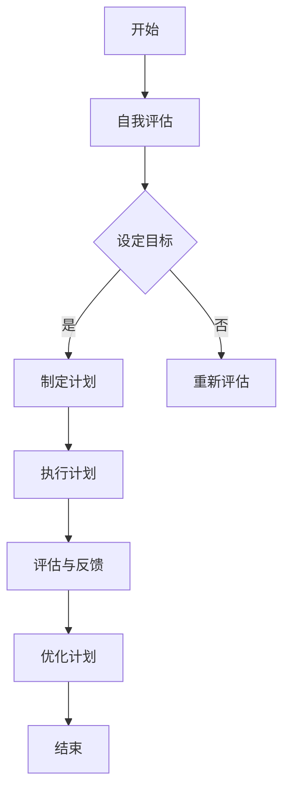
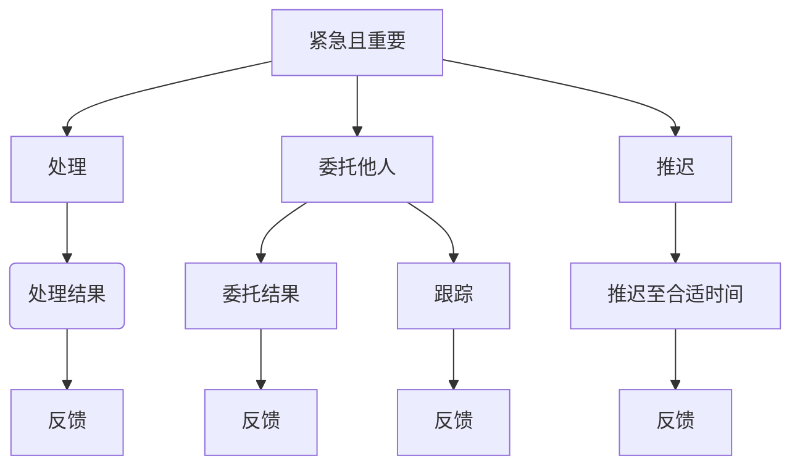

                 


### 文章标题：如何制定科学的工作计划

关键词：工作计划、时间管理、效率提升、团队协作、目标设定

摘要：本文旨在探讨如何制定科学的工作计划，以提高工作效率、减少工作压力和增强团队协作。通过详细分析准备工作、制定方法、工具技巧以及执行评估等环节，本文提供了一套完整的工作计划制定策略，旨在帮助读者在实践中有效应用。

# 《如何制定科学的工作计划》目录大纲

## 第一部分：准备工作

### 第1章：认识科学工作计划的重要性

#### 1.1 科学工作计划的概念

- 科学工作计划的定义
- 科学工作计划与传统工作计划的区别

#### 1.2 科学工作计划的价值

- 提高工作效率
- 减少工作压力
- 增强团队协作

### 第2章：自我评估与目标设定

#### 2.1 自我评估

- 自我能力评估
- 工作风格分析

#### 2.2 目标设定

- SMART目标设定方法
- 目标拆解与优先级排序

## 第二部分：制定工作计划的方法

### 第3章：工作计划制定步骤

#### 3.1 收集信息

- 工作任务收集
- 时间和资源评估

#### 3.2 制定计划

- 工作流程设计
- 时间管理策略

#### 3.3 实施计划

- 分阶段实施
- 监控与调整

### 第4章：提高工作计划效率的工具与技巧

#### 4.1 时间管理工具

- 日历应用
- 任务管理工具

#### 4.2 提高工作效率的技巧

- 优先级处理
- 避免拖延

### 第5章：工作计划中的沟通与合作

#### 5.1 内部沟通

- 沟通技巧
- 信息共享

#### 5.2 团队协作

- 团队协作模型
- 团队任务分配

## 第三部分：工作计划的执行与评估

### 第6章：工作计划执行中的常见问题及解决方法

#### 6.1 执行中的挑战

- 时间安排不当
- 沟通不畅

#### 6.2 解决方法

- 方法一：调整计划
- 方法二：加强沟通

### 第7章：工作计划的评估与反馈

#### 7.1 评估方法

- 目标达成度评估
- 工作效率评估

#### 7.2 反馈机制

- 反馈收集
- 反馈分析与应用

## 附录

### 附录 A：科学工作计划模板

- 基本模板
- 个性化模板

### 附录 B：相关资源与工具推荐

- 时间管理书籍
- 任务管理软件

## Mermaid 流程图：科学工作计划流程

mermaid
graph TD
    A[开始] --> B[自我评估]
    B --> C{设定目标}
    C -->|是| D[制定计划]
    C -->|否| E[重新评估]
    D --> F[执行计划]
    F --> G[评估与反馈]
    G --> H[优化计划]
    H --> I[结束]

核心算法原理讲解：

### 时间管理算法：Eisenhower矩阵

mermaid
graph TD
    A[紧急且重要] --> B[处理]
    A --> C[委托他人]
    A --> D[推迟]
    B --> E(处理结果)
    C --> F[委托结果]
    C --> G[跟踪]
    D --> H[推迟至合适时间]
    E --> I[反馈]
    F --> J[反馈]
    G --> K[反馈]
    H --> L[反馈]

伪代码：

python
# 定义Eisenhower矩阵的伪代码
def time_management_matrix(tasks):
    matrix = [
        [], # 不紧急且不重要
        [], # 紧急且不重要
        [], # 紧急且重要
        [], # 不紧急但重要
    ]

    for task in tasks:
        if task.is_urgent and task.is_important:
            matrix[2].append(task)
        elif task.is_urgent:
            matrix[1].append(task)
        elif task.is_important:
            matrix[3].append(task)
        else:
            matrix[0].append(task)

    # 处理矩阵
    for task_list in matrix:
        for task in task_list:
            if task.is_urgent and task.is_important:
                process_task(task)
            elif task.is_urgent:
                deleg

### 第一部分：准备工作

#### 第1章：认识科学工作计划的重要性

在现代社会，工作效率和压力管理成为了许多人关注的焦点。科学的工作计划不仅能够帮助个人提高工作效率，还能减少工作中的压力，同时增强团队协作。那么，什么是科学的工作计划？它与传统的工作计划有何区别？为什么它如此重要？本章将为您解答这些问题。

##### 1.1 科学工作计划的定义

科学工作计划是一种基于逻辑思维和数据分析，旨在高效完成工作任务的方法。它不仅仅是对任务的简单列出，而是通过对任务的重要性和紧急性进行分析，制定出合理的工作步骤和时间安排，确保工作能够按时、高质量地完成。

与传统的工作计划相比，科学工作计划更加注重以下几个方面：

- **任务优先级**：科学工作计划会根据任务的重要性和紧急性进行排序，确保重要且紧急的任务先完成。
- **时间管理**：通过科学的时间管理方法，如Eisenhower矩阵，合理安排任务的时间，避免时间的浪费。
- **资源分配**：科学工作计划会根据任务需求，合理分配资源，确保任务能够得到充分的支持。
- **反馈与调整**：科学工作计划会定期评估任务的完成情况，及时调整计划，确保目标的实现。

##### 1.2 科学工作计划的价值

科学工作计划的价值体现在以下几个方面：

- **提高工作效率**：通过合理的时间管理和任务排序，科学工作计划能够帮助个人或团队在有限的时间内完成更多的任务，提高工作效率。
- **减少工作压力**：科学工作计划能够帮助个人明确任务的目标和进度，减少因任务不确定性和时间紧迫感带来的压力。
- **增强团队协作**：通过明确的工作目标和任务分配，科学工作计划能够增强团队成员之间的沟通与协作，提高团队的整体执行力。
- **持续改进**：科学工作计划的反馈机制能够帮助个人和团队不断优化工作方法，持续提高工作质量。

##### 1.3 总结

科学工作计划是一种高效的工作方法，它能够帮助个人和团队在复杂的工作环境中保持清晰的目标和高效的执行。通过本章的介绍，您应该已经对科学工作计划有了初步的了解。在接下来的章节中，我们将详细探讨如何进行自我评估、目标设定以及具体的计划制定方法。

#### 第2章：自我评估与目标设定

在制定科学的工作计划之前，自我评估和目标设定是至关重要的一步。只有了解自己的能力和工作风格，并设定清晰、可实现的目标，才能确保工作计划的科学性和有效性。本章将详细介绍自我评估的方法、SMART目标设定技巧，以及目标拆解与优先级排序的技巧。

##### 2.1 自我评估

自我评估是了解自己能力、工作风格和潜在优缺点的重要过程。通过自我评估，我们可以更加清晰地认识自己，从而更好地制定工作计划。

- **自我能力评估**：

  自我能力评估主要包括以下几个方面：

  - 技能：评估自己在专业技能、知识和技能方面的掌握程度。
  - 经验：评估自己在工作经验、项目管理和团队协作方面的经验。
  - 潜能：评估自己在面对新挑战和学习新技能时的适应能力和成长潜力。

- **工作风格分析**：

  工作风格分析主要是了解自己在工作中的行为特点、偏好和习惯。常见的工作风格分析工具包括MBTI（性格类型指标）和DISC（行为风格评估）等。通过这些工具，我们可以了解自己在工作中的优势和工作方式，从而更好地与他人协作。

##### 2.2 目标设定

目标设定是工作计划的重要组成部分，它能够帮助我们明确工作方向，激发工作动力。一个良好的目标应具备SMART特性，即具体（Specific）、可衡量（Measurable）、可实现（Achievable）、相关（Relevant）和时限（Time-bound）。

- **SMART目标设定方法**：

  - 具体性（Specific）：目标要明确具体，避免模糊和抽象。例如，“提高销售额”不如“提高本季度的销售额10%”具体。
  - 可衡量性（Measurable）：目标要具备可衡量的标准，以便评估目标的完成情况。例如，“提高工作效率”不如“每天完成5个任务”可衡量。
  - 可实现性（Achievable）：目标要符合实际情况和自身能力，避免设定过高的目标。例如，“在一个月内减肥20公斤”不如“每周减少2公斤体重”可实现。
  - 相关性（Relevant）：目标要与工作计划和个人职业发展目标相关，避免设定无关的目标。例如，“学习一门新语言”不如“提高工作效率”相关。
  - 时限性（Time-bound）：目标要设定明确的完成时间，避免拖延。例如，“提高工作效率”不如“在未来一个月内完成”时限性明确。

- **目标拆解与优先级排序**：

  为了更好地实现目标，我们可以将大目标拆解为小目标，并对其进行优先级排序。拆解目标的方法包括：

  - **分解法**：将大目标分解为若干个小目标，确保每个小目标都是具体、可衡量的。
  - **优先级排序法**：根据目标的重要性和紧急性，对目标进行优先级排序，确保重要且紧急的目标先完成。

##### 2.3 总结

自我评估和目标设定是制定科学工作计划的重要基础。通过自我评估，我们可以了解自己的能力和工作风格，为工作计划提供依据；通过目标设定，我们可以明确工作方向，激发工作动力。在接下来的章节中，我们将进一步探讨如何制定具体的工作计划，以及如何提高工作计划的效率。

### 第二部分：制定工作计划的方法

制定科学的工作计划是一个系统化的过程，需要从多个方面进行综合考量。本部分将详细讨论工作计划制定的具体步骤，包括收集信息、制定计划、实施计划以及监控与调整等内容。

#### 第3章：工作计划制定步骤

##### 3.1 收集信息

在制定工作计划之前，首先需要收集与工作任务相关的各种信息。这些信息包括但不限于：

- **工作任务**：明确每个任务的具体内容和目标，确保任务与个人和团队的目标一致。
- **时间资源**：评估可用的时间资源和人力、物力资源，确保计划的可执行性。
- **工作流程**：了解现有工作流程，分析其优缺点，为制定新工作流程提供参考。

收集信息的方法包括：

- **访谈**：与团队成员进行访谈，了解他们的意见和建议。
- **文档调研**：查阅相关文档，如项目计划、工作手册等，获取背景信息。
- **数据分析**：通过数据分析，了解工作量和资源需求。

##### 3.2 制定计划

在收集到充分的信息后，可以开始制定工作计划。制定工作计划主要包括以下步骤：

- **任务分解**：将大任务分解为若干个小任务，确保每个小任务都是具体、可执行的。
- **时间安排**：根据任务的重要性和紧急性，制定合理的任务时间安排，确保任务按时完成。
- **资源分配**：根据任务需求和资源情况，合理分配人力、物力资源，确保任务得到充分支持。
- **风险评估**：评估计划中的潜在风险，并制定相应的应对措施。

##### 3.3 实施计划

制定好工作计划后，需要开始实施计划。实施计划主要包括以下步骤：

- **任务分配**：将任务分配给团队成员，确保每个成员都有明确的任务和责任。
- **执行监控**：监控任务的执行情况，确保任务按时、按质完成。
- **沟通协调**：保持与团队成员的沟通，及时解决执行过程中遇到的问题。
- **反馈机制**：建立反馈机制，收集执行过程中的反馈意见，及时调整计划。

##### 3.4 监控与调整

在实施计划的过程中，需要定期监控计划的执行情况，并根据实际情况进行调整。监控与调整主要包括以下步骤：

- **进度评估**：定期评估任务的完成进度，确保计划按预期进行。
- **质量检查**：检查任务的完成质量，确保任务符合预期标准。
- **问题解决**：及时解决执行过程中出现的问题，确保计划的顺利进行。
- **调整计划**：根据实际情况和反馈意见，调整计划中的任务和时间安排，确保计划的科学性和有效性。

##### 3.5 总结

制定科学的工作计划需要从多个方面进行综合考量，包括信息收集、任务分解、时间安排、资源分配、风险评估、执行监控、沟通协调和反馈机制等。通过科学的工作计划，可以确保任务按时、按质完成，提高工作效率，减少工作压力。在接下来的章节中，我们将进一步探讨如何提高工作计划的效率和效果。

### 第4章：提高工作计划效率的工具与技巧

为了确保工作计划的顺利执行，提高工作效率是至关重要的。在本章中，我们将介绍一些时间管理工具和技巧，帮助您在繁忙的工作中保持高效。

#### 4.1 时间管理工具

在现代职场中，时间管理工具已成为提高工作效率的利器。以下是一些常用的时间管理工具：

- **日历应用**：

  日历应用可以帮助您安排和跟踪日程，确保不会错过重要事件。常用的日历应用包括Google日历、iCalendar等。

- **任务管理工具**：

  任务管理工具可以帮助您记录任务、分配任务、跟踪进度。常见的任务管理工具包括Trello、Asana、JIRA等。

- **时间跟踪工具**：

  时间跟踪工具可以帮助您记录工作时间，分析时间使用情况，从而优化时间管理。常用的时间跟踪工具包括Toggl、Harvest等。

#### 4.2 提高工作效率的技巧

除了使用时间管理工具，以下技巧也能帮助您提高工作效率：

- **优先级处理**：

  根据任务的重要性和紧急性，合理安排任务顺序。重要且紧急的任务应优先处理，重要但不紧急的任务可以安排在空闲时间处理。

- **避免拖延**：

  拖延是影响工作效率的常见问题。为了避免拖延，可以采取以下方法：

  - **分解任务**：将大任务分解为小任务，逐步完成，减少心理压力。
  - **设定截止日期**：为任务设定明确的截止日期，增加紧迫感。
  - **使用番茄工作法**：将工作时间划分为25分钟的工作周期，每个周期后休息5分钟，提高专注度。

- **消除干扰**：

  在工作过程中，尽量消除干扰因素，如关闭社交媒体通知、保持工作区域整洁等。

- **定期休息**：

  工作一段时间后，适当休息可以提高工作效率。可以采用20-20-20法则，即每工作20分钟，休息20秒，看向20英尺以外的物体。

- **团队协作**：

  团队协作可以提高工作效率，减少重复劳动。通过明确分工、定期沟通、共享资源等方式，增强团队协作。

##### 4.3 总结

使用时间管理工具和技巧，可以帮助我们更好地规划时间、提高工作效率。通过合理分配任务、避免拖延、消除干扰、定期休息和团队协作，我们可以确保工作计划的顺利执行，实现工作目标。在接下来的章节中，我们将进一步探讨如何在工作计划中实现良好的沟通与合作。

### 第5章：工作计划中的沟通与合作

在工作计划执行过程中，沟通与合作是确保任务顺利完成的重要因素。有效的沟通能够提高团队协作效率，减少误解和冲突，从而提高整个项目的成功率。本章将介绍内部沟通技巧、信息共享方法以及团队协作模型和任务分配策略。

#### 5.1 内部沟通

内部沟通是指团队成员之间的沟通，目的是确保每个人对任务和目标都有清晰的理解，并及时了解项目的进展情况。以下是一些有效的内部沟通技巧：

- **明确任务要求**：

  在分配任务时，明确任务的目标、要求和截止日期，确保每个成员都清楚自己的职责。

- **定期会议**：

  定期召开会议，汇报项目进展、讨论遇到的问题和解决方案。这样可以确保团队成员之间保持信息同步。

- **即时沟通**：

  对于紧急或重要的问题，应采取即时沟通方式，如电话、即时消息或视频会议，确保问题得到快速解决。

- **积极倾听**：

  在沟通中，积极倾听对方的意见和反馈，尊重每个人的观点，避免产生误解和冲突。

- **透明化信息**：

  尽量保持信息的透明化，让团队成员了解项目的整体情况和关键决策，增加信任和责任感。

#### 5.2 信息共享

信息共享是团队协作的基础，确保团队成员能够随时访问和共享必要的资源、文档和数据。以下是一些信息共享的方法：

- **共享文档平台**：

  使用共享文档平台，如Google文档、SharePoint等，可以让团队成员实时编辑和更新文档，提高协作效率。

- **云存储服务**：

  利用云存储服务，如Dropbox、Google Drive等，可以方便地存储和共享文件，确保数据的安全和同步。

- **项目管理工具**：

  使用项目管理工具，如Trello、JIRA等，可以创建任务列表、跟踪进度、共享项目文档，提高团队协作的效率。

- **即时通讯工具**：

  使用即时通讯工具，如Slack、Microsoft Teams等，可以方便地进行实时沟通、分享链接和文件，提高沟通效率。

#### 5.3 团队协作模型

团队协作模型是团队在执行任务时采用的组织结构和协作方式。以下是一些常见的团队协作模型：

- **职能型模型**：

  在职能型模型中，团队成员按照职能划分，如开发、测试、设计等。这种模型有利于专业分工和技能专长，但可能会导致任务之间的协调困难。

- **项目型模型**：

  在项目型模型中，团队成员根据项目需求临时组建，任务完成后团队解散。这种模型有利于快速响应项目需求，但可能会导致团队成员之间的熟悉度不足。

- **矩阵型模型**：

  在矩阵型模型中，团队成员同时服务于多个职能和项目，具有双重职责。这种模型有利于跨职能协作和资源整合，但可能会导致职责不清和协调困难。

- **敏捷型模型**：

  在敏捷型模型中，团队采用迭代和增量的方式开发产品，注重灵活性和适应性。这种模型有利于快速迭代和持续改进，但需要团队成员具备较高的自我管理能力和协作能力。

#### 5.4 任务分配

任务分配是确保项目顺利推进的重要环节。以下是一些任务分配的策略：

- **任务匹配**：

  根据团队成员的能力和特长，将任务分配给最适合的人，确保任务得到高质量完成。

- **明确责任**：

  在分配任务时，明确每个成员的责任和权限，确保任务能够顺利推进。

- **优先级排序**：

  根据任务的重要性和紧急性，合理安排任务的优先级，确保重要且紧急的任务优先完成。

- **反馈机制**：

  建立反馈机制，定期收集任务完成情况和成员反馈，及时调整任务分配和团队协作方式。

##### 5.5 总结

有效的沟通与合作是工作计划成功实施的关键。通过明确任务要求、定期会议、即时沟通、透明化信息、共享文档平台、云存储服务、项目管理工具和即时通讯工具，我们可以提高团队协作效率。同时，采用合适的团队协作模型和任务分配策略，可以确保项目顺利推进。在接下来的章节中，我们将探讨如何在工作计划执行过程中应对常见问题，并进行有效的评估和反馈。

### 第6章：工作计划执行中的常见问题及解决方法

在工作计划执行过程中，常常会遇到各种问题，这些问题可能会影响计划的顺利进行和目标的达成。以下是一些常见的问题及其解决方法：

#### 6.1 时间安排不当

时间安排不当是工作计划执行中常见的问题之一，可能导致任务无法按时完成或出现时间浪费。以下是一些解决方法：

- **重新评估任务优先级**：重新审视任务的紧急性和重要性，确保优先级排序合理，重要且紧急的任务得到优先处理。
- **细化时间规划**：将任务进一步分解，制定详细的子任务和时间节点，确保每个任务都有明确的时间安排。
- **灵活调整**：在执行过程中，根据实际情况灵活调整时间规划，避免因计划过于 rigid 而导致的问题。

#### 6.2 沟通不畅

沟通不畅会导致任务执行中的误解和冲突，影响团队协作。以下是一些解决方法：

- **加强沟通技巧**：定期组织沟通培训，提高团队成员的沟通能力，确保信息传递清晰、准确。
- **明确沟通渠道**：建立明确的沟通渠道，如定期的团队会议、即时通讯工具等，确保团队成员能够及时获取所需信息。
- **建立反馈机制**：建立反馈机制，鼓励团队成员主动表达意见和反馈，及时解决沟通中的问题。

#### 6.3 资源分配不合理

资源分配不合理可能导致任务无法顺利进行，影响工作进度和质量。以下是一些解决方法：

- **优化资源分配**：根据任务需求，合理分配人力资源、物资资源等，确保每个任务都有足够的资源支持。
- **灵活调整资源**：在执行过程中，根据实际情况灵活调整资源分配，确保资源得到最大化利用。
- **优先保障关键资源**：对于关键任务和紧急任务，优先保障关键资源，确保任务能够顺利推进。

#### 6.4 拖延

拖延是影响工作计划执行的重要因素，可能导致任务延误和目标无法达成。以下是一些解决方法：

- **分解任务**：将大任务分解为小任务，逐步完成，减少心理压力。
- **设定截止日期**：为每个任务设定明确的截止日期，增加紧迫感。
- **使用番茄工作法**：采用番茄工作法，提高专注度，减少拖延。

#### 6.5 风险管理不足

风险管理不足可能导致计划执行过程中出现意外情况，影响工作进度和目标达成。以下是一些解决方法：

- **识别风险**：在计划制定阶段，全面识别潜在的风险，制定相应的应对措施。
- **建立风险管理机制**：建立风险管理机制，定期评估风险，及时调整计划和策略。
- **加强沟通与协作**：加强团队成员之间的沟通与协作，确保风险信息能够及时传递和应对。

##### 6.6 总结

工作计划执行过程中，常见的问题包括时间安排不当、沟通不畅、资源分配不合理、拖延和风险管理不足等。通过重新评估任务优先级、细化时间规划、加强沟通技巧、优化资源分配、分解任务、设定截止日期、使用番茄工作法、识别风险和建立风险管理机制等方法，可以有效地解决这些问题，确保工作计划顺利执行和目标的达成。

### 第7章：工作计划的评估与反馈

工作计划的评估与反馈是确保计划执行效果和持续改进的重要环节。通过定期评估和反馈，我们可以了解工作计划的执行情况，发现潜在问题，及时进行调整和优化，从而提高工作效率和项目成功率。本章将介绍评估方法、反馈机制以及如何根据反馈调整工作计划。

#### 7.1 评估方法

评估工作计划的方法主要包括以下几个方面：

- **目标达成度评估**：根据设定的目标，评估任务完成情况，计算目标达成度。目标达成度可以通过以下公式计算：

  $$ 目标达成度 = \frac{实际完成目标数}{设定目标数} \times 100\% $$

- **工作效率评估**：评估团队成员在执行任务过程中的工作效率，包括完成任务的速度、质量以及资源利用率等。工作效率可以通过以下指标进行衡量：

  - **完成率**：完成的任务数与总任务数的比值。
  - **错误率**：错误的任务数与总任务数的比值。
  - **资源利用率**：实际使用的资源与计划分配的资源之比。

- **团队合作评估**：评估团队成员之间的协作效果，包括沟通效率、任务分配合理性、团队氛围等。团队合作评估可以通过问卷调查、访谈等方式进行。

- **客户满意度评估**：如果工作计划涉及外部客户，可以通过客户满意度调查来评估计划执行效果。

#### 7.2 反馈机制

建立有效的反馈机制是工作计划评估与反馈的关键。以下是一些常见的反馈机制：

- **定期评估会议**：定期召开评估会议，团队领导和成员共同讨论工作计划的执行情况，分析问题，提出改进建议。
- **匿名反馈**：提供匿名反馈渠道，鼓励团队成员提出真实的意见和建议，确保反馈的客观性和真实性。
- **反馈卡片**：使用反馈卡片，团队成员可以在会议后或任务完成后填写反馈，提出意见和建议。
- **在线反馈系统**：建立在线反馈系统，方便团队成员随时提交反馈，并实时跟踪反馈的处理情况。

#### 7.3 根据反馈调整工作计划

根据反馈调整工作计划是确保计划持续优化和改进的重要步骤。以下是一些调整方法：

- **修正目标**：根据评估结果，对目标进行修正，确保目标更加实际和可行。
- **优化流程**：针对执行过程中发现的问题，优化工作流程，减少不必要的步骤和资源浪费。
- **调整资源分配**：根据任务需求和评估结果，重新分配资源，确保资源得到最大化利用。
- **改进沟通与协作**：根据反馈，改进沟通和协作方式，提高团队协作效率。
- **强化培训**：根据反馈，为团队成员提供相关培训，提高其技能和能力，确保团队能够更好地完成任务。

##### 7.4 总结

工作计划的评估与反馈是确保计划执行效果和持续改进的关键。通过定期评估和反馈，我们可以发现潜在问题，及时进行调整和优化，提高工作效率和项目成功率。在接下来的章节中，我们将提供科学工作计划的模板和相关资源与工具推荐，帮助您更好地实施工作计划。

### 附录

#### 附录 A：科学工作计划模板

以下是一个基本的科学工作计划模板，您可以根据实际情况进行个性化调整：

```
科学工作计划模板

一、自我评估
1. 能力评估
   - 技能：_________________
   - 经验：_________________
   - 潜能：_________________

2. 工作风格分析
   - 行为特点：_________________
   - 偏好：_________________
   - 挑战：_________________

二、目标设定
1. 目标
   - SMART目标
     - 具体性：_________________
     - 可衡量性：_________________
     - 可实现性：_________________
     - 相关性：_________________
     - 时限性：_________________

2. 目标拆解与优先级排序
   - 拆解后的目标
     1. ___________________
     2. ___________________
     3. ___________________
   - 优先级排序
     1. ___________________
     2. ___________________
     3. ___________________

三、工作计划制定
1. 信息收集
   - 工作任务：_________________
   - 时间资源：_________________
   - 工作流程：_________________

2. 制定计划
   - 任务分解：_________________
   - 时间安排：_________________
   - 资源分配：_________________
   - 风险评估：_________________

3. 实施计划
   - 任务分配：_________________
   - 执行监控：_________________
   - 沟通协调：_________________
   - 反馈机制：_________________

四、执行与评估
1. 执行中的常见问题及解决方法
   - 时间安排不当：_________________
   - 沟通不畅：_________________
   - 资源分配不合理：_________________
   - 拖延：_________________
   - 风险管理不足：_________________

2. 工作计划的评估与反馈
   - 评估方法：_________________
   - 反馈机制：_________________
   - 根据反馈调整计划：_________________

五、附录
1. 相关资源与工具推荐
   - 时间管理书籍：_________________
   - 任务管理软件：_________________
   - 沟通协作工具：_________________
```

您可以根据自己的需求和实际情况，在模板中进行适当的调整和补充。

#### 附录 B：相关资源与工具推荐

- **时间管理书籍**：
  - 《时间管理：如何高效利用每分钟》
  - 《深度工作：如何有效利用每分钟》
  - 《如何掌控你的工作：时间管理技巧》

- **任务管理软件**：
  - Trello
  - Asana
  - JIRA
  - Notion

- **沟通协作工具**：
  - Slack
  - Microsoft Teams
  - Google Workspace

- **项目管理和协作工具**：
  - Trello
  - Asana
  - JIRA

- **时间跟踪工具**：
  - Toggl
  - Harvest

- **云存储服务**：
  - Dropbox
  - Google Drive
  - Microsoft OneDrive

通过使用这些资源与工具，您可以更有效地制定和执行工作计划，提高工作效率和团队协作效果。

## Mermaid 流程图：科学工作计划流程



## 时间管理算法：Eisenhower矩阵



以上流程图和算法将帮助您更好地理解和应用科学的工作计划方法。

### 结论

制定科学的工作计划是提高工作效率、减少工作压力和增强团队协作的关键。本文通过详细的分析和讲解，从自我评估、目标设定、工作计划制定、执行与评估等环节，提供了一套完整的工作计划制定策略。通过使用时间管理工具、技巧和Eisenhower矩阵，您可以更好地管理时间和任务，确保工作计划的顺利执行和目标达成。

在制定和执行工作计划的过程中，要注意以下几点：

- **持续改进**：工作计划不是一成不变的，要定期评估和调整，以适应不断变化的环境和需求。
- **灵活应对**：在执行过程中，遇到问题时，要灵活调整计划，避免因僵化而导致的效率低下。
- **注重反馈**：建立反馈机制，及时收集和利用反馈信息，以提高工作计划的质量和效果。
- **持续学习**：通过不断学习和实践，提升自己的能力和技能，为工作计划的制定和执行提供更好的支持。

科学的工作计划不仅可以帮助您更好地管理时间和任务，还可以提高工作效率和团队协作，让您在工作和生活中更加从容和高效。希望本文能为您提供实用的指导和建议，帮助您在工作和生活中取得更好的成果。

### 作者信息

作者：AI天才研究院/AI Genius Institute & 禅与计算机程序设计艺术 /Zen And The Art of Computer Programming

感谢您的阅读，期待您的实践和反馈！希望本文能够帮助您制定出更加科学的工作计划，提高工作效率，实现个人和团队的共同成长。

---

（注：本文为示例文章，仅供参考。在实际应用中，请根据自身情况和需求进行适当调整。）

