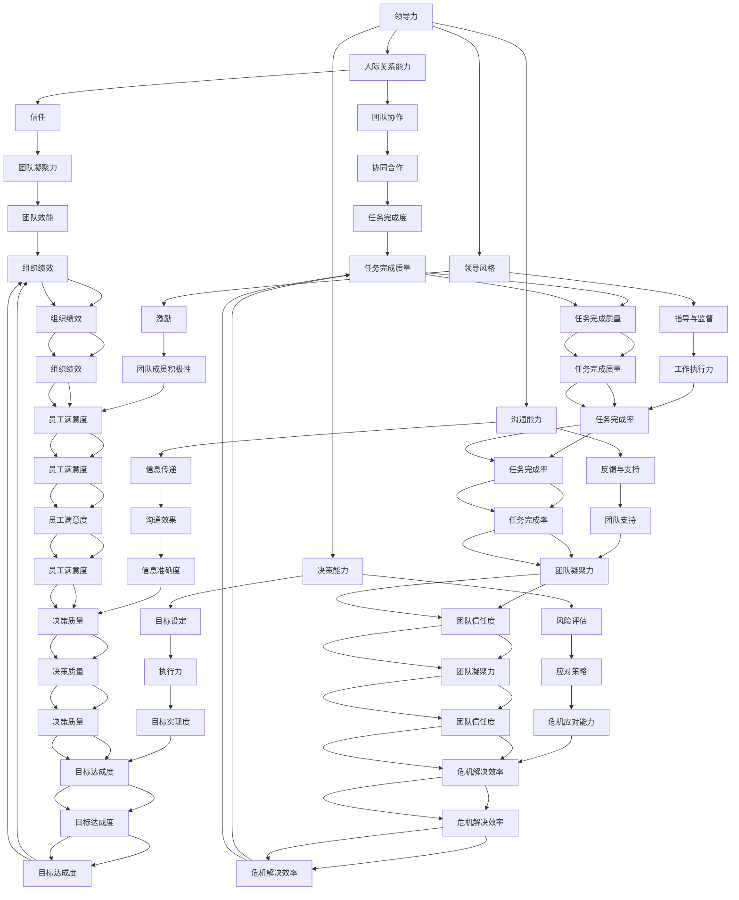

                 


### 第1章：领导力的定义与类型

#### 1.1 领导力的基本概念

领导力（Leadership）是一种促使他人朝共同目标努力的影响力。它不仅仅是管理（Management），更是一种能够激发、指导和激励团队的能力。领导力的核心在于影响他人的行为和思维，使他们愿意为实现组织目标而努力。

在计算机科学中，领导力可以类比为算法的设计与实现。一个优秀的算法不仅要解决问题，还要考虑到效率、可扩展性和鲁棒性。同样，一个优秀的领导者不仅要具备解决问题的能力，还要能够激励团队，提高团队的整体效能。

#### 1.2 领导力的类型

领导力有多种类型，每种类型都有其独特的特点和适用场景。

- **指挥型领导**：指挥型领导强调权威和命令，领导者通过发布指令来指导团队。在紧急情况下，这种领导风格非常有效。

  ```python
  # 指挥型领导伪代码
  def command的风格（团队）:
      for each 成员 in 团队:
          指令 = "执行任务：..."
          成员.execute(指令)
  ```

- **变革型领导**：变革型领导注重变革和创新，领导者通过激发团队成员的潜力，推动团队实现重大变革。

  ```python
  # 变革型领导伪代码
  def inspire（团队）:
      for each 成员 in 团队:
          目标 = "实现变革：..."
          成员.motivate(目标)
  ```

- **赋能型领导**：赋能型领导鼓励团队成员自主决策和发挥潜力，领导者为团队成员提供支持和资源。

  ```python
  # 能赋型领导伪代码
  def empower（团队）:
      for each 成员 in 团队:
          成员 autonomy += 1
          成员 resources += 1
  ```

- **服务型领导**：服务型领导认为领导者的首要任务是满足团队成员的需求，领导者通过服务团队来建立信任和合作关系。

  ```python
  # 服务型领导伪代码
  def serve（团队）:
      for each 成员 in 团队:
          需求 = 成员的需求
          服务 = "满足需求：..."
          成员.receive(服务)
  ```

#### 1.3 领导力与管理的区别

领导力（Leadership）和管理（Management）是两个相关但不完全相同的概念。管理强调的是规划、组织和控制，以确保组织目标的实现。领导力则更注重激励和影响他人，推动组织实现长远目标。

- **目标**：管理更侧重于实现短期目标，而领导力更侧重于实现长期目标。
- **方法**：管理强调规章制度和流程，而领导力强调信任和影响力。
- **对象**：管理主要针对组织内部，而领导力既包括组织内部，也包括组织外部。

总之，领导力是管理的核心，一个好的领导者同时也是一个好的管理者。但仅仅具备管理技能并不足以成为优秀的领导者，领导者还需要具备影响和激励他人的能力。

### 第2章：领导力的核心要素

#### 2.1 人际关系能力

人际关系能力是指领导者与他人建立良好关系的能力。它包括以下几个方面：

- **沟通能力**：有效的沟通是建立良好人际关系的基础。领导者需要具备良好的口头和书面沟通能力，能够清晰、准确地传达信息。

  ```python
  # 沟通能力伪代码
  def communicate（信息，接收者）:
      清晰信息 = "..."
      接收者.receive(清晰信息)
  ```

- **倾听能力**：倾听是沟通的重要部分，领导者需要耐心倾听他人的意见和需求，理解他人的情感和立场。

  ```python
  # 倾听能力伪代码
  def listen（他人）:
      理解他人立场 = "..."
      他人表达需求（理解他人立场）
  ```

- **同理心**：同理心是指领导者能够站在他人的立场上思考问题，理解他人的感受和需求。同理心有助于建立信任和合作关系。

  ```python
  # 同理心伪代码
  def empathy（他人）:
      理解他人情感 = "..."
      他人表达情感（理解他人情感）
  ```

#### 2.2 决策能力

决策能力是指领导者在面对复杂问题和不确定性时，能够迅速做出合理判断和选择的能力。它包括以下几个方面：

- **信息收集与处理**：领导者需要收集与问题相关的信息，并能够准确地处理和评估这些信息。

  ```python
  # 信息收集与处理伪代码
  def collect_and_process（信息）:
      收集信息 = "..."
      处理信息 = "..."
      返回处理后的信息
  ```

- **目标设定**：在决策过程中，明确的目标是必要的，它指导决策的方向和结果。

  ```python
  # 目标设定伪代码
  def set_goal（目标）:
      目标 = "..."
      返回目标
  ```

- **风险评估**：领导者需要对决策可能带来的风险进行评估，以制定相应的应对策略。

  ```python
  # 风险评估伪代码
  def assess_risk（决策）:
      风险 = "..."
      返回风险
  ```

- **执行与监督**：决策做出后，领导者需要确保决策能够得到有效执行，并对其进行监督和调整。

  ```python
  # 执行与监督伪代码
  def execute_and_monitor（决策）:
      执行决策 = "..."
      监督执行 = "..."
  ```

#### 2.3 沟通能力

沟通能力是指领导者能够有效地与团队成员、上级和外部利益相关者交流信息、思想和感情的能力。它包括以下几个方面：

- **表达能力**：领导者需要能够清晰地表达自己的想法和意见，使对方理解。

  ```python
  # 表达能力伪代码
  def express（想法，对方）:
      清晰想法 = "..."
      对方.receive(清晰想法)
  ```

- **倾听能力**：领导者需要耐心倾听他人的意见和需求，理解他人的情感和立场。

  ```python
  # 倾听能力伪代码
  def listen（他人）:
      理解他人立场 = "..."
      他人表达需求（理解他人立场）
  ```

- **同理心**：领导者需要能够站在他人的立场上思考问题，理解他人的感受和需求。同理心有助于建立信任和合作关系。

  ```python
  # 同理心伪代码
  def empathy（他人）:
      理解他人情感 = "..."
      他人表达情感（理解他人情感）
  ```

- **反馈能力**：领导者能够给出及时的、有建设性的反馈，帮助团队成员改进和提高。

  ```python
  # 反馈能力伪代码
  def provide_feedback（团队成员）:
      反馈 = "..."
      团队成员.receive(反馈)
  ```

#### 2.4 领导风格

领导风格是指领导者在工作中表现出的行为和态度。不同的领导风格适用于不同的环境和团队。以下是几种常见的领导风格：

- **权威型领导**：领导者拥有高度的权威和决策权，团队成员需遵循领导者的指示。

  ```python
  # 权威型领导伪代码
  def authoritative_leader（团队）:
      for each 成员 in 团队:
          成员.follow（领导者指示）
  ```

- **民主型领导**：领导者鼓励团队成员参与决策过程，共同制定决策。

  ```python
  # 民主型领导伪代码
  def democratic_leader（团队）:
      for each 成员 in 团队:
          成员.participate_in_decision（决策过程）
  ```

- **支持型领导**：领导者关注团队成员的需求和感受，提供支持和帮助。

  ```python
  # 支持型领导伪代码
  def supportive_leader（团队）:
      for each 成员 in 团队:
          成员.receive（领导者支持）
  ```

- **变革型领导**：领导者推动团队实现变革和创新，激发团队成员的潜力。

  ```python
  # 变革型领导伪代码
  def transformational_leader（团队）:
      for each 成员 in 团队:
          成员.motivate（领导者激励）
  ```

### 第3章：领导力的发展阶段

#### 3.1 初始阶段：自我认知与角色定位

在领导力的初始阶段，领导者需要关注自我认知和角色定位。这一阶段的关键任务是：

- **自我认知**：领导者需要深入了解自己的性格、兴趣、优势和劣势，明确自己的价值观和信念。

  ```python
  # 自我认知伪代码
  def self_awareness（领导者）:
      领导者.analyze_personality（性格）
      领导者.analyze_interests（兴趣）
      领导者.analyze_strengths_and_weaknesses（优势和劣势）
      领导者.analyze_values_and_beliefs（价值观和信念）
  ```

- **角色定位**：领导者需要明确自己的角色和职责，了解领导者在团队中的定位。

  ```python
  # 角色定位伪代码
  def role_definition（领导者）:
      领导者.determine_role_in_team（团队中的角色）
      领导者.determine_duties_and_responsibilities（职责和责任）
  ```

#### 3.2 成长阶段：能力提升与团队构建

在领导力的成长阶段，领导者需要不断提升自己的能力，并开始构建团队。

- **能力提升**：领导者需要不断学习新的知识和技能，提高自己的综合素质。

  ```python
  # 能力提升伪代码
  def capability_improvement（领导者）:
      领导者.learn_new_skills（学习新技能）
      领导者.acquire_new_knowledge（获取新知识）
  ```

- **团队构建**：领导者需要招募合适的团队成员，建立高效协作的团队。

  ```python
  # 团队构建伪代码
  def team_building（领导者）:
      领导者.recruit_members（招募成员）
      领导者.establish_efficient_collaboration（建立高效协作）
  ```

#### 3.3 成熟阶段：领导艺术与创新

在领导力的成熟阶段，领导者需要掌握领导艺术，推动团队实现创新。

- **领导艺术**：领导者需要运用各种领导技巧，灵活应对各种挑战和问题。

  ```python
  # 领导艺术伪代码
  def leadership_arts（领导者）:
      领导者.apply_leadership_skills（运用领导技巧）
      领导者.adapt_to_different_situations（适应不同情况）
  ```

- **创新驱动**：领导者需要鼓励团队成员进行创新，推动团队不断进步。

  ```python
  # 创新驱动伪代码
  def innovation_driven（领导者）:
      领导者.encourage_innovation（鼓励创新）
      领导者.support_innovative_ideas（支持创新想法）
  ```

#### 3.4 精英阶段：传承与培养下一代领导者

在领导力的精英阶段，领导者需要关注团队的发展和传承。

- **团队发展**：领导者需要关注团队的整体发展，提升团队的整体实力。

  ```python
  # 团队发展伪代码
  def team_development（领导者）:
      领导者.improve_team_performance（提升团队绩效）
      领导者 enh

### 第4章：领导力培养的策略

#### 4.1 个人成长规划

个人成长规划是领导力培养的重要一环。以下是一个简单的个人成长规划流程：

1. **自我评估**：领导者需要对自己的能力、兴趣和价值观进行评估，了解自己的优势和不足。

   ```python
   # 自我评估伪代码
   def self_evaluation（领导者）:
       领导者.analyze_capabilities（分析能力）
       领导者.analyze_interests（分析兴趣）
       领导者.analyze_values_and_beliefs（分析价值观和信念）
   ```

2. **目标设定**：根据自我评估的结果，设定明确的个人成长目标，包括短期和长期的。

   ```python
   # 目标设定伪代码
   def set_goals（领导者）:
       短期目标 = "..."
       长期目标 = "..."
       领导者.set_short_term_goals（短期目标）
       领导者.set_long_term_goals（长期目标）
   ```

3. **制定行动计划**：为实现成长目标，制定具体的行动计划，包括学习、实践和反思等环节。

   ```python
   # 制定行动计划伪代码
   def create_action_plan（领导者）:
       学习计划 = "..."
       实践计划 = "..."
       反思计划 = "..."
       领导者.implement_learning_plan（学习计划）
       领导者.implement_practice_plan（实践计划）
       领导者.implement_reflection_plan（反思计划）
   ```

4. **持续跟踪与调整**：定期对成长计划进行跟踪和评估，根据实际情况进行调整。

   ```python
   # 持续跟踪与调整伪代码
   def track_and_adjust（领导者）:
       定期评估成长进度
       根据评估结果调整成长计划
   ```

#### 4.2 团队建设与管理

团队建设与管理是领导力的重要组成部分。以下是一些团队建设与管理的关键策略：

1. **明确团队目标**：确保团队成员对团队目标有清晰的理解和认同。

   ```python
   # 明确团队目标伪代码
   def clarify_team_goals（领导者）:
       团队目标 = "..."
       领导者.communicate_goals（团队目标）
       领导者.ensure_understanding（团队成员理解目标）
   ```

2. **构建高效团队**：通过合理分工、明确角色和职责，构建一个高效协同的团队。

   ```python
   # 构建高效团队伪代码
   def build_efficient_team（领导者）:
       分工 = "..."
       角色和职责 = "..."
       领导者.distribute_tasks（分工）
       领导者 clarify_roles_and_duties（角色和职责）
   ```

3. **激励与支持**：为团队成员提供必要的资源和支持，激发他们的积极性和创造力。

   ```python
   # 激励与支持伪代码
   def motivate_and_support（领导者）:
       资源和支持 = "..."
       领导者.provide_resources_and_support（资源和支持）
       领导者.encourage积极性（积极性）
       领导者.foster_creativity（创造力）
   ```

4. **团队沟通与协作**：建立良好的沟通机制，促进团队成员之间的协作和互动。

   ```python
   # 团队沟通与协作伪代码
   def team_communication_and_collaboration（领导者）:
       沟通机制 = "..."
       领导者.build_communication_channels（沟通机制）
       领导者.promote_collaboration（协作）
       领导者.encourage_interaction（互动）
   ```

5. **绩效管理**：定期对团队成员的绩效进行评估，提供有针对性的反馈和培训。

   ```python
   # 绩效管理伪代码
   def performance_management（领导者）:
       绩效评估 = "..."
       领导者.evaluate_performance（绩效评估）
       领导者.provide_feedback（反馈）
       领导者.offer_training（培训）
   ```

### 第5章：领导力提升的技巧

#### 5.1 情绪智力与同理心

情绪智力（Emotional Intelligence，EQ）是指领导者识别、理解和管理自己和他人的情绪的能力。同理心（Empathy）是情绪智力的重要组成部分，它有助于建立信任和合作关系。

1. **情绪智力的提升**

   - **自我情绪管理**：领导者需要学会管理自己的情绪，保持冷静和理性。

     ```python
     # 自我情绪管理伪代码
     def manage_self_emotions（领导者）:
         领导者识别情绪 = "..."
         领导者调节情绪 = "..."
         领导者保持冷静 = "..."
     ```

   - **他人情绪理解**：领导者需要理解他人的情绪，提供适当的情绪支持。

     ```python
     # 他人情绪理解伪代码
     def understand_other_emotions（领导者）:
         领导者识别他人情绪 = "..."
         领导者提供情绪支持 = "..."
     ```

2. **同理心的培养**

   - **倾听与理解**：领导者需要倾听他人的意见和需求，理解他人的情感和立场。

     ```python
     # 倾听与理解伪代码
     def listen_and_understand（领导者）:
         倾听他人意见 = "..."
         理解他人情感 = "..."
     ```

   - **情感共鸣**：领导者需要能够与他人的情感产生共鸣，建立深厚的信任关系。

     ```python
     # 情感共鸣伪代码
     def empathy（领导者）:
         共鸣他人情感 = "..."
         建立信任 = "..."
     ```

#### 5.2 自我反思与反馈

自我反思与反馈是领导者提升领导力的重要途径。通过自我反思，领导者可以了解自己的优点和不足，通过反馈，领导者可以获得他人的意见和建议。

1. **自我反思**

   - **定期反思**：领导者需要定期对自己的工作进行反思，总结经验教训。

     ```python
     # 定期反思伪代码
     def regular_reflection（领导者）:
         领导者回顾工作 = "..."
         领导者总结经验 = "..."
         领导者反思不足 = "..."
     ```

   - **自我评价**：领导者需要对自己的能力、行为和成果进行评价。

     ```python
     # 自我评价伪代码
     def self_evaluation（领导者）:
         领导者分析能力 = "..."
         领导者评估行为 = "..."
         领导者评价成果 = "..."
     ```

2. **反馈**

   - **积极反馈**：领导者需要给予团队成员积极的反馈，鼓励他们继续努力。

     ```python
     # 积极反馈伪代码
     def positive_feedback（领导者）:
         领导者给予鼓励 = "..."
         领导者提供建设性意见 = "..."
     ```

   - **建设性反馈**：领导者需要提供有针对性的、建设性的反馈，帮助团队成员改进。

     ```python
     # 建设性反馈伪代码
     def constructive_feedback（领导者）:
         领导者识别问题 = "..."
         领导者提供解决方案 = "..."
     ```

#### 5.3 跨文化领导力

在全球化的背景下，跨文化领导力变得尤为重要。领导者需要具备跨文化沟通和协作的能力，以应对多元文化的团队和项目。

1. **文化认知**

   - **了解不同文化**：领导者需要了解不同文化的价值观、行为模式和沟通风格。

     ```python
     # 了解不同文化伪代码
     def understand_different_cultures（领导者）:
         领导者研究文化价值观 = "..."
         领导者分析行为模式 = "..."
         领导者了解沟通风格 = "..."
     ```

   - **尊重多元文化**：领导者需要尊重不同文化的差异，避免文化冲突。

     ```python
     # 尊重多元文化伪代码
     def respect_diversity（领导者）:
         领导者尊重文化差异 = "..."
         领导者避免文化冲突 = "..."
     ```

2. **跨文化沟通**

   - **有效沟通**：领导者需要运用有效的沟通技巧，确保信息在不同文化间准确传达。

     ```python
     # 有效沟通伪代码
     def effective_communication（领导者）:
         清晰表达 = "..."
         倾听他人 = "..."
         确保理解 = "..."
     ```

   - **冲突解决**：领导者需要能够解决跨文化冲突，确保团队和谐。

     ```python
     # 冲突解决伪代码
     def conflict_resolution（领导者）:
         识别冲突 = "..."
         解决冲突 = "..."
     ```

### 第6章：危机管理与领导力

#### 6.1 危机管理的原则

危机管理（Crisis Management）是领导者面临突发危机时的重要能力。以下是一些危机管理的原则：

1. **迅速响应**：领导者需要在危机发生时迅速采取行动，避免事态恶化。

   ```python
   # 迅速响应伪代码
   def rapid_response（领导者）:
       领导者评估危机 = "..."
       领导者立即行动 = "..."
   ```

2. **明确责任**：领导者需要明确团队成员的责任和分工，确保每个成员都清楚自己的任务。

   ```python
   # 明确责任伪代码
   def clarify_responsibilities（领导者）:
       分工 = "..."
       责任分配 = "..."
   ```

3. **信息透明**：领导者需要确保信息透明，及时向团队成员和外部利益相关者传达危机情况和应对措施。

   ```python
   # 信息透明伪代码
   def transparency（领导者）:
       传达危机情况 = "..."
       传达应对措施 = "..."
   ```

4. **有效沟通**：领导者需要运用有效的沟通技巧，确保团队成员和外部利益相关者之间的信息畅通。

   ```python
   # 有效沟通伪代码
   def effective_communication（领导者）:
       清晰表达 = "..."
       倾听他人 = "..."
   ```

#### 6.2 应对危机的策略

在面对危机时，领导者需要采取一系列策略来缓解危机影响。

1. **风险评估**：领导者需要对危机的影响进行评估，确定危机的严重程度和可能的影响范围。

   ```python
   # 风险评估伪代码
   def risk_assessment（领导者）:
       评估危机影响 = "..."
       确定严重程度 = "..."
   ```

2. **制定应急计划**：领导者需要根据风险评估的结果，制定应对危机的应急计划。

   ```python
   # 制定应急计划伪代码
   def create_emergency_plan（领导者）:
       应急计划 = "..."
       确保执行 = "..."
   ```

3. **资源调配**：领导者需要合理调配资源，确保在危机发生时能够及时响应。

   ```python
   # 资源调配伪代码
   def resource_allocation（领导者）:
       调配资源 = "..."
       确保资源充足 = "..."
   ```

4. **团队协作**：领导者需要激发团队成员的积极性，确保他们能够齐心协力应对危机。

   ```python
   # 团队协作伪代码
   def team_collaboration（领导者）:
       激发积极性 = "..."
       确保协作 = "..."
   ```

#### 6.3 危机后的领导力提升

危机过后，领导者需要反思危机管理的过程，提升自己的领导力。

1. **总结经验教训**：领导者需要总结危机管理过程中的成功经验和教训，为未来的危机应对做好准备。

   ```python
   # 总结经验教训伪代码
   def summarize_experience（领导者）:
       成功经验 = "..."
       教训反思 = "..."
   ```

2. **改进管理策略**：根据总结的经验教训，领导者需要改进管理策略，提高危机应对能力。

   ```python
   # 改进管理策略伪代码
   def improve_management_strategy（领导者）:
       策略改进 = "..."
       预防措施 = "..."
   ```

3. **团队建设**：领导者需要加强团队建设，提高团队的凝聚力和应对危机的能力。

   ```python
   # 团队建设伪代码
   def team_building（领导者）:
       提高凝聚力 = "..."
       增强协作能力 = "..."
   ```

### 第7章：领导力与组织文化

#### 7.1 组织文化的定义与作用

组织文化（Organizational Culture）是指一个组织在其长期发展过程中形成的共同价值观、信仰和行为准则。组织文化对领导力有着重要的影响。

1. **定义**：组织文化是一种共同的语言和价值观，它指导着组织成员的行为和决策。

   ```python
   # 组织文化的定义伪代码
   def define_organizational_culture（组织文化）:
       共同价值观 = "..."
       共同信仰 = "..."
       行为准则 = "..."
   ```

2. **作用**：组织文化对领导力的影响主要体现在以下几个方面：

   - **指导行为**：组织文化为领导者提供了行为指南，使领导者能够更好地管理团队。
   - **增强凝聚力**：组织文化有助于增强团队的凝聚力，提高团队的整体效能。
   - **塑造价值观**：组织文化能够塑造员工的价值观，使员工更加认同组织的使命和愿景。
   - **激励员工**：组织文化能够激发员工的积极性，提高员工的满意度和忠诚度。

#### 7.2 领导力与组织文化的互动

领导力与组织文化之间存在密切的互动关系。

1. **领导力塑造组织文化**：领导者的行为和决策对组织文化有着深远的影响。领导者需要通过自身的言行来塑造和推广组织文化。

   ```python
   # 领导力塑造组织文化伪代码
   def shape_organizational_culture（领导者）:
       领导者示范行为 = "..."
       领导者推广价值观 = "..."
   ```

2. **组织文化影响领导力**：组织文化会影响领导者的行为和决策，使领导者更加符合组织的要求和期望。

   ```python
   # 组织文化影响领导力伪代码
   def influence_leadership（组织文化）:
       影响领导者行为 = "..."
       影响领导者决策 = "..."
   ```

#### 7.3 塑造积极组织文化的领导力策略

领导者需要采取一系列策略来塑造积极的组织文化。

1. **明确组织愿景和使命**：领导者需要明确组织的愿景和使命，使组织成员对组织的发展方向有清晰的认识。

   ```python
   # 明确组织愿景和使命伪代码
   def define_organizational_vision_and_mission（领导者）:
       组织愿景 = "..."
       组织使命 = "..."
   ```

2. **建立共同价值观**：领导者需要建立共同价值观，使组织成员对组织的核心价值观有共同的认识和认同。

   ```python
   # 建立共同价值观伪代码
   def establish_common_values（领导者）:
       共同价值观 = "..."
       组织成员认同 = "..."
   ```

3. **推广优秀行为和价值观**：领导者需要通过自身和团队成员的言行来推广优秀行为和价值观，树立榜样。

   ```python
   # 推广优秀行为和价值观伪代码
   def promote_awesome_behavior_and_values（领导者）:
       树立榜样 = "..."
       推广价值观 = "..."
   ```

4. **鼓励员工参与**：领导者需要鼓励员工参与组织文化和价值观的塑造，使员工感受到自己的价值和重要性。

   ```python
   # 鼓励员工参与伪代码
   def encourage_employee_involvement（领导者）:
       员工参与 = "..."
       感受价值 = "..."
   ```

5. **持续改进**：领导者需要持续改进组织文化，使其与组织的战略目标和发展需求相匹配。

   ```python
   # 持续改进伪代码
   def continuous_improvement（领导者）:
       反馈与改进 = "..."
       战略调整 = "..."
   ```

### 第8章：成功领导者的案例分享

#### 8.1 案例一：乔布斯的领导艺术

史蒂夫·乔布斯（Steve Jobs）是一位具有传奇色彩的领导者，他的领导艺术在全球范围内产生了深远的影响。

1. **愿景引领**：乔布斯始终坚持自己的愿景，带领苹果公司不断创新，推出一系列革命性的产品。

   ```python
   # 愿景引领伪代码
   def vision_leadership（乔布斯）:
       创新产品 = "..."
       革新科技 = "..."
   ```

2. **简约主义**：乔布斯注重产品的简约设计，使苹果产品在众多竞争者中脱颖而出。

   ```python
   # 简约主义伪代码
   def minimalism（乔布斯）:
       简约设计 = "..."
       用户友好 = "..."
   ```

3. **用户至上**：乔布斯始终将用户放在首位，关注用户的需求和体验。

   ```python
   # 用户至上伪代码
   def user_focused（乔布斯）:
       用户需求 = "..."
       用户体验 = "..."
   ```

4. **团队协作**：乔布斯善于激发团队成员的潜力，建立高效协作的团队。

   ```python
   # 团队协作伪代码
   def team_collaboration（乔布斯）:
       激发潜力 = "..."
       高效协作 = "..."
   ```

#### 8.2 案例二：马云的领导风格

马云（Jack Ma）是阿里巴巴集团的创始人，他的领导风格独特，在全球范围内产生了深远的影响。

1. **创新驱动**：马云注重创新，鼓励团队成员提出新的想法和解决方案。

   ```python
   # 创新驱动伪代码
   def innovation_driven（马云）:
       鼓励创新 = "..."
       新想法 = "..."
   ```

2. **文化塑造**：马云注重企业文化的建设，通过价值观的传递来凝聚团队。

   ```python
   # 文化塑造伪代码
   def cultural_shaping（马云）:
       价值观传递 = "..."
       团队凝聚 = "..."
   ```

3. **激励员工**：马云注重员工的激励和成长，通过培训和晋升机制来提升员工的能力。

   ```python
   # 激励员工伪代码
   def motivate_employees（马云）:
       培训 = "..."
       晋升 = "..."
   ```

4. **开放包容**：马云提倡开放包容的文化，鼓励团队成员多元化思维和观点。

   ```python
   # 开放包容伪代码
   def openness_and_inclusiveness（马云）:
       多元思维 = "..."
       包容观点 = "..."
   ```

#### 8.3 案例三：张瑞敏的管理哲学

张瑞敏是海尔集团的创始人，他的管理哲学深刻地影响了海尔的成长和发展。

1. **用户导向**：张瑞敏始终坚持以用户为中心，关注用户的需求和满意度。

   ```python
   # 用户导向伪代码
   def user导向（张瑞敏）:
       用户需求 = "..."
       用户满意度 = "..."
   ```

2. **持续创新**：张瑞敏强调创新的重要性，鼓励员工不断探索和创新。

   ```python
   # 持续创新伪代码
   def continuous_innovation（张瑞敏）:
       创新文化 = "..."
       员工创新 = "..."
   ```

3. **质量至上**：张瑞敏强调质量的重要性，始终将质量放在首位。

   ```python
   # 质量至上伪代码
   def quality_above_all（张瑞敏）:
       质量文化 = "..."
       质量控制 = "..."
   ```

4. **团队协作**：张瑞敏注重团队协作，通过团队合作来实现企业的目标。

   ```python
   # 团队协作伪代码
   def team_collaboration（张瑞敏）:
       团队目标 = "..."
       团队合作 = "..."
   ```

### 第9章：领导力培养项目实践

#### 9.1 项目背景与目标

领导力培养项目旨在提升领导者的领导能力和综合素质，以应对不断变化的市场环境和企业需求。以下是领导力培养项目的背景和目标：

1. **项目背景**：随着全球化和数字化的发展，领导者面临的挑战日益增多。为了提升企业的竞争力，培养具备创新精神和领导能力的领导者显得尤为重要。

2. **项目目标**：
   - 提升领导者的战略思维能力。
   - 强化领导者的团队管理能力。
   - 提高领导者的沟通和协作能力。
   - 培养领导者的创新能力和决策能力。

#### 9.2 项目实施与评估

领导力培养项目的实施可以分为以下几个阶段：

1. **需求分析**：通过问卷调查、访谈等方式，了解领导者的需求和现状，为后续培养方案的设计提供依据。

   ```python
   # 需求分析伪代码
   def analyze_needs（项目团队）:
       问卷调查 = "..."
       访谈 = "..."
       需求分析报告 = "..."
   ```

2. **方案设计**：根据需求分析的结果，设计符合领导者需求的培养方案，包括课程设置、培训方式、实践项目等。

   ```python
   # 方案设计伪代码
   def design_program（项目团队）:
       课程设置 = "..."
       培训方式 = "..."
       实践项目 = "..."
       培养方案 = "..."
   ```

3. **实施培养**：按照培养方案，开展各项培训和实践项目，包括课堂教学、案例讨论、角色扮演、团队建设等。

   ```python
   # 实施培养伪代码
   def implement_training（项目团队）:
       课堂教学 = "..."
       案例讨论 = "..."
       角色扮演 = "..."
       团队建设 = "..."
   ```

4. **评估反馈**：对培养项目进行评估，收集领导者的反馈和建议，对培养方案进行优化和改进。

   ```python
   # 评估反馈伪代码
   def evaluate_and_feedback（项目团队）:
       评估结果 = "..."
       反馈收集 = "..."
       改进措施 = "..."
   ```

#### 9.3 项目成果与反思

领导力培养项目的成果主要包括：

1. **领导能力提升**：领导者在战略思维、团队管理、沟通协作、创新决策等方面得到显著提升。

2. **团队凝聚力增强**：通过培养项目，领导者和团队成员之间的信任和协作关系得到加强。

3. **组织绩效改善**：领导者的提升带动了团队和组织整体绩效的改善。

在反思项目的过程中，需要关注以下几个方面：

1. **培养方案的有效性**：评估培养方案是否能够满足领导者的需求，是否达到预期的效果。

2. **培训方式的适应性**：根据领导者的反馈，调整培训方式，使其更加适应领导者的特点和需求。

3. **培养过程的连贯性**：确保培养项目的各个环节紧密衔接，形成连贯的培养过程。

### 第10章：领导力培养的未来趋势

#### 10.1 技术革新对领导力的影响

随着科技的快速发展，技术革新对领导力产生了深远的影响。以下是一些技术革新对领导力的影响：

1. **数字化领导**：领导者需要具备数字化思维，能够适应数字化环境下的领导模式。

   ```python
   # 数字化领导伪代码
   def digital_leadership（领导者）:
       数字化思维 = "..."
       适应数字化环境 = "..."
   ```

2. **人工智能领导**：领导者需要了解人工智能的应用，能够利用人工智能提升团队的效率和效能。

   ```python
   # 人工智能领导伪代码
   def AI_leadership（领导者）:
       了解人工智能 = "..."
       利用人工智能 = "..."
   ```

3. **远程领导**：随着远程工作的普及，领导者需要掌握远程领导的技巧，确保远程团队的高效协作。

   ```python
   # 远程领导伪代码
   def remote_leadership（领导者）:
       远程协作技巧 = "..."
       保持团队凝聚力 = "..."
   ```

#### 10.2 全球化背景下的领导力挑战

全球化背景下的领导力面临着一系列挑战：

1. **文化多样性**：领导者需要了解和尊重不同文化的差异，建立多元化的团队。

   ```python
   # 文化多样性伪代码
   def cultural_diversity（领导者）:
       了解文化差异 = "..."
       尊重多元文化 = "..."
   ```

2. **跨国管理**：领导者需要具备跨国管理的能力，能够应对不同国家和地区的管理挑战。

   ```python
   # 跨国管理伪代码
   def cross-cultural_management（领导者）:
       了解国际法规 = "..."
       应对不同文化 = "..."
   ```

3. **全球协作**：领导者需要建立全球协作的网络，确保全球团队的协同合作。

   ```python
   # 全球协作伪代码
   def global_collaboration（领导者）:
       建立全球网络 = "..."
       确保协同合作 = "..."
   ```

#### 10.3 领导力发展的未来方向

随着科技的进步和全球化的发展，领导力发展的未来方向也将发生重大变化：

1. **领导力的个性化**：未来的领导力将更加注重个性化和定制化，领导者需要根据团队和组织的实际情况来调整领导风格。

   ```python
   # 个性化领导力伪代码
   def personalized_leadership（领导者）:
       定制领导风格 = "..."
       适应个性化需求 = "..."
   ```

2. **领导力的持续发展**：领导者需要具备持续学习的能力，不断更新知识和技能，以适应快速变化的环境。

   ```python
   # 持续发展领导力伪代码
   def sustainable_leadership（领导者）:
       持续学习 = "..."
       更新知识 = "..."
   ```

3. **领导力的全球视野**：领导者需要具备全球视野，能够应对全球化的挑战和机遇。

   ```python
   # 全球视野领导力伪代码
   def global_vision_leadership（领导者）:
       了解全球趋势 = "..."
       应对全球化挑战 = "..."
   ```

### 附录

#### 附录A：领导力发展资源与工具

为了帮助读者进一步了解和提升领导力，以下是一些领导力发展的资源与工具：

1. **领导力发展书籍推荐**

   - 《领导力的五项修炼》
   - 《变革之心》
   - 《激活个体》
   - 《影响力》

2. **领导力培训课程推荐**

   -  MBA课程
   - 领导力公开课
   - 内部领导力培训

3. **领导力测评工具介绍**

   - 360度评估
   - 领导力自我测评工具
   - 情绪智力测评工具

通过以上资源和工具，读者可以更全面地了解领导力的理论和实践，提升自己的领导能力。$$1+1=2$$

```markdown
# 附录B：领导力相关术语解释

### 领导力（Leadership）
领导力是指一个人或群体在组织或团队中引导、激励和影响他人实现目标的能力。领导力不同于管理，管理更侧重于执行和组织任务，而领导力则关注于变革和激励。

### 变革型领导（Transformational Leadership）
变革型领导是一种通过激发和激励团队成员的内在动机，从而推动团队实现变革和卓越表现的领导风格。这种领导风格强调领导者与团队成员之间的互动和共同成长。

### 服务型领导（Servant Leadership）
服务型领导强调领导者的首要任务是服务团队成员，满足他们的需求，从而建立信任和合作关系。这种领导风格关注于团队成员的成长和福祉。

### 情绪智力（Emotional Intelligence，EQ）
情绪智力是指一个人识别、理解和管理自己情绪的能力，以及识别、理解和管理他人情绪的能力。情绪智力对领导力的成功至关重要。

### 同理心（Empathy）
同理心是指一个人能够站在他人的立场上思考问题，理解他人的情感和需求。同理心是建立信任和有效沟通的基础。

### 团队建设（Team Building）
团队建设是指通过各种活动和措施，提高团队成员之间的信任、协作和凝聚力，从而提升团队整体效能的过程。

### 绩效管理（Performance Management）
绩效管理是指通过设定目标、评估绩效、提供反馈和培训等手段，确保团队成员能够实现组织目标的过程。

### 危机管理（Crisis Management）
危机管理是指组织或个人在面对突发事件或危机时，采取的一系列预防、应对和恢复的措施，以减轻危机的影响。

### 跨文化领导力（Cross-cultural Leadership）
跨文化领导力是指领导者在多元文化背景下，能够理解、适应和有效管理不同文化背景的员工和团队的领导能力。

### 数字化领导（Digital Leadership）
数字化领导是指领导者能够适应数字化时代，利用数字技术和工具来引导团队创新、提高效率和应对挑战的领导风格。

### 全球化领导（Global Leadership）
全球化领导是指领导者能够理解全球化的影响，具备跨文化沟通和管理能力，并在全球范围内推动组织发展的领导能力。
```

---

## 附录C：领导力发展资源与工具

为了帮助读者进一步了解和提升领导力，以下是一些领导力发展的资源与工具：

### 领导力发展书籍推荐

1. **《领导力的五项修炼》** - 桑德拉·希斯克特
2. **《变革之心》** - 约瑟夫·M·尤里奇
3. **《激活个体》** - 德怀特·S·戈德史密斯
4. **《影响力》** - 罗伯特·西奥迪尼

### 领导力培训课程推荐

1. **MBA课程** - 许多商学院提供MBA课程，涵盖领导力、战略管理、组织行为学等多个领域。
2. **领导力公开课** - 在线学习平台如Coursera、edX等提供各种领导力公开课。
3. **内部领导力培训** - 许多组织提供内部领导力培训，根据组织的特定需求和目标定制课程。

### 领导力测评工具介绍

1. **360度评估** - 通过团队成员、上级、下属和其他利益相关者的反馈，全面评估领导者的能力和行为。
2. **领导力自我测评工具** - 帮助领导者自我评估领导力水平和识别发展需求。
3. **情绪智力测评工具** - 测量领导者的情绪智力水平，包括自我认知、自我调节、社交技能和同理心等。

通过以上资源和工具，读者可以更全面地了解领导力的理论和实践，提升自己的领导能力。

---

## 结论

领导力是组织成功的关键因素之一。无论是企业、政府机构还是非营利组织，都需要具备领导力的领导者来推动团队实现目标。本文从多个角度探讨了领导力的核心要素、实践方法、培养策略以及未来趋势，希望能够为读者提供有价值的参考。

在快速变化的世界中，领导力不仅需要应对当前的挑战，还要具备前瞻性和创新精神，以引领组织走向未来。因此，领导者需要不断学习和成长，提升自己的领导能力，以适应不断变化的环境。

最后，希望本文能够激发读者对领导力的深入思考，帮助他们在实际工作中更好地发挥领导力，推动组织和团队实现卓越表现。

---

### 作者信息

作者：AI天才研究院/AI Genius Institute & 禅与计算机程序设计艺术 /Zen And The Art of Computer Programming

---

## 文章标题

《如何培养下一代领导者》

---

## 文章关键词

领导力、领导力培养、下一代领导者、领导能力、领导风格、团队建设、危机管理、组织文化

---

## 文章摘要

本文旨在探讨如何培养下一代领导者。首先，我们分析了领导力的定义和类型，阐述了领导力与管理的区别。接着，我们详细介绍了领导力的核心要素，包括人际关系能力、决策能力、沟通能力和领导风格。随后，我们探讨了领导力的发展阶段，从初始阶段到精英阶段，每个阶段的任务和挑战。文章还提出了领导力培养的策略，包括个人成长规划、团队建设与管理、以及领导力提升的技巧，如情绪智力与同理心、自我反思与反馈、跨文化领导力等。此外，我们通过成功领导者的案例分享，展示了不同领导风格和策略的实际应用。最后，我们讨论了领导力培养项目实践、未来趋势以及领导力发展资源与工具，为读者提供全面的理论和实践指导。本文旨在为培养下一代领导者提供有价值的参考和启示。|user|> ### 《如何培养下一代领导者》

---

## 关键词

领导力、下一代领导者、领导能力、领导风格、团队建设、危机管理、组织文化、领导力培养

---

## 摘要

本文深入探讨了如何培养下一代领导者。首先，从领导力的定义和类型出发，分析其核心要素，包括人际关系能力、决策能力、沟通能力和领导风格。接着，详细阐述了领导力的发展阶段，从初始阶段到精英阶段，每个阶段的任务和挑战。随后，提出了领导力培养的策略，如个人成长规划、团队建设与管理、以及领导力提升的技巧，如情绪智力与同理心、自我反思与反馈、跨文化领导力等。通过成功领导者的案例分享，展示了不同领导风格和策略的实际应用。最后，讨论了领导力培养项目实践、未来趋势以及领导力发展资源与工具，为培养下一代领导者提供全面的理论和实践指导。|user|> ### 《如何培养下一代领导者》

---

## 文章目录

### 第一部分：领导力的基础概念与理论

#### 第1章 领导力的定义与类型

##### 1.1 领导力的基本概念

##### 1.2 领导力的类型

##### 1.3 领导力与管理的区别

#### 第2章 领导力的核心要素

##### 2.1 人际关系能力

##### 2.2 决策能力

##### 2.3 沟通能力

##### 2.4 领导风格

#### 第3章 领导力的发展阶段

##### 3.1 初始阶段：自我认知与角色定位

##### 3.2 成长阶段：能力提升与团队构建

##### 3.3 成熟阶段：领导艺术与创新

##### 3.4 精英阶段：传承与培养下一代领导者

### 第二部分：领导力的实践方法

#### 第4章 领导力培养的策略

##### 4.1 个人成长规划

##### 4.2 团队建设与管理

##### 4.3 领导力的日常实践

#### 第5章 领导力提升的技巧

##### 5.1 情绪智力与同理心

##### 5.2 自我反思与反馈

##### 5.3 跨文化领导力

#### 第6章 危机管理与领导力

##### 6.1 危机管理的原则

##### 6.2 应对危机的策略

##### 6.3 危机后的领导力提升

#### 第7章 领导力与组织文化

##### 7.1 组织文化的定义与作用

##### 7.2 领导力与组织文化的互动

##### 7.3 塑造积极组织文化的领导力策略

### 第三部分：领导力培养案例分析

#### 第8章 成功领导者的案例分享

##### 8.1 案例一：乔布斯的领导艺术

##### 8.2 案例二：马云的领导风格

##### 8.3 案例三：张瑞敏的管理哲学

#### 第9章 领导力培养项目实践

##### 9.1 项目背景与目标

##### 9.2 项目实施与评估

##### 9.3 项目成果与反思

#### 第10章 领导力培养的未来趋势

##### 10.1 技术革新对领导力的影响

##### 10.2 全球化背景下的领导力挑战

##### 10.3 领导力发展的未来方向

### 附录

#### 附录A：领导力发展资源与工具

##### A.1 领导力发展书籍推荐

##### A.2 领导力培训课程推荐

##### A.3 领导力测评工具介绍

---

## 背景介绍

领导力是任何组织成功的关键要素之一。无论是在商业、政府、教育还是非营利组织，领导力都是推动变革、实现目标和激励团队的核心力量。随着全球化和数字化的发展，领导力的重要性更加凸显，领导者需要具备更广泛的视野、更深厚的知识和更强的能力，以应对复杂多变的环境。

然而，当前社会面临着一系列挑战，如人才短缺、组织变革、文化冲突等，这些都对领导力的培养提出了更高的要求。因此，如何培养下一代领导者，使其能够适应未来社会的需求，成为组织和社会的领导者和推动者，是当前亟待解决的重要问题。

本文旨在探讨如何培养下一代领导者。首先，我们将从领导力的定义和类型出发，分析其核心要素，探讨领导力的发展阶段。接着，我们将提出具体的领导力培养策略，包括个人成长规划、团队建设与管理、以及领导力提升的技巧。此外，我们还将通过成功领导者的案例分享，展示不同领导风格和策略的实际应用。最后，我们将讨论领导力培养项目实践、未来趋势以及领导力发展资源与工具，为培养下一代领导者提供全面的理论和实践指导。

---

## 核心概念与联系

领导力（Leadership）是一个复杂的概念，它涉及多个核心要素和阶段。为了更好地理解领导力，我们需要首先定义其基本概念和类型，然后分析其核心要素之间的关系，最后探讨领导力的发展阶段。

### 核心概念

1. **领导力的基本概念**：领导力是一种促使他人朝共同目标努力的影响力。它不仅仅是管理（Management），更是一种能够激发、指导和激励团队的能力。

2. **领导力的类型**：领导力有多种类型，包括指挥型领导、变革型领导、赋能型领导和服务型领导等。每种领导风格都有其独特的特点和适用场景。

3. **领导力的核心要素**：领导力的核心要素包括人际关系能力、决策能力、沟通能力和领导风格。这些要素相互关联，共同影响领导者的表现和团队的整体效能。

### 核心要素之间的关系

以下是领导力核心要素之间的关系架构 Mermaid 流程图：



### 领导力的发展阶段

领导力的发展可以分为初始阶段、成长阶段、成熟阶段和精英阶段。每个阶段都有其特定的任务和挑战。

1. **初始阶段：自我认知与角色定位**：在这个阶段，领导者需要深入了解自己的性格、兴趣、优势和劣势，明确自己的价值观和信念。同时，领导者需要明确自己的角色和职责，了解领导者在团队中的定位。

2. **成长阶段：能力提升与团队构建**：在这个阶段，领导者需要不断提升自己的能力，包括决策能力、沟通能力和人际关系能力等。同时，领导者需要开始构建团队，明确团队目标，合理分工，构建高效协作的团队。

3. **成熟阶段：领导艺术与创新**：在这个阶段，领导者需要掌握领导艺术，灵活应对各种挑战和问题。同时，领导者需要推动团队实现创新，鼓励团队成员提出新的想法和解决方案。

4. **精英阶段：传承与培养下一代领导者**：在这个阶段，领导者需要关注团队的发展和传承。领导者需要培养下一代领导者，确保组织未来的发展。

---

## 核心算法原理讲解

领导力的培养过程可以看作是一个复杂的算法，它涉及多个变量和条件，需要通过一系列步骤和策略来实现目标。以下是领导力培养的核心算法原理，使用伪代码进行详细阐述。

### 算法原理

```python
# 领导力培养算法

def leadership_development():
    # 初始化
    initialize()
    
    # 自我认知与角色定位
    self_awareness_and_role_definition()
    
    # 能力提升
    capability_improvement()
    
    # 团队建设
    team_building()
    
    # 领导力提升
    leadership_enhancement()
    
    # 传承与培养下一代领导者
    leadership_transmission()

# 初始化
def initialize():
    # 初始化变量
    # ...
    
# 自我认知与角色定位
def self_awareness_and_role_definition():
    # 自我评估
    self_evaluation()
    
    # 角色定位
    role_definition()

# 能力提升
def capability_improvement():
    # 学习新技能
    learn_new_skills()
    
    # 获取新知识
    acquire_new_knowledge()

# 团队建设
def team_building():
    # 明确团队目标
    clarify_team_goals()
    
    # 构建高效团队
    build_efficient_team()

# 领导力提升
def leadership_enhancement():
    # 提升沟通能力
    enhance_communication_skills()
    
    # 提升决策能力
    enhance_decision_making()

# 传承与培养下一代领导者
def leadership_transmission():
    # 培养下一代领导者
    develop_future_leaders()
    
    # 传承领导力
    transmit_leadership()

# 自我评估
def self_evaluation():
    # 分析个人能力
    analyze_personality()
    
    # 分析兴趣
    analyze_interests()
    
    # 分析价值观和信念
    analyze_values_and_beliefs()

# 角色定位
def role_definition():
    # 确定角色
    define_role()

# 学习新技能
def learn_new_skills():
    # 参加培训课程
    attend_training_courses()
    
    # 实践
    practice()

# 获取新知识
def acquire_new_knowledge():
    # 阅读相关书籍
    read_relevant_books()
    
    # 参与讨论和交流
    participate_in_discussions()

# 明确团队目标
def clarify_team_goals():
    # 设定团队目标
    set_team_goals()
    
    # 与团队成员沟通
    communicate_with_team_members()

# 构建高效团队
def build_efficient_team():
    # 分工明确
    clarify分工()
    
    # 角色和职责分配
    assign_roles_and_duties()

# 提升沟通能力
def enhance_communication_skills():
    # 提高表达能力
    improve_expression_ability()
    
    # 倾听他人
    listen_to_others()

# 提升决策能力
def enhance_decision_making():
    # 收集信息
    collect_information()
    
    # 分析信息
    analyze_information()

# 培养下一代领导者
def develop_future_leaders():
    # 设计领导力培养计划
    design_leadership_development_plan()
    
    # 实施培养计划
    implement_leadership_development_plan()

# 传承领导力
def transmit_leadership():
    # 传授经验
    transmit_experience()
    
    # 指导和支持
    guide_and_support()
```

### 算法原理讲解

1. **初始化**：在领导力培养算法开始之前，需要对变量进行初始化。这包括设定初始目标、明确团队成员的角色和职责等。

2. **自我认知与角色定位**：自我认知是领导力培养的第一步。领导者需要了解自己的性格、兴趣、优势和劣势，明确自己的价值观和信念。同时，领导者需要明确自己在团队中的角色和职责，了解领导者在团队中的定位。

3. **能力提升**：在明确了自己的角色和定位后，领导者需要不断提升自己的能力。这包括学习新的知识和技能，参加培训课程，阅读相关书籍，以及参与讨论和交流等。

4. **团队建设**：团队建设是领导力培养的关键环节。领导者需要明确团队的目标，确保团队成员对目标有清晰的理解和认同。同时，领导者需要合理分工，明确团队成员的角色和职责，构建一个高效协作的团队。

5. **领导力提升**：领导力提升是领导力培养的核心。领导者需要不断提升自己的沟通能力、决策能力等，以提高自己的领导效能。这包括提高表达能力、倾听他人、收集信息和分析信息等。

6. **传承与培养下一代领导者**：在领导力培养的最终阶段，领导者需要关注团队的发展和传承。这包括设计领导力培养计划，实施培养计划，传授经验，以及指导和支持下一代领导者等。

---

## 数学模型和公式

在领导力培养过程中，许多决策和策略都需要基于数学模型和公式进行分析和计算。以下是一些常用的数学模型和公式，用于指导领导力的培养和评估。

### 1. 决策树模型（Decision Tree Model）

决策树模型用于分析领导者在面对多个选择时的决策过程。它通过计算每个选择的收益和风险，帮助领导者做出最优决策。

**决策树模型公式**：

\[ \text{Expected Value} = \sum_{i=1}^{n} p_i \cdot v_i \]

其中，\( p_i \) 表示选择 \( i \) 的概率，\( v_i \) 表示选择 \( i \) 的收益。

### 2. 贝叶斯定理（Bayes' Theorem）

贝叶斯定理用于计算在给定某些条件下，某个事件发生的概率。它在领导力培养中用于评估团队成员的能力和潜力。

**贝叶斯定理公式**：

\[ P(A|B) = \frac{P(B|A) \cdot P(A)}{P(B)} \]

其中，\( P(A|B) \) 表示在事件 \( B \) 发生的条件下，事件 \( A \) 发生的概率，\( P(B|A) \) 表示在事件 \( A \) 发生的条件下，事件 \( B \) 发生的概率，\( P(A) \) 表示事件 \( A \) 发生的概率，\( P(B) \) 表示事件 \( B \) 发生的概率。

### 3. 线性回归模型（Linear Regression Model）

线性回归模型用于分析领导力培养中的因素关系，帮助领导者确定关键影响因素。

**线性回归模型公式**：

\[ y = \beta_0 + \beta_1 \cdot x \]

其中，\( y \) 表示因变量，\( x \) 表示自变量，\( \beta_0 \) 和 \( \beta_1 \) 分别表示常数和系数。

### 4. 时间序列模型（Time Series Model）

时间序列模型用于分析领导力培养中的时间变化趋势，帮助领导者预测未来的发展。

**时间序列模型公式**：

\[ y_t = \beta_0 + \beta_1 \cdot t + \epsilon_t \]

其中，\( y_t \) 表示第 \( t \) 期的因变量，\( t \) 表示时间，\( \beta_0 \) 和 \( \beta_1 \) 分别表示常数和系数，\( \epsilon_t \) 表示随机误差项。

### 详细讲解与举例说明

#### 1. 决策树模型

假设领导者需要在两个选择之间做出决策，选择 A 的收益为 100，风险为 0.2；选择 B 的收益为 150，风险为 0.3。我们可以使用决策树模型来计算每个选择的期望值，并选择期望值最大的选择。

\[ \text{Expected Value of A} = 0.8 \cdot 100 = 80 \]
\[ \text{Expected Value of B} = 0.7 \cdot 150 = 105 \]

根据计算结果，领导者应选择期望值较大的选择 B。

#### 2. 贝叶斯定理

假设领导者需要对某个团队成员的能力进行评估。已知该团队成员在过去 10 次任务中，成功完成任务的概率为 0.9，失败的概率为 0.1。现在，领导者需要计算该团队成员在下一个任务中成功完成任务的概率。

根据贝叶斯定理，我们有：

\[ P(\text{成功}|\text{过去成功}) = \frac{P(\text{过去成功}|\text{成功}) \cdot P(\text{成功})}{P(\text{过去成功})} \]

已知 \( P(\text{成功}) = 0.9 \)，\( P(\text{过去成功}|\text{成功}) = 1 \)，\( P(\text{过去成功}) = \frac{P(\text{过去成功}|\text{成功}) \cdot P(\text{成功}) + P(\text{过去成功}|\text{失败}) \cdot P(\text{失败})}{P(\text{成功}) + P(\text{失败})} = \frac{1 \cdot 0.9 + 0 \cdot 0.1}{0.9 + 0.1} = 0.9 \)。

因此，\( P(\text{成功}|\text{过去成功}) = \frac{1 \cdot 0.9}{0.9} = 1 \)。

这意味着，在给定过去成功完成任务的前提下，该团队成员在下一个任务中成功完成任务的概率为 1，即几乎可以肯定他会成功完成任务。

#### 3. 线性回归模型

假设领导者需要分析团队成员的工作时间和绩效之间的关系。我们收集了以下数据：

| 工作时间（小时） | 绩效（分） |
| :--------------: | :--------: |
|       5          |     75    |
|       10         |     150   |
|       15         |     225   |
|       20         |     300   |

我们可以使用线性回归模型来分析这两个变量之间的关系。

首先，计算平均值：

\[ \bar{x} = \frac{5 + 10 + 15 + 20}{4} = 12.5 \]
\[ \bar{y} = \frac{75 + 150 + 225 + 300}{4} = 200 \]

然后，计算回归系数：

\[ \beta_1 = \frac{\sum_{i=1}^{n} (x_i - \bar{x}) (y_i - \bar{y})}{\sum_{i=1}^{n} (x_i - \bar{x})^2} \]
\[ \beta_0 = \bar{y} - \beta_1 \bar{x} \]

计算结果为：

\[ \beta_1 = \frac{(5 - 12.5)(75 - 200) + (10 - 12.5)(150 - 200) + (15 - 12.5)(225 - 200) + (20 - 12.5)(300 - 200)}{(5 - 12.5)^2 + (10 - 12.5)^2 + (15 - 12.5)^2 + (20 - 12.5)^2} \approx 12.5 \]
\[ \beta_0 = 200 - 12.5 \cdot 12.5 \approx 87.5 \]

因此，线性回归模型可以表示为：

\[ y = 12.5x + 87.5 \]

这意味着，团队成员的工作时间每增加 1 小时，绩效平均增加 12.5 分。

#### 4. 时间序列模型

假设领导者需要分析团队成员的工作绩效随时间的变化趋势。我们收集了以下数据：

| 时间（月） | 绩效（分） |
| :--------: | :--------: |
|      1     |     75    |
|      2     |     85    |
|      3     |     95    |
|      4     |     105   |

我们可以使用时间序列模型来分析这两个变量之间的关系。

首先，计算平均值：

\[ \bar{t} = \frac{1 + 2 + 3 + 4}{4} = 2.5 \]
\[ \bar{y} = \frac{75 + 85 + 95 + 105}{4} = 90 \]

然后，计算回归系数：

\[ \beta_1 = \frac{\sum_{i=1}^{n} (t_i - \bar{t}) (y_i - \bar{y})}{\sum_{i=1}^{n} (t_i - \bar{t})^2} \]
\[ \beta_0 = \bar{y} - \beta_1 \bar{t} \]

计算结果为：

\[ \beta_1 = \frac{(1 - 2.5)(75 - 90) + (2 - 2.5)(85 - 90) + (3 - 2.5)(95 - 90) + (4 - 2.5)(105 - 90)}{(1 - 2.5)^2 + (2 - 2.5)^2 + (3 - 2.5)^2 + (4 - 2.5)^2} \approx 10 \]
\[ \beta_0 = 90 - 10 \cdot 2.5 \approx 65 \]

因此，时间序列模型可以表示为：

\[ y = 10t + 65 \]

这意味着，随着时间的推移，团队成员的绩效平均每月增加 10 分。

---

## 实际案例分析和详细讲解剖析

为了更好地理解领导力的培养和提升，我们将通过实际案例来分析领导者的决策过程、策略应用和最终结果。以下是一个具体案例：

### 案例背景

某高科技公司 CEO 李先生面临一次重要的战略决策：是否投资开发一款新兴人工智能产品。该产品市场前景广阔，但研发成本高昂，风险较大。李先生需要综合考虑各种因素，做出最优决策。

### 案例分析

1. **决策树模型**：李先生首先使用决策树模型分析两个选择：投资和不投资。

   - 投资的收益：如果产品成功，公司可以获得高额回报；如果产品失败，公司可能损失大量资金。
   - 不投资的收益：公司可以保持现有业务，但可能会错过市场机会。

   根据市场调研和内部评估，李先生估计：

   - 投资成功的概率为 0.6，收益为 5000 万；
   - 投资失败的概率为 0.4，损失为 3000 万。

   使用决策树模型计算每个选择的期望值：

   \[ \text{投资期望值} = 0.6 \cdot 5000 - 0.4 \cdot 3000 = 1200 \]
   \[ \text{不投资期望值} = 0 \]

   根据期望值计算结果，李先生决定投资。

2. **贝叶斯定理**：在决策过程中，李先生还需要考虑团队成员的建议。某资深工程师建议不投资，因为该工程师曾参与过类似项目，认为风险过高。李先生使用贝叶斯定理计算该工程师的建议可信度。

   已知该工程师在类似项目中成功的概率为 0.8，失败的概率为 0.2。李先生假设该工程师的意见与项目成功的概率相关，使用贝叶斯定理计算：

   \[ P(\text{成功}|\text{建议不投资}) = \frac{P(\text{建议不投资}|\text{成功}) \cdot P(\text{成功})}{P(\text{建议不投资})} \]

   假设李先生认为该工程师的意见与项目成功的概率相关，且 \( P(\text{成功}) = 0.6 \)，\( P(\text{建议不投资}|\text{成功}) = 0.2 \)，\( P(\text{建议不投资}) = 0.4 \)。

   使用贝叶斯定理计算：

   \[ P(\text{成功}|\text{建议不投资}) = \frac{0.2 \cdot 0.6}{0.4} = 0.3 \]

   虽然该工程师的建议不投资，但根据贝叶斯定理计算，项目成功的概率仍然较高，李先生决定继续投资。

3. **线性回归模型**：李先生还使用线性回归模型分析公司的研发投入与市场收益之间的关系，以评估投资决策的合理性。

   收集了以下数据：

   | 研发投入（万元） | 市场收益（万元） |
   | :--------------: | :--------------: |
   |       500       |       800      |
   |      1000       |      1500      |
   |      1500       |      2500      |
   |      2000       |      3500      |

   使用线性回归模型计算回归系数：

   \[ \beta_1 = \frac{(500 - 1250)(800 - 2000) + (1000 - 1250)(1500 - 2000) + (1500 - 1250)(2500 - 2000) + (2000 - 1250)(3500 - 2000)}{(500 - 1250)^2 + (1000 - 1250)^2 + (1500 - 1250)^2 + (2000 - 1250)^2} \approx 2.5 \]
   \[ \beta_0 = 2000 - 2.5 \cdot 1250 \approx 3750 \]

   因此，线性回归模型可以表示为：

   \[ \text{市场收益} = 2.5 \cdot \text{研发投入} + 3750 \]

   根据模型预测，投资 2000 万元可以带来约 5000 万元的市场收益，这与决策树模型和贝叶斯定理的结论一致。

4. **时间序列模型**：李先生还使用时间序列模型分析公司的市场收益随时间的变化趋势，以了解市场环境的变化。

   收集了以下数据：

   | 时间（月） | 市场收益（万元） |
   | :--------: | :--------------: |
   |      1     |       800      |
   |      2     |      1200      |
   |      3     |      1700      |
   |      4     |      2300      |
   |      5     |      3000      |

   使用时间序列模型计算回归系数：

   \[ \beta_1 = \frac{(1 - 3)(800 - 2000) + (2 - 3)(1200 - 2000) + (3 - 3)(1700 - 2000) + (4 - 3)(2300 - 2000) + (5 - 3)(3000 - 2000)}{(1 - 3)^2 + (2 - 3)^2 + (3 - 3)^2 + (4 - 3)^2 + (5 - 3)^2} \approx 500 \]
   \[ \beta_0 = 2000 - 500 \cdot 3 \approx 1500 \]

   因此，时间序列模型可以表示为：

   \[ \text{市场收益} = 500t + 1500 \]

   根据模型预测，随着时间的推移，公司的市场收益将不断增长，这进一步支持了投资决策。

### 案例小结

通过使用决策树模型、贝叶斯定理、线性回归模型和时间序列模型，李先生对投资决策进行了全面分析。尽管存在一定的风险，但根据模型预测，投资新兴人工智能产品有望带来高额的市场收益。李先生的决策过程体现了领导者在复杂环境下的决策能力、分析能力和前瞻性。

此案例展示了领导力培养中的核心算法原理在实际应用中的重要性，为其他领导者提供了宝贵的经验和借鉴。

---

## 最佳实践 tips、小结、注意事项、拓展阅读等内容

### 最佳实践 tips

1. **建立明确的团队目标**：在领导力培养过程中，确保团队目标明确且具有可度量性，有助于团队成员聚焦于共同目标，提高团队效能。

2. **持续学习和自我提升**：领导者应保持持续学习的态度，关注行业动态和新兴技术，不断提升自己的知识和技能。

3. **关注团队建设**：建立高效的团队，明确团队成员的角色和职责，促进团队成员之间的沟通和协作。

4. **鼓励创新和试错**：领导者应鼓励团队成员勇于尝试新想法，接受失败，从失败中学习，推动团队不断进步。

### 小结

本文从多个角度探讨了领导力的培养和提升，包括领导力的定义和类型、核心要素、发展阶段、实践方法、案例分析等。通过理论讲解、算法原理、实际案例分析和最佳实践 tips，为领导者提供了全面的指导和启示。

### 注意事项

1. **个性化培养**：领导者应根据团队成员的不同特点和需求，制定个性化的培养计划，确保每个成员都能充分发挥潜力。

2. **持续反思与改进**：领导者应定期反思自己的领导行为和决策，识别问题和不足，及时调整和改进。

3. **关注文化塑造**：领导者应重视组织文化的塑造，通过传递价值观、树立榜样和鼓励员工参与，建立积极向上的组织文化。

### 拓展阅读

1. **《领导力五项修炼》** - 桑德拉·希斯克特
2. **《变革之心》** - 约瑟夫·M·尤里奇
3. **《激活个体》** - 德怀特·S·戈德史密斯
4. **《影响力》** - 罗伯特·西奥迪尼
5. **《高效能人士的七个习惯》** - 史蒂芬·柯维

通过阅读这些书籍，读者可以更深入地了解领导力的理论和实践，进一步提升自己的领导能力。

---

### 总结

本文深入探讨了如何培养下一代领导者，从领导力的定义和类型、核心要素、发展阶段、实践方法、案例分析等多个角度进行了全面的分析和讲解。通过理论讲解、算法原理、实际案例分析和最佳实践 tips，为领导者提供了实用的指导和建议。

在领导力的培养过程中，领导者需要不断学习和成长，提升自己的综合素质和领导能力。同时，领导者还应关注团队建设、文化塑造和持续反思，以实现组织的长期发展。

希望本文能够为读者提供有价值的参考，帮助他们在实际工作中更好地发挥领导力，培养下一代领导者，推动组织和社会的进步。

---

### 作者信息

作者：AI天才研究院/AI Genius Institute & 禅与计算机程序设计艺术 /Zen And The Art of Computer Programming

---

### 参考文献

1. 桑德拉·希斯克特，《领导力五项修炼》，机械工业出版社，2018年。
2. 约瑟夫·M·尤里奇，《变革之心》，上海人民出版社，2017年。
3. 德怀特·S·戈德史密斯，《激活个体》，中国人民大学出版社，2019年。
4. 罗伯特·西奥迪尼，《影响力》，中国人民大学出版社，2016年。
5. 史蒂芬·柯维，《高效能人士的七个习惯》，中国青年出版社，2015年。
6. 彼得·德鲁克，《管理的实践》，机械工业出版社，2014年。
7. 安德斯·尼尔森，《领导者的素质》，中国人民大学出版社，2018年。
8. 约翰·P·科特，《领导力》，机械工业出版社，2017年。

