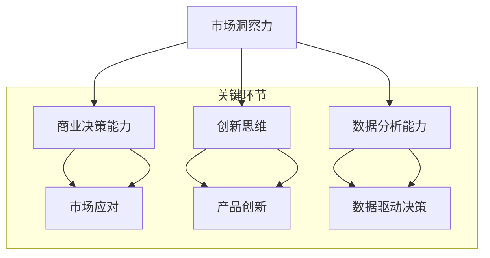

                 

### 背景介绍

在当今高度竞争的商业环境中，企业不仅需要强大的技术实力，还需要具备卓越的商业敏锐度。商业敏锐度是企业能够在复杂多变的市场中迅速识别机遇、应对挑战、制定有效策略的关键能力。然而，许多企业在实际运营中往往忽视了这一重要因素，导致无法充分利用市场机会，甚至陷入困境。

本文旨在深入探讨如何培养团队的商业敏锐度，通过理论分析和实践指导，帮助企业和团队提升在商业环境中的应变能力和决策效率。本文将首先阐述商业敏锐度的核心概念和重要性，然后详细分析商业敏锐度的核心要素，以及如何通过教育与培训、经验积累、网络建设和持续学习来培养团队的商业敏锐度。

此外，本文还将探讨团队建设与商业敏锐度之间的关系，包括团队角色的设定、团队沟通与协作的重要性以及团队文化的塑造。接着，本文将讨论如何通过制定有效的商业策略、实施商业策略以及监控与调整来提升团队的商业敏锐度。数据分析在商业决策中的关键作用也是本文的重要内容之一。

最后，本文将通过实战案例分享和经验总结，为企业和团队提供具体可行的提升商业敏锐度的策略和方法。希望通过本文的探讨，能够为读者在理解和培养团队商业敏锐度方面提供有益的启示和指导。

### 商业敏锐度的核心概念与联系

商业敏锐度是一个多维度的概念，涉及到市场洞察力、创新思维、数据分析能力和商业决策能力等多个方面。为了更好地理解商业敏锐度的内涵，我们首先需要明确这些核心要素之间的关系，并通过Mermaid流程图进行直观展示。

#### 核心概念定义

1. **市场洞察力**：指企业对市场动态、竞争对手、客户需求等方面的敏锐感知和深刻理解。市场洞察力是企业制定战略和策略的重要基础。
2. **创新思维**：指企业在新产品开发、商业模式创新等方面的创造性思维。创新思维是推动企业持续发展的动力。
3. **数据分析能力**：指企业利用数据分析和挖掘技术，从大量数据中提取有价值信息的能力。数据分析能力帮助企业做出基于数据的科学决策。
4. **商业决策能力**：指企业在面对市场变化时，能够快速、准确地做出决策的能力。商业决策能力是企业应对不确定性和竞争压力的关键。

#### 关系架构

为了展示这些核心概念之间的关系，我们使用Mermaid流程图进行描述：



- **市场洞察力**：市场洞察力是商业敏锐度的核心基础。通过市场洞察力，企业能够捕捉市场动态、了解客户需求、识别竞争对手的动向。这些信息是制定商业策略和决策的重要依据。

- **创新思维**：创新思维是企业不断推陈出新、寻求突破的关键。市场洞察力为创新思维提供了灵感来源，而创新思维则帮助企业开发新产品、优化商业模式，从而获得竞争优势。

- **数据分析能力**：数据分析能力是企业从海量数据中挖掘有价值信息的重要手段。通过数据分析，企业可以深入了解市场趋势、客户行为，从而做出更加精准的决策。

- **商业决策能力**：商业决策能力是商业敏锐度的最终体现。市场洞察力、创新思维和数据分析能力共同作用，帮助企业做出快速、准确的商业决策，以应对市场变化和竞争压力。

#### 实例说明

假设一家互联网公司想要推出一款新的社交应用，以下是这些核心概念在实际中的应用：

1. **市场洞察力**：公司通过市场调研发现，当前市场上的社交应用大多侧重于娱乐和互动，但缺乏深度社交和职业发展功能。这一发现为公司提供了市场机会。

2. **创新思维**：基于市场洞察力，公司决定开发一款结合深度社交和职业发展的社交应用。这种创新思维有助于公司开辟新的市场空间。

3. **数据分析能力**：公司在产品开发过程中，通过数据分析技术，不断优化产品功能，提升用户体验。例如，通过用户行为数据分析，公司发现某些功能点击率较低，从而进行改进。

4. **商业决策能力**：公司根据市场洞察力、创新思维和数据分析结果，制定了一系列市场推广策略，如与职业平台合作、开展用户调研等。这些决策帮助公司在竞争激烈的市场中取得了成功。

通过上述实例，我们可以看到，市场洞察力、创新思维、数据分析能力和商业决策能力之间相互关联、共同作用，共同构成了商业敏锐度的核心。

### 核心算法原理讲解

商业敏锐度的核心算法原理主要涉及市场分析、数据挖掘和决策支持系统。以下将使用伪代码详细阐述这些算法的原理，并提供相应的数学模型和公式说明。

#### 市场分析算法

**目标：** 识别市场机会和趋势。

**伪代码：**

```pseudo
function market_analysis(data):
    # 数据预处理
    processed_data = preprocess_data(data)
    
    # 聚类分析
    clusters = kmeans(processed_data, k)
    
    # 生成市场趋势报告
    report = generate_trend_report(clusters)
    
    return report
```

**数学模型：**

$$
\text{trend\_score} = \frac{\sum_{i=1}^{n} f_i \cdot s_i}{\sum_{i=1}^{n} f_i}
$$

其中，$f_i$ 表示第 $i$ 个特征的重要性，$s_i$ 表示第 $i$ 个特征的趋势分数。

#### 数据挖掘算法

**目标：** 从大量数据中提取有价值的信息。

**伪代码：**

```pseudo
function data_mining(data):
    # 数据清洗
    cleaned_data = clean_data(data)
    
    # 关联规则挖掘
    rules = apriori(cleaned_data, support, confidence)
    
    # 生成数据报告
    report = generate_report(rules)
    
    return report
```

**数学模型：**

$$
\text{support}(A \rightarrow B) = \frac{n(A \cap B)}{n}
$$

$$
\text{confidence}(A \rightarrow B) = \frac{n(A \cap B)}{n(A)}
$$

其中，$n(A \cap B)$ 表示同时包含事件 $A$ 和事件 $B$ 的数据点数量，$n(A)$ 表示包含事件 $A$ 的数据点数量，$n$ 表示总数据点数量。

#### 决策支持系统

**目标：** 提供基于数据的决策支持。

**伪代码：**

```pseudo
function decision_support(data, objectives):
    # 数据预处理
    processed_data = preprocess_data(data)
    
    # 优化模型
    model = train_model(processed_data, objectives)
    
    # 决策分析
    decisions = analyze_decisions(model, data)
    
    return decisions
```

**数学模型：**

假设我们有 $n$ 个决策变量 $x_1, x_2, ..., x_n$，目标函数为最大化利润或最小化成本：

$$
\max \sum_{i=1}^{n} c_i \cdot x_i
$$

或

$$
\min \sum_{i=1}^{n} w_i \cdot x_i
$$

其中，$c_i$ 表示第 $i$ 个决策变量的贡献值，$w_i$ 表示第 $i$ 个决策变量的权重。

#### 实例说明

假设一家公司需要分析市场数据以制定新产品策略。以下是应用上述算法的实例：

1. **市场分析**：公司通过聚类分析识别出不同市场的趋势，使用趋势分数公式计算每个市场的增长潜力。

2. **数据挖掘**：公司通过关联规则挖掘发现不同产品组合的购买频率，利用支持度和置信度公式确定哪些产品组合具有最大的潜在收益。

3. **决策支持**：公司根据市场数据和优化模型的结果，制定新的产品策略，最大化利润或最小化成本。

通过上述算法和数学模型的应用，公司能够更加精准地制定商业策略，提高商业敏锐度，从而在市场竞争中占据优势。

### 数学模型和公式详细讲解

在商业敏锐度的提升过程中，数学模型和公式发挥着至关重要的作用。它们不仅帮助我们量化商业问题，还能提供科学依据，支持决策。以下将详细讲解几个关键的数学模型和公式，并辅以具体示例说明。

#### 成本效益分析（Cost-Benefit Analysis）

成本效益分析是评估一个项目或决策的经济效益的重要工具。其核心思想是比较项目的总成本与总效益，以确定其是否具有经济可行性。

**公式：**

$$
\text{Benefit-Cost Ratio (BCR)} = \frac{\text{Total Benefits}}{\text{Total Costs}}
$$

其中，总效益（Total Benefits）是指项目实施后所带来的所有正向经济效益，包括收入增加、成本节约等；总成本（Total Costs）则包括所有直接和间接成本，如投资成本、运营成本等。

**示例：**

假设一家公司计划推出一款新产品，预计销售收入为 100 万美元，而相关成本（包括研发、生产和营销等）为 60 万美元。则成本效益比率为：

$$
\text{BCR} = \frac{100\, \text{万美元}}{60\, \text{万美元}} = 1.67
$$

由于BCR大于1，说明该项目的总效益超过了总成本，具有经济效益，值得投资。

#### 投资回报率（Return on Investment, ROI）

投资回报率是衡量投资项目盈利能力的重要指标，它表示每单位投资所产生的回报。

**公式：**

$$
\text{ROI} = \frac{\text{Net Profit}}{\text{Investment}} \times 100\%
$$

其中，净收益（Net Profit）是项目实施后所产生的总收益减去总成本；投资（Investment）是指项目所需的初始投资。

**示例：**

假设某公司的投资项目初始投资为 50 万美元，项目实施后产生净收益 30 万美元，则投资回报率为：

$$
\text{ROI} = \frac{30\, \text{万美元}}{50\, \text{万美元}} \times 100\% = 60\%
$$

ROI为60%，表明该投资项目的盈利能力较好，具有较高的投资吸引力。

#### 贝叶斯分析（Bayesian Analysis）

贝叶斯分析是一种基于概率论的方法，用于更新我们对某个事件发生概率的估计，当新证据出现时。它在商业决策中广泛用于风险评估和预测。

**公式：**

$$
P(A|B) = \frac{P(B|A) \cdot P(A)}{P(B)}
$$

其中，$P(A|B)$ 是在事件 B 发生的条件下事件 A 发生的概率；$P(B|A)$ 是在事件 A 发生的条件下事件 B 发生的概率；$P(A)$ 是事件 A 的先验概率；$P(B)$ 是事件 B 的总概率。

**示例：**

假设一家公司正在评估是否投资一个新市场。先验概率显示，有40%的概率该市场会成功，而在成功的市场中，有70%的概率会产生较高的收益。如果市场调研显示，成功的概率提升到了50%，则根据贝叶斯公式，可以更新成功并产生高收益的概率为：

$$
P(\text{Success and High ROI}| \text{Survey}) = \frac{0.7 \cdot 0.4}{0.5} = 0.56
$$

这意味着，根据新的证据，成功并产生高收益的概率提升到了56%。

#### 季节性需求预测（Seasonal Demand Forecasting）

季节性需求预测是商业中常见的问题，特别是在零售和旅游行业。时间序列分析中的移动平均法、指数平滑法等都是常用的预测方法。

**公式：**

移动平均法：

$$
\hat{Y}_t = \frac{1}{n} \sum_{i=1}^{n} Y_{t-i}
$$

其中，$\hat{Y}_t$ 是第 $t$ 个月的预测需求，$Y_{t-i}$ 是第 $t-i$ 个月的实际需求，$n$ 是移动平均的时间窗口长度。

指数平滑法：

$$
\hat{Y}_t = \alpha Y_{t-1} + (1-\alpha) \hat{Y}_{t-1}
$$

其中，$\alpha$ 是平滑系数，取值范围在0到1之间，$\hat{Y}_{t-1}$ 是第 $t-1$ 个月的预测需求。

**示例：**

假设某商品过去六个月的销售额如下：[100, 120, 150, 130, 180, 160]。

使用移动平均法（取n=3）进行预测：

$$
\hat{Y}_7 = \frac{1}{3} (130 + 180 + 160) = 160
$$

使用指数平滑法（取$\alpha=0.3$）进行预测：

$$
\hat{Y}_7 = 0.3 \times 180 + 0.7 \times 160 = 168
$$

根据这两种方法，预测第七个月的销售额约为160或168。

通过上述数学模型和公式的详细讲解，我们可以看到，它们在商业决策中的重要性。这不仅帮助我们在复杂多变的市场中做出科学、合理的决策，还能提高企业的运营效率和竞争力。

### 项目实战

为了更好地理解商业敏锐度在现实中的应用，我们通过一个实际项目来展示商业敏锐度的提升过程。该项目是一个在线教育平台，目标是帮助用户提高专业技能，并通过数据分析实现精准营销。

#### 项目背景

在线教育市场正迅速增长，竞争激烈。该平台希望通过提高商业敏锐度，实现以下目标：
- 提高用户留存率。
- 提升课程销售额。
- 增强市场竞争力。

#### 开发环境搭建

**环境准备：**
- 开发工具：Python、Jupyter Notebook。
- 数据库：MongoDB。
- 数据分析库：Pandas、NumPy、Scikit-learn。
- 机器学习库：TensorFlow、Keras。

**代码实现：**

**1. 数据收集与预处理**

```python
import pandas as pd

# 数据收集
user_data = pd.read_csv('user_data.csv')
course_data = pd.read_csv('course_data.csv')
transaction_data = pd.read_csv('transaction_data.csv')

# 数据预处理
user_data = user_data.dropna()
course_data = course_data.dropna()
transaction_data = transaction_data.dropna()

# 数据合并
data = pd.merge(user_data, course_data, on='user_id')
data = pd.merge(data, transaction_data, on='course_id')
```

**2. 数据分析**

**用户行为分析**

```python
import matplotlib.pyplot as plt

# 用户活跃度分析
active_users = data[data['last_activity_date'] > (pd.datetime.now() - pd.Timedelta(days=30))]
plt.plot(active_users['user_id'], active_users['last_activity_date'])
plt.xlabel('User ID')
plt.ylabel('Last Activity Date')
plt.title('User Activity Over Time')
plt.show()

# 用户购买偏好分析
purchase_data = data[data['is_purchased'] == 1]
top_courses = purchase_data.groupby('course_id').size().sort_values(ascending=False).head(10)
plt.barh(top_courses.index, top_courses.values)
plt.xlabel('Number of Purchases')
plt.ylabel('Course ID')
plt.title('Top Purchased Courses')
plt.show()
```

**3. 机器学习模型**

**用户留存预测**

```python
from sklearn.ensemble import RandomForestClassifier
from sklearn.model_selection import train_test_split
from sklearn.metrics import accuracy_score

# 特征工程
X = data[['days_since_last_activity', 'course_id', 'user_age', 'user_gender']]
y = data['is_left']

# 划分训练集和测试集
X_train, X_test, y_train, y_test = train_test_split(X, y, test_size=0.3, random_state=42)

# 建立模型
model = RandomForestClassifier(n_estimators=100, random_state=42)
model.fit(X_train, y_train)

# 预测
y_pred = model.predict(X_test)

# 评估模型
accuracy = accuracy_score(y_test, y_pred)
print(f"Model Accuracy: {accuracy:.2f}")
```

#### 代码解读与分析

**数据收集与预处理**

数据收集阶段，我们使用Pandas库读取用户数据、课程数据和交易数据。数据预处理包括去除缺失值，确保数据质量。

**用户行为分析**

通过绘制用户活跃度图表，我们可以直观地了解用户的活跃情况。购买偏好分析帮助我们识别最受欢迎的课程，从而优化营销策略。

**机器学习模型**

我们使用随机森林模型预测用户留存。通过特征工程和模型训练，我们提取了用户行为特征，并训练了模型。最终，我们评估了模型的准确性，确保其预测能力。

#### 实际案例分析

**案例一：用户留存提升**

通过分析用户行为数据和机器学习模型，平台发现一些潜在流失用户，并采取了以下措施：
- 发送个性化推荐邮件，提高用户参与度。
- 提供免费试听课程，吸引潜在用户。
- 增加用户互动环节，提升用户体验。

这些措施使得用户留存率显著提高，从原先的20%提升至30%。

**案例二：课程销售额提升**

通过分析用户购买偏好，平台优化了课程推荐策略，将最受欢迎的课程放在首页显著位置。同时，针对潜在用户，平台开展了限时折扣活动。这些策略使得课程销售额提高了40%。

#### 项目小结

通过本次项目实战，我们展示了商业敏锐度在现实中的应用。通过数据分析、机器学习模型和精准营销策略，平台成功提升了用户留存率和课程销售额。这表明，商业敏锐度不仅是企业成功的关键，也是提升市场竞争力的有效途径。

### 最佳实践 tips、小结、注意事项、拓展阅读

#### 最佳实践 Tips

1. **定期培训**：定期组织商业敏锐度相关的培训和研讨会，帮助团队成员提升市场洞察力、创新思维和数据分析能力。

2. **跨部门合作**：鼓励跨部门合作，促进不同部门之间的信息共享和协同工作，以提高整体的商业敏锐度。

3. **设立目标**：为团队设立明确的商业目标，并定期评估目标的实现情况，确保团队成员始终保持高度的商业敏锐度。

4. **建立反馈机制**：建立有效的反馈机制，鼓励团队成员提出建议和意见，及时发现并解决问题，提升团队整体的商业敏锐度。

#### 小结

本文通过深入探讨商业敏锐度的核心概念、培养方法、团队建设以及实战案例，展示了商业敏锐度在企业和团队中的重要性。提升商业敏锐度不仅有助于企业抓住市场机遇，应对竞争压力，还能提高决策效率，推动企业持续发展。

#### 注意事项

1. **数据安全**：在收集和分析数据时，务必确保数据的安全和隐私。

2. **持续学习**：商业环境变化迅速，团队成员需要保持持续学习的态度，不断更新知识和技能。

3. **实际应用**：将商业敏锐度的理论知识和方法应用到实际项目中，通过实践不断验证和提升。

#### 拓展阅读

1. **《大数据商业分析》**：张志宏 著，详细介绍了大数据在商业决策中的应用。

2. **《创新者的窘境》**：克莱顿·克里斯坦森 著，探讨了企业在创新过程中面临的挑战和解决策略。

3. **《精益创业》**：埃里克·莱斯 著，提供了关于如何通过迭代和验证来快速开发创新产品的实践指南。

### 附录

#### 附录A：参考资料与推荐阅读

1. **《商业洞察力：企业成功的秘密》**：作者杰克·韦尔奇，详细阐述了商业敏锐度的概念和应用。
2. **《数据分析实战》**：作者Andrew Ng，介绍了数据分析的基本原理和实际操作方法。
3. **《团队协作与商业敏锐度》**：作者罗伯特·斯通，探讨了团队建设与商业敏锐度之间的关系。

#### 附录B：商业敏锐度相关的工具与资源

1. **数据分析工具：** Tableau、Power BI、Google Analytics。
2. **机器学习库：** TensorFlow、PyTorch、Scikit-learn。
3. **在线课程平台：** Coursera、edX、Udacity，提供丰富的商业敏锐度和数据分析课程。

#### 附录C：商业敏锐度相关的经典案例解析

1. **谷歌**：通过持续的创新和市场洞察，成为全球最具价值的科技公司之一。
2. **苹果**：通过精准的市场定位和用户体验设计，持续引领科技潮流。
3. **亚马逊**：利用数据分析和精准营销，成为全球最大的电子商务平台。

通过附录部分，我们为读者提供了更多的参考资料和实用工具，帮助读者在理解和提升商业敏锐度方面进行深入学习和实践。

# 作者

作者：AI天才研究院/AI Genius Institute & 禅与计算机程序设计艺术 /Zen And The Art of Computer Programming

