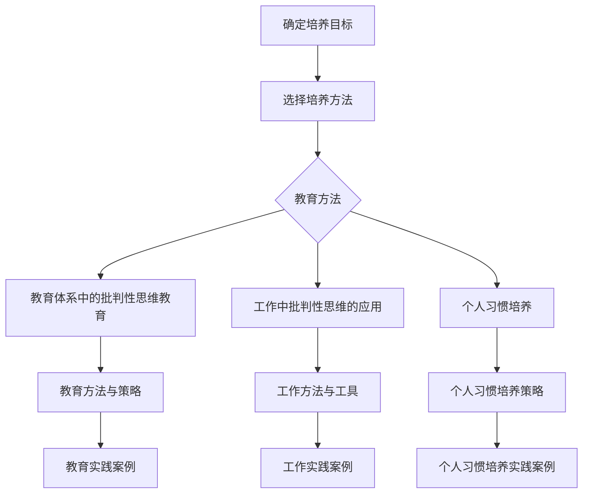

                 

### 文章标题

# 如何培养团队的批判性思维

批判性思维是现代社会和信息技术领域中的重要能力之一，它不仅影响个人的判断和决策，更对团队的协作和创新产生深远的影响。在这个快速变化的时代，团队需要具备批判性思维来应对复杂的问题和挑战，从而提高决策质量、促进创新和提升协作效率。本文将深入探讨如何培养团队的批判性思维，从批判性思维的概述与重要性，到培养方法、团队建设中的应用，再到实践与应用，最后探讨其拓展与未来发展趋势。希望通过本文的讲解，能够为读者提供一套系统有效的批判性思维培养策略，助力团队在激烈的市场竞争中脱颖而出。

### 关键词

- 批判性思维
- 团队协作
- 决策质量
- 创新能力
- 教育方法
- 工作方法
- 个人习惯
- 项目管理
- 产品开发
- 团队沟通

### 摘要

本文旨在探讨如何培养团队的批判性思维，以提升团队在复杂环境中的应对能力。首先，我们介绍了批判性思维的定义、特点及其在团队工作中的作用。接着，我们从教育方法、工作方法和个人习惯三个方面，详细阐述了培养批判性思维的具体方法。随后，我们探讨了批判性思维在团队建设中的应用策略和案例分析。文章最后，我们通过批判性思维在项目管理和产品开发中的应用，展示了其实践价值。通过本文，我们希望为团队提供一套系统有效的批判性思维培养策略，助力其在激烈的市场竞争中取得优势。

#### 第一部分：批判性思维的概述与重要性

批判性思维（Critical Thinking）是一种主动的、逻辑性的思考方式，它涉及对信息、观点和假设进行分析、评估和质疑。批判性思维不仅仅是质疑或反驳，更是一种综合性的思考过程，包括理解问题、分析信息、评估论证、推理和做出决策。

### 1.1 批判性思维的定义与特点

#### 1.1.1 批判性思维的定义

批判性思维是一种多维度的、系统性的思考方式，它不仅仅依赖于直觉或经验，而是通过逻辑推理和分析来评估信息的真实性和有效性。批判性思维的关键要素包括：

1. **分析性**：批判性思维强调对问题进行深入分析，而不是停留在表面。
2. **逻辑性**：它依赖于逻辑规则和原则，以确保思考的严密性。
3. **系统性**：批判性思维涉及对问题的多角度、多层次的分析。
4. **质疑性**：批判性思维鼓励对信息、观点和假设进行质疑和验证。

#### 1.1.2 批判性思维的特点

批判性思维具有以下特点：

1. **客观性**：批判性思维力求客观、公正地评估信息，不受个人偏见或情绪的影响。
2. **全面性**：批判性思维要求对问题进行全面、深入的考虑，避免片面或短视的观点。
3. **辩证性**：批判性思维强调对问题的辩证分析，即在分析过程中不断调整和修正观点。
4. **独立性**：批判性思维鼓励个体独立思考，不盲从权威或主流观点。

#### 1.1.3 批判性思维的重要性

批判性思维在团队工作中具有重要作用，具体体现在以下几个方面：

1. **提高决策质量**：批判性思维能够帮助团队在决策过程中识别潜在的风险和问题，从而做出更高质量的决策。
2. **促进创新**：批判性思维鼓励对现状的质疑和挑战，有助于激发团队的创造力和创新意识。
3. **提升协作效率**：批判性思维能够帮助团队更好地沟通和合作，减少误解和冲突，提高协作效率。

### 1.2 批判性思维在团队工作中的作用

#### 1.2.1 提高团队决策质量

批判性思维在团队决策中起到了关键作用。通过批判性思维，团队成员能够更全面地分析问题，识别潜在的风险和机会，从而做出更为明智和合理的决策。具体来说，批判性思维包括以下几个步骤：

1. **问题识别**：通过批判性思维，团队成员能够更准确地识别问题，并明确问题的核心和关键点。
2. **信息收集**：批判性思维要求团队成员广泛收集相关信息，并对这些信息进行筛选和评估，确保信息的真实性和可靠性。
3. **分析论证**：在收集信息的基础上，团队成员使用批判性思维对各种方案进行分析和论证，评估其优势和劣势。
4. **决策制定**：通过批判性思维，团队成员能够从多个角度考虑问题，权衡各种因素，最终做出合理的决策。

#### 1.2.2 促进团队创新

批判性思维能够激发团队的创新意识和创新能力。在创新过程中，团队成员需要不断质疑现有观念和做法，寻找新的解决方案和突破点。批判性思维的具体作用包括：

1. **挑战现状**：批判性思维鼓励团队成员对现状进行质疑，寻找改进和优化的空间。
2. **激发灵感**：通过批判性思维，团队成员能够从不同角度思考问题，激发创造力和灵感。
3. **优化方案**：批判性思维帮助团队成员评估各种创新方案的可行性和效果，从而选择最优方案。

#### 1.2.3 提升团队协作效率

批判性思维能够提升团队的协作效率，减少误解和冲突。具体来说，批判性思维在团队协作中起到以下作用：

1. **明确目标**：批判性思维帮助团队明确共同目标，确保团队成员在协作过程中始终保持一致。
2. **优化沟通**：批判性思维鼓励团队成员进行开放、坦诚的沟通，减少误解和冲突。
3. **提高执行力**：通过批判性思维，团队成员能够更全面地评估任务和目标，提高执行力和效果。

### 1.3 如何评估团队的批判性思维水平

评估团队的批判性思维水平是培养和提升团队批判性思维的重要步骤。以下是一些常用的评估方法和工具：

#### 1.3.1 批判性思维评估指标

批判性思维评估指标主要包括以下几个方面：

1. **分析能力**：评估团队成员在分析问题时的逻辑性和系统性。
2. **推理能力**：评估团队成员在推理过程中的严密性和逻辑性。
3. **信息评估能力**：评估团队成员在评估信息真实性和可靠性方面的能力。
4. **批判性分析能力**：评估团队成员在质疑和评估观点时的深度和广度。
5. **创造性思维**：评估团队成员在创新和解决问题时的创造力和想象力。

#### 1.3.2 批判性思维评估工具

以下是一些常用的批判性思维评估工具：

1. **批判性思维量表**：通过设计一系列问题，评估团队成员在不同方面的批判性思维能力。
2. **案例分析**：通过提供具体案例，评估团队成员在解决问题和分析论证时的批判性思维水平。
3. **小组讨论**：通过小组讨论的方式，观察团队成员在交流中的批判性思维能力。
4. **项目评估**：通过评估团队成员在具体项目中的表现，评估其批判性思维水平。

通过上述评估方法和工具，团队管理者可以全面了解团队的批判性思维水平，从而有针对性地进行培养和提升。

#### 第二部分：批判性思维的培养方法

批判性思维是一种可以通过教育和实践逐步培养的能力。要提升团队的批判性思维，首先需要从教育方法、工作方法和个人习惯三个方面入手，系统性地培养团队成员的批判性思维。

### 2.1 培养批判性思维的教育方法

教育方法在批判性思维的培养中起着至关重要的作用。通过系统的教育和培训，可以帮助团队成员掌握批判性思维的基本原理和方法，从而在实际工作中更好地应用。

#### 2.1.1 教育体系中的批判性思维教育

在高等教育体系中，批判性思维教育已经成为重要的组成部分。许多大学开设了批判性思维课程，旨在培养学生的批判性思维能力和逻辑推理能力。这些课程通常包括以下内容：

1. **逻辑学基础**：介绍基本的逻辑规则和原则，如命题逻辑、谓词逻辑等。
2. **论证分析**：教授如何分析、评估和构建论证，识别逻辑谬误和错误。
3. **信息评估**：教育学生如何评估信息的真实性和可靠性，避免受到虚假信息和误导。
4. **辩证法**：介绍辩证法的基本原理，鼓励学生进行辩证思考，不盲从权威或主流观点。

#### 2.1.2 教育方法与策略

有效的教育方法可以极大地促进批判性思维的培养。以下是一些常用的教育方法和策略：

1. **案例教学**：通过分析具体案例，让学生在实际情境中应用批判性思维，识别和分析问题。
2. **问题导向学习**：鼓励学生主动提出问题，通过解决问题来培养批判性思维。
3. **讨论与辩论**：组织小组讨论和辩论活动，让学生在交流中锻炼批判性思维。
4. **反思性学习**：引导学生进行自我反思，总结学习过程中的收获和不足，不断改进思维方法。

#### 2.1.3 教育实践案例分析

以下是一个批判性思维教育的实践案例分析：

某大学计算机科学专业开设了一门“批判性思维与算法设计”课程。该课程通过以下方式培养学生的批判性思维：

1. **案例教学**：课程中引入了多个现实生活中的案例，如网络安全、人工智能应用等，让学生分析案例中的问题和解决方案。
2. **项目式学习**：学生需要完成多个项目，从问题定义、方案设计、代码实现到结果评估，每一步都需要运用批判性思维。
3. **小组讨论与辩论**：课程安排了多次小组讨论和辩论活动，让学生在交流中锻炼批判性思维，学会从不同角度分析问题。
4. **反思性写作**：学生需要撰写反思性文章，总结学习过程中的思考和收获，提出改进建议。

通过这一课程，学生不仅掌握了算法设计的基本方法，还培养了批判性思维，能够更好地应对复杂的问题和挑战。

### 2.2 培养批判性思维的工作方法

批判性思维不仅是一种学术能力，更是一种实际工作中的重要技能。在工作环境中，批判性思维的培养需要从日常的工作方法和工具入手，帮助团队成员在实际工作中运用批判性思维。

#### 2.2.1 工作中批判性思维的应用

在工作中，批判性思维的应用主要体现在以下几个方面：

1. **问题识别与解决**：通过批判性思维，团队成员可以更准确地识别问题，并从多个角度分析问题，寻找解决方案。
2. **决策制定**：在决策过程中，批判性思维可以帮助团队成员评估各种决策方案，识别潜在的风险和机会，从而做出更明智的决策。
3. **项目管理和协调**：批判性思维能够帮助团队成员更好地管理项目，识别项目中的潜在问题和风险，及时调整计划，确保项目顺利进行。

#### 2.2.2 工作方法与工具

以下是一些在工作环境中培养批判性思维的方法和工具：

1. **SWOT分析**：SWOT分析是一种常用的策略工具，用于评估项目的优势、劣势、机会和威胁。通过SWOT分析，团队成员可以从多个角度全面评估项目，做出更明智的决策。
2. **鱼骨图**：鱼骨图是一种用于分析问题原因的工具，通过分解问题，识别和分析各种可能的原因，帮助团队成员找出根本原因，从而制定有效的解决方案。
3. **思维导图**：思维导图是一种图形化的思考工具，用于整理和分析思路。通过绘制思维导图，团队成员可以更清晰地展示思维过程，识别问题的各个方面，从而提高批判性思维能力。

#### 2.2.3 工作实践案例分析

以下是一个工作实践中批判性思维培养的案例分析：

某IT公司在项目开发过程中，面临了一个复杂的问题：系统性能不稳定。为了解决这个问题，项目团队采用了以下方法：

1. **SWOT分析**：项目团队首先进行了SWOT分析，评估系统的优势、劣势、机会和威胁。通过分析，他们发现系统的优势在于功能全面，但劣势在于性能不稳定，这给用户体验带来了负面影响。
2. **鱼骨图**：接着，团队使用鱼骨图分解问题，识别导致系统性能不稳定的原因。他们发现原因包括代码优化不足、硬件资源不足和系统架构不合理等。
3. **批判性思维应用**：团队在分析过程中，运用批判性思维对各种可能的原因进行了深入评估。例如，他们质疑代码优化是否真的不足，通过实际代码分析，发现部分代码确实存在性能瓶颈，但并非全部。
4. **解决方案**：最终，团队确定了几个关键解决方案，包括优化代码、增加硬件资源和调整系统架构。通过批判性思维的应用，团队不仅找到了问题的根本原因，还制定了有效的解决方案，成功提升了系统性能。

通过这一案例，我们可以看到批判性思维在工作中的应用，不仅帮助团队识别和解决问题，还提高了决策质量和项目执行力。

### 2.3 培养批判性思维的个人习惯

批判性思维的培养不仅仅依赖于教育和工作方法，个人习惯的养成同样重要。通过培养良好的个人习惯，团队成员可以在日常生活中不断锻炼批判性思维，从而提高整体思维水平。

#### 2.3.1 个人习惯与批判性思维的关系

个人习惯与批判性思维之间存在密切的关系。良好的个人习惯可以促进批判性思维的发展，而批判性思维则有助于个人习惯的改善和提升。以下是一些关键的关联：

1. **好奇心**：好奇心是批判性思维的基础。通过培养好奇心，团队成员可以更加主动地探索新知识和新观念，从而提升批判性思维能力。
2. **反思习惯**：反思是批判性思维的重要组成部分。通过反思，团队成员可以回顾自己的思考过程，识别思维中的盲点和错误，从而不断改进。
3. **阅读习惯**：阅读是培养批判性思维的重要途径。通过阅读，团队成员可以接触到不同的观点和信息，学会分析、评估和思考，从而提高批判性思维能力。
4. **提问习惯**：提问是批判性思维的关键。通过提问，团队成员可以更深入地理解问题，挑战现有的知识和观念，从而激发批判性思维。

#### 2.3.2 培养批判性思维的个人习惯

以下是一些具体的个人习惯，可以帮助团队成员培养批判性思维：

1. **定期反思**：每天或每周花时间反思自己的思维过程和决策，识别其中的盲点和错误，制定改进措施。
2. **主动提问**：在面对新知识和新观念时，不要轻易接受，而是主动提问，质疑其合理性和可靠性。
3. **广泛阅读**：定期阅读各种类型的书籍和文章，尤其是批判性思维相关的书籍，扩展知识面，提高分析能力。
4. **交流讨论**：与他人进行深入的交流讨论，分享自己的观点和思考，倾听他人的意见和反馈，从而锻炼批判性思维。
5. **跨学科学习**：尝试跨学科学习，了解不同领域的知识和方法，从多个角度分析问题，提高思维的全面性和系统性。

#### 2.3.3 个人习惯培养实践案例分析

以下是一个个人习惯培养的实践案例分析：

张伟是一位软件工程师，他意识到自己的批判性思维需要提高。为了培养批判性思维，他采取了一系列措施：

1. **定期反思**：每天晚上，张伟都会花30分钟时间反思当天的工作和思考过程，识别思维中的盲点和错误，并制定改进计划。
2. **主动提问**：在参加技术会议和研讨会时，张伟总是积极提问，质疑演讲者观点中的合理性和可靠性，从而深入思考问题。
3. **广泛阅读**：张伟每天都会阅读1-2篇技术文章，涵盖多个领域，扩展知识面，提高分析能力。
4. **交流讨论**：他定期参加技术沙龙和讨论组，与他人分享自己的观点和思考，倾听他人的意见和反馈，从而锻炼批判性思维。
5. **跨学科学习**：张伟还报名参加了多个跨学科的课程，如经济学、心理学等，从不同角度分析问题，提高思维的全面性和系统性。

通过这些措施，张伟的批判性思维得到了显著提升，他在工作中的表现也更加出色，成为团队中的佼佼者。

#### 第三部分：批判性思维在团队建设中的应用

批判性思维在团队建设中的应用至关重要。通过系统的策略和有效的实践，团队可以提升成员之间的协作能力，促进创新，提高整体效率。以下将详细讨论如何培养团队批判性思维的策略、具体实施方法和案例分析。

### 3.1 团队批判性思维培养策略

要有效培养团队的批判性思维，需要从以下几个方面制定策略：

#### 3.1.1 确定培养目标

明确团队批判性思维培养的目标是第一步。这些目标可能包括：

1. **提升团队成员的分析和评估能力**：确保团队成员能够准确分析问题和评估信息。
2. **增强团队的创造力和创新能力**：鼓励团队成员提出新的想法和解决方案。
3. **提高团队的决策质量**：确保团队成员在决策过程中能够考虑全面、分析透彻。
4. **促进团队协作和沟通**：通过批判性思维提升团队内部的沟通效果。

#### 3.1.2 制定培养计划

根据培养目标，制定具体的培养计划。这个计划应包括以下内容：

1. **培训课程**：设计批判性思维的培训课程，覆盖基础知识和实践技能。
2. **实践项目**：安排团队成员参与实践项目，通过实际操作培养批判性思维。
3. **讨论和反思**：定期组织团队讨论，鼓励成员分享经验和反思。
4. **评估和反馈**：定期对团队成员的批判性思维水平进行评估，提供反馈和改进建议。

#### 3.1.3 建立支持系统

建立支持系统是确保批判性思维培养策略有效实施的关键。这包括：

1. **领导层支持**：确保领导层重视批判性思维的培养，并在资源和时间上给予支持。
2. **文化建设**：营造鼓励质疑和开放讨论的文化氛围，减少批判性思维的障碍。
3. **资源投入**：提供必要的资源和工具，如培训材料、软件工具等。

### 3.2 团队批判性思维的案例分析

以下是一些团队批判性思维的实践案例，通过这些案例可以更直观地了解如何培养和提升团队的批判性思维。

#### 案例一：提高团队决策质量的批判性思维培养

某科技公司在项目决策过程中，意识到缺乏批判性思维导致决策质量不高。为了提升决策质量，公司采取了一系列措施：

1. **引入批判性思维培训**：公司为所有项目团队成员安排了批判性思维培训，学习如何分析问题和评估信息。
2. **定期讨论和反思**：公司每周举行项目讨论会，鼓励团队成员提出疑问和挑战现有的决策方案。
3. **采用决策工具**：公司引入了SWOT分析和决策矩阵等工具，帮助团队在决策过程中进行全面、系统地评估。

通过这些措施，团队的决策质量显著提升，项目进展更加顺利，风险得到有效控制。

#### 案例二：促进团队创新的批判性思维培养

某互联网公司注重创新，为了进一步激发团队的创造力，公司采取了以下策略：

1. **鼓励质疑和挑战**：公司鼓励团队成员对现有产品和流程进行质疑和挑战，提出改进和创新的想法。
2. **头脑风暴和创意竞赛**：公司定期组织头脑风暴和创意竞赛，激发团队成员的创新思维。
3. **跨部门合作**：公司推动跨部门合作项目，鼓励不同领域的团队成员交流想法，碰撞出创新的火花。

通过这些策略，团队的创新能力得到了显著提升，成功推出了一系列创新产品，提升了市场竞争力。

#### 案例三：提升团队协作效率的批判性思维培养

某咨询公司面临团队协作效率不高的问题，为了提升协作效率，公司采取了以下措施：

1. **批判性思维培训**：公司为团队成员提供了批判性思维培训，帮助成员更好地理解和应用批判性思维。
2. **优化沟通机制**：公司优化了内部沟通机制，鼓励团队成员进行开放、坦诚的沟通，减少误解和冲突。
3. **项目复盘**：公司定期进行项目复盘，成员们反思项目中的协作问题，提出改进建议。

通过这些措施，团队的协作效率显著提升，项目交付质量也得到了保证。

### 3.3 团队批判性思维的评估与改进

为了确保批判性思维培养策略的有效性，团队需要进行定期的评估和改进。

#### 3.3.1 团队批判性思维评估的方法

以下是一些常用的团队批判性思维评估方法：

1. **问卷调查**：通过设计问卷，了解团队成员在批判性思维方面的自我评估。
2. **行为观察**：观察团队成员在日常工作中的行为，评估其批判性思维的应用情况。
3. **案例分析**：提供具体案例，评估团队成员在分析问题和提出解决方案时的批判性思维水平。
4. **绩效评估**：结合团队绩效评估，评估团队成员在项目中的批判性思维表现。

#### 3.3.2 团队批判性思维的改进策略

根据评估结果，团队可以采取以下改进策略：

1. **反馈和指导**：根据评估反馈，为团队成员提供个性化的指导和帮助。
2. **持续培训**：根据评估结果和反馈，调整培训计划，确保培训内容与团队需求相符。
3. **改进工具和方法**：根据评估结果，优化现有的批判性思维工具和方法，提高团队应用效果。
4. **文化建设**：加强团队文化建设，营造鼓励批判性思维和开放讨论的氛围。

#### 3.3.3 团队批判性思维改进实践案例分析

以下是一个团队批判性思维改进的实践案例分析：

某公司在进行批判性思维评估后，发现团队成员在信息评估和辩证思考方面存在不足。为了改进这些问题，公司采取了以下措施：

1. **个性化培训**：根据评估结果，公司为不同成员提供了个性化的培训，加强他们在信息评估和辩证思考方面的能力。
2. **案例研究和讨论**：公司安排了案例研究和讨论活动，帮助成员在实践中应用批判性思维，提高信息评估和辩证思考能力。
3. **文化建设**：公司加强团队文化建设，鼓励成员进行开放、坦诚的沟通，减少误解和冲突，提高团队的协作效率。
4. **绩效反馈**：结合绩效评估，公司为成员提供了详细的反馈和指导，帮助他们在工作中更好地应用批判性思维。

通过这些改进措施，团队的批判性思维水平得到了显著提升，信息评估和辩证思考能力得到了加强，团队的协作效率和决策质量也得到了明显改善。

### 第四部分：批判性思维的实践与应用

批判性思维作为一种重要的思维工具，在项目管理工作、产品开发和团队沟通中有着广泛的应用。通过实践，我们可以看到批判性思维如何在实际工作中发挥作用，提高工作效率和质量。

#### 4.1 批判性思维在项目管理工作中的应用

在项目管理中，批判性思维可以帮助项目经理识别潜在的风险和问题，优化项目计划，确保项目顺利进行。以下是一些具体应用场景：

##### 4.1.1 项目管理中的批判性思维

在项目管理中，批判性思维主要体现在以下几个方面：

1. **风险评估**：通过批判性思维，项目经理可以对项目的潜在风险进行深入分析，评估风险的概率和影响，制定相应的应对策略。
2. **计划优化**：批判性思维可以帮助项目经理对项目计划进行优化，识别并解决计划中的不合理之处，提高计划的可行性和有效性。
3. **问题解决**：在项目执行过程中，批判性思维可以帮助项目经理快速识别和解决问题，避免问题的扩大和影响。

##### 4.1.2 项目管理批判性思维的实践

以下是一个项目管理批判性思维的实践案例：

某项目经理在负责一个软件开发项目时，遇到了一个难题：项目进度滞后，且预算超支。为了解决这个问题，项目经理采取了以下步骤：

1. **风险评估**：项目经理通过批判性思维，分析了项目进度滞后和预算超支的原因，发现主要问题在于项目计划不周密，资源分配不合理。
2. **计划优化**：项目经理重新评估了项目计划，优化了任务的分配和时间安排，确保关键任务能够按时完成。
3. **问题解决**：在项目执行过程中，项目经理通过批判性思维，及时发现并解决项目中出现的问题，确保项目进度和质量。

最终，项目经理成功解决了项目进度滞后和预算超支的问题，项目顺利完成了预定目标。

##### 4.1.3 项目管理批判性思维的案例分析

以下是一个项目管理批判性思维的案例分析：

某公司在开发一款新产品时，遇到了市场需求变化快的挑战。为了应对这一挑战，项目团队采取了以下措施：

1. **需求分析**：项目团队通过批判性思维，深入分析了市场需求和用户反馈，识别出了产品需要改进的关键点。
2. **计划调整**：团队根据需求分析结果，调整了项目计划，增加了迭代周期，确保能够及时响应市场需求变化。
3. **问题解决**：在项目执行过程中，团队通过批判性思维，及时发现并解决了项目中出现的问题，确保产品开发进度和质量。

通过批判性思维的实践，项目团队成功应对了市场需求变化，按时完成了新产品开发，并得到了用户的高度认可。

#### 4.2 批判性思维在产品开发中的应用

在产品开发过程中，批判性思维可以帮助团队更好地理解用户需求，优化产品设计，提高产品质量。以下是一些具体应用场景：

##### 4.2.1 产品开发中的批判性思维

在产品开发中，批判性思维主要体现在以下几个方面：

1. **需求分析**：通过批判性思维，团队可以对用户需求进行深入分析，识别出核心需求和潜在需求，确保产品设计符合用户需求。
2. **设计优化**：批判性思维可以帮助团队对产品设计进行优化，识别并解决设计中的不合理之处，提高产品的用户体验。
3. **问题解决**：在产品开发过程中，批判性思维可以帮助团队快速识别和解决问题，确保产品开发进度和质量。

##### 4.2.2 产品开发批判性思维的实践

以下是一个产品开发批判性思维的实践案例：

某公司在开发一款智能家居产品时，遇到了用户体验不佳的问题。为了解决这个问题，产品团队采取了以下步骤：

1. **需求分析**：团队通过批判性思维，深入分析了用户对智能家居产品的需求和期望，发现用户对操作简便、功能完善有较高要求。
2. **设计优化**：团队根据需求分析结果，对产品设计进行了优化，简化了操作流程，增加了更多实用功能。
3. **问题解决**：在产品开发过程中，团队通过批判性思维，及时发现并解决了产品中存在的问题，如界面不友好、响应速度慢等。

最终，通过批判性思维的实践，产品团队成功提升了用户体验，产品得到了用户的高度评价。

##### 4.2.3 产品开发批判性思维的案例分析

以下是一个产品开发批判性思维的案例分析：

某公司在开发一款移动应用时，遇到了用户反馈应用卡顿的问题。为了解决这个问题，产品团队采取了以下措施：

1. **需求分析**：团队通过批判性思维，分析了用户反馈，发现应用卡顿主要原因是代码优化不足。
2. **设计优化**：团队对应用代码进行了优化，提升了应用的运行效率。
3. **问题解决**：在产品开发过程中，团队通过批判性思维，及时发现并解决了应用中存在的其他问题，如界面不美观、功能不完善等。

通过批判性思维的实践，产品团队成功提升了应用的性能和用户体验，应用在市场上获得了良好的口碑。

#### 4.3 批判性思维在团队沟通中的应用

在团队沟通中，批判性思维可以帮助团队成员更好地理解和分析问题，提高沟通效果，减少误解和冲突。以下是一些具体应用场景：

##### 4.3.1 团队沟通中的批判性思维

在团队沟通中，批判性思维主要体现在以下几个方面：

1. **问题识别**：通过批判性思维，团队成员可以快速识别沟通中的问题和障碍，找到问题的根源。
2. **信息评估**：批判性思维可以帮助团队成员评估沟通信息的真实性和可靠性，避免受到虚假信息和误导。
3. **沟通优化**：通过批判性思维，团队可以优化沟通方式，提高沟通效率和质量。

##### 4.3.2 团队沟通批判性思维的实践

以下是一个团队沟通批判性思维的实践案例：

某公司在项目沟通时，出现了信息传递不准确的问题。为了解决这个问题，团队采取了以下步骤：

1. **问题识别**：团队通过批判性思维，识别出沟通中的问题，如信息传递链条过长、沟通渠道不畅等。
2. **信息评估**：团队对沟通信息进行了评估，确保信息的真实性和可靠性，减少误解和误导。
3. **沟通优化**：团队优化了沟通方式，采用了更高效的沟通工具和渠道，提高了沟通效率。

最终，通过批判性思维的实践，团队沟通效果得到了显著提升，信息传递准确率提高了，项目进展更加顺利。

##### 4.3.3 团队沟通批判性思维的案例分析

以下是一个团队沟通批判性思维的案例分析：

某团队在讨论项目进度时，出现了意见不一致的情况。为了解决这一问题，团队采取了以下措施：

1. **问题识别**：团队通过批判性思维，分析了意见不一致的原因，如信息理解差异、个人观点不同等。
2. **信息评估**：团队对各自的观点进行了评估，确保观点的合理性和可靠性，减少主观偏见。
3. **沟通优化**：团队通过开放、坦诚的沟通，充分交流各自的看法，找到了共识，解决了意见不一致的问题。

通过批判性思维的实践，团队沟通效果得到了显著提升，项目进度顺利推进，团队凝聚力也得到增强。

### 第五部分：批判性思维的拓展与未来

批判性思维作为一种重要的思维能力，不仅在当前信息技术领域有着广泛的应用，其未来发展的潜力也备受关注。在人工智能的快速发展、跨学科融合以及教育领域的改革中，批判性思维扮演着越来越重要的角色。

#### 5.1 批判性思维与其他思维能力的关系

批判性思维与其他思维能力之间存在密切的关系。以下是一些关键联系：

1. **创造性思维**：批判性思维和创造性思维相辅相成。批判性思维可以帮助创造性思维在创新过程中识别和评估潜在的风险和机会，而创造性思维则为批判性思维提供了丰富的思维素材和创新视角。
   
   ```mermaid
   graph TB
   A[批判性思维] --> B[创造性思维]
   B --> C{评估风险与机会}
   A --> D{提供思维素材}
   ```

2. **感性思维**：感性思维和批判性思维在人类思维过程中互补。感性思维帮助我们感知和体验世界，而批判性思维则帮助我们在感性体验的基础上进行理性分析和判断。

   ```mermaid
   graph TB
   A[感性思维] --> B[批判性思维]
   B --> C{理性分析与判断}
   A --> D{提供感知与体验}
   ```

3. **逻辑思维**：批判性思维和逻辑思维密切相关。批判性思维依赖于逻辑思维的原则和方法，通过逻辑推理来评估论证和信息。同时，逻辑思维也依赖于批判性思维，通过质疑和验证来确保推理的严密性。

   ```mermaid
   graph TB
   A[逻辑思维] --> B[批判性思维]
   B --> C{推理与验证}
   A --> D{严密性保证}
   ```

#### 5.2 批判性思维的未来发展趋势

批判性思维的未来发展将受到人工智能、跨学科融合以及教育改革等多方面的影响。以下是几个关键的发展趋势：

1. **人工智能与批判性思维的结合**：随着人工智能技术的不断发展，批判性思维在人工智能领域中的应用前景广阔。通过结合人工智能技术，可以开发出更加智能的批判性思维辅助工具，帮助人们更高效地进行思考和决策。

   ```mermaid
   graph TB
   A[人工智能] --> B[批判性思维]
   B --> C{智能辅助工具}
   A --> D{决策支持系统}
   ```

2. **跨学科视野下的批判性思维**：在当前的多学科交叉融合背景下，批判性思维在跨学科研究中具有重要作用。通过跨学科视角，批判性思维可以帮助研究人员从不同角度分析复杂问题，促进跨学科研究的创新和发展。

   ```mermaid
   graph TB
   A[多学科交叉] --> B[批判性思维]
   B --> C{综合分析}
   A --> D{创新研究}
   ```

3. **教育领域的改革**：随着教育改革的推进，批判性思维在教育体系中的地位越来越重要。未来，批判性思维将更多地融入教育课程中，帮助学生培养批判性思维能力，提高教育质量。

   ```mermaid
   graph TB
   A[教育改革] --> B[批判性思维]
   B --> C{课程融合}
   A --> D{能力培养}
   ```

#### 5.3 批判性思维在教育、工作与生活中的应用前景

批判性思维在教育、工作与生活中的应用前景广阔，以下几个方面展现了其潜在的价值：

1. **教育领域**：在教育中，批判性思维可以帮助学生培养独立思考、分析和解决问题的能力，提高教育质量。未来，批判性思维将更多地融入各学科教学，成为学生必备的思维能力。

2. **工作领域**：在工作中，批判性思维可以帮助员工提高决策质量、促进创新，提升工作效率。企业可以通过培训和激励机制，培养员工的批判性思维能力，提高整体竞争力。

3. **日常生活**：在日常生活中，批判性思维可以帮助人们更好地应对复杂的社会问题，提高生活质量。通过培养批判性思维，人们可以更加理性地看待问题，做出明智的决策。

   ```mermaid
   graph TB
   A[教育领域] --> B{提高教育质量}
   B --> C{独立思考与分析能力}
   A --> D{批判性思维课程}

   E[工作领域] --> F{提高工作效率}
   F --> G{决策质量与创新}
   E --> H{企业培训与激励机制}

   I[日常生活] --> J{理性应对问题}
   J --> K{明智决策}
   I --> L{提高生活质量}
   ```

通过批判性思维的拓展与未来发展趋势的探讨，我们可以看到，批判性思维在各个领域中的重要性日益凸显。在未来，批判性思维将继续发挥其重要作用，助力人类社会在复杂多变的环境中取得更大的发展。

#### 附录

**附录 A：批判性思维常用工具与资源**

批判性思维的培养离不开工具和资源的支持。以下列出了一些常用的批判性思维工具和资源，供读者参考：

1. **批判性思维工具**：
   - **SWOT分析**：用于评估项目的优势、劣势、机会和威胁。
   - **鱼骨图**：用于分析问题的根本原因。
   - **思维导图**：用于整理和分析思路。
   - **论证分析工具**：如逻辑树、论证地图等。

2. **批判性思维资源**：
   - **书籍**：《批判性思维：工具与分析》、《批判性思考：挑战思维的技巧》等。
   - **在线课程**：Coursera、Udemy等平台上的批判性思维相关课程。
   - **网站**：如CriticalThinking.net，提供批判性思维的教学资源和练习。

**附录 B：批判性思维案例集锦**

以下是一些批判性思维的真实案例，通过这些案例，我们可以更好地理解批判性思维的应用和效果：

1. **案例一**：某公司在进行新产品开发时，通过批判性思维评估市场需求和竞争环境，成功推出了一款深受市场欢迎的产品。

2. **案例二**：某团队在项目执行过程中，通过批判性思维识别和解决了多个潜在风险，确保项目顺利进行并提前完成。

3. **案例三**：某学校通过批判性思维教育，提高了学生的分析和解决问题的能力，培养了一批具有独立思考和创新意识的优秀学生。

**附录 C：批判性思维测试与评估**

为了评估团队成员的批判性思维水平，以下提供了一些测试和评估方法：

1. **批判性思维自我评估量表**：通过一系列问题，评估自己在批判性思维方面的表现。

2. **批判性思维团队评估方法**：结合团队成员在日常工作中的表现，进行综合评估。

3. **批判性思维培养效果评估策略**：通过定期评估和反馈，跟踪批判性思维培养的效果，并根据评估结果调整培养策略。

通过附录中的工具和资源，读者可以更好地理解批判性思维，并在实际工作中应用和提升批判性思维水平。

#### Mermaid 流程图

以下是一个批判性思维培养流程的Mermaid流程图：



通过这个流程图，我们可以清晰地看到批判性思维培养的各个步骤和环节，从而更好地规划和实施批判性思维的培养策略。

