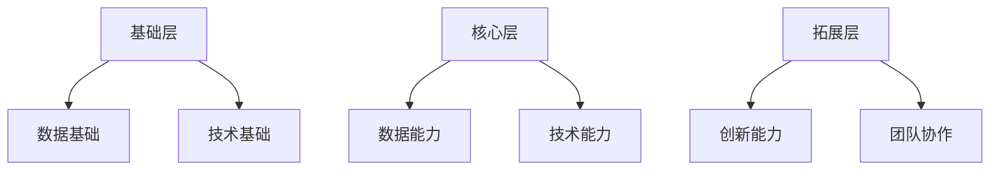
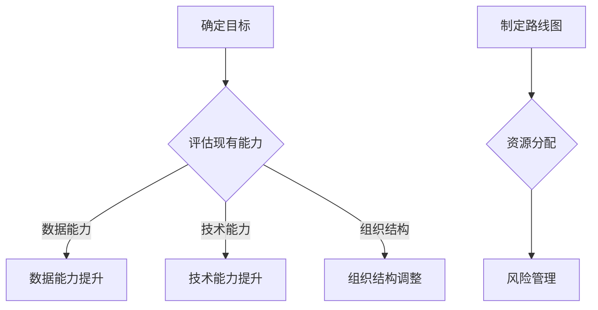

                 

### 文章标题：如何培养团队的数字化能力

> 关键词：数字化能力、团队建设、数字化转型、数据分析、技术能力、创新能力

> 摘要：本文将深入探讨如何培养团队的数字化能力，分析数字化能力在企业中的重要性和对个人职业发展的积极作用。通过阐述数字化能力的核心要素，构建数字化能力模型，并提供详细的培养方法和实践策略，帮助团队在数字化时代中脱颖而出。

## 目录大纲

### 第一部分：数字化能力概述

- **第1章：数字化时代的变革**
  - **1.1 数字化能力的重要性**
  - **1.2 数字化能力的核心要素**
- **第2章：数字化能力的框架**
  - **2.1 数字化能力模型**
  - **2.2 数字化能力评估**

### 第二部分：团队数字化能力的培养

- **第3章：数据能力的培养**
  - **3.1 数据基础**
  - **3.2 数据分析技能**
  - **3.3 数据驱动决策**
- **第4章：技术能力的培养**
  - **4.1 技术基础知识**
  - **4.2 技术实践**
  - **4.3 技术趋势**
- **第5章：创新能力的培养**
  - **5.1 创新思维**
  - **5.2 团队协作**
  - **5.3 创新文化**

### 第三部分：数字化能力的应用与实践

- **第6章：数字化转型的战略规划**
  - **6.1 数字化转型战略**
  - **6.2 数字化转型的执行**
- **第7章：数字化能力的评估与优化**
  - **7.1 数字化能力评估指标**
  - **7.2 数字化能力的持续优化**

### 附录

- **附录A：数字化能力培养工具与资源**
- **附录B：案例分析**
- **附录C：数字化能力培养方法论**

---

在接下来的内容中，我们将一步步深入探讨如何培养团队的数字化能力，首先从数字化能力的背景和重要性开始，逐步构建数字化能力的框架，然后详细讨论如何培养数据能力、技术能力和创新能力，最后提供数字化转型的战略规划和持续优化的实践策略。通过这些详细的讨论，希望读者能够对如何提升团队的数字化能力有一个全面而深刻的理解。

---

## 第一部分：数字化能力概述

### 第1章：数字化时代的变革

在当今的全球化背景下，数字技术已经成为推动企业创新和发展的关键动力。随着互联网、大数据、人工智能、区块链等新兴技术的迅猛发展，企业不仅面临着前所未有的机遇，同时也面临着巨大的挑战。数字化能力已经成为企业在激烈的市场竞争中立于不败之地的重要因素。

#### 1.1 数字化能力的重要性

数字化能力对企业的生存和发展至关重要。首先，数字化能力能够帮助企业提高运营效率，降低成本。通过数字化技术，企业可以实现自动化、智能化的生产和管理，提高生产效率，减少资源浪费。其次，数字化能力能够帮助企业更好地满足客户需求。通过数据分析，企业可以深入了解客户行为，提供个性化的产品和服务，提升客户满意度。此外，数字化能力还能够帮助企业开拓新市场，创新商业模式。例如，通过电子商务平台，企业可以迅速拓展全球市场，实现业务的跨越式发展。

对于个人职业发展而言，数字化能力同样至关重要。在数字化时代，具备数字化能力的人才更容易获得职业发展的机会。首先，数字化能力能够提高个人的工作效率，使个人在职场中更具竞争力。其次，数字化能力能够拓宽个人的职业发展路径。例如，数据分析师、数据工程师、人工智能工程师等职业都需要具备较强的数字化能力。此外，数字化能力还能够提升个人的创新思维和解决问题的能力，为个人的职业发展奠定坚实的基础。

#### 1.2 数字化能力的核心要素

数字化能力并非单一的技能，而是由多个核心要素构成的复合能力。以下是数字化能力的三个核心要素：

1. **数据能力**：数据是数字化时代最重要的资产。数据能力包括数据收集、数据管理、数据分析等技能。企业需要能够有效地收集和存储数据，并且能够利用数据进行分析和决策。

2. **技术能力**：技术能力是数字化能力的核心技术基础。技术能力包括编程技能、数据库管理、云计算等。企业需要能够运用各种数字化技术来实现业务目标。

3. **创新能力**：在数字化时代，创新能力是企业持续发展的关键。创新能力包括创新思维、创新实践等。企业需要不断进行技术创新，以适应市场变化，实现业务的持续增长。

在接下来的章节中，我们将进一步探讨数字化能力的框架和评估方法，帮助企业和个人更好地理解和培养数字化能力。

### 第2章：数字化能力的框架

#### 2.1 数字化能力模型

为了更好地理解和培养数字化能力，我们可以构建一个数字化能力模型。该模型分为三个层次：基础层、核心层和拓展层。

1. **基础层**：包括数据基础和技术基础。数据基础涉及数据类型、数据管理等方面；技术基础涉及编程技能、数据库管理等方面。

2. **核心层**：包括数据能力和技术能力。数据能力主要涉及数据分析、数据驱动决策等方面；技术能力主要涉及云计算、人工智能、区块链等方面。

3. **拓展层**：包括创新能力和团队协作。创新能力涉及创新思维、创新实践等方面；团队协作涉及团队协作工具、团队协作技巧等方面。

下面是一个简单的数字化能力模型 Mermaid 流程图：

#### 2.2 数字化能力评估

评估数字化能力是培养和提升数字化能力的重要环节。以下是一些常用的评估方法和工具：

1. **自我评估**：个人可以对自己在数据能力、技术能力、创新能力等方面的表现进行自我评估。通过自我反思，个人可以找出自己的优势和不足，并制定相应的提升计划。

2. **360度评估**：360度评估是一种全面的评估方法，通过收集来自上级、同事、下属和客户的反馈，全面了解个人的数字化能力。这种方法可以帮助个人更全面地了解自己在团队中的角色和表现。

3. **工具评估**：使用专业的数字化能力评估工具，如在线测试平台、技能评估软件等，对个人的数字化能力进行量化评估。这些工具可以提供详细的评估报告，帮助个人了解自己的强项和弱点。

4. **项目评估**：通过实际项目的表现来评估个人的数字化能力。在实际项目中，个人需要运用数据能力、技术能力和创新能力来解决问题，项目的成功与否可以作为评估个人数字化能力的依据。

在下一部分，我们将详细探讨如何培养数据能力、技术能力和创新能力，帮助团队在数字化时代中不断提升自身的数字化能力。

## 第二部分：团队数字化能力的培养

### 第3章：数据能力的培养

在数字化时代，数据能力是企业竞争力的核心之一。数据能力的培养对于提升团队的数字化能力至关重要。以下将从数据基础、数据分析技能和数据驱动决策三个方面详细探讨如何培养团队的数据能力。

#### 3.1 数据基础

数据基础是数据能力培养的基础。首先，团队需要了解数据类型。数据类型包括结构化数据和非结构化数据。结构化数据通常存储在数据库中，如关系型数据库（如MySQL、PostgreSQL）和NoSQL数据库（如MongoDB、Cassandra）。非结构化数据包括文本、图像、音频和视频等。团队需要掌握不同数据类型的处理方法。

其次，数据管理是数据能力的关键。数据管理包括数据的收集、存储、处理和共享。团队需要了解如何有效地收集和存储数据，确保数据的安全性和完整性。此外，团队还需要掌握数据清洗和预处理的方法，以去除数据中的噪声和错误。

#### 3.2 数据分析技能

数据分析技能是数据能力的核心。数据分析技能包括数据可视化、统计分析、机器学习和数据挖掘等方面。

**数据可视化**：数据可视化是将数据以图形化形式展示的过程，有助于团队成员更直观地理解数据。常用的数据可视化工具包括Tableau、Power BI和Matplotlib等。

**统计分析**：统计分析是对数据进行量化分析的方法，包括描述性统计和推断性统计。描述性统计用于描述数据的中心趋势和分布特征，如均值、中位数、标准差等；推断性统计用于估计总体参数，如假设检验、置信区间等。

**机器学习**：机器学习是一种通过数据训练模型，从而进行预测和决策的方法。常见的机器学习算法包括线性回归、逻辑回归、决策树、随机森林和神经网络等。团队需要掌握如何选择合适的算法，以及如何调整模型参数以获得最佳效果。

**数据挖掘**：数据挖掘是从大量数据中发现有价值信息的过程。数据挖掘算法包括关联规则挖掘、聚类分析、分类分析和异常检测等。团队需要掌握如何运用数据挖掘算法发现数据中的潜在规律和趋势。

#### 3.3 数据驱动决策

数据驱动决策是一种基于数据的决策方法，通过分析数据来指导决策过程。以下是一个数据驱动决策的流程：

1. **问题定义**：明确决策的目标和问题。
2. **数据收集**：收集与问题相关的数据。
3. **数据清洗**：清洗和预处理数据，去除噪声和错误。
4. **数据分析**：运用数据分析方法和工具对数据进行分析。
5. **决策制定**：根据数据分析结果制定决策。
6. **决策执行**：执行决策并跟踪效果。

**数据驱动决策案例分析**：以某电商平台为例，该平台希望通过数据分析提升用户购买转化率。首先，平台收集了用户访问行为数据，包括浏览历史、搜索关键词、购物车添加记录等。接着，平台对数据进行了清洗和预处理，并运用机器学习算法分析了用户行为与购买转化率之间的关系。通过分析结果，平台发现某些特定的购物车添加记录与高购买转化率相关。因此，平台对购物车页面进行了优化，增加了相关产品的推荐功能。优化后，购买转化率显著提升。

通过上述案例分析，我们可以看到数据驱动决策在实际应用中的重要作用。团队需要不断培养数据收集、清洗、分析和决策制定的能力，以实现数据驱动决策。

在下一章中，我们将继续探讨技术能力的培养，包括技术基础知识、技术实践和技术趋势，帮助团队提升数字化能力。

### 第4章：技术能力的培养

技术能力是团队数字化能力的核心组成部分，它决定了团队在数字化时代中的竞争力和创新能力。以下是技术能力的培养策略，涵盖技术基础知识、技术实践和技术趋势三个方面。

#### 4.1 技术基础知识

技术基础知识是技术能力的基石。团队需要掌握以下关键技术：

- **编程语言**：熟悉至少一种编程语言，如Python、Java、C++或JavaScript，这些语言广泛应用于数据科学、人工智能、Web开发等领域。
- **数据库管理**：了解关系型数据库（如MySQL、PostgreSQL）和NoSQL数据库（如MongoDB、Cassandra）的基本概念和操作方法。
- **云计算**：掌握云计算平台（如AWS、Azure、Google Cloud）的基本服务和操作，如虚拟机、存储、数据库、容器等。
- **大数据技术**：了解大数据处理框架，如Hadoop、Spark，以及数据流处理技术，如Apache Kafka。

#### 4.2 技术实践

技术实践是将技术知识应用于实际项目的过程，是提升团队技术能力的关键。以下是一些技术实践的方法：

- **项目开发**：参与实际项目开发，将理论知识转化为实践技能。项目可以是内部系统开发、外部产品开发或开源项目贡献。
- **技术挑战**：通过解决技术挑战来提升团队解决问题的能力。技术挑战可以是解决特定技术难题，如优化算法、提升系统性能等。
- **持续集成与持续部署（CI/CD）**：实践CI/CD流程，提升团队开发效率和代码质量。CI/CD工具如Jenkins、GitLab CI等可以帮助自动化测试、构建和部署。

**技术项目实践案例分析**：

假设团队要开发一个电商平台，技术实践步骤如下：

1. **需求分析**：确定电商平台的功能和性能需求。
2. **技术选型**：选择合适的技术栈，如前端使用React，后端使用Spring Boot，数据库使用MySQL。
3. **开发环境搭建**：搭建开发环境，包括代码仓库、开发工具、测试环境等。
4. **代码实现**：按照需求进行功能开发和代码编写。
5. **测试与优化**：进行单元测试、集成测试和性能测试，优化系统性能。
6. **部署上线**：将代码部署到生产环境，并进行监控和维护。

通过上述案例，我们可以看到技术实践的重要性。团队需要不断参与实际项目，积累经验，提升技术能力。

#### 4.3 技术趋势

技术趋势是团队需要关注的重要方向，它决定了团队在未来的竞争力。以下是当前几个热门的技术趋势：

- **人工智能**：人工智能技术在各行各业得到广泛应用，如自然语言处理、计算机视觉、推荐系统等。团队需要掌握人工智能的基本概念和常用算法，如深度学习、神经网络等。
- **区块链**：区块链技术以其去中心化、安全性和不可篡改性受到广泛关注，应用于数字货币、供应链管理、智能合约等领域。团队需要了解区块链的基本原理和应用场景。
- **5G**：5G技术带来了更高的网络速度和更低的延迟，支持物联网、增强现实、虚拟现实等新兴应用。团队需要了解5G网络的特点和应用场景。

**技术趋势案例分析**：

以5G技术为例，团队可以通过以下步骤来培养技术趋势感知能力：

1. **了解5G技术**：研究5G网络的基本原理和技术特点，如毫米波通信、MIMO等。
2. **探索应用场景**：分析5G技术在各行业的应用场景，如自动驾驶、智能工厂、远程医疗等。
3. **实践5G应用**：通过实验或实际项目，将5G技术应用于具体场景，如开发5G无人机监控系统。
4. **技术交流和合作**：参与5G技术相关的会议、论坛和研讨会，与行业专家进行交流，建立合作。

通过上述案例，我们可以看到技术趋势对于团队数字化能力培养的重要性。团队需要持续关注技术趋势，积极实践，不断提升自身的技术能力。

在下一章中，我们将探讨如何培养团队的创新能力，包括创新思维、团队协作和创新文化，帮助团队在数字化时代中不断突破，实现持续创新。

### 第5章：创新能力的培养

在数字化时代，创新能力是企业保持竞争力的关键因素。一个具有创新能力的团队能够在不断变化的市场环境中迅速适应，创造出新的价值和机会。以下将从创新思维、团队协作和创新文化三个方面探讨如何培养团队的创新能力。

#### 5.1 创新思维

创新思维是创新能力的基础。以下是一些培养创新思维的方法：

- **思维拓展**：通过阅读、学习、交流和参与各类活动，拓宽思维的广度和深度。尤其是多与不同领域的人交流，从不同的角度看待问题，激发创意。
- **问题导向**：培养以问题为导向的思维，不断提出和解决难题。通过深入分析问题，找到本质，从而产生创新解决方案。
- **跨界融合**：跨学科、跨领域的知识融合能够激发新的创意。团队可以通过跨部门合作、外部专家咨询等方式，实现知识的跨界融合。

**创新思维案例分析**：

以某科技公司开发智能家居产品为例，团队通过以下步骤培养创新思维：

1. **市场调研**：了解用户需求和市场趋势，找出潜在的问题和机会。
2. **头脑风暴**：团队成员共同讨论，提出各种可能的解决方案。
3. **筛选方案**：对提出的方案进行评估，选择最有潜力的方案进行深入探讨。
4. **原型设计**：制作产品原型，通过用户测试和反馈，不断优化设计。

通过上述案例，我们可以看到创新思维在产品开发过程中的重要作用。团队需要不断培养和锻炼创新思维，以应对不断变化的市场环境。

#### 5.2 团队协作

团队协作是创新能力的体现。一个高效的团队可以通过协作实现资源共享、优势互补，共同推动创新。以下是一些团队协作的方法：

- **明确目标**：确保团队成员对项目的目标有清晰的认识，共同为实现目标而努力。
- **角色分工**：根据团队成员的技能和特长，合理分工，确保每个成员在项目中发挥最大的作用。
- **沟通与反馈**：建立有效的沟通机制，确保信息流通顺畅，团队成员之间的反馈及时准确。
- **合作工具**：使用协作工具，如Slack、Trello、Confluence等，提高团队协作效率和效果。

**团队协作案例分析**：

以某创业团队开发在线教育平台为例，团队通过以下步骤加强协作：

1. **项目管理**：使用Trello进行项目管理，明确项目任务和进度。
2. **需求沟通**：定期召开会议，讨论需求变更和设计方案。
3. **代码审查**：使用Git进行版本控制，团队成员之间进行代码审查，确保代码质量。
4. **用户反馈**：通过用户反馈机制，收集用户意见和建议，不断优化产品。

通过上述案例，我们可以看到团队协作在项目成功中的关键作用。团队需要建立良好的协作机制，确保每个成员都能充分发挥自己的潜力。

#### 5.3 创新文化

创新文化是团队持续创新的重要保障。一个健康的创新文化能够鼓励团队成员勇于尝试、不断探索。以下是一些培养创新文化的策略：

- **鼓励失败**：失败是成功的前提，创新文化应该鼓励团队成员勇于尝试，不怕失败。通过建立失败容忍机制，减少团队成员的顾虑，激发创新精神。
- **开放分享**：鼓励团队成员分享知识和经验，通过内部培训和研讨会等形式，促进知识共享和技能提升。
- **激励机制**：建立激励机制，对在创新方面表现突出的团队成员给予奖励和认可，激发团队的积极性和创造力。

**创新文化案例分析**：

以某互联网公司为例，该公司通过以下策略培养创新文化：

1. **内部创新大赛**：定期举办内部创新大赛，鼓励员工提出创新项目，通过竞争激发创新热情。
2. **员工股权激励**：对参与创新项目的员工给予股权激励，让员工分享公司成长的成果。
3. **灵活工作制度**：提供灵活的工作制度，如远程办公、弹性工作时间等，为员工创造更多创新的时间和空间。
4. **开放分享平台**：建立内部分享平台，鼓励员工分享技术文章、项目心得等，促进知识传播。

通过上述案例，我们可以看到创新文化在团队中的重要性。团队需要营造一个鼓励创新、包容失败的氛围，为团队成员提供支持和资源，助力团队不断创新。

通过培养创新思维、加强团队协作和建立创新文化，团队可以在数字化时代中不断突破，实现持续创新。在下一部分中，我们将探讨数字化转型的战略规划和执行，帮助团队在数字化能力的培养过程中实现更大的成功。

### 第6章：数字化转型的战略规划

数字化转型是企业在数字化时代中提升竞争力、实现可持续发展的关键。成功的数字化转型需要明确的战略规划和有效的执行策略。以下将从数字化转型战略和数字化转型执行两个方面进行详细讨论。

#### 6.1 数字化转型战略

数字化转型战略是企业数字化转型的指导性文件，它明确了企业数字化转型的目标和路径。以下是一些制定数字化转型战略的关键步骤：

1. **确定数字化转型目标**：企业需要明确数字化转型的具体目标，如提升运营效率、优化客户体验、开拓新市场等。目标应具有可度量性和可实现性。

2. **评估现有数字化能力**：对企业现有的数字化能力进行评估，包括数据能力、技术能力、组织结构等方面。通过评估，可以找出企业的优势和不足，为制定战略提供依据。

3. **制定数字化转型路线图**：根据评估结果和数字化转型目标，制定详细的路线图，明确每个阶段的目标、任务和里程碑。路线图应包括短期和长期的目标，以及实现这些目标的步骤和策略。

4. **资源分配**：明确数字化转型所需的资源，包括资金、人力、技术等。确保资源能够支持数字化转型的顺利推进。

5. **风险管理**：识别数字化转型过程中可能面临的风险，并制定相应的应对措施。风险管理是确保数字化转型成功的关键环节。

**数字化转型框架 Mermaid 流程图**：

#### 6.2 数字化转型的执行

数字化转型战略的制定只是第一步，真正实现数字化转型还需要有效的执行策略。以下是一些关键的执行步骤：

1. **领导层的支持和倡导**：数字化转型需要企业领导层的坚定支持和积极参与。领导层应明确传达数字化转型的愿景和目标，带头推动变革，为员工树立榜样。

2. **团队建设和培训**：建立专业的数字化团队，包括数据科学家、技术专家、业务分析师等。对团队成员进行培训和持续教育，提升他们的数字化能力。

3. **试点项目**：选择一个或多个业务领域进行试点项目，通过实际应用验证数字化解决方案的有效性。试点项目可以发现问题、积累经验，并为全面推广提供参考。

4. **全面推广**：在试点项目成功的基础上，逐步将数字化转型方案推广到其他业务领域。推广过程中，应注重与业务流程的融合，确保数字化解决方案能够真正发挥效益。

5. **持续监控和优化**：数字化转型是一个持续的过程，需要定期监控数字化能力的发展情况，评估数字化解决方案的效果，并根据反馈进行优化和调整。

**数字化转型执行案例分析**：

以某制造企业为例，该企业通过以下步骤实现数字化转型：

1. **领导层支持**：企业高层领导明确表示支持数字化转型，并亲自参与项目的决策和推进。

2. **团队建设**：组建了由数据科学家、IT专家、业务经理组成的数字化转型团队，负责项目的具体实施。

3. **试点项目**：首先在供应链管理领域进行试点，通过大数据分析和人工智能算法优化库存管理，降低库存成本。

4. **全面推广**：试点项目成功后，将数字化解决方案推广到生产、销售等多个业务领域，实现了全流程的数字化管理。

5. **持续优化**：通过定期评估和优化，不断提升数字化能力，实现了生产效率的提升、库存成本的降低和客户满意度的提高。

通过上述案例，我们可以看到数字化转型战略规划的重要性和执行策略的实用性。企业需要通过明确的目标、有效的团队建设和持续优化，实现数字化转型，提升整体竞争力。

在下一章中，我们将探讨数字化能力的评估与优化，帮助团队在数字化转型过程中持续提升数字化能力。

### 第7章：数字化能力的评估与优化

数字化能力是企业在数字化时代中取得竞争优势的关键。为了确保数字化能力的持续提升，定期评估和优化数字化能力至关重要。以下将从数字化能力评估指标、评估工具与应用和数字化能力的持续优化策略三个方面进行探讨。

#### 7.1 数字化能力评估指标

评估数字化能力需要一套科学、全面的指标体系。以下是常用的几个评估指标：

1. **数据能力指标**：
   - 数据质量：数据完整性、准确性、及时性等。
   - 数据利用率：数据在业务决策中的使用频率和影响力。
   - 数据管理效率：数据存储、处理、共享和保护的效率。

2. **技术能力指标**：
   - 技术成熟度：团队掌握的技术和工具的先进程度。
   - 技术创新能力：团队在新技术研究和应用方面的能力。
   - 技术应用效果：技术在实际业务中的效果和贡献。

3. **创新能力指标**：
   - 创新项目数量：团队在创新项目中的投入和产出。
   - 创新成果转化率：创新项目转化为实际业务成果的比例。
   - 团队创新氛围：团队对创新的支持和鼓励程度。

#### 7.2 数字化能力评估工具与应用

评估数字化能力需要借助专业的工具和方法。以下是一些常用的评估工具：

1. **自我评估**：
   - 自我评估表：团队根据设定的评估指标，对自身数字化能力进行自评。
   - 自我评估报告：撰写评估报告，总结数字化能力现状和改进方向。

2. **第三方评估**：
   - 评估机构：聘请第三方评估机构进行数字化能力评估，提供客观、权威的评估结果。
   - 审计报告：通过内部或外部审计，评估数字化能力的合规性和有效性。

3. **数据分析工具**：
   - 数据分析软件：使用数据分析软件，如Power BI、Tableau，对数字化能力进行量化分析。
   - 数据可视化工具：通过数据可视化，直观展示数字化能力的现状和变化趋势。

#### 7.3 数字化能力的持续优化策略

数字化能力的持续优化是数字化转型成功的关键。以下是一些优化策略：

1. **能力提升计划**：
   - 制定能力提升计划，明确提升目标和具体措施，如培训、技能竞赛、技术交流等。
   - 定期跟踪计划执行情况，确保提升措施得到有效实施。

2. **技术创新**：
   - 关注行业新技术、新趋势，及时引入和尝试。
   - 建立技术创新机制，鼓励团队进行技术研究和应用。

3. **人才培养**：
   - 加强人才引进和培养，引进具有数字化能力的人才。
   - 提供持续的培训和发展机会，提升团队成员的数字化能力。

4. **文化建设**：
   - 建立积极向上的企业文化，鼓励创新和协作。
   - 营造敢于尝试、宽容失败的氛围，激发团队的创造力。

**数字化能力优化案例分析**：

以某金融企业为例，该企业通过以下策略优化数字化能力：

1. **能力提升计划**：
   - 定期组织技术培训，提升团队的技术水平。
   - 开展技能竞赛，激发团队成员的学习热情和竞争意识。

2. **技术创新**：
   - 引入区块链技术，提升金融服务的安全性和透明度。
   - 探索人工智能在风险控制、客户服务等领域的应用。

3. **人才培养**：
   - 招聘具有大数据、人工智能背景的人才，提升团队的整体能力。
   - 提供在线课程和内部培训，帮助团队成员不断学习和成长。

4. **文化建设**：
   - 倡导创新思维，鼓励团队成员提出创新想法。
   - 实施弹性工作制度，为团队成员创造更多创新的时间和空间。

通过上述案例，我们可以看到数字化能力评估与优化的重要性。企业需要建立科学、全面的评估指标体系，运用专业的评估工具，制定切实可行的优化策略，持续提升数字化能力，以实现数字化转型和持续发展的目标。

## 附录

### 附录A：数字化能力培养工具与资源

为了帮助团队有效培养和提升数字化能力，以下是一些常用的工具和资源：

#### A.1 常用工具

- **数据分析工具**：
  - **Tableau**：数据可视化工具，帮助用户轻松创建动态图表和交互式仪表板。
  - **Power BI**：由微软推出的商业智能工具，支持数据集成、分析和报告。
  - **Python**：编程语言，广泛应用于数据科学、机器学习和数据分析。

- **技术开发工具**：
  - **GitHub**：代码托管平台，方便团队协作、版本控制和项目分享。
  - **Jenkins**：持续集成和持续部署工具，提高开发效率和代码质量。
  - **Docker**：容器化技术，简化应用程序的部署和运行。

#### A.2 在线资源

- **开源社区**：
  - **GitHub**：全球最大的开源社区，提供丰富的开源项目和资源。
  - **Stack Overflow**：编程问答社区，解决编程难题，交流技术经验。

- **专业课程**：
  - **Coursera**：在线教育平台，提供丰富的计算机科学、数据科学和人工智能课程。
  - **Udacity**：在线教育平台，专注于技能培训，提供从基础到高级的数字化技能课程。

通过使用这些工具和资源，团队可以系统性地培养和提升数字化能力，为企业的数字化转型提供坚实的支持。

### 附录B：案例分析

#### B.1 成功案例

1. **案例一：某电商平台的数据驱动转型**
   - **背景**：某电商平台通过引入大数据分析和机器学习技术，实现了从传统的电商模式向数据驱动的商业模式转型。
   - **措施**：建立了完善的数据收集和管理系统，运用数据挖掘和机器学习算法分析用户行为，优化商品推荐和营销策略。
   - **成果**：用户购买转化率显著提升，客户满意度提高，实现了业务收入的持续增长。

2. **案例二：某制造企业的智能化生产**
   - **背景**：某制造企业通过引入工业互联网和人工智能技术，实现了生产线的智能化升级。
   - **措施**：应用物联网设备实时监控生产线状态，利用机器学习算法优化生产流程，提高生产效率和质量。
   - **成果**：生产效率提高20%，产品质量合格率提升至99%，运营成本降低15%。

#### B.2 失败案例

1. **案例一：某金融机构的数字化项目失败**
   - **背景**：某金融机构启动了一个旨在提升客户体验的数字化项目，但由于规划不足和实施过程中问题频出，最终导致项目失败。
   - **原因**：项目前期规划不充分，风险评估不足；技术选型和团队配备不当；项目实施过程中沟通不畅，导致进度延误和成本超支。

2. **案例二：某初创企业的创新失败**
   - **背景**：某初创企业尝试开发一款基于区块链技术的创新产品，但由于技术和市场准备不足，最终未能成功。
   - **原因**：技术创新过度，忽视了市场验证和用户需求；团队缺乏必要的区块链技术和市场经验；资金和资源投入不足，导致项目中途搁浅。

通过分析这些成功和失败的案例，我们可以总结出数字化转型中的关键成功因素和潜在风险，为其他企业的数字化转型提供有益的参考。

### 附录C：数字化能力培养方法论

#### C.1 团队建设

团队建设是提升数字化能力的基础。以下是一些团队建设的方法：

- **目标明确**：确保团队对项目目标和任务有清晰的认识，增强团队的凝聚力。
- **角色分工**：根据团队成员的技能和特长进行合理分工，确保每个成员都能在项目中发挥最大的作用。
- **沟通机制**：建立有效的沟通机制，确保信息流通顺畅，减少误解和冲突。
- **协作工具**：使用协作工具，如Trello、Slack、Confluence等，提高团队协作效率和效果。

**团队建设案例分析**：

以某科技公司为例，该公司通过以下方法建设数字化团队：

- **目标明确**：在项目启动时，明确项目目标和团队成员的角色职责。
- **角色分工**：根据项目需求，团队成员分别负责数据收集、数据分析、技术开发等环节。
- **沟通机制**：定期召开团队会议，讨论项目进展和问题，确保团队成员之间的沟通畅通。
- **协作工具**：使用Trello进行项目管理，Slack进行实时沟通，Confluence记录项目文档。

#### C.2 文化建设

文化建设是数字化能力培养的重要保障。以下是一些文化建设的方法：

- **鼓励创新**：建立鼓励创新的企业文化，鼓励团队成员提出新想法和解决方案。
- **培训与发展**：提供持续的培训和发展机会，帮助团队成员不断提升技能和知识。
- **激励机制**：建立激励机制，对在数字化能力和创新方面表现突出的团队成员给予奖励和认可。
- **透明沟通**：建立透明沟通的文化，鼓励团队成员分享知识和经验，促进团队协作。

**文化建设案例分析**：

以某互联网公司为例，该公司通过以下方法建设创新文化：

- **鼓励创新**：定期举办创新大赛，鼓励团队成员提出创新项目。
- **培训与发展**：提供内部培训课程，帮助团队成员掌握新技术和新工具。
- **激励机制**：对在创新项目中表现突出的团队成员给予股权激励和奖金奖励。
- **透明沟通**：建立内部交流平台，鼓励团队成员分享经验和见解，促进知识共享。

通过团队建设和文化建设的有效结合，企业可以培养出具备高数字化能力的团队，为数字化转型提供强有力的支持。

## 作者信息

作者：AI天才研究院/AI Genius Institute & 禅与计算机程序设计艺术 /Zen And The Art of Computer Programming

本文由AI天才研究院与禅与计算机程序设计艺术共同撰写，旨在深入探讨如何培养团队的数字化能力，为企业和个人在数字化时代中提供有价值的参考和指导。作者团队结合丰富的理论知识和实践经验，通过逻辑清晰、结构紧凑、简单易懂的论述，帮助读者全面理解数字化能力的核心要素和培养方法，助力团队在数字化时代中不断进步和成长。

