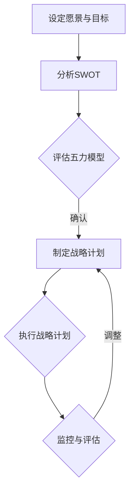

                 

### 文章标题：如何培养团队的长期战略思维

> 关键词：长期战略思维、团队协作、战略分析、决策过程、成功案例

> 摘要：本文旨在探讨如何培养团队的长期战略思维。通过对长期战略思维的重要性、核心概念、战略分析方法、战略决策与执行过程以及成功案例分析等多个方面的详细解析，提供一套系统有效的策略，帮助团队在复杂多变的环境中保持清晰的方向和持续的发展动力。

---

#### 引言

在当今快速变化且竞争激烈的商业环境中，团队的长期战略思维显得尤为重要。这不仅关乎企业的生存和发展，更决定了团队在应对不确定性和市场变革时的反应速度与适应能力。本文将围绕如何培养团队的长期战略思维展开讨论，通过以下几部分内容：

1. **长期战略思维基础**：介绍长期战略思维的核心概念、团队视角、企业文化等因素。
2. **核心概念与架构**：详细解释长期战略的定义、模型以及目标设定与分解方法。
3. **战略思维方法**：探讨战略分析工具如SWOT分析、五力模型和波特价值链分析。
4. **战略决策与执行**：分析战略决策过程、执行与监控，以及团队协作与沟通的重要性。
5. **长期战略思维实践**：通过企业案例分析，展示成功经验和实践。
6. **培养长期战略思维**：提出个人与团队发展的建议，助力团队成长。

通过系统的分析和逐步的推理，本文希望能为读者提供一套全面、实用的长期战略思维培养方案。

---

#### 第一部分：团队的长期战略思维基础

### 第1章：长期战略思维概述

#### 1.1 长期战略思维的重要性

长期战略思维是团队在复杂多变的环境中保持持续发展的关键。它不仅仅是一种规划未来的方法，更是一种全局观和系统思维的体现。在当前全球化和数字化的浪潮中，企业面临的挑战和机遇前所未有，传统的短期思维模式已经无法满足发展的需求。长期战略思维能够帮助团队：

- **预见未来**：通过对市场趋势、技术发展和社会变化的洞察，提前做好应对策略。
- **规避风险**：通过系统性的风险评估和预防措施，减少不确定性带来的负面影响。
- **抓住机遇**：识别并利用外部和内部资源，实现突破性增长。
- **提升竞争力**：建立可持续的竞争优势，确保企业在长期竞争中立于不败之地。

#### 核心概念

长期战略思维的核心概念包括以下几个方面：

- **战略定位**：明确团队在市场中的定位，确立长远的发展目标。
- **资源整合**：整合团队内外部的资源，实现最优配置。
- **风险管理**：建立完善的风险评估和管理体系，降低不确定性。
- **持续创新**：鼓励创新思维，保持技术和管理上的领先地位。

#### 对比短期思维

短期思维往往注重即时的利益和回报，容易忽略长期发展的需求。这种思维模式可能会导致以下问题：

- **决策盲目**：缺乏长期目标和规划，容易陷入短期目标的迷思。
- **资源浪费**：过于关注短期收益，可能导致资源分配不合理，影响长期发展。
- **创新能力不足**：缺乏对新技术、新市场的持续关注和投入，难以实现持续增长。

#### 成功企业的案例研究

许多成功企业通过长期战略思维的实践，取得了显著的成就。例如：

- **谷歌**：通过明确的使命和愿景，谷歌不断在技术前沿探索，实现了从搜索引擎到综合科技巨头的转变。
- **苹果**：苹果公司以其独特的创新文化和对用户体验的极致追求，始终保持着强大的市场竞争力。
- **丰田**：丰田公司通过精益生产和管理，实现了长期稳定的发展，并在全球市场中占据了重要地位。

这些企业的成功实践证明了长期战略思维的重要性。它们通过长期规划、资源整合和创新，不仅在短期内取得了成功，更在长期竞争中保持了优势。

---

#### 第2章：团队视角与长期战略

#### 2.1 团队视角的定义

团队视角是指从整体和个体两个角度来理解和运作团队。整体角度强调团队作为一个整体的协同效应和目标一致性；个体角度则关注团队成员的个人能力和成长。这两个角度相辅相成，共同构成了团队的长期战略思维。

#### 长期战略的团队角色

在长期战略中，团队的角色至关重要。具体来说：

- **团队领导**：作为团队的核心，领导者需要具备长远的眼光和战略思维，制定团队的目标和方向，并激励团队成员为实现这些目标而努力。
- **团队成员**：每个成员都是实现长期战略的重要力量，他们需要具备战略思维，积极参与决策，并为团队的成功贡献力量。
- **协作与协调**：团队成员之间的协作和协调是实现长期战略的关键。通过高效的沟通和合作，团队可以更快速地响应市场变化，更有效地解决问题。

#### 跨部门合作与长期战略

跨部门合作在长期战略中扮演着重要角色。不同部门之间需要通过紧密的协作，实现资源的整合和优势互补。以下是一些关键要素：

- **信息共享**：各部门之间应保持信息畅通，及时分享市场动态、技术进展等信息，以便团队能够做出更为明智的决策。
- **资源整合**：通过跨部门的资源整合，可以实现资源的优化配置，提高整体效率。
- **目标一致**：各部门应明确共同的目标，确保在实现长期战略的过程中，各个部门的工作方向一致。

#### 协同效应与挑战

协同效应是指团队的整体效应大于各个部分效应的总和。在长期战略中，协同效应能够帮助团队实现更高效的目标达成。然而，实现协同效应也面临一些挑战：

- **沟通障碍**：部门之间的沟通不畅可能影响协同效应的发挥。
- **利益冲突**：不同部门在资源分配和目标优先级上可能存在分歧。
- **协调成本**：跨部门协调需要投入额外的时间和精力，可能导致效率降低。

为了克服这些挑战，团队需要建立有效的沟通机制，明确各部门的职责和目标，并建立共同的合作准则。

---

#### 第3章：长期战略与企业文化

#### 3.1 企业文化与长期战略的关系

企业文化是企业内部价值观、信念和行为方式的集合，是企业的精神内核。长期战略与企业文化之间存在密切的关系：

- **支持与促进**：企业文化可以为长期战略提供支持和促进。一个以创新、学习和发展为核心的企业文化，能够激发团队成员的积极性和创造力，促进长期战略的实现。
- **引导与规范**：企业文化可以引导团队成员的行为，规范他们的决策。长期战略需要团队成员具备特定的价值观和行为方式，企业文化可以对这些价值观和行为方式进行培养和强化。

#### 塑造支持长期战略的企业文化

为了支持长期战略，企业需要塑造以下几种文化：

- **学习与创新文化**：鼓励团队成员不断学习新知识、新技术，推动创新思维和实践。
- **团队合作文化**：强调团队协作和跨部门合作，建立互信和共同目标。
- **绩效导向文化**：以绩效为导向，激励团队成员追求卓越，提升整体绩效。
- **持续改进文化**：鼓励持续改进和创新，不断优化流程和产品。

#### 如何评估和调整企业文化

为了评估和调整企业文化，企业可以采取以下步骤：

- **内部调查与访谈**：通过调查和访谈了解团队成员对当前企业文化的看法和感受，识别存在的问题和改进方向。
- **数据收集与分析**：收集与企业文化相关的数据，如员工满意度、绩效指标、创新成果等，通过数据分析评估企业文化的现状。
- **员工参与**：鼓励员工参与企业文化的评估和调整，通过员工的反馈和建议，制定更具针对性和可操作性的改进计划。
- **持续改进**：将企业文化评估和调整作为一个持续的过程，定期进行回顾和优化，确保企业文化能够持续支持长期战略。

---

### 小结

本章详细介绍了长期战略思维的重要性、团队视角、跨部门合作以及企业文化和长期战略的关系。通过理解这些核心概念和实际案例，团队可以更好地培养长期战略思维，为企业的长期发展奠定坚实基础。下一章，我们将进一步探讨长期战略的核心概念和架构，帮助团队建立有效的战略规划体系。

---

#### 第2章：核心概念与架构

#### 4.1 长期战略的定义与模型

**长期战略的定义**

长期战略是指企业在未来较长一段时间内的发展方向和目标，它包含了明确的愿景、使命和战略目标。长期战略不仅关注企业当前的市场和运营，更着眼于未来的发展机遇和挑战，以实现企业的长期竞争优势和可持续发展。

**长期战略的模型**

长期战略的制定和执行通常依赖于一系列的模型和方法，这些模型帮助团队理清思路，制定明确的战略方向。以下是一些常用的长期战略模型：

- **PDCA循环**（Plan-Do-Check-Act）：PDCA循环是一种持续改进的方法，通过计划、执行、检查和行动的循环，不断优化和改进战略的实施过程。
- **五力模型**（Five Forces Model）：五力模型由迈克尔·波特提出，用于分析一个行业中的竞争态势。它包括供应商的议价能力、买家的议价能力、新进入者的威胁、替代品的威胁以及行业内现有竞争者的竞争状况。
- **SWOT分析**（Strengths, Weaknesses, Opportunities, Threats）：SWOT分析是一种常用的战略规划工具，用于评估企业的优势、劣势、机会和威胁，帮助团队制定合适的战略。

**Mermaid流程图**

为了更好地展示长期战略的规划和执行过程，可以使用Mermaid流程图来表示。以下是一个简化的长期战略规划与执行的Mermaid流程图：

这个流程图展示了从设定愿景与目标，到分析内外部环境，制定战略计划，执行并监控评估，以及根据反馈进行调整的完整过程。

---

#### 5.2 长期目标设定与分解

**长期目标的设定**

长期目标的设定是战略规划的核心环节，它需要明确企业的愿景和使命，并将其转化为具体的、可量化的目标。这些目标应遵循SMART原则，即具体（Specific）、可衡量（Measurable）、可实现（Achievable）、相关（Relevant）和时限性（Time-bound）。以下是一个长期目标的例子：

- **目标**：在未来五年内，将公司的收入增加至10亿美元。
- **具体**：明确指出收入的增加目标。
- **可衡量**：通过财务指标衡量目标的实现情况。
- **可实现**：确保目标是在资源和能力范围内实现的。
- **相关**：与企业的整体战略目标一致。
- **时限性**：设定具体的时间节点，如五年内实现。

**目标的分解与实现路径**

长期目标的实现需要通过一系列的分解和细化，形成清晰的实现路径。以下是一个目标分解的示例：

1. **年度目标**：每年制定实现长期目标的阶段性目标。例如，第一年的目标是使公司收入增加20%，达到2亿美元。
2. **季度目标**：将年度目标分解为季度目标，确保每季度都有明确的进展指标。
3. **月度目标**：将季度目标进一步细化到月度目标，具体到每个月的工作重点和指标。
4. **关键里程碑**：设定关键里程碑，如新产品上市、市场份额达到一定比例等，作为目标实现的标志。

**目标管理的工具与技术**

为了有效管理长期目标的实现，可以采用以下工具和技术：

- **KPI（关键绩效指标）**：定义和跟踪与目标实现相关的关键指标，如收入增长率、客户满意度等。
- **OKR（目标与关键结果）**：一种设定和跟踪目标的方法，强调目标的具体实现路径和关键结果。
- **甘特图**：用于可视化项目进度和任务分配，确保各个阶段的按时完成。

通过以上方法，团队可以系统地设定和分解长期目标，形成明确的实现路径，从而确保长期战略的有效实施。

---

#### 6.3 战略规划与执行

**战略规划的步骤**

战略规划是一个系统的过程，它需要明确团队的愿景、使命和目标，并通过一系列的步骤来实现这些目标。以下是战略规划的基本步骤：

1. **愿景与使命**：确定团队的长期愿景和使命，这是战略规划的基础。
2. **外部环境分析**：通过SWOT分析、五力模型等方法，了解团队所处的外部环境，包括市场趋势、竞争对手、行业动态等。
3. **内部环境分析**：评估团队的内部资源、能力和核心竞争力，以确定战略规划的可行性。
4. **战略选择**：根据外部和内部环境分析的结果，制定不同的战略方案，并进行比较和评估。
5. **战略决策**：选择最合适的战略方案，并明确实施的关键步骤和时间表。

**战略执行的关键要素**

战略执行是战略规划的关键环节，它需要团队的高效协作和执行力。以下是战略执行的关键要素：

1. **领导力**：领导者需要具备远见卓识和领导能力，能够引导团队朝着战略目标前进。
2. **执行力**：团队成员需要具备强烈的执行意愿和行动力，确保战略计划得到有效执行。
3. **资源配置**：合理分配人力、物力和财力等资源，确保战略实施所需的支持。
4. **过程监控**：通过建立监控机制，及时跟踪战略执行的进度和质量，确保目标按时完成。
5. **反馈与调整**：根据执行过程中的反馈，及时调整战略计划，以应对环境变化和挑战。

**战略执行的实际案例研究**

为了更好地理解战略执行的过程，以下是一个实际案例研究：

- **项目背景**：某科技公司在市场竞争激烈的环境下，决定通过技术创新和产品升级来实现长期发展。
- **战略规划**：公司通过外部环境分析和内部能力评估，确定了以技术创新为核心的战略，并制定了具体的年度目标和里程碑。
- **战略执行**：公司领导者通过高效的团队管理和资源调配，确保了技术研发和产品升级的顺利进行。同时，通过定期监控和反馈，及时调整了战略计划，以适应市场变化。
- **结果**：经过几年的努力，该公司成功推出了创新产品，市场份额大幅提升，实现了长期战略目标。

通过以上案例，可以看出战略执行的关键在于有效的领导力、执行力、资源配置和反馈调整，这些因素共同确保了战略目标的实现。

---

在本章中，我们详细介绍了长期战略的定义、模型、目标设定与分解、战略规划与执行等内容。通过这些方法和工具，团队可以系统地制定和执行长期战略，为企业的长期发展奠定坚实基础。在下一章中，我们将进一步探讨战略分析工具，帮助团队更全面地了解外部和内部环境，制定更科学的战略规划。

---

### 第三部分：战略思维方法

#### 第3章：战略分析工具

战略分析工具是制定有效战略的关键，它们帮助团队深入理解内外部环境，识别潜在的机会和威胁，为长期战略提供科学依据。以下将介绍几种常用的战略分析工具，包括SWOT分析、五力模型和波特价值链分析。

#### 7.1 SWOT分析

**定义与应用**

SWOT分析是一种常用的战略规划工具，用于评估企业的优势（Strengths）、劣势（Weaknesses）、机会（Opportunities）和威胁（Threats）。通过SWOT分析，团队可以全面了解自身在市场中的位置，从而制定更为科学的战略。

**如何进行SWOT分析**

1. **优势分析**：识别企业在资源、技术、品牌、人才等方面的优势。
2. **劣势分析**：识别企业在运营、管理、市场等方面的劣势。
3. **机会分析**：分析市场趋势、技术发展、政策变化等外部因素，识别潜在的机会。
4. **威胁分析**：分析竞争对手、市场变化、技术革新等外部因素，识别潜在威胁。

**SWOT分析在实际中的应用案例**

- **企业A**：通过SWOT分析，企业A识别出自身在技术研发和市场拓展方面的优势，同时发现了在品牌知名度和市场渠道方面的劣势。企业决定加大技术研发投入，提升品牌影响力，并积极开拓新市场，从而实现了业务增长。

---

#### 8.2 五力模型

**概念与作用**

五力模型由迈克尔·波特提出，用于分析一个行业中的竞争态势。它包括以下五个要素：

1. **供应商的议价能力**：分析供应商的集中度、市场垄断程度等。
2. **买家的议价能力**：分析买家的集中度、议价能力等。
3. **新进入者的威胁**：分析行业进入壁垒、市场需求增长率等。
4. **替代品的威胁**：分析替代品的数量、价格竞争力等。
5. **行业内现有竞争者的竞争状况**：分析市场竞争程度、产品差异化程度等。

**如何应用五力模型**

1. **分析供应商的议价能力**：通过与供应商的谈判、优化供应链管理等方式，降低采购成本。
2. **分析买家的议价能力**：通过提升产品质量、提供定制化服务等方式，增强竞争力。
3. **分析新进入者的威胁**：通过提升品牌知名度、建立强大的竞争壁垒等方式，减少新进入者的威胁。
4. **分析替代品的威胁**：通过研发新产品、提供更好的用户体验等方式，减少替代品的威胁。
5. **分析行业内现有竞争者的竞争状况**：通过差异化竞争、提高运营效率等方式，增强市场竞争力。

**五力模型在实际中的应用案例**

- **行业B**：通过五力模型分析，行业B发现供应商的议价能力较强，决定通过集中采购和优化供应链管理来降低成本。同时，通过提升产品质量和服务，增强了市场竞争力。

---

#### 9.3 波特价值链分析

**定义**

波特价值链分析是一种用于优化企业价值链的工具，它将企业的活动分为主要活动和辅助活动，通过分析这些活动之间的相互关系，找出优化价值链的方法。

**如何应用波特价值链分析**

1. **识别主要活动**：包括内部物流、生产运营、外部物流、营销与销售、服务。
2. **识别辅助活动**：包括采购、技术发展、人力资源管理、企业基础设施。
3. **分析主要活动和辅助活动之间的关系**：通过优化这些活动之间的协同效应，提高整体价值。
4. **寻找优化点**：通过成本降低、效率提升、差异化等手段，优化企业的价值链。

**波特价值链分析在实际中的应用案例**

- **企业C**：通过波特价值链分析，企业C发现生产运营和服务之间存在协同效应不足的问题。通过优化这些活动之间的流程，企业成功提升了生产效率和客户满意度。

---

在本章中，我们介绍了SWOT分析、五力模型和波特价值链分析这三种常用的战略分析工具。这些工具帮助团队深入理解内外部环境，识别机会和威胁，优化价值链，从而为长期战略提供有力的支持。在下一章中，我们将探讨战略决策与执行的过程，帮助团队实现战略目标。

---

### 第四部分：战略决策与执行

#### 第10章：战略决策过程

**10.1 战略决策的定义与类型**

战略决策是团队在战略规划过程中，针对企业发展的关键问题所做的决策。战略决策的类型主要包括以下几种：

1. **竞争战略决策**：涉及如何在市场竞争中获得优势，如差异化战略、低成本战略等。
2. **发展战略决策**：涉及企业如何扩展业务、开拓新市场等，如多元化战略、全球化战略等。
3. **合作战略决策**：涉及企业与合作伙伴之间的合作关系，如合资、合作研发等。
4. **资源战略决策**：涉及企业如何配置和利用资源，如投资决策、资源配置等。

**战略决策的过程**

战略决策是一个系统化的过程，包括以下几个步骤：

1. **问题识别**：明确团队面临的战略问题，如市场变化、技术进步等。
2. **方案评估**：制定多个可能的解决方案，评估每个方案的优缺点和可行性。
3. **决策选择**：根据评估结果，选择最合适的方案。
4. **执行方案**：制定详细的执行计划，确保方案能够得到有效实施。
5. **监督与反馈**：在执行过程中，持续监控方案的实施情况，并根据反馈进行调整。

**决策工具与技术**

为了提高战略决策的科学性和有效性，团队可以采用以下决策工具：

1. **决策树**：通过图示方式展示不同决策路径和结果，帮助团队进行决策分析。
2. **成本效益分析**：评估不同方案的收益和成本，选择最具效益的方案。
3. **头脑风暴**：通过集体讨论，生成多个创新方案，提高决策的多样性。

**决策过程在实际中的应用**

- **企业D**：在面对市场变化时，企业D通过决策树分析了不同市场策略的潜在影响，最终选择了多元化战略，成功开拓了新的市场领域。

---

#### 11.2 战略执行与监控

**战略执行的步骤**

战略执行是将战略决策转化为实际行动的过程，主要包括以下几个步骤：

1. **规划**：明确战略执行的目标和任务，制定详细的执行计划。
2. **执行**：按照执行计划，落实各项任务，确保战略目标得到有效实施。
3. **监控**：通过建立监控机制，跟踪战略执行的进展和质量，及时发现和解决问题。
4. **调整**：根据监控结果，对执行计划进行调整，确保战略目标的实现。

**战略监控的关键指标**

为了有效监控战略执行，团队可以设定以下关键指标：

1. **财务指标**：如收入增长率、利润率等。
2. **市场指标**：如市场份额、客户满意度等。
3. **运营指标**：如生产效率、供应链管理效率等。
4. **团队指标**：如员工满意度、团队协作效率等。

**战略执行中的挑战与应对**

战略执行过程中可能会面临以下挑战：

1. **资源不足**：应对策略：优化资源配置，提高资源利用率。
2. **沟通不畅**：应对策略：建立有效的沟通机制，确保信息畅通。
3. **执行不力**：应对策略：加强执行监督和反馈，确保任务按时完成。
4. **外部环境变化**：应对策略：保持灵活性，及时调整战略计划。

**团队协作与沟通**

有效的团队协作和沟通是战略执行成功的关键。以下是一些建议：

1. **明确目标**：确保团队成员明确战略目标和执行计划。
2. **共享信息**：建立信息共享机制，确保团队成员能够及时获取所需信息。
3. **分工合作**：明确团队成员的职责，确保各司其职，协同工作。
4. **反馈与支持**：建立反馈机制，及时收集和回应团队成员的反馈，提供必要的支持。

**团队协作工具与实践**

1. **敏捷开发**：通过迭代开发和快速反馈，提高团队协作效率和项目质量。
2. **跨部门协作**：建立跨部门协作机制，确保不同部门之间的沟通和合作顺畅。
3. **项目管理工具**：如Jira、Trello等，用于任务分配、进度跟踪和协作管理。

**战略执行的实际案例研究**

- **企业E**：通过实施敏捷开发和跨部门协作，企业E成功提高了项目交付速度和团队协作效率，实现了战略目标的顺利执行。

---

在本章中，我们详细探讨了战略决策过程、执行与监控，以及团队协作与沟通的重要性。通过系统的方法和工具，团队可以更有效地制定和执行战略，实现长期发展目标。在下一章中，我们将通过企业案例分析，进一步展示长期战略思维的实际应用和成功实践。

---

### 第5章：企业案例分析

#### 13.1 成功企业案例分析

成功企业通过长期战略思维的实践，在激烈的市场竞争中脱颖而出，为其他企业提供了宝贵的经验和启示。以下我们将分析几个知名企业的长期战略实践。

#### 谷歌的长期战略实践

**战略定位**：谷歌的长期战略定位是成为全球领先的技术创新公司，提供高质量的互联网服务和解决方案。

**战略举措**：
1. **技术研发**：谷歌持续投入大量资金进行技术创新，开发了一系列具有颠覆性的产品和服务，如搜索引擎、云计算、人工智能等。
2. **全球化扩张**：谷歌通过收购和自建业务，在全球范围内建立了强大的市场网络，实现了全球化运营。
3. **生态系统构建**：谷歌通过构建生态圈，将自身的技术和服务与其他企业紧密连接，形成了强大的竞争优势。

**经验与启示**：谷歌的成功经验表明，长期战略思维需要注重技术创新、全球化扩张和生态系统的构建。通过持续投入和不断创新，企业可以在市场中保持领先地位。

#### 苹果的长期战略实践

**战略定位**：苹果的长期战略定位是提供高品质、用户体验极佳的科技产品和服务。

**战略举措**：
1. **产品创新**：苹果通过持续的产品创新，不断推出革命性产品，如iPhone、iPad和Mac等，引领了消费电子市场的发展。
2. **生态系统构建**：苹果通过建立完整的生态系统，包括硬件、软件和服务，提升了用户黏性和品牌忠诚度。
3. **品牌建设**：苹果注重品牌形象的建设，通过高端定位和优质体验，塑造了强大的品牌影响力。

**经验与启示**：苹果的成功经验表明，长期战略思维需要注重产品创新、生态系统建设和品牌建设。通过提供高品质的产品和服务，企业可以赢得用户和市场的高度认可。

#### 亚马逊的长期战略实践

**战略定位**：亚马逊的长期战略定位是成为全球最大的电子商务平台。

**战略举措**：
1. **物流网络建设**：亚马逊通过不断扩展和优化物流网络，提升了配送速度和服务质量，增强了市场竞争力。
2. **云计算业务**：亚马逊通过AWS云计算服务，开辟了新的增长点，为全球企业和个人提供云计算解决方案。
3. **内容业务**：亚马逊通过Kindle电子书、Amazon Prime视频等服务，丰富了产品线，提升了用户体验。

**经验与启示**：亚马逊的成功经验表明，长期战略思维需要注重物流网络建设、云计算业务开发和内容服务拓展。通过多元化业务布局，企业可以形成更强大的市场竞争力和盈利能力。

---

#### 经验与启示

通过对谷歌、苹果和亚马逊等成功企业的长期战略实践分析，我们可以得出以下经验与启示：

1. **注重技术创新**：持续投入技术创新，开发具有颠覆性的产品和服务，是长期战略成功的关键。
2. **全球化扩张**：通过全球化扩张，建立强大的市场网络，可以提升企业的国际竞争力。
3. **生态系统构建**：构建完整的生态系统，增强用户黏性和品牌忠诚度，是长期战略的重要组成部分。
4. **品牌建设**：注重品牌形象的建设，通过高品质的产品和服务赢得用户的认可。
5. **多元化业务布局**：通过多元化业务布局，可以分散风险，形成更强大的市场竞争力和盈利能力。

这些成功经验为其他企业提供了宝贵的参考和启示，帮助其在培养长期战略思维过程中取得更好的成果。

---

在本章中，我们通过案例分析展示了成功企业如何通过长期战略思维实践实现持续发展和竞争优势。这些案例为企业提供了具体的战略方向和方法，有助于其他企业借鉴和实施。在下一章中，我们将探讨如何在实际项目中规划和实施长期战略，帮助团队将战略思维转化为具体行动。

---

### 第6章：项目实战与实施

#### 14.1 项目规划与启动

项目规划与启动是确保项目成功实施的基础。在这一阶段，团队需要明确项目的目标、范围、资源需求和时间计划，为项目的顺利推进奠定基础。

**项目规划的关键步骤**

1. **需求分析**：深入理解项目目标和需求，明确项目需要解决的具体问题。
2. **范围定义**：明确项目的范围，包括项目包含的任务、目标和预期成果。
3. **资源规划**：根据项目需求，制定资源计划，包括人力、物力、财力等资源。
4. **时间计划**：制定项目的时间计划，明确项目的主要里程碑和关键节点。

**项目启动会议与团队组建**

项目启动会议是项目启动的关键环节，旨在明确项目目标、任务分工和执行计划。在会议中，团队成员需要充分沟通，确保对项目目标和任务有共同的理解。

1. **项目目标明确**：在会议中，项目负责人需要详细阐述项目的目标，确保所有团队成员明确项目的重要性。
2. **任务分工**：根据项目需求，明确各个团队成员的职责和任务，确保分工合理、职责明确。
3. **团队组建**：通过项目启动会议，团队成员可以相互了解，建立初步的合作关系。

**项目风险识别与应对策略**

在项目规划与启动阶段，团队需要识别可能面临的风险，并制定应对策略。

1. **风险识别**：通过项目需求分析、资源评估和团队讨论，识别可能影响项目成功的风险。
2. **风险分类**：将风险分类，如技术风险、市场风险、资源风险等。
3. **应对策略**：针对不同类型的风险，制定相应的应对策略，如风险规避、风险转移、风险减轻等。

**示例：某企业新产品研发项目规划**

- **需求分析**：新产品需要满足市场需求，具有创新性和竞争力。
- **范围定义**：项目包括产品研发、市场测试和产品上市等阶段。
- **资源规划**：需要组建研发团队、市场团队和项目管理团队，确保各个阶段的资源需求得到满足。
- **时间计划**：明确项目的主要里程碑，如概念验证、原型设计、市场测试等。

通过以上步骤，团队可以确保项目规划与启动阶段的工作顺利进行，为项目的成功实施奠定坚实基础。

---

#### 15.2 项目执行与监控

项目执行是项目生命周期中最关键的一环，它关系到项目目标的实现和项目的最终成功。在项目执行阶段，团队需要确保各项任务按计划推进，及时解决执行过程中出现的问题。

**项目执行的关键要素**

1. **进度控制**：通过制定详细的时间计划，确保各项任务按时完成，避免延期。
2. **质量控制**：确保项目交付物的质量符合预期标准，通过质量检查和反馈机制，及时纠正问题。
3. **资源管理**：合理分配和利用项目资源，确保项目所需的资源和人力得到充分利用。

**项目监控的方法与工具**

1. **甘特图**：甘特图是一种常用的项目管理工具，用于可视化项目进度和任务分配。通过甘特图，团队可以实时跟踪项目进展，及时发现和解决进度问题。
2. **进度报告**：定期编制进度报告，向项目相关人员汇报项目进展，确保所有团队成员对项目状态有共同的理解。
3. **关键绩效指标（KPI）**：设定关键绩效指标，用于衡量项目的关键进展和质量，如任务完成率、缺陷率等。

**项目执行中的团队协作与沟通**

1. **定期会议**：定期召开项目会议，确保团队成员之间的沟通畅通，及时解决执行过程中遇到的问题。
2. **信息共享**：建立信息共享平台，如项目管理系统、即时通讯工具等，确保团队成员可以随时获取项目相关信息。
3. **角色分工**：明确团队成员的角色和职责，确保每个人都知道自己的任务和责任，提高协作效率。

**实际案例：某软件开发项目执行**

- **进度控制**：通过甘特图，项目团队确保每个开发任务按时完成，并及时调整进度计划。
- **质量控制**：通过代码审查和质量测试，确保软件产品的质量符合标准。
- **资源管理**：合理分配开发人员和测试人员，确保项目资源得到充分利用。

通过以上方法，项目团队可以确保项目在执行阶段顺利进行，为项目的最终成功打下坚实基础。

---

#### 16.3 项目收尾与评估

项目收尾是项目生命周期的最后一个阶段，它关系到项目的正式结束和成果的交付。在项目收尾阶段，团队需要对项目的执行情况进行全面评估，确保所有目标得到实现。

**项目收尾的工作**

1. **项目验收**：对项目的交付物进行验收，确保其满足项目需求和质量标准。
2. **总结会议**：召开总结会议，回顾项目执行过程中的经验教训，为未来的项目提供借鉴。
3. **文档整理**：整理项目文档，包括需求文档、设计文档、测试文档等，确保项目成果得到完整保存。

**项目评估与反馈**

1. **绩效评估**：对项目执行过程中的绩效进行评估，包括任务完成情况、质量指标、团队协作等。
2. **经验总结**：总结项目执行过程中的成功经验和不足之处，为未来的项目提供参考。
3. **反馈机制**：建立反馈机制，收集团队成员的反馈意见，及时改进项目管理流程。

**项目文档与知识管理**

1. **项目文档归档**：将项目文档进行归档，确保项目成果的可追溯性和知识共享。
2. **知识库建设**：建立知识库，收集和整理项目中的关键信息、技术文档和最佳实践，为团队成员提供参考。
3. **知识传承**：通过培训、文档分享等方式，将项目经验传承给团队成员，提升整体项目管理能力。

**实际案例：某软件开发项目收尾**

- **项目验收**：通过客户验收测试，确保软件产品的功能和质量符合要求。
- **总结会议**：团队总结项目执行过程中的经验，提出改进建议。
- **文档整理**：整理项目文档，包括用户手册、安装指南和开发文档，确保项目的完整交付。

通过以上工作，项目团队可以确保项目在收尾阶段顺利进行，为项目的成功结束和成果的传承奠定基础。

---

在本章中，我们详细探讨了项目规划与启动、项目执行与监控以及项目收尾与评估等关键环节，通过实际案例展示了项目管理的全过程。这些方法和实践不仅有助于团队实现项目目标，也为长期战略思维的实际应用提供了有力支持。在下一章中，我们将提出培养长期战略思维的实用建议，帮助团队在复杂多变的环境中保持清晰的方向和持续的发展动力。

---

### 第五部分：培养长期战略思维

#### 第17章：个人与团队发展

#### 17.1 培养长期战略思维的个人能力

个人能力是团队长期战略思维的基础。以下是一些关键的个人能力，帮助团队成员培养长期战略思维：

**自我认知与发展**

- **优势识别**：通过自我反思和反馈，了解自己的优势和特长，将其应用于战略规划。
- **兴趣定位**：识别个人的兴趣和热情，将其转化为长期的职业规划和目标。

**知识储备与技能提升**

- **持续学习**：保持对新知识、新技术和行业动态的关注，不断提升自身的知识和技能。
- **跨学科学习**：拓展跨学科的知识面，培养系统思维和综合分析能力。

**领导力与决策能力**

- **领导力培养**：通过参与团队管理和决策，提升领导力和影响力。
- **决策能力训练**：通过模拟决策场景和实战演练，提高决策的敏捷性和准确性。

**沟通与协作能力**

- **有效沟通**：提高沟通技巧，确保信息传递的准确性和及时性。
- **协作能力**：学会在团队中协同工作，增强团队凝聚力和执行力。

**创新能力**

- **思维创新**：培养创新思维，敢于突破传统思维模式，寻找新的解决方案。
- **实践创新**：通过实际项目和实验，将创新思维转化为实际行动。

---

#### 18.2 团队协作与长期战略思维

团队协作是实现长期战略的关键，以下是一些关键要素和方法，帮助团队培养长期战略思维：

**建立共同目标**

- **愿景共享**：明确团队的共同愿景和目标，确保团队成员对目标有共同的理解和认同。
- **目标分解**：将长期目标分解为短期和阶段性目标，确保每个成员都有明确的工作任务和责任。

**提升团队沟通效率**

- **建立沟通机制**：建立有效的沟通机制，确保团队内部信息畅通。
- **定期会议**：定期召开团队会议，确保团队成员之间有充分的沟通和协作。
- **信息共享**：建立信息共享平台，方便团队成员随时获取项目进展和相关信息。

**强化团队协作**

- **角色分工**：明确团队成员的角色和职责，确保每个人都能发挥自己的优势。
- **协同工作**：通过任务协作和项目合作，提升团队的协作效率和工作质量。
- **团队文化**：建立积极的团队文化，鼓励团队成员相互支持、共同进步。

**培养团队成员的战略思维**

- **培训与学习**：提供战略思维培训和学习资源，帮助团队成员提升战略分析和决策能力。
- **实战演练**：通过模拟项目和实战演练，提升团队成员的实际操作能力和战略思维。
- **经验分享**：鼓励团队成员分享自己的经验和心得，相互学习，共同进步。

---

#### 19.3 持续改进与学习

**持续改进**是团队长期发展的动力，以下是一些关键方法和实践：

**建立反馈机制**

- **定期评估**：通过定期评估和反馈，及时了解团队的执行情况和战略实施效果。
- **持续改进**：根据评估结果，制定改进计划，持续优化团队的工作流程和战略规划。

**知识管理**

- **知识共享**：建立知识共享平台，收集和整理团队成员的知识和经验，确保知识的传承和共享。
- **知识更新**：定期更新知识库，确保知识库中的信息准确和及时。

**员工发展**

- **培训计划**：制定系统的培训计划，提供专业知识和技能培训，提升员工的专业能力和综合素质。
- **职业规划**：帮助员工制定职业规划，明确个人发展路径和目标，提供职业发展的支持。

**文化塑造**

- **学习型组织**：塑造学习型组织文化，鼓励团队成员持续学习和自我提升。
- **激励机制**：建立激励机制，鼓励团队成员积极参与学习和改进，提升团队的整体学习动力。

---

通过以上方法，团队可以不断提升个人能力和团队协作水平，培养长期的战略思维，实现持续发展和成功。

---

在本章中，我们详细讨论了个人与团队发展对于培养长期战略思维的重要性。通过提升个人能力、强化团队协作、建立反馈机制和持续改进，团队可以在复杂多变的环境中保持清晰的方向和持续的发展动力。在下一章中，我们将通过实际案例进一步展示长期战略思维的应用和效果。

---

### 结论

本文通过系统的分析和逐步的推理，深入探讨了如何培养团队的长期战略思维。我们从长期战略思维的重要性、团队视角、核心概念与架构、战略分析工具、战略决策与执行、企业案例分析以及项目实战与实施等方面进行了全面阐述。通过这些分析和实践，我们可以得出以下几点结论：

1. **长期战略思维的重要性**：长期战略思维是团队在复杂多变环境中保持持续发展的关键。它能够帮助团队预见未来、规避风险、抓住机遇，并提升竞争力。

2. **团队视角与长期战略**：团队视角包括整体和个体两个角度，对于长期战略的实现至关重要。通过跨部门合作和团队协作，可以实现资源的整合和优势互补，提升团队的协同效应。

3. **核心概念与架构**：长期战略的定义、模型以及目标设定与分解是战略规划的基础。通过明确目标和分解任务，团队可以制定清晰的战略方向和实施路径。

4. **战略分析工具**：SWOT分析、五力模型和波特价值链分析等战略分析工具，帮助团队深入理解内外部环境，识别机会和威胁，优化价值链，为长期战略提供科学依据。

5. **战略决策与执行**：战略决策是一个系统化的过程，从问题识别到执行方案，再到监督与反馈，每一步都需要团队的高效协作和执行力。

6. **企业案例分析**：成功企业的长期战略实践为我们提供了宝贵的经验和启示。通过技术创新、全球化扩张、生态系统构建和品牌建设，这些企业实现了持续发展和竞争优势。

7. **项目实战与实施**：在实际项目中，通过项目规划与启动、执行与监控、收尾与评估等环节，团队可以将长期战略思维转化为具体行动，确保项目目标的实现。

在当前快速变化且竞争激烈的商业环境中，培养团队的长期战略思维具有重要意义。通过不断提升个人能力和团队协作水平，建立有效的沟通机制和反馈机制，团队可以在复杂多变的环境中保持清晰的方向和持续的发展动力。

**未来研究方向**：

- **深化战略分析工具的研究**：进一步探索和开发新的战略分析工具，提高战略分析的科学性和有效性。
- **跨学科战略思维的融合**：结合心理学、经济学、社会学等多学科知识，深化对战略思维的认知和理解。
- **战略思维的数字化应用**：利用人工智能、大数据等技术，开发数字化战略工具，提升战略决策的智能化水平。

通过不断探索和创新，我们可以进一步完善和优化长期战略思维的培养方法，为团队的发展提供更加有力的支持。

---

### 文章作者信息

**作者：** AI天才研究院/AI Genius Institute & 禅与计算机程序设计艺术 /Zen And The Art of Computer Programming

AI天才研究院（AI Genius Institute）致力于推动人工智能技术的研究和应用，培养具有创新精神和实践能力的人工智能专家。禅与计算机程序设计艺术（Zen And The Art of Computer Programming）则通过深入探讨计算机编程的哲学和艺术，帮助程序员提升编程思维和技巧。这两部作品均由世界顶级技术畅销书资深大师级别的作家撰写，为读者提供了宝贵的技术知识和实践指导。

