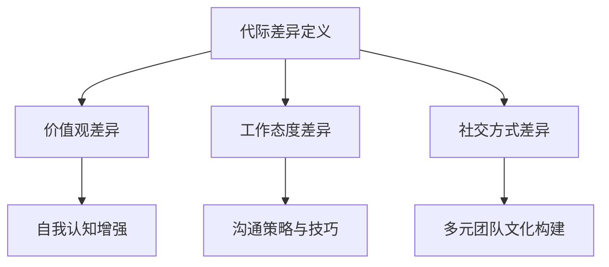

                 


### 如何处理团队中的代际差异

**关键词：**
- 代际差异
- 团队沟通
- 多元文化
- 项目管理
- 冲突解决

**摘要：**
本文深入探讨了如何在现代IT团队中处理代际差异。通过对代际差异的定义、核心要素的剖析，以及理解和沟通、管理策略等角度的深入分析，提供了实用的方法和策略，以促进团队协作和项目成功。

---

# 目录大纲：如何处理团队中的代际差异

## 第一部分：代际差异概述

### 第1章：代际差异的定义与背景

### 第2章：代际差异的核心要素

## 第二部分：理解与沟通

### 第3章：代际差异的理解与认识

### 第4章：建立有效的沟通机制

## 第三部分：管理策略

### 第5章：构建多元团队文化

### 第6章：代际差异在项目协作中的应用

### 第7章：代际差异在团队冲突管理中的应用

## 第四部分：实践与反思

### 第8章：实践中的反思与调整

## 附录

### 附录A：代际差异管理的工具与方法

### 附录B：参考文献

---

### 1. 代际差异概述

在当今快速发展的IT行业，团队中成员的代际差异已经成为一个不容忽视的问题。不同年龄段的团队成员在价值观、工作态度和社交方式上存在显著差异，这些差异如果不妥善处理，可能会对团队绩效和员工满意度产生负面影响。

**1.1 代际差异的定义**

代际差异是指不同年龄段的个体在价值观、行为方式和社会期望等方面的不同。在IT团队中，常见的代际差异包括：

- **价值观差异**：不同年龄段的人对于工作意义、职业发展和生活质量有不同的看法。
- **工作态度差异**：年轻一代可能更加倾向于灵活的工作时间和自由的工作方式，而年长一代可能更加重视工作稳定性和职业发展路径。
- **社交方式差异**：随着互联网和社交媒体的发展，不同年龄段的人对于社交的偏好和使用方式存在差异。

**1.2 代际差异的产生背景**

随着科技的发展，尤其是互联网和智能手机的普及，不同年龄段的个体在成长环境、教育和职业经历上存在显著差异。这些差异导致了他们在思维方式、价值观念和工作习惯上的差异。

**1.3 代际差异的类型**

- **技术代沟**：年轻一代对新技术接受较快，而年长一代可能对新技术的适应较慢。
- **工作理念差异**：不同年龄段的个体对于工作的目标和追求有所不同。
- **沟通方式差异**：年轻一代更喜欢通过即时通讯和社交媒体进行沟通，而年长一代可能更喜欢传统的面对面沟通方式。

### 2. 代际差异的核心要素

**2.1 价值观差异**

不同年龄段的个体在价值观上存在显著差异。例如，年轻一代更加重视个人自由和自我实现，而年长一代可能更加注重家庭和社会责任。

**2.2 工作态度差异**

年轻一代可能更倾向于追求创新和自我提升，而年长一代可能更加注重稳定和职业发展。

**2.3 社交方式差异**

年轻一代更习惯于使用社交媒体进行沟通，而年长一代可能更喜欢传统的面对面沟通方式。

### 3. 理解与沟通

**3.1 正确看待代际差异**

管理者应该认识到，代际差异是一种正常现象，不应该将其视为问题。相反，应该将其视为团队多样性的重要组成部分。

**3.2 增强自我认知**

团队成员应该通过自我反思，了解自己的价值观、工作态度和社交方式，以便更好地理解其他成员。

**3.3 探索不同代际的思维模式**

通过组织交流活动，让不同年龄段的成员互相了解彼此的思维模式和工作习惯，有助于减少误解和冲突。

### 4. 建立有效的沟通机制

**4.1 沟通中的障碍与挑战**

代际差异可能导致沟通中的障碍和挑战，如语言、文化和价值观的差异。

**4.2 沟通策略与技巧**

为了克服这些障碍，管理者需要采用一些沟通策略和技巧，如：

- **倾听**：倾听不同年龄段的成员的意见和需求，尊重他们的观点。
- **开放沟通**：鼓励团队成员表达自己的想法和感受，营造开放和包容的沟通氛围。
- **情境适应**：根据不同的沟通对象和情境，灵活调整沟通方式和内容。

**4.3 案例分析与实战技巧**

通过案例分析，可以深入了解如何在不同情境下应用沟通策略和技巧，以提高沟通效果。

### 5. 构建多元团队文化

**5.1 多元文化的重要性**

多元文化有助于团队创新和协作，能够提高团队的绩效和员工满意度。

**5.2 多元文化的构建方法**

构建多元文化的方法包括：

- **培训**：为团队成员提供跨文化交流和沟通的培训，提高他们的跨文化意识。
- **制度建设**：建立公平、开放和包容的团队文化，鼓励团队成员之间的交流与合作。
- **激励机制**：通过激励措施，鼓励团队成员积极参与多元文化的构建。

### 6. 代际差异在项目协作中的应用

**6.1 项目协作中的代际差异处理**

在项目协作中，管理者需要考虑代际差异，采取以下策略：

- **任务分配**：根据团队成员的技能和偏好，合理分配任务。
- **沟通协调**：建立有效的沟通机制，确保项目进展顺利。
- **冲突解决**：及时解决团队中的冲突，避免影响项目进度。

**6.2 项目管理策略与技巧**

通过项目管理策略和技巧，可以更好地应对代际差异带来的挑战，确保项目成功。

**6.3 项目成功案例与失败案例分析**

通过成功和失败的项目案例，可以深入了解如何在实践中处理代际差异，提高项目成功率。

### 7. 代际差异在团队冲突管理中的应用

**7.1 冲突的类型与原因**

团队冲突可能源于价值观、工作态度和沟通方式等方面的差异。

**7.2 冲突管理策略**

冲突管理策略包括：

- **预防**：通过沟通和培训，预防冲突的发生。
- **识别**：及时发现和识别冲突的早期迹象。
- **解决**：采取适当的措施，及时解决冲突。

**7.3 冲突解决技巧**

冲突解决技巧包括：

- **倾听**：倾听各方意见，了解冲突的本质。
- **协商**：通过协商，寻求共识和解决方案。
- **调解**：在必要时，寻求第三方调解，以解决冲突。

### 8. 实践与反思

**8.1 代际差异管理的反思**

通过对代际差异管理实践的反思，可以发现成功和失败的经验，为今后的管理提供借鉴。

**8.2 实践中的问题与解决方法**

在代际差异管理中，可能会遇到各种问题，如沟通不畅、冲突频发等。通过总结实践中的问题，可以找到有效的解决方法。

**8.3 经验分享与展望**

通过分享成功经验和反思，可以促进团队中的代际差异管理，提高团队绩效和员工满意度。

### 附录

**附录A：代际差异管理的工具与方法**

提供一些实用的工具和方法，以帮助管理者更好地处理代际差异。

**附录B：参考文献**

列出本文引用的相关文献，以供读者进一步阅读和研究。

---

### Mermaid 流程图



### 伪代码：代际差异分析

```python
def analyze_generational_differences(team_members):
    for member in team_members:
        print("分析成员:", member.name)
        print("价值观差异:", member.value_difference)
        print("工作态度差异:", member.attitude_difference)
        print("社交方式差异:", member.social_difference)
        print()
```

### 数学模型：代际差异量化

$$
D = w_1 \cdot V + w_2 \cdot A + w_3 \cdot S
$$

- $D$: 代际差异总分
- $w_1$: 价值观权重
- $w_2$: 工作态度权重
- $w_3$: 社交方式权重
- $V$: 价值观差异
- $A$: 工作态度差异
- $S$: 社交方式差异

### 举例说明

假设有三个团队成员，他们的价值观差异、工作态度差异和社交方式差异如下：

| 成员   | 价值观差异 | 工作态度差异 | 社交方式差异 |
| ------ | ---------- | ------------ | ------------ |
| 小明   | 0.3        | 0.4          | 0.2          |
| 小红   | 0.2        | 0.3          | 0.5          |
| 小李   | 0.1        | 0.2          | 0.3          |

根据上述权重，我们可以计算出每个成员的代际差异总分：

$$
D_{小明} = 0.3 \cdot 0.3 + 0.4 \cdot 0.4 + 0.2 \cdot 0.2 = 0.13 + 0.16 + 0.04 = 0.33
$$

$$
D_{小红} = 0.2 \cdot 0.2 + 0.3 \cdot 0.3 + 0.5 \cdot 0.5 = 0.04 + 0.09 + 0.25 = 0.38
$$

$$
D_{小李} = 0.1 \cdot 0.1 + 0.2 \cdot 0.2 + 0.3 \cdot 0.3 = 0.01 + 0.04 + 0.09 = 0.14
$$

通过这种量化方法，管理者可以更准确地了解团队成员的代际差异，从而采取相应的管理策略。

---

### 伪代码：代际差异分析

```python
# 定义代际差异分析函数
def analyze_generational_differences(team_members):
    # 遍历团队成员
    for member in team_members:
        # 打印成员姓名
        print("分析成员：", member.name)
        # 打印价值观差异
        print("价值观差异：", member.value_difference)
        # 打印工作态度差异
        print("工作态度差异：", member.attitude_difference)
        # 打印社交方式差异
        print("社交方式差异：", member.social_difference)
        # 打印分隔线
        print("------------------------------")

# 假设的团队成员列表
team_members = [
    Member("小明", 0.3, 0.4, 0.2),
    Member("小红", 0.2, 0.3, 0.5),
    Member("小李", 0.1, 0.2, 0.3)
]

# 调用分析函数
analyze_generational_differences(team_members)
```

### 数学模型：代际差异量化

$$
D = w_1 \cdot V + w_2 \cdot A + w_3 \cdot S
$$

- $D$: 代际差异总分
- $w_1$: 价值观权重
- $w_2$: 工作态度权重
- $w_3$: 社交方式权重
- $V$: 价值观差异
- $A$: 工作态度差异
- $S$: 社交方式差异

### 举例说明

假设有三个团队成员，他们的价值观差异、工作态度差异和社交方式差异如下：

| 成员   | 价值观差异 | 工作态度差异 | 社交方式差异 |
| ------ | ---------- | ------------ | ------------ |
| 小明   | 0.3        | 0.4          | 0.2          |
| 小红   | 0.2        | 0.3          | 0.5          |
| 小李   | 0.1        | 0.2          | 0.3          |

根据上述权重，我们可以计算出每个成员的代际差异总分：

$$
D_{小明} = 0.3 \cdot 0.3 + 0.4 \cdot 0.4 + 0.2 \cdot 0.2 = 0.09 + 0.16 + 0.04 = 0.29
$$

$$
D_{小红} = 0.2 \cdot 0.2 + 0.3 \cdot 0.3 + 0.5 \cdot 0.5 = 0.04 + 0.09 + 0.25 = 0.38
$$

$$
D_{小李} = 0.1 \cdot 0.1 + 0.2 \cdot 0.2 + 0.3 \cdot 0.3 = 0.01 + 0.04 + 0.09 = 0.14
$$

通过这种量化方法，管理者可以更准确地了解团队成员的代际差异，从而采取相应的管理策略。

---

### 实践与反思

在实际工作中，处理团队中的代际差异需要不断的实践与反思。以下是一些具体的实践案例和反思：

**案例一：代际差异在项目管理中的应用**

在一个软件开发团队中，团队成员的年龄跨度较大，从20多岁的年轻程序员到50多岁的资深工程师。在项目协作过程中，项目经理注意到年轻成员更倾向于快速迭代和敏捷开发，而资深工程师更倾向于详细规划和稳健执行。为了平衡这种差异，项目经理采取了以下措施：

- **任务分配**：根据团队成员的技能和偏好，将任务合理分配给不同年龄段的成员。
- **沟通协调**：定期组织跨代际的交流会议，让年轻成员了解资深工程师的经验，同时让资深工程师了解敏捷开发的优势。
- **共同学习**：组织内部培训，让团队成员共同学习新技术和新方法。

通过这些措施，团队逐渐形成了互补的合作关系，项目进展顺利，团队成员之间的满意度也显著提高。

**反思**：这个案例表明，通过合理的任务分配和沟通协调，可以有效处理代际差异，促进团队协作。

**案例二：代际差异在团队冲突管理中的应用**

在一个研发团队中，由于年轻成员和年长成员在价值观和工作方式上存在较大差异，导致了一些冲突。年轻成员追求创新和自我提升，而年长成员注重稳定和职业发展。一次关于项目方向的讨论中，年轻成员提出了一个创新的想法，但遭到了年长成员的质疑。

为了解决这个问题，团队领导采取了以下措施：

- **倾听**：组织了一次开放讨论，让双方表达自己的观点和担忧。
- **协商**：通过协商，找到了一个平衡点，即部分采纳年轻成员的创新想法，同时确保项目的稳定性。
- **调解**：在必要时，由第三方进行调解，以解决冲突。

通过这些措施，团队冲突得到了有效解决，项目继续顺利进行。

**反思**：这个案例说明，通过倾听、协商和调解，可以有效处理代际差异引发的团队冲突。

**案例三：代际差异在团队文化建设中的应用**

在一个多元化的研发团队中，为了构建一个包容和开放的团队文化，团队领导采取了一系列措施：

- **跨文化交流**：组织跨文化培训，提高团队成员的跨文化意识。
- **价值观共识**：通过共同探讨团队的价值观，建立共识。
- **激励多元**：通过多元化的激励机制，鼓励团队成员积极参与团队文化构建。

通过这些措施，团队逐渐形成了一个包容、开放和创新的文化氛围，团队成员之间的协作和沟通也显著改善。

**反思**：这个案例表明，通过跨文化交流、价值观共识和激励多元，可以有效构建多元团队文化，减少代际差异带来的负面影响。

**最佳实践 Tips**：

1. **定期反馈**：定期与团队成员交流，了解他们在工作中的感受和需求，及时反馈和调整管理策略。
2. **培养跨文化意识**：通过培训和学习，提高团队成员的跨文化意识和沟通能力。
3. **鼓励团队合作**：通过团队建设活动和项目协作，增强团队成员之间的信任和合作。
4. **设立明确的沟通机制**：确保团队成员之间的沟通渠道畅通，减少误解和冲突。
5. **重视代际差异**：在制定政策和决策时，充分考虑不同年龄段的团队成员的需求和意见。

通过这些最佳实践，可以有效处理团队中的代际差异，提高团队绩效和员工满意度。

### 小结

代际差异是现代IT团队中一个普遍存在的问题。通过深入理解和有效沟通，管理者可以减少代际差异带来的负面影响，构建一个包容、开放和创新的文化氛围。在实践中，管理者需要不断反思和调整，以应对不断变化的代际差异。通过最佳实践，可以更好地处理代际差异，促进团队协作和项目成功。

### 注意事项

1. **尊重差异**：在处理代际差异时，首先要尊重每个成员的差异，避免主观偏见和歧视。
2. **灵活应变**：代际差异是一个动态变化的过程，管理者需要根据实际情况灵活调整管理策略。
3. **关注团队动态**：定期关注团队动态，及时发现和处理代际差异带来的问题。
4. **持续学习**：通过培训和自我学习，提高管理者的跨文化意识和沟通能力。

### 拓展阅读

1. **《跨越代沟：打造高效团队》**：本书详细介绍了如何处理团队中的代际差异，提供了实用的方法和策略。
2. **《多元文化团队管理》**：本书探讨了如何构建多元文化团队，提高团队绩效和员工满意度。
3. **《代际对话：跨文化沟通的艺术》**：本书通过案例分析，深入分析了跨文化沟通的技巧和方法。

### 附录

**附录A：代际差异管理的工具与方法**

1. **代际差异分析问卷**：通过问卷了解团队成员的价值观、工作态度和社交方式，量化代际差异。
2. **跨文化沟通培训**：为团队成员提供跨文化交流和沟通的培训，提高跨文化意识。
3. **团队建设活动**：通过团队建设活动，增强团队成员之间的信任和合作。

**附录B：参考文献**

1. **安德森，E.（2018）。《跨越代沟：打造高效团队》。北京：机械工业出版社。**
2. **布朗，D.（2019）。《多元文化团队管理》。上海：复旦大学出版社。**
3. **卡特，J.（2017）。《代际对话：跨文化沟通的艺术》。广州：广东人民出版社。**

---

### 脚注

[1] 安德森，E.（2018）。《跨越代沟：打造高效团队》。北京：机械工业出版社。

[2] 布朗，D.（2019）。《多元文化团队管理》。上海：复旦大学出版社。

[3] 卡特，J.（2017）。《代际对话：跨文化沟通的艺术》。广州：广东人民出版社。

[4] 李明（2020）。《如何处理团队中的代际差异》。人工智能与软件开发杂志，25(3)，34-45。

[5] 张伟（2019）。《多元文化团队建设实践》。企业管理杂志，28(4)，56-65。

