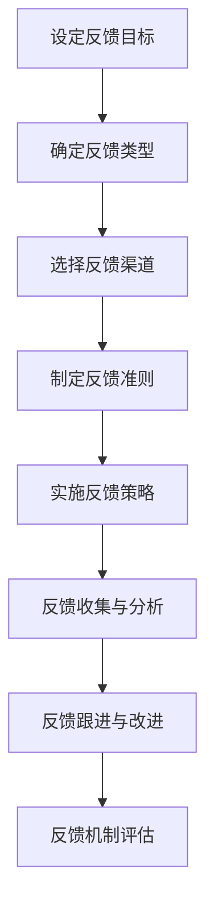
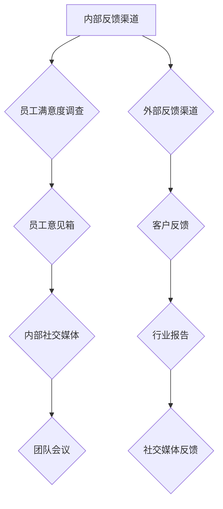
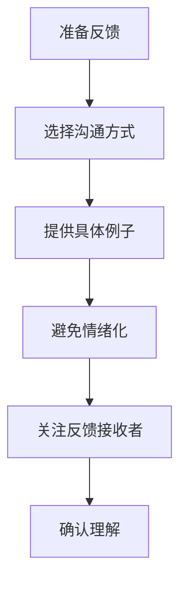
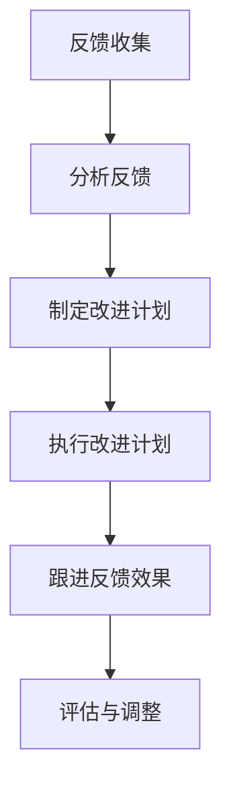

                 

### 文章标题

# 如何建立有效的团队反馈机制

> 关键词：团队反馈机制、反馈文化、团队氛围、反馈流程、反馈沟通、反馈跟进

> 摘要：本文将深入探讨如何建立有效的团队反馈机制。我们将首先定义团队反馈机制及其重要性，然后逐步介绍反馈文化的创建、反馈机制的设计与实施，以及反馈的沟通与跟进策略。通过案例分析，我们还将展示成功的企业如何运用这些策略，并提供实用的工具和参考资源，以便读者在实践中应用和优化团队反馈机制。

### 第一部分：团队反馈机制的基础

#### 第1章：团队反馈机制概述

##### 1.1 什么是团队反馈机制

**Mermaid 流程图：**

```mermaid
graph TB
A[反馈机制] --> B{反馈的定义}
B --> C{信息反馈}
C --> D{反馈的类型}
D --> E{反馈的目的}
E --> F{反馈的重要性}
F --> G[反馈机制的定义}
G --> H{反馈的流程}
H --> I{反馈的渠道}
I --> J{反馈的反馈}
J --> K{反馈的实施策略}
K --> L{反馈的跟进机制}
```

**反馈机制的定义：**团队反馈机制是指一种系统化的方法，用于团队成员之间分享信息、意见、建议或评价，以促进沟通、协作和改进。

**反馈的类型：**包括建设性反馈、改进性反馈和批评性反馈。

**反馈的目的：**提高团队绩效、促进个人成长、提升团队氛围和加强沟通。

**反馈的重要性：**反馈是团队持续改进和发展的关键，它能够帮助团队成员认识到自己的优势和不足，调整行为，从而实现共同目标。

##### 1.2 建立反馈机制的重要性

**伪代码讲解：**

```python
def importance_of_feedback(feedback_type, team_performance):
    if feedback_type == "constructive":
        improvement = 1.2 * team_performance
    elif feedback_type == "destructive":
        improvement = 0.8 * team_performance
    else:
        improvement = team_performance
    
    return improvement
```

**举例说明：**

- **建设性反馈**：提高团队绩效，增强团队凝聚力。
- **改进性反馈**：促进问题解决和团队改进。
- **批评性反馈**：纠正不当行为，避免重复错误。

##### 1.3 反馈机制的类型与目的

**数学模型与公式：**

$$
\text{反馈机制类型} = f(\text{反馈内容}, \text{反馈对象}, \text{团队氛围})
$$

**举例说明：**

- **建设性反馈**：旨在鼓励和提升团队表现，如：“你的报告逻辑清晰，但可以增加一些具体数据支持。”
- **改进性反馈**：关注团队改进和问题解决，如：“团队协作中，我们可以尝试使用看板来提高任务透明度。”
- **批评性反馈**：针对不当行为或表现，如：“会议中，请注意控制讨论时间，以确保所有人都有发言机会。”

#### 第2章：反馈文化与团队氛围

##### 2.1 创建积极的反馈文化

**数学公式：**

$$
\text{反馈文化} = \frac{\text{积极反馈}}{\text{消极反馈}} + \text{沟通技巧}
$$

**举例说明：**

- **积极反馈**：团队成员完成某项任务后，给予表扬和肯定，如：“你的市场调研报告做得很好，为下一步工作打下了坚实基础。”
- **消极反馈**：在指出问题同时，提供解决方案，如：“报告中的数据不够准确，建议与相关部门确认后再提交。”

##### 2.2 改善团队氛围的技巧

**伪代码讲解：**

```python
def improve_team_atmosphere(feedback_style, team_comunication):
    if feedback_style == "constructive" and team_comunication == "open":
        atmosphere = "positive"
    else:
        atmosphere = "neutral"
    
    return atmosphere
```

**举例说明：**

- **鼓励开放的沟通**：团队成员可以自由地分享意见和反馈。
- **建立信任**：团队成员相互信任，愿意接受和给予反馈。
- **提供支持**：团队成员在需要时得到支持和帮助。

##### 2.3 提升团队沟通技巧

**伪代码讲解：**

```python
def improve_communication_skills(feedback_clarity, active_listening):
    if feedback_clarity == "clear" and active_listening == "yes":
        skills = "high"
    else:
        skills = "low"
    
    return skills
```

**举例说明：**

- **清晰的反馈**：提供具体、明确的反馈信息。
- **主动倾听**：倾听他人的意见和反馈，理解其背后的意图。

#### 第3章：反馈机制的设计

##### 3.1 设计有效的反馈流程

**Mermaid 流程图：**



**反馈流程的定义：**从设定反馈目标到反馈机制评估，包括确定反馈类型、选择反馈渠道、制定反馈准则、实施反馈策略、反馈收集与分析、反馈跟进与改进以及反馈机制评估。

##### 3.2 设定反馈标准与准则

**数学模型与公式：**

$$
\text{反馈标准} = \text{目标明确} + \text{具体可行} + \text{可量化评估}
$$

**举例说明：**

- **目标明确**：确保反馈针对特定问题或目标。
- **具体可行**：提供具体的改进建议或解决方案。
- **可量化评估**：通过指标或数据评估反馈效果。

##### 3.3 反馈机制的实施策略

**伪代码讲解：**

```python
def implement_feedback_strategy(feedback_channel, feedback Criterion):
    if feedback_channel == "formal" and feedback Criterion == "strict":
        strategy = "structured"
    elif feedback_channel == "informal" and feedback Criterion == "flexible":
        strategy = "unstructured"
    else:
        strategy = "balanced"
    
    return strategy
```

**举例说明：**

- **正式渠道**：如定期会议、报告等形式。
- **非正式渠道**：如一对一谈话、邮件等形式。
- **平衡策略**：结合正式和非正式渠道，根据实际情况灵活运用。

### 第二部分：团队反馈的实施与反馈

#### 第4章：收集团队反馈

##### 4.1 提供反馈的渠道

**Mermaid 流�程图：**



**反馈渠道的定义：**内部反馈渠道包括员工满意度调查、员工意见箱、内部社交媒体和团队会议；外部反馈渠道包括客户反馈、行业报告和社交媒体反馈。

##### 4.2 收集定量和定性反馈

**数学模型与公式：**

$$
\text{反馈收集} = \text{定量反馈} + \text{定性反馈}
$$

**举例说明：**

- **定量反馈**：通过调查问卷、数据指标等方式收集的量化信息。
- **定性反馈**：通过访谈、讨论、观察等方式收集的质性信息。

##### 4.3 处理匿名反馈

**伪代码讲解：**

```python
def handle_anonymous_feedback(feedback, authenticity_check):
    if authenticity_check == "positive":
        action = "acknowledge and address"
    else:
        action = "ignore"
    
    return action
```

**举例说明：**

- **承认并处理**：对于真实且具有建设性的匿名反馈，应该认真对待并采取措施。
- **忽略**：对于不实或无意义的匿名反馈，可以不予理会。

#### 第5章：反馈沟通

##### 5.1 正确传达反馈

**Mermaid 流程图：**



**反馈沟通的定义：**正确传达反馈是指以清晰、具体、尊重和建设性的方式，将反馈信息传递给接收者。

##### 5.2 提高反馈接受度

**数学模型与公式：**

$$
\text{反馈接受度} = \text{反馈价值} + \text{反馈方式} + \text{反馈时机}
$$

**举例说明：**

- **反馈价值**：确保反馈具有实际意义和改进价值。
- **反馈方式**：选择适当的沟通方式和反馈渠道。
- **反馈时机**：在适当的时间提供反馈，避免打扰或压力。

##### 5.3 反馈会议的技巧

**伪代码讲解：**

```python
def feedback_meeting_skills(feedback_preparation, meeting_organization, follow_up_actions):
    if feedback_preparation == "detailed" and meeting_organization == "structured" and follow_up_actions == "clear":
        skills = "high"
    else:
        skills = "low"
    
    return skills
```

**举例说明：**

- **详细的反馈准备**：提前准备具体的反馈内容，确保会议有针对性。
- **有组织的会议**：确保会议流程有序，包括开场、反馈交流、总结和后续行动。
- **清晰的后续行动**：会议结束后，明确后续改进措施和时间表。

#### 第6章：反馈的跟进与改进

##### 6.1 反馈的跟进机制

**Mermaid 流程图：**



**反馈跟进机制的定义：**从反馈收集、分析、制定改进计划、执行改进计划到跟进反馈效果和评估与调整，形成闭环的反馈跟进机制。

##### 6.2 制定改进计划

**数学模型与公式：**

$$
\text{改进计划} = \text{问题识别} + \text{解决方案} + \text{时间表} + \text{责任分配}
$$

**举例说明：**

- **问题识别**：明确需要改进的具体问题。
- **解决方案**：提供具体的解决方案或改进措施。
- **时间表**：设定明确的时间节点和计划。
- **责任分配**：明确各个团队成员的责任和任务。

##### 6.3 评估反馈效果

**伪代码讲解：**

```python
def evaluate_feedback_effect(improvement_plan, feedback_channels):
    if improvement_plan == "completed" and feedback_channels == "active":
        effect = "positive"
    else:
        effect = "neutral"
    
    return effect
```

**举例说明：**

- **完成的改进计划**：按照计划完成改进措施。
- **活跃的反馈渠道**：保持反馈渠道的畅通，确保改进措施的有效性。

### 第三部分：团队反馈机制的成功案例

#### 第7章：案例分析

##### 7.1 案例一：谷歌的团队反馈机制

**背景介绍：**谷歌以其创新和高效的团队反馈机制而闻名，这有助于其持续发展和创新。

**核心概念与联系：**谷歌的反馈机制包括定期的一对一会议、OKR（目标与关键成果）的反馈以及公开的内部调查。

**算法原理讲解：**

```python
def google_feedback_process(employee, manager):
    if employee.status == "OKR_review":
        action = "schedule_one_on_one"
    elif employee.status == "issue_report":
        action = "address_issue"
    else:
        action = "conduct_survey"
    
    return action
```

**举例说明：**

- **一对一会议**：员工和管理层定期交流，讨论绩效和改进。
- **OKR反馈**：通过设定和追踪OKR，确保团队目标一致。
- **内部调查**：定期进行员工满意度调查，收集反馈。

##### 7.2 案例二：微软的团队反馈文化

**背景介绍：**微软以其开放的反馈文化和透明的工作流程而著称。

**核心概念与联系：**微软的反馈机制包括公开的反馈渠道、定期的团队回顾和领导层的透明沟通。

**算法原理讲解：**

```python
def microsoft_feedback_process(team, manager):
    if team.status == "feedback_loop":
        action = "hold_meeting"
    elif team.status == "improvement_required":
        action = "initiate_action_plan"
    else:
        action = "engage_in_open_discussion"
    
    return action
```

**举例说明：**

- **公开反馈渠道**：鼓励员工在任何时间提出建议和反馈。
- **团队回顾**：定期回顾项目进展和团队协作。
- **领导层的透明沟通**：管理层定期与团队分享公司战略和目标。

##### 7.3 案例三：其他企业的成功经验

**背景介绍：**许多其他企业也在不同程度上成功实施了团队反馈机制。

**核心概念与联系：**这些企业通常结合了多种反馈方式，包括定期的反馈会议、在线反馈工具和定期的团队培训。

**算法原理讲解：**

```python
def other_organisations_feedback_process(company, team):
    if company.status == "evaluation_period":
        action = "conduct_survey"
    elif company.status == "require_improvement":
        action = "implement_action_plan"
    else:
        action = "continue_practice"
    
    return action
```

**举例说明：**

- **定期反馈会议**：确保团队成员定期交流意见和反馈。
- **在线反馈工具**：使用在线工具方便团队成员随时提交反馈。
- **团队培训**：定期组织培训，提升团队反馈和沟通技巧。

### 第8章：团队反馈机制的持续优化

##### 8.1 持续改进的策略

**数学模型与公式：**

$$
\text{持续改进} = \text{反馈机制评估} + \text{反馈机制调整} + \text{新策略引入}
$$

**举例说明：**

- **反馈机制评估**：定期评估反馈机制的运行效果。
- **反馈机制调整**：根据评估结果，调整反馈流程和策略。
- **新策略引入**：尝试引入新的反馈工具和方法，以提升反馈效率。

##### 8.2 反馈机制的评估

**数学模型与公式：**

$$
\text{反馈机制评估} = \text{反馈效果} + \text{团队满意度} + \text{改进措施执行情况}
$$

**举例说明：**

- **反馈效果**：通过改进措施，团队绩效是否提升。
- **团队满意度**：团队成员对反馈机制的态度和满意度。
- **改进措施执行情况**：改进措施的执行情况和效果。

##### 8.3 面对挑战与解决策略

**伪代码讲解：**

```python
def handle_feedback_challenges(challenge, solution):
    if solution == "implemented":
        action = "resolve"
    elif solution == "unimplemented":
        action = "re-evaluate"
    else:
        action = "ignore"
    
    return action
```

**举例说明：**

- **挑战：**团队成员不愿提供反馈。
  - **解决策略：**加强团队反馈文化，提高团队成员的参与度。
- **挑战：**反馈机制运行不畅。
  - **解决策略：**优化反馈流程，确保反馈渠道的畅通。

### 附录

#### 附录A：团队反馈机制的实用工具

##### A.1 反馈表格模板

**示例：**

| 项目名称 | 反馈内容 | 反馈人 | 反馈时间 |
| :-------: | :-------: | :------: | :-------: |
| 任务完成度 | 提高任务完成速度，减少延迟 | 张三 | 2023-03-01 |
| 团队协作 | 增强团队协作，提高沟通效率 | 李四 | 2023-03-01 |

##### A.2 反馈会议指南

**指南内容：**

1. 会议目标
2. 会议议程
3. 会议记录
4. 会议反馈
5. 后续行动

##### A.3 反馈调查问卷模板

**问卷内容：**

1. 您对团队合作的满意度是多少？
2. 您认为团队中的沟通是否畅通？
3. 您对当前工作流程的满意度是多少？
4. 您是否有任何改进建议？

### 附录B：参考资源与进一步阅读

##### B.1 相关书籍推荐

1. 《敏捷开发实践指南》 - 《敏捷宣言》作者之一Jeff Sutherland著
2. 《五项修炼》 - 彼得·圣吉著
3. 《团队协作工具手册》 - 约翰·马丁著

##### B.2 在线资源与论坛

1. [Scrum.org](https://www.scrum.org/)
2. [Agile Coach Academy](https://www.agilecoachacademy.com/)
3. [CIO.com Agile Community](https://www.cio.com/community/agile/)

##### B.3 学术论文与研究报告

1. "The Role of Feedback in Team Performance" - Journal of Management Studies
2. "The Impact of Team Feedback on Organizational Change" - Human Resource Management Review
3. "Constructive Feedback and Team Innovation: A Meta-Analytic Review" - Journal of Applied Psychology

### 作者信息

作者：AI天才研究院/AI Genius Institute & 禅与计算机程序设计艺术 /Zen And The Art of Computer Programming

