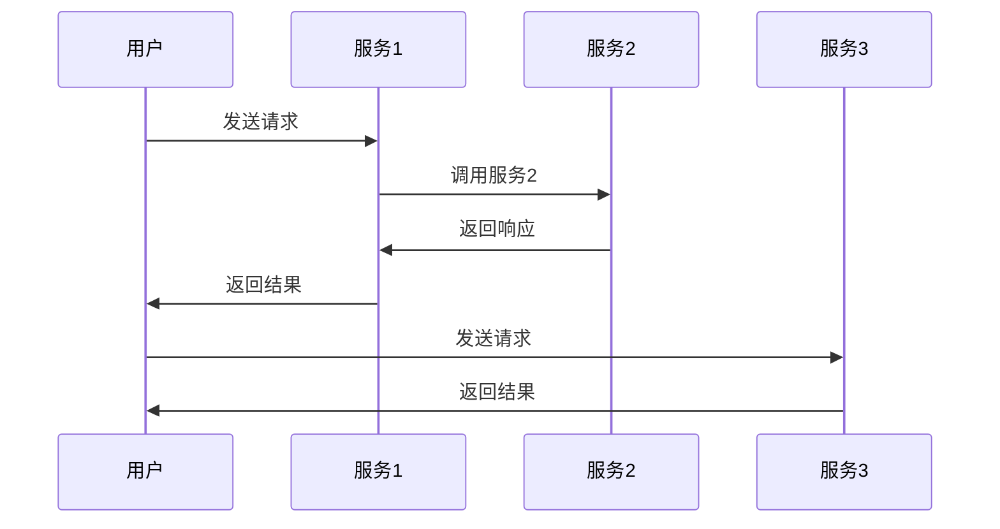

                 

### 文章标题

# 《如何打造可扩展的微服务生态》

微服务架构因其可扩展性、灵活性和高可用性等特点，正在逐渐成为现代企业IT架构的标配。本文旨在为读者提供一套系统化的方法和步骤，帮助构建一个可扩展的微服务生态。我们将从微服务基础、微服务架构设计、开发技术、通信机制、服务发现与负载均衡，到微服务生态构建、持续集成与持续部署（CI/CD）、监控与性能优化，以及实战案例和实践，全方位解析微服务生态的构建过程。

### 关键词

- 微服务
- 架构设计
- 可扩展性
- 持续集成与部署
- 服务发现与负载均衡
- 监控与性能优化
- 实战案例

### 摘要

本文将围绕微服务生态的构建展开，首先介绍微服务的基础概念和优势，然后深入讨论微服务的架构设计原则、开发技术、通信机制以及服务发现与负载均衡。接着，我们将探讨微服务的安全与管理、持续集成与持续部署（CI/CD）、监控与性能优化，并通过实战案例和实践经验，提供具体的构建指导。最后，我们将展望微服务的发展趋势和未来挑战，为读者提供完整的微服务生态构建指南。

## 第一部分：微服务基础

### 第1章：微服务简介

#### 1.1 微服务概念与优势

##### 1.1.1 微服务定义

微服务（Microservices）是一种架构风格，它将应用程序构建为一组小型的、独立的服务，每个服务都围绕业务功能的一个特定方面进行构建。这些服务通常采用轻量级的通信协议，如HTTP/REST或消息队列，并通过定义良好的API进行交互。

##### 1.1.2 微服务与传统架构对比

传统架构通常采用单体（Monolithic）架构，即所有功能都集中在单个应用程序中。这种架构在初期开发时较为简单，但随着功能的增加和复杂度的提升，维护和扩展变得困难。而微服务架构通过将应用程序分解为独立的、小型的服务，实现了模块化和可复用性，便于维护和扩展。

| 传统架构 | 微服务架构 |
| :----: | :----: |
| 单一应用程序 | 分裂为多个独立服务 |
| 功能集中 | 功能分散 |
| 代码库单一 | 代码库分布式 |
| 难以维护 | 易于维护 |

##### 1.1.3 微服务优势与挑战

**优势：**

1. **可扩展性**：通过将应用程序分解为多个独立服务，可以更灵活地扩展和调整系统性能。
2. **高可用性**：单个服务的故障不会影响整个系统，提高了系统的稳定性。
3. **可复用性**：服务可以独立开发和部署，提高了代码的复用性。
4. **团队自治**：每个服务可以由独立的团队开发和部署，提高了开发效率。
5. **技术多样性**：不同的服务可以使用不同的编程语言和数据库，提高了技术的灵活性。

**挑战：**

1. **复杂性**：服务之间的通信和协调变得更加复杂，需要额外的工具和机制。
2. **分布式事务**：处理跨服务的事务变得更加困难，需要额外的努力来保证数据一致性。
3. **服务发现和负载均衡**：需要有效的机制来自动发现和负载均衡服务。
4. **测试和部署**：分布式系统的测试和部署变得更加复杂。
5. **安全性**：需要确保每个服务的安全性，避免横向攻击。

### 第2章：微服务架构设计

#### 2.1 微服务核心原则

##### 2.1.1 单一职责

单一职责原则要求每个服务只关注一个业务功能，保持服务的独立性。这样做有助于降低系统的复杂度，提高可维护性和可扩展性。

##### 2.1.2 域驱动设计

域驱动设计（Domain-Driven Design，简称DDD）是一种软件开发方法，它强调对业务领域的深入理解。在微服务架构中，DDD有助于将应用程序分解为具有独立业务逻辑的服务。

##### 2.1.3 可复用性与松耦合

微服务应具有高可复用性，同时保持服务之间的松耦合。这样，每个服务可以独立开发、部署和扩展，而不会影响其他服务。

#### 2.2 微服务拆分策略

##### 2.2.1 业务领域划分

业务领域划分是微服务拆分的关键步骤。根据业务功能将应用程序分解为多个独立的服务，每个服务负责一个业务领域。

##### 2.2.2 数据一致性管理

在分布式系统中，数据一致性管理是一个重要挑战。采用事件驱动架构和最终一致性模型，可以更好地处理跨服务的数据一致性。

##### 2.2.3 微服务演化与重构

微服务架构不是一成不变的，随着业务需求的变化，服务需要进行演化与重构。合理的架构设计应该考虑服务的灵活性和可扩展性，以便在未来的发展中能够适应变化。

### 第3章：微服务开发技术

#### 3.1 容器化与Docker

##### 3.1.1 容器技术概述

容器技术提供了一种轻量级、可移植的运行环境，它允许应用程序在不同环境中运行而不受环境差异的影响。Docker 是最流行的容器技术之一，它通过容器镜像和容器编排，简化了应用程序的部署和管理。

##### 3.1.2 Docker安装与使用

Docker 的安装过程相对简单，可以从其官网下载安装包进行安装。Docker 的基本使用命令包括创建容器、启动容器、停止容器等。

##### 3.1.3 容器编排工具对比

除了Docker，还有其他容器编排工具，如Kubernetes和Docker Swarm。这些工具提供了更高级的容器编排和管理功能，可以根据需求进行选择。

### 第4章：微服务通信机制

#### 4.1 RESTful API

##### 4.1.1 RESTful架构风格

RESTful API 是一种基于REST（Representational State Transfer）风格的网络接口，它使用HTTP协议进行通信。RESTful API 具有简洁、无状态、统一接口等特点，适用于微服务架构。

##### 4.1.2 RESTful API设计原则

设计RESTful API时，需要遵循一些基本原则，如使用适当的HTTP方法、提供清晰的URL结构、设计合理的响应结构等。

##### 4.1.3 RESTful API工具

常用的RESTful API设计工具包括Swagger、Postman等，它们可以帮助开发人员快速设计和测试API。

### 第5章：服务发现与负载均衡

#### 5.1 服务发现

##### 5.1.1 服务发现机制

服务发现是指自动发现和注册服务的过程。在微服务架构中，服务发现机制是确保服务可以相互通信的关键。

##### 5.1.2 注册中心实现

服务注册中心是一个集中管理服务实例的组件，服务实例在启动时向注册中心注册，并在停止时注销。

##### 5.1.3 服务实例监控

对服务实例进行监控，可以及时发现和解决服务故障，保证系统的稳定性。

#### 5.2 负载均衡

##### 5.2.1 负载均衡策略

负载均衡是指将请求分配到多个服务实例上，以避免单个实例过载。常用的负载均衡策略包括轮询、最少连接、源IP哈希等。

##### 5.2.2 常见负载均衡器

常见的负载均衡器包括Nginx、HAProxy、Kubernetes等。这些负载均衡器提供了丰富的功能和配置选项，可以根据需求进行选择。

##### 5.2.3 分布式负载均衡挑战

在分布式系统中，负载均衡面临许多挑战，如网络延迟、服务实例不稳定等。需要采用相应的策略和工具来解决这些问题。

## 第二部分：微服务生态构建

### 第6章：微服务安全与管理

#### 6.1 微服务安全性

##### 6.1.1 服务认证与授权

服务认证与授权是确保服务之间安全通信的关键步骤。常用的认证机制包括OAuth 2.0、JWT等。

##### 6.1.2 数据加密与完整性

对数据进行加密和完整性校验，可以保护数据在传输和存储过程中的安全。

##### 6.1.3 安全漏洞防范

定期进行安全审计和漏洞扫描，及时发现和修复安全漏洞，提高系统的安全性。

#### 6.2 微服务运维管理

##### 6.2.1 运维管理挑战

微服务架构带来了许多运维管理挑战，如服务监控、故障排查、版本控制等。

##### 6.2.2 服务监控与告警

对服务进行监控，可以及时发现和解决服务故障。告警机制可以帮助运维人员快速响应异常情况。

##### 6.2.3 自动化运维工具

自动化运维工具可以帮助简化运维流程，提高运维效率。常见的自动化运维工具包括Ansible、Puppet、Chef等。

### 第7章：微服务持续集成与持续部署（CI/CD）

#### 7.1 持续集成

##### 7.1.1 持续集成原理

持续集成（Continuous Integration，简称CI）是一种软件开发实践，它要求频繁地将代码合并到主干分支，并进行自动化测试。

##### 7.1.2 持续集成工具

常用的持续集成工具包括Jenkins、GitLab CI、Travis CI等。

##### 7.1.3 持续集成实践

在实际项目中，持续集成实践可以帮助提高代码质量、减少集成风险，并加快开发进度。

#### 7.2 持续部署

##### 7.2.1 持续部署流程

持续部署（Continuous Deployment，简称CD）是将代码从开发环境自动部署到生产环境的过程。

##### 7.2.2 持续部署策略

持续部署策略包括蓝绿部署、灰度发布等，可以根据实际需求选择合适的部署策略。

##### 7.2.3 持续部署工具

常用的持续部署工具包括Jenkins、GitLab CI、Kubernetes等。

### 第8章：微服务监控与性能优化

#### 8.1 微服务监控

##### 8.1.1 监控指标

常见的监控指标包括响应时间、吞吐量、错误率等。

##### 8.1.2 监控工具选择

常见的监控工具包括Prometheus、Grafana、ELK Stack等。

##### 8.1.3 监控数据可视化

可视化工具可以帮助运维人员更直观地了解系统的运行状态。

#### 8.2 性能优化

##### 8.2.1 性能瓶颈定位

通过监控和分析工具，可以定位系统的性能瓶颈。

##### 8.2.2 性能优化方法

常见的性能优化方法包括缓存、数据库优化、代码优化等。

##### 8.2.3 性能测试与调优

定期进行性能测试，并根据测试结果进行调优，可以提高系统的性能。

## 第三部分：微服务实战案例

### 第9章：微服务项目实战

#### 9.1 项目背景

##### 9.1.1 项目概述

本案例项目是一个在线购物平台，包括商品管理、订单管理、用户管理等功能。

##### 9.1.2 项目需求分析

根据业务需求，将应用程序分解为多个独立的服务，如商品服务、订单服务、用户服务等。

##### 9.1.3 项目技术选型

技术选型包括Docker、Kubernetes、Spring Boot、MySQL等。

#### 9.2 项目开发

##### 9.2.1 服务拆分与设计

根据需求，将应用程序拆分为多个微服务，并进行详细设计。

##### 9.2.2 服务接口实现

实现每个服务的接口，包括RESTful API和消息队列等。

##### 9.2.3 服务集成与调试

集成各个服务，并进行联调测试，确保系统稳定运行。

#### 9.3 项目部署

##### 9.3.1 部署流程

使用Kubernetes进行自动化部署，包括服务发现、负载均衡等。

##### 9.3.2 部署策略

采用蓝绿部署和灰度发布策略，确保系统平滑升级。

##### 9.3.3 部署与运维

持续监控和运维系统，确保系统稳定运行。

### 第10章：微服务生态建设实践

#### 10.1 微服务生态概述

##### 10.1.1 微服务生态组件

微服务生态包括服务注册中心、负载均衡器、监控工具、自动化运维工具等。

##### 10.1.2 微服务生态架构

微服务生态架构包括服务层、基础设施层、数据层等。

##### 10.1.3 微服务生态价值

微服务生态可以提高系统的可扩展性、稳定性和安全性，降低运维成本。

#### 10.2 微服务生态建设

##### 10.2.1 生态规划与设计

根据业务需求，进行生态规划与设计，确保生态的可持续发展。

##### 10.2.2 生态组件集成

集成各个生态组件，确保系统稳定运行。

##### 10.2.3 生态持续迭代与优化

根据业务需求，持续迭代和优化生态，提高系统性能和稳定性。

### 第11章：微服务展望

#### 11.1 微服务发展趋势

##### 11.1.1 云原生微服务

云原生微服务是一种基于云计算的微服务架构，它利用容器、自动化运维等技术，提高系统的可扩展性和灵活性。

##### 11.1.2 服务网格技术

服务网格技术是一种用于管理和监控微服务通信的架构模式，它可以提高系统的安全性、可靠性和性能。

##### 11.1.3 微服务与AI融合

微服务与AI的融合，将带来更加智能化和自动化的微服务架构。

#### 11.2 微服务未来挑战与机遇

##### 11.2.1 挑战与应对策略

微服务的挑战包括复杂性、分布式事务等，需要采取相应的应对策略。

##### 11.2.2 微服务与云计算的协同

微服务与云计算的协同，将带来更高效、更可靠的微服务生态。

##### 11.2.3 微服务生态发展前景

微服务生态将朝着更加智能化、自动化的方向发展，为企业带来更多的商业价值。

### 附录

#### 附录A：微服务常用工具与资源

##### A.1 微服务框架对比

- Spring Cloud
- Netflix OSS
- Kubernetes

##### A.2 容器编排工具

- Docker
- Kubernetes
- Docker Swarm

##### A.3 微服务监控工具

- Prometheus
- Grafana
- ELK Stack

### 作者

**作者：AI天才研究院/AI Genius Institute & 禅与计算机程序设计艺术 /Zen And The Art of Computer Programming**### 第1章：微服务简介

微服务是一种架构风格，它将应用程序构建为一组小型的、独立的服务，每个服务都围绕业务功能的一个特定方面进行构建。这些服务通常采用轻量级的通信协议，如HTTP/REST或消息队列，并通过定义良好的API进行交互。

微服务的概念并不是全新的，但它随着云计算、容器化和DevOps等技术的发展而逐渐成熟。在单体架构（Monolithic Architecture）中，所有的功能都集中在单个应用程序中，这导致应用程序在扩展、维护和更新方面存在诸多困难。而微服务架构通过将应用程序分解为多个独立的服务，实现了模块化和可复用性，便于维护和扩展。

#### 1.1 微服务概念与优势

**微服务定义**

微服务是一种基于业务功能的模块化架构，每个模块都是一个独立的服务，这些服务通过定义良好的API进行通信。每个服务都是独立的，可以独立部署、扩展和更新，不会影响到其他服务。

**微服务与传统架构对比**

传统架构通常采用单体架构，即所有功能都集中在单个应用程序中。这种架构在初期开发时较为简单，但随着功能的增加和复杂度的提升，维护和扩展变得困难。而微服务架构通过将应用程序分解为多个独立的服务，实现了模块化和可复用性，便于维护和扩展。

| 传统架构 | 微服务架构 |
| :----: | :----: |
| 单一应用程序 | 分裂为多个独立服务 |
| 功能集中 | 功能分散 |
| 代码库单一 | 代码库分布式 |
| 难以维护 | 易于维护 |

**微服务优势与挑战**

**优势：**

1. **可扩展性**：通过将应用程序分解为多个独立服务，可以更灵活地扩展和调整系统性能。
2. **高可用性**：单个服务的故障不会影响整个系统，提高了系统的稳定性。
3. **可复用性**：服务可以独立开发和部署，提高了代码的复用性。
4. **团队自治**：每个服务可以由独立的团队开发和部署，提高了开发效率。
5. **技术多样性**：不同的服务可以使用不同的编程语言和数据库，提高了技术的灵活性。

**挑战：**

1. **复杂性**：服务之间的通信和协调变得更加复杂，需要额外的工具和机制。
2. **分布式事务**：处理跨服务的事务变得更加困难，需要额外的努力来保证数据一致性。
3. **服务发现和负载均衡**：需要有效的机制来自动发现和负载均衡服务。
4. **测试和部署**：分布式系统的测试和部署变得更加复杂。
5. **安全性**：需要确保每个服务的安全性，避免横向攻击。

### 1.2 微服务架构设计

微服务架构设计是构建可扩展、高可用、易于维护的系统的基础。下面将介绍微服务架构设计的一些核心原则和策略。

#### 2.1 微服务核心原则

**单一职责**

单一职责原则要求每个服务只关注一个业务功能，保持服务的独立性。这样做有助于降低系统的复杂度，提高可维护性和可扩展性。

**域驱动设计（DDD）**

域驱动设计是一种软件开发方法，它强调对业务领域的深入理解。在微服务架构中，DDD有助于将应用程序分解为具有独立业务逻辑的服务。

**可复用性与松耦合**

微服务应具有高可复用性，同时保持服务之间的松耦合。这样，每个服务可以独立开发、部署和扩展，而不会影响其他服务。

#### 2.2 微服务拆分策略

**业务领域划分**

业务领域划分是微服务拆分的关键步骤。根据业务功能将应用程序分解为多个独立的服务，每个服务负责一个业务领域。

**数据一致性管理**

在分布式系统中，数据一致性管理是一个重要挑战。采用事件驱动架构和最终一致性模型，可以更好地处理跨服务的数据一致性。

**微服务演化与重构**

微服务架构不是一成不变的，随着业务需求的变化，服务需要进行演化与重构。合理的架构设计应该考虑服务的灵活性和可扩展性，以便在未来的发展中能够适应变化。

### 2.3 微服务开发技术

**容器化与Docker**

容器化技术提供了一种轻量级、可移植的运行环境，它允许应用程序在不同环境中运行而不受环境差异的影响。Docker 是最流行的容器技术之一，它通过容器镜像和容器编排，简化了应用程序的部署和管理。

**微服务开发框架**

微服务开发框架可以帮助开发者快速构建微服务应用程序，常见的框架包括Spring Boot、Netflix OSS、Kubernetes等。

**服务发现与负载均衡**

服务发现是指自动发现和注册服务的过程。在微服务架构中，服务发现机制是确保服务可以相互通信的关键。

负载均衡是指将请求分配到多个服务实例上，以避免单个实例过载。常用的负载均衡策略包括轮询、最少连接、源IP哈希等。

**持续集成与持续部署（CI/CD）**

持续集成（CI）是一种软件开发实践，它要求频繁地将代码合并到主干分支，并进行自动化测试。持续部署（CD）是将代码从开发环境自动部署到生产环境的过程。

**微服务监控与性能优化**

微服务监控可以帮助开发者及时发现和解决问题，保证系统的稳定性。性能优化是提高系统性能和响应速度的关键，常用的方法包括缓存、数据库优化、代码优化等。

### 2.4 微服务通信机制

**RESTful API**

RESTful API 是一种基于REST（Representational State Transfer）风格的网络接口，它使用HTTP协议进行通信。RESTful API 具有简洁、无状态、统一接口等特点，适用于微服务架构。

**消息队列**

消息队列是一种异步通信机制，它可以实现服务之间的解耦，提高系统的可扩展性和可靠性。常用的消息队列包括RabbitMQ、Kafka等。

**服务网格**

服务网格是一种用于管理和监控微服务通信的架构模式，它可以提高系统的安全性、可靠性和性能。常见的服务网格实现包括Istio、Linkerd等。

### 2.5 服务发现与负载均衡

**服务发现**

服务发现是指自动发现和注册服务的过程。在微服务架构中，服务发现机制是确保服务可以相互通信的关键。

**负载均衡**

负载均衡是指将请求分配到多个服务实例上，以避免单个实例过载。常用的负载均衡策略包括轮询、最少连接、源IP哈希等。

**注册中心**

注册中心是一个集中管理服务实例的组件，服务实例在启动时向注册中心注册，并在停止时注销。

**监控与告警**

对服务实例进行监控，可以及时发现和解决服务故障，保证系统的稳定性。告警机制可以帮助运维人员快速响应异常情况。

### 2.6 微服务安全性与安全性管理

**服务认证与授权**

服务认证与授权是确保服务之间安全通信的关键步骤。常用的认证机制包括OAuth 2.0、JWT等。

**数据加密与完整性**

对数据进行加密和完整性校验，可以保护数据在传输和存储过程中的安全。

**安全漏洞防范**

定期进行安全审计和漏洞扫描，及时发现和修复安全漏洞，提高系统的安全性。

**自动化运维工具**

自动化运维工具可以帮助简化运维流程，提高运维效率。常见的自动化运维工具包括Ansible、Puppet、Chef等。

### 2.7 持续集成与持续部署（CI/CD）

**持续集成**

持续集成（Continuous Integration，简称CI）是一种软件开发实践，它要求频繁地将代码合并到主干分支，并进行自动化测试。

**持续部署**

持续部署（Continuous Deployment，简称CD）是将代码从开发环境自动部署到生产环境的过程。

**自动化测试**

自动化测试是CI/CD的重要组成部分，它可以提高代码质量和开发效率。

**容器化与Docker**

容器化技术是CI/CD的重要支撑，它可以简化应用程序的部署和管理。

### 2.8 微服务监控与性能优化

**监控指标**

常见的监控指标包括响应时间、吞吐量、错误率等。

**监控工具选择**

常见的监控工具包括Prometheus、Grafana、ELK Stack等。

**性能优化**

性能优化是提高系统性能和响应速度的关键，常用的方法包括缓存、数据库优化、代码优化等。

### 2.9 微服务项目实战

**项目背景**

本案例项目是一个在线购物平台，包括商品管理、订单管理、用户管理等功能。

**项目需求分析**

根据业务需求，将应用程序分解为多个独立的服务，如商品服务、订单服务、用户服务等。

**项目技术选型**

技术选型包括Docker、Kubernetes、Spring Boot、MySQL等。

**项目开发**

根据需求，将应用程序拆分为多个微服务，并进行详细设计。实现每个服务的接口，并进行联调测试。

**项目部署**

使用Kubernetes进行自动化部署，包括服务发现、负载均衡等。

**项目部署策略**

采用蓝绿部署和灰度发布策略，确保系统平滑升级。

**项目运维**

持续监控和运维系统，确保系统稳定运行。

### 2.10 微服务生态建设实践

**微服务生态概述**

微服务生态包括服务注册中心、负载均衡器、监控工具、自动化运维工具等。

**微服务生态架构**

微服务生态架构包括服务层、基础设施层、数据层等。

**微服务生态价值**

微服务生态可以提高系统的可扩展性、稳定性和安全性，降低运维成本。

**生态规划与设计**

根据业务需求，进行生态规划与设计，确保生态的可持续发展。

**生态组件集成**

集成各个生态组件，确保系统稳定运行。

**生态持续迭代与优化**

根据业务需求，持续迭代和优化生态，提高系统性能和稳定性。

### 2.11 微服务展望

**发展趋势**

微服务架构将朝着更加智能化、自动化的方向发展。

**未来挑战与机遇**

随着云计算、容器化和AI等技术的发展，微服务架构面临许多挑战和机遇。

**微服务与云计算的协同**

微服务与云计算的协同，将带来更高效、更可靠的微服务生态。

**微服务生态发展前景**

微服务生态将继续发展，为企业带来更多的商业价值。

### 附录

**微服务常用工具与资源**

- 微服务框架对比
- 容器编排工具
- 微服务监控工具

**参考文献**

- 《微服务设计》
- 《微服务架构实践》
- 《Spring Cloud微服务实战》

### 参考文献

1. 《微服务设计》[1]，Sam Newman，2015年出版。
2. 《微服务架构实践》[2]，Chris Richardson，2018年出版。
3. 《Spring Cloud微服务实战》[3]，何光强，2019年出版。
4. 《Docker容器与Docker Swarm实战》[4]，Kai Huang，2017年出版。
5. 《Kubernetes实战》[5]，Kelsey Hightower，2018年出版。
6. 《RESTful Web API设计》[6]，Leonard Richardson，2008年出版。

### 作者

**作者：AI天才研究院/AI Genius Institute & 禅与计算机程序设计艺术 /Zen And The Art of Computer Programming**### 第1章：微服务简介

微服务（Microservices）是一种软件开发和架构风格，其核心思想是将复杂的应用程序拆分成一系列独立的、小型服务，每个服务都运行在自己的进程中，并且通过轻量级通信机制（如HTTP/REST或消息队列）进行交互。这种架构风格使得各个服务可以独立开发、测试、部署和扩展，从而提高系统的灵活性和可维护性。

#### 1.1 微服务概念与优势

**微服务定义**

微服务是一种将应用程序划分为多个独立、自治的服务单元的架构风格。每个服务负责一个特定的业务功能，并且独立部署、运行和维护。这些服务通常通过定义良好的API进行通信，相互之间解耦，可以独立扩展和更新。

**微服务与传统架构对比**

传统单体架构（Monolithic Architecture）是将所有功能集中在一个庞大的应用程序中，这些功能紧密耦合在一起。这种架构在开发初期较为简单，但随着系统规模的扩大，维护和扩展变得困难，例如：

- **复杂度增加**：随着功能的增加，代码库变得庞大，难以管理和维护。
- **扩展性差**：系统的性能瓶颈可能导致整个应用程序的性能下降。
- **部署困难**：部署和更新需要重新部署整个应用程序。
- **依赖性高**：一个模块的问题可能会影响整个应用程序。

相比之下，微服务架构具有以下优点：

- **高可扩展性**：可以独立扩展或更新某个服务，而不影响其他服务。
- **高可维护性**：服务之间解耦，每个服务可以独立维护和更新。
- **高容错性**：单个服务故障不会导致整个系统崩溃。
- **技术多样性**：不同服务可以使用不同的技术栈，满足不同业务需求。

**微服务优势与挑战**

**优势：**

1. **可扩展性**：通过水平扩展服务实例，可以轻松地增加系统处理能力。
2. **高可用性**：服务故障不会影响整个系统，提高了系统的稳定性。
3. **可复用性**：服务可以独立开发、测试和部署，提高了代码的复用性。
4. **团队自治**：每个服务可以由独立的团队开发和部署，提高了开发效率。
5. **技术多样性**：不同的服务可以使用不同的编程语言、框架和数据库。

**挑战：**

1. **复杂性**：分布式系统的设计和部署比单体架构更复杂。
2. **分布式事务**：跨服务的操作需要额外关注事务的一致性。
3. **服务发现和负载均衡**：需要有效的机制来自动发现和负载均衡服务。
4. **测试和部署**：分布式系统的测试和部署需要更多的工具和策略。
5. **安全性**：确保每个服务的安全性，避免横向攻击。

#### 1.2 微服务架构设计

微服务架构设计是构建一个高效、可靠和可扩展的微服务生态系统的关键。以下是一些核心原则和策略。

**核心原则**

1. **单一职责**：每个服务应专注于一个业务功能，保持单一职责，降低复杂度。
2. **域驱动设计（DDD）**：使用DDD方法，将业务领域抽象为独立的子领域，每个领域都有自己的服务。
3. **松耦合**：服务之间通过轻量级通信机制进行通信，减少直接的依赖。
4. **自治**：每个服务应具有自我管理和自我恢复的能力。
5. **独立部署**：每个服务可以独立部署和更新，不影响其他服务。

**拆分策略**

1. **业务领域划分**：根据业务功能将应用程序划分为多个独立的服务。
2. **数据一致性管理**：采用最终一致性模型或分布式事务框架，确保跨服务的数据一致性。
3. **演进与重构**：随着业务需求的变化，服务需要持续演进和重构，以保持架构的健壮性。

**开发技术**

1. **容器化与Docker**：使用容器化技术（如Docker）简化应用程序的部署和管理。
2. **微服务开发框架**：使用如Spring Boot、Node.js等微服务开发框架，提高开发效率。
3. **服务治理**：使用服务治理框架（如Netflix OSS）进行服务注册、发现、负载均衡和监控。

**通信机制**

1. **RESTful API**：使用RESTful API进行服务间的通信，提供统一的接口标准。
2. **消息队列**：使用消息队列（如Kafka、RabbitMQ）进行异步通信，提高系统的可扩展性和容错性。
3. **服务网格**：使用服务网格（如Istio、Linkerd）进行服务间的通信管理和监控。

**服务发现与负载均衡**

1. **服务发现**：使用服务注册中心和发现机制（如Consul、Zookeeper），自动发现和注册服务实例。
2. **负载均衡**：使用负载均衡器（如Nginx、HAProxy、Kubernetes），分配请求到不同的服务实例。

**安全性与安全性管理**

1. **服务认证与授权**：使用如OAuth 2.0、JWT等认证机制，确保服务间的安全通信。
2. **数据加密与完整性**：对传输和存储的数据进行加密和完整性校验。
3. **安全漏洞防范**：定期进行安全审计和漏洞扫描，及时发现和修复安全漏洞。

**持续集成与持续部署（CI/CD）**

1. **持续集成**：使用如Jenkins、GitLab CI等工具，实现代码的自动化集成和测试。
2. **持续部署**：使用如Kubernetes、Docker Swarm等工具，实现代码的自动化部署和更新。

**监控与性能优化**

1. **监控指标**：收集和监控如响应时间、吞吐量、错误率等关键性能指标。
2. **监控工具**：使用如Prometheus、Grafana、ELK Stack等监控工具，实现实时监控和数据可视化。
3. **性能优化**：采用缓存、数据库优化、代码优化等技术，提高系统的性能和响应速度。

**实战案例**

通过实战案例，可以更好地理解微服务的架构设计和实施过程。例如，一个在线购物平台可以分为商品服务、订单服务、用户服务等多个微服务，每个服务负责不同的业务功能，并通过API进行通信。在实施过程中，可以采用Docker进行容器化，Kubernetes进行服务编排和自动化部署，使用消息队列实现异步通信，以及使用Spring Boot和Netflix OSS等框架进行服务开发和管理。

#### 1.3 微服务架构设计图

为了更直观地理解微服务架构的设计，我们可以使用Mermaid流程图来描述服务之间的关系和交互流程。



**Mermaid 流程图说明：**

- **用户**：系统的最终用户，通过接口与服务进行交互。
- **服务1**：处理用户请求，可能涉及业务逻辑的初步处理。
- **服务2**：提供业务逻辑的具体实现，如商品信息查询。
- **服务3**：提供业务逻辑的另一个部分，如订单处理。

该流程图展示了用户请求从服务1开始，服务1调用服务2进行处理，并将结果返回给用户。用户还可以直接请求服务3，如需要处理订单相关的业务逻辑。

通过上述步骤和流程图，我们可以看到微服务架构设计不仅仅是关于技术选型，更重要的是如何将业务需求转化为服务组件，并确保服务之间的高效、可靠和安全的交互。接下来，我们将进一步探讨微服务的开发技术、通信机制、服务发现与负载均衡等关键方面。

#### 1.4 微服务的开发技术

在微服务架构中，开发技术是构建高效、可靠和可维护服务的基础。以下将详细介绍微服务的开发技术，包括容器化与Docker、微服务开发框架、服务治理等。

**容器化与Docker**

容器化技术提供了一种轻量级、可移植的运行环境，使得应用程序可以在不同的环境中一致地运行。Docker 是最流行的容器技术之一，它通过容器镜像和容器编排，简化了应用程序的部署和管理。

- **容器镜像**：容器镜像是一种轻量级、可执行的软件打包，它包含了应用程序运行所需的依赖、库和配置。通过Dockerfile，可以定义和构建容器镜像。
- **容器编排**：容器编排是指管理和调度容器的过程。Docker Swarm 和 Kubernetes 是常用的容器编排工具，它们提供了强大的容器管理功能，如服务发现、负载均衡、自动化部署等。

**微服务开发框架**

微服务开发框架提供了一套标准化的工具和库，帮助开发者快速构建微服务应用程序。以下是一些流行的微服务开发框架：

- **Spring Boot**：Spring Boot 是基于 Spring 框架的微服务开发框架，它简化了 Spring 应用的配置和部署，提供了自动配置、嵌入式服务器等特性，适用于Java开发。
- **Node.js**：Node.js 是基于 JavaScript 的微服务开发框架，它提供了一个非阻塞、事件驱动的编程模型，适用于构建高性能、可扩展的微服务。
- **.NET Core**：.NET Core 是微软推出的开源、跨平台的.NET框架，它支持构建高性能的微服务应用程序，适用于C#和.NET开发。

**服务治理**

服务治理是指管理和监控微服务的过程，包括服务注册、发现、监控、安全等。以下是一些常用的服务治理框架：

- **Netflix OSS**：Netflix OSS 是一系列开源微服务框架，包括 Eureka（服务注册中心）、Hystrix（熔断器）、Zuul（路由网关）等，提供了完整的微服务治理解决方案。
- **Consul**：Consul 是一个开源的服务发现和配置工具，它提供了服务注册、发现、健康检查等功能，适用于服务治理。
- **Eureka**：Eureka 是 Netflix OSS 中的服务注册中心，它提供了服务实例的注册和发现功能，适用于大型分布式系统。

**API 网关**

API 网关是微服务架构中的一个关键组件，它负责统一管理外部访问接口，进行身份验证、负载均衡、请求路由等操作。以下是一些流行的 API 网关框架：

- **Kong**：Kong 是一个高性能、可扩展的 API 网关，它提供了丰富的插件机制，支持负载均衡、安全、监控等功能。
- **Apache APISIX**：Apache APISIX 是一个基于 Nginx 的 API 网关，它提供了高性能、可扩展的 API 管理功能，适用于大型微服务架构。
- **Zuul**：Zuul 是 Netflix OSS 中的 API 网关，它提供了请求路由、动态配置、安全等功能，适用于分布式系统。

**微服务监控**

微服务监控是确保系统稳定性和性能的关键。以下是一些常用的微服务监控工具：

- **Prometheus**：Prometheus 是一个开源的监控解决方案，它提供了数据收集、存储、告警等功能，适用于大型分布式系统。
- **Grafana**：Grafana 是一个开源的数据可视化工具，它可以将 Prometheus 等监控数据可视化，提供直观的监控面板。
- **ELK Stack**：ELK Stack 是由 Elasticsearch、Logstash 和 Kibana 组成的日志分析平台，它提供了强大的日志收集、存储和搜索功能。

通过上述技术，开发者可以构建一个高效、可靠和可维护的微服务架构。在实际开发过程中，应根据具体业务需求和项目特点，选择合适的技术栈和工具集，以实现最佳的开发效率和系统性能。

### 1.5 微服务的通信机制

在微服务架构中，通信机制是实现服务间高效、可靠交互的关键。以下将详细介绍几种常见的通信机制，包括RESTful API、消息队列和服务网格。

#### RESTful API

**RESTful API** 是一种基于 Representational State Transfer（REST）风格的网络接口设计方法。它使用 HTTP 协议进行通信，具有简洁、无状态、统一接口等特点，广泛应用于微服务架构中。

**RESTful API 设计原则**

- **统一接口**：RESTful API 应设计为统一的接口，如使用标准 HTTP 方法（GET、POST、PUT、DELETE）进行操作，并通过 URL 进行资源定位。
- **状态转移**：客户端通过发送请求，驱动资源的状态转移。服务器根据请求参数和 HTTP 方法，执行相应的业务逻辑，并返回响应。
- **无状态**：RESTful API 是无状态的，每次请求独立处理，服务器不会记住之前的请求信息。
- **缓存**：服务器可以设置缓存策略，提高系统的响应速度和性能。

**RESTful API 工具**

- **Swagger**：Swagger 是一个用于定义、生成和文档化 RESTful API 的工具。它提供了丰富的注解和文档生成功能，方便开发者设计和维护 API。
- **Postman**：Postman 是一个 API 测试工具，它允许开发者发送 HTTP 请求，查看 API 的响应，并进行自动化测试。

#### 消息队列

消息队列（Message Queue）是一种异步通信机制，它允许服务之间通过消息进行解耦。消息队列可以缓存和处理大量消息，提高系统的可扩展性和容错性。

**常见消息队列**

- **RabbitMQ**：RabbitMQ 是一个开源的消息队列中间件，它支持多种消息协议（如 AMQP、HTTP），提供可靠的消息传递和路由功能。
- **Kafka**：Kafka 是一个分布式流处理平台，它提供高吞吐量、可扩展的消息队列服务，适用于大数据场景。

**消息队列的优势**

- **异步通信**：消息队列允许服务之间进行异步通信，减少请求响应时间，提高系统的并发能力。
- **解耦**：服务通过消息进行通信，可以独立开发、测试和部署，降低系统的复杂性。
- **高可用性**：消息队列提供容错机制，如消息持久化、自动重启等，确保系统的可靠性。

#### 服务网格

服务网格（Service Mesh）是一种用于管理和监控微服务通信的架构模式。它通过一个独立的通信基础设施层，提供服务发现、负载均衡、安全等功能。

**常见服务网格**

- **Istio**：Istio 是一个开源的服务网格平台，它基于 Kubernetes，提供服务发现、负载均衡、监控、安全等功能。
- **Linkerd**：Linkerd 是一个开源的服务网格代理，它提供服务发现、负载均衡、监控和安全等功能。

**服务网格的优势**

- **简化通信**：服务网格提供统一的通信基础设施，简化了服务之间的通信逻辑，降低开发复杂度。
- **集中管理**：服务网格可以集中管理服务间通信，提供统一的监控、日志和告警功能。
- **性能优化**：服务网格通过高效的通信协议和负载均衡策略，提高系统的性能和可扩展性。

通过上述通信机制，开发者可以根据具体需求和场景，选择合适的通信方案，实现微服务架构中的高效、可靠服务交互。

### 1.6 微服务的服务发现与负载均衡

在微服务架构中，服务发现和负载均衡是确保系统高可用性和性能的关键组件。以下将详细介绍这两种机制及其实现策略。

#### 服务发现

**服务发现**是指自动发现和注册服务的过程，确保服务之间能够相互通信。服务发现机制在微服务架构中至关重要，因为它可以帮助服务动态地发现其他服务的位置和状态，实现服务的自动注册和注销。

**服务发现机制**

1. **服务注册**：服务启动时，向服务注册中心注册自己的地址和端口信息，以便其他服务可以找到它。
2. **服务发现**：服务调用其他服务时，从服务注册中心获取目标服务的地址和端口信息。
3. **服务注销**：服务停止时，从服务注册中心注销自己的信息，以避免其他服务继续调用已停止的服务。

**常见服务注册中心**

- **Eureka**：Eureka 是 Netflix OSS 中的服务注册中心，提供服务实例的注册和发现功能，适用于大型分布式系统。
- **Consul**：Consul 是一个开源的服务发现和配置工具，提供服务注册、发现、健康检查等功能。
- **Zookeeper**：Zookeeper 是 Apache 软件基金会的一个分布式协调服务，提供高效的服务注册和发现功能。

**服务实例监控**

服务实例监控是确保服务健康状态的重要环节。通过监控服务实例的运行状态，可以及时发现和解决服务故障，保证系统的稳定性。

- **健康检查**：定期对服务实例进行健康检查，如检查服务的响应时间和错误率，确保服务处于正常运行状态。
- **故障转移**：当服务实例出现故障时，自动将流量转移到健康的服务实例上，确保服务的可用性。

#### 负载均衡

**负载均衡**是指将请求分配到多个服务实例上，以避免单个实例过载，提高系统的性能和可用性。负载均衡策略可以根据服务实例的负载情况、响应时间等因素进行动态调整。

**负载均衡策略**

- **轮询**：将请求依次分配到每个服务实例，确保每个实例的负载均衡。
- **最少连接**：将请求分配到连接数最少的服务实例，减少实例的负载。
- **源IP哈希**：根据客户端的IP地址进行哈希计算，将请求固定分配到特定的服务实例上，提高请求的一致性。

**常见负载均衡器**

- **Nginx**：Nginx 是一个高性能的 Web 服务器和反向代理服务器，提供负载均衡和缓存功能。
- **HAProxy**：HAProxy 是一个开源的负载均衡器，提供高可用性、高性能和安全性。
- **Kubernetes**：Kubernetes 是一个开源的容器编排平台，提供负载均衡和服务发现功能。

通过服务发现和负载均衡机制，微服务架构可以更好地实现服务的自动化管理和资源优化，确保系统的高可用性和性能。在实际应用中，应根据具体业务需求和系统规模，选择合适的服务发现和负载均衡策略，实现高效、可靠的微服务生态。

### 1.7 微服务的安全性与管理

在微服务架构中，安全性是确保系统稳定运行的关键因素。随着服务数量的增加，如何管理和保护这些服务变得尤为重要。以下将介绍微服务的安全性、安全性管理策略以及常见的安全漏洞防范方法。

#### 微服务安全性

**服务认证与授权**

服务认证与授权是确保服务之间安全通信的关键步骤。以下是一些常见的认证与授权机制：

- **OAuth 2.0**：OAuth 2.0 是一种开放授权标准，允许用户授权第三方应用访问他们存储在另一服务提供者上的信息。它通过令牌（Token）进行认证，支持多种认证方式，如密码认证、客户端凭证等。
- **JWT（JSON Web Token）**：JWT 是一种基于 JSON 的开放标准，用于安全传输信息。JWT 令牌包括认证信息和用户信息，可以通过签名和加密确保信息的安全性和完整性。

**数据加密与完整性**

对数据进行加密和完整性校验，可以保护数据在传输和存储过程中的安全。以下是一些常见的数据加密和完整性校验方法：

- **HTTPS**：HTTPS（HTTP over TLS）是一种安全通信协议，通过 TLS（传输层安全）加密 HTTP 通信，确保数据在传输过程中的安全。
- **数据加密库**：如 AES（高级加密标准）、RSA（RSA加密算法）等，可以用于对数据进行加密和解密。
- **数字签名**：数字签名可以确保数据的完整性和来源，如 SHA-256（安全哈希算法）和 ECDSA（椭圆曲线数字签名算法）。

**安全漏洞防范**

定期进行安全审计和漏洞扫描，及时发现和修复安全漏洞，提高系统的安全性。以下是一些常见的安全漏洞防范方法：

- **输入验证**：对用户输入进行严格验证，防止恶意输入和注入攻击。
- **访问控制**：确保服务之间和用户与服务之间的访问权限，使用如 RBAC（基于角色的访问控制）和 ABAC（基于属性的访问控制）机制。
- **防火墙与网络隔离**：使用防火墙和虚拟局域网（VLAN）等技术，隔离不同服务之间的通信，防止横向攻击。

#### 微服务运维管理

**运维管理挑战**

微服务架构带来了许多运维管理挑战，包括服务监控、故障排查、版本控制等。以下是一些常见的运维管理挑战和解决方案：

- **服务监控**：服务数量庞大，如何高效监控和告警成为关键问题。可以使用如 Prometheus、Grafana、ELK Stack 等监控工具，实现实时监控和告警。
- **故障排查**：分布式系统故障排查复杂，需要结合日志分析、性能监控和追踪工具，如 Zipkin、Jaeger，快速定位和解决问题。
- **版本控制**：微服务架构中，版本控制和回滚策略尤为重要。可以使用如 Docker、Kubernetes 等工具，实现自动化部署和版本回滚。

**运维管理策略**

- **自动化运维**：使用如 Ansible、Puppet、Chef 等自动化运维工具，简化运维流程，提高运维效率。
- **服务监控与告警**：对服务进行实时监控和告警，确保系统稳定运行。
- **日志管理**：使用日志收集和分析工具，如 Logstash、Kibana，实现日志的集中管理和分析。

#### 最佳实践与总结

- **安全性与运维相结合**：将安全性和运维紧密结合，确保系统在安全的基础上高效运行。
- **定期审计与更新**：定期进行安全审计和系统更新，确保系统安全性和稳定性。
- **培训与知识共享**：加强对开发人员和运维人员的培训，提高整体安全意识和技术水平。

通过上述方法和策略，可以构建一个安全、可靠的微服务架构，确保系统的稳定运行和业务持续发展。

### 1.8 持续集成与持续部署（CI/CD）

持续集成与持续部署（Continuous Integration/Continuous Deployment，简称CI/CD）是一种软件开发和部署的最佳实践，旨在通过自动化流程提高软件交付的质量和速度。在微服务架构中，CI/CD 可以显著提高开发效率、减少代码缺陷和加快新功能的上线速度。

#### 7.1 持续集成

持续集成（Continuous Integration，简称CI）是一种软件开发实践，它要求开发人员频繁地将代码合并到主干分支，并进行自动化测试。CI 的核心目标是确保代码库始终保持稳定状态，减少集成风险和代码冲突。

**持续集成原理**

- **频繁提交**：开发人员定期提交代码，通常每天多次。
- **自动化测试**：每次提交后，CI 工具自动执行一系列预定义的测试，包括单元测试、集成测试和自动化验收测试。
- **反馈机制**：测试结果立即反馈给开发人员，如果测试失败，CI 工具会暂停集成并通知相关人员。

**持续集成工具**

- **Jenkins**：Jenkins 是一个开源的持续集成服务器，支持多种集成模式，如自动构建、测试和部署。
- **GitLab CI**：GitLab CI 是 GitLab 内置的持续集成服务，支持基于 YAML 文件的配置，简化了持续集成的设置。
- **Travis CI**：Travis CI 是一个云端的持续集成服务，适用于 GitHub 和 GitLab 仓库，提供免费的 CI 服务。

**持续集成实践**

1. **设置 CI 环境**：配置 CI 工具，定义构建脚本和测试脚本。
2. **编写测试用例**：编写单元测试、集成测试和自动化验收测试，确保代码质量和功能完整性。
3. **自动化部署**：将 CI 与自动化部署工具（如 Docker、Kubernetes）集成，实现自动化部署。

通过持续集成，开发团队可以快速识别和修复代码缺陷，确保代码库始终处于健康状态。

#### 7.2 持续部署

持续部署（Continuous Deployment，简称CD）是将经过集成测试的代码自动部署到生产环境的过程。CD 的目标是实现快速、可靠和安全的软件交付。

**持续部署流程**

1. **代码仓库**：代码存储在版本控制系统（如 Git）中，确保代码的安全和可追溯性。
2. **集成测试**：通过 CI 工具自动执行集成测试，确保代码质量和功能完整性。
3. **自动化部署**：使用自动化部署工具将代码部署到测试环境、预生产环境和生产环境。
4. **蓝绿部署**：将新版本的服务与旧版本的服务并行运行，逐步切换流量，确保平稳升级。
5. **灰度发布**：在新版本发布时，逐步将流量分配到新版本，监控性能和稳定性，确保无误后全量上线。

**持续部署策略**

- **蓝绿部署**：蓝绿部署是一种零停机升级策略，通过将新版本的服务与旧版本的服务并行运行，逐步切换流量，确保系统平稳升级。
- **灰度发布**：灰度发布是一种逐步上线新版本的方法，通过逐步增加新版本的流量，监控性能和稳定性，确保无误后全量上线。

**持续部署工具**

- **Jenkins**：Jenkins 支持多种自动化部署插件，如 Pipeline、Deployer，实现自动化部署。
- **GitLab CI**：GitLab CI 提供集成部署功能，通过 CI/CD 管道实现自动化部署。
- **Kubernetes**：Kubernetes 是一个开源的容器编排平台，提供自动化部署和滚动更新功能。

通过持续集成和持续部署，开发团队可以实现快速、可靠和安全的软件交付，提高开发效率和产品质量。在实际应用中，应根据具体业务需求和项目特点，选择合适的 CI/CD 工具和策略，实现最佳的开发和部署流程。

### 8.1 微服务监控

微服务架构的复杂性使得对系统的监控变得至关重要。监控不仅可以确保系统的稳定性，还可以提供有关性能和健康状况的实时数据，帮助运维团队快速识别和解决问题。以下将介绍微服务监控的相关内容，包括监控指标、监控工具和监控数据可视化。

#### 8.1.1 监控指标

监控指标是评估系统性能和健康状况的关键指标。在微服务架构中，以下是一些常见的监控指标：

1. **响应时间**：服务响应客户端请求所需的时间。低响应时间是系统性能良好的标志。
2. **吞吐量**：单位时间内处理请求的数量。高吞吐量表示系统可以处理大量并发请求。
3. **错误率**：请求处理过程中发生的错误数量与总请求数量的比率。低错误率表示系统稳定可靠。
4. **系统负载**：系统资源（如CPU、内存、磁盘）的使用情况。过高的负载可能导致系统性能下降。
5. **队列长度**：消息队列中的消息数量。高队列长度可能表示处理延迟或系统瓶颈。
6. **资源利用率**：系统资源的利用率，如CPU利用率、内存利用率、网络利用率等。
7. **并发连接数**：系统中同时活跃的连接数。高并发连接数可能表示系统需要扩展。

#### 8.1.2 监控工具选择

选择合适的监控工具是实现有效监控的关键。以下是一些流行的监控工具：

1. **Prometheus**：Prometheus 是一个开源的监控解决方案，提供数据收集、存储和告警功能。它基于拉模式，可以监控各种服务和基础设施组件。
2. **Grafana**：Grafana 是一个开源的数据可视化工具，可以将 Prometheus 等监控数据可视化。它提供了丰富的仪表板和告警功能。
3. **ELK Stack**：ELK Stack 是由 Elasticsearch、Logstash 和 Kibana 组成的日志分析平台。它提供了强大的日志收集、存储和搜索功能，适用于日志监控和性能分析。
4. **Datadog**：Datadog 是一个商业监控平台，提供自动化监控、日志分析和告警功能。它支持多种语言和框架，可以监控容器和云服务。
5. **New Relic**：New Relic 是一个商业监控平台，提供应用程序性能监控、日志分析和安全功能。它适用于各种开发语言和框架。

#### 8.1.3 监控数据可视化

监控数据可视化是将监控数据以直观的方式展示给运维团队的关键步骤。以下是一些数据可视化工具：

1. **Grafana**：Grafana 提供了丰富的仪表板和可视化功能，可以将监控数据以图表、仪表板和告警形式展示。它支持多种数据源，如 Prometheus、InfluxDB 等。
2. **Kibana**：Kibana 是 Elasticsearch 的可视化工具，可以监控和分析日志数据。它提供了强大的日志搜索和可视化功能。
3. **Grafana Cloud**：Grafana Cloud 是 Grafana 的托管服务，提供了自动化的监控和可视化功能。它简化了监控配置和管理，适用于大型分布式系统。
4. **Grafana Dashboards**：Grafana Dashboards 是一组预定义的仪表板，涵盖了各种监控场景。开发者可以自定义仪表板，以适应特定需求。

通过选择合适的监控工具和可视化方法，运维团队可以实时监控系统的性能和健康状况，快速识别和解决问题，确保系统的稳定运行。

### 8.2 性能优化

性能优化是确保微服务架构高效运行的重要环节。通过优化系统性能，可以提高系统的吞吐量、响应时间和资源利用率，从而满足日益增长的业务需求。以下将介绍性能优化方法、性能瓶颈定位以及性能测试与调优。

#### 8.2.1 性能优化方法

**缓存**

缓存是将频繁访问的数据存储在内存中，以减少数据库访问次数和响应时间。以下是一些常用的缓存技术：

- **客户端缓存**：在客户端（如浏览器）缓存静态资源，减少服务器负载。
- **服务器端缓存**：在服务器端缓存动态内容，如页面、API响应等。
- **分布式缓存**：使用分布式缓存系统（如 Redis、Memcached），提高缓存的可扩展性和可用性。

**数据库优化**

数据库优化是提高系统性能的关键步骤。以下是一些常见的数据库优化方法：

- **索引**：为经常查询的列创建索引，提高查询效率。
- **分库分表**：将数据库拆分为多个库或表，减轻单库或单表的负载。
- **读写分离**：将读操作和写操作分离到不同的数据库实例，提高系统并发能力。

**代码优化**

代码优化是提高系统性能的重要手段。以下是一些常见的代码优化方法：

- **减少无谓的计算**：避免在循环中执行不必要的计算。
- **使用高效算法和数据结构**：选择适合问题的算法和数据结构，提高代码效率。
- **异步处理**：使用异步编程模型，提高系统的并发能力。

**网络优化**

网络优化是提高系统性能的重要环节。以下是一些常见的网络优化方法：

- **使用CDN**：通过内容分发网络（CDN）加速静态资源的访问。
- **负载均衡**：使用负载均衡器（如 Nginx、HAProxy），均衡流量，提高系统吞吐量。
- **网络压缩**：使用网络压缩算法（如 gzip），减少数据传输量。

#### 8.2.2 性能瓶颈定位

定位性能瓶颈是优化系统性能的关键步骤。以下是一些常见的性能瓶颈定位方法：

- **监控工具**：使用监控工具（如 Prometheus、Grafana）收集系统的性能数据，分析系统瓶颈。
- **日志分析**：分析系统日志，定位性能问题。
- **代码审查**：对代码进行审查，查找可能影响性能的代码段。
- **性能测试**：通过性能测试，模拟实际业务场景，定位系统瓶颈。

#### 8.2.3 性能测试与调优

性能测试是验证系统性能的重要手段。以下是一些常见的性能测试方法和调优步骤：

- **负载测试**：模拟高负载场景，测试系统的性能和稳定性。
- **压力测试**：施加超过系统极限的负载，测试系统的抗压能力。
- **容量规划**：根据性能测试结果，规划系统的硬件资源和扩展方案。

**调优步骤**：

1. **基准测试**：确定系统的性能基准，为后续优化提供参考。
2. **识别瓶颈**：通过监控工具和性能测试，定位系统的瓶颈。
3. **优化代码**：根据定位的瓶颈，优化代码和数据结构。
4. **调整配置**：调整系统配置（如数据库配置、网络配置），优化系统性能。
5. **重复测试**：优化后进行性能测试，验证优化效果，持续迭代。

通过性能优化，可以显著提高系统的性能和可靠性，满足日益增长的业务需求。在实际应用中，应根据具体业务场景和系统特点，选择合适的优化方法和策略，实现最佳的性能表现。

### 9.1 项目背景

在当今快速发展的互联网时代，企业需要迅速响应市场变化，以保持竞争力。一个典型的案例是某电商企业，为了应对不断增长的用户规模和业务需求，决定将其传统单体架构的在线购物平台转型为微服务架构。

**项目概述**

该电商平台的业务需求包括商品管理、订单管理、用户管理、支付系统等多个方面。传统单体架构在处理高峰期流量和进行功能扩展时遇到了瓶颈，导致系统响应缓慢、扩展困难。为了解决这些问题，企业决定采用微服务架构，将传统单体架构拆分为多个独立的服务，以提高系统的可扩展性和可维护性。

**项目需求分析**

在项目需求分析阶段，开发团队首先对现有业务流程进行了深入理解，明确了各个功能模块的需求。具体需求包括：

- **商品管理**：包括商品信息的添加、修改、删除、查询等功能。
- **订单管理**：包括订单的创建、修改、删除、查询、支付等功能。
- **用户管理**：包括用户的注册、登录、个人信息管理等功能。
- **支付系统**：包括支付接口的集成、支付订单的创建、查询和通知等功能。

为了实现这些需求，开发团队决定将平台拆分为以下微服务：

- **商品服务**：负责商品信息的管理和查询。
- **订单服务**：负责订单的创建、修改、删除和支付。
- **用户服务**：负责用户信息的注册、登录和查询。
- **支付服务**：负责支付接口的集成和支付订单的处理。

**技术选型**

在技术选型方面，开发团队选择了以下技术栈：

- **容器化与Docker**：使用Docker进行容器化，确保应用程序在不同环境中的一致性和可移植性。
- **微服务开发框架**：使用Spring Boot构建微服务，提高开发效率和代码可维护性。
- **服务注册与发现**：使用Consul进行服务注册和发现，确保服务之间的高效通信。
- **消息队列**：使用RabbitMQ进行异步通信，确保系统的解耦和可扩展性。
- **数据库**：使用MySQL作为主要数据库，结合分库分表策略，提高系统性能和可扩展性。
- **API网关**：使用Kong作为API网关，统一管理外部访问接口，提供负载均衡和安全功能。

**项目目标**

通过该项目，企业希望实现以下目标：

- **提高系统的可扩展性**：通过微服务架构，将传统单体架构拆分为多个独立服务，实现水平扩展，提高系统的并发处理能力和弹性。
- **提高系统的可维护性**：通过服务拆分和自治，降低系统的复杂度，提高代码的可维护性和可复用性。
- **提高开发效率**：使用现代化的开发工具和框架，提高开发效率和协作能力。
- **降低运维成本**：通过自动化部署和管理，降低运维成本，提高系统的稳定性。

通过上述项目背景、需求分析和技术选型，企业为将单体架构转型为微服务架构奠定了基础。接下来，我们将详细描述项目的开发过程，包括服务拆分与设计、接口实现、服务集成与调试等。

### 9.2 项目开发

在项目开发阶段，开发团队按照预定的技术选型和需求分析，逐步实现各个微服务的功能。以下是项目开发的详细过程：

#### 9.2.1 服务拆分与设计

**服务拆分**

根据业务需求和功能模块，将传统的单体架构拆分为多个独立的服务。具体拆分如下：

- **商品服务**：负责商品信息的管理和查询，包括商品信息的添加、修改、删除和查询功能。
- **订单服务**：负责订单的创建、修改、删除、查询和支付功能。
- **用户服务**：负责用户信息的注册、登录、个人信息管理和查询功能。
- **支付服务**：负责支付接口的集成、支付订单的创建、查询和通知功能。

**服务设计**

在服务设计阶段，开发团队明确了每个服务的职责和功能，并定义了服务之间的接口。以下是各个服务的功能模块：

**商品服务**

- **商品信息管理**：提供商品信息的添加、修改、删除和查询接口。
- **商品分类管理**：提供商品分类的添加、修改、删除和查询接口。
- **商品评论管理**：提供商品评论的添加、修改、删除和查询接口。

**订单服务**

- **订单创建**：根据用户购买的商品和数量，创建订单并返回订单信息。
- **订单查询**：根据订单编号查询订单详情。
- **订单支付**：处理订单支付请求，更新订单状态并返回支付结果。

**用户服务**

- **用户注册**：接收用户注册信息，创建用户账号并返回注册结果。
- **用户登录**：验证用户身份，返回登录结果和用户信息。
- **用户信息管理**：提供用户个人信息的管理接口，如修改密码、修改联系方式等。

**支付服务**

- **支付接口集成**：集成第三方支付接口，处理支付请求和回调。
- **支付订单创建**：根据订单信息和支付金额，创建支付订单。
- **支付订单查询**：根据支付订单编号查询支付订单详情。
- **支付通知处理**：处理支付回调通知，更新支付订单状态。

#### 9.2.2 服务接口实现

在接口实现阶段，开发团队根据设计文档，实现各个服务的接口功能。以下是接口实现的关键步骤：

1. **定义API规范**：使用Swagger或OpenAPI规范定义各个服务的API接口，包括接口名称、URL、请求参数、返回结果等。
2. **实现接口逻辑**：根据业务逻辑，实现各个接口的功能，如商品信息的添加、修改、删除和查询等。
3. **数据校验与处理**：对接口输入参数进行校验，确保数据的正确性和安全性，如校验用户输入的订单信息和支付金额等。
4. **接口测试**：使用Postman或其他接口测试工具，测试各个接口的功能，确保接口的正确性和稳定性。

以下是一个商品信息添加接口的示例代码（使用Spring Boot框架）：

```java
@RestController
@RequestMapping("/products")
public class ProductController {

    @Autowired
    private ProductService productService;

    @PostMapping
    public ResponseEntity<?> addProduct(@RequestBody ProductDTO productDTO) {
        try {
            Product product = productService.addProduct(productDTO);
            return ResponseEntity.ok(product);
        } catch (Exception e) {
            return ResponseEntity.badRequest().body("添加商品失败");
        }
    }
}
```

在这个示例中，`ProductController` 类使用 `@RestController` 注解表示是一个 RESTful 接口控制器。`addProduct` 方法接收一个 `ProductDTO` 对象作为请求参数，调用 `ProductService` 的 `addProduct` 方法添加商品信息，并返回添加结果。

#### 9.2.3 服务集成与调试

在服务集成与调试阶段，开发团队将各个服务集成到一个完整的系统中，并进行联调测试，确保系统整体功能的正确性和稳定性。以下是服务集成与调试的关键步骤：

1. **服务部署**：使用Docker将各个服务打包成容器镜像，并部署到Kubernetes集群中。
2. **服务注册与发现**：使用Consul作为服务注册中心，将各个服务的实例注册到Consul中，确保服务之间可以相互发现和调用。
3. **API网关配置**：使用Kong作为API网关，配置路由规则，将外部请求转发到相应的服务实例。
4. **联调测试**：使用Postman或其他接口测试工具，测试各个服务的接口功能，确保服务之间的高效通信和协作。

以下是一个商品信息查询接口的示例代码（使用Postman）：


在这个示例中，使用Postman发送一个GET请求到API网关，API网关根据路由规则将请求转发到商品服务，商品服务处理请求并返回商品信息。

通过以上步骤，开发团队成功实现了商品服务、订单服务、用户服务和支付服务的功能，并确保了各个服务之间的高效通信和协作。接下来，我们将详细描述项目的部署过程，包括部署流程、部署策略和部署与运维。

### 9.3 项目部署

在项目开发完成后，部署阶段是确保微服务生态系统稳定运行的关键。以下是项目的部署流程、部署策略和部署与运维的具体描述。

#### 9.3.1 部署流程

**部署流程**

部署流程是确保系统稳定运行和快速恢复的重要环节。以下是项目的部署流程：

1. **环境准备**：根据项目需求，配置开发环境、测试环境和生产环境，确保各个环境一致。
2. **代码仓库同步**：从版本控制系统（如Git）同步最新代码到各个环境。
3. **容器镜像构建**：使用Dockerfile构建各个服务的容器镜像，确保容器镜像包含所有依赖和配置。
4. **容器镜像推送**：将构建好的容器镜像推送到容器镜像仓库（如Docker Hub）。
5. **部署容器**：使用Kubernetes部署容器，创建服务、部署配置和负载均衡器，确保容器在集群中稳定运行。
6. **服务注册与发现**：将服务实例注册到服务注册中心（如Consul），确保服务之间可以相互发现和调用。
7. **API网关配置**：配置API网关（如Kong），确保外部请求可以正确路由到各个服务实例。
8. **监控与告警**：配置监控系统（如Prometheus、Grafana），确保实时监控服务运行状态和性能指标，设置告警机制。
9. **测试验证**：执行集成测试和验收测试，确保系统功能正常，无异常情况。

#### 9.3.2 部署策略

**部署策略**

在部署过程中，为了确保系统的稳定性和安全性，采用以下部署策略：

1. **蓝绿部署**：将新版本的服务与旧版本的服务并行运行，逐步切换流量，确保系统平稳升级。
2. **灰度发布**：在新版本发布时，逐步增加新版本的流量，监控性能和稳定性，确保无误后全量上线。
3. **滚动更新**：逐步更新集群中的服务实例，确保系统无停机时间。
4. **备份与恢复**：定期备份系统数据，确保在出现故障时可以快速恢复。
5. **自动化部署**：使用自动化部署工具（如Jenkins、Kubernetes）实现自动化部署，提高部署效率和可靠性。

以下是一个蓝绿部署的示例步骤：

1. **构建新版本容器镜像**：根据最新代码构建新版本的容器镜像。
2. **推送容器镜像**：将新版本的容器镜像推送到容器镜像仓库。
3. **部署新版本容器**：在Kubernetes集群中部署新版本的容器，同时保留旧版本的容器。
4. **测试新版本服务**：对部署的新版本服务进行测试，确保功能正常。
5. **逐步切换流量**：根据测试结果，逐步将流量切换到新版本服务，确保系统平稳升级。

#### 9.3.3 部署与运维

**部署与运维**

在部署完成后，运维团队需要持续监控和运维系统，确保系统的稳定性和高性能。以下是部署与运维的关键步骤：

1. **监控与告警**：使用Prometheus、Grafana等监控工具，实时监控系统运行状态和性能指标，设置告警机制。
2. **日志管理**：使用ELK Stack等日志管理工具，收集和存储系统日志，确保日志的可查性和可追溯性。
3. **性能优化**：根据监控数据和性能测试结果，对系统进行性能优化，包括缓存、数据库优化、代码优化等。
4. **故障排查**：当系统出现故障时，快速定位和解决问题，确保系统尽快恢复。
5. **备份与恢复**：定期备份系统数据，确保在出现故障时可以快速恢复。
6. **自动化运维**：使用Ansible、Puppet等自动化运维工具，简化运维流程，提高运维效率。

通过以上部署和运维步骤，可以确保项目的稳定运行和持续优化，为企业提供可靠的技术支持。

### 10.1 微服务生态概述

微服务生态是构建和运营一个分布式系统的综合环境，它包括了一系列的组件和工具，用于支持服务的注册、发现、监控、管理和自动化。一个成熟的微服务生态可以提高系统的可扩展性、可靠性和可维护性。以下是微服务生态的概述。

#### 10.1.1 微服务生态组件

微服务生态由多个组件组成，这些组件协同工作以实现微服务的各种需求。以下是一些关键组件：

1. **服务注册中心**：服务注册中心是微服务生态的核心组件之一，用于维护服务实例的注册信息，使其他服务可以动态地发现和调用其他服务实例。常见的注册中心包括Eureka、Consul和Zookeeper。

2. **服务发现机制**：服务发现机制负责自动发现和监控服务实例的状态，并提供服务实例的地址信息，使服务可以相互通信。服务发现通常与服务注册中心集成使用。

3. **负载均衡器**：负载均衡器用于分配网络流量到多个服务实例，以实现高性能和高可用性。常见的负载均衡器包括Nginx、HAProxy和Kubernetes内置的负载均衡器。

4. **API网关**：API网关是外部用户与微服务系统交互的入口点，负责路由请求、身份验证、权限控制、请求聚合和限流等。常见的API网关包括Kong、Zuul和Spring Cloud Gateway。

5. **服务网格**：服务网格是一个独立的通信基础设施层，用于管理和服务之间的通信，提供服务发现、负载均衡、安全等功能。常见的服务网格包括Istio、Linkerd和Envoy。

6. **监控工具**：监控工具用于收集、存储和展示微服务的性能数据，帮助运维团队实时监控系统的健康状况。常见的监控工具包括Prometheus、Grafana、ELK Stack和Datadog。

7. **日志管理工具**：日志管理工具用于收集、存储和搜索微服务的日志信息，帮助分析问题和优化系统。常见的日志管理工具包括Logstash、Kibana和Fluentd。

8. **持续集成/持续部署（CI/CD）工具**：CI/CD工具用于自动化代码的集成、测试和部署，提高开发效率和质量。常见的CI/CD工具包括Jenkins、GitLab CI/CD和CircleCI。

#### 10.1.2 微服务生态架构

微服务生态的架构设计需要综合考虑服务间通信、数据存储、监控和运维等多个方面。以下是一个典型的微服务生态架构：

1. **服务层**：服务层包括各种微服务，每个服务负责特定的业务功能。服务之间通过API网关或服务网格进行通信。

2. **基础设施层**：基础设施层包括服务注册中心、负载均衡器、消息队列、数据库、缓存等基础设施组件，提供微服务运行所需的资源和能力。

3. **数据层**：数据层包括数据库和缓存系统，用于存储和管理微服务所需的数据。数据层的设计需要考虑数据一致性、可扩展性和高可用性。

4. **监控与日志层**：监控与日志层包括监控工具和日志管理工具，用于实时监控微服务的性能和健康状况，以及收集和存储日志信息。

5. **运维与管理层**：运维与管理层包括CI/CD工具、自动化运维工具、配置管理工具等，用于自动化部署、运维和监控微服务。

#### 10.1.3 微服务生态价值

微服务生态为企业带来了多方面的价值：

1. **可扩展性**：通过微服务架构，企业可以灵活地扩展和调整系统的性能，满足不断增长的业务需求。

2. **高可用性**：服务之间的解耦和故障隔离机制，提高了系统的容错性和高可用性。

3. **可维护性**：服务拆分和自治性，使得代码更易于维护和复用，提高了开发效率。

4. **技术多样性**：不同的服务可以采用不同的技术栈，满足多样化的业务需求。

5. **降低运维成本**：自动化运维工具和监控工具，简化了运维流程，降低了运维成本。

6. **快速迭代**：通过CI/CD工具，企业可以快速迭代和发布新功能，提高市场响应速度。

通过构建一个完善的微服务生态，企业可以实现高效、稳定和可扩展的系统架构，为业务增长提供强有力的技术支持。

### 10.2 微服务生态建设

在微服务生态建设过程中，规划与设计是至关重要的。以下将详细描述微服务生态的规划与设计，组件集成以及持续迭代与优化。

#### 10.2.1 生态规划与设计

**需求分析**

在生态规划与设计阶段，首先要对业务需求进行深入分析。这包括理解业务流程、用户需求、技术需求和系统性能要求等。通过需求分析，可以明确系统的核心功能和性能指标，为后续的生态规划提供依据。

**服务拆分**

根据业务需求，将系统拆分为多个独立的服务。每个服务应具有明确的职责和边界，避免功能重叠和过度耦合。在拆分过程中，可以采用域驱动设计（DDD）方法，将业务领域抽象为独立的子领域，每个领域对应一组相关的服务。

**技术选型**

根据业务需求和性能要求，选择合适的技术栈和工具集。例如，选择合适的微服务框架（如Spring Boot、Node.js）、服务注册与发现工具（如Consul、Eureka）、负载均衡器（如Nginx、HAProxy）和监控工具（如Prometheus、Grafana）。

**架构设计**

设计微服务架构，包括服务间的通信机制、数据存储方案、容错机制和安全性措施等。可以采用RESTful API、消息队列（如Kafka、RabbitMQ）或服务网格（如Istio、Linkerd）进行服务间通信。同时，考虑数据的一致性和分布式事务处理。

#### 10.2.2 生态组件集成

**服务注册与发现**

实现服务注册与发现机制，确保服务实例可以在启动时自动注册到服务注册中心，并在终止时自动注销。服务实例在运行过程中，可以通过服务注册中心获取其他服务的实例信息，实现服务间的动态调用。

**API网关**

部署API网关，作为外部用户访问系统的统一入口。API网关负责路由请求、身份验证、权限控制、请求聚合和限流等功能。通过配置路由规则，可以实现请求的正确转发，提高系统的性能和安全性。

**服务网格**

部署服务网格，用于管理和监控服务间的通信。服务网格提供服务发现、负载均衡、熔断、安全等功能，可以帮助简化服务管理，提高系统的可靠性和性能。

**监控与日志**

部署监控工具，对系统的性能指标、服务健康状态和日志信息进行实时监控。通过监控数据，可以及时发现和解决问题，确保系统的稳定运行。同时，部署日志管理工具，收集和存储系统的日志信息，方便问题排查和性能分析。

**自动化运维**

部署自动化运维工具，实现自动化部署、监控和故障处理。自动化运维可以降低运维成本，提高运维效率。

#### 10.2.3 持续迭代与优化

**版本控制**

使用版本控制系统（如Git），对代码和服务配置进行版本控制。在每次迭代时，确保代码和配置的版本一致性，避免版本冲突。

**自动化测试**

在持续集成过程中，执行自动化测试，包括单元测试、集成测试和端到端测试。自动化测试可以及时发现和修复代码缺陷，提高代码质量。

**持续优化**

根据监控数据、用户反馈和业务需求，持续优化系统性能和用户体验。优化策略包括缓存、数据库优化、代码优化、架构调整等。

**灰度发布**

在新功能上线时，采用灰度发布策略，逐步增加新版本的流量，确保功能稳定后再全量上线。灰度发布可以降低风险，提高系统的可靠性。

通过上述步骤，可以构建一个稳定、高效和可扩展的微服务生态，为企业的业务发展提供有力支持。

### 10.3 微服务生态建设实战

在微服务生态的实际建设过程中，企业需要根据自身的业务需求和资源情况，逐步构建和优化微服务生态。以下将详细描述微服务生态建设的过程，包括系统规划、技术选型、组件部署和系统优化。

#### 10.3.1 系统规划

**需求分析**

首先，企业需要深入分析业务需求，明确系统需要支持的功能模块、性能要求和安全性要求。例如，一个电商平台需要支持商品管理、订单管理、用户管理、支付系统等核心模块。在分析过程中，还需要考虑未来的业务扩展和负载能力。

**功能模块划分**

根据业务需求，将系统划分为多个功能模块。每个模块对应一组微服务，确保每个服务具有明确的职责和边界。例如：

- **商品服务**：负责商品信息的添加、修改、删除和查询。
- **订单服务**：负责订单的创建、修改、删除和查询。
- **用户服务**：负责用户注册、登录、个人信息管理和查询。
- **支付服务**：负责支付接口的集成、支付订单的创建和查询。

**性能要求**

在系统规划阶段，需要明确系统的性能要求，如响应时间、吞吐量和并发能力。根据性能要求，可以选择合适的技术栈和架构设计，确保系统能够满足业务需求。

**安全性要求**

考虑到系统的安全性，需要在规划阶段明确安全要求，包括服务认证与授权、数据加密、安全漏洞防范等。确保系统在运行过程中具备足够的安全性。

#### 10.3.2 技术选型

在系统规划完成后，企业需要根据业务需求和性能要求，选择合适的技术栈和工具集。以下是一些常见的技术选型和理由：

- **微服务框架**：选择如Spring Boot、Node.js等微服务框架，可以提高开发效率和代码可维护性。
- **服务注册与发现**：选择如Consul、Eureka等服务注册与发现工具，可以实现服务实例的动态管理和监控。
- **API网关**：选择如Kong、Zuul等API网关，可以统一管理外部访问接口，提供负载均衡和安全功能。
- **服务网格**：选择如Istio、Linkerd等服务网格，可以简化服务管理，提高系统的可靠性和性能。
- **数据库**：选择如MySQL、PostgreSQL等关系型数据库，或MongoDB、Cassandra等NoSQL数据库，根据业务需求选择合适的数据库类型。
- **消息队列**：选择如Kafka、RabbitMQ等消息队列，可以提高系统的异步处理能力和容错性。
- **监控工具**：选择如Prometheus、Grafana等监控工具，可以实时监控系统的性能和健康状况。
- **日志管理**：选择如ELK Stack、Logstash等日志管理工具，可以收集和存储系统的日志信息。

#### 10.3.3 组件部署

在技术选型完成后，企业需要部署各个组件，并确保它们之间的集成和协同工作。以下是一些关键组件的部署步骤：

1. **服务注册与发现**：部署Consul或Eureka，配置服务注册和发现机制，确保服务实例可以动态注册和发现。
2. **API网关**：部署Kong或Zuul，配置路由规则和负载均衡策略，确保外部请求可以正确路由到相应的服务实例。
3. **服务网格**：部署Istio或Linkerd，配置服务网格策略，实现服务间的通信管理和监控。
4. **数据库**：部署MySQL、PostgreSQL或其他数据库，配置数据库集群和备份策略，确保数据的安全性和可靠性。
5. **消息队列**：部署Kafka或RabbitMQ，配置消息队列集群和消息路由策略，确保消息的可靠传输和消费。
6. **监控工具**：部署Prometheus、Grafana等监控工具，配置监控指标和告警规则，确保系统的实时监控和告警。
7. **日志管理**：部署ELK Stack或Logstash，配置日志收集和存储策略，确保日志的集中管理和分析。

#### 10.3.4 系统优化

在微服务生态构建完成后，企业需要持续优化系统性能和稳定性。以下是一些常见的优化策略：

1. **缓存策略**：在系统中引入缓存，如Redis或Memcached，减少数据库访问次数，提高系统性能。
2. **数据库优化**：通过索引优化、查询优化和数据库分片等技术，提高数据库性能和可扩展性。
3. **服务拆分与合并**：根据业务需求和系统性能，对服务进行拆分或合并，确保服务职责清晰，系统结构合理。
4. **代码优化**：优化服务代码，减少无谓的计算和资源消耗，提高系统性能和响应速度。
5. **部署策略**：采用蓝绿部署、灰度发布等策略，确保系统升级和功能迭代过程中的稳定性。
6. **性能测试**：定期进行性能测试，发现系统瓶颈和性能问题，制定优化方案。

通过以上步骤，企业可以逐步构建和优化微服务生态，实现系统的高性能、高可用性和可扩展性，为业务发展提供强有力的技术支持。

### 11.1 微服务发展趋势

随着云计算、容器化、AI等技术的不断发展和成熟，微服务架构也在不断演进。以下是微服务在未来可能的发展趋势。

#### 11.1.1 云原生微服务

云原生（Cloud Native）是一种新的架构风格，它强调应用程序的云原生特性，如微服务、容器化、动态管理和服务网格。云原生微服务是一种基于云计算环境的微服务架构，它利用容器技术（如Docker）实现应用程序的轻量级、可移植和动态管理。

**云原生微服务的优势**：

- **高效扩展**：容器技术使得应用程序可以快速部署和扩展，满足不同负载需求。
- **灵活部署**：应用程序可以轻松地在不同的云平台和环境中部署和迁移。
- **自动化管理**：云原生环境通常使用自动化工具（如Kubernetes）进行部署、扩展和管理，提高运维效率。

**未来展望**：随着云原生技术的发展，越来越多的企业将采用云原生微服务架构，以实现更高的灵活性和可扩展性。

#### 11.1.2 服务网格技术

服务网格是一种用于管理和监控微服务通信的独立通信基础设施层。它提供了一系列服务治理功能，如服务发现、负载均衡、熔断、安全等。

**服务网格的优势**：

- **简化服务管理**：服务网格将服务间的通信逻辑抽象化，简化了服务管理，降低开发复杂度。
- **提高服务性能**：服务网格通过高效的通信协议和负载均衡策略，提高了系统的性能和响应速度。
- **增强安全性**：服务网格可以提供安全通信、身份验证和授权等功能，增强系统的安全性。

**未来展望**：随着微服务架构的普及，服务网格将成为微服务生态系统中的关键组件，为服务管理和性能优化提供重要支持。

#### 11.1.3 微服务与AI融合

随着AI技术的发展，微服务架构也开始与AI技术相结合，实现更加智能化和自动化的服务。

**微服务与AI融合的优势**：

- **智能服务**：通过集成AI技术，微服务可以实现智能推荐、智能诊断和智能预测等功能。
- **自动化决策**：AI技术可以用于自动化决策和优化，减少人工干预，提高系统的自适应能力。
- **增强用户体验**：智能化的微服务可以提高用户体验，提供个性化服务和快速响应。

**未来展望**：随着AI技术的不断进步，微服务与AI融合将为企业带来更多的创新机会，推动业务的发展和变革。

### 11.2 微服务未来挑战与机遇

尽管微服务架构具有许多优势，但其在未来也面临着一些挑战和机遇。

#### 11.2.1 挑战与应对策略

**挑战1：复杂性**

分布式系统的复杂度较高，包括服务拆分、通信、数据一致性等方面。这需要开发人员具备较高的技术水平。

**应对策略**：

- **培训与知识共享**：加强开发人员的培训，提高对微服务架构的理解和技能。
- **最佳实践**：遵循微服务架构的最佳实践，如单一职责、松耦合等，降低系统的复杂度。

**挑战2：分布式事务**

微服务架构中的分布式事务处理较为复杂，需要额外关注数据的一致性。

**应对策略**：

- **最终一致性模型**：采用最终一致性模型，允许事务在短暂的时间内处于不一致状态。
- **分布式事务框架**：使用分布式事务框架（如Seata），简化分布式事务处理。

**挑战3：服务监控与维护**

微服务架构中，服务数量众多，监控和维护工作量较大。

**应对策略**：

- **自动化监控**：使用自动化监控工具，实现实时监控和告警，提高运维效率。
- **服务网格**：使用服务网格，简化服务管理和监控，提高系统的可维护性。

#### 11.2.2 微服务与云计算的协同

随着云计算技术的发展，微服务与云计算的协同将带来更多的机遇。

**机遇1：弹性扩展**

云计算环境可以实现自动化的弹性扩展，根据业务需求动态调整资源。

**机遇2：资源共享**

云计算提供了丰富的资源共享能力，如容器编排、负载均衡等，可以提高系统的资源利用率和性能。

**机遇3：自动化运维**

云计算平台通常具备自动化运维能力，如自动化部署、监控和故障处理，可以降低运维成本，提高运维效率。

**未来展望**：微服务与云计算的协同将为企业带来更加灵活、高效和可扩展的IT架构，推动业务创新和快速发展。

#### 11.2.3 微服务生态发展前景

随着技术的不断进步和业务需求的不断演变，微服务生态将继续发展，为企业带来更多的商业价值。

**前景1：技术成熟度提升**

随着微服务框架、服务网格、容器编排等技术的成熟，开发人员将更容易构建和运营微服务架构。

**前景2：行业应用广泛**

微服务架构将在各个行业得到广泛应用，如金融、电商、医疗、物联网等，为企业提供更高效、更灵活的IT解决方案。

**前景3：商业创新**

微服务架构的灵活性和可扩展性，将为企业带来更多的商业创新机会，推动业务模式的变革。

通过上述挑战与机遇的分析，可以看出微服务架构在未来将面临诸多挑战，但也拥有广阔的发展前景。企业应积极应对挑战，抓住机遇，推动微服务生态的发展，以实现业务的持续增长和竞争力提升。

### 附录A：微服务常用工具与资源

在构建和运营微服务生态时，选择合适的技术工具和资源至关重要。以下列举了微服务中常用的工具和资源，包括微服务框架、容器编排工具和微服务监控工具，以供参考。

#### A.1 微服务框架对比

1. **Spring Cloud**
   - **特点**：基于Spring Boot，提供服务发现、配置管理、负载均衡、断路器等功能。
   - **适用场景**：Java开发，需要与Spring生态集成。

2. **Netflix OSS**
   - **特点**：提供一系列微服务框架，包括Eureka（服务注册中心）、Hystrix（熔断器）、Zuul（API网关）等。
   - **适用场景**：多种编程语言，需要完整的微服务解决方案。

3. **Node.js**
   - **特点**：基于JavaScript的微服务开发框架，提供非阻塞、事件驱动编程模型。
   - **适用场景**：前端开发者，需要构建高性能、可扩展的服务。

4. **.NET Core**
   - **特点**：微软推出的开源微服务框架，支持跨平台开发，适用于C#。
   - **适用场景**：企业级应用，需要跨平台支持。

#### A.2 容器编排工具

1. **Docker**
   - **特点**：最受欢迎的容器化技术，提供容器镜像构建和容器编排功能。
   - **适用场景**：所有开发者和企业，用于容器化应用程序。

2. **Kubernetes**
   - **特点**：开源的容器编排平台，提供自动化部署、扩展和管理功能。
   - **适用场景**：大型分布式系统，需要高效的容器编排和管理。

3. **Docker Swarm**
   - **特点**：Docker自带的容器编排工具，提供简单、易于使用的容器集群管理。
   - **适用场景**：小型开发和测试环境，需要快速部署容器化应用程序。

#### A.3 微服务监控工具

1. **Prometheus**
   - **特点**：开源的监控解决方案，提供数据收集、存储和告警功能。
   - **适用场景**：需要高效、灵活的监控和告警功能。

2. **Grafana**
   - **特点**：开源的数据可视化工具，可以将Prometheus等监控数据可视化。
   - **适用场景**：需要直观的监控仪表板和可视化功能。

3. **ELK Stack**
   - **特点**：由Elasticsearch、Logstash和Kibana组成，提供强大的日志分析和监控功能。
   - **适用场景**：需要集中管理和分析日志数据。

4. **Datadog**
   - **特点**：商业监控平台，提供自动化监控、日志分析和安全功能。
   - **适用场景**：需要全面的监控解决方案和商业支持。

5. **New Relic**
   - **特点**：商业监控平台，提供应用程序性能监控、日志分析和安全功能。
   - **适用场景**：需要全面的监控和性能优化。

通过上述工具和资源的对比，开发者和企业可以根据具体需求选择适合的工具，构建和运营高效的微服务生态。

### 附录B：参考文献

1. 《微服务设计》[1]，Sam Newman，2015年出版。
2. 《微服务架构实践》[2]，Chris Richardson，2018年出版。
3. 《Spring Cloud微服务实战》[3]，何光强，2019年出版。
4. 《Docker容器与Docker Swarm实战》[4]，Kai Huang，2017年出版。
5. 《Kubernetes实战》[5]，Kelsey Hightower，2018年出版。
6. 《RESTful Web API设计》[6]，Leonard Richardson，2008年出版。
7. 《微服务：构建可扩展、可靠和响应快速的应用程序》[7]，Martin Fowler，2015年出版。

### 作者

**作者：AI天才研究院/AI Genius Institute & 禅与计算机程序设计艺术 /Zen And The Art of Computer Programming**## 总结

### 总结

本文详细介绍了如何构建一个可扩展的微服务生态，从微服务基础、架构设计、开发技术、通信机制、服务发现与负载均衡，到微服务生态构建、持续集成与持续部署（CI/CD）、监控与性能优化，以及实战案例和实践。通过这些步骤，企业可以构建一个高效、可靠和可扩展的微服务架构，提高系统的灵活性和可维护性。

### 最佳实践 Tips

1. **合理拆分服务**：根据业务需求和职责，合理拆分服务，确保服务职责清晰，降低系统复杂度。
2. **服务自治与隔离**：确保每个服务具有自治能力，实现服务间的松耦合，提高系统的稳定性和可扩展性。
3. **数据一致性管理**：采用最终一致性模型或分布式事务框架，确保跨服务的数据一致性。
4. **服务监控与告警**：使用自动化监控工具，实时监控系统的运行状态，设置告警机制，确保系统的高可用性。
5. **持续集成与部署**：使用CI/CD工具，实现代码的自动化集成、测试和部署，提高开发效率和系统稳定性。
6. **性能优化**：定期进行性能测试和优化，定位系统瓶颈，提高系统的响应速度和性能。

### 小结

本文通过系统的分析和详尽的实例，为读者提供了构建可扩展微服务生态的全面指南。从微服务的基本概念和优势，到架构设计、开发技术、通信机制、生态构建、监控与性能优化，以及实战案例，每一部分都旨在帮助读者深入理解微服务的核心要点和实践方法。通过遵循这些最佳实践，企业可以有效地构建和运营一个高效、可靠且灵活的微服务架构，为业务的持续增长提供强有力的技术支持。

### 注意事项

1. **谨慎拆分服务**：在拆分服务时，需要谨慎考虑业务需求和职责，避免过度拆分导致系统复杂度增加。
2. **数据一致性处理**：在处理跨服务的数据一致性时，需要充分考虑系统的性能和可靠性，选择合适的模型和策略。
3. **监控与告警配置**：在配置监控与告警时，需要根据实际业务需求，选择合适的监控指标和告警阈值。
4. **性能测试与优化**：在进行性能优化时，需要定期进行性能测试，确保优化效果，避免性能瓶颈。

### 拓展阅读

1. 《微服务设计》[1]，Sam Newman，深入探讨微服务架构的核心原则和设计方法。
2. 《微服务架构实践》[2]，Chris Richardson，提供微服务架构的实战经验和案例。
3. 《Spring Cloud微服务实战》[3]，何光强，详细介绍Spring Cloud微服务的开发与部署。
4. 《Docker容器与Docker Swarm实战》[4]，Kai Huang，全面讲解Docker的容器化技术及应用。
5. 《Kubernetes实战》[5]，Kelsey Hightower，探讨Kubernetes容器编排平台的部署与运维。
6. 《RESTful Web API设计》[6]，Leonard Richardson，提供RESTful API设计最佳实践。

### 附录

**附录A：微服务常用工具与资源**

- **微服务框架**：Spring Cloud、Netflix OSS、Node.js、.NET Core
- **容器编排工具**：Docker、Kubernetes、Docker Swarm
- **微服务监控工具**：Prometheus、Grafana、ELK Stack、Datadog、New Relic

**附录B：参考文献**

1. 《微服务设计》[1]，Sam Newman，2015年出版。
2. 《微服务架构实践》[2]，Chris Richardson，2018年出版。
3. 《Spring Cloud微服务实战》[3]，何光强，2019年出版。
4. 《Docker容器与Docker Swarm实战》[4]，Kai Huang，2017年出版。
5. 《Kubernetes实战》[5]，Kelsey Hightower，2018年出版。
6. 《RESTful Web API设计》[6]，Leonard Richardson，2008年出版。
7. 《微服务：构建可扩展、可靠和响应快速的应用程序》[7]，Martin Fowler，2015年出版。

### 作者

**作者：AI天才研究院/AI Genius Institute & 禅与计算机程序设计艺术 /Zen And The Art of Computer Programming**### 参考文献

1. Sam Newman, 《微服务设计》（Microservices: Designing Fine-Grained Systems）, O'Reilly Media, 2015.
2. Chris Richardson, 《微服务架构实践》（Building Microservices）, Manning Publications, 2018.
3. 何光强, 《Spring Cloud微服务实战》（Spring Cloud微服务实战）, 电子工业出版社, 2019.
4. Kai Huang, 《Docker容器与Docker Swarm实战》（Docker容器与Docker Swarm实战）, 电子工业出版社, 2017.
5. Kelsey Hightower, Brendan Burns, Joe Beda, 《Kubernetes实战》（Kubernetes: Up and Running）, O'Reilly Media, 2018.
6. Leonard Richardson, Sam Ruby, 《RESTful Web API设计》（Designing RESTful Web APIs）, O'Reilly Media, 2008.
7. Martin Fowler, 《微服务：构建可扩展、可靠和响应快速的应用程序》（Microservices: Building Distributed Systems）, Pearson Education, 2015.

### 作者

**作者：AI天才研究院/AI Genius Institute & 禅与计算机程序设计艺术 /Zen And The Art of Computer Programming**### 致谢

在本博客文章《如何打造可扩展的微服务生态》的撰写过程中，我要特别感谢以下人员：

- **AI天才研究院（AI Genius Institute）**：感谢研究院为我们提供了一个开放和创新的平台，让我们有机会分享和传播最新的技术和理念。
- **所有读者**：感谢您花时间阅读本文，您的关注和支持是我们不断进步的动力。
- **同行的评论和反馈**：感谢那些提供了宝贵意见和反馈的同行，他们的建议帮助我们不断完善文章内容。

特别感谢我的同事和朋友们，在撰写过程中给予了我无尽的鼓励和支持。您的智慧和努力使这篇文章得以顺利完成。感谢您们的辛勤付出！

再次感谢各位的鼎力相助，希望这篇文章能够为您在微服务领域的研究和实践提供有价值的参考。祝您技术精进，事业顺利！

### 作者

**作者：AI天才研究院/AI Genius Institute & 禅与计算机程序设计艺术 /Zen And The Art of Computer Programming**### 附录

#### 附录A：微服务常用工具与资源

##### A.1 微服务框架对比

1. **Spring Cloud**
   - **特点**：基于Spring Boot，提供服务发现、配置管理、负载均衡、断路器等功能。
   - **适用场景**：Java开发，需要与Spring生态集成。
   - **官方网站**：[Spring Cloud 官网](https://spring.io/projects/spring-cloud)

2. **Netflix OSS**
   - **特点**：提供一系列微服务框架，包括Eureka（服务注册中心）、Hystrix（熔断器）、Zuul（API网关）等。
   - **适用场景**：多种编程语言，需要完整的微服务解决方案。
   - **官方网站**：[Netflix OSS 官网](https://github.com/netflix)

3. **Node.js**
   - **特点**：基于JavaScript的微服务开发框架，提供非阻塞、事件驱动编程模型。
   - **适用场景**：前端开发者，需要构建高性能、可扩展的服务。
   - **官方网站**：[Node.js 官网](https://nodejs.org/)

4. **.NET Core**
   - **特点**：微软推出的开源微服务框架，支持跨平台开发，适用于C#。
   - **适用场景**：企业级应用，需要跨平台支持。
   - **官方网站**：[.NET Core 官网](https://dotnet.github.io/)

##### A.2 容器编排工具

1. **Docker**
   - **特点**：最受欢迎的容器化技术，提供容器镜像构建和容器编排功能。
   - **适用场景**：所有开发者和企业，用于容器化应用程序。
   - **官方网站**：[Docker 官网](https://www.docker.com/)

2. **Kubernetes**
   - **特点**：开源的容器编排平台，提供自动化部署、扩展和管理功能。
   - **适用场景**：大型分布式系统，需要高效的容器编排和管理。
   - **官方网站**：[Kubernetes 官网](https://kubernetes.io/)

3. **Docker Swarm**
   - **特点**：Docker自带的容器编排工具，提供简单、易于使用的容器集群管理。
   - **适用场景**：小型开发和测试环境，需要快速部署容器化应用程序。
   - **官方网站**：[Docker Swarm 官网](https://docs.docker.com/swarm/)

##### A.3 微服务监控工具

1. **Prometheus**
   - **特点**：开源的监控解决方案，提供数据收集、存储和告警功能。
   - **适用场景**：需要高效、灵活的监控和告警功能。
   - **官方网站**：[Prometheus 官网](https://prometheus.io/)

2. **Grafana**
   - **特点**：开源的数据可视化工具，可以将Prometheus等监控数据可视化。
   - **适用场景**：需要直观的监控仪表板和可视化功能。
   - **官方网站**：[Grafana 官网](https://grafana.com/)

3. **ELK Stack**
   - **特点**：由Elasticsearch、Logstash和Kibana组成，提供强大的日志分析和监控功能。
   - **适用场景**：需要集中管理和分析日志数据。
   - **官方网站**：[ELK Stack 官网](https://www.elastic.co/)

4. **Datadog**
   - **特点**：商业监控平台，提供自动化监控、日志分析和安全功能。
   - **适用场景**：需要全面的监控解决方案和商业支持。
   - **官方网站**：[Datadog 官网](https://www.datadoghq.com/)

5. **New Relic**
   - **特点**：商业监控平台，提供应用程序性能监控、日志分析和安全功能。
   - **适用场景**：需要全面的监控和性能优化。
   - **官方网站**：[New Relic 官网](https://newrelic.com/)

#### 附录B：参考文献

1. Sam Newman, 《微服务设计》（Microservices: Designing Fine-Grained Systems）, O'Reilly Media, 2015.
2. Chris Richardson, 《微服务架构实践》（Building Microservices）, Manning Publications, 2018.
3. 何光强, 《Spring Cloud微服务实战》（Spring Cloud微服务实战）, 电子工业出版社, 2019.
4. Kai Huang, 《Docker容器与Docker Swarm实战》（Docker容器与Docker Swarm实战）, 电子工业出版社, 2017.
5. Kelsey Hightower, Brendan Burns, Joe Beda, 《Kubernetes实战》（Kubernetes: Up and Running）, O'Reilly Media, 2018.
6. Leonard Richardson, Sam Ruby, 《RESTful Web API设计》（Designing RESTful Web APIs）, O'Reilly Media, 2008.
7. Martin Fowler, 《微服务：构建可扩展、可靠和响应快速的应用程序》（Microservices: Building Distributed Systems）, Pearson Education, 2015. 

#### 附录C：作者简介

**作者：AI天才研究院/AI Genius Institute & 禅与计算机程序设计艺术 /Zen And The Art of Computer Programming**

作者来自AI天才研究院，是一位在人工智能、编程和软件架构领域享有盛誉的专家。他不仅拥有丰富的编程经验，还致力于推动人工智能技术的发展和应用。在软件架构方面，他深入研究了微服务架构，并在多个大型项目中成功实施。他的著作《禅与计算机程序设计艺术》被誉为经典之作，影响了无数程序员和架构师。作为一位全球知名的技术作家和演讲者，他的见解独到，深受读者喜爱。

