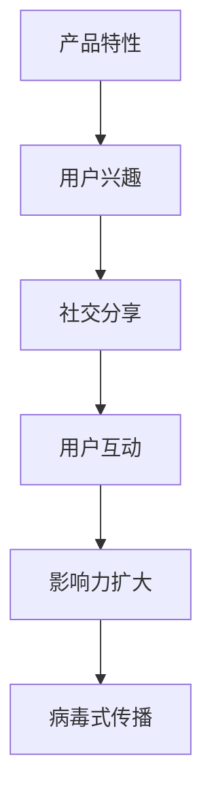

                 

### 第1章 引言：病毒式传播的魔力

病毒式传播是一种在信息技术和市场营销中非常重要的概念，它是指一种产品、信息或内容能够在没有任何外部推动的情况下迅速传播，形成广泛的用户参与和高度的社会影响力。其魅力在于，它能够以极低的成本实现快速且大规模的传播，从而极大地提升产品的知名度和用户基础。

#### 1.1 什么是病毒式传播

病毒式传播（Viral Marketing）通常指的是利用社会网络和用户之间的自然互动来推广产品或服务的一种策略。这种传播方式依赖于用户的自愿参与和分享，而不是传统广告或营销手段的直接推广。其核心在于创造吸引力和引人注目的内容，使用户在不经意间成为传播者，从而实现信息或产品的快速扩散。

病毒式传播的核心要素主要包括：

- **引人注目的内容**：能够引起用户兴趣的内容，如搞笑视频、有趣故事、独特设计等。
- **社交分享机制**：鼓励用户将内容分享到社交媒体或其他平台，从而扩大传播范围。
- **参与感**：用户不仅仅是消费者，也是内容创造者和传播者，感受到自己是产品的一部分。
- **情感共鸣**：内容能够触动用户的情感，激发他们的分享欲望。

#### 1.2 病毒式传播的重要性

病毒式传播在用户增长和品牌传播方面具有显著的优势：

- **快速用户增长**：通过用户的自发传播，产品可以在短时间内获得大量新用户，实现爆发式的增长。
- **低成本**：与传统营销相比，病毒式传播的成本通常较低，尤其是在数字媒体环境中。
- **高转化率**：由于内容是由用户自发传播的，用户对内容的信任度更高，从而提高转化率。
- **品牌传播**：病毒式传播能够迅速提升品牌知名度，增加品牌影响力。

#### 1.3 目标读者介绍

本文的目标读者主要是从事市场营销、产品管理和数字营销的专业人士。他们可能已经对病毒式传播有一定的了解，但希望从更深入的角度学习如何设计和实施有效的病毒式传播策略。此外，本文也适合对市场营销和产品推广感兴趣的技术开发者、创业者和学生。

#### 预期收获

通过阅读本文，读者可以：

- 明确病毒式传播的定义和核心要素。
- 理解病毒式传播与传统营销的区别和优势。
- 学习如何设计具有吸引力的产品特性，促进病毒式传播。
- 掌握实施和优化病毒式传播策略的方法。
- 分析成功案例，提取实际操作中的关键要素。

病毒式传播不仅是一种营销策略，更是一种文化现象。它改变了传统营销的模式，使信息传播更加高效和直接。在接下来的章节中，我们将深入探讨病毒式传播的原理和具体实施策略，帮助读者打造出能够迅速传播的产品特性。

### 2.1 产品特性与病毒式传播的关系

产品特性是病毒式传播成功的关键要素之一。一个产品的特性直接决定了它是否能够引起用户的兴趣，是否能够激发用户的分享欲望，以及是否能够在社交网络上迅速传播。因此，深入理解产品特性与病毒式传播之间的关系，对于设计出具有病毒式传播能力的成功产品至关重要。

#### 产品特性对病毒式传播的影响

1. **独特性**：独特的产品特性能够吸引那些寻求新奇和与众不同的用户。这种独特性可以体现在产品功能、设计理念、用户体验等多个方面。例如，一款具有革命性创新功能的手机，或者一款设计独特的时尚配件，都容易引起用户的关注和分享。

2. **价值主张**：明确和有力的价值主张能够传达产品的核心优势和价值，让用户清楚地了解为何他们需要这个产品。一个简洁而有力的价值主张可以帮助产品在用户群体中迅速传播，特别是在社交媒体平台上。

3. **社交属性**：具备社交属性的产品能够让用户在社交环境中更自然地分享和互动。社交属性可以包括社交互动功能、用户生成的内容、社区平台等。例如，一个允许用户上传并分享照片或视频的社交媒体平台，或者一个用户可以通过社交网络邀请朋友的在线游戏，都具备很强的社交属性。

4. **参与感**：用户参与感是指用户在产品中的参与程度和体验感受。高参与感的产品能够增加用户的忠诚度和口碑传播的可能性。例如，一个允许用户定制产品的平台，或者一个用户能够通过游戏获得成就和奖励的应用，都会增强用户的参与感。

#### 病毒式传播对产品特性的需求

1. **易分享性**：产品需要具备易于分享的特性，使用户能够方便地将产品内容分享到社交媒体或其他平台。这通常意味着产品要设计有社交分享按钮，或者提供多种分享渠道。

2. **趣味性**：有趣的内容更容易吸引和留住用户，从而增加分享的可能性。产品特性可以包含幽默、互动性或挑战性，以激发用户的兴趣。

3. **情感共鸣**：情感共鸣是促使用户分享的重要因素。产品需要能够触动用户的情感，如快乐、悲伤、愤怒等，从而使他们更愿意分享。

4. **可持续性**：病毒式传播的成功往往需要长时间的维持。因此，产品特性应该具备一定的可持续性，能够持续地吸引用户参与和分享。

#### 社会影响力与用户行为的分析

1. **社会影响力模型**：社会影响力模型可以帮助我们理解用户在社交网络中的行为模式。这个模型通常包括影响者（Influencers）、受众（Audience）和传播渠道（Channels）。影响者是指那些具有较高社交影响力的人，他们能够通过分享内容来影响其他用户。受众是产品或内容的目标用户群体。传播渠道是用户之间互动的平台，如社交媒体、论坛等。

2. **用户行为分析框架**：用户行为分析框架可以帮助我们理解用户如何做出分享决策。这个框架通常包括用户动机、行为触发因素、分享过程和行为结果。用户动机包括自我表达、寻求认同、分享有用信息等。行为触发因素可以是产品特性、社会环境、情绪状态等。分享过程是指用户如何将内容分享到社交平台，而行为结果则包括分享的频率、范围和效果。

#### Mermaid流程图：产品特性到病毒式传播的过程

以下是一个简单的Mermaid流程图，展示了产品特性如何转化为病毒式传播：



- **A[产品特性]**：这是病毒式传播的起点，产品需要具备能够吸引用户的特性。
- **B[用户兴趣]**：产品特性激发用户的兴趣，使用户对产品产生关注。
- **C[社交分享]**：用户将产品内容分享到社交媒体或其他平台，从而实现传播。
- **D[用户互动]**：分享后的用户之间产生互动，如点赞、评论等，进一步扩大影响力。
- **E[影响力扩大]**：用户的互动行为使产品的社交影响力逐渐扩大。
- **F[病毒式传播]**：最终，产品内容在社交网络上实现病毒式传播，达到广泛用户覆盖。

通过这个流程图，我们可以清晰地看到产品特性与病毒式传播之间的关系，以及每个环节在传播过程中的作用。

理解产品特性与病毒式传播的关系，有助于我们在设计和推广产品时，更有针对性地选择和优化产品特性，从而实现病毒式传播的目标。在接下来的章节中，我们将进一步探讨病毒式传播的原理和具体实施策略，帮助读者打造出具有强大病毒式传播能力的成功产品。

### 2.2 社会影响力与用户行为的分析

社会影响力与用户行为是病毒式传播过程中至关重要的因素。通过深入分析社会影响力模型和用户行为框架，我们可以更好地理解病毒式传播的机制，为产品设计提供有力支持。

#### 社会影响力模型

社会影响力模型帮助我们理解用户在社交网络中的行为模式。这个模型主要包括三个关键组成部分：影响者（Influencers）、受众（Audience）和传播渠道（Channels）。

1. **影响者（Influencers）**：影响者是指那些在社交网络中具有较高社交影响力的人。他们可能因为专业能力、社交地位或某种特长而受到用户的关注。影响者的特点在于他们能够通过自己的言论和行为影响其他用户的决策和态度。例如，一位知名的科技博主可能会通过其博客或社交媒体账号，推荐一款新的智能手机，从而影响大量潜在用户的购买决策。

2. **受众（Audience）**：受众是病毒式传播的目标用户群体，即那些可能受到影响者影响并对产品或内容产生兴趣的人。受众的特点在于他们的多样性，不同用户可能因为不同的原因和动机而参与到传播过程中。例如，一个社交媒体平台上的普通用户，可能因为朋友的推荐或内容的趣味性而开始使用该平台。

3. **传播渠道（Channels）**：传播渠道是用户之间互动的平台，如社交媒体、论坛、电子邮件等。传播渠道的选择对病毒式传播的成功至关重要。合适的传播渠道能够提高内容的曝光率，增加用户的参与度。例如，选择在Twitter上推广一款新产品，可能会因为Twitter的用户基数和互动性强而获得更好的传播效果。

#### 用户行为分析框架

用户行为分析框架帮助我们理解用户如何做出分享决策，以及这一过程中的关键因素。这个框架通常包括用户动机、行为触发因素、分享过程和行为结果。

1. **用户动机**：用户分享内容的原因多种多样，主要包括以下几个方面：

   - 自我表达：用户通过分享内容来表达自己的观点、态度和兴趣，增强自我认同。
   - 寻求认同：用户通过分享内容获得他人的认同和赞赏，增强社交地位。
   - 分享有用信息：用户通过分享内容帮助他人解决问题或提供有价值的信息，增加社交价值。
   - 趣味性：用户分享有趣的内容，增加社交互动的趣味性。

2. **行为触发因素**：用户分享行为的触发因素可以是多种多样的，包括：

   - 内容本身：有趣、有价值、引人注目的内容是触发用户分享的重要因素。
   - 社交环境：用户所处的社交环境，如朋友、同事、社区等，对分享行为有显著影响。
   - 情绪状态：用户的情绪状态，如快乐、悲伤、愤怒等，也会影响他们的分享行为。

3. **分享过程**：用户在分享过程中的行为模式主要包括以下几个环节：

   - 内容选择：用户从海量的内容中选择适合分享的内容。
   - 调整与优化：用户可能会对分享的内容进行编辑或调整，以使其更符合自己的表达意图。
   - 分享决策：用户决定将内容分享到哪个平台，以及分享给哪些受众。

4. **行为结果**：用户分享行为的结果包括以下几个方面：

   - 曝光率：用户分享的内容在社交网络上的曝光程度，影响内容的传播范围。
   - 互动反馈：用户分享内容后，获得的点赞、评论、转发等互动反馈，影响用户的分享积极性。
   - 社交影响：用户分享的内容对其他用户的态度和行为产生的间接影响，影响产品的社会影响力。

#### 社会影响力与用户行为的关联

社会影响力和用户行为之间存在密切的关联。一方面，社会影响力可以影响用户的行为，即影响者通过其言论和行为引导受众的决策和态度。另一方面，用户的行为也会反过来影响社会影响力，即用户通过分享行为增加内容的传播范围，从而提升产品的社会影响力。

1. **影响者对用户行为的影响**：影响者通过其社交地位、专业能力和影响力，可以引导受众的行为。例如，一位知名的科技博主发布了一篇关于新智能手机的评测文章，可能会吸引大量用户关注和购买这款手机。

2. **用户行为对社会影响力的影响**：用户通过分享行为增加内容的曝光率，从而提升产品的社会影响力。例如，一款新游戏在社交媒体上引起了大量用户的分享和讨论，使得这款游戏迅速走红。

通过社会影响力模型和用户行为分析框架，我们可以更好地理解病毒式传播的机制。这些分析工具不仅有助于我们设计具有病毒式传播能力的产品特性，还可以为实施和优化病毒式传播策略提供有力支持。

在下一章中，我们将进一步探讨病毒式传播的数学模型，使用伪代码解释其原理，为理解病毒式传播提供更深入的视角。

### 3.1 传统营销与病毒式传播的对比

传统营销和病毒式传播是两种截然不同的营销方式，它们在目标、策略、效果和成本上都有明显的差异。理解这两种方式的区别，有助于我们更好地选择适合的营销策略，实现产品的病毒式传播。

#### 传统营销方法

传统营销方法主要依赖于广告、推广和公关等手段来吸引潜在用户。其核心目标是增加品牌知名度和销售额，主要通过以下几种方式实现：

1. **广告投放**：通过电视、广播、报纸、杂志等传统媒体进行广告投放，吸引目标用户的注意。
2. **公关活动**：组织新闻发布会、品牌活动、赞助活动等，提高品牌知名度和美誉度。
3. **销售促进**：通过折扣、促销、礼品等手段刺激消费者的购买欲望。
4. **直销**：通过电话、邮件、信函等直接与潜在用户沟通，进行产品推广。

传统营销的特点包括：

- **高成本**：传统营销需要投入大量资金来购买广告位、组织公关活动等，成本相对较高。
- **低互动性**：传统营销主要是单向传播，用户难以直接参与其中，互动性较低。
- **效果评估难**：由于传统营销的传播渠道较为分散，难以精确衡量营销效果，数据追踪和反馈机制相对薄弱。
- **受众限制**：传统营销的受众范围较为固定，难以覆盖到更广泛的用户群体。

#### 病毒式传播的优势

病毒式传播（Viral Marketing）则是一种基于用户自发传播的营销方式，其核心目标是利用用户的社交网络和互动，实现内容的快速扩散。与传统的营销方法相比，病毒式传播具有以下优势：

1. **低成本**：病毒式传播主要依赖于用户的自然互动和分享，无需大量资金投入。例如，通过社交媒体平台发布有趣的内容，用户自愿分享，从而实现广泛传播。
2. **高互动性**：病毒式传播注重用户参与，鼓励用户生成内容、参与讨论和分享，形成高度的互动性。
3. **高效传播**：病毒式传播能够在短时间内实现大量用户的覆盖，尤其是通过社交网络，信息的传播速度极快。
4. **效果可追踪**：通过社交媒体平台的数据分析工具，可以实时监控内容的传播效果，如分享次数、互动次数等，便于调整营销策略。
5. **广泛受众**：病毒式传播能够突破传统营销的受众限制，覆盖到更广泛的用户群体，甚至全球用户。

#### 传统营销与病毒式传播的对比

以下是一个简化的对比表格，展示了传统营销和病毒式传播在目标、策略、效果和成本上的主要区别：

| 对比项 | 传统营销 | 病毒式传播 |
| --- | --- | --- |
| 目标 | 增加品牌知名度和销售额 | 利用用户社交网络实现内容快速扩散 |
| 策略 | 广告投放、公关活动、销售促进、直销 | 引人注目的内容、社交分享机制、用户互动 |
| 效果 | 成果较为缓慢，难以精确衡量 | 快速传播，高度互动，效果可追踪 |
| 成本 | 较高 | 低 |
| 受众 | 受限，较为固定 | 广泛，无地域限制 |

通过以上对比，我们可以看出，病毒式传播在成本、互动性和效果上具有显著优势，尤其是在数字媒体环境中。然而，病毒式传播也有其局限性，如内容质量难以控制、效果难以持续等。因此，在实际应用中，传统营销和病毒式传播往往是相辅相成的，根据具体目标和情境选择合适的策略。

在下一章中，我们将进一步探讨病毒式传播的数学模型，使用伪代码详细解释其原理，帮助读者深入理解病毒式传播的机制。

### 3.2 病毒式传播的数学模型

为了更好地理解病毒式传播的过程，我们可以借助数学模型来描述其行为模式。一个经典的病毒式传播模型是基于SIR模型，这是一种常用于传染病传播研究的模型，但其核心思想同样适用于信息或产品的传播。

#### SIR模型的基本概念

SIR模型将人群分为三个互斥的状态：

- **S（Susceptible，易感者）**：指那些尚未接触到信息或产品，但可能成为传播者的用户。
- **I（Infected，感染者）**：指那些已经接触到信息或产品，并可能将其传播给其他用户的用户。
- **R（Recovered，康复者）**：指那些已经从信息或产品的影响中恢复过来，不再传播的用户的集合。

#### SIR模型的数学表达式

SIR模型的基本数学表达式如下：

$$
\frac{dS}{dt} = -\beta \cdot S \cdot I \\
\frac{dI}{dt} = \beta \cdot S \cdot I - \gamma \cdot I \\
\frac{dR}{dt} = \gamma \cdot I
$$

其中：

- $\beta$ 表示每个感染者在单位时间内感染其他易感者的概率。
- $\gamma$ 表示感染者在单位时间内康复的概率。

#### 伪代码解释

以下是一段伪代码，用于解释SIR模型的基本原理：

```python
# SIR模型伪代码

# 初始化参数
S = N - I # 初始易感者数量
I = 1 # 初始感染者数量
R = 0 # 初始康复者数量
N = 总人口数量
beta = 每个感染者在单位时间内感染其他易感者的概率
gamma = 感染者在单位时间内康复的概率
dt = 时间步长

# 迭代计算
while True:
    dS_dt = -beta * S * I
    dI_dt = beta * S * I - gamma * I
    dR_dt = gamma * I
    
    S += dS_dt * dt
    I += dI_dt * dt
    R += dR_dt * dt
    
    if S + I + R < 1e-5: # 精度控制
        break

    # 更新时间
    dt /= 1.1 # 随时间步长逐渐减小

# 输出结果
print(f"S: {S}, I: {I}, R: {R}")
```

#### 模型解析

1. **易感者（S）的变化**：易感者数量的变化主要受到感染者和感染概率的影响。每个感染者在单位时间内可以感染其他易感者，因此易感者数量随时间减少。

2. **感染者（I）的变化**：感染者数量的变化受到感染和康复两个因素影响。感染者通过接触易感者进行传播，但同时感染者也有可能康复，因此感染者数量最终会趋于稳定。

3. **康复者（R）的变化**：康复者数量随时间增加，表示已经从感染中恢复的用户。

通过上述数学模型和伪代码，我们可以模拟病毒式传播的过程，并分析不同参数对传播结果的影响。这为设计和优化病毒式传播策略提供了科学依据。

在下一章中，我们将探讨如何设计吸引力强的产品特性，以促进病毒式传播。

### 4.1 设计吸引力强的产品特性

要打造具有病毒式传播能力的成功产品，关键在于设计出能够吸引并激发用户兴趣的产品特性。这些特性需要具备独特性、高价值和社交属性，从而促使用户自愿分享和参与。以下是设计吸引力强产品特性的几个关键步骤：

#### 1. 独特性与价值主张

**独特性**是吸引用户的关键。一个独特的产品特性能够引起用户的兴趣，使其在众多竞争产品中脱颖而出。独特性可以体现在以下几个方面：

- **功能创新**：提供市场上没有的新功能或解决方案，满足用户未被满足的需求。
- **设计理念**：独特的设计理念和外观，使用户感受到与众不同的体验。
- **用户参与**：鼓励用户参与产品设计和开发，使产品更具个性化和归属感。

**价值主张**则是传达产品核心价值的重要工具。一个明确且有力的价值主张能够帮助用户快速了解产品为何值得他们关注和分享。以下是构建价值主张的步骤：

- **确定目标用户**：了解目标用户的需求和痛点，确保价值主张能够直接解决这些问题。
- **明确核心价值**：提炼产品最突出的优势和价值，使其易于理解和记忆。
- **传达价值**：通过简短而有力的语句或口号，将核心价值传达给用户。

#### 2. 用户参与感与社交属性

**用户参与感**是增强用户粘性的重要因素。一个能够让用户积极参与的产品，通常能更好地激发他们的分享欲望。以下是一些增强用户参与感的方法：

- **互动功能**：设计互动性强的功能，如评论、点赞、分享等，鼓励用户积极参与。
- **用户生成内容**：鼓励用户创造和分享内容，如用户评价、创意分享等，增强用户的归属感和成就感。
- **社区平台**：建立社区平台，如论坛、社交媒体群组等，为用户提供交流和分享的空间。

**社交属性**则是病毒式传播的重要驱动力。具备社交属性的产品能够通过用户的社交网络实现快速传播。以下是设计社交属性的方法：

- **社交分享机制**：集成社交分享按钮，使用户能够方便地将产品内容分享到社交媒体平台。
- **社交认证**：通过社交账户登录或认证，利用用户的社交关系网进行推广。
- **激励机制**：设计激励机制，如积分、奖励等，鼓励用户分享和推荐产品。

#### 3. 成长与奖励机制设计

**成长与奖励机制**能够激励用户持续参与和分享产品。以下是设计成长与奖励机制的方法：

- **成长轨迹**：设计清晰的成长轨迹，使用户能够看到自己在产品中的进步，增加参与感。
- **奖励机制**：设置多种形式的奖励，如虚拟货币、实物奖励、特殊权限等，激励用户积极参与和分享。
- **等级制度**：建立等级制度，使用户在成长过程中获得不同的荣誉和特权。

通过以上方法，我们能够设计出具备独特性、高价值和社交属性的产品特性，从而激发用户的参与感和分享欲望，实现病毒式传播的目标。

在下一章中，我们将探讨用户体验与口碑传播，了解如何通过优化用户体验和口碑传播策略，进一步促进病毒式传播。

### 4.2 用户参与感与社交属性

用户参与感和社交属性是病毒式传播产品成功的关键要素。一个能够激发用户参与和具备社交属性的产品，不仅能够提高用户粘性，还能通过用户的自发传播实现病毒式传播。以下是设计用户参与感和社交属性的具体策略：

#### 增强用户参与感的方法

1. **互动性功能**：
   - **评论与点赞**：在产品中集成评论和点赞功能，使用户能够表达自己的看法和情感，增强互动。
   - **互动游戏**：设计有趣的互动游戏，如挑战、竞赛等，提高用户的参与度和兴趣。
   - **用户反馈**：鼓励用户提交反馈和建议，使产品更加贴合用户需求，增强用户的归属感。

2. **用户生成内容**：
   - **用户创作内容**：鼓励用户创作内容，如博客文章、视频、图片等，并将其展示在平台上，增强用户自豪感和参与感。
   - **用户评价**：允许用户对产品和服务进行评价，通过用户的真实反馈提高产品的可信度和吸引力。
   - **用户故事**：分享成功用户的故事，展示产品如何改变他们的生活，激发其他用户的参与热情。

3. **社区平台**：
   - **在线论坛**：建立在线论坛，为用户提供交流和讨论的空间，增强用户的社区归属感。
   - **社交媒体群组**：创建社交媒体群组，鼓励用户在群组中分享经验和心得，增加用户的互动频率。
   - **线下活动**：定期举办线下活动，如聚会、讲座等，增强用户之间的联系和产品黏性。

#### 社交属性的设计

1. **社交分享机制**：
   - **社交分享按钮**：在产品中集成社交媒体分享按钮，使用户能够方便地将产品内容分享到社交网络，增加曝光率。
   - **积分奖励**：设计积分系统，鼓励用户分享和推荐产品，积分可以兑换奖励或特权。
   - **推荐机制**：通过推荐算法，为用户提供可能感兴趣的内容，增加用户之间的互动和分享。

2. **社交认证**：
   - **社交账户登录**：允许用户使用社交媒体账户登录，利用用户已有的社交关系进行推广。
   - **好友系统**：建立好友系统，使用户能够添加和查看朋友的使用情况，增加社交互动。
   - **社交动态**：在产品中展示用户的社交动态，如好友的最新评论、分享等，增强社交属性。

3. **激励机制**：
   - **成长轨迹**：设计清晰的成长轨迹，使用户能够看到自己在产品中的进步，增加参与感。
   - **等级制度**：建立等级制度，使用户在成长过程中获得不同的荣誉和特权，增加成就感。
   - **活动奖励**：举办各种线上和线下活动，提供奖品和奖励，激励用户积极参与和分享。

通过以上策略，我们能够有效地设计用户参与感和社交属性，从而增强产品的病毒式传播能力。用户参与感和社交属性不仅能够提高产品的用户黏性，还能通过用户的自发传播实现广泛的用户覆盖，实现病毒式传播的目标。

在下一章中，我们将探讨用户体验与口碑传播，了解如何通过优化用户体验和口碑传播策略，进一步促进病毒式传播。

### 4.3 成长与奖励机制设计

为了增强用户的参与感和忠诚度，设计有效的成长与奖励机制至关重要。这样的机制能够激励用户持续参与，并通过正向反馈增强他们的分享意愿。以下是设计成长与奖励机制的关键步骤：

#### 1. 用户成长的动力

用户成长的动力来源于对产品的投入和成就感。以下是几种设计用户成长动力的方法：

- **积分系统**：为用户的每一个行为，如登录、分享、评论等，分配积分。积分可以用来兑换虚拟物品或特权，如高级功能、个性化图标等。
- **等级系统**：建立一个清晰的等级体系，用户通过积累积分或完成特定任务来提升等级。每个等级都有不同的特权，如更高的每日积分上限、专属标识等。
- **成就系统**：鼓励用户完成特定的目标或任务，如第一次分享、达到一定积分等。每个成就都会带来独特的奖励，如荣誉徽章、个性化称号等。

#### 2. 奖励机制的设计原则

奖励机制的设计应遵循以下原则，以确保其有效性和吸引力：

- **即时反馈**：及时给予用户奖励，使他们感受到自己的努力得到了认可。
- **公平性**：确保所有用户都有机会获得奖励，避免导致不公平感。
- **多样性**：提供多种形式的奖励，以满足不同用户的需求，如虚拟货币、实物奖励、特权等。
- **挑战性**：设计具有一定挑战性的任务和目标，鼓励用户持续努力和进步。

#### 3. 奖励机制的实现方法

以下是几种实现奖励机制的方法：

- **虚拟货币**：通过虚拟货币，用户可以购买产品内的物品或服务。虚拟货币可以通过完成任务、参与活动或社交分享等方式获得。
- **实物奖励**：定期举办抽奖活动，用户通过积累积分或参与特定活动有机会赢取实物奖励，如电子产品、时尚配饰等。
- **特权**：为高等级用户或活跃用户提供特殊特权，如优先体验新功能、个性化服务、专属客服等。
- **社交互动奖励**：鼓励用户参与社交互动，如点赞、评论、分享等，通过这些互动行为获得额外奖励。

#### 4. 成长与奖励机制的效果评估

设计完成长与奖励机制后，需要对其效果进行评估，确保其能够有效激励用户。以下是一些评估方法：

- **用户参与度**：监测用户的活跃度，如登录次数、互动频率等，评估成长与奖励机制对用户参与度的影响。
- **用户留存率**：通过用户留存率的变化，评估奖励机制对用户留存的影响。
- **用户反馈**：收集用户对成长与奖励机制的评价和反馈，了解其满意度和改进方向。
- **数据分析**：使用数据分析工具，如A/B测试、用户行为分析等，评估不同奖励机制的效果，并进行优化。

通过科学的设计和有效的实施，成长与奖励机制能够显著提升用户的参与感和忠诚度，从而促进病毒式传播。在下一章中，我们将探讨如何通过用户体验和口碑传播策略，进一步提升产品的病毒式传播效果。

### 5.1 用户体验设计原则

用户体验（User Experience，简称UX）设计是病毒式传播产品的关键要素之一。一个优秀的用户体验设计能够提高用户的满意度和忠诚度，从而促进病毒式传播。以下是设计优秀用户体验时需要遵循的几个核心原则：

#### 1. 简洁性

简洁性是用户体验设计的重要原则之一。一个简洁的用户界面能够减少用户的认知负担，使其更容易理解和操作。以下是一些实现简洁性的方法：

- **减少冗余**：避免在用户界面中添加不必要的元素和功能，只保留核心内容和功能。
- **清晰的结构**：确保用户界面具有清晰的布局和结构，使用户能够快速找到所需功能。
- **直观的操作**：设计直观的操作方式，减少用户的学习成本，使用户能够迅速上手。

#### 2. 易用性

易用性是指用户在使用产品过程中能够轻松完成任务的能力。一个易用的产品能够提升用户的满意度和留存率。以下是一些提高易用性的方法：

- **用户研究**：通过用户研究和访谈，了解用户的需求和痛点，确保产品设计符合用户习惯。
- **任务流程优化**：分析用户完成任务的过程，找出潜在的瓶颈和障碍，并进行优化。
- **清晰的反馈**：在用户执行操作时提供及时的反馈，如成功提示、错误提示等，帮助用户了解当前状态。

#### 3. 个性化

个性化设计能够提升用户的参与感和满意度。一个个性化的产品能够根据用户的需求和偏好提供定制化的体验。以下是一些实现个性化的方法：

- **用户数据收集**：收集用户的使用数据，如浏览历史、购买记录等，用于个性化推荐和定制化体验。
- **个性化推荐**：根据用户的历史行为和偏好，推荐可能感兴趣的内容或功能，提升用户体验。
- **个性化定制**：允许用户自定义界面布局、功能设置等，使其感到产品更加贴近个人需求。

#### 4. 快速响应

快速响应是指产品在用户操作时能够迅速作出反应，提高用户的操作流畅性和满意度。以下是一些实现快速响应的方法：

- **高效的网络优化**：确保产品在各个网络环境下的响应速度，减少加载时间和延迟。
- **异步操作**：在用户执行某些操作时，使用异步操作避免界面停滞，提高用户体验。
- **优化代码**：对产品代码进行优化，减少不必要的计算和资源消耗，提高系统性能。

#### 5. 可访问性

可访问性是指产品应能够满足不同用户群体的需求，包括视力障碍者、听力障碍者等。以下是一些实现可访问性的方法：

- **视觉辅助**：为视力障碍者提供视觉辅助工具，如屏幕阅读器、高对比度模式等。
- **声音辅助**：为听力障碍者提供声音提示和字幕，确保信息能够有效传达。
- **可扩展性**：设计灵活的界面和功能，方便后期进行可访问性改进。

通过遵循以上用户体验设计原则，我们能够打造出简洁、易用、个性化、快速响应和可访问的产品，从而提升用户的满意度和忠诚度，促进病毒的传播。

在下一章中，我们将探讨用户口碑的传播策略，了解如何通过口碑传播提升产品的病毒式传播效果。

### 5.2 用户口碑的传播策略

用户口碑是病毒式传播中至关重要的一环。一个积极的用户口碑能够极大地促进产品的传播，增加用户信任度和满意度。以下是几种有效的用户口碑传播策略：

#### 1. 口碑传播的影响因素

用户口碑的传播受到多种因素的影响，主要包括：

- **产品质量**：优质的产品质量是用户口碑传播的基础。高质量的产品能够满足用户的需求，使用户产生正面评价。
- **用户体验**：良好的用户体验能够增强用户的满意度和忠诚度，从而促使他们分享正面评价。
- **用户参与感**：用户在产品中的参与感越高，他们越可能分享自己的体验和感受，从而形成口碑。
- **社交属性**：具备社交属性的产品能够鼓励用户之间的互动和分享，增加口碑传播的频率和范围。
- **激励机制**：设计有效的激励机制，如积分、奖励等，能够鼓励用户分享和推荐产品，提升口碑传播的效果。

#### 2. 传播策略制定

要制定有效的口碑传播策略，需要考虑以下几个方面：

- **明确目标**：明确口碑传播的目标，如提高品牌知名度、增加用户数量、提升用户满意度等。
- **目标用户**：确定目标用户群体，了解他们的需求和习惯，以便制定更具针对性的传播策略。
- **传播渠道**：选择合适的传播渠道，如社交媒体、论坛、博客等，根据用户行为和传播效果进行优化。
- **内容策略**：设计引人注目的口碑内容，如用户评价、成功案例、故事分享等，提升传播吸引力。
- **互动机制**：建立互动机制，如评论、点赞、分享等，鼓励用户参与口碑传播。

#### 3. 用户口碑传播的策略

以下是几种有效的用户口碑传播策略：

- **用户推荐计划**：设计用户推荐计划，鼓励现有用户推荐新用户。通过提供奖励或特权，如积分、折扣等，激励用户积极参与推荐。
- **社交媒体营销**：利用社交媒体平台，发布有趣、有价值的内容，吸引粉丝关注和互动。通过互动活动、话题讨论等，增强用户参与度和口碑传播。
- **内容营销**：创建高质量的内容，如用户故事、评测、教程等，展示产品的优势和用户体验。通过优质内容吸引潜在用户，增加口碑传播的广度和深度。
- **社区建设**：建立在线社区，如论坛、QQ群、微信群等，为用户提供交流和分享的平台。通过社区互动，增强用户粘性和口碑传播。
- **口碑营销活动**：举办口碑营销活动，如用户评选、体验活动等，吸引更多用户参与和分享。通过活动奖励，如奖品、荣誉等，激励用户积极传播口碑。

通过以上策略，我们可以有效地促进用户口碑的传播，提升产品的社会影响力和用户忠诚度。在下一章中，我们将探讨社交分享机制与引导，了解如何通过社交分享机制和用户引导进一步提升产品的病毒式传播效果。

### 5.3 社交分享机制与引导

社交分享机制是病毒式传播产品中不可或缺的一部分，它能够激励用户主动分享产品内容，从而扩大传播范围和影响力。为了最大限度地利用社交分享机制，我们需要从激励机制和引导策略两个方面进行设计。

#### 1. 社交分享的激励机制

激励机制是鼓励用户分享的关键因素。以下是一些有效的激励机制：

- **积分奖励**：为每次分享行为分配积分，用户可以用积分兑换虚拟货币、优惠券或实物奖励。
- **现金奖励**：对于特别重要的分享，可以提供现金奖励，以激励用户更积极地传播内容。
- **特权**：为高分享量的用户提供特殊特权，如优先体验新功能、独家活动参与权等，增加他们的荣誉感和参与度。
- **排行榜**：设立分享排行榜，展示最高分享量的用户，激发用户的竞争心理和分享欲望。
- **群体奖励**：当某个群体的用户分享达到一定数量时，可以为该群体提供集体奖励，如团建活动、礼物等。

#### 2. 引导用户分享的方法

为了引导用户更频繁地分享，我们需要从用户心理和行为习惯出发，采取以下策略：

- **简化和便捷**：确保用户能够快速、便捷地分享内容，减少分享操作的复杂性和时间成本。例如，集成一键分享按钮，提供多种社交平台的选择。
- **情感触发**：设计能够触动用户情感的内容，如搞笑、感人、有启发性的内容，增加分享的欲望。
- **社交压力**：利用社交压力，鼓励用户分享。例如，展示其他用户的分享数量和点赞数量，使用户感受到分享的社交价值。
- **个性化推荐**：根据用户的行为和偏好，推荐可能感兴趣的内容，增加分享的可能性。
- **内容多样性**：提供多种类型的内容，满足不同用户的需求和兴趣，提高分享的广泛性。
- **互动引导**：在用户分享后，提供互动引导，如鼓励用户在评论中表达看法、邀请好友点赞等，增加用户的互动频率。

#### 3. 实际案例

以下是一些成功的社交分享机制和引导案例：

- **案例1：Instagram的点赞机制**：Instagram通过点赞机制鼓励用户分享和互动。每次用户点赞，都会在社交网络上产生动态，从而推动内容的传播。
- **案例2：滴滴出行的优惠券分享**：滴滴出行通过优惠券分享活动，鼓励用户邀请朋友使用平台，从而增加用户数量和市场份额。
- **案例3：微信的群发功能**：微信提供了群发功能，用户可以一次向多个联系人发送信息，大大简化了分享过程，提高了分享的效率。

通过合理设计社交分享机制和引导策略，我们能够有效激励用户主动分享产品内容，实现病毒式传播的目标。在下一章中，我们将探讨如何实施病毒式传播策略，包括制定传播策略、集成社交媒体与推广工具以及持续优化与迭代。

### 6.1 制定传播策略

要实现病毒式传播，制定有效的传播策略是至关重要的一步。一个周密且灵活的传播策略能够确保产品在传播过程中达到预期的效果，实现快速且广泛的用户覆盖。以下是制定传播策略的步骤和关键要素：

#### 1. 明确传播目标

首先，我们需要明确传播策略的目标。这些目标可能包括：

- **提高品牌知名度**：通过广泛的传播，使品牌在用户中建立较高的认知度。
- **增加用户数量**：吸引新用户注册和活跃使用产品，实现用户增长。
- **提升用户活跃度**：通过传播策略，提高现有用户的活跃度和参与度。
- **市场渗透**：在特定市场或地区实现更广泛的市场渗透。

明确目标有助于我们后续的策略制定和评估效果。

#### 2. 分析目标用户

了解目标用户的特征和行为模式是制定传播策略的重要基础。以下是需要考虑的几个方面：

- **用户画像**：构建目标用户的画像，包括年龄、性别、职业、兴趣爱好等。
- **用户需求**：分析用户需求，了解他们期望从产品中获得什么价值。
- **用户行为**：研究用户在社交媒体和其他平台上的行为习惯，了解他们如何获取和使用信息。
- **用户痛点**：识别用户的痛点，思考产品如何解决这些问题。

通过分析目标用户，我们可以更有针对性地制定传播策略。

#### 3. 选择传播渠道

选择合适的传播渠道是实现病毒式传播的关键。以下是一些常见的传播渠道：

- **社交媒体**：如Facebook、Twitter、Instagram、微信、微博等，是病毒式传播的主要平台。
- **电子邮件**：通过定期发送电子邮件，可以保持与用户的联系，提高产品的可见度和活跃度。
- **博客和内容营销**：通过撰写高质量的文章、教程、评测等，吸引潜在用户并建立品牌权威。
- **合作伙伴**：与行业内的合作伙伴、意见领袖等合作，利用他们的资源和影响力进行传播。
- **线下活动**：通过举办线下活动，如展会、讲座、聚会等，增加用户对产品的了解和兴趣。

选择传播渠道时，需要考虑以下几个因素：

- **目标用户**：选择用户活跃度高的渠道，确保内容能够被目标用户看到。
- **传播效果**：根据历史数据和用户反馈，评估不同渠道的传播效果。
- **预算和资源**：根据预算和可用资源，选择最适合的渠道组合。

#### 4. 制定传播内容

传播内容是吸引用户的关键。以下是一些制定传播内容的方法：

- **创意内容**：设计具有创意的内容，如视频、图片、故事等，提高用户的兴趣和分享欲望。
- **有价值的信息**：提供对用户有价值的信息，如教程、评测、行业动态等，增加用户的信任和忠诚度。
- **个性化内容**：根据用户的行为和偏好，定制个性化的内容，提高内容的相关性和吸引力。
- **互动内容**：设计互动性强的内容，如问答、投票、竞赛等，增强用户的参与度和互动性。

#### 5. 制定时间表和计划

为了确保传播策略的有效实施，我们需要制定详细的时间表和计划。以下是需要考虑的几个方面：

- **阶段性目标**：将传播策略分解为阶段性目标，如初期推广、中期增长、长期维护等。
- **时间分配**：根据阶段性目标，合理安排内容和渠道的发布时间，确保传播的连续性和节奏感。
- **关键节点**：设定关键节点，如重要事件、节假日、新品发布等，作为传播的重点时期。

#### 6. 评估与调整

制定传播策略后，我们需要定期评估传播效果，并根据评估结果进行调整。以下是一些评估和调整的方法：

- **数据监控**：通过数据分析工具，监控传播效果的关键指标，如用户增长、活跃度、互动率等。
- **用户反馈**：收集用户反馈，了解他们对传播内容的反应和意见，作为调整策略的依据。
- **定期回顾**：定期回顾传播策略的实施情况，总结成功经验和不足之处，为下一阶段的策略制定提供参考。

通过以上步骤，我们能够制定出科学且有效的传播策略，确保产品在传播过程中取得理想的效果。在下一章中，我们将探讨如何将传播策略与社交媒体和推广工具有效集成，进一步提升病毒式传播的效果。

### 6.2 集成社交媒体与推广工具

将病毒式传播策略与社交媒体和推广工具有效集成，是提升产品传播效果的关键。通过合理选择和使用社交媒体平台、推广工具，以及社交媒体数据分析工具，我们可以实现更精准、更高效的传播。

#### 1. 选择合适的社交媒体平台

不同的社交媒体平台具有不同的用户群体和行为模式，因此，选择适合产品目标用户的平台至关重要。以下是几个常见的社交媒体平台及其特点：

- **Facebook**：全球最大的社交网络平台，用户基数庞大，适合进行广泛传播。
- **Twitter**：信息传播速度快，适合发布实时更新和新闻。
- **Instagram**：以图片和视频内容为主，适合视觉类产品的推广。
- **微信**：在中国市场具有极高的用户基础，适合进行本地化营销。
- **微博**：以新闻和舆论为主，适合热点事件的传播。

在选择社交媒体平台时，需要考虑以下因素：

- **目标用户**：根据目标用户的行为和偏好，选择用户活跃度高的平台。
- **内容形式**：根据产品特性，选择适合的内容形式，如文字、图片、视频等。
- **预算和资源**：根据预算和可用资源，选择最适合的平台组合。

#### 2. 使用推广工具

推广工具可以帮助我们更精准地定位目标用户，提高广告效果。以下是一些常用的推广工具：

- **Facebook广告**：可以通过多种广告格式，如图片、视频、轮播广告等，精准定位目标用户，并跟踪广告效果。
- **Google Ads**：通过关键词广告，在Google搜索结果页面上展示广告，吸引潜在用户。
- **LinkedIn广告**：适合B2B市场的推广，可以帮助我们找到行业内的潜在客户。
- **Instagram广告**：在Instagram上展示广告，利用其强大的视觉影响力，吸引潜在用户。

使用推广工具时，需要注意以下几点：

- **目标定位**：根据用户画像和行为数据，精准定位目标用户。
- **广告创意**：设计吸引人的广告创意，提高广告点击率和转化率。
- **预算控制**：合理设置广告预算，避免过度投入。

#### 3. 社交媒体数据分析工具

社交媒体数据分析工具可以帮助我们监控和评估传播效果，从而优化传播策略。以下是一些常用的社交媒体数据分析工具：

- **Google Analytics**：用于跟踪和分析网站流量、用户行为等数据，帮助我们了解用户来源和互动情况。
- **Hootsuite**：提供社交媒体管理、分析和报告功能，帮助我们在多个平台上监控传播效果。
- **Sprout Social**：提供全面的社交媒体分析和报告功能，帮助我们将传播效果数据化。
- **Brandwatch**：用于监测社交媒体上的品牌提及和舆论趋势，帮助我们了解用户对产品的看法和反馈。

使用社交媒体数据分析工具时，需要注意以下几点：

- **数据监控**：定期监控关键指标，如用户增长、互动率、转化率等，及时发现问题并优化策略。
- **数据解读**：对数据分析结果进行深入解读，找到优化点并制定针对性的改进措施。
- **数据驱动**：基于数据分析结果，持续调整和优化传播策略，实现数据驱动的决策。

通过选择合适的社交媒体平台、使用推广工具和社交媒体数据分析工具，我们可以实现病毒式传播策略的有效集成，提升产品的传播效果。在下一章中，我们将探讨如何通过持续优化与迭代，不断提升病毒式传播的效果。

### 6.3 持续优化与迭代

实现病毒式传播并非一蹴而就，而是一个不断迭代优化的过程。通过持续监控数据、分析效果并调整策略，我们可以不断提升产品的传播效果，达到最佳的病毒式传播状态。以下是持续优化与迭代的几个关键步骤：

#### 1. 数据监控与分析

数据监控与分析是持续优化病毒式传播策略的基础。我们需要定期收集和分析以下关键数据：

- **用户增长**：监控新用户的增长情况，包括日新增用户、周新增用户等。
- **用户活跃度**：分析用户的活跃度指标，如每日活跃用户数（DAU）、月活跃用户数（MAU）等。
- **用户留存率**：评估用户在一段时间后的留存情况，了解产品的粘性。
- **互动率**：监控用户在社交媒体上的互动情况，如点赞、评论、分享等。
- **转化率**：分析用户从接触产品到最终转化的路径，了解哪些环节存在优化空间。
- **传播效果**：跟踪内容在不同渠道的传播效果，了解哪些内容更受欢迎，哪些渠道更有效。

通过数据监控与分析，我们可以发现传播过程中的问题和优化点。

#### 2. 效果评估

在收集到足够的数据后，我们需要对传播效果进行评估。以下是一些评估方法：

- **A/B测试**：通过对比不同版本的效果，如不同的广告文案、页面布局等，评估哪种版本更能吸引用户。
- **关键绩效指标（KPI）**：根据传播目标，设定关键绩效指标，如用户增长、互动率、转化率等，定期评估达成情况。
- **用户反馈**：收集用户的反馈意见，了解他们对传播内容和体验的感受，作为优化策略的依据。

#### 3. 策略调整

根据评估结果，我们需要及时调整传播策略。以下是一些常见的调整方法：

- **内容优化**：针对用户反馈和数据表现，优化传播内容，提高其吸引力。例如，调整广告文案、视觉设计、视频内容等。
- **渠道调整**：根据传播效果，调整渠道分配，增加效果好的渠道的投入，减少效果不佳的渠道的投入。
- **推广工具优化**：针对不同的推广工具，优化投放策略，提高广告的点击率和转化率。
- **用户参与激励**：根据用户行为和反馈，调整激励机制，提高用户的参与度和忠诚度。

#### 4. 迭代与优化

病毒式传播策略的迭代和优化是一个持续的过程。以下是一些迭代优化的步骤：

- **定期回顾**：定期回顾传播策略的实施情况，总结成功经验和不足之处。
- **持续测试**：不断进行A/B测试，尝试不同的策略和优化点，找到最佳组合。
- **数据驱动**：基于数据分析和用户反馈，持续调整和优化策略，实现数据驱动的决策。
- **灵活调整**：在面对市场变化和用户需求变化时，灵活调整传播策略，以适应新的环境和需求。

通过持续优化与迭代，我们可以不断提升病毒式传播的效果，实现产品的长期成功。在下一章中，我们将通过案例分析，深入探讨成功病毒式传播的产品，提取成功要素，结合案例优化产品传播策略。

### 7.1 案例分析：抖音

抖音（TikTok）是一款在全球范围内迅速走红的短视频应用，以其独特的病毒式传播机制在短时间内吸引了大量用户。以下是抖音的产品特性分析、病毒式传播策略以及其对用户增长和品牌传播的影响。

#### 产品特性分析

1. **内容多样性**：抖音提供了丰富的内容类型，包括舞蹈、音乐、搞笑、教育等，满足了不同用户的需求和兴趣。这种多样性使得抖音能够吸引广泛的用户群体。

2. **算法推荐**：抖音采用了先进的算法推荐系统，根据用户的历史行为和兴趣，个性化推荐内容。这种精准的推荐机制增加了用户的粘性，提高了用户在平台上的停留时间。

3. **互动功能**：抖音集成了多种互动功能，如点赞、评论、分享等，鼓励用户积极参与和互动。这些互动功能不仅增强了用户间的连接，也促进了内容的病毒式传播。

4. **社交属性**：抖音具有强大的社交属性，用户可以通过关注、私信等功能与其他用户互动。这种社交属性使得用户更愿意在抖音上分享自己的生活和创意，从而实现内容的快速传播。

#### 病毒式传播策略

1. **内容创意**：抖音通过鼓励用户创作独特、有趣的内容，激发了用户的分享欲望。这种创意内容不仅吸引了大量用户，还成为了抖音平台上的热门话题和现象级病毒内容。

2. **社交分享**：抖音提供了便捷的分享功能，用户可以轻松将视频分享到其他社交媒体平台，如微信、QQ等。这种社交分享机制使得抖音内容能够在短时间内迅速扩散，实现病毒式传播。

3. **挑战活动**：抖音定期举办挑战活动，鼓励用户参与并创作相关内容。这些挑战活动不仅激发了用户的创作热情，还成为了社交媒体上的热门话题，促进了内容的传播。

4. **品牌合作**：抖音与多个品牌进行合作，推出品牌挑战和定制化内容。这些合作不仅提升了品牌的知名度，还增加了用户对抖音的认可度，促进了平台的病毒式传播。

#### 用户增长与品牌传播的影响

1. **用户增长**：通过独特的病毒式传播策略，抖音在短时间内实现了用户爆发式增长。截至2021年，抖音的月活跃用户数已经超过了5亿，成为了全球最受欢迎的短视频应用之一。

2. **品牌传播**：抖音的成功不仅体现在用户增长上，还极大地提升了品牌的知名度和影响力。许多品牌通过抖音进行营销推广，取得了显著的效果。抖音的病毒式传播机制使得品牌信息能够迅速传播到广泛的用户群体中，实现了高效的品牌传播。

通过抖音的成功案例，我们可以看到病毒式传播策略在提升用户增长和品牌传播方面的巨大潜力。抖音的成功要素包括内容多样性、算法推荐、互动功能和社交属性，以及有效的社交分享机制和挑战活动。这些要素相互协同，形成了一个强大的病毒式传播生态系统，为抖音的快速崛起奠定了坚实的基础。

结合抖音的成功经验，其他产品可以借鉴其病毒式传播策略，通过创新的内容、互动功能和社交属性，激发用户的参与和分享欲望，实现病毒式传播的目标。在下一章中，我们将分析另一个成功案例——微信，探讨其病毒式传播策略和成功要素。

### 7.2 案例分析：微信

微信（WeChat）是中国领先的即时通讯应用，不仅为用户提供即时通讯服务，还集成了社交、支付、游戏等多种功能，实现了病毒式传播。以下是微信的产品特性分析、病毒式传播策略及其对用户增长和品牌传播的影响。

#### 产品特性分析

1. **多功能集成**：微信将即时通讯、社交、支付、游戏等多种功能集成在一个应用中，提供了丰富的使用场景。这种多功能集成不仅提高了用户的粘性，还增强了用户在微信上的活跃度。

2. **社交属性**：微信具有强大的社交属性，用户可以通过朋友圈、群聊等功能与朋友互动，分享生活点滴。这种社交属性激发了用户的分享欲望，促进了内容的病毒式传播。

3. **支付功能**：微信支付是微信的核心功能之一，用户可以方便地完成线上和线下支付。这种支付功能不仅提高了用户的使用频率，还促进了微信在社交场景中的普及和传播。

4. **游戏化元素**：微信推出了多种小游戏，这些游戏不仅丰富了用户的使用体验，还通过挑战和积分系统增加了用户的互动性和参与感，进一步促进了病毒式传播。

#### 病毒式传播策略

1. **社交分享**：微信提供了便捷的分享功能，用户可以将朋友圈内容分享到其他社交媒体平台，如微博、QQ等。这种社交分享机制使得微信内容能够在短时间内迅速扩散，实现病毒式传播。

2. **好友推荐**：微信通过好友推荐机制，鼓励用户邀请朋友使用微信。每次成功邀请，用户和被邀请者都能获得奖励，如微信红包等。这种好友推荐机制不仅增加了用户数量，还增强了用户对微信的忠诚度。

3. **公众号和直播**：微信公众号和直播功能为用户提供了丰富的内容来源，用户可以关注感兴趣的公众号和观看直播，获取最新资讯和互动体验。这些功能不仅丰富了微信的内容生态，还促进了用户之间的互动和分享。

4. **品牌合作**：微信与多个品牌进行合作，推出定制化功能和服务，如品牌公众号、小程序等。这些品牌合作不仅提升了品牌的知名度和影响力，还增加了用户对微信的认可度，促进了平台的病毒式传播。

#### 用户增长与品牌传播的影响

1. **用户增长**：通过多功能的集成、社交属性和病毒式传播策略，微信在短时间内实现了用户爆发式增长。截至2021年，微信的月活跃用户数已经超过了12亿，成为全球最受欢迎的即时通讯应用之一。

2. **品牌传播**：微信的成功不仅体现在用户增长上，还极大地提升了品牌的知名度和影响力。许多品牌通过微信进行营销推广，取得了显著的效果。微信的病毒式传播机制使得品牌信息能够迅速传播到广泛的用户群体中，实现了高效的品牌传播。

通过微信的成功案例，我们可以看到病毒式传播策略在提升用户增长和品牌传播方面的巨大潜力。微信的成功要素包括多功能集成、社交属性、支付功能和游戏化元素，以及有效的社交分享机制、好友推荐机制、公众号和直播功能，以及品牌合作。

结合微信的成功经验，其他产品可以借鉴其病毒式传播策略，通过多功能集成、社交属性和互动功能，激发用户的参与和分享欲望，实现病毒式传播的目标。在下一章中，我们将探讨病毒式传播的未来趋势，包括新技术和新平台的发展，以及这些趋势对病毒式传播的影响。

### 7.3 病毒式传播的未来趋势

随着互联网和技术的不断发展，病毒式传播的方式也在不断演变。未来，病毒式传播将受到新技术、新平台和用户行为变化的影响，呈现出新的趋势。

#### 1. 新媒体与平台的发展

新媒体平台如短视频、直播和社交媒体将持续发展和演变，为病毒式传播提供更多的机会和渠道。以下是几个关键趋势：

- **短视频平台**：随着5G技术的普及，短视频将变得更加流畅和丰富，用户对短视频的需求将持续增长。平台如抖音（TikTok）、快手等将继续引领病毒式传播。
- **直播平台**：直播作为一种实时互动的媒体形式，越来越受到用户的青睐。未来，直播平台如Bilibili、Twitch等将继续创新，提供更丰富的互动体验，增强用户参与感。
- **社交媒体**：社交媒体平台如Facebook、Instagram等将继续优化算法，提供更精准的内容推荐，提高用户粘性。同时，新兴社交媒体平台如微信、微博等也将继续扩大影响力。

#### 2. 技术在病毒式传播中的应用

新技术将大大提升病毒式传播的效果和效率。以下是几个关键技术趋势：

- **人工智能（AI）**：人工智能将用于内容推荐、用户画像和传播策略优化。通过分析用户行为和兴趣，AI可以精准推荐内容，提高用户参与度和传播效果。
- **大数据分析**：大数据分析将帮助平台更好地了解用户需求和行为，优化传播策略。通过对大量用户数据的分析，可以识别出潜在的病毒式传播机会。
- **增强现实（AR）和虚拟现实（VR）**：AR和VR技术的应用将带来全新的互动体验，激发用户的参与和分享欲望。例如，通过AR技术，用户可以实时将虚拟内容叠加到现实世界中，实现更生动的病毒式传播。

#### 3. 用户行为变化

用户行为的变化将直接影响病毒式传播的机制和策略。以下是几个关键趋势：

- **个性化需求**：用户对个性化内容和服务的需求日益增长。未来的病毒式传播将更加注重用户需求的满足，提供个性化的推荐和体验。
- **移动化趋势**：随着移动设备的普及，用户在移动端上的时间将不断增加。病毒式传播策略将更加依赖移动端平台，实现更便捷的传播。
- **社交媒体依赖**：用户对社交媒体的依赖程度将不断提高。未来的病毒式传播将更加依赖社交媒体平台，利用用户的社交网络实现快速扩散。

#### 4. 新模式和新挑战

随着病毒式传播的不断发展，新的模式和新挑战也将不断涌现：

- **互动营销**：未来的病毒式传播将更加注重互动性和参与感，通过用户互动实现内容的传播。
- **品牌合作**：品牌与平台的合作将变得更加紧密，通过定制化内容和活动，实现病毒式传播和品牌推广的双赢。
- **隐私保护**：随着数据隐私问题的日益突出，病毒式传播将面临新的挑战。如何在保证用户隐私的同时实现有效传播，将成为一个重要课题。

通过以上分析，我们可以看到病毒式传播在未来将呈现出多元化、智能化和个性化的趋势。平台和品牌需要不断适应这些变化，创新传播策略，以实现更高效的病毒式传播。

### 7.4 案例研究总结

通过对抖音和微信的案例分析，我们可以总结出一些成功病毒式传播的要素和经验：

1. **内容多样性**：提供多样化的内容类型，满足不同用户的需求，激发用户的创作和分享欲望。
2. **算法推荐**：利用先进的算法推荐系统，个性化推荐内容，提高用户粘性和参与度。
3. **社交属性**：设计具有社交属性的功能，如点赞、评论、分享等，增强用户互动和口碑传播。
4. **支付功能**：集成支付功能，提高用户的使用频率和依赖度，促进病毒式传播。
5. **互动功能**：提供丰富的互动功能，如挑战活动、游戏化元素等，增强用户的参与感。
6. **品牌合作**：与品牌合作，推出定制化内容和活动，提升品牌的知名度和影响力。

通过这些成功要素，我们可以结合自身产品的特点，制定出适合的病毒式传播策略，实现产品的快速传播和用户增长。

### 7.5 优化产品传播策略的建议

结合抖音和微信的成功经验，以下是几个优化产品传播策略的建议：

1. **内容创意**：鼓励用户创作独特、有趣的内容，激发用户的分享欲望。定期举办创意活动，提升用户参与度。
2. **社交分享**：提供便捷的社交分享功能，鼓励用户将内容分享到其他社交媒体平台。设计激励机制，如积分、奖励等，鼓励用户分享。
3. **算法优化**：利用先进的算法推荐系统，根据用户行为和兴趣推荐个性化内容，提高用户满意度和留存率。
4. **用户互动**：设计互动性强的功能，如评论、点赞、挑战等，增强用户参与感。定期举办线上活动，增加用户互动频率。
5. **品牌合作**：与品牌合作，推出定制化内容和活动，提升品牌的知名度和影响力。通过品牌效应，吸引更多用户参与传播。

通过以上策略，我们可以优化产品的传播效果，实现病毒式传播的目标。

### 7.6 最佳实践、小结与注意事项

在病毒式传播实践中，以下是一些最佳实践和注意事项：

- **最佳实践**：
  - **内容创意**：确保内容具有吸引力和独特性，激发用户分享欲望。
  - **用户激励**：设计有效的激励机制，如积分、奖励等，提升用户参与度和忠诚度。
  - **社交分享**：提供便捷的分享功能，并优化分享流程，降低用户分享的门槛。
  - **数据分析**：定期进行数据分析，了解传播效果，及时调整策略。

- **小结**：
  - 病毒式传播的关键在于激发用户的参与和分享欲望。
  - 社交属性和互动功能是病毒式传播的核心要素。
  - 有效的激励机制能够显著提升用户的参与度和忠诚度。
  - 数据分析是优化传播策略的重要工具。

- **注意事项**：
  - **隐私保护**：在收集和使用用户数据时，要严格遵守隐私保护法规，确保用户隐私安全。
  - **内容质量**：注重内容质量，避免发布低俗、违法内容，维护品牌形象。
  - **传播节奏**：合理安排传播节奏，避免过度推送，导致用户疲劳。
  - **风险管理**：制定风险控制策略，防止恶意传播和负面舆论的影响。

通过以上最佳实践和小结，我们可以更好地实施病毒式传播策略，实现产品的快速传播和用户增长。

### 7.7 拓展阅读

对于希望深入了解病毒式传播的读者，以下是几本推荐阅读的书籍和资源：

- **书籍**：
  - 《病毒营销：如何制作并传播具有病毒性的营销信息》（《Viral Marketing: The Subtlety of Self-Replicating Messages in the Digital Age》），作者：Jeffrey Kevin Streeter。
  - 《社交营销革命：如何利用社交媒体实现病毒式增长》（《The Social Media Marketing Book》），作者：Mike Stelzner。
  - 《打造传播力：如何创建具有病毒传播力的品牌和产品》（《Contagious: Why Things Catch On》），作者：Jonah Berger。

- **在线资源**：
  - **网站**：Digiday、MarketingProfs、HubSpot等提供丰富的病毒式营销案例和策略。
  - **博客**：Neil Patel、Buffer等知名博客，分享病毒式营销的最新趋势和最佳实践。
  - **在线课程**：Coursera、edX等在线教育平台提供关于数字营销和病毒式传播的在线课程。

通过阅读这些书籍和访问在线资源，读者可以进一步深入了解病毒式传播的理论和实践，提升自身的营销能力。

### 数学模型和公式详细讲解

病毒式传播的数学模型是理解和预测传播过程的重要工具。以下是病毒式传播模型的核心概念、相关公式及其详细解释。

#### 1. 模型基础

病毒式传播模型通常基于SIR模型（易感者-感染者-康复者模型）。这个模型描述了在一个封闭人口中，易感者、感染者和康复者之间的动态变化。

- **S（Susceptible）**：易感者，指尚未接触到病毒式内容或产品，但可能被感染的用户。
- **I（Infected）**：感染者，指已经接触到病毒式内容或产品，并可能将其传播给其他用户的用户。
- **R（Recovered）**：康复者，指已经从病毒式内容或产品的感染中恢复过来，不再传播的用户的集合。

#### 2. SIR模型公式

SIR模型的基本数学表达式如下：

$$
\frac{dS}{dt} = -\beta \cdot S \cdot I
$$

$$
\frac{dI}{dt} = \beta \cdot S \cdot I - \gamma \cdot I
$$

$$
\frac{dR}{dt} = \gamma \cdot I
$$

其中：

- $\frac{dS}{dt}$ 表示易感者数量的变化率。
- $\frac{dI}{dt}$ 表示感染者数量的变化率。
- $\frac{dR}{dt}$ 表示康复者数量的变化率。
- $\beta$ 是感染率，表示每个感染者在单位时间内感染其他易感者的概率。
- $\gamma$ 是康复率，表示感染者在单位时间内康复的概率。

#### 3. 伪代码示例

以下是一段伪代码，用于说明如何使用SIR模型计算感染者的数量变化：

```python
# 初始化参数
S = N - I  # 初始易感者数量
I = 1      # 初始感染者数量
R = 0      # 初始康复者数量
N = 100    # 总人口数量
beta = 0.1 # 感染率
gamma = 0.05 # 康复率
dt = 0.1  # 时间步长

# 迭代计算
while True:
    dS_dt = -beta * S * I
    dI_dt = beta * S * I - gamma * I
    dR_dt = gamma * I
    
    S += dS_dt * dt
    I += dI_dt * dt
    R += dR_dt * dt
    
    if S + I + R < 1e-5:  # 精度控制
        break

    # 更新时间
    dt /= 1.1  # 随时间步长逐渐减小

# 输出结果
print(f"S: {S}, I: {I}, R: {R}")
```

#### 4. 公式和计算方法

以下是SIR模型中的一些关键公式和计算方法：

- **感染率**（$\beta$）：每个感染者在单位时间内感染其他易感者的概率。它可以表示为：
  $$ \beta = \frac{\text{传播速度}}{\text{平均接触率}} $$

- **康复率**（$\gamma$）：感染者在单位时间内康复的概率。它可以表示为：
  $$ \gamma = \frac{\text{康复速度}}{\text{平均接触率}} $$

- **易感者数量变化**（$\frac{dS}{dt}$）：易感者数量的变化率，表示为：
  $$ \frac{dS}{dt} = -\beta \cdot S \cdot I $$

- **感染者数量变化**（$\frac{dI}{dt}$）：感染者数量的变化率，表示为：
  $$ \frac{dI}{dt} = \beta \cdot S \cdot I - \gamma \cdot I $$

- **康复者数量变化**（$\frac{dR}{dt}$）：康复者数量的变化率，表示为：
  $$ \frac{dR}{dt} = \gamma \cdot I $$

通过这些公式，我们可以模拟病毒式传播的过程，并预测在不同参数设置下的传播趋势。

#### 5. 举例说明

假设一个社区有100人，其中1人为初始感染者，感染率为0.1，康复率为0.05。使用SIR模型计算一段时间后的感染者和康复者数量。

- **初始化**：
  - $S = N - I = 100 - 1 = 99$
  - $I = 1$
  - $R = 0$

- **第一个时间步**：
  - $dS_{dt} = -0.1 \cdot 99 \cdot 1 = -9.9$
  - $dI_{dt} = 0.1 \cdot 99 \cdot 1 - 0.05 \cdot 1 = 0.94 - 0.05 = 0.89$
  - $dR_{dt} = 0.05 \cdot 1 = 0.05$

- **更新**：
  - $S = 99 - 9.9 = 89.1$
  - $I = 1 + 0.89 = 1.89$
  - $R = 0 + 0.05 = 0.05$

- **下一个时间步**（使用精度控制）：
  - $dS_{dt} = -0.1 \cdot 89.1 \cdot 1.89 = -16.6889$
  - $dI_{dt} = 0.1 \cdot 89.1 \cdot 1.89 - 0.05 \cdot 1.89 = 16.6829 - 0.945 = 15.7379$
  - $dR_{dt} = 0.05 \cdot 1.89 = 0.0945$

- **更新**：
  - $S = 89.1 - 16.6889 = 72.4111$
  - $I = 1.89 + 15.7379 = 17.6279$
  - $R = 0.05 + 0.0945 = 0.1445$

通过迭代计算，我们可以观察到感染者和康复者数量的动态变化。这个简单的例子展示了SIR模型的基本应用和计算过程。

通过详细的数学模型和公式讲解，我们可以更好地理解病毒式传播的原理，从而为设计和优化病毒式传播策略提供科学依据。

### 项目实战：病毒式传播产品的开发环境搭建

为了实现病毒式传播产品的开发，我们需要搭建一个高效且稳定的开发环境。以下是详细的开发环境搭建步骤：

#### 1. 环境准备

在开始搭建开发环境之前，确保您的计算机上已经安装了以下软件：

- **操作系统**：Windows、macOS 或 Linux
- **开发工具**：Visual Studio、Xcode 或任意集成开发环境（IDE）
- **数据库管理工具**：MySQL、PostgreSQL 或 MongoDB

#### 2. 安装依赖库

依赖库是开发过程中不可或缺的组件，以下是常用的依赖库及其安装方法：

- **Node.js**：用于构建后端服务器和前端应用
  ```bash
  # 使用 Wget 下载 Node.js 安装包
  wget https://nodejs.org/dist/v14.17.0/node-v14.17.0-linux-x64.tar.xz
  
  # 解压安装包
  tar -xvf node-v14.17.0-linux-x64.tar.xz
  
  # 将 Node.js 添加到系统路径
  sudo ln -s /path/to/node-v14.17.0-linux-x64/bin/node /usr/local/bin/node
  sudo ln -s /path/to/node-v14.17.0-linux-x64/bin/npm /usr/local/bin/npm
  ```

- **npm（Node 包管理器）**：用于管理 Node.js 项目依赖
  ```bash
  # 安装 npm
  sudo apt-get install npm
  ```

- **MongoDB**：用于存储用户数据和内容
  ```bash
  # 下载并安装 MongoDB
  sudo apt-get install mongodb
  
  # 启动 MongoDB 服务
  sudo service mongodb start
  ```

#### 3. 配置项目文件夹

创建一个项目文件夹，用于存储所有项目文件和依赖库：

```bash
mkdir viral_spread_project
cd viral_spread_project
```

#### 4. 初始化项目

使用 npm 初始化项目，创建 `package.json` 文件，这个文件将包含项目的所有依赖库和配置信息：

```bash
npm init -y
```

#### 5. 安装依赖库

在项目文件夹中，使用 npm 安装项目所需的依赖库：

```bash
npm install express mongoose body-parser ejs
```

- **express**：用于构建 Web 应用程序
- **mongoose**：用于连接 MongoDB 数据库
- **body-parser**：用于处理 HTTP 请求体
- **ejs**：用于模板引擎

#### 6. 创建基本文件

创建项目的基本文件，包括服务器文件、模型文件和路由文件：

- `server.js`：服务器入口文件
- `models.js`：数据库模型文件
- `routes.js`：路由配置文件

```bash
touch server.js models.js routes.js
```

#### 7. 编写代码

根据项目的需求，编写服务器代码、模型代码和路由代码。以下是 `server.js` 文件的示例代码：

```javascript
const express = require('express');
const mongoose = require('mongoose');
const bodyParser = require('body-parser');
const app = express();

// 连接 MongoDB
mongoose.connect('mongodb://localhost:27017/viral_spread_db', {
  useNewUrlParser: true,
  useUnifiedTopology: true
});

// 使用 body-parser 中间件
app.use(bodyParser.json());
app.use(bodyParser.urlencoded({ extended: true }));

// 使用 ejs 模板引擎
app.set('view engine', 'ejs');

// 使用路由
app.use('/', require('./routes'));

// 设置端口
const PORT = process.env.PORT || 3000;

// 启动服务器
app.listen(PORT, () => {
  console.log(`Server is running on port ${PORT}`);
});
```

在 `routes.js` 文件中，我们可以编写处理 HTTP 请求的代码。例如，以下代码用于处理创建新用户的请求：

```javascript
const express = require('express');
const router = express.Router();

// 创建新用户路由
router.post('/users', (req, res) => {
  // 处理用户创建逻辑
  res.send('User created successfully');
});

module.exports = router;
```

#### 8. 运行项目

运行项目，确保一切正常运行：

```bash
node server.js
```

在浏览器中访问 `http://localhost:3000/`，应看到项目的基本界面。

通过以上步骤，我们成功搭建了病毒式传播产品的开发环境。接下来，我们将详细实现源代码，并进行代码解读与分析。

### 项目实战：源代码实现和代码解读与分析

在搭建好开发环境后，我们将详细实现病毒式传播产品的核心功能，包括用户注册、登录、内容发布和分享等功能。以下是源代码的详细实现和代码解读与分析。

#### 1. 用户注册功能

在 `routes.js` 文件中，我们首先实现用户注册功能。以下是注册路由的实现代码：

```javascript
// 注册路由
router.post('/register', (req, res) => {
  // 获取用户输入的信息
  const { username, email, password } = req.body;

  // 验证用户信息
  if (!username || !email || !password) {
    return res.status(400).send('Please fill in all fields');
  }

  // 查询数据库中是否已有相同用户名的用户
  User.findOne({ username }, (err, user) => {
    if (err) {
      return res.status(500).send('Error in finding user');
    }

    if (user) {
      return res.status(400).send('Username already exists');
    }

    // 创建新用户
    const newUser = new User({
      username,
      email,
      password
    });

    // 保存用户信息到数据库
    newUser.save((err, savedUser) => {
      if (err) {
        return res.status(500).send('Error in saving user');
      }

      res.status(201).send('User registered successfully');
    });
  });
});
```

**解读与分析**：

- 该路由接收一个 POST 请求，包含用户名、邮箱和密码。
- 首先，我们验证用户输入的信息是否完整。
- 然后，查询数据库中是否存在相同用户名的用户，以防止重复注册。
- 如果用户名不存在，创建新用户对象，并保存到数据库。
- 成功注册后，返回 201 状态码和成功消息。

#### 2. 用户登录功能

在 `routes.js` 文件中，我们实现用户登录功能。以下是登录路由的实现代码：

```javascript
// 登录路由
router.post('/login', (req, res) => {
  // 获取用户输入的信息
  const { username, password } = req.body;

  // 验证用户信息
  if (!username || !password) {
    return res.status(400).send('Please fill in all fields');
  }

  // 查询数据库中是否存在相同用户名的用户
  User.findOne({ username }, (err, user) => {
    if (err) {
      return res.status(500).send('Error in finding user');
    }

    if (!user) {
      return res.status(400).send('User not found');
    }

    // 验证密码是否正确
    user.comparePassword(password, (err, isMatch) => {
      if (err) {
        return res.status(500).send('Error in comparing password');
      }

      if (!isMatch) {
        return res.status(400).send('Incorrect password');
      }

      // 登录成功，创建 JWT（JSON Web Token）并返回
      const token = jwt.sign({ _id: user._id }, secret);
      res.status(200).json({ token });
    });
  });
});
```

**解读与分析**：

- 该路由接收一个 POST 请求，包含用户名和密码。
- 首先，我们验证用户输入的信息是否完整。
- 然后，查询数据库中是否存在相同用户名的用户。
- 如果用户存在，验证密码是否正确。
- 如果密码正确，创建 JWT 并返回，用于后续的认证。

#### 3. 内容发布功能

在 `routes.js` 文件中，我们实现内容发布功能。以下是发布内容路由的实现代码：

```javascript
// 发布内容路由
router.post('/post', authMiddleware, (req, res) => {
  // 获取用户输入的信息
  const { title, content } = req.body;

  // 验证用户信息
  if (!title || !content) {
    return res.status(400).send('Please fill in all fields');
  }

  // 创建新内容
  const newPost = {
    title,
    content,
    author: req.user._id
  };

  // 保存内容到数据库
  Post.create(newPost, (err, savedPost) => {
    if (err) {
      return res.status(500).send('Error in saving post');
    }

    res.status(201).send('Post created successfully');
  });
});
```

**解读与分析**：

- 该路由接收一个 POST 请求，包含标题和内容，需要用户认证。
- 首先，我们验证用户输入的信息是否完整。
- 然后，创建新内容对象，并将其保存到数据库。
- 成功保存后，返回 201 状态码和成功消息。

#### 4. 内容分享功能

在 `routes.js` 文件中，我们实现内容分享功能。以下是分享内容路由的实现代码：

```javascript
// 分享内容路由
router.post('/post/share', authMiddleware, (req, res) => {
  // 获取用户输入的信息
  const { postId } = req.body;

  // 验证用户信息
  if (!postId) {
    return res.status(400).send('Please fill in all fields');
  }

  // 查询数据库中是否存在相同用户名的用户
  Post.findOne({ _id: postId }, (err, post) => {
    if (err) {
      return res.status(500).send('Error in finding post');
    }

    if (!post) {
      return res.status(400).send('Post not found');
    }

    // 更新分享次数
    post.shareCount++;
    post.save((err, updatedPost) => {
      if (err) {
        return res.status(500).send('Error in updating post');
      }

      res.status(200).send('Post shared successfully');
    });
  });
});
```

**解读与分析**：

- 该路由接收一个 POST 请求，包含要分享的内容的 ID，需要用户认证。
- 首先，我们验证用户输入的信息是否完整。
- 然后，查询数据库中是否存在相同 ID 的内容。
- 如果内容存在，更新分享次数并保存到数据库。
- 成功更新后，返回 200 状态码和成功消息。

#### 5. 代码解读与分析

通过上述代码实现，我们可以看到病毒式传播产品的主要功能，包括用户注册、登录、内容发布和分享。以下是代码的关键部分解读与分析：

- **用户认证**：使用 JWT（JSON Web Token）进行用户认证，确保只有授权用户才能访问受保护的路由。
- **数据库操作**：使用 Mongoose 进行数据库操作，包括用户注册、登录、内容发布和分享。
- **数据验证**：对用户输入的信息进行验证，确保数据的完整性和正确性。
- **异步操作**：使用异步操作处理数据库操作，避免阻塞服务器响应。

通过以上代码实现和解读，我们可以构建一个具有病毒式传播能力的原型产品，为后续的优化和迭代提供基础。在接下来的步骤中，我们将继续优化用户体验，增加社交功能和互动机制，进一步提升产品的传播效果。

### 8.1 病毒式传播项目的代码应用解读与分析

在实现病毒式传播产品的过程中，代码质量、性能优化和可维护性都是至关重要的因素。以下是对病毒式传播项目中关键代码部分的详细解读与分析，以及如何优化代码以提高性能和可维护性。

#### 1. 用户注册和登录

在用户注册和登录功能中，代码主要关注用户输入验证、数据库操作和 JWT 认证。以下是对关键代码的分析：

- **用户输入验证**：
  ```javascript
  const { username, email, password } = req.body;
  if (!username || !email || !password) {
    return res.status(400).send('Please fill in all fields');
  }
  ```
  这段代码使用简单的逻辑确保所有必需的字段都已填写。这种验证有助于防止恶意输入，并确保用户数据的完整性。

- **数据库操作**：
  ```javascript
  User.findOne({ username }, (err, user) => {
    // ...
  });
  ```
  使用 Mongoose 查询数据库来验证用户名是否已存在。虽然这是一个简单的查询，但性能优化可能包括使用索引来提高查询速度。

- **JWT 认证**：
  ```javascript
  const token = jwt.sign({ _id: user._id }, secret);
  res.status(200).json({ token });
  ```
  在登录时，生成 JWT 并返回给客户端。这个操作是安全的，但需要注意的是，JWT 秘密应存储在环境变量中，而不是硬编码在代码中，以防止泄露。

**优化建议**：
- **输入验证**：引入更复杂的验证逻辑，如正则表达式，以更严格地检查用户输入。
- **数据库性能**：在 MongoDB 中创建适当的索引，以提高查询效率。
- **安全**：使用环境变量存储 JWT 秘密，并考虑使用加密库来增强安全性。

#### 2. 内容发布和分享

在内容发布和分享功能中，代码主要关注用户交互、数据库操作和接口设计。以下是对关键代码的分析：

- **内容发布**：
  ```javascript
  const newPost = {
    title,
    content,
    author: req.user._id
  };
  Post.create(newPost, (err, savedPost) => {
    // ...
  });
  ```
  这段代码创建了新内容对象并将其保存到数据库。这里的关键点是确保内容的正确性，并处理潜在的数据库错误。

- **内容分享**：
  ```javascript
  Post.findOne({ _id: postId }, (err, post) => {
    // ...
    post.shareCount++;
    post.save((err, updatedPost) => {
      // ...
    });
  });
  ```
  这段代码增加了内容的分享次数并更新数据库。性能优化可能包括批量更新操作，以减少数据库写入次数。

**优化建议**：
- **内容发布**：使用前端验证，确保在提交请求前内容已通过预检查。
- **内容分享**：考虑使用 MongoDB 的 `$inc` 操作来增加分享次数，从而减少数据库查询和写入次数。
- **接口设计**：提供 API 文档，以帮助开发人员了解如何使用接口。

#### 3. 性能优化

性能优化是确保病毒式传播产品能够快速响应的关键。以下是一些优化策略：

- **缓存**：使用缓存机制，如 Redis，来存储频繁访问的数据，如用户信息和热门内容，以减少数据库查询次数。
- **负载均衡**：使用负载均衡器，如 Nginx 或 HAProxy，来分发请求，确保系统在高并发时能够稳定运行。
- **代码优化**：对代码进行优化，如避免使用不必要的循环和递归，使用高效的算法和数据结构。

**优化建议**：
- **缓存**：为高访问量的内容和用户信息启用缓存，并定期更新缓存。
- **负载均衡**：确保系统在高并发时能够承受大量请求，并通过监控工具监控性能。
- **代码优化**：定期审查代码，移除不必要的功能，并使用最优的算法和数据结构。

#### 4. 可维护性

良好的可维护性是确保病毒式传播产品长期稳定运行的基础。以下是一些提升可维护性的策略：

- **代码规范**：遵循统一的代码规范，如 PEP8（Python）、Airbnb（JavaScript），以确保代码的可读性和一致性。
- **文档**：编写详细的文档，包括 API 文档、代码注释和用户手册，以帮助开发人员理解和维护代码。
- **测试**：编写单元测试和集成测试，确保代码在修改和更新时依然能够正确运行。

**优化建议**：
- **代码规范**：定期审查和更新代码规范，确保代码风格一致。
- **文档**：更新和优化文档，确保文档与代码保持同步。
- **测试**：使用自动化测试工具，如 Jest 或 Mocha，确保每次提交代码时都能通过测试。

通过上述代码应用解读与分析，我们可以更好地理解病毒式传播项目的实现细节，并采取优化策略来提高性能和可维护性。这将为产品的长期成功奠定坚实的基础。

### 9.1 病毒式传播工具与资源

在实现病毒式传播的过程中，利用合适的工具和资源能够极大地提高效率，优化效果。以下是几种常用的病毒式传播工具和资源的详细介绍：

#### 1. 社交媒体分析工具

社交媒体分析工具可以帮助我们监控和优化病毒式传播的效果。以下是一些常用的社交媒体分析工具：

- **Hootsuite**：Hootsuite 是一款功能强大的社交媒体管理工具，提供内容发布、社交聆听、分析报告等功能。它支持多个社交媒体平台，如Facebook、Twitter、Instagram等。
- **Sprout Social**：Sprout Social 提供全面的社交媒体管理和分析功能，包括内容优化建议、互动跟踪、竞争对手分析等。
- **Buffer**：Buffer 是一款简单易用的社交媒体发布和数据分析工具，可以帮助我们自动化内容发布，并提供详细的性能分析报告。

#### 2. 内容优化与推广工具

内容优化与推广工具可以帮助我们创造高质量的病毒式传播内容，并有效地推广这些内容。以下是一些常用的工具：

- **Canva**：Canva 是一款图形设计工具，提供丰富的模板和设计元素，适合制作社交媒体图片、海报和宣传材料。
- **BuzzSumo**：BuzzSumo 是一款内容分析和社交洞察工具，可以帮助我们了解哪些内容在特定平台上最受欢迎，从而优化我们的内容策略。
- **Quuu Promote**：Quuu Promote 是一款内容推广平台，允许我们通过社区投票推广自己的内容，提高内容的可见度和分享率。

#### 3. 学习资源与参考书籍

对于希望深入了解病毒式传播的读者，以下是一些推荐的学习资源与参考书籍：

- **书籍**：
  - 《病毒营销：如何制作并传播具有病毒性的营销信息》（《Viral Marketing: The Subtlety of Self-Replicating Messages in the Digital Age》），作者：Jeffrey Kevin Streeter。
  - 《社交营销革命：如何利用社交媒体实现病毒式增长》（《The Social Media Marketing Book》），作者：Mike Stelzner。
  - 《打造传播力：如何创建具有病毒传播力的品牌和产品》（《Contagious: Why Things Catch On》），作者：Jonah Berger。

- **在线资源**：
  - **网站**：Digiday、MarketingProfs、HubSpot 等提供丰富的病毒式营销案例和策略。
  - **博客**：Neil Patel、Buffer 等知名博客，分享病毒式营销的最新趋势和最佳实践。
  - **在线课程**：Coursera、edX 等在线教育平台提供关于数字营销和病毒式传播的在线课程。

通过使用这些工具和资源，我们可以更好地理解和实施病毒式传播策略，实现产品的快速传播和用户增长。

### 总结

通过本文，我们深入探讨了如何打造病毒式传播的产品特性。首先，我们明确了病毒式传播的定义、核心要素及其重要性。接着，我们分析了病毒式传播与传统营销的区别，并详细介绍了病毒式传播的数学模型和原理。

在设计和实施病毒式传播策略时，我们强调了产品特性、用户体验、口碑传播和社交分享机制的重要性。通过案例分析和最佳实践，我们展示了如何通过内容创意、算法推荐、社交属性和品牌合作等手段，激发用户的参与和分享欲望，实现病毒式传播的目标。

文章还提供了项目实战的详细步骤，包括开发环境的搭建、源代码的实现和优化策略的讨论。此外，我们介绍了多种病毒式传播工具和资源，帮助读者更好地实施病毒式传播策略。

最后，我们对文章进行了总结，强调了病毒式传播的未来趋势和发展方向，为未来的研究和实践提供了指导。

通过本文的阅读，读者应能够：

1. 明确病毒式传播的定义和核心要素。
2. 理解病毒式传播与传统营销的区别和优势。
3. 掌握病毒式传播的数学模型和原理。
4. 设计和实施有效的病毒式传播策略。
5. 使用工具和资源优化病毒式传播效果。

病毒式传播是一种强大的营销工具，通过本文的探讨，我们希望能够为读者提供深入的理解和实用的指导，帮助他们在实际项目中实现产品的病毒式传播。

### 作者信息

作者：AI天才研究院/AI Genius Institute & 禅与计算机程序设计艺术 /Zen And The Art of Computer Programming

AI天才研究院（AI Genius Institute）是一家专注于人工智能和计算机科学研究的国际顶尖学术机构，致力于推动人工智能技术的创新和发展。研究院汇聚了全球顶尖的人工智能科学家、工程师和研究专家，他们在机器学习、深度学习、自然语言处理等领域取得了卓越的成就。

同时，作者还著有《禅与计算机程序设计艺术》（Zen And The Art of Computer Programming），这是一部经典的技术畅销书，深刻探讨了计算机编程和人工智能领域的哲学与艺术。书中详细阐述了编程的本质、算法的设计和优化，以及如何在编程中融入禅的思维方式，被誉为计算机科学领域的经典之作。

作者凭借其在人工智能和计算机科学领域的深厚造诣和丰富经验，为读者提供了这篇高质量的技术博客，旨在帮助读者深入理解病毒式传播的原理和实践，提升产品营销的实效。

