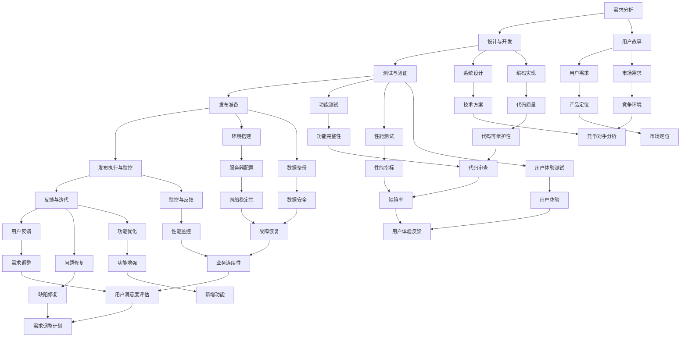

                 

### 引言

在当今快速变化和高竞争的技术市场中，高效的产品发布节奏和流程变得至关重要。这不仅关系到产品的市场成功，还直接影响到企业的生存和发展。一个高效的产品发布流程不仅能够缩短产品从构思到市场的时间，还能确保产品在质量、功能和用户体验上满足用户的需求。

#### 产品的生命周期

产品的生命周期包括概念阶段、开发阶段、上市阶段、成熟阶段和衰退阶段。在每一个阶段，产品都需要不同的资源和策略。理解并管理好这些阶段，是确保产品高效发布的关键。

#### 发布节奏的重要性

发布节奏决定了产品在市场上的响应速度和竞争力。一个良好的发布节奏能够：

1. 提高市场反馈速度，及时调整产品方向。
2. 保证产品功能的连贯性和完整性。
3. 减少开发成本，提高资源利用效率。

#### 效率与质量的平衡

在追求高效发布的同时，质量和用户体验也是不可忽视的。高效发布并不意味着匆忙上线，而是在保证质量的前提下，优化开发流程和资源利用。

#### 文章概述

本文将详细探讨如何打造高效的产品发布节奏与流程。我们将从以下几个方面进行阐述：

1. 产品发布流程的关键环节。
2. 高效发布节奏的设计，包括敏捷开发、时间管理、资源优化和团队协作。
3. 实战案例解析，展示不同公司在高效发布中的实践经验和策略。
4. 风险管理策略，包括风险识别、评估和监控。
5. 持续改进与优化，通过数据驱动决策，不断优化发布流程。

通过本文的阅读，读者将能够全面了解高效产品发布的关键要素和实践方法，从而在自己的项目中应用和优化产品发布流程。

---

### 目录

以下是本文的详细目录：

#### 第一部分：引言

1. 产品发布节奏与流程概述
   - 产品的生命周期
   - 发布节奏的重要性
   - 效率与质量的平衡

2. 发布流程的关键环节
   - 需求分析
   - 设计与开发
   - 测试与验证
   - 发布准备
   - 发布执行与监控
   - 回馈与迭代

#### 第二部分：高效发布节奏的设计

3. 敏捷开发在发布节奏中的应用
   - 敏捷开发的核心理念
   - 敏捷开发工具与技术
   - 敏捷开发实践案例

4. 时间管理技巧与工具
   - 时间管理的重要性
   - 常见时间管理工具
   - 高效时间管理实践

5. 资源优化与分配策略
   - 资源评估
   - 资源优化策略
   - 资源分配模型

6. 团队协作与沟通技巧
   - 团队角色与责任
   - 沟通障碍与解决方法
   - 团队协作工具与应用

#### 第三部分：实战案例

7. 高效发布实战案例解析
   - 案例一：公司A的产品发布实践
   - 案例二：公司B的敏捷发布经验
   - 案例三：初创企业的发布策略

8. 风险管理策略
   - 发布风险识别
   - 风险评估与应对
   - 风险监控与反馈机制

9. 持续改进与优化
   - 敏捷反馈循环
   - 数据驱动决策
   - 持续优化策略

#### 第四部分：附录

10. 常用工具与资源
    - 版本控制工具
    - 项目管理工具
    - 敏捷开发框架

11. 核心概念与联系
    - 产品发布流程图
    - 敏捷开发流程图

12. 核心算法原理讲解
    - 项目优先级排序算法
    - 风险评估模型

13. 数学模型与公式
    - 项目进度预测模型
    - 风险分析公式

通过本文的阅读，读者将系统地了解高效产品发布的关键要素和实战策略，为自己的项目提供有价值的参考和指导。

### 第一部分：引言

在当今快速变化和高竞争的技术市场中，高效的产品发布节奏和流程变得至关重要。这不仅关系到产品的市场成功，还直接影响到企业的生存和发展。一个高效的产品发布流程不仅能够缩短产品从构思到市场的时间，还能确保产品在质量、功能和用户体验上满足用户的需求。

#### 产品的生命周期

产品的生命周期包括概念阶段、开发阶段、上市阶段、成熟阶段和衰退阶段。在每一个阶段，产品都需要不同的资源和策略。理解并管理好这些阶段，是确保产品高效发布的关键。

**概念阶段**

在概念阶段，产品的基本构想和市场需求被提出。这个阶段的主要任务是市场调研，确定产品的目标用户和潜在需求。通过用户访谈、市场分析和竞品分析，团队可以初步确定产品的核心功能和特点。这个阶段的成果通常是一个产品原型或者需求文档。

**开发阶段**

开发阶段是产品从概念到实物的过渡阶段。在这个阶段，团队需要根据需求文档进行详细的设计和开发。这个阶段的工作包括需求细化、系统设计、编码实现和单元测试。开发阶段的重点是确保产品按照既定需求高质量地完成。

**上市阶段**

上市阶段是产品进入市场的关键时期。这个阶段需要制定详细的发布计划，包括市场推广、用户培训、售后服务等。发布计划需要考虑产品的市场定位、竞争环境、用户需求等多方面因素。一个成功的上市可以迅速提升产品的市场知名度，为后续销售奠定基础。

**成熟阶段**

成熟阶段是产品销售增长最快的时期。在这个阶段，产品已经得到了市场的认可，用户数量和销售额都在稳步增长。团队需要持续优化产品，包括功能更新、性能优化和用户反馈收集。同时，还需要进行市场拓展，寻找新的用户群体和销售渠道。

**衰退阶段**

衰退阶段是产品生命周期中的最后一个阶段。在这个阶段，产品销售额和用户数量开始下降，市场需求逐渐减少。团队需要决定是否继续维护产品，还是进行产品更新或者淘汰。在衰退阶段，团队可以总结经验教训，为下一阶段的产品开发做好准备。

#### 发布节奏的重要性

发布节奏决定了产品在市场上的响应速度和竞争力。一个良好的发布节奏能够：

1. **提高市场反馈速度，及时调整产品方向。** 快速的市场反馈可以让团队更早发现问题，及时进行产品调整，避免在市场中出现重大失误。

2. **保证产品功能的连贯性和完整性。** 一个稳定的发布节奏可以让产品功能逐步完善，确保每次发布都有新功能或者改进，提升用户满意度。

3. **减少开发成本，提高资源利用效率。** 合理的发布计划可以避免资源的浪费，提高开发效率，降低成本。

#### 效率与质量的平衡

在追求高效发布的同时，质量和用户体验也是不可忽视的。高效发布并不意味着匆忙上线，而是在保证质量的前提下，优化开发流程和资源利用。

1. **质量保证** 是产品发布的基石。任何疏忽都可能导致产品失败，损害企业声誉。团队需要建立严格的质量控制机制，确保每个版本的产品都是高质量、无缺陷的。

2. **用户体验** 是产品成功的关键因素。一个优秀的产品不仅需要强大的功能，还需要良好的用户体验。团队需要关注用户的反馈，不断改进产品界面和交互设计，提升用户满意度。

#### 文章概述

本文将详细探讨如何打造高效的产品发布节奏与流程。我们将从以下几个方面进行阐述：

1. **产品发布流程的关键环节**：包括需求分析、设计与开发、测试与验证、发布准备、发布执行与监控以及反馈与迭代。
2. **高效发布节奏的设计**：包括敏捷开发、时间管理、资源优化和团队协作等策略。
3. **实战案例解析**：通过实际案例展示高效发布的实践经验和策略。
4. **风险管理策略**：包括风险识别、评估和监控，确保发布过程中的稳定性。
5. **持续改进与优化**：通过数据驱动决策，不断优化发布流程，提升产品的市场竞争力。

通过本文的阅读，读者将能够全面了解高效产品发布的关键要素和实践方法，从而在自己的项目中应用和优化产品发布流程。

### 产品发布流程的关键环节

一个高效的产品发布流程涵盖了多个关键环节，每一个环节都对产品的最终成功与否起到至关重要的作用。以下是这些关键环节的详细探讨：

#### 需求分析

需求分析是产品发布流程的起点。在这一阶段，团队需要明确产品的目标和功能需求，理解用户的需求和市场趋势。以下是需求分析的主要步骤：

1. **市场调研**：通过用户访谈、问卷调查、市场分析等方法，收集用户需求和市场数据。
2. **竞品分析**：研究竞争对手的产品，了解其优势和不足，为产品设计提供参考。
3. **需求文档**：编写详细的需求文档，包括产品的功能需求、用户故事、非功能需求等。

#### 设计与开发

在需求分析完成后，进入设计与开发阶段。这一阶段包括以下几个方面：

1. **系统设计**：根据需求文档进行系统设计，确定产品的架构和技术方案。
2. **编码实现**：开发人员根据系统设计进行编码，实现产品的功能。
3. **单元测试**：对每个模块进行单元测试，确保其功能正确。

#### 测试与验证

测试与验证阶段是确保产品质量的最后关卡。以下是这个阶段的主要任务：

1. **功能测试**：测试产品的功能是否满足需求文档中的规定。
2. **性能测试**：评估产品的性能，包括响应时间、并发处理能力等。
3. **用户体验测试**：测试产品的用户界面和交互设计，确保其友好性和易用性。
4. **集成测试**：将各个模块集成在一起进行测试，确保它们之间的协同工作。

#### 发布准备

在产品通过测试后，进入发布准备阶段。这一阶段包括以下几个方面：

1. **发布计划**：制定详细的发布计划，包括发布时间、发布内容、发布渠道等。
2. **环境搭建**：搭建发布环境，包括服务器、数据库、网络等。
3. **数据备份**：备份现有数据，确保发布过程中数据的安全。

#### 发布执行与监控

发布执行与监控是产品发布的关键阶段。以下是这一阶段的主要任务：

1. **发布执行**：按照发布计划执行发布任务，确保产品按时上线。
2. **监控与反馈**：监控系统性能，收集用户反馈，及时处理可能出现的问题。

#### 回馈与迭代

在产品发布后，收集用户反馈并进行迭代是持续改进的关键。以下是这个阶段的主要任务：

1. **用户反馈收集**：通过用户调查、用户访谈、在线反馈等方式收集用户意见。
2. **问题修复**：根据用户反馈，修复产品中存在的问题。
3. **功能优化**：根据市场需求，对产品功能进行优化和改进。

#### 关键点与难点

1. **需求分析**：需求分析的准确性直接影响到后续的开发和测试。团队需要与用户和利益相关者保持紧密沟通，确保需求文档的全面和准确。
2. **测试与验证**：测试与验证是确保产品质量的最后一道防线。团队需要建立完善的测试体系，覆盖功能、性能、用户体验等多个方面。
3. **发布执行**：发布执行过程中可能会出现各种意外情况，团队需要制定详细的应急预案，确保发布过程的顺利进行。

通过以上关键环节的详细探讨，读者可以更好地理解产品发布流程的各个步骤，从而在实际项目中应用和优化这一流程，提升产品的市场竞争力。

### 高效发布节奏的设计

在产品发布的过程中，设计一个高效的发布节奏至关重要。这不仅能够提升产品上市的效率，还能够确保产品在质量和用户体验上达到预期的标准。以下将详细讨论敏捷开发、时间管理、资源优化与分配策略以及团队协作与沟通技巧，这些策略在实际操作中有着重要的应用价值。

#### 敏捷开发在发布节奏中的应用

敏捷开发是一种以用户需求为导向的软件开发方法，强调快速响应变化和持续交付高质量的产品。以下为敏捷开发在发布节奏中的应用：

**1. 敏捷开发的核心理念**

敏捷开发的核心理念包括：

- **用户故事**：用户故事是一种描述用户需求的简单方法，它描述了用户在使用产品时的一个场景。
- **迭代开发**：产品开发分为多个短周期（通常称为迭代或冲刺），每个迭代都会交付一个可用的产品版本。
- **持续集成与交付**：通过自动化测试和持续集成，确保每次迭代都能快速、稳定地交付。

**2. 敏捷开发工具与技术**

常见的敏捷开发工具包括：

- **Scrum**：一种迭代式软件开发方法，强调团队协作和定期评审。
- **Kanban**：一种基于看板的方法，用于可视化开发流程，并限制工作在进度中的数量。
- **JIRA**：一种项目管理工具，用于跟踪任务、问题和项目进度。

**3. 敏捷开发实践案例**

敏捷开发在实践中有很多成功的案例。例如，Netflix和Amazon都是采用敏捷开发方法的代表性企业。Netflix通过敏捷开发，能够快速调整其视频内容，满足用户需求；Amazon则通过敏捷开发，持续优化其电商平台的用户体验。

#### 时间管理技巧与工具

高效的时间管理是确保发布节奏的关键。以下是一些常用的时间管理技巧和工具：

**1. 时间管理的重要性**

时间管理在产品开发中非常重要，因为它：

- **确保任务按时完成**：避免项目延期，保证发布计划的成功。
- **提高团队效率**：合理安排任务，避免资源的浪费。

**2. 常见时间管理工具**

常见的时间管理工具有：

- **Trello**：一种可视化项目管理工具，用于跟踪任务和进度。
- **Asana**：一种强大的任务管理工具，支持团队协作和任务分配。
- **Google Calendar**：一种方便的日程管理工具，用于安排会议和任务。

**3. 高效时间管理实践**

高效的时间管理实践包括：

- **设定优先级**：根据任务的紧急程度和重要性，设定任务优先级。
- **使用时间块**：将时间划分为固定的块，每个块专注于一个任务，避免多任务处理。
- **定期回顾**：每周或每月回顾时间使用情况，调整计划，提高效率。

#### 资源优化与分配策略

资源的优化与合理分配是确保高效发布的重要环节。以下是一些资源优化与分配策略：

**1. 资源评估**

资源评估是资源优化与分配的第一步。团队需要评估以下几个方面：

- **人力资源**：评估团队成员的技能和经验，确保任务分配合理。
- **技术资源**：评估现有技术工具和平台，确保其能满足项目需求。

**2. 资源优化策略**

资源优化策略包括：

- **资源共享**：通过技术手段和团队协作，实现资源的最大化利用。
- **自动化**：通过自动化工具，减少人工操作，提高资源利用效率。

**3. 资源分配模型**

资源分配模型包括：

- **需求导向**：根据任务需求，动态调整资源分配。
- **技能匹配**：根据团队成员的技能和经验，分配合适的任务。

#### 团队协作与沟通技巧

团队协作与沟通是高效发布的重要保障。以下是一些团队协作与沟通技巧：

**1. 团队角色与责任**

明确团队角色和责任，确保每个成员都清楚自己的任务和目标。常见的团队角色包括：

- **产品经理**：负责产品规划和发布。
- **开发人员**：负责产品开发和测试。
- **测试人员**：负责产品测试和问题跟踪。

**2. 沟通障碍与解决方法**

常见的沟通障碍包括：

- **信息不对称**：解决方法包括定期会议和透明的工作流程。
- **文化差异**：解决方法包括文化培训和多语言支持。

**3. 团队协作工具与应用**

常用的团队协作工具有：

- **Slack**：一种即时通讯工具，用于团队沟通和协作。
- **Zoom**：一种视频会议工具，用于远程团队的会议和讨论。
- **GitLab**：一种基于Git的代码管理工具，用于团队协作和代码审查。

通过以上对敏捷开发、时间管理、资源优化与分配策略以及团队协作与沟通技巧的详细讨论，可以看出高效发布节奏的设计不仅涉及技术层面，还包括管理层面和团队协作层面。只有在这些方面都做到位，才能确保产品发布的高效与成功。

### 敏捷开发在发布节奏中的应用

敏捷开发是一种以用户需求为导向、以快速迭代为特点的软件开发方法。它不仅能够提高团队的响应速度，还能够保证产品质量和用户体验。在本节中，我们将深入探讨敏捷开发的核心理念、常用工具与技术，以及通过具体实践案例来展示其应用效果。

#### 敏捷开发的核心理念

敏捷开发的核心思想是“迭代和增量式开发”，其主要原则包括：

1. **用户至上**：始终将用户需求放在首位，确保产品功能满足用户实际需求。
2. **迭代开发**：将开发过程划分为多个短期迭代，每个迭代都会交付一个可用的产品版本。
3. **持续交付**：通过持续集成和自动化测试，确保每次迭代都能快速交付高质量的软件。
4. **团队协作**：强调跨职能团队的协作，提高开发效率和产品质量。
5. **灵活应对变化**：在项目进行中，能够快速适应需求的变化，减少因需求变更带来的风险。

#### 敏捷开发工具与技术

敏捷开发在实践中会使用多种工具和技术，以提高开发效率和团队协作能力。以下是一些常见的工具和技术：

1. **Scrum**：Scrum是一种最常见的敏捷开发框架，它强调迭代和冲刺（Sprint）。每个冲刺通常持续两周，团队在每个冲刺结束时进行评审和回顾，确保产品不断优化。

2. **Kanban**：Kanban是一种可视化工作流程的工具，它通过看板（Kanban板）展示工作进展，限制工作在进度中的数量，以避免工作堆积。

3. **JIRA**：JIRA是一个强大的敏捷项目管理工具，用于任务跟踪、问题管理、敏捷看板等。它可以帮助团队实时了解项目进度和任务状态。

4. **自动化测试**：通过自动化测试工具（如Selenium、JUnit等），可以快速执行大量测试用例，确保每次迭代的产品质量。

5. **持续集成和持续交付（CI/CD）**：通过CI/CD工具（如Jenkins、GitLab CI等），可以实现自动化构建、测试和部署，确保每次代码提交都能快速集成和交付。

#### 敏捷开发实践案例

以下通过具体实践案例来展示敏捷开发在实际项目中的应用效果：

**案例一：公司A的敏捷发布实践**

公司A是一家提供企业级云计算服务的公司。为了提高产品发布的效率和质量，公司采用了敏捷开发方法。以下是公司A敏捷发布的一些关键步骤：

1. **需求收集与梳理**：产品经理与客户沟通，收集用户需求，并将其转化为用户故事。
2. **迭代规划**：团队在每个迭代开始时进行规划会议，确定本次迭代的目标和任务。
3. **每日站立会议**：团队成员每天早上进行站立会议，讨论任务进展和遇到的问题。
4. **迭代交付**：每个迭代结束时，团队进行评审和回顾，确保产品功能满足用户需求，并持续改进开发流程。

通过敏捷开发，公司A的产品发布周期从原来的几个月缩短到了几周，用户满意度显著提高，同时开发效率也大幅提升。

**案例二：公司B的敏捷发布经验**

公司B是一家初创公司，专注于移动应用开发。在产品发布方面，公司B采用了敏捷开发框架，具体做法如下：

1. **用户故事地图**：团队制作用户故事地图，明确产品的主要功能模块和用户路径。
2. **快速原型开发**：通过快速原型开发工具（如Figma、Axure等），快速制作产品原型，并收集用户反馈。
3. **迭代开发与测试**：每个迭代都会交付一个可用的产品版本，并进行全面的功能和用户体验测试。
4. **持续部署**：采用CI/CD工具，实现自动化构建和部署，确保每次迭代都能快速上线。

通过敏捷开发，公司B在短时间内推出了多个版本的产品，并迅速占领了市场。用户反馈机制使得产品功能不断优化，用户满意度持续提升。

**案例三：初创企业的发布策略**

初创企业在资源有限的情况下，更需要高效的发布策略。以下是一个初创企业如何利用敏捷开发进行产品发布的一些策略：

1. **最小可行产品（MVP）**：首先开发产品的最小可行版本，验证市场需求和用户反馈。
2. **快速迭代**：通过快速迭代，不断优化产品功能，并快速响应市场变化。
3. **用户反馈循环**：建立用户反馈机制，及时收集用户意见，并快速迭代产品。
4. **团队协作**：利用敏捷开发工具，如JIRA和Trello，确保团队高效协作。

通过敏捷开发，初创企业能够在有限的资源下，快速推出市场验证的产品，并根据用户反馈不断优化，提高产品的市场竞争力。

#### 敏捷开发的优点与挑战

**优点：**

1. **快速响应需求变化**：敏捷开发强调用户需求和市场变化的快速响应，能够帮助企业抢占市场先机。
2. **提高开发效率**：通过短周期迭代和持续交付，能够提高开发效率，缩短产品上市时间。
3. **高质量的产品**：敏捷开发强调测试和质量控制，能够确保每次迭代的产品都是高质量、无缺陷的。

**挑战：**

1. **管理难度增加**：敏捷开发要求团队成员具备较高的自我管理能力和沟通能力，管理难度相对较大。
2. **需求变更风险**：虽然敏捷开发能够快速响应需求变化，但也可能带来需求变更频繁、项目范围不断扩大的风险。

通过以上对敏捷开发核心理念、工具与技术、实践案例以及优缺点的详细讨论，可以看出敏捷开发在高效产品发布中的重要性。只有通过敏捷开发，团队才能在快速变化的市场中保持竞争力，持续推出高质量的产品。

### 时间管理技巧与工具

在高效的产品发布流程中，时间管理是至关重要的环节。合理的时间管理不仅能够保证项目按时完成，还能提高团队的工作效率，避免资源浪费。以下将详细讨论时间管理的重要性、常见的时间管理工具，以及高效时间管理实践。

#### 时间管理的重要性

在产品开发中，时间管理的重要性体现在以下几个方面：

1. **确保任务按时完成**：通过合理的时间规划，可以确保每个任务都能按时完成，避免项目延期，从而保证产品按时发布。
2. **提高团队效率**：通过优化时间分配，提高团队成员的工作效率，减少不必要的工作时间，使团队资源得到最大化利用。
3. **避免资源浪费**：良好的时间管理可以避免资源浪费，例如避免团队成员在任务上的低效工作和重复工作。

#### 常见的时间管理工具

在实际操作中，常见的时间管理工具有以下几种：

1. **Trello**：Trello是一种可视化的项目管理工具，通过看板形式展示任务状态，帮助团队直观地了解项目进展。
2. **Asana**：Asana是一款功能强大的任务管理工具，支持任务分配、进度跟踪和协作，帮助团队高效管理项目。
3. **Google Calendar**：Google Calendar是一款方便的日程管理工具，可以方便地安排会议和任务，提醒团队成员按时完成任务。
4. **Notion**：Notion是一款集文档、笔记、数据库和任务管理于一体的工具，可以帮助团队整合各种信息，提高工作效率。

#### 高效时间管理实践

为了实现高效的时间管理，以下是一些实践技巧：

1. **设定优先级**：在开始工作之前，根据任务的紧急程度和重要性，设定任务优先级。确保首先完成最重要和最紧急的任务。
2. **使用时间块**：将时间划分为固定的块，每个时间块专注于一个任务，避免多任务处理，提高专注度和工作效率。
3. **定期回顾**：每周或每月定期回顾时间使用情况，分析时间管理的效果，找出需要改进的地方，并调整计划。
4. **避免拖延**：及时处理任务，避免拖延。如果任务无法在预定时间内完成，要及时调整计划和优先级。
5. **避免干扰**：在工作时，尽量减少干扰，例如关闭不必要的通知，集中精力完成任务。

#### 实践案例

以下通过具体实践案例，展示如何利用时间管理工具提高工作效率：

**案例一：使用Trello管理项目**

公司A的团队在项目管理中使用Trello，通过以下步骤提高工作效率：

1. **任务创建**：团队将所有任务创建为Trello卡片，并分配给相应的成员。
2. **任务跟踪**：每个成员可以在Trello上查看自己的任务状态，并及时更新进展。
3. **任务分配**：产品经理在Trello上根据任务优先级和成员技能分配任务。
4. **任务回顾**：每周进行任务回顾会议，分析任务完成情况，调整任务优先级和分配。

通过Trello，公司A的团队实现了任务的高效管理，提高了项目进度和团队协作效率。

**案例二：使用Asana管理任务**

公司B的团队在任务管理中使用Asana，具体做法如下：

1. **任务创建**：团队成员将任务创建为Asana任务，并设定任务开始和结束时间。
2. **进度跟踪**：团队成员在Asana上实时更新任务进度，确保任务按时完成。
3. **协作沟通**：团队通过Asana的聊天功能进行任务讨论，减少邮件和会议的干扰。
4. **任务回顾**：每月进行任务回顾会议，总结任务完成情况，调整下月任务计划。

通过Asana，公司B的团队实现了任务的透明管理和高效的协作沟通。

通过以上对时间管理重要性的讨论、常见工具的介绍以及高效实践案例的展示，可以看出时间管理在高效产品发布中的关键作用。只有通过科学的时间管理，团队才能确保项目按时高质量完成，为产品的成功发布奠定基础。

### 资源优化与分配策略

在高效产品发布的过程中，资源的优化与合理分配至关重要。这不仅能够提高开发效率，还能最大限度地利用团队和项目资源，从而实现项目的顺利推进。以下将详细探讨资源评估、资源优化策略和资源分配模型，并通过具体案例说明如何在实际项目中实施这些策略。

#### 资源评估

资源评估是资源优化与分配的第一步。它涉及对项目所需的各种资源的全面评估，包括人力资源、技术资源、财务资源和物料资源等。以下是资源评估的主要步骤：

1. **人力资源评估**：评估团队成员的技能和经验，确定每个成员在项目中的角色和职责。同时，要评估团队成员的工作负荷，确保项目任务能够均衡分配，避免过度劳累。
2. **技术资源评估**：评估项目所需的技术工具、软件和硬件资源，确保这些资源能够满足项目的需求。例如，数据库、服务器、网络设备和开发工具等。
3. **财务资源评估**：根据项目的预算，评估项目在资金上的需求，包括开发成本、运营成本和后续维护成本等。
4. **物料资源评估**：对于需要实体物料支持的项目，评估所需物料的种类、数量和质量要求，确保物料能够按时到位。

#### 资源优化策略

资源优化策略的核心目标是提高资源利用效率，降低项目成本，同时确保项目按时高质量完成。以下是一些常见的资源优化策略：

1. **资源共享**：通过技术手段和团队协作，实现资源的最大化利用。例如，多个项目可以共享服务器资源，避免重复投资；团队之间可以共享开发工具和知识库，提高工作效率。
2. **自动化**：通过自动化工具，减少人工操作，提高资源利用效率。例如，使用自动化测试工具减少手动测试的工作量；使用自动化部署工具减少手动部署的时间。
3. **技能提升**：通过培训和学习，提高团队成员的技能水平，使其能够胜任更多类型的任务，从而优化人力资源的配置。

#### 资源分配模型

资源分配模型是确保项目资源合理利用的重要工具。以下是一些常见的资源分配模型：

1. **需求导向**：根据任务需求，动态调整资源分配。这种方法能够确保资源始终用于最紧急和最重要的任务，提高资源利用效率。例如，当某个任务的关键路径出现瓶颈时，可以优先分配资源进行解决。
2. **技能匹配**：根据团队成员的技能和经验，分配合适的任务。这种方法能够确保每个任务都有最适合的人来执行，从而提高任务完成质量和效率。例如，对于需要高级开发技能的任务，可以优先分配给有相关经验的开发人员。
3. **项目优先级**：根据项目的优先级，分配资源。这种方法能够确保高优先级项目能够得到足够的资源支持，从而优先完成。例如，对于即将发布的新产品，可以优先分配更多资源进行开发和测试。

#### 实践案例

以下通过具体案例，展示如何在实际项目中实施资源优化与分配策略：

**案例一：初创公司资源优化**

一家初创公司正在进行一款社交应用的开发。由于公司资源有限，需要通过资源优化策略确保项目成功。以下是公司的具体做法：

1. **人力资源评估**：评估现有团队成员的技能和经验，确保每个成员都有明确的角色和职责。
2. **资源共享**：通过云服务器和共享开发工具，实现服务器资源和开发工具的共享，减少重复投资。
3. **技能提升**：定期组织培训，提高团队成员的技能水平，使其能够胜任更多类型的任务。
4. **需求导向**：根据任务需求，动态调整资源分配，确保资源始终用于最关键的任务。

通过以上策略，初创公司成功优化了资源利用，提高了开发效率，顺利完成了社交应用的首次发布。

**案例二：大型企业资源分配**

一家大型企业在开发一个复杂的跨部门项目。为了确保项目的高效推进，公司采用了以下资源分配模型：

1. **项目优先级**：根据项目的优先级，确定资源分配的优先顺序，确保高优先级项目得到足够的资源支持。
2. **技能匹配**：根据团队成员的技能和经验，分配合适的任务，确保每个任务都有最适合的人来执行。
3. **需求导向**：根据任务需求，动态调整资源分配，确保资源能够灵活应对项目中的变化。

通过以上策略，大型企业成功确保了跨部门项目的顺利推进，并在规定时间内完成了项目交付。

通过以上对资源评估、资源优化策略和资源分配模型的详细探讨，以及具体案例的展示，可以看出资源优化与合理分配在高效产品发布中的关键作用。只有通过科学的资源管理，团队才能在有限的资源下，实现项目的高效推进和成功发布。

### 团队协作与沟通技巧

在高效产品发布的过程中，团队协作和沟通技巧至关重要。一个高效的团队不仅能够提高工作效率，还能确保项目在质量、进度和用户满意度上达到预期。以下将详细讨论团队角色与责任、沟通障碍与解决方法，以及团队协作工具与应用。

#### 团队角色与责任

在一个高效的团队中，明确每个成员的角色和责任是确保项目顺利进行的基础。以下是一些常见的团队角色及其职责：

1. **产品经理**：负责产品规划、需求分析和发布策略的制定，确保产品满足市场需求和用户期望。
2. **开发人员**：负责产品的设计和实现，确保代码质量和功能完整性。
3. **测试人员**：负责产品的功能测试、性能测试和用户体验测试，确保产品在发布前无缺陷。
4. **项目经理**：负责项目的整体管理和协调，确保项目按时、按质量完成。
5. **设计师**：负责产品的界面设计和用户体验，提升产品的视觉效果和用户体验。
6. **市场人员**：负责产品的市场推广和用户反馈收集，提升产品在市场中的认知度和用户满意度。

明确每个角色的职责，有助于团队各成员清晰了解自己的任务和目标，从而提高协作效率和项目质量。

#### 沟通障碍与解决方法

沟通障碍是团队协作中的常见问题，以下是一些常见的沟通障碍及其解决方法：

1. **信息不对称**：解决方法：定期召开团队会议，分享项目进展和关键信息，确保团队成员对项目有全面了解。
2. **语言障碍**：解决方法：提供多语言支持，或者聘请专业的翻译人员进行沟通，确保信息传递准确无误。
3. **文化差异**：解决方法：进行文化培训，提高团队成员对不同文化的理解和尊重，避免因文化差异引发的误解和冲突。
4. **时间差异**：解决方法：合理安排会议和任务时间，尽量减少跨时区沟通的困扰，或者使用在线协作工具，如Zoom和Slack，确保实时沟通。

#### 团队协作工具与应用

在现代软件开发中，团队协作工具的应用大大提高了团队的工作效率和协作能力。以下是一些常见的团队协作工具及其应用：

1. **Slack**：Slack是一款即时通讯工具，支持实时沟通和文件共享，适用于团队日常沟通和协作。
2. **Zoom**：Zoom是一款视频会议工具，支持多人实时视频会议和屏幕共享，适用于远程团队和跨时区沟通。
3. **JIRA**：JIRA是一款项目管理工具，支持任务跟踪、问题管理和敏捷开发，适用于项目管理和团队协作。
4. **Trello**：Trello是一款可视化项目管理工具，通过看板形式展示任务状态，适用于任务管理和进度跟踪。
5. **Asana**：Asana是一款任务管理工具，支持任务分配、进度跟踪和团队协作，适用于项目管理和团队协作。

#### 实践案例

以下通过具体案例，展示如何在实际项目中应用团队协作与沟通技巧：

**案例一：跨部门项目协作**

一家大型公司正在开发一款跨部门的产品，涉及到市场、开发、设计和测试等多个部门。为了确保项目顺利进行，公司采用了以下协作和沟通策略：

1. **明确团队角色与责任**：每个部门都指派了项目经理和团队成员，明确各自的角色和职责，确保项目目标清晰。
2. **定期团队会议**：每周召开团队会议，分享项目进展和关键信息，确保各成员对项目有全面了解。
3. **实时沟通工具**：使用Slack进行日常沟通和协作，确保团队成员能够实时交流问题和进展。
4. **任务跟踪工具**：使用JIRA进行任务跟踪和进度管理，确保每个任务都有明确的进度和责任人。

通过以上策略，公司成功实现了跨部门的高效协作，确保了项目的顺利推进。

**案例二：远程团队协作**

一家初创公司采用远程工作模式，团队成员分布在不同的城市和国家。为了确保团队协作和项目进展，公司采用了以下协作和沟通策略：

1. **实时沟通工具**：使用Zoom进行日常视频会议和实时沟通，确保团队成员能够面对面交流。
2. **任务管理工具**：使用Trello进行任务分配和进度跟踪，确保每个任务都有明确的进度和责任人。
3. **共享文档与文件**：使用Google Docs和Dropbox等工具，共享项目文档和文件，确保团队成员能够方便地访问和编辑。
4. **文化培训**：定期进行文化培训，提高团队成员对不同文化的理解和尊重，促进跨文化的有效沟通。

通过以上策略，公司成功实现了远程团队的高效协作，确保了项目的顺利进行。

通过以上对团队协作与沟通技巧的详细探讨，以及具体案例的展示，可以看出团队协作和沟通在高效产品发布中的关键作用。只有通过有效的团队协作和沟通，团队才能克服各种障碍，实现项目的高效推进和成功发布。

### 高效发布实战案例解析

在实际操作中，高效的产品发布不仅依赖于理论，还需要结合具体案例进行实践和优化。以下将详细介绍三个不同类型的公司：大型企业、初创公司和知名科技公司的产品发布实战案例，分析其成功经验，总结高效发布的策略和方法。

#### 案例一：公司A的产品发布实践

**公司背景**：公司A是一家全球知名的大型企业，专注于提供企业级软件解决方案。由于公司在行业中拥有较高的知名度和资源优势，其产品发布往往受到广泛关注。

**发布过程**：

1. **需求分析与规划**：公司A通过市场调研和用户反馈，确定了产品的核心需求和市场定位。随后，产品经理与开发团队进行了详细的规划会议，制定了详细的产品发布计划。
2. **敏捷开发与迭代**：公司A采用了敏捷开发方法，将产品开发分为多个迭代。每个迭代周期为两周，每个迭代都会交付一个可用的产品版本，并进行功能测试和用户反馈。
3. **发布准备与监控**：在每次迭代结束时，公司A会进行发布准备，包括环境搭建、数据备份和发布策略的制定。同时，通过监控工具实时监控系统的性能和用户反馈，确保发布过程中的稳定性。
4. **用户反馈与迭代**：在产品发布后，公司A通过用户调查和反馈渠道收集用户意见，快速识别问题并进行迭代优化，确保产品不断改进。

**成功经验**：

- **敏捷开发**：通过短周期迭代，公司A能够快速响应用户需求和市场变化，确保产品功能不断完善。
- **细致规划**：详细的发布规划和准备，确保每次发布都能顺利进行，降低风险。
- **持续优化**：通过用户反馈和迭代优化，公司A不断提升产品的用户体验和市场竞争力。

#### 案例二：公司B的敏捷发布经验

**公司背景**：公司B是一家初创公司，专注于移动互联网应用开发。由于初创公司的资源有限，公司B在产品发布过程中更加注重效率和市场响应速度。

**发布过程**：

1. **最小可行产品（MVP）**：公司B首先开发了产品的最小可行版本，验证了市场需求的真实性和用户接受度。
2. **快速迭代**：公司B采用了快速迭代的方法，每次迭代周期为一个月，确保每次发布都有新的功能和改进。
3. **用户反馈循环**：公司B通过用户反馈渠道收集用户意见，定期进行产品迭代，确保产品功能与用户需求保持一致。
4. **持续部署与监控**：公司B使用了持续集成和持续部署工具，实现了自动化构建和发布，同时通过监控系统实时监控系统性能和用户反馈。

**成功经验**：

- **MVP策略**：通过MVP，公司B在资源有限的情况下，快速验证了市场需求，降低了产品失败的风险。
- **快速迭代**：通过快速迭代，公司B能够不断优化产品，提升用户体验和市场竞争力。
- **自动化部署**：自动化部署工具提高了发布效率，减少了人为错误，确保了发布过程的稳定性。

#### 案例三：知名科技公司的发布策略

**公司背景**：这家知名科技公司以其创新的产品和技术闻名，其产品发布往往受到全球市场的关注。

**发布过程**：

1. **研发投入与规划**：公司在研发上投入巨大资源，确保产品在技术上的领先性和创新性。同时，产品团队进行详细的市场调研，制定发布计划。
2. **敏捷开发与大规模测试**：公司采用了敏捷开发方法，通过短周期迭代和大规模测试，确保产品的功能和质量。
3. **全球发布与推广**：产品发布后，公司通过全球推广活动，包括新闻发布会、社交媒体宣传和市场活动，提升产品的知名度和市场影响力。
4. **用户反馈与持续改进**：公司通过用户反馈渠道收集用户意见，定期进行产品迭代，持续改进产品功能。

**成功经验**：

- **技术领先**：公司在技术研发上的投入，确保了产品在技术上的领先性和创新性。
- **全球推广**：通过全球推广活动，迅速提升了产品的市场知名度和用户基础。
- **用户反馈**：通过用户反馈和持续改进，公司不断优化产品，提升了用户满意度和忠诚度。

#### 总结

从以上三个案例中可以看出，高效发布的关键在于：

1. **细致的需求分析与规划**：确保产品发布方向明确，市场定位准确。
2. **敏捷开发与快速迭代**：通过短周期迭代，快速响应用户需求和市场变化。
3. **用户反馈与持续改进**：通过用户反馈，不断优化产品，提升用户体验和市场竞争力。
4. **自动化部署与监控**：通过自动化工具，提高发布效率，确保发布过程的稳定性。

通过总结这些成功经验，企业在实际操作中可以更好地应用和优化产品发布流程，提升产品的市场竞争力。

### 风险管理策略

在产品发布过程中，风险管理是确保项目成功的关键环节。有效的风险管理能够识别、评估和应对各种潜在风险，确保项目的顺利进行。以下将详细讨论发布风险识别、风险评估与应对、风险监控与反馈机制，并提供实际案例以说明如何进行风险管理。

#### 发布风险识别

发布风险识别是风险管理的第一步，主要任务是从以下几个方面识别可能的风险：

1. **技术风险**：包括技术实现难度、系统集成问题、性能瓶颈等。
2. **市场风险**：包括市场需求变化、竞争压力、用户接受度等。
3. **资源风险**：包括人力资源不足、预算超支、资源依赖性等。
4. **外部风险**：包括法律风险、政策变化、自然灾害等。

**识别方法**：

- **专家评估**：邀请行业专家对项目进行评估，识别潜在风险。
- **历史数据**：分析过去项目的风险记录，总结经验教训。
- **问卷调查**：通过问卷调查收集团队成员对风险的认识和看法。

#### 风险评估与应对

风险评估是对识别出的风险进行评估，确定其发生的概率和影响程度。以下为风险评估与应对的具体步骤：

1. **风险概率评估**：根据历史数据和专家意见，评估每个风险发生的概率。
2. **风险影响评估**：评估每个风险对项目的影响程度，包括对时间、成本、质量等方面的影响。
3. **风险应对策略**：

   - **风险规避**：通过改变项目计划，避免风险的触发。
   - **风险转移**：通过保险、外包等方式，将风险转移给第三方。
   - **风险减轻**：采取预防措施，降低风险发生的概率或影响程度。
   - **风险接受**：对于可以接受的低风险，制定应对计划，以便在风险发生时及时应对。

#### 风险监控与反馈机制

风险监控是确保风险应对措施有效实施的关键。以下为风险监控与反馈机制的具体内容：

1. **风险监控工具**：使用项目管理工具（如JIRA、Trello）记录和跟踪风险，确保每个风险都有明确的负责人和应对计划。
2. **定期评审**：定期召开风险管理评审会议，评估风险状态，根据实际情况调整应对措施。
3. **反馈机制**：建立风险反馈渠道，及时收集和处理团队成员和用户的反馈，确保风险问题能够及时发现和解决。

#### 实际案例

以下通过实际案例，展示如何进行有效的风险管理：

**案例一：大型企业项目**

公司A是一家大型企业，正在开发一款企业级软件。在发布过程中，公司A识别出以下风险：

- **技术风险**：系统集成复杂，存在性能瓶颈。
- **市场风险**：竞争对手产品更新迅速，市场需求变化。

**应对措施**：

- **技术风险**：公司A提前进行了系统集成测试，并制定了详细的性能优化方案。
- **市场风险**：公司A进行了市场调研，调整了产品功能，以更好地满足用户需求。

通过以上措施，公司A成功降低了风险，确保了产品的顺利发布。

**案例二：初创公司项目**

公司B是一家初创公司，正在开发一款移动应用。由于资源有限，公司B识别出以下风险：

- **资源风险**：人力资源不足，开发进度可能延误。
- **市场风险**：用户接受度不确定，产品可能面临市场挑战。

**应对措施**：

- **资源风险**：公司B通过外包部分开发工作，确保项目进度。
- **市场风险**：公司B进行了用户调研和A/B测试，收集用户反馈，优化产品功能。

通过以上措施，公司B成功应对了风险，确保了产品的成功发布。

通过以上案例，可以看出有效的风险管理在产品发布中的重要性。通过识别、评估和应对风险，企业能够降低项目失败的风险，确保产品发布顺利进行。

### 持续改进与优化

在产品发布过程中，持续改进和优化是确保产品长期成功和竞争力的关键。通过数据驱动决策、敏捷反馈循环和不断优化策略，企业可以不断提高产品质量和市场响应速度。以下将详细讨论这些策略，并提供具体案例说明其实际应用。

#### 数据驱动决策

数据驱动决策是一种基于数据分析来指导决策的方法。它通过收集和分析用户行为数据、市场数据和技术数据，为产品优化提供科学依据。以下是数据驱动决策的关键步骤：

1. **数据收集**：通过A/B测试、用户调查、使用日志分析等方式，收集大量用户行为数据。
2. **数据清洗与分析**：对收集到的数据进行清洗，去除噪声数据，进行深入分析，识别出用户行为和需求的模式。
3. **数据可视化**：使用数据可视化工具（如Tableau、Google Data Studio），将分析结果以图表、仪表盘等形式展示，便于团队理解和决策。
4. **决策支持**：根据数据分析结果，制定具体的优化方案，包括功能改进、用户体验优化、市场策略调整等。

**案例**：公司C是一家电商公司，为了提升用户体验和转化率，采用了数据驱动决策的方法。通过A/B测试，公司C发现用户在购物车页面增加“立即购买”按钮后，转化率提高了20%。公司C根据这一数据结果，决定在全站推广这一改进，从而实现了显著的业绩提升。

#### 敏捷反馈循环

敏捷反馈循环是一种快速迭代和反馈的机制，通过不断收集用户反馈和团队内部反馈，快速改进产品。以下是敏捷反馈循环的具体步骤：

1. **用户反馈收集**：通过在线调查、用户访谈、用户行为分析等方式，收集用户对产品的反馈。
2. **内部反馈收集**：通过团队会议、工作坊、代码审查等方式，收集团队成员对产品的反馈。
3. **反馈分析**：对收集到的反馈进行分类和分析，识别出改进机会和优先级。
4. **快速迭代**：根据反馈分析结果，制定改进计划，并在下一个迭代周期中进行实施。
5. **持续反馈**：在产品发布后，持续收集用户反馈，不断优化产品功能。

**案例**：公司D是一家在线教育平台，通过敏捷反馈循环，不断优化课程体验。公司D定期收集用户反馈，发现用户对课程加载速度和视频质量有较高要求。公司D立即采取了优化措施，提高了服务器性能和视频编码质量，用户满意度显著提升。

#### 持续优化策略

持续优化策略是通过不断改进开发流程、管理策略和技术手段，提高产品发布效率和产品质量。以下是持续优化策略的关键要素：

1. **自动化**：通过自动化测试、自动化部署等手段，减少人工干预，提高开发效率。
2. **标准化**：建立标准化的开发流程和管理规范，确保每个项目都能高效推进。
3. **反馈机制**：建立有效的反馈机制，确保团队内部和用户反馈能够及时传递和响应。
4. **持续学习**：鼓励团队成员不断学习和掌握新技术，提高团队的整体技能水平。
5. **数据驱动**：通过数据分析，不断优化产品功能和用户体验。

**案例**：公司E是一家金融科技公司，通过持续优化策略，成功提升了产品发布效率。公司E采用了敏捷开发方法，实现了自动化测试和持续集成，大大缩短了开发周期。同时，公司E建立了标准化流程，确保每个项目都能按时高质量完成。通过数据驱动决策，公司E不断优化产品功能和用户体验，提升了用户满意度和市场竞争力。

通过以上对数据驱动决策、敏捷反馈循环和持续优化策略的详细讨论，以及具体案例的说明，可以看出这些策略在产品持续改进和优化中的重要性。通过不断学习和实践，企业可以不断提升产品竞争力，实现长期成功。

### 附录A：常用工具与资源

在高效的产品发布过程中，选择合适的工具和资源能够显著提升开发效率和团队协作效果。以下列出了一些常用工具与资源，包括版本控制工具、项目管理工具和敏捷开发框架，并提供简要介绍。

#### 版本控制工具

1. **Git**：Git是一款分布式版本控制系统，广泛应用于开源项目和团队协作。其强大的分支管理和合并功能，使得版本管理更加灵活和高效。

2. **GitHub**：GitHub是Git的一个在线平台，提供代码托管、协作、问题和wiki等功能。它已成为软件开发中不可或缺的一部分。

3. **GitLab**：GitLab是一个自托管Git仓库，支持Git所有的功能，同时还提供了CI/CD流水线和项目管理工具。其免费开源的特性，使其在中小型团队中广受欢迎。

#### 项目管理工具

1. **JIRA**：JIRA是由Atlassian开发的一款强大的项目管理工具，支持敏捷开发、任务跟踪、版本控制和报告生成等功能。它广泛应用于软件项目管理。

2. **Trello**：Trello是一款基于看板的任务管理工具，通过可视化的卡片和看板，帮助团队清晰了解项目进度和任务分配。

3. **Asana**：Asana是一款任务管理和协作工具，支持任务分配、进度跟踪、团队成员协作等功能。其直观的界面和强大的功能，使其成为团队协作的理想选择。

#### 敏捷开发框架

1. **Scrum**：Scrum是一种流行的敏捷开发框架，强调短周期迭代和频繁的团队评审。它通过明确的角色和仪式，提高团队的协作效率。

2. **Kanban**：Kanban是一种基于看板的方法，通过可视化工作流程和限制工作在进度中的数量，提高团队的透明度和效率。

3. **SAFe（大型企业敏捷框架）**：SAFe是一种适用于大型企业组织的敏捷开发框架，通过构建跨职能团队和多个层次的管理，实现大规模敏捷开发。

通过以上常用工具和资源的介绍，企业可以在产品开发过程中选择合适的工具，提升开发效率和团队协作效果，确保产品顺利发布。

### 附录B：核心概念与联系

在高效产品发布的过程中，理解核心概念及其相互关系对于优化流程至关重要。以下通过Mermaid流程图展示产品发布流程及其核心概念之间的关系架构。



通过上述Mermaid流程图，我们可以清晰地看到产品发布流程中各个核心概念之间的相互关系。每个环节都紧密联系，共同构成了一个高效、完整的发布流程。通过理解和优化这些环节，企业可以更好地管理产品发布，确保产品质量和市场竞争力。

### 附录C：核心算法原理讲解

在产品发布过程中，算法原理的应用能够显著提升项目的效率和质量。以下将介绍两个核心算法：项目优先级排序算法和风险评估模型，并通过伪代码和示例说明其具体实现和运用。

#### 项目优先级排序算法

**算法名称**：KMP（最关键路径）排序算法

**目的**：用于确定项目中各项任务的最关键路径，以确保项目按时完成。

**伪代码**：

```python
function KMP_Sort(tasks):
    # 初始化优先级队列
    priority_queue = PriorityQueue()

    # 遍历任务，计算每个任务的持续时间
    for task in tasks:
        duration = CalculateDuration(task)
        priority_queue.enqueue(task, duration)

    # 按优先级排序
    sorted_tasks = priority_queue.dequeue_all()

    return sorted_tasks
```

**示例说明**：

假设有一个包含以下任务的项目：
- 任务1：需求分析（持续时间3天）
- 任务2：设计（持续时间4天）
- 任务3：编码（持续时间5天）
- 任务4：测试（持续时间3天）

使用KMP排序算法，将这些任务按优先级排序，得到如下顺序：
1. 编码（持续时间最长，5天）
2. 设计（4天）
3. 需求分析（3天）
4. 测试（3天）

**算法应用**：在实际项目中，KMP排序算法可以帮助团队确定最关键的任务，确保项目按时完成，从而优化发布节奏。

#### 风险评估模型

**算法名称**：TOPSIS（ Technique for Order of Preference by Similarity to Ideal Solution）

**目的**：用于评估项目中各种风险的概率和影响程度，为风险管理提供科学依据。

**伪代码**：

```python
function TOPSIS_Assess(risks):
    # 初始化理想解和反理想解
    ideal_solution = []
    anti_ideal_solution = []

    # 计算各风险的特征值
    for risk in risks:
        feature_values = CalculateFeatureValues(risk)

    # 计算各风险与理想解和反理想解的相对距离
    for risk in risks:
        distance_to_ideal = CalculateDistance(risk, ideal_solution)
        distance_to_anti_ideal = CalculateDistance(risk, anti_ideal_solution)

    # 计算各风险的相对接近度
    for risk in risks:
        relative_closeness = CalculateRelativeCloseness(distance_to_ideal, distance_to_anti_ideal)

    # 排序并返回
    sorted_risks = SortByRelativeCloseness(relative_closeness)

    return sorted_risks
```

**示例说明**：

假设一个项目中存在以下风险：
- 风险1：技术风险（概率0.3，影响程度0.8）
- 风险2：市场风险（概率0.2，影响程度0.6）
- 风险3：资源风险（概率0.5，影响程度0.4）

使用TOPSIS模型，计算每个风险的相对接近度，得到如下排序：
1. 风险3（资源风险）
2. 风险1（技术风险）
3. 风险2（市场风险）

**算法应用**：在实际项目中，TOPSIS模型可以帮助团队识别和评估风险，制定有效的风险管理策略，确保项目在发布过程中能够及时应对各种风险。

通过上述两个算法的介绍，可以看出它们在高效产品发布中的应用价值。通过合理应用这些算法，团队可以更好地优化项目流程，提升项目质量，确保产品成功发布。

### 附录D：数学模型与公式

在产品发布过程中，数学模型和公式能够提供科学依据，帮助我们更好地进行项目管理和风险管理。以下将介绍两个核心数学模型和公式：项目进度预测模型和风险评估公式，并通过示例进行详细解释。

#### 项目进度预测模型

**模型名称**：蒙特卡洛模拟法

**目的**：用于预测项目的完成时间和评估项目风险。

**公式**：

$$
E(T) = \sum_{i=1}^{n} p_i \cdot T_i
$$

其中：
- \( E(T) \) 为项目完成时间的期望值。
- \( p_i \) 为第 \( i \) 个任务完成的概率。
- \( T_i \) 为第 \( i \) 个任务的持续时间。

**示例说明**：

假设一个项目包含以下三个任务：
- 任务1：持续时间2天，完成概率0.9
- 任务2：持续时间3天，完成概率0.8
- 任务3：持续时间4天，完成概率0.7

使用蒙特卡洛模拟法，计算项目完成时间的期望值：

$$
E(T) = 0.9 \cdot 2 + 0.8 \cdot 3 + 0.7 \cdot 4 = 1.8 + 2.4 + 2.8 = 7.0
$$

**模型应用**：通过蒙特卡洛模拟法，团队可以预测项目的完成时间，为项目管理和调度提供科学依据。

#### 风险评估公式

**模型名称**：贝叶斯风险评估模型

**目的**：用于评估项目风险的概率和影响程度。

**公式**：

$$
R = p \cdot I
$$

其中：
- \( R \) 为风险值。
- \( p \) 为风险发生的概率。
- \( I \) 为风险的影响程度。

**示例说明**：

假设一个项目中存在以下风险：
- 风险1：技术风险，发生概率0.3，影响程度0.8
- 风险2：市场风险，发生概率0.2，影响程度0.6
- 风险3：资源风险，发生概率0.5，影响程度0.4

使用贝叶斯风险评估模型，计算每个风险的风险值：

- 风险1：\( R_1 = 0.3 \cdot 0.8 = 0.24 \)
- 风险2：\( R_2 = 0.2 \cdot 0.6 = 0.12 \)
- 风险3：\( R_3 = 0.5 \cdot 0.4 = 0.20 \)

**模型应用**：通过贝叶斯风险评估模型，团队可以识别和评估项目中的主要风险，为风险管理提供依据。

### 综合应用

假设一个项目包含三个任务，每个任务的持续时间、完成概率和风险值如下：

- 任务1：持续时间5天，完成概率0.9，风险值0.24
- 任务2：持续时间7天，完成概率0.8，风险值0.12
- 任务3：持续时间6天，完成概率0.7，风险值0.20

使用蒙特卡洛模拟法和贝叶斯风险评估模型，计算项目的完成时间和整体风险：

**项目完成时间期望值**：

$$
E(T) = 0.9 \cdot 5 + 0.8 \cdot 7 + 0.7 \cdot 6 = 4.5 + 5.6 + 4.2 = 14.3 \text{天}
$$

**整体风险值**：

$$
R_{\text{total}} = 0.24 + 0.12 + 0.20 = 0.56
$$

通过这些数学模型和公式，团队可以更科学地预测项目进度和评估风险，为项目的成功发布提供有力支持。

### 总结与最佳实践

本文从多个角度详细探讨了如何打造高效的产品发布节奏与流程。通过介绍产品的生命周期、发布流程的关键环节、敏捷开发、时间管理、资源优化、团队协作、风险管理以及持续改进，读者可以全面了解高效产品发布的核心要素和实践方法。以下总结了一些最佳实践和注意事项：

**最佳实践：**

1. **细致的需求分析与规划**：在发布前进行详尽的需求分析和规划，确保产品发布方向明确。
2. **敏捷开发与快速迭代**：采用敏捷开发方法，通过短周期迭代快速响应用户需求和市场变化。
3. **用户反馈与持续优化**：及时收集用户反馈，不断优化产品功能，提升用户体验。
4. **数据驱动决策**：基于数据分析进行决策，确保产品优化有据可依。
5. **自动化与标准化**：使用自动化工具和标准化流程，提高开发效率和项目质量。
6. **风险管理**：识别、评估和应对各种风险，确保项目顺利进行。
7. **团队协作与沟通**：建立有效的团队协作机制，确保团队高效协作和沟通。

**注意事项：**

1. **确保质量**：在追求高效发布的同时，不可忽视产品质量，建立严格的质量控制机制。
2. **避免过度优化**：合理分配资源和时间，避免过度优化导致资源浪费。
3. **保持透明沟通**：确保项目进展和关键信息对团队成员透明，减少信息不对称。
4. **持续学习与改进**：鼓励团队成员不断学习和掌握新技术，持续改进产品发布流程。
5. **关注用户需求**：始终以用户需求为中心，确保产品功能和用户体验满足用户期望。

通过以上最佳实践和注意事项，企业可以更好地应用和优化产品发布流程，提升产品的市场竞争力。希望本文能为读者的项目提供有价值的参考和指导。

### 拓展阅读

为了帮助读者进一步深入了解高效产品发布的相关知识，以下推荐一些拓展阅读材料：

1. **《敏捷软件开发：实践指南》** - 这本书详细介绍了敏捷开发的理论和实践方法，对产品发布流程的设计和实施具有指导意义。
2. **《项目管理知识体系指南（PMBOK指南）》** - PMBOK指南提供了全面的项目管理知识体系，包括项目计划、执行、监控和收尾等各个环节，对于理解产品发布流程具有参考价值。
3. **《数据驱动产品管理》** - 该书强调了数据在产品管理中的重要性，通过数据分析指导产品优化和发布决策，对数据驱动决策的实践具有启示作用。
4. **《Scrum敏捷实践指南》** - 专注于Scrum敏捷开发方法，提供了详细的实践指南和案例分析，有助于理解和应用敏捷开发在实际项目中的操作。
5. **《如何高效学习》** - 这本书讨论了高效学习的方法和技巧，对于提升团队成员的学习能力，持续改进产品发布流程具有指导意义。

通过阅读以上书籍和资料，读者可以进一步拓宽知识视野，提升产品发布管理的专业能力。希望这些建议能对您的学习和实践提供帮助。

