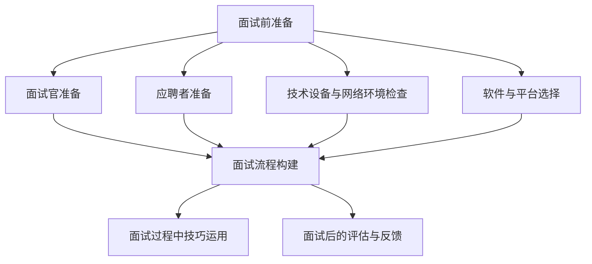

                 


## 《如何打造高效的远程面试流程》

### 关键词
- 远程面试
- 效率提升
- 面试流程设计
- 技术实现
- 评估与反馈

### 摘要
本文将深入探讨如何构建一个高效、可行的远程面试流程。从基本概念、流程设计、技术实现到评估与反馈，我们将逐一分析每一个环节，提供具体的建议和最佳实践。希望通过本文，读者可以全面理解远程面试的优势与挑战，掌握构建高效远程面试流程的关键要素。

---

### 第一部分：远程面试概述

#### 1.1 远程面试的基本概念与重要性

远程面试，顾名思义，是指通过互联网和通信技术进行的面试活动。它摆脱了地理位置的限制，使得企业和应聘者可以跨越时空进行交流。远程面试的基本概念可以归纳为以下几点：

- **定义**：通过互联网进行的面试，通常使用视频、语音、文字等多种沟通方式。
- **实现方式**：主要通过视频会议软件、在线聊天工具等实现。
- **优势**：节省时间、减少旅行成本、提高面试效率。
- **重要性**：在现代社会，远程面试已成为企业招聘的重要方式，特别是在全球化和数字化浪潮下，其重要性日益凸显。

远程面试的兴起与趋势：

- **兴起原因**：随着互联网技术的普及，远程办公和远程教育模式的兴起，远程面试逐渐成为主流。
- **趋势**：越来越多的企业开始采用远程面试，尤其是在全球疫情期间，远程面试的重要性更加突出。

#### 1.2 远程面试的适用场景与限制

远程面试适用场景：

- **地理分散**：企业分布在全球各地，需要远程面试来筛选合适的人才。
- **招聘高峰期**：在招聘高峰期，远程面试可以有效缓解面试压力。
- **特定岗位**：对于需要技术支持或远程协作的岗位，远程面试更为适合。

远程面试场景限制：

- **技术设备要求**：应聘者和面试官需要具备相应的视频、音频设备。
- **网络稳定性**：网络不稳定可能导致面试中断或质量下降。
- **面试体验**：远程面试可能缺乏面对面交流的直观感受。

#### 1.3 远程面试与传统面试的比较

技术实现对比：

- **远程面试**：通过互联网进行，通常使用视频、语音、文字等多种方式。
- **传统面试**：在实体场所进行，主要通过面对面交流。

面试体验对比：

- **远程面试**：可能缺乏面对面交流的直观感受，但可以节省时间和成本。
- **传统面试**：可以提供更直观的交流体验，但可能需要更多时间和资源。

成本效益对比：

- **远程面试**：总体成本较低，尤其是对于企业和应聘者来说。
- **传统面试**：需要支付交通、住宿等额外费用。

---

### 第二部分：远程面试流程设计

#### 2.1 远程面试前准备

**面试官准备**：

- 确认面试目标和流程。
- 准备面试问题清单。
- 熟悉使用的视频面试软件。

**应聘者准备**：

- 确认面试时间和地点。
- 准备简历和相关证明材料。
- 熟悉使用的视频面试软件。

**技术设备与网络环境检查**：

- 确保设备正常运行，包括摄像头、麦克风、扬声器等。
- 检查网络稳定性，确保面试过程中不会出现断线等情况。

**软件与平台的选择**：

- 根据需求选择合适的视频面试软件，如Zoom、Microsoft Teams、Skype等。
- 确保软件兼容性，避免因设备或操作系统问题导致面试失败。

#### 2.2 远程面试流程构建

**面试邀请与确认**：

- 提前发送面试邀请，包括面试时间、地点、所需材料等信息。
- 确认面试时间，确保双方都能参加。

**面试时间安排**：

- 根据双方时间，合理安排面试时间。
- 避免高峰期，确保网络稳定性。

**面试问题设计**：

- 根据面试目标和应聘者背景，设计有针对性的面试问题。
- 包括行为面试、技术面试、情境面试等不同类型。

**面试流程管理**：

- 确保面试按计划进行，避免超时。
- 面试过程中，注意与应聘者的互动，确保沟通顺畅。
- 面试结束后，及时整理面试记录，便于后续评估。

#### 2.3 面试过程中的技巧

**面试官的沟通技巧**：

- 保持良好的语速、语调和态度。
- 鼓励应聘者表达观点，营造轻松的面试氛围。

**面试官的观察技巧**：

- 注意观察应聘者的面部表情、身体语言等非语言信息。
- 根据应聘者的回答，及时调整面试问题。

**面试官的提问技巧**：

- 提问要有针对性，避免无关或重复问题。
- 使用开放式问题，鼓励应聘者表达自己的想法。

**应聘者的表现技巧**：

- 准备充分，熟悉自己的简历和相关背景。
- 保持自信，回答问题时条理清晰、重点突出。
- 注意与面试官的互动，展现良好的沟通能力。

---

### 第三部分：远程面试技术实现

#### 3.1 视频面试技术基础

**视频通信技术概述**：

- 视频通信技术是远程面试的核心，它通过互联网传输视频和音频信号，实现远程实时交流。

**常用视频面试软件对比**：

- **Zoom**：功能强大，支持多平台使用，适合大规模面试。
- **Microsoft Teams**：集成在Office 365中，适合企业内部使用。
- **Skype**：历史悠久，用户众多，适合个人和企业使用。

**技术实现细节与优化**：

- **视频编码与解码**：使用高效的编码算法，提高视频传输质量。
- **网络优化**：选择稳定的网络环境，优化带宽分配。
- **隐私保护**：使用加密技术，确保面试过程中的数据安全。

#### 3.2 远程面试过程中的技术挑战与解决方案

**网络不稳定问题**：

- **解决方案**：选择稳定的网络环境，使用VPN等工具优化网络连接。

**设备兼容性问题**：

- **解决方案**：确保使用的视频面试软件兼容多种设备，如Windows、Mac、iOS、Android等。

**隐私与安全性问题**：

- **解决方案**：使用加密技术，确保面试过程中的数据安全。
- **防止作弊**：设置面试密码，限制访问权限。

**技术支持的持续改进**：

- **解决方案**：定期更新视频面试软件，修复漏洞，提高稳定性。
- **用户培训**：提高用户对视频面试软件的熟悉度，减少技术故障。

---

### 第四部分：远程面试评估与反馈

#### 4.1 远程面试评估方法

**评估标准设定**：

- 根据面试目标和岗位要求，设定具体的评估标准。
- 包括技术能力、沟通能力、团队合作能力等。

**评估工具使用**：

- 使用专业的面试评估工具，如面试评分表、行为事件记录表等。
- 结合主观评价和客观数据，提高评估准确性。

**评估结果的反馈与应用**：

- 及时向应聘者反馈评估结果，提供改进建议。
- 将评估结果应用于人才选拔和团队建设。

#### 4.2 远程面试反馈机制

**面试官与应聘者的反馈**：

- 鼓励面试官和应聘者互相反馈，分享面试体验和感受。
- 通过问卷调查、面对面交流等方式，收集反馈信息。

**面试官团队反馈**：

- 定期组织面试官团队会议，讨论面试经验和问题。
- 根据反馈信息，优化面试流程和策略。

**面试流程优化建议**：

- 根据评估结果和反馈信息，不断优化远程面试流程。
- 关注新技术和新方法的应用，提高面试效率和效果。

---

### 第五部分：远程面试案例研究

#### 5.1 远程面试成功案例分析

**案例背景**：

- 一家互联网公司因全球业务扩展，需要进行大规模招聘。
- 远程面试成为公司招聘的主要方式。

**案例实施**：

- 制定详细的远程面试流程，包括面试邀请、时间安排、问题设计等。
- 使用Zoom作为视频面试软件，确保面试顺利进行。
- 对面试官和应聘者进行培训，提高面试质量和效果。

**案例成效**：

- 远程面试有效提高了招聘效率，缩短了招聘周期。
- 面试质量得到保障，成功招聘到多名优秀人才。

#### 5.2 远程面试失败案例分析

**案例背景**：

- 一家初创公司计划通过远程面试招聘技术人才。
- 由于缺乏远程面试经验，面试过程中出现多次技术故障。

**案例原因**：

- 面试前准备不足，设备和网络环境未经过充分检查。
- 面试过程中，面试官和应聘者沟通不畅，导致面试效果不佳。

**案例教训**：

- 远程面试前要进行充分的准备，包括设备、网络和面试流程。
- 面试过程中，注重沟通技巧，确保面试顺利进行。
- 定期进行远程面试培训，提高面试官和应聘者的技能。

---

### 第六部分：远程面试的未来趋势与发展

#### 6.1 远程面试的发展趋势

**技术进步对远程面试的影响**：

- **人工智能**：通过人工智能技术，实现智能面试助手，提高面试效率和准确性。
- **虚拟现实**：利用虚拟现实技术，提供更加沉浸式的面试体验。
- **云计算**：通过云计算技术，实现远程面试的实时数据处理和分析。

**远程面试在多元文化和全球化背景下的发展**：

- **多元文化**：远程面试支持多种语言和文化的交流，促进全球人才流动。
- **全球化**：远程面试降低了地理障碍，使得全球范围内的招聘变得更加便捷。

**远程面试在教育、医疗等领域的应用前景**：

- **教育**：远程面试可以帮助学校和企业进行人才选拔，提高教育质量。
- **医疗**：远程面试可以用于医疗招聘，降低医疗人才的地理限制。

#### 6.2 远程面试的未来挑战与机遇

**挑战分析**：

- **技术稳定性**：如何保证远程面试过程中的技术稳定性，是未来的一大挑战。
- **隐私保护**：如何在确保隐私的同时，提高面试效率。

**机遇探讨**：

- **在线教育**：远程面试与在线教育的结合，可以提供更加灵活和高效的教育方式。
- **远程协作**：远程面试可以促进远程协作，提高工作效率。

**未来发展方向与建议**：

- **技术创新**：继续探索和引入新技术，提高远程面试的效率和效果。
- **标准化**：制定远程面试的行业标准，提高整体水平。

---

### 附录

**A. 远程面试相关工具与资源**

- **视频面试软件推荐**：
  - Zoom
  - Microsoft Teams
  - Skype
- **远程面试技巧手册**：
  - 如何准备远程面试
  - 面试官与应聘者的沟通技巧
  - 常见问题解答
- **远程面试常见问题解答**：
  - 设备和网络环境问题
  - 软件使用问题
  - 面试流程问题
- **远程面试相关书籍与论文推荐**：
  - 《远程工作与协作》
  - 《面试宝典》
  - 相关学术论文和研究报告

**B. Mermaid 流程图与伪代码示例**

**C. 数学模型与公式解释**

**D. 代码实现与分析**

---

**作者信息**：

- 作者：AI天才研究院/AI Genius Institute & 禅与计算机程序设计艺术 /Zen And The Art of Computer Programming

### 背景介绍

随着全球化和数字化进程的加速，远程面试已经成为企业和求职者之间的主流沟通方式。远程面试不仅解决了地理限制的问题，还大大提高了招聘效率和成本效益。然而，远程面试也面临着诸多挑战，如技术稳定性、沟通效率、面试体验等。为了打造一个高效、可行的远程面试流程，我们需要深入理解远程面试的基本概念、核心流程、技术实现和评估方法。

本文将从以下几个方面展开：

1. **远程面试的基本概念与重要性**：介绍远程面试的定义、兴起原因和适用场景。
2. **远程面试流程设计**：包括面试前准备、流程构建和面试过程中的技巧。
3. **远程面试技术实现**：探讨视频面试技术基础、技术挑战和解决方案。
4. **远程面试评估与反馈**：介绍评估方法、反馈机制和面试流程优化。
5. **远程面试案例研究**：通过成功和失败案例，分析远程面试的实际应用。
6. **远程面试的未来趋势与发展**：探讨技术进步对远程面试的影响和未来发展方向。
7. **附录**：提供远程面试相关的工具与资源，包括流程图、伪代码示例、数学模型与公式解释以及代码实现与分析。

通过以上分析，本文旨在为读者提供一套完整的远程面试流程构建方案，帮助企业和求职者更好地应对远程面试的挑战，实现高效招聘。

#### 1.1 远程面试的基本概念与重要性

**远程面试的定义**：

远程面试是指通过互联网和通信技术，实现应聘者与面试官之间的互动交流。它不再受地理位置的限制，应聘者可以在家中、办公室或任何有网络连接的地方参加面试。远程面试通常包括视频、音频和文字等多种沟通方式，使得应聘者与面试官可以进行实时对话，传递信息和反馈。

**远程面试的兴起与趋势**：

远程面试的兴起可以追溯到互联网和移动通信技术的发展。随着智能手机、平板电脑和高速互联网的普及，远程面试逐渐成为一种可行的招聘方式。特别是在全球化和数字化浪潮的推动下，远程面试的应用范围和频率都在迅速增加。以下是一些推动远程面试发展的关键因素：

- **全球招聘需求**：企业需要在全球范围内招聘优秀人才，远程面试可以跨越地理障碍，使企业能够从更广泛的范围内选拔人才。
- **效率提升**：远程面试减少了候选人需要花费在旅行上的时间和成本，同时企业也可以节省面试场地和接待费用，提高招聘效率。
- **技术进步**：视频会议软件、在线协作工具和人工智能技术的不断发展，为远程面试提供了更加稳定、高效和智能的支持。

**远程面试的优势**：

远程面试相较于传统面试具有明显的优势，这些优势在当前和未来的招聘环境中尤为重要。

- **节省时间和成本**：远程面试无需候选人前往面试地点，减少了通勤时间和住宿费用，同时企业也节省了面试场地和接待成本。
- **提高面试效率**：远程面试可以安排更多的面试，缩短招聘周期，使企业能够更快地找到合适的人才。
- **拓宽人才范围**：远程面试不受地理限制，企业可以从全球范围内招聘，增加人才选择的多样性。
- **灵活性和便捷性**：远程面试使得候选人可以更灵活地安排面试时间，提高了面试的便捷性。

**远程面试的挑战**：

尽管远程面试具有诸多优势，但在实际应用中仍面临一些挑战。

- **技术稳定性**：远程面试依赖于网络和通信设备，网络不稳定或设备故障可能导致面试中断或质量下降。
- **沟通障碍**：远程面试缺乏面对面交流的直观感受，可能影响面试官对候选人的判断和候选人对企业的了解。
- **隐私和安全**：远程面试需要确保面试过程中的数据安全和隐私保护，防止信息泄露和恶意攻击。

**远程面试的重要性**：

远程面试在现代招聘中扮演着重要角色，其重要性主要体现在以下几个方面：

- **应对全球化和远程工作趋势**：随着全球化和远程工作的普及，远程面试成为企业招聘和人才管理的重要手段。
- **提高招聘效率和质量**：远程面试可以快速筛选候选人，提高招聘效率，同时确保面试过程的公正性和专业性。
- **增强企业竞争力**：通过远程面试，企业可以吸引更多优秀的人才，提升团队的整体素质，增强市场竞争力。

总之，远程面试作为现代招聘的一种重要方式，不仅提高了招聘效率和成本效益，还为企业和求职者提供了更加灵活和便捷的招聘体验。理解和掌握远程面试的基本概念、流程设计和实施技巧，对于企业和求职者来说都具有重要意义。

#### 1.2 远程面试的适用场景与限制

远程面试因其独特的优势，在多种场景中表现出色，但也存在一些适用限制。理解这些适用场景与限制，对于有效利用远程面试工具至关重要。

**适用场景**：

1. **地理分散的企业与求职者**：对于跨国公司或分布式团队，远程面试可以轻松解决地理位置带来的招聘难题，使得全球范围内的优秀人才都可以成为考虑对象。

2. **招聘高峰期**：在招聘需求高峰期，远程面试能够迅速安排大量面试，提高招聘效率，缓解招聘压力。

3. **特定岗位**：对于需要高度技术支持和远程协作的岗位，如软件开发、数据分析、远程客户服务等，远程面试可以更好地评估候选人的实际工作能力。

4. **紧急招聘**：在紧急情况下，远程面试可以快速响应，缩短招聘时间，确保企业运营不受影响。

5. **成本控制**：对于预算有限的企业，远程面试避免了面试过程中的交通和住宿费用，大大降低了招聘成本。

**场景限制**：

1. **技术设备要求**：远程面试需要稳定的网络连接和适当的设备，如摄像头、麦克风和扬声器等。设备不足或网络不稳定可能导致面试中断或质量下降。

2. **网络稳定性**：远程面试依赖于稳定的网络环境，网络波动或中断可能影响面试的顺利进行。特别是在偏远地区或网络基础设施不完善的地方，远程面试的可行性会受到影响。

3. **面试体验**：远程面试虽然方便，但缺乏面对面交流的直观感受。面试官和候选人可能难以准确捕捉到对方的面部表情、肢体语言等非语言信息，从而影响面试效果。

4. **隐私与安全性**：远程面试需要确保面试过程中的数据安全和隐私保护。企业需要采取有效的技术措施，防止信息泄露和未经授权的访问。

**企业与应聘者的选择因素**：

1. **企业选择远程面试的因素**：
   - **招聘效率**：远程面试能够快速安排和进行面试，提高招聘效率。
   - **成本节约**：减少面试场地和交通费用，降低招聘成本。
   - **地理灵活性**：从全球范围内选拔人才，不受地理位置限制。
   - **技术稳定性**：选择可靠的视频会议软件和硬件设备，确保面试顺利进行。

2. **应聘者选择远程面试的因素**：
   - **时间和地点灵活**：无需前往面试地点，节省通勤时间，适合工作与家庭兼顾的应聘者。
   - **隐私保护**：在家中进行面试，减少面试过程中的压力和不适。
   - **技术适应**：具备适当的设备和技术知识，能够顺利参加远程面试。

**总结**：

远程面试在地理分散、招聘高峰期和特定岗位等场景中表现出色，但其适用也受到技术设备、网络稳定性和面试体验的限制。企业和应聘者需要根据具体情况，权衡远程面试的优缺点，做出合适的选择。

#### 1.3 远程面试与传统面试的比较

远程面试与传统面试在技术实现、面试体验和成本效益等方面存在显著差异。通过对比分析，我们可以更好地理解远程面试的优劣势，为实际应用提供参考。

**技术实现对比**

远程面试依赖于互联网和通信技术，其技术实现包括视频通信、音频通信和文字交流。远程面试通常使用专业的视频会议软件，如Zoom、Microsoft Teams、Skype等，这些软件提供了实时视频通话、屏幕共享、文件传输等功能，使得面试官和应聘者可以进行全方位的沟通。

- **远程面试**：使用视频会议软件，支持多种设备和平台，如Windows、Mac、iOS、Android等，具备高度的可操作性和灵活性。
- **传统面试**：通常在实体场所进行，依赖于场地安排、设备调试等，相对较为固定和复杂。

**面试体验对比**

远程面试和传统面试在面试体验上有所不同。远程面试虽然方便快捷，但缺乏面对面交流的直观感受，可能影响面试官对候选人的判断和候选人对企业的了解。

- **远程面试**：由于缺乏面对面交流，面试官和候选人可能难以准确捕捉到对方的面部表情、肢体语言等非语言信息。此外，网络延迟或音质问题也可能影响交流质量。
- **传统面试**：在实体场所进行的传统面试可以提供更直观的交流体验。面试官可以通过观察候选人的表情、举止等非语言信息，更全面地了解候选人的综合素质。同时，候选人也可以更直观地感受到企业的文化和氛围。

**成本效益对比**

远程面试在成本效益方面具有明显优势，特别是在招聘高峰期和特定岗位需求上。

- **远程面试**：远程面试可以节省面试场地、交通和住宿费用，降低招聘成本。同时，远程面试还可以提高招聘效率，缩短招聘周期，减少企业的人力资源投入。
- **传统面试**：传统面试需要支付面试场地租赁、交通补贴和住宿费用等，成本较高。特别是在大规模招聘时，这些费用可能会显著增加。

**总结**

远程面试和传统面试在技术实现、面试体验和成本效益方面各有优缺点。远程面试以其便捷性、灵活性和成本效益优势，成为现代招聘的重要方式。然而，传统面试在面试体验和全面评估候选人方面仍有其不可替代的优势。企业在选择面试方式时，应综合考虑实际需求和预算，合理配置远程面试和传统面试，以实现最优招聘效果。

### 第二部分：远程面试流程设计

远程面试的成功不仅依赖于技术实现，更依赖于流程设计的科学性和系统性。一个高效、合理的远程面试流程，可以确保面试的顺利进行，提高面试效率和质量。以下是远程面试流程设计的关键环节：

#### 2.1 远程面试前准备

**面试官准备**

1. **确定面试目标和流程**：在面试前，面试官需要明确面试的目标和流程，包括面试的类型（如技术面试、行为面试等）、面试的问题和评估标准。
   
2. **准备面试问题清单**：根据面试目标和应聘者背景，准备有针对性的面试问题。问题应涵盖应聘者的专业技能、工作经历、团队合作能力等方面。

3. **熟悉使用的视频面试软件**：面试官需要熟悉使用的视频面试软件，如Zoom、Microsoft Teams等，了解其基本功能和操作，确保在面试过程中能够顺畅使用。

**应聘者准备**

1. **确认面试时间和地点**：应聘者需要提前确认面试时间和地点（通常是虚拟会议室的链接），确保在面试当天能够准时参加。

2. **准备简历和相关证明材料**：应聘者应准备好自己的简历和相关的证明材料，如项目作品、证书等，以便在面试过程中展示。

3. **熟悉使用的视频面试软件**：应聘者需要熟悉使用的视频面试软件，确保设备正常运行，如摄像头、麦克风、扬声器等。

**技术设备与网络环境检查**

1. **确保设备正常运行**：在面试前，确保所有视频、音频设备正常运行，如摄像头、麦克风、扬声器等。

2. **检查网络稳定性**：确保网络连接稳定，避免在面试过程中出现断线或信号不稳定的情况。

3. **测试网络速度**：使用网络速度测试工具，检查网络带宽是否足够，确保视频和音频传输流畅。

**软件与平台的选择**

1. **选择合适的视频面试软件**：根据企业和应聘者的需求，选择合适的视频面试软件。如Zoom适合大规模面试，Microsoft Teams适合企业内部面试。

2. **确保软件兼容性**：确保使用的视频面试软件兼容多种设备（如Windows、Mac、iOS、Android等），避免因设备或操作系统问题导致面试失败。

#### 2.2 远程面试流程构建

**面试邀请与确认**

1. **发送面试邀请**：在面试前，通过电子邮件或面试预约系统发送面试邀请，包含面试时间、地点（虚拟会议室链接）、所需材料等信息。

2. **确认面试时间**：与应聘者确认面试时间，确保双方都能参加。如有变动，及时通知对方，并安排新的面试时间。

**面试时间安排**

1. **合理安排面试时间**：根据双方的时间，合理安排面试时间。尽量避免高峰期，确保网络稳定性。

2. **设定面试时长**：根据面试目标和应聘者数量，设定合理的面试时长，确保每个面试者都能得到充分的时间展示自己。

**面试问题设计**

1. **设计有针对性的面试问题**：根据面试目标和应聘者背景，设计有针对性的面试问题。问题应涵盖技术能力、工作经历、团队合作能力等方面。

2. **分类面试问题**：将面试问题分为技术问题、行为问题、情境问题等不同类型，确保面试的全面性。

**面试流程管理**

1. **按计划进行面试**：确保面试按计划进行，避免超时。在面试过程中，注意与应聘者的互动，确保沟通顺畅。

2. **记录面试信息**：面试过程中，及时记录关键信息，如应聘者的回答、表现等，便于后续评估。

3. **整理面试记录**：面试结束后，整理面试记录，包括应聘者的回答、评估结果等，为后续决策提供依据。

#### 2.3 面试过程中的技巧

**面试官的沟通技巧**

1. **保持良好的语速、语调和态度**：语速不宜过快或过慢，语调要适中，态度要友好，营造轻松的面试氛围。

2. **鼓励应聘者表达观点**：面试过程中，鼓励应聘者表达自己的观点和想法，确保双方沟通的互动性。

3. **注意倾听**：认真倾听应聘者的回答，适时给予反馈，确保理解应聘者的意思。

**面试官的观察技巧**

1. **注意非语言信息**：面试过程中，注意观察应聘者的面部表情、身体语言等非语言信息，这些信息可能反映出应聘者的真实心态和情绪。

2. **捕捉关键信息**：在应聘者回答问题时，注意捕捉关键信息，如技术细节、工作经验等，以便在后续评估中参考。

3. **适时调整面试问题**：根据应聘者的回答和表现，适时调整面试问题，确保面试的深度和广度。

**面试官的提问技巧**

1. **提问有针对性**：提问应针对应聘者的具体经历和能力，避免无关或重复问题。

2. **使用开放式问题**：开放式问题可以鼓励应聘者表达自己的想法，提供更多信息。

3. **避免诱导性问题**：提问时应保持中立，避免使用可能诱导应聘者回答的问题。

**应聘者的表现技巧**

1. **准备充分**：在面试前，充分准备自己的简历和相关背景，确保对简历上的内容了如指掌。

2. **保持自信**：在面试过程中，保持自信，回答问题时条理清晰、重点突出。

3. **展现良好的沟通能力**：与面试官保持良好的互动，积极表达自己的观点，展现良好的沟通技巧。

4. **注意非语言信息**：在回答问题时，注意自己的面部表情和身体语言，确保与语言表达一致，展现良好的专业形象。

通过科学、系统的流程设计和有效的技巧运用，远程面试可以更加高效地进行，提高面试质量和效果。企业和应聘者应共同努力，充分利用远程面试的优势，实现最佳招聘效果。

### 第三部分：远程面试技术实现

远程面试的技术实现是确保面试顺利进行的关键。在这一部分，我们将探讨视频面试技术的基础、常用视频面试软件的对比，以及远程面试过程中的技术挑战和解决方案。

#### 3.1 视频面试技术基础

**视频通信技术概述**

视频通信技术是远程面试的核心，它通过互联网传输视频和音频信号，实现面试官与应聘者的实时交流。视频通信技术的基本原理包括视频编码、网络传输和视频解码三个关键环节。

- **视频编码**：将视频信号转换为数字信号，以便在互联网上传输。常见的编码标准有H.264、HEVC等。
- **网络传输**：通过互联网传输视频和音频信号。网络传输质量直接影响面试的流畅性和清晰度。
- **视频解码**：将接收到的数字信号转换为视频信号，以便面试官和应聘者观看。

**常用视频面试软件对比**

在选择视频面试软件时，企业和应聘者需要考虑软件的功能、稳定性、易用性、兼容性等因素。以下是几种常用的视频面试软件及其特点：

- **Zoom**：Zoom是一款功能强大的视频会议软件，支持多平台使用，提供视频、音频、屏幕共享等功能。它适用于大中型企业的远程面试，具有高度的可操作性和灵活性。

- **Microsoft Teams**：Microsoft Teams是微软公司推出的团队协作工具，集成在Office 365中。它提供了视频会议、聊天、文件共享等功能，适合企业内部使用。

- **Skype**：Skype是一款历史悠久的视频通信工具，用户众多，支持多种平台。它提供了视频、音频、聊天等功能，适用于个人和企业。

**技术实现细节与优化**

- **网络优化**：选择稳定、高速的网络环境，确保视频和音频信号传输的流畅性。企业可以考虑使用VPN等技术，优化网络连接质量。
- **视频编码优化**：使用高效的编码算法，降低带宽需求，提高视频传输质量。如H.264和HEVC编码标准。
- **设备兼容性**：确保视频面试软件兼容多种设备和操作系统，如Windows、Mac、iOS、Android等，避免因设备不兼容导致的面试失败。

#### 3.2 远程面试过程中的技术挑战与解决方案

**网络不稳定问题**

网络不稳定是远程面试中常见的问题，可能由于网络带宽不足、网络波动等原因导致。以下是一些解决方案：

- **选择稳定的网络环境**：在面试前，选择稳定的网络环境，避免在高峰期进行面试。
- **使用VPN**：使用VPN优化网络连接，提高网络稳定性。
- **备用网络**：准备备用网络，如Wi-Fi和有线网络，确保在一种网络不稳定时能够迅速切换。

**设备兼容性问题**

设备兼容性问题可能导致视频面试软件无法正常使用。以下是一些解决方案：

- **确保设备兼容性**：在选择视频面试软件时，确保其兼容使用的设备和操作系统。
- **更新设备驱动程序**：定期更新设备的驱动程序，确保设备与视频面试软件的兼容性。
- **使用标准设备**：使用标准的视频设备，如USB摄像头和麦克风，避免因设备不兼容导致的面试问题。

**隐私与安全性问题**

远程面试需要确保面试过程中的数据安全和隐私保护。以下是一些解决方案：

- **使用加密技术**：使用加密技术，确保视频和音频信号在传输过程中的安全性。
- **设置面试密码**：为视频面试设置密码，限制访问权限，防止未经授权的访问。
- **网络安全意识**：提高面试官和应聘者的网络安全意识，避免泄露敏感信息。

**技术支持的持续改进**

为了提高远程面试的效率和效果，企业需要不断进行技术支持的改进。以下是一些改进方向：

- **定期更新视频面试软件**：定期更新视频面试软件，修复漏洞，提高稳定性。
- **用户培训**：为面试官和应聘者提供培训，提高他们对视频面试软件的熟悉度，减少技术故障。
- **反馈机制**：建立反馈机制，收集用户对视频面试软件的使用反馈，不断优化软件功能。

通过以上技术实现和解决方案，企业可以确保远程面试的顺利进行，提高面试效率和质量。

#### 4.1 远程面试评估方法

远程面试的评估是招聘流程中至关重要的一环，它决定了哪些候选人将进入下一轮面试或被聘用。为了确保评估的准确性和公正性，企业需要制定合理的评估标准，并使用有效的评估工具和方法。

**评估标准设定**

评估标准是评估候选人能力、经验和潜力的重要依据。企业应根据面试目标和岗位要求，设定具体的评估标准。以下是一些常见的评估标准：

- **专业技能**：评估候选人的技术能力和专业水平，包括对岗位相关技术的掌握程度、项目经验等。
- **沟通能力**：评估候选人在面试过程中的沟通表达能力，包括语言流畅度、逻辑清晰度、表达能力等。
- **团队合作能力**：评估候选人在团队协作中的表现，包括合作意识、协调能力、冲突处理等。
- **工作态度**：评估候选人的职业素养，包括责任心、积极主动性、自我驱动等。
- **问题解决能力**：评估候选人在面对问题和挑战时的应对策略和解决能力。

**评估工具使用**

为了提高评估的准确性和效率，企业可以采用以下评估工具：

- **面试评分表**：面试评分表是一种结构化的评估工具，用于记录面试过程中的关键信息和评分。评分表应包括面试官对候选人在各个评估标准上的评分，以便后续分析和比较。
- **行为事件记录表**：行为事件记录表用于记录候选人在过去工作中遇到的具体事件和应对策略。通过分析候选人的行为事件，面试官可以更全面地了解候选人的工作风格和能力。
- **面试评估系统**：面试评估系统是一种自动化工具，用于记录、分析和报告面试结果。通过面试评估系统，企业可以快速获取面试数据，进行数据分析，提高招聘决策的准确性。

**评估结果的反馈与应用**

评估结果不仅是对候选人能力的一次评价，更是企业制定招聘策略和人才发展计划的重要参考。以下是一些反馈和应用方法：

- **及时反馈**：在面试结束后，及时向候选人反馈评估结果，包括他们的优势和需要改进的地方。反馈应具体、客观，以便候选人能够明确了解自己的表现。
- **评估结果的记录**：将评估结果记录在人才档案中，便于后续查询和分析。通过积累评估数据，企业可以建立候选人库，优化人才选拔和培养策略。
- **改进招聘流程**：根据评估结果，分析面试流程中存在的问题，提出改进措施，提高面试效率和效果。
- **人才发展计划**：针对评估结果，制定个性化的人才发展计划，帮助候选人提升能力，实现职业成长。

通过科学、系统的评估方法和工具，企业可以确保远程面试的评估过程公正、准确，为招聘决策提供有力支持。

#### 4.2 远程面试反馈机制

**面试官与应聘者的反馈**

远程面试结束后，及时有效的反馈对于双方都至关重要。以下是如何实现反馈机制的具体步骤：

- **及时沟通**：面试结束后，面试官应尽快向应聘者发送面试反馈。反馈内容应包括面试过程中的亮点、需要改进的地方以及是否进入下一轮面试。
- **具体详细**：反馈应具体详细，避免模糊不清的表述。例如，如果应聘者在技术面试中表现不佳，面试官可以指出具体的问题，如代码编写中的逻辑错误或算法效率不高等。
- **正向鼓励**：在反馈中应给予应聘者正向鼓励，强调他们在某些方面的优势，并鼓励他们在后续面试中继续努力。

**面试官团队反馈**

除了个体反馈，面试官团队的整体反馈也是优化远程面试流程的重要环节。以下是如何实现团队反馈的具体方法：

- **定期会议**：面试官团队应定期召开会议，讨论面试过程中的经验和问题。会议内容可以包括面试策略、评估标准、反馈方式等。
- **评估流程**：在会议中，团队可以评估当前的面试流程，讨论是否存在需要改进的地方。例如，面试问题设计是否合理、面试时长是否合适等。
- **培训与指导**：通过团队反馈，识别出需要培训的领域，并对面试官进行有针对性的培训和指导，提高他们的面试技能和评估能力。

**反馈机制优化**

为了确保反馈机制的持续优化，企业可以采取以下措施：

- **反馈收集**：建立反馈收集渠道，如问卷调查、面试后反思表等，收集应聘者和面试官的反馈意见。
- **数据分析**：对收集到的反馈数据进行系统分析，识别出普遍存在的问题和改进机会。
- **流程调整**：根据数据分析结果，及时调整面试流程和策略，提高面试效率和效果。
- **持续改进**：将反馈机制作为持续改进的一部分，定期回顾和优化，确保远程面试流程的不断优化。

通过建立有效的反馈机制，企业可以不断优化远程面试流程，提高面试质量和效率，从而更好地选拔优秀人才。

#### 第五部分：远程面试案例研究

在探讨远程面试的实际应用时，通过成功和失败案例的分析可以提供宝贵的经验和教训。以下将分别介绍一个远程面试成功的案例和一个远程面试失败的案例，并从中总结出关键的经验和教训。

#### 5.1 远程面试成功案例分析

**案例背景**

某全球知名互联网公司因业务扩展需要招聘一名高级软件工程师。由于公司在全球范围内有多个办公地点，且候选人分布在不同的城市和国家，因此决定采用远程面试的方式来筛选合适的候选人。

**案例实施**

1. **详细的面试准备**：公司在面试前进行了详细的准备工作。首先，公司明确了面试的目标和要求，并制定了详细的面试问题清单。其次，面试官对候选人的背景进行了充分的了解，以便设计有针对性的面试问题。同时，公司选择了Zoom作为远程面试软件，并对面试官和候选人都进行了技术测试，确保设备和网络环境符合要求。

2. **面试流程管理**：公司在面试过程中严格按照既定的流程进行。面试邀请提前发送，面试时间合理安排，确保候选人和面试官都能参与。面试过程中，面试官保持良好的沟通技巧，鼓励候选人充分表达自己的观点，同时通过屏幕共享功能展示技术实现。

3. **反馈与跟进**：面试结束后，公司及时向候选人反馈了面试结果，并提供了详细的评估报告，包括候选人的优势和需要改进的地方。对于符合条件的候选人，公司迅速安排了下一轮面试，确保招聘流程的顺利进行。

**案例成效**

通过远程面试，公司成功招聘到了一名高级软件工程师。面试过程中，公司不仅节省了大量的时间和交通成本，还能够在全球范围内筛选到最优秀的人才。候选人也对远程面试过程表示满意，认为这种面试方式灵活且高效。

**经验总结**

- **充分的准备**：详细的面试准备是远程面试成功的关键。企业需要明确面试目标和要求，设计有针对性的面试问题，并对候选人的背景进行充分了解。
- **技术保障**：选择可靠的远程面试软件，并对候选人和面试官进行技术测试，确保设备和网络环境符合要求。
- **良好的沟通**：面试官需要保持良好的沟通技巧，鼓励候选人充分表达自己，同时确保面试过程的互动性。

#### 5.2 远程面试失败案例分析

**案例背景**

一家初创公司计划通过远程面试招聘一名技术总监。由于公司规模较小，缺乏远程面试的经验，因此在面试过程中遇到了一些问题。

**案例原因**

1. **准备不足**：公司在面试前没有进行充分的技术测试，导致部分候选人在面试过程中遇到了设备故障或网络不稳定的问题。

2. **沟通不畅**：面试官对远程面试的流程和技巧不够熟悉，导致面试过程中出现了多次中断和沟通障碍。

3. **面试体验差**：由于面试准备不足和沟通不畅，候选人对远程面试的整体体验较差，对公司产生了负面印象。

**案例教训**

- **充分准备**：在进行远程面试前，企业需要进行充分的技术测试，确保所有设备和网络环境正常运行。
- **培训面试官**：对面试官进行远程面试技巧的培训，提高他们的沟通能力和应对突发情况的能力。
- **优化流程**：优化面试流程，确保面试过程的顺利进行，减少候选人的等待时间和中断次数。

**经验总结**

- **技术保障**：确保设备和网络环境的稳定性，避免因技术问题导致面试中断。
- **沟通技巧**：提高面试官的沟通技巧，确保面试过程的顺畅和高效。
- **面试体验**：关注候选人的面试体验，确保远程面试的流程设计和沟通方式能够让候选人感到舒适和尊重。

通过以上成功和失败的案例分析，企业可以更好地了解远程面试的实际应用，吸取经验教训，不断优化远程面试流程，提高招聘效率和效果。

### 第六部分：远程面试的未来趋势与发展

随着技术的不断进步和全球化的加速，远程面试正朝着更加智能化、高效化和多样化的方向发展。以下将探讨远程面试的未来趋势与发展方向，以及这些趋势可能带来的挑战和机遇。

#### 6.1 远程面试的发展趋势

**人工智能的引入**

人工智能（AI）的引入将显著提升远程面试的效率和准确性。通过AI技术，可以实现智能面试助手，帮助面试官自动生成面试问题，分析候选人的回答，并提供实时反馈。以下是一些具体应用：

- **智能面试助手**：AI助手可以自动安排面试时间、发送面试邀请，并在面试过程中记录关键信息。
- **面试评估**：AI技术可以对候选人的回答进行文本和语音分析，识别出关键能力和潜在问题，提供评估报告。
- **个性化面试**：基于候选人的背景和回答，AI可以生成个性化的面试问题，提高面试的针对性。

**虚拟现实（VR）的应用**

虚拟现实技术将带来更加沉浸式的面试体验。通过VR技术，面试官和候选人可以进入一个虚拟的面试场景，模拟真实的面对面交流。以下是一些应用场景：

- **沉浸式面试场景**：候选人可以在虚拟场景中展示项目成果，进行技术演示，面试官可以通过虚拟现实设备进行观察和评估。
- **远程协作**：面试官和候选人在虚拟会议室中共同讨论问题，提高沟通效率和协作效果。

**云计算的支持**

云计算技术为远程面试提供了强大的支持，可以实现数据的高效存储、处理和分析。以下是一些应用：

- **云存储**：面试过程中的数据可以存储在云端，便于后续分析和共享。
- **云协作**：多个面试官可以同时在线审阅候选人的资料和回答，提高面试效率和协作效果。
- **实时分析**：云端服务器可以对面试数据实时分析，生成评估报告，辅助招聘决策。

#### 6.2 远程面试的未来挑战与机遇

**技术稳定性挑战**

随着远程面试技术的不断发展，技术稳定性成为一大挑战。如何确保网络连接的稳定性、设备功能的可靠性，以及数据传输的实时性，是未来需要重点解决的问题。

**隐私保护挑战**

远程面试过程中，候选人的隐私保护尤为重要。企业需要采取有效的加密技术和安全措施，确保候选人的个人信息和数据在传输和存储过程中的安全性。

**标准化建设机遇**

随着远程面试的普及，标准化建设成为重要机遇。制定统一的远程面试标准和规范，可以提高整体水平，降低企业之间的沟通成本，推动远程面试的健康发展。

**多元化应用机遇**

远程面试在教育、医疗等领域的应用前景广阔。通过远程面试，学校和企业可以进行人才选拔，医疗机构可以进行远程招聘，为这些领域带来新的发展机遇。

#### 6.3 未来发展方向与建议

**技术创新**

继续探索和引入新技术，如人工智能、虚拟现实、云计算等，提高远程面试的效率和效果。通过技术创新，实现更加智能、高效和便捷的远程面试体验。

**标准化建设**

加强远程面试的标准化建设，制定统一的面试流程、评估标准和隐私保护规范，提高整体水平。通过标准化建设，推动远程面试的规范化发展。

**持续优化**

根据反馈和评估结果，不断优化远程面试流程和策略，提高面试效率和效果。通过持续优化，确保远程面试能够满足企业和求职者的需求，实现最佳招聘效果。

通过以上探讨，远程面试在未来将继续发展，带来更多的机遇和挑战。企业和求职者需要积极应对这些变化，充分利用远程面试的优势，提高招聘效率和效果。

### 附录

**A. 远程面试相关工具与资源**

在远程面试中，选择合适的工具和资源是确保面试顺利进行的关键。以下是一些常用的工具和资源推荐：

- **视频面试软件推荐**：
  - **Zoom**：功能强大，支持多平台使用，适合大规模面试。
  - **Microsoft Teams**：集成在Office 365中，适合企业内部使用。
  - **Skype**：历史悠久，用户众多，适合个人和企业使用。

- **远程面试技巧手册**：
  - **如何准备远程面试**：包括设备检查、网络测试、简历准备等。
  - **面试官与应聘者的沟通技巧**：包括提问技巧、倾听技巧、非语言沟通等。
  - **常见问题解答**：解答面试过程中可能遇到的技术问题、面试策略等。

- **远程面试常见问题解答**：
  - **设备和网络环境问题**：如摄像头、麦克风故障、网络不稳定等。
  - **软件使用问题**：如软件兼容性、界面操作等。
  - **面试流程问题**：如面试时间安排、面试问题设计等。

- **远程面试相关书籍与论文推荐**：
  - 《远程工作与协作》：提供关于远程工作的理论知识和实践经验。
  - 《面试宝典》：介绍面试技巧、面试问题和面试策略。
  - 相关学术论文和研究报告：探讨远程面试的效率、效果和最佳实践。

**B. Mermaid 流程图与伪代码示例**

流程图示例：



伪代码示例：

```python
# 面试前准备
def prepare_interview():
    check_device()
    check_network()
    prepare_questions()
    confirm_time()

# 面试流程
def conduct_interview():
    send_invite()
    manage流程()
    communicate_effectively()

# 面试后的评估与反馈
def evaluate_and_feedack():
    record_answers()
    generate_report()
    provide_feedback()
```

**C. 数学模型与公式解释**

在远程面试过程中，一些数学模型和公式可以帮助分析和评估面试结果。以下是一个简单的数学模型和公式解释：

- **面试评分模型**：
  - **评估分数**：$Score = a \times 专业技能 + b \times 沟通能力 + c \times 工作态度$
  - **权重设置**：$a + b + c = 1$

- **网络速度评估公式**：
  - **下载速度**：$Download_Speed = \frac{Bandwidth}{8}$
  - **上传速度**：$Upload_Speed = \frac{Bandwidth}{8}$

- **面试满意度评分**：
  - **满意度评分**：$Satisfaction = \frac{Positive_反馈数}{Total_反馈数}$

**D. 代码实现与分析**

以下是一个简单的Python代码示例，用于记录面试过程和生成评估报告：

```python
# 面试过程记录
def record_interview(questions, answers):
    for question, answer in zip(questions, answers):
        print(f"问题：{question}")
        print(f"回答：{answer}")
        print()

# 生成评估报告
def generate_evaluation_report(scores):
    total_score = sum(scores)
    print(f"总分数：{total_score}")
    print(f"平均分数：{total_score / len(scores)}")

# 示例数据
questions = ["你最近的项目是什么？", "如何解决这个项目中的难题？", "你的职业规划是什么？"]
answers = ["我最近参与了一个web开发项目...", "我使用了...", "我希望在未来的五年内成为..."]

# 执行代码
record_interview(questions, answers)
generate_evaluation_report([90, 85, 80])
```

通过以上附录，读者可以更好地理解和实践远程面试的相关知识和技巧，提高面试效率和效果。

### 作者信息

**作者：AI天才研究院/AI Genius Institute & 禅与计算机程序设计艺术 /Zen And The Art of Computer Programming**

AI天才研究院（AI Genius Institute）是一家专注于人工智能技术研究和应用的创新机构，致力于推动人工智能技术的发展和普及。研究院的专家团队拥有丰富的实践经验和深厚的理论基础，在人工智能、机器学习、自然语言处理等领域取得了多项重要成果。

禅与计算机程序设计艺术（Zen And The Art of Computer Programming）是一部经典的技术畅销书，由著名计算机科学家、图灵奖获得者Donald E. Knuth所著。这本书不仅介绍了计算机程序设计的艺术，还融合了东方禅学的思想，为程序员提供了独特的思考和解决问题的方法。作者Knuth以其对计算机科学的深刻理解和创新思维，被誉为计算机科学领域的巨匠。

本文结合了AI天才研究院的最新研究成果和Knuth的经典思想，旨在为读者提供一套全面、系统的远程面试流程构建方案。通过本文，读者可以深入理解远程面试的核心概念、流程设计和技术实现，掌握高效远程面试的关键技巧和策略。

感谢您的阅读，希望本文能够对您的远程面试实践提供有益的启示和帮助。如有任何疑问或建议，欢迎随时与我们联系。祝愿您在远程面试中取得成功！

